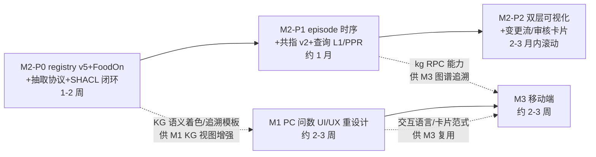

# 食品行业 KB+Agent 产品三大需求实施总纲（M1 UI/UX 重设计 / M2 本体+KG+AI 重建 / M3 移动端）

> 规划日期：2026-09-17。规划者：Loop Planner（三路调研 + 主任务综合）。
> 调研依据：[本体+KG+AI L4 深度调研](../../research/2026-09-17-ontology-kg-ai-deep-research.md)（real-deep-research，1205 行，17 分支饱和）、[移动端原型拆解 + 现状 UX 诊断](../../research/2026-09-17-mobile-prototype-analysis.md)（chrome-devtools 实测 9 路由 + 10 张截图 + 18 条痛点）、[现有 KG 链路审计结论](../../research/2026-09-17-ontology-kg-ai-deep-research.md)（第 2 章，实测 1159 节点/855 边/163 共指/islands=343/coverage=49.7%）。

## 0. 用户原始需求（逐字锚定）

1. **UI/UX**：五源问数（数仓/知识库/业务平台/数据资产/连接器）页面"uiux 都不行，没有从用户角度创新设计，尤其交互"。
2. **KG 重建**：面向食品公司交付，需要本体构建 + 知识图谱构建；现状"图谱很烂，就是个关系图"，未利用 LLM+五源构建；要求**实现前先 real-deep-research**（已完成）；数据先行、AI 分析、手动修改、AI 语义化修改四能力。
3. **移动端**：参考 https://ecsw7ghbbjljmplh3de2jz5yni.demo.lzqz.cn/login；对话框不必有真人（NocoBase AI 员工 + AI 填表助手）；dsh 与移动端数据互通；dsh PC 端加 iframe 移动端展示页。

## 1. 目标摘要

| 批次 | 一句话目标 | 核心交付 |
|---|---|---|
| M1 | PC 问数工作台从"工具面板"重构为"任务导向的问数体验"：答案可溯源、结果可联动、业务可直达 | 答案来源卡、零依赖图表/数字卡、经营概览首页、业务页四改造、KG 视图时效与追溯模板 |
| M2 | 按调研选型（方案 A 纯 TS 自研增强）重建 KG 链路：registry v5 + FoodOn 锚点 + SHACL 闭环 + episode 时序，覆盖四能力 | 本体工作台（可编辑）、AI 抽取闭环、AI 语义化改图（diff/审计/回滚）、kg_query L1+PPR |
| M3 | DSH 侧移动端（四 Tab：消息/工作台/数据/我的），AI 员工对话 + AI 填表任务卡，同一 SQLite/KB 数据链，PC 端 iframe 预览页 | /mobile 移动入口、任务卡填表范式、PC"移动端预览"视图、端到端旅程贯通 |

## 2. 关键调研结论（决策依据，摘录）

### 2.1 选型结论（M2 依据，L4 调研第 9 章）

- **所有候选框架整包引入均不可行**（Neo4j LLM Graph Builder / GraphRAG / LightRAG / LlamaIndex / Graphiti / OpenSPG / DeepKE 全部 Python/Java 栈，与全 TS + ESM + 无 Python 运行时冲突），**架构借鉴均可行且必要**。
- **🥇 方案 A：纯 TS 自研增强管线**（唯一主路线）——以现有 [kg-build](../../packages/kb/kg-build/src)/[kb-graph](../../packages/kb/kb-graph/src)/[kb-graph-sqlite](../../packages/kb/kb-graph-sqlite) 为骨架，8 层注入（FoodOn/SPG/KGCL → registry v5；Instruct-KGC/ODKE+ → 抽取；SHACL+kg-correction-loop → 校验；Splink/MatchGPT/Graphiti → 对齐；Graphiti → 时序；HippoRAG/GraphRAG local → 查询；graphology → 算法；WebProtégé → 可视化）。约 8 个 PR 级增量，2-3 人月。
- **🥈 方案 B**（shacl-engine+n3+graphology 直引）为校验层/RDF 层备选；**🥉 方案 C**（Graphiti Python sidecar）仅应急对照，不进产品链路。
- **FoodOn**（39,682 terms，CC-BY-4.0）零许可障碍，但必须裁剪 5 棵子树 + 单继承化，registry v5 增 foodon_uri/foodon_id/ontology_xref 字段。
- **负面清单**：不引入 Kuzu（已归档）、不做自由 Text2Cypher、OWL 推理仅可选 sidecar。

### 2.2 移动端原型拆解（M3 依据，实测）

- 登录为 mock 鉴权（任意 6 位验证码），9 路由全部实测：**消息即首页**（AI 员工会话与人类会话混排、徽章区分）、四 Tab（消息/工作台/数据/我的）、最深 3 级。
- 对话式 UI 三件套：可折叠「本轮调用链」面板 +「正在调用…」状态行 + 结构化结果卡（内嵌跨端动作按钮）。
- **AI 填表范式**：AI 产出不直接执行 → 任务卡（6 字段 AI 预填 + 执行时间线归因 + 支撑数据区）→ 人只做「驳回/推送」双动作审批。
- 视觉令牌：藏青 `#192b4d` 主色 + 绿 `#31a545` 语义色、Noto Sans SC、高密度 B 端小字阶。15 项可移植要素见调研报告第一部分 §7。

### 2.3 现状诊断核心事实（M1/M3 依据，只读盘点）

- **技术栈修正**：DSH Web 是 **React 18 + Vite + CSS Modules 的插件式 slot 架构**（[seed.ts](../../packages/client/web/src/seed.ts) 平台模块表；boot manifest 动态装载客户端插件 bundle），不是"Preact/htm 无构建栈"。`ui-enterprise` 不存在——业务页是 [ui-business](../../packages/client/ui-business/src)，市场页是 [ui-assets](../../packages/client/ui-assets/src)。
- **无路由**：页面是"会话内视图环"（`conversation.view` slot：chat/kb/scenarios/market/connectors/kg/business/trajectory 八视图）。
- **图表能力为零**：全仓无 echarts/recharts/d3/@antv；数值结果只能 markdown 表格。
- **KG 视图 read-only by design**：[KgView.tsx](../../packages/client/ui-kg/src/client/KgView.tsx) 无本体编辑、无 kg-template 确认流 UI；短语查询仅三内置离线模板（在线走 [kg-nl.ts](../../packages/kb/kb-graph/src/kg-nl.ts) 编译器）；hops≤2。
- **数据互通现状**：DSH 侧 SQLite ×3（[examples/kb-agent/workspace/](../../examples/kb-agent/workspace) 下 kb.sqlite / kg-graph.sqlite / lakehouse-catalog.sqlite）+ NocoBase PostgreSQL（95 collection），全部经 REST 互通（tool-nocobase 五工具 + apiproxy nocobase 只读三方法）；断点：KG/lakehouse 是时点快照无增量调度、单租户 demo-food-co 无鉴权、双 AI 栈独立（DSH agent vs NocoBase plugin-ai AI 员工）、云端移动原型未接数据链。
- **NocoBase 移动端**：plugin-mobile/plugin-mobile-client 已废弃（2.x 归 plugin-ui-layout，仍在开发）——M3 不押注 NocoBase 侧移动布局。
- **端口澄清**：dsh web 实际监听 3080（[cordis.patch.yml](../../examples/kb-agent/cordis.patch.yml) webserver config）；13000 是 NocoBase（nocobaseProxyOrigin）。webserver 已有 `/nocobase` 同源反代先例（剥 framing guards，见 [nocobase-proxy.ts](../../packages/host/webserver/src/nocobase-proxy.ts)）——M3 iframe 展示页直接复用此模式。

## 3. 批次依赖与排期总览

- **M1 与 M2-P0 可并行启动**（包面不重叠：M1 在 packages/client/ui-conversation/ui-business/ui-kb/ui-assets；M2 在 packages/kb/*、apiproxy kg 域、ui-kg）。
- **M3 壳开发可与 M2-P1 并行**，数据接通（kg 追溯 RPC、任务卡写流）在 M2-P1 落地后联调。
- 建议主线顺序：M1 → M2（P0→P1→P2）→ M3 收尾联调 → 总体验收剧本。

## 4. 总体验收剧本（端到端用户旅程，真实实跑）

**角色**：食品公司业务员（张红喜方案的最终使用者）。

1. **移动端登录**：手机（390×844 viewport）打开 `http://<host>:3080/mobile` → 验证码登录 → 落"消息"Tab，AI 员工会话（企业数据助理/食安合规官）置顶带 AI 徽章。
2. **AI 对话问数**：向 AI 员工提问"宏发食品这个月出口了哪些产品、金额多少" → AI 调 lakehouse/kb → 结果卡（数字卡+表格+来源徽标）内嵌"推送到 PC"动作；折叠"本轮调用链"可见 lakehouse_query 已执行 SQL。
3. **KG 可视化追溯**：追问"宏发食品的供应商链条，豆腐用的大豆来自谁" → 任务卡/结果卡给出 kg 追溯子图链接 → 数据 Tab 打开 KG 精简视图（语义分层着色、来源 asserted_by 徽标）→ 点节点见 FoodOn 映射 URI 与证据边。
4. **AI 填表**：工作台 Tab →"新增供应商开发记录"智能表单 → AI 预填任务卡（拍照 OCR/语音/表单三通道录入）→ 业务员修正 1 字段 →「推送」双动作审批落 NocoBase（SRM collection 行）。
5. **PC 端联动**：回到 PC 打开 dsh web（3080）→ 同一业务对象在业务管理页可见（同一 SQLite/PG 数据）→ 会话内点"移动端预览"视图 → iframe 手机壳内复现步骤 2-4 的移动界面；KG 工作台内对"供应商关系"做一次 AI 语义化修改（NL 指令 → diff 预览 → 确认 → episode 记录 → 一键回滚）。
6. **证据**：全程 chrome-devtools 真实浏览器截图（移动 + PC 双 viewport）+ record-browser-gif 录制端到端 GIF 附 PR + 会话日志（.dsh session）留档。

## 5. 全局技术决策（三批次共同遵守）

| 决策 | 内容 | 依据 |
|---|---|---|
| D1 移动端落点 | DSH 侧 `/mobile` 独立入口（webserver 静态注入 + 复用平台模块表），不做 NocoBase plugin-mobile 押注 | plugin-mobile 已废弃；apiproxy 24 RPC 域已具备只读面+sessions 对话面 |
| D2 图表策略 | M1 先零依赖（SVG 数字卡/条形/迷你折线），全量图表库引入留 M1 内部评估门禁（bundle/vendor chunk 约束） | vendor chunk 规则（[vite.config.ts](../../apps/web/vite.config.ts)）；痛点优先级 |
| D3 KG 主路线 | 方案 A 纯 TS 自研增强；保留七列锚幂等写/双时态 tombstone/闭集防幻觉链/模板优先查询资产 | L4 调研第 9 章唯一主路线 |
| D4 双 AI 栈收敛 | 移动端对话入口统一走 DSH agent（sessions RPC）；NocoBase AI 员工保留业务平台侧（n18ai 运行时配置不迁移源码） | 痛点 17；NocoBase local-modifications 为空的事实 |
| D5 测试与证据 | 每批次：keyless 快照（真实 runnable example）+ 真实 API 实跑（DEEPSEEK_API_KEY）+ 浏览器截图/GIF + 张红喜场景回归 + Agent Note 同 PR | 仓库 AGENTS.md 测试政策；用户真实实跑偏好 |
| D6 快照口径修正 | 图规模基线以 2026-09-17 实测 1159/855/163 为准（1093/665/134 为旧快照） | L4 调研第 11 章勘误表 |

## 6. 分批文档索引

- [01-m1-dsh-web-ux-redesign.md](01-m1-dsh-web-ux-redesign.md) —— 批次 1：PC 问数界面信息架构与交互重设计（design-workflow 多 agent 流程）
- [02-m2-ontology-kg-ai-rebuild.md](02-m2-ontology-kg-ai-rebuild.md) —— 批次 2：本体+KG+AI 重建（P0/P1/P2 三段，方案 A 落地）
- [03-m3-mobile-client.md](03-m3-mobile-client.md) —— 批次 3：移动端 + AI 填表助手 + PC iframe 预览

## 7. 总体风险与缓解

| 风险 | 影响 | 缓解 |
|---|---|---|
| M2 工程量（2-3 人月）超单轮 Loop 承载 | 交付延期 | 严格按 P0/P1/P2 切批，每段独立可验收可回滚；P0 即产出可见价值（FoodOn 映射+校验闭环） |
| Instruct-KGC 协议中文语料效果未验证 | 抽取质量 | P0 先 A/B（vs 现有闭集 prompt），hits@5 + 人工抽检双门禁，不过则保留现有 prompt 仅叠加 SHACL 闭环 |
| AI 改图指令歧义引发错误数据 | 数据安全 | 强制 diff 预览 + 人工确认位 + episode 回滚（成功率 100% 验收锚点） |
| 移动端鉴权缺失（单租户 disk-level 立场） | M3 上线边界 | M3 范围内做最小会话绑定（复用 sessions RPC 身份），多租户改造单列后续批次不入本轮 |
| MiniMax 并行 tool-call id 缺陷 / dev server 模块图冻结 | 实跑验证 | 沿用既有规避：串行 tool-call、验证前重启 web 进程（历轮教训沉淀） |
