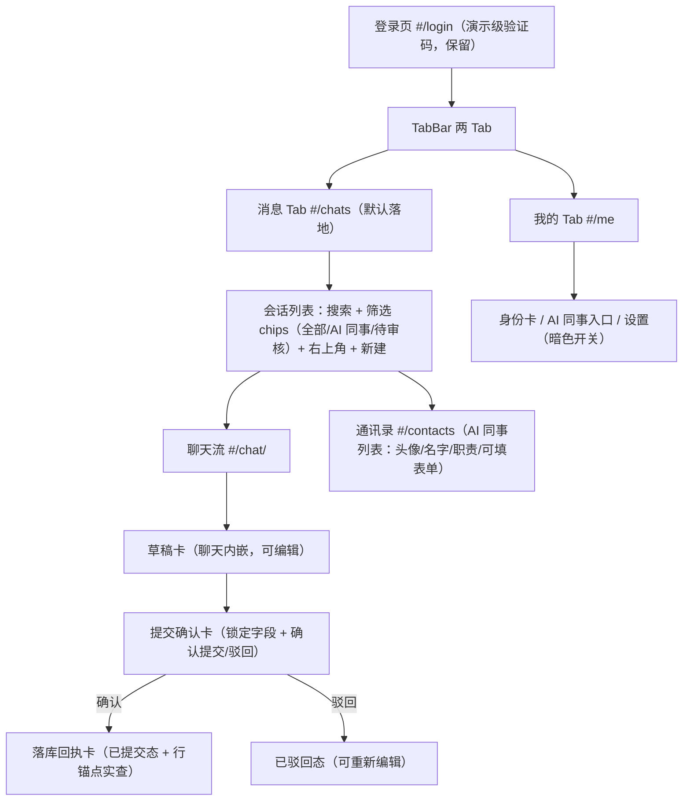
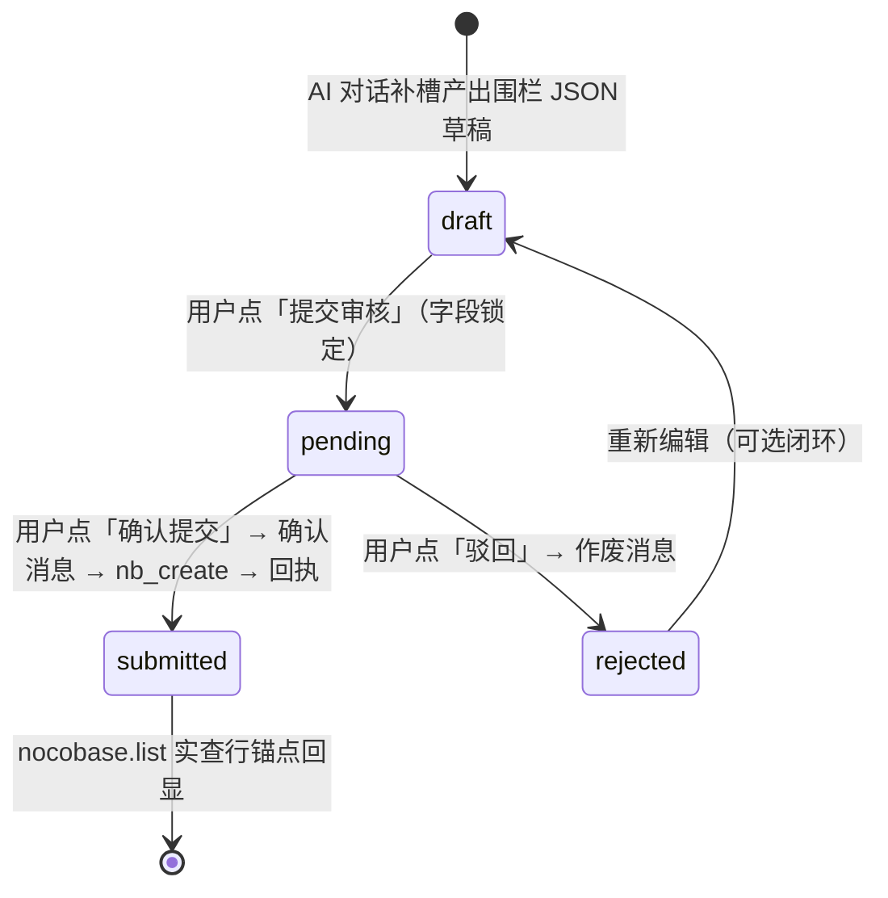

# 移动端 v2 重做计划：AI 同事 —— NocoBase 业务系统的 AI 员工入口

> 日期：2026-09-20 | 状态：已评审待实施 | 前置：plans/2026-09-17-kg-mobile-ux（M1–M3，v1 交付批次）

## 1. 目标摘要

把 `/mobile` 从"DSH 手机版四 Tab 问数壳"重做为 **NocoBase 业务系统的 AI 员工入口**：

- **微信式聊天范式**：会话列表 → 聊天流，对端全部是 AI 同事（AI 员工人设：采购助理/品控助手/经营参谋等）；
- **填表+提交闭环升级**：PC 端只辅助填不提交；移动端要"填表+提交"，且提交前有**卡片让人选择/判断/审核**（草稿卡可编辑 → 提交确认卡人审 → 落库回执 → 可驳回重填）；
- **UIUX 达到设计感标准**：引入开源组件库（antd-mobile v5），设计令牌对齐 FoodOperation 原型实测值；
- 复用 v1 全部底层资产（RPC 线/托管链/预设契约/验收链路），只重写 UI 树与交互范式。

用户原话（方向性否决 v1）："我要的不是 dsh 的手机版，而是 nocobase 业务系统的 AI 员工，以及 AI 协助填表的功能（和 pc 不同，pc 只是辅助填写表，但没有提交，手机端需要填表+提交，这个需要有卡片让人来选择判断审核），界面就类似微信聊天，不过都是 AI 同事……uiux 要有设计感，该用开源库就用或组件库。"

## 2. 调研输入（四份实证报告）

| 调研 | 报告 | 关键结论 |
|---|---|---|
| A 原型拆解 | [research/2026-09-20-foodoperation-mobile/2026-09-20-foodoperation-mobile-teardown.md](../../research/2026-09-20-foodoperation-mobile/2026-09-20-foodoperation-mobile-teardown.md)（14 张截图同目录） | 微信式 IA 可抄：会话列表六要素（渐变头像/名称/类型标签/摘要/时间/未读角标）+AI 左/用户右气泡（16px 圆角+4px 小角）+双卡范式（渐变发现卡+白底任务卡 label:value+主/次双按钮）+任务卡详情页（时间轴+sticky 驳回/推送）。全套设计令牌实测（主色 `#192b4d`）。原型零后端、草稿卡不可编辑、状态机仅两态——均为 v2 要补的缺口 |
| B 组件库选型 | [research/2026-09-20-mobile-v2-component-library-selection.md](../../research/2026-09-20-mobile-v2-component-library-selection.md) | **首选 antd-mobile v5**（18/18 组件覆盖、纯 `--adm-*` CSS 变量主题、Vite 零配置按需、MIT、12k★/6.4 万周下载/持续发版）；备选 tdesign-mobile-react。`@ant-design/x` peer 强制完整 antd（+445KB gzip、cssinjs、桌面优先）不采用。**聊天流自绘**是业界共识边界（antd-mobile v5 已移除 Chat 组件） |
| C NocoBase 数据面 | 任务报告（2026-09-20，只读 DB 实查） | `aiEmployees` 表 9 行（username 主键/nickname/position/avatar/bio/about/defaultPrompt/greeting/skillSettings 等 jsonb）+ `users` 镜像行 + `llmServices`；n18ai = 部署脚本 uid 前缀（46 条 AIEmployeeButtonModel）；业务表 65 张全有数据（hub_po 三表 6/7/13 行；hub_po_purchase_orders 字段：po_number/status(select)/total(number)/order_date(date)/supplier m2o/owner）；**M3 落库实证行 `PO-M3-20260918-01`（1600/宏发食品/pending）**；hub_po 域零审批流（4 条 workflow 都在别的 collection）；两套对话引擎（NocoBase plugin-ai vs dsh sessions）互不相通，M3 决策 D4 已拍板移动端统一走 dsh agent |
| D dsh RPC/托管面 | 任务报告（2026-09-20） | apiproxy 88 个 unary RPC + `events.mux`/`events.host` WS 推送流（12 种 mux 帧，downlink-only，`since` 续传未实现）+ `POST /api/respond`；**`nocobase.create` 有意缺席**（写走 agent `nb_create` 确认流）；无未读数、无 session.delete、agentPreset 无 update（copy-only）；鉴权=同源+Host 栅栏（明确不是认证），mobile 页为演示级 6 位码；/mobile 托管（mobileEnabled 默认 false）与 PC iframe 预览（conversation.view slot）稳定；v1 e2e/golden：mobile-shell / mobile-assistant / mobile-preview-iframe |

规划者亲手点验：[rpc.ts](../../packages/client/ui-mobile/src/client/rpc.ts)、[form-draft.ts](../../packages/client/ui-mobile/src/client/form-draft.ts)、[sessionsService.ts](../../packages/client/ui-mobile/src/client/sessionsService.ts)、[agent.cordis.yml](../../examples/kb-agent/agent-presets/mobile-form-assistant/agent.cordis.yml)、[M3 Agent Note](../../.agents/notes/implemented/architecture/2026-09-18-m3-mobile-client.md)。

## 3. 关键技术裁决

| # | 裁决 | 理由（证据） |
|---|---|---|
| D1 | **信息架构：两 Tab（消息、我的）**，通讯录为消息页二级页 | v1 四 Tab 是 DSH 问数壳的照搬，正是被否定的部分；"类似微信聊天"聚焦 AI 同事对话。工作台/数据的问数能力改由"经营参谋"AI 同事对话承载。TabBar 加项可回退，不动消息 Tab 结构 |
| D2 | **对话引擎：dsh sessions + agentPreset**（沿用 M3 决策 D4） | 填表闭环靠 agent `nb_create` 确认流直写 PG（M3 已实证）；NocoBase plugin-ai 是另一套存储（aiConversations/aiMessages）且 formFiller 只填前端表单不提交；两套互通是全新工程，不划算 |
| D3 | **AI 同事元数据：agentPreset 驱动 + 渐变头像本地映射**；aiEmployees 表打通列为后续可选 | `agentPreset.list` 已有 name/description/isDefault（sessionsService.listAiEmployees 现役）；aiEmployees 读取需新增 wire 面（apiproxy 无此 RPC），不阻塞主线 |
| D4 | **提交落库：写走 agent `nb_create` 确认流**，不上 `nocobase.create` wire 方法 | apiproxy reads-first 是有意设计（nocobase.ts 头注释明示）；durable log 是用户确认字段的唯一审计（M3 Note）；`nocobase.update` 仅白名单低风险字段且需 `nocobaseWriteEnabled` |
| D5 | **推送：批次 1/2 先沿用轮询**（1.2s 运行/5s 空闲），events.mux WS 列为后续增强 | mux 流 `since` 续传未实现（重连=重开流+重拉 history）；移动页是静态入口，接 WS 需自写轻量客户端；轮询已被 M3 验证够用。避免 UI 重写与通道替换两个风险叠加 |
| D6 | **任务卡状态：从会话事件流派生**（fold 重放），编辑中草稿 localStorage 暂存 | 刷新恢复走 `session.history` 重放（M3 现状）；仅"用户编辑未提交"的值补 localStorage（轻量、不新建表）；确认/驳回动作本身是会话消息，天然持久化且 PC iframe 预览一致 |
| D7 | **全部数据走 apiproxy 单网关（同源）**，不直连 NocoBase API | /mobile 与 /api 同源免凭证；直连需新认证层且现状无认证体系；业务表读写已经由 nocobase.* RPC + nb_* 工具闭环 |
| D8 | **组件库 antd-mobile v5 + 聊天流自绘** | B 报告结论；与 `.dshm-root` scoped CSS 变量零冲突，`--adm-*` 在容器上覆盖即级联 |

## 4. v1 资产处置清单

### 4.1 保留复用（不动）

| 资产 | 位置 | 说明 |
|---|---|---|
| RPC 客户端 | `packages/client/ui-mobile/src/client/rpc.ts` | 12 方法窄化的同源 wire；v2 增补 `session.search` 等方法名即可 |
| 会话服务 | `packages/client/ui-mobile/src/client/sessionsService.ts` | list/readHistory/create/prompt/rename + listAiEmployees（agentPreset.list 映射） |
| Fold 投影 | `packages/client/ui-mobile/src/client/fold.ts` | wire 事件的第二消费者；两个存储事实（`data.message.content`、结果块 `toolCallId`+`isError`）已固化，v2 聊天流仍用此投影 |
| 围栏 JSON 契约 | `packages/client/ui-mobile/src/client/form-draft.ts` | FormDraft/PushReceipt 解析保留；提交确认卡沿用"确认推送：…最终字段 JSON…"消息契约 |
| Hash 路由 | `packages/client/ui-mobile/src/client/router.ts` | `#/chats`、`#/chat/<id>` 等新路由在此扩展 |
| /mobile 托管链 | `apps/web/mobile.html` + `apps/web/src/mobile.ts` + `apps/web/vite.config.ts` 双入口 + `packages/bundle/web-app/src/index.ts`（mobileEnabled）+ `examples/kb-agent/cordis.patch.yml` | 与 UI 无关，全保留 |
| PC iframe 预览 | `packages/client/ui-mobile-preview/`（conversation.view slot id `mobile-preview`） | 挂载机制保留；bezel 视图随新 UI 自动生效，golden 重录 |
| mobile-form-assistant 预设 | `examples/kb-agent/agent-presets/mobile-form-assistant/` | persona 6 步契约保留；批次 2 按提交确认卡微调措辞（同步 form-draft 解析） |
| 托管/预览测试 | `packages/bundle/web-app/tests/`、`packages/client/ui-mobile-preview/tests/` | 不依赖 UI 内容 |

### 4.2 改造

| 资产 | 改造内容 |
|---|---|
| `packages/client/ui-mobile/src/client/shell/MobileShell.tsx` | 四 Tab → 两 Tab（消息/我的）；引入 antd-mobile TabBar |
| `packages/client/ui-mobile/src/client/tokens.css` | 换 v2 令牌（§7 令牌表）；叠加 `--adm-*` 覆盖 |
| `packages/client/ui-mobile/src/client/messages/MessagesView.tsx` | 重写为微信式会话列表（六要素+筛选 chips+搜索+未读占位） |
| `packages/client/ui-mobile/src/client/messages/ChatView.tsx` | 重写为聊天流（气泡分侧/日期分隔/工具行/thinking/快捷指令）；任务卡/回执实查逻辑改造保留 |
| `packages/client/ui-mobile/src/client/forms/TaskCardView.tsx` | 拆为草稿卡（可编辑）+ 提交确认卡（人审）双态组件；字段控件按 collection 字段类型适配（§6.3） |
| `packages/client/ui-mobile/src/client/login/LoginView.tsx` | 视觉对齐原型（验证码登录形态保留演示级） |
| `packages/client/ui-mobile/src/client/profile/ProfileView.tsx` | 收编原"我的"，含 AI 同事通讯录入口 |
| `packages/client/ui-mobile/src/client/workbench/`、`data/`、`kg/` | 废弃四 Tab 视图；kg 证据卡逻辑并入"经营参谋"聊天流的消息渲染 |
| e2e/golden | `apps/web/tests/mobile-shell.e2e.ts`、`mobile-assistant.e2e.ts`、`mobile-preview-iframe.e2e.ts` + `apps/web/tests/snapshots/mobile-*` 全部重录（seed.jsonl 种子模式保留） |

### 4.3 废弃

- 四 Tab 信息架构（WorkbenchView/DataView 作为独立 Tab 页面）；
- `views.client.spec.tsx` 中与旧视图绑定的用例（随重写更替）。

## 5. 信息架构（D1 裁决）

会话列表项六要素（对齐原型 §5 实测）：语义渐变头像（AI 同事=primary→info 蓝；可按同事色相偏移）｜名称+类型标签（AI/待审核）｜最后消息摘要｜时间（刚刚/10:32/昨天）｜未读角标（红色，D6：以"运行中/新事件未读"本地派生，刷新重置——wire 无未读计数，如实标注为本地态）。

## 6. AI 同事体系与填表闭环

### 6.1 AI 同事集合（批次 2 落地）

| 同事 | preset id | 职责 | 可填表单（collection） | 工具面 |
|---|---|---|---|---|
| 采购助理 | `purchase-assistant`（新增） | 采购单/供应商登记与查询 | `hub_po_suppliers`、`hub_po_purchase_orders`（→`hub_po_items`） | nb_* + 填表 persona |
| 品控助手 | `quality-assistant`（新增） | 审核/整改单据登记 | `srm_audit_checklists`、`srm_capas` | nb_* + 填表 persona |
| 经营参谋 | `business-advisor`（新增） | 经营洞察问答（只读） | 不可填表 | lakehouse.overview / kg.search / kg.subgraph |
| 智能表单助手 | `mobile-form-assistant`（保留） | 通用业务单据登记 | 任意 collection（persona 引导） | nb_* |

预设落位 `examples/kb-agent/agent-presets/<id>/{preset.yml, agent.cordis.yml}`（既有体系）；persona 以 mobile-form-assistant 6 步契约为模板。

### 6.2 填表+提交+审核卡状态机

- **草稿卡（draft）**：白底卡 label:value + 字段可编辑。控件按 `nocobase.listMeta` 的字段 interface 映射：input→Input、number→Stepper/Input、select→Picker（如 status: draft/sent/received/cancelled）、date→DatePicker、bool→Switch、m2o→Picker（选项经 nocobase.list 拉目标表）——这就是"选择/判断控件"的落地。
- **提交确认卡（pending，人审）**：锁定编辑，展示最终字段（用户改过的值高亮 diff），底部双按钮「确认提交（主）/驳回（ghost）」。动作=发一条会话消息（沿用 M3 契约："确认推送：请按以下最终字段值调用 nb_create…" / 驳回则发作废消息），agent 执行 nb_create（预览→go-ahead→回执内置确认流）。
- **落库回执卡（submitted）**：`parsePushReceipt` 锚定行 id → `nocobase.list` filter id 实查活行回显（不信 agent 口头回执，M3 现状改造保留）。
- **已驳回（rejected）**：destructive 色 + 「重新编辑」回到 draft。
- 状态视觉映射：draft=muted/info、pending=warning、submitted=success、rejected=destructive（补全原型缺失的两态之外的终态视觉）。

### 6.3 编辑值持久化（D6）

draft 态的未提交编辑值写 localStorage（key 按 sessionId+草稿序号）；确认/驳回/回执均为会话消息，刷新经 `session.history` 重放 fold 重建卡片状态，与 PC iframe 预览天然一致。

## 7. UIUX 方案

### 7.1 设计令牌（对齐原型实测，落入 tokens.css）

| 令牌 | 值 | 用途 |
|---|---|---|
| `--dshm-primary` | `#192b4d` | 主色（Tab 激活/用户气泡/主按钮） |
| `--dshm-info` / `--dshm-success` / `--dshm-warning` / `--dshm-destructive` | `#3c83f6` / `#31a545` / `#ed6e0c` / `#ef4343` | AI 头像渐变终点/完成态/待审与高优/未读角标与驳回 |
| `--dshm-background` / `--dshm-card` / `--dshm-muted` | `#ffffff` / `#fbfcfd` / `#f2f4f8` | 页面底/卡片底/搜索框与 chips |
| `--dshm-foreground` / `--dshm-muted-foreground` / `--dshm-border` | `#1d283a` / `#65758b` / `#e0e5eb` | 主文字/次要文字/hairline |
| 圆角 | 基础 8 / 卡片与气泡 16（小角 4）/ 按钮详情页 12 | 原型层级 |
| 字体 | `"Noto Sans SC", -apple-system, system-ui, …`；字号 14/12/11/10 | 原型实测 |
| 图标 | lucide-react（sparkles=AI、send、plus…） | 原型同款，antd-mobile 图标可混用 |

antd-mobile 主题：在 `.dshm-root` 上覆盖 `--adm-color-primary: #192b4d` 等语义色（B 报告 §6 覆盖清单）。

### 7.2 组件分工（antd-mobile vs 自绘）

- **库**：NavBar/TabBar/SafeArea、Form+Input/TextArea/Picker/DatePicker/Cascader/Switch/Radio/Checkbox/Stepper（草稿卡字段）、Dialog/Toast/Popup（确认弹层）、Badge/Tag/Avatar、Steps/Progress（状态流转）、SwipeAction（会话列表左滑）、InfiniteScroll/PullToRefresh。
- **自绘**（CSS Modules，`.dshm-root` 作用域）：会话列表项、聊天气泡（左右分侧 16px+4px 小角、max-width 72%、伪元素尾巴）、消息流容器（column-reverse 锚底、visualViewport 键盘适配、日期分隔）、底部输入条（+ 快捷指令 chips）、草稿卡/提交确认卡/回执卡外壳。

### 7.3 暗色与性能

- 暗色：antd-mobile `data-prefers-color-scheme="dark"`（实验性）+ `.dshm-root` 自持第二套变量双轨；「我的」页放开关；批次 2 打磨项，不阻塞验收。
- 性能：antd-mobile 按需（tree-shaking 零配置）；会话百条量级直接渲染；新依赖需过 `verify-dsh-package-licenses`（MIT✓）与 third-party-notices 再生；首屏 bundle 以构建 profile 记录进验收证据。

## 8. 数据与互通

| 数据 | 模型 | 通道 |
|---|---|---|
| 会话 | dsh session 日志（jsonl 持久化，重启可恢复） | session.list/search/history/create/prompt/rename |
| AI 同事 | agentPreset（examples/kb-agent/agent-presets/）+ 渐变头像本地映射 | agentPreset.list；（可选后续）aiEmployees 元数据读通道 |
| 任务卡 | 从会话事件流派生（fold 重放）；draft 编辑值 localStorage | 无独立存储（D6 裁决：不新建 PG 表） |
| 业务表读写 | PG via NocoBase | 读 nocobase.listMeta/list；写 agent nb_create 确认流（D4） |
| PC 端 | ui-mobile-preview iframe 保留；同 hash 深链 | 不变 |

明确不做：NocoBase plugin-mobile（官方已废弃）；移动端直连 NocoBase API；`nocobase.create` wire 方法。

## 9. 批次划分

| 批次 | 文件 | 范围 | 依赖 |
|---|---|---|---|
| 批次 1：壳+聊天流+AI 同事列表 | [01-shell-chat.md](01-shell-chat.md) | antd-mobile 引入+令牌落地；两 Tab 壳；会话列表（六要素/搜索/筛选）；聊天流（气泡/日期分隔/工具行/thinking/快捷指令）；通讯录；登录页视觉升级；e2e 重录 shell+chat | 无（全部改造在 ui-mobile 包内） |
| 批次 2：填表审核闭环+提交落库 | [02-form-submit-loop.md](02-form-submit-loop.md) | 草稿卡可编辑控件（字段类型映射）；提交确认卡（人审 diff+双按钮）；回执实查；驳回重填；三个新 AI 同事预设；localStorage 暂存；mobile-assistant e2e 重录+PG 实查验收；暗色打磨 | 批次 1 |

工作量估计：批次 1 约 2–3 个工作日（UI 重写为主，逻辑层复用）；批次 2 约 2–3 个工作日（卡片状态机+预设+验收链）。

## 10. 验收标准（统一口径，每批适用）

1. **真实浏览器 390×844 截图**：`examples/kb-agent/demos/mobile-v2/`（按旅程编号存档；批次 2 的提交闭环须全链截图：补槽→草稿编辑→提交审核→确认→回执实查）；GUI 行为变更按仓库惯例附 record-browser-gif。
2. **提交落库 PG 实查**（批次 2）：`psql` SELECT 断言新行（对照 `PO-M3-20260918-01` 先例，记录 collection/字段值/行 id）；驳回路径断言零新增行。
3. **e2e 快照**：`pnpm run test:web -- mobile-shell / mobile-chat（新）/ mobile-assistant / mobile-preview-iframe` 全绿，golden 重录（seed.jsonl 种子模式）。
4. **单测**：`packages/client/ui-mobile/tests/` per-file 100%（仓库门禁）；`pnpm run build` + `pnpm run hygiene`（含 license/notices 门禁）通过。
5. PC iframe 预览打开 /mobile 呈现同款 v2 界面（深链 hash 一致）。

## 11. 风险与缓解

| 风险 | 缓解 |
|---|---|
| antd-mobile 引入对 staticLinked tsdown 打包/vite chunk 的影响 | 批次 1 第一步先做依赖引入+构建冒烟；过 verify-dsh-package-licenses（MIT）与 third-party-notices 再生 |
| e2e/golden 全部失效 | 预期内；seed.jsonl 种子+断言模式保留，只重录期望；不改造 normalizer |
| persona 契约变更与 form-draft 解析脱节 | 提交确认卡沿用既有消息格式（"确认推送…最终字段 JSON…"与回执正则），不改 wire 契约即零脱节；若改措辞必须同步 form-draft 测试 |
| wire 无未读计数/无 session.delete | 未读=本地派生态（刷新重置，UI 如实标注）；删除用既有 workspace.archiveSession 或不做 |
| WS 推送缺 since 续传 | D5：批次内不接 WS，轮询已验证；WS 增强单列后续 |
| 鉴权仍是演示级（trustedHosts 非认证） | 现状边界如实声明；公网部署前必须补认证层（超出本计划范围，记入债务） |
| `agentPreset.select` 仅 blank 会话可换 | 会话创建时绑定 preset（现役范式）；会话中换同事=新会话，UI 明示 |
