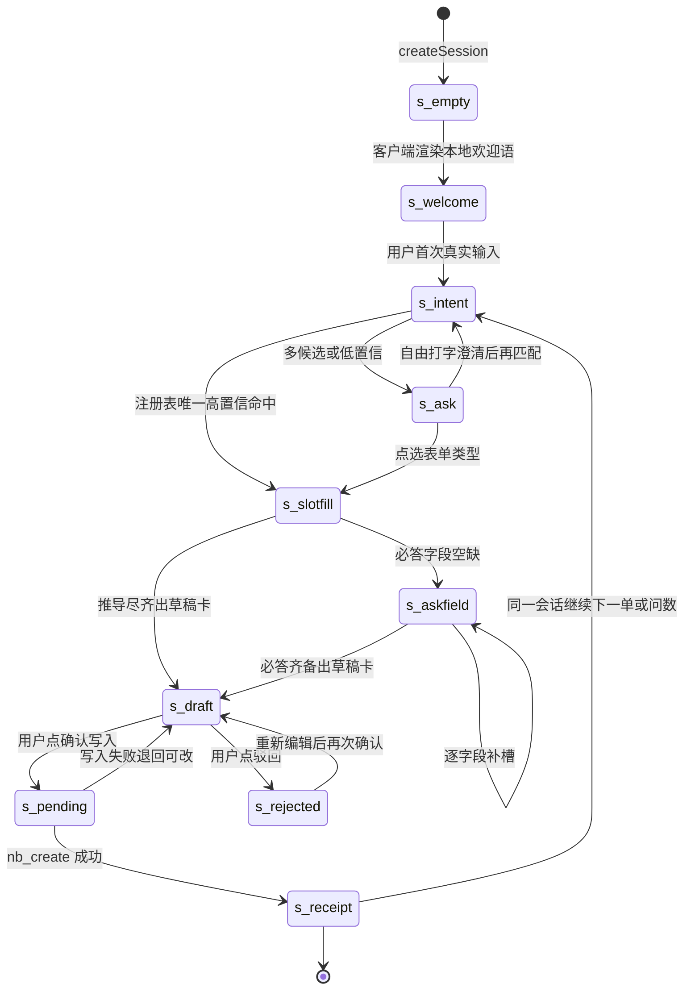
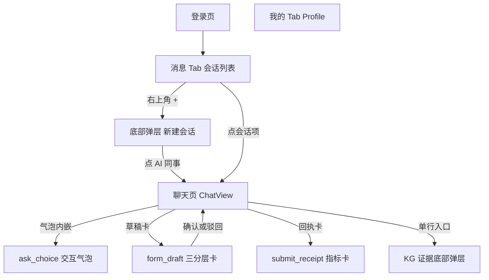

# 移动端 v3 重设计 · 信息架构与交互协议

> 日期：2026-09-21 | 作者：Design Agent（只做设计，不写代码） | 上游：[01-product-problem.md](01-product-problem.md) 的 ④ 行为规格与 ⑤ 验收标准，本文是其交互层落地 | 下游：[03-visual-design.md](03-visual-design.md) 消费本文的消息类型与组件清单；工程 Agent 按本文 §2 §3 §5 改造 [fold.ts](../../../packages/client/ui-mobile/src/client/fold.ts)、[cardState.ts](../../../packages/client/ui-mobile/src/client/cardState.ts) 与 [agent-presets](../../../examples/kb-agent/agent-presets/) | 视口基准：390×844。

设计总纲一句话：**移动端 v3 是"一句话登记一条单据"的闭环机**——AI 先说话、表单由意图匹配、字段按三分层最小问答、确认与驳回是结构化动作、落库给盖章回执。本文给出这台机器的状态机、消息协议、表单注册表、最终 IA 与预设契约改写要求。

## 1. 会话流状态机

### 1.1 状态机图



要点：`s_welcome` 不产生任何 user 消息（01 ④a）；`s_ask` 是"不确定即问，问即给选项"的分叉态（01 ③2）；`s_draft` 的进入条件是"推导尽齐"而非"字段全齐"（01 ④b 废除门闸）；`s_pending` 与 `s_rejected` 由用户动作消息驱动（01 ④f-1），跨设备由 durable log 重放一致（01 ④f-2）。

### 1.2 状态规格表

| 状态 | 触发条件 | 消息载荷（wire） | 前端渲染组件 | 落库动作 |
|---|---|---|---|---|
| `s_empty` | 用户在 `+` 弹层点某 AI 同事"发消息"，`createSession(preset)` 完成 | 无业务消息；log 仅含会话元事件 | ChatView 空壳 + 局部加载态 | 无 |
| `s_welcome` | 会话创建成功的同一帧，客户端本地渲染 | 无 wire 消息：欢迎语是 preset 元数据（§5.1），不进 durable log，不消耗模型回合 | WelcomeCard：身份头 + 能力清单 + 3 枚起点 chips；输入框空置聚焦 | 无 |
| `s_intent` | 用户真实输入文本或点选起点 chip / 选项 | 一条 `user/message`（`source.kind=user`，text=用户原话） | 用户气泡（右侧） | 无；AI 侧开始表单匹配（只读工具调用：注册表 + `nb_collections` 校验 + `nb_list` 查关联） |
| `s_ask` | 匹配得分多候选并列或最高分 < 3（§3.3） | 一条 assistant 消息：叙述段（一句人话）+ `ask_choice` 围栏（§2.3） | ChoiceBubble：问题文本 + 单选卡组（类型之问）或 chips 组（指代之问），free-text 兜底入口 | 无 |
| `s_slotfill` | 表单类型唯一确定（直匹配或点选后） | assistant 叙述段 + 只读工具行（查供应商 id 等） | AI 气泡（Markdown）+ 工具行（沿用 v2 折叠样式） | 无（只读工具） |
| `s_askfield` | 推导尽齐但 `tier:required` 字段仍有空缺 | 一条 assistant 消息：叙述段 + `ask_field` 围栏，一次只问一个字段 | FieldAskBubble：字段名 + 默认值建议 chip + 输入入口；点选/输入即作答回填 | 无 |
| `s_draft` | 必答齐备（或用户在草稿卡上直接补） | 一条 assistant 消息：叙述段（"草稿已备好，请过目"）+ `form_draft` 围栏 | DraftCard：相位戳=待确认；三分层分区（§2.3）；卡上"确认写入 / 驳回"双动作 | 无（等待人审） |
| `s_pending` | 用户点"确认写入" | 一条 user 动作消息：text="确认写入"+`form_confirm` 围栏（最终字段快照） | 动作徽标行（"你确认了这张采购单"）+ 卡片相位翻转为 提交中 | 无；AI 下一回合执行 `nb_create` |
| `s_receipt` | `nb_create` 成功返回 | 一条 assistant 消息：叙述段一句话 + `submit_receipt` 围栏 | ReceiptCard：盖章动效 + 记录行号大数 + 友好字段摘要 + 三步流程条 | `hub_*` 目标表新增一行（01 ⑤D4 实查验收） |
| `s_rejected` | 用户点"驳回" | 一条 user 动作消息：text="驳回"+`reject_flow` 围栏 | 动作徽标行（"你驳回了这张草稿"）+ 卡片相位翻转为 已驳回；"重新编辑"入口 | 无（驳回不触写工具） |
| 写入失败退回 | `nb_create` 报错 | assistant 叙述段说明原因，无围栏 | 原 pending 卡翻回 draft 可改态 + Toast 报错 | 无 |

### 1.3 驳回 → 重编辑分支

驳回后卡片进入 `rejected` 相位但不消失；卡上"重新编辑"把卡翻回可编辑态（纯前端态，无新消息）。用户改过的字段带 `edited:true` 标记，重编辑视图以 diff 高亮区分"我的修改"与"AI 预填"（01 ④f-6）。再次点"确认写入"发送新的 `form_confirm`（同一 `draftId`，`revision` 递增），旧 confirm 由 cardState 判别为已被新 revision 取代。重放规则：同一 `draftId` 取 revision 最大的 confirm 为准。

### 1.4 与 01 验收的映射

A1-A3 对应 `s_empty→s_welcome` 零 user 消息；B1-B3 对应 `s_askfield` 只问 `tier:required` 且 `s_draft` 三分区；C1-C4 对应所有围栏不进气泡（§2.4）；D1-D5 对应 `s_ask` 分叉与 `s_receipt` 落库实查；E1-E4 对应动作消息徽标与 rejected diff。

## 2. 结构化消息协议 v3

### 2.1 设计原则

**内容分级是契约**：assistant 消息 = 叙述段（人话，Markdown）+ 0..n 个结构化围栏（协议负载）；围栏内容永不以文本形态出现在气泡里（01 ②c 根因的解）。**模型可见 ⟺ 日志可重建**：所有影响交互的消息（询问、草稿、动作、回执）都在 durable log 里，重放零损失；唯一例外是 welcome（§2.2 注）。**动作结构化**：确认/驳回从"自然语言前缀+正则"（v2 [form-draft.ts:104-145](../../../packages/client/ui-mobile/src/client/form-draft.ts) 的 `parseConfirmPush` 与 [cardState.ts:44-67](../../../packages/client/ui-mobile/src/client/cardState.ts) 的前缀判别）换成围栏载荷判别——模型措辞漂移不再断链（01 ②f-1）。

### 2.2 消息类型总表

| # | 类型 | 方向 | 上 wire | 载荷形态 | 折叠产物（fold 输出） | 渲染组件 |
|---|---|---|---|---|---|---|
| 1 | `welcome` | AI 本地 | 否 | preset 元数据（§5.1），非消息 | 会话首条本地 item | WelcomeCard |
| 2 | `ask_choice` | assistant | 是 | 围栏 JSON | `ask` item（问题+选项组） | ChoiceBubble |
| 3 | `ask_field` | assistant | 是 | 围栏 JSON | `field-ask` item | FieldAskBubble |
| 4 | `form_draft` | assistant | 是 | 围栏 JSON | `task-card` item（v3 schema） | DraftCard |
| 5 | `form_confirm` | user 动作 | 是 | 短文本 + 围栏 JSON | `action` item + 卡片相位 pending | 卡上按钮 + ActionBadge |
| 6 | `reject_flow` | user 动作 | 是 | 短文本 + 围栏 JSON | `action` item + 卡片相位 rejected | 卡上按钮 + ActionBadge |
| 7 | `submit_receipt` | assistant | 是 | 围栏 JSON | `receipt` item | ReceiptCard |

welcome 不上 wire 的裁决依据：它是静态文案（preset 携带，跨设备天然一致）、标题生成不消费它（01 ④f-5）、模型无需见到它；上 wire 反而会诱惑未来的实现把它当回合触发器，重蹈 v2 伪造用户消息的覆辙。点选作答（ask_choice/ask_field 的回应）上 wire 为普通 user 文本消息，语义等价于所选文案（01 ⑤D3），见 §2.5。

### 2.3 围栏 JSON schema（v3 信封）

所有围栏共享信封字段：`v:3`（协议版本，旧客户端忽略未知围栏不崩溃）与 `type`（上表 2-7）。围栏语言标记固定 ```` ```dsh ````，与普通 ```` ```json ```` 代码块（问数场景的表格数据等）区分：`dsh` 围栏是协议、永不渲染为代码块，`json` 围栏按 Markdown 代码块渲染。以下 schema 均为 TypeScript 形态，字符串值一律字符串（数字也字符串化，沿用 v2 惯例）。

**`ask_choice`**——单选/多选询问。类型之问用 `mode:"single"` + 卡片形态；指代之问（供应商三选一）用 chips 形态；枚举之问用按钮组形态（形态选择规则见 [03-visual-design.md](03-visual-design.md) §4.2）。

```typescript
interface AskChoicePayload {
  v: 3
  type: 'ask_choice'
  id: string                       // 稳定 id，如 "choice_1"；作答匹配用
  mode: 'single' | 'multi'
  variant: 'cards' | 'chips' | 'buttons'   // 渲染形态建议，前端可按 options 数量覆写
  question: string                 // 一句人话问题，如 "这笔要登记成什么单据？"
  options: ReadonlyArray<{
    label: string                  // 选项主文案，如 "采购单"
    value: string                  // 语义值，如表单注册表的 collection 或选项 id
    hint?: string                  // 一行辅助说明，如 "向供应商买进 · 鲜丰作为供应商"
    send?: string                  // 点选后发出的 user 消息文案；缺省取 label
  }>
  allowFreeText: boolean           // true 时气泡尾部出现"自己打字说明"入口
}
```

**`ask_field`**——关键字段补槽，一次一个字段（01 ④b"≤3 个为常态，超限分批问"落在草稿卡"需要你定"区，本类型只处理推导都推不出、且卡还没出的场景）。

```typescript
interface AskFieldPayload {
  v: 3
  type: 'ask_field'
  id: string
  question: string                 // "这批冷链箱的数量是多少？"
  field: {
    name: string                   // 目标 collection 字段名（协议层用，不渲染）
    label: string                  // 业务语言字段名（渲染用）
    widget: 'text' | 'number' | 'date' | 'select' | 'relation'
    unit?: string                  // "箱" / "kg"，渲染在输入右侧
    suggestions?: ReadonlyArray<{ label: string; value: string; hint?: string }>
    // 常用：AI 推导的默认值建议以 chip 呈现，点选即答（01 ④b"推导值可改，但不问"的例外通道：
    // 当字段属于 tier:required 却有可建议值时，建议以可点选形态给出而非追问）
  }
}
```

**`form_draft`**——草稿卡载荷，字段三分层（01 ④b）。

```typescript
type FieldTier = 'required' | 'derived' | 'system'

interface FormField {
  name: string                     // collection 字段名（协议用）
  label: string                    // 业务语言字段名（渲染用，禁止 snake_case 直出）
  value: string | null             // null = 待用户定（仅 required 允许）
  tier: FieldTier                  // required=需要你定 / derived=AI 推导 / system=系统生成
  rationale?: string               // derived 依据文案："今天" / "500×32" / "按名称匹配"
  edited?: boolean                 // 用户改过（重编辑 diff 高亮用）
  widget: 'text' | 'number' | 'date' | 'select' | 'relation'
  options?: ReadonlyArray<{ label: string; value: string }>  // select/relation 的候选
}

interface FormDraftPayload {
  v: 3
  type: 'form_draft'
  draftId: string                  // "d_20260921_01"，动作消息与回执都锚定它
  revision: number                 // 同 draftId 再编辑递增，重放取最大 revision
  form: { collection: string; label: string }   // label=业务名"采购单"，卡头用
  title: string                    // 卡片标题，如 "宏发食品 · 冷链箱采购"
  fields: ReadonlyArray<FormField>
}
```

**`form_confirm`**（user 动作）——卡上"确认写入"按钮发出；text 固定"确认写入"（模型可读的自然语言），围栏是前端判别与重放的唯一依据。

```typescript
interface FormConfirmPayload {
  v: 3
  type: 'form_confirm'
  draftId: string
  revision: number                 // 确认的是哪个 revision 的字段快照
  form: { collection: string; label: string }
  fields: ReadonlyArray<{ name: string; label: string; value: string }>
}
```

**`reject_flow`**（user 动作）——卡上"驳回"按钮发出；text 固定"驳回"。

```typescript
interface RejectFlowPayload {
  v: 3
  type: 'reject_flow'
  draftId: string
  reason?: string                  // 可选一句话，来自驳回时的快捷原因 chips（§4.4）
}
```

**`submit_receipt`**——落库回执，assistant 在 `nb_create` 成功后发出。

```typescript
interface SubmitReceiptPayload {
  v: 3
  type: 'submit_receipt'
  draftId: string                  // 锚定回草稿卡，卡片最终翻转
  form: { collection: string; label: string }
  rowId: string                    // 落库行 id，渲染为编号大数 "№ 1042"
  summary: ReadonlyArray<{         // 2-4 条友好字段摘要（非裸 JSON，01 ②c）
    label: string                  // "合计金额"
    value: string                  // "¥16,000"
    kind: 'money' | 'date' | 'id' | 'count' | 'text'   // 指标卡排版变体
  }>
}
```

### 2.4 折叠规则与 fold.ts 改动需求

现 fold（[fold.ts:145-154](../../../packages/client/ui-mobile/src/client/fold.ts)）把 assistant 文本整体 join 成气泡再旁路解析草稿——JSON 既成卡又留气泡，是 C2/C4 验收的反面样本。v3 改动：

1. assistant 消息先切分：提取全部 ```` ```dsh ```` 围栏后，剩余文本按段落 join 为叙述气泡（Markdown 渲染，选型归 03 §4.5）；围栏按 `type` 分发为上表 2/3/4/7 的结构化 item，顺序按原文位置插入。
2. user 消息先查围栏：含 `form_confirm` / `reject_flow` 的折叠为 `action` item（渲染 ActionBadge），不渲染普通气泡；无围栏的进普通气泡通道，再过 §2.5 的已答态匹配。
3. `ChatItem` union 扩展为 `text | tool | task-card | ask | field-ask | action | receipt`；`task-card` 携带 v3 `FormDraftPayload`。
4. cardState（[cardState.ts:34-71](../../../packages/client/ui-mobile/src/client/cardState.ts)）判别从"文本前缀+正则"换成"围栏载荷"：`form_confirm.draftId+revision` 取最大 revision 定 pending，`reject_flow.draftId` 定 rejected，`submit_receipt.draftId` 定 submitted——同 id 跨设备重放一致，pending 不再依赖 localStorage（01 ④f-2）。
5. 工具行、day 分隔、KG 查询收集逻辑维持 v2（01 ⑤F1 资产不回退）；`TOOL_LABELS` 中文映射表沿用并补注册表相关条目。

### 2.5 点选作答与已答态（纯重放派生）

点选 ask_choice/ask_field 的选项或建议 chip = 发送一条普通 user 文本消息，text = `option.send ?? option.label`（或建议值文案）。wire 无新字段。重放派生规则：若某 user 气泡紧跟在 `ask` item 之后且 text 与该 ask 任一选项的发送文案一致，则该 ask 标记 `answered`（选项组置灰、所选高亮，01 ④d"点选后选项组置灰"），该 user 气泡渲染为轻量选择回执胶囊而非大气泡。用户绕开选项自己打字时（free-text 兜底），ask 同样进入 answered（置灰但无高亮），气泡正常渲染——打字与点选语义等价（01 ④d"点选或自行打字均可作答"）。

## 3. 多表单匹配注册表

### 3.1 数据结构

```typescript
interface FormRegistryEntry {
  collection: string               // NocoBase collection 名
  bizName: string                  // 业务名："采购单"（一切 UI 面用这个，禁止裸表名）
  glyph: string                    // 单字印章缩写（视觉语言见 03 §2）：采/供/质/入/出/款
  intentTerms: ReadonlyArray<{ term: string; weight: number }>
  // 命中权重：单据名词 3（"采购单"）、强动作词 2（"谈好"/"发货"）、泛动作词 1（"登记"）
  antiTerms?: ReadonlyArray<string>       // 反向信号：命中则本表降权（"卖给"对采购单 -2）
  required: ReadonlyArray<{ name: string; label: string; widget: FormField['widget'] }>
  derived: ReadonlyArray<{ name: string; label: string; rule: string }>
  // rule 是给 AI 的推导指令："今天" / "数量×单价" / "默认 draft" / "按名称 nb_list 查 hub_po_suppliers 解析 id"
  system: ReadonlyArray<{ name: string; label: string; rule: string }>
  // 编号类："按 PO-YYYY-NNNN 递增生成"
  examples: ReadonlyArray<string>  // 欢迎屏起点 chips 与 ask_choice hint 的素材
}
```

注册表的分发形态：由 wire 从 NocoBase 元数据 + 人工标注生成（`nb_collections` 的 title 做 bizName 兜底），编译进 assistant 系统提示词（§5.2）并同时下发前端（`+` 弹层能力清单与 ask_choice 渲染用）。

### 3.2 六表注册表初值

`hub_po_purchase_orders` 与 `hub_po_suppliers` 为实证明（[fieldControls.ts:32-42](../../../packages/client/ui-mobile/src/client/fieldControls.ts)）；质检/入库/出库/回款四表 collection 名为初始约定值，工程 Agent 落地时以 `nb_collections` 实查校准表名与字段名——数据结构与匹配策略不因校准改变。

| collection（初值） | bizName | glyph | intentTerms（权重） | antiTerms | required 要点 | derived 要点 | system 要点 |
|---|---|---|---|---|---|---|---|
| `hub_po_purchase_orders` | 采购单 | 采 | 采购单(3)、采购(2)、进货(2)、订一批(2)、买(1)、谈好(1) | 卖给 | 供应商、品名、数量 | 日期=今天、状态=draft、合计=数量×单价、供应商 id 按名称查表 | po_number 编号 |
| `hub_po_suppliers` | 供应商登记 | 供 | 供应商(3)、建档(2)、登记供应商(3)、新单位(1)、入驻(1) | — | 供应商名称、联系人 | 创建日期=今天、状态=待审核 | supplier_code 编号 |
| `hub_qc_inspections` | 质检记录 | 质 | 质检(3)、检验(2)、不合格(2)、抽检(2)、有问题(1) | — | 受检对象、结论 | 检验日期=今天、检验员=当前用户 | qc_number 编号 |
| `hub_wms_inbound` | 入库单 | 入 | 入库(3)、到货(2)、收货(2)、进了(1) | — | 来源单据、品名、数量 | 入库日期=今天、状态=待上架 | inbound_number 编号 |
| `hub_wms_outbound` | 出库单 | 出 | 出库(3)、发货(2)、送货(2)、卖给(2)、出一批(1) | — | 客户、品名、数量 | 出库日期=今天、状态=待发运 | outbound_number 编号 |
| `hub_fin_payments` | 回款记录 | 款 | 回款(3)、到账(2)、打款(2)、收了钱(1) | — | 客户、金额 | 到账日期=今天、核销状态=未核销 | payment_number 编号 |

### 3.3 匹配策略

1. 对用户输入做分词与关键词扫描（含同义改写：制冷/保温/冰袋 → 冷链），按 `intentTerms` 累计每表得分，`antiTerms` 命中扣 2。
2. **唯一高置信**：最高分 ≥3 且领先第二名 ≥2 → 直接进入 `s_slotfill`，但 assistant 叙述段必须回显表单确认条（"好的，登记一张**采购单**"加粗业务名）——直走不等于静默，回执前用户始终看得到表单类型。
3. **多义/低置信**：最高分 <3，或前两名分差 <2 → `ask_choice`（variant=cards），候选取前 2-3 名，`hint` 用一句话差异说明（"向供应商买进"vs"向客户发货"）。
4. **零分**：非登记意图 → 交给问数/KB 能力（经营参谋的分支持撑）；若用户明显想登记但信息过少（只说"帮我登记一下"）→ `ask_choice` 列出注册表全部六表 + free-text。
5. **绝不静默猜表落库**（01 ⑤D5）：任何 `nb_create` 前的表单类型必须有"唯一高置信回显"或"用户点选"证据之一。

### 3.4 分叉演示：一句模糊输入两条路径

输入："帮我登记一下，刚和鲜丰谈好一批冷链箱"。

得分：采购单 = "谈好"(1)；出库单 = "一批"(1)。并列且 <3 → `ask_choice`（variant=cards）：

```json
{"v":3,"type":"ask_choice","id":"choice_1","mode":"single","variant":"cards",
 "question":"这笔要登记成什么单据？",
 "options":[
   {"label":"采购单","value":"hub_po_purchase_orders","hint":"我们向鲜丰买进 · 鲜丰是供应商","send":"是采购单，我们从鲜丰买进"},
   {"label":"出库单","value":"hub_wms_outbound","hint":"我们向鲜丰发货 · 鲜丰是客户","send":"是出库单，我们发货给鲜丰"}],
 "allowFreeText":true}
```

路径 A（点"采购单"）：user 消息"是采购单，我们从鲜丰买进" → 草稿卡 `hub_po_purchase_orders`：required=品名"冷链箱"（描述已给）+数量（缺失 → `ask_field` 数量之问）；derived=日期今天/状态 draft/供应商 id 按"鲜丰"查表；system=po_number。确认 → 回执 `№ 新行id`。

路径 B（点"出库单"）：同构走 `hub_wms_outbound`：required=品名+数量+客户（鲜丰按客户表查，查到多户则再发一次 chips 指代之问）。两路径各自完成 草稿→确认→落库（01 ⑤D4 双表单落库验收）。

## 4. 信息架构重组（01 ① 裁决落地）

### 4.1 最终 IA 图



两 Tab 壳（消息/我的）维持 v2 骨架（01 ⑤F2 回归底线）；独立通讯录路由删除（01 ① 表第 1 行裁决）。

### 4.2 `+` 弹层（替代通讯录）

底部弹层（antd-mobile Popup）两个分区：

1. **新建会话**——AI 同事清单（v3 收编后见 §4.3）：每行 = 单色戳记头像 + 名称 + 一句话职责 + 可办表单 chips（≤3）。首行固定为"智能填表助手"（默认推荐），其余按 preset 顺序。
2. **最近会话**——最近 3 条会话直达（降低"想继续昨天那单"的路径长度）。

通讯录的"roster 展示"价值（少人数、看职责）由本弹层全量承接；删除 [ContactsView](../../../packages/client/ui-mobile/src/client/contacts/ContactsView.tsx) 路由与其 `start()` 冒名逻辑（01 ⑤A3 回归断言）。

### 4.3 AI 员工预设重组："一个智能填表助手 + 多表单能力"

- `mobile-form-assistant` 升格为唯一持表能力的"智能填表助手"：welcome 能力清单由注册表投影（"我能登记：采购单、供应商、质检、入库、出库、回款"），起点 chips 从 `examples` 抽三条跨表示例。
- `purchase-assistant` / `quality-assistant` 退场为注册表条目的领域语义（字段 rule 里保留其查表与推导知识），不再是独立同事。
- `business-advisor`（经营参谋，只读问数）保留独立——问数与登记是两类心智，混在一个助手会让 welcome 能力清单失焦；其 welcome 起点 chips 为问数示例。
- [colleagues.ts](../../../packages/client/ui-mobile/src/client/colleagues.ts) 的 `forms`/`shortcut` 单表绑定字段删除（01 ④e）。

### 4.4 上下文 chips 矩阵（替代 v2 固定三条）

| 会话阶段 | chips 内容（≤3 枚） | 来源 |
|---|---|---|
| welcome 态 | 三条跨表起点："登记一条采购单" / "给供应商建档" / "问本月经营概览" | 注册表 `examples` + 问数示例 |
| ask 态 | 无（选项即交互，chips 退场避免双入口） | — |
| draft 态 | "再补一句说明" / "换一种单据"（触发 reject+重新匹配的便捷短语） | 静态文案 |
| receipt 态 | "再来一单" / "查这条记录"（发问数指令） | 静态文案 |
| 问数回合后 | 按回答内容生成 1-2 条追问（"按供应商拆开看" / "和上月比呢"） | AI 回答尾随建议（提示词约束，非协议字段） |

chips 点选即发送普通 user 文本（与 v2 行为一致，但它本来就是用户亲手点选，不违反 ④a）。

### 4.5 KG 证据收起

聊天流尾部 KG 证据区收起为单行入口："依据 · 知识图谱 N 条"（N=去重后查询数，沿用 fold 的 `kgQueries`）；点击开底部弹层展示节点-边卡片（v2 [KgEvidence](../../../packages/client/ui-mobile/src/client/kg/KgEvidence.tsx) 内容整体搬入弹层）。默认不占聊天流纵向空间（01 ④f-3）。

## 5. agentPreset 契约改动需求（供工程 Agent 执行）

### 5.1 preset.yml 元数据新增

`mobile-form-assistant/preset.yml` 与 `business-advisor/preset.yml` 各新增 `welcome` 块（客户端渲染，模型不参与）：

```yaml
welcome:
  greeting: "我是智能填表助手"            # 一句身份，WelcomeCard 主标题
  capabilities:                          # 能力清单 2-4 条，填表助手由注册表投影
    - "说一句话就能登记：采购、供应商、质检、入库、出库、回款"
    - "表单类型我来判断，拿不准会先问你"
    - "日期、编号、合计这些我推导，你只定关键项"
  starters:                              # 起点 chips，点选才作为用户消息发出
    - { label: "登记一条采购单", send: "帮我登记一条采购单" }
    - { label: "给供应商建档", send: "给供应商三味食品登个档" }
    - { label: "问经营", send: "本月经营概览和风险提示" }
```

同时删除 colleagues 表 `shortcut` 的"自动以用户身份发送"语义——starters 只在用户点选时发送。

### 5.2 系统提示词改写要求（agent.cordis.yml persona text）

1. **工作流重排**（替换现 [agent.cordis.yml:14-24](../../../examples/kb-agent/agent-presets/mobile-form-assistant/agent.cordis.yml) 六步契约）：① 表单匹配——按下发注册表打分；唯一高置信直接进入并回显表单确认条；多义/低置信必须输出 `ask_choice` 围栏，绝不静默选表。② 字段推导——先做尽 derived/system（规则见注册表条目），`nb_list` 按名称解析 relation id。③ 必答之问——仅 `tier:required` 空缺才问，一次一个字段，必须用 `ask_field` 围栏；推导值不问，但进草稿时带 rationale。④ 草稿输出——推导尽齐即出 `form_draft` 围栏（v3 schema §2.3），必答空缺以 `value:null` 留在卡上"需要你定"区；废除"字段齐备后才出草稿"门闸。⑤ 等待动作——只认 `form_confirm` / `reject_flow` 围栏（user 消息 text 为"确认写入"/"驳回"）；confirm 后调 `nb_create`，成功输出一句话叙述 + `submit_receipt` 围栏；reject 不调任何写工具，回一句收尾话术。⑥ 用户在草稿基础上改字段 → 重新输出同 draftId、revision+1 的草稿。
2. **正文纪律**：围栏外只说人话——不得出现 JSON、`hub_*` 表名、snake_case 字段名；表单/字段一律用注册表 bizName/label（01 ④f-4）。
3. **询问纪律**：任何分叉点（表单类型、指代消歧、枚举取值）禁止裸文本罗列选项，必须 ask_choice/ask_field 围栏承载（01 ②d 根因的解）。
4. **注册表注入**：persona text 以 `{{formRegistry}}` 模板变量接收六表注册表（wire 侧生成注入），模型不得自行在 72 个集合里猜表（01 ②e）。
5. **收编**：`purchase-assistant` / `quality-assistant` 目录退役；其领域知识（采购查表规则、质检字段语义）并入注册表条目的 rule 文本。

### 5.3 围栏校验

工程 Agent 需在 fold 侧对 `v:3` 围栏做结构校验（未知 type 或 schema 不符 → 该围栏按普通代码块降级渲染并打点上报，不崩聊天流）；e2e golden 改为断言：气泡 aria 文本无 `{"v":3`、无 ```dsh 围栏、无 `hub_` 前缀（01 ⑤C2/C4），点选作答日志含语义等价 user 消息（⑤D3），多候选场景存在 ask_choice 记录且落库 collection 与点选一致（⑤D5）。
