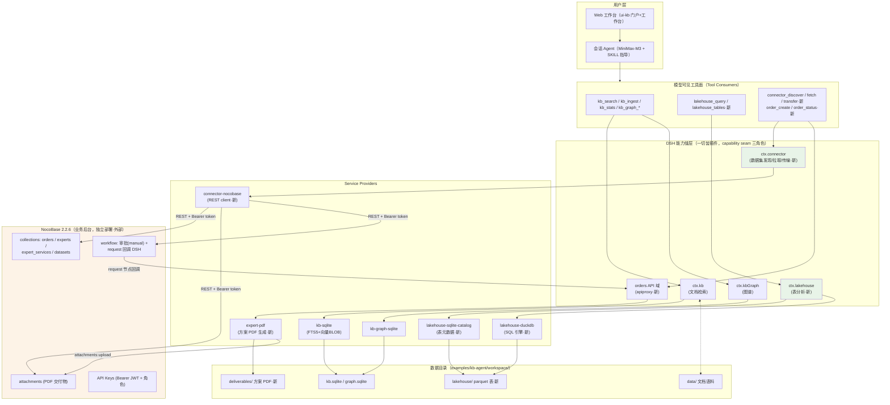

# 新阶段实施计划：连接器 Agent + 湖仓 + NocoBase 融合 + 专家数据集下单交付

> **执行方式**：本计划供 Loop 引擎按批次（N0 → N7）迭代执行，每个批次 = 一个 code 子任务可完成的规模（防上下文耗尽）。批间依赖：N0 独立先行；N1 → {N2, N3}；N3 → N4 → N5 → N6 → N7；N2 可与 N3/N4 并行。
>
> **功能基线**：《豫中南数字产融平台_功能清单_v3.xlsx》（定位路径 `/Users/mac/Documents/github/技术方案/豫中南数字产融平台_功能清单_v3.xlsx`，编制日期 2026-09-03，181 功能点 / 8 子系统）——完整解析见 [01-feature-baseline.md](01-feature-baseline.md)。
>
> **调研底座**：[research/2026-09-03-connector-lakehouse-nocobase/dsh-kb-status.md](../research/2026-09-03-connector-lakehouse-nocobase/dsh-kb-status.md)（DSH 现状与债务）、[research/2026-09-03-connector-lakehouse-nocobase/nocobase.md](../research/2026-09-03-connector-lakehouse-nocobase/nocobase.md)（NocoBase 2.2.6 源码调研）。
>
> **既有成果**（[plans/food-kb-agent-plan.md](../plans/food-kb-agent-plan.md) P0/P1/P2 已完成）：8 个 `packages/kb/` 包（seam 三角色齐备）、`packages/client/ui-kb`（hero 门户 30 场景 + 会话内 KB 工作台 + 浏览器上传 `kb.upload`）、可信数据空间（确权三元组 + scope 授权）、kb-graph 图谱缝、评测 hybrid Top5 99% / 引用有效率 96%。仓库 HEAD `84c60f5a8e`，工作区干净；**连接器 / 湖仓 / NocoBase / 专家下单四要素零实现零提交，全部从零起步**。

---

## 一、目标摘要

最终形态（用户目标 4，全部覆盖）：

1. **上传任意文件自动路由**：客户往 agent 上传任何文件 → 判别器分类 → 自动进知识库（文档+向量+图）或湖仓（表+分析）。
2. **回答时自动路由**：agent 回答时按数据形态自动走 KB 检索（`kb_search`）、湖仓分析（`lakehouse_query`，NL2SQL）或连接器数据集（`connector_discover`/`connector_fetch`）。
3. **高质量数据集连接器**：能拿到连接器的数据集——专家（张红喜，漯河电商协会张会长，食品出海尤其中亚方向）、机构、行业数据集即商品；专家数据集 = 结构化画像 + 知识资产 + 可服务化商品。
4. **专家服务闭环**：用户问"俄罗斯的仓库被乌克兰炸了怎么办" → agent 找到解决方案（KB 引用）且找到张会长（连接器专家发现）→ 用户下单 → 得到张会长的解决方案 PDF（指导货运、仓库等方案）→ 交付与履约状态可追踪。**真实生成、真实落库、真实可下载，无 mock-only 环节**（用户价值观）。

## 二、总体架构

### 2.1 架构图



### 2.2 数据流（三条主干动线）

**动线 A：上传任意文件 → 自动路由**

```
浏览器上传 → apiproxy data.upload（新统一入口）
  → DataRouter.resolve()（显式判别步骤，request/spec split 模板）
    扩展名+魔数白名单分类：.md/.txt/.pdf/.docx → kb 路径（既有 ingest 管线）
                          .csv/.xlsx/.parquet/.json(数组) → lakehouse 路径
                          （规范化 → parquet 落盘 → catalog 注册）
  → 响应 { destination: 'kb' | 'lakehouse', replaced?: boolean }
```

**动线 B：回答时查询路由（演进式）**

- MVP：工具并列 + persona/SKILL 指导选择（`kb_search` 管文档片段、`lakehouse_query` 管数值统计、`connector_discover` 管专家/外部数据集）——先例：[cordis.patch.yml](../../examples/kb-agent/cordis.patch.yml) 的 persona 引用指令已验证此模式有效。
- 演进（不进本阶段批次）：模型辅助路由（意图分类插件）、检索结果融合。

**动线 C：专家服务闭环**

```
问答中发现专家（connector_discover → 专家卡片呈现）
→ 用户下单（order_create → NocoBase orders:create，REST + Bearer）
→ NocoBase workflow（可选 manual 审批 → request 节点回调 apiproxy orders.fulfill）
→ DSH 起草方案（MiniMax-M3 依据 order brief + kb_search 引用起草 sections）
→ expert-pdf 排版生成（pdf-lib + CJK 字体子集）→ 落盘 workspace/deliverables/
→ 附件挂载 NocoBase 订单（attachments:upload）→ 订单状态 delivered
→ agent 可查状态 / 给出下载（order_status / deliverable 下载）
```

## 三、技术决策记录

| # | 决策 | 理由（证据） |
|---|---|---|
| D1 | **湖仓 = SQLite catalog + Parquet 数据文件 + DuckDB SQL 引擎**（`@duckdb/node-api` 官方 prebuilt，可选依赖 + `available()` 降级探测） | 功能清单子系统 3 的终态（Iceberg/Spark/Flink/Kafka）是"避免重型基础设施"红线之外；DuckDB 单机 OLAP 零服务进程、SQL 方言完整支撑 NL2SQL；Parquet 是开放湖表格式的最小实现（向"开放表格式湖表"功能项演进的垫脚石）；catalog 用 `node:sqlite` 与 [kb-sqlite](../../packages/kb/kb-sqlite/src/schema.ts) 先例同构。prebuilt 覆盖 darwin/linux/win 三平台；原生模块风险用 `available()` 降级（缺引擎=表清单可用、查询 fail-loud 提示安装）+ 测试覆盖 false 分支，模式即 kb 的 embed 降级先例。回退方案：`@duckdb/duckdb-wasm`（零原生，性能折损），仅在 CI prebuilt 失败时启用 |
| D2 | **连接器 = 新 capability seam**（`packages/connector/connector` Definition + `connector-nocobase` Provider + `tool-connector` Consumer），传输协议 = `ConnectorDataset` 统一数据包 + `transfer` 编排（pull → classify → route → deliver → confirm） | 遵循 [docs/architecture.md](../../docs/architecture.md) seam 三角色条款与 [AGENTS.md](../../AGENTS.md)「Plugins, not loop changes」；模式照抄 web/subagent/shell 三样板（[dsh-kb-status.md §6](../research/2026-09-03-connector-lakehouse-nocobase/dsh-kb-status.md)）；classify/route 复用动线 A 的 `DataRouter`（单一判别器，两动线不分叉）；confirm 落 catalog（transfer record = 资源登记上报功能项的雏形） |
| D3 | **NocoBase 融合 = 路径 A 为主（REST + Bearer API key）+ B 按需（纯 server 插件后置）**，C（REST 数据源插件）不采用 | 调研确证：路径 A 2-5 人日零侵入（REST 全量 CRUD + filter 语法 + API key 绑定角色可吊销 + 附件 `attachments:create` 免流注册）；workflow 的 manual 审批 + request HTTP 节点现成，"下单→审批→交付"全部组合现成节点；路径 C 需自研 DataSource/CollectionManager/Repository 全链 3-6 人周高不确定性（[nocobase.md §8](../research/2026-09-03-connector-lakehouse-nocobase/nocobase.md)）。不 fork 源码：自建插件经独立 app 工程 `packages/plugins/` 或 `pm add`，本阶段不触发 |
| D4 | **订单真源在 NocoBase**（collections `orders`/`deliveries`），DSH 不建平行订单表 | 单一事实源（功能清单 #153"数据产品在线展示、下单与交付管理"归 NocoBase）；DSH 侧 orders API 域是薄转发 + 交付编排；NocoBase 不可用时工具返回结构化错误（fail-loud，不静默降级）；keyless 测试经 mock NocoBase server（[llm-minimax mock-server](../../packages/llm/llm-minimax/tests/mock-server.ts) 先例） |
| D5 | **专家数据集 = NocoBase collections（experts/expert_services/datasets）+ KB 语料 + 连接器发现**；图谱本体不动 | 专家发现走 `connector_discover`（presentationMeta 专家卡片）即可闭环；扩 [kb-graph 闭集本体](../../packages/kb/kb-graph/src/types.ts)（加 person 实体）是协调变更、破坏面大于收益，列为后续演进 |
| D6 | **PDF = pdf-lib + fontkit CJK 字体子集**（Noto Sans SC，OFL 许可，`resources/fonts/` 内嵌）；起草 = MiniMax-M3 依据 brief + KB 引用生成 `DraftSpec`，排版纯函数 | 用户要求"模板化自动起草但必须真实生成"；pdf-lib 纯 JS 无原生依赖（跨平台 CI 安全与仓库价值观同构）；keyless 快照用固定 DraftSpec fixture（不调 LLM），with-key e2e 真实起草——双轨先例即 [examples/kb-agent/tests](../../examples/kb-agent/tests) 的 kb-closed-loop 双轨 |
| D7 | **上传统一入口 = apiproxy 新 `data` 域**（`data.upload` 判别分发），`kb.upload` 保留为内部路径 | 用户入口唯一（"上传任何文件"）；判别器是显式 `resolve()` 步骤（request/spec split，[shell 模板](../../packages/shell/shell/src/index.ts)）；写开关独立 `dataUploadEnabled`（不复用 `kbWriteEnabled`，粒度分立——misconfiguration fails loud） |
| D8 | **计量对称扩展**：lakehouse（loadedTables/lakehouseQueries）与 connector（discoveries/fetches/transfers/orders）走 `recordUsage` 同构缝 | 功能清单 #93"多维计量模型"（存储/算力/API 调用/数据产品调用）；[kb usage](../../packages/kb/kb/src/types.ts) 是现成计量底座，对称扩展零新概念 |
| D9 | **批次 N0 先清偿三上传债务**（base64 正则栈溢出、并发同名 crosstalk、同名静默替换无提示）+ DNS rebinding TOCTOU | "上传任何文件"是新阶段用户动线 A 的入口，地基不稳全盘皆输；债务 #1 在连接器外源抓取时风险放大（[dsh-kb-status.md §12](../research/2026-09-03-connector-lakehouse-nocobase/dsh-kb-status.md)） |

## 四、连接器 Agent 设计（方案）

### 4.1 能力缝三角色

| 角色 | 包 | 内容 |
|---|---|---|
| Service Definition | `packages/connector/connector/`（`@deepseek-ai/dsh-connector`，`ctx.connector`） | `ConnectorProvider` 契约（`id` / `available()` 禁 I/O / `capabilities` 启动期声明 / `discover(request)` 数据集清单 / `fetch(datasetId, signal)` 数据包）；`ConnectorDataset` 统一数据包（`id` / `title` / `kind: 'tabular' \| 'document' \| 'expert-profile' \| 'service'` / manifest 元数据 / contentRef）；`transfer(from, options)` 编排；注册即 disposer（重复抛 `CONNECTOR_DUPLICATE_PROVIDER`） |
| Service Provider | `packages/connector/connector-nocobase/` | NocoBase REST client（Bearer token / 超时重试 / filter 语法翻译）+ discover 映射（experts/datasets/expert_services → ConnectorDataset）/ fetch 映射（tabular→行集，document→KB ingest 输入，expert-profile→画像卡）。后续 provider（web/erp/海關数据…）零缝改动新增 |
| Tool Consumer | `packages/connector/tool-connector/` | `connector_discover`（query → 数据集+专家清单，render intent `generic` 专家卡）/ `connector_fetch` / `connector_transfer` / `order_create` / `order_status`（五工具，schema/render/timeoutMs/isConcurrencySafe 按 [tool-kb/src/search.ts](../../packages/kb/tool-kb/src/search.ts) 模板） |

### 4.2 连接器间传输协议

```
ctx.connector.transfer({ source: providerId, datasetId, target: 'auto' })
  1. pull      connector.fetch(datasetId) → ConnectorDataset（含内容引用或行集）
  2. classify  DataRouter.resolve（与上传动线共用同一判别器——单一路由真相）
  3. route     'kb' → ctx.kb.ingest（文档/画像语料）
              'lakehouse' → ctx.lakehouse.load（TabularData → parquet + catalog 注册）
  4. deliver   写入 + provenance（确权三元组：来源 provider + contentHash 由缝自算）
  5. confirm   transfer record 落 catalog（登记上报功能项雏形）+ usage 计量
每步可观测（capability event + 结构化日志），失败 fail-loud 带错误码。
```

"连接器 agent"（数据采集团）= 组合 connector 工具 + 采集 SKILL 的 agent 预设（`examples/kb-agent/agent-presets/` 新增），不改编 agent-loop——遵循「Plugins, not loop changes」。

## 五、湖仓选型与理由

见技术决策 D1。落地形态：

- **表存储**：`workspace/lakehouse/<tenant>/<table>.parquet`（开放列式格式，重建表=替换语义，对齐 kb 的 `(tenantId, sourcePath)` 身份模型）。
- **元数据 catalog**：`packages/lakehouse/lakehouse-sqlite-catalog`（`node:sqlite`，`SCHEMA_VERSION=1`，application id `"DSHL"`，`UNIQUE(tenant_id, table_name)`，表 schema/行数/provenance/transfer records）。
- **查询引擎**：`packages/lakehouse/lakehouse-duckdb`（`QueryProvider`，`available()` 动态探测 + 降级语义；`query(sql)` 返回行集 + 列元数据 + 截断标记，`maxRows` 可配置）。
- **NL2SQL**：不建独立翻译层——`lakehouse_query` 工具 schema 暴露表结构摘要 + SKILL 教模型先 `lakehouse_tables` 再生成 SQL（功能清单 #133/#165 的 MVP 形态；评测集扩展验证准确率，演进可加 schema-linking 提示词）。

## 六、专家闭环设计（张会长数据集）

1. **数据建模**（真实数据，MVP 从用户处采集授权语料；结构先行）：
   - NocoBase `experts`：张红喜 / 漯河电商协会会长 / 领域：食品出海、中亚市场 / 机构背景 / 履历要点。
   - `expert_services`：货运动线方案（中亚方向）/ 海外仓风险应对 / 出海合规咨询——含交付物类型（PDF 方案）与定价字段。
   - `datasets`：专家知识资产登记（画像+文档集+可服务化商品三合一，即功能清单 #70"数据集加工"+ #60"分类分级标签"雏形）。
   - KB 语料：出海风险应对行业通识（海运改道 / 中欧班列 / 海外仓备份 / 保险理赔 / 中亚市场准入，6-10 篇脱敏编写）。
2. **发现动线**：`connector_discover("食品出海 中亚 专家")` → 专家卡片（presentResult：姓名/机构/领域/服务清单/可下单提示）。
3. **下单与交付**：动线 C（§2.2）；PDF 章节模板：封面（客户/日期/专家署名）/ 背景与问题 / 风险分析 / 解决方案（货运、仓库、合规）/ 实施路线图 / 参考来源（KB 引用）。
4. **履约追踪**：订单状态机 `pending → (approved) → generating → delivered`（NocoBase 状态字段 + workflow 驱动），agent 经 `order_status` 汇报。

## 七、NocoBase 融合方案

- **部署**：本地开发 = docker postgres + `create-nocobase-app`（官方安装路径；Node ≥22 + yarn1——与 DSH 的 pnpm 互不干扰，两个独立工程）。`examples/kb-agent/docker-compose.nocobase.yml` + QUICKSTART 增节。sqlite 实验路径标注待实测（核心代码支持但安装器不提供，[nocobase.md §1.2](../research/2026-09-03-connector-lakehouse-nocobase/nocobase.md)）。
- **初始化**：`examples/kb-agent/scripts/nocobase-setup.mts`——经 REST `collections:create` 建 experts/expert_services/datasets/orders/deliveries 五 collections + API key 创建引导（绑定最小角色）。workflow 模板（orders afterCreate → manual 审批 → request 回调 → update 状态）MVP 走界面配置文档化，程序化导入列为演进。
- **凭据**：`NOCOBASE_BASE_URL` / `NOCOBASE_API_KEY` 走 `ctx.credentials`（`apiKeyEnv` 模式先例 [llm-deepseek](../../packages/llm/llm-deepseek/src/index.ts)）；缺凭据 = connector provider `available()=false`（降级不失败）。
- **多租户**：MVP 单租户 = 单 API key + 单角色；四级租户映射（roles + departments 树 + 行级 scope）文档化预留，不进批次。

## 八、分批实施批次表（总表）

> 详表（每批范围/文件清单/验收/验证策略/命令）见 [02-batches.md](02-batches.md)。

| 批次 | 范围（一句话） | 依赖 | 核心交付物 |
|---|---|---|---|
| N0 | 上传链路债务清偿：base64 栈安全验证、并发同名行身份、替换提示、DNS rebinding pin-IP | 无 | kb.schema/ui-kb/upload 全绿 + 大文件 e2e |
| N1 | 湖仓能力缝：lakehouse（Definition）+ lakehouse-sqlite-catalog + lakehouse-duckdb | 无 | `ctx.lakehouse`：load/query/stats/计量 |
| N2 | 工具面与数据路由：tool-lakehouse + apiproxy data 域（统一上传判别分发）+ 查询路由 SKILL | N1 | csv/md 双路由 e2e + 快照 |
| N3 | 连接器能力缝 + NocoBase client：connector/connector-nocobase/tool-connector + mock server | N1 | discover/fetch/transfer 全路径（mock） |
| N4 | 专家数据集：张会长建模（NocoBase collections + KB 语料）+ 专家卡片 + 风险问答语料 | N3 | "俄罗斯仓库被炸"问答真实跑通 |
| N5 | 订单域 + 方案 PDF 生成：expert-pdf + orders API 域 + order 工具（DSH 内闭环） | N4 | 下单→真实 PDF 落盘→可下载 |
| N6 | NocoBase 融合实装：setup 脚本 + workflow 审批回调 + 附件挂载交付 | N5 | 真实 NocoBase 全链路实跑 |
| N7 | 端到端演示 + 文档 + 质量门总验 | N6 | 三场景演示脚本 + 全门绿 |

## 九、风险与既有债务处置

| # | 风险/债务 | 处置 |
|---|---|---|
| R1 | DuckDB prebuilt 与 CI（含 windows-wine lane）兼容性 | N1 批先跑 `pnpm run check:windows-wine` 验证；失败即切 `@duckdb/duckdb-wasm` 回退（D1 预案）；`available()=false` 降级路径必须测试覆盖 |
| R2 | NocoBase 本地环境（postgres/安装时长 5-15min）拖慢开发迭代 | 开发主循环用 mock NocoBase server（单测/快照）；真实环境只在 N6 与 with-key e2e 触达 |
| R3 | CJK 字体子集体积与许可 | Noto Sans SC OFL 可再分发；fontkit `subset: true` 只嵌入用到的字形；字体文件进包 `resources/fonts/`（README 声明许可） |
| R4 | 张会长真实数据可得性 | N4 结构先行（collections schema + 画像骨架 + 行业通识语料自编），真实授权语料到位后热替换（数据与代码解耦） |
| R5 | apiproxy [api-proxy.ts](../../packages/host/apiproxy/src/api-proxy.ts)（4037 行）继续膨胀 | 遵循现状聚合模式（一致性优先），Agent Note 登记"域实现拆分"为后续债务候选，不在本阶段重构 |
| 债#1 | DNS rebinding TOCTOU（[plans §十一.5](../plans/food-kb-agent-plan.md)） | **N0 清偿**（pin-IP 方案） |
| 债#7 | 检索无相关性阈值 | **N4 顺手启用**：示例组合配置 `minRelevanceScore`（[calibrate-relevance.mts](../../examples/kb-agent/scripts/calibrate-relevance.mts) 已有校准工具），hit 携带分数进 hit 卡弱化展示 |
| 债#8 | 大文档 embed 稳定性 | 保留登记（专家语料 MVP 体量小不阻塞）；N4 若遇大文档再触发 |
| 债#2 | graph 零计量 | 保留登记（专家走连接器不走图谱，D5） |
| 债#3/4/5/6 | 场景填充/UI 选择器/CI 复验/vendor rescape | 不进本阶段主线，维持登记 |
| BUG-4 | tsx dev server 模块图冻结（[Agent Note 2026-07-29](../../.agents/notes/implemented/architecture/2026-07-29-dsh-source-launch-tsx-esm.zh.md)） | 架构契约不修；开发流程注记：服务端插件/网关改动后重启 `dsh web` 长驻进程（写入每批验证策略提醒） |
| 新债#9 | MiniMax 并行 tool-call 防御 | 已清偿（2026-09-02），仅引用先例 |

## 十、开发注意事项（每批通用）

- 服务端改动（网关/插件 src）后必须重启 dev server（[BUG-4 契约](../../.agents/notes/implemented/architecture/2026-07-29-dsh-source-launch-tsx-esm.zh.md)）；`scripts/dev-web.ts` 与 `pnpm run build` 不得并发。
- 全部注册走 `ctx.effect()`/`ctx.on()`；闭 union 用 `assertNever`；request/spec split 显式 resolve；Config 字段可从 cordis.yml 覆盖（无硬编码调参）。
- 模型可见 ⟺ 落日志：新工具入 `ctx.tools`（tool result 天然入 session log）；新模型可见输入类型需扩展 `SessionEventMap` 时先评估（本阶段预计不触发——orders/connector 均走工具面）。
- 新包 README 三件套（双语 + Model Experience + Known Limitations）；`pnpm run doc-sync`；每非平凡批同 PR Agent Note。
- 测试自跳过：无 `MINIMAX_API_KEY` / `NOCOBASE_BASE_URL` 自动跳过 with-key/with-NC e2e；keyless 快照必须绿。
- 演示前代理（外网需要时）：`export http_proxy=socks5://127.0.0.1:1087; export https_proxy=http://127.0.0.1:1087; export ALL_PROXY=socks5://127.0.0.1:1080`。
