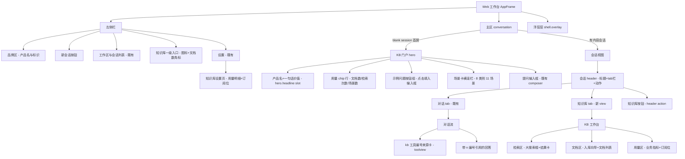

# 02 信息架构重设计 + 视觉与交互设计规格 — 食品产业知识库+Agent Web 工作台（第二阶段）

> Design Agent 产出。输入：[01 产品问题报告](01-product.md)、客户端源码走查（ui-slots slot 体系、ui-kb、ui-agent-preset、ui-conversation 渲染骨架、ui-theme token 表、apiproxy `IApiClient` 面）、[examples/kb-agent](../../examples/kb-agent/README.zh.md) 组合与场景/角色数据、现状截图（step-01/02/04 视觉走查）。
>
> 硬约束（全程有效）：样式只骑 `--dsw-alias-*` / `--dsw-font-*` / `--dsw-shadow-*` token（[docs/web-styling.zh.md](../../docs/web-styling.zh.md)）；新 UI 走 `packages/client/ui-*` 插件 + ui-slots 扩展点；不改 apps/web 壳；呈现为 args 纯函数；locales 双语（zh 主）；不破坏会话/新会话/KB 面板既有能力与 e2e；API 面仅 `kb.stats/search/ingest/ingestUrl`（+ sessions/workspace/agentPresets/host 既有面），超出处标注降级方案。

## 〇、技术约束调研结论（设计依据）

设计决策全部建立在对真实前端架构的走查之上，以下事实约束了每一个落点选择：

1. **布局 slot 拓扑**（[ui-layout/src/client/index.ts](../../packages/client/ui-layout/src/client/index.ts:33)）：`root` 下只有 `sidebar` / `conversation` / `details` / `shell.overlay` 四个 slot，**没有第三个主区 pane**。"KB 独立常驻 pane" 在不改壳的前提下不可行；`shell.overlay` 是点击穿透的浮层层，不适合承载主工作区。
2. **首屏 hero 的渲染规则**（[ConversationRoot.tsx](../../packages/client/ui-conversation/src/client/skeleton/ConversationRoot.tsx:79)、[ConversationSession.tsx](../../packages/client/ui-conversation/src/client/skeleton/ConversationSession.tsx:200)）：blank session 时 `ConversationSession` 返回 `null`、header 隐藏——**view tab 在首屏不可见**；但 `conversation.input.dock`（list、session scope）在 hero 阶段照常渲染（composerStack 内、卡片上方），是首屏唯一可挂大块内容的 additive slot。
3. **hero 文案无扩展点**：headline（"探索未至之境"）、预览徽章、hero 占位文案是 ui-conversation 的 locale 词条；locale namespace 是单占者（重复注册抛错，[locale/src/client/index.ts](../../packages/client/locale/src/client/index.ts:244)），**部署级覆盖词条不可行**。要换首屏文案必须让 ui-conversation 新增 slot 声明（additive，不注册时 fallback 原文案，不破坏任何现有测试）。
4. **view tab 有直接先例**：`conversation.view` 是 list slot（id/order/label，label 支持 thunk 跟随 locale），ui-trajectory 已用同一机制注册 tab；注册第二个 view 后 header 自动出现 tab 栏（[ConversationSession.tsx:145](../../packages/client/ui-conversation/src/client/skeleton/ConversationSession.tsx:145)）。
5. **toolview 有直接先例**：`tool.call.toolview` keyed by 工具名，web_search/web_fetch 已注册引用卡行（[web-row.tsx](../../packages/client/ui-tool/src/client/tool/toolviews/web-row.tsx:62)），kb_* 未注册——补齐即可让会话内检索渲染为编号来源卡。
6. **API 面边界**（[apiproxy/src/fetch/client.ts](../../packages/host/apiproxy/src/fetch/client.ts:88)）：`kb` 仅 stats/search/ingest/ingestUrl；**无文件上传面**（`ingest` 收服务器相对路径）；**无文档列表/删除/检索历史面**。但 `host.pickDirectory`（原生目录选择）与 `host.listDirectory`（目录浏览，workspace-management 的 Miller 双栏先例）存在，可把"手输路径"升级为"可视化选文件"。`agentPresets.list/select` 存在，场景目录（`scenarios/<id>/preset.yml` 与 agent-presets 同构）可通过 cordis.yml roots 配置进入 roster。
7. **token 体系**：颜色语义 `--dsw-alias-*`（bg/border/label/button/interactive/state/markdown/scrollbar 等）+ `--dsw-specific-*`；排版 `--dsw-font-xl-24 … xxxs-11`（字号/行高/字重成套）；阴影 `--dsw-shadow-lv1/2/3`；动效 `--ds-ease-in-out` + `--ds-transition-duration(-fast/-slow)`。暗色由 `body[data-ds-dark-theme]` 整体翻转 alias 值——**功能组件 CSS 禁止主题选择器，引用 alias 即自动暗色适配**。无全局间距 token：间距是组件局部约定（本规格统一用 4 的倍数 px 局部值，与 KbPanel.module.css 现状一致）。
8. **场景/角色数据结构**：preset.yml = `name` / `description` / `order` / `probe`（场景特有）。11 个场景 8 个类别（[scenarios/README.zh.md](../../examples/kb-agent/scenarios/README.zh.md)）；2 个角色在 `agent-presets/`，场景在 `scenarios/`（当前不在 preset roots，UI 完全不可见）。
9. **e2e 约定**：[kb-workbench.e2e.ts](../../apps/web/tests/kb-workbench.e2e.ts) 走 `apiProxy.kb`（不依赖 UI DOM），KbPanel 重构不触碰它；ui-kb 包内单测与 examples/kb-agent 快照需随重构同步更新（实现要点见第六节）。

---

## 一、设计目标与原则映射

| 产品原则（01 报告 §三） | 设计决策（本规格落点） |
|---|---|
| P1 检索为中心 | 首屏 hero 门户化：主操作就是提问（composer 即检索入口），配示例问题一键填入；会话内补"知识库"view tab 承载直连 `kb.search` 的独立检索工作台；检索结果卡每条带"带入对话追问"，打通面板检索 ↔ 会话问答两条动线（§四 B/C） |
| P2 订阅用户先看价值 | hero headline slot 替换为产品名+一句话价值；门户第一行即用量 chip（文档 N · 检索 N 次 · 场景 11）；场景卡库展示能力全景（§四 A） |
| P3 说人话 | 全部新词条业务化：文档/片段/来源/检索次数；切片、向量化、doc_kind、workspace 前缀、检索模式降级、MISSING_CREDENTIAL 一律不露出；来源显示为"文档名 — 标题路径"（§四 C、§五词条表） |
| P4 采集到回答一条动线 | 入库向导（URL 粘贴 + 工作区文件浏览选择）→ 成功反馈（文档名+片段数）→ 文档列表（客户端状态）→ 检索验证，四步在同一工作台视图内闭环（§四 D） |
| P5 引用即信任 | 会话内 kb_* 工具渲染为编号来源卡（toolview，WebBlock 模式）；检索结果卡带编号徽标；回答中 `[n]` 交互做 P2 级增强并标注风险（§四 F） |
| P6 复用 slot 体系与设计语言 | 每个界面落点均为既有 slot（input.dock / conversation.view / tool.call.toolview / sidebar.footer.action / settings.section）；仅新增 2 个 additive slot 声明（hero headline、header.actions 的 setView owner prop），全部有 fallback、零破坏（§二包落点表） |
| P7 状态永远可见 | 每屏给出 空态/加载/错误/降级 四态矩阵；错误文案人话化并按操作区分重试（§四各屏状态矩阵） |
| P8 桌面优先移动不崩 | 所有新区域 ≤768px 单列折叠：场景卡横滚、结果卡全宽、工作台子区改手风琴；375px 无横向滚动（§四各屏窄屏列） |

---

## 二、信息架构

### 2.1 IA 图



### 2.2 导航决策

**KB 概览如何进入用户视野 —— 决策：首屏 hero 门户化（blank session 的默认态），不做重定向、不做独立 pane。**

理由（技术可行性推导）：

- 布局只有 sidebar/conversation/details 四个 slot，无第三主区 pane；`shell.overlay` 是点击穿透浮层，承载主工作区违背其契约。
- 首屏（blank session）view ring 不渲染、header 隐藏，唯一可挂内容的 additive slot 是 `conversation.input.dock`（hero 阶段照常渲染于 composer 卡片上方，owner 传 `InputZone`，组件可读 `session.blank && session.composerPhase === 'blank'` 决定只在 hero 显示——呈现仍为 props 纯函数）。
- blank session 恰是"新用户第一次打开"与"每次点新会话"的默认态——门户天然获得最高曝光，无需重定向。
- hero headline/占位是 ui-conversation locale 词条且 namespace 单占，**新增 `conversation.hero.headline` slot（single、root scope、fallback 原文案）** 是换首屏文案的唯一不破坏路径；这是对既有插件的 additive 扩展（不注册时像素级不变）。

**KB 工作台（检索/文档/用量完整视图）—— 决策：注册 `conversation.view` 的 `kb` tab（会话内常驻主区）。**

- 直接先例：ui-trajectory 以同机制注册 tab；注册后 header 自动出现"对话 | 知识库"tab 栏（tabs.length > 1 时渲染）。
- 限制：blank session 时不可见——由门户承接首屏，用户发出第一问后 tab 即可用；侧栏 KB 入口在 blank 态无需跳转（已在门户）。
- 跨包切 tab：`setView` 存在于 ui-conversation 内部 ChatStore。**主方案**：ui-conversation 渲染 `conversation.session.header.actions` 时在 owner props 增补可选 `setView`（一行 additive 改动，KB 的 header 按钮即可切 tab）；**降级方案**：不做该扩展，KB 侧栏入口在有会话时仅高亮提示"在会话顶部切换到知识库 tab"，用户手动点击 tab。

**侧栏 KB 一级入口 —— 决策：增强现有 `sidebar.footer.action` 注册（图标 + 文档数角标），点击行为按状态分派。**

- blank/无会话：无跳转（已在门户），触发门户用量 chip 的一次刷新；
- 有会话：切到 `kb` tab（主方案）/ 提示手动切换（降级方案）。
- 文档数角标数据：`kb.stats` 的 `documents`，入口挂载时拉取一次、入库成功后经包内事件刷新（数据来源=API，客户端缓存）。

**角色与场景入口 —— 决策：场景以 agent preset 形态进 roster（cordis.yml 把 `examples/kb-agent/scenarios` 加为 agent-presets root），门户场景卡用包内静态清单做分组展示。**

- `scenarios/<id>/` 与 agent-presets 目录同构（preset.yml + agent.cordis.yml），加一行 roots 配置即可被 `agentPresets.list` 列出、`agentPresets.select` 选用——零新 API。
- roster 行只有 name/description/order，无类别/probe 元数据；门户卡片要按 8 类别分组，用 **ui-kb 包内静态场景清单常量**（id/name/description/category/probe，与 scenarios/ 目录同步维护）驱动展示，点击后调 `agentPresets.select(id)` + 起新会话。标注：展示元数据双源（静态清单 + roster）是本期妥协，长期应扩展 `agentPreset.list` 返回扩展元数据。
- 新会话选角色：既有 `conversation.hero.agentPreset` chip（AgentPresetSeat 菜单已含名称+描述）不重造，仅在门户场景卡与之打通（点场景卡 = 选预设 + 新会话，复用 AgentPresetSeat 的 staging 语义）。

### 2.3 包落点表

| # | 设计区域 | 包 | slot / 机制 | 新建/扩展 |
|---|---|---|---|---|
| 1 | 首屏产品名+价值主张（替换"探索未至之境"） | ui-conversation | 新增 slot 声明 `conversation.hero.headline`（single、root、fallback 原文案） | 扩展（additive 声明） |
| 2 | 首屏产品名+价值主张的**内容** | ui-kb | 注册 `conversation.hero.headline` | 扩展注册 |
| 3 | 首屏品牌图标/名称 | ui-kb | 注册 `conversation.hero.brand.mark` / `conversation.hero.brand.name`；侧栏 `sidebar.brand.mark` / `sidebar.brand.name` | 扩展注册 |
| 4 | 门户用量 chip 行 + 示例问题 + 场景卡栏 | ui-kb | 注册 `conversation.input.dock`（list，1 个 entry，组件内按 blank 判定只在 hero 渲染） | 扩展注册 |
| 5 | KB 工作台（检索/文档/用量） | ui-kb | 注册 `conversation.view`（id `kb`、label thunk 双语） | 扩展注册 |
| 6 | 会话 header "知识库"按钮 | ui-kb | 注册 `conversation.session.header.actions`（依赖落点 7 的 setView；降级则不注册） | 扩展注册 |
| 7 | header.actions 可选 `setView` owner prop | ui-conversation | `ConversationSessionHeader` 渲染 actions 时透传 `actions.setView` | 扩展（additive owner prop） |
| 8 | 侧栏 KB 一级入口（图标+角标） | ui-kb | 重构现有 `sidebar.footer.action` 注册（KbEntry） | 扩展（重构现有） |
| 9 | 会话内 kb_* 编号来源卡 | ui-kb | 注册 `tool.call.toolview`，key `kb_search` / `kb_ingest` / `kb_ingest_url` / `kb_stats` | 扩展注册 |
| 10 | KB 设置页（用量明细+订阅位） | ui-kb | 注册 `settings.section`（id `kb`） | 扩展注册 |
| 11 | 场景进 roster | examples/kb-agent（cordis.patch.yml） | agent-presets `roots` 增 `examples/kb-agent/scenarios` | 配置扩展 |
| 12 | 旧 KbPanel（360px 弹层） | ui-kb | 移除 fixed 面板挂载，能力并入 5（三段功能重组进工作台，不丢能力） | 扩展（重构现有） |

> 全部落点都在 `packages/client/ui-kb`（能力同源：同一 `api.kb` 面、同一 `kb` locale namespace、同一批测试），不新建包——拆包在当前规模下只增加维护面。

---

## 三、关键用户旅程

### 旅程 1：王工（质量部长）— 首次打开 → 完成首次检索 → 追问

| 阶段 | 入口 → 步骤 → 出口 | 状态变化 |
|---|---|---|
| 入口 | 打开工作台（无历史会话） | blank session；hero 门户呈现 |
| 步骤 1 | 看到"食品产业知识库问答"产品名+一句话价值（headline slot），下方用量 chip（文档 12 · 检索 35 次 · 11 个场景） | kb.stats 拉取完成：`—` 骨架 → 数字 |
| 步骤 2 | 角色确认：hero 工作区行旁预设 chip 显示"企业数据助手"；点开菜单读到"AI 食安合规官：依据 GB 2760/14881 作答，编号引用原文"→ 选中 | 预设 staging 变更（下一会话生效） |
| 步骤 3 | 点示例问题按钮"酱油中山梨酸钾的最大使用量？"（或自输）→ 文本填入输入框 → 发送 | blank → active 会话；hero 门户消失，对话流出现 |
| 步骤 4 | 对话流中 agent 调 kb_search：渲染编号来源卡（[1] gb2760-excerpt — 三、调味料行业…）；回答带 [1] 引用 | `usage.searches +1`；toolview 卡可展开读原文摘录 |
| 出口 | 点来源卡展开核对 GB 2760 原文摘录 → 复制结论；在输入框直接追问"复配防腐剂呢？" | 同一会话继续；新 toolview 卡追加 |

成功标准对照：全程无技术词；引用可点开核对；5 分钟内完成（01 报告旅程 1）。

### 旅程 2：李经理（采购经理）— 采集入库 → 看到文档列表

| 阶段 | 入口 → 步骤 → 出口 | 状态变化 |
|---|---|---|
| 入口 | 会话 header 点"知识库"tab（或侧栏 KB 入口） | view 切换到 KB 工作台 |
| 步骤 1 | 文档区点"添加文档"→ 入库向导（Modal）：两个页签"网页链接 / 服务器文件" | 向导打开 |
| 步骤 2a | 网页链接：粘贴宏发走访纪要 URL → "入库" | `kb.ingestUrl`；按钮 loading |
| 步骤 2b | 服务器文件：点"浏览文件"→ Miller 双栏目录浏览（host.listDirectory，从工作区根起）→ 选中 `suppliers/宏发走访纪要.docx` → "入库" | `kb.ingest({path})`；**不手输任何路径** |
| 步骤 3 | 成功反馈：toast"已入库：宏发走访纪要 · 6 个片段"（业务语言，无"切片"） | `stats.documents +1`；客户端文档列表新增该文档行（来源+时间+片段数，状态"就绪"） |
| 出口 | 文档列表确认材料就绪 → 切回对话 tab 问"宏发的主要风险点" → 回答引用该纪要 | 检索命中新材料 |

降级标注：本地文件（李经理电脑上的 docx）无上传 API——向导"服务器文件"页签明示"支持工作区内文件与网页链接"；本地文件上传列为后续 API 能力（`kb.ingestUpload`），本期不做。文档列表数据来源=客户端会话内状态（入库成功记录 + 检索结果反向累积），刷新后回退为仅显示 `stats.documents` 总数——列表区明示"本次会话入库记录"。

### 旅程 3：张总（分管副总）— 选角色开新会话 → 场景模板进入

| 阶段 | 入口 → 步骤 → 出口 | 状态变化 |
|---|---|---|
| 入口 | 打开工作台 → 门户场景卡栏（按 8 类别分组的横向卡片，如"食品安全：AI 食安巡检员 / AI 食安服务主管"） | 场景清单来自包内静态常量 |
| 步骤 1 | 浏览场景卡（名称+一句话描述），识别"供应商风险评估员"覆盖他的采购审计诉求 | 只读 |
| 步骤 2 | 点场景卡 → 确认浮层（角色名/描述/示例问题 probe）→"开始会话" | `agentPresets.select(id)` + 起新会话 |
| 步骤 3 | 新会话 hero：预设 chip 显示该场景名；probe 示例问题已填入输入框 | 预设 staging → 生效 |
| 出口 | 直接发送 probe 问题 → 带引用回答；侧栏/门户用量 chip 可读"检索 N 次 · 文档 M 篇"（5 秒可读，无"切片/向量化"字样） | `usage.searches +1` |

---

## 四、界面规格

通用约定：所有交互元素键盘可达（focus-visible 用 `--dsw-alias-brand-primary` 外框）；动效只用 `--ds-transition-duration(-fast/-slow)` + `--ds-ease-in-out`，`prefers-reduced-motion` 下退化为瞬时；间距用组件局部 4px 倍数；卡片圆角 12px（面板级）/ 8px（卡内元素），对齐 KbPanel 现状。

### A. KB 门户（首屏 hero，blank session）

**布局**（在既有 hero 居中构图内叠加，不替换 composer）：

```
┌──────────────────────────── 主区（居中列，max-width 720px）────────────────────┐
│                                                                              │
│              [品牌图标]  食品产业知识库问答          ← hero.headline slot 替换   │
│              检索企业文档 · 带编号引用回答 · 覆盖合规/工艺/成本/供应链           │
│                                                                              │
│      ( 文档 12 )  ( 检索 35 次 )  ( 11 个场景 )      ← 用量 chip 行 · dock①    │
│                                                                              │
│   ┌ 酱油中山梨酸钾的最大使用量？ ┐ ┌ GB 14881 车间虫控要求？ ┐  ← 示例问题 · dock① │
│                                                                              │
│   场景：[市场洞察 2] [工艺 2] [食品安全 2] [成本 1] [供应链 1] …  ← 类别横滚 · dock① │
│   ┌─────────┐ ┌─────────┐ ┌─────────┐                                      │
│   │AI 营销洞察│ │消费者洞察│ │智能品控  │  …（横向滚动，卡=名称+描述两行）          │
│   └─────────┘ └─────────┘ └─────────┘                                      │
│                                                                              │
│      [选择工作区 ▾]  [企业数据助手 ▾]              ← 既有 hero 行（不动）        │
│   ┌──────────────────────────────────────────┐                              │
│   │  问点什么，例如：酱油中山梨酸钾的最大使用量？   │  ← 既有 composer（占位降级）│
│   └──────────────────────────────────────────┘                              │
└──────────────────────────────────────────────────────────────────────────┘
```

**组件清单**：

| 组件（ui-kb 新建） | 说明 |
|---|---|
| `KbHeroHeadline` | 注册 `conversation.hero.headline`：品牌图标（复用 `conversation.hero.brand.mark` 的注册图标）+ 产品名 `--dsw-font-xl-24` + 副标题 `--dsw-font-s-14`（label-secondary） |
| `KbHeroDock` | 注册 `conversation.input.dock`（单 entry 内含三段）：`session.blank && composerPhase === 'blank'` 时渲染，否则 null（props 纯函数） |
| `UsageChips` | 三枚 chip：`文档 N` / `检索 N 次` / `11 个场景`；数字 `--dsw-font-s-strong-14` tabular-nums，标签 `--dsw-font-xxs-12` |
| `SampleQuestions` | 2-3 个示例问题按钮（ghost 按钮），点击 `inputActions.setDraft(问题)` 并聚焦 textarea |
| `ScenarioRail` | 类别分组横滚栏：类别标签行（`--dsw-font-xxxs-strong-11` label-tertiary）+ 场景卡（名称 `--dsw-font-xs-strong-13` + 描述两行截断 `--dsw-font-xxs-12`）；点击开确认浮层（场景名/描述/probe 示例 + "开始会话"） |

**状态矩阵**：

| 状态 | 呈现 |
|---|---|
| 加载（stats 未返回） | chip 数字位显示骨架条（`--dsw-alias-bg-skeleton`，宽 3ch），不显示"—" |
| 空态（KB 无文档，documents=0） | 用量 chip 行替换为引导条："知识库还没有文档 — 添加第一份资料"ghost 按钮 → 起新会话并定位文档区；示例问题仍展示（发送后 agent 会回答"知识库暂无相关内容"） |
| 错误（kb 拒绝/未挂载） | chip 行替换为一条说明："知识库服务不可用，请联系管理员"（`state-error-secondary` 底 + `state-error-primary` 文）+ 单一"重试"按钮（重试 stats 拉取）；不阻塞提问 |
| 暗色 | 全部走 alias token，无额外处理 |
| 窄屏 ≤768px | 居中列改全宽-24px；场景卡横滚天然适配；chip 行可换行；示例问题纵向堆叠 |

### B. 会话 header：知识库 tab 与按钮

- 注册 `conversation.view`（id `kb`，order 10，label thunk：zh"知识库" / en"Knowledge base"）后，header 自动渲染"对话 | 知识库"tab 栏——零自绘。
- `conversation.session.header.actions` 注册一枚"知识库"图标按钮（文档图标 + `--dsw-alias-state-business-primary` 徽标数字）：点击 `props.setView?.('kb')`；降级方案（无落点 7）时不注册此按钮。
- 状态矩阵：blank session 时 header 整体隐藏（既有行为，不处理）；kb.stats 拉取失败时徽标显示"?"，点击仍可切 tab（工作台内部有完整错误态）。

### C. KB 工作台 — 检索区（view tab 上部）

**布局**：

```
┌──────────────────────── 主区（view tab 内容，max-width 860px）────────────────┐
│  ┌──────────────────────────────────────┐ ┌────────┐                        │
│  │ 检索知识库，如：山梨酸 酱油 限量          │ │  检索  │  ← 大搜索框（自动聚焦）  │
│  └──────────────────────────────────────┘ └────────┘                        │
│                                                                              │
│  约 6 条结果 · 来自 2 份文档                                                  │
│  ┌ [1] gb2760-excerpt — 三、调味料行业常见关注事项 ──────────── [带入对话追问] ┐ │
│  │ …酱油中山梨酸钾最大使用量为 **0.5 g/kg**（以山梨酸计）…（命中词高亮）        │ │
│  └──────────────────────────────────────────────────────────────┘          │
│  ┌ [2] … 下一张结果卡 …                                                     │ │
└──────────────────────────────────────────────────────────────────────────┘
```

**结果卡结构**（每条 `KbHitCard`）：

1. **编号徽标** `[n]`：18px 圆角方块，`--dsw-alias-state-business-tertiary` 底 + `--dsw-alias-label-primary-bluish` 字（`--dsw-font-xxxs-strong-11`）。
2. **来源行**：`文档名 — 标题路径`。文档名 = `source_path` 去掉 `workspace/` 等根前缀后的文件名（去扩展名，`-` 分隔转空格）；`heading_path` 原样。**不显示**完整路径与 doc_kind 枚举；hover title 显示完整相对路径（供管理员排查）。
3. **内容摘要**：`content` 全文，命中关键词高亮（`<mark>`：`--dsw-alias-state-business-tertiary` 底 + 主文字色；客户端按检索词分词做大小写不敏感包裹，纯函数）；默认 4 行截断 + "展开"。
4. **"带入对话追问"** ghost 按钮（卡右上）：`inputActions.setDraft('关于「{文档名}」：{检索词}，请结合上下文进一步说明')` → 切回对话 tab（`setView('chat')`，降级：仅填入不切换）。
5. 卡片：`--dsw-alias-bg-layer-1` 底、`--dsw-alias-border-l1` 边、8px 圆角、hover 时 `border-l2`。

**状态矩阵**：

| 状态 | 呈现 |
|---|---|
| 初始（未检索） | 搜索框下方为引导：3 个示例检索词 chip（点击即填入并检索） |
| 加载 | 结果区 3 张骨架卡（`bg-skeleton` 底、原卡高度），搜索按钮 spinner + 禁用 |
| 空结果 | "没有找到相关内容 — 换个关键词，或直接在对话里提问"（附"去对话提问"按钮） |
| 错误 | "检索失败，请稍后重试" + "重试"按钮（仅重发本次检索）；kb 未挂载时同 A 的不可用说明 |
| 暗色 | alias 自动 |
| 窄屏 ≤768px | 搜索框换行（输入框全宽、按钮下行）；结果卡全宽；"带入对话"按钮保持右上不换行 |

### D. KB 工作台 — 文档区（view tab 中部）

**入库向导**（`KbIngestDialog`，Modal，从"添加文档"按钮打开）：

- 页签一"网页链接"：单输入框（placeholder "https://…"）+ "入库"主按钮；Enter 提交。
- 页签二"服务器文件"：`host.listDirectory` 驱动的 Miller 双栏浏览（先例：workspace-management 的目录对话框），从工作区根开始，仅可选 `.md/.txt/.pdf/.docx` 文件；选中行显示文件名+大小；底部"入库"按钮。
- 提交中：按钮 loading（"入库中…"）；成功：toast `已入库：{文件名或域名} · {chunks} 个片段`（zh）/ `Ingested: {name} · {chunks} passages`（en），向导关闭，文档列表与 stats 刷新；失败：向导内联错误条（人话转译：路径不存在→"找不到这份文件，请重新选择"；URL 不可达→"网页无法访问，请检查链接"）+ 对应页签的"重试"。
- 明示边界：页签二顶部说明文字"支持工作区内的 md / txt / pdf / docx 文件与网页链接"。

**文档列表**（`KbDocumentList`，降级方案——API 无 list 面）：

- 数据来源=**客户端会话内状态**：入库成功记录（来源名/时间/片段数）+ 检索结果中出现的 source_path 反向累积（标记"已用于检索"）。列表头明示"本次会话的入库与检索记录"。
- 行结构：来源名（同 C 的文档名规则）· 相对时间 · 片段数 · 状态徽标（"就绪"=出现在检索结果或入库成功；无失败态可判——不伪造）。
- 空态：documents=0 时整区替换为引导卡："知识库还没有文档"+ "添加文档"主按钮 + "支持网页链接与工作区文件"说明。
- 刷新后：列表回退，仅显示 `stats.documents` 总数行（"共 N 份文档"）——列表区明示这是会话内记录，不假装持久。
- 无删除/重新入库：不提供入口（API 不存在），避免假按钮。

### E. KB 工作台 — 用量区（view tab 下部）+ 设置页

**用量卡**（`KbUsageCard`，工作台内嵌 + `settings.section` 页复用同一组件）：

```
┌ 本月用量 ─────────────────────────────── 订阅：专业版 · 有效 ──────────┐
│  检索 35 次        入库文档 12 篇        知识库文档 12 份               │
│  (大数字 --dsw-font-xl-24 · 标签 --dsw-font-xxs-12)                    │
└──────────────────────────────────────────────────────────────────┘
```

- 指标只用业务语言：检索次数（`usage.searches`）、入库文档（`usage.ingested_documents`）、知识库文档（`documents`）。**不展示** chunks/embedded_chunks/embed_texts/embed_available/mode。
- **订阅位**：右上静态徽标（"订阅：专业版 · 有效"）。数据来源=**客户端配置占位**（ui-kb 包内常量或 cordis.yml config 注入），标注降级：无订阅 API，本期为展示位，接入计费后替换数据源。
- 状态：加载=骨架条；错误=同 A 的人话错误+重试；空态（全 0）=正常显示 0 并附"开始第一次检索"引导。

### F. 会话内引用（toolview + [n]）

**kb_* toolview**（`KbToolRow`，注册 `tool.call.toolview` 四个 key）：

- `kb_search`：复用 ToolRow chrome + WebBlock 检索卡模式——折叠态摘要行"知识库检索 · {query} · {N} 条来源"；展开态编号来源列表（同 C 的来源行规则 + 摘要两行），每条可再展开读完整片段。运行中=共享 pending 摘要行。
- `kb_ingest` / `kb_ingest_url`：摘要行"文档入库 · {文件名或域名}"；展开态成功显示"已入库 {chunks} 个片段"，失败显示人话错误。
- `kb_stats`：摘要行"知识库用量查询"；展开态三枚业务指标（同 E）。
- 图标：统一文档系图标（`IconBrowseOutline16` 家族）；标题 zh/en 双语走 `kb` namespace。

**回答中 [n] 引用**（P2 增强，标注风险）：

- 本期（P1）：`[n]` 保持纯文本；核对路径 = 展开同 turn 的 kb_search 来源卡（编号一致）。
- 增强（P2，可延后）：MarkdownText 渲染层把 `[n]` 升级为可点击 sup 标记，点击滚动定位并高亮同 turn 对应来源卡。**需要 ui-primitives/ui-conversation 的 markdown 渲染扩展 + turn 内 tool call 数据关联，改动面大，单列后续 PR，不阻塞本期验收。**

### G. 侧栏 KB 一级入口（KbEntry 重构）

- 形态：与"设置"行同高的图标行（文档图标 + "知识库" + 右侧文档数徽标），rail 折叠态仅图标；徽标 = `stats.documents`（拉取失败显示"?"）。
- 点击行为：见 §2.2 导航决策（blank 态刷新门户数据；会话态切 kb tab / 降级提示）。
- 旧 fixed 弹层（KbEntryWithPanel/KbPanel 挂载）移除；`panel.close` 等失效词条随 locales 清理。

### H. 词条（locales）双语规格

新增/改写 `kb` namespace（zh 主 / en 镜像），关键对照：

| key（示意） | zh | en |
|---|---|---|
| hero.title | 食品产业知识库问答 | Food-industry knowledge Q&A |
| hero.tagline | 检索企业文档 · 带编号引用回答 · 覆盖合规/工艺/成本/供应链 | Search your documents · cited answers across compliance, process, cost and supply |
| usage.documents | 知识库文档 | Documents |
| usage.searches | 检索 | Searches |
| usage.ingested | 入库文档 | Ingested |
| usage.subscription | 订阅：专业版 · 有效 | Plan: Pro · active |
| workbench.searchPlaceholder | 检索知识库，如：山梨酸 酱油 限量 | Search the knowledge base |
| result.carryToChat | 带入对话追问 | Continue in chat |
| result.empty | 没有找到相关内容 — 换个关键词，或直接在对话里提问 | No matches — try other terms or ask in chat |
| ingest.dialogTitle | 添加文档 | Add documents |
| ingest.tabUrl / ingest.tabFile | 网页链接 / 服务器文件 | Web link / Workspace file |
| ingest.done | 已入库：{name} · {chunks} 个片段 | Ingested: {name} · {chunks} passages |
| docs.sessionNote | 本次会话的入库与检索记录 | Recorded this session |
| error.unavailable | 知识库服务不可用，请联系管理员 | Knowledge base unavailable; contact your admin |
| scenario.start | 开始会话 | Start session |

移除/不再露出：切片、已向量化切片、向量化文本、混合检索、仅全文（无向量服务）、Chunks、Embedded chunks、Ingest（按钮语境改"入库/Add"）。

---

## 五、token 使用规格

功能包 CSS 禁止裸色值与主题选择器（[web-styling 规则](../../docs/web-styling.zh.md)）；下表为每个新组件引用的 token 清单（间距/圆角为组件局部值，不属 token）。

| 组件 | 颜色（--dsw-alias-* / --dsw-specific-*） | 排版（--dsw-font-*） | 阴影/动效 |
|---|---|---|---|
| KbHeroHeadline | `label-primary`（标题）、`label-secondary`（副标题） | `xl-24`、`s-14` | — |
| UsageChips | `bg-layer-2`（chip 底）、`border-l1`、`label-secondary`（标签）、`label-primary`（数字）、`bg-skeleton`（骨架） | `s-strong-14`（数字，tabular-nums）、`xxs-12`（标签） | — |
| SampleQuestions | `button-ghost-active-fill/hover`、`label-primary`、`border-l1` | `s-14` | hover 过渡 `--ds-transition-duration-fast` |
| ScenarioRail | `label-tertiary`（类别）、`bg-layer-1`+`border-l1`（卡）、`interactive-bg-hover`（卡 hover）、`state-business-tertiary`（选中类别） | `xs-strong-13`（卡名）、`xxs-12`（描述，两行 clamp） | — |
| KbWorkbench 容器 | `bg-base`（区底）、`border-l1`（区分隔） | `m-18`（区标题） | — |
| 大搜索框 | `specific-input-major`（底）、`border-l2`（边，聚焦 `state-business-primary`）、`markdown-placeholder`（占位） | `base-16` | 聚焦过渡 `--ds-transition-duration` |
| KbHitCard | `bg-layer-1`、`border-l1`→hover `border-l2`、`label-secondary`（来源行）、`label-primary`（摘要）、`state-business-tertiary`（高亮 mark 底 + 编号徽标底）、`label-primary-bluish`（徽标字） | `xxs-12`（来源）、`s-14`（摘要）、`xxxs-strong-11`（徽标） | — |
| KbIngestDialog | `bg-layer-2`（Modal 面）、`border-l2`、`state-error-secondary/primary`（错误条）、`state-success-primary`（成功 toast） | `s-14`（表单）、`xs-strong-13`（页签） | `--dsw-shadow-lv3`（Modal） |
| KbDocumentList | `bg-layer-1`、`border-l1`、`label-secondary`（元信息）、`state-success-tertiary`+`label-secondary`（"就绪"徽标） | `s-14`（行）、`xxs-12`（元信息） | — |
| KbUsageCard | `bg-layer-1`、`border-l1`、`label-primary`（大数字）、`label-secondary`（标签）、`state-business-tertiary`（订阅徽标底）+`label-primary-bluish`（徽标字） | `xl-24`（数字）、`xxs-12`（标签） | — |
| KbToolRow（toolview） | 沿 ToolRow/WebBlock 既有 token；编号徽标同 KbHitCard | 沿 ToolRow（`xs-13` 摘要、`xxs-12` 来源） | 沿 ToolRow |
| KbEntry（侧栏） | `specific-sidebar-nav-item-hover/active`（行态）、`label-primary`、`state-business-tertiary`（徽标底） | `s-14` | — |
| 错误条（通用） | `state-error-secondary`（底）、`state-error-primary`（文） | `xs-13` | — |

暗色适配：以上全部为 alias 引用，`body[data-ds-dark-theme]` 自动翻转；设计上无任何明暗分支代码。

---

## 六、给 Engineering Agent 的实现要点

### 文件级建议（均在 packages/client/ui-kb 除非注明）

1. **ui-conversation 两处 additive 扩展**（先做，独立小 PR）：
   - [contract/slots.ts](../../packages/client/ui-conversation/src/client/contract/slots.ts:60) 增 `conversation.hero.headline` 声明（single、root、owner 空）；[EmptyHero.tsx](../../packages/client/ui-conversation/src/client/skeleton/EmptyHero.tsx:117) 的 headline 行改 `renderSlot(..., { fallback: 原文案节点 })`。
   - `ConversationSessionHeader` 渲染 `header.actions` 处 owner props 增可选 `setView: actions.setView`；slots.ts 的 `ConversationHeaderActionOwnerProps` 加可选字段。
   - 两者不注册/不传时行为与现状逐像素一致；补 ui-conversation 两条 slot 声明单测。
2. **ui-kb 结构**（建议文件划分）：
   - `client/hero/KbHeroHeadline.tsx`、`client/hero/KbHeroDock.tsx`（含 UsageChips/SampleQuestions/ScenarioRail 子组件）+ `client/hero/scenarios.ts`（静态场景清单常量，注明与 examples/kb-agent/scenarios 同步维护）。
   - `client/workbench/KbWorkbench.tsx`（view tab 入口）+ `KbSearch.tsx` / `KbHitCard.tsx` / `KbIngestDialog.tsx` / `KbDocumentList.tsx` / `KbUsageCard.tsx`。
   - `client/toolviews/KbToolRow.tsx`（一个组件注册 kb_search/kb_ingest/kb_ingest_url/kb_stats 四个 key，参照 [web-row.tsx](../../packages/client/ui-tool/src/client/tool/toolviews/web-row.tsx:62) 的 `ctx.slots.inject('tool.call.toolview', ...)` 形态）。
   - `client/KbEntry.tsx` 重构（图标+徽标+分派行为）；删除 `KbPanel.tsx`/`KbPanel.module.css` 的 fixed 挂载路径（组件逻辑并入 workbench）。
   - `client/index.ts`（apply）：新增各注册；`kb` locale namespace 扩充并清理失效词条。
   - 包内共享状态（stats 缓存/文档记录/最近检索）：一个模块级 store（subscribe 快照模式，参照 KbEntry 现有 panelListeners 手法），标注"客户端会话内状态"。
3. **examples/kb-agent**：[cordis.patch.yml](../../examples/kb-agent/cordis.patch.yml:134) agent-presets `roots` 增 `- path: examples/kb-agent/scenarios`（trust user）；确认 scenarios.spec 仍绿。
4. **测试同步**：ui-kb 单测随 KbPanel 重构改写（stats/search/ingest 三段能力断言迁到 workbench 组件）；新增 hero dock / hit card / toolview 的 client 测试；按仓库测试策略，为"门户首屏 + 工作台检索 + toolview"补一条 keyless 快照（走真实 runnable example）；`pnpm run test`、`pnpm run typecheck`、`pnpm run lint`、`pnpm run doc-sync`（本文件在 plans/ 不入 docs 门禁，但新增 README/JSDoc 需过）。

### 风险点

| 风险 | 缓解 |
|---|---|
| `conversation.input.dock` 在非 hero 会话也渲染 | 组件读 `session.blank && session.composerPhase === 'blank'` 返回 null；快照覆盖 blank/active 两态 |
| hero headline slot 与 ui-conversation 现有 e2e（hero 文案断言）冲突 | fallback 保持原文案节点；仅 kb-agent 组合注册替换；apps/web 通用 e2e 不组合 ui-kb 的 headline 注册 |
| 跨包 `setView` 不可用（落点 7 被拒） | 降级：不注册 header 按钮；侧栏入口会话态改为提示条；tab 仍可手动点击 |
| Miller 文件浏览在 web 组合的 host.listDirectory 权限 | kb-agent 是单租户磁盘信任模型（cordis.patch 注释已声明）；通用 web 组合不注册向导页签二（按 `host.describe` 能力探测，缺省隐藏并显示"请联系管理员放置文件"） |
| 场景静态清单与 scenarios/ 目录漂移 | 清单文件头注释同步约定 + examples 侧一条校验（scenarios.spec 增对 preset.yml name/description 与清单一致的断言，可选） |
| `agentPresets.select` 对场景 id 的 staging 语义 | 场景卡走与 AgentPresetSeat 相同的 select+新会话路径；确认 select 对非 default 预设的 staging 行为有既有测试 |
| 移除 fixed KbPanel 触发 ui-kb 既有单测失败 | 同 PR 内改写；`panel.close` 等词条删除 |

### 降级方案汇总（API 边界外的能力）

| 能力 | 降级 |
|---|---|
| 本地文件上传入库 | 不做；向导明示支持范围（工作区文件+URL）；待 `kb.ingestUpload` API |
| 文档列表/删除/重新入库 | 客户端会话内状态列表（入库记录+检索反推）；刷新回退为总数；无删除入口 |
| 检索历史持久化 | 客户端"最近检索"（会话内），门户/工作台展示，刷新丢失 |
| 订阅/套餐数据 | 静态展示位（包内常量/配置注入），接入计费后换数据源 |
| 回答 [n] 点击交互 | P2 增强，需 markdown 渲染扩展，单列后续 PR；本期以 toolview 来源卡承接核对 |
| hero 占位文案业务化（R11） | composer 占位是 ui-conversation locale，单占不可覆盖——门户示例问题按钮承担示例心智；占位 slot 化列为与落点 1 同型的可选后续扩展 |
