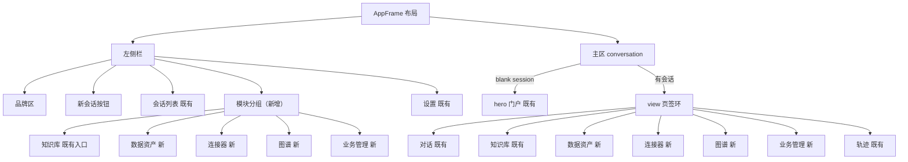

# 02 产品 UI/UX 详细设计 — DSH 企业 AI 数据产品 Web 端（架构 v2 页面层）

> 设计输入：[uiux-patterns.zh.md](../../research/2026-09-06-nocobase-integration/uiux-patterns.zh.md)（业界模式 17 源 + 仓库前端现状盘点）、[sections/02-nocobase-ui-dsh-integration.zh.md](../../research/2026-09-06-nocobase-integration/sections/02-nocobase-ui-dsh-integration.zh.md)（无头 API 面与槽位落点）、[sections/03-ontology-kg.zh.md](../../research/2026-09-06-nocobase-integration/sections/03-ontology-kg.zh.md) §5（可视化交互）、[PLAN.md](PLAN.md) 决策 D-1~D-6。
>
> 设计先例：[plans/kb-workbench-redesign/02-design.md](../kb-workbench-redesign/02-design.md)（KB 工作台重设计的结构与技术约束调研格式）。
>
> 硬约束（全程有效）：样式只骑 `--dsw-alias-*`/`--dsw-font-*`/`--dsw-shadow-*` token（[docs/web-styling.zh.md](../../docs/web-styling.zh.md)）；新 UI 走 `packages/client/ui-*` 插件 + ui-slots 扩展点；不改 apps/web 壳；**无 react-router，"页面"= 槽位注册 + conversation.view 页签环**；呈现为 args 纯函数；locales 双语（zh 主）；不破坏既有 e2e。

## 〇、技术约束调研结论（设计依据，全部源码走查实证）

1. **无路由库**：DSH Web 视图切换靠 `conversation.view` list slot（id/order/label）+ view bridge（ui-kb 的 requestKbView/settleWorkbench 先例），页面 = 页签而非路由。
2. **ui-kb 七槽位样板**：`sidebar.footer.action` + `conversation.hero.headline` + `conversation.input.dock` + `conversation.view` + `conversation.session.header.actions` + `tool.call.toolview`（keyed）+ `settings.section`——一个功能插件覆盖门户/会话/设置三面。
3. **工具行双呈现**：`tool.call.toolview` keyed by 工具名（kb_*/connector_discover/order_* 已占 7 key）+ render intent（generic/terminal/diff/search/web）——"agent 工具结果 → 结构化实体卡片"管线现成，新页面与对话流共享同一结果双呈现。
4. **no-session 分支已有先例**：KbEntry 处理空白会话；market/connectors 页须同样支持无会话浏览（市场是运营页面，不绑定会话上下文）。
5. **BFF 公式**：apiproxy 新域 = "一个新文件对 + 一个字段 + 一行映射行"（[api/index.ts:24](../../packages/host/apiproxy/src/api/index.ts) 注释原文）；未组合能力返回结构化 `*-not-composed`。
6. **状态/数据层**：`createSnapshotStore`（dsh-client-runtime）共享缓存；`connection.api` 直取 IApiClient，响应统一 `unwrap()`。
7. **e2e 约定**：页面测试走 apiProxy face（不依赖 UI DOM）+ 包内 client spec；快照锁 transcript。

## 一、信息架构（导航重设计）

### 1.1 IA 图



裁决（回应 D 报告开放问题 1）：**双入口 + 页签环**——侧栏模块入口负责"从任何地方一键进入"（含无会话时的独立面板分支），进入后以 `conversation.view` 页签呈现保证"随时切回对话"（三级 AI 入口层次的模式 B：全局会话 + 页面内嵌 + 场景入口）。每个新页签 id：`market`(order 11)/`connectors`(12)/`kg`(13)/`business`(14)——排在 kb(10) 之后、trajectory 之前。

### 1.2 五个页面的定位与数据源

| 页面 | 页签 id | 数据源（BFF 域） | AI 关系 |
|---|---|---|---|
| 数据资产市场 | `market` | `assets.*`（聚合 connector.discover + orders + catalog） | 问数/下单走会话或页内问数框 |
| 连接器 | `connectors` | `connectors.*`（connector 缝 + transfer 记录） | 数据源接入向导 AI 辅助 |
| 知识图谱 | `kg` | `kg.*`（schema/subgraph/expand/stats） | kg_subgraph 工具行"在图谱中查看"跳转源 |
| 业务管理 | `business` | `nocobase.*`（listMeta/list/get typed 域） | 对话优先 CRUD 的查看面 |
| 会话（对话） | 既有 | — | AI 主交互（槽位填充→确认卡→实体卡回写） |

## 二、AI 交互模式（贯穿全部页面的总纲）

### 2.1 核心流：槽位填充 → 确认卡 → 执行 → 实体卡回写

- **确认卡是唯一的"表单"**：键值对只读展示 + 单槽内联编辑 + 确认/取消两键；槽位值由 agent 参数推导（复用 [order-tool-model.ts](../../packages/client/ui-kb/src/client/toolviews/order-tool-model.ts) 纯函数模式，不新增会话状态）。
- **缺槽追问而非表单**：agent 逐槽追问；枚举槽给候选建议（从目录实体取，Bloom 参数建议三源模式的"枚举建议"档）。
- **状态卡异步演进**：下单后 pending → 审批 → delivered/failed；UI 把订单状态映射到卡片徽标（事件源已有）。

### 2.2 操作确认分级表（冻结为产品规则）

| 操作类型 | 交互形态 | 理由 |
|---|---|---|
| 查询/检索/问数（只读） | 纯对话，无确认 | 零副作用；结果卡自带引用 |
| 创建草稿/入库文档 | 对话直接执行，结果卡可撤销 | 低风险；同名替换语义可回滚 |
| 下单（费用/合同） | **确认卡必选**（金额/条款/交付方式） | 不可逆+资金 |
| 支付/签约 | 确认卡 + 二次显式确认 | 高风险双重确认 |
| 权限授予/API key | 确认卡 + 权限范围逐项勾选 | 安全边界 |
| 批量操作（清数据/重同步） | 确认卡列影响范围（N 行/M 表） | Airbyte 先例 |
| 简单过滤/排序/翻页 | 保留轻量控件（列表头） | CIP 判据：简单 CRUD 不对话化 |
| 建表/本体建模 | 对话描述 → schema 预览卡（表格）→ 确认 → nb_create/collections:create | 生成后核对 |
| 图谱页写操作 | 一律显式确认卡 | Bloom 教训：不允许"搜索即写入" |

### 2.3 信任与治理配套

- 引用信任：答案引用的文档/数据集带"已验证"徽标（Notion Verify + Genie verified answers 双先例）。
- 用量透明：设置页用量面板（检索/入库/嵌入/交付/KG 查询分项，kb_stats+kg_usage_counters 扩展）。
- AI 权限边界：设置声明角色可用工具集；不可用工具结构化拒绝内联展示（ui-kb refusal 先例）。
- 审计：对话日志单一事实源（model-visible ⟺ logged 不变量），确认卡与执行天然留痕。

## 三、页面详设（线框级）

### 3.1 数据资产市场（ui-assets，页签 `market`）

**结构**（三层：板块门户 → 目录 → 详情）：

```
┌─ market 页签 ────────────────────────────────────────────┐
│ [板块门户]  hero：板块名+一句话价值                         │
│            计数行：数据产品 N · 供方 N · 本月成交 N          │
│            典型数据集卡 ×3（人工运营位）                     │
│            应用场景标签云（食品出海/合规/供应链…）            │
│ [目录]     搜索框 + 筛选组×4（类型/可用性/支持级/用例）       │
│            计数行 "Showing X of Y" + Clear all            │
│            数据集卡栅格：名称/≤2分类/短描述/质量徽标/更新频率  │
│ [详情]     多 Tab：概览|Schema|样例数据|质量|血缘|授权条款    │
│            右侧常驻 Right Panel：提供方/标签/Tier/用量        │
│            底部操作条：[问数] [下单（确认卡）] [引用并提问]    │
└──────────────────────────────────────────────────────────┘
```

- 详情页字段集按 AWS DX 标准：长描述必含"数据覆盖量 + 更新频率"；Schema Tab = 字段表（列名/类型/描述）；样例 = 前 N 行只读表；质量 = 引用命中统计+校验状态；授权条款 = license/计价/交付形态。
- 下单流：页内"下单"按钮或对话皆可 → 确认卡（数据集/金额/条款/交付方式）→ `order_create`（service_id 指向数据集商品）→ 订单回执卡 → 状态卡异步演进（审批 → 交付）。订单域零改造复用。
- 冷启动义务：上线前种子 = 张会长专家数据集（dataset.json 真源）+ 海关进出口样例表 + 11 篇语料衍生数据集；典型产品卡人工撰写。

**组件清单**：MarketHeroDock（复用 KbHeroDock 场景卡栅格结构）/ DatasetCardGrid / DatasetDetailTabs / RightPanel / OrderConfirmCard（新，确认卡基座）/ AskDatasetBar（页内问数框，预填"关于<数据集名>"到会话）。

**槽位与数据流**：`conversation.view`(id:market) + `sidebar.footer.action`(市场入口) + `tool.call.toolview` key `connector_discover`（市场卡片与工具行双呈现）；BFF `assets.list/detail/stats`（聚合 connector 缝 discover + catalog）；下单走既有 orders 面。

### 3.2 连接器（ui-connectors，页签 `connectors`）

```
┌─ connectors 页签 ─────────────────────────────────────────┐
│ [目录]  搜索 + 筛选：类型（数据源/交付目标）/可用性/支持级/用例  │
│         连接器卡：图标/名称/徽标（官方认证·社区）/描述/已连接数  │
│ [交付跟踪] 连接行：名称/状态徽标(六态)/下次同步/数据量/趋势图   │
│         展开流级：表级状态（同步中/错误/需处理）逐行图标        │
│         运行历史：时间线（次数/成功率/记录数）+ 失败下钻        │
│ [新增数据源] 向导（AI 辅助）：对话描述需求 → 推荐 provider      │
│         + 参数槽位填充 → 测试连接 → 确认启用                   │
└──────────────────────────────────────────────────────────┘
```

- **状态枚举首版冻结**（Airbyte 全集）：连接级 Healthy/Failed/Running/Paused/Queued；流级 Synced/Syncing/Pending/Queued/Error(可自愈)/ActionRequired。错误分色：红=配置/授权需处理，黄=瞬态重试中。
- 交付跟踪数据源：connector 缝 transfer 记录（lakehouse transfers 表）+ orders 交付物；运行历史扩展 ui-workflow-run 的运行视图模式。
- 向导复用 KbIngestDialog 三 Tab 骨构（Tab+逐项进度+幂等提示），AI 辅助=会话预填。

**组件清单**：ConnectorCatalogGrid / ConnectionRow（StateDot 徽标）/ StreamStatusList / RunHistoryTimeline（扩展 ui-workflow-run）/ ConnectWizard。
**槽位与数据流**：`conversation.view`(id:connectors) + `sidebar.footer.action`；BFF `connectors.list/connections/transfers`（connector 缝投影）。

### 3.3 知识图谱（ui-kg，页签 `kg`）

```
┌─ kg 页签 ────────────────────────────────────────────────┐
│ [工具条] 搜索短语框（"供应商→商品的供货路径"式自然语言）       │
│          实体搜索（别名解析）| 图例/类型过滤（注册表层）        │
│ [画布]   sigma.js 力导向子图（默认 seeds=高信号实体, hops=1）  │
│          双击节点=展开邻居(kg.expand) 点击=详情侧栏           │
│          两点选择=路径高亮(graphology 最短路, 非邻居灰化)      │
│ [详情侧栏] props/类型/来源 provenance（nocobase:orders/912）/度数 │
│          [问此实体]（注入会话）[展开] [收起]                  │
└──────────────────────────────────────────────────────────┘
```

- 搜索短语 = 预定义图查询的自然语言包装（Bloom 模式），MVP 实现 3-5 个内置短语（"X 的供货链"/"X 的订单"/"含 Y 的商品"），后端化为 kg.subgraph 的 seeds+hops+relation_types 参数模板；**只读**（写操作走会话确认卡，禁止"搜索即写入"）。
- 按需加载序列：进入页签 → kg.schema（图例/过滤）→ kg.subgraph(seeds, hops:1, max_nodes:500) → 双击 kg.expand(id, 200)（已有坐标保留，新节点挂种子周边，局部 FA2）。
- 节点色板 = 注册表类型映射 ui-theme 新增静态刻度（`--dsw-graph-node-*`），非页面私有色。
- kg_subgraph 工具行（对话内）加"在图谱中查看"按钮：跳 kg 页签并注入 seeds（工具结果双呈现）。

**组件清单**：KgGraphCanvas（SigmaContainer 封装，sigma/graphology/@react-sigma 三件套动态 import 懒加载）/ KgSearchPhraseBox / KgLegend / KgDetailsPanel / KgToolRow。
**槽位与数据流**：`conversation.view`(id:kg) + `tool.call.toolview` key `kg_subgraph`/`kg_schema`；BFF `kg.schema/subgraph/expand/stats`。

### 3.4 业务管理（ui-business，页签 `business`）

```
┌─ business 页签 ──────────────────────────────────────────┐
│ [顶部]   collection 切换（nocobase.listMeta 动态实体清单）    │
│          + 问数输入框（"上月 pending 订单有多少"→ 会话）      │
│ [实体流]  实体卡片列表（默认视图，非传统表格——对话优先）        │
│          卡：主标签/关键 props/状态徽标/来源行                │
│          [问此实体] [编辑（对话）] [新建（对话）]             │
│ [表格视图] 辅助查看面：轻量列筛选/排序/翻页（simplePaginate   │
│          hasNext 模式，无 total）                           │
│ [高级配置] iframe 辅助入口（embed 代签，低频管理：UI 编辑器/   │
│          角色权限细配）—— 明确"辅助"定位，非主交互             │
└──────────────────────────────────────────────────────────┘
```

- 编辑/新建**不渲染表单**：点击 → 注入会话（"帮我新建一个客户，名称…"）→ agent 槽位填充 → schema 预览卡 → 确认 → nb_create/nb_update → 实体卡回写。
- collection 清单动态来自 `nocobase.listMeta`（过滤 hidden/系统表）；字段展示取 title（展示名）。
- iframe 辅助：V6 批实现（DSH 后端代签 token → `/embed/<pageId>?token=xxx`）；hash 路由规避子路径问题。

**组件清单**：BizCollectionSwitch / EntityCardStream / EntityCard / BizTableView（辅助）/ EmbedAdminEntry。
**槽位与数据流**：`conversation.view`(id:business) + `sidebar.footer.action`；BFF `nocobase.listMeta/list/get`（读路径）；写路径走 agent 工具（nb_create/nb_update）不直连。

### 3.5 会话内新增呈现（ui-kb 扩展 + 新工具行）

- `nb_list/nb_get/nb_create/nb_update` 工具行（业务实体卡：主标签/props 摘要/来源 collection 行；写操作前呈现 diff 确认语义由会话流程承担）。
- `kg_schema/kg_subgraph` 工具行（子图摘要行 + truncated 信号 + "在图谱中查看"）。
- 订单/交付状态卡沿用既有 OrderToolRow 演进（确认卡升级）。

## 四、组件复用与新增总表

| 类别 | 复用（既有） | 新增 |
|---|---|---|
| 布局/导航 | ui-layout/ui-sidebar/view ring | ModGroup 侧栏分组（sidebar 槽位扩展或 footer.action×5） |
| 基础件 | ui-primitives（Button/Modal/StateDot/Icon） | OrderConfirmCard（确认卡基座）/ EntityCard / DatasetCard / ConnectorCard |
| 数据展示 | KbHitCard（编号徽标/高亮模式）、OrderToolRow（两态卡）、ui-workflow-run 运行视图 | DatasetDetailTabs / RightPanel / StreamStatusList / RunHistoryTimeline / KgGraphCanvas+DetailsPanel / EntityCardStream / BizTableView |
| 工具行 | toolview keyed 注册管线 + render intent | key: nb_*、kg_*；market/connectors 页共享 connector_discover 双呈现 |
| 图形 | — | sigma.js 三件套（懒加载，~42KB gzip 不进主 bundle） |
| 状态层 | createSnapshotStore / connection.api / unwrap | marketStore / connectorsStore / kgStore / bizStore（各插件私有） |

## 五、状态矩阵（每页四态，实现批验收项）

| 页面 | 空态 | 加载 | 错误 | 降级 |
|---|---|---|---|---|
| market | 种子目录保证非空；真空态给"数据集入库指引"卡 | 骨架卡 | `connector-not-composed`/网络错误→人话重试 | discover 降级=显示湖仓本地目录子集 |
| connectors | 无连接→引导向导 | 徽标骨架 | provider unavailable 结构化说明（缺凭据指引） | transfer 记录缺失=仅目录态 |
| kg | 图谱未构建→"运行 kg-build"指引（含预计动作） | 画布骨架+图例骨架 | `kg-not-composed` 说明 | kg 引擎缺失=类型清单仍可看 |
| business | NocoBase 未启动→启动指引（setup 六命令链接） | 卡片骨架 | `nocobase-not-composed`/超时→重试+iframe 备选入口 | listMeta 失败=缓存清单+过期标记 |

## 六、locale 与文案原则

- 全部新词条业务化（P3"说人话"沿用）：数据集/连接器/交付/审批/图谱实体；collection/endpoint/provenance 等技术词不露出（详情侧栏"来源"行显示人话路径）。
- 每插件独立 locale namespace（market/connectors/kg/business），zh 主 en 副，thunk label 跟随切换。

## 七、验收（设计文档层面）

- [x] 每页有：线框结构 + 组件清单 + 槽位落点 + BFF 域 + 数据流 + 四态矩阵。
- [x] AI 交互总纲与确认分级表冻结（§二）。
- [x] 与 web-styling/ui-* 槽位体系的映射完整（§四）。
- [ ] 评审通过后进入 V5/V6 实施批（本文档是页面批的规格输入）。
