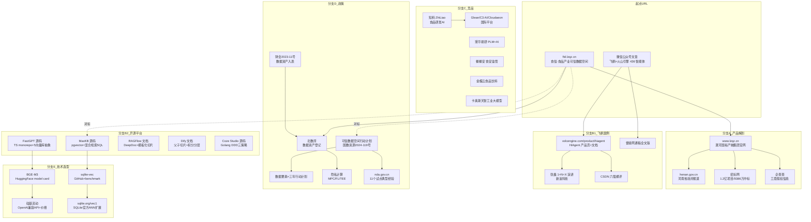

# 食品产业可信数据空间 + 知识库 Agent：L4 深度调研报告

- **日期**：2026-08-28
- **深度**：Thorough（L4，6 个 DIVE 分支全部饱和）
- **信源**：40+ 独立信源（官网全站 14 路由页、政府文件 5 份、招标公告 2 份、开源仓库 5 个源码级/文档级审计、竞品官网 9 个、技术 benchmark 4 份）
- **三角化**：42 项关键主张中 31 项经 ≥2 独立源验证；9 项矛盾全部显式表征
- **标记体系**：【实证】= 抓取到的原文/官方页面；【推断】= 基于证据的合理推断，均随文标注

---

## 一、核心结论（TL;DR）

**1. 对标产品是"真项目 + 原型站"的组合体【实证】**
"食信·食品产业可信数据空间"（https://ftd.lzqz.cn/）是豫中南数字产融平台建设运营的食品产业专项载体。其背后实体链为：漯河国裕产融科技集团有限公司（漯河投资集团全资子公司，总资产 1000 亿、AA+ 评级主体的旗下公司）× 京东集团。项目本体真实存在：《食品产业（食品安全）可信数据空间项目》总预算 1.2 亿元，2026-02-14 咨询设计招标、2026-07-21 建设招标、2026-08-13 公示中电信数智河南分公司以 9386 万元中标。但 ftd.lzqz.cn 本身是原型/演示站（ICP 备案号与联系电话均为占位符 XXX、视频全部加载失败、企业工作台用"双汇"做演示账号）。

**2. 商业模式三层结构清晰可抄【实证】**
- 引流层：免费版 ¥0（50GB 存储 + 每日 100 AI 积分 + 每月 3 次免费食安合规自查 + 6 项免费权益）
- 订阅层：18 款 Agent 按"拟人职位"命名定价（AI 设备维护主管 ¥99/月 ~ AI 退税管家 ¥299/月），企业版 ¥1999/月全量
- 变现层：数据资产化服务（确权→评估→入表→融资撮合，宣称平均入表 1800 万、对接北数所）+ 出口托盘垫付（退税 3 天到账 vs 传统 30-60 天）
- 积分经济学：按任务复杂度分级计价（简单问答 1 分/数据分析 5 分/报告生成 20 分/视频分析 30 分），精确控制免费额度成本

**3. 飞鹤×火山引擎案例数字交叉验证一致，但全部同源【实证+推断】**
436 个智能体、近 3 个月活跃用户 24 万+、Tokens 消耗近 230 亿——经微信原文、雷锋网、新浪、同花顺、InfoQ、firecat 等 5+ 渠道核对数字完全一致，但均为同一通稿的多渠道分发，无独立第三方核实。三大标杆案例（AI TPM 故障恢复 104h→47h、精工膜创年省 50 万+节水 14.4 万吨、鹤勤智联流程节点 15→5）的技术栈构成与组织机制已解明，方法论可复制。

**4. 开源平台格局：五强各有所长，共识模式浮现【实证】**
MaxKB（pgvector 单库 + 三路混合检索 SQL）、FastGPT（TypeScript monorepo，与我方 harness 技术栈最同构，5 向量库后端抽象）、RAGFlow（深度文档解析 + 模板化切片）、Dify（父子切片 + 消费积分分层）、Coze Studio（Golang DDD + 解析/切片/检索三策略结构体）。行业共识：混合检索（向量+全文）+ 可选 rerank（失败静默降级）+ 多租户/RBAC/SSO 永远是最高付费墙。

**5. 竞品市场存在明确空白带【实证+推断】**
9 个竞品扫描显示市场两极分化：研发个人工具（知料，免费）与集团项目制（璞华/金蝶/卡奥斯，不公开定价）之间，¥99-199/月档位覆盖"市场洞察+工艺+食安+成本测算+原材料供应链"五合一的中小食品企业订阅带无人占据；"原材料行情→配方成本→定价建议"跨域联动 agent 国内外均无产品化实现。

**6. 政策依据链完整且可引用【实证】**
数据二十条（三权分置）→《"数据要素×"三年行动计划》（现代农业五大提法，含"产业链数据融通创新+供应链金融"）→《可信数据空间发展行动计划（2024-2028）》（2028 年建成 100+ 可信数据空间）→ 2025-07 首批 63 个试点（农业方向列第 11）→ 财会〔2023〕11 号（数据资产入表）→ 北数所双证书实践（豫中南平台 2026-06-01 获登记，估值 1383.69 万元）。注意：财会〔2025〕33 号规定 2026 年起不得以评估值入表。

**7. MVP 技术选型结论明确【实证】**
知识库 = SQLite + sqlite-vec（与现有会话持久化同构；<10 万切片在舒适区，10 万级暴力扫描约 13ms 且召回 100%；作者已进 SQLite 官方生态，sqlite.org 官方托管 Vec1 扩展证明该路线是官方方向）；Embedding = 硅基流动 BAAI/bge-m3 免费档（OpenAI 兼容 /v1/embeddings，1024 维，8192 token 上下文）+ 本地 ollama 离线备份；MVP 阶段不引入独立向量库。迁移触发线：切片 >50 万、P99 >100ms、或多 agent 共享检索服务。

**8. 关键风险已识别【实证+推断】**
原型站宣称的运营数据（1700+ 入驻企业、7.9 亿年出口额）与项目时序矛盾（实体项目 2026 年才启动招标）——【推断】这些数字实为豫中南 B2B 交易平台数据的移植或纯演示数字。"DeepSeek Harness 微内核"技术架构仅见于原型站自述，无任何招标文件或外部信源佐证。

---

## 二、分维度结论速览

| 维度 | 章节 | 一句话结论 |
|---|---|---|
| A 产品/公司定位 | 第 2 章 | 政府背景城投×京东的真项目 + 原型站，三层商业模式，三步走 2026Q4-2028+ |
| B 落地模式（案例） | 第 3 章 | 飞鹤方法论：场景四标准、统一底座先行、创新大赛、五维评价 |
| B 落地模式（平台） | 第 4 章 | 五大开源平台 RAG 管道与商业化路径，FastGPT 架构最同构 |
| C 竞品 | 第 5 章 | 9 竞品地图：中小食品企业五合一订阅带是空白 |
| D 政策 | 第 6 章 | 政策链完整可引用，豫中南已跑通北数所确权入表 |
| E 技术选型 | 第 7 章 | SQLite+sqlite-vec+BGE-M3 免费档，零向量库依赖 |
| MVP 影响 | 第 8 章 | 存储检索/embedding/数据采集/agent 服务四方面具体建议 |

---

## 三、不确定性分级总览

| 级别 | 定义 | 本报告中的典型主张 |
|---|---|---|
| **Critical**（多源验证） | ≥2 独立源交叉验证 | 食信平台信息架构与定价（官网 14 页 + JS bundle 逆向）；飞鹤案例数字（5+ 渠道）；政策文件原文（gov.cn + nda.gov.cn）；sqlite-vec 能力（GitHub + benchmark + sqlite.org）；开源平台商业化数字（官网定价 + GitHub） |
| **Important**（单源，已对冲） | 单一可靠来源，随文标注 | 漯河国裕工商信息（企查查单源）；中标金额 9386 万（招标网单源）；各竞品自述案例数字（官网单源，标注"厂商自述"） |
| **Observation**（推断/推测） | 基于证据链的推断，明确标注【推断】 | 原型站运营数据为演示数字；差异化定位建议；MVP 成本估算；飞鹤 230 亿 tokens 统计口径疑问 |

---

## 四、关键矛盾提示（详见第 9 章）

1. 原型站宣称数据 vs 实体项目时序（2026 年才招标 vs 宣称 1700+ 企业）
2. 三步走路线图两版时间线不一致（首页 vs about 页）
3. 混合检索融合策略三家分歧（MaxKB 加法融合 vs FastGPT RRF vs Dify rerank 模型）——需实测裁决
4. 飞鹤案例单一通稿源，无独立核实
5. 财会〔2025〕33 号禁止评估值入表 vs 各地仍以评估价宣传融资规模

---

*报告导航：第 1 章方法与信源图谱 → 第 2 章对标产品解剖 → 第 3 章飞鹤案例 → 第 4 章开源平台 → 第 5 章竞品地图 → 第 6 章政策依据 → 第 7 章技术选型 → 第 8 章 MVP 建议 → 第 9 章矛盾与局限 → 来源清单*


# 第 1 章 调研方法与信源图谱

## 1.1 调研流程

本次调研采用 L4 深度调研状态机（SCOUT → MAP → DIVE → SATURATE → SYNTHESIZE），全部数据获取由 6 个独立深挖子任务并行完成，每个子任务负责一个数据源分支直到信息饱和（新信息重复或与目标无关即停止）。

| 阶段 | 动作 | 产出 |
|---|---|---|
| SCOUT | 抓取两个起点 URL（微信文章 + ftd.lzqz.cn 首页） | 关键实体清单：漯河国裕产融/豫中南平台/火山引擎 HiAgent/北数所/DeepSeek Harness 底座自述 |
| MAP | 构建知识图谱，标记 6 个高价值未探索分支 | DIVE 分支规划 |
| DIVE | 6 个子任务并行深挖（官网全站/HiAgent×飞鹤/开源平台审计/政策/竞品/技术选型） | 每分支 800-1500 字结构化发现 + 新节点 + 饱和判定 |
| SATURATE | 聚合判定：深度 6/6 饱和、广度无新高价值节点、三角化达标 | FULLY_SATURATED |
| SYNTHESIZE | 编排者综合全部子任务返回撰写本报告 | 9 章报告 |

## 1.2 工具与信源获取方法

- **浏览器抓取**：chrome-devtools 驱动浏览器，DuckDuckGo 搜索（过滤 Sponsored/Ad），evaluate_script 提取页面结构化内容（h1/h2/h3/p/blockquote/li/table）
- **SPA 逆向**：ftd.lzqz.cn 为 SPA，子任务从 JS bundle 提取完整路由表，发现导航未暴露的 /register（完整定价）与 /enterprise 族（企业工作台演示）共 14 个路由
- **源码级审计**：MaxKB/FastGPT 通过 GitHub contents API 逐文件读取核心源码（本地浅克隆因网络 early EOF 失败，改用 API 通道完成等效虚拟审计，覆盖 FastGPT 5 个核心文件、MaxKB 6 个、Coze 3 个）
- **政府信源交叉**：gov.cn 政策库 + nda.gov.cn（国家数据局）+ henan.gov.cn（河南省政府）+ 招标网 + 企查查，五源交叉验证公司主体与项目进展
- **微信文章**：直接抓取成功（无反爬），全文提取

## 1.3 知识网络图谱



## 1.4 信源分布统计

| 信源类型 | 数量 | 代表 |
|---|---|---|
| 对标产品官网（全站） | 2 站 19 页 | ftd.lzqz.cn（14 路由）、www.lzqz.cn（5 页） |
| 政府官方文件/报道 | 6 | gov.cn 政策库 ×3、nda.gov.cn ×2、henan.gov.cn ×1 |
| 招标/工商 | 3 | 招标网 ×2、企查查 ×1 |
| 厂商官方（产品/文档） | 8 | volcengine ×3、maxkb.cn、ragflow.io、dify.ai、ollama、huggingface |
| 媒体报道 | 8 | 雷锋网、新浪、CSDN、搜狐、头条等 |
| 开源仓库（源码级） | 3 | MaxKB、FastGPT、coze-studio |
| 开源仓库（文档级） | 2 | RAGFlow、Dify |
| 竞品官网 | 9 | 知料、璞华、餐餐安、金蝶、卡奥斯、神农API、Glean、C3、Cloudaeon |
| 技术文档/benchmark | 5 | sqlite-vec GitHub、sqlite.org/vec1、dreaming.press、vucense、snapvec |

## 1.5 证据强度声明

- 每章关键主张随文标注【实证】（抓取原文）或【推断】（证据链推断）
- 竞品案例数字多为厂商官网自述，统一标注"厂商自述"
- 飞鹤案例虽经 5+ 渠道核对，但均为同一通稿分发，本报告在第 3 章明确此局限
- 完整来源 URL 清单见 sources/sources.md


# 第 2 章 对标产品解剖：食信·食品产业可信数据空间（维度 A）

## 2.1 产品定位与一句话画像

**【实证】**"食信·食品产业可信数据空间"（https://ftd.lzqz.cn/）自我定位为"数据高铁网 · AI 发电厂"——AI Agent 矩阵 + 可信数据空间双核心平台，服务食品企业的降本增效、数据变现、安全合规、食品出海四大诉求。首页宣称 1700+ 入驻企业、3000+ 品类、150+ 出口国家。

**【实证】**建设运营方标注为"豫中南数字产融平台"；页脚热线 400-888-0395、邮箱 service@food-dataspace.cn；ICP 备案号为占位符（豫ICP备XXXXXXXX号）——**该站是原型/演示站**，视频全部加载失败，企业工作台使用"双汇食品有限公司"做演示账号。

**【推断】**结合招标时序（见 2.6），该站是 1.2 亿元实体项目的产品原型与招商演示载体，其宣称的运营数字（1700+ 企业、7.9 亿出口额）实为豫中南 B2B 交易平台既有数据的移植或演示数字。

## 2.2 完整信息架构（SPA 路由表，从 JS bundle 逆向提取）

**【实证】**全站 14 个路由：

```
/（首页）
├─ /guide/agents（AI Agent 矩阵：10 款通用 Agent）
├─ /guide/data-asset（数据资产价值链：确权→评估→入表→融资）
├─ /guide/food-safety（食品安全服务）
├─ /guide/food-export（食品出海：8 款出海 Agent）
├─ /data-tools（数据工具与知识库）
├─ /about（关于我们）
├─ /register（注册页，含完整三档定价）
└─ /enterprise（企业服务平台，演示账号"双汇食品有限公司"）
   ├─ /enterprise/data-asset（数据资产中心）
   │  ├─ /rights（确权 4 步向导）
   │  ├─ /evaluation（五维估值）
   │  ├─ /booking（入表流程）
   │  └─ /financing（融资增信）
   ├─ /enterprise/device-maintenance（设备维护 8 步演示）
   └─ /enterprise/food-safety（食安免检 8 步演示）
```

**信息架构设计模式【实证+可借鉴】**：营销层（4 个场景 Guide 页：痛点→方案→产品矩阵→价值数字→生态伙伴→CTA）与产品层（企业工作台 + 分场景流程演示）分离；流程演示做成带"自动播放"的分步向导（设备维护 8 步/免检 8 步/确权 4 步），比静态介绍更有说服力。

## 2.3 Agent 产品矩阵与定价体系

### 2.3.1 10 款通用 Agent（/guide/agents）【实证】

| Agent 名称 | 月费 | 宣称效果 |
|---|---|---|
| AI 设备维护主管（热门） | ¥99 | 故障率↓65%、维护成本↓40% |
| AI 采销主管 | ¥199 | — |
| AI 食安服务主管 | ¥149 | — |
| AI 食安巡检 Agent | ¥99 | — |
| AI 营销洞察主管 | ¥99 | — |
| AI 新品研发助手（热门） | ¥149 | 研发周期↓50% |
| 消费者洞察主管 | ¥199 | — |
| 智能品控主管 | ¥149 | — |
| AI 自有品牌顾问 | ¥199 | — |
| AI 库存与定价管家 | ¥99 | 人力成本↓70% |

### 2.3.2 8 款出海 Agent（/guide/food-export）【实证】

| Agent 名称 | 月费 | 亮点 |
|---|---|---|
| **AI 退税管家（杀手级）** | ¥299 | 3 天退税 vs 传统 30-60 天，平台托盘垫付 |
| AI 海外市场洞察官 | ¥199 | — |
| AI 出海合规官 | ¥149 | 340+ SKU 合规扫描 |
| AI 报关物流官 | ¥149 | — |
| AI 供应链金融官 | ¥199 | — |
| AI 渠道匹配官 | ¥149 | — |
| AI 出海项目经理 | ¥199 | — |
| AI 产品研发官 | ¥199 | — |

### 2.3.3 三档套餐（/register，从隐藏路由发现）【实证】

| 档位 | 价格 | 内容 |
|---|---|---|
| 免费版 | ¥0 | 50GB 存储 + 每日 100 AI 积分 + 6 项免费权益（含每月 3 次免费食安合规自查） |
| Agent 订阅版 | ¥99-299/月/Agent | 每月 5000 积分 + 订阅 Agent 不限次使用 |
| 企业版 | ¥1999/月起 | 10 款全量 + AI 不限量 + 入表服务 + 私有化可选 |

### 2.3.4 积分经济学【实证】

按任务复杂度分级计价：简单问答 1 积分、数据分析 5 积分、报告生成 20 积分、视频分析 30 积分。每日 100 积分≈10-20 次对话；连续签到 7 天 +50 积分；邀请好友有奖励。

**【可借鉴】**积分分级是控制免费额度成本的精确阀门：视频分析（30 分）天然限制免费用户滥用高成本能力。

### 2.3.5 Agent 命名法【实证+可借鉴】

全部采用"主管/管家/官"拟人职位命名（AI 设备维护主管、AI 退税管家、AI 出海合规官），按企业组织架构映射角色，降低中小企业主理解门槛。

## 2.4 四大业务模块详情

### 2.4.1 数据资产价值链（/guide/data-asset + /enterprise/data-asset）【实证】

- **四步流程**：确权（4 步向导）→ AI 评估（五维估值：质量 25% + 稀缺 20% + 场景 25% + 规模 15% + 合规 15%）→ 入表 → 融资增信
- **宣称数字**：平均入表 1800 万元、融资周期 3-6 月→2-4 周、成本降 30%
- **确权编号样例**：BDEX-2026-00125~127（BDEX=北数所数据交易所编码前缀）
- **三权分置**：持有权/加工使用权/产品经营权（对应"数据二十条"产权框架）
- **技术保障**：北数所增信 + 数据沙箱"数据不出域"

### 2.4.2 食品安全服务（/guide/food-safety）【实证】

- **定位口号**："帮你免检查而不是应付检查"
- **宣称数字**：视频巡检识别率 92%+、100+ 违规场景库、溯源 7 天→秒级、台账人工-80%、检查通过率 95%
- **8 步免检闭环**：数据汇集→完整性检查→智能补齐→材料生成→一键直报监管→评估→跟踪→获免检
- **生态**：华测检测、谱尼测试、ISO22000/HACCP 认证、食安责任险

### 2.4.3 食品出海（/guide/food-export）【实证】

- **托盘模式 4 步**：企业内贸卖给平台→平台作为出口主体报关退税→3 天垫付退税款→信用证打通采购
- **政策对标**：启运港退税、9810 跨境 B2B、一类企业绿色通道
- **生态**：中信保、GS1、国际物流、海外渠道
- **宣称**：7.9 亿年出口额、60 家备案企业

### 2.4.4 数据工具与知识库（/data-tools）【实证】

- **多源接入**：ERP（用友/金蝶/SAP）、MES、WMS、Excel、IoT（PLC/工控机）、API
- **治理流水线**：5 步（含自动标注）
- **知识库构成**：文档解析 + 向量索引 + 知识图谱 + Agent 调用
- **关键设计**：答案必须带引用溯源（演示中显示"设备手册 P45-52"级别的出处）——**企业信任的关键设计**
- **免费钩子**：50GB 免费存储

## 2.5 技术架构自述

**【实证】**首页"混合智能架构"四层：

1. **应用层**：Agent 矩阵（18 款）
2. **Agent 运行底座**：**DeepSeek Harness 微内核**（插件热插拔、多租户隔离、安全护栏）
3. **混合模型层**：私有化 13B-34B 模型 + 公域 DeepSeek-R1/V3 API + 智能路由 + 脱敏网关
4. **基础设施**：云/边缘/IoT/5G

安全认证自述：等保三级、国密、隐私计算、区块链存证、ISO27001。

**【推断】**"DeepSeek Harness 微内核"仅见于原型站自述，招标文件与外部信源均无佐证，可能是占位性技术叙事——但这恰好说明我方自研 harness 路线与该平台的公开技术叙事完全同构。

## 2.6 公司主体与项目实体（四源交叉验证）

### 2.6.1 股权与主体链【实证】

- **漯河国裕产融科技集团有限公司**（www.lzqz.cn，豫ICP备2024092052号）
- 母公司：漯河投资集团（2021-12 组建，注册资本 30 亿，总资产 1000 亿，AA+ 评级，近 200 家子公司）
- 官网自述：2025-10-10 集团化成立，前身为 2024-05 设立的漯河城投产融科技有限公司
- 企查查工商信息：注册 2020-10-15、注册资本 1 亿、法人郭夏蒲（董事长）、总经理任江鹏、统一信用代码 91411100MA9FUNP109
- **【矛盾】**官网成立时间（2025-10-10/2024-05）与工商注册时间（2020-10-15）不一致，可能为更名续存

### 2.6.2 京东合作时间线【实证，来源：漯河市政府/河南省政府通稿】

```
2023-09  市长会见京东
2024-03  市委书记访京东
2024-05-16  漯河市政府与京东集团战略框架协议
2024-09-13  漯河投资集团与京东项目协议（副市长李建仓、京东副总裁符庆明鉴签）
2024-12-27  豫中南数字产融平台上线（3 个月筹备）
2025-03-23  平台交易额破亿（上线 87 天）
2025 全年  总交易额 6 亿+、1786 家企业入驻
```

B2B 成效：开店成本降 3 亿、物流成本降 8%、年授信 2 亿+；B2C：京东全域曝光 + 抖音快手渠道，年省 1300 万运营费。

### 2.6.3 "食信"项目招标链【实证，来源：招标网】

- 项目名：《食品产业（食品安全）可信数据空间项目》
- 招标人：漯河国裕产融；漯河西城区开发区备案；项目代码 2602-411102-04-04-398932；资金 100% 自筹；总预算 1.2 亿元
- 2026-02-14 咨询设计招标（编号 CTZX-ZB26-0201）→ 2026-07-21 建设招标 → 2026-08-13 公示中电信数智河南分公司 9386 万元中标
- 目标表述："覆盖全国的国家级食品产业可信数据空间"
- 2026-03-19 与广东数字智慧科技有限公司签约（疑似技术合作方）

### 2.6.4 政府背书链【实证，来源：河南省政府 2026-06-09 报道】

- 2025-09 漯河获批"国家数据要素综合试验区省级先行区"
- 2026-06-01 豫中南平台数据集获北数所数据资产登记证书 + 产权登记双证书（2000+ 企业供应链、83.1 万条交易、313 仓库，评估 1383.69 万元）
- 正申报国家级食品产业可信数据空间

## 2.7 三步走路线图（两版不一致）

**【实证】**首页版：起步 2026Q4-2027Q1（100 家付费/50 数据集确权/4 款核心 Agent）→ 增长 2027-2028（1000 家付费/100 数据集入表/融资撮合 2 亿）→ 全球化 2028+（一带一路/国际数据空间互联）。

**【实证】**About 版：2026Q4 起步 → 2027Q2 增长 → 2027Q4 成熟 → 2028+ 全球化。

**【矛盾】**两版时间线不一致，且首页版有量化里程碑（更可信），about 版无量化。

## 2.8 矛盾清单（本章汇总）

| # | 矛盾 | 性质 |
|---|---|---|
| 1 | 宣称 1700+ 企业/7.9 亿出口额 vs 实体项目 2026 年才招标建设 | 【推断】演示数字移植自豫中南 B2B 平台 |
| 2 | 企业版存储 /data-tools 写 1TB vs /register 写 500GB | 原型站未对齐 |
| 3 | 成立时间：官网 2025-10-10 vs 工商 2020-10-15 | 更名续存可能 |
| 4 | 地址三处不一致（郾城区/召陵区/源汇区）+ 两个联系邮箱域名 | 原型站拼装痕迹 |
| 5 | 三步走两版时间线 | 原型站未对齐 |

## 2.9 对我方的直接启示

1. **商业模式可整体借鉴**：免费钩子（存储+积分）→ 单 Agent 订阅（角色定价）→ 企业版 → 数据资产化服务纵深；订阅费只是入口，利润在资产化服务与资金服务
2. **杀手级应用单点突破**：退税 3 天 vs 30-60 天是全站最强价值主张——我方 MVP 也需要一个"数字对比极强烈"的场景
3. **引用溯源是信任核心**：知识库答案带文档名+页码，直接决定企业客户付费意愿
4. **政府背书增信**：数据要素试验区 + 北数所确权是获客信任链——我方即使 MVP 阶段也应预留数据资产化叙事接口
5. **原型站先行**：对方用原型站做招商/招标演示，我方 MVP 同样可承担"能力证明 + 融资叙事"双重职能


# 第 3 章 飞鹤×火山引擎：436 个生产端智能体案例深析（维度 B/C）

## 3.1 案例概况与数字交叉验证

**【实证】**来源：微信公众号"火山引擎"2026-08-26 发布《中国飞鹤×火山引擎：436个智能体走进乳业生产一线》（https://mp.weixin.qq.com/s/UJo491Nutt33LvckAlrw6w），全文直接抓取成功。

核心数字：飞鹤生产端依托**火山引擎 HiAgent 平台**搭建统一 AI 应用建设平台，已开发 **436 个智能体**，近三个月活跃用户超 **24 万**，Tokens 消耗接近 **230 亿**。

**交叉验证【实证】**：雷锋网全文版（https://www.leiphone.com/category/industrynews/8JAbV4WxtPfFTCaz.html）、新浪、同花顺、InfoQ、亿欧、firecat 独立摘要版（https://www.firecat-web.com/daily-news/14998）——所有关键数字（436/24万/230亿/104h→47h/34%→8%/50万/14.4万吨/300万/15→5/3倍/200万）**完全一致**。

**【局限·必须声明】**所有报道均为同一通稿的多渠道分发，无独立第三方核实；230 亿 Tokens 的统计口径（是否含失败重试/内部测试）未披露；436 个智能体的活性分布（重度使用 vs 建完闲置）无数据。

**【实证】**战略背景：飞鹤副总裁孙建国表述，生产端已从"要不要投入 AI"进入"哪些场景值得规模化"阶段；2026 年飞鹤数智化战略升级为"3+3+2"，新增 AI 能力中台。

## 3.2 三大标杆案例（含技术栈解构）

### 3.2.1 AI TPM：智能化设备管理操作系统

| 维度 | 内容 |
|---|---|
| 场景 | 设备运维（乳业工厂设备故障诊断与恢复） |
| 技术栈 | 飞鹤 EV 设备管理系统 + HiAgent 平台 + Hermes 智能体框架 |
| 覆盖 | 9 家工厂、千余名工程师 |
| 指标【实证】 | 平均故障恢复时长 104h→47h；重复故障率 34%→8% |
| 交互 | 自然语言提问，数分钟生成跨工厂报告 |

### 3.2.2 精工膜创：克东工厂膜分离工艺清洗优化

| 维度 | 内容 |
|---|---|
| 场景 | 膜分离工艺的清洗参数优化（节水/节药/护膜） |
| 技术栈 | 清洗剂用量/时长/电导率/通量数据接入**豆包大模型** |
| 指标【实证】 | 年节约采购成本 50 万+；年节水 14.4 万吨；延长膜寿命减少设备损耗 300 万+ |

### 3.2.3 鹤勤智联：人员管理一体化

| 维度 | 内容 |
|---|---|
| 场景 | "人岗场事效"一体化人员管理 |
| 技术栈 | **TRAE 写底层代码 + HiAgent 建智能体 + Arkclaw 跨系统编排** |
| 指标【实证】 | 流程节点 15→5；效率提升 3 倍+；累计节约开发运维成本 200 万+ |

## 3.3 技术栈五组件角色解明【实证】

| 组件 | 角色 | 对我方的映射 |
|---|---|---|
| HiAgent | 企业级智能体开发与运维统一底座：多模型调用、知识治理、流程编排、权限管理 | ≈ 我方 deepseek-harness（插件化 agent 运行底座） |
| Hermes | 智能体运行时框架（agent runtime），AI TPM 的构建框架 | ≈ harness 的 agent-loop + 插件体系 |
| TRAE | AI IDE/低代码开发，一线人员低门槛参与 | ≈ 预设 preset + 技能封装 |
| Arkclaw | 云端自主智能体（订阅制），企业版负责跨系统流程编排与调度 | ≈ workflow/subagent 编排插件 |
| 豆包大模型 | 模型层（工艺数据接入） | ≈ DeepSeek-R1/V3（我方已有 provider） |

## 3.4 HiAgent 产品能力（官方三源印证）

**【实证】**来源：产品页（https://www.volcengine.com/product/hiagent）+ 文档（https://www.volcengine.com/docs/86760/1868704）+ 副总裁张鑫 2025-11 演讲（https://news.sina.com.cn/2025-11-10/doc-infwwrpa3067710.shtml）。

- **定位**："一站式数字员工派遣站"，覆盖开发（高/低代码）→运行（自主引擎）→消费（工作空间协同）→治理（数字员工治理），基于"统一的 Harness 运行时底座"——**注意：火山引擎自己也用了 Harness 一词**
- **知识库/RAG**：知识库为智能体五组件之一（提示词/插件/MCP/知识库/工作流）；企业知识引擎（DataAgent 私有化线）可与 HiAgent 工作空间"空间映射"对接
- **编排**：内置 MCP Gateway 打通企业内部系统；工作流编排；意图管理+多智能体调度
- **多模型**：三方模型接入 + 托管企业自有算力
- **安全**：数据不出域、审计日志、大模型防火墙；私有化部署为主打
- **运维**：评测系统（多维度定量）、观测系统、数据工程系统
- **生态**：100+ 插件、MCP、100+ 场景模板；发布到飞书/钉钉/微信或 API/WebSDK
- **"1+N+X"工作站**（张鑫演讲）：1=统一交互入口（A2A+MCP 调度）——客户数据：**平均每家企业投产 130+ 智能体、最多超 600 个**，入口散落形成新烟囱；N=开箱即用通用智能体；X=业务定制工具链；OAA 智能体可"观察录屏→学习规则→生成工作流→自动执行"
- **部署**：SaaS 控制台（hia.volcenginepaas.com）+ 私有化双形态，workspace 为租户单元
- **定价**：官方定价页 product=undefined，**未公开、咨询制**；参照锚点：同厂 ArkClaw 订阅 2C4G/40GB 起+月付赠 5000 万 Tokens
- **客户**：浙江大学（7 天落地"浙大先生"服务 5 万+师生）、南开、爱玛、美宜佳、国信证券、南航数科

## 3.5 可复制的组织方法论【实证】

1. **场景选择四标准**（AI 负责人南丁）："高频、重复、数据基础好、能嵌入业务流程，而非炫酷"
2. **评价五维**（助理副总裁只强）："不能只看建了多少个，而要看是否有效、稳定、安全、可控、经济"
3. **AI 创新大赛**（工厂季）：10 余工厂、50 余团队、12 项目决赛——一线员工提题、业务技术共验，场景发现+人才培养双闭环，决赛项目获资源复制到多厂
4. **统一底座先行**：多模型+知识治理+编排+权限四能力先成中台，避免智能体烟囱化（呼应 130+/600 个智能体的入口治理问题）
5. **优先顺序实证**：设备维保（数据最全、痛点最硬）→关键工艺参数优化→人员/流程管理

## 3.6 竞品格局参照【实证，来源：CSDN 六强横评】

第一梯队：阿里云百炼（150+ 模型/钉钉生态）、实在 Agent（ISSUT 屏幕语义免 API 操作老旧 MES/ERP，三花控股 340+ 场景省 20 万工时）、腾讯云 ADP（AgentOps）、百度千帆（130 万智能体）；第二梯队：字节 Coze 3.0（零代码 800+ 插件）、钉钉 AI 助理。**HiAgent 未列入六强**——它走"私有化企业 AI 中台"差异化路线。选型共识已从"比模型参数"转向"比系统对接能力+场景渗透深度"。

## 3.7 对我方的启示

1. **中小企业版可行性**【推断】：HiAgent 私有化咨询制定价对中小企业偏高；我方开源/自建栈（harness + sqlite-vec + BGE-M3）在 ¥99-199/月订阅带正好卡位 HiAgent 覆盖不到的中小食品企业
2. **MVP 场景优先级照抄飞鹤**：设备维保类 agent 第一（企业设备文档+维修工单数据最全、ROI 最硬）→ 工艺参数优化第二 → 流程管理第三
3. **统一入口设计从第一天开始**：即使 MVP 只有 2-3 个 agent，也要有统一工作台概念，避免客户侧烟囱化
4. **"数字员工"叙事**：HiAgent 的"派遣站/转正/绩效/晋升"类比降低企业理解成本，我方 Agent 命名可沿用"主管/管家"体系（与食信平台一致，市场已教育）


# 第 4 章 开源知识库 + Agent 平台：架构与商业化（维度 B）

> 审计方法说明【实证】：MaxKB、FastGPT、coze-studio 经 GitHub contents API 逐文件源码级读取（FastGPT 5 个核心文件、MaxKB 6 个、Coze 3 个）；RAGFlow、Dify 经官方文档级审计；4 家定价页浏览器直读。本地浅克隆因网络 early EOF 失败，未产生本地副本。

## 4.1 五产品总览

| 产品 | 出品方 | Stars | License | 技术栈 | 与我方同构度 |
|---|---|---|---|---|---|
| MaxKB | 飞致云 fit2cloud | ~20k | GPLv3 | Python/Django + Vue + LangChain + PostgreSQL/pgvector | 中 |
| FastGPT | labring/Sealos | 29.5k | 自有（可后台商用、禁 SaaS） | **TypeScript monorepo** + Next.js + MongoDB + 可插拔向量库 | **高** |
| RAGFlow | infiniflow | 89.4k | Apache-2.0 修改版 | Python + MySQL + MinIO + ES/Infinity | 中 |
| Dify | langgenius | ~100k 级 | Apache-2.0 + 附加条件 | Python Flask + Next.js + PostgreSQL/pgvector + Redis | 中 |
| Coze Studio | 字节 | — | Apache-2.0 | Golang DDD + React/TS | 低（语言异构） |

## 4.2 MaxKB（源码级）

### 4.2.1 架构

apps/ 按域划分：knowledge、application、chat、models_provider、tools、trigger、users、system_manage。**单库架构**：关系数据与向量同存 PostgreSQL/pgvector。

### 4.2.2 RAG 管道（关键源码）

- `apps/knowledge/vector/base_vector.py`：`BaseVectorStore` 抽象（save/query 注入 LangChain `Embeddings` 接口），唯一实现 `pg_vector.py`；embedding 前做 `normalize_for_embedding`（去 emoji/合并空白）
- **三路检索 SQL**（`apps/knowledge/sql/`）：
  - `embedding_search.sql`：pgvector `<=>` 余弦距离，先取 `LEAST(topN*10, 500)` 预取，再 `DISTINCT ON paragraph_id` 去重 + 阈值过滤
  - `keywords_search.sql`：`ts_rank_cd(search_vector, websearch_to_tsquery('simple'), 32)` 全文检索
  - `blend_search.sql`：**混合检索加法融合** `(1-向量距离) + COALESCE(ts_rank_cd, 0)`——非 RRF
- rerank 走 models_provider 的重排模型类型（"模型优化"命中模式）

### 4.2.3 知识库数据模型（`apps/knowledge/models/knowledge.py`）

```
Knowledge（uuid7 主键、workspace_id 多租户列、type=通用/WEB/飞书/语雀/工作流、
          scope=共享/工作空间、MPTT 树形文件夹）
└─ Document（char_length 冗余、hit_handling_method=模型优化/直接返回、
            directly_return_similarity 默认 0.9、meta JSON）
   └─ Paragraph（content≤102400、title、hit_num 命中计数、position、
                chunks ArrayField 段落内子块）
      + Problem/ProblemParagraphMapping（QA 问题增强：LLM 生成问题也建向量索引）
      + Tag/DocumentTag（知识库级 key-value 元数据过滤）
      + Termbase（术语库——食品行业专业词替换刚需）
```

任务状态用位压缩字符串状态机（EMBEDDING/GENERATE_PROBLEM/SYNC/TOKENIZE × PENDING…IGNORED），celery 异步。

### 4.2.4 商业化【实证，maxkb.cn/price】

- 社区版：免费无限制（V2 起不限用户/应用/知识库数）
- 专业版：**¥4.8 万/套永久授权**（含 1 年维保，次年 ¥9600/年，X-Pack 增强包）
- 企业版：联系销售（多租户/集群/跨工作空间共享/SSO LDAP·OIDC·CAS·SAML2）
- 1000+ 付费客户；官网直接对标 Dify/n8n/RAGFlow
- 开源版单租户（workspace_id 字段已预留 default="default"），仓库内 `list_knowledge_user_ee.sql`（EE 后缀=企业版 SQL 与开源共存）

## 4.3 FastGPT（源码级，与我方最同构）

### 4.3.1 架构

**TypeScript monorepo**（Next.js + MongoDB 业务库 + 向量库可插拔 + S3/GridFS 文件）。`packages/service/common/vectorDB/` 提供 **pg/milvus/oceanbase/opengauss/seekdb 5 后端抽象**（controller.ts 单入口）。

### 4.3.2 切片算法（`packages/service/common/string/textSplitter.ts`）

- 参数：chunkSize、paragraphChunkDeep（段落递归深度）、paragraphChunkMinSize（小块合并）、overlapRatio、customReg、lengthUnit(char|token)、maxChunks
- token 模式下**二分查找边界减少 tokenizer 调用**；按 Unicode code point 切防代理对截断
- overlap 取上一块**尾部**（getMaxSuffixByLength）
- CPU 密集切片跑在 `worker/text2Chunks`（worker_threads）

### 4.3.3 Embedding 管道（`packages/service/core/ai/embedding/index.ts`）

zod 校验 → 批 token 计数 → 单条截断兜底 → 按 model.batchSize 分块**顺序**请求（防限流）+ retry；OpenAI 兼容协议；**db/query 双配置**（入库与查询可用不同模型参数）。

### 4.3.4 检索与重排（`packages/service/core/dataset/search/defaultRecall/`）

- `embeddingRecall.ts`：文本/图片描述/原图三源查询（多模态 embedding），向量库只存 dataId，回查 Mongo 补齐 q/a
- `rerank.ts`：**只 rerank 文本召回**，图片走 RRF；`rerankWeight<1` 时加权融合原始序与 rerank 序；**rerank 失败静默降级**返回原序；score 记录多阶段分数数组

### 4.3.5 数据模型

- `dataset_collections`（文档表：parentId 树形、type、fileId(GridFS/S3)、rawTextLength+hashRawText 去重、ChunkSettings 内嵌）
- `dataset_datas`（chunk 表：**q/a QA 对**、imageId/imageDescMap、indexes[]（dataId+text 向量引用）、**history[]（chunk 级修改历史）**、chunkIndex、rebuilding 标志）
- 4 组复合索引全部以 teamId 打头

### 4.3.6 商业化【实证】

- License：可后台商用、禁 SaaS 服务；完整版=社区版镜像+商业版镜像（License 启动）
- Sealos 全托管：**1 万元/月起（3 个月起）或 12 万/年**（8C32G）；多节点 2.2 万/月；自有服务器面议；技术服务费 2000-3000 元/人/天
- 团队空间/权限/SSO/多用户支付全部是商业版功能；开源版 teamId+tmbId 双键已预留

## 4.4 RAGFlow（文档级）

- **架构观**（docs/basics/rag.md）：DeepDoc/VLM 把多模态文档"翻译"为结构化单模态文本
- **模板化 chunking**：法律/论文/简历/表格等模板 + 语义目录 + 知识图谱增强；切片可视化人工干预；2025-10 起支持可编排 ingestion pipeline、MinerU/Docling 解析器
- **检索**：向量+BM25 混合 + 融合重排 + 元数据过滤 + 多向量/tensor 表示
- 部署重：MySQL + MinIO + ES/Infinity（vm.max_map_count 需 262144）
- **商业化**【实证，ragflow.io】：云服务 Free（5 apps/0.1GB/500 credits）/ Starter $29-59 月（5GB/5000 credits）/ Pro $129-259（50GB/2 万 credits）/ Enterprise（BYOC+本地部署）；分层维度=apps 数/成员/存储/credits/API key

## 4.5 Dify（文档级）

- **索引两档**：High Quality（embedding 向量）vs **Economical（每 chunk 10 关键词倒排，零 token 成本）**
- **检索三式**：向量/全文/混合；**rerank 默认关闭**，接第三方 rerank 模型
- **默认参数**：TopK=3、Score 阈值 0.5（仅 rerank 阶段生效）
- **切片两式**：General（分隔符+最大长度+overlap）vs **Parent-child 父子模式**（子块精确匹配、返回父块；父=段落或全文，全文限 1 万 token）
- 多模态 embedding（图片入索引）；外部知识库 API 接入
- **商业化**【实证，dify.ai/pricing】：Sandbox 免费（200 credits/50 文档/50MB）/ Professional（5000 credits/月、500 文档、5GB、3 成员）/ Team（1 万 credits、1000 文档、20GB、50 成员）/ Enterprise（SSO/多 workspace）/ Community 自托管——**知识文档数与存储量是分层核心杠杆**

## 4.6 Coze Studio（源码级）

- **Golang 单体分层 DDD**（backend/：api/application/bizpkg/crossdomain/domain/infra，Hz 框架）；MySQL 可换 OceanBase；17 个领域含独立 permission/openauth 域
- **knowledge 领域**（backend/domain/knowledge/）：实体=knowledge/document/**slice**/**strategy**/review
- `strategy.go` 三策略结构体【可直接抄成 TS 类型】：
  - **ParsingStrategy**：FastParsing vs AccurateParsing 两档精度、ExtractImage/ExtractTable/ImageOCR/FilterPages、Sheet 的 headerLine/dataStartLine/rowsCount、图片 CaptionType
  - **ChunkingStrategy**：chunkSize/separator/overlap/trimSpace/trimURLAndEmail + **层级切分 maxDepth/saveTitle**
  - RetrievalStrategy
- **开源版 README 明确警告存在水平越权与 SSRF 风险**——开源版非多租户安全就绪；商业版=Coze SaaS（coze.cn），定价页 404 未取得

## 4.7 行业共识模式（五产品交叉提炼）

1. **混合检索是标配**：向量 + 全文（BM25/FTS），融合方式三家分歧（MaxKB 加法/FastGPT RRF/Dify rerank 模型）——无共识，需实测
2. **rerank 可选且必须降级安全**：失败静默返回原序（FastGPT 模式）
3. **QA 增强**：LLM 为 chunk 生成问题并同建索引（MaxKB Problem 表、FastGPT q/a 对）——显著提升召回
4. **多租户/RBAC/SSO 永远是最高付费墙**（MaxKB 企业版、FastGPT 商业版、Dify Enterprise 一致）
5. **免费层杠杆**：知识文档数 + 存储量 + credits（Dify 50 文档/50MB → 1000 文档/20GB；RAGFlow 0.1→50GB）
6. **私有化买断 vs 全托管订阅双轨**：MaxKB ¥4.8 万买断+20% 年维保；FastGPT 12 万/年起托管

## 4.8 对我方的直接启示

1. **架构蓝本选 FastGPT**（TS 同构）：向量库抽象层（controller 单入口+多后端）+ worker 线程切片 + db/query 双 embedding 配置 + chunk 级 history
2. **数据模型选 MaxKB**：Knowledge→Document→Paragraph 三层 + QA 增强 + Tag 元数据过滤 + Termbase 术语库（食品行业刚需）+ directly_return_similarity 0.9 直返机制
3. **切片策略选 Coze 三策略结构**：Parsing（两档精度）/Chunking（含层级切分）/Retrieval 分离
4. **默认参数取行业交集**：chunkSize 512-1024 token、overlap 0.1-0.2（取尾）、TopK 3-5、阈值 0.5
5. **商业化分层照抄 Dify/RAGFlow**：免费层限文档数+存储+积分；多租户/SSO 留给企业版


# 第 5 章 竞品地图：食品/农业/制造业垂直 Agent+知识库产品（维度 C）

## 5.1 竞品总览表

| 竞品 | 赛道 | 目标客户 | 数据闭环 | 收费 | 来源 |
|---|---|---|---|---|---|
| 知料 ZhiLiao | 食品研发 AI | 研发/产品经理 | 公共原料+法规库→AI 配方 | 免费+双边 | zhiliao-ai.cn |
| 璞华易研 | 流程行业 PLM+AI | 配方型制造企业 | 企业 PLM 数据+文献→双引擎 | 私有化项目制 | plm.purvar.com |
| 餐餐安 | 食安监管 SaaS | 食堂/餐饮/监管 | 物联网采集→云平台→大模型 | 软硬件打包 | cancanan.cn |
| 金蝶云食品饮料 | ERP 行业方案 | 中大型食品集团 | ERP 业务数据→法规库+测算 | license+实施 | kingdee.com |
| 卡奥斯天智 | 工业大模型 | 大型制造企业 | 工业互联网→机理模型→智能体 | 大项目制 | cosmoplat.com |
| 神农 API | 农业 agent 工具 | 开发者/科研 | 预置多模态工具→API | 按量计费 | api.agent-tech.cc |
| Glean | 企业知识库+agent | 大型企业 | 全 SaaS 数据源→统一索引→agent | $45-75/user/月 | docs.glean.com |
| C3 AI | 工业 agentic 平台 | 大型企业 | 本体图谱→企业系统+传感器 | 消费制 $25 万/3 月起 | c3.ai |
| Cloudaeon | 食品 RAG 咨询 | 全球食品零售 | 碎片化知识→RAG 知识助手 | 项目咨询制 | cloudaeon.com |

## 5.2 国内竞品详解

### 5.2.1 知料 ZhiLiao（唯一直接对标的食品研发 AI 平台）【实证】

- **目标客户**：食品研发人员/产品经理（功能食品方向：助眠软糖、蛋白粉、儿童益生菌）
- **闭环**：需求输入→AI 拆解原料（原料库 94 种）→法规同步验证（法规库 86 条）→沉淀为可保存/可追问/可转采购的 Formula Brief
- **可信度界面**：直接展示"法规匹配 78%/供应商可得性 64%/证据完整度 71%"评分——**置信度呈现是正确方向，但数据厚度不足**
- **收费**：免费注册+供应商入驻双边模式（推测供应商侧变现）
- **【矛盾】**原料库仅 94 种/法规 86 条，与"精准方案"承诺存在差距，商业化能力存疑
- 来源：https://www.zhiliao-ai.cn/

### 5.2.2 璞华易研 PLM+AI（配方 AI 闭环最完整披露）【实证】

- **目标客户**：食品饮料/日化/化工/医药配方型制造企业
- **闭环**：PLM 结构化数据 + AI 解析非结构化文档（PDF/图片/扫描件自动提取入库）→双引擎（LLM 融合 10 万+真实配方数据、百万级文献专利库；ML/DL 基于企业历史数据自训练）→AI 助手（语义搜索/报告/文件对比）+EOBO 贝叶斯优化+化学图谱分析
- **部署**：私有化，数据不出厂
- **案例（厂商自述）**：某碳纤维企业 37 次实验替代 64 次 DOE（-42%），周期 3 个月→1.5 个月；合规审核 2 周→2 小时；保健食品客户一阳生、元之道
- 来源：https://plm.purvar.com/PLMAI/

### 5.2.3 餐餐安（成都麦赛科技）【实证】

- **目标客户**：学校/机关食堂、连锁餐饮、区域市场监管局
- **闭环**：物联网设备采集（视频监控/优秤智能硬件）→云端大数据平台（采购/库存/价格/风险分析）→"食安数智大脑"=百万级食安知识库+DeepSeek-R1 推理
- **收费**：软硬件打包项目制
- **案例（厂商自述）**：校园食安监管、明厨亮灶多地落地
- 来源：https://www.cancanan.cn/

### 5.2.4 金蝶云食品饮料方案【实证】

- **目标客户**：成长型到大型集团（今麦郎、白象、君乐宝、养元、大窑）
- **闭环**：ERP 研产供销存数据→"新品研发数字化"模块（食安政策法规库+研发数据管理+成本毛利测算模型）→金蝶 AI 原生企业管理
- **收费**：ERP license+实施，30 天免费体验
- **边界**：成本测算锁在 ERP 内，不做跨域洞察
- 来源：https://www.kingdee.com/solutions/food.html

### 5.2.5 卡奥斯天智工业大模型（海尔）【实证】

- IDC 中国工业大模型领导者；工业互联网平台打通企业数据链路→天智大模型（4700+ 机理模型、200+ 专家算法、110+ 智能体开发工具）→行业智能体+工业软件+智能终端软硬一体；9 大行业 40+ 场景；大项目制不公开
- 来源：https://www.cosmoplat.com/news/detail?newsid=6950

### 5.2.6 神农 API【实证】

- 农业开发者与科研人员（ToD）：预置多模态专业工具（粮食/经济/果蔬病虫害识别、牛猪羊鸡疾病推理）→API Key 按量计费
- 来源：https://api.agent-tech.cc/

## 5.3 国际竞品详解

### 5.3.1 Glean【实证】

- 通用企业知识库+agent：连接企业全部 SaaS/文档数据源→统一索引→Workplace Search+AI agent
- 定价：$45-75/user/月（第三方披露），官网不公开；新推 Enterprise Flex 消费型定价
- 来源：https://docs.glean.com/glean-enterprise-flex-pricing

### 5.3.2 C3 AI【实证】

- 工业 agentic 平台：企业统一本体图谱连接业务实体/流程/关系→整合企业系统与传感器数据→制造业 AI 应用
- 定价：消费制，GenAI 试点 $250,000/3 个月起，年度合同
- 来源：https://c3.ai/industries/manufacturing

### 5.3.3 Cloudaeon（食品 RAG 咨询交付）【实证】

- 全球食品零售品牌烘焙运营：碎片化知识→企业知识助手（RAG）→准确率+32%、幻觉-48%、延迟-41%（厂商自述）
- 项目咨询制——**证明了食品垂直 RAG 需求存在，但无人产品化**
- 来源：https://www.cloudaeon.com/case-study/enterprise-grade-rag-solution-for-ai-powered-food-operations

## 5.4 国内外差异【实证+推断】

- 国内：行业 know-how 深度取胜（法规库/配方数据/软硬件一体），定价偏项目制与私有化
- 国际：平台通用性+本体图谱取胜，定价透明度低但单位经济模型成熟（per-user/consumption）
- **国内尚无 Glean 级通用平台的食品垂直化产品**

## 5.5 差异化定位建议（无人覆盖的细分）【推断】

1. **中小食品制造企业一体化订阅带**：市场两极分化——知料面向研发个人（免费）、璞华/金蝶面向集团（项目制）；¥99-199/月档位覆盖"市场洞察+工艺+食安+成本+供应链"五合一 agent 的产品空白
2. **市场洞察×成本测算联动**：知料只做配方合规、金蝶成本测算锁在 ERP 内，无人做"原材料行情→配方成本→定价建议"跨域 agent
3. **可信度界面工程**：知料的"法规匹配 78%"评分方向正确但数据薄；五业务线数据交叉验证的置信度呈现可成护城河
4. **食品行业垂直 RAG 的 SaaS 化**：Cloudaeon 证明需求（准确率+32%）但只做咨询交付，产品化订阅版本国际国内均缺位

## 5.6 未解决矛盾

- 知料数据厚度与承诺的差距（商业化能力存疑）
- 璞华/金蝶/卡奥斯不公开定价，无法精确对标 ¥99-199/月订阅带性价比
- 飞鹤式大企业自建路线与中小 SaaS 订阅路线的边界无公开数据刻画


# 第 6 章 食品产业可信数据空间：政策依据与案例（维度 D）

## 6.1 政策体系全景（按时间与引用顺序）

### 6.1.1 数据二十条（产权框架基石）

数据产权"三权分置"：持有权/加工使用权/经营权——食信平台确权向导的三权分置表述直接源于此。

### 6.1.2 《"数据要素×"三年行动计划（2024—2026年）》【实证】

- 文号：国数政策〔2023〕11 号，17 部门联合
- 目标：打造 300 个以上典型应用场景
- **现代农业五大提法**（来源：https://www.agri.cn/zx/nyyw/202401/t20240111_8600468.htm）：
  1. 生产数智化（遥感/气象/土壤/病虫害数据→精准种养）
  2. **农产品追溯管理**
  3. **产业链数据融通创新（打通生产销售加工数据，提供一站式采购、供应链金融）**——与我方"原材料供应链+成本测算"业务线直接对应
  4. 以需定产
  5. 抗风险

### 6.1.3 《可信数据空间发展行动计划（2024—2028年）》【实证】

- 文号：国数资源〔2024〕119 号，2024-11-21 印发
- **官方定义原文**："可信数据空间是基于共识规则，联接多方主体，实现数据资源共享共用的一种数据流通利用基础设施，是数据要素价值共创的应用生态，是支撑构建全国一体化数据市场的重要载体"
- **核心指标原文**："到 2028 年……建成 100 个以上可信数据空间，基本建成广泛互联、资源集聚、生态繁荣、价值共创、治理有序的可信数据空间网络"
- 三大行动：能力建设、培育推广（布局企业/行业/城市/个人/跨境**五类**）、筑基
- 来源：https://www.gov.cn/zhengce/zhengceku/202411/content_6996363.htm

### 6.1.4 试点申报与首批名单【实证】

- 国数综资源〔2025〕46 号启动申报（2025-04-07）
- 2025-07-16 公布首批 **63 个**（13 城市+22 行业+28 企业）：https://www.nda.gov.cn/sjj/zwgk/tzgg/0716/20250716205501357780564_pc.html
- **农业方向列第 11**，原文："支持农场、农业科技企业、科研机构、金融机构等主体，推动农场'空天地'环境监测数据、田间试验、农技研发、市场经营等多源数据整合共享，重点开展环境数据联动分析优化品种、农业生产资源动态调度、**农村普惠金融**等场景应用"
- 量化门槛：≥5 个高质量数据集、≥10 类场景/30 个数据产品、接入主体市场份额≥30%、第三方服务机构≥30 家

### 6.1.5 数据资产入表规定【实证】

- 财政部《企业数据资源相关会计处理暂行规定》财会〔2023〕11 号，2024-01-01 施行：https://www.gov.cn/zhengce/zhengceku/202308/content_6899395.htm
- **重要更新**：财会〔2025〕33 号——**2026 年起不得以评估值入表**（成本法归集为主）

## 6.2 行业数据空间典型案例（11 个官方典型经验）

**【实证】来源：国家数据局"数据要素×试点典型经验"系列（nda.gov.cn/sjj/ywpd/sjzy/）**

| 案例 | 运营主体 | 关键数据/模式 |
|---|---|---|
| **农机行业"农机云"** | 国机数科 | 接入 120 万+台北斗农机、日均 6 亿条数据；**金融保险授信**（农行/网商银行）；燃油补贴核验支撑年约 1500 亿元退税；重庆永川油菜试点效率+20%/单产+5%；**多方分成激励模型** |
| 能源 | 南方电网 | 电力数据流通 |
| 汽车 | 中汽数据 | 碳足迹/电池护照 |
| 医保 | 浪潮工业互联网 | 商保理赔直连 |
| 新材料 | 北京新材道 InterMat | 材料数据交易 |
| 智能网联汽车 | 众链数智 | 车路云数据 |
| 城市·宁波 | — | 港航/医疗/金融科技 |
| 城市·温州 | 数安港 | 破解"不敢/不会/不愿共享" |
| 城市·广州 | — | — |
| 医检 | 金域医学 | 23PB 医检数据 |
| **出版·数传集团 BOOKSGPT** | — | 出版大模型+数据空间——**与我方"知识库 Agent"同构** |

## 6.3 数据资产入表全流程（可复用链路）

**【实证】**流程：盘点→合规确权（来源/内容/处理三审查）→产权登记（北数所《数据资产登记凭证》/数据知识产权登记，河南在 17 试点内）→治理→评估（收益/成本/市场三法，中评协〔2023〕17 号）→无形资产或存货确认。

**融资案例数字【实证】**：佳华科技 1000 万首笔质押、神州数码 3000 万（建行深圳）、南财"资讯通"入表+工行南沙授信、浙江数据知识产权质押 5000 万、贵州高速 1716 万入表、全国授信规模超百亿。

**北数所生态**：2024-03-14 设"入表服务联合工作组"（北京金控主办）；大成律所+北数所编《数据资产合规入表指南》三阶段框架（登记→评估→入表+DAC 法律意见书）。

## 6.4 隐私计算：数据可用不可见的落地形态

**【实证】**三大技术路线：

| 路线 | 原理 | 代表 |
|---|---|---|
| MPC 多方安全计算 | 同态加密/混淆电路 | 蚂蚁摩斯（MPC+TEE+FL 融合） |
| 联邦学习 FL | 数据不出域联合建模 | 金融/电信/汽车 10+ 行业商用 |
| TEE 可信执行环境 | Intel SGX/AMD 硬件隔离 | 国产 TEE 建设中 |

市场规模（2025）：全球 FL 87.3 亿美元、TEE 42 亿美元。蚂蚁摩斯 100+ 专利，场景为联合风控/联合营销/政务数据开放。来源：https://antdigital.com/products/morse

## 6.5 豫中南对标：漯河在政策版图中的位置

**【实证】**

- 2025-09 漯河获批"国家数据要素综合试验区省级先行区"
- 2026-06-01 豫中南平台数据集获北数所**数据资产登记证书+产权登记双证书**（2000+ 企业供应链、83.1 万条交易、313 仓库，评估 1383.69 万元）——来源：https://www.henan.gov.cn/2026/06-09/3363909.html
- 正申报国家级食品产业可信数据空间
- 《食品产业（食品安全）可信数据空间项目》预算 1.2 亿元，2026-08-13 公示中电信数智 9386 万中标

## 6.6 我方合规叙事框架（按引用顺序组装）

1. "数据二十条"三权分置
2. 《"数据要素×"行动计划》现代农业"产业链数据融通+供应链金融"提法
3. 《可信数据空间发展行动计划》官方定义+五类布局
4. 国数综资源〔2025〕46 号农业方向原文（含农村普惠金融）
5. 财会〔2023〕11 号+北数所双证书（豫中南已跑通，直接复用其 1383.69 万确权路径）

**对标案例清单**：农机空间（金融授信分成模式）、数传 BOOKSGPT（大模型+空间同构）、温州数安港（合规流通机制）、豫中南（食品全链路）

**数据资产化模块设计要点**：确权（三合规审查→北数所登记凭证）→评估（三法交叉，2026 年起以成本法归集为主避免评估值入表违规）→入表（无形资产=持续服务如知识库 API，存货=一次性交付数据集）→融资（质押授信参考 1000-3000 万区间）→分成（复用农机空间多方分成激励模型：提供方直接收益+运营方服务收益）

## 6.7 政策面未解决矛盾

1. 2028 年"100 个空间"目标 vs 首批仅 63 个试点且 2026 年才进入建设期——落地进度偏紧
2. 试点要求"收入≥总投资 10%"的可持续商业模式 vs 多数空间仍靠政府/集团补贴
3. 财会〔2025〕33 号禁止评估值入表 vs 各地仍以评估价宣传融资规模——估值口径未统一
4. 63 个名单明细为图片附件，文字版仅第三方转述


# 第 7 章 MVP 技术选型：向量检索与 Embedding（维度 E）

## 7.1 sqlite-vec：能力与限制

**【实证】**来源：https://github.com/asg017/sqlite-vec

- 纯 C、零依赖的 SQLite 扩展；`vec0` 虚拟表存 float/int8/binary 向量；支持 metadata、auxiliary 列（`+content TEXT`）、partition key
- KNN 查询语法：`WHERE embedding MATCH ? ORDER BY distance LIMIT k`
- pre-v1（v0.1.x）有 breaking change 风险
- **核心限制：只做暴力精确扫描，无 ANN 索引**——几十万向量内"够快"，1M+ 或高维时线性扫描到秒级；v0.1.10-alpha.4 正在落地 rescore/IVF/DiskANN
- 维护状态健康：Mozilla Builders 主赞助 + Fly.io/Turso/SQLite Cloud
- **官方生态信号**：作者 Alex Garcia 已进 SQLite 官方生态——sqlite.org 官方托管 Vec1 扩展（v0.7，IVFADC+OPQ，AVX2/NEON）：https://sqlite.org/vec1 ——证明 SQLite 向量路线是官方方向

### Node.js 绑定两条路【实证，官方 examples】

1. better-sqlite3：`sqliteVec.load(db)` 后直接用 `Float32Array` 传参
2. node:sqlite：需 Node ≥23.5.0 且 `{ allowExtension: true }`，BLOB 需包成 `new Uint8Array(new Float32Array(v).buffer)`

## 7.2 与专用向量库的临界规模对比

**【实证】**benchmark 数据：

| 方案 | 100K×768 维延迟 | 召回 | 来源 |
|---|---|---|---|
| Qdrant (HNSW) | 1.2ms | <1.0 | vucense.com/dev-corner/vector-databases-comparison-2026/ |
| pgvector (HNSW) | 3.1ms | <1.0 | 同上 |
| Chroma | 8.4ms | <1.0 | 同上 |
| **sqlite-vec（暴力扫描）** | **13.4ms** | **1.000（精确）** | stffns.github.io/snapvec/benchmarks/ |

**临界规模结论【实证+推断】**：<10 万切片（我方 MVP）在 sqlite-vec 舒适区——延迟十几毫秒级、召回 100%、零额外服务；>50 万~1M 或需要 P99/高并发时再迁 Qdrant/pgvector。

**【矛盾·已表征】**Tiger Data 称 pgvectorscale 吞吐 11 倍于 Qdrant，与 Qdrant 官方 benchmark 相反——双方都有利益立场；对 <10 万向量规模无影响。

## 7.3 BGE-M3 规格

**【实证】**来源：https://huggingface.co/BAAI/bge-m3

- 维度 1024；上下文 8192 token；100+ 语言；MIT 许可；查询无需加 instruction
- **三种检索模式**：dense（单向量）、sparse（lexical weights，类 BM25）、multi-vector（ColBERT）；官方推荐混合检索+rerank

## 7.4 调用方式与价格

### 7.4.1 本地（ollama）【实证】

`ollama pull bge-m3`（1.2GB，567m 参数，6.2M 下载，8K 上下文）；OpenAI SDK 指向 `http://localhost:11434/v1/` 即可用。来源：https://ollama.com/library/bge-m3

### 7.4.2 API 价格对比【实证】

| 服务商 | 端点 | 模型 | 价格（元/百万 token） | 备注 |
|---|---|---|---|---|
| 硅基流动 | api.siliconflow.com/v1/embeddings（OpenAI 全兼容） | BAAI/bge-m3 | **免费**；Pro ¥0.07 | 8192 token 上限 |
| 硅基流动 | 同上 | bge-reranker-v2-m3 | 免费；Pro ¥0.07 | 重排可配套 |
| 智谱 | open.bigmodel.cn/api/paas/v4/embeddings | embedding-3 | ¥0.5 | 256-2048 维可调，单条 3072 token×64 条 |
| Jina | jina.ai | jina-embeddings-v4 | ~$10（第三方聚合价） | 3.8B 多模态 |

来源：https://siliconflow.cn/pricing 、https://docs.siliconflow.com/cn/api-reference/embeddings/create-embeddings 、https://docs.bigmodel.cn/cn/guide/models/embedding/embedding-3

## 7.5 MVP 代码样例（可直接复用）

### 7.5.1 sqlite-vec 建表+写入+KNN（better-sqlite3）

```js
import * as sqliteVec from "sqlite-vec";
import Database from "better-sqlite3";

const db = new Database("kb.db");
sqliteVec.load(db);

db.exec(`CREATE VIRTUAL TABLE IF NOT EXISTS chunks USING vec0(
  chunk_id INTEGER PRIMARY KEY,
  doc_id TEXT,
  +text TEXT,
  embedding float[1024]
)`);

const ins = db.prepare(
  "INSERT INTO chunks(chunk_id, doc_id, text, embedding) VALUES(?,?,?,?)"
);
ins.run(BigInt(id), docId, text, new Float32Array(vec)); // vec 来自 embedding API

// KNN + metadata 过滤同句完成
const hits = db.prepare(`SELECT chunk_id, doc_id, text, distance FROM chunks
  WHERE embedding MATCH ? AND doc_id = ? ORDER BY distance LIMIT 5`)
  .all(new Float32Array(qvec), "GB14881");
```

### 7.5.2 OpenAI 兼容 embedding 调用（硅基流动免费档）

```js
const r = await fetch("https://api.siliconflow.com/v1/embeddings", {
  method: "POST",
  headers: {
    Authorization: `Bearer ${SILICONFLOW_KEY}`,
    "Content-Type": "application/json",
  },
  body: JSON.stringify({ model: "BAAI/bge-m3", input: texts }),
});
const vecs = (await r.json()).data.map((d) => d.embedding); // 1024 维
```

## 7.6 成本估算【推断，基于实证单价】

场景：10 万切片 × 512 token ≈ 5120 万 token 入库

| 项目 | 硅基流动免费档 | 硅基流动 Pro | 智谱 embedding-3 |
|---|---|---|---|
| 入库 embedding | ¥0 | ~¥3.6 一次性 | ~¥25.6 |
| 查询（1 万次×100 token） | ¥0 | ~¥0.07 | ~¥0.5 |
| 存储（float32） | ~400MB 单文件 | 同左 | 同左 |
| 存储（int8 量化） | ~100MB | 同左 | 同左 |

**迁移触发线**：切片 >50 万、P99 >100ms、或多 agent 共享检索服务时再评估 Qdrant。

## 7.7 选型决策

**知识库 = SQLite + sqlite-vec**（与现有会话持久化同构——本仓库已有 SQLite 会话存储先例，见 [`packages/session/session-persistence-sqlite/README.md`](../../../packages/session/session-persistence-sqlite/README.md) 的单文件嵌入式路线）；**Embedding = 硅基流动 BAAI/bge-m3 免费档**（OpenAI 兼容），本地 ollama 作离线备份；**MVP 不引入独立向量库**。


# 第 8 章 对 MVP 技术选型的影响（综合建议）

> 本章将第 2-7 章的发现收敛为"企业数据进 → agent 真实产出"最小闭环的工程决策。前提回顾：我方底座为 deepseek-harness（TypeScript 插件化微内核，SQLite 会话持久化先例见 [`packages/session/session-persistence-sqlite/README.md`](../../../packages/session/session-persistence-sqlite/README.md)，Node ^22，ESM）。

## 8.1 知识库存储与检索

**决策：SQLite（better-sqlite3）+ sqlite-vec 扩展，单文件嵌入式，不引入独立向量库服务。**

依据链：
1. 【实证】sqlite-vec 在 10 万×768 维规模暴力扫描 13.4ms、召回 100%（第 7.2 节）——MVP 切片量（单企业文档库 <10 万）完全在舒适区
2. 【实证】SQLite 官方已托管 Vec1 扩展（sqlite.org/vec1），路线有官方背书
3. 【实证】本仓库已有 SQLite 持久化工程先例（WAL/事务/模式版本管理），运维心智零新增
4. 【实证】MaxKB 证明"单库承载关系+向量"架构可支撑到 20k star 级产品

**表结构设计（融合 MaxKB+FastGPT 精华，SQLite 方言）**：

```sql
-- 知识库（多租户列预留）
CREATE TABLE knowledge (
  id TEXT PRIMARY KEY,            -- uuid
  workspace_id TEXT NOT NULL DEFAULT 'default',
  name TEXT NOT NULL,
  type TEXT NOT NULL,             -- generic/web/file
  embedding_model_id TEXT NOT NULL,
  folder_id TEXT,                 -- 树形文件夹
  created_at INTEGER NOT NULL
);

-- 文档
CREATE TABLE document (
  id TEXT PRIMARY KEY,
  knowledge_id TEXT NOT NULL REFERENCES knowledge(id),
  name TEXT NOT NULL,
  char_length INTEGER,
  status TEXT NOT NULL,           -- embedding/generate_problem/sync 状态机
  hit_handling_method TEXT NOT NULL DEFAULT 'optimize',  -- optimize|directly_return
  directly_return_similarity REAL NOT NULL DEFAULT 0.9,  -- MaxKB 实证默认值
  hash_raw_text TEXT,             -- FastGPT 去重模式
  meta JSON
);

-- 切片（chunk）
CREATE TABLE chunk (
  id INTEGER PRIMARY KEY,
  document_id TEXT NOT NULL REFERENCES document(id),
  q TEXT NOT NULL,                -- 问题/正文（QA 增强模式）
  a TEXT,                         -- 答案（可选）
  title TEXT,
  position INTEGER NOT NULL,
  hit_num INTEGER NOT NULL DEFAULT 0,
  is_active INTEGER NOT NULL DEFAULT 1,
  history JSON                    -- chunk 级修改历史（FastGPT 模式）
);

-- QA 增强（MaxKB Problem 模式：LLM 生成问题同建索引）
CREATE TABLE problem (
  id TEXT PRIMARY KEY,
  chunk_id INTEGER NOT NULL REFERENCES chunk(id),
  content TEXT NOT NULL
);

-- 元数据过滤标签
CREATE TABLE tag (id TEXT PRIMARY KEY, knowledge_id TEXT NOT NULL, key TEXT NOT NULL, value TEXT NOT NULL);
CREATE TABLE document_tag (document_id TEXT NOT NULL, tag_id TEXT NOT NULL, PRIMARY KEY(document_id, tag_id));

-- 向量（vec0 虚拟表，只存 id 引用回查 chunk——FastGPT dataId 模式）
CREATE VIRTUAL TABLE chunk_vec USING vec0(
  chunk_id INTEGER PRIMARY KEY,
  embedding float[1024]           -- BGE-M3 维度
);
CREATE VIRTUAL TABLE problem_vec USING vec0(
  problem_id TEXT PRIMARY KEY,
  embedding float[1024]
);
```

**检索管道（分层，行业共识模式）**：

```
三模式枚举（embedding/keywords/blend）
→ 向量预取 LEAST(topN*10, 500)
→ 段落级 DISTINCT 去重
→ 混合融合：加法融合 (1-cosine_distance) + FTS5 bm25（MaxKB blend_search.sql 移植）
→ 阈值过滤（默认 0.5）
→ TopK=3~5
→ 可选 rerank（bge-reranker-v2-m3，失败静默降级返回原序——FastGPT 模式）
→ directly_return_similarity ≥0.9 直接返回原文（MaxKB 模式）
→ 答案强制带引用溯源：文档名+页码/位置（食信平台实证的企业信任关键）
```

**切片参数默认值（行业交集）**：chunkSize 512-1024 token、overlapRatio 0.1-0.2（取上一块尾部）、lengthUnit 支持 char|token、CPU 密集切片放 worker_threads（FastGPT 模式）。

**术语库（Termbase）**：食品行业专业词（工艺术语/添加剂名/标准号）入库前替换归一——MaxKB 实证的垂直行业刚需。

## 8.2 Embedding 方案

**决策：硅基流动 BAAI/bge-m3 免费档（OpenAI 兼容 /v1/embeddings）为主，本地 ollama 离线备份。**

- 【实证】免费档 + 8192 token 上限 + 1024 维，MVP 入库成本 ¥0（10 万切片）
- 【实证】OpenAI 兼容协议 → 未来切换任何兼容服务商（智谱/火山/自建 vLLM）零代码改动
- 【实证】配套 bge-reranker-v2-m3 同平台免费，rerank 一站式
- 双配置模式（FastGPT db/query 分离）：入库与查询可用不同模型参数，为未来换模型留缝
- 向量维度 1024 硬编码进 vec0 表定义；换 embedding 模型=重建向量表（成本可控）

## 8.3 数据采集形态

**决策：MVP 以"文件上传 + 结构化导入"两通道起步，预留 ERP/IoT 连接器接口。**

依据：
1. 【实证】食信平台数据工具页的接入矩阵：ERP（用友/金蝶/SAP）/MES/WMS/Excel/IoT（PLC/工控机）/API——但这是终态，不是 MVP 态
2. 【实证】飞鹤场景选择标准"数据基础好"优先——设备文档/工艺标准/检测报告是企业现成数据，零改造成本
3. 【推断】中小食品企业 MVP 阶段最可能提供：产品标准（PDF/Word）、工艺规程、检测报告（Excel/PDF）、法规标准文件（国标/行标）

**MVP 采集清单**：
- 通道 1：文件上传（PDF/Word/Excel/txt/Markdown），解析用 Coze ParsingStrategy 两档模式（FastParsing 快速档/AccurateParsing 含 OCR 表格档）
- 通道 2：结构化导入（CSV/Excel 映射到 tag 元数据）
- 预埋：连接器接口（未来接 ERP/API），Coze 三策略结构体（Parsing/Chunking/Retrieval）直接抄成 TS 类型

## 8.4 Agent 服务形态

**决策：预设角色 Agent（"主管/管家"命名体系）+ 统一工作台入口 + 引用溯源强制。**

1. 【实证】Agent 命名沿用"AI 设备维护主管/AI 食安巡检 Agent"式拟人职位（食信平台与 HiAgent"数字员工"双验证，市场已教育）
2. 【实证】MVP 首发场景照抄飞鹤优先级：设备维保类第一（数据最全 ROI 最硬）→ 工艺参数第二 → 食安合规第三
3. 【实证】统一入口从第一天设计（HiAgent"1+N+X"与 130+ 智能体烟囱化教训）——MVP 即使只有 2-3 个 agent 也要一个工作台壳
4. 【实证】答案引用溯源（文档名+页码）是企业付费意愿的关键设计（食信平台演示实证）
5. 【推断】杀手级场景候选：对标"退税 3 天 vs 30-60 天"的数字对比强度，我方候选是"标准查引用时 2 小时→2 分钟"（食品企业查国标/行标/法规的合规问答）或"设备故障排查 47h→小时级"（飞鹤实证可复制）
6. 商业化分层预埋：免费层限"知识文档数+存储+积分"（Dify/RAGFlow 共识杠杆），多租户/RBAC 留企业版——与我方 harness 插件化能力对应（workspace 插件）

## 8.5 MVP 闭环路线图（建议）

```
第 1 步：知识库插件（dsh-knowledge）
  SQLite+sqlite-vec 表结构 + 文件上传 + 切片（worker）+ embedding（硅基流动）
第 2 步：检索工具插件（dsh-knowledge-tools）
  blend 检索管道 + 引用溯源格式化 → 注册为 agent 可调用工具
第 3 步：首发 Agent 预设（preset）
  "AI 设备维护主管"（设备手册+维修工单知识库）+ "AI 食安合规官"（国标法规库）
第 4 步：最小 Web 工作台
  统一入口 + 知识库管理页 + 对话页（引用溯源展示）
第 5 步：验证指标
  企业真实文档 1000 份入库；检索 Top5 命中率 ≥80%（人工标注 100 问）；
  agent 回答带有效引用率 ≥90%；单问答成本 <¥0.05
```

## 8.6 风险与对冲

| 风险 | 对冲 |
|---|---|
| sqlite-vec pre-v1 breaking change | 锁定版本；vec0 表结构简单可迁移；Vec1 官方扩展为后备 |
| 硅基流动免费档限流/停服 | ollama 本地备份（同模型）；OpenAI 兼容协议切换零成本 |
| 混合检索融合策略三家分歧无共识 | MVP 用加法融合（MaxKB 最简），预留 RRF 开关，用标注集实测裁决 |
| 食品文档解析质量（表格/扫描件） | ParsingStrategy 两档；Accurate 档接 OCR；MVP 先限 PDF/Word/Excel 数字原件 |
| 免费额度滥用 | 积分分级计价（食信模式：问答 1/分析 5/报告 20/视频 30） |

## 8.7 与终态（可信数据空间平台）的衔接

MVP 不做数据空间基础设施，但预留三个衔接点：
1. **workspace 多租户模型**从第一天就是 knowledge 表的一等公民（对标可信数据空间"多方主体联接"）
2. **数据资产化叙事接口**：文档/数据集的 hash+char_length+来源三元组记录（未来确权举证的字段基础）
3. **合规叙事**：产品文案引用第 6 章政策链（数据二十条→数据要素×→可信数据空间行动计划），MVP 即可挂"食品产业可信数据空间共建方"定位


# 第 9 章 未解决矛盾汇总与报告局限

## 9.1 跨分支矛盾总表（9 项，全部已表征）

| # | 矛盾 | 涉及分支 | 处置 |
|---|---|---|---|
| 1 | 食信原型站宣称 1700+ 企业/7.9 亿出口额 vs 实体项目 2026 年才招标建设 | DIVE-1 | 【推断】判定为演示数字移植自豫中南 B2B 平台；报告第 2.8 节明示 |
| 2 | 企业版存储 /data-tools 写 1TB vs /register 写 500GB | DIVE-1 | 原型站未对齐，如实记录 |
| 3 | 漯河国裕成立时间：官网 2025-10-10（前身 2024-05）vs 工商 2020-10-15 | DIVE-1 | 更名续存可能，未定论 |
| 4 | 三步走路线图首页版与 about 版时间线不一致 | DIVE-1 | 采信首页版（有量化里程碑） |
| 5 | 飞鹤案例全部报道同源（单一通稿分发），无独立核实 | DIVE-2 | 数字一致性已验证但独立性缺失，第 3.1 节声明 |
| 6 | 混合检索融合策略三家分歧：MaxKB 加法融合 vs FastGPT RRF vs Dify rerank 模型 | DIVE-3 | 无行业共识；MVP 建议加法融合起步+实测裁决（第 8.6 节） |
| 7 | Tiger Data 称 pgvectorscale 吞吐 11 倍于 Qdrant vs Qdrant 官方相反 | DIVE-6 | 双方利益立场；对 <10 万向量 MVP 无影响 |
| 8 | Jina v4 价格官方分层套餐 vs 第三方聚合单价口径不一 | DIVE-6 | 按量单价以官方账单页为准 |
| 9 | 财会〔2025〕33 号禁止评估值入表 vs 各地仍以评估价宣传融资规模 | DIVE-4 | 政策过渡期口径混乱；我方按成本法归集对冲（第 6.6 节） |

## 9.2 单一来源主张清单（Important 级，使用时注意）

- 漯河国裕工商信息（企查查单源）
- 中标金额 9386 万（招标网单源）
- 各竞品案例数字（官网厂商自述，已标注）
- Coze SaaS 定价（定价页 404，未取得）
- Dify Professional/Team 精确年价（页面滚动动画遮挡，仅结构确认）
- 首批 63 试点完整名单明细（官方为图片附件，文字版仅第三方转述）

## 9.3 抓取受限记录

- 知乎两篇（veRL×飞鹤、1+N+X 深度版）被反爬拦截未读——可能含 veRL 训练侧细节，未验证，不影响主结论
- 微信文章直接抓取成功，无需替代证据链
- MaxKB/FastGPT 本地浅克隆因网络 early EOF 失败，改用 GitHub contents API 完成源码级等效审计（覆盖文件数见第 4 章开头方法说明）

## 9.4 本报告的边界

1. 全部信息截至 2026-08-28；食信平台为快速迭代中的原型站，页面内容可能变化
2. 商业模式/定价建议为基于竞品与对标分析的【推断】，非市场验证结论
3. MVP 成本估算基于厂商公示单价，未计入流量波动与限流风险
4. 未做任何竞品产品的实际付费试用验证
5. 政策解读以官方原文为准，本报告不做法律意见
