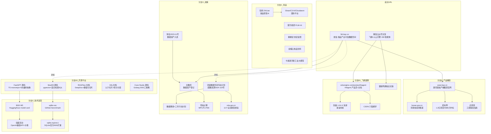

# 第 1 章 调研方法与信源图谱

## 1.1 调研流程

本次调研采用 L4 深度调研状态机（SCOUT → MAP → DIVE → SATURATE → SYNTHESIZE），全部数据获取由 6 个独立深挖子任务并行完成，每个子任务负责一个数据源分支直到信息饱和（新信息重复或与目标无关即停止）。

| 阶段 | 动作 | 产出 |
|---|---|---|
| SCOUT | 抓取两个起点 URL（微信文章 + ftd.lzqz.cn 首页） | 关键实体清单：漯河国裕产融/豫中南平台/火山引擎 HiAgent/北数所/DeepSeek Harness 底座自述 |
| MAP | 构建知识图谱，标记 6 个高价值未探索分支 | DIVE 分支规划 |
| DIVE | 6 个子任务并行深挖（官网全站/HiAgent×飞鹤/开源平台审计/政策/竞品/技术选型） | 每分支 800-1500 字结构化发现 + 新节点 + 饱和判定 |
| SATURATE | 聚合判定：深度 6/6 饱和、广度无新高价值节点、三角化达标 | FULLY_SATURATED |
| SYNTHESIZE | 编排者综合全部子任务返回撰写本报告 | 9 章报告 |

## 1.2 工具与信源获取方法

- **浏览器抓取**：chrome-devtools 驱动浏览器，DuckDuckGo 搜索（过滤 Sponsored/Ad），evaluate_script 提取页面结构化内容（h1/h2/h3/p/blockquote/li/table）
- **SPA 逆向**：ftd.lzqz.cn 为 SPA，子任务从 JS bundle 提取完整路由表，发现导航未暴露的 /register（完整定价）与 /enterprise 族（企业工作台演示）共 14 个路由
- **源码级审计**：MaxKB/FastGPT 通过 GitHub contents API 逐文件读取核心源码（本地浅克隆因网络 early EOF 失败，改用 API 通道完成等效虚拟审计，覆盖 FastGPT 5 个核心文件、MaxKB 6 个、Coze 3 个）
- **政府信源交叉**：gov.cn 政策库 + nda.gov.cn（国家数据局）+ henan.gov.cn（河南省政府）+ 招标网 + 企查查，五源交叉验证公司主体与项目进展
- **微信文章**：直接抓取成功（无反爬），全文提取

## 1.3 知识网络图谱

## 1.4 信源分布统计

| 信源类型 | 数量 | 代表 |
|---|---|---|
| 对标产品官网（全站） | 2 站 19 页 | ftd.lzqz.cn（14 路由）、www.lzqz.cn（5 页） |
| 政府官方文件/报道 | 6 | gov.cn 政策库 ×3、nda.gov.cn ×2、henan.gov.cn ×1 |
| 招标/工商 | 3 | 招标网 ×2、企查查 ×1 |
| 厂商官方（产品/文档） | 8 | volcengine ×3、maxkb.cn、ragflow.io、dify.ai、ollama、huggingface |
| 媒体报道 | 8 | 雷锋网、新浪、CSDN、搜狐、头条等 |
| 开源仓库（源码级） | 3 | MaxKB、FastGPT、coze-studio |
| 开源仓库（文档级） | 2 | RAGFlow、Dify |
| 竞品官网 | 9 | 知料、璞华、餐餐安、金蝶、卡奥斯、神农API、Glean、C3、Cloudaeon |
| 技术文档/benchmark | 5 | sqlite-vec GitHub、sqlite.org/vec1、dreaming.press、vucense、snapvec |

## 1.5 证据强度声明

- 每章关键主张随文标注【实证】（抓取原文）或【推断】（证据链推断）
- 竞品案例数字多为厂商官网自述，统一标注"厂商自述"
- 飞鹤案例虽经 5+ 渠道核对，但均为同一通稿分发，本报告在第 3 章明确此局限
- 完整来源 URL 清单见 sources/sources.md
