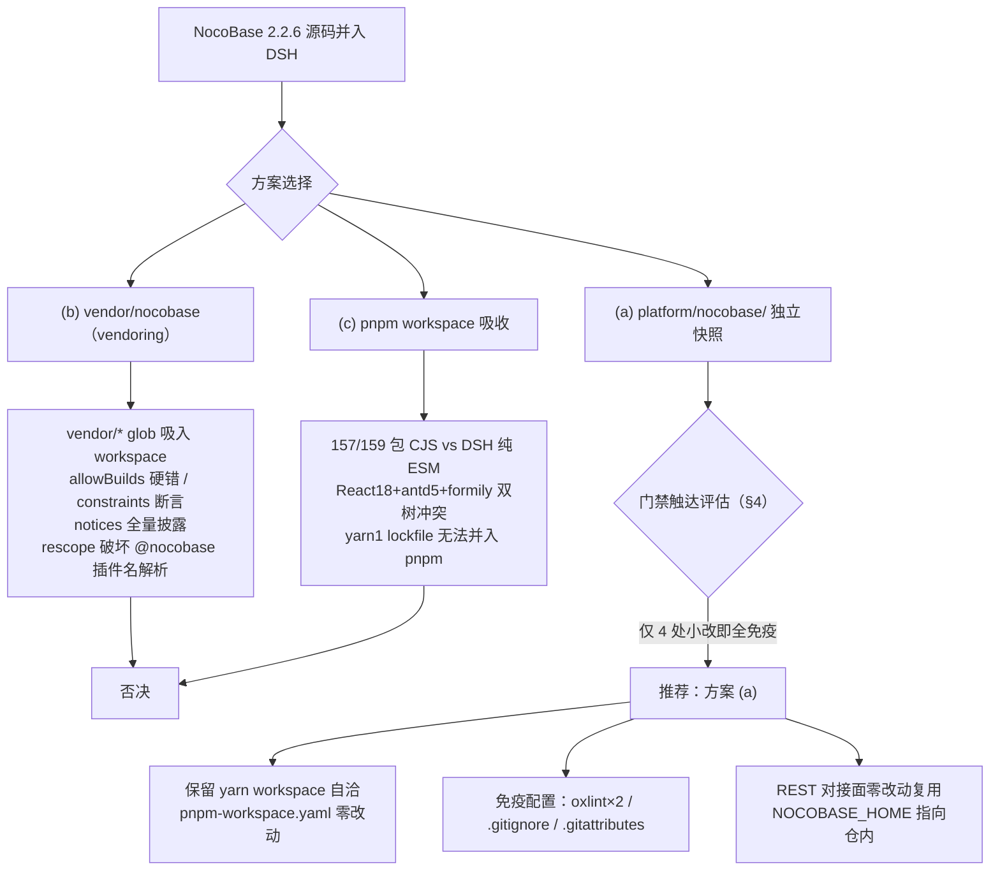
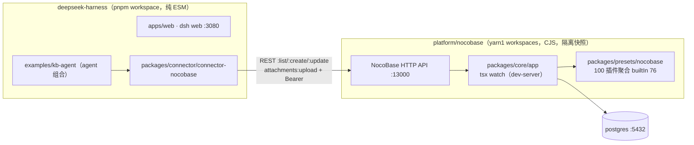

# 01 · NocoBase 2.2.6 源码并入 deepseek-harness：组织方式实证调研（盲区 A）

- 日期：2026-09-06
- 调研对象：NocoBase 2.2.6 源码（外部只读目录 `/Users/mac/Documents/github/nocobase-main`，下文引用前缀 `nocobase-main/`）× deepseek-harness（`/Users/mac/Documents/github/deepseek-harness`，下文 DSH 侧引用均为仓库相对路径）
- 方法：6 个并行审计分支（monorepo 组织 / 构建启动 / License / DSH 门禁 CI 触达 / 现有轨道与资产 / 体积测量），全部结论落到文件级证据。本报告服务 v2 决策——用户已否定 v1"NocoBase 作为外部 REST 对接"架构（v1 结论见 `research/2026-09-03-connector-lakehouse-nocobase/nocobase.md:453-455`："A 为主（REST 对接）+ B 按需（自建插件），C 不推荐"），硬性要求源码并入本仓库。
- 证据版本基线：`nocobase-main/lerna.json` `"version": "2.2.6"`。注意：`research/2026-09-06-nocobase-integration/sources/nocobase/` 下的既有证据副本部分文件来自 **2.2.7** 快照（其 `lerna.json` 为 2.2.7、`presets/nocobase/package.json` 亦为 2.2.7），引用时一律回源核对。
- **重要更正（相对任务书前提）**：本地证据显示 NocoBase 2.2.6 现行许可**不是 AGPL-3.0**，而是 **Apache-2.0 全文 + NocoBase 补充条款**（v2.0.3 起变更，详见 §3）；`packages/pro/` **不存在**于开源仓（商业插件在 nocobase org 私有仓库分发）。
- 本报告为工程合规判断，非法律意见。

## 0. 结论先行：决策建议表

**总决策：采用方案 (a)——顶级目录 `platform/nocobase/` 隔离式快照。** 保留 NocoBase 自身 yarn workspace 自洽；DSH 的 pnpm workspace 不吸收；以 `native/landlock-run`（"独立子树自带 gates"先例，`.oxlintrc.json:26` 注释原文）为组织范式，而非 `vendor/`（vendoring 语义 = 可 rescope 的库依赖 + manifest 义务，见 §4.2）。

| # | 决策点 | 建议 | 证据级别 |
|---|---|---|---|
| D1 | 并入方式 | (a) `platform/nocobase/` 独立快照（`third_party/nocobase/` 亦可行，语义等同，选定后固定一个） | Critical（门禁矩阵+工具链双源） |
| D2 | workspace 关系 | 不吸收：`pnpm-workspace.yaml` 零改动，`platform/**` 天然不匹配任何现有 glob | Critical（`pnpm-workspace.yaml:1-21`） |
| D3 | 快照内包管理 | 保持 yarn 1 + 保留 `yarn.lock`（1.5M，v1 格式）；安装用 `cd platform/nocobase && yarn install`，不用 `pnpm --dir` | Critical |
| D4 | 版本基线 | 2.2.6（与本地运行轨道一致）；在快照内 `MANIFEST`/`NOTICE` 固化来源 URL 与快照日期 | Critical |
| D5 | License 处置 | 保留根 `LICENSE.txt` + `LICENSE-APACHE.txt` + 全部包级 LICENSE + 全部文件头注释；NOTICE 登记修改；NocoBase 代码不进任何 `@deepseek-ai/dsh-*` 发布包；不复制 pro 插件 | Critical（六路证据，§3） |
| D6 | 复制范围 | 排除 node_modules/dist/storage/.git/`.env*`/`tsconfig.paths.json`；`docs/`（94M/约 1.2 万文件）建议首期排除；`yarn.lock` 保留 | Critical（du/find 直测，§5） |
| D7 | 门禁免疫配置 | 4 处小改：`.oxlintrc.json` 与 `.oxlintrc.staged.json` 加 `platform/**` ignore；`.gitignore` 加 3 条；`.gitattributes` 加 `-text` 豁免 | Critical（逐行核对，§4.4） |
| D8 | 数据库 | 起步 postgres（现轨道已实证零缺件）；sqlite 需补装 `sqlite3@5.x`（全仓未声明、未安装） | Important |
| D9 | 运行端口 | NocoBase 13000（全栈 dev 另占 13001/13002）与 DSH 3080/3081 天然无冲突；postgres 5432 是唯一共享资源 | Critical |
| D10 | 升级路径 | 快照 + `platform/nocobase/MANIFEST`（来源、SHA、本地修改清单）+ 定期 rsync 重同步；不引入 submodule | Important |

**一票否决证据（为何不是 b/c）**：

- **(b) `vendor/` 化被否**：`pnpm-workspace.yaml` 的 `vendor/*` glob 会立即把 `vendor/nocobase` 吸成 workspace 成员 → ① `allowBuilds` 对未列 install 脚本的包是 "hard install error"（`pnpm-workspace.yaml:35-39` 注释原文），NocoBase 依赖树大量 postinstall 包在 install 层面即炸；② `scripts/check-workspace-constraints.ts:304-306` 要求 workspace 成员 `must set "private": true`、`:459-471` 强制 `workspace:` 协议；③ `scripts/verify-vendored-links.ts:14` 与 `scripts/verify-node-next-types.ts:39` 都扫 `vendor/*/package.json`；④ `scripts/gen-third-party-notices.ts:146` 从 pnpm-workspace members 推导披露清单，会把 NocoBase 全依赖树拉进 third-party notices；⑤ vendor 合同要求 rescope 到 `@deepseek-ai`（`vendor/README.md:49`）——rescope `@nocobase → @deepseek-ai` 会破坏 `PLUGIN_PACKAGE_PREFIX='@nocobase/plugin-'`（`nocobase-main/packages/core/cli-v1/src/util.js:608` initEnv 默认值）的运行时插件名解析与 lerna 发布配置。
- **(c) pnpm workspace 吸收被否**：① NocoBase 157/159 包为 CJS（仅 `packages/core/cli`（oclif 新 CLI）与 `plugin-ai/npm-shims/node-liblzma` 是 `"type": "module"`），`nocobase-main/tsconfig.server.json:4-5` `"module": "CommonJS"`，与 DSH "ESM everywhere"（AGENTS.md）根本冲突；② 前端是 React 18 + antd 5.24.2 + formily 全家桶（`nocobase-main/packages/core/client/package.json`），与 DSH web 端共装一棵 node_modules 树必炸；③ 双 lockfile（yarn 1 vs pnpm）无法合并，110 个插件的 peer `"2.x"` 声明需全部改写；④ per-file 100% coverage 门（`vitest.config.ts:177` include `packages/*/*/src/**`）与 hygiene 门会被 159 个新成员淹没。



## 1. Q1 · NocoBase monorepo 组织方式

### 1.1 workspace 机制：yarn 1（Classic）+ lerna，非 pnpm/yarn-berry

- `nocobase-main/package.json:118`：`"packageManager": "yarn@1.22.22+sha512…"`；`:113` `volta: { node: "20.16.0", yarn: "1.22.19" }`。
- `nocobase-main/lerna.json:2-4`：`"version": "2.2.6"`、`"npmClient": "yarn"`、`"useWorkspaces": true`，另带 `"npmClientArgs": ["--ignore-engines"]`（引擎约束实际未强制）；无 `packages` 字段（继承 yarn workspaces）。
- `nocobase-main/package.json:4-7`：`"workspaces": ["packages/*/*", "packages/*/*/*"]` —— **两级通配**，第二级为 `packages/plugins/@nocobase/plugin-x` 这类 scope 目录准备。这正是 DSH 可直接借鉴的分组布局（DSH 现行 `packages/*/*` 单级 + 组目录）。
- `yarn.lock` 存在，1,579,892 字节，**lockfile v1**；**无 `.npmrc`、无 `.yarnrc.yml`**（无 registry 镜像配置、无 yarn2+ 特性）；`.node-version` 内容为 `22`。
- **模块体系**：全 `packages/` 下仅 2 个 `"type": "module"`；其余 157 包默认 CJS。插件存根如 `nocobase-main/packages/plugins/@nocobase/plugin-users/client.js:1` 为 `module.exports = require('./dist/client/index.js')`。**DSH 若并入，只能按"源码进 TS paths、运行时走构建产物/tsx"的隔离方式，不能直接 ESM import 其 lib。**

### 1.2 包分组与清单：159 个 workspace 包

| 组 | 路径 | 数量 | 命名 |
|---|---|---|---|
| core | `packages/core/*` | 27 | `@nocobase/<pkg>`（除 `create-nocobase-app` 无 scope） |
| plugins | `packages/plugins/@nocobase/*` | 110 | `@nocobase/plugin-<name>` |
| plugins-example | `packages/plugins/@nocobase-example/*` | 21 | `@nocobase-example/plugin-<name>`（dev-only 示例，无包级 LICENSE） |
| presets | `packages/presets/nocobase` | 1 | `@nocobase/preset-nocobase` |

（数量经 `ls | wc -l` 与逐包 grep name 双向核对。DIVE-3 曾以 `find -maxdepth 3` 数得 example 组 7 个，系深度截断伪影，以 21 为准——两分支独立计数一致。）

- core 27 包：acl, actions, ai, app, auth, build, cache, cli, cli-v1, client, client-v2, create-nocobase-app, data-source-manager, database, devtools, evaluators, flow-engine, lock-manager, logger, resourcer, sdk, server, shared, snowflake-id, telemetry, test, utils。
- **`packages/pro/` 不存在**。商业插件不在开源仓：`.github/workflows/get-plugins.yml` 用 GitHub App token + `gh search repos "props.plugin-type:…" --owner=nocobase` 拉取 nocobase org 私有插件仓；仓内与商业相关的只有 `plugin-license`（许可证校验，位于 preset 的 `builtIn` 清单末位）。`nocobase-main/.git/info/exclude` 残留 `packages/pro-plugins/`（该目录不存在）——上一位使用者曾计划引入 pro 插件未果，佐证此目录是 GitHub zip 源码包（`.git` 仅 4K 残壳，无 objects/HEAD，**非 git 仓库**）。
- 110 个插件中 workflow 族 21 个；完整清单可由 `ls nocobase-main/packages/plugins/@nocobase` 复现（acl, action-bulk-edit, action-bulk-update, action-custom-request, action-duplicate, action-export, action-import, action-print, ai, ai-gigachat, api-doc, api-keys, async-task-manager, audit-logs, auth, auth-sms, backup-restore, backups, block-comment, block-grid-card, block-iframe, block-list, block-markdown, block-multi-step-form, block-template, block-tree, block-workbench, calendar, charts, client, collection-fdw, collection-sql, collection-tree, comments, custom-variables, data-source-main, data-source-manager, data-visualization, data-visualization-echarts, departments, disable-pm-add, embed, environment-variables, error-handler, field-attachment-url, field-china-region, field-code, field-formula, field-m2m-array, field-markdown-vditor, field-sequence, field-sort, file-manager, file-previewer-office, flow-engine, form-drafts, gantt, graph-collection-manager, hello, idp-oauth, kanban, license, locale-tester, localization, logger, map, mcp-server, mobile, mobile-client, mock-collections, multi-app-manager, multi-app-share-collection, multi-keyword-filter, notification-email, notification-in-app-message, notification-manager, notifications, public-forms, snapshot-field, system-settings, text-copy, theme-editor, ui-layout, ui-schema-storage, ui-templates, user-data-sync, users, verification, workflow 及 workflow-* 20 个子插件）。

### 1.3 依赖形态（yarn 1 无 `workspace:` 协议的替代方案，三种并存）

| 关系 | 版本写法 | 证据 |
|---|---|---|
| core → core | 精确版本 `"2.2.6"`（yarn1 workspaces 解析到本地目录） | `nocobase-main/packages/core/server/package.json:13` `"@nocobase/acl": "2.2.6"` |
| 插件 → 宿主 | peerDependencies `"2.x"`，几乎无 dependencies；第三方运行时依赖（react/antd/echarts）放 devDependencies（构建时打进 dist，运行时靠宿主） | `nocobase-main/packages/plugins/@nocobase/plugin-users/package.json:19-33` |
| preset → 插件 | 汇聚 100 个插件依赖，全 `"2.2.6"`；附自定义元数据字段 `"deprecated"`（5 个：audit-logs, charts, comments, mobile-client, snapshot-field）与 `"builtIn"`（76 个默认启用插件）——NocoBase 插件管理器运行时读取的清单 | `nocobase-main/packages/presets/nocobase/package.json:8-108` |

### 1.4 入口形态：无 exports 字段，存根文件 + lib/dist 双轨

- 全仓**没有一个包用 package.json `exports` 字段**（抽样 8 包 + grep 验证）。
- core：`main: "./lib/index.js"`、`types: "./lib/index.d.ts"`（`nocobase-main/packages/core/database/package.json:5-6`）；client 额外 `module: "es/index.mjs"`（`core/client/package.json:5-7`）。
- 插件：`main: "./dist/server/index.js"`，包顶层放 `client.js/client.d.ts/server.js/server.d.ts/client-v2.js` CJS 存根转发到 `dist/*`；源码为 `src/{client,client-v2,server,locale,swagger}` 四段式。
- preset：`main: "./lib/server/index.js"`，`server.js`/`client.js` 各一行 re-export shim。

### 1.5 TS / 构建工具链

- 单一根 tsconfig：`nocobase-main/tsconfig.json` `extends: "./tsconfig.paths.json"`，include 全 `packages/**`；`tsconfig.paths.json`（1935 行，postinstall 由 `genTsConfigPaths` 生成）每包 4 条映射：`@nocobase/acl` → `packages/core/acl/src`，外加 `/client`、`/client-v2`、`/package.json` 子路径——**开发态 TS 直达 src，完全绕开构建产物**。与 DSH 的 per-package tsconfig+paths 模式同构，可平移。
- TS 版本钉死 `5.1.3`（根 devDeps）。服务端编译目标 `CommonJS`/`ES6`（`tsconfig.server.json:4-5`）。
- 构建链：`yarn build` = `nocobase-v1 build`（`nocobase-main/package.json:27`）→ `packages/core/cli-v1/src/commands/build.js:34-52`：先 `nocobase-v1 clean --dist` → 若 `@nocobase/build/src` 有效则在其目录 `yarn build`（tsup 自举）→ `run('nocobase-build', [...pkgs])`。`nocobase-build` 是 `packages/core/build`（`package.json:7-9`）的 bin，基于 **rsbuild/rspack 1.7.8 + tsup 8.2.4 + babel + @vercel/ncc**（描述文案仍写 rollup，已过时）。产物分档（`packages/core/build/src/build.ts:90`）：core → `lib/`（CJS），ESM_PACKAGES 加 `es/`，插件 → `dist/`，presets → `lib/`；客户端 bundle 由 `buildClient.ts:83` `createRsbuild` 打包。

### 1.6 Node/Yarn 版本要求（三处不一致）

- 根 `engines: { node: ">=22" }`（`nocobase-main/package.json:9-11`）vs `volta.node: "20.16.0"`（`:114`）vs `.node-version: "22"`；create-nocobase-app 模板放宽到 `>=18`。`lerna.json` 的 `--ignore-engines` 说明官方实际未强制。**建议按 engines 取 Node ≥22**（DSH 侧 node ^22.19 || >=24 兼容）。

### 1.7 前端关键版本（与 DSH web 端冲突评估的输入）

`packages/core/client`：`react/react-dom ^18.0.0`（peer `>=18`）、`antd 5.24.2`、`antd-mobile ^5.41.1`、`@formily/antd-v5 1.2.3`、`@formily/* ^2.2.27`、`react-router-dom ^6.30.1`、`i18next ^22.4.9`、`@ant-design/icons ^5.6.1`、`@ant-design/pro-layout ^7.22.1`、`axios ^1.7.0`、`@dnd-kit/*`、`dayjs 1.11.13`（resolutions 钉死）。根 resolutions 另强制 `@rspack/core 1.7.8`、`@types/react 18.3.18`，并以 `file:./packages/plugins/@nocobase/plugin-ai/npm-shims/*` 本地替换两个原生模块。

## 2. Q2 · 构建与启动链路

### 2.1 根 scripts：全部委托单一 CLI，没有 lerna build

`nocobase-main/package.json:18` 起：`dev: "nocobase-v1 dev --rsbuild"`、`dev-server: "nocobase-v1 dev --server"`、`start: "nocobase-v1 start"`、`build: "nocobase-v1 build"`、`postinstall: "nocobase-v1 postinstall"`、`doc: "nocobase-v1 doc"`。lerna 只出现在 `version:alpha`/`release`（发布用，`:47-49`）。`nocobase-v1` bin 定义在 `packages/core/cli-v1/package.json:7`（`./bin/index.js`，纯 JS 无需构建，依赖 commander/execa/pm2/portfinder）。

### 2.2 CLI 启动即注入环境（并入后所有 env 的权威默认值来源）

- `packages/core/cli-v1/bin/index.js:6`：先 `initEnv()` + `genTsConfigPaths()`。
- `packages/core/cli-v1/src/util.js:608` `initEnv`：dotenv 读根 `.env`（`APP_ENV_PATH` 可覆盖），默认值仅补空缺——`APP_PORT: 13000`（`:623`）、`DB_STORAGE = storage/db/nocobase.sqlite`（`:687`）、`LOCAL_STORAGE_DEST=storage/uploads`、`PLUGIN_STORAGE_PATH=storage/plugins`、`SERVER_TSCONFIG_PATH=./tsconfig.server.json`、`PLUGIN_PACKAGE_PREFIX='@nocobase/plugin-,@nocobase/plugin-sample-,@nocobase/preset-'`。
- **`DB_DIALECT` 默认被注释掉（`:628`），且 `checkDBDialect`（`:773`）在 dev/start 前强制抛 `DB_DIALECT is required.` → 必须在 .env 显式声明方言。**
- `genTsConfigPaths`（`:303`）扫描 `packages/*/*/package.json` 生成 `tsconfig.paths.json`，并把 `node_modules/.bin/tsx` 重链到 `node_modules/tsx/dist/cli.mjs`。**这要求快照必须保留 `packages/*/*` 相对布局**（目录深度不能压扁）。

### 2.3 dev 链路：三进程并发，tsx 直跑 TS 源码（无需先 build）

`packages/core/cli-v1/src/commands/dev.js:78`：源码仓库（hasCorePackages）下三分支并发——

- server：`tsx watch --tsconfig tsconfig.server.json -r tsconfig-paths/register ${APP_PACKAGE_ROOT}/src/index.ts start --port=<serverPort>`（`:283-296`）；退出码 100 时自动重启（`:308`）；`--db-sync` 透传。
- client：`rsbuild dev --config packages/core/app/client/rsbuild.config.ts`（`--rsbuild` 时，`:192-194`）或 `umi dev`（dev:umi）。
- client-v2：`rsbuild dev` + `client-v2/rsbuild.config.ts`（`:158-160`）。

端口分配（`dev.js:123-145`、`:138-140`）：全栈 dev 时 client dev server 占 `APP_PORT`（13000），server 让到 portfinder 从 `APP_PORT+1` 探测（即 13001），client-v2 占 `APP_PORT+2`（13002）；**仅 `dev-server` 模式（现轨道用法）时 server 直接监听 `APP_PORT=13000`**。热更：server 靠 tsx watch；client 靠 rsbuild/rspack HMR（`RSPACK_HMR_CLIENT_PORT`，`:168/:207`）；另有 chokidar 监听插件目录增删触发 client 整体重启并写 `storage/app.watch.ts`（`:239-273`）。

### 2.4 真正入口与 presets 角色

- `generateAppDir`（`util.js:284`）：`APP_PACKAGE_ROOT = dirname(dirname(require.resolve('@nocobase/app/src/index.ts')))` = `packages/core/app`。
- 入口 `packages/core/app/src/index.ts:13`：`runPluginStaticImports()` → `getConfig()` → `Gateway.getInstance().run({ mainAppOptions })`；`config/plugins.ts:12` 写死 `['nocobase']`（preset 名）；`config/database.ts:12` 委托 `parseDatabaseOptionsFromEnv`。
- 监听在 `packages/core/server/src/gateway/index.ts:696`：`port = startOptions.port || APP_PORT || 13000`，`host = APP_HOST || '0.0.0.0'`；非 start 命令走 Unix socket IPC（`SOCKET_PATH` 默认 `storage/gateway.sock`，`:582-593`）。
- **`presets/nocobase` 是插件聚合包**：`package.json:5` `main: ./lib/server/index.js`，依赖约 90-100 个 `@nocobase/plugin-*@2.2.6`；`server.js`/`client.js` 只是一行 re-export shim；`src/server/index.ts:13` 是 `PresetNocoBase extends Plugin`，其 `install()` 做 createIfNotExists → pm.init/load/install。

### 2.5 build 链路与生产启动

- `build.js:18`：① `clean --dist`；② 按需 tsup 自举 `packages/core/build`；③ `nocobase-build` 全仓构建（分档规则见 §1.5）；④ `buildIndexHtml(true)` 处理 `${APP_PACKAGE_ROOT}/dist/client/index.html(.tpl)`（`util.js:493-498`）。
- **生产 `start` 必须先 build**：`start.js:105` 检查 `lib/index.js` 不存在即提示 `The code is not compiled... $ yarn build`；默认 `launchMode=pm2` 用 pm2-runtime 跑 `lib/index.js`（`:128-140`），支持 `--daemon`/`-i instances`（CLUSTER_MODE）。
- **本机实证：该仓库从未 build 过**——`packages/presets/nocobase/dist`、`packages/core/app/lib`、`packages/core/server/lib`、`packages/core/client/dist` 均不存在（ls 证实，全仓无任何 lib/dist 产物）；storage/ 残留为 `app.watch.ts、apps、db(空目录)、gateway.sock、logs/main、playwright、uploads`，`storage/db` 无 sqlite 文件；根 `.env` 等于 `.env.example`（postinstall 自动复制，`postinstall.js:67`），内容为 `DB_DIALECT=postgres、localhost:5432`。

### 2.6 首次安装 / DB CLI

- server 端命令注册在 `packages/core/server/src/commands/index.ts:15`：`install`、`db-clean`、`db-sync`、`pm`、`start` 等。
- `commands/start.ts:51`：未安装时抛 `ApplicationNotInstall ... Please run 'yarn nocobase install'`，除非 `--db-sync`/`--quickstart`（此时自动 `app.install()`，`:42`）。
- 新 CLI（`@nocobase/cli`，bin `nb`，oclif+TS 需先 build dist/）的 `db` topic 是 Docker 容器化内建数据库（`db/start.ts:14` `startDockerContainer`），与源码开发无关。

### 2.7 DB 方言与 sqlite 缺件（关键结论）

- env 读取点：`packages/core/database/src/helpers.ts:100` `parseDatabaseOptionsFromEnv` 读 `DB_DIALECT/DB_STORAGE/DB_USER/DB_PASSWORD/DB_DATABASE/DB_HOST/DB_PORT/DB_TIMEZONE/DB_TABLE_PREFIX/DB_SCHEMA/DB_UNDERSCORED/DB_POOL_*/DB_LOGGING` + `DB_DIALECT_OPTIONS_SSL_*`。方言注册（`:138`）：Sqlite/Mysql/Mariadb/Postgres 四类。
- 驱动声明：`@nocobase/database` 只依赖 `sequelize ^6.26.0`（`package.json:8`），**不含任何 DB 驱动**；pg/mysql2 由 `@nocobase/cli`（`package.json:130`）、`@nocobase/test`、plugin-collection-fdw、plugin-multi-app-manager 传递装入（hoisted 到根 node_modules，已验证存在）。
- **sqlite3/better-sqlite3 在所有 package.json 的 dependencies/optionalDependencies 中均未声明，根 node_modules 也未安装**（find 证实）——sqlite 方言运行时由 sequelize `dialect:'sqlite'` 隐式 `require('sqlite3')`（`dialects/sqlite-dialect.ts:12` 仅有版本守卫）；`packages/core/server/src/plugin-manager/deps.ts:51` 的 `sqlite3: '5.x'` 只是插件依赖版本解析表。create-nocobase-app 模板（`templates/app/package.json:36`）装的也是 mysql2/mariadb/pg/pg-hstore，同样无 sqlite3。
- 结论：**postgres 路线零缺件（现轨道默认且已实证）；sqlite 路线需一次性补装 `sqlite3@5.x`（CJS 原生模块）并重装**。官方 sqlite 场景推测走 Docker/安装版镜像，源码仓内 sqlite 实为"可用但缺件"。

### 2.8 关键环境变量清单

| 变量 | 默认（util.js:608） | 说明 |
|---|---|---|
| APP_ENV | development | production 下 start 走 lib |
| APP_PORT | 13000 | client 端口；全栈 dev 时 server=+1、clientV2=+2 |
| APP_HOST | 0.0.0.0（gateway/index.ts:697） | listen 绑定 |
| APP_KEY | test-jwt-secret | JWT 密钥，生产必换 |
| API_BASE_PATH | /api/ | API 前缀 |
| DB_DIALECT | 无（必填，缺则 CLI 抛错） | postgres/mysql/mariadb/sqlite |
| DB_STORAGE | storage/db/nocobase.sqlite | 仅 sqlite 用 |
| DB_HOST/DB_PORT/DB_DATABASE/DB_USER/DB_PASSWORD | — | pg/mysql 用 |
| DB_TABLE_PREFIX/DB_SCHEMA/DB_TIMEZONE/DB_UNDERSCORED/DB_POOL_*/DB_LOGGING | — | 可选 |
| STORAGE_PATH | storage/ | 派生 uploads/plugins/logs/gateway.sock |
| INIT_ROOT_EMAIL/PASSWORD/USERNAME 等 | .env 有 admin@nocobase.com/admin123 | 首次 install 超管 |
| SERVER_TSCONFIG_PATH | ./tsconfig.server.json | tsx dev 用 |
| PLUGIN_PACKAGE_PREFIX | @nocobase/plugin-,@nocobase/plugin-sample-,@nocobase/preset- | 插件发现 |
| APPEND_PRESET | 未发现（grep 无此变量） | 任务书此项在 2.2.6 源码不存在 |

## 3. Q3 · License 合规（结论与任务书前提不同）

### 3.1 现行许可：Apache-2.0 + NocoBase 补充条款（非 AGPL）

- 变更时间线（决定性证据）：`nocobase-main/CHANGELOG.md:2743`，v2.0.3（2026-02-24）："[Core] Open source commercial plugins and update license from **AGPL-3.0 to Apache-2.0** (#8682)"。即 1.x 时代 AGPL-3.0，2.x 起 Apache-2.0+补充条款并开源原商业插件。
- 根 `LICENSE.txt`（107 行）是自定义协议全文（"NocoBase License Agreement"，签发方 NOCOBASE PTE. LTD.，新加坡）：
  - L1 "Updated Date: February 24, 2026"；
  - L47 §4.2 "incorporates and references the full text of the Apache License, Version 2.0… In case of any inconsistency… the supplementary terms of this Agreement shall prevail"；
  - L55 §5.2 禁止移除界面品牌（"except for the main LOGO in the upper left corner"——仅左上角主 LOGO 可换）；
  - L57 §5.3 禁止移除代码中的知识产权声明；
  - L59 §5.4 禁止"to the public"提供任何 no-code/zero-code/low-code/AI platform SaaS/PaaS 产品；
  - L73/L85/L89/L91 §6.5/7.3/7.5/7.6：出售 Upper Layer Application（上层应用）需 Professional/Enterprise 授权；禁止转售基于 Software 的开发工具；
  - L9 §9 协议可单方随时修改、公告即生效（条款漂移风险 → 复制时应固化所取版本的 LICENSE.txt 快照）。
- 根 `LICENSE-APACHE.txt`（11332B）为标准 Apache-2.0 全文，与全部包级 LICENSE 同 md5 `195aef30…`。
- 网络佐证：`https://www.nocobase.com/agreement` 与本地 LICENSE.txt 逐条一致（同 Updated Date、§4.2、§5.4）。

### 3.2 逐包 LICENSE 分布

| 组 | 包数 | 带 Apache-2.0 LICENSE | 异常 |
|---|---|---|---|
| core/* | 27 | 27（全带） | 无 |
| presets/nocobase | 1 | 1 | 无 |
| plugins/@nocobase/* | 110 | 106 | 4 个无 LICENSE：block-comment、idp-oauth、mcp-server、ui-layout（idp-oauth 连 license 字段也无，根协议兜底） |
| plugins/@nocobase-example/* | 21 | 0 | 无 LICENSE、无 license 字段（dev-only） |
| pro/ | 不存在 | — | 商业插件不在本仓库 |

所有自有 LICENSE 为同一 201 行 Apache-2.0 全文；41 个异质 LICENSE（MIT/ISC/BSD）全部位于 node_modules/ 与 dist/（第三方依赖）。无 NOTICE 文件。

### 3.3 AGPL 残留与 pro/商业边界识别

- **9442/17138（55%）源文件头注释**仍为 "dual-licensed under AGPL-3.0 and NocoBase Commercial License… https://www.nocobase.com/agreement"（版权行 2020-2024）——官方未随 v2.0.3 迁移清理。权威以正式许可文件+官方变更公告为准，但 license 扫描器（license-checker 等）会误报 AGPL。
- pro 机器可识别途径：① docs frontmatter `isFree: false`（×51，如 audit-logger、auth-saml、custom-brand、action-export-pro、ai-knowledge-base；`isFree: true` ×106）+ `editionLevel`；② `plugin-license` 插件 + `nb license` CLI（"Manage commercial licenses and licensed plugins"）；③ workflows `build-pro-image.yml`、`manual-build-pro-plugin-image.yml`。
- 根 README.md（161 行）无 license/pro 说明段落。

### 3.4 合规结论（工程判断，非法律意见）

**A. 内部部署（复制源码 + 修改 + 企业内部网络使用）**：现行协议下 Apache-2.0 无 AGPL §13 式网络源码披露义务——**修改后内部部署无需向企业内部网络用户公开源码**；义务集中在：分发时附带许可证、显著标注修改（Apache §4(b)）、保留版权/归属与文件头声明（§5.3，且即使头注释写着 AGPL 也不得移除）。内部使用不触发 §5.4（其禁止的是"to the public"的 SaaS/PaaS）。若保守地把头注释的 AGPL-3.0 当作仍有效授权选项：同法人实体内部用户通常不构成 AGPL 意义上的对外 network interaction——两取其严者，内部部署均可闭环。**若未来对外（公有网络）提供基于 NocoBase 的 SaaS/PaaS，则触发 §5.4 禁令，需商业授权。**

**B. DSH 对外发布 `@deepseek-ai/dsh-*` npm 包**：本许可**非传染性 copyleft**。不含 NocoBase 代码的包零义务；若某发布包混入 NocoBase（修改版）代码，该包需：携带 Apache-2.0 + 根 LICENSE.txt 副本、保留全部头注释、标注修改文件，且接收方继承补充条款限制（品牌不可移除、SaaS/PaaS 禁令）——对 npm 公开发布是显著负担。**建议：源码目录独立 + LICENSE 保留 + NOTICE + 不把 NocoBase 代码混入 @deepseek-ai/dsh-* 发布包（可用 npm files 白名单 + 在 `scripts/publication-payload.ts` 门禁加"不得包含 nocobase/ 路径与 @nocobase/ 依赖"检查）。**

**C. pro 插件**：源码不在开源仓，未经商业授权复制即违反商业许可（授权不可转让 §7.2）。**建议：不复制 pro；如需（audit-logger、ai-knowledge-base 等），走商业授权采购，书面覆盖"复制进私有仓库 + 内部部署 + 用户规模"。**

## 4. Q4 · 并入方式对比（三选一决策）

### 4.1 DSH 门禁体系扫描范围（逐项证据）

- **workspace 吸收面**：`pnpm-workspace.yaml:1-21` globs 为 `vendor/*`、`packages/*/*`、`native/landlock-run`、`native/landlock-run/packages/*`、`apps/*`、`website`、`examples`、`python/sdk-runtime`；根 `package.json:11` 的 `workspaces` 镜像同一清单。所有 glob 锚定仓库根：`platform/nocobase/packages/core/server` **不匹配** `packages/*/*`（路径前缀不同）→ 方案 (a) 不会被吸入，nocobase 内部 packages/ 命名零冲突。**反向警示：绝不可把 nocobase 的 `packages/` 直接摊到 DSH 根 `packages/` 下（或让快照目录名使其落在根 packages glob 内），否则 `packages/*/*` 会吸入全部 159 包，install 层面即炸。** 方案 (c) 则必须显式加 glob。
- **`allowBuilds` 护栏**：`pnpm-workspace.yaml:35-39` 注释"an unlisted script is a hard install error"——nocobase 依赖树大量 postinstall 包，一旦被吸入 workspace，install 即失败（这也是隔离方案 (a) 的天然护栏）。
- **gate 聚合**：`scripts/run-gates.ts:641-686` `docSyncLeafGates()` 聚合 30 个叶子（doc-typecheck、docs-site-build、markdown-links、mermaid、doc-refs、package-paths 等）；`:620-639` `hygieneLeafGates()` = rescope-vendor + knip + publint + constraints + dsh-package-licenses + package-invariants + node-next-types 等。扫描范围全部白名单锚定：`scripts/verify-md-links.ts:19` 与 `scripts/verify-mermaid.ts:18` 的 PATTERNS（README、docs/**、packages/*/*.md、packages/*/*/*.md、examples/**、AGENTS.md、.agents/**）、`scripts/verify-doc-refs.ts:15`（只扫 packages/**/*.ts + examples/**/*.ts）、`scripts/verify-package-paths.ts:20`、`scripts/verify-md-wrap.ts:18`、`scripts/doc-typecheck.ts:205` markdownGlobs——**platform/ 下任何 md/ts 都不进扫描，doc-sync 全免疫（research/ 同样不在 patterns 内）**。
- **typecheck/build**：根 `tsconfig.json:1` 是 program-less solution（`files: []`，references 仅 host/client 两个 face，注释明令 "NEVER add include/files entries"）；`tsdown.config.ts:19` `workspace: ['vendor/*','packages/*/*','apps/cli']`。新顶级目录不进 references/include → 完全免疫。
- **vitest/coverage**：`vitest.config.ts:90` testIncludes 白名单；`:177` coverage `include: ['packages/*/*/src/**/*.{ts,tsx}']` perFile 100%（`:284-292`）——新目录不在 `packages/*/*` 下则测试与覆盖率门全免疫。
- **hygiene**：`knip.json:16` `ignoreWorkspaces: ["vendor/*","python/sdk-runtime"]`（knip 按 workspace 成员推导，platform 非成员即免疫）；`scripts/publint-all.ts:52` `globSync('packages/*/*/package.json')`；`scripts/check-workspace-constraints.ts:17` workspaceGlobs 硬编码 vendor/packages/native/apps——platform/ 不枚举即免疫；但 `:304-306` 断言非 experimental 成员 `must set "private": true`、`:459-471` 强制 workspace: 协议——**(b) 会直接撞这两条**。
- **lint 是方案 (a) 唯一实质 CI 触达**：CI 跑 `run-oxlint.ts .`（全仓，根 `package.json:31`），`.oxlintrc.json:14` ignorePatterns 只有 `vendor/**`、`native/**`（`:25-26`）——`platform/**` 会被扫（严格规则在 overrides files 白名单里不适用，但默认规则与 parse 仍触达）。
- **lefthook**（`lefthook.yml:17`）：pre-commit `lint (staged)` glob `*.{ts,tsx,mts,cts,mjs}` 仅排除 `vendor/*/src/**` → nocobase ts 文件提交触发；`whitespace (staged)`（`:34-35`）`git diff --cached --check` 无路径过滤 → 快照尾随空白会拒提交；`third-party notices`（`:31`）glob 深至四级 `*/*/*/*/package.json` 会命中 `platform/nocobase/package.json`，但 `scripts/gen-third-party-notices.ts:162` 输入从 pnpm-workspace members 推导 → 输出不变，**空跑无害**。pre-push 只跑 typecheck（免疫）。
- **.gitignore 判定**（`.gitignore:1`）：非锚定条目 `node_modules/`(:3)、`lib/`(:4)、`coverage/`(:13)、`.env`(:2)、`*.tsbuildinfo`(:5)、`.cache/`(:8) 匹配任意层级 → nocobase 的这些目录已被覆盖；**未覆盖：`dist/`**（仅有 `apps/web/dist/` :33）、**`storage/`、`.repo/`**。`.gitattributes:7` `* text=auto eol=lf` 会把快照全部文本规范化为 LF——破坏与上游 tag 的字节一致性；二进制仅 `*.pdf`/`*.otf` 显式豁免（`:9-11`）。

### 4.2 vendor/ 先例对照（为何不适用）

`vendor/README.md` 的 vendoring 合同 = pinned source + manifest 表（upstream SHA，`:13-23`）+ 穷尽 local-modification 日志 + rescope 到 `@deepseek-ai`（`:49`）+ `scripts/check-vendor-manifest.sh:9` 强制 src 变更同 commit 更新 manifest。附加扫描面：`scripts/verify-vendored-links.ts:14` 枚举 vendor/* 全部目录名要求 lock 中 link: 解析；`scripts/verify-node-next-types.ts:39` 扫 `vendor/*/package.json`。**NocoBase 不适配**：它是 yarn/lerna 应用型 monorepo 而非库依赖——rescope 会破坏其内部 workspace 解析、lerna 发布配置、运行时按 `@nocobase/plugin-*` 动态加载的插件名解析（§0 一票否决证据）。

### 4.3 native/landlock-run 先例（方案 (a) 的范式）

仓库对"独立子树"的真实先例是 `native/landlock-run`：`.oxlintrc.json:26` 注释 "The imported landlock-run subtree has its own gates" + oxlint `native/**` ignore + pnpm-workspace 显式枚举（只吸收其需要的子包）。方案 (a) 应仿此：独立子目录 + 自有工具链 + 门禁 ignore。

### 4.4 三方案 × 门禁触达矩阵

| 门禁 | (a) platform/ 独立快照 | (b) vendor/nocobase | (c) pnpm workspace 吸收 |
|---|---|---|---|
| pnpm install | ✅ 免疫 | 🔴 吸为成员，allowBuilds 硬错 | 🔴 全依赖树重写 |
| typecheck (tsc -b 双 face) | ✅ 免疫 | ✅ 免疫（不进 references） | ✅ 免疫 |
| lint（CI `run-oxlint .`） | 🟡 触达（无 ignore）→ 加 ignore 后免疫 | ✅ `vendor/**` 已 ignore | 🟡 触达 |
| test / test:coverage | ✅ 免疫 | ✅ 免疫 | ✅ 免疫（glob 锚定） |
| hygiene·constraints | ✅ 免疫 | 🔴 private/workspace: 断言 | 🔴 需改 workspaceGlobs+断言 |
| hygiene·knip/publint | ✅ 免疫 | ✅（knip ignoreWorkspaces；publint glob 不含 vendor） | 🟡 knip 需加 ignoreWorkspaces |
| hygiene·node-next-types / vendored-links / rescope | ✅ 免疫 | 🔴 `vendor/*/package.json` 进扫描 | ✅ 免疫 |
| third-party notices | ✅ 免疫（job 空跑无 diff） | 🔴 全依赖进 disclosure | 🔴 同左 |
| doc-sync（30 叶子） | ✅ 全免疫 | ✅ 全免疫 | ✅ 全免疫 |
| lefthook pre-commit | 🟡 lint(staged)+whitespace 触达 | 🟡 嵌套 src 不匹配 exclude，仍触达 | 🟡 同 (a) |
| .gitignore | 🟡 补 3 条 | 🟡 同 | 🟡 同 |
| React/antd/formily vs DSH web | ✅ 完全隔离（独立 node_modules） | 🔴 同一 pnpm 树 | 🔴 同一 pnpm 树 |
| CJS vs 纯 ESM | ✅ 隔离 | 🔴 同树混装 | 🔴 同树混装 |

### 4.5 方案 (a) 免疫配置清单（精确到文件与行）

1. `.oxlintrc.json` `ignorePatterns`（14-31 行）追加 `"platform/**"`（注释仿 native/ 先例：独立子树自带 gates）；`.oxlintrc.staged.json`（7-21 行）同步追加——同时消灭 CI lint 与 lefthook staged lint 两处触达。
2. `.gitignore` 在 `apps/web/dist/`（:33）附近追加：`platform/nocobase/**/dist/`、`platform/nocobase/**/storage/`、`platform/nocobase/.repo/`（node_modules/lib/coverage/.env/*.tsbuildinfo/.cache 已被非锚定规则覆盖，无需加）。
3. `.gitattributes` 在 `* text=auto eol=lf`（:7）之后追加 `platform/nocobase/** -text`（快照字节保真，免 LF 重写）；若放弃保真则接受规范化（需一次性清理尾随空白）。
4. （可选）`lefthook.yml` whitespace job（:34-35）改为 `git diff --cached --check -- . ':(exclude)platform/nocobase/**'`，免一次性清理快照尾随空白；third-party-notices job（:31）可保留（输出集合由 pnpm-workspace.yaml 推导，空跑零 diff）。
5. **无需改动**：pnpm-workspace.yaml、package.json workspaces、knip.json、check-workspace-constraints.ts、vitest.config.ts、tsconfig*.json、tsdown.config.ts、.jscpd.json、全部 verify-* 脚本（白名单锚定）。

### 4.6 升级路径对比

| 路径 | 说明 | 评价 |
|---|---|---|
| 快照 + MANIFEST（推荐） | rsync 定期重同步 + `platform/nocobase/MANIFEST` 记录来源 URL/tag/日期/本地修改清单（仿 vendor/README 的 manifest 表但不含 rescope 义务） | 简单、可控、无嵌套 .git 风险；注意本源是 zip（无 git 历史），必须记录 upstream commit/tag |
| git submodule | 嵌套 .git 会腐蚀 Roo-Code checkpoints（本仓库 vendoring 政策明令避免），且与"复制源码改造"诉求不符 | 不推荐 |
| subtree merge | 需要 git 历史（本源是 zip 残壳） | 不适用 |

## 5. Q5 · 复制范围清单与体积

### 5.1 体积实测（du/find 只读直测）

| 区块 | 大小 | 说明 |
|---|---|---|
| 整个 nocobase-main | 3.6G / 354,891 文件 | |
| node_modules（根 + 嵌套） | 3.1G + 268M | 可重装 |
| packages/（含嵌套 node_modules） | 398M | core 205M / plugins 192M / presets 300K |
| packages 纯源码 | ≈130M | |
| docs/ | 94M / 11,958 文件 | rspress 文档站；图片 16M |
| storage/ | 20M | logs 17M、uploads 2.6M（约 30 个 ORD-*.pdf 订单）、apps/main 含 aes_key.dat + jwt_secret.dat、活跃 gateway.sock |
| yarn.lock | 1.5M | v1 lockfile |
| locales/ | 6.2M | 服务端运行时语言包，必须保留 |
| .git | 4K | zip 残壳（.git/info/exclude=packages/pro-plugins/），无历史 |
| .repo / coverage / .turbo / .nx / .cache | 0 | 不存在 |
| packages 内 dist/lib/es | 0 | 从未构建（tsconfig.paths.json 已生成但 lib 全空 → 只跑过 install+dev） |
| **复制范围（排除 node_modules/dist/storage/.repo/coverage/.git）** | **26,705 文件 / 142.9MB** | 含 docs；排除 docs 后 ≈14,750 文件 / ≈49MB |

扩展名 Top（复制范围内）：md 11418（docs 主导）、ts 6790、tsx 4534、json 2607、js 479、png 188；二进制聚合仅 18M。git pack 估算：文本 zlib 压缩 45-55% → 含 docs 约 60-75MB / 排除 docs 约 20-25MB。**文件数是主要硬成本**（blob+tree 对象），26.7k 文件对 git status/lefthook 性能有可感知影响。

### 5.2 include/exclude 表（顶层条目级）

| 条目 | 决定 | 大小 | 理由 |
|---|---|---|---|
| packages/ | ✅ 保留（排内部 node_modules） | 130M | 全量源码（任务要求；保持 packages/*/* 相对布局，genTsConfigPaths 依赖） |
| package.json/lerna.json/tsconfig*.json/vitest/playwright/commitlint/cnpm-sync | ✅ 保留 | <100K | 根配置（tsconfig.paths.json 除外） |
| yarn.lock | ✅ 保留 | 1.5M | v1 lockfile，`yarn install --immutable` 可复现性的唯一锚点；官方仓库本身提交它 |
| .env.example/.env.e2e.example/.env.perf.example/.env.test.example | ✅ 保留 | <10K | 模板，无密钥 |
| .env、.env.test | ❌ 排除（敏感） | 7K | 含 APP_KEY、DB_PASSWORD、INIT_ROOT_PASSWORD 真实凭据 |
| .eslintrc/.prettierrc/.editorconfig/.node-version/.gitattributes 上游文件/.dockerignore/.gitpod.yml | ✅ 保留 | <20K | 工程配置（上游 .gitignore/.gitattributes 保留与否皆可，建议保留供重同步 diff） |
| LICENSE.txt、LICENSE-APACHE.txt、README*.md、SECURITY.md、AGENTS.md、CLAUDE.md、CONTEXT.md、CHANGELOG*.md | ✅ 保留 | 1.4M | LICENSE 必留（§3）；CHANGELOG 有版本考古价值（AGPL→Apache 变更证据链） |
| scripts/、patches/、docker/、Dockerfile、docker-compose.yml、release.sh、deploy-docs*.sh、generate-npmignore.mjs | ✅ 保留 | 130K | 构建/发布基建；patches 被 yarn 依赖（patch-package） |
| .github/、.vscode/、examples/、benchmark/、locales/ | ✅ 保留 | 6.5M | locales 是服务端运行时语言包必须留 |
| docs/ | ⚠️ 首期排除（可选保留） | 94M | 文档站与运行无关；省 94M/近 1.2 万文件；需要时再单独同步 |
| node_modules/（根+嵌套） | ❌ 排除 | 3.37G | 可重装 |
| storage/ | ❌ 排除 | 20M | 运行残留 + aes_key/jwt_secret + 订单 PDF（敏感） |
| .git/ | ❌ 排除 | 4K | zip 残壳，无历史 |
| tsconfig.paths.json | ❌ 排除（两可） | 80K | postinstall 生成物，install 后自动重建（保留则与重同步 diff 冲突） |
| dist/、coverage/ | ❌ 排除 | 0（本就不存在） | 防未来残留混入 |

### 5.3 复制命令建议

```sh
rsync -a \
  --exclude 'node_modules/' --exclude 'storage/' --exclude '.git/' \
  --exclude '.env' --exclude '.env.test' \
  --exclude 'dist/' --exclude 'coverage/' \
  --exclude '.turbo/' --exclude '.nx/' --exclude '.cache/' --exclude '.repo/' \
  --exclude 'tsconfig.paths.json' \
  --exclude 'docs/'  # 可选：首期排除文档站，省 94M
  /Users/mac/Documents/github/nocobase-main/ platform/nocobase/
```

复制前提醒：storage/uploads 时间戳到 2026-09-06 07:18 且 gateway.sock 活跃 → **本机仍有（或近期有）NocoBase 实例在跑**，复制时避免同时写入，且绝不带入 storage。

## 6. Q6 · 启动/运行方案（并入后的开发流程）

### 6.1 现有轨道全貌（演进基线）

- **本质：无 Docker、无 clone 的"外部 checkout + 本机 postgres + REST"轨道**。`examples/kb-agent/QUICKSTART.zh.md:128` 规定订单单一事实源在"NocoBase 2.x（DSH 不建平行订单表）"；`examples/kb-agent/scripts/setup-nocobase.mts:35` 定义 `ncHome = NOCOBASE_HOME ?? join(dirname(repoRoot), 'nocobase-main')`（仓库外同级目录）；脚本**不做 git clone**——`:201-203` 检查目录不存在即抛错 `set NOCOBASE_HOME to its path (never forked, only run)`。
- install（`:200-213`）= `yarn install --network-timeout 600000`（约 15 分钟，以 `.bin/nocobase-v1` 存在幂等跳过）+ `ensurePostgres`（`:153-184`：探测本机 pg 数据目录 `NOCOBASE_PG_DATA`/`/usr/local/var/postgresql@17`/`/opt/homebrew/var/postgres`，`pg_ctl` 拉起后 `psql` 幂等建 role/database `nocobase`）+ `yarn nocobase install`；NC_ENV（`:186-198`）钉 `DB_DIALECT=postgres / localhost:5432 / nocobase`、`APP_PORT=13000`；start（`:215-240`）后台 detached 跑 `yarn dev-server`（日志 `/tmp/nocobase-dsh-server.log`，5 分钟健康轮询）；stop（`:432-439`）`pkill -f 'dev.*--server.*nocobase' + pkill app-supervisor`。
- init（`:242-285`）：五个 collections（experts/expert_services/datasets/customs_export/orders，orders.deliverable 为 belongsToMany attachment 字段 `:94`）；root 角色 API key（365d）；经 NocoBaseClient + `seed-experts.mts:50` 播种张会长数据集（真源 `workspace/data/experts/dataset.json`）；四节点审批 workflow（`:288-365`：collection 触发 mode:1 → manual（双 action 均 RESOLVED）→ condition（`{{$jobsMapByNodeKey.<key>._}}=='resolve'`）→ 通过分支 request 回调 `POST {NOCOBASE_DSH_CALLBACK}/api/orders.fulfill`（client-request envelope）/ 驳回分支 update status=failed）；writeEnv（`:418-430`）把 `NOCOBASE_BASE_URL`/`NOCOBASE_API_KEY` upsert 进仓库根 `.env`。**未安装任何额外插件**（manual/condition/request 均为自带 workflow 节点）。
- **`docker-compose.nocobase.yml` 不存在**（find 全量证实）——任务书该项前提不成立，现轨道是裸进程而非容器；官方容器化参考在快照的 `docker-compose.yml` 与 `docker/app-postgres/docker-compose.yml`（13000:80，pg 10103:5432）。
- NocoBase 文档段实际位于 `examples/kb-agent/README.zh.md:85-91`（"专家服务订单（NocoBase 业务后台）"）；DEPLOY.md 无 NocoBase 生产部署段（文档缺口）。

### 6.2 对接面（源码并入后零改动可复用）

- `packages/connector/connector-nocobase/src/index.ts:30-33`：`NOCOBASE_BASE_URL_ENV='NOCOBASE_BASE_URL'`、credential-ref 默认 `NOCOBASE_API_KEY`，缺凭据降级 unavailable。
- `src/client.ts:160`：五个 REST 动作（`:list`（filter/page/pageSize）、REST get、`:create`、`:update?filterByTk=`、`attachments:upload` multipart），Bearer 鉴权 + `{data}` 解包。
- `src/provider.ts:63-73`：三 collections 映射为 tabular/service/expert-profile 数据集（id=`<collection>/<id>`）。
- `examples/kb-agent/cordis.patch.yml:156-194` 挂 connector-nocobase + expert-orders（draftMaxTokens 16384）；`:211` api-gateway ordersEnabled 开工作台下单。
- e2e：`examples/kb-agent/tests/fixtures/nocobase-track.e2e.cordis.yml`（NC_TRACK_URL + 本地 HTTP 拦截 `/api/orders.fulfill` + `/api/orders/<id>?appends=deliverable` 附件断言）；`examples/kb-agent/scripts/nocobase-workflow.ts:2` 提供 WorkflowLease（停生产流→私有克隆→恢复）。
- **它们只依赖 `NOCOBASE_BASE_URL`/`NOCOBASE_API_KEY` 两个 env，与源码位置完全解耦——源码并入后对接面零改动。**

### 6.3 端口共存矩阵

| 服务 | 端口 | 冲突 |
|---|---|---|
| DSH web（dsh web） | 3080（`packages/boot/cmdline/src/index.ts:14` `ctx.webStartup.port ?? 3080`） | 无 |
| demo:cordis | 3081（`scripts/demo-cordis.mjs:21`） | 无 |
| `dev:web` | 无端口（`scripts/dev-web.ts:1-30` 三段构建 watcher：tsc→tsdown→vite build） | 无 |
| NocoBase dev-server（现轨道） | 13000 | 无 |
| NocoBase 全栈 dev：client/server/client-v2 | 13000 / 13001 / 13002 | 无 |
| postgres | 5432（现轨道直连本机；官方 compose 映射 10103 避让） | **唯一共享资源**，注意 DSH 侧其他 pg 使用者 |

### 6.4 并入后运行拓扑与最小启动步骤



最小启动步骤（并入后，sqlite 路线；postgres 路线沿用 ensurePostgres）：

1. rsync 复制源码到 `platform/nocobase/`（§5.3 排除清单）+ 写 `MANIFEST`/`NOTICE`；
2. `cd platform/nocobase && yarn install`（yarn1；postinstall 自动 patch-package、生成 tsconfig.paths.json、复制 .env.example→.env）——**不要用 pnpm --dir**（yarn1 lockfile + resolutions/file: 协议是 yarn1 语义）；
3. 改根 `.env`：`DB_DIALECT=sqlite`（DB_STORAGE 默认 storage/db/nocobase.sqlite）；sqlite 需先补装 `sqlite3@5.x` 并重装；**postgres 路线零缺件**（沿用 `ensurePostgres`）；
4. `yarn nocobase install`（初始化库表+内置插件+超管，走 tsx 直跑 src，**无需 build**）；
5. `yarn dev-server`（server 监听 13000；或全栈 `yarn dev`：13000/13001/13002）；生产路线 `yarn build` → `yarn start`（pm2-runtime 跑 lib，前置 lib 存在）；
6. kb-agent 侧零改动：`setup-nocobase.mts` 六命令（install/start/init/verify/stop/reset）里仅 `NOCOBASE_HOME` 默认值从 `../nocobase-main` 改为仓内 `platform/nocobase`；QUICKSTART.zh.md:128"外部源码仓（如 ../nocobase-main，只运行不修改）"表述同步更新。

### 6.5 现有轨道 → 源码并入演进清单

- **A. setup 脚本**：`NOCOBASE_HOME` 默认改仓内路径；install/start/init/verify/stop/reset、ensurePostgres 幂等引导、writeEnv 全部原样保留。
- **B. docker-compose**：现无 compose 文件，无需改，只有"要不要加"的决策；若加，以快照 `docker/app-postgres`（13000:80、pg 10103:5432）为官方模板起点，DB 层与本机 pg_ctl 二选一。
- **C. 零改动保留项**：NocoBaseClient 五个 REST 动作与 Bearer/{data} 语义；provider 三 collection 映射与 datasetId 格式；expert-orders seam 及 16384/120000 起草预算；api-gateway ordersEnabled；workflow 四节点链与 client-request 回调 envelope；seed 双源真源 dataset.json；nocobase-track.e2e / demo-full-journey / nocobase-workflow.ts 全链路。
- **D. 应演进项**：NOCOBASE_HOME 语义（外部→仓内）；版本口径统一（2.2.6，修正 sources 副本 2.2.7 漂移）；并入后可评估把 setup 的 REST 初始化换成 NocoBase 插件/编程式初始化（v1 调研路径 B），但 MVP 不必。

## 7. 风险清单

| # | 风险 | 等级 | 缓解 |
|---|---|---|---|
| R1 | 版本漂移：sources/nocobase 副本部分为 2.2.7，本地源为 2.2.6 | 高 | 并入锁定 2.2.6；MANIFEST 记录来源；副本证据引用一律回源 |
| R2 | storage/ 含 aes_key.dat/jwt_secret.dat 与订单 PDF（敏感）；gateway.sock 活跃提示实例在跑 | 高 | 复制强制排除 storage/；复制前停实例 |
| R3 | `.env`/`.env.test` 含真实凭据 | 高 | 排除；仅保留 .env.example 系模板 |
| R4 | 55% 文件头残留 AGPL dual-license 声明 → 扫描器误报；§5.4 SaaS/PaaS 禁令边界模糊；§9 单方修约 | 中 | 以 LICENSE.txt 快照为准 + NOTICE 说明头注释残留；固化快照版本；对外 SaaS 前法务复核 |
| R5 | `.gitattributes` eol=lf 重写快照字节 + lefthook whitespace 拒提交 | 中 | `platform/nocobase/** -text` + whitespace job exclude（§4.5） |
| R6 | sqlite 缺件（sqlite3 未声明未安装） | 低 | postgres 起步；sqlite 需补装 sqlite3@5.x |
| R7 | engines 三重不一致（>=22 / volta 20.16 / 模板 >=18），官方 --ignore-engines | 低 | 按 >=22 执行（DSH node 兼容） |
| R8 | 26.7k 文件入库对 git/lefthook 性能影响 | 中 | 首期排除 docs/（省近半）；免疫配置防门禁扫描 |
| R9 | 源是 zip（无 git 历史）→ 上游同步盲区 | 中 | MANIFEST 记录 upstream URL/tag/commit + 定期 rsync 重同步 + 修改清单 |
| R10 | 根 .gitignore 的 `lib/` 全局 ignore 可能吞上游源码级 lib/ 目录 | 低 | NocoBase 产物为 src/dist（lib 为构建产物），风险低；重同步时核对 |
| R11 | pro 商业插件误入（上游 .git/info/exclude 残留 pro-plugins 痕迹） | 红线 | 不复制 pro；需求走商业授权 |
| R12 | 对 NocoBase 源码的任何修改触发 Apache §4(b) 修改标注义务 | 流程 | NOTICE 登记修改文件清单；建议修改以独立补丁文件（patches/）承载便于重同步 |
| R13 | 误把 nocobase packages/ 摊进 DSH 根 packages/（glob 吸入 159 包，install 即炸） | 中 | 目录纪律：只允许 platform/nocobase/ 子目录；allowBuilds 是天然报警器 |
| R14 | 上游自身死代码（dev.js `getLocalPlugins()` 首行 return [] 后跟死代码）与过时文案（build 描述写 rollup 实为 rspack） | 低 | 不影响决策；修改需登记（R12） |

## 8. 可操作产出汇总

1. **复制命令**：见 §5.3 rsync 块（首期含 `--exclude 'docs/'`）。
2. **门禁免疫配置 diff（4 处）**：见 §4.5（.oxlintrc.json + .oxlintrc.staged.json 加 `"platform/**"`；.gitignore 加 3 条；.gitattributes 加 `-text`；可选 lefthook whitespace exclude）。
3. **最小启动 6 步**：见 §6.4。
4. **setup-nocobase.mts 改造点**：仅 `NOCOBASE_HOME` 默认值（`:35`）改仓内 `platform/nocobase`；QUICKSTART.zh.md:128 表述更新；其余六命令原样保留。
5. **端口矩阵**：见 §6.3（DSH 3080/3081 vs NocoBase 13000/13001/13002；pg 5432 唯一共享）。
6. **合规检查清单**（§3）：
   - 复制时固化并原样保留：根 LICENSE.txt +
`LICENSE-APACHE.txt` + 28+106 个包级 `LICENSE` 文件；为 4 个缺包级 LICENSE 的包（block-comment、idp-oauth、mcp-server、ui-layout）补挂根协议引用说明；
   - 不删除、不改写任何源文件头注释（§5.3 + Apache §4(c)）；不带 `node_modules/`、`dist/`（其中第三方许可义务由依赖解析另行承担）；
   - 界面保留 NocoBase 品牌：除左上角主 LOGO 可替换外，其余不可移除（§5.2）；
   - `NOTICE`/`THIRD_PARTY_NOTICES` 登记：来源 URL + commit/tag + 本地修改文件清单（Apache-2.0 §4(b) 要求显著标注修改）。
7. **MANIFEST/NOTICE 模板要点**（`platform/nocobase/MANIFEST.md`，不承担 vendor/ 的 rescope 义务）：
   - `upstream`：NocoBase 2.2.6，https://github.com/nocobase/nocobase（zip 快照、无 git 历史，须记录抓取的 release URL/tag/commit）；
   - `snapshot-date` 与本地来源路径；
   - `exclusions`：node_modules/、storage/、.git/、.env*、tsconfig.paths.json、docs/（可选）；
   - `local-modifications`：首次同步为空清单；此后对 NocoBase 源码的一切修改在同一 PR 登记（建议以 patches/ 下补丁文件承载修改，降低重同步冲突）。
8. **npm 发布防护**：`@deepseek-ai/dsh-*` 包用 npm `files` 白名单；建议在 `scripts/publication-payload.ts` 门禁加"包含 nocobase/ 路径、`@nocobase/` 依赖、NocoBase 头注释字符串"的拒绝规则，防许可条款意外随包外溢。
9. **端口矩阵与最小启动步骤**：见 §6.3/§6.4，可直接作为操作手册素材。

## 9. 证据质量与不确定性分级

### 9.1 三角验证说明

- 包数量（159 = 27+110+21+1）：`ls | wc -l` 与逐包 grep name 双向核对，DIVE-6 独立计数 example 组 21 作第三方佐证。
- License 结论：六路交叉——根 LICENSE.txt 原文 × 包级 LICENSE md5 汇总 × CHANGELOG v2.0.3 变更记录 × CI workflows（get-plugins/build-pro-image）× docs frontmatter isFree/editionLevel × 官网 agreement 页。
- 体积数据：du/find/stat 只读直测（命令级可复现）。
- 端口事实：三源闭环——cli-v1/util.js + dev.js + gateway/index.ts（源码）× setup-nocobase.mts NC_ENV（现轨道）× QUICKSTART（文档）。
- 门禁触达：每个门的扫描范围均落到其配置/脚本的定义点（白名单锚定），未对未验证行为做推断。

### 9.2 冲突与处置记录

| # | 冲突 | 处置 |
|---|---|---|
| 1 | sources/nocobase 副本为 2.2.7 vs 本地源 2.2.6 | 以 2.2.6 为准（与运行轨道一致）；副本漂移入风险 R1 |
| 2 | engines node>=22 vs volta 20.16.0 vs 模板 >=18 | 采 >=22（engines 字段 + .node-version 双源） |
| 3 | 55% 文件头 AGPL dual-license vs 正式 Apache-2.0+补充条款 | 以正式许可文件 + 官方变更记录为准；头注释残留触发 §5.3 不可移除义务并致扫描器误报 |
| 4 | example 组计数 7（find -maxdepth 截断伪影）vs 21 | 取 21（两分支独立一致） |
| 5 | build 描述写 rollup vs 依赖实为 rspack/rsbuild | 上游文档性注释过时，不影响决策 |

### 9.3 不确定性分级

- Critical（多源可证）：并入方式决策 (a)、门禁免疫矩阵、License 性质与义务、复制体积、端口。
- Important（单源或含解释）：sqlite"可用但缺件"推断（零声明+零安装+隐式 require 三证闭环）；§5.4 "public" 边界解释；MANIFEST 重同步流程设计。
- Observation（推测/待证）：`getLocalPlugins()` 首行 return [] 死代码为上游有意行为；"从未 yarn build"由 tsconfig.paths.json 已生成 + lib 全空合并推断；排除 docs/ 后 git pack 20-25MB 为压缩率估算。

## 10. 来源清单

A 组 — NocoBase 源（外部只读 /Users/mac/Documents/github/nocobase-main，2.2.6）：

1. `nocobase-main/package.json`（workspaces/scripts/engines/volta/packageManager/resolutions）
2. `nocobase-main/lerna.json`
3. `nocobase-main/yarn.lock`（1,579,892 B，v1 格式）
4. `nocobase-main/tsconfig.json` / `tsconfig.server.json` / `.node-version`
5. `nocobase-main/tsconfig.paths.json`（1935 行，postinstall 生成）
6. `nocobase-main/LICENSE.txt`（107 行）/ `LICENSE-APACHE.txt`
7. `nocobase-main/CHANGELOG.md`（v2.0.3 许可变更段）
8. `nocobase-main/.env` / `.env.example` / `storage/` 运行残留（实证）
9. `nocobase-main/.git/info/exclude`（packages/pro-plugins/ 残留）
10. `nocobase-main/packages/core/cli-v1/**`（bin/index.js；src/util.js；src/commands/{dev,build,start,postinstall}.js）
11. `nocobase-main/packages/core/build/**`（package.json；src/build.ts；src/buildClient.ts）
12. `nocobase-main/packages/core/app/src/**`（index.ts；config/{index,plugins,database}.ts）
13. `nocobase-main/packages/core/server/src/**`（gateway/index.ts；commands/{index,start}.ts；plugin-manager/deps.ts）
14. `nocobase-main/packages/core/database/**`（package.json；src/helpers.ts；src/dialects/sqlite-dialect.ts）
15. `nocobase-main/packages/presets/nocobase/**`（package.json；server.js；client.js；src/server/index.ts）
16. `nocobase-main/packages/core/{acl,database,client,server,app,build,cli,cli-v2,create-nocobase-app}/package.json`（抽样）
17. `nocobase-main/packages/plugins/@nocobase/plugin-{users,data-visualization}/package.json` 与 `plugin-ai/npm-shims/`
18. `nocobase-main/packages/plugins/@nocobase/` 110 包清单（ls + grep name）
19. `nocobase-main/packages/core/create-nocobase-app/templates/app/package.json`
20. `nocobase-main/docs/docs/` frontmatter 抽样（isFree/editionLevel）
21. `nocobase-main/.github/workflows/{get-plugins,build-pro-image,manual-build-pro-plugin-image}.yml`
22. `nocobase-main/README.md` / `CONTEXT.md`

B 组 — deepseek-harness（本仓库）：

23. `pnpm-workspace.yaml`
24. `package.json`（根 scripts/workspaces）
25. `tsconfig.json` / `tsdown.config.ts`
26. `vitest.config.ts`
27. `knip.json` / `.jscpd.json`
28. `.oxlintrc.json` / `.oxlintrc.staged.json`
29. `lefthook.yml`
30. `.gitignore` / `.gitattributes`
31. `scripts/run-gates.ts`
32. `scripts/check-workspace-constraints.ts`
33. `scripts/publint-all.ts` / `scripts/gen-third-party-notices.ts`
34. `scripts/verify-md-links.ts` / `verify-mermaid.ts` / `verify-doc-refs.ts` / `verify-package-paths.ts` / `verify-md-wrap.ts` / `doc-typecheck.ts`
35. `scripts/verify-vendored-links.ts` / `verify-node-next-types.ts`
36. `vendor/README.md` / `scripts/check-vendor-manifest.sh`
37. `native/`（landlock-run 独立子树先例）
38. `examples/kb-agent/QUICKSTART.zh.md`
39. `examples/kb-agent/README.zh.md` / `DEPLOY.md`
40. `examples/kb-agent/scripts/setup-nocobase.mts`
41. `examples/kb-agent/scripts/seed-experts.mts` / `nocobase-workflow.ts`
42. `examples/kb-agent/cordis.patch.yml` / `tests/fixtures/nocobase-track.e2e.cordis.yml`
43. `packages/connector/connector-nocobase/src/{index,client,provider}.ts`
44. `packages/boot/cmdline/src/index.ts` / `scripts/dev-web.ts` / `scripts/demo-cordis.mjs`
45. `research/2026-09-03-connector-lakehouse-nocobase/nocobase.md`
46. `research/2026-09-06-nocobase-integration/metadata.json` 与 `sources/nocobase/**`（既有证据副本盘点）

C 组 — 网络佐证：

47. https://www.nocobase.com/agreement （与本地 LICENSE.txt 逐条一致）
48. https://github.com/nocobase/nocobase/pull/8682 （AGPL→Apache-2.0 官方变更记录）

---

**页脚**：本报告由 6 个并行审计分支（DIVE-1~6，均饱和）在编排层汇聚综合；证据引用落到文件路径与行内内容，可直接作为架构决策依据。已知问题（Known issue）：首次落盘委派时内容因传输截断止于 §8 第 6 项中段（419 行），后经 apply_diff 追加修复至本页脚。本文件为盲区 A（NocoBase 源码并入方式）调研章节，建议与 `research/2026-09-03-connector-lakehouse-nocobase/nocobase.md`（v1 REST 基线）对照阅读。