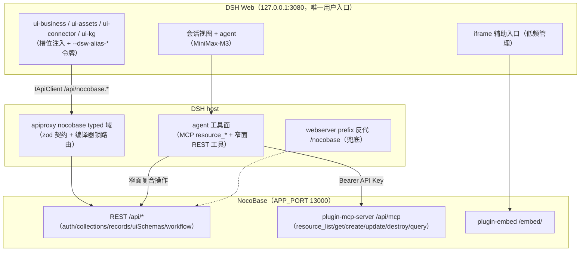

# 盲区 B：NocoBase UI 与 DSH Web 页面整合的技术路径决策依据

- **调研日期**：2026-09-06
- **证据基线**：NocoBase 2.2.6 完整源码（`/Users/mac/Documents/github/nocobase-main`，只读审计）＋ 本仓库 deepseek-harness 现状源码 ＋ docs.nocobase.com 官方文档（含 GitHub PR #9857）
- **证据副本**：`research/2026-09-06-nocobase-integration/sources/nocobase/`（2.2.7 快照；CHANGELOG 显示 2.2.6→2.2.7 仅新增 AI KB 检索 API，REST 面无结构差异；关键文件已与 2.2.6 主源抽查逐字一致，如 `packages/core/server/src/helper.ts:110-129`）
- **调研方法**：五个独立分支（前端架构 A / 无头 API B / DSH 现状 C / AI 能力 D / 官方文档 E）源码级＋文档级三角化，全部结论附文件级证据

---

## 0. 推荐方案（先给结论）

**推荐组合方案：以路径 3（DSH Web 原生页面消费 NocoBase 无头 API）为主体，路径 1（官方 plugin-embed iframe 嵌入）作为低频管理场景的辅助；路径 2（在 NocoBase 内开发插件页面）不推荐，仅作后备。**

按场景拆解：

| 场景 | 承载方式 | 理由 |
|---|---|---|
| 日常业务操作（查单/改数/审批） | **DSH 原生**：会话 agent 经工具面直接读写 NocoBase 数据，对话内 diff 审核 | 用户硬要求"不需要手动填表"——AI 是主交互，天然在 DSH 会话里 |
| 数据资产市场 / 连接器交付跟踪 / KG 浏览 | **DSH 原生**：新增 `packages/client/ui-assets` / `ui-connector` / `ui-kg` 插件 | 与 ui-kb 同模式（槽位注入 + apiproxy typed 域），品牌/导航完全归 DSH |
| 业务管理高级配置（角色权限细配、UI 编辑器拖拽搭页、复杂区块搭建） | **iframe 辅助**：官方 plugin-embed `/embed/<pageId>?token=xxx` | 低频、管理员工具型操作；NocoBase 自带 UI 编辑器是其最强部分，重造不划算 |
| 需要全新 NocoBase 区块类型 / 深度 UI 定制 | （后备）路径 2 插件开发 | 仅当上述方式都无法表达时才介入 |

三条硬理由（证据在后文逐条展开）：

1. **无头 API 面足够宽**。B 分支对 9 个维度（鉴权/元数据/CRUD＋filter/附件/用户角色部门/workflow/应用配置审计/动态 schema/批量与通知）全部拿到 server 端路由注册代码级证据：建表、建字段、建页面、摆区块、触发流程、审批提交全部可以纯 REST 完成。真正缺口只有三个：聚合依赖 charts 插件、无行级变更订阅（需轮询补偿）、uiSchema 渲染语义在前端库（DSH 需自建有限解释器或只支持有限区块类型）。
2. **"AI 驱动 + 单一入口"两个硬要求只有路径 3 能同时满足**。iframe 内部 DSH 会话 agent 无法操作（跨 origin 无标准操作语义）；NocoBase 自带的 AI 员工（plugin-ai）是另一套独立 agent（langchain/langgraph 技术栈、站内悬浮窗入口），不是 DSH 会话 agent，用它等于双 AI 入口。
3. **DSH 端既有模式已被反复验证，新整合是纯增量**。`ui-kb → apiproxy kb 域 → cordis.yml 组合` 三层模式已被 kb / data / orders 三域验证；且 `docs/subsystems/connector.md` 显示 `dsh-connector-nocobase` REST 连接器与 `ctx.orders`（订单 source of truth 已绑 NocoBase）已存在——服务端消费 NocoBase 的底座已经在仓库里。

---

## 1. 架构事实基础（决策依据）

### 1.1 NocoBase 2.2.6 前端架构（必答问题 1）

#### 1.1.1 client 技术栈版本（package.json 原文级证据）

来源：`/Users/mac/Documents/github/nocobase-main/packages/core/client/package.json`（`@nocobase/client@2.2.6`）＋ 仓库根 `package.json` resolutions。

| 依赖 | 版本 | 说明 |
|---|---|---|
| react | ^18.0.0 | 全仓 resolutions 锁定（`@types/react 18.3.18`），peerDeps `react >=18.0.0`；**React 18 非 19** |
| antd | 5.24.2 | 全仓锁版；另带 `antd-mobile ^5.41.1` |
| @formily/antd-v5 | 1.2.3 | formily 官方 antd5 适配线 |
| @formily/core / react / json-schema / reactive | ^2.2.27 | formily 2.x 全家桶 |
| react-router-dom | ^6.30.1 | v6 数据路由 |
| antd-style | 3.7.1 | ＋ `@emotion/css`、`@ant-design/cssinjs` |
| i18next | ^22.4.9 | ＋ react-i18next；文案经 server 下发 |
| @tanstack/react-table | ^8.21.3 | 表格 |
| axios | ^1.7.0 | APIClient 基座 |
| 构建 | Rspack/Rsbuild | 根 scripts `dev: "--rsbuild"`、`@rspack/core 1.7.8` |

关键判定：**NocoBase 没有 fork formily/antd**——`patches/` 目录仅有 `@types+react+18.3.18.patch`，无 pnpm overrides，直接消费官方 npm 锁版。状态管理不用 dva/redux/zustand，用 `@formily/reactive`（`Application.tsx:10` 的 `define/observable`）＋ React Context。

**对选型的意义**：与 DSH Web（Vite＋React）同代际同生态，iframe 嵌入无技术代差；若走插件开发路线，工程栈是 rsbuild＋formily＋antd5，可复用 DSH 团队的 React 经验，但必须学 formily schema 心智模型。

#### 1.1.2 schema 驱动渲染闭环（v1）

- **渲染**：`packages/core/client/src/schema-component/core/SchemaComponent.tsx` 是 `@formily/react` `ISchemaFieldProps/IRecursionFieldProps` 的 memo 包装；`RemoteSchemaComponent.tsx:54` 用 `useRequestSchema({uid, type: 'getJsonSchema'|'getProperties'})` 拉远端 schema，`createForm()`（formily core）＋ `<FormProvider>` 渲染。
- **存储（server 端）**：`packages/plugins/@nocobase/plugin-ui-schema-storage/src/server/collections/uiSchemas.ts`——表 `uiSchemas`，主键 `x-uid`（type:'uid'），`schema` 为 JSON `magicAttribute`；配套 `uiSchemaTreePath`（祖先-后代闭包表，支撑片段寻址/引用）、`uiSchemaTemplates`（区块模板复用）、`serverHooks`（如 `bind-menu-to-role`）。REST 动作注册于 `server.ts:105-112`：`uiSchemas:getProperties/getJsonSchema/getParentJsonSchema/insertAdjacent/patch/remove/insert`（ACL snippet `ui.uiSchemas`）。
- **页面即 JSON**：`route-switch/antd/route-schema-component/index.tsx:13`——`RouteSchemaComponent = <RemoteSchemaComponent onlyRenderProperties uid={useCurrentPageUid()}/>`，路由参数直接映射 ui_schemas 节点 uid。schema 节点形如 `{'x-uid':'p1','x-component':'Table','x-component-props':{...},'properties':{...}}`（fixture `__tests__/fixtures/simple-schema.ts`）。

**对选型的意义**：页面＝数据库 JSON 树 ⇒ **AI 生成页面可完全走 REST**——LLM 产出 schema JSON，`POST /api/uiSchemas:insertAdjacent/{parentUid}?position=beforeEnd` 即落库生效，这是"AI 驱动建页"最自然的 API 面。

#### 1.1.3 SchemaInitializer：用户新建区块的机制

`packages/core/client/src/schema-initializer/index.md`（官方说明）：新增 schema 可插入任意既有节点的 beforeBegin/afterBegin/beforeEnd/afterEnd。`items/BlockInitializer.tsx:15-29`：点击菜单项 → `merge(schema)` → `insert(s)`。落库链路 `schema-component/hooks/useDesignable.tsx:186-188`：

```ts
api.request({ url: '/uiSchemas:insertAdjacent/' + current['x-uid'] + '?position=' + position, method: 'post' })
```

菜单与页面两级模型：v1 菜单存 `routes`（`AdminLayoutMenuModels.tsx:556-566`：`getRouteRepository().listAccessible()`，菜单项带 `schemaUid`，删菜单联动 `api.resource('uiSchemas')['remove/'+schemaUid]`）；v2 存 `desktopRoutes`（见 §3.8）。

**对选型的意义**：DSH 若走"AI 代用户操作 NocoBase"，只需代理两类调用：菜单/routes CRUD ＋ uiSchemas insertAdjacent。**SchemaInitializer 的 UI 可被完全旁路**——它只是这条 REST 的人类操作皮。

#### 1.1.4 插件 client 端注册机制

- v1 `Plugin` 是空壳：`packages/core/client/src/application/Plugin.ts:13` `class Plugin extends BasePlugin`（基类来自 `@nocobase/client-v2`），钩子 `afterAdd/beforeLoad/load`，getter 暴露 router/pluginSettingsManager/schemaInitializerManager/schemaSettingsManager/dataSourceManager/ai/flowEngine（`client-v2/src/Plugin.ts:29-94`）。
- v1 内置插件 `packages/core/client/src/nocobase-buildin-plugin/index.tsx` 的 `load()`：`addComponents(); addRoutes(); ...`；`router.add('admin',{path:'/admin',Component:'AdminLayout'})`、`admin.page /admin/:name → 'AdminDynamicPage'`；pinned `DesignableSwitch`（UI 编辑开关，snippet `ui.*`）；设置面板 `pluginSettingsManager.add('security',{title,icon})`；插件管理器 `PMPlugin`。
- 组件按名解析：`BaseApplication.tsx:542 addComponents()` 写入 `this.components`，schema `x-component` 字符串 → 组件实例。
- **远程插件用 requireJS AMD 加载**：`application/utils/remotePlugins.ts:76-88` `requirejs.config({paths:{[packageName]:url, [packageName+'/client-v2']: clientV2Url}})`；server 端 `core/server/src/plugin-manager/options/resource.ts:184-188` 按插件是否有 `client`/`client-v2` 产物下发双 lane URL——**每插件双产物（client/client-v2）是官方构建契约**。
- 路由：`client-v2/src/RouterManager.tsx:361-364` 支持 hash/browser/memory 三种 router 模式（`createHashRouter/createBrowserRouter/createMemoryRouter`）——**memory/hash 模式对 DSH 内嵌场景有价值**（无地址栏冲突的深链与嵌入态路由）。

#### 1.1.5 client-v2 定位：不是实验分支，而是 v1 的运行时基座 ＋ 下一代外壳

- v1 `package.json:31` 直接依赖 `"@nocobase/client-v2": "2.2.6"`；v1 的 `Application extends BaseApplication`（`Application.tsx:110`）、`Plugin extends BasePlugin`。v2 位于 `packages/core/client-v2`，依赖面更小（去掉 dumi/quill/tabulator 等），仍是 formily＋antd5＋react-router6。
- v2 差异：根渲染走 `FlowEngineProvider/FlowModelRenderer`（`BaseApplication.tsx:560-576`）；布局用 `layoutManager.registerLayout({routeName:'admin', uid:ADMIN_LAYOUT_MODEL_UID, layoutModelClass:'AdminLayoutModel'})`（`client-v2/src/nocobase-buildin-plugin/index.tsx:349-354`）；自带 `ai/`（ai-manager/tools-manager/skills-manager）、`ui-operation/`、`settings-center/`、`WebSocketClient`。路由测试覆盖 `/admin/:uid`、**`/embed/:page`**、`/public-forms/:x`、`/mobile/:page`（`flow/__tests__/FlowRoute.test.tsx`）。
- 启用：根 scripts `dev:client-v2`/`build:client-v2`；preset 双出口 `packages/presets/nocobase/src/client/index.ts`（v1）与 `src/client-v2/index.ts`（`NocoBaseClientPresetPluginV2`）。新插件模板 `plugin-hello/src/client/index.tsx` 已用 v2 的 `BlockModel/DataBlockModel/CollectionBlockModel`（flow-engine）写法。
- **但官方文档警告**（docs.nocobase.com plugin-development/client）：client v1→v2（FlowEngine）迁移中，v2 "not recommended for production use"。注意 docs 的 "tutorials/v2" 是产品 2.0 教程（HelpDesk），不是 client-v2 包，勿混淆。

**对选型的意义**：若走"NocoBase 插件开发"路线，事实上必须面向 client-v2 产物做双轨构建，而 v2 公开承诺尚薄（无独立 README、API 稳定性无承诺）——这是路径 2 的额外风险项。

#### 1.1.6 UI 编辑器与主题

- **UI 编辑器本质＝编辑 ui_schemas JSON**：`DesignableSwitch` 切配置态，所有拖拽/增删最终经 `useDesignable` 调 `uiSchemas:insertAdjacent/patch/remove`。**AI 或外部程序走同一 API 即等价于"编辑器操作"**。
- **主题**：独立插件 `@nocobase/plugin-theme-editor`（preset 内置、默认启用、社区版免费）。server `plugin.ts:25` `acl.allow('themeConfig','list','public')`（未登录可读）；主题存 `themeConfig` 表，install 时写入 4 个内置主题（`builtinThemes.ts`：default/dark/compact/compactDark），**config 即 antd ConfigProvider 格式**：`{algorithm:'darkAlgorithm', token:{colorPrimary...}}`；按用户切换 `users:updateTheme`。品牌色可经 REST 创建自定义主题记录实现配置化；logo 走 system-settings；官方 custom-brand 插件（品牌名/logo 替换）为 Standard Edition+ 收费（docs.nocobase.com/plugins/@nocobase/plugin-custom-brand）。
- E 分支补充：theme-editor 官方文档仅一句话介绍，antd token 可调项清单、主题导出/环境变量化均无文档——深度定制需读源码。

#### 1.1.7 APIClient 与浏览器端鉴权（iframe 整合的关键契约）

- `packages/core/sdk/src/APIClient.ts` ＋ `Storage.ts`：token 默认存 **localStorage**，key 带前缀＋appName（测试实证 `NOCOBASE_TOKEN`/`N1_TOKEN`/`N2_MYAPP_TOKEN`）；role 存 **cookie**（`auth-cookie.ts:23`，`SameSite=Lax`，按 publicPath 作用域）。
- 请求头（`sdk/src/APIClient.ts:90-98`、`Auth.ts:162-170`）：`Authorization: Bearer <token>` ＋ `X-Authenticator` ＋ `X-Role` ＋ `X-App` ＋ `X-Timezone`/`X-Hostname`。v1 `Application.tsx:151` `withCredentials: true`（跨域部署靠 CORS 白名单＋CSRF 中间件）。
- **官方 iframe 方案 `@nocobase/plugin-embed`**（纯 client 插件，server 为空 Plugin）：embed 路由 `/embed/*`（`client-v2/route.ts:73-77`）；`embedSession.tsx:70-75` 为 embed 窗口造独立 storage 前缀 `NOCOBASE_EMBED_{appScopeHash}_{frameScopeHash}_`（frameScope＝window.name 哈希），配 token 同步事件（`dispatchTokenChanged`）与 `EmbedAccessGuard`/`copyEmbedLinkFlow`。官方文档（docs.nocobase.com/integration/embed）确认：内置、默认启用、社区版免费，用法 `https://example.com/embed/<pageId>`，需认证时追加 `?token=xxx`；PR #9857（2026-06 合并）披露 embed token 存隔离 sessionStorage——刷新不掉登录态且不污染 NocoBase 正常 localStorage 登录态；无 token 时回退常规会话。
- **意义**：跨 origin iframe 无法共享 DSH 的 localStorage token，三条路：(a) 启用 plugin-embed 官方通道（token 经 query 注入）；(b) DSH 后端代理登录 NocoBase 拿 token 后经 postMessage 注入 iframe；(c) 同源反代部署＋cookie。纯 REST 路线则由 DSH 后端持有 NocoBase token 直接调 API，完全绕开浏览器存储问题。

### 1.2 DSH Web 现有体系（整合的落点）

#### 1.2.1 packages/client 插件全景

35 个 ui-* 功能插件 ＋ 6 个基础设施包（`web`/`modules`/`connection`/`runtime`/`hmr`/`locale`，见 `packages/client/README.md`）。关键成员：`ui-slots`（槽位注册/组合系统，无 UI）、`ui-theme`/`ui-primitives`/`ui-layout`（主题令牌/共享控件/布局骨架）、`ui-sidebar`/`ui-conversation`/`ui-renderer`（导航/会话面/槽位→React 绑定）、**`ui-kb`**（KB 工作台全套）、`ui-tool`（工具调用树＋keyed toolview）、`ui-workspace`/`ui-attachment`/`ui-brand-official`、`ui-subagent`/`ui-jobs`/`ui-goal`/`ui-trajectory`/`ui-workflow-run`/`ui-plan`、`ui-settings`（含扩展区）、`ui-agent-preset`/`ui-model-selection` 等。**所有功能插件都含 React 页面/组件，非纯工具**——"DSH 原生新建业务页面"有大量同类先例。

#### 1.2.2 ui-kb 的注册→挂载→调用链（新插件的标准模板）

- **宿主半边** `packages/client/ui-kb/src/index.ts:9`：空 `apply()`，仅为让插件出现在 cordis.yml；浏览器半边经 package.json `exports["./client"]` ＋ `dsh.client` 声明被发现。
- **浏览器半边** `packages/client/ui-kb/src/client/index.ts:87`：`inject = ['slots','locale','connection']`；`apply(ctx)` 内 `ctx.effect()` 包裹全部注册；`ctx.locale.register('kb',{zh,en})`。挂载方式是**槽位注入（无前端路由器）**：`sidebar.footer.action`（侧栏入口）、`conversation.hero.headline`（hero 标题）、`conversation.input.dock`（`id:'kb-portal'` 场景卡 → 调 `api.agentPresets.select` 切预设）、`conversation.view`（`id:'kb'` 工作台 tab，`workbench/KbWorkbench.tsx`）、`conversation.session.header.actions`（视图切换）、`tool.call.toolview`（**keyed generator**，7 个 key：kb_search/kb_ingest/kb_ingest_url/kb_stats/connector_discover/order_create/order_status）、`settings.section`。
- **状态层** `kbStore.ts:74`：`createSnapshotStore`（dsh-client-runtime）共享 stats 缓存＋会话内文档记录；`createKbViewBridge` 跨入口视图切换桥。
- **RPC 调用**：`(ctx.get('connection') as ConnectionHandle).api` 直取 `IApiClient`（`packages/host/apiproxy/src/fetch/client.ts:90`，payload-direct 签名，rpcId/信封由 carrier 铸造）；调用面 `api.kb.stats/search/ingest/ingestUrl/upload`、`api.data.upload`、`api.host.describe/listDirectory`、`api.agentPresets.select`；响应统一 `unwrap()`（result.ok 判别＋内联拒绝）。
- **样式**：CSS Modules（entry/hero/workbench/toolview 各自 `.module.css`），消费 `--dsw-alias-*` 语义令牌。`package.json:32` `dsh.client.inject` 列 7 个共享包。

#### 1.2.3 apps/web 组装与"vite proxy"纠偏（重要）

`apps/web/src/main.ts:6` 只是薄壳：`new AppWebEntry(el).run()`，组装逻辑在 `@deepseek-ai/dsh-client-web`（静态模块表 `packages/client/web/src/seed.ts:22`）。**真正的 web profile 是 `packages/bundle/web-app/cordis.patch.yml`**：分层 enable webserver（host/port 默认 127.0.0.1:3080）→ api-gateway（`kbTenant: default`）→ connection（gateway 绑 `/api`）→ 全部 ui-* 浏览器插件行（ui-kb 在 202 行附近）。**不存在 vite dev proxy**：`apps/web/vite.config.ts:30` 的 `rejectStandaloneServe` 明确禁止 bare vite serve；dev 循环＝`pnpm dsh web`（`packages/host/webserver/src/index.ts:73` node:http 服务 dist，具名 exact/prefix 路由＋唯一 fallback SPA 席位）＋ `pnpm run dev:web`（`scripts/dev-web.ts` watch-build）。**加 NocoBase 反代的模板不是 vite `server.proxy`，而是 webserver 的 `register({kind:'prefix', path:'/nocobase', handler})` 或 apiproxy 新域**。

#### 1.2.4 apiproxy 新增域的六触点（官方注释 `packages/host/apiproxy/src/api/index.ts:24`："New client-request domain = one new file pair + one field here + one map row"）

以 kb 域为例：
1. 契约 `src/api/kb.ts:72`：`KbApi` 接口，每方法 `RpcRequest<P> → Promise<RpcResponse<V>>`；
2. schema `src/api/kb.schema.ts`：zod request/value schema（浏览器可导入，无 Node 依赖）；
3. `src/api/index.ts:37`：`ApiProxy` 加 `kb` 字段＋类型再导出；
4. `src/api/rpc-map.ts:68`：加 `'kb.stats': KbApi['stats']` 等行（wire 路径＝POST /api/kb.stats）；
5. HTTP carrier 两端：`src/fetch/handler.ts:96` `UNARY_ROUTES` 加行（schema＋invoke，编译器锁对 RpcMethodMap 全覆盖）；`src/fetch/client.ts:176` `IApiClient` 加域＋`UNARY_VALUE_SCHEMAS` 加行（S→C 二级解析表）；
6. 实现 `src/api-proxy.ts:3198`：`createApiProxy` 的域对象，结构化拒绝模式（kb 未组合→`kb-not-composed`；写开关 `kbWriteEnabled`/`ordersEnabled`→`*-write-disabled`；租户未绑→`kb-tenant-unbound`）。

错误约定：HTTP 状态只表达 carrier（404/415/400/500），业务错误恒 200＋`RpcResponse{result:{ok:false,error:{code,message,details}}}`，错误码在 `src/api/rpc.ts:118` `RpcErrorDetailsMap` 登记。鉴权：无用户体系，靠 config 白名单开关（trustedHosts 是 connection 层）。

#### 1.2.5 已存在的 NocoBase 接入底座

`docs/subsystems/connector.md:5`：`dsh-connector-nocobase` 已作为 connector provider 存在（REST，凭据缺失降级 unavailable）；`ctx.orders`（OrdersRuntime）**已绑定 NocoBase 作为订单 source of truth**。`examples/kb-agent/cordis.patch.yml:171`：生产组合已插入 connector-nocobase（读 `NOCOBASE_BASE_URL`/`NOCOBASE_API_KEY` 环境变量）、expert-orders（订单＋交付物管线），并 patch api-gateway 开启 `kbWriteEnabled/dataUploadEnabled/ordersEnabled`。

---

## 2. 三条整合路径实证对比（必答问题 3）

### 2.1 对比矩阵

| 维度 | 路径 1：iframe 嵌 NocoBase UI | 路径 2：NocoBase 插件开发 DSH 页面 | 路径 3：DSH 原生页面消费 REST |
|---|---|---|---|
| "整合到 dsh 端"（单一入口/导航/域名） | 部分：页面在 DSH 布局内，但视觉/交互是另一套 antd5 应用 | **相悖**：页面住 NocoBase UI（/admin/*），用户在 NocoBase 导航下操作 | **完全满足**：导航/品牌/交互全在 DSH |
| AI 驱动交互（不手动填表） | **不满足**：DSH agent 无法操作 iframe 内部；NocoBase ai-employee 是另一套 agent | 部分：NocoBase AI 员工可用，但非 DSH 会话 agent | **完全满足**：会话 agent 经工具面直读直写，对话内 diff 审核 |
| 鉴权统一 | plugin-embed `?token=xxx` 官方通道 / postMessage 注入 / 同源反代＋cookie，三选一 | 需 SSO（OIDC/SAML/CAS 均 Professional+ 收费）或双登录 | DSH 后端持有 API Key（apiKeys 插件）直连，浏览器端零暴露 |
| 品牌一致性 | 差：themeEditor 可配品牌色，但 antd token 与 --dsw-alias-* 两套体系，只能"接近"不能"统一" | 差：反向对齐更远 | **零成本**：全走 --dsw-alias-* 语义令牌 |
| 开发成本 | 低（配置为主）＋一项反代/注入工程 | 高：formily schema 心智＋rsbuild 双产物契约＋v2 不稳风险 | 中：三插件复制 ui-kb 模板＋nocobase typed 域六触点；框架零改造 |
| 动态 schema 表达 | 完整（NocoBase 自带 designer） | 完整 | 数据面全 API 化；渲染需自建有限 x-* 解释器或只支持有限区块类型 |
| 主要风险 | token 注入链路自研；跨域 cookie 隔离致文件 URL 403；双 UI 风格割裂 | 页面不在 DSH（硬伤）；client-v2 "not recommended for production"；SSO 收费 | 聚合依赖 charts 插件；无行级变更订阅（轮询）；apiproxy 无用户级鉴权需补 |
| 定位 | 低频管理辅助（UI 编辑器/权限细配） | 后备（需全新区块类型时） | **主体（日常操作＋资产/KG/连接器页）** |

### 2.2 路径 1 深度分析：iframe/微前端嵌入

**官方支持度（超出预期）**：`@nocobase/plugin-embed` 是内置、默认启用、社区版免费的官方插件，定位就是"把 NocoBase 页面嵌入其它网站"。用法（docs.nocobase.com/integration/embed）：NocoBase 页面配置菜单点 "Copy embedded link" 得 `https://example.com/embed/<pageId>`；需认证时追加 `?token=xxx`。PR #9857（2026-06 已合并）披露机制：embed token 存隔离 sessionStorage（以 window.name 作 frame 稳定标识），刷新不掉登录态且不污染 NocoBase 正常 localStorage；无 token 回退常规会话。源码佐证：embed 路由 `/embed/*`（`plugin-embed/src/client-v2/route.ts:73-77`）、`embedSession.tsx:70-75` 的独立 storage 前缀 `NOCOBASE_EMBED_{appScopeHash}_{frameScopeHash}_` 与 `dispatchTokenChanged` 同步事件。另有反向能力 Iframe Block（在 NocoBase 里嵌外部页）。"micro frontend" 在仓库与文档零匹配——NocoBase 官方路线就是 embed，不是微前端框架。

**鉴权统一三方案**：
- (a) 官方通道：DSH 后端用用户凭据或服务账号调 `POST /api/auth:signIn` 换 token，拼进 `/embed/<pageId>?token=xxx`；
- (b) postMessage 注入：复用 embedSession 的 token 同步事件机制；
- (c) 同源反代＋cookie：官方 env 文档明确推荐 "Prefer serving the pages and the API from the same origin through a reverse proxy and leaving API_BASE_URL empty"；跨域需 `CORS_ORIGIN_WHITELIST` 且 cookie 按 hostname 隔离、文件 URL 会 403。
- 注意 `POST /api/auth:signIn` 有 Origin/Referer 可信域校验（`packages/core/auth/src/actions.ts:18-36`）——DSH 后端服务端直连（无 Origin 头）最干净。

**反代落点（对 DSH 的关键纠偏）**：不是 vite `server.proxy`（DSH 无此机制），而是 `packages/host/webserver/src/index.ts` 的 `register({kind:'prefix', path:'/nocobase', handler})`——webserver 已有 exact/prefix 路由＋唯一 SPA fallback 的席位体系，加一条 prefix 路由即可把 `127.0.0.1:3080/nocobase/*` 转发到 NocoBase `APP_PORT`（默认 13000）。NocoBase 侧 `API_BASE_PATH`（默认 `/api/`）与 `API_BASE_URL`（默认空＝同源）配合；但子路径部署（如挂在 `/nocobase/` 下）依赖 `APP_PUBLIC_PATH`，该变量被 `API_BASE_URL` 描述引用却在 env 文档无定义条目——**需实测验证**（遗留问题）。深链可用 RouterManager 的 hash 模式（`#/admin/<uid>`）规避路径前缀问题。

**CSRF/CORS 语义**：NocoBase CSRF 中间件仅约束 cookie 来源的 token（`packages/core/auth/src/auth-manager.ts:269-285`）→ Bearer token 免 CSRF；CORS 只在同源反代被绕开时才需要。

**致命限制**：iframe 内的 AI——DSH 会话 agent 无法操作 iframe 内部 DOM（跨 origin 无标准操作语义，postMessage 无业务语义约定）；若用 NocoBase 自带 ai-employee（悬浮窗入口、langchain/langgraph 技术栈），则与 DSH 会话 agent 形成双 AI 入口，违反"单一入口"硬要求。

**适用面结论**：管理员低频高级配置（角色权限细配、UI 编辑器拖拽搭页）——这些是 NocoBase 自带 UI 最强的部分，且 AI 驱动需求弱（管理员明确知道自己要配什么）。

### 2.3 路径 2 深度分析：NocoBase 插件开发 DSH 风格页面

开发体验成熟：脚手架 `yarn pm create @my-project/plugin-hello`（repo 根目录生成全套骨架）；自定义页面最小步骤（docs plugin-development/client/router）：`Plugin.load()` 里 `this.router.add('hello',{path:'/hello', componentLoader:()=>import('./pages/HelloPage')})`；设置页 `pluginSettingsManager.addMenuItem()`＋`addPageTabItem()`；API 注册走 ResourceManager（collections 自动变 REST 资源，操作由 `:action` 决定）；ACL 权限内建。

三个否决点：
1. **与用户硬要求直接相悖**：页面住 NocoBase UI（默认路由 `/admin/*`，v2 插件路由自动带 `/v` 前缀）——用户在 NocoBase 的域名/导航下操作"DSH 数据资产市场页"，不是"整合到 dsh 端"。
2. **client-v2 未稳**：官方文档明示 v2 "not recommended for production use"，但新插件模板已用 v2 写法、每插件双产物（client/client-v2）是构建契约——要么锁 v1 API（终将迁移），要么承担 v2 风险。
3. **成本高**：团队须学 formily schema 心智＋rsbuild 工程；品牌统一还需 custom-brand（Standard+ 收费）或自写主题插件；SSO（OIDC/SAML/CAS）全收费。

**定位**：后备——仅当需要"全新区块类型"（如 KG 可视化区块要进 NocoBase 页面体系）且愿意接受双 UI 体系时介入。

### 2.4 路径 3 深度分析：DSH Web 原生页面消费 NocoBase REST（推荐主体）

**API 充分性**（详见 §3 端点级清单）：鉴权/元数据/CRUD＋filter/附件/用户角色部门/workflow（含审批闭环）/应用配置审计/页面 schema 全部有 REST 端点；B 分支总裁决："数据层 API 化程度高，DSH 原生页面做业务管理可行且够用"。

**动态 schema 表达边界（关键评估）**：用户新建 collection/字段/区块能否在 DSH 原生页面表达？
- **能（数据面）**：建表 `POST /api/collections:create`、建字段 `POST /api/collections/<name>/fields:create`、建页面/摆区块 `POST /api/uiSchemas:insertAdjacent/...`、菜单 `desktopRoutes` 资源——全部纯 API。
- **受限（渲染面）**：schema 的渲染语义（x-component/x-decorator 的 formily 协议、SchemaInitializer/SchemaSettings/各 `*.Designer.tsx`）在前端库 `packages/core/client/src/schema-*`——DSH 不引 NocoBase client 就必须自建 x-* 协议解释器，或**只支持有限区块类型自渲染**（表格/详情/看板/表单——KB 管理这类场景完全够用）；designer 拖拽配置交互不可复用。
- **但注意**：在"AI 驱动、不手动填表"的产品要求下，表单渲染需求本身被弱化——agent 直接写数据，用户看到的是对话内的结构化卡片（diff/确认/结果），传统表格视图只是辅助"查看面"。**AI 交互成为主交互后，"自建有限渲染器"的成本大幅下降**。

**与 DSH 架构的对齐**：C 分支指出的传输模式矛盾——apiproxy 现有模式是"能力缝＋结构化视图"（kb/orders 域都不是裸转发，而是把外部源投影成 typed View 如 `OrderView`），纯 REST 透传域（任意 method/path 代理）与"请求 schema 编译器锁＋wire 不带租户"的约定冲突。**解法：按 NocoBase collection 粒度建 typed 方法**（`nocobase.list/get/create/update/destroy`，请求/响应用 zod 锁），而非开透传域；调试期兜底可用 webserver prefix 反代（不走槽位/主题体系，仅开发用）。

**工作量评估**：框架零改造；主要成本在 NocoBase collection→typed View 的契约设计。三插件（ui-business/ui-assets/ui-kg）复制 ui-kb 模板（空 node 半边＋client 半边＋槽位注入＋CSS Modules＋snapshotStore）；nocobase 域六触点照 kb 抄；实现内复用 `dsh-connector-nocobase` 的 REST 客户端与 `NOCOBASE_*` 环境变量；config 加 `nocobaseEnabled` 白名单开关＋`nocobase-not-composed` 拒绝码。

### 2.5 推荐组合方案（落地形态）



分阶段：
- **Phase 1**：apiproxy nocobase typed 域（读路径：collections 元数据＋records list/get）＋agent 工具面接 MCP `resource_*`——AI 对话内完成业务数据读写（对话内 diff 审核）。
- **Phase 2**：ui-business/ui-assets/ui-kg 三插件（资产市场/连接器跟踪/KG 浏览页面化）＋写路径（create/update 经确认流）＋ workflow 审批视图（`userWorkflowTasks:listMine` 待办列表）。
- **Phase 3**：embed iframe 辅助管理入口（DSH 后端代签 token→`/embed/<pageId>?token=xxx`）＋ webserver prefix 反代兜底。

---

## 3. 无头 API 面清单（端点级，必答问题 2）

总裁决先行：**数据层（鉴权/元数据/CRUD/附件/用户角色/工作流/审计）API 化程度高，DSH 原生页面做业务管理可行且够用**；三个真缺口是 ①聚合依赖 charts 插件、②无行级变更订阅（轮询补偿）、③uiSchema 渲染语义须自建（或限定区块类型自渲染/内嵌 NocoBase client 二选一）。REST 参考的权威来源是运行实例自带的 api-doc 插件（Swagger）：`/api/swagger:get?ns=core|plugins|collections|collections/{name}`，UI 入口 `/admin/settings/api-doc/documentation`；最全静态清单在 `plugin-data-source-main/src/swagger/index.ts`（1521 行）。

### 3.1 鉴权（够用）

- 签发：`POST /api/auth:signIn`（header `X-Authenticator: basic`，body `{account,password}`）→ `{data:{user,token}}`。动作注册于 `packages/plugins/@nocobase/plugin-auth/src/server/plugin.ts:115-128`；处理器 `packages/core/auth/src/actions.ts:59`。**注意无 HTTP Basic 直连支持**——"basic" 是 authenticator 类型名。
- token 解析优先级（`packages/core/server/src/helper.ts:110-129`）：`Authorization: Bearer` ＞ `?token=` query ＞ cookie（cookie 仅限 GET/HEAD 的 fileAccess）。
- 双 token 体系（`packages/core/auth/src/base/auth.ts:212-353`）：JWT payload `{userId, roleName, temp, jti, signInTime}`；`temp=true` 会话 token 受过期约束、自动续期走响应头 `x-new-token`（SSE 禁续期）；**无 temp 即 API token 走简化路径，不受会话过期约束**（`base/auth.ts:244-255` "api token check first"）。
- 个人令牌：plugin-api-keys，`POST /api/apiKeys:create` → `jwt.sign({userId, roleName},{expiresIn})`（`plugin-api-keys/src/server/actions/api-keys.ts:30`）——**token 绑定 roleName**。`APP_KEY` 换掉则全部 token/API Key 失效（官方 env 文档）。
- 角色作用到端点：ACL 中间件 `packages/core/acl/src/acl.ts:387-414` 按 `ctx.state.currentRole` 判 `can()`；角色切换 `X-Role` header（`plugin-acl/src/server/middlewares/setCurrentRole.ts:81-133`）。**CSRF 仅约束 cookie 来源 token（`core/auth/src/auth-manager.ts:269-285`）→ Bearer 免 CSRF**；signIn 有 Origin/Referer 可信域校验（`core/auth/src/actions.ts:18-36`）。

### 3.2 collections/fields 元数据（够用——建表建字段全 API 化）

端点全集（`plugin-data-source-main/src/swagger/index.ts:37-566`；注册 `plugin-data-source-main/src/server/server.ts:492`）：`GET /api/collections:list|:listMeta|:get`、`POST /api/collections:create|:update|:destroy|:move|:setFields|:apply`、嵌套 `/api/collections/<name>/fields:list|:get|:create|:update|:destroy|:move`、`/api/fields:apply`。listMeta 返回 collection options＋filterTargetKey＋unavailableActions＋排序后 fields（`server/resourcers/collections.ts:98-131`）。collections/fields 自身是 collection（自举），create 后 db2cm 同步并触发 DDL（`resourcers/collections.ts:76-88`）；字段 `options`（interface/uiSchema 等）存 fields 表 JSON。ACL：list/listMeta loggedIn，其余归 `pm.data-source-manager.data-source-main` snippet。

### 3.3 records CRUD ＋ filter 语法（CRUD 够用，聚合有坑）

- 形态：`/api/<collection>:list|:get|:create|:update|:destroy` ＋ RESTful fallback（GET /posts＝list、PUT /posts/:id＝update，`packages/core/resourcer/src/utils.ts:55-115`）＋ 关联 `/api/users/<id>/posts` 与 `users.posts` 点号资源 ＋ 关联动作 `:add/:set/:remove/:toggle` ＋ `:firstOrCreate/:updateOrCreate/:move`（`packages/core/actions/src/actions/`）。
- filter：JSON 语法、字段名做 key、点路径跨关联。运算符全集（`packages/core/database/src/filter-match.ts:14-50`＋operators/ 13 模块）：`$eq/$ne/$gt/$gte/$lt/$lte/$in/$notIn/$or/$and/$not/$includes/$notIncludes/$startsWith/$notStartsWith/$endWith/$notEndWith/$empty/$notEmpty/$match/$notMatch/$anyOf/$noneOf/$dateOn/$dateNotOn/$dateBefore/$dateAfter/$dateNotBefore/$dateNotAfter/$isFalsy`（官方文档页 docs.nocobase.com/api/database/operators，`db.registerOperators()` 可扩展）。
- 参数：`page/pageSize/sort/fields/appends/except/filter/filterByTk/tree/paginate`（`core/actions/src/actions/list.ts:19-29`）；大表自动 simplePaginate→`hasNext` 无 total（list.ts:51-77）。
- 关联：appends 预载、嵌套读写（updateAssociationValues）。**聚合**：无通用 `:aggregate` REST 动作（repository.aggregate 存在但未暴露）；走 `POST /api/charts:queryData`（builder/sql 两模式，ACL 注入检查，`plugin-data-visualization/src/server/actions/query.ts:27-69`）——依赖 data-visualization 插件。

### 3.4 附件（够用）

`POST /api/attachments:upload`（multipart，multer single，`plugin-file-manager/src/server/actions/attachments.ts:197`）；`POST /api/files:create`（可带 `attachmentField=users.avatar&storageName`，也支持直接登记外部 URL 元数据）。存储：local（默认 `/storage/uploads`）/ali-oss/s3/tx-cos。临时 URL：`files:createTemporaryUrl`。文件流 `/app/files/main/main/attachments/<id><ext>`（GET/HEAD 允许 cookie）。官方文档：docs.nocobase.com/file-manager/http-api。

### 3.5 users/roles/departments（够用）

标准 collection CRUD；`users:updateProfile/updateLang`（loggedIn）；`users:destroy` 固定 filter 保护 id=1（`plugin-users/src/server/server.ts:136-153`）。roles 权限细配走 plugin-acl 的 roles ACL 资源。departments：标准 collection ＋ `users:listExcludeDept`（`plugin-departments/src/server/plugin.ts:57-64`）。

### 3.6 workflow（够用——含 API 触发与人工审批闭环）

- 定义：`/api/workflows:list|:create|:update|:destroy|:revision|:sync|:execute`（注册 `plugin-workflow/src/server/actions/index.ts:28-45`；`:execute` 手动触发返回 `{execution:{id,status}}`，已执行流程 config 锁定须 revision，`actions/workflows.ts:63-252`）。节点：`workflows.nodes:create`、`flow_nodes:update|:destroy|:destroyBranch|:duplicate|:move|:test`。执行记录 executions/jobs 标准 list/get。
- 待办/审批：`userWorkflowTasks:listMine`、`userWorkflowTaskStats:listMine`（loggedIn）；人工节点提交 `POST /api/workflowManualTasks:submit`（`plugin-workflow-manual/src/server/Plugin.ts:265`）。**无独立 approval 插件——审批即 manual 节点**。
- 2.2.6 变体插件（packages/plugins/@nocobase/ 实测目录）：`workflow-{action-trigger, aggregate, cc, custom-action-trigger, date-calculation, delay, dynamic-calculation, javascript, json-query, json-variable-mapping, loop, mailer, manual, notification, parallel, request, request-interceptor, response-message, sql, test, variable}`；内置触发器 collection/schedule。

### 3.7 应用配置与审计（够用）

`GET /api/app:getInfo`、`:getLang`（public）、`:getPortals`（loggedIn，`plugin-client/src/server/server.ts:70-72`）；`:getListPlugins/:restart/:clearCache`。systemSettings collection。审计：`auditLogs` 标准 collection（`/api/auditLogs:list`，logging 开启的 collection 自动记录 create/update/destroy＋auditChanges 差异，`plugin-audit-logs/src/server/hooks/after-*.ts`）。i18n：`app:getLang` 返回聚合语言包。

### 3.8 动态 schema 表达边界（关键）

- uiSchemas REST 全集（`plugin-ui-schema-storage/src/server/actions/ui-schema-action.ts:45-103`）：读 `:getJsonSchema`（含 `includeAsyncNode` 拿异步节点完整语义）、`:getProperties`、`:getParentJsonSchema`、`:getParentProperty`（loggedIn，`server.ts:110-114`）；写 `:insert`、`:insertNewSchema`、`:remove`、`:patch`、`:batchPatch`、`:clearAncestor`、`:insertAdjacent`（beforeBegin/afterBegin/beforeEnd/afterEnd ＋ wrap ＋ removeParentsIfNoChildren，`server/repository.ts:473`）、`:saveAsTemplate`。ACL：写归 `ui.uiSchemas` snippet。
- 菜单/路由 v2 存 desktopRoutes：`/api/desktopRoutes:listAccessible|:getAccessible`（loggedIn）。
- **结论**：动态建表/建字段/建页面/摆区块全部可纯 API 完成；但 schema 渲染语义（x-component/x-decorator/x-initializer 的 formily 协议、SchemaInitializer/SchemaSettings/各 `*.Designer.tsx`）在前端库——DSH 不引 NocoBase client 就必须自建有限 x-* 解释器；designer 拖拽配置交互不可复用。对区块类型有限的场景（表格/详情/表单），自渲染可行。

### 3.9 批量与变更通知（批量够用，行级订阅缺失）

批量：`:update/:destroy` 传 filter 即多行；`:move` 排序；bulk-update/bulk-edit 插件只是 UI 包装；uiSchemas `:batchPatch`；**无跨资源批量端点**。事务：单动作内建，跨请求无事务 API。变更通知：WebSocket 网关（`core/server/src/gateway/ws-server.ts:39-90`，'ping' 心跳，消息认证 `ws:message:auth:token`，按 userId/app tag 推送 notification/maintaining）；异步任务 `/api/asyncTasks:list|get|fetchFile|stop`；**数据行级变更无通用订阅 API**——需轮询（auditLogs 或列表）。

### 3.10 DSH 消费侧 API 覆盖矩阵

| 业务功能 | 端点 | 缺口/坑 |
|---|---|---|
| 登录换 token | POST /api/auth:signIn | Origin 可信域校验→服务端直连；会话 token 看 `x-new-token` 刷新 |
| 长期服务凭证 | POST /api/apiKeys:create | token 绑定 roleName，换角色需重建 |
| 元数据发现 | GET /api/collections:listMeta | 无 |
| 建表/改表/建字段 | POST /api/collections:create、/api/collections/<n>/fields:create、collections:apply | 需 snippet 权限；DDL 类型不兼容会失败回滚 |
| 列表＋筛选 | GET /api/<c>:list?filter={...} | filter 须 JSON 编码；大表 simplePaginate 无 total |
| 行 CRUD | :get/:create/:update/:destroy | 无 |
| 批量改/删 | :update/:destroy ＋ filter | 无专门 bulk 端点 |
| 聚合统计 | POST /api/charts:queryData | 依赖 data-visualization 插件；SQL 模式受 ACL 注入约束 |
| 附件上传 | POST /api/attachments:upload、files:create | multipart 专用；外链走 files:create 元数据登记 |
| 用户/角色/部门 | users/roles/departments 通用 CRUD | root 用户保护 |
| 流程定义/触发 | workflows CRUD ＋ :execute | 已执行 config 锁定（须 revision） |
| 人工审批 | userWorkflowTasks:listMine ＋ workflowManualTasks:submit | 无 |
| 审计查询 | GET /api/auditLogs:list | 需 collection 开 logging |
| 页面/区块 schema | uiSchemas:getJsonSchema / insertAdjacent / patch / batchPatch | 渲染语义需 DSH 自建 |
| 菜单 | desktopRoutes:listAccessible | accessible 只读；管理需 snippet |
| 变更推送 | WS 网关 ＋ asyncTasks | 无行级订阅，靠轮询 |

---

## 4. AI 交互替代表单的技术支撑（必答问题 4）

### 4.1 NocoBase 2.2.6 AI 体系结构

- **`packages/core/ai`（@nocobase/ai）** 导出 8 个模块（`src/index.ts:10`）：ai-manager、ai-employee-manager、document-manager、mcp-tools-manager、tools-manager、skills-manager、mcp-manager、loader/document-loader。依赖 langchain 全家桶（`package.json:9`：@langchain/openai、deepseek、anthropic、ollama、google-genai、langgraph、**@langchain/mcp-adapters**）＋ pdf/mammoth/xlsx/flexsearch 文档解析检索。core/ai 的 `AIManager` 仅是组合器（`ai-manager.ts:17`：toolsManager/skillsManager/employeeManager/mcpManager/mcpToolsManager）。
- **ai-manager 真身在 plugin-ai**：`plugin-ai/src/server/manager/ai-manager.ts:61` 的 `AIManager` 持 `llmProviders` 注册表；`plugin.ts:177-192` 注册 13 家 provider（openai、deepseek、anthropic、google-genai、dashscope、kimi、mimo、mistral、ollama、openai-completions、xai、orcarouter、shengsuanyun）；模型配置存数据库 `llmServices` 表（`src/collections/llm-services.ts:11`：provider/options jsonb 存 apiKey/baseUrl/enabledModels/modelOptions）。

### 4.2 MCP 能力：client 内置、server 是独立插件

- **core/ai 只内置 MCP client**：`mcp-manager/index.ts:13` 用 `@langchain/mcp-adapters` 的 `MultiServerMCPClient` 连外部 server（stdio/http/sse，`testConnection` 校验）；注册项持久化 `aiMcpClients` 表；`useUserContext` 按用户建连；工具命名 `mcp-{server}-{tool}`；默认权限 `get*→ALLOW 其余 ASK`；经 `registerDynamicTools(mcpManager.getMCPToolsProvider())` 注入 AI 员工（`plugin-ai/src/server/plugin.ts:203`）。
- **MCP server 是独立插件 plugin-mcp-server**：端点 `/api/mcp`（子应用 `/api/__app/<name>/mcp`），**Streamable HTTP 无会话**（`mcp-server.ts:91`，动态 import `@modelcontextprotocol/sdk`）。工具两类：
  1. **6 个通用 CRUD**（`crud-tool.ts:736-743`）：`resource_list/get/create/update/destroy/query`——支持 dataSource、关联资源（`users.roles`）、聚合（measures/dimensions），schema 已为 LLM 优化（sanitizeJsonSchemaForOpenAITools）；
  2. **按需从启用插件的 swagger.json 用 openapi-mcp-generator 生成 API 工具**（`mcp-tools.ts:298-343`）：`x-mcp-packages` 头过滤（如 `@nocobase/plugin-data-source-main,plugin-workflow*`），默认不加载；执行走 `light-my-request` 进程内 inject。
- 鉴权：`acl.allow('mcp','*','loggedIn')` ＋ **API Key（api-keys 插件，权限随绑定角色）** 或 OAuth2 resource server（idp-oauth，JWT RS256，scope `mcp,offline_access`）。官方文档（docs/docs/en/ai/mcp/index.md:28）给出 Codex/Claude Code 接入命令——**MCP server 是给外部 agent 用的官方后门，DSH 正是目标用户画像**。

### 4.3 ai-employee（AI 员工）

plugin-ai（2.2.6，包描述"创建各种技能的 AI 员工，与人类协同，搭建系统，处理业务"）。站内 agent：入口三处（右下角悬浮主面板、区块 Actions→AI employees、AI Chat Box block）；默认员工 Atlas 是调度员（子 agent 分发 `dispatch-sub-agent-task`）。`AIEmployee` 类（`ai-employee.ts:98`）用 langchain v1 `createAgent` ＋ langgraph（checkpoint 持久化 `lcCheckpoints` 表），带 human-in-the-loop 中断审批（`InterruptPayload.actionRequests/reviewConfigs`）。**操作业务数据四条通路**：内置工具（chartGenerator/knowledge-base-retrieve/subAgentWebSearch…）、技能 skills、MCP client 工具、**workflow 自定义工具**（`plugin.ts:199` `getWorkflowCallers('workflowCaller')`——"AI 员工事件"触发器把任意 workflow 包装成受控工具）。数据权限跟随当前登录用户（docs ai-employees/permission.md:58："AI employees cannot bypass the user's own data access boundaries"）。

### 4.4 AI 表单辅助（原生）与"替代表单"的正确映射

`formFiller.ts:15`（`plugin-ai/src/ai/tools/`）是 `execution: 'frontend'` 工具——schema 为 `{form: UI Schema ID, data: 字段值}`，**只写 form.values，不提交不保存**，让用户审核后手动提交；内置员工"艾芮/Avery 表单填写员"（`templates/form-assistant.ts:37`，`skillSettings.tools=['formFiller'], autoCall:true`）。

**关键结论**：formFiller 是 frontend 工具，DSH 进程外**无法复用**。"AI 替代表单"的正确映射是**绕过 UI 直接 `resource_create/resource_update`（MCP）或 `:create/:update`（REST）**，而非模拟填表——DSH 在对话里展示 diff，用户确认后提交。这与用户"不需要手动填表"的要求完全同构：表单被对话＋diff 审核＋确认取代。

### 4.5 workflow 联动

`plugin-ai/src/server/plugin.ts:361-365`：`registerTrigger('ai-employee')`（workflow 暴露为 AI 工具）＋ `registerInstruction('llm')`（LLM 节点）＋ `registerInstruction('ai-employee')`（AI 员工节点）；节点任务有生命周期（`aiWorkflowTasks` PENDING_ACCEPTANCE 待验收 ＋ ws 通知，`nodes/employee/handler.ts:80`）。受控回写实践可参考 docs solution/crm。

### 4.6 工具面选型结论（agent 写业务数据走什么）

**推荐：NocoBase MCP server 为主通道 ＋ DSH 自建窄面 REST 工具为辅。**

- **(a) 用自带 MCP 面（主通道）——可行**：6 个 `resource_*` CRUD/聚合工具开箱即用；建表/数据源/workflow/ACL 管理通过 `x-mcp-packages: @nocobase/plugin-data-source-main,plugin-workflow*` 按需打开（工具从 swagger 自动生成、数量大，**建议白名单收窄防上下文爆炸**）。部署：NocoBase 侧启用 plugin-mcp-server ＋ api-keys 插件，创建绑定角色的 API Key；DSH 侧 MCP client 连 `https://<host>/api/mcp`（streamable HTTP）＋ Bearer token。**无独立进程——server 内嵌在 NocoBase 应用内随主进程起**。权限免费继承 NocoBase ACL。
- **(b) DSH 自建 tool-connector 直连 REST（补充面）**：需自己包 collections 建表/改字段、记录 CRUD（含 filter/appends 语义）、workflow 触发与执行查询、审批等待（manual 节点状态轮询）、认证（API key ＋ 角色头）。工作量主要在 schema 翻译与错误归一化——**这些 MCP 工具已代劳**。仍值得自建的窄面：高频复合操作（"创建工单＋触发流程"一步完成）、需要事务/重试语义的写路径、对输出格式有强约定的报表查询（MCP 结果是裸 JSON 文本）。
- **(c) 组合落地**：① 第一步 DSH agent 用 MCP `resource_*` 完成全部业务数据读写（对话内 diff 审核→确认→`resource_create/update`）；② 建表/流程管理用 `x-mcp-packages` 打开 data-source-main/workflow 包，按需注入；③ 长流程/审批走 NocoBase workflow（含 manual 审批节点），DSH 经 MCP/REST 触发——把"受控回写"留给 NocoBase workflow，保持单一权限与审计源；④ 浏览器直读页面走 apiproxy nocobase typed 域（zod 契约），agent 走 MCP——两通道共享同一 API Key/角色；⑤ 若后续要求每用户数据隔离：改用 OAuth 流（idp-oauth resource server）而非共享 API Key。
- **与 DSH 既有工具面的关系**：`dsh-connector-nocobase`（connector provider）已提供 REST 客户端与凭据读取——apiproxy typed 域的实现直接复用它；agent 侧新工具建议按 MCP 接入（省 schema/错误归一化），与 `tool-connector` 体系并存不冲突。

---

## 5. 样式与品牌统一（必答问题 5）

### 5.1 DSH 侧规范要点（docs/web-styling.md 摘录）

- 所有权：`ui-theme` 独占 `--dsw-*` 静态刻度、语义别名、排版、动效、明暗偏好；全局样式只进 `ui-theme/src/styles/`；组件样式用 CSS Modules 就地存放。
- 组件规则：CSS Modules ＋ clsx，**禁止组件库/Tailwind**；功能组件只用 `--dsw-alias-*` 语义令牌，禁止字面色值；明暗覆盖归 theme owner；字号必须配行高并复用排版变量；源码/终端/diff 行保持不换行并用共享滚动条样式；内联 React 样式只准传组件局部自定义属性，不准编码主题分支；保留键盘焦点可见性与 reduced-motion。

### 5.2 NocoBase 侧主题定制能力

- theme-editor（内置、默认启用、社区版免费）：改颜色/尺寸、保存多主题切换；主题存 `themeConfig` 表，config 即 antd ConfigProvider 格式（`{algorithm, token:{colorPrimary...}}`），**可经 REST 创建自定义主题记录实现品牌色配置化注入**（`themeConfig:list` public、`users:updateTheme` 按用户切换）；开发侧 antd-style ＋ antd token、自动暗色。
- 局限：官方文档仅一句话介绍，token 可调项清单/主题导出/环境变量化均无文档；custom-brand（品牌名/logo 替换）为 Standard Edition+ 收费；logo 走 system-settings。

### 5.3 双向对齐工作量评估

- **路径 3（推荐主体）**：**零对齐成本**——DSH 原生页面天然全走 `--dsw-alias-*`；NocoBase UI 仅在管理员后台出现，不面向最终用户。
- **路径 1（iframe 辅助）**：需双轨维护——用 `themeConfig:create` 把 DSH 品牌色写进自定义主题并设为默认，可做到"接近"（antd token 与 --dsw-alias-* 是两套令牌体系，语义粒度不同）；暗色模式两边各自处理（NocoBase darkAlgorithm vs DSH 明暗偏好）；预计一次性 1-2 天调校 ＋ 长期双轨维护。
- **路径 2**：反向对齐更远（把 NocoBase UI 调成 DSH 风格且页面还在 NocoBase 里），投入产出比最差。

---

## 6. 遗留问题（进入实施前必须回答）

1. **版本基线**：本地证据副本实为 2.2.7 快照（CHANGELOG：仅新增 AI KB 检索 API），关键文件已与 2.2.6 主源抽查一致；若需绝对严格可对差异文件做 diff 复核。
2. **登录态存储双轨**：sdk/storage 称 localStorage，env 文档称 cookies 维持登录态——源码证据显示分工是 token（localStorage）＋ role/文件 URL 授权（cookie），但官方无明文边界说明。
3. **client-v2 悖论**：文档"不推荐生产" vs 脚手架默认生成 v2 写法＋`@nocobase/client-v2@2.2.7` 已发 npm——若未来被迫走插件路线，须锁定 v1 API 并承担迁移。
4. **APP_PUBLIC_PATH 文档缺口**：被子路径部署依赖却被引用而无定义条目——同源反代挂 `/nocobase/` 前缀需实测（hash 路由可绕过）。
5. **聚合依赖 charts 插件**：`/api/charts:queryData` 需启用 data-visualization；资产市场统计页依赖它。
6. **无行级变更订阅**：连接器交付跟踪页需轮询（或复用 WS 网关的 notification 通道自建约定）。
7. **apiproxy 无用户级鉴权**：B/C 分支共同发现——NocoBase 页面（业务管理/下单）引入真实多用户语义时，现有 config 白名单开关结构无承载点，需设计用户→NocoBase 角色的映射（短期共享服务账号＋ACL 角色绑定，长期 idp-oauth per-user）。
8. **MCP swagger 工具量**：`x-mcp-packages` 全开可能生成大量工具导致 agent 上下文爆炸——需白名单收窄策略。
9. **大表 simplePaginate 无 total**：DSH 分页 UI 需 hasNext 模式（或 pageSize 上限内改用 paginate）。
10. **signIn Origin 校验**：DSH 后端服务端直连最干净；若走浏览器代理需放行 DSH 域。
11. **embed token 注入通道**：`/embed/<pageId>?token=xxx` 的 token 由 DSH 后端代签——需实现"DSH 会话→NocoBase token"的代签服务（ signIn 或 apiKeys 皆可）。
12. **iframe 场景 X-Frame-Options/ CSP**：官方 embed 插件已处理自身头，但 DSH 侧 webserver 反代需确认不额外加阻断头（待实测）。

---

## 7. 方法论与证据质量说明

- **分支设计**：五个独立调研分支并发——A 前端架构（nocobase-main 源码）、B 无头 API 面（源码副本＋主源抽查）、C DSH 现状（本仓库源码）、D AI 能力（core/ai＋plugin-ai＋plugin-mcp-server）、E 官方文档（docs.nocobase.com，DuckDuckGo＋sitemap 直抓，中途 CAPTCHA 后降级 GitHub raw 兜底）。
- **三角化达标**：关键主张均有 ≥2 独立源——plugin-embed（A 源码 ＋ E 文档/PR #9857）；鉴权契约（B server 源码 ＋ A client 源码 ＋ E 文档）；MCP（D 源码 ＋ E 文档）；apiproxy 模式（C 源码 ＋ 仓库官方注释）；主题（A 源码 ＋ E 文档）。
- **不确定性分级**：
  - Critical（多源一致）：REST 面充分性结论、plugin-embed 官方支持、MCP 工具面、uiSchemas 纯 API 可写、DSH 六触点模式。
  - Important（单源或推断，已标注）：localStorage/cookie 分工边界、APP_PUBLIC_PATH 行为、themeConfig 配置化细节（源码支持但无官方文档）。
  - Observation（待实测）：X-Frame-Options、子路径反代、simplePaginate 阈值行为。
- **版本口径**：任务指定 2.2.6（主源已验证 `packages/core/auth/package.json:3`）；证据副本 2.2.7，差异经 CHANGELOG ＋关键文件抽查判定不影响 REST 面结论；旧文档中 `users:signin` 已废弃，一律以 `/api/auth:signIn` 为准。
- **本次调研未展开**（与本盲区无关）：flow-engine 内部模型体系、外部数据源接入（data-source-rest-api/external-nocobase）、商业插件细节（S3 Pro 等）。
