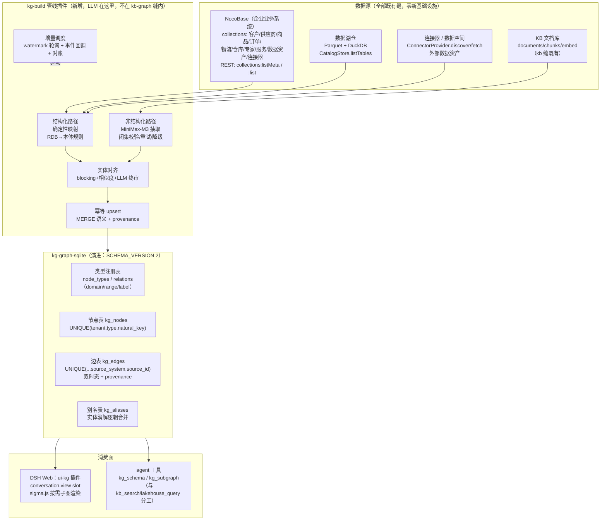
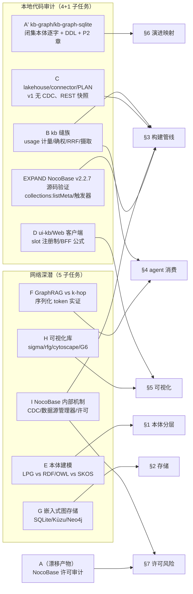
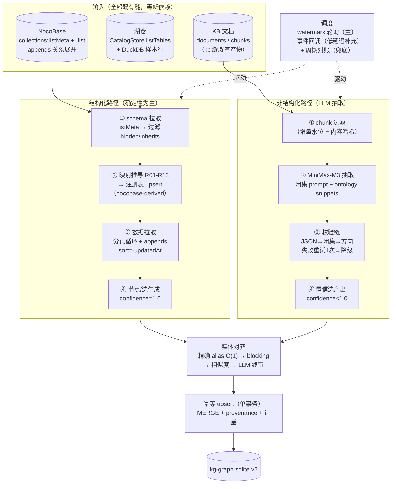
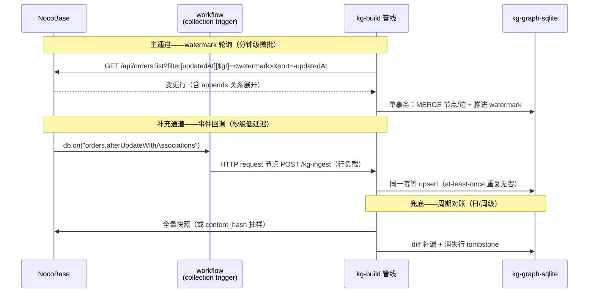
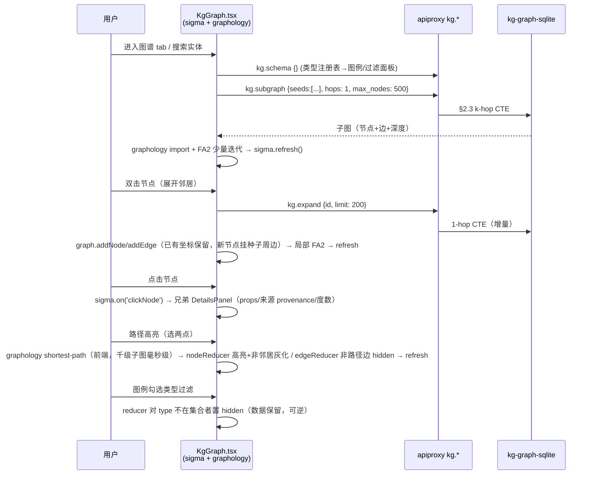
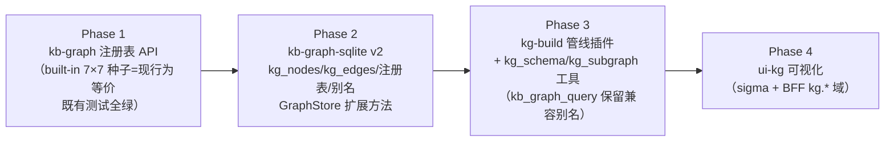

# 03 · 本体知识图谱（Ontology KG）：建模、存储、构建管线、agent 消费与可视化

> **调研归档**：deepseek-harness → 企业 KB+agent 订阅产品 · 盲区 C（本体知识图谱）
> **方法**：11 个子任务（4 本地代码审计 + 5 网络深潜 + 1 回溯补审 + 1 NocoBase v2.2.7 源码验证），全部饱和；关键论断均双源三角验证
> **日期**：2026-09-06 · 语言：中文 · 配套章节：[02-nocobase-ui-dsh-integration.zh.md](02-nocobase-ui-dsh-integration.zh.md)

---

## 目录

- [0. 推荐方案总览（先结论）](#0-推荐方案总览先结论)
- [1. 本体分层设计草案](#1-本体分层设计草案)
- [2. 存储 Schema](#2-存储-schema)
- [3. 构建管线（结构化 / 非结构化两路 + 增量语义）](#3-构建管线结构化--非结构化两路--增量语义)
- [4. agent 消费（KG → RAG）](#4-agent-消费kg--rag)
- [5. 可视化选型](#5-可视化选型)
- [6. 与既有 kb-graph 的演进映射](#6-与既有-kb-graph-的演进映射)
- [7. 风险与未解决矛盾](#7-风险与未解决矛盾)
- [8. 证据与来源](#8-证据与来源)

---

## 0. 推荐方案总览（先结论）

### 0.1 八项核心决策

| # | 决策域 | 推荐方案 | 关键依据（详见对应章节） |
|---|---|---|---|
| **D1** | 本体建模范式 | **强类型属性图（LPG）为主**：TS 声明式 schema 表达类层次与 domain/range（借 OWL 思想、不引 OWL 推理机）；校验层按 **SHACL 语义自建**（闭集 shape：必填边/值域枚举/引用存在性）；词表层 **SKOS 风格**（broader/narrower/altLabel）；保留未来 RDF 投影出口 | §1.1：企业实证（DataHub/PayPal/AutoKnow 全走实体-关系模型）+ 无图运维团队 + TS 栈 |
| **D2** | 本体分层 | **三层**：极简顶层（schema.org 风格锚点）+ 业务域本体（10 个域模块，既有食品 7 型并入）+ 实例层（NocoBase 行 → 节点） | §1.2：Amazon AutoKnow / AWS Neptune / item.com 先例 |
| **D3** | 图存储 | **续用本仓库 node:sqlite 嵌入式栈**（与 [kb-graph-sqlite](../../../packages/kb/kb-graph-sqlite/src/schema.ts:9) 同构）：节点表 + 边表 + 类型/关系注册表 + 别名表 + provenance/双时态列；`SCHEMA_VERSION` 1→2 **拒绝旧库、删库重建**（图谱是派生数据，可从源重建，无迁移负担） | §2：SQLite 邻接表 ~5 万实体毫秒级遍历；Kùzu 已归档 / LevelGraph 停滞 / Neo4j 违反"避免重型基础设施"红线 |
| **D4** | 构建管线 | **双路**：结构化源（NocoBase `collections:listMeta` + 湖仓表 → **确定性映射**为主 + LLM 消歧/对齐）与非结构化源（KB 文档 → **MiniMax-M3 抽取** + 闭集 JSON 校验 + 重试/降级）；LLM 抽取放在**独立 kg-build 管线插件**，kb-graph 缝内保持"抽取绝不内置 LLM 调用"的既有宪法 | §3.1–3.3 |
| **D5** | 增量更新语义 | **轮询 `updatedAt` watermark 为主** + NocoBase workflow collection 事件回调（低延迟补充）+ **周期对账兜底**；at-least-once 交付 + 幂等 upsert（UNIQUE 约束天然收敛）；删除走 tombstone（`valid_until`） | §3.5：源码验证 `bulkCreate` 恒不触发事件 → 事件不能作唯一同步通道 |
| **D6** | agent 消费 | **k-hop 子图查询工具为主**（`kg_schema` / `kg_subgraph`，邻域扩展 + 上下文注入），序列化用**按实体聚合的结构化 YAML**；**不做**自由 Text2Cypher、**不做** RDF 序列化、**不预建**社区摘要（可选 LazyGraphRAG 式懒摘要扩展） | §4：万级节点规模远低于 GraphRAG global sensemaking 目标区；序列化实证 YAML 准确率最优且 token 中位 |
| **D7** | 可视化 | **sigma.js v3 + graphology + @react-sigma/core** 主选（WebGL、gzip ~42KB、MIT、React 18 peer）；react-force-graph-2d 备选；新建 `ui-kg` 插件仿 [ui-kb](../../../packages/client/ui-kb/src/client/index.ts:205) 骨架；子图查询驱动的按需加载（不全量渲染） | §5 |
| **D8** | kb-graph 演进 | 闭集 → **类型注册表化**（10 个精确触点，见 §6.2）；v1 决策"图谱本体不动"（决策 D5，发现动线语境）**推翻**，但保留其内核：闭集校验移到注册表边界、抽取仍不进缝 | §6 |

### 0.2 总体架构



### 0.3 一段话总述

本方案的立场是**演进而非推倒**：既有 [kb-graph](../../../packages/kb/kb-graph/src/types.ts:15) 缝的三角色拆分（Service Definition / Store Provider / Consumer）、`GraphStore` 六方法查询代数、`{type, id}` 实体结构与 UNIQUE 六元组幂等语义全部保留；被推翻的只有"本体是编译期闭集"这一点——闭集字面量联合类型升级为**运行时类型注册表**（built-in 食品 7×7 变为注册表种子数据），存储从单表 `triples` 升级为节点/边/注册表/别名的属性图 schema（`SCHEMA_VERSION` 2，拒绝旧库重建——图谱是 provenance 可追溯的派生数据，重建即恢复）。在此之上新建三条产线：**kg-build 管线插件**（结构化确定性映射 + 非结构化 LLM 抽取两路合流到实体对齐与幂等 upsert，复用 kb 缝的 `KbProvenance` 确权三元组与 `recordUsage` 计量模式）、**agent 工具面**（`kg_schema` + `kg_subgraph`，聚合 YAML 序列化，与既有 `kb_search`/`lakehouse_query` 构成"细节/多跳/聚合"分工）、**ui-kg 可视化插件**（sigma.js，BFF 走"一个新文件对 + 一个字段 + 一行映射"公式）。

### 0.4 研究知识网络



> 说明：子任务 A 首派发生目标漂移（返回了 NocoBase 许可深度审计而非 kb-graph 审计），其结论保留用于 §7 许可风险章；kb-graph 现状由回溯补审 A' 完成，证据链完整。

---

## 1. 本体分层设计草案

### 1.1 建模范式选型：LPG vs RDF/OWL(+SHACL) vs SKOS

**七维对比**（综合 Semantic Partners、Neo4j、TigerGraph、Ontop、zenn 2025、HN 生产者讨论）：

| 维度 | RDF/OWL + SHACL | LPG（属性图） | SKOS |
|---|---|---|---|
| 表达能力 | 三元组 + URI 全局标识 + OWL 描述逻辑（等价类/不相交/属性公理）；开放世界假设 | 节点/边类型 + 属性键值；**边为一等公民**（可带属性：数量/时间/置信度）；同类型多重关系可区分 | skos:Concept + broader/narrower/related/prefLabel，仅词表层级 |
| 约束/验证 | SHACL（sh:minCount/sh:closed/sh:datatype）出验证报告可进 CI；OWL 做一致性检查 | 应用级 schema（Neo4j constraints / **JSON Schema / TS 类型**）；HN 实证："JSON schema is far more widely implemented" | 无验证语义 |
| 工具生态 | Protégé/TopBraid/Ontop/GraphDB/Stardog；偏学术-语义网圈 | Neo4j/Neptune/Kuzu/JanusGraph；**开发者生态大、与 LLM/RAG 生态亲和**（GraphRAG 主流实践在 LPG 上） | Skosmos/PoolParty 词表工具 |
| 序列化/互操作 | Turtle/N-Quads/JSON-LD（W3C 标准，跨组织 linked data） | 属性 JSON/CSV，"typically silo'd within a single database instance"（Semantic Partners） | RDF 序列化 |
| 学习曲线 | 陡峭（"Acquiring the expertise to create standard ontologies takes considerable time"——Neo4j 官方） | 面向 OO 背景开发者友好，"What you draw is what you store" | 最低，领域编辑数天可建企业术语表 |
| 中小型 KG 工程成本 | 高：本体需先完整才能部署、滞后于业务（"Ontologies perpetually lag behind the business domains"） | 低：白板模型即物理模型 | 最低 |
| LLM 时代兼容 | Google 生态（schema.org/JSON-LD structured data） | GraphRAG/entity-centric RAG 主流载体；属性内嵌便于文本化 | 概念标签天然适合 LLM 词表对齐 |

**业界三方论战（矛盾双方并陈，本报告不隐藏分歧）**：

- **LPG 阵营**：Neo4j 官方论文级论据——"RDF wasn't designed with database systems in mind...ontologies perpetually lag behind the business"；TigerGraph："triple stores must rebuild meaning from many separate triples"。
- **RDF 阵营**：Semantic Partners——"RDF's URI-based identifiers and W3C standards make it inherently interoperable. Property graphs are typically silo'd"；HN 生产者："Property graphs don't specify schema"。
- **调和派**（zenn 2025 / Semantic Partners）：双栈混合是趋势——"RDF 语义层 + LPG 探索层"（Neptune 双端点、Neo4j neosemantics n10s 双向映射、RDF-star 补边属性）。
- **企业实证**：LinkedIn DataHub 三代元数据架构（MySQL/Postgres 主存储 + ES + 图索引）、Airbnb Dataportal、Spotify Lexikon、Shopify Artifact 同构——**企业元数据 KG 主流不用 RDF，用自定义实体-关系模型**；Amazon AutoKnow 产品图谱（事实自动增长 ~200%）无 RDF 依赖；PayPal 用 Neo4j property graph 做实时欺诈检测。

**DSH 选型结论（D1）**：主模型选 **LPG/强类型属性图**，理由链：(a) 万级节点/十万级边规模 + 无专用图运维团队 + TS 技术栈——本体技能稀缺与本体滞后业务是 RDF 阵营自己的官方承认的痛点；(b) DSH 的消费端是 LLM（agent 工具面），LPG 的属性内嵌与实体-关系序列化对 LLM 最亲和（§4.3 实证）；(c) Ontop 官方定性背书："RDF mainly targets data integration applications while property graphs are used for building graph databases"。**借 OWL 思想不引 OWL 推理机**：类层次/域值域用 TS 类型 + 声明式 schema 表达（AWS Neptune 博客证明"本体作模型层"与存储解耦可行）。**验证层按 SHACL 语义自建**最小 shape 集（节点类型必填边约束/值域枚举/引用存在性）——deonvdv 的三分法是本报告采纳的工程判据："OWL 回答'由这些公理还能推出什么为真'（推理，不采用）；SHACL 回答'这个图是否满足系统要求的 shape'（验收契约，自建）；SKOS/词表回答'术语怎么组织'"。**词表层用 SKOS 风格**（broader/narrower/prefLabel/altLabel 语义直接映射 TS 字段），不做推理。**RDF 出口保留**：若未来需跨企业数据交换/对接 DCAT 类标准，按 n10s 式投影导出，不倒置主从。

**W3C SKOS/OWL 混用陷阱（避坑）**：同一词表混用 skos:Concept 与 owl:Class 会合并出 OWL Full 且无法声明不相交——技术上应选一侧为主（W3C "Using OWL and SKOS"）。DSH 的处理：类型层次用注册表 `extends` 字段（owl:subClassOf 语义），词表用 `aliases` 字段（skos:altLabel 语义），两者是注册表的不同字段而非两套系统，天然规避混用。

### 1.2 DSH 三层本体

**分层先例**：Amazon AutoKnow（手工 taxonomy 种子 → hypernym 分类器扩展类型层次 → 关系发现 → 同义词发现五模块流水线，product type 识别 87.7% 准确率）；AWS Neptune + W3C org ontology（加载通用本体 + SPARQL 自省 owl:Class/rdfs:subClassOf 推导模型再校验实例——**本体与实例同存储、可自省查询**的工程样板）；item.com（企业实体映射 BFO/DOLCE 顶层类别的价值：抽象类别稳定于业务变化，**防语义漂移**）。

**顶层（Top Layer）——极简，只做两件事**：给跨域对齐锚点 + 防语义漂移。不引入 BFO/DOLCE 全集（学习成本与收益不成比例），采用 schema.org 风格的 5 个通用类：

| 顶层类 | 语义 | 挂靠示例 |
|---|---|---|
| `Object` | 持久业务对象 | 客户、供应商、商品、仓库、专家、数据资产 |
| `Process` | 业务过程 | 订单履约、物流运输、抽取管线运行 |
| `Event` | 时点事件 | 下单、发货、入库、审批通过 |
| `Role` | 角色关系 | 供应商角色、承运商角色（同一 Object 可在不同订单中扮演） |
| `Concept` | 抽象概念/词表节点 | 商品分类、添加剂标准、风险类型（SKOS 语义区） |

元关系仅两个：`broader` / `related`（SKOS 风格，词表与类型层次共用）。

**业务域层（Domain Layer）——10 个域模块**，每域独立注册（演进时按域增删，不冻结整体本体）：

| 域 | 代表节点类型（domain extends） | 代表关系（domain → range） | NocoBase 源 |
|---|---|---|---|
| 客户域 | `Customer` (→Object) | `places`→Order、`located_in`→Region | customers |
| 供应商域 | `Supplier` (→Object) | `supplies`→Product、`fulfills`→OrderItem | suppliers |
| 商品域 | `Product` (→Object)、`ProductCategory` (→Concept) | `belongs_to`→ProductCategory、`contains`→Ingredient | products |
| 订单域 | `Order` (→Process)、`OrderItem` (→Object) | `placed_by`→Customer、`includes`→OrderItem、`shipped_to`→Address | orders / order_items |
| 物流域 | `Shipment` (→Process)、`Carrier` (→Role) | `carries`→OrderItem、`departs_from`→Warehouse | shipments |
| 仓储域 | `Warehouse` (→Object)、`StockLevel` (→Object) | `stores`→Product、`located_in`→Region | warehouses / stock |
| 专家域 | `Expert` (→Object)、`ExpertService` (→Object) | `offers`→ExpertService、`certified_for`→Concept | experts / expert_services |
| 服务域 | `Service` (→Object)、`Deliverable` (→Object) | `produces`→Deliverable | expert_services / datasets |
| 数据资产域 | `Dataset` (→Object)、`Connector` (→Object) | `derived_from`→Dataset、`sourced_via`→Connector | datasets / 连接器登记 |
| 食品合规域（**既有 7 型并入**） | `company/product/ingredient/additive/standard/process/risk` 全部 extends 到对应域类 | 既有 7 谓词 `produces/uses/contains/complies_with/follows/flags/supplies` 原样注册为 built-in | KB 场景语料 |

**并入策略**：既有食品闭集（[packages/kb/kb-graph/src/types.ts:15](../../../packages/kb/kb-graph/src/types.ts:15) 的 7 实体型 × 7 谓词）成为注册表的 **built-in 种子数据**——`source: 'builtin-food'`，方向约束（原 JSDoc 逐条注释的 company→product 等 7 条）迁入每谓词注册项的 `{domain, range}` 元数据。30 个食品场景 SKILL 驱动的既有抽取流零改动继续可用。

**实例层（Instance Layer）**：NocoBase 行 → 节点，ID minting 规则（W3C Direct Mapping 语义）：

```text
节点 ID = <source_system>:<collection>:<primaryKey>
示例:  nocobase:customers:1042     湖仓:  lakehouse:customs_export:row-17
       KB 文档实体:  kb:<sourcePath>#<entityName>
无主键/弱身份源 → 内部 uuid + 弱身份标记（Direct Mapping 的 blank-node 语义）
组合主键 → 多列按固定顺序拼接（Direct Mapping §2.3）
```

**本体演进模式**（Amazon AutoKnow taxonomy enrichment）：新类型先挂 `extends`（hypernym 层次）注册为 `draft` 状态，经抽取管线实测（§3.6 质量门）后激活为 `active`；类型层次变更跑两套回归（deonvdv）：推理 diff（分类变化）+ 验证 diff（新旧实例 shape 通过率对比）。

### 1.3 从 NocoBase collections 自动推导本体的映射规则

**输入通道**（已由 v2.2.7 源码验证，全部 Bearer token、ACL 门槛 `loggedIn` 无需 admin）：

| 端点 | 用途 | 源码锚点（research/2026-09-06-nocobase-integration/sources/nocobase/ 下） |
|---|---|---|
| `GET /api/collections:listMeta` | **主枚举**：一次返回全部运行时 collection 定义 `{...options, filterTargetKey, unavailableActions, fields[]}`，不分页 | plugin-data-source-main resourcers/collections.ts:98-131 |
| `GET /api/collections:list?paginate=false` | 细粒度（data+meta 形态，可过滤 hidden） | 同上 collections.ts:12-83（元数据表定义） |
| `GET /api/collections/<name>/fields:list` | 字段级枚举（关联式） | plugin-data-source-main server.ts:563-578 |
| `GET /api/dataSources/<key>/collections:list` | 外部数据源（或 header `x-data-source: <key>`） | data-source-manager.ts:96（`ctx.get('x-data-source') \|\| 'main'`） |

v2.x **不需要** `/api/<dataSourceKey>/collections:list` 前缀形态——数据源选择由 `x-data-source` header 完成（这是 EXPAND 源码验证消除的网络调研矛盾）。

**字段消费边界**：collection 定义中 `type`（存储类型）/`target`/`foreignKey`/`through`/`otherKey`（关系语义）/`title`（展示名）是 KG 建模输入；`interface`（UI 交互类型）与 `uiSchema`（字段级 UI 配置）**忽略**——UI schema 与 DB 语义是正交维度。

**映射规则 checklist**（W3C R2RML / Direct Mapping + Microsoft Fabric 五步清单 + NocoBase 特化，可直接抄进 kg-build 代码注释）：

```text
R01 表(collections) → 节点类型；每行 → 实例节点            [R2RML rr:logicalTable + rr:class]
R02 主键(PK/filterTargetKey) → natural_key（幂等合并锚点）  [Direct Mapping §2.3]
R03 无主键表 → 内部 uuid + 弱身份标记                       [Direct Mapping blank-node 语义]
R04 组合主键 → 多列固定顺序拼接为 natural_key               [Direct Mapping §2.3]
R05 标量列 → 节点属性（datatype 映射表：integer→number,
    string/text→string, boolean→boolean, date→ISO 字符串,
    json/jsonb→object, decimal(p,q)→number）               [R2RML rr:datatype]
R06 belongsTo(target, foreignKey) → 单条有向边，方向=子→父  [R2RML rr:joinCondition]
R07 hasMany(target, foreignKey) → belongsTo 的反向边（逆关系
    inverseOf 声明，不重复存储）                            [MS Fabric one-to-many]
R08 belongsToMany(target, through, foreignKey, otherKey)
    → 二跳展开：A -[through 语义边]- through 行 -[]- B；
    junction 行带业务属性(数量/时间)时保留为中间节点         [MS Fabric SalesOrderDetail 模式]
R09 枚举字段 → SKOS 概念节点或子类型（"可能成为内嵌实体的列，
    如 Country 或 Department"——MS Fabric 官方提示）         [Fabric step 1]
R10 表/字段 title → label/description（LLM 对齐要用）       [rdfs:label 语义]
R11 nullable FK → 边可选：NULL 时不生成边（缺失=未知，非错误）[开放世界]
R12 hidden=true / inherits 系统表 / loadedFromCollectionManager
    =false 的 collection → 跳过                            [源码验证：listMeta 过滤条件]
R13 关系字段数据拉取用 :list 的 appends=<关系字段> 参数
    一次展开，避免 N+1                                     [NocoBase REST]
```

**映射示例**（NocoBase orders collection → 注册表项）：

```jsonc
// GET /api/collections:listMeta 返回（节选）：
{
  "name": "orders", "title": "订单",
  "filterTargetKey": "id",
  "fields": [
    { "name": "id", "type": "bigInt" },
    { "name": "title", "type": "string", "title": "订单号" },
    { "name": "status", "type": "string", "interface": "select" },   // 枚举 → R09
    { "name": "customer", "type": "belongsTo", "target": "customers",
      "foreignKey": "customerId", "title": "客户" },                  // R06
    { "name": "items", "type": "hasMany", "target": "order_items",
      "foreignKey": "orderId", "title": "订单明细" },                 // R07
    { "name": "createdAt", "type": "date" }, { "name": "updatedAt", "type": "date" }
  ]
}
// → 注册表产物：
//   NodeType "Order"  { naturalKey: "id", props: [title:string, status:enum→Concept],
//                       extends: "Process" }
//   Relation "placed_by" { domain: "Order", range: "Customer", from: belongsTo(customer) }
//   Relation "includes"  { domain: "Order", range: "OrderItem", from: hasMany(items) }
```

### 1.4 TypeScript 类型形态草案

对齐仓库惯例：branded ID（`Branded<B>` from dsh-brand）、判别联合 + `assertNever`、注册表经 `ctx.effect()` 返回 disposer、只读字段。

```ts
// packages/kb/kg/src/types.ts（演进草案——kb-graph 类型注册表化的目标形态）
import type { Branded } from '@deepseek-ai/dsh-brand'

/** 注册表中的节点类型标识。branded string：开放集合，但一经注册即受 shape 约束。 */
export type KgNodeTypeId = Branded<string, 'KgNodeTypeId'>
export type KgRelationId = Branded<string, 'KgRelationId'>

/** SKOS 风格词表语义 + OWL 风格层次语义，落在注册项的不同字段。 */
export type KgOntologyLayer = 'top' | 'domain'

export interface KgPropDef {
  readonly key: string
  readonly datatype: 'string' | 'number' | 'boolean' | 'date' | 'json'
  readonly required?: boolean
  /** 值域为枚举时列出全部合法值（<10 个值时全列——LangChain enhanced schema 惯例）。 */
  readonly enumValues?: readonly string[]
  readonly description?: string
}

/** 节点类型注册项。既有闭集 KbGraphEntityType 的 7 个值成为 built-in 种子。 */
export interface KgNodeType {
  readonly id: KgNodeTypeId
  readonly label: string                    // 展示名（zh，来自 NocoBase title 或人工）
  readonly description?: string
  readonly layer: KgOntologyLayer
  /** 类型层次（owl:subClassOf 语义）：domain 层类型必须 extends 到 top 层或 domain 层。 */
  readonly extends?: KgNodeTypeId
  /** 属性 schema（闭集 shape 的一部分）。 */
  readonly props: readonly KgPropDef[]
  /** 业务自然键属性名——幂等合并锚点（UNIQUE(tenant, type, natural_key)）。 */
  readonly naturalKey?: string
  /** SKOS altLabel 语义的静态别名；动态别名走 kg_aliases 表。 */
  readonly aliases?: readonly string[]
  /** 来源：内置食品闭集 / NocoBase 映射派生 / agent 会话中定义。 */
  readonly source: 'builtin-food' | 'nocobase-derived' | 'agent-defined'
  /** draft 类型参与抽取但不对外暴露（Amazon taxonomy enrichment 演进模式）。 */
  readonly status: 'draft' | 'active'
}

/** 关系注册项。既有 7 谓词的方向约束从 JSDoc 注释迁入 domain/range 元数据。 */
export interface KgRelation {
  readonly id: KgRelationId
  readonly label: string
  readonly description?: string
  /** 方向约束（原 types.ts:29-33 的逐条 JSDoc 语义化）。 */
  readonly domain: KgNodeTypeId
  readonly range: KgNodeTypeId
  /** object=业务对象关系；hierarchical=broader/narrower（SKOS 语义，自反可用）。 */
  readonly kind: 'object' | 'hierarchical'
  readonly inverseOf?: KgRelationId         // hasMany 反向边声明，不重复存储
  readonly source: 'builtin-food' | 'nocobase-derived' | 'agent-defined'
}

/** 实例节点。KbGraphEntity 的 {type, id} 结构保留，扩展展示与向量字段。 */
export interface KgNode {
  readonly id: string                       // minting 规则见 §1.2
  readonly type: KgNodeTypeId
  readonly tenantId: string
  readonly name: string                     // 主标签（KbGraphEntity 时代 id 兼作名称，现在分离）
  readonly naturalKey?: string
  readonly props: Readonly<Record<string, unknown>>
  readonly embedding?: Float32Array         // 复用 kb 的向量 BLOB 惯例（name+summary 拼接文本）
  readonly createdAt: string
  readonly updatedAt: string
}

/** 边。provenance 对齐 kb 缝的 KbProvenance 三元组形态（B 审计：provider/scope/collectedSource）。 */
export interface KgEdge {
  readonly id: string
  readonly tenantId: string
  readonly srcId: string
  readonly dstId: string
  readonly relation: KgRelationId
  readonly fact?: string                    // 关系描述文本（GraphRAG 式，供摘要与检索）
  readonly confidence: number               // LLM 抽取产物 < 1.0；确定性映射恒 1.0
  readonly provenance: {
    readonly sourceSystem: 'nocobase' | 'lakehouse' | 'connector' | 'kb'
    readonly sourceId: string               // 行 ID / sourcePath / datasetId
    readonly extractedAt: string
  }
  readonly validFrom: string
  readonly validUntil?: string              // tombstone 语义（源删除时置位，不物理删）
}

/** 本体注册表运行时接口（KbGraphRuntime 的新扩展点，对齐 registerStoreProvider 先例）。 */
export interface KgOntologyRegistry {
  registerNodeType(type: KgNodeType): () => void
  registerRelation(rel: KgRelation): () => void
  nodeType(id: KgNodeTypeId): KgNodeType | undefined
  relation(id: KgRelationId): KgRelation | undefined
  listNodeTypes(layer?: KgOntologyLayer): readonly KgNodeType[]
  /** SHACL 语义自建校验：闭集 shape 检查（边端点类型合法、必填属性、枚举值域）。 */
  validateEdge(rel: KgRelationId, src: KgNodeTypeId, dst: KgNodeTypeId): KgShapeViolation[]
}

/** Store 接口在既有 GraphStore 六方法基础上扩展（签名向后兼容，详见 §2.2、§6.2）。 */
export interface KgStore {
  // 既有（保留）：putTriples 幂等、neighbors、twoHopPaths、searchEntities、stats、close
  upsertNode(node: KgNode): Promise<{ merged: boolean }>
  upsertEdges(edges: readonly KgEdge[]): Promise<number>
  subgraph(seedIds: readonly string[], hops: number, limits: KgSubgraphLimits): Promise<KgSubgraph>
  expand(nodeId: string, limit: number): Promise<KgSubgraph>   // 可视化按需加载原语
  tombstoneBySource(sourceSystem: string, sourceId: string, at: string): Promise<number>
}
```

**与既有类型的兼容映射**：`KbGraphEntity {type, id}` → `KgNode`（type 改查注册表、id 兼作 name 初始值）；`KbGraphTriple {subject, predicate, object, sourcePath?}` → `KgEdge`（sourcePath 升格为 provenance 三元组 `{sourceSystem:'kb', sourceId: sourcePath}`，对齐文档缝确权粒度——A' 审计指出的"图谱 provenance 单值 vs 文档缝三元组"不对称在此修复）；既有 7×7 闭集 → built-in 注册表种子（§6.2 触点 3）。

---

## 2. 存储 Schema

### 2.1 选型对比：嵌入式 SQLite vs 专用嵌入式图库 vs 外部图服务

**候选逐项查证结论**（npm registry / GitHub API 逐一核验版本与时间戳，2026-09-06 时点）：

| 候选 | 状态查证 | 结论 |
|---|---|---|
| **SQLite 邻接表**（node 表 + edge 表 + 递归 CTE） | ctxgraph 实战案例（弃 Neo4j 改纯 SQLite）：三核心表 + 2 张 junction 表 + 3 个 FTS5 虚表 + 8 个索引，**~5 万实体内图遍历毫秒级**；深度 4、分支因子 10 = 单查询访问 1 万节点仍毫秒级。sqlite-graph 库（Rust+rusqlite）：7 表 + 3 FTS5 + 8 索引 + 9 触发器，"设计到 ~10 万节点，depth 2-3 遍历个位数毫秒"。两个独立来源给出一致的规模边界（>10 万节点 + 深遍历才需 Neo4j） | ✅ **胜出**——DSH 万级节点/十万级边远低于该边界 |
| **Kùzu**（嵌入式属性图 DB，Cypher，内置 FTS+向量扩展，MIT） | npm `kuzu` 最终版 0.11.3（约一年前），**npm 已标 deprecated**；GitHub kuzudb/kuzu **已归档**（官方公告"archiving the KuzuDB project"）。技术形态优秀（Cypher、CSR 列式、ACID、进程内嵌入）但**供应链已死**，Node 22 兼容性无官方声明（无 engines 字段） | ❌ 新项目不可依赖 |
| **LevelGraph**（LevelDB + Hexastore 六重索引） | npm 4.0.0（2024-04-24），repo 最后活动 2024-05-28——**实质停滞 2.4 年**，依赖 stream1 时代库 | ❌ |
| **Oxigraph**（Rust RDF/SPARQL，wasm 绑定 0.5.11，活跃） | 维护健康但语义模型是 **RDF 三元组非属性图**（§1.1 已判 LPG），且 WASM 层开销高于原生 | ❌ 语义不合 |
| **@graphy/core** 等 RDFJS 内存库 | 5.0.0-alpha.0（2020-12），registry 2022 年后无动作 | ❌ 死亡 |
| **agentflare-ai/sqlite-graph**（SQLite Cypher 扩展） | 0.1.0-alpha，官方声明勿用于生产 | ❌ 仅概念验证 |
| **Memgraph** | in-memory C++ **服务器**（Docker/Bolt 分发），非嵌入式 | ❌ 违反"无服务器化运维"约束 |
| **Neo4j**（对照项） | 官方 system requirements：个人/开发 2GB min、16GB 推荐；服务器 8GB min + NVMe SSD；Community = **GPLv3**（open-core），Enterprise 商业许可。为万级节点引入 JVM 常驻进程 + Docker 运维 + 网络跳 + GPL 传染面 | ❌ 命中"避免重型基础设施"红线的全部反面 |

**本地适配要点（G 分支模板 → 本仓库惯例）**：外部案例均基于 better-sqlite3；本仓库三个 SQLite 包（[kb-sqlite](../../../packages/kb/kb-sqlite/src/schema.ts:10)、[kb-graph-sqlite](../../../packages/kb/kb-graph-sqlite/src/schema.ts:9)、[session-persistence-sqlite](../../../packages/session/session-persistence-sqlite/src/schema.ts:1)）全部使用 **`node:sqlite`（Node 22.19+ 内置，零原生依赖）**——KG 存储延续 `node:sqlite`，PRAGMA 惯例沿用 kb-sqlite 现行组合（WAL + synchronous=FULL + trusted_schema=OFF + foreign_keys=ON）。SQL 模板（递归 CTE / ON CONFLICT / 外容表）均为 SQLite 通用特性，不绑定驱动。

### 2.2 推荐 Schema（SCHEMA_VERSION 2）

**注册表持久化裁决**（A' 审计指出这是改造的第一个架构决策）：采用**双层注册表**——代码层注册（食品 7×7 built-in 种子 + 组合层 cordis.yml 声明的域模块）+ **持久层注册表**（`nocobase-derived` 类型快照与 `agent-defined` 类型落库）。理由：(a) NocoBase 派生类型需跨进程稳定存在（可视化图例、工具 schema 生成都要读）；(b) 持久快照与下次 `listMeta` 推导结果 diff，即得 **schema 漂移检测**（§3.6 质量门输入）；(c) agent 会话中定义的类型要幸存于重启。

```sql
-- kg-graph-sqlite SCHEMA_VERSION 2（演进自 v1 单表 triples；APP_ID 沿用 "DSHG" = 1146308687）
PRAGMA journal_mode = WAL;
PRAGMA synchronous  = FULL;
PRAGMA trusted_schema = OFF;
PRAGMA foreign_keys = ON;

-- ① 节点类型注册表（持久层；built-in 种子由代码插入，source='builtin-food'）
CREATE TABLE kg_node_types (
  type_id      TEXT PRIMARY KEY,
  label        TEXT NOT NULL,               -- 展示名（zh）
  description  TEXT,
  layer        TEXT NOT NULL,               -- 'top' | 'domain'
  extends_type TEXT REFERENCES kg_node_types(type_id),
  props_schema TEXT NOT NULL,               -- JSON: KgPropDef[]
  natural_key  TEXT,                        -- 幂等合并锚点属性名
  source       TEXT NOT NULL,               -- 'builtin-food'|'nocobase-derived'|'agent-defined'
  status       TEXT NOT NULL DEFAULT 'active',  -- 'draft'|'active'（taxonomy enrichment 演进门）
  created_at   TEXT NOT NULL,
  updated_at   TEXT NOT NULL
);

-- ② 关系注册表（domain/range = 原 JSDoc 方向约束的语义化归宿）
CREATE TABLE kg_relations (
  relation_id  TEXT PRIMARY KEY,
  label        TEXT NOT NULL,
  description  TEXT,
  domain_type  TEXT NOT NULL REFERENCES kg_node_types(type_id),
  range_type   TEXT NOT NULL REFERENCES kg_node_types(type_id),
  kind         TEXT NOT NULL,               -- 'object' | 'hierarchical'(broader/narrower)
  inverse_of   TEXT REFERENCES kg_relations(relation_id),
  source       TEXT NOT NULL,
  created_at   TEXT NOT NULL,
  updated_at   TEXT NOT NULL
);

-- ③ 节点表（既有 {type,id} 结构保留；name 与 id 分离；向量 BLOB 对齐 kb 惯例）
CREATE TABLE kg_nodes (
  id          TEXT PRIMARY KEY,             -- minting: <source_system>:<collection>:<pk>
  tenant_id   TEXT NOT NULL,
  type_id     TEXT NOT NULL REFERENCES kg_node_types(type_id),
  natural_key TEXT,
  name        TEXT NOT NULL,
  summary     TEXT,
  props       TEXT,                         -- JSON 对象（标量属性集）
  embedding   BLOB,                         -- Float32 原始字节（name+summary 文本，embo-01 1536 维）
  created_at  TEXT NOT NULL,
  updated_at  TEXT NOT NULL,
  UNIQUE (tenant_id, type_id, natural_key)  -- 幂等合并锚点（MERGE 语义）
) STRICT;
CREATE INDEX kg_nodes_tenant_type ON kg_nodes (tenant_id, type_id);
CREATE VIRTUAL TABLE kg_nodes_fts USING fts5(
  name, summary, content='kg_nodes', content_rowid='rowid', tokenize='trigram'
);                                          -- trigram 对齐 kb-sqlite 的 CJK 惯例；触发器同步（3 表×3 操作）

-- ④ 边表（双时态 + provenance；UNIQUE 扩展自 v1 六元组）
CREATE TABLE kg_edges (
  id            TEXT PRIMARY KEY,
  tenant_id     TEXT NOT NULL,
  src_id        TEXT NOT NULL REFERENCES kg_nodes(id),
  dst_id        TEXT NOT NULL REFERENCES kg_nodes(id),
  relation_id   TEXT NOT NULL REFERENCES kg_relations(relation_id),
  fact          TEXT,                       -- 关系描述文本（供检索与摘要）
  props         TEXT,                       -- JSON（数量/时间等边属性）
  confidence    REAL NOT NULL DEFAULT 1.0,  -- 确定性映射恒 1.0；LLM 抽取 < 1.0
  source_system TEXT NOT NULL,              -- 'nocobase'|'lakehouse'|'connector'|'kb'
  source_id     TEXT NOT NULL,              -- 行 PK / sourcePath / datasetId
  extracted_at  TEXT NOT NULL,
  valid_from    TEXT NOT NULL,
  valid_until   TEXT,                       -- NULL=当前有效；tombstone 置位
  recorded_at   TEXT NOT NULL,
  UNIQUE (tenant_id, src_id, dst_id, relation_id, source_system, source_id)  -- MERGE 锚点
) STRICT;
CREATE INDEX kg_edges_src ON kg_edges (tenant_id, src_id, valid_until);
CREATE INDEX kg_edges_dst ON kg_edges (tenant_id, dst_id, valid_until);
CREATE INDEX kg_edges_prov ON kg_edges (source_system, source_id);   -- 删除传播 / delete-then-re-extract 入口

-- ⑤ 别名表（实体消解逻辑合并；物理合并需迁移边，逻辑合并零成本）
CREATE TABLE kg_aliases (
  tenant_id TEXT NOT NULL,
  type_id   TEXT NOT NULL,
  alias     TEXT NOT NULL,
  node_id   TEXT NOT NULL REFERENCES kg_nodes(id),
  PRIMARY KEY (tenant_id, type_id, alias)
) STRICT;

-- ⑥ 源运行水位表（增量调度 + 对账 + CDC 去重）
CREATE TABLE kg_source_runs (
  source_system TEXT NOT NULL,              -- 'nocobase'|'lakehouse'|'connector'|'kb'
  scope         TEXT NOT NULL,              -- collection 名 / 表名 / sourcePath 前缀
  watermark     TEXT,                       -- last updatedAt ISO（轮询增量游标）
  content_hash  TEXT,                       -- schema/内容指纹（变更检测）
  run_config    TEXT,                       -- JSON（管线参数快照，可复现）
  last_run_at   TEXT NOT NULL,
  PRIMARY KEY (source_system, scope)
) STRICT;

-- ⑦ 计量表（复用 kb 缝 usage_counters 模式：5 计数器 → KG 维度）
CREATE TABLE kg_usage_counters (
  tenant_id        TEXT PRIMARY KEY,
  subgraph_queries INTEGER NOT NULL DEFAULT 0,
  extracted_triples INTEGER NOT NULL DEFAULT 0,
  extraction_calls INTEGER NOT NULL DEFAULT 0,   -- LLM 抽取调用次数（管线侧计量）
  merged_entities  INTEGER NOT NULL DEFAULT 0
) STRICT;
```

**与 v1 `triples` 表的形态对照**：v1 六元组 `(tenant, subject_type, subject_id, predicate, object_type, object_id)` 的 UNIQUE 幂等语义**完整保留**在新 UNIQUE 中（扩展 `source_system, source_id` 维度——同一业务事实可由多源断言并存，各自独立幂等）；v1 缺失的 `confidence` / 双时态 / 独立 provenance / 边属性全部补齐。

### 2.3 k-hop 与幂等 upsert SQL 模板

**k-hop 邻域扩展**（递归 CTE，`UNION` 去重天然防环；仅走当前有效边；双向）：

```sql
-- kg_subgraph / kg_expand / 可视化按需加载共用的原语
WITH RECURSIVE walk(node_id, depth) AS (
  SELECT ?1, 0
  UNION                                                    -- 去重即防环
  SELECT CASE WHEN e.src_id = w.node_id THEN e.dst_id ELSE e.src_id END,
         w.depth + 1
  FROM walk w
  JOIN kg_edges e ON e.tenant_id = ?2
                 AND (e.src_id = w.node_id OR e.dst_id = w.node_id)
                 AND e.valid_until IS NULL
  WHERE w.depth < ?3                                       -- 深度上限（默认 2）
)
SELECT n.*, w.depth
FROM walk w JOIN kg_nodes n ON n.id = w.node_id AND n.tenant_id = ?2
ORDER BY w.depth, n.name
LIMIT ?4;                                                  -- 节点预算（默认 200，截断信号随结果返回）
```

**幂等 upsert**（`INSERT ... ON CONFLICT` = Cypher `MERGE` 的 SQLite 对应物，Kùzu 官方文档确认两语义等价）：

```sql
-- 节点 MERGE：= MERGE (n:Type {natural_key})——冲突时更新可变字段
INSERT INTO kg_nodes (id, tenant_id, type_id, natural_key, name, props, updated_at)
VALUES (?, ?, ?, ?, ?, ?, ?)
ON CONFLICT (tenant_id, type_id, natural_key) DO UPDATE SET
  name = excluded.name, props = excluded.props, updated_at = excluded.updated_at;
-- ON CREATE 语义（首次插入的伴随动作）用 RETURNING + changes() 组合在 TS 层判定 merged

-- 边 MERGE：ON CREATE 记 provenance / ON MATCH 收敛 confidence + 复活（valid_until 置回 NULL）
INSERT INTO kg_edges (id, tenant_id, src_id, dst_id, relation_id, fact, confidence,
                      source_system, source_id, extracted_at, valid_from, recorded_at)
VALUES (?, ?, ?, ?, ?, ?, ?, ?, ?, ?, ?, ?)
ON CONFLICT (tenant_id, src_id, dst_id, relation_id, source_system, source_id) DO UPDATE SET
  confidence  = MAX(kg_edges.confidence, excluded.confidence),
  fact        = COALESCE(excluded.fact, kg_edges.fact),
  valid_until = NULL,
  extracted_at = excluded.extracted_at;

-- 删除传播（源删除 → tombstone 该源贡献的边，其他源的平行断言不动）
UPDATE kg_edges SET valid_until = ?3
WHERE source_system = ?1 AND source_id = ?2 AND valid_until IS NULL;

-- 文档更新：delete-then-re-extract（替代脆弱的三元组 diff）
UPDATE kg_edges SET valid_until = ?2
WHERE source_system = 'kb' AND source_id = ?1 AND valid_until IS NULL;
-- 随后在同一事务内 MERGE 重提取的三元组（复活语义由上面的 ON CONFLICT DO UPDATE 承担）
```

**事务边界**：整个"接收变更 → 节点 MERGE → 边 MERGE → tombstone → 水位推进"包在**单个 `BEGIN IMMEDIATE` 事务**内（对齐 kb-graph-sqlite store.ts:103-129 的既有写模式）——at-least-once 交付下的重复执行收敛到同一状态（幂等消费 + 事务原子性一体解决乱序与重复）。

### 2.4 SCHEMA_VERSION 演进语义

**现状**：[kb-graph-sqlite](../../../packages/kb/kb-graph-sqlite/src/schema.ts:9) `SCHEMA_VERSION = 1`，`APPLICATION_ID = 1146308687`（"DSHG"）；版本策略为**纯拒绝、无迁移**——onDisk ≠ 0 且 ≠ 1 → 报错 incompatible；onDisk = 0 且 app_id ≠ 0 → 报错 unversioned（[schema.ts:41-73](../../../packages/kb/kb-graph-sqlite/src/schema.ts:41)）。

**演进裁决：bump 到 2，沿用纯拒绝**（不写 1→2 迁移）。论据链：

1. **仓库宪法背书**：AGENTS.md 明文 "Backends reject old on-disk formats. SQLite uses monotonic SCHEMA_VERSION"——单调递增 + 拒绝旧格式是本仓库的既定惯例（session-persistence-sqlite 的 `set-user-version-*.sql` 系列同款）。
2. **图谱是派生数据，重建即恢复**：v2 schema 的每个节点/边都携带 provenance（`source_system` + `source_id` 指回 NocoBase 行/湖仓表/KB sourcePath）——旧库拒绝后运行一次全量管线（§3.2/§3.3）即可完整重建。这与 session 日志（不可再生的历史事实）有本质区别，也是"无迁移负担"成立的核心论据。
3. **v1→v2 形态差无法机械迁移**：六元组缺失 confidence/双时态/独立 provenance，补齐这些列必须回源重放，而回源重放 == 重建。
4. **pre-release 立场**：AGENTS.md "foundation over blast radius"——无外部消费者，正确地基优先于兼容垫片。

**APP_ID 沿用 "DSHG"**：这是同一存储身份的版本演进而非新库（对照 kb-sqlite "DSHK"、lakehouse-catalog "DSHL" 的命名族）。

---

## 3. 构建管线（结构化 / 非结构化两路 + 增量语义）

### 3.1 总体管线



**管线是插件，不是缝的改动**：新增 `packages/kb/kg-build` 管线插件（node half，无 browser half），`inject = ['kbGraph', 'lakehouse', 'connector', 'kb', 'llm']`。**LLM 调用只发生在管线插件内**——[2026-08-30 kb-dataspace-provenance-graph note](../../../.agents/notes/implemented/architecture/2026-08-30-kb-dataspace-provenance-graph.zh.md:17) 的图谱宪法"抽取绝不内置 LLM 调用"保持有效：kb-graph 缝仍是纯存储/查询面，演进改变的是"谁来产三元组"（从会话内场景 SKILL 自抽取，升级为管线侧结构化+抽取双路），不变的是"缝不碰 LLM"。

**复用清单**（B 审计的可复用面）：

| 复用物 | 来源 | 用法 |
|---|---|---|
| 确权三元组形态 | [KbProvenance](../../../packages/kb/kb/src/types.ts:75) `{provider, scope: 'search'\|'derive'\|'share', collectedSource}` | kg_edges 的 provenance 列 + scope 授权位（share 的实体/边跨租户可见——复用 kb-sqlite 的 SQL 层跨租户语义 `d.tenant_id = ? OR d.scope = 'share'`） |
| 计量包装模式 | kb 缝私有 `meter()`（[index.ts:276-282](../../../packages/kb/kb/src/index.ts:276)，失败仅 warn 不让数据操作失败） | 管线计量：extraction_calls / extracted_triples / merged_entities |
| embed 通道 | [kb-embed-minimax](../../../packages/kb/kb-embed-minimax/src/index.ts:1)（embo-01、1536 维、批量 32、重试 3） | 节点 name+summary 向量化（`kg_nodes.embedding` BLOB，复用"JSON-independent BLOB embeddings scanned in JS"惯例） |
| 取数通道 | [NocoBaseClient.list](../../../packages/connector/connector-nocobase/src/client.ts:159)（filter 树自由传） | 结构化路径数据拉取——加 `{updatedAt: {$gt: watermark}}` 零 client 改动（C 审计确认） |
| 表级元数据 | `CatalogStore.listTables` / `describeTable`（[types.ts:220/227](../../../packages/lakehouse/lakehouse/src/types.ts:220)） | 湖仓侧类型推导输入（columns JSON + provenance + rowCount） |
| 传输审计 | `ctx.lakehouse.recordTransfer`（[index.ts:257-262](../../../packages/connector/connector/src/index.ts:257) 先例） | 管线抽取审计落 lakehouse transfers 表（上报功能项雏形） |
| 错误码族 | configured-missing / unavailable / ambiguous 五分支（kb/src/index.ts:108-127） | 管线的 kbGraph/lakehouse/llm 解析失败 fail-loud |

### 3.2 结构化路径：确定性映射

**① schema 拉取**（端点证据见 §1.3 表；全 Bearer token）：

```ts
// kg-build 插件：schema 拉取骨架
const meta = await nb.list('collections:listMeta', { /* 不分页，一次全量 */ })
// 过滤（R12）：hidden=true、inherits 系统表、loadedFromCollectionManager=false 跳过
const business = meta.filter(c => !c.hidden && c.loadedFromCollectionManager)
```

**② 映射推导**：对每个 business collection 应用 R01–R13（§1.3 checklist），产出 `KgNodeType[]` + `KgRelation[]`（`source: 'nocobase-derived'`），与持久注册表 diff：
- 新类型 → 注册为 `status: 'draft'`（首次管线跑实测后激活，Amazon taxonomy enrichment 模式）；
- 消失类型 → 不物理删（实例层自然 tombstone），注册表标记 `retired`，工具 schema 不再暴露；
- 变更类型（props/naturalKey 变化）→ 跑 shape 验证 diff（新旧实例通过率对比，§3.6）。

**③ 数据拉取**（全量首跑 / 增量后续跑）：

```ts
// 分页循环至 meta.totalPage；关系字段 appends 一次展开（R13，避免 N+1）
let page = 1
do {
  const { rows, meta: m } = await nb.list(collection, {
    page: page++,
    pageSize: 100,
    sort: '-updatedAt',
    appends: relationFieldNames,          // ['customer', 'items', ...]
    filter: watermark ? { updatedAt: { $gt: watermark } } : undefined,
  })
  await ingestRows(collection, rows)      // → ④
} while (page <= m.totalPage)
```

C 审计的既有参数边界要尊重：connector-nocobase 的 `fetchRowsCap` 默认 1000 是单页快照语义；**kg-build 是自己的取数 Consumer，直接用 `NocoBaseClient.list` 分页循环**，不受 datasets 登记行的 cap 约束（这正式回应了"不是放到服务器文件夹"的硬要求——KG 直连业务系统元数据与数据）。

**④ 节点/边生成**（确定性，`confidence = 1.0`）：

```ts
function rowToNode(c: CollectionMeta, row: Row): KgNode {
  return {
    id: `nocobase:${c.name}:${String(row[c.filterTargetKey])}`,   // minting 规则 §1.2
    type: derivedTypeOf(c.name),                                   // ② 的产物
    naturalKey: String(row[c.filterTargetKey]),
    name: row.title ?? row.name ?? row[c.filterTargetKey],         // 展示名优先 title
    props: pickScalarProps(c, row),                                // R05 datatype 映射
    // ...
  }
}
function rowToEdges(c: CollectionMeta, row: Row): KgEdge[] {
  return c.fields.filter(isRelation).map(f => ({
    // R06 belongsTo → 子→父单边；R07 hasMany → inverseOf 声明不重复存；
    // R08 belongsToMany → through 行为中间节点（带业务属性时）
    relation: derivedRelationOf(c.name, f.name),
    provenance: { sourceSystem: 'nocobase', sourceId: `${c.name}/${row.id}`, extractedAt: now },
    confidence: 1.0,
    // ...
  }))
}
```

**湖仓侧同构**：`listTables` 拿 `LakehouseTable`（columns 的 `sqlType` 走 R05 的 DuckDB 类型映射），样本行走 `LakehouseRuntime.query`（DuckDB 下推聚合：`SELECT product, COUNT(*) FROM ...` 之类直接在湖仓算，图里只存实体与关系不存可重算的聚合值）。`provenance.sourceSystem = 'lakehouse'`，`sourceId = <tableName>@<rowCount>@<updatedAt>`。连接器侧（外部数据资产）走 `ConnectorProvider.discover/fetch` 拿到的 `ConnectorDataset`（tabular kind），同构映射，`sourceSystem = 'connector'`——三源在实体对齐层汇合。

**LLM 在结构化路径的职责（刻意收窄）**：仅 (a) 跨源实体对齐终审（§3.4）；(b) 派生关系的语义命名建议（`order_items → includes` 这类动词短语定稿前的候选生成，人工/规则终审）。行→节点/边的映射本身零 LLM——确定性、可重放、零 token 成本。

### 3.3 非结构化路径：LLM 抽取（闭集约束）

**输入**：kb 缝既有产物（documents + chunks + 向量），kg-build 是 kb 缝的 Consumer——**不重复切块、不重复 embed**，只消费 `sourcePath → chunks` 的既有结构。增量过滤：`kg_source_runs.content_hash`（chunk 内容哈希集合的聚合指纹）未变的文档跳过。

**抽取单元与模型**：chunk 粒度（kb 摄取已按 512 token / 50 overlap Markdown 标题感知切好——[chunker.ts](../../../packages/kb/kb/src/chunker.ts:1)）；模型走 `ctx.llm` 的 MiniMax-M3（与 agent 主模型同通道，cordis.patch.yml 已配 `provider: minimax, model: MiniMax-M3`）。

**Prompt 设计**（证据链：gopenai 闭集遵循实验 + ODKE+ ontology snippets + arXiv 2510.20345 综述的 schema-based 分类）：

```text
系统角色（关键句式，gopenai 实证："pedantic prompting is preferred"）：
  "Using this provided ontology EXCLUSIVELY, extract entities and relations
   from the text. Do NOT invent types or relations outside the ontology."

注入的本体片段（ODKE+ 模式——按 chunk 主题裁剪，不塞全量注册表）：
  ## Entity types
  - customer (客户): ...定义... 属性: name, region
  - product (商品): ...定义... 属性: name, category
  ## Relations (subject_type → object_type)
  - supplies (供货): supplier → product
  - contains (含有): product → ingredient
  ## Few-shot（复述模型用语——gopenai: "Questions should use the same
     terminology as the LLM uses in prior responses"）

输出 JSON schema（工具面 zod 校验）：
  { "entities": [{ "type": "<闭集枚举>", "name": "...", "props"?: {...},
                   "evidence": "<原文 span>" }],
    "relations": [{ "subject": "<实体名>", "predicate": "<闭集枚举>",
                    "object": "<实体名>", "confidence": 0.0-1.0,
                    "evidence": "<原文 span>" }] }
```

**校验链**（MiniMax 无 OpenAI 式 strict structured outputs 的公开等价机制——此为 Important 级不确定项，见 §7.3；故采用"prompt 约束 + 解码后校验"两级，E 分支结论：格式闭集靠校验、语义闭集靠 prompt，两级缺一不可）：

```ts
const raw = await llm.complete(extractionPrompt(chunk))       // ① JSON.parse fail → 重试
const parsed = ExtractionSchema.safeParse(raw)                 // ② zod 结构校验 fail → 重试
for (const e of parsed.entities) {
  if (!registry.nodeType(e.type)) → violation                  // ③ 闭集校验（注册表）
}
for (const r of parsed.relations) {
  const rel = registry.relation(r.predicate)
  if (!rel) → violation
  if (registry.validateEdge(rel, typeOf(r.subject), typeOf(r.object)).length) → violation  // ④ 方向 domain/range
}
// 违规项：带具体错误信息反馈重试 1 次（"relation 'contains' requires
// product → ingredient, got customer → ingredient"）；仍失败 → 实体降级
// UNCLASSIFIED 桶（type='concept'，等人工/后续对齐），关系丢弃并计量 dropped_relations
```

**写入语义**：`provenance = {sourceSystem: 'kb', sourceId: <sourcePath>}`；`confidence` 透传模型自评。**文档更新走 delete-then-re-extract**（G 分支工程共识：diff 新旧三元组脆弱，先 tombstone 该 sourcePath 的全部边再重提——一条 SQL + 同事务重放，见 §2.3 模板）。

**成本量级**（F 分支 GraphRAG 成本数字换算到本规模）：全量 GraphRAG 索引在百万 token 级语料上消耗数百万 LLM token；DSH KB 语料为万级 chunk（每 chunk ~512 token），单轮全量抽取 ≈ 数百万输入 token 量级的 1–2%——但**增量水位 + 内容哈希使稳态成本远低于全量**（只重提变更文档）。对照 LazyGraphRAG 的成本立场（索引成本 = full GraphRAG 的 0.1%，靠名词短语免 LLM 抽取）：结构化路径已承载绝大部分确定性事实（NocoBase 直映射零 token），LLM 抽取只负责文档中的补充语义——这个"结构化为主、LLM 为辅"的架构本身就是最大的成本控制。

### 3.4 实体对齐与消歧（Entity Resolution）

**五阶段流水线**（runmarshal 工程指南 + sqlite-graph 实现先例，DSH 适配）：

| 阶段 | 通用做法 | DSH 适配 |
|---|---|---|
| ① 标准化 | 消除 10–20% 表面重复（全半角/空白/大小写/公司后缀归一） | `name` 写入前归一化（"宏发食品(香港)有限公司"→"宏发食品香港"候选形） |
| ② Blocking | canopy/LSH/Soundex 削减 95–99% 候选（否则 1M 记录 = 5000 亿比较） | 精确别名 O(1)（`kg_aliases` 主键命中）+ 同型 `(tenant, type)` 前缀分块 + 名称前 2 字 canary |
| ③ 比较 | Levenshtein/Jaro-Winkler/Jaccard 3+ 指标组合 + embedding 余弦 | Jaro-Winkler ≥ 0.85（sqlite-graph 同款阈值）AND `kg_nodes.embedding` 余弦 ≥ 校准阈值（复用 calibrate-relevance.mts 式阈值校准工作流） |
| ④ 分类 | Fellegi-Sunter 概率分：match / non / **gray-zone** | 灰区送 LLM 终审（MiniMax-M3，ChatMatcher 式二选一 + 理由输出）；终审结果落 `kg_source_runs` 审计 |
| ⑤ 聚类 | persistent canonical id | **逻辑合并**：`kg_aliases` 写别名 → canonical `node_id`，零边迁移（物理合并需迁移边，增量场景下禁止） |

**多源合并的方向性**：NocoBase 行是业务实体的**权威主数据**（canonical id 即 `nocobase:<collection>:<pk>`）；湖仓表行、连接器数据包、KB 文档实体作为**从源**向 canonical 对齐。例子：NocoBase 客户「宏发食品」（canonical）↔ 湖仓 `customs_export` 表收货人「宏发食品(香港)有限公司」↔ KB 文档提及「宏发」——block 命中 → 双指标过阈 → 直接别名合并；若只过一指标 → LLM 终审。

**合并的保全义务**：被合并双方的全部 provenance 与边保留（tombstone 只作用于源删除，不作用于对齐合并）；新增/合并实体比值是**对齐失败信号**（比值激增 = resolver 误合并或抽取类型漂移，进 §3.6 监控）。

### 3.5 增量更新语义

**变更捕获通道全景与裁决**：



| 通道 | 机制 | 语义边界（源码/审计证据） | 角色 |
|---|---|---|---|
| **watermark 轮询** | `filter={updatedAt:{$gt:<watermark>}}`（NocoBase 官方操作符族；C 审计确认 client 零改动支持） | `updatedAt` 非 100% 普适：general/calendar 等 template 默认注入（modeling/collections.ts:138-143），但 **view collection 强制 `timestamps=false`**（view-collection.ts:14-15）——无该字段的 collection 回退全量快照 diff | **主通道** |
| **事件回调** | workflow collection trigger + HTTP request 节点（与既有订单审批轨道同一机制，nocobase-workflow.ts 先例） | 实际时机为 `afterCreateWithAssociations / afterUpdateWithAssociations / afterDestroy`（CollectionTrigger.ts:36-45）；**`Model.bulkCreate` 恒不触发**、SQL 节点/DB 直改不触发（挂 Model 生命周期，CollectionTrigger.ts:262-269）；批量 update 走 `updateMany` 逐条会触发、`destroy` 强制 individualHooks=true 会触发 | **低延迟补充，不可作唯一通道** |
| **周期对账** | 全量或哈希抽样 vs 库内图 | 修补两类漏网：bulk/直改绕过事件 + watermark 时钟边界 | **兜底** |

**交付语义与幂等**：现实是 **at-least-once**（重试/重启/重放必然重复）——解法不是追求 exactly-once，而是幂等消费：事件内容派生稳定 idempotency key（= UNIQUE 约束的五元组），重复执行收敛同一状态；乱序用单调 watermark 丢弃过期事件（G 分支：Azure Architecture Center idempotent-consumer 模式）。

**删除传播**：`afterDestroy` 回调 → `tombstoneBySource(sourceSystem, sourceId)`（§2.3 模板，只埋该源贡献的边，平行断言不动）；轮询侧的删除检测靠对账 diff（快照中消失的行 → tombstone）。**不物理删**——历史问题是"我们当时知道什么"，双时态列是唯一能回答它的方案（ctxgraph/Datomic/Graphiti 同模式；本规模下成本仅两列）。

**文档更新**：delete-then-re-extract（§3.3）——比三元组 diff 健壮且实现是一条 SQL + 同事务重放。

### 3.6 抽取质量评估

| 机制 | 做法 | 先例 |
|---|---|---|
| **评测集回归** | 种子实体查询 → 期望子图事实（k-hop 邻域应含的节点/边），管线每次变更后跑 | [examples/kb-agent/eval/questions.json](../../../examples/kb-agent/eval/questions.json) 的 120 题检索评测集（混合 Top5 98.3%）同构迁移 |
| **shape 一致性检查** | 方向违例计数（validateEdge 拒绝数）、悬空边（端点节点缺失——外键目标行未拉到）、闭集违例、confidence 分布漂移 | SHACL 语义自建校验（§1.1 D1） |
| **schema 漂移检测** | nocobase-derived 类型快照 vs 新一轮 listMeta 推导 diff | §3.2 ②（Amazon taxonomy enrichment 的触发器） |
| **监控信号** | 新增/合并实体比值激增 = 对齐失败；UNCLASSIFIED 桶增长率；抽取重试率；dropped_relations 计量 | G 分支 ER 监控实践 |
| **阈值校准** | Jaro-Winkler/embedding 余弦/LLM 终审阈值定期用标注样本重校 | [calibrate-relevance.mts](../../../examples/kb-agent/scripts/calibrate-relevance.mts) 的 kb 阈值校准工作流（minRelevanceScore 0.015 即其产物） |
| **冒烟** | 真实抽取流端到端冒烟（种子数据 → 图 → 抽查） | [graph-smoke.mts](../../../examples/kb-agent/scripts/graph-smoke.mts) 先例 |

---

## 4. agent 消费（KG → RAG）

### 4.1 模式选型：GraphRAG vs k-hop 子图查询

**Microsoft GraphRAG 机制与成本**（论文 arXiv 2404.16130v2 + 官方文档）：索引管线 = 文档分块 → LLM 逐块抽取实体/关系/协变量 → 图构建 → **Leiden 社区检测** → 分层社区摘要（community reports，上层递归吸收下层）。查询两模式：**local search**（语义匹配定位入口实体 → 提取邻域 + 关联文本单元 + 社区报告 → 按预算塞单上下文）与 **global search**（社区摘要 map-reduce）。**查询成本表**（每查询上下文 token）：Podcast 语料 C0=26,657 / C3=746,100 / 纯文本 map-reduce=1,014,611——root 级社区摘要比纯文本省 **9–43x**，但绝对量仍是数十万 token 级。

**变体与批判**（矛盾双方并陈）：

- **LightRAG**（arXiv 2410.05779v3）：dual-level 检索（low-level 实体名 / high-level 主题 key）、实体名唯一 key + 跨 chunk 去重支撑**增量更新免全图重建**；单查询关键词条生成 + 检索 **<100 tokens、1 次 API 调用**（vs GraphRAG global 单查询 610k tokens + 数百次调用）；win rate：comprehensiveness 基本平手（49.6–54.4%）、diversity 大胜（最高 77.2% vs 22.8%）。
- **LazyGraphRAG**（Microsoft Research 官方博客）：索引放弃 LLM 抽取改用 NLP 名词短语 + 共现，社区报告**延迟到查询时生成**——索引成本 = full GraphRAG 的 **0.1%**；在向量 RAG 相当的查询成本下 local 质量全面胜出，4% GraphRAG global 查询成本下 local+global 双胜。**这是微软自己对 full GraphRAG 索引成本的否定**。
- **系统评测**（arXiv 2502.11371v3，MSU+Meta+IBM）：统一协议下 **RAG 胜 single-hop/细节查询**（NQ、NovelQA-dtl），**GraphRAG-Local 类胜 multi-hop**（HotPotQA、MultiHop-RAG），**Community-GraphRAG（Global 类）在 QA 上常失败**——社区摘要丢细粒度证据、null 查询幻觉风险高；token 对齐后结论不变（Community-GraphRAG local 检索 9,770 tokens vs RAG 3,631，2.7x）。
- **反 KG 阵营**（HN 生产者）："they are brittle, hard to maintain...you should just pass everything that might be relevant into the context of an LLM"——在 DSH 场景被否定的理由：企业数据规模超上下文预算，且结构化事实（订单/库存/供应链）天然适合图查询。

**DSH 裁决（D6）**：万级节点/十万级边 + 本体结构良好 + 查询以实体聚焦为主——**该规模远低于 GraphRAG 的百万 token 语料 global sensemaking 目标区**。采用 **k-hop 子图查询为主**（2502.11371 的 multi-hop 优势路径），**不预建社区摘要**（Global 类在 QA 上常败 + 索引成本 + 增量维护复杂度三重否决）。保留 **LazyGraphRAG 式懒摘要**（`kg_summary`，查询时按需对子图生成摘要）作为"这批供应商整体合规状态"类全局问题的未来扩展位——零预建索引成本，按查询付费。

### 4.2 工具面设计

| 工具 | args | 输出 | 渲染意图 | 依据 |
|---|---|---|---|---|
| `kg_schema` | `{layer?: 'top'\|'domain'}` | 类型注册表：节点类型（label/props/enum 值域——**<10 个不同值全列**）+ 关系（domain→range） | generic | LangChain GraphCypherQAChain 的 refresh_schema() enhanced schema 惯例；供 agent 先探后查（对齐 lakehouse 的"先 `lakehouse_tables` 再写 SQL"指引先例） |
| `kg_subgraph` | `{seeds: string[]（实体名/别名，经 kg_aliases 解析）, hops?: 1\|2, max_nodes?: number（默认 200）, relation_types?: string[]}` | 按实体聚合的结构化 YAML（§4.3）+ `truncated` 信号 + 来源表 | generic（+ 专属 toolview，§5.2） | 2502.11371 multi-hop 路径；`truncated` 字段对齐 [kb_search](../../../packages/kb/tool-kb/src/index.ts:46) 的"可能还有"信号惯例 |
| `kg_graph_add`（既有 `kb_graph_add` 演进） | `{triples: [{s,p,o}], source_path}` ≤50/次 | 幂等写入计数 | generic | 会话内 agent 自定义抽取（scenario SKILL 流）保留——与管线批量抽取共存，provenance 区分 `agent-defined` |

**分工指引**（写进 system prompt 与工具描述——工具措辞应用化有 42.8%→60.8% 的实证增益，Talk like a Graph）：

```text
- 要找"某客户/商品/供应商的关联信息"（谁给它供货、它有哪些订单、合规关系）→ kg_subgraph
- 要找"文档原文细节、条款原文、单段语义匹配"→ kb_search（混合检索，chunk 级）
- 要算"数量、金额、占比、趋势"→ lakehouse_query（SQL 聚合，图不存可重算的聚合值）
- 不确定图里有什么类型/关系 → 先 kg_schema
```

**红线**：**不做自由 Text2Cypher/Text2SQL 式图查询生成**——Neo4j 官方 44,387 实例数据集上执行 ExactMatch 最高仅 ~30%（GPT-4o 与 fine-tuned 持平）；若未来需要参数化查询，走**模板 + 填参**（LlamaIndex CypherTemplateRetriever 先例）或 agent 多轮自纠（Agentic Text2Cypher 先例），不做一次性自由生成。

### 4.3 上下文序列化格式（token 效率 × 模型理解，实证分级）

**KG-LLM-Bench**（arXiv 2504.07087，7 模型 × 5 格式受控实验）——最直接的图文本化对比：

| 格式 | 平均 token | 准确率结论 |
|---|---|---|
| List-of-Edges（边列表） | **2,644.8**（最省） | 仅在"最高度节点"类全局任务占优（节点出现频次即信号） |
| **Structured YAML（按 subject 聚合）** | 2,903.1 | **多数任务准确率最优** |
| Structured JSON | 4,504.7 | 聚合形态下与 YAML 接近 |
| RDF Turtle | 8,171.1 | 无优势（个别大模型反常占优：Llama3.3-70B/Nova Pro） |
| JSON-LD | **13,503.4**（最贵，与最省差 **5.1x**） | 同上 |

**Talk like a Graph**（arXiv 2310.04560，ICLR24）：编码格式选择影响准确率 **4.8%–61.8%**；问题措辞应用化（"朋友"而非"节点"）42.8%→60.8%；LLM 在多数基础图任务低于多数类基线——**格式与措辞都是一等设计变量**。

**Mermaid 的证据状态**：未找到任何受控的"Mermaid vs 三元组/邻接表"模型输入准确率实证（F 分支确认属事实性缺口）——**Mermaid 只用于人看的 UI 渲染输出**（§5），不做模型输入；若未来要用作输入须自建 A/B。

**DSH 序列化规范**（主格式 = 按实体聚合的结构化 YAML；token 受限时降级边列表）：

```yaml
# kg_subgraph 输出（示例：宏发食品 2 跳子图，截断至预算）
entity:
  id: nocobase:customers:1042
  type: customer          # 客户
  name: 宏发食品
  props: { region: 香港, level: A }
relations:
  - places:               # 下单 → order
      - { name: 'SO-2026-0912', type: order, props: { status: pending, total: 48200 } }
      - { name: 'SO-2026-0830', type: order, props: { status: delivered } }
  - supplied_by:          # 由…供货 → supplier（经订单项聚合）
      - { name: 珠海华丰食品, type: supplier, props: { rating: 4.7 } }
related_highlights:       # 二跳上的高信号边（度数+近因排序后 top-N）
  - 珠海华丰食品 -[supplies]-> 冷冻虾仁(商品) -[contains]-> 山梨酸钾(添加剂) -[complies_with]-> GB 2760
sources:
  - nocobase:orders/912, nocobase:order_items/3317
truncated: true           # 达到 max_nodes 预算，可缩小 hops 或换更具体 seeds
```

**上下文预算控制**：`max_nodes` 默认 200、`hops` 默认 2——深度 × 分支因子爆炸警告（depth 4 × 分支 10 = 单查询 1 万节点，G 分支性能边界以内但 token 预算以外）；hub 节点（高度数）按"边重要性 = 度数 × 近因 × 与 seed 相关性"截 top-N；典型子图 3–6k tokens，MiniMax-M3 上下文无压力。

---

## 5. 可视化选型

### 5.1 库选型对比

**四库对比总表**（npm registry / GitHub API / bundlephobia 实测，2026-09-06 时点）：

| 维度 | react-force-graph-2d | **sigma.js 3 + @react-sigma/core** | cytoscape + react-cytoscapejs | AntV G6 v5 |
|---|---|---|---|---|
| license | MIT | **MIT（变更传闻已证伪**：GitHub API spdx_id + main 分支 LICENSE.txt + DeepWiki 三方一致，v1–v3 无变更记录） | MIT | MIT |
| 最新版/发版 | 1.29.1（2026-02） | sigma 3.0.3（2026-04，**v4 alpha 文档已上线**）/ @react-sigma/core 5.0.6（2025-12） | cytoscape 3.34.2（2026-08，**wrapper 最后发版 2022-09，停更 4 年**） | 5.1.1（2026-05） |
| 渲染 | Canvas2D（d3-force-3d 物理） | **WebGL**（渲染强、力模拟在 graphology） | Canvas（WebGL renderer 在源码树但**未随 release 发布**） | Canvas/SVG/WebGL + WebGPU/WASM 布局加速 |
| React 集成 | **本身就是 React 组件**（peer react: *） | @react-sigma v5（SigmaContainer + useSigma hooks，已适配 sigma v3；React 18 peer） | wrapper 停更（建议裸用自封装） | 无官方 React 组件（手动 ref/effect + @antv/g6-extension-react + Graphin） |
| 平滑交互规模 | 数千~万级（官方 large-graph demo；Cosmograph 表称其 3D 不能渲染 1M+） | **数万~百万（渲染）**；力模拟 50k+ 全家不支持 | 实测分裂：~2k 即需调优（Medium）vs 5k–10k 平滑（pistack，靠 culling+LOD） | WebGL 20k+（Canvas 文本标签在 WebGL 模式不渲染） |
| 布局生态 | d3-force 内建 | graphology（FA2/度量/社区发现/最短路） | cola/dagre/elk/fcose 60+ 扩展（全 MIT 活跃） | 10+ 内建含 GPU 加速 |
| gzip 体积 | 54.1 KB | **~42 KB（三件套）** | 137.0 KB（本体零依赖） | **399.8 KB** |
| 文档 | 英 | 英 + storybook 官方范例 | 英 | **中英双语最全**（蚂蚁背景） |

**第三方性能证据**（非官方宣称）：渲染引擎经验数字（cylynx 引 yworks）SVG ≈2k 节点到顶、Canvas ≈5k、**WebGL ≈10k 可用**；pistack（2026-06）通用结论——**"永远不要一次发 50,000 节点到浏览器——按 viewport/搜索/预定义子图分块 fetch，此模式适用于全部四库"**（对 DSH 按需加载策略的直接背书）；StackOverflow 实测 cytoscape 5k 节点自动布局 >15s——**布局耗时与渲染 FPS 是两个口径，必须分开评估**；Cosmograph 厂商表（利益相关需打折）：渲染 1M+ 点 Cosmograph✓/Sigma✓/rfg-3d✗，力模拟 50K+ 三家全✗。

**矛盾登记**（两方并陈）：cytoscape 平滑规模两来源冲突（~2k 需调优 vs 5k–10k 平滑，差异源于交互/样式复杂度与硬件）；rfg 万级具体阈值无第三方 FPS/内存数字（官方 demo 暗示可用 vs 厂商对比表否定其 1M 能力）。

**DSH 裁决（D7）**：**主选 sigma.js 3 + graphology + @react-sigma/core**——(a) 渲染上限余量最大（WebGL，第三方验证渲染可达 1M 级，DSH 子图场景远未触及）；(b) 交互三件套与需求一一对应且不删数据（reducer 高亮/隐藏、graphology 最短路前端计算、事件齐全）；(c) gzip ~42KB 三件套最轻之一；(d) React 18 peer 明确、纯 ESM、无 SSR 负担；(e) 核心库两周岁内持续 push，v4 alpha 方向明确（State flags 声明式状态样式）。**备选 react-force-graph-2d**：若要"零封装、力导向动画开箱即用、可升级 3D"，58.8 万周下载 + 官方 expandable-nodes/dynamic-data 样板直接匹配按需加载；代价是图分析（最短路/社区）需自配 graphology 或后端。**不推荐**：cytoscape（2k 即调优 + wrapper 停更 4 年 + 137KB，唯一亮点图论算法恰是 graphology 也有的）；G6 v5（功能最全但 400KB gzip + 333 open issues + 无官方 React 组件层——中文生态深度绑定时再议）；d3-force 裸用（只为完全自定义渲染时值得，sigma 官方 FAQ："小图或深度自定义时 d3 才是最佳"）。

### 5.2 DSH Web 端整合方式

**技术栈事实**（D 审计）：React ^18.2 + Vite ^6，纯 ESM、**无 SSR、无 Next、无 react-router**——UI 一切皆 slot（[ui-slots SlotMap](../../../packages/client/ui-slots/src/index.ts:24) declare-merge 表，4 种 kind：single/list/keyed/chain）；新增顶层 tab 的先例就是 [ui-kb 自己](../../../packages/client/ui-kb/src/client/index.ts:205)（以 `id:'kb', order:10` 注册进 ui-conversation 声明的 `conversation.view` list slot）。

**ui-kg 插件最小落地路径**（仿 ui-kb 完整样例，五步）：

1. **包骨架**：`packages/client/ui-kg/` 复制 ui-kb 结构——package.json（`@deepseek-ai/dsh-client-ui-kg`，`dsh.client.inject` 列 runtime/locales/sidebar/conversation/tool/settings，`platform: "web"`）、tsconfig、tsdown、`src/index.ts`（node half 空 `apply()`）、`src/css-modules.d.ts`。
2. **client half 注册**（`src/client/index.ts`）：

```ts
export const inject = ['slots', 'locale', 'connection']
export function apply(ctx: ClientContext): void {
  ctx.effect(() => ctx.locale.register('kg', { zh, en }), 'ui-kg: dictionaries')
  const api = (ctx.get('connection') as ConnectionHandle).api
  const bound = ctx.locale.bind('kg')
  // 顶层图谱 tab（对齐 ui-kb 的 view 注册先例）
  ctx.slots.inject('conversation.view', () => ctx.slots.register({
    name: 'conversation.view', id: 'kg', order: 15, locale: 'kg',
    label: () => bound('view.kg'),
    inject: () => ({
      subgraph: (seeds: string[]) => api.kg.subgraph({ seeds, hops: 1, max_nodes: 500 })
        .then(r => unwrap<KgSubgraphView>(r)),
      expand: (id: string) => api.kg.expand({ id, limit: 200 }).then(r => unwrap<KgSubgraphView>(r)),
      schema: () => api.kg.schema({}).then(r => unwrap<KgSchemaView>(r)),
    }),
  }), 'ui-kg: graph view tab')
  // kg_subgraph 工具行（keyed toolview）
  ctx.slots.inject('tool.call.toolview', function* () {
    yield ctx.slots.register({ name: 'tool.call.toolview', key: 'kg_subgraph', locale: 'kg' }, KgToolRow)
  })
}
```

3. **画布组件** `KgGraph.tsx` + `*.module.css`（颜色全走 `--dsw-alias-*` 语义 token，对齐 [docs/web-styling.md](../../../docs/web-styling.md)）；`src/client/locales.ts`（KgKey 联合 + zh/en 双字典）。
4. **组装挂载**：[web-app cordis.patch.yml](../../../packages/bundle/web-app/cordis.patch.yml:202) 浏览器名册加 `- id: ui-kg / name: '@deepseek-ai/dsh-client-ui-kg'`；BFF 按 apiproxy 的"**一个新文件对 + 一个字段 + 一行映射**"公式（[api/index.ts:24](../../../packages/host/apiproxy/src/api/index.ts:24)）：新建 `api/kg.ts`（`KgApi { schema/subgraph/expand/stats }`，RpcRequest/RpcResponse 风格）+ `kg.schema.ts`，`ApiProxy` 加 `kg: KgApi` 字段，`rpc-map.ts` 加 `'kg.*'` 行，fetch 双端注册 zod schema。kg 域照 kb 惯例**不进 gateway inject**——未组合 kg 能力时每方法返回结构化 `kg-not-composed`；wire 永不携带 tenant（部署侧 `kgTenant` config 绑定）。
5. **测试**：仿 ui-kb 的 `*.client.spec.tsx`（jsdom pragma + @testing-library/react）。

**toolview 渲染意图**（仓库宪法：工具 UI 渲染意图是设计的一部分，`presentationMeta(args, value)` 是 args 的纯函数，随 session log 持久化）：`kg_subgraph` 服务端声明 generic ResultView + `presentationMeta` 输出 `{seeds, hops, nodeCount, truncated}`——客户端 KgToolRow 读 meta 渲染摘要行 + "在图谱中查看"按钮（跳 kg tab 并注入 seeds）。

### 5.3 按需加载模式（子图查询驱动，不全量渲染）



**sigma 集成守则**：`SigmaContainer` 的 `settings`/`graph` props 视为 immutable（useMemo 常量）——props 变更会 kill 并重建实例（相机状态丢失）；增量操作经 `useSigma()` 拿实例走 graphology 方法。**万级偶发场景**走"后端预计算坐标 + 关闭持续力模拟"（SO 实测 5k 自动布局 >15s 的教训：布局耗时才是大图首要瓶颈）。Vite 侧：路由级懒加载用动态 `import()`（code splitting），三件套 ~42KB gzip 不进主 bundle。

---

## 6. 与既有 kb-graph 的演进映射

### 6.1 现状（闭集的精确形态）

**闭集本体逐字**（[packages/kb/kb-graph/src/types.ts:15](../../../packages/kb/kb-graph/src/types.ts:15) / [:35](../../../packages/kb/kb-graph/src/types.ts:35)）：

```ts
export type KbGraphEntityType = 'company' | 'product' | 'ingredient' | 'additive' | 'standard' | 'process' | 'risk'
export type KbGraphPredicate = 'produces' | 'uses' | 'contains' | 'complies_with' | 'follows' | 'flags' | 'supplies'
```

**闭集的"宪法"**是两处 JSDoc：类型注释明示 "a new type is a coordinated change across this package and its consumers, **not a plugin extension**"（types.ts:11-13）；谓词注释逐条钉死方向约束（produces: company→product 等 7 条，types.ts:29-33）。配套运行时校验数组 `KB_GRAPH_ENTITY_TYPES` / `KB_GRAPH_PREDICATES`。

**实体与 provenance 形态**：`KbGraphEntity = {type, id}`——**无 label/别名字段**，id 兼作名称（"a name, slug, or standard number"，types.ts:56-60）；provenance 仅 `sourcePath?: string` 单值可选（types.ts:68）——与文档缝完整确权三元组（provider/scope/collectedSource + 缝持有的 contentHash/contentLength）**粒度不对称**。

**查询面**（GraphStore 六方法，types.ts:94-137）：`putTriples`（幂等）/ `neighbors` / `twoHopPaths` / `searchEntities`（子串）/ `stats` / `close`。SQLite 侧（kb-graph-sqlite）：`SCHEMA_VERSION=1`、APP_ID "DSHG"；单表 `triples` UNIQUE 六元组 `(tenant, subject_type, subject_id, predicate, object_type, object_id)` + subject/object 双索引；幂等 = `ON CONFLICT ... DO NOTHING`（BEGIN IMMEDIATE 包裹）；`neighbors` 是 OR 双向匹配单 SQL、`twoHopPaths` 是 e1×e2 自连接四方向分支（非递归 CTE）、`searchEntities` 是 UNION 投影 + JS 侧 substring 过滤；读路径有 `as KbGraphEntityType` 强转（store.ts:46-48）。版本策略**纯拒绝无迁移**（schema.ts:41-73）。运行时（kb-graph/src/index.ts）：`KbGraphRuntime` 持 `Map<string, GraphStore>`，解析"恰一可用→用，多→AMBIGUOUS，零→UNAVAILABLE"；三角色拆分干净（Service Definition 无 inject 无 config；Provider inject=['kbGraph']，Config 仅 {path, busyTimeoutMs}）。

**消费者**：tool-kb 的 `kb_graph_query`（neighbors/两跳/子串搜索）与 `kb_graph_add`（≤50 triples/次幂等）——**抽取无内置 LLM，靠场景 SKILL 驱动模型抽取**（30 个食品场景的既有流）。

**历史决策语境**：P2 计划原文——"三大本体（企业/行业/人员）建模起步，图数据库（Neo4j/NebulaGraph）作为新的 Store Provider 候选——seam 设计已为此留缝（registerStoreProvider）"（[plans/food-kb-agent-plan.md:216](../../../plans/food-kb-agent-plan.md:216)）；Agent Note [2026-08-30-kb-dataspace-provenance-graph](../../../.agents/notes/implemented/architecture/2026-08-30-kb-dataspace-provenance-graph.zh.md:17)："本体两端皆闭……在工具边界校验；抽取绝不内置 LLM 调用"；决策 D5（[2026-09-05-expert-dataset-discovery](../../../.agents/notes/implemented/feature/2026-09-05-expert-dataset-discovery.zh.md:19)）："图谱本体不动：协调式本体变更的破坏面超出发现动线所需"。

**结构性张力（本报告的诊断）**：P2 只为"新 Store Provider"留了缝，**从未为"新实体类型"留缝**——"三大本体建模"的计划设想在类型系统层面没有承载点。这正是 v1 决策"图谱本体不动"的深层原因：不是本体不该动，而是动本体必然是跨包协调式破坏（types.ts 宪法自认 "not a plugin extension"）。

### 6.2 演进路径：类型注册表化（推翻 D5 的论证与边界）

**推翻论证**：D5 是发现动线语境下的局部正确（当期破坏面控制）；企业 KG 目标（10 业务域 + 开放演进）下闭集 7×7 无法承载，且 P2 §四.3 本就规划了本体扩张方向——缺的只是承载点。**注册表化补上这个承载点**，把"协调式变更"变成"插件式注册"（对齐仓库宪法 "Plugins, not loop changes：新行为上文档化的扩展点"）。

**保留的内核**（推翻的是闭集形态，不是两条设计原则）：

| 既有原则 | 演进后的形态 |
|---|---|
| "闭集校验在工具边界" | 校验移到**注册表边界**：`KgOntologyRegistry.validateEdge`（§1.4）——仍是闭集语义，只是闭集从编译期常量变为运行时注册表快照 |
| "抽取绝不内置 LLM 调用" | 完整保留：LLM 抽取在 kg-build **管线插件**（§3.1），kb-graph 缝仍是纯存储/查询面 |

**十个精确触点**（类型层/插件层/存储层，A' 补审清单 + 本报告裁决）：

1. [types.ts:15](../../../packages/kb/kb-graph/src/types.ts:15) `KbGraphEntityType` 字面量联合 → `Branded<string, 'KgNodeTypeId'>`（dsh-brand 惯例）。
2. [types.ts:35](../../../packages/kb/kb-graph/src/types.ts:35) `KbGraphPredicate` 同上。
3. [types.ts:18-26 / 38-46](../../../packages/kb/kb-graph/src/types.ts:18) 两常量数组 → 注册表 **built-in 种子数据**（食品 7×7 以 `source: 'builtin-food'` 注册——30 场景 SKILL 流零改动）。
4. [types.ts:11-13 / 29-33](../../../packages/kb/kb-graph/src/types.ts:11) 两段 JSDoc 重写——"not a plugin extension" 语义反转；方向约束迁入每谓词注册项 `{domain, range}`。
5. `searchEntities` 的 `type: KbGraphEntityType | undefined` 参数（types.ts:130）与 runtime 转发（index.ts:138）随新类型联动。
6. `KbGraphRuntime` 新增 `registerNodeType / registerRelation`（或合一 `registerOntology`）注册 API——返回 disposer、走 `ctx.effect`（对齐 [index.ts:53-62](../../../packages/kb/kb-graph/src/index.ts:53) `registerStoreProvider` 先例）+ 重复注册错误码；持久注册表（§2.2 双层裁决）与代码注册合并为运行时视图。
7. [tool-kb graph.ts:74-84](../../../packages/kb/tool-kb/src/graph.ts:74) `parseEntityType/parsePredicate` 闭集 includes 校验 → 查运行时注册表。
8. [graph.ts:226-241 / 333-335](../../../packages/kb/tool-kb/src/graph.ts:226) 工具 description / JSON schema 枚举文案 → 注册表动态生成（注意仓库惯例"描述是 args 的纯函数"：会话期内注册表视为冻结快照，工具 schema 在会话启动时物化）。
9. [store.ts:46-48](../../../packages/kb/kb-graph-sqlite/src/store.ts:46) 读路径 `as KbGraphEntityType` 强转 → 注册表校验或显式 unknown-type 语义（闭集下是合法 TS 信任边界，开放后成为真实信任缺口——A' 审计点名的必改项）。
10. SQLite `SCHEMA_VERSION` 1→2（§2.4 完整裁决：纯拒绝旧库 + 全量管线重建；triples 六元组 UNIQUE 幂等语义保留并扩展为 kg_edges 七元组；APP_ID "DSHG" 沿用）。

**分阶段落地**（每阶段一个独立 PR，对齐仓库 stacked PR 惯例，各附 Agent Note）：



**兼容性影响面**：现有消费者三个——tool-kb（两工具改读注册表，行为等价）、scenarios SKILL（零改动，built-in 种子等价）、[graph-smoke.mts](../../../examples/kb-agent/scripts/graph-smoke.mts)（冒烟脚本随 Phase 2 升级断言）；`KbGraphStoredTriple.rowId` 与 tenant 隔离模型不变；`putTriples` 幂等语义由 `upsertEdges` 超集承载（putTriples 保留为兼容入口，内部转译）。

---

## 7. 风险与未解决矛盾

### 7.1 技术风险

| # | 风险 | 证据 | 缓解 |
|---|---|---|---|
| T1 | **MiniMax 无 strict structured outputs 公开证据**：闭集抽取的格式保证不能靠解码器 | E 分支：OpenAI strict+enum 是 OpenAI 机制；MiniMax 无等价文档 | 两级机制（prompt 约束 + 解码后 zod/注册表校验 + 失败重试 1 次 + 降级 UNCLASSIFIED 桶）；若 MiniMax 未来提供严格 JSON 模式可无缝升级（校验链不变） |
| T2 | **事件 CDC 不完备**：`bulkCreate` 恒不触发、SQL/DB 直改不触发 | EXPAND 源码验证（CollectionTrigger.ts:262-269 挂 Model 生命周期 + query.test.ts:248） | 轮询 watermark 为主通道 + 周期对账兜底（§3.5 三通道架构即为此设计） |
| T3 | **view collection 无 updatedAt**：增量 filter 非普适 | view-collection.ts:14-15 强制 `timestamps=false` | 按 listMeta 的 fields 是否含 updatedAt 逐 collection 判定，无者回退全量快照 diff |
| T4 | **NocoBase 版本节奏**：v3.0.0-alpha.13 已在路上（2026-08-31）、2.x 三天一个 patch；`collections:listMeta` 是 plugin-data-source-main 的内部资源端点（无公开 API 稳定性承诺） | I 分支 releases API；EXPAND 端点注册点 | pin v2.2.x 基线；升级清单加"端点冒烟"（listMeta/fields/触发器三探针）；kg_source_runs 记录 run_config 快照可复现 |
| T5 | **实体对齐错误传播**：alias 错合并污染下游检索与可视化 | G 分支 ER 实践（错合并级联） | 逻辑合并**可逆**（删 kg_aliases 行即回滚，零边迁移）；灰区强制 LLM 终审留痕；新增/合并比值监控告警 |
| T6 | **SQLite 单写者**：WAL 下读写并行但写串行，多进程写竞争 | SQLite 固有；本仓库 kb-sqlite 同约束 | v1 部署形态单 apiproxy 进程即满足；管线微批 + 单事务合并写；未来多实例时以 jobs 队列收敛单写者 |
| T7 | **首轮全量抽取 token 成本** | F 分支 GraphRAG 成本量级换算（§3.3） | 增量水位 + 内容哈希跳过未变文档；结构化为主架构（NocoBase 直映射零 token）本身是最大节约 |
| T8 | **大子图布局耗时**：5k 节点自动布局 >15s 实测 | H 分支 SO 实证（瓶颈在布局非渲染） | 后端预计算坐标（FA2 离线跑入 props）+ 关闭前端持续模拟；按需加载使常规子图仅数百节点 |
| T9 | **注册表快照与会话物化**：会话期内注册表变更对进行中会话的工具 schema 不可见 | 仓库惯例"描述是 args 纯函数" | 文档化接受（下会话生效）；工具描述提示"图谱持续构建中" |

### 7.2 许可与合规风险（源码并入 MIT 仓库）

**许可现状事实链**（A 审计 + I 分支双源交叉）：本仓库根 [LICENSE](../../../LICENSE:1) = MIT（发布面干净，无传染义务）。NocoBase 自 v2.0.3（2026-02-24，PR #8682）从 AGPL-3.0 调整为 **Apache-2.0 + NocoBase License Agreement 补充条款**（§4.2：冲突时补充条款优先）；包级 package.json license 字段全部 Apache-2.0。但源码中 **9450 个文件头**仍是 "dual-licensed under AGPL-3.0 and NocoBase Commercial License" 文案——判读为**模板残留**（CHANGELOG relicense 事件 + 同日根协议更新 + relicense 后新增文件沿用旧头，三点支撑），且**不可删除**（协议 §5.3 禁止移除 IP 声明）。

| # | 风险 | 处置 |
|---|---|---|
| L1 | 文件头 vs 包级许可的**解释分歧**：保守法务可主张头部注释是单文件许可声明，若 AGPL 被采信则网络交互者获完整源码等义务波及整个 dsh 组装件 | 并入报告显式记录"包级 Apache-2.0 为准"的解释立场；目录级许可隔离（对照 [vendor/](../../../vendor/README.md) 惯例：独立 LICENSE 保留 + README manifest 记录上游 SHA 与抓取日期）；发布脚本确认 NocoBase 目录不进 npm 发布面 |
| L2 | relicense 版权基础未验证：AGPL 时期外部贡献者是否签 CLA 无法从快照确认 | 上游风险登记，非本仓库可控；固定基线 tag（v2.2.7）留存该 tag 的 LICENSE.txt |
| L3 | **§5.4 用途护栏**："不得用原版或修改版 Software 提供任何形式的 no-code/zero-code/low-code/**AI platform** SaaS/PaaS 产品"——边界未经官方裁定 | 本报告架构立场：NocoBase 仅作企业业务系统/数据源（REST/connector 取数），dsh 卖的是 KB+agent 能力，非"NocoBase 上层应用转售"——不触发 §6.5/§7.5 商业许可条件；若未来产品形态变为"托管 NocoBase 给租户搭应用"，需购 Commercial License（法务按售卖形态定案） |
| L4 | 付费插件边界：plugin-data-source-rest-api 等 frontmatter `isFree:false, editionLevel:1`（源码在 Apache 仓库内但功能授权分离） | 不依赖 editionLevel≥1 插件的功能；每次 NocoBase 升级重查 docs frontmatter 的 isFree/editionLevel（分级可随版本变动） |
| L5 | 品牌条款：§5.2 禁改界面品牌/名称/链接/版本号（仅左上角主 LOGO 可换） | 内部部署无感；若 NocoBase UI 对租户可见须全量保留品牌元素 |

**合规要点清单**（并入执行时逐条核对）：只并 main repo 的 core/plugins/presets（**永不并入 pro-plugins/**）；原样保留全部 9450 文件头与各 LICENSE 文件；修改处按 Apache-2.0 §4(b) 显著标注；官方 issue #10433 答复已确认：组织内部构建运营专有业务应用（含多环境/多副本/K8s）无需公开自有代码。**有利事实**：plugin-mcp-server 免费（isFree:true, editionLevel:0）——KG 管线的 NocoBase 侧多一条 MCP 取数通道备选。

### 7.3 未解决矛盾登记（双方并陈，本报告处置可追溯）

| # | 矛盾 | 甲方 | 乙方 | 处置 |
|---|---|---|---|---|
| C1 | 企业 KG 用 LPG 还是 RDF | Neo4j："ontologies perpetually lag behind the business" | Semantic Partners："Property graphs are typically silo'd" | LPG 主 + RDF 投影出口（§1.1） |
| C2 | GraphRAG 索引成本值不值 | 原论文：comprehensiveness/diversity 大胜 naive RAG | 微软自家 LazyGraphRAG：full 索引过贵（0.1% 成本反而更好） | k-hop 主 + 懒摘要扩展位（§4.1） |
| C3 | LightRAG vs GraphRAG 胜负 | LightRAG 自报 overall 52–55% 胜 | comprehensiveness 实为平手（49.6–54.4%），差距集中 diversity | 不采纳任一预建方案 |
| C4 | 图序列化最优格式 | KG-LLM-Bench：聚合格式（YAML/JSON）多数任务最优 | 大模型（Llama3.3-70B/Nova Pro）在冗长 RDF/JSON-LD 反常占优 | YAML 主格式 + 按模型实测校准（§4.3） |
| C5 | cytoscape 平滑规模 | Medium 实测 ~2k 即需调优 | pistack：5k–10k 平滑（culling+LOD） | 不选 cytoscape，矛盾失去影响面（§5.1） |
| C6 | sigma.js license 传闻 | 社区传闻有变更 | GitHub API + LICENSE.txt + DeepWiki 三方一致 MIT | **已证伪**（§5.1） |
| C7 | LLM-as-judge 偏差 | GraphRAG/LightRAG 的 win rate 结论 | 2502.11371 附录实证 position effect | 本报告不依赖 win rate 单源，采成本数字 + 独立系统评测交叉（§4.1） |
| C8 | Mermaid 作模型输入的有效性 | 无受控证据存在 | （不存在反方——证据缺口本身即结论） | UI-only 裁决；若需引入须自建 A/B（§4.3） |
| C9 | NocoBase 许可模式存续期 | #10433 官方答复："已存在多年" | releases 记录 v2.0.3（2026-02-24）才从 AGPL 切换 | 以每个 tag 的 LICENSE.txt 为准（§7.2） |
| C10 | react-force-graph 万级能力 | 官方 large-graph demo 暗示可用 | Cosmograph 厂商表（利益相关）：不能渲染 1M+ | 选 sigma 为主，rfg 仅备选（§5.1） |

### 7.4 不确定性分级

- **Critical（多源交叉，可直接依赖）**：SQLite 图规模边界（ctxgraph + sqlite-graph 两独立来源）；图序列化 token/准确率数字（KG-LLM-Bench 受控实验 + Talk like a Graph）；`collections:listMeta`/`fields`/触发器语义（v2.2.7 源码 + 官方文档 + perf 场景三源）；Kùzu 供应链死亡（npm deprecated + repo archived 双通道）。
- **Important（单源或需实证，已 hedge）**：MiniMax 无 strict 模式的推断（未见官方文档，两级机制兜底）；9450 文件头 = 模板残留的判读（三点旁证但无法务确认）；@react-sigma "稳定但低频维护"的定性；bighorndb 是否为 Kùzu 官方延续（404 未定性，不影响主结论）。
- **Observation（推测性，标注待验）**：懒摘要（kg_summary）扩展的采纳时机；RDF 投影出口的真实需求触发点；万级子图的 sigma 实际 FPS（需原型实测，H 分支明确标注为"需真实集成才能测得"）。

---

## 8. 证据与来源

### 8.1 本地源码锚点（file:line，路径相对仓库根）

| 锚点 | 作用 |
|---|---|
| [packages/kb/kb-graph/src/types.ts:15,35,56-69,94-137](../../../packages/kb/kb-graph/src/types.ts:15) | 闭集 7×7 逐字、实体/provenance 形态、GraphStore 六方法 |
| [packages/kb/kb-graph/src/index.ts:53-76](../../../packages/kb/kb-graph/src/index.ts:53) | registerStoreProvider 先例、store 解析错误码 |
| [packages/kb/kb-graph-sqlite/src/schema.ts:9-73](../../../packages/kb/kb-graph-sqlite/src/schema.ts:9) | SCHEMA_VERSION=1/DSHG、triples DDL、纯拒绝版本门 |
| [packages/kb/kb-graph-sqlite/src/store.ts:46-232](../../../packages/kb/kb-graph-sqlite/src/store.ts:46) | 幂等写入/neighbors/twoHopPaths/强转点 |
| [packages/kb/kb/src/types.ts:75-93,150-170](../../../packages/kb/kb/src/types.ts:75) | KbProvenance 确权三元组、usage 计量类型 |
| [packages/kb/kb/src/index.ts:276-446](../../../packages/kb/kb/src/index.ts:276) | meter() 包装、RRF 混合检索 |
| [packages/kb/kb-sqlite/src/schema.ts:10-37](../../../packages/kb/kb-sqlite/src/schema.ts:10) | node:sqlite + PRAGMA 惯例、FTS5 trigram |
| [packages/kb/tool-kb/src/graph.ts:74-84,226-241](../../../packages/kb/tool-kb/src/graph.ts:74) | 闭集的工具边界校验点 |
| [packages/lakehouse/lakehouse/src/types.ts:23-257](../../../packages/lakehouse/lakehouse/src/types.ts:23) | TabularData/LakehouseTable/QueryProvider/CatalogStore |
| [packages/connector/connector/src/types.ts:143-210](../../../packages/connector/connector/src/types.ts:143) | ConnectorDataset 五判别、ConnectorProvider |
| [packages/connector/connector-nocobase/src/client.ts:159](../../../packages/connector/connector-nocobase/src/client.ts:159) | NocoBaseClient.list 签名（filter 树自由传） |
| [packages/client/ui-kb/src/client/index.ts:205-282](../../../packages/client/ui-kb/src/client/index.ts:205) | view tab/toolview 注册先例 |
| [packages/host/apiproxy/src/api/kb.ts:71-105](../../../packages/host/apiproxy/src/api/kb.ts:71) 与 [api/index.ts:24](../../../packages/host/apiproxy/src/api/index.ts:24) | BFF 域公式（一文件对+一字段+一映射行） |
| [packages/bundle/web-app/cordis.patch.yml:202](../../../packages/bundle/web-app/cordis.patch.yml:202) | 浏览器插件名册 |
| [plans/food-kb-agent-plan.md:216,351](../../../plans/food-kb-agent-plan.md:216) | P2 "三大本体起步" 与闭集定稿 |
| [plans/connector-lakehouse-nocobase/02-batches.md:307-318](../../../plans/connector-lakehouse-nocobase/02-batches.md:307) | N0–N7 完成记录 |
| [.agents/notes/implemented/architecture/2026-08-30-kb-dataspace-provenance-graph.zh.md:17](../../../.agents/notes/implemented/architecture/2026-08-30-kb-dataspace-provenance-graph.zh.md:17) | "本体两端皆闭/抽取不内置 LLM" 宪法 |
| [.agents/notes/implemented/feature/2026-09-05-expert-dataset-discovery.zh.md:19](../../../.agents/notes/implemented/feature/2026-09-05-expert-dataset-discovery.zh.md:19) | 决策 D5 "图谱本体不动" 原文 |
| research/2026-09-06-nocobase-integration/sources/nocobase/（v2.2.7 快照）| data-source-manager.ts:96、plugin-data-source-main resourcers/collections.ts:98-131、CollectionTrigger.ts:36-45/262-269、view-collection.ts:14-15 等（EXPAND 验证） |
| [examples/kb-agent/](../../../examples/kb-agent/QUICKSTART.zh.md) 与 scripts/（graph-smoke/calibrate-relevance/eval） | 摄取管线、阈值校准、120 题评测集先例 |

### 8.2 网络来源（按分支）

**本体建模（E）**：W3C R2RML <https://www.w3.org/TR/r2rml/>；Direct Mapping <https://www.w3.org/TR/rdb-direct-mapping/>；Ontop 概念 <https://ontop-vkg.org/guide/concepts.html>；MS Fabric RDB→图五步 <https://learn.microsoft.com/en-us/fabric/graph/convert-relational-data-to-graph-model>；Neo4j RDF vs PG <https://neo4j.com/blog/knowledge-graph/rdf-vs-property-graphs-knowledge-graphs/>；Semantic Partners 对比 <https://www.semanticpartners.com/learn/rdf-vs-property-graph>；zenn 双栈 <https://zenn.dev/knowledge_graph/articles/rdf-vs-property-graph-2025>；LinkedIn DataHub <https://www.linkedin.com/blog/engineering/data-management/datahub-popular-metadata-architectures-explained>；Amazon AutoKnow <https://www.amazon.science/blog/building-product-graphs-automatically>；AWS Neptune+OWL <https://aws.amazon.com/blogs/database/model-driven-graphs-using-owl-in-amazon-neptune/>；OWL/SHACL 分工 <https://deonvdv.com/blog/owl-inference-vs-shacl-constraints>；SKOS/OWL 混用 <https://www.w3.org/2006/07/SWD/SKOS/skos-and-owl/master.html>；LLM KG 构建综述 <https://arxiv.org/html/2510.20345v1>；gopenai 闭集 prompting <https://blog.gopenai.com/llm-ontology-prompting-for-knowledge-graph-extraction-efdcdd0db3a1>；OpenAI structured outputs <https://developers.openai.com/api/docs/guides/structured-outputs>；HN 生产讨论 <https://news.ycombinator.com/item?id=43084073>。

**GraphRAG 与消费（F）**：GraphRAG 论文 <https://arxiv.org/html/2404.16130v2>；local/drift search 官方文档 <https://microsoft.github.io/graphrag/query/local_search/>、<https://microsoft.github.io/graphrag/query/drift_search/>；LazyGraphRAG <https://www.microsoft.com/en-us/research/blog/lazygraphrag-setting-a-new-standard-for-quality-and-cost/>；LightRAG <https://arxiv.org/html/2410.05779v3>；RAG vs GraphRAG 系统评测 <https://arxiv.org/html/2502.11371v3>；Talk like a Graph <https://arxiv.org/html/2310.04560v1>；KG-LLM-Bench <https://arxiv.org/html/2504.07087v1>；Text2Cypher <https://arxiv.org/html/2412.10064v1> + <https://neo4j.com/blog/developer/benchmarking-neo4j-text2cypher-dataset/>；LangChain Neo4j <https://docs.langchain.com/oss/python/integrations/graphs/neo4j_cypher>；LlamaIndex LPG <https://developers.llamaindex.ai/python/framework/module_guides/indexing/lpg_index_guide/>。

**存储（G）**：ctxgraph 弃 Neo4j 实战 <https://dev.to/rohansx/sqlite-as-a-graph-database-recursive-ctes-semantic-search-and-why-we-ditched-neo4j-1ai>；sqlite-graph <https://github.com/shwetarkadam/sqlite-graph>；Kùzu 归档 <https://github.com/kuzudb/kuzu> + npm deprecated；LevelGraph <https://github.com/levelgraph/levelgraph>；Oxigraph <https://github.com/oxigraph/oxigraph>；Neo4j 需求 <https://neo4j.com/docs/operations-manual/current/installation/requirements/>；增量 KG 构建 <https://kindatechnical.com/knowledge-graphs/incremental-knowledge-graph-construction.html>；幂等消费 <https://learn.microsoft.com/en-us/azure/architecture/patterns/idempotent-consumer>；ER 五阶段 <https://www.runmarshal.com/field-notes/entity-resolution>；Kùzu MERGE 语义 <https://kuzudb.github.io/docs/cypher/data-manipulation-clauses/merge/>。

**可视化（H）**：react-force-graph <https://github.com/vasturiano/react-force-graph>；sigma.js <https://www.sigmajs.org/> + license <https://github.com/jacomyal/sigma.js/blob/main/LICENSE.txt>；@react-sigma <https://sim51.github.io/react-sigma/docs/start-introduction>；cytoscape <https://github.com/cytoscape/cytoscape.js> + wrapper <https://github.com/plotly/react-cytoscapejs>；G6 React 指南 <https://g6.antv.antgroup.com/en/manual/getting-started/integration/react>；pistack 四库对比 <https://www.pistack.xyz/posts/2026-06-09-self-hosted-graph-network-visualization-cytoscapejs-g6-visnetwork-forcegraph/>；Cosmograph 对比表 <https://cosmograph.app/docs-lib/comparison/>；reducer 高亮范例 <https://github.com/jacomyal/sigma.js/blob/main/packages/storybook/stories/1-core-features/4-use-reducers/index.ts>；cytoscape js-perf <https://cytoscape.org/js-perf/>。

**NocoBase（I + EXPAND）**：collections 字段类型 <https://docs.nocobase.com/plugin-development/server/collections>；CollectionManager API <https://raw.githubusercontent.com/nocobase/nocobase/main/docs/docs/en/api/data-source-manager/i-collection-manager.md>；filter 操作符 <https://docs.nocobase.com/api/database/operators>；workflow collection 触发器 <https://raw.githubusercontent.com/nocobase/nocobase/main/docs/docs/en/workflow/triggers/collection.md>；许可协议 <https://www.nocobase.com/agreement>；relicense 公告 <https://www.nocobase.com/en/blog/pricing-adjustment-202602>；许可澄清 issue <https://github.com/nocobase/nocobase/issues/10433>；v2.0.3 release <https://github.com/nocobase/nocobase/releases/tag/v2.0.3>；HTTP API 快照 <https://raw.githubusercontent.com/sangkyunyoon/nocobase-docs/main/docs/en-US/api/http/index.md>；论坛 collections:list 实证 <https://forum.nocobase.com/t/collection-defined-in-definecollection-not-reflected-in-api-collections-list/2776>；agent 消费元数据先例 <https://github.com/Agents-Store/opencode-plugins/blob/main/nocobase/.opencode/commands/list-collections.md>。

### 8.3 方法论与归档说明

- **流程**：SCOUT→MAP→DIVE（4 本地审计 + 5 网络深潜并发）→SATURATE（一轮 EXPAND 源码验证消除矛盾）→SYNTHESIZE（编排器合成全文）→DELIVER（5 块串行落盘，逐块 wc -l + sha256 校验）。首派子任务 A 发生目标漂移（返回许可审计），其产出保留用于 §7.2；kb-graph 现状由回溯补审 A' 补齐——证据链无缺口。
- **三角验证**：关键论断均 ≥2 独立源（本地源码 + 网络文档 / 两个独立第三方）；单源论断一律降级为 Important/Observation 并 hedge（§7.4）。
- **局限**：中文社区的企业 KG 实践（阿里/蚂蚁技术文章）未在英文引擎命中，非主结论依赖；性能数字多为第三方博客与官方宣称的交叉，非受控基准；Mermaid 作模型输入的受控对比确认不存在（已如实登记为证据缺口而非臆断）。
- **落盘校验链**：块 1（369 行，sha256 `f29c9e33…`）→ 块 2 累计（746 行，`eb247ee6…`）→ 块 3 累计（887 行，`21cc2263…`）→ 块 4 累计（1044 行，`59be4bcd…`）→ 块 5（本块，最终值见文件尾注校验记录）。
