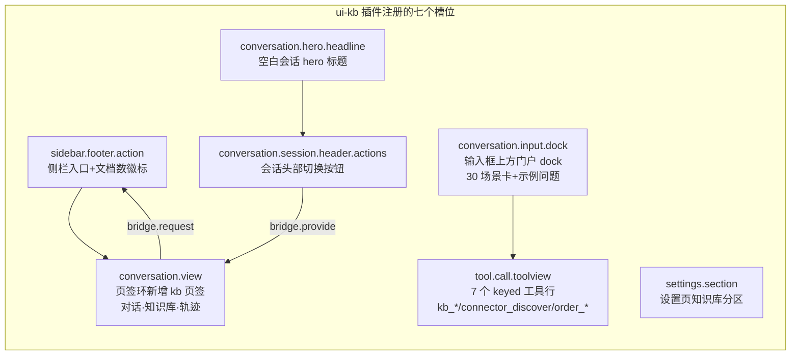
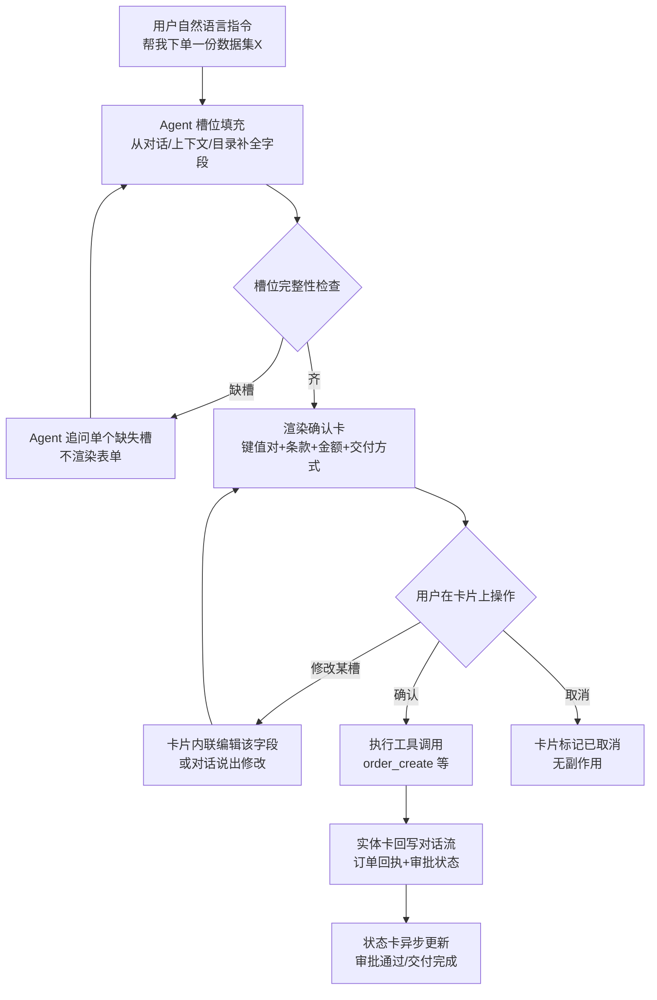

# DSH 企业 AI 数据产品 Web 端改版：业界 UI/UX 模式调研与前端现状盘点

> 研究日期：2026-09-06 | 来源：17 个网络来源 + 8 处本地仓库证据 | 深度：Thorough（子任务：盲区 D）
> 服务对象：NocoBase（企业业务系统）+ AI agent + 湖仓/KB + 本体知识图谱 + 数据资产市场 + 连接器的 DSH Web 端改版设计输入

---

## 执行摘要

本次调研横跨五个业界产品族（数据目录/数据交易市场、连接器门户、图谱可视化、AI 对话式操作、企业导航 IA），并完整盘点了 deepseek-harness 现有 Web 前端的插件槽位体系。核心结论有三：

**第一，DSH 需要的每一类新页面在业界都有成熟范式可直接借鉴。** 数据资产市场 = DataHub/OpenMetadata 的"浏览-搜索-详情页多 Tab-订阅下单"骨架 + AWS Data Exchange 的"订阅验证审批/数据字典/样例/条款"区块 + 上海数交所的"板块门户"叙事层；连接器页 = Airbyte 的"目录四组筛选 + 连接/流两级状态枚举 + 错误分色 + 趋势图下钻"模式；图谱页 = OpenMetadata 的"分层血缘 + 图层叠加开关 + 边信息抽屉"与 Neo4j Bloom 的"搜索短语 + Perspective 场景视图 + 逐跳展开"组合。

**第二，DSH 现有前端已经具备承接这些页面的完整骨架。** `ui-kb` 证明了"一个功能插件注册七个槽位（侧栏入口/hero 标题/输入 dock/会话视图页签/头部按钮/工具行/设置分区）"的模式可跑通；`tool.call.toolview` 的 keyed 注册让"专家卡/订单卡/KB 卡"成为对话内实体卡片的现成先例；render intent 体系（generic/terminal/diff/search/web 卡）是"对话结果 → 结构化卡片回写"的既定架构。新页面应当作为新的 ui-* 插件挂槽位，而不是另起炉灶。

**第三，"页面交互 AI 智能化、不搞传统表单 CRUD"在业界有清晰的可行性判据。** Notion Agent（"Anything you can do in Notion, your Agent can do for you"）与 Databricks Genie（可信域配置 + verified answers）验证了对话承载创建/编辑/查询的路径；同时业界共识（agentic-design.ai CIP 模式）明确：简单 CRUD、需要精确控制、可视化数据操作的场景应保留 GUI——下单确认、支付、权限授予必须保留轻量确认 UI。DSH 的"对话槽位填充 → 确认卡 → 实体卡片回写 → NocoBase 审批流"恰好走通这条中间路线。

---

## 一、业界模式摘要

### 1.1 数据资产市场 / 数据目录产品

**模式 A：实体详情页的多 Tab 骨架**（DataHub / OpenMetadata）
- OpenMetadata 数据资产详情页按 Tab 组织：Overview / Schema（列名/类型/列描述）/ Profiler 与 Data Quality / Lineage / Custom Properties / Activity Feed，右侧配常驻 Right Panel（所有者/Tier/标签/Domain）（[OpenMetadata 血缘文档](https://docs.open-metadata.org/v1.13.x/how-to-guides/data-lineage/explore)；[DeepWiki 组件结构](https://deepwiki.com/open-metadata/OpenMetadata/4.7-data-asset-detail-pages-and-lineage-ui) 从其 PageObject 命名可印证：OverviewPageObject / SchemaPageObject / LineagePageObject / DataQualityPageObject / CustomPropertiesPageObject / RightPanelPageObject）。
- DataHub 实体 profile 右上角提供 "Lineage" 按钮进入全屏血缘视图，profile 内另有 Lineage Tab（[DataHub 官方文档](https://docs.datahub.com/docs/features/feature-guides/ui-lineage)）。
- 血缘图节点悬浮快览展示：Source / 资产名 / 描述 / Owner（团队/用户）/ Tier / Usage；按资产类型附加信息（表：表类型、查询数、列数）；节点上直接显示质量指标（Tests Passed / Aborted / Failed）与全部 tags（[OpenMetadata](https://docs.open-metadata.org/v1.13.x/how-to-guides/data-lineage/explore)）。
- Explore 页有高级搜索（模态查询构建器）、快速筛选、排序、搜索结果导出（DeepWiki 的 AdvancedSearch.spec.ts / ExploreQuickFilters.spec.ts / SearchExport.spec.ts 测试名佐证）。

**模式 B：数据集详情页的"市场区块"**（AWS Data Exchange）
- 目录瓦片字段：产品名（可搜索）、logo、最多 2 个分类（供筛选）、短描述（瓦片上）；详情页承载长描述——必须写清数据覆盖（如"30,000 金融工具"）与更新频率（"每日/每周更新"），并提供行业 Markdown 描述模板、支持联系人、数据字典（可查看下载）、样例数据、修订版访问规则（[AWS Data Exchange 产品详情官方指南](https://docs.aws.amazon.com/data-exchange/latest/userguide/prod-details-over.html)）。
- 订阅流带治理环节：订阅验证（提供方审批）、许可管理（组织内共享）、自动续订开关、退订；投递形态分文件/API/Redshift 数据集/S3 访问/Lake Formation 权限五类（同上官方指南目录）。
- **对 DSH 的直接映射**：数据集详情页必备区块 = 元数据 + 血缘 + 样例 + 质量分 + 授权条款（用户需求原话），AWS DX 恰好给出了每个区块的行业标准字段集。

**模式 C：交易市场的"板块门户"叙事层**（上海数据交易所）
- 板块页结构：hero（板块名 + 一句话价值）→ 数据产品数/数据供方数两个计数 → 业务介绍（三段卡）→ 典型产品卡（名称 + 一句话：如"航运信用评估——整合船舶、港口、企业多维数据构建评估模型"）→ 应用场景标签云（智慧交通/金融保险/商业决策/贸易分析…）→ 合作伙伴（[上海数交所航运交通板块页](https://www.chinadep.com/dataSector/transport)）。
- 交易履约在独立平台：数据交易服务平台（dtxp.chinadep.com）+ niDts 新一代智能数据交易系统 + 数商生态（[上海数交所官网](https://www.chinadep.com/)）。
- **对 DSH 的直接映射**：DSH 的 30 场景 hero 门户与数交所板块页同构——"场景卡分组 + 计数行 + 典型产品卡"可平移为"数据资产板块页"（如食品出海板块：数据产品数 + 供方数 + 典型数据集卡 + 应用场景标签）。

### 1.2 连接器 / 集成门户

**模式 A：连接器目录页**（Airbyte）
- 搜索框 + 四组筛选：Connector Type（Agent Connectors / Replication Sources / Destinations）、Availability（Cloud / Self-managed）、Support Level（Enterprise / Certified / Standard）、Use Case（Databases / Finance & Ops / Marketing / Product / Sales & Support / Warehouses / Files / Unstructured…）；结果计数 "Showing 100 of 633" + Clear all；卡片带 support 级徽标与部署形态标签（[Airbyte 连接器目录](https://airbyte.com/connectors)，2026-09-06 实抓：633 个连接器）。
- Zapier 的 app 目录同构（搜索 + 分类 + 每个 app 页列出可用 triggers/actions）（[Zapier App Directory](https://zapier.com/apps)，未深读，仅引 URL）。

**模式 B：数据管道运行状态页**（Airbyte Connections）
- 连接级状态枚举：Healthy（最近一次同步成功）/ Failed / Running / Paused / Queued（等待容量，橙色沙漏图标）（[Airbyte 官方文档](https://docs.airbyte.com/platform/cloud/managing-airbyte-cloud/review-connection-status)）。
- 流（Stream）级状态：Synced / Syncing / Pending / Queued for next sync / Error（可自愈）/ Action Required（破坏性变更需处理）；每流一个状态图标，同步完成后显示"最后一条记录加载距今"（同上）。
- 单连接 Status 页：当前状态 + 下次计划同步时间 + 历史趋势图（Streams status 与 Records loaded 最近 8 次同步），悬停图表快速跳转对应 sync 历史（同上）。
- 工作区级仪表盘：按状态/源/目标/tag/名称筛选；点击图表任一柱 → 侧面板列出该时段全部 sync → 点击某条 sync 跳转 Connection Timeline 并自动过滤（同上）。
- 错误分色治理：配置错误红色（建议去源/目标重测保存）、系统错误黄色（瞬态、多数自愈）、限流信息条（附重试倒计时）；连续多次失败自动停用；连接器大版本升级 banner 附截止日期（同上）。
- 流级三点操作：Show in replication table（跳 Schema Tab 并高亮该流）/ Open details / Refresh stream（重同步历史）/ Clear data（清目标数据）（同上）。

### 1.3 知识图谱可视化页面

**模式 A：血缘图 = 分层 DAG，不是力导向**（DataHub / OpenMetadata 一致选择）
- DataHub：以中心实体为核心展开上下游，逐跳探索；编辑走 modal（搜索实体加边、X 删边、Save Changes）；手工添加的边带用户头像（悬停显示谁何时加的——provenance 直接可视化在图上）；时间选择器过滤边（[DataHub 血缘 UI 文档](https://docs.datahub.com/docs/features/feature-guides/ui-lineage)）。
- OpenMetadata 血缘的**图层叠加开关（Lineage Layers）**：Column Layer（列级血缘）/ Observability Layer / Service Layer / Domain Layer / Data Product Layer，五层可切换叠加（[OpenMetadata 血缘探索](https://docs.open-metadata.org/v1.13.x/how-to-guides/data-lineage/explore)）。
- OpenMetadata 配套组件：EdgeInfoDrawer（点击边弹出信息抽屉）、LineageSearchSelect（图内搜索定位）、LineageTable（表格化血缘视图）、Impact Analysis（影响分析）（[DeepWiki 组件清单](https://deepwiki.com/open-metadata/OpenMetadata/4.7-data-asset-detail-pages-and-lineage-ui)）。

**模式 B：知识图谱探索 = 力导向 + 搜索短语 + 场景透视**（Neo4j Bloom）
- **Perspective（透视）**：按角色/场景保存的图视图（类别面板、规则样式、搜索短语集合），是 Bloom 组织探索体验的核心单元（[Bloom 用户指南](https://neo4j.com/docs/bloom-user-guide/current/bloom-tutorial/)）。
- **Search phrase（搜索短语）**：把预定义图查询包装成自然语言短语，输入部分词即大小写不敏感匹配；支持 `$参数` 动态化，参数建议有三种来源（无建议 / label-key 对 / 自定义 Cypher 查询），参数需声明数据类型（含时间类型）（[Bloom 高级搜索短语](https://neo4j.com/docs/bloom-user-guide/current/bloom-tutorial/search-phrases-advanced/)）。
- 功能面还包括：图形模式搜索（拖拽类别构建查询）、全文搜索、图上直接编辑、Slicer（切片器过滤）、场景保存与分享、深链（同 [Bloom 功能总览](https://neo4j.com/docs/bloom-user-guide/current/bloom-tutorial/)）。
- 工程约束：可视化默认上限 10,000 节点防卡死；查询建议返回 path 或节点集；**警示**——搜索短语技术上可携带写事务，终端用户可能不知后果（同上）。

**模式 C：交互原语清单**（跨产品汇总）
- 点击节点 → 侧栏/抽屉详情（DataHub、OpenMetadata、Bloom 一致）；点击边 → 边信息抽屉（OpenMetadata）。
- 逐跳展开/收起（Bloom、DataHub）；图内搜索定位并居中（Bloom、DataHub re-center）。
- 过滤器分两类：Slicer/属性切片（Bloom）与图层叠加开关（OpenMetadata Layers）。
- 路径查找：Bloom 搜索短语可表达多跳路径查询（"Germans ordering Seafood" 即两跳路径）。

### 1.4 AI 驱动交互替代表单（对话式 CRUD）

**模式 A：Agent 全域代操作宣言 + 治理面板**（Notion）
- 官方定位："Anything you can do in Notion, your Notion Agent can do for you"——Agent 可创建/编辑页面与数据库、自动填充属性（Autofill）、写公式（[Notion AI 产品页](https://www.notion.com/product/ai)）。
- AI 融入各工作面：页面内 AI blocks、Enterprise Search（跨 Slack/GitHub/Google Drive）、AI Meeting Notes、Research Mode；Custom Agents 一次配置团队复用（触发器/计划驱动 24/7）（同上）。
- **治理四件套**：usage & analytics 仪表盘（credit 用量 + ROI）、Custom permissions（控制 AI 能看/能做什么）、Model agnostic（换模型不丢上下文）、Governance tools（鸟瞰全工作区 AI 动作 + 谁能做什么）（同上）。
- **信任机制**："Verify any page"——给最新页面加验证徽标，出现在搜索结果与 AI 引用中（同上）。这与 Genie 的 verified answers 同型，是"AI 回答可信度可视化"的业界共识做法。

**模式 B：可信域配置 + 自然语言问数**（Databricks Genie）
- 架构分层：Genie One（业务用户简化界面，自然语言问数）+ Genie Agents（数据团队为每个领域配置可信数据集、样例查询、指令，构成 trusted data environment）+ Genie Code（开发者助手）（[Databricks Genie 官方文档](https://docs.databricks.com/aws/en/genie/)）。
- 质量调优路径：加 metrics、业务规则、verified answers（已验证答案）提升 Genie One 回答质量（同上）。
- **对 DSH 的直接映射**：DSH 的"场景语料 + 场景指令 + KB"= Genie Agent 的"datasets + sample queries + instructions"；专家域（张会长数据集）就是一个 Genie Agent；答案带 [n] 引用 + 引用可回溯原文是 DSH 已实现的对等物。

**模式 C：行动单元与确认**（Salesforce Agentforce / Einstein Copilot）
- Agent Actions 是 Copilot 的可组合能力单元（带指令/输入/输出说明），标准动作与自定义动作（Flow）统一注册（[Salesforce Agent Actions 帮助文档](https://help.salesforce.com/s/articleView?id=sf.copilot_actions.htm&language=en_US&type=5)；本次访问被 Cookie 同意墙拦截，未能提取正文细节，此条仅作为概念存在的佐证，字段级细节待后续验证）。

**模式 D：对话式界面的适用判据**（业界模式目录）
- 何时使用：自然语言交互是主要 UX 目标、复杂任务引导、用户教育/上手、多步协作工作流（[agentic-design.ai CIP](https://agentic-design.ai/patterns/ui-ux-patterns/conversational-interface-patterns)）。
- **何时避免：简单 CRUD 足够时、需要实时精确控制、需要可视化数据操作、用户偏好传统 GUI**（同上）——这条直接回答了"哪些环节仍需要轻量确认 UI"。
- 该模式目录引用的权威基础：Google Conversation Design、Microsoft Generative AI UX Guidance、Nielsen Norman Group AI UI Paradigms、Microsoft Human-AI Interaction Guidelines（同上页面参考文献节）。

**模式 E：槽位填充 → 确认卡 → 实体卡片回写**
- 对话收集字段（槽位）→ 渲染结构化确认卡（用户核对）→ 执行 → 结果以实体卡形式回写在对话流中。Notion（Agent 建/改数据库）、Genie（问数返回表格/图表）均为此骨架；DSH 的 `order_create` 工具行（订单回执卡）已是该模式的现成雏形（本地证据：[OrderToolRow.tsx](packages/client/ui-kb/src/client/toolviews/OrderToolRow.tsx:46)）。

### 1.5 企业应用导航 IA（业务后台 + AI 融合）

**模式 A：AI 分散嵌入各工作面 + 集中治理**
- Notion：AI 不是单独入口，而是分布在页面（AI blocks）、搜索（Enterprise Search）、会议（Meeting Notes）、自动化（Custom Agents）；治理与用量集中在管理端（[Notion AI](https://www.notion.com/product/ai)）。
- Linear：特性页将 "Artificial intelligence — Streamline product development with AI-powered workflows and agents" 列为与 Cycles/Directs 等并列的工作流一级特性（[Linear Features](https://linear.app/features)；页面为 JS 渲染，正文提取有限，仅确认 AI 已是产品一级导航概念）。

**模式 B：三级 AI 入口层次**（跨 Notion/Genie/钉钉类产品综合）
1. **全局 AI 会话**：常驻侧栏/全局入口，承载跨模块问答与任务（DSH 对应：会话视图即主界面）。
2. **页面内嵌 AI 操作**：每个页面带上下文动作（"引用并提问"就是 DSH 已实现的页面内 AI 动作，见 [QUICKSTART 知识库工作台节](examples/kb-agent/QUICKSTART.zh.md:201)）。
3. **场景化入口**：从场景卡进入带预设角色的会话（DSH 的 30 场景卡 + 确认框 + 预填示例问题，见 [QUICKSTART 换角色节](examples/kb-agent/QUICKSTART.zh.md:171)）。

---

## 二、对 DSH 的设计启示映射表

| 业界模式 | DSH 目标页面 | 具体设计建议 | 复用的槽位/组件 |
|---|---|---|---|
| OpenMetadata 详情页多 Tab + Right Panel | 数据资产市场·数据集详情 | 页签：概览（元数据+提供方）/ Schema（字段表）/ 样例数据 / 质量（质量分+引用命中统计）/ 血缘 / 授权条款（license/计价/交付形态）；右侧常驻面板放提供方、标签、用量、Tier | `conversation.view` 槽位新增 'market' 页签；Right Panel 模式参考 ui-kb 的 KbHitCard 列布局 |
| AWS Data Exchange 订阅流 + 板块字段规范 | 数据资产市场·浏览/下单 | 目录卡：名称/logo/≤2 分类/短描述/质量徽标；详情页长描述必含"数据覆盖量 + 更新频率"；下单走"订阅验证"（对接 NocoBase 审批 workflow）+ 授权条款确认卡 | 下单复用 `order_create` 工具行模式 + order-tool-model 纯函数推导 |
| 上海数交所板块门户 | 数据资产市场·板块首页 | hero（板块名+一句话）+ 计数行（数据产品数·供方数·本月成交）+ 典型数据集卡 + 应用场景标签云 + 供方 logo 墙 | hero 模式直接复用 [KbHeroDock.tsx](packages/client/ui-kb/src/client/hero/KbHeroDock.tsx:51) 的场景卡分组渲染结构（scenariosByCategory） |
| Airbyte 目录四组筛选 | 连接器页·目录 | 筛选组：连接器类型（数据源/交付目标）/ 可用性（云端/本地）/ 支持级别（官方认证/社区/企业）/ 用例（食品出海/合规/供应链…）；计数行 + Clear all | 新 ui-connectors 插件挂 `sidebar.footer.action` 或新导航槽位；卡片用 Button/Modal primitives |
| Airbyte 连接/流两级状态 + 错误分色 + 趋势下钻 | 连接器页·交付跟踪 | 连接状态枚举（Healthy/Failed/Running/Paused/Queued）+ 表级状态（同步中/错误/需处理）+ 运行历史（次数/成功率/数据量）+ 错误分色（红=配置需改授权，黄=瞬态重试中）+ 限流倒计时 | 状态枚举复用 `StateDot`（ui-primitives）；运行历史时间线可扩展 `ui-workflow-run` 包的既有运行视图 |
| OpenMetadata 图层叠加 + EdgeInfoDrawer；Bloom 搜索短语 + Perspective | 知识图谱页 | 双视图：分层 DAG（数据血缘，图层开关：列级/表级/来源系统/业务域）+ 力导向探索（本体图谱，搜索短语输入框 + 实体点击侧栏 + 逐跳展开/收起）；节点带质量徽标与来源数；保存 Perspective 为场景 | 图探索页挂 `conversation.view` 新页签；节点详情侧栏复用工具行折叠模式；搜索短语可后端化为 agent 工具（kg_search）后用 toolview 渲染 |
| Notion 治理四件套 + Verify 徽标 | AI 会话 + 设置 | 用量面板（检索次数/入库数/嵌入数——已有 kb_stats 基础）+ AI 权限控制（哪些工具对当前角色可见）+ 引用信任（答案引用的文档带"已验证"徽标，呼应 verified answers） | 设置分区复用 `settings.section` 槽位（[ui-kb 注册](packages/client/ui-kb/src/client/index.ts:284)）；徽标加到 KbToolRow 的 citation 卡 |
| Genie 可信域 + CIP 判据 | 业务管理页（NocoBase 数据） | 业务实体列表页默认"对话优先"：顶部问数输入框 + 实体卡片流；新建/编辑走对话槽位填充；简单过滤/排序保留轻量控件（CIP：简单 CRUD 不必对话化） | 业务页 = conversation.view 页签 + 数据经 connector 缝取 NocoBase collections |
| 三级 AI 入口层次 | 全局导航 | 保持"会话为中心"骨架：侧栏 = 会话列表 + 模块入口（知识库/市场/连接器/图谱/业务）；每模块页签环内保留"对话"页签保证随时切回；页面内动作（引用并提问/选中数据集问数） | 现有 sidebar + view ring 结构无需推翻，只需按 ui-kb 模式增加模块入口 |

---

## 三、仓库前端现状盘点

### 3.1 应用组装方式

- [apps/web/src/main.ts](apps/web/src/main.ts:1) 是 10 行薄引导：找到 `#root` 后运行 `AppWebEntry(el).run()`；模块表播种、boot 页、UI-renderer 交接全部在 `@deepseek-ai/dsh-client-web`（[packages/client/web/src/index.ts](packages/client/web/src/index.ts:1) 导出 `AppWebEntry` / `getStaticModules` / `PLATFORM_MODULES`）。
- Vite 构建没有独立的 vite.config 暴露给业务侧：`scripts/dev-web.ts` 在 apps/web 目录内运行 `vite build --watch`，且强调 vite root 必须是 apps/web（否则 `resolve.dedupe` 会解析到另一份 react）（[dev-web.ts](scripts/dev-web.ts:218) 注释）。改版新增页面只需在 packages/client 加包 + 在组合中挂载，不需要动 apps/web。

### 3.2 ui-* 插件包清单（packages/client/ 下共 40 项）

| 分组 | 包 | 职责（与本次改版相关度） |
|---|---|---|
| 骨架 | ui-layout / ui-theme / ui-slots / runtime / locale / connection | 布局、`--dsw-*` 主题令牌、槽位注册表、客户端运行时、i18n、WS 连接（改版的地基） |
| 会话面 | ui-conversation / ui-tool / ui-renderer / ui-agent-preset / ui-attachment / ui-model-selection | 会话视图环、工具行渲染、消息渲染、角色预设（30 场景的挂载点）、附件 |
| 功能面 | **ui-kb** / ui-jobs / ui-goal / ui-plan / ui-skill / ui-subagent / ui-workflow-run / ui-trajectory / ui-deliverables | kb 是业务页面插件的最佳样板；workflow-run 是连接器运行状态的近亲 |
| 设置面 | ui-settings / ui-settings-general / ui-settings-models / ui-settings-plugins / ui-settings-plugin-inventory / ui-permission-presets / ui-message-feedback / ui-user-questions | 设置分区模式 |
| 输入面 | ui-input-trigger / ui-commands / ui-sidebar / ui-workspace / ui-directory-picker-browse / ui-directory-picker-native | 侧栏、命令、目录选择（入库向导用到 browse/native 两套） |
| 其他 | ui-brand-official / ui-reference / web / hmr / modules | 品牌、引用、web 壳、热更 |

（清单来自 [packages/client 目录列表](packages/client/README.md)。）

### 3.3 ui-kb 的槽位注册——新页面插件的官方样板

[ui-kb 的客户端 apply()](packages/client/ui-kb/src/client/index.ts:122) 共注册七个槽位，一个业务功能完整覆盖门户/会话/设置三个面：

关键机制：插件通过 `declare module '@deepseek-ai/dsh-client-ui-slots'` 做声明合并扩展 LocaleNamespaceMap（[index.ts:76](packages/client/ui-kb/src/client/index.ts:76)）；视图切换靠 kbStore 内的 view bridge（`requestKbView`/`settleWorkbench`），而非路由库——**DSH Web 没有 react-router，"页面"= 槽位注册 + 视图环页签**。新页面（市场/连接器/图谱/业务管理）应复制此模式：每个新页面一个 `conversation.view` 页签（或独立侧栏模块），数据经 connection 的 api face 走 JSON-RPC。

### 3.4 工具行（tool row）体系——对话内卡片回写的既定架构

- 注册即接管：`ctx.slots.register({ name: 'tool.call.toolview', key: 'kb_search' }, KbToolRow)`——key 域开放，未认领的 key 回落 generic 工具行，已占 key 被替换（[ui-tool slots.ts:10](packages/client/ui-tool/src/client/contract/slots.ts:10)）。ui-kb 用一个生成器注册 7 个 key（[index.ts:274](packages/client/ui-kb/src/client/index.ts:274)）。
- 行模型是纯函数：从冻结的 call slice 推导展示态（query/hits/引用列表/错误首行），malformed 数据降级为原始文本而不是空卡（[kb-tool-model.ts](packages/client/ui-kb/src/client/toolviews/kb-tool-model.ts:182)、[connector-tool-model.ts](packages/client/ui-kb/src/client/toolviews/connector-tool-model.ts:72)）。
- 契约层还有一套 render intent 体系：工具产出 `presentCall`（pending 卡）/`presentResult`（完成卡）返回 `card` 标签的渲染意图——generic（含 `locations` 文件跳转）/ terminal（命令）/ diff（文件修改）/ search（matches/paths + truncated/total）/ web（search/fetch），均为纯函数、回放安全、软校验降级 generic（[adding-a-tool.md](docs/cookbook/adding-a-tool.md:69)）。
- **对改版的意义**：专家卡/订单卡/KB 引用卡证明了"agent 工具结果 → 结构化实体卡片"管线；新页面只需为数据集查询、连接器状态、图谱查询注册新工具 + 新 toolview key，卡片即可同时出现在会话流与新页面中（同一工具结果双呈现）。

### 3.5 web-styling 规范约束（改版设计稿必须遵守）

来自 [docs/web-styling.md](docs/web-styling.md:1)：
- 令牌唯一所有权：`ui-theme` 拥有 `--dsw-*` 静态刻度/语义别名/排版/动效/渐变/阴影/滚动条/明暗偏好；`ui-layout` 负责应用主题快照；功能包**只消费 `--dsw-alias-*` 语义别名**，禁止复制色板字面量。
- 技术栈约束：CSS Modules + `clsx`；**不引入组件库、不加 Tailwind**；组件局部自定义属性仅限布局/呈现契约值。
- 主题分支不出功能包：明暗覆盖归 theme owner；保留键盘焦点可见与 reduced-motion。
- 设计含义：新页面的设计稿应基于语义别名（前景/背景/边框/强调）出图，图谱配色（节点类型色板）应提议为 ui-theme 新增静态刻度而非页面私有色。

### 3.6 现有页面资产与扩展点（新增页面的对接清单）

| 现有资产 | 位置 | 新页面可复用点 |
|---|---|---|
| hero 门户（30 场景卡分组 + 用量 chips + 示例问题 + 最近搜索） | [hero/KbHeroDock.tsx](packages/client/ui-kb/src/client/hero/KbHeroDock.tsx:51) + scenarios.ts | 市场板块首页的场景卡栅格、确认框（Modal）、预填输入 |
| KB 工作台（搜索/命中卡/文档区/用量） | [workbench/KbWorkbench.tsx](packages/client/ui-kb/src/client/workbench/KbWorkbench.tsx) | 检索结果卡（编号徽标/来源路径/高亮/"引用并提问"）就是数据目录卡的原型 |
| 入库向导（三 Tab：上传/网页/服务器文件） | KbIngestDialog.tsx | 连接器"新增数据源"向导的同构骨架（Tab + 逐文件进度 + 幂等替换提示） |
| 工具行族（KB/专家/订单卡） | toolviews/*.tsx | 实体卡片样式基座；OrderToolRow 的"摘要行+展开原文"两态 |
| 运行视图 | packages/client/ui-workflow-run | 连接器运行历史/交付跟踪的近亲组件 |
| 命令面板/侧栏 | ui-commands / ui-sidebar | 新模块入口（侧栏分组）与全局动作 |
| primitives | ui-primitives（Button/Modal/StateDot/Icon*） | 全部新页面基础件 |

**产品叙事对照**（来自 [QUICKSTART.zh.md](examples/kb-agent/QUICKSTART.zh.md:153) 三动线）：上传路由（csv→湖仓/文档→KB）对应"数据资产入库"；专家发现（引用+专家卡）对应"市场发现"；会话内下单（审批→交付→PDF 附件）对应"下单闭环"。三条动线已有页面支撑，缺的正是本次改版四页：资产市场（把"专家发现"从会话搬到可浏览目录）、连接器（把 NocoBase/交付管道从配置变成可见状态）、图谱（把 KB 引用关系升维成可视化）、业务管理（把 NocoBase collections 变成对话优先的实体页）。

---

## 四、AI 交互模式建议（对话式 CRUD 的落地设计）

### 4.1 核心流：槽位填充 → 确认卡 → 执行 → 实体卡回写

要点：
1. **确认卡是唯一的"表单"**：键值对只读展示 + 单槽内联编辑 + 确认/取消两键。订单卡现状（摘要行 + 展开原文）升级为结构化确认卡时，槽位值来自 agent 参数推导（复用 [order-tool-model.ts](packages/client/ui-kb/src/client/toolviews/order-tool-model.ts) 的纯函数模式从 args/meta 推导，不新增会话状态）。
2. **缺槽追问而非表单**：agent 逐槽追问（Bloom 参数建议的三种来源可借鉴：无建议/枚举建议/查询建议——枚举建议即"从目录实体取候选"）。
3. **状态卡异步演进**：下单后卡片显示 pending → NocoBase workflow 审批 → fulfilled/failed（QUICKSTART 的订单闭环已有事件源，UI 侧只需把状态映射到卡片徽标）。

### 4.2 何时保留轻量确认 UI（业界判据 + DSH 场景化）

依据 CIP 判据（[agentic-design.ai](https://agentic-design.ai/patterns/ui-ux-patterns/conversational-interface-patterns)）与 Notion/Genie 实践，按下表分级：

| 操作类型 | 交互形态 | 理由 |
|---|---|---|
| 查询/检索/问数（只读） | 纯对话，无确认 | 零副作用；结果卡自带引用可回溯 |
| 创建草稿/入库文档 | 对话直接执行，结果卡可撤销（幂等替换已有） | 低风险；kb_ingest 同名替换语义天然可回滚 |
| 下单（产生费用/合同） | **确认卡必选**（金额/条款/交付方式核对） | 不可逆 + 涉及资金；对应 CIP"精确控制"场景 |
| 支付/签约 | 确认卡 + 二次显式确认（输入或明确按钮） | 高风险；业界通行双重确认 |
| 权限授予/API key 签发 | 确认卡 + 权限范围逐项勾选 | 安全边界；Notion Custom permissions 同型 |
| 批量操作（清数据/重同步） | 确认卡列出影响范围（N 行/M 表） | Airbyte Clear data 的先例 |
| 简单过滤/排序/翻页 | 保留轻量控件（列表头筛选） | CIP 判据：简单 CRUD 不必对话化 |
| 复杂建表/本体建模 | 对话描述 → agent 生成 schema → **结构化预览卡**（表格形式）+ 确认 | Notion Agent 建数据库模式：生成后展示，用户核对 |

### 4.3 信任与治理配套（防止"AI 万能"翻车）

- 引用信任：答案引用的文档/数据集带"已验证"徽标（Notion Verify page + Genie verified answers 双重先例）；kb 侧可先给"人工校准过的语料"打标。
- 用量透明：用量 chips 已有（文档数/检索次数），扩为设置页用量面板（检索/入库/嵌入/交付分项）。
- AI 权限边界：设置中声明当前角色可用的工具集（对应 Notion Custom permissions / Genie 域配置），会话内工具行对不可用工具显示结构化拒绝（ui-kb 已有 refusal 内联展示先例，[index.ts:8](packages/client/ui-kb/src/client/index.ts:8) JSDoc）。
- 写操作审计：对话日志已是单一事实源（model-visible ⟺ logged 的仓库不变量），确认卡与执行天然留痕；Bloom 的教训（搜索短语可携带写事务而用户不知情）提醒：**图谱探索页的一切写操作必须走显式确认卡，不允许"搜索即写入"**。

---

## 五、反直觉观点与风险

1. **血缘图不要用力导向。** DataHub 与 OpenMetadata 两个最大开源目录的血缘都是分层 DAG（分层可预测、可对照表格视图），力导向只在自由探索的本体图谱里用。DSH 若把两类图混做一个力导向组件，会同时做坏两个场景。
2. **"无表单"不能绝对化。** CIP 模式目录明确把"简单 CRUD / 精确控制 / 可视化操作"列为对话式界面的反模式；支付与权限授予必须保留确认 UI。产品口号应是"对话优先"而非"消灭表单"。
3. **目录页是运营页面，不只是功能页面。** AWS DX 强制"数据覆盖量 + 更新频率"进长描述、上海数交所板块页花大量版面讲典型产品与应用场景——空目录（0 个产品）的板块页在调研中真实出现过（chinadep.com 航运板块抓取时计数为 0），说明冷启动内容运营决定目录页成败。DSH 市场页上线前必须有种子数据集与人工撰写的典型产品卡。
4. **Salesforce 证据缺口。** 本次 Salesforce 帮助文档被 Cookie 墙拦截，Einstein Copilot 的确认机制（如"需要确认的操作"配置）未取得一手正文，仅确认 Agent Actions 概念存在。引用该厂商模式做设计决策前需补一次带同意墙交互的抓取。
5. **图谱规模上限是硬约束。** Bloom 默认 10,000 节点封顶防崩溃；DSH 的本体图谱页必须内建分页/聚合策略（按实体类型折叠、k-hop 限制、默认只渲染场景相关子图），不能假设全图渲染。
6. **状态枚举要提前冻结。** Airbyte 的连接/流两级六态枚举是多年运维沉淀；DSH 连接器页若上线后再扩状态枚举，工具行与状态卡的映射会反复破裂。建议首版即按 Airbyte 全集设计枚举（宁可先有空态）。

---

## 六、开放问题

1. 新页面挂"会话视图环页签"还是独立侧栏模块？ui-kb 用 view ring（对话|知识库|轨迹），但市场/连接器/图谱/业务管理与单会话的绑定关系不同——市场浏览是否应该脱离会话上下文（无会话也可逛），需要在信息架构设计时定夺（现有 KbEntry 已处理 no-session 分支，可参考）。
2. 图谱可视化的技术选型（react-force-graph / sigma.js / cytoscape.js / G6）不在本次范围（由兄弟任务 H 覆盖），但分层 DAG 与力导向探索可能需要两个库或一个库两种布局模式。
3. NocoBase v2 双客户端（legacy/modern）意味着 DSH 业务管理页若走"内嵌 NocoBase"路线会继承两套 UI API 的维护成本；本报告建议走"DSH 自有页面 + connector 缝取数"路线（与 [nocobase.md 调研结论](research/2026-09-03-connector-lakehouse-nocobase/nocobase.md:455) 的"A 为主"一致），需在详细设计时确认。
4. 数据资产市场的"评价"区块（用户原始需求提到）在五个业界样本中均未见成熟先例（AWS DX 无评价、数交所不公开评价），是否首版就做、以什么形式做（审批后留言 vs 私有评分）待产品决策。
5. 多租户角色（平台/运营商/企业/用户四级）下的导航差异——市场页对运营商是管理视角、对企业是购买视角，槽位体系如何按角色裁剪需要与权限系统联动设计。

---

## 七、来源

| # | 来源 | 类型 | 日期 | 关键贡献 |
|---|---|---|---|---|
| 1 | [DataHub: Managing Data Lineage via UI](https://docs.datahub.com/docs/features/feature-guides/ui-lineage) | 一手（官方文档） | 2026-09-06 访问 | 血缘视图入口/方向编辑/modal/头像 provenance/时间过滤 |
| 2 | [OpenMetadata: Explore the Lineage View](https://docs.open-metadata.org/v1.13.x/how-to-guides/data-lineage/explore) | 一手（官方文档） | 2026-09-06 | 节点快览字段/质量指标/五类图层叠加/列级血缘 |
| 3 | [DeepWiki: OpenMetadata Detail Pages & Lineage UI](https://deepwiki.com/open-metadata/OpenMetadata/4.7-data-asset-detail-pages-and-lineage-ui) | 二手（代码结构索引） | 2026-09-06 | 详情页 Tab 枚举、EdgeInfoDrawer/RightPanel/ImpactAnalysis 组件证据 |
| 4 | [AWS Data Exchange: product details](https://docs.aws.amazon.com/data-exchange/latest/userguide/prod-details-over.html) | 一手（官方文档） | 2026-09-06 | 目录瓦片/详情页区块字段/订阅验证/描述模板 |
| 5 | [上海数交所·航运交通板块](https://www.chinadep.com/dataSector/transport) | 一手（官网页面） | 2026-09-06 | 板块门户结构/典型产品卡/场景标签云 |
| 6 | [上海数交所官网/数据交易服务平台](https://www.chinadep.com/) | 一手 | 2026-09-06 | 交易平台分层（dtxp/niDts/数商生态） |
| 7 | [Airbyte: Connection status](https://docs.airbyte.com/platform/cloud/managing-airbyte-cloud/review-connection-status) | 一手（官方文档） | 2026-09-06 | 连接/流状态枚举/错误分色/趋势下钻/流级操作 |
| 8 | [Airbyte: Connectors 目录](https://airbyte.com/connectors) | 一手（线上产品页） | 2026-09-06 | 目录筛选组/计数/卡片徽标（633 连接器实抓） |
| 9 | [Zapier App Directory](https://zapier.com/apps) | 一手（URL 存在性） | 2026-09-06 | 目录模式参照（未深读） |
| 10 | [Neo4j Bloom: search phrases](https://neo4j.com/docs/bloom-user-guide/current/bloom-tutorial/search-phrases-advanced/) | 一手（官方文档） | 2026-09-06 | 搜索短语/参数建议/万节点上限/写事务警示 |
| 11 | [Neo4j Bloom: features in detail](https://neo4j.com/docs/bloom-user-guide/current/bloom-tutorial/) | 一手（官方文档） | 2026-09-06 | Perspective/模式搜索/全文/Slicer/场景/深链功能面 |
| 12 | [Databricks Genie](https://docs.databricks.com/aws/en/genie/) | 一手（官方文档） | 2026-09-06 | Genie One/Agents 分层/可信域配置/verified answers |
| 13 | [Salesforce: Agent Actions](https://help.salesforce.com/s/articleView?id=sf.copilot_actions.htm&language=en_US&type=5) | 一手（被 Cookie 墙拦截） | 2026-09-06 | Agent Actions 概念存在性（细节未取得） |
| 14 | [agentic-design.ai: Conversational Interface Patterns](https://agentic-design.ai/patterns/ui-ux-patterns/conversational-interface-patterns) | 二手（模式目录） | 2026-09-06 | 对话式界面适用/避免判据 + 权威参考清单 |
| 15 | [Notion AI 产品页](https://www.notion.com/product/ai) | 一手（官方产品页） | 2026-09-06 | Agent 代操作/治理四件套/Verify 徽标/Autofill |
| 16 | [Linear Features](https://linear.app/features) | 一手（JS 渲染，提取有限） | 2026-09-06 | AI 为产品一级特性（正文细节有限） |
| 17 | [NocoBase 源码调研（本地）](research/2026-09-03-connector-lakehouse-nocobase/nocobase.md) | 一手（仓库内调研） | 2026-09-03 | v2 双客户端/区块体系/集成路径结论 |

本地仓库证据（行号级）：[docs/web-styling.md](docs/web-styling.md:1)、[ui-kb/client/index.ts](packages/client/ui-kb/src/client/index.ts:122)、[KbEntry.tsx](packages/client/ui-kb/src/client/KbEntry.tsx:44)、[KbHeroDock.tsx](packages/client/ui-kb/src/client/hero/KbHeroDock.tsx:51)、[kb-tool-model.ts](packages/client/ui-kb/src/client/toolviews/kb-tool-model.ts:182)、[connector-tool-model.ts](packages/client/ui-kb/src/client/toolviews/connector-tool-model.ts:72)、[OrderToolRow.tsx](packages/client/ui-kb/src/client/toolviews/OrderToolRow.tsx:46)、[ui-tool/contract/slots.ts](packages/client/ui-tool/src/client/contract/slots.ts:10)、[docs/cookbook/adding-a-tool.md](docs/cookbook/adding-a-tool.md:69)、[apps/web/src/main.ts](apps/web/src/main.ts:1)、[packages/client/web/src/index.ts](packages/client/web/src/index.ts:1)、[scripts/dev-web.ts](scripts/dev-web.ts:218)、[examples/kb-agent/QUICKSTART.zh.md](examples/kb-agent/QUICKSTART.zh.md:153)。

---

## 八、方法论

- **检索**：chrome-devtools 直接驱动 DuckDuckGo（每类主题 1-2 次查询，中文/英文混合），共 7 次搜索、12 次目标页导航、11 次全文提取（evaluate_script 定向抓取 article/main 正文，过滤导航树与 Cookie 墙噪声）。
- **分层证据**：优先官方文档（DataHub/OpenMetadata/AWS/Airbyte/Bloom/Genie/Notion 共 8 个一手来源）；代码结构类证据用 DeepWiki 索引佐证；国内市场形态用官网实抓（上数所板块页含渲染实值）。
- **本地盘点**：read_file 精读 ui-kb 全部关键源文件（注册/hero/工作台/三个 tool-model）、web-styling、apps/web 入口、QUICKSTART；search_files 确认 dev-web 的 vite 机制与 render intent 规范；NocoBase 部分复用仓库内既有调研避免重复爬取。
- **局限**：Salesforce 被 Cookie 同意墙拦截（已在正文标注降级处理）；Linear 页面 JS 渲染正文提取有限；上海数交所交易服务平台（dtxp）需要登录未深入；Zapier/Fivetran/Make/Airtable AI/钉钉 AI 未逐个深读（Fivetran/Make 状态页模式与 Airbyte 高度同族，Airbyte 证据已覆盖该族共性）。这些缺口不影响五类模式的结论强度，但相关条目在正文中均已显式标注证据等级。
