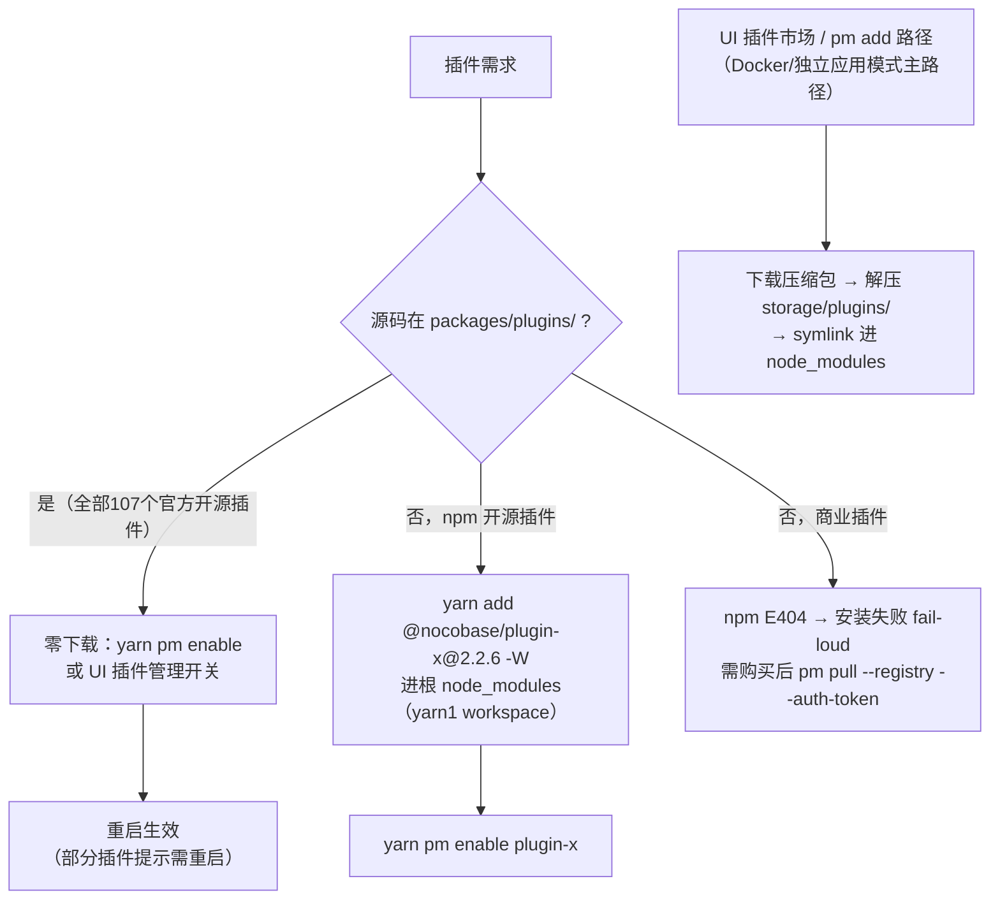

# NocoBase 2.2.6 AI 能力补齐调研：AI 插件体系、npm 兼容矩阵、开源/商业边界、源码快照安装机制

> 研究日期：2026-09-08 | 来源：docs.nocobase.com 官方文档（6+ 页面全文）、npm registry（20+ 包实测）、www.nocobase.com/pricing、本地源码快照与运行实例（PostgreSQL DB + PM CLI）实证 | 深度：Thorough

---

## 1. 执行摘要

我们自托管的 NocoBase 2.2.6 源码快照实例**已经内置并启用了完整的 AI 雇员（AI Employee）能力**，不需要安装任何 AI 插件。AI 雇员是内置插件 `@nocobase/plugin-ai`（文档名"AI employees"），从 2.0.0 起进入官方 preset 的 `builtIn` 列表，在 2.2.6 中随 `@nocobase/preset-nocobase` 的 76 个内置插件自动启用（本地 PostgreSQL `applicationPlugins` 表实证：`@nocobase/plugin-ai` enabled=true，且 `aiEmployees` 表已有 8 名内置员工入库）。补齐官方 demo 的 AI 能力只需要一步：**在"系统设置 → AI 员工 → LLM 服务"里配置一个 LLM provider**。文档明确支持自定义 Base URL + API Key，MiniMax 这类 OpenAI 兼容 API 可直接用 `openai` provider 接入（源码层证实 `openai/completions.ts` 通过 `baseURL` 字段透传）。

npm 兼容性方面，NocoBase 采用 lerna 统一版本发布策略：实测 10 个候选插件（plugin-ai、calendar、kanban、gantt、data-visualization、comments、notifications、workflow、file-manager、mcp-server、ai-gigachat）**全部存在精确的 2.2.6 版本**，dist-tags `latest=2.2.8`（2.2.x 当前最新）。注意 2.x 的包名与 1.x 有差异：`plugin-files`→`plugin-file-manager`、`plugin-block-print`→`plugin-action-print`、`plugin-announcement`/`plugin-user-center`/`plugin-notification-mailer` 在 2.x 已不存在，`plugin-audit-logs` 的 npm 最新版停留在 1.9.49（2.x 中审计日志转为 Enterprise 商业插件）。

商业边界结论：官方插件目录（docs.nocobase.com/plugins，145 个插件）中与 demo AI 场景相关的**绝大部分是 Community 开源**（AI employees、AI LLM: GigaChat、AI: MCP server、Data visualization、Calendar、Kanban、Gantt、Comments、Workflow 全部基础节点含 LLM 节点）；**商业插件**主要是 AI: Knowledge base（RAG，Professional 起）、Workflow: Approval/Subflow/Webhook（Professional）、Audit logs（Enterprise）、Custom brand（Standard）等。商业插件在 npm 上不存在（E404），自托管开源版执行 `pm add` 会直接安装失败（fail-loud），获取渠道是购买后通过带 `--registry --auth-token` 的私有源 `pm pull`。源码快照（yarn1 workspace）模式下装插件的机制与 Docker/独立应用模式不同：仓库内插件零下载、`pm enable` 即用；外部插件可 `yarn add -W` 进根 node_modules 或走 UI 的 `storage/plugins` 路径。

---

## 2. 关键发现

### 2.1 AI 插件体系：包名与定位

docs.nocobase.com 的"AI"文档实际分三个区（[导航证据](https://docs.nocobase.com/cn/ai/quick-start)）：

- `/cn/ai/` — **AI Agent 接入指南**：外部 AI Agent（Claude Code/Codex/Cursor）通过 NocoBase CLI（`@nocobase/cli@alpha`，`nb init`）+ NocoBase Skills 知识包操作 NocoBase，最低版本要求 2.1.0。**这不是插件，是外部工具链**。
- `/cn/ai-employees/` — **AI 员工**：内置插件 `@nocobase/plugin-ai`，"开箱即用，无需单独安装"（[概述](https://docs.nocobase.com/cn/ai-employees/)原文："AI 员工是 NocoBase 内置插件（@nocobase/plugin-ai），开箱即用，无需单独安装"）。
- `/cn/ai-builder/` — **AI 搭建 / AI Portal**：AI Agent 写前端代码（产物进 Git），同为 CLI+Skills 模式，非插件。

AI 相关 npm 包全表（实测）：

| npm 包 | 文档名 | 用途 | 2.2.6 版本 | 开源状态 |
|---|---|---|---|---|
| `@nocobase/plugin-ai` | AI employees | AI 雇员全家桶：LLM provider 管理、内置/自定义员工、技能（Tool/Skill）、MCP 客户端、快捷任务、工作流 LLM/员工/审批节点、文件管理 | 2.2.6 ✓（内置启用） | 开源（GitHub + npm） |
| `@nocobase/plugin-ai-gigachat` | AI LLM: GigaChat | GigaChat LLM provider 扩展 | 2.2.6 ✓（preset 依赖、默认未启用） | 开源 |
| `@nocobase/plugin-mcp-server` | AI: MCP server | 把 NocoBase 自身暴露为 MCP 服务端供外部 Agent 调用 | 2.2.6 ✓（内置，2.1.0 起） | 开源 |
| （无 npm 包） | AI: Knowledge base | RAG 知识库（向量库/文档分段/检索） | 无 | **商业（Professional 起）**，npm E404、源码仓库无此目录 |
| `@nocobase/plugin-workflow` + plugin-ai 内节点 | Workflow: LLM node 等 | 工作流 LLM 节点在 plugin-ai 内实现（源码 `src/server/workflow/`） | 2.2.6 ✓ | 开源 |

不存在 `plugin-ai-employee`、`plugin-ai-agent`、`plugin-knowledge-base`、`plugin-workflow-ai` 包（全部 npm E404 实测）。

### 2.2 AI 雇员：创建方式与对话入口

**内置员工**（本地 DB 实证 8 名，源码 `plugin-ai/src/ai/ai-employees/`）：Atlas（Team leader，默认主员工，负责协调调度其他员工）、Viz（洞察分析师）、Dex（数据整理）、Ellis（邮件）、Lexi（翻译）、Vera（研究分析）、Nathan（前端代码）、Dara（数据可视化）；docs 还提到 Orin（数据建模页面专属）与 Lina（本地化）。内置员工默认全部启用，可在"系统设置 → AI 员工"列表页调 Enabled 开关（[快速开始](https://docs.nocobase.com/cn/ai-employees/quick-start)）。

**新建员工**（[新建 AI 员工](https://docs.nocobase.com/cn/ai-employees/features/new-ai-employees)）：AI employees 管理页 → New AI employee → 三个标签页：
- Profile：Username（唯一标识）、Nickname、Position（岗位）、Avatar（头像）、Bio、About me、Greeting message
- Role setting：System Prompt（身份/目标/边界/输出风格），支持插入变量（当前用户、角色、语言、时间）
- Skills：技能权限（Ask = 调用前人工确认；Allow = 直接执行）；启用知识库后另有知识库标签页

**对话入口**（[与 AI 员工协作](https://docs.nocobase.com/cn/ai-employees/features/collaborate)）三个：
1. 右下角主入口（业务页面右下角唤起对话面板，通用问答/跨区块协作）
2. 区块 Action 入口（区块 Actions → AI employees，针对当前区块执行任务如填表）
3. 特定入口（Nathan→JS Block、Dara→图表区块、Orin→数据建模、Lina→本地化管理）

会话内可切换员工（发送框员工下拉）与模型（Model Switcher，按员工维度记忆偏好）；支持附件、区块上下文（Pick block）、联网搜索、快捷任务。

### 2.3 LLM Provider 配置（MiniMax 接入路径）

配置入口（[配置 LLM 服务](https://docs.nocobase.com/cn/ai-employees/features/llm-service)）：**系统设置 → AI 员工 → LLM service** → Add New：选 Provider、填 Title / **API Key** / **Base URL（可选）** → 配置 Enabled Models（Select models 从服务商接口拉取；**Manual input 手动填模型 ID 与显示名**）→ Submit，底部 **Test flight** 可做可用性测试。

内置 Provider（文档口径：OpenAI、Gemini、Claude、DeepSeek、Qwen、Kimi、Ollama；源码注册表更全，`plugin.ts` 实测注册）：`openai`（Responses API）、`openai-completions`（Chat Completions API）、`anthropic`、`deepseek`、`google-genai`、`dashscope`（通义）、`kimi`、`mimo`、`mistral`、`ollama`、`xai`、`orcarouter`、`shengsuanyun`。

**MiniMax（OpenAI 兼容）接入方案**：选 `openai`（或 `openai-completions`）provider，Base URL 填 `https://api.minimax.chat/v1`（或自建 endpoint），API Key 用 `MINIMAX_API_KEY` 的值，模型用 Manual input 填 MiniMax 模型 ID。源码证据：`llm-providers/openai/completions.ts` 与 `responses.ts` 均以 `baseURL: this.getResolvedBaseURL()` 构造请求——自定义 baseURL 是一等公民。

### 2.4 版本要求与依赖链

- `@nocobase/plugin-ai` npm 最早发布 1.6.0-beta.17（2025-03-07）；**2.0.0 起进入 preset builtIn**（npm 实测 `@nocobase/preset-nocobase@2.0.0` 的 builtIn 含 plugin-ai；2.1.0 起追加 mcp-server 与 workflow-mailer；2.2.x builtIn 共 76 个）。**2.2.6 完全够用**。
- peerDependencies（2.2.6 实测）：`@nocobase/plugin-acl`、`@nocobase/plugin-workflow`、`@nocobase/plugin-file-manager`、`@nocobase/plugin-data-source-manager`、`@nocobase/flow-engine`、`@nocobase/ai` 等——全部是 2.2.6 内置插件，无额外前置安装。
- 开源状态：GitHub `nocobase/nocobase` 仓库 `packages/plugins/@nocobase/plugin-ai/` 含全部源码（本快照即该仓库 v2.2.6 zip，107 个插件 package.json license 均为 Apache-2.0；文件头为 AGPL-3.0/NocoBase Commercial License 双许可声明，根目录同时有 `LICENSE.txt`（NocoBase License Agreement，定义 Community/Commercial Edition）与 `LICENSE-APACHE.txt`）。

### 2.5 源码快照模式实证：本机已是"满配"

- `node_modules/@nocobase/plugin-ai -> ../../packages/plugins/@nocobase/plugin-ai`（yarn1 workspace symlink 实测）——插件源码在 `packages/plugins/` 内，不是下载的 tarball。
- PostgreSQL `applicationPlugins` 表：76 个内置插件 enabled=true，含 plugin-ai / plugin-mcp-server / plugin-license / plugin-flow-engine / 全部 workflow-*；`aiEmployees` 表 8 名员工就位；`aiConversations`/`aiMcpClients`/`aiSkills` 等 AI 表已建。
- `nocobase pm list` 实测：还有一批**源码在仓库、默认未启用**的本地插件可一键启用——`plugin-ai-gigachat`、`plugin-data-visualization-echarts`、`plugin-departments`、`plugin-map`、`plugin-public-forms`、`plugin-notification-email`、`plugin-collection-fdw`、`plugin-graph-collection-manager` 等。
- 官方 demo（v13.demo.nocobase.com，本会话实测 `/api/app:getInfo`）运行 **2.4.0-alpha.4** 开发版（比 2.2.6 新两个 minor），且按 pricing FAQ 是"包含全部商业插件"的沙盒——demo 里的部分新特性与 alpha 功能未必都在 2.2.6 中。

---

## 3. 插件 × 2.2.6 兼容矩阵

判断标准：npm 存在且能取到 2.2.x 系列（实测精确 2.2.6）。NocoBase 用 lerna 统一版本号，主程序 2.2.6 ↔ 插件 2.2.6 严格对齐（peer `2.x` 为宽约束，装 @2.2.6 最稳）。

| 包名 | 存在 | 匹配 2.2.6 | dist-tags latest | 开源/商业 | 备注 |
|---|---|---|---|---|---|
| `@nocobase/plugin-ai` | ✓ | 2.2.6 ✓ | 2.2.8 | Community | 内置已启用 |
| `@nocobase/plugin-ai-gigachat` | ✓ | 2.2.6 ✓ | 2.2.8 | Community | 本地未启用，pm enable 即用 |
| `@nocobase/plugin-mcp-server` | ✓ | 2.2.6 ✓ | 2.2.8 | Community | 内置已启用 |
| `@nocobase/plugin-calendar` | ✓ | 2.2.6 ✓ | 2.2.8 | Community | 内置已启用 |
| `@nocobase/plugin-kanban` | ✓ | 2.2.6 ✓ | 2.2.8 | Community | 内置已启用 |
| `@nocobase/plugin-gantt` | ✓ | 2.2.6 ✓ | 2.2.8 | Community | 内置已启用 |
| `@nocobase/plugin-data-visualization` | ✓ | 2.2.6 ✓ | 2.2.8 | Community（demo 同款图表） | 内置已启用 |
| `@nocobase/plugin-data-visualization-echarts` | ✓ | 2.2.6 ✓ | 2.2.8 | Community | 本地未启用，pm enable 即用 |
| `@nocobase/plugin-files` | ✗ E404 | — | — | — | 2.x 更名 `plugin-file-manager`（内置） |
| `@nocobase/plugin-file-manager` | ✓ | 2.2.6 ✓ | 2.2.8 | Community | 内置已启用 |
| `@nocobase/plugin-announcement` | ✗ E404 | — | — | — | 2.x 无此包/无对应商业插件条目 |
| `@nocobase/plugin-comments` | ✓ | 2.2.6 ✓ | 2.2.8 | Community | 本地未启用（另有 block-comment 内置） |
| `@nocobase/plugin-audit-logs` | △ | ✗ 无 2.x | latest=1.9.49 | **Enterprise 商业** | 2.x npm 无正式版；demo 的 Audit logs 是商业插件 |
| `@nocobase/plugin-notifications` | ✓ | 2.2.6 ✓ | 2.2.8 | Community | 内置已启用（含 notification-manager/in-app-message） |
| `@nocobase/plugin-notification-mailer` | ✗ E404 | — | — | — | 2.x 用 `plugin-notification-email`（本地插件）+ workflow-mailer |
| `@nocobase/plugin-workflow` | ✓ | 2.2.6 ✓ | 2.2.8 | Community | 内置已启用 |
| `@nocobase/plugin-workflow-aggregate` 等 21 个 workflow-* | ✓ | 2.2.6 ✓ | 2.2.8 | Community | 全部内置（Approval/Subflow/Webhook 例外，见商业清单） |
| `@nocobase/plugin-user-center` | ✗ E404 | — | — | — | 2.x 用户功能在 `plugin-users`（内置） |
| `@nocobase/plugin-block-print` | ✗ E404 | — | — | — | 2.x 为 `plugin-action-print`（内置）；"Template print"为 Professional 商业 |
| `@nocobase/plugin-ai-employee` / `-ai-agent` / `-knowledge-base` / `-workflow-ai` | ✗ E404 | — | — | — | 均不存在；员工=plugin-ai，RAG=商业插件 |
| `@nocobase/plugin-charts` | ✓（源码+npm） | 2.2.6 ✓ | 2.2.8 | Community | 未在 builtIn，本地插件 |
| `@nocobase/plugin-license` | ✓ | 2.2.6 ✓ | 2.2.8 | Community | 内置；商业 license key 校验入口 |

官方 demo 插件可装性：demo = 全部 145 个官方插件（110 Community + 35 商业）。**Community 部分 npm 全部公开可装且 2.2.6 对齐；商业部分 npm 一律 E404，自托管开源版无法获得**。

---

## 4. 开源 vs 商业边界清单

### 4.1 版本能力矩阵（[pricing](https://www.nocobase.com/pricing)，顺序 Community/Standard/Professional/Enterprise，实测图标状态）

**Community 版包含（即我们的 2.2.6 源码快照全部可用）**：
- AI 雇员全家的核心：内置 AI 员工、自由扩展 AI 员工、AI 员工开发体系、AI 员工处理业务任务、连接常用 LLM、MCP、CLI、Skills、AI 员工权限（注意 pricing 原文"Most AI employee capabilities included"）
- 核心：数据模型驱动、AI 驱动开发、WYSIWYG、认证、角色权限、工作流、事件流、通知、本地化
- 工作流：全部触发器（集合事件/定时/动作前后/自定义）与节点（**LLM 节点**、Manual、CC、HTTP、JavaScript、Send Email、Notification、Loop、Parallel、SQL、Aggregate、Delay、JSON 系列等 25+ 节点）
- 数据源：主库 MySQL/PostgreSQL/MariaDB；Excel 导入导出（小量）；备份管理；插件架构
- 安全：Variables and secrets、Token policy

**商业（Community 没有）**：

| 功能 | 最低版本 | 自托管替代建议 |
|---|---|---|
| AI: Knowledge base（RAG 知识库/向量库） | Professional | 无官方开源替代；可走 MCP 接入自建 RAG 工具，或用 DSH KB 能力经 MCP 暴露给 AI 员工 |
| Workflow: Approval / Subflow / Webhook | Professional | Approval 可用 Manual 节点 + 自定义 JS/HTTP 节点模拟；Webhook 用 HTTP Request 触发器替代（Pre/Post-action trigger + 自建接收端） |
| 版本控制（AI 搭建版本历史回滚）、迁移/发布管理 | Professional | 用 NocoBase CLI 的备份/恢复 + git 管理；无完全等价物 |
| SSO（OIDC/SAML/CAS/LDAP）、字段脱敏/加密、密码策略、锁定、Record history、私有文件访问、手写签名 | Professional | 部分可用开源组件自建（如 IdP: OAuth 是 Community 的）；字段加密需自研字段插件 |
| 审计日志（Audit logs）、IP 限制、2FA、API 载荷加密、遥测、集群 | Enterprise | 审计可基于 Logger/异步任务自行落库；2FA 无开源替代 |
| 外部数据源（MySQL/PG/MariaDB/MSSQL/REST API） | Standard | FDW 插件（Community，本地未启用）可在 PostgreSQL 内连远程 MySQL/PG 表 |
| Oracle / ClickHouse / Doris / OceanBase 数据源 | Enterprise | 无 |
| 自有品牌（去 Logo） | Standard | 无（AGPL/协议要求保留版权信息） |
| 大批量 Excel 导入导出、Export/Import Pro | Standard | 小量导入导出 Community 可用 |
| 邮件集成（Gmail/Outlook 服务级） | Enterprise | notification-email（SMTP，Community）可覆盖多数场景 |
| 多应用/多空间/集群 | Enterprise | 无（multi-app-manager 已 deprecated） |

### 4.2 商业插件在自托管开源版的行为与获取渠道

- **安装即失败（fail-loud）**：商业插件不在 npm 公共 registry（实测 AI knowledge base、workflow-approval、SSO 系列全部 E404）。`yarn add @nocobase/plugin-xxx` 或 UI 插件市场/`pm add` 拉取时直接 404 报错，不存在静默降级。
- 官方获取渠道（`pm pull --help` 实测）：`nocobase pm pull <pkg> --registry <私有源> --auth-token <令牌> --version <版本>`——购买后 NocoBase 提供专属 registry 与 token（与 LICENSE.txt"downloaded through exclusive channels"一致）。
- `@nocobase/plugin-license`（License settings，Community 内置）负责商业 license key 的录入与校验（源码：`license-key` action 校验 envMatch/domainMatch/licenseStatus=active 后保存）；另有 npm 上的 `@nocobase/license-kit`（0.3.8）为商业插件运行时校验组件。
- Marketplace 定价标注方式：官方插件目录即 [docs.nocobase.com/plugins](https://docs.nocobase.com/plugins)（145 个插件），每个插件卡标注 **"Community Edition+ / Standard Edition+ / Professional Edition+ / Enterprise Edition+"**，即"从该版本起可用"；无单价——商业插件随整版 license 打包（Standard $800 / Professional $8,000 / Enterprise 议价，均为一次性买断 + 1 年升级）。

### 4.3 官方 demo 功能 → 我们实例的映射结论

demo（2.4.0-alpha.4 全商业沙盒）中的：CRM/订单/看板/日历/甘特/图表/工作流/评论/通知/附件/公共表单/部门 → **全部 Community，2.2.6 已内置或 pm enable 即得**；AI 雇员对话（右下角）→ **内置，配 LLM 即用**；RAG 知识库文章、审批流、SSO 登录、审计日志页 → 商业，装不上，按上表替代。另外 demo 为 alpha 版，界面细节可能与 2.2.6 有差异（如 AI Portal `/x/<name>` 路由属于 2.3/2.4 特性）。

---

## 5. 源码快照模式的插件安装机制（结论）

我们的形态：`platform/nocobase` = GitHub v2.2.6 源码 zip + yarn1 workspaces（lerna），与"create-nocobase-app 安装模式"的核心差别：

- **官方插件不需要"安装"**：仓库内 `packages/plugins/@nocobase/*` 全部 107 个开源插件源码已在（node_modules symlink 实证），内置 76 个自动启用，其余（comments/charts/echarts/gigachat/departments/map/public-forms/notification-email 等）只差 `pm enable`。
- **PM CLI 全集**（`nocobase pm --help` 实测）：`list / create / pull / add / update / enable / enable-all / disable / remove`；`yarn pm` 即 `nocobase-v1 pm`（package.json scripts 实证）。新版 CLI 还有 `nb plugin list/enable/disable`（[插件管理 Skill](https://docs.nocobase.com/cn/ai-builder/plugin-manage)）。
- **新增外部开源插件**两条路：① `yarn add @nocobase/plugin-x@2.2.6 -W`（源码模式正路，进根 node_modules，受 yarn.lock 管理）；② UI/`pm add`（走 `addByNpm → storage/plugins + node_modules symlink`，源码 `plugin-manager.ts` 实测；源码模式下会绕过 yarn.lock，混用时注意一致性）。
- **与 create-nocobase-app 差别**（[安装方式对比](https://docs.nocobase.com/cn/ai/quickstart)）：后者业务代码独立、插件统一走 UI/pm add 的 storage/plugins 路径、升级用 yarn 更新依赖；源码模式可直接改任何插件源码（对 AI 雇员深度定制关键）、升级走 git/快照替换。
- **重启方式**：源码模式 `yarn dev`（开发）/`yarn start`；`pm2` 脚本存在（`yarn pm2`）。

---

## 6. 反方观点与风险

- **版本落后风险**：官方 demo 跑 2.4.0-alpha.4、npm latest 已到 2.2.8（且 beta 2.3.0-beta.8 / alpha 2.4.0-alpha.4 通道开放）。2.2.6 的 AI 员工功能可用（本机实证），但 docs 部分文档（AI Portal、部分场景页）对应 2.3+ 行为；若发现文档与实例 UI 不符，优先怀疑版本差而非配置错。
- **RAG 知识库是商业功能**：docs 的 `/cn/ai-employees/knowledge-base/` 完整文档会误导读者以为开源可用，但 pricing 矩阵与 npm/源码仓库双重证实它是 Professional 商业插件。开源替代要靠 MCP 挂自建检索服务，效果与集成度有差距。
- **AGPL 双许可的合规含义**：源码文件头"dual-licensed under AGPL-3.0 and NocoBase Commercial License"与 package.json 的 Apache-2.0 并存；对内用无碍，但若未来对外提供服务或分发给客户，需阅读根 `LICENSE.txt`（NocoBase License Agreement）确认义务（保留版权标识等）。
- **AI 员工质量依赖模型**：docs 明示"实际效果与所用模型密切相关，建议优先选择最新的旗舰模型"；MiniMax 接入后建议对 Atlas/Viz 等做实测验收，不能假设 demo 效果可复现。
- **demo 插件清单无法逐项核对**：demo 站点不暴露插件列表 API（实测 `/api/appPM:list` 404），"demo 含全部商业插件"来自 pricing FAQ 陈述，未能逐插件验证 demo 与 145 官方目录的一一对应。

---

## 7. 待解问题

1. **MiniMax 实测**：`openai-completions` provider + `https://api.minimax.chat/v1` + Manual input 模型的连通性（Test flight）尚未实际执行——这是下一步配置动作，10 分钟内可验证。
2. **AI Portal（/x/ 路由）在 2.2.6 的可用度**：文档要求 `@nocobase/cli@alpha` + 较新版本，2.2.6 是否完整支持需实测 `nb init` 流程。
3. **MCP server 对外暴露**：`plugin-mcp-server` 已启用，但把 NocoBase 数据暴露给外部 Agent（含 DSH）的鉴权粒度与工具清单需单独梳理。
4. **知识库替代方案深度评估**：自建 RAG（DSH KB + MCP）与商业 AI: Knowledge base 的功能差距清单（分段管理、命中测试、向量库选型）值得单独调研。

---

## 8. 来源

| # | 来源 | 类型 | 日期 | 关键贡献 |
|---|---|---|---|---|
| 1 | [docs.nocobase.com/cn/ai-employees/](https://docs.nocobase.com/cn/ai-employees/) | 官方文档（一手） | 2026-09-08 访问 | AI 员工=plugin-ai 内置；功能地图 |
| 2 | [AI 员工快速开始](https://docs.nocobase.com/cn/ai-employees/quick-start) | 官方文档 | 同上 | 配置入口、内置员工默认启用、右下角入口 |
| 3 | [配置 LLM 服务](https://docs.nocobase.com/cn/ai-employees/features/llm-service) | 官方文档 | 同上 | Provider 列表、Base URL 可选、Manual input、Test flight |
| 4 | [新建 AI 员工](https://docs.nocobase.com/cn/ai-employees/features/new-ai-employees) | 官方文档 | 同上 | Profile/Role setting/Skills 三段式创建 |
| 5 | [与 AI 员工协作](https://docs.nocobase.com/cn/ai-employees/features/collaborate) | 官方文档 | 同上 | 三类对话入口、员工/模型切换 |
| 6 | [MCP 接入](https://docs.nocobase.com/cn/ai-employees/features/mcp) | 官方文档 | 同上 | MCP 客户端配置（stdio/HTTP）与 Ask/Allow |
| 7 | [AI 知识库概述](https://docs.nocobase.com/cn/ai-employees/knowledge-base/) | 官方文档 | 同上 | 知识库是独立插件（商业） |
| 8 | [AI Agent 接入指南](https://docs.nocobase.com/cn/ai/quick-start) | 官方文档 | 同上 | CLI+Skills 模式、最低 2.1.0 |
| 9 | [AI 搭建 / AI Portal](https://docs.nocobase.com/cn/ai-builder/) | 官方文档 | 同上 | /v/ 与 /x/ 双入口、Skills 清单 |
| 10 | [安装方式与版本对比](https://docs.nocobase.com/cn/ai/quickstart) | 官方文档 | 同上 | Docker/app/源码三模式对比 |
| 11 | [插件管理 Skill](https://docs.nocobase.com/cn/ai-builder/plugin-manage) | 官方文档 | 同上 | nb plugin list/enable/disable |
| 12 | [www.nocobase.com/pricing](https://www.nocobase.com/pricing) | 官方定价页 | 同上 | 四版对比矩阵（图标状态实测） |
| 13 | [docs.nocobase.com/plugins](https://docs.nocobase.com/plugins) | 官方插件目录 | 同上 | 145 插件×版本标注全量清单 |
| 14 | npm registry（`npm view` 经代理实测） | 一手数据 | 2026-09-08 | 20+ 包 dist-tags/versions/@2.2.6 精确版本/E404；preset 各版本 builtIn |
| 15 | 本地 `platform/nocobase`（GitHub v2.2.6 快照） | 一手源码 | 快照 2026-09-06 | MANIFEST、107 插件目录、plugin-ai 源码（providers/员工/workflow）、preset builtIn 76、LICENSE 双许可、plugin-manager 安装路径 |
| 16 | 本地运行实例（PostgreSQL + `nocobase pm list`） | 一手实测 | 2026-09-08 | 76 插件启用、8 名 AI 员工入库、可启用本地插件清单 |
| 17 | v13.demo.nocobase.com（会话实测 `/api/app:getInfo`） | 一手实测 | 2026-09-08 | demo 版本=2.4.0-alpha.4 |

---

## 9. 方法论

- **双层调研**：Layer 1 用 chrome-devtools 直接遍历 docs.nocobase.com 的 `/cn/ai/`、`/cn/ai-employees/`（60+ 页面侧边栏全量枚举后精选 6 个核心页）、`/cn/ai-builder/`、pricing、plugins 目录；Layer 2 对每页 evaluate_script 全文抽取（标题/段落/列表/表格/图标状态）。
- **npm 实证**：命令行经代理（socks5://127.0.0.1:1087）执行 `npm view <pkg> dist-tags/versions/time/peerDependencies`，对 20+ 候选包逐一验证存在性、2.2.6 精确版本、preset 各版本 builtIn 字段（1.9.0/2.0.0/2.1.0/2.2.0/2.2.6）。
- **本地交叉验证**：源码快照目录枚举 + package.json 解析 + node_modules symlink 检查 + PostgreSQL 直查 applicationPlugins/aiEmployees 表 + `nocobase pm list/--help` 实跑，将文档声明落到运行时证据。
- **局限**：demo 站点不开放插件列表 API，官方 demo 插件清单以 pricing FAQ + 插件目录推断；商业插件内部行为（license 校验失败的具体 UI 表现）未实测（无 license）；2.3/2.4 alpha 行为未验证。
