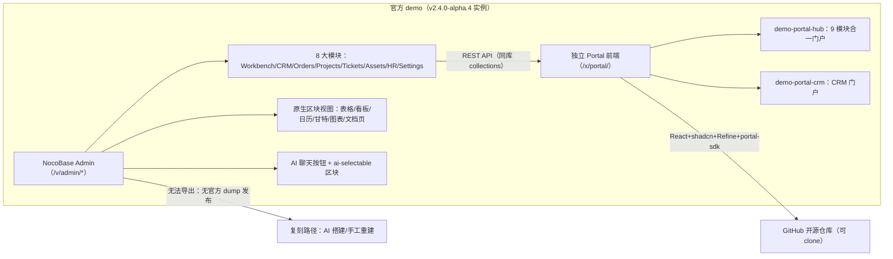

# NocoBase 官方 Demo 实探与复刻路径调研报告

> 研究日期：2026-09-09 | 来源：23 个来源（demo 实探 17 页 + GitHub 仓库 6 + 官方文档 5 + 本地 2.2.6 源码比对） | 深度：Thorough

---

## 1. 执行摘要

本次调研通过浏览器实探官方 demo 实例（`https://aea9i55plq46.v13.demo.nocobase.com`）、阅读 nocobase 组织的 demo-portal-* 仓库、以及交叉验证 docs.nocobase.com 官方文档与本地 2.2.6 源码快照，得出三条核心结论：

**第一，官方 demo 是"一个 NocoBase 应用内的 8 大业务模块"，不是一个 CRM 模板。** demo 实例运行 **NocoBase v2.4.0-alpha.4**（`/api/app:getInfo` 返回 `version: 2.4.0-alpha.4.20260908132337`，[证据](https://aea9i55plq46.v13.demo.nocobase.com/api/app:getInfo)），在一个应用里组织了 Workbench 工作台、Customers CRM、Orders 销售流程、Projects 项目管理、Tickets 工单、Assets 资产、Employees HR、Settings 主数据 8 个模块。用户抱怨的"看板/日历/甘特/图表"在 demo 中全部是 NocoBase 原生区块视图（Tasks 页有 Kanban/Calendar/Table/Gantt 四视图切换 tab）。

**第二，GitHub 上的 demo-portal-crm / demo-portal-hub 是"独立 React 前端门户"，不是 NocoBase dump，无法用 nocobase restore 导入。** 它们基于官方 Portal Template（React 19 + shadcn/ui + Refine + @nocobase/portal-sdk 2.1.0），通过 REST API 连接 NocoBase 后端，由 `nb portal` CLI 创建/部署（[仓库](https://github.com/nocobase/demo-portal-crm)、[nb portal 文档](https://docs.nocobase.com/cn/api/cli/portal/)）。Portal 的服务端记录机制（X-Portal 头、Portal 记录）在 demo 所用的 2.4-alpha 上运行；本地 2.2.6 源码与 npm 均未发现 portal 插件，Portal 全链路在 2.2.6 上可用性未验证。

**第三，本地 2.2.6 源码已内置 demo 所需的几乎全部插件**（plugin-ai、calendar、kanban、gantt、data-visualization、map、comments、audit-logs、file-manager、workflow 全家桶等均在 `platform/nocobase/packages/plugins/@nocobase/` 下且版本 2.2.6，preset 自动启用内置插件）。功能缺口不是"缺插件"，而是**未启用/未配置/未搭建页面**，以及 demo 数据模型（collections + 菜单 + 视图 schema）需要重建。官方未发布 demo 的 dump/备份文件，复刻 admin 界面的现实路径是"按本报告的页面清单用原生 UI 或 AI 搭建重建"。

## 2. 关键发现

1. **demo 版本 = 2.4.0-alpha.4**：`/api/app:getInfo` 匿名返回 `{"version":"2.4.0-alpha.4.20260908132337","database":{"dialect":"postgres"}}`，比本地 2.2.6 高两个 minor 版本线；`v13.demo.nocobase.com` 的 "v13" 是 demo 平台环境代次而非产品版本（[证据](https://aea9i55plq46.v13.demo.nocobase.com/api/app:getInfo)；主仓库最新 release 为 [v2.2.8](https://github.com/nocobase/nocobase/releases/tag/v2.2.8)，同日另有 v2.3.0-beta.8 / v2.4.0-alpha.4）。
2. **URL 路由规律**：页面 `/v/admin/<pageId>`，页内 tab `/v/admin/<pageId>/tab/<tabId>`（例：Tasks 页甘特 tab = `/v/admin/2scwblz3zao/tab/ganttabroot`）；每个业务模块是一个独立菜单组；顶栏 "No spaces" 为空间切换器（多空间特性，当前实例无空间）。`/v/hub` 在该实例 404。
3. **Tasks 页四视图**：Kanban（默认，7 阶段列）/ Calendar（月历）/ Table / Gantt（含"隐藏已完成"过滤器），证明 kanban、calendar、gantt、table 区块插件齐备（[实测页](https://aea9i55plq46.v13.demo.nocobase.com/v/admin/2scwblz3zao)）。
4. **demo 含 AI 能力**：顶栏出现 `ai-chat-button-badge`（AI 聊天按钮）与全区块 `ai-selectable` class；官方文档确认 AI 员工是内置插件 `@nocobase/plugin-ai`，社区版+，预置 9 名 AI 员工（Atlas/Viz/Dex/Ellis/Lexi/Vera/Nathan/Lina/Dara）（[AI 员工概述](https://docs.nocobase.com/cn/ai-employees/)、[内置 AI 员工](https://docs.nocobase.com/cn/ai-employees/built-in/)）。
5. **demo-portal-hub = "9 modules unified"**：src/pages 含 sales/finance/helpdesk/hr/assets/inventory/knowledge/procurement/projects 九个模块页 + login/register/forgot-password + nocobase-ai 聊天扩展（[仓库](https://github.com/nocobase/demo-portal-hub)）。
6. **备份还原的版本约束**：还原时"当前 NocoBase 版本低于备份文件中的版本"则拒绝；dialect/underscored/表前缀/schema 必须一致；`.nbdata` 为全量覆盖（[备份管理](https://docs.nocobase.com/cn/ops-management/backup-manager)、[nb backup](https://docs.nocobase.com/cn/nocobase-cli/operations/backup-restore)）。因此即便拿到 demo 的备份也无法还原进 2.2.6。
7. **2.2.6 本地源码插件全集**：`platform/nocobase/packages/plugins/@nocobase/` 下 118 个插件包（含 plugin-ai 2.2.6），preset 通过 `findBuiltInPlugins()` 自动启用全部内置插件（[preset 源码](platform/nocobase/packages/presets/nocobase/src/server/index.ts:18)）。
8. **nb CLI 是官方新工具链**：`@nocobase/cli` 2.2.8（npm），`nb init/env/app/backup/portal` 命令族；Portal 部署路径 `<appPublicPath>/x/<portal>/`（[CLI 概述](https://docs.nocobase.com/cn/nocobase-cli/)、[nb portal](https://docs.nocobase.com/cn/api/cli/portal/)）。

## 3. 详细分析

### 3.1 官方 Demo 功能全景（按模块逐页实测）

实测时间 2026-09-09，demo 域名 `aea9i55plq46.v13.demo.nocobase.com`（以下 URL 为相对路径）。demo 语言为英文界面，数据分布不均：销售/工单模块有真实数据（报价单 94 行、订单 60 行、工单 119 行），项目/资产/HR 模块数据为 0。

#### 模块 A：Workbench 工作台（跨模块仪表盘）

| 页面 | URL | 视图类型 | 内容 |
|---|---|---|---|
| Dashboard | `/v/admin/f488plhe3ls` | 统计卡×7 + 趋势图×3 + 分布图×3 + 列表×2 | Open tasks/Due today/Overdue tickets/Follow-up customers/Order $ this month/Leave days this month；New customers/Quotation/Order amount trend；Project/Ticket/Asset status distribution；My tasks、Overdue tickets 列表 |

#### 模块 B：Customers（CRM 客户）

| 页面 | URL | 视图类型 | 内容 |
|---|---|---|---|
| Dashboard | `/v/admin/wczzim3sbkl` | 统计卡×7 + 图表×6 + 列表×2 | Customer total/Lead qualified rate/New customers/Lead won rate/Leads total/Active customers/New leads this month；Customer growth trend/Industry distribution/Lead stage funnel/Level distribution/Source distribution/Order amount ranking；Key customers、Leads pipeline |
| Customers | `/v/admin/k3bsm39m9t6` | 表格 + Merge 按钮 | Customer name/no/type/Industry/Country/联系人/Level/Status；支持 2-3 条记录合并（CRM 特有功能） |
| Leads | `/v/admin/jpwlj2n96sa` | **看板**（默认）+ 阶段 tab×8 | 列：New lead→Contacted→Requirements confirmed→Proposal or quotation→Negotiation→Won/Lost；另有各阶段列表 tab + All lead |
| Contacts | `/v/admin/bxltj9hnxt5` | 表格 | Full name/Customer name/Job title/Email/Phone/Is primary/Status/Last updated at |
| Customers Guide | `/v/admin/pp3rmqgr708` | 文档页（tab×4） | Customer merge/Lead flow/Master data 使用指南 |

注意：**demo 没有"合同（Contracts）"实体**；销售链路是 报价单 Quotation → 订单 Order → 回款 Payment → 发票 Invoice（见模块 C），即"商机→报价→订单→回款→发票"五段式，合同环节不存在。

#### 模块 C：Orders（销售流程）

| 页面 | URL | 视图类型 | 内容 |
|---|---|---|---|
| Dashboard | `/v/admin/23ju88gb4f5` | 图表×6 | Quotation/Order/Payment amount trend；Quotation/Order status distribution；Customer order amount ranking |
| New quotation | `/v/admin/2vh3ak5rp0r` | 表单 | 新建报价单入口 |
| Quotations | `/v/admin/flx45f4g0t8` | 表格 + 聚合统计 | Quotation no/date/Valid until/Customer/Total amount/Status/联系人/Owner/Currency；94 行，$286.25M，状态分布 accepted:32/draft:26/sent:14/converted:11/void:5/rejected:5/pending_approval:1 |
| Orders | `/v/admin/y97jlmk6hy8` | 表格 + 聚合统计 | Order no/date/Customer/联系人/Owner/Order status/Total amount/Payment status/Delivery status/Currency；60 行 $134.76M |
| Payments | `/v/admin/5z9xb3xj379` | 表格 | Payment no/Order no/date/amount/method/status/Transaction no |
| Invoices | `/v/admin/efvxsod6c7z` | 表格 + 聚合统计 | Invoice no/Order no/date/amount/status/Remark；57 行 $131.33M |
| Products | `/v/admin/bjdu92zqwy8` | 表格 | Product name/no/Category/Product type/Attachments/Pricing mode/Unit/Base price |
| Orders Guide | `/v/admin/yzsrl5xznby`（用户给的入口 URL） | 文档页（tab×2） | Order flow/Quotation flow 业务指南 |

#### 模块 D：Projects（项目管理）

| 页面 | URL | 视图类型 | 内容 |
|---|---|---|---|
| Dashboard | `/v/admin/ub3pywcnxq2` | 统计卡×9 + 图表×6 + 列表×2 | Project total/In progress/Delayed/Completed this month/Tasks in progress/to do/pending review/Due today；Status/Priority distribution、Task status distribution、Completion trend、Task owner workload |
| **Tasks** | `/v/admin/2scwblz3zao` | **看板/日历/表格/甘特 四视图 tab** | Kanban（默认）、Calendar（月历网格）、Table、Gantt（Hide completed/cancelled 过滤器）；tab 各有独立路由（如 `/tab/ganttabroot`、`/tab/or2fr1m5e6a`） |
| Projects | `/v/admin/pmed00z8b5i` | 表格 | Project name/no/Customer/负责人/Status/Progress/Priority/Planned end date |
| Project milestones | `/v/admin/0diqm4qsw7p` | 列表 | 项目里程碑 |

#### 模块 E：Tickets（工单客服）

| 页面 | URL | 视图类型 | 内容 |
|---|---|---|---|
| Dashboard | `/v/admin/m6m3ltmztk9` | 仪表盘 | 工单统计 |
| Tickets | `/v/admin/zckgq6n27wa` | 表格 + 聚合统计 | Ticket title/Priority/Customer/Category/Assignee/Status/Planned resolve at/Submitted at/First response due at/Is overdue；119 行（Open:97/Overdue:70/Urgent:26），状态含 waiting_customer/waiting_internal 等 8 态 |
| Knowledge articles | `/v/admin/mfdkiphi5vy` | 表格 | Article title/Category/Status/Last updated at（自建 collection，非独立 wiki 插件） |

#### 模块 F：Assets（资产管理）

| 页面 | URL | 视图类型 |
|---|---|---|
| Dashboard | `/v/admin/3lhl4q9pcga` | 统计卡 + 图表×6（状态/类别/品牌分布、采购/维修趋势、员工资产排名、保修监控） |
| Assets | `/v/admin/zxgl4ykr4gj` | 表格 |
| Vendors | `/v/admin/wqp8xq41zl2` | 表格 |
| Asset assignments | `/v/admin/qpijqcfdyu5` | 表格（领用） |
| Asset returns | `/v/admin/r2ewpmmt958` | 表格（退还） |
| Asset maintenances | `/v/admin/e0qx5gjehqw` | 表格（维保） |

#### 模块 G：Employees（HR）

| 页面 | URL | 视图类型 |
|---|---|---|
| Dashboard | `/v/admin/nzkvdk2u1to` | 仪表盘 |
| Employees | `/v/admin/h2zeribyfrx` | 表格 |
| Onboarding | `/v/admin/1akz1k1bqxv` | 列表/流程 |
| Offboarding | `/v/admin/fveou6fn0qc` | 列表/流程 |
| Leave requests | `/v/admin/e2b3ipys6gw` | 表单/审批列表 |
| Positions | `/v/admin/t8i0b170e0a` | 表格 |

#### 模块 H：Settings（主数据）

| 页面 | URL | 视图 |
|---|---|---|
| Customer categories | `/v/admin/kl5ty5jlj4w` | 表格（Category name/Actions/Status/Remark） |
| Ticket categories | `/v/admin/sr55cgwwazz` | 表格 |
| Asset categories | `/v/admin/8o6ik5ncd32` | 表格 |
| Product categories | `/v/admin/jnr9izb6gfw` | 表格 |

#### AI 与门户形态

- **AI 入口**：顶栏有 AI 聊天按钮（class `ai-chat-button-badge`，mail 图标 + badge），所有区块卡片带 `ai-selectable`（可被 AI 选为上下文）。这与 docs 的"添加上下文-区块"功能一致（[AI 员工概述](https://docs.nocobase.com/cn/ai-employees/)）。
- **门户 Hub**：该实例 `/v/hub` 返回 404——demo-portal-hub 对应的**独立 Portal 前端**未部署在此 admin 域名下；按 nb portal 文档，Portal 部署路径应为 `<appPublicPath>/x/<portal>/`（[nb portal](https://docs.nocobase.com/cn/api/cli/portal/)）。demo-portal-hub 是"9 模块合一"的对外门户（sales/finance/helpdesk/hr/assets/inventory/knowledge/procurement/projects），含登录/注册页与 AI 员工聊天（[仓库](https://github.com/nocobase/demo-portal-hub)）。

上图：官方 demo 由"NocoBase admin 应用 + 独立 Portal 前端"两层构成；admin 层没有官方 dump，Portal 层是可 clone 的独立前端仓库。

### 3.2 demo-portal-crm / demo-portal-hub 仓库结构与复用方式

两仓库同构（同一 Portal Template 体系）：

| 维度 | 结论 | 证据 |
|---|---|---|
| 仓库性质 | **独立前端应用**（React + shadcn/ui + Refine + @nocobase/portal-sdk），不是 NocoBase dump/UI schema 集合 | [README](https://github.com/nocobase/demo-portal-crm)："A React and shadcn/ui template for building standalone frontends backed by NocoBase" |
| 目录结构 | src/pages（业务页）、src/extensions（扩展，含 nocobase-ai 聊天）、src/components/ui（shadcn）、registry/（Registry 扩展源）、e2e/（Playwright 连真实 NocoBase）、Dockerfile、portal.config.json | 仓库文件树（GitHub API，695/900 文件） |
| 关键依赖 | react 19、@nocobase/portal-sdk ^2.1.0、@nocobase/ai-employee-avatars ^1.0.2、@refinedev/* 5.x、ai 5.0.0 + @ai-sdk/react 2.0.0（Vercel AI SDK）、echarts 5.5、tiptap 3.29、dingtalk-jsapi 3.1.1 | [package.json](https://github.com/nocobase/demo-portal-crm/blob/main/package.json) |
| 模板版本 | `nocobase.defaultTemplateVersion: "3.1.1"` —— 这是 **@nocobase/portal-template-default 自身版本**（npm 同名包 version 3.1.1），不是 NocoBase 主版本 | [demo-portal-hub package.json](https://github.com/nocobase/demo-portal-hub/blob/main/package.json)、[portal-template-default](https://github.com/nocobase/portal-template-default) |
| 复用方式 | ① `nb portal create <name>`（官方 CLI 基于模板创建，源码可入 Git）② 直接 clone 仓库改 `.env`（NOCOBASE_API_URL/NOCOBASE_PORTAL_BASE）后 `pnpm dev/build`；生产部署只 serve dist 静态文件 | [nb portal 文档](https://docs.nocobase.com/cn/api/cli/portal/)、README、AGENTS.md |
| 后端约定 | 通过 NocoBase REST API（/api/<resource>:<action>）读写；请求带 X-Authenticator/X-Role/**X-Portal** 头；认证复用 NocoBase 认证体系；ACL 以服务端为准 | [e2e/support/api.ts](https://github.com/nocobase/demo-portal-hub/blob/main/e2e/support/api.ts) |
| 数据模型 | **仓库内不含后端 collections/seed**；Portal 假定 NocoBase 侧已存在对应 collections（customers/leads/quotations 等） | 文件树无 dump/seed/collections 文件 |

**复用结论**：demo-portal-* 不能"导入"到 NocoBase 2.2.6——它们是平行前端。可行复用路径有二：
1. **作为独立门户部署**：clone 仓库 → 配 `NOCOBASE_API_URL` 指向本地 2.2.6 → 在 2.2.6 内按 Portal 页面所需手工/AI 建 collections → 前端 `pnpm build` 后由任意静态服务/NocoBase 同源反代承载。风险：portal-sdk 2.1.0 对服务端版本的支持范围未知（README 称"版本超出 SDK 支持范围时构建会报错"），X-Portal 头与 Portal 记录机制在 2.2.6 上未验证（本地 2.2.6 源码 grep 无 portal 插件、npm 无 @nocobase/plugin-portal）。
2. **借鉴其页面设计**，在 2.2.6 原生 admin 里用 UI 配置复刻同款页面（更稳，无版本风险）。

### 3.3 nocobase 组织 demo/template 仓库全集

GitHub API 搜索 `org:nocobase demo|portal|template` 共 10 个相关仓库（均公开、2026-08-14 前后批量更新）：

| 仓库 | 定位 | 描述 |
|---|---|---|
| [nocobase/portal-template-default](https://github.com/nocobase/portal-template-default) | **官方 Portal 模板**（npm @nocobase/portal-template-default@3.1.1） | `nb portal create` 的模板源，含 workspace 版 portal-sdk |
| [nocobase/demo-portal-hub](https://github.com/nocobase/demo-portal-hub) | 企业 hub 门户 demo | "AI-built all-in-one enterprise hub portal — 9 modules unified"（sales/finance/helpdesk/hr/assets/inventory/knowledge/procurement/projects） |
| [nocobase/demo-portal-crm](https://github.com/nocobase/demo-portal-crm) | CRM 门户 demo | "AI-built CRM portal (all-in-one demo)"，src/pages/crm + nocobase-ai 聊天扩展 |
| [nocobase/demo-portal-helpdesk](https://github.com/nocobase/demo-portal-helpdesk) | 工单客服门户 demo | "AI-built helpdesk/tickets portal" |
| [nocobase/demo-portal-it](https://github.com/nocobase/demo-portal-it) | IT 资产门户 demo | "AI-built IT asset & requests portal" |
| [nocobase/demo-portal-scm](https://github.com/nocobase/demo-portal-scm) | 供应链门户 demo | 无描述（scm=supply chain） |
| [nocobase/demo-portal-sc](https://github.com/nocobase/demo-portal-sc) | 未明（可能供应链/门店） | 无描述 |
| [nocobase/demo-portal-tasks](https://github.com/nocobase/demo-portal-tasks) | 任务管理门户 demo | 无描述 |
| [nocobase/demo-portal-car-rental](https://github.com/nocobase/demo-portal-car-rental) | 租车业务门户 demo | 无描述 |
| [nocobase/plugin-organization-demo](https://github.com/nocobase/plugin-organization-demo) | 旧组织插件示例 | 2025-02 归档级更新，与本次 demo 无关 |

### 3.4 版本兼容与导入方式

**备份/还原机制**（[备份管理](https://docs.nocobase.com/cn/ops-management/backup-manager)、[nb backup](https://docs.nocobase.com/cn/nocobase-cli/operations/backup-restore)）：

- 备份管理器插件（社区版+）：全量备份（数据库 + 可选 storage/uploads）、定时备份、云存储同步、加密；产物 `backup_*.nbdata`。
- nb CLI：`nb backup create --output ./backups` → 下载 .nbdata；`nb backup restore --env app1 --file xxx.nbdata --yes --force` 全量覆盖并等待健康检查。
- **还原硬约束**：当前版本 < 备份内版本 → 拒绝；dialect/underscored/table prefix/schema 必须一致；跨大数据库版本需容错模式。**方向只允许"旧实例 ← 新备份不行；新实例 ← 旧备份可以"**。
- 对本项目含义：demo 实例（2.4.0-alpha.4）即便导出备份也无法还原进 2.2.6（版本更低被拒）；且官方根本没有发布 demo 备份文件。

**"UI schema 集合导入"**：demo-portal-* 不是 UI schema 集合，无此导入路径。若未来拿到某个 NocoBase 应用的 dump（.nbdata），2.2.6 接受的同版本/更低版本备份经备份管理器或 nb restore 导入即可（collections schema + ui_schemas + 数据 + 菜单全包含，因为 .nbdata 是数据库全量）。

**结论矩阵**：

| 目标 | 2.2.6 可行性 | 推荐路径 |
|---|---|---|
| 复刻 demo admin 界面（8 模块全部页面） | ✅ 可行（插件全内置） | 按本报告 3.1 页面清单，用原生 UI 配置或 AI 搭建（"一句话创建数据模型/用业务语言搭建页面"，[AI 搭建](https://docs.nocobase.com/cn/ai-builder)）逐模块重建；无需升级 |
| 直接导入 demo 备份 | ❌ 不可行 | 无官方 dump；且版本约束禁止高→低 |
| 部署 demo-portal-crm/hub 门户 | ⚠️ 未验证 | clone + 指向本地 API + 建同名 collections；portal-sdk/X-Portal 在 2.2.6 兼容性未知，建议先 PoC 登录链路；或升级到 2.3-beta/2.4-alpha 后用 `nb portal create` 走官方路径 |
| 获得预置 9 名 AI 员工 | ⚠️ 部分 | 2.2.6 源码含 plugin-ai + AI 员工管理器（atlas 引用于测试），docs 所述"开箱即用团队"完整名单可能需 2.3+；2.2.6 至少可手工新建 AI 员工（配 LLM Provider → 新建员工 → 技能权限） |

### 3.5 demo 所需插件清单（开源内置 vs 商业）

以 demo 页面特征 + 本地 2.2.6 源码目录（`platform/nocobase/packages/plugins/@nocobase/`，共 118 包）比对。NocoBase 开源仓库插件均为 AGPL/双许可内置，Pro 插件（pro-plugins）本地快照未包含（需商业授权）：

| 能力（demo 中出现） | 插件包 | 2.2.6 内置 | 授权 |
|---|---|---|---|
| AI 员工/AI 聊天/ai-selectable | @nocobase/plugin-ai | ✅（2.2.6 源码在） | 开源内置（docs 标注"社区版+"） |
| AI 知识库 RAG | plugin-ai（ai-knowledge-base 模块） | ✅ | 开源内置 |
| 看板视图（Leads、Tasks） | plugin-kanban | ✅ | 开源内置 |
| 日历视图（Tasks Calendar） | plugin-calendar | ✅ | 开源内置 |
| 甘特视图（Tasks Gantt） | plugin-gantt | ✅ | 开源内置 |
| 图表/数据可视化（全部 dashboard） | plugin-data-visualization + plugin-data-visualization-echarts + plugin-charts | ✅ | 开源内置 |
| 地图（demo 未实测到，但可配） | plugin-map | ✅ | 开源内置 |
| 文件管理（Products Attachments 字段） | plugin-file-manager + plugin-field-attachment-url | ✅ | 开源内置 |
| 评论 | plugin-comments + plugin-block-comment | ✅ | 开源内置 |
| 审计日志 | plugin-audit-logs | ✅ | 开源内置（docs 标注社区版+） |
| 工作流（含审批式 manual 节点） | plugin-workflow + ~20 个 workflow-* 子插件 | ✅ | 开源内置 |
| 区块增强（workbench/grid-card/list/markdown/multi-step-form/block-template 等） | plugin-block-workbench 等 | ✅ | 开源内置 |
| 备份还原 | plugin-backup-restore / plugin-backups | ✅ | 社区版+ |
| 公开表单 | plugin-public-forms | ✅ | 开源内置 |
| 组织部门 | plugin-departments | ✅ | 开源内置 |
| MCP | plugin-mcp-server | ✅ | 开源内置 |
| 移动端 | plugin-mobile | ✅ | 开源内置 |
| Portal（X-Portal/Portal 记录） | 未见独立插件（npm 无 @nocobase/plugin-portal） | ❌ 2.2.6 未见 | 属 nb CLI + 2.4 服务端能力（推断，未最终证实） |
| 钉钉集成（demo-portal 依赖 dingtalk-jsapi） | —（Pro/生态） | ❌ | 商业/生态 |
| S3 Pro 等商业插件 | pro-plugins/* | ❌（本地无 pro 目录） | 商业 |

注意：demo 的 Settings/分类、指南文档页、合并客户等均为**普通 collection + 区块组合**，不依赖特殊插件；"Merge customers"是自定义操作（bulk-edit/custom-request 类或定制按钮）。

## 4. 反方观点与风险

- **"升级到 2.4-alpha 追平 demo"是诱人但有风险的路径**：demo 跑的是 alpha 版（v2.4.0-alpha.4，每日构建）。alpha 无稳定性承诺，且 2.4.0-alpha.1 的 changelog 已含存储型 XSS 修复（#10425）这类安全敏感改动，生产自托管实例不应跟进 alpha；追平 demo 应优先 2.2.8 稳定版。
- **Portal 生态成熟度存疑**：@nocobase/portal-sdk 2.1.0 发布仅约一个月（npm 显示 "a month ago"，8 个版本），demo-portal-* 仓库 0 star、无独立文档站，属"AI-built demo"性质（仓库自述 AI-built），作为生产门户底座需自行承担维护成本；官方对 Portal 的版本兼容矩阵尚未在 docs 中明确。
- **demo 数据模型不可直接获得**：官方未发布 demo 的 collections 定义、菜单 schema 或种子数据；本报告的页面清单是"外观复刻"依据，字段命名（如 quotation_status 枚举值）是从 demo 页面反推的（Quotations 页聚合统计暴露了 `quotation_status` 的 7 个枚举值），与官方内部模型可能有偏差。
- **数据分布不均是 demo 的真实状态**：Projects/Assets/HR 模块数据为 0（甘特"无计划任务"、项目列表"0 rows"），说明官方 demo 本身也是模板化生成+局部灌数；"复刻 demo"不应期望获得全模块演示数据，需自行造数。
- **AI 员工的"开箱即用 9 人团队"与 2.2.6 的差距未经源码级证实**：docs 描述完整（Atlas 等 9 人），本地 2.2.6 的 plugin-ai 测试代码仅直接引用 atlas/form_assistant；预置员工的确切名单与版本对应关系建议在 2.2.6 实例启用 plugin-ai 后实测确认。
- **本调研的 demo 实例是"部署表单自建的专属实例"**（demo.nocobase.com/new 按邮箱发放），不同时间创建的 demo 实例模块/数据可能不同；本报告基于 aea9i55plq46 实例的 2026-09-09 快照。

## 5. 待解决问题

1. **nb portal 命令对 2.2.6 服务端的兼容性**：`nb portal create/dev/deploy` 是否要求服务端 ≥2.3/2.4？需在本地 2.2.6 上实跑验证（`npm i -g @nocobase/cli && nb env add ... && nb portal create test`）。
2. **demo 后端 collections 的精确 schema**：字段名/关联/枚举仅能从页面列头反推；可通过对 demo 的公开 list API 采样（部分资源匿名可读，如 quotations 统计可见）补全，但受 ACL 限制。
3. **预置 AI 员工团队在 2.2.6 的实际名单**：启用 plugin-ai 后检查 aiEmployees 集合种子。
4. **Portal 源码存储与 demo 实例的对应关系**：demo-portal-hub 的 portal.config.json 标 `"sourceStorage": "nocobase"`，而 GitHub 镜像如何同步（官方 push 到 git 镜像？）未查证；若能找到 demo 后端应用的 dump 导出入口（企业版能力？）可彻底改变复刻路径。
5. **v2 与 v1 插件生态差异**：docs 出现 plugin-backup-restore 与 plugin-backups 两个包名并存，命名迁移脉络未查（不影响使用结论）。

## 6. 来源

| # | 来源 | 类型 | 访问日期 |
|---|---|---|---|
| 1 | https://aea9i55plq46.v13.demo.nocobase.com/api/app:getInfo | demo 实测（版本证据） | 2026-09-09 |
| 2 | https://aea9i55plq46.v13.demo.nocobase.com/v/admin/f488plhe3ls 等 17 个页面 | demo 实测（Workbench/CRM/Orders/Projects/Tickets/Assets/HR/Settings 全模块） | 2026-09-09 |
| 3 | https://aea9i55plq46.v13.demo.nocobase.com/v/admin/2scwblz3zao（+2 个 tab 路由） | demo 实测（四视图 tab） | 2026-09-09 |
| 4 | https://github.com/nocobase/demo-portal-crm（README/package.json/文件树） | GitHub 仓库 | 2026-09-09 |
| 5 | https://github.com/nocobase/demo-portal-hub（README/package.json/AGENTS.md/portal.config.json/e2e 文件树） | GitHub 仓库 | 2026-09-09 |
| 6 | https://github.com/nocobase/portal-template-default（package.json） | GitHub 仓库（官方模板） | 2026-09-09 |
| 7 | GitHub API org:nocobase 搜索（demo/portal/template） | API 检索（10 仓库清单） | 2026-09-09 |
| 8 | https://github.com/nocobase/nocobase/releases（v2.2.8/v2.3.0-beta.8/v2.4.0-alpha.1/.4） | Release notes | 2026-09-09 |
| 9 | https://www.npmjs.com/package/@nocobase/portal-sdk | npm | 2026-09-09 |
| 10 | https://www.npmjs.com/package/@nocobase/cli | npm | 2026-09-09 |
| 11 | https://docs.nocobase.com/cn/ops-management/backup-manager | 官方文档（备份管理） | 2026-09-09 |
| 12 | https://docs.nocobase.com/cn/nocobase-cli/operations/backup-restore | 官方文档（nb backup） | 2026-09-09 |
| 13 | https://docs.nocobase.com/cn/api/cli/portal/ | 官方文档（nb portal） | 2026-09-09 |
| 14 | https://docs.nocobase.com/cn/ai/ | 官方文档（AI 总览） | 2026-09-09 |
| 15 | https://docs.nocobase.com/cn/ai-employees/ + /cn/ai-employees/built-in/ | 官方文档（AI 员工/预置团队） | 2026-09-09 |
| 16 | https://docs.nocobase.com/cn/nocobase-cli/ | 官方文档（CLI 概述） | 2026-09-09 |
| 17 | 本地 platform/nocobase/packages/plugins/@nocobase/（118 插件包目录）+ presets/nocobase/src/server/index.ts + plugin-ai 源码 | 本地 2.2.6 源码比对 | 2026-09-09 |
| 18 | https://demo.nocobase.com/new（Deploy a demo site 表单） | demo 发放入口 | 2026-09-09 |

## 7. 方法论

- **实探优先**：按任务要求以 chrome-devtools 直接浏览 demo 实例 17 个页面，逐页记录 URL、DOM 区块类型（ant-table/kanban class/月历网格/canvas 图表）、表格列头、tab 结构与聚合统计文本；以 `/api/app:getInfo` 匿名接口取得权威版本号。
- **两层验证**：GitHub 层用 raw 文件 + Trees API 读仓库结构与依赖；文档层直接访问 docs.nocobase.com/cn 已知路径（DuckDuckGo 搜索触发人机验证后改为站内导航定位）。
- **本地交叉验证**：以工作区内的 NocoBase 2.2.6 源码快照（`platform/nocobase`）核对插件存在性与 preset 启用机制，规避"文档描述≠当前版本"的偏差。
- **局限**：demo 实例属按需发放环境，页面内容可能随官方更新漂移；`pm:list` 需登录未能直接拉取 demo 插件启用清单，插件结论以"页面特征 + 源码目录"推断；GitHub/npm 访问经代理，个别页面加载缓慢导致 Payments/Products 等页二次等待后取证。
