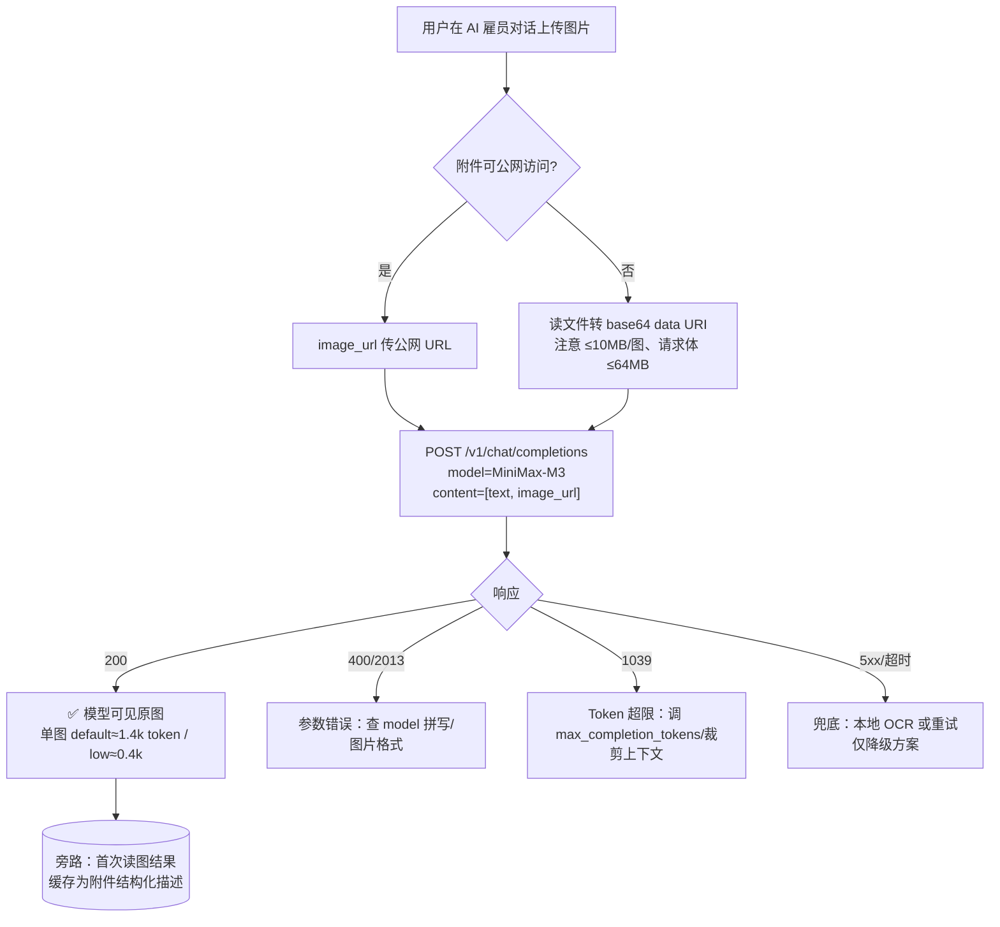
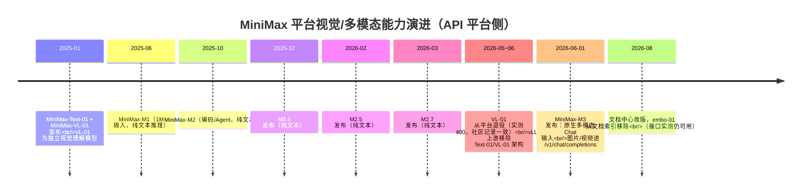

# MiniMax 平台多模态/视觉能力调研（api.minimaxi.com）

> 研究日期：2026-09-10 | 来源：13 个官方文档页 + 4 个二手来源 + 8 组真实 API 实跑 | 深度：Thorough（域调研，实跑验证）

---

## 1. 执行摘要

**核心结论（决定架构的一句话）：MiniMax-M3 原生支持多模态输入——`/v1/chat/completions` 的 `messages[].content` 数组直接接受 `{"type":"image_url","image_url":{"url":...}}`，公网 http(s) URL 与 base64 data URI 均实跑通过。"M3 纯文本"的假设不成立，图片方案无需引入任何第二模型或 OCR 降级，在现有 NocoBase plugin-ai 的 openai-completions llmService 上把 content 从字符串改为数组即可。**

调研通过官方文档（platform.minimaxi.com 新文档中心，含 `llms.txt` 全站索引）与真实 API 实跑双重验证：M3 于 2026-06-01 正式发布，定位"原生多模态、1M 上下文的 Frontier Coding 模型"，官方在 Chat Completions API 文档中直接给出图片理解/视频理解的 OpenAI 格式示例；本调研用生产 key 实测 M3 读图（URL 与 base64、单图与多图、`detail=low`）全部成功，单图 token 消耗与官方口径一致（default 约 1.4k token、low 约 0.4k token/图）。

两个重要的周边发现：(1) 旧视觉模型 **MiniMax-VL-01 已从平台退役**（实测返回 `400 unknown model`，与社区 2026-06-03 的独立实测逐字一致，vLLM 上游也已移除其架构支持）；(2) **embo-01 embeddings 端点仍然存活但已从官方文档除名**，且只认 MiniMax 原生参数格式（`texts` + `type=db/query`），不认 OpenAI 的 `input` 参数——这对仓库内 [`packages/kb/kb-embed-minimax`](../packages/kb/kb-embed-minimax/README.zh.md) 一类依赖构成"无文档依赖"风险。文档理解（pdf/docx 直传）API 不存在，长文档仍需自行解析文本注入，但 M3 的 1M token 上下文给了非常宽裕的空间。

## 2. 关键发现

1. **M3 支持 `image_url`（文档 + 实跑双确认）**：官方 Chat Completions 文档明确"MiniMax-M3 新特性：支持图片、视频理解"，请求示例即 OpenAI 多模态 content 数组格式（[Chat Completions API](https://platform.minimaxi.com/docs/api-reference/text-chat-openai)）；实测 `POST https://api.minimaxi.com/v1/chat/completions` 发送 `image_url`（URL 与 base64 data URI）均正确返回图片描述。
2. **准确端点与域名**：OpenAI 兼容路径为 `POST /v1/chat/completions`（注意：不是 `/v3/...`）。官方文档当前 `base_url` 推荐 `https://api.minimax.cn/v1`，但 `https://api.minimaxi.com/v1`（用户现用域名）实测完全可用，`/v1/models` 与 chat 端点均正常响应（[模型调用](https://platform.minimaxi.com/docs/guides/text-generation)）。
3. **图像输入限制**：单图 ≤10 MB、请求体 ≤64 MB（URL/base64 方式）；格式 JPEG/PNG/GIF/WEBP；`detail` 支持 `low/default/high`（官方 token 估算：low ≤600、default 1k-3k（最高约 5k）、high 最高 15k+）；另有 `max_long_side_pixel` 控制最长边像素（[Chat Completions API schema](https://platform.minimaxi.com/docs/api-reference/text-chat-openai)）。
4. **模型全景（GET /v1/models 实测返回 8 个）**：`MiniMax-M3`（唯一支持图像/视频输入）、`MiniMax-M2.7`、`MiniMax-M2.7-highspeed`、`MiniMax-M2.5`、`MiniMax-M2.5-highspeed`、`MiniMax-M2.1`、`MiniMax-M2.1-highspeed`、`MiniMax-M2`——M2.x 全系纯文本、上下文 204,800。M3 上下文 1,000,000（[接口概览](https://platform.minimaxi.com/docs/api-reference/api-overview)、[模型调用](https://platform.minimaxi.com/docs/guides/text-generation)）。
5. **MiniMax-VL-01 已退役**：实测 `model=MiniMax-VL-01` 返回 `400 invalid params, unknown model 'MiniMax-VL-01' (2013)`；社区 2026-06-03 独立实测同款报错并确认改用 M3 读图（[Yixin blog](https://mengyx.com.cn/2026/06/03/hermes-minimax-vl-m3-fix/)）；vLLM PR #45993 以"移除已淘汰的 Text-01/VL-01 架构"为由删除支持。开源权重仍在 HuggingFace（[MiniMaxAI/MiniMax-VL-01](https://huggingface.co/MiniMaxAI/MiniMax-VL-01)），可自托管。
6. **计费口径：图像按 token，不按次数**。图片被折算为输入 token，随语言模型输入价计费；M3 按量价（永久五折）：≤512k 输入 tokens 时输入 2.10 元/百万、输出 8.40 元/百万、缓存读 0.42 元/百万；>512k 输入 tokens 档位翻倍（4.20/16.80/0.84）（[按量计费](https://platform.minimaxi.com/docs/guides/pricing-paygo)）。按此口径一张 `detail=default` 图片约 1.4k token ≈ 0.003 元，`low` 约 0.4k token ≈ 0.0009 元。按"次"计费的是另外两样东西：图像**生成** image-01（0.025 元/张）与 Token Plan MCP 的 `API-vlm` 视觉工具（0.025 元/次）——与 chat 多模态输入无关。
7. **embo-01 embeddings：活着的"无文档接口"**。`POST https://api.minimaxi.com/v1/embeddings` 用 `{"model":"embo-01","texts":[...],"type":"db"}` 实测成功返回 1536 维向量；但 OpenAI 风格 `input` 参数不被识别（报 2013 missing `texts`），新版文档中心已无任何 embeddings 页面，仅老版文档中心 URL 仍可访问（[老文档 embeddings](https://platform.minimaxi.com/document/embeddings?key=66718fbfa427f0c8a5701627)，指向老域名 api.minimax.chat 并要求 GroupId 查询参数——minimaxi.com 实测不需要）。
8. **无文档理解 API**：Files API（`POST /v1/files/upload`）的 `purpose` 枚举只有 `voice_clone/prompt_audio/t2a_async_input/video_understanding/video_generation_input` 五种，没有 pdf/docx 文档理解用途（[文件上传](https://platform.minimaxi.com/docs/api-reference/file-management-upload)）；接口概览亦无任何"document understanding"端点（[接口概览](https://platform.minimaxi.com/docs/api-reference/api-overview)）。
9. **长上下文规格**：M3 输入+输出总 token 上限 1,000,000；`max_completion_tokens` 推荐值 131072（128K）、上限 524288（512K）；官方 token 估算口径"1600 中文字符 ≈ 1000 tokens"，即单请求约可容纳 160 万汉字；超限报 1039（Token 限制）（[Chat Completions API](https://platform.minimaxi.com/docs/api-reference/text-chat-openai)、[错误码查询](https://platform.minimaxi.com/docs/api-reference/errorcode)）。

## 3. 详细分析

### 3.1 必答问题 1：OpenAI 兼容端点是否支持多模态 content 数组？

**支持，且是官方一级特性。** 准确路径为 `POST /v1/chat/completions`（OpenAI 兼容，Bearer 鉴权）。官方文档在页面顶部以 Tip 形式标注"MiniMax-M3 新特性：1. 支持图片、视频理解，可参考右方示例代码；2. 支持通过 thinking 参数控制思考"（[Chat Completions API](https://platform.minimaxi.com/docs/api-reference/text-chat-openai)）。

请求体中 `Message.content` 为 `oneOf: string | MessageContentPart[]`，其中 `MessageContentPart.type` 枚举 `text | image_url | video_url`：

```json
{
  "model": "MiniMax-M3",
  "thinking": { "type": "adaptive" },
  "max_completion_tokens": 500,
  "messages": [{
    "role": "user",
    "content": [
      { "type": "text", "text": "这张图片的内容是什么？" },
      { "type": "image_url", "image_url": { "url": "https://filecdn.minimax.chat/public/fe9d04da-f60e-444d-a2e0-18ae743add33.jpeg" } }
    ]
  }]
}
```

`image_url` 对象字段：`url`（必填，"图片 URL 或 Base64 data URL"）、`detail`（`low/default/high`，默认 `default`）、`max_long_side_pixel`（可选）。`video_url` 额外有 `fps`（0.2–5，默认 1）与 `mm_file://{file_id}` 引用方式。

**URL 与 base64 data URI 支持情况（实测）**：

| 输入方式 | 官方文档 | 实跑结果（2026-09-10，api.minimaxi.com） |
| :-- | :-- | :-- |
| 公网 http(s) URL | 支持（示例即 https URL） | ✅ 成功，prompt_tokens=1367，正确描述图片 |
| base64 data URI（`data:image/jpeg;base64,...`，201KB 原图） | 支持（url 字段说明"图片 URL 或 Base64 data URL"） | ✅ 成功，prompt_tokens=1378 |
| base64 1×1 极小 PNG | — | ❌ 500 server error (1033)——图片本身过小/无效导致，非 data URI 机制问题 |
| 多图（2×URL，detail=low） | 未明确数量上限 | ✅ 成功，两图合计约 0.7k token，能做图间对比 |
| `detail=low` 单图 token | "通常几百，最高约 600" | ✅ 实测约 0.35–0.4k/图，与口径一致 |

域名注意：官方文档 OpenAPI `servers.url` 与指南 `base_url` 均写 `https://api.minimax.cn/v1`（国内主推域名），`https://api.minimaxi.com/v1` 为仍在服务的并行域名（本调研全部实跑均走 minimaxi.com，含 `/v1/models`）。两者返回结构一致，无需迁移；但若官方未来收敛域名，建议以 [模型调用](https://platform.minimaxi.com/docs/guides/text-generation) 页面的 `base_url` 表为准。

另外 Anthropic 兼容端点 `POST /anthropic/v1/messages` 同样支持图片（Anthropic 格式 `{"type":"image","source":{"type":"url","url":...}}`）与 `count_tokens` 估算端点（[Messages API](https://platform.minimaxi.com/docs/api-reference/text-chat-anthropic)）——若未来想用 interleaved thinking，可平移。

### 3.2 必答问题 2：哪些模型支持图像输入？M3 判定

**最终判定：MiniMax-M3 支持 image_url（多模态输入）；M2.x 全系纯文本；MiniMax-VL-01 / MiniMax-Text-01 已退役。**

| model 字符串（API 调用准确拼写） | 视觉输入 | 上下文窗口 | 状态 |
| :-- | :-- | :-- | :-- |
| `MiniMax-M3` | ✅ 图片 + 视频 | 1,000,000 | 当前旗舰（2026-06-01 发布） |
| `MiniMax-M2.7` / `MiniMax-M2.7-highspeed` | ❌ | 204,800 | 在售 |
| `MiniMax-M2.5` / `MiniMax-M2.5-highspeed` | ❌ | 204,800 | 在售（历史模型） |
| `MiniMax-M2.1` / `MiniMax-M2.1-highspeed` | ❌ | 204,800 | 在售（历史模型） |
| `MiniMax-M2` | ❌ | 204,800 | 在售（历史模型） |
| `M2-her` | ❌ | 64K | 对话/角色扮演专用，走专门接口（[对话模型](https://platform.minimaxi.com/docs/guides/text-chat)），未出现在 `/v1/models` 返回中 |
| `MiniMax-VL-01` | （曾是视觉模型） | 4M（发布时口径） | **已退役**：chat completions `model` 枚举无此项，实测 400 unknown model |
| `MiniMax-Text-01` / `MiniMax-M1` | ❌ | 1M（发布时口径） | 历史模型，已从模型表移除（[模型发布](https://platform.minimaxi.com/docs/release-notes/models)） |

证据链：ChatCompletionReq 的 `model` 枚举仅列 8 个 M 系列字符串（[Chat Completions API](https://platform.minimaxi.com/docs/api-reference/text-chat-openai)）；`GET /v1/models` 实测返回同样 8 个；模型总览页 M3 行明确"原生多模态、1M 上下文"（[概览](https://platform.minimaxi.com/docs/guides/models-intro)）；模型发布记录 2026-06-01 M3 发布条目明确"多模态 Chat 输入"（[模型发布](https://platform.minimaxi.com/docs/release-notes/models)）。VL-01 的退役仅有间接官方信号（从模型表/model 枚举/文档导航中消失）加实测与社区佐证，官方未发布单独退役公告（见第 4 节风险）。

### 3.3 必答问题 3：调用示例、限制、计费、错误码

**最小可用 curl（实测通过的精简版）**：

```bash
# 注意：api.minimaxi.com 可直连（国内可达），本命令无需代理；
# 若走代理环境请对本域名显式 NO_PROXY，避免 socks 代理拖慢或阻断。
curl -sS https://api.minimaxi.com/v1/chat/completions \
  -H "Authorization: Bearer $MINIMAX_API_KEY" \
  -H "Content-Type: application/json" \
  -d '{
    "model": "MiniMax-M3",
    "thinking": { "type": "disabled" },
    "max_completion_tokens": 300,
    "messages": [{
      "role": "user",
      "content": [
        { "type": "text", "text": "用一句话说明图片里是什么" },
        { "type": "image_url", "image_url": {
            "url": "https://filecdn.minimax.chat/public/fe9d04da-f60e-444d-a2e0-18ae743add33.jpeg" } }
      ]
    }]
  }'
```

base64 变体：把 `url` 换成 `"data:image/jpeg;base64,$(base64 -i img.jpg | tr -d '\n')"`（注意请求体 ≤64 MB）。

**限制汇总**（[Chat Completions API](https://platform.minimaxi.com/docs/api-reference/text-chat-openai)、[速率限制](https://platform.minimaxi.com/docs/guides/rate-limits)）：

| 维度 | 限制 |
| :-- | :-- |
| 单张图片 | ≤10 MB（URL/base64）；JPEG/PNG/GIF/WEBP |
| 请求体 | ≤64 MB |
| 视频（URL/base64） | ≤50 MB；MP4/AVI/MOV/MKV |
| 视频（Files API `mm_file://`） | ≤512 MB，`purpose=video_understanding` 上传，文件保留 7 天 |
| 图片数量上限 | 文档未给出明确张数上限，受 64 MB 请求体与 token 上限约束（实测 2 张 OK） |
| 速率（M3，充值用户） | 200 RPM / 10,000,000 TPM；免费用户 20 RPM / 1M TPM |
| `max_completion_tokens` | M3 推荐 131072、上限 524288；M2.x 推荐 65536、上限 204800 |

**计费**：见关键发现 6。图片按 token 折算进输入费用；实测 `detail` 未指定（default）时单图约 1.4k token。`thinking` 默认开启（adaptive），thinking 内容计输出 token——对读图这类简单任务建议显式 `{"type":"disabled"}` 控制成本（M2.x 无法关闭 thinking）。

**错误码**（[错误码查询](https://platform.minimaxi.com/docs/api-reference/errorcode)）：HTTP 层返回 OpenAI 风格错误体（`{"type":"error","error":{"type":"bad_request_error","message":"...","http_code":400}}`），业务层沿用 `base_resp.status_code`：`1004` 鉴权失败、`1002` 频率超限、`1008` 余额不足、`1039` Token 超限（"请调整 max_tokens"）、`2013` 参数错误（含 unknown model）、`1026/1027` 输入/输出涉敏、`1042` 不可见字符比例超限、`2056` 超出 Token Plan 资源限制。实测 VL-01 报错即 `400 + 2013 invalid params, unknown model` 双层结构。

### 3.4 必答问题 4：备选路径对比（重新定位后）

由于"M3 纯文本"假设被推翻，原设想的 (a) 路由视觉模型已无必要——**M3 本身就是当前平台唯一且官方指定的视觉输入模型**。备选路径降级为成本/鲁棒性优化项：

| 路径 | 说明 | 优势 | 劣势 | 业界常见度/建议 |
| :-- | :-- | :-- | :-- | :-- |
| (0) **M3 原生 `image_url`（推荐主路径）** | 现有 llmService 的 chat completions 请求中 content 改数组 | 零新增依赖；模型看到原图（布局/颜色/图表结构全保留）；与 NocoBase openai-completions 兼容层格式一致 | 图片 token 成本随尺寸增长；用户上传文件需可公网访问或转 base64（内网部署需注意：MiniMax 服务端要能拉到该 URL） | 业界主流（OpenAI/Gemini/GLM-4V 同款模式）；本系统首选 |
| (a) 同 key 路由其他视觉模型 | 请求级换 `model` | — | **无模型可路由**：VL-01 已退役，`/v1/models` 中再无其他视觉输入模型；要换只能换供应商 | 已失效，排除 |
| (b) 本地 OCR（tesseract/rapidocr）降级为文本 | 上传图片先 OCR，文本进 prompt | 图片不出内网；纯文本 token 便宜 | 丢失一切视觉信息（表格结构、图表、印章、手写、截图 UI）；中文 OCR 质量参差；多一套运维面 | 常见于强合规/离线场景；作为 M3 失败时的兜底可选，不宜主路径 |
| (c) 结构化描述降级 | 先用 M3 生成图片描述存库，对话注入描述文本 | 描述可缓存复用（同一附件多轮/多会话只付一次读图费）；检索友好 | 两跳延迟；描述有损（细节丢失且不可追问像素级信息）；描述质量依赖 prompt | 常用于附件预览/搜索索引等旁路；对话内首次追问仍建议直连原图 |

推荐组合：**主路径 (0) + 旁路 (c) 做附件索引 + (b) 仅作网络隔离环境的兜底**。



上图即推荐架构：图片始终走 M3 原生多模态通道，OCR 与结构化描述只作为故障兜底与检索旁路。

### 3.5 必答问题 5：长文本上下文与文档注入风险

- M3 上下文窗口 1,000,000 token（输入+输出总额），M2.x 为 204,800（[接口概览](https://platform.minimaxi.com/docs/api-reference/api-overview)）。`max_completion_tokens` 上限 512K，意味着单请求理论可塞入约 48 万 token 的输入仍留足输出空间。
- 官方 token 换算口径：1600 中文字符 ≈ 1000 tokens（[按量计费](https://platform.minimaxi.com/docs/guides/pricing-paygo)），即 1M token ≈ 160 万汉字——单请求注入整份几十万字解析文本在容量上无风险。
- **真正的风险是价格阶梯而非容量**：输入 >512k token 后单价翻倍（2.10→4.20 元/百万）。对于"解析后长文档注入"，建议在注入前做摘要或分段，控制单请求输入在 512k 以内；这也符合 RAG 最佳实践（相关段落注入优于全文注入）。
- 官方提供 token 预估接口（OpenAI Responses 兼容的 Token 估算，"不真正调用模型生成"，[Token 估算](https://platform.minimaxi.com/docs/api-reference/responses-input-tokens)）与 Anthropic 兼容 `count_tokens`，可在注入前评估成本与上限。
- 上下文缓存（prompt caching）可用：缓存读价格仅 0.42 元/百万，实测响应含 `prompt_tokens_details.cached_tokens`——长系统提示词（如 KB 检索结果）重复注入时收益显著（[Prompt 缓存](https://platform.minimaxi.com/docs/api-reference/text-prompt-caching)）。
- 文本注入兼容性：M3 对纯文本输入无特殊要求，`content` 保持字符串即可；`1042`（不可见字符超 10%）提示解析器产生的文本需清洗控制字符。

### 3.6 必答问题 6：文档理解 API 与 embeddings 现状

**文档理解 API：不存在。** 全站 `llms.txt` 索引、接口概览、Files API `purpose` 枚举均无 pdf/docx 直传理解端点。MiniMax 的多模态输入覆盖文本/图片/视频三类，不含 PDF/Office 文档。方案上维持"客户端解析文本 → 注入 prompt"现状即可（与第 3.5 节结论衔接）。

**embeddings（embo-01）现状：接口活着，文档死了。**

- 实测 `POST https://api.minimaxi.com/v1/embeddings`，请求体 `{"model":"embo-01","texts":["你好世界"],"type":"db"}` → 成功返回 1536 维 float32 向量（`vectors[[...]]`）。
- 传 OpenAI 格式 `{"model":"embo-01","input":[...]}` → `2013 missing required parameter texts`，再补 `type` 才通——**该端点是 MiniMax 原生格式，未做 OpenAI 兼容适配**。
- 老版文档中心页面仍在线（[document/embeddings](https://platform.minimaxi.com/document/embeddings?key=66718fbfa427f0c8a5701627)）：embo-01 单条文本上限 4096 token、向量 1536 维、`type` 必须 `db`（入库/被检索）或 `query`（检索串）二选一——**db/query 双向量算法是 MiniMax 特有约定，检索与入库必须成对使用同 type 语义**。老文档指向老域名 `api.minimax.chat/v1/embeddings?GroupId=...`；实测 minimaxi.com 同路径不带 GroupId 亦可用。
- 风险定性：新版文档中心（llms.txt）完全无 embeddings 条目，说明官方已将其移出主推产品线（对照：VL-01 从文档消失后随即退役）。**依赖 embo-01 的存量代码（如本仓库的 KB embedding 管线）应视为运行在遗留接口上**，建议：短期继续用（实测可用、计费极低），中期准备迁移方案（如换供应商 embedding 或自托管开源向量模型），并在监控中加入对该端点的探活。

### 3.7 平台能力时间线（多模态相关）



时间线说明：视觉能力从"独立 VL 模型"收敛为"M 系列旗舰原生多模态"，这是 2026 年平台最重要的架构变化，也是本次"M3 是否支持 image_url"问题的历史背景。

## 4. 反方观点与风险

- **官方未发布 VL-01 退役公告（证据缺口）**：VL-01 退役的结论建立在 model 枚举消失 + 实测 400 + 社区独立实测 + vLLM 移除四条间接证据上，未找到官方退役公告原文。不排除"特定 key 权益调整"的可能（该可能性被社区实测的多 key 场景削弱，但无法完全排除）。影响：若有旧文档/旧配置仍写 VL-01，需全部清理。
- **`/v1/models` 不含 M2-her 与 embo-01**：说明 models 列表并非"平台全部可用模型"的完整投影（M2-her 有独立文档页、embo-01 实测可用）。用 models 列表做能力探测的代码要容忍这种不一致。
- **域名收敛风险**：文档全面改推 `api.minimax.cn`，`api.minimaxi.com` 虽实测可用但官方未在文档中承诺。若域名收敛，硬编码 minimaxi.com 的调用方需改 baseUrl。建议把 baseUrl 保持配置化（现 NocoBase llmService 已是配置项，风险可控）。
- **多模态成本不可控的场景**：用户上传大图/多图时，default 档单图可达 5k token、high 档 15k+，恶意或无意识的多图注入会显著推高成本。建议产品层默认 `detail=default` 或 `low`（预览场景），并限制单消息图片数。
- **内网 URL 可达性**：`image_url` 传 URL 时是 MiniMax 服务端拉取，内网/鉴权后的文件 URL 会拉取失败（报错形态未在文档中明确，实测仅覆盖公网 URL 与 base64）。NocoBase 本地存储的附件应优先走 base64（≤10MB 约束内）或确保公网可达。
- **embo-01 随时可能真下线**：文档除名是强烈的下线前兆（参照 VL-01 先例：文档消失 → 接口 400）。KB 向量管线应有替代方案预案，避免单点依赖。
- **thinking 默认开启的成本**：M3 省略 `thinking` 参数时默认 adaptive，思考内容计输出 token（输出单价是输入的 4 倍）。简单读图任务不显式关闭会白付思考成本。
- **图片数量上限未文档化**：文档只约束了单图 10MB 与请求体 64MB，未写"最多几张图"。不要假设无上限；产品层自行设限。

## 5. 开放问题

1. **单请求图片张数上限**的官方数字（文档未写，实测 2 张通过）——可向 api@minimaxi.com 或工单确认，或压测探明。
2. **`image_url` 拉取失败（内网 URL/403）的具体错误码**——文档错误码表无专项条目，需实测补充；这影响 NocoBase 附件注入策略的失败分支设计。
3. **api.minimaxi.com 与 api.minimax.cn 的关系官方口径**（同集群双域名 or 渐进迁移）——影响长期 baseUrl 选型；建议订阅官方公告页。
4. **embo-01 是否有官方替代计划**（M 系列是否有新 embedding 模型）——当前文档完全沉默。
5. **M3 视觉基准表现**：官方未发布 M3 视觉理解的 benchmark（模型页宣传重点在 coding/agentic）。对图片理解质量有强要求的场景（票据 OCR 级精度）建议先用自己的样例集做小规模评测，再决定是否需要 (b)/(c) 补偿路径。

## 6. 来源

| # | 来源 | 类型 | 日期 | URL |
| :-- | :-- | :-- | :-- | :-- |
| 1 | MiniMax 开放平台文档中心 · 概览（模型总览） | 官方文档（主） | 2026-09 访问 | https://platform.minimaxi.com/docs/guides/models-intro |
| 2 | Chat Completions API（OpenAI 兼容，含多模态 schema） | 官方文档（主） | 2026-09 访问 | https://platform.minimaxi.com/docs/api-reference/text-chat-openai |
| 3 | 模型调用（base_url/调用示例） | 官方文档（主） | 2026-09 访问 | https://platform.minimaxi.com/docs/guides/text-generation |
| 4 | 接口概览（模型上下文表） | 官方文档（主） | 2026-09 访问 | https://platform.minimaxi.com/docs/api-reference/api-overview |
| 5 | 获取模型列表（GET /v1/models） | 官方文档（主） | 2026-09 访问 | https://platform.minimaxi.com/docs/api-reference/models/openai/list-models |
| 6 | 按量计费（M3 价格阶梯/token 口径） | 官方文档（主） | 2026-09 访问 | https://platform.minimaxi.com/docs/guides/pricing-paygo |
| 7 | 速率限制 | 官方文档（主） | 2026-09 访问 | https://platform.minimaxi.com/docs/guides/rate-limits |
| 8 | 错误码查询 | 官方文档（主） | 2026-09 访问 | https://platform.minimaxi.com/docs/api-reference/errorcode |
| 9 | 文件上传（Files API purpose 枚举） | 官方文档（主） | 2026-09 访问 | https://platform.minimaxi.com/docs/api-reference/file-management-upload |
| 10 | 模型发布记录（M3/VL-01 时间线） | 官方文档（主） | 2026-09 访问 | https://platform.minimaxi.com/docs/release-notes/models |
| 11 | Messages API（Anthropic 兼容，image 支持） | 官方文档（主） | 2026-09 访问 | https://platform.minimaxi.com/docs/api-reference/text-chat-anthropic |
| 12 | 老版文档中心 · Embeddings（embo-01 规格） | 官方文档（遗留） | 2026-09 访问（内容为 2025 早期版本） | https://platform.minimaxi.com/document/embeddings?key=66718fbfa427f0c8a5701627 |
| 13 | MiniMax 开放平台文档中心 · llms.txt 全站索引 | 官方文档（主） | 2026-09 访问 | https://platform.minimaxi.com/docs/llms.txt |
| 14 | Yixin blog《MiniMax VL 读图终于通了：模型名不是 VL-01，是 M3》 | 二手（独立实测博客） | 2026-06-03 | https://mengyx.com.cn/2026/06/03/hermes-minimax-vl-m3-fix/ |
| 15 | vLLM PR #45993 报告（移除 Text-01/VL-01 架构） | 二手（开源项目） | 2026 | https://prhub.com.cn/vllm-project/vllm/pull/45993/report.pdf |
| 16 | HuggingFace MiniMaxAI/MiniMax-VL-01（开源权重仍存） | 二手（官方 org 仓库页） | 2025-01-14 | https://huggingface.co/MiniMaxAI/MiniMax-VL-01 |
| 17 | GitHub MiniMax-AI/MiniMax-01（官方 repo） | 二手（官方 GitHub） | 2025-01 | https://github.com/MiniMax-AI/MiniMax-01 |
| 18 | 本调研实跑记录（8 组 curl，见第 3 节表格与示例） | 一手实测 | 2026-09-10 | api.minimaxi.com（生产 key，直连） |

## 7. 方法论

- **检索路径**：DuckDuckGo（浏览器）定位官方入口 → 官方文档中心 `llms.txt` 全站索引（Mintlify 站点，每页可加 `.md` 后缀取 markdown 源）→ curl 批量拉取 13 个相关页面源文细读。检索词包括 `MiniMax-M3 image_url`、`MiniMax embo-01 embeddings 停止服务`、`MiniMax-VL-01 停止服务 下线 vision` 等（先精确词条后概念组合，中英双语）。
- **证据分级**：结论优先采用官方文档 + 真实 API 实跑（用户生产 key，直连不走代理）；VL-01 退役等官方未明说的事实，用"实测报错 + 社区独立实测 + 上游开源项目动作"三角互证并明确标注证据等级。
- **实跑矩阵**（全部 2026-09-10 于 api.minimaxi.com）：`GET /v1/models`；M3 + image_url（公网 URL）；M3 + base64 data URI（1×1 与 201KB 真图）；M3 + 双图 + `detail=low`；`MiniMax-VL-01`（预期失败验证）；`/v1/embeddings` 三种参数形态（OpenAI input / +texts / +texts+type）。
- **局限**：单 key 实测（个别模型权限差异无法完全排除）；未压测图片张数上限与内网 URL 拉取失败形态；老版文档中心为 SPA，仅通过浏览器渲染读取 embeddings 单页；MiniMax 文档站更新频繁，结论时效以 2026-09-10 为准。
- **代理说明**：查文档网页与 HuggingFace 等走 `socks5://127.0.0.1:1087` 代理；api.minimaxi.com 全程直连（unset 代理变量后实跑）。
