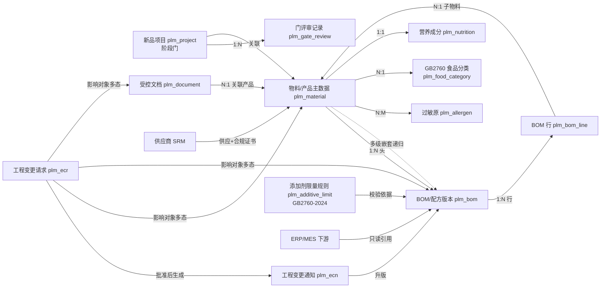
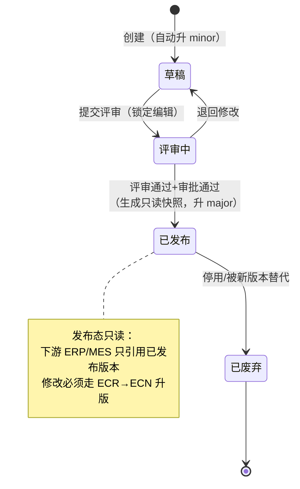
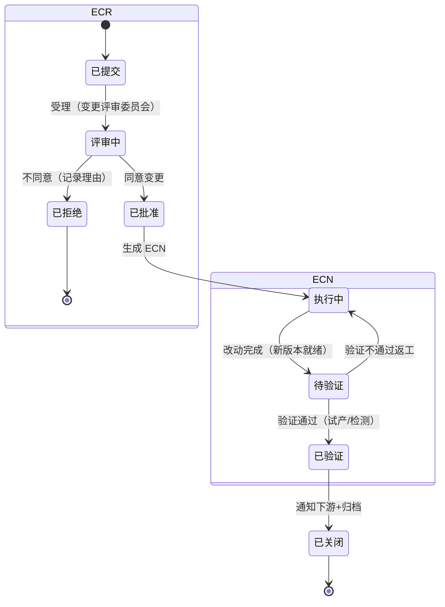
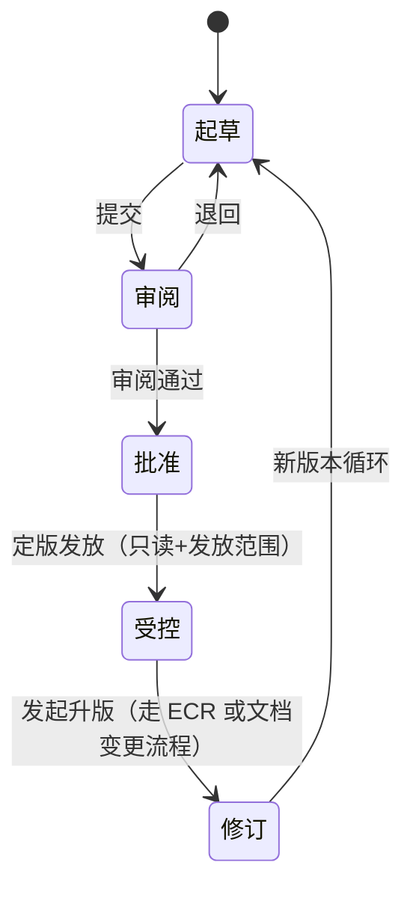
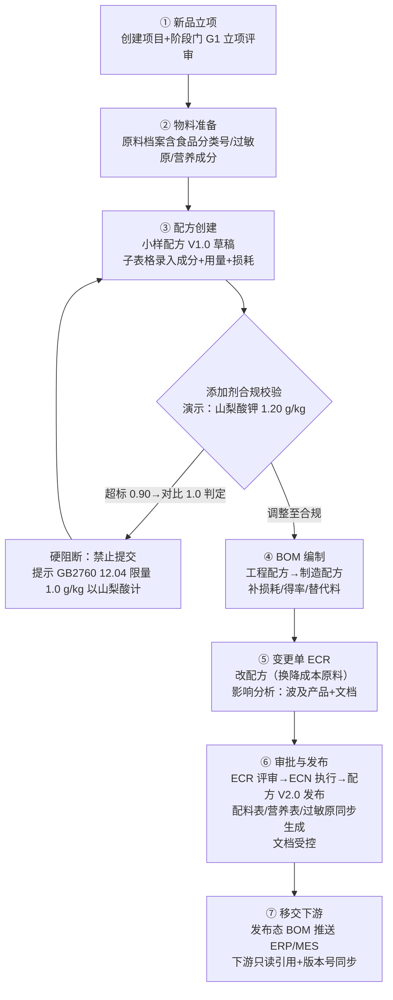
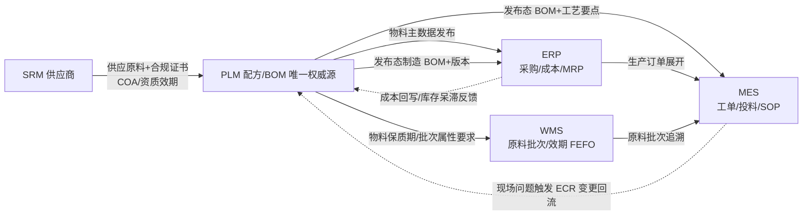

# 食品行业 PLM 核心领域模型调研报告——为 NocoBase 落地 PLM 模块做准备

> 研究日期：2026-09-14 | 来源：14 个来源（9 个深读全文 + 5 个搜索快照） | 深度：Thorough~Exhaustive
> 服务对象：DSH 食品业务平台（NocoBase v13 源码并入版）新增 PLM 模块的领域模型设计与 MVP 规划

---

## 1. 执行摘要

本报告面向"在 NocoBase 低代码平台上为食品行业综合业务系统搭建 PLM 模块"这一目标，系统调研了 PLM 核心领域模型（物料/BOM/配方/ECR-ECN/文档/阶段门/合规）、状态机设计、食品行业特有能力（配方版本与成本模拟、GB 2760 添加剂限量校验、GB 7718/28050 标签合规、过敏原、保质期）、MVP 最小闭环、NocoBase 标准 UI 区块能力边界与自定义区块需求，以及与 ERP/MES/WMS/SRM 的集成点。

最重要的三个结论：**第一**，食品属于典型流程工业，配方（formulation）与离散制造的 BOM 有本质差异——配方可按比例缩放、多级嵌套（基料/母料/预混料/成品）、区分小样/中试/量产形态，直接采购通用机械 PLM 会失败，食品 PLM 的三大黄金标尺是配方管理、合规校验、标签一体化（[一半科技·网易](https://m.163.com/dy/article/L368VKSR05560L6F.html)）。**第二**，合规数据已可结构化落地：GB 2760-2024 已于 2025-02-08 实施并提供食品分类号体系的限量数据库（酱油 12.04 山梨酸钾 1.0 g/kg 以山梨酸计已验证，[食品伙伴网 GB 2760 数据库](https://2760.foodmate.net/addtives/faid/201.html)）；GB 7718-2025 与 GB 28050-2025 将于 2027-03-16 实施，强制标示从"1+4"扩为"1+6"、八大致敏物质强制标示——配料表生成、营养核算、过敏原校验都应以 2025 新版为目标设计（[GB 7718-2025 官方问答](https://www.foodmate.net/zhiliang/guanli/173142.html)、[inewfood](https://www.inewfood.com/gb-28050-2025-nutrition-label-standard.html)）。**第三**，NocoBase 标准区块（Table/Form/Details/Kanban/子表格 + Workflow 审批）可覆盖约 70% 的 PLM 页面需求，但多级 BOM 树（跨表递归）、版本 diff 对比、变更影响分析三类视图超出标准能力，需要基于 NocoBase 2.0 区块扩展机制（DataBlockModel + renderComponent）自定义开发（[NocoBase 区块扩展概述](https://docs.nocobase.com/cn/ui-development-block/)）；MVP 建议只做"只读 BOM 树"一个自定义区块，其余用标准区块降级呈现。

---

## 2. 关键发现

1. **PLM/ERP/MES 的 BOM 三视图分工**：PLM BOM 是设计视图（产品结构/版本/替代料/文档关联），ERP BOM 是制造视图（物料清单/用量/采购与成本口径），MES BOM 是执行视图（工艺路线/工序物料/SOP 绑定）；BOM 主数据必须有唯一权威源（建议落在 PLM），ERP/MES 通过接口消费发布后数据（[技术栈·PLM/ERP/MES 数据流转设计](https://jishuzhan.net/article/2093233120645140482)）。
2. **EBOM→MBOM 转换要做三件事**：物料视口调整（设计件与采购件区分）、用量与损耗口径对齐、替代料规则补充（[技术栈](https://jishuzhan.net/article/2093233120645140482)）。
3. **工程变更标准链路 PR→ECR→ECN→ECO**：ECR 发起时系统自动分析影响范围（涉及 BOM、图纸、工艺路线、采购订单等），提交变更评审委员会审批（[戴西 PLM·CSDN](https://blog.csdn.net/2501_94173415/article/details/162338706)）。
4. **配方是 BOM 的食品行业变体**：区别于离散制造零部件组合，配方关注原料比例与混合过程、可按比例缩放；食品企业配方分为研发小样、中试配方、量产正式配方，多级嵌套（基料/母料/预混料/成品）；配方需要字段级权限与脱敏投料清单（生产/OEM 只见投料量不见全配方）（[一半科技·深入解析配方管理](https://m.163.com/dy/article/JJ2502CN05560L6F.html)、[一半科技·食品 PLM 选型要点](https://m.163.com/dy/article/L368VKSR05560L6F.html)）。
5. **GB 2760-2024 已实施（2025-02-08）**，限量数据以"食品分类号 + 添加剂 + 最大使用量(g/kg) + 计算基准（以山梨酸计等）+ 例外条款"四元组结构化；酱油（12.04）山梨酸钾最大使用量 1.0 g/kg 以山梨酸计，山梨酸钾/山梨酸换算系数约 1.34（150.22/112.13）（[食品伙伴网 2760 数据库](https://2760.foodmate.net/addtives/faid/201.html)、[官方查询入口 gb2760.cfsa.net.cn](https://gb2760.cfsa.net.cn/index.php)、[b2bwiki 换算说明](https://b2bwiki.baidu.com/article/d1obt29ftjsl9ir7m2r0)）。
6. **GB 7718-2025 问答（官方 50 条）给出配料表生成完整规则**：复合配料"有标准且加入量<25%可不展开、≥25%必须括号展开"；配料表按加入量降序；食品添加剂标示通用名称或"功能类别（名称）"；八大致敏物质（含麸质谷物/甲壳纲/鱼/蛋/花生/大豆/乳/坚果）强制提示，加粗或下划线或引导词；双日期强制（生产日期+保质期到期日）；数字标签修改需留痕（修改内容/时间/修改者）（[GB 7718-2025 标准问答·食品伙伴网转载国家卫健委](https://www.foodmate.net/zhiliang/guanli/173142.html)）。
7. **GB 28050-2025 营养标签强制标示从"1+4"扩为"1+6"**（新增糖、饱和脂肪），2027-03-16 实施，与 GB 7718-2025 构成配套体系（[inewfood](https://www.inewfood.com/gb-28050-2025-nutrition-label-standard.html)、[食品伙伴网法规中心](http://law.foodmate.net/show-232426.html)）。
8. **阶段门（Stage-Gate）模式成熟**：典型 6 阶段（报价→设计发布→原型测试→工装产线→生产准备→量产后复盘），每阶段末门评审由跨职能评审团（总经理/财务/工程/质量）按红黄绿状态判定 Go/Hold/Kill，阶段任务 30-75 项清单化、证据文件挂链（[Arena Solutions](https://www.arenasolutions.com/blog/stage-gate-confessions-of-a-plm-project-management-expert/)）。
9. **NocoBase 树表是单表自关联（parentId 邻接表）**，官方适用场景为"BOM 分类、设备分类"等层级目录，而多级 BOM 是"物料表+BOM 行表"跨表递归结构——树表不能直接当多级 BOM 树用，需自定义区块 + 后端递归查询（[NocoBase 树表文档](https://docs.nocobase.com/cn/data-sources/collection-tree/)）。
10. **NocoBase 2.0 自定义区块门槛低**：继承 BlockModel/DataBlockModel/CollectionBlockModel/FilterBlockModel 四基类之一，实现 renderComponent() 返回 React 组件并注册即可；DataBlockModel 支持自定义数据获取逻辑（调用外部 API/自定义数据处理），适合 BOM 树/diff/影响分析（[NocoBase 区块扩展概述](https://docs.nocobase.com/cn/ui-development-block/)、[自定义区块示例](https://docs.nocobase.com/cn/plugin-development/client/examples/custom-block)）。
11. **开源 PLM 参考**：openPLM（Django，GPLv3）核心为产品结构（BOM）+ 电子文档管理，可作为轻量自建的功能对照（[OSCHINA](https://www.oschina.net/p/openplm)、[GitHub](https://github.com/amarh/openPLM)）；GitHub 上 openplm/openplm（自称 CPG/Retail PLM）为空仓库不可用（[验证](https://github.com/openplm/openplm)）；SaaS 轻量 PLM 以 Arena（PTC 旗下）为代表。

---

## 3. 详细分析

### 3.1 PLM 核心实体清单（实体/关键字段/关系）

以下实体模型综合了通用 PLM 实践（[技术栈](https://jishuzhan.net/article/2093233120645140482)、[CSDN·戴西](https://blog.csdn.net/2501_94173415/article/details/162338706)）与食品行业实践（[一半科技](https://m.163.com/dy/article/L368VKSR05560L6F.html)），并针对 NocoBase collection 设计给出建议字段。

#### 3.1.1 实体总览图



上图核心设计：物料是宇宙中心（被 BOM 行、文档、变更、合规属性引用）；BOM 头行分离支持多级嵌套（BOM 行的子物料本身又可以有 BOM 头，形成递归）；ECR 的影响对象是多态关联（可指向物料/BOM/文档任一实体）。

#### 3.1.2 实体字段表

| 实体 | 关键字段（NocoBase collection 建议） | 关键关系 | 状态机（详见 3.2） |
|---|---|---|---|
| **物料/产品主数据** `plm_material` | 物料编码（唯一）、名称、物料类型（枚举：原料/半成品-基料/预混料/成品/包材）、规格、计量单位、**GB2760 食品分类号**（如 12.04 酱油）、默认保质期（天）+ 保质期依据、成本参考价、**ERP 物料编码映射**、密级（普通/核心）、默认供应商、禁用原因 | 1:N BOM 头；被 BOM 行 N:1 引用；N:M 过敏原；1:N 合规证书（SRM）；1:N 文档；1:1 营养成分 | 草稿→评审中→已发布→已废弃 |
| **BOM/配方版本（头）** `plm_bom` | BOM 编号、产品物料 FK、**BOM 类型**（枚举：工程配方 EBOM/制造配方 MBOM——食品业即研发配方 vs 生产投料单）、**形态**（小样/中试/量产）、版本号（V{major}.{minor}）、状态、投料基数（如 per 1000 kg）、**得率%**、生效日期、发布日期、工艺要点、变更原因（关联 ECN） | N:1 产品物料；1:N BOM 行；N:1 升版来源 BOM | 草稿→评审中→已发布→已废弃 |
| **BOM 行** `plm_bom_line` | 行号、子物料 FK、用量数值、用量单位（g/kg/%）、**损耗率%**、投料顺序（影响配料表排序）、替代料组、备注 | N:1 父 BOM；N:1 子物料 | 随父 BOM 版本冻结 |
| **ECR 工程变更请求** `plm_ecr` | ECR 编号、标题、变更类型（纠错/改进/法规合规/降本）、变更原因描述、提出人/部门、期望完成日、影响分析结果（JSON/文本快照）、评审结论 | 1:N ECN；影响对象多态关联（物料/BOM/文档） | 已提交→评审中→已批准/已拒绝→转执行→关闭 |
| **ECN 工程变更通知** `plm_ecn` | ECN 编号、来源 ECR FK、变更对象类型+前后版本对、执行人、切换策略（立即/按库存耗尽/按日期）、计划/实际完成日、验证记录、通知范围 | N:1 ECR；触发 BOM 升版 | 执行中→待验证→已验证→已关闭 |
| **受控文档** `plm_document` | 文档编号、类型（产品规格书/配方文档/合规文档/检测报告/标签文案/包装图纸）、版本、文件附件、关联产品 FK、密级、审批人/时间、受控发放范围 | N:1 产品物料；被 ECR 多态引用 | 起草→审阅→批准→受控→修订（升版） |
| **新品项目** `plm_project` | 项目编号、名称、项目类型（新品/改良）、目标上市日、当前阶段、负责人 | 1:N 门评审记录；关联物料/BOM/文档 | 立项→小试→中试→量产→上市后复盘 |
| **门评审记录** `plm_gate_review` | 门编号（G1..G5）、评审日期、评审人清单、检查项完成度（任务清单）、红黄绿状态、结论（Go/Hold/Kill/Recycle）、遗留问题 | N:1 项目 | 待评审→评审中→已决策 |
| **添加剂限量规则** `plm_additive_limit` | 添加剂 CNS/INS 编码、名称（如山梨酸及其钾盐）、食品分类号、最大使用量（g/kg）、**计算基准**（以山梨酸计）、例外条款（罐头除外/仅限…）、标准版本（GB2760-2024） | 被 BOM 校验引擎引用 | 法规库随标准换版更新（无业务状态机） |
| **营养成分** `plm_nutrition` | 关联物料/产品、每 100g/100mL 的能量、蛋白质、脂肪、**饱和脂肪**、碳水化合物、**糖**、钠（1+6）、NRV%、数据来源（计算/检测） | 1:1 物料 | 草稿→确认（随产品版本冻结） |
| **过敏原** `plm_allergen` | 过敏原编码、八大类名称（含麸质谷物/甲壳纲/鱼/蛋/花生/大豆/乳/坚果）、强制/自愿（芝麻等） | N:M 物料 | 无（基础档案） |

**物料主数据与 ERP 物料的关系**：PLM 物料是设计视图（含食品分类号、过敏原、营养成分、配方密级等研发属性），ERP 物料是采购与成本视图（含采购组、计价方法、库存参数）。两者通过"ERP 物料编码映射"字段关联，物料档案在 PLM 创建并审批发布后**推送/同步至 ERP 生成或更新物料主数据**，ERP 侧不反向创建（BOM 唯一权威源原则，[技术栈](https://jishuzhan.net/article/2093233120645140482)）。

**工程 BOM vs 制造 BOM 在食品业的对应**：食品业的"工程 BOM"即研发配方（按配方师视角，成分+比例+工艺要点），"制造 BOM"即生产投料单/制造配方（按产线视角，投料量+损耗+替代料+批次投料顺序）。转换时做三件事：物料视口调整（研发试剂料号→采购大宗原料料号）、用量与损耗口径对齐（实验室得率→产线得率，补损耗率）、替代料规则补充（[技术栈](https://jishuzhan.net/article/2093233120645140482)；[网易·EBOM/MBOM 实务](https://www.sohu.com/a/945599808_121403736)）。

### 3.2 状态机设计

#### 3.2.1 物料/配方/BOM 版本生命周期



**版本号规则建议**：`V{major}.{minor}` 双段式。草稿内每次保存自动升 minor（V1.0→V1.1→V1.2）；评审通过发布时升 major 并冻结（V1.x→V2.0）；已发布版本永不就地修改，任何变更通过 ECR→ECN 产生新 major 版本——这与"配方每一次调整自动生成新版本，完整记录修改人、修改时间、配比差异，变更对比可视化，所有操作永久留痕"的行业实践一致（[一半科技](https://m.163.com/dy/article/L368VKSR05560L6F.html)）。

#### 3.2.2 变更单 ECR→ECN 全流程



流程要点综合自：PR→ECR→ECN→ECO 标准链路、ECR 发起时自动影响分析（BOM/图纸/工艺路线/采购订单）、评审委员会机制（[CSDN·戴西](https://blog.csdn.net/2501_94173415/article/details/162338706)）；计划/物料审查（库存呆滞处理、供应商响应评估）、批准后发布通知至采购/制造/质量部门（[百度文库·ECR/ECN/PCN 术语解析](https://wenku.baidu.com/view/7755cd0ba61614791711cc7931b765ce05087ad5.html)）；变更回流时 PLM 记录影响范围并重新发布 BOM 版本，ERP 按新版本重算成本与需求，MES 更新作业依据与 SOP（[技术栈](https://jishuzhan.net/article/2093233120645140482)）。

#### 3.2.3 文档生命周期



食品业补充：标签文案/包装图纸属于受控文档，与配方版本联动——配方变更触发标签数据源同步更新，标签版本闭环管控避免新旧包装混用（[一半科技](https://m.163.com/dy/article/L368VKSR05560L6F.html)）；数字标签内容修改需记录修改内容/时间/修改者，确保可追溯（[GB 7718-2025 问答第十二问](https://www.foodmate.net/zhiliang/guanli/173142.html)）。

### 3.3 食品行业特有（重点）

#### 3.3.1 配方与离散 BOM 的差异

| 维度 | 离散制造 BOM | 食品/流程行业配方 |
|---|---|---|
| 核心结构 | 零部件层级装配（1 个车身 = 4 个车轮） | 原料比例混合，**可按比例缩放**（100 kg 配方可线性放大到 1 吨） |
| 用量语义 | 离散件数 | 连续量（g/kg、%），含**损耗率**（加工损耗）与**得率**（产出率，投入 100kg 得 95kg 成品） |
| 层级形态 | EBOM/PBOM/MBOM 多视图 | 基料/母料/预混料/成品**多级嵌套配方**，微量配料管控 |
| 版本形态 | 图纸版本 | **小样（研发小试）→中试→量产**三形态 + 版本（[一半科技](https://m.163.com/dy/article/JJ2502CN05560L6F.html)） |
| 知识产权 | 一般机密 | **核心商业机密**：字段级权限、生产/OEM 只见脱敏投料清单、离职一键回收权限（[一半科技](https://m.163.com/dy/article/L368VKSR05560L6F.html)） |
| 研发过程 | CAD/EDA 设计 | DOE 实验设计、电子实验记录（ELN）、感官评定、货架期试验（[一半科技](https://m.163.com/dy/article/JJ2502CN05560L6F.html)） |
| 合规属性 | 少（RoHS/REACH 等） | **重合规**：GB 2760 添加剂、GB 7718 标签、GB 28050 营养、过敏原 |

在流程行业，ERP 中 BOM 与配方并存：BOM 面向物料需求计划（MRP 展开算原料需求），配方面向生产执行投料指导，两者需按生产工艺与产线动态结合（[2PLM·流程行业 BOM 和主配方](http://www.2plm.com/forum.php?mod=viewthread&tid=1084)）。

#### 3.3.2 配方版本与成本模拟

- **版本快照**：发布版配方冻结全部行（用量/损耗/得率），历史版本永久可追溯（[一半科技](https://m.163.com/dy/article/L368VKSR05560L6F.html)）。
- **成本模拟**：配方成本 = Σ(子物料用量 × 物料成本参考价) ÷ 得率，递归展开多级配方计算全成本；原料替代模拟与动态成本测算用于应对原料涨价/断供（[一半科技](https://m.163.com/dy/article/L368VKSR05560L6F.html)）。NocoBase 落地：成本计算作为 server 端 service（递归 CTE 或应用层递归），结果写入成本模拟表，前端用标准表格/图表区块展示。

#### 3.3.3 添加剂限量校验（GB 2760-2024 落地）

**数据模型**（三张基础表）：

1. `plm_food_category`：GB 2760 食品分类树（12.0 调味品 → 12.04 酱油 → …），层级编码支持父类限量继承判断；
2. `plm_additive`：添加剂档案（CNS 17.003/17.004、INS 200/202、名称"山梨酸及其钾盐"、功能"防腐剂、抗氧化剂"、质量规格标准）；
3. `plm_additive_limit`：限量规则（食品分类号 + 添加剂 + 最大使用量 g/kg + 计算基准"以山梨酸计" + 例外条款）——数据结构与 [食品伙伴网 GB 2760-2024 数据库](https://2760.foodmate.net/addtives/faid/201.html) 表格一一对应，官方查询入口为 [gb2760.cfsa.net.cn](https://gb2760.cfsa.net.cn/index.php)（2025-02-08 实施）。

**校验算法（以"酱油中山梨酸钾最大 1.0 g/kg"为例）**：

```
输入：配方行 = 山梨酸钾 1.20 g/kg（产品物料食品分类号 12.04）
1. 查限量表：分类 12.04 + 山梨酸及其钾盐 → 1.0 g/kg，以山梨酸计
2. 基准换算：1.20 × (112.13 / 150.22) ≈ 0.90 g/kg（以山梨酸计）
   （反向：限量 1.0 g/kg 以山梨酸计 → 山梨酸钾最大 1.34 g/kg）
3. 比对：0.90 ≤ 1.0 → PASS（用量已达限量 90% → 触发预警线）
4. 特殊条款：检查例外（"罐头除外""仅限即食海蜇""以即饮状态计""固体饮料按稀释倍数增加"）→ 需人工判定标志
5. 带入原则：复合配料（如酱油作为复合配料加入）携带的添加剂若符合 GB 2760 带入原则可不标示/不计入（[GB 7718-2025 问答第十八问](https://www.foodmate.net/zhiliang/guanli/173142.html)）
```

**硬阻断 vs 预警策略建议**：

| 场景 | 策略 | 理由 |
|---|---|---|
| 超过最大使用量（以基准物计） | **硬阻断**（禁止配方发布，ECN 无法走完） | 直接违法，面临监管处罚、召回（[一半科技](https://m.163.com/dy/article/L368VKSR05560L6F.html)） |
| 添加剂用于**无许可范围**的食品分类（超范围使用） | **硬阻断** | 同上 |
| 禁用原料（非法添加物） | **硬阻断** | 同上 |
| 用量达限值 80%~100% | **预警**（黄灯，允许提交但评审必看） | 留检测波动余量 |
| 复合配料带入 / 例外条款命中 | **预警+人工确认** | 带入原则与例外条款复杂，需人工判定（[GB 7718-2025 问答](https://www.foodmate.net/zhiliang/guanli/173142.html)） |
| 致敏成分遗漏（含过敏原原料但产品档案未勾选） | **硬阻断发布**（2027 起强制） | GB 7718-2025 八大致敏物质强制标示（[官方问答第三十八问](https://www.foodmate.net/zhiliang/guanli/173142.html)） |
| 营养成分表缺 1+6 必填项 | **预警→发布前补齐** | GB 28050-2025 强制（[inewfood](https://www.inewfood.com/gb-28050-2025-nutrition-label-standard.html)） |

行业先例：爱研 PLM"录入配方实时自动筛查添加剂超范围、超限量、禁用原料、致敏成分遗漏，风险主动预警，将人工数日审核压缩至分钟级"，且标准更新后支持**批量筛查存量配方**（[一半科技](https://m.163.com/dy/article/L368VKSR05560L6F.html)）——这意味着校验引擎必须设计为"规则库版本化 + 可重放"。

#### 3.3.4 标签合规：配料表降序生成 + 营养成分表 + 过敏原

**配料表生成规则**（依据 [GB 7718-2025 官方问答](https://www.foodmate.net/zhiliang/guanli/173142.html)）：

1. **排序**：各配料按制造或加工时加入量**递减顺序**排列（加入量 ≤0.2% 的配料可乱序）；
2. **复合配料展开**：直接加入的复合配料已有国/行/地标且加入量 < 食品总量 25% → 可不展开；无标准或 ≥25% → 必须展开，在复合配料名称后括号内一一标示原始配料；
3. **食品添加剂标示**：标示 GB 2760 通用名称（如"丙二醇"）或"功能类别+名称"（如"增稠剂（丙二醇）"），小包装（≤60cm²）可用 INS 编码（如"增稠剂（1520）"）；
4. **水的标示**：加工中加入的水应标示，完全蒸发/挥发/去除的可不标示；
5. **酶制剂/菌种**：终产品中已失活的酶制剂可不标示；未灭活菌种应标示具体名称。

**营养成分表**（GB 28050-2025）：强制"1+6"= 能量、蛋白质、脂肪、**饱和脂肪（酸）**、碳水化合物、**糖**、钠，每 100g/100mL + NRV%；可由配方组分自动核算（Σ 子物料营养成分 × 用量占比 ÷ 得率）（[一半科技](https://m.163.com/dy/article/L368VKSR05560L6F.html)、[inewfood](https://www.inewfood.com/gb-28050-2025-nutrition-label-standard.html)、[食品伙伴网法规中心](http://law.foodmate.net/show-232426.html)）。

**过敏原标识**（GB 7718-2025 第三十八/三十九问）：八大类直接作为配料时，配料表中**加粗或下划线**提示，或在配料表临近位置用引导词（"致敏物质提示"）标示；交叉污染可能性鼓励预防性提示（"本生产线还加工含有……的食品"）（[官方问答](https://www.foodmate.net/zhiliang/guanli/173142.html)）。

**保质期**：GB 7718-2025 定义保质期为"标签标明贮存条件下保持品质的期限"，强制双日期（生产日期 + 保质期到期日），另增自愿"消费保存期"概念（[官方问答第五/三十六/三十七问](https://www.foodmate.net/zhiliang/guanli/173142.html)）。PLM 侧：物料默认保质期字段 + 保质期依据（稳定性试验报告文档关联）+ 贮存条件，供下游 WMS FEFO 与标签生成使用。

### 3.4 MVP 最小闭环 Workflow（可演示）



**七步说明（每步可独立演示）**：

| 步骤 | 演示动作 | NocoBase 实现载体 |
|---|---|---|
| ① 立项 | 新建项目，填阶段门 G1 检查清单，评审 Go | 表单区块 + 子表格（检查项）+ Workflow 审批 |
| ② 物料 | 建原料档案：大豆（过敏原-大豆、分类 11.0）、山梨酸钾（添加剂） | 表单区块 + N:M 关系字段 |
| ③ 配方 | 配方头 + 行子表格；触发校验按钮 | 表单 + 子表格区块 + 自定义 action（server 校验） |
| ④ BOM | 复制工程配方→制造配方，编辑损耗率/得率 | 表格 + 复制 action + 子表格 |
| ⑤ ECR | 提交 ECR，系统列影响对象（哪些在售产品引用该配方） | 表单 + 自定义影响分析 action |
| ⑥ 发布 | 评审通过→版本 V2.0 发布→自动生成配料表文本+营养成分表 | Workflow 状态机 action + server 生成 |
| ⑦ 移交 | API 推送发布态 BOM 至 ERP/MES 模拟端，展示只读 | Workflow HTTP 节点 / 自定义 server job |

### 3.5 NocoBase UI 能力边界与自定义区块优先级

**标准区块能覆盖的**（基于 [NocoBase 文档：树表](https://docs.nocobase.com/cn/data-sources/collection-tree/)、[表格区块](https://docs.nocobase.com/cn/interface-builder/blocks/data-blocks/table)、[区块扩展概述](https://docs.nocobase.com/cn/ui-development-block/)、[子表格](https://docs.nocobase.com/cn/interface-builder/fields/specific/sub-table)）：物料清单、配方行子表格（行内编辑）、ECR/ECN 列表与详情、审批（Workflow，本平台 N 线已有审批回调经验）、文档管理（附件字段 + 版本字段）、项目看板（Kanban 按阶段列）、阶段门日历、成本/合规统计图（Chart 区块）。

| PLM 视图需求 | NocoBase 标准区块 | 缺口 | 方案 | 优先级 |
|---|---|---|---|---|
| **多级 BOM 树**（展开/折叠/用量汇总） | ❌ 树表仅支持**单表自关联**（parentId），官方定位"BOM 分类"目录而非跨表多级 BOM | 跨表递归（BOM 头→行→物料→BOM 头） | 自定义 DataBlockModel 区块 + 后端递归 CTE API；行节点显示用量/损耗/低阶码汇总 | **MVP 必需**（只读展开版；编辑仍用子表格） |
| **版本对比 diff**（配方两版本成分对比） | ❌ 无 diff 区块；表格区块不支持双版本并排+差异高亮 | 双集合对比渲染 | 自定义区块：后端计算行级 diff（增/删/改用量）→ 前端双栏高亮表；MVP 可先降级为"字段级变更记录表"（标准表格） | 后期（P2）；MVP 用变更记录降级 |
| **变更影响分析**（改一个成分→影响哪些在售产品） | ❌ 需反向递归展开（该物料被哪些 BOM 引用→BOM 属于哪些已发布产品） | 图遍历/递归查询 | MVP：后端递归查询 + 标准 Table 区块呈现影响清单（够用）；后期：自定义图形化区块 | MVP 用降级方案；图形化 P2 |
| 配方行编辑 | ✅ 子表格（行内编辑） | — | 标准 | MVP |
| 审批流（ECR/文档/发布） | ✅ Workflow 审批 | — | 标准（复用现有 workflow 能力） | MVP |
| 添加剂校验结果展示 | ✅ Table/Details 展示校验结果表；校验本身是 server action | — | 自定义 action + 标准区块 | MVP |
| 阶段门检查清单 | ✅ 子表格 + Kanban | — | 标准 | MVP |
| 配料表预览（降序文本+过敏原加粗） | 部分（Details 显示生成结果文本） | 富文本渲染 | server 生成富文本字段 → 详情区块；所见即所得后期 | MVP（文本版） |

自定义区块开发成本评估：NocoBase 2.0 区块扩展机制已大幅简化——继承 `DataBlockModel`、实现 `renderComponent()`、注册即可，无需旧版 SchemaComponent 深度定制（[区块扩展概述](https://docs.nocobase.com/cn/ui-development-block/)、[自定义区块示例](https://docs.nocobase.com/cn/plugin-development/client/examples/custom-block)）。

### 3.6 与 ERP/MES/WMS/SRM 的集成点



| 集成点 | 方向 | 内容 | 机制 |
|---|---|---|---|
| PLM→ERP | 推送 | 物料主数据同步（新增/更新物料档案）；发布态制造 BOM 下发（版本号+生效日期） | API 推送或共享库表；ERP 消费发布数据不反向上游改（[技术栈](https://jishuzhan.net/article/2093233120645140482)） |
| PLM→MES | 推送 | 发布态 BOM + 工艺要点（食品业=投料顺序+参数）；配方变更后 MES 更新作业依据与 SOP（[技术栈](https://jishuzhan.net/article/2093233120645140482)） | 同上 |
| PLM↔WMS | 引用 | 物料保质期/贮存条件/温层属性下发；原料批次-效期数据供配方追溯查询（FEFO 属 WMS 职责） | 字段级同步 |
| SRM→PLM | 关联 | 原料合规证书（COA、供应商资质、检验报告）挂接到物料档案，作为合规资料一键归集的素材（[一半科技](https://m.163.com/dy/article/L368VKSR05560L6F.html)；食品安全法第 50 条要求进货查验供货者许可/合格证明——[中国政府网](https://www.gov.cn/zhengce/2015-04/25/content_2853643.htm)） | 证书表 FK 关联 |
| 变更回流 | 反向 | MES 现场问题→ECR；ERP 成本/呆滞反馈→变更评审输入（[技术栈](https://jishuzhan.net/article/2093233120645140482)） | 事件/API |
| ERP↔MES | 订单展开 | 销售订单→按制造 BOM 展开生产订单与采购需求（[技术栈](https://jishuzhan.net/article/2093233120645140482)） | ERP 主导 |

**下游只读原则**：ERP/MES 对 PLM 发布态 BOM 只读引用，通过版本号机制消费最新版本，杜绝"销售改了生产不知道"式版本事故（[技术栈](https://jishuzhan.net/article/2093233120645140482)）。

### 3.7 行业参考

| 系统 | 类型 | 模块划分 | 借鉴点 |
|---|---|---|---|
| **openPLM**（法国，Django，GPLv3） | 开源 | 产品结构管理（BOM）+ 电子文档管理为双核心，可扩展 ECM；2.0 增强 wiki/搜索/3D 浏览（[OSCHINA](https://www.oschina.net/p/openplm)、[GitHub](https://github.com/amarh/openPLM)、[知乎开源 PLM 指南](https://zhuanlan.zhihu.com/p/691293987)） | 验证"物料+BOM+文档+生命周期"是 PLM 最小内核；MVP 不必贪多 |
| **Aras Innovator** | 企业开源 | 图纸/BOM/变更/研发项目全模块（[CSDN 安装指南](https://blog.csdn.net/gitblog_06733/article/details/147510270)） | 变更影响分析与项目-数据联动的目标形态 |
| **Arena（PTC）** | SaaS 轻量 PLM | 项目管理（stage-gate）+ BOM + 变更 + QBS 一体（[Arena blog](https://www.arenasolutions.com/blog/stage-gate-confessions-of-a-plm-project-management-expert/)） | 阶段门任务清单+证据挂链+红黄绿门评审的产品化做法 |
| **一半科技·爱研 PLM** | 国内食品垂直 | 配方管理（多级嵌套/三形态/字段级权限）+ 合规校验（GB2760/28050/过敏原引擎）+ 标签一体化（配方驱动标签）+ AI 配方仿真 + 研产互通（ERP/MES 推送）；伊利/中粮肉食/安迪苏案例；实施周期 2-4 个月分步上线（[一半科技](https://m.163.com/dy/article/L368VKSR05560L6F.html)） | 食品 PLM 的能力基线与卖点排序；"标准更新批量筛查存量配方"应作为规则引擎需求 |
| **Windchill** | 商业重型 | EBOM/MBOM 多视图自动转换、BOM 版本历史与变更差异自动记录（[e-com-net 摘要](https://www.e-com-net.com/article/1983566908888244224.htm)，正文被安全验证拦截未深读） | EBOM/MBOM 视图机制的目标形态（引用为搜索摘要级证据） |
| ~~openplm/openplm~~ | GitHub 自称 CPG/Retail 开源 PLM | **空仓库（仅 LICENSE，0 star）**，验证后排除（[GitHub](https://github.com/openplm/openplm)） | 警示：开源选型需验证活跃度 |

**食品 formulation vs 离散 BOM 管理差异**已在 3.3.1 详述；核心提示：若复用通用 ERP/PLM 的 BOM 模型做食品，必须补齐——比例缩放、损耗/得率、多级嵌套配方、三形态（小样/中试/量产）、字段级脱敏权限、合规引擎（[一半科技×2](https://m.163.com/dy/article/JJ2502CN05560L6F.html)、[2PLM](http://www.2plm.com/forum.php?mod=viewthread&tid=1084)）。

---

## 4. 反方观点与风险

1. **厂商软文偏倚**：本报告食品 PLM 能力基线大量引用一半科技（爱研 PLM）宣传文，其"通用 PLM 不能用于食品""三大黄金标尺"等论断带推销立场；但其中领域事实（多级嵌套、三形态、GB 引擎、标签一体化）与 GB 标准、PLM/ERP/MES 架构文独立交叉印证一致，采信其领域建模部分，**不采信其"必须买垂直产品"结论**——本报告目标恰是自建。风险对冲：把"配方脱敏权限、AI 配方仿真"列为后期项而非 MVP。
2. **通用 PLM 二次开发 vs 低代码自建的成本争议**：中小制造企业可"先做图纸、BOM、版本、变更的轻量管理，再与 ERP 打通发布；不必一步到位做全流程 PLM"（[技术栈 FAQ](https://jishuzhan.net/article/2093233120645140482)）——支持自建路线；但反面是食品合规引擎（GB 2760 全量规则数据、带入原则、例外条款）数据工程量大，规则库维护是持续成本，标准每次换版（如 GB 2760-2014→2024 删除/修订大量条目，[中量大学比对](https://www.zlxy.edu.cn/spjc/info/1201/1281.htm)）都要重放筛查。
3. **NocoBase 平台能力风险**：树表不支持跨表多级 BOM（单表自关联限制，[官方文档](https://docs.nocobase.com/cn/data-sources/collection-tree/)）；自定义区块虽简化，但 BOM 树/diff/影响分析三件套合计仍是数周级前端+后端工作量，MVP 范围若不严格裁剪会拖期。版本冻结（发布态只读）需要行级权限与 server 端校验双保险，仅靠前端只读不可靠。
4. **法规时效风险**：GB 7718-2025/GB 28050-2025 在 2027-03-16 实施前为过渡期，现行仍是 2011 版——配料表/营养标签功能必须**双版本规则库并存**（按产品上市日期适用版本）；GB 2760-2024 已实施但存量配方需批量重筛。卫健委官网问答页在 headless 浏览器下空渲染（本调研实测），引用以食品伙伴网转载为准，正式落地时应核对官方 PDF 原文。
5. **深度缺口**：本报告未深读 Windchill/SAP PLM 官方文档（e-com-net 被安全验证拦截、CSDN 登录墙、博客园 404），EBOM/MBOM 细节引用为搜索摘要级；GB 2760 数据库的完整导出（全量约几千条限量记录）未获取，落地时需从官方 PDF 或授权数据源结构化导入。

---

## 5. 开放问题

1. GB 2760-2024 限量规则的结构化数据从哪获取（官方 PDF 人工录入 vs 食品伙伴网商业数据接口）？全量数据规模与导入工作量待评估。
2. 复合配料带入原则的算法化边界：25% 阈值判断依赖"复合配料加入量"，而该加入量可能来自上游配方版本——多级配方展开时阈值按哪一级计算，需要与品控专家确认口径。
3. NocoBase Workflow 能否表达 ECR→ECN 跨单据状态联动（一个 workflow 驱动两张 collection 状态机），还是需要自定义 server 插件——需在平台上做技术验证（本平台已有 workflow 审批回调经验可参考）。
4. 发布态 BOM 移交 ERP/MES 的具体通道（HTTP 推送 vs 共享库表 vs 中间文件）取决于客户现有系统，MVP 演示可先做模拟端。
5. 配方字段级脱敏（生产/OEM 见投料清单不见全配方）在 NocoBase 角色权限模型下的实现深度（字段级 vs 视图级）待验证。
6. 阶段门模板的行业化：食品业常见"概念→立项→小试→中试→量产→上市后评审"与通用 5-6 gate 的映射，需结合目标客户（漯河食品企业群）实际流程裁剪。

---

## 6. 来源

| # | 来源 | 类型 | 日期 | 定位 |
|---|---|---|---|---|
| 1 | [技术栈·PLM、ERP、MES 的数据流转设计：研发 BOM 到制造 BOM 怎么衔接](https://jishuzhan.net/article/2093233120645140482) | 二级·技术社区 | 2026-08-28 | 深读全文；三视图分工/流转链路/转换三件事/FAQ |
| 2 | [一半科技·深入解析配方管理（网易号）](https://m.163.com/dy/article/JJ2502CN05560L6F.html)（[官网原文](https://www.yiban.com.cn/zxplm/1093.html)） | 三级·厂商内容 | 2024-12-10 | 深读全文；配方 vs BOM/小试中试量产/权限管理 |
| 3 | [一半科技·食品 PLM 选型要点：配方管理、合规校验、标签一体化（网易号）](https://m.163.com/dy/article/L368VKSR05560L6F.html) | 三级·厂商软文 | 2026-07-31 | 深读全文；能力全景/伊利中粮案例/实施周期（标注偏倚） |
| 4 | [GB 7718-2025 标准问答（国家卫生健康委，食品伙伴网转载）](https://www.foodmate.net/zhiliang/guanli/173142.html)（官方 URL：[nhc.gov.cn](https://www.nhc.gov.cn/sps/c100087/202509/bc824a504ec34c27883da73f14c20d44.shtml)） | **一级·官方问答** | 2025-09-26 | 深读全文 50 问；配料表/过敏原/日期/数字标签 |
| 5 | [食品伙伴网·GB 2760-2024 数据库：山梨酸及其钾盐限量全表](https://2760.foodmate.net/addtives/faid/201.html)（官方入口：[gb2760.cfsa.net.cn](https://gb2760.cfsa.net.cn/index.php)） | 一级·标准数据库 | 2025-02-08 实施 | 深读全文；酱油 12.04=1.0 g/kg 以山梨酸计；数据四元组结构 |
| 6 | [NocoBase 文档·树表（Tree Collection）](https://docs.nocobase.com/cn/data-sources/collection-tree/) | **一级·平台官方文档** | 访问 2026-09-14 | 深读全文；单表自关联/BOM 分类适用性 |
| 7 | [NocoBase 文档·区块扩展概述](https://docs.nocobase.com/cn/ui-development-block/)（[自定义区块示例](https://docs.nocobase.com/cn/plugin-development/client/examples/custom-block)、[表格区块](https://docs.nocobase.com/cn/interface-builder/blocks/data-blocks/table)、[子表格](https://docs.nocobase.com/cn/interface-builder/fields/specific/sub-table)） | 一级·平台官方文档 | 访问 2026-09-14 | 深读全文；四基类/renderComponent 三步 |
| 8 | [Arena Solutions·Stage-Gate Confessions of a PLM Project Management Expert](https://www.arenasolutions.com/blog/stage-gate-confessions-of-a-plm-project-management-expert/) | 二级·SaaS 厂商实践 | 2016-03-17 | 深读全文；6 阶段/门评审红黄绿/任务清单 |
| 9 | [GitHub·openplm/openplm（CPG/Retail）](https://github.com/openplm/openplm) | 一级·仓库实地验证 | 访问 2026-09-14 | 深读；**空仓库结论**（排除项） |
| 10 | [CSDN·戴西 PLM：基于 EBOM 线上化与变更影响分析的设计协同方案](https://blog.csdn.net/2501_94173415/article/details/162338706) | 三级·厂商博客 | 2026 | 搜索摘要级；PR→ECR→ECN→ECO 链路（正文被拦截未深读） |
| 11 | [inewfood·GB 28050-2025 预包装食品营养标签通则修订解读：强制标示改为 1+6](https://www.inewfood.com/gb-28050-2025-nutrition-label-standard.html)（[食品伙伴网法规中心·1+6 差异化分析](http://law.foodmate.net/show-232426.html)） | 二级·行业媒体 | 2025-03 发布/2026 报道 | 搜索摘要级；1+6/实施时间 |
| 12 | [OSCHINA·openPLM 项目页](https://www.oschina.net/p/openplm)（[GitHub mirror](https://github.com/amarh/openPLM)、[知乎·开源 PLM 指南](https://zhuanlan.zhihu.com/p/691293987)） | 三级·开源社区 | 历史存档 | 搜索摘要级；openPLM 模块划分 |
| 13 | [百度文库·工程变更管理核心术语解析：ECR、ECN、PCN 与流程详解](https://wenku.baidu.com/view/7755cd0ba61614791711cc7931b765ce05087ad5.html) | 三级·文库 | — | 搜索摘要级；变更评审角色分工 |
| 14 | [中国政府网·食品安全法（第 50 条进货查验）](https://www.gov.cn/zhengce/2015-04/25/content_2853643.htm)、[b2bwiki·山梨酸钾换算](https://b2bwiki.baidu.com/article/d1obt29ftjsl9ir7m2r0)、[2PLM·流程行业 BOM 和主配方](http://www.2plm.com/forum.php?mod=viewthread&tid=1084)、[中量大学·GB 2760-2024 vs 2014 比对](https://www.zlxy.edu.cn/spjc/info/1201/1281.htm)、[搜狐·PLM BOM 物料管理模块](https://www.sohu.com/a/945599808_121403736)、[知乎·PLM BOM 全生命周期](https://zhuanlan.zhihu.com/p/1950874803461395896) | 辅证 | — | 摘要级（部分站点拦截/DB 错误） |

---

## 7. 方法论

- **检索引擎**：DuckDuckGo（chrome-devtools 直连，按规则过滤广告/赞助结果），7 轮中英文查询：`PLM 核心领域模型 物料 BOM ECR ECN 实体`、`食品行业 配方管理 PLM formulation 配方 BOM 区别 成分 损耗率`、`GB 2760 酱油 山梨酸钾 最大使用量 1.0 g/kg`、`GB 7718 预包装食品标签通则 配料表 降序 过敏原 强制标示 GB 28050`、`NocoBase 区块 自定义区块 树形表格`、`OpenPLM open source PLM 模块`、`GB 28050-2025 营养标签 1+6 实施时间`。
- **两层架构**：Layer1 搜索 triage 出 13 个候选 URL → Layer2 逐页 evaluate_script 全文提取；9 个深读成功，4 个因反爬/登录墙/404 降级为摘要级证据并在来源表标注。
- **交叉验证**：酱油山梨酸钾限量经 foodmate 数据库 + 百度健康 + b2bwiki 三源核对；GB 28050"1+6"经 inewfood/头条/食品伙伴网法规中心三源核对；PLM/ERP/MES 分工经技术栈 + 戴西 + Windchill 摘要交叉印证。
- **反确认偏差**：先精确搜索用户原词（"酱油中山梨酸钾最大使用量 1.0 g/kg"）验证成立后才扩展；对"通用 PLM 不适用食品"这类厂商结论以标准原文与独立架构文校准。
- **局限**：windchill/博客园/CSDN/卫健委官网正文未能深读（反爬或渲染失败）；GB 2760 全量数据未导出；报告中的领域模型设计为基于证据的综合设计（NocoBase collection 命名等），尚未在平台实测。
