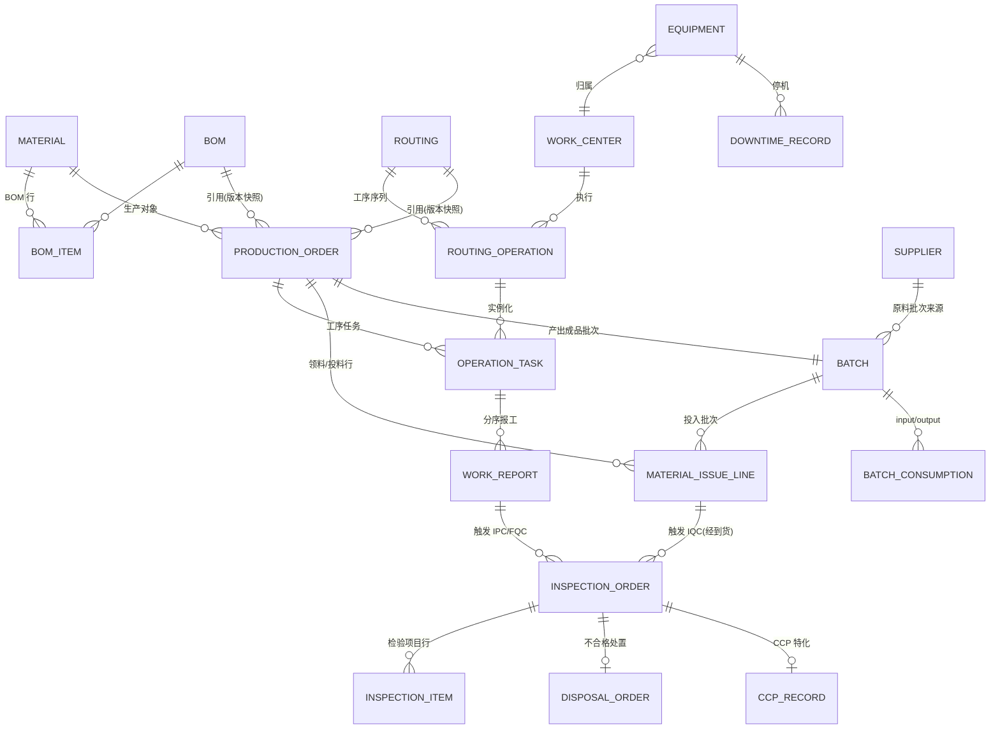
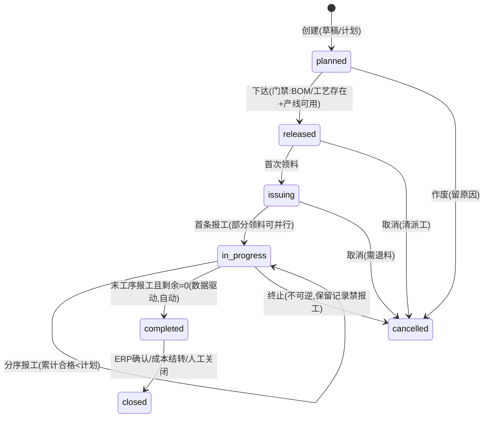
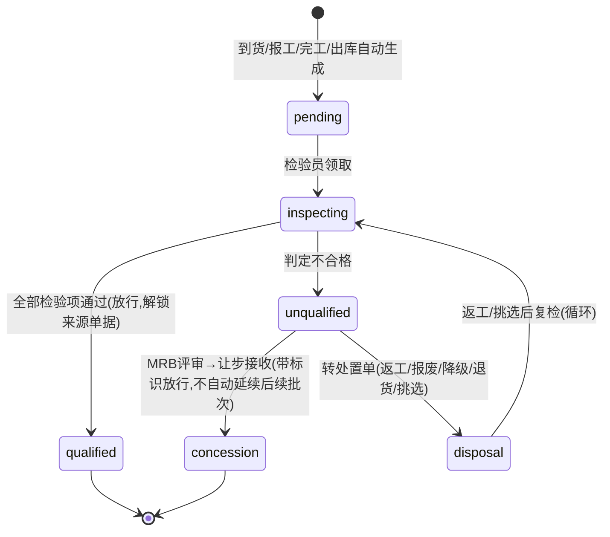
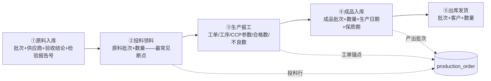

# MES 核心领域模型调研报告 —— 面向 NocoBase 食品行业综合业务系统的 MES 模块

> 研究日期：2026-09-14 | 来源：46 个网络来源 + 本地 NocoBase 2.2.6 源码快照（[`platform/nocobase/MANIFEST.md`](platform/nocobase/MANIFEST.md:1)）| 深度：Exhaustive（4 个并行子任务 + 主任务本地源码核查）

---

## 1. 执行摘要

本报告为「在 NocoBase 低代码平台（UI 可配置 admin 形态）上搭建食品行业综合业务系统的 MES 模块」提供领域模型与 MVP 设计输入。调研覆盖 MES 生产域实体与字段、质量域（IQC/IPQC/FQC/OQC 与不合格品处置）、批次追溯与效期、HACCP/CCP、设备与 OEE、ISA-95/MESA 理论定位、ERP/WMS/PLM/SRM 集成边界，以及轻量与重型 MES 产品对比。证据来源以一手为主：Odoo 18/ERPNext/Microsoft D365 官方文档、中国《食品安全法》原文、FAO HACCP 工具箱、oee.com 权威定义、黑湖官方方案文、开源 MES 实践库（ktg-mes、powder、mes-dome、smart-workshop），以及本仓库内 NocoBase 2.2.6 源码快照的插件清单逐一核查。

**三个最重要的结论：**

1. **实体分两层：生产订单（订单级）+ 工序任务（工序级）是必须先定的建模粒度。** 「工单」在不同系统粒度冲突（Odoo 的 Work Order 是工序级、ERPNext 的 Work Order 是订单级），中文实践库共识为「计划→订单→工单」三层，MVP 取两层即可（[mes-dome](https://github.com/Forelsket-fzy/mes-dome/blob/master/MES-%E8%AE%BE%E8%AE%A1%E6%91%98%E8%A6%81.md)、[smart-workshop](https://github.com/Yzyxtax/smart-workshop-web/blob/main/docs/mes%E4%B8%89%E5%B1%82%E8%AE%A1%E5%88%92_%E8%AE%A2%E5%8D%95_%E5%B7%A5%E5%8D%95%E7%8A%B6%E6%80%81%E4%B8%8E%E6%9D%83%E9%99%90%E8%AE%BE%E8%AE%A1%E6%80%BB%E7%BB%93.md)）。

2. **食品 MES 的差异化核心 = 批次双向追溯 + 投料批次关联 + 效期 FEFO，这三件是 MVP 必选；CCP 工艺参数记录以「人工录入记录表」形态进 MVP，设备自动数采明确不进。** 行业落地路径证据：厂商把 CCP 数采排在第三阶段（6 个月+），第一阶段只做追溯+投料+报工（[工控网食品 MES 选型](https://www.gongkong.com/article/202609/117516.html)）；CCP 记录在数据模型上只是质检单的一个特例（[Odoo QCP 官方](https://www.odoo.com/documentation/19.0/applications/inventory_and_mrp/quality/quality_management/quality_control_points.html)）。

3. **MVP 的 UI 需求约 80% 可由 NocoBase 2.2.6 标准区块覆盖（含甘特图这一超出用户预期清单的标准插件）；真正的自定义缺口集中在两处：批次追溯穿透查询页（多跳递归查询）与报工快速录入（扫码/键盘流式），MVP 前者用「SQL collection + Table 区块」半标准方案过渡，后者用标准 Form 起步。** 本地源码证据见 §3.5。

**关键反面提示（详见 §4）：**「QueoF」经精确检索不存在（域名 queof.com 至今未注册），「简工云」同样查无此产品（疑为「简道云」记忆偏差）——用户原始输入中的这两个产品名不应写入任何对外材料。

---

## 2. 关键发现

1. **生产订单状态机的业界共识是「数量驱动 + 显式状态混合」**：mes-dome 的七状态（已下发/已派工/执行中/部分完工/已完工/已关闭/已取消）以「末工序报工且剩余=0 自动完工」为数据驱动流转；smart-workshop 补充「发布门禁 + RELEASED 后主数据冻结 + 状态向上联动」三个治理机制（[mes-dome](https://github.com/Forelsket-fzy/mes-dome/blob/master/MES-%E8%AE%BE%E8%AE%A1%E6%91%98%E8%A6%81.md)、[smart-workshop](https://github.com/Yzyxtax/smart-workshop-web/blob/main/docs/mes%E4%B8%89%E5%B1%82%E8%AE%A1%E5%88%92_%E8%AE%A2%E5%8D%95_%E5%B7%A5%E5%8D%95%E7%8A%B6%E6%80%81%E4%B8%8E%E6%9D%83%E9%99%90%E8%AE%BE%E8%AE%A1%E6%80%BB%E7%BB%93.md)）。
2. **数量口径存在跨系统冲突，建模必须写死**：powder「仅合格数回写完成数」vs ERPNext「Completed Qty=加工过件数（含不良）」；无权威行业统一的「投入=产出+损耗」公式（[powder](https://github.com/Darren2676/powder/blob/main/docs/%E5%B7%A5%E5%BA%8F%E6%8A%A5%E5%B7%A5%E7%AE%A1%E7%90%86%E6%96%B9%E6%A1%88.md)、[ERPNext Job Card](https://docs.frappe.io/erpnext/job-card)）。本报告给出推荐口径（§3.1.9）。
3. **让步接收（特采）≠ 偏差许可**：前者是「已形成不合格后」的授权放行，后者是「生产前」的事前批准；不合格品处置分三个管理层级（遏制/技术处置/授权决定），返工走独立返工工单（[toojiao](https://qiye.toojiao.com/news/1479.html)）。
4. **批次追溯的正确定模不是「批次表」，而是「批次消耗关系表（多对多）+ 工单锚点」**：一个成品批次消耗多个原料批次、一个原料批次服务多个工单；投料未记批次号是食品追溯链最常见断点（[黑湖小工单](https://www.xiaogongdan.cn/news/food-factory-mes-batch-traceability.html)）。
5. **法规硬约束**：《食品安全法》第 50/51/53 条要求进货查验与出厂检验记录保存「不得少于产品保质期满后六个月；没有明确保质期的不得少于二年」，且记录必须含生产日期/批号/保质期——效期三要素落批次是合规底线（[中国政府网·食品安全法](https://www.gov.cn/zhengce/2015-04/25/content_2853643.htm)）。
6. **OEE = 可用率×性能×良品率（[oee.com](https://www.oee.com/calculating-oee/)）**；极轻量 SaaS MES（黑湖小工单等）不含 OEE，中等以上 MES 标配；MVP 建议：停机记录+可用率先做，性能稼动率二期（依赖节拍主数据）。
7. **ISA-95 的 L3/L4 接口规范直接给出了集成清单**：下行=生产计划+产品定义（BOM/工艺路线）+主数据，上行=生产绩效+实际物料消耗+质量结果（[plcprogramming.io ISA-95 Explained](https://plcprogramming.io/blog/isa-95-explained)）；库存账归 ERP/WMS，MES 只管车间在制品（[codechina 十年集成实战](https://codechina.net/article/weixin_29169899/394778)）。
8. **轻量 vs 重型的核心分界是交付模型**（SaaS 订阅、天级上线、千元级年费 vs 项目制、月级实施、十万到百万级投入），且两端正互相渗透（西门子出了 SMB SaaS 版 Opcenter X）（[西门子官网](https://www.siemens.com/zh-cn/products/opcenter/)、[轻量 MES 横评](https://www.cnblogs.com/A-I-ke/articles/20913024)⚠️疑似软文，仅取多源可交叉事实）。
9. **NocoBase 2.2.6 标准能力比预期强**：官方插件含 Gantt 甘特区块（[`plugin-gantt`](platform/nocobase/packages/plugins/@nocobase/plugin-gantt/src/client/createGanttBlockUISchema.tsx:1)）、多步表单（[`plugin-block-multi-step-form`](platform/nocobase/packages/plugins/@nocobase/plugin-block-multi-step-form/src/client/index.tsx:1)）、SQL 视图集合（plugin-collection-sql）、序列号字段（plugin-field-sequence）、公式字段（plugin-field-formula）、完整工作流引擎（manual 审批/HTTP request/定时/SQL 节点）——这些把「自定义开发」需求压缩到很小范围。
10. **开源 MES 参照**：ktg-mes（Gitee 实测 545 star，提供完整 DB 脚本与实施文档）与 Odoo MRP/ERPNext Manufacturing 的 MO-BOM-WorkCenter-WorkOrder 四级结构，是 NocoBase 建模最直接的免费字段参照（[ktg-mes](https://gitee.com/kutangguo/ktg-mes)、[Odoo 18](https://www.odoo.com/documentation/18.0/applications/inventory_and_mrp/manufacturing.html)、[ERPNext](https://docs.frappe.io/erpnext/manufacturing)）。

---

## 3. 详细分析

### 3.1 MES 核心实体清单与字段

#### 3.1.1 实体总览与关系图

MVP 建议实体（NocoBase collection 命名以英文小写下划线给出）：



图注：`BATCH_CONSUMPTION`（批次消耗关系）在 MVP 实现上可由 `MATERIAL_ISSUE_LINE`（领料行，带投入批次+工单）与 `PRODUCTION_ORDER→BATCH`（产出批次）联查推导，但显式落表对追溯查询更直接——两案取舍见 §3.3.1。

#### 3.1.2 生产订单 `production_order`（订单级）

| 字段 | 类型 | 说明 | 出处 |
|---|---|---|---|
| order_no | string 唯一（建议 sequence 字段） | 编码如 `PO+YYYYMMDD+NNN`，NocoBase 用 plugin-field-sequence 自动生成 | [ERPNext](https://docs.frappe.io/erpnext/work-order)、[powder](https://github.com/Darren2676/powder/blob/main/docs/%E5%B7%A5%E5%BA%8F%E6%8A%A5%E5%B7%A5%E7%AE%A1%E7%90%86%E6%96%B9%E6%A1%88.md) |
| material_id | FK→material | 生产对象（成品/半成品） | ERPNext |
| bom_id + bom_version | FK→bom + 版本快照 | 引用 BOM 并冻结版本；RELEASED 后禁改（Odoo 17+ 路由内嵌 BOM Operations 的简化版） | [smart-workshop 冻结规则](https://github.com/Yzyxtax/smart-workshop-web/blob/main/docs/mes%E4%B8%89%E5%B1%82%E8%AE%A1%E5%88%92_%E8%AE%A2%E5%8D%95_%E5%B7%A5%E5%8D%95%E7%8A%B6%E6%80%81%E4%B8%8E%E6%9D%83%E9%99%90%E8%AE%BE%E8%AE%A1%E6%80%BB%E7%BB%93.md)、[flectic](https://flectic.com/learn/manufacturing-routing) |
| routing_id + routing_version | FK→routing | 工艺路线版本快照 | 同上 |
| planned_qty | decimal | 计划数量 | ERPNext Qty to Manufacture |
| planned_start / planned_end | datetime | 计划起止；Gantt 区块的时间轴字段 | ERPNext、D365 |
| actual_start / actual_end | datetime | 首条报工/完工回写 | powder |
| priority | int | 派工排序 | smart-workshop |
| status | enum | 见 §3.2.1 | mes-dome |
| source_warehouse / target_warehouse | FK→warehouse | 原料仓/成品仓（食品建议加线边仓） | ERPNext 仓库四元组简化 |
| output_batch_id | FK→batch | 产出成品批次（完工时生成/绑定） | 黑湖五节点模型 |
| planned_batch_no | string | 预分配批次号（下达时定，食品「生产日期+班次+产线」规则） | [黑湖](https://www.xiaogongdan.cn/news/food-factory-mes-batch-traceability.html) |
| erp_order_ref | string | 上游 ERP 工单引用（集成用，MVP 可 Excel 导入） | [codechina](https://codechina.net/article/weixin_29169899/394778) |
| 汇总只读：issued_qty / reported_qty / qualified_qty / unqualified_qty / scrap_qty | decimal | 由领料行/报工行聚合（公式字段或 workflow 汇总节点） | powder 累计合格口径 |

#### 3.1.3 工序任务 `operation_task`（工单·工序级，≈「派工单+报工单」合体）

参照 ERPNext Job Card 与 powder process_task：一个生产订单按工艺路线展开 N 条工序任务，每条含 task_no（工序号冗余）、operation_id、work_center_id（冗余名）、assignee（派工对象）、planned_qty、completed_qty（累计合格）、pending_qty、status（未开始/进行中/已完成/已关闭）、actual_start/end、时间定额（setup_time/run_time 快照）。ERPNext 的 Job Card 是字段级最完整参照（[ERPNext Job Card](https://docs.frappe.io/erpnext/job-card)）。

#### 3.1.4 工艺路线与工序 `routing` / `routing_operation`

D365 的四要素模型最完整：①路线（工序顺序）②工序（标准工序库，可全局复用）③工序关系（工时/成本/资源要求的载体，按 物料×路线×站点 匹配）④路线版本（约束唯一活动版本，先批准后激活）（[Microsoft D365 官方](https://learn.microsoft.com/zh-cn/dynamics365/supply-chain/production-control/routes-operations)）。轻量实现可采 Odoo 17+ 方案：路由不是独立主数据，而是 BOM 上的 Operations 行序列，版本随 BOM 走（[flectic](https://flectic.com/learn/manufacturing-routing)）——**MVP 建议采 Odoo 方案（routing 内嵌于 BOM 或 1:1 简单版本），降低主数据复杂度**。

工序关键字段：operation_no（10/20/30）、name、work_center_id、setup_time（准备时间）、run_time（单件/批次加工时间，Odoo Duration Computation 支持按量缩放或固定）、queue/transport_time（MVP 可省）、quality_required（质检点：Fail 阻断工序完工，[erpeek](https://erpeek.ai/blog/odoo-manufacturing-work-orders-quality-checks)）、is_outsource（外协）、time_formula（D365 四种处理公式：标准/产能/批次/资源批次——MVP 固定为批次公式即可）。

#### 3.1.5 工作中心 `work_center`

以 [Odoo 18 官方](https://www.odoo.com/documentation/18.0/applications/inventory_and_mrp/manufacturing/advanced_configuration/using_work_centers.html) 为主轴，MVP 裁剪：name/code、working_calendar（工作时间日历——OEE 与排产的共同分母）、time_efficiency（时间效率%）、capacity（并行产能）、specific_capacities（按产品产能，后期）、oee_target、cost_hour（后期成本）、allowed_employees（技能资质约束）、equipment_ids（关联设备台账）。班组（shift）建模：Odoo 用例是「为每个班次复制工作中心+各自日历」，中文实践（powder）另设 schedules/group 两张主数据挂报工单——**MVP 建议班组只作为报工记录上的字典字段，不做排班模块**。

#### 3.1.6 报工记录 `work_report`

以 powder 实践库为主轴（字段最贴中文车间习惯）：

| 字段 | 类型 | 说明 | 出处 |
|---|---|---|---|
| report_no | string 唯一 | `WR-YYYYMMDD-NNN` | powder |
| operation_task_id / production_order_id | FK(+冗余工序号/名称/产品) | 双锚点，冗余字段便于表格展示 | powder |
| work_center_id | FK 冗余 | | powder |
| qualified_qty | decimal | 本次合格数（**唯一回写 completed_qty 的口径**） | powder |
| unqualified_qty + defect_reason | decimal + 下拉(按工序+产品配置，禁自由文本) | 本次不良数+原因 | powder、mes-dome DefectReason |
| total_qty | decimal 计算列 | =合格+不良 | powder |
| actual_hours（人工）/ machine_hours | decimal | 手输或起止自动算 | powder、ERPNext Time Logs |
| operator_id / shift / group | FK/字典 | | powder |
| actual_start / actual_end | datetime | 首报/末报回写任务与订单 | powder |
| batch_no | FK→batch | 报工挂批次（食品成品/半成品批次在报工或入库环节产生） | [Odoo 批次制造](https://www.odoo.com/documentation/18.0/applications/inventory_and_mrp/manufacturing.html) |
| approval_status | enum 草稿/待审/已审（可反审） | 审批通过才回写汇总；反审逆向扣减 | powder |
| excess_reporting_ratio 校验 | 规则 | 报工上限=计划×(1+比例)−已完成 | powder |

报工后自动动作（mes-dome 事件清单）：更新工单完工数量（剩余=0 自动完工）→ 写设备运行记录 → 发布报工完成事件 → 触发 FQC 检验任务 / WMS 倒冲或入库策略（低风险产品报工即触发、高风险等质检合格）（[mes-dome](https://github.com/Forelsket-fzy/mes-dome/blob/master/MES-%E8%AE%BE%E8%AE%A1%E6%91%98%E8%A6%81.md)）。

#### 3.1.7 物料领用与 BOM 消耗回冲 `material_issue` / `material_issue_line`

领料行（ERPNext Required Items 口径 + 黑湖投料批次）：production_order_id、material_id、required_qty（BOM×计划量自动算）、issued_qty（实领）、returned_qty（退料）、consumed_qty（实际消耗=倒冲结果）、**input_batch_id（投入批次——追溯链核心，缺失即断链）**、source_doc（领料/补料/退料/倒冲 行类型）、warehouse（建议线边仓）、operator、issued_at。超领/欠领：ERPNext 以 Transferred vs Consumed 差额形成台账；超限额领料须另编凭证注明原因审批（[百度百科·倒冲领料（引金蝶）](https://baike.baidu.com/item/%E5%80%92%E5%86%B2%E9%A2%86%E6%96%99/9881053)）。

**倒冲（Backflush）三种方式与适用判断**：预冲（按计划量提前冲）/倒冲（按实际完工量）/完全反冲（按订单计划量，纯流程制造）；扣料时点可配「入库倒冲/工序汇报倒冲」（[百度百科·倒冲领料](https://baike.baidu.com/item/%E5%80%92%E5%86%B2%E9%A2%86%E6%96%99/9881053)、[CSDN SAP PP](https://blog.csdn.net/weixin_42137700/article/details/124986721)）。**食品行业判断**：低值辅料/包材适合倒冲（Odoo：BOM 组件行指定工序后该工序完工即倒冲，[erpeek](https://erpeek.ai/blog/odoo-manufacturing-work-orders-quality-checks)）；**关键原料（追溯对象）必须实领实记批次，禁用倒冲**——批次追溯与倒冲天然矛盾，倒冲无法保证批次对应精度。MVP 建议：全部走「按 BOM 展开的实领 + 批次必填」，倒冲留作后期辅料优化项。

#### 3.1.8 质检、批次、设备实体

质检单与检验行、批次与消耗关系、CCP、设备/点检/保养/停机的字段表分别见 §3.2.2、§3.3、§3.4。

#### 3.1.9 数量字段口径（统一约定，写死进字段说明）

| 口径 | 定义 | 推荐口径依据 |
|---|---|---|
| 计划数 planned_qty | 订单/工序任务下达的目标量 | ERPNext/powder/smart-workshop 三方一致 |
| 总产出 total_qty | 本次报工产出 = 合格数 + 不合格数 | powder（唯一给出显式恒等式的来源） |
| 合格数 qualified_qty | 检验通过可流转量；**累计合格 = 完成数 completed_qty**（本报告推荐） | powder 明确「只有合格数回写完成」 |
| 不良数 unqualified_qty | 检出不合格（处置前中间态），带原因分类；可细分返工数/报废数/让步数（处置后） | powder + toojiao 处置三层级 |
| 报废数 scrap_qty | 不可修复，转入报废仓 | ERPNext Scrap Items、Odoo |
| 返工数 rework_qty | 走独立返工工单，从首道或指定工序重做 | [威铝知识库](http://wiki.jmvictor.com/pages/viewpage.action?pageId=47580674) |
| 工序损耗 process_loss | = 计划数 − 完成数 − 待报数（仅在 pending=0 时计入） | [ERPNext v16 Pending Qty 语义](https://docs.frappe.io/erpnext/job-card) |
| 良品率 | = 合格数 / 总产出（OEE 的 Quality 因子） | [oee.com](https://www.oee.com/calculating-oee/) |

⚠️ **跨系统冲突（必须写死）**：ERPNext 的 Completed Qty 是「加工过件数（含不良）」口径，与 powder 相反；本报告推荐 powder 口径（合格数），理由：与 OEE 良品率因子、食品「以合格产出论完工」的业务直觉一致。⚠️ 「投入=产出+损耗」无权威行业公式原文，以上恒等式为跨来源合成，落地前需业务确认。

### 3.2 状态机

#### 3.2.1 生产订单（用户要求口径 → 业界证据映射）



| 状态 | 进入条件 | 业界证据对应 |
|---|---|---|
| planned 计划/草稿 | 手工或 ERP 计划生成 | smart-workshop CREATED |
| released 已下达 | 下达动作过三类门禁（工艺存在→产线可用→人员技能）；下达后 BOM/工艺路线冻结，数量/时间仍可改 | smart-workshop 发布门禁+冻结；mes-dome Released |
| issuing 领料中 | 首次领料（部分领料允许，与执行可重叠） | ERPNext Transferred 数量驱动；用户口径的显式状态 |
| in_progress 执行中/报工中 | 首条报工；期间分序报工 | mes-dome InProgress + PartialComplete（部分完工可作 in_progress 的显示属性而非独立状态） |
| completed 已完工 | 末工序报工且剩余数量=0，**自动触发无需人工点击** | mes-dome Completed（关键结论） |
| closed 已关闭 | 完工后回传 ERP 确认/成本结算/人工关闭——**完工=生产事实完成，关闭=业务流程终结，两者必须分开** | mes-dome Completed vs Closed |
| cancelled 已作废 | 上游取消或人工终止；保留原因、禁止报工 | mes-dome Cancelled；smart-workshop TERMINATE 不可逆 |

补充治理规则（smart-workshop，建议采纳）：状态向上联动（工序任务事实驱动订单状态）、决策向下级联（订单作废级联终止任务）、RUNNING 后单据全冻结、RELEASED→CREATED 允许「撤销下达」回退（清除下发结果）。

#### 3.2.2 质检单 `inspection_order`



关键机制：**检验挂起库存单据**——ERPNext 中开启检验的物料，收货/发货单 Submit 被阻止直至 QI 完成（[ERPNext Quality Inspection](https://docs.frappe.io/erpnext/quality-inspection)）；Odoo 失败检查按「失败指令」生成独立流转的质量警报单（[Odoo Quality](https://www.odoo.com/documentation/19.0/applications/inventory_and_mrp/quality.html)）。

#### 3.2.3 不合格品处置 `disposal_order`

三管理层级（[toojiao](https://qiye.toojiao.com/news/1479.html)）：①遏制与接收决定（挑选/拒收）②技术处置（返工/返修/报废/降级）③授权决定（让步接收/偏差许可）。字段：disposal_no、source_inspection_id、defect_desc/grade、batch/qty/order 影响、disposal_type（退货/挑选/返工/返修/报废/降级/让步）、方案说明、MRB 评审人（多签）、审批人/时间、复检要求与结果、责任方、CAPA 关联。**返工=完全满足原规格；返修=恢复可用未必符原要求**；返工后须复检原不合格项+验证受影响关联特性。MRB 是跨职能评审机制（质量/工程/生产/PMC），但不能替代客户/法规要求的批准。

### 3.3 食品行业特有

#### 3.3.1 批次追溯链：五节点 + 工单锚点 + 消耗关系表

黑湖官方方法（[黑湖小工单](https://www.xiaogongdan.cn/news/food-factory-mes-batch-traceability.html)）：**不是建一张孤立批次表，而是把批次号挂到每次物料流转动作上**，五个节点各自记录：



- **锚点=工单**：每批产品的投料/报工/质检/产出挂同一工单；BOM 定义「该用什么用多少」，批次记录回答「这批实际用了哪批料用了多少」，对照即投料合规检查。
- **批次消耗关系表 `batch_consumption`**（多对多核心表）：work_order_id（锚点）、material_id、input_batch_no、output_batch_no（完工回填）、quantity_consumed（支持超领/补料/退料多行，行类型）、bom_std_quantity（理论量对照→损耗核算，[工控网](https://www.gongkong.com/article/202609/117516.html)）、operation_id、operator_id、consumed_at、source_doc、remark（返工回用标记——食品程序文件要求返工回用也记批次对应，[食品伙伴网](https://www.foodmate.net/zhiliang/guanli/173778.html)）。
- **正反向追溯=同一套记录两个查询方向**：正向（原料批次→成品批次→客户，召回圈定去向）；反向（成品批次→原料批次→供应商→验收结果，客诉定位）（[黑湖·追溯与召回](https://www.xiaogongdan.cn/news/food-quality-traceability-recall-management.html)）。国际基准 EU 178/2002 第 18 条「one step back, one step forward」（[FSAI](https://www.fsai.ie/business-advice/starting-a-food-business/traceability)）。
- **批号编码**：无国标，企业自定；实践惯例：原料沿用供应商批号（无则「入库日期+供应商+序号」自编）、成品=生产日期+序列信息（[黑湖](https://www.xiaogongdan.cn/news/food-factory-mes-batch-traceability.html)）。NocoBase 用 plugin-field-sequence 自动生成内部批次号 + 允许录入供应商批号。
- **追溯时效**：中国法规未规定硬性时限；行业程序文件自设「常规 2 小时初步结论、重大 1 小时锁定」、商超验厂要求数小时内出记录、演练至少每年/每半年一次（[食品伙伴网](https://www.foodmate.net/zhiliang/guanli/173778.html)、[黑湖](https://www.xiaogongdan.cn/news/food-quality-traceability-recall-management.html)）。
- **记录保存**：法规硬约束——进货查验/出厂检验记录保存「≥保质期满后 6 个月；无明确保质期≥2 年」（[食品安全法第 50/51/53 条](https://www.gov.cn/zhengce/2015-04/25/content_2853643.htm)）。

**NocoBase 建模决策建议**：MVP 显式建 `batch_consumption` 表（领料行冗余出一张消耗关系，或在领料行直接落 input_batch + 工单锚点、完工回填 output_batch），不建树形血缘表——穿透查询用 §3.5 的 SQL collection 方案。

#### 3.3.2 效期管理

- 三要素落批次：生产日期、保质期（时长）、失效日期=生产日期+保质期；批次状态含 近效期/过期/锁定（[春喜铜](https://docs.chunxitong.com/mes/expiry-fefo)）。
- FEFO（先到期先出）：出库/投料优先挑失效日期最近批次，防新批次先出旧批次积压过期（[微软 D365 有限保质期官方](https://learn.microsoft.com/zh-cn/dynamics365/supply-chain/master-planning/planning-optimization/shelf-life)）。
- MVP 实现：领料界面对同物料多批次按失效日期升序提示（表格默认排序即达 80% 效果）+ 临期预警（失效日期 − N 天 触发 workflow 通知）+ 过期批次状态锁定禁止领用。

#### 3.3.3 HACCP/CCP 是否进 MVP：判断

**结论：以「人工录入的 CCP 记录表」进 MVP；设备自动数采（PLC/SCADA/金检机联动/温度曲线）明确不进。** 依据四条：

1. 行业落地路径证据：食品 MES 三阶段中 CCP 数采排在第三阶段（6 个月+），第一阶段=批次追溯+投料防错+报工（[工控网](https://www.gongkong.com/article/202609/117516.html)）。
2. 数据模型代价极小：CCP 记录≈质检单特例（检验项=CCP 参数、判定基准=关键限值 CL、读数=监控值、检验员=监控人、偏差→不合格→纠偏措施字段）。Odoo Measure 检查（Norm+Tolerance）已验证该建模（[Odoo QCP](https://www.odoo.com/documentation/19.0/applications/inventory_and_mrp/quality/quality_management/quality_control_points.html)）。
3. 合规价值高：FAO 要求 CCP 尽可能连续监测、监控人须培训、记录须指定人员审查（[FAO HACCP 工具箱·原则 4](https://www.fao.org/good-hygiene-practices-haccp-toolbox/haccp/step-9-monitoring-critical-limits/zh)）；验厂时 CCP 记录可查是准入门槛（[黑湖](https://www.xiaogongdan.cn/news/food-quality-traceability-recall-management.html)）。
4. 同档位产品对标：黑湖小工单的质检采集也仅到「扫码报工录合格/不良/不良类型 + CCP 人工记录」层级。

MVP 落地：`ccp_definition`（CCP 编号/名称/工序/关键限值 CL 上下限/监控频率）+ `ccp_record`（挂工单+批次，人工录监控值，超限标红→纠偏措施+复查人）。不含：CIP 互锁、金检机联动、连续温度采集。

### 3.4 设备、点检保养与停机/OEE（MVP 裁剪）

| 实体 | MVP 取舍 | 关键字段 | 出处 |
|---|---|---|---|
| 设备台账 `equipment` | **MVP 简版**（编号/名称/型号/产线归属/状态/启用日期/厂商） | 完整版含 ABC 分类、技术资料子表、变动记录 | [万界星空](https://www.cnblogs.com/mes888/p/18743180)、[Eamx](https://www.eamx.com.cn/asset-accounting.html) |
| 点检 | **MVP 最简**（点检项目+结果记录：设备/班次/执行人/正常/异常描述） | 点检标准（判定值）/方法（看听摸试）/周期（每班）；「谁用谁点检责任到人」 | [CSDN MES 系列](https://blog.csdn.net/u013097500/article/details/161789547)、[Ax-mes](https://www.cnblogs.com/axmes/p/18267255) |
| 保养计划/工单 | **后期**（P2） | 周期（运行 500h/季度）、到期预警、备件领用 | [万界星空](https://www.cnblogs.com/mes888/p/18743180) |
| 报修维修 | **后期**（P2；MVP 用工单备注或 helpdesk 模块替代） | 报修→派工→维修→验收 | [中皓](https://www.sohu.com/a/1070050688_122731606) |
| 停机记录 `downtime_record` | **MVP 保留**（OEE 可用率的数据源） | 开始/结束/时长/原因分类（一级 7 类：设备故障/换型/待料/人员/质量调整/计划性/其他）/设备/工单可空 | [TeepTrak](https://www.teepchina.com/zh-hans/tingji-yuanyin-fenlei-fangfa-oee/) |

**OEE**（[oee.com 权威定义](https://www.oee.com/calculating-oee/)）：OEE = 可用率(Availability=运行时间/计划生产时间) × 性能稼动率(Performance=理想节拍×总计数/运行时间) × 良品率(Quality=合格数/总计数)；世界级基准 85%。数据源映射：可用率←停机记录+班次日历；性能←报工计数+产品节拍主数据；良品率←报工/质检数量。**判断**：极轻量 SaaS MES 不含 OEE（黑湖小工单/简道云/轻流核心只做工单+报工+看板，[横评](https://www.cnblogs.com/A-I-ke/articles/20913024)⚠️软文标注），中等以上标配（MESA-11 绩效分析，[PlantStar](https://plantstar.com/blog/11-functions-of-mes-based-on-mesa-figure)）。**MVP 建议**：停机记录+可用率看板（Chart 区块）先行；性能稼动率与完整 OEE 后期（依赖节拍主数据与自动计数）。

### 3.5 MES 特有 UI 视图需求 × NocoBase 区块能力边界

**NocoBase 2.2.6 标准能力清单（本地源码一手证据，[`platform/nocobase`](platform/nocobase/MANIFEST.md:1) 快照 v2.2.6，2026-09-06）**：

- 区块插件：Table/Form/Details（plugin-client 核心）、List（plugin-block-list）、Grid Card（plugin-block-grid-card）、Tree（plugin-block-tree）、Kanban（plugin-kanban）、Calendar（plugin-calendar）、**Gantt（[`plugin-gantt`](platform/nocobase/packages/plugins/@nocobase/plugin-gantt/src/client/createGanttBlockUISchema.tsx:1)，含 Designer/Settings）**、**Multi-step form（[`plugin-block-multi-step-form`](platform/nocobase/packages/plugins/@nocobase/plugin-block-multi-step-form/src/client/index.tsx:1)，StepsForm）**、Markdown、IFrame、Map、Charts、Data Visualization(ECharts)
- 字段插件：**sequence（序列号——单号/批号自动生成）**、**formula（公式——数量恒等式自动计算）**、sort、m2m-array、snapshot、attachment、china-region
- 动作插件：bulk-edit/bulk-update、**import（Excel 导入——ERP 工单导入）**、export、duplicate、custom-request、print、multi-keyword-filter
- 工作流插件（[`plugin-workflow*`](platform/nocobase/packages/plugins/@nocobase/plugin-workflow/package.json:1)）：**manual（人工审批节点——让步接收/处置评审）**、request（HTTP）、SQL、定时、loop、parallel、aggregate（聚合回写）、json-query、date-calculation
- 数据源插件：**collection-sql（SQL 视图集合——追溯穿透查询的载体）**、external data source manager、fdw
- 其他：public-forms（对外表单）、mobile（移动端）、audit-logs、acl

**视图需求覆盖度与自定义区块优先级**：

| # | MES 视图需求 | 标准区块方案 | 缺口判断 | 优先级 |
|---|---|---|---|---|
| 1 | 工单列表/详情（含工序任务子表、报工历史子表） | Table + Details + 子表格区块（标准） | 无缺口 | **MVP·标准** |
| 2 | 工序进度看板 | **Gantt 区块**（工序任务按计划/实际时间条，标准插件）+ Kanban（按状态列分组，标准） | 矩阵热力图（工单×工序格子视图）超出标准 → 后期自定义 | **MVP·标准**（Gantt+Kanban）；矩阵热力图 P2 |
| 3 | 产线状态/车间大屏 | Chart 区块（ECharts：在制工单数/今日合格率/停机帕累托）+ 筛选联动 | 自动刷新实时大屏（WebSocket 推送）超出标准 → 后期自定义或 iframe 嵌独立页 | MVP·标准（手动刷新）；实时大屏 P3 |
| 4 | 报工快速录入 | Form 区块（移动端 plugin-mobile；数字字段；不良原因下拉） | 扫码枪流式录入（焦点自动跳格/扫码带出批次）、防呆键、离线报工超出标准 → 后期自定义 action | **MVP·标准**（Form 起步）；扫码流式 P1.5/P2（演示后最可能的首个自定义） |
| 5 | 批次追溯穿透查询页 | **SQL collection（plugin-collection-sql）+ Table 区块**：两条 SQL（正向：原料批次→消耗关系→产出批次→出库；反向：成品批次→工单→投料批次→供应商）+ 关键字筛选 | ①递归多跳（批次经半成品多层展开）单条 SQL 写起来深但可行（CTE 递归）；②图形化穿透树（节点点击逐层展开）超出标准 → 自定义区块 | **MVP·半标准**（SQL collection 两向单跳查询，可完整演示穿透）；图形化树 P2 |
| 6 | 质检单录入（检验项目行） | Form + 子表（检验项/读数/判定），公式字段自动行判定（数值上下限） | AQL 抽样表内置超出标准 → MVP 不做，三档（全检/比例抽检/免检）配置 | MVP·标准；AQL P2 |
| 7 | 不合格品处置审批 | Workflow manual 节点（多级审批+条件分支：让步需质量主管） | 无缺口 | MVP·标准 |
| 8 | 效期/临期预警 | Table 默认按失效日期排序（FEFO 提示）+ workflow 定时扫描触发通知 | 无重大缺口 | MVP·标准 |
| 9 | 完工入库/成品批次登记 | Form + 动作按钮（自定义 action 或 workflow 联动回填 output_batch） | 弱缺口：跨表回填用 workflow aggregate/SQL 节点可实现 | MVP·标准+低代码配置 |

**结论**：MVP 演示所需视图 **全部可用标准区块 + SQL collection + 工作流配置实现，零硬编码自定义区块**；真正的自定义开发按优先级排序为：① P1.5 报工扫码流式录入（生产可用性门槛）→ ② P2 批次追溯图形化穿透树 → ③ P2 工序矩阵热力图/完整 AQL → ④ P3 实时大屏与 OEE 自动采集。

### 3.6 与 ERP / WMS / PLM / SRM 的集成点

| 系统 | 方向 | 传输内容 | 典型方式 | MVP 策略 |
|---|---|---|---|---|
| ERP（生产计划/工单来源） | ERP→MES：工单（产品/数量/交期）+主数据（物料/BOM）；MES→ERP：完工汇报（合格数、报废数单列、工时）+领退料/入库单据 | API（金蝶云星空 WebAPI/用友）、中间表、文件；幂等+业务流水号；实时性分级：工单 5min、领料实时、报工小时级、对账每日 | [codechina](https://codechina.net/article/weixin_29169899/394778)、[知乎 6 场景](https://zhuanlan.zhihu.com/p/2074881452580270090) | **plugin-action-import Excel 导入工单 + 手工创建**；NocoBase 侧建 ERP 单据引用字段（erp_order_ref）+ 预留 workflow-request HTTP 节点出站 |
| WMS（领料/完工入库） | MES 发领料/备料请求→仓库扫码出库记账；MES 完工→成品入库单→仓库确认入账。**库存账归 ERP/WMS，MES 只管车间在制品/线边仓** | 出入库单据回传扣账；完工入库建议「MES 提交+仓库确认」，24h 无回执告警 | [codechina](https://codechina.net/article/weixin_29169899/394778)、[知乎 MES/WMS 边界](https://zhuanlan.zhihu.com/p/2049585687347958265) | MVP 内建简化库存（批次×仓库现量表）模拟；后期 API 对接 |
| PLM（工艺路线来源） | EBOM(设计)→MBOM(采购/成本)→执行 BOM(工艺路线+工序物料+SOP)，发布-订阅单向同步+版本号；变更走 ECR/ECO 三端同步。**BOM 权威源在 PLM，无 PLM 的中小企业落在 ERP** | 版本化发布；无 PLM 时 Excel 导入也常见 | [jishuzhan](https://jishuzhan.net/article/2093233120645140482)、[CSDN 断点](https://blog.csdn.net/JZC_xiaozhong/article/details/164221173) | MVP：BOM/工艺路线在 NocoBase 内维护（自为权威源）；预留版本字段 |
| SRM/采购（原料批次来源） | 到货通知单（PO+供应商批次+数量）触发 IQC 检验单（按物料+类型自动匹配质检方案）；IQC 结果回写供应商绩效（来料合格率） | 到货单驱动检验单；供应商批次沿用其批号或「入库日期+供应商+序号」自编 | [芋道 MES IQC](https://doc.iocoder.cn/mes/qc/iqc/)、[黑湖](https://www.xiaogongdan.cn/news/food-factory-mes-batch-traceability.html)、[OTDMES](https://www.otdmes.com/insights/mes-quality-gates-iqc-fai-ipqc-oqc/) | MVP：采购到货在 NocoBase 内建（或复用平台已有采购/进销存模块），批次+供应商主数据对齐 |

ISA-95 的接口规范表述（L3/L4）：下行=生产计划+产品定义+主数据；上行=生产绩效+实际物料消耗+质量结果（[plcprogramming.io](https://plcprogramming.io/blog/isa-95-explained)）——本表即其工程化展开。独立 MES 最小集成集五件套：①物料主数据 ②BOM 单向 ③工单下发 ④完工回传 ⑤领退料/入库单据（[codechina](https://codechina.net/article/weixin_29169899/394778)）。

### 3.7 行业参考：轻量 vs 重型与 MVP 取向

**「QueoF」验证结论**：带引号精确检索 `"QueoF"` 与 `"QueoF" MES`，9 条结果全部为字母游戏/玩家主页/翻译站，无任何软件项目；whois 显示 queof.com 域名至今未注册（[whois](https://www.whois.com/whois/queof.com)）。**判定：不存在名为 QueoF 的开源 MES，疑为拼写/记忆偏差**。相近真实项目：ktg-mes、smart-mes、星空 MES（开源）；QAD（真实但是商用闭源）。**「简工云」同样精确检索无结果**，最接近的真实产品是帆软旗下零代码平台「简道云」（其「生产小工单」为零代码 MES 方案）。

| 维度 | 轻量互联网型 MES | 重型传统 MES |
|---|---|---|
| 交付模型（核心分界） | SaaS 订阅、天/小时级上线、千元-万元级/年 | license+驻点实施、月级周期、十万-百万级（实施费可达软件费 3-5 倍） |
| 功能广度 | 工单/报工/看板/追溯为主；普遍不含 APS、AGV、设备直连数采、自动互锁 | MOM 全家桶（MES+QMS+APS+智能+厂内物流）、CCP 自动数采、eBR |
| 数据采集 | 手工/扫码报工（微信/PDA） | PLC/SCADA/OPC-UA 设备直连 |
| 目标企业 | 50-200 人首选（黑湖官方直言重型方案「50 人团队跑不起来」） | 千人级工厂/集团 |
| 代表 | 黑湖智造/黑湖小工单、简道云生产小工单、新核云（云 ERP+MES 一体）、轻流 | 西门子 Opcenter（含食品对口的 Execution Process 流程制造版与 RD&L 配方研发）、罗克韦尔 FactoryTalk、GE Proficy、艾普工华、佰思杰、鼎捷 |
| 边界动态 | 两端互相渗透：西门子出 SMB SaaS 版 Opcenter X；黑湖智造长出 APS/SPC/TPM 走平台化 | |

（证据：[黑湖官网/官方博客](https://blog.blacklake.cn/hei_hu_zhi_zao_de_gong_neng_he_shi_yong_hang_ye/)、[西门子](https://www.siemens.com/zh-cn/products/opcenter/)、[横评](https://www.cnblogs.com/A-I-ke/articles/20913024)⚠️软文仅取交叉事实、[新核云](https://xinheyun.com)）

**开源参照**：ktg-mes（Gitee 实测 545 star，RuoYi-Vue 栈，含完整 DB 脚本/实施文档/软件说明书——表结构可直接参考，[gitee](https://gitee.com/kutangguo/ktg-mes)；注意 CSDN 宣传文称 4.7K star 与仓库页不符，以仓库为准）；Odoo MRP（MO-BOM-WorkCenter-WorkOrder 四级结构、Kit/副产物/批号制造/委外三模式/Shop Floor/IoT Box，[Odoo 18](https://www.odoo.com/documentation/18.0/applications/inventory_and_mrp/manufacturing.html)）；ERPNext Manufacturing（Job Card 字段级最完整，[官方](https://docs.frappe.io/erpnext/manufacturing)）；芋道 ruoyi-vue-pro MES（IQC/IPQC/OQC/RQC+质检方案分层印证，[目录](https://doc.iocoder.cn/mes/qc/iqc/)）。

**MVP 应取哪端：明确取轻量端。** 证据：① 行业三阶段路径第一阶段=物料+BOM+投料防错+批次追溯+报工（[工控网](https://www.gongkong.com/article/202609/117516.html)）；② 食品 7 项必备能力中 5 项（追溯/配方/防错/效期/报工）轻量端可覆盖；③ 预算与实施周期错配是最大踩坑（50 人工厂 30 万上重型 MES 三个月吃灰案例）；④ 十年从业者判断「不少中小企业 ERP 和 MES 没有同时上的必要，把生产执行和批次追溯做好，轻量 MES 就能满足」（[codechina](https://codechina.net/article/weixin_29169899/394768)）。**同时吸收重型端的模型命名智慧**：Opcenter 的 Execution Process/RD&L/eBR 概念可作为食品 MES 领域模型的高层参照，但不进 MVP。

### 3.8 MVP 最小闭环 Workflow（可演示脚本）

```mermaid
flowchart TD
    S1[1.下达生产订单<br/>选物料+BOM+工艺路线,数量100<br/>状态:planned→released,预分配成品批次号] --> S2[2.领料/投料<br/>按BOM展开,逐行选原料批次<br/>FEFO提示,写批次消耗input_batch]
    S2 --> S3[3.分序报工<br/>工序10:合格60/不良2<br/>工序20:合格58/不良1,记工时<br/>自动触发IPC]
    S3 --> S4[4.FQC成品质检<br/>生成检验单,录检验项读数<br/>判定:合格58]
    S4 --> S5[5.完工入库<br/>合格数入成品仓<br/>确认成品批次+生产日期+保质期<br/>回填output_batch,状态completed]
    S5 --> S6[6.批次反查演示<br/>从成品批次→工单→投料行→<br/>原料批次→供应商→IQC结论<br/>(SQL collection穿透查询)]
    S6 --> S7[7.关闭工单<br/>数量结转,状态closed]
    S4 -.不合格.-> D[处置单:返工/报废/让步<br/>workflow manual审批]
    D -.复检通过.-> S5
```

分步骤表（每步含 NocoBase 实现方式）：

| 步骤 | 操作 | 数据动作 | NocoBase 实现 |
|---|---|---|---|
| 1 下达 | 创建订单（物料/数量 100/BOM/路线/计划起止），点「下达」 | 状态 planned→released；展开工序任务；按 BOM 生成应领料行；预分配成品批次号 | Form + 自定义动作（workflow：状态流转+子表生成） |
| 2 领料 | 逐行选择原料批次（FEFO 排序提示）、录实领数 | 写 material_issue_line（input_batch）；批次现量扣减；状态 released→issuing | Table 行内编辑 + 批次选择（关联字段过滤） |
| 3 报工 | 按工序报合格/不良/工时，不良原因下拉 | 写 work_report；completed_qty 累计合格；可触发 IPC 质检任务；状态 →in_progress | 移动端 Form + workflow 触发质检单生成 |
| 4 FQC | 对完工产出录检验项读数，判定 | inspection_order 判定合格 58；不良走处置单（workflow manual 审批：返工/报废/让步） | Form 子表 + 公式字段判定 + 审批流 |
| 5 完工入库 | 确认入库 | 成品批次绑定（生产日期+保质期计算失效日期）；output_batch 回填消耗关系；库存入成品仓；状态 →completed | Form + workflow（回填+库存聚合） |
| 6 追溯反查 | 输入成品批次号 | 递归查：成品批次→工单→投料行→原料批次→供应商→入库/IQC | SQL collection + Table（双向两条查询） |
| 7 关闭 | 数量结转、关账 | 状态 →closed；锁定单据 | 动作按钮 + 状态机校验 |

演示亮点台词锚点：「30 秒级客诉定位」（行业目标转述，[工控网](https://www.gongkong.com/article/202609/117516.html)）、「正反向同一套记录两个方向」（[黑湖](https://www.xiaogongdan.cn/news/food-factory-mes-batch-traceability.html)）。

---

## 4. 相左观点与风险（Contrarian Views）

1. **低代码平台做 MES 的结构性风险（本报告最重要的反面观点）**：NocoBase 方案的本质是「轻量端再降一档」——比黑湖小工单更灵活但也更「散」。风险点：①并发报工的事务一致性（多工位同时报工对 completed_qty 聚合回写的竞态，workflow aggregate 节点在高频写场景的可靠性未验证）；②批次消耗多对多关系在无代码关联字段里的表达力上限（本报告用显式关系表规避，但 UI 配置复杂度上升）；③性能——追溯递归 CTE 在数据量大时的表现需实测。缓解：MVP 数据量小（单厂数月）风险可控；把「报工→回写」做成单一 workflow 链路保证顺序性；P1.5 用自定义 action 替换高频路径。
2. **「拿通用 MES 上食品车间」被多方列为头号踩坑**（缺批次效期/配方防错/清洗互锁会上线后大量手工补录，[工控网](https://www.gongkong.com/article/202609/117516.html)，⚠️厂商软文属性但与黑湖官方文交叉可采）。对 NocoBase 方案的启示：批次+效期必须做进数据模型底座（本报告已如此设计），不能靠后期加字段。
3. **数量口径无行业权威**（§3.1.9）：若业务方惯用 ERPNext「含不良完成数」口径，本报告推荐的 powder 口径会导致与既有 ERP 对账歧义——上线前必须与业务书面确认口径。
4. **来源可信度分层**：本报告黑湖官方内容（方法文/案例/「1/10 成本」/农夫山泉客户）带明确厂商立场；cnblogs 六款横评被平台标注疑似商业推广；ktg-mes 的 star 数宣传与仓库不符——以上均已在文中标注 ⚠️ 且仅取可交叉验证的事实。
5. **CCP 人工录入的局限**：FAO 强调「尽可能连续监测」（[FAO](https://www.fao.org/good-hygiene-practices-haccp-toolbox/haccp/step-9-monitoring-critical-limits/zh)），人工记录存在补录/造假风险，验厂审核方（尤其出口客户）可能不认可纯人工 CCP 记录——MVP 若面向出口食品企业，需在路线图上明确自动数采的时间表。
6. **「追溯 2 小时/1 小时」非法规硬性要求**，是行业程序文件自设值；若客户验厂标准更高，MVP 的手工穿透查询可能不满足，需要预设演练脚本与 SLA 承诺。
7. **ERP 一体化 vs 独立 MES 之争无定论**：金蝶/用友系「ERP 自带 MES」是存量中小厂主流，本报告的 NocoBase 单体 MVP 实际选择了第三条路（自建轻量）——与既有 ERP 并存时会出现「两套工单」双录风险，集成（哪怕 Excel 级）必须在第一期就打通（[横评](https://www.cnblogs.com/A-I-ke/articles/20913024)、[codechina](https://codechina.net/article/weixin_29169899/394778)）。

---

## 5. 开放问题

1. 金蝶云星空/用友 U8 生产订单状态枚举官方帮助需登录，未获取原表——MVP 状态机以开源系统+实践库为准，对接具体 ERP 时需补查（子任务 A 遗留）。
2. GB 14881-2025 与 2013 版对批次/记录条款的差异未展开；GB/T 2828.1（AQL）抽样表原文未深读——《食品召回管理办法》分级与启动时限数字未取原文，若做召回模块需补查（子任务 B 遗留）。
3. 批次合并/拆分规则（同物料不同批次混合后新批号）无权威来源，需与目标工厂确认（子任务 B 遗留）。
4. 食品行业停机分类（如 CIP 原位清洗归「计划性停机」）为推测，需行业专家确认（子任务 C 遗留）。
5. MESA-11 「Operations/Detail Scheduling」项靠二手交叉印证补全，精确引用需查 mesa.org 官方白皮书原文（子任务 C 遗留）。
6. 罗克韦尔 FactoryTalk、GE Proficy、和利时的模块级清单未获官方一手（子任务 D 遗留）；ktg-mes star 数矛盾原因未知。
7. NocoBase workflow aggregate/SQL 节点在报工高频写入下的并发可靠性、SQL collection 递归 CTE 的性能——需在 MVP 原型阶段实测（本报告提出，无现成证据）。
8. 中文 ERP「派工单」作为独立流转单据的字段级定义未找到——本报告以工序任务实体替代，需业务确认是否需要独立派工单据（子任务 A 遗留）。

---

## 6. 来源

**一手来源（法规/官方/标准/开源仓库）**

| # | 来源 | 类型 | URL |
|---|---|---|---|
| 1 | 中国政府网·食品安全法全文 | 法规一手 | https://www.gov.cn/zhengce/2015-04/25/content_2853643.htm |
| 2 | FAO GHP+HACCP 工具箱（CCP 监控·原则4） | 国际组织一手 | https://www.fao.org/good-hygiene-practices-haccp-toolbox/haccp/step-9-monitoring-critical-limits/zh |
| 3 | Odoo 18 官方文档（Manufacturing/Work Centers） | 开源系统一手 | https://www.odoo.com/documentation/18.0/applications/inventory_and_mrp/manufacturing.html 、 …/using_work_centers.html |
| 4 | Odoo 19 官方 Quality/QCP | 开源系统一手 | https://www.odoo.com/documentation/19.0/applications/inventory_and_mrp/quality.html 、 …/quality_control_points.html |
| 5 | ERPNext 官方（Work Order/Job Card/Quality Inspection/Manufacturing） | 开源系统一手 | https://docs.frappe.io/erpnext/work-order 、 /job-card 、 /quality-inspection 、 /manufacturing |
| 6 | Microsoft D365 官方（工艺路线和工序/有限保质期） | 商业软件一手 | https://learn.microsoft.com/zh-cn/dynamics365/supply-chain/production-control/routes-operations 、 …/shelf-life |
| 7 | oee.com（Vorne）OEE 权威定义 | 标准定义一手 | https://www.oee.com/calculating-oee/ |
| 8 | ISA 官方 ISA-95 标准页 | 标准组织一手 | https://www.isa.org/standards-and-publications/isa-standards/isa-95-standard |
| 9 | AVEVA MES·ISA-95 属性映射 | MES 厂商一手 | https://docs.aveva.com/bundle/manufacturing-execution-system/page/194740.html |
| 10 | 黑湖小工单·食品工厂 MES 批次追溯 | 厂商方案一手 | https://www.xiaogongdan.cn/news/food-factory-mes-batch-traceability.html |
| 11 | 黑湖小工单·追溯与召回管理 | 厂商方案一手 | https://www.xiaogongdan.cn/news/food-quality-traceability-recall-management.html |
| 12 | 黑湖智造官网/官方博客 | 厂商一手（有立场） | https://blacklake.cn 、 https://blog.blacklake.cn/hei_hu_zhi_zao_de_gong_neng_he_shi_yong_hang_ye/ 、 https://www.cnblogs.com/blacklake/p/20268847 |
| 13 | 西门子 Opcenter 官网 | 厂商一手 | https://www.siemens.com/zh-cn/products/opcenter/ |
| 14 | 新核云官网 | 厂商一手（摘要级） | https://xinheyun.com |
| 15 | 芋道 ruoyi-vue-pro MES 手册（模块目录） | 开源项目一手 | https://doc.iocoder.cn/mes/qc/iqc/ |
| 16 | ktg-mes 仓库（Gitee） | 开源仓库一手 | https://gitee.com/kutangguo/ktg-mes |
| 17 | powder·工序报工管理方案（含 DDL） | 开源实践一手 | https://github.com/Darren2676/powder/blob/main/docs/工序报工管理方案.md |
| 18 | mes-dome·MES 设计摘要 | 开源实践一手 | https://github.com/Forelsket-fzy/mes-dome/blob/master/MES-设计摘要.md |
| 19 | smart-workshop·三层状态与权限设计 | 开源实践一手 | https://github.com/Yzyxtax/smart-workshop-web/blob/main/docs/mes三层计划_订单_工单状态与权限设计总结.md |
| 20 | 爱尔兰 FSAI·食品追溯指南 | 监管机构一手 | https://www.fsai.ie/business-advice/starting-a-food-business/traceability |
| 21 | 本仓库 NocoBase 2.2.6 源码快照 | 本地一手 | [platform/nocobase/MANIFEST.md](platform/nocobase/MANIFEST.md:1)（plugin-gantt / plugin-block-multi-step-form / plugin-collection-sql / plugin-field-sequence / plugin-workflow* 等插件逐一核查） |

**二手来源（行业媒体/从业者/百科，均在正文标注用途与立场）**

| # | 来源 | URL |
|---|---|---|
| 22 | 讨教咨询·不合格品处置一次讲清 | https://qiye.toojiao.com/news/1479.html |
| 23 | 食品伙伴网·质量管理程序文件 | https://www.foodmate.net/zhiliang/guanli/173778.html |
| 24 | 中国工控网·食品 MES 选型（⚠️万界星空软文成分） | https://www.gongkong.com/article/202609/117516.html |
| 25 | codechina·MES 与 ERP 集成十年实战 | https://codechina.net/article/weixin_29169899/394778 |
| 26 | jishuzhan·PLM/ERP/MES 数据流转 | https://jishuzhan.net/article/2093233120645140482 |
| 27 | plcprogramming.io·ISA-95 Explained | https://plcprogramming.io/blog/isa-95-explained |
| 28 | PlantStar·MESA 11 功能（引 MESA 原图） | https://plantstar.com/blog/11-functions-of-mes-based-on-mesa-figure |
| 29 | TeepTrak·停机原因分类与 OEE | https://www.teepchina.com/zh-hans/tingji-yuanyin-fenlei-fangfa-oee/ |
| 30 | 万界星空·MES 设备管理模块 | https://www.cnblogs.com/mes888/p/18743180 |
| 31 | cnblogs·六款轻量 MES 横评（⚠️平台标注疑似推广） | https://www.cnblogs.com/A-I-ke/articles/20913024 |
| 32 | 百度百科·倒冲领料（引金蝶） | https://baike.baidu.com/item/倒冲领料/9881053 |
| 33 | CSDN·SAP PP 反冲物料 | https://blog.csdn.net/weixin_42137700/article/details/124986721 |
| 34 | erpeek·Odoo 工单与质检点 | https://erpeek.ai/blog/odoo-manufacturing-work-orders-quality-checks |
| 35 | flectic·Odoo Manufacturing Routing | https://flectic.com/learn/manufacturing-routing |
| 36 | 威铝知识库·不合格品（返工）流程 | http://wiki.jmvictor.com/pages/viewpage.action?pageId=47580674 |
| 37 | 春喜铜知识库·效期与 FEFO | https://docs.chunxitong.com/mes/expiry-fefo |
| 38 | Eamx·设备台账管理 | https://www.eamx.com.cn/asset-accounting.html |
| 39 | CSDN·MES 系列 46（点检/巡检/定检/保养） | https://blog.csdn.net/u013097500/article/details/161789547 |
| 40 | OTDMES·质量四道关 | https://www.otdmes.com/insights/mes-quality-gates-iqc-fai-ipqc-oqc/ |
| 41 | 知乎·OEE 是什么如何计算（snippet） | https://zhuanlan.zhihu.com/p/474252428 |
| 42 | 知乎·ERP↔MES 6 场景 / MES 与 WMS 边界（snippet） | https://zhuanlan.zhihu.com/p/2074881452580270090 、 https://zhuanlan.zhihu.com/p/2049585687347958265 |
| 43 | whois·queof.com 未注册证据 | https://www.whois.com/whois/queof.com |
| 44 | 6sq·MRB 运作流程 | https://www.6sq.net/question/42577 |
| 45 | 知乎·食品 MES 方案关键点（snippet，正文被反爬） | https://zhuanlan.zhihu.com/p/1979144297921152722 |
| 46 | 博客园·基本概念-工艺路线（时间定额） | https://www.cnblogs.com/wmq1310/articles/gxlx.html |

---

## 7. 方法论

- **架构**：Exhaustive 深度，主任务 + 4 个并行 deep-research 子任务（A 生产域实体 / B 质量与追溯与食品特有 / C 设备 OEE 集成 / D 行业产品），各自独立时间盒（8-14 次搜索、8-12 页深读）后汇总交叉。
- **搜索引擎**：chrome-devtools 直连 DuckDuckGo（`https://duckduckgo.com/?q=<查询>&ia=web`）读取自然结果并过滤广告；子任务 D 后期因验证码降级 Bing 补充。中英文双语检索；对「QueoF」「简工云」执行带引号精确检索反确认。
- **深读方式**：chrome-devtools navigate_page + evaluate_script 提取正文（article/main/body 选择器，收集 h1-h4/p/li/blockquote，截 15000 字符）；知乎多文正文被反爬拦截，仅采用 snippet 级证据并在文中标注。
- **本地一手证据**：NocoBase 区块能力不依赖网络——直接核查本仓库 [platform/nocobase](platform/nocobase/MANIFEST.md:1) 2.2.6 快照的插件目录（`packages/plugins/@nocobase/`）与关键插件源码（[createGanttBlockUISchema.tsx](platform/nocobase/packages/plugins/@nocobase/plugin-gantt/src/client/createGanttBlockUISchema.tsx:1)、[plugin-block-multi-step-form/src/client/index.tsx](platform/nocobase/packages/plugins/@nocobase/plugin-block-multi-step-form/src/client/index.tsx:1)）。
- **来源分层**：法规/标准/官方文档/开源仓库为一手（21 项），行业媒体/从业者博客为二手（25 项）；厂商软文嫌疑来源（#24、#31）与黑湖官方立场内容均在正文 ⚠️ 标注，仅采信可交叉验证事实。
- **局限**：ISA-95 标准正文与 B2MML 完整字段表付费未获取（仅 AVEVA 映射）；金蝶/用友帮助中心需登录未取状态枚举原表；知乎核心文章正文多处被反爬拦截；「投入产出恒等式」为跨来源合成非行业规范——以上均在 §5 开放问题列明。
