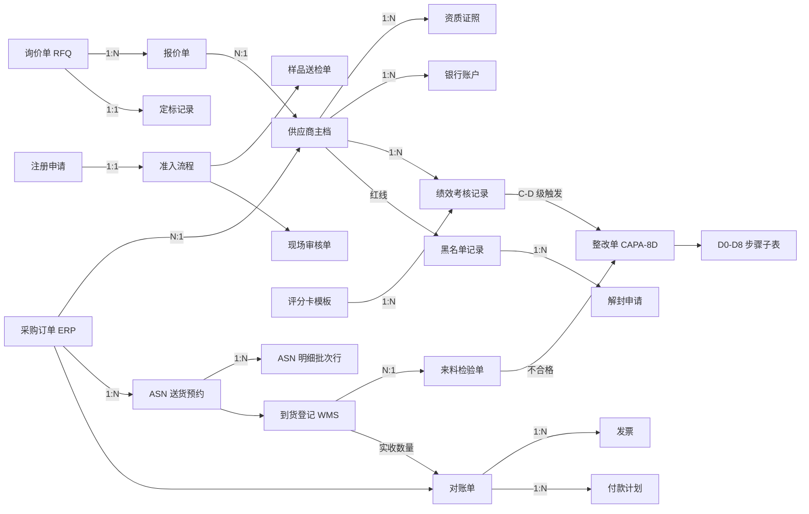
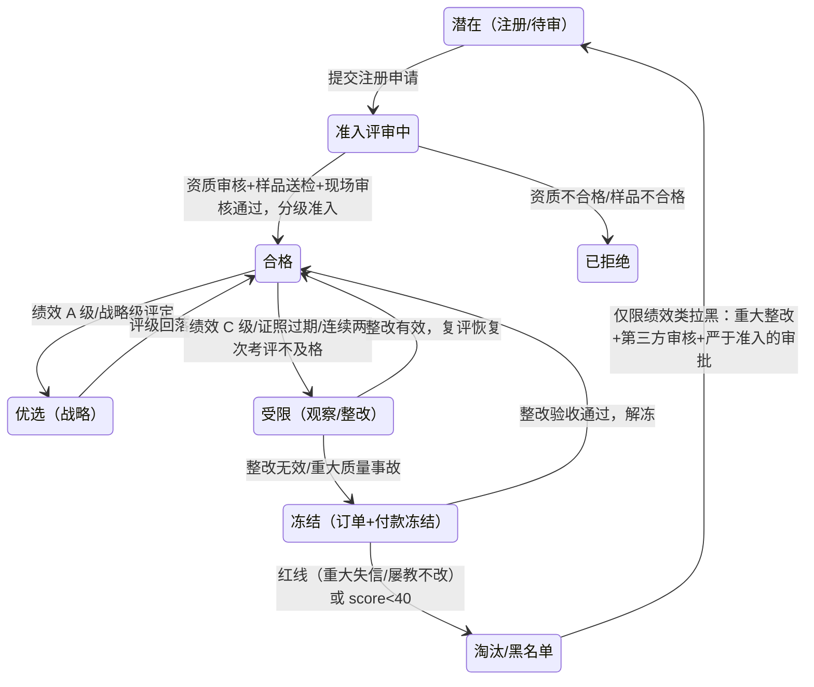
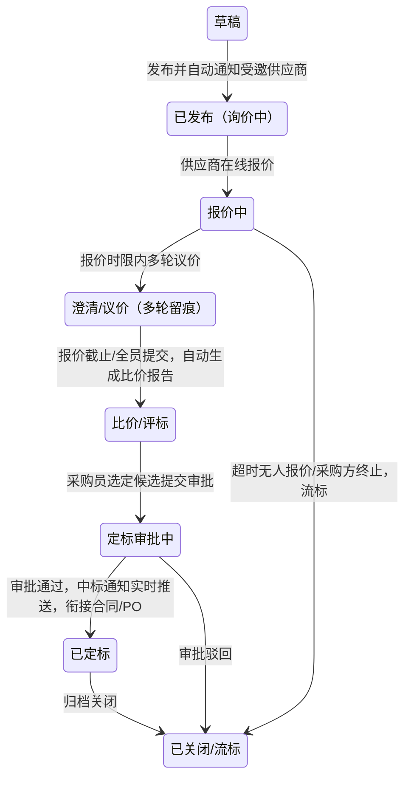
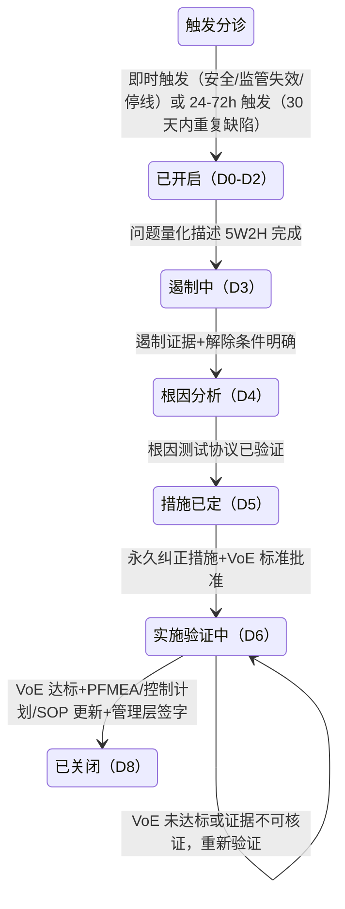
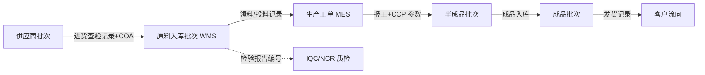
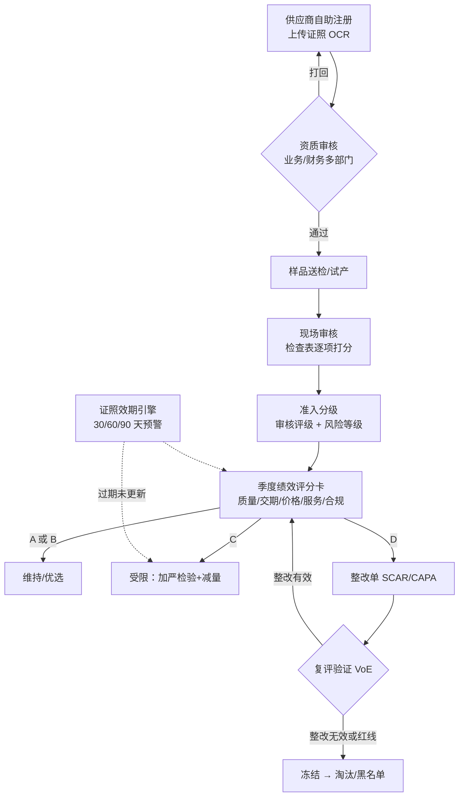
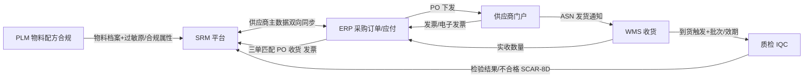

# SRM 供应商关系管理核心领域模型调研——面向食品行业 NocoBase 平台

> 研究日期：2026-09-14 | 来源：48 个来源（政府/官方 12、厂商官方 16、行业社区 18、本地 NocoBase v1 源码验证）| 深度：Exhaustive（4 并行子任务深读）
> 服务对象：deepseek-harness 食品行业综合业务系统（NocoBase `platform/nocobase` v1 源码并入版，可 UI 配置 admin 形态）的 SRM 模块建模

---

## 执行摘要

本次调研围绕"在 NocoBase 低代码平台上为食品行业搭建 SRM 模块"，对 SRM 领域模型、食品行业法规特性、NocoBase 区块能力边界、业界方案与集成点四个维度做了系统调研。**核心结论：SRM 九大实体（供应商主数据/资质证照/寻源 RFQ/准入/绩效评分卡/对账/ASN 协同/CAPA 8D/黑名单）与三条状态机（供应商生命周期/寻源单/整改单）有清晰的业界共识，可直接映射为 NocoBase collections + workflow；MVP 最小闭环（注册→资质审核→现场审核→分级→绩效→降级→整改→复评/淘汰）在 NocoBase v1 上无需自定义区块即可演示**——本仓库的 `plugin-data-visualization-echarts` 原生支持雷达图（含"用维度作变量"配置），日历/看板/子表格/公式字段等标准能力覆盖了绝大部分 SRM 视图需求。

食品行业特有部分是价值最高的发现区：**GB 14881-2025 已于 2026-09-02 实施（替代 2013 版），《食品安全法》2025 修正案将于 2025-12-01 施行**，两者对供应商管理（每年至少 1 次复评、高风险每半年、证照效期预警、进货查验记录）的强制性要求构成 SRM 模块的合规骨架；证照延续窗口存在"生产许可 30 个工作日 vs 经营许可 90-15 个工作日"的不对称，预警提前量必须按证照类型配置——这是通用 SRM 方案不会替你想的食品行业坑。

主要风险集中在三处：①国内 SaaS SRM 厂商（正远/甄云/企企通等）的模块与字段口径来自营销内容，非中立标准，且审核检查表分值体系业界并无统一标准（220 分制只是其一）；②NocoBase v1 文档已下线（docs.nocobase.com 现为 v13 文档），v1 结论依赖本仓库源码验证，未来升级 v13 时雷达图需改走 ECharts Custom JS 模式；③PLM 集成（原料合规证书关联）公开资料最薄，需 PoC 验证。

---

## 关键发现

1. **SRM 模块收敛为"六大件"**：供应商全生命周期、寻源询比价、采购协同、质量协同（IQC 回传+整改闭环）、财务协同（对账/结算/发票）、开放集成平台——SAP Ariba、Coupa、甄云、企企通、商越五家横向一致（[SAP](https://www.sap.com/products/spend-management/supplier-management.html)、[甄云](https://www.going-link.com/)、[企企通](https://www.51qqt.com/)、[商越](https://www.sunyur.com/product/integration)、[Coupa](https://www.coupa.com/products/source-to-contract/supplier-risk-performance/)）。
2. **供应商生命周期七态主干**（潜在→准入评审→合格→优选→受限→冻结→淘汰/黑名单）：腾讯云 DDD 给出代码级迁移（PENDING→REVIEWING→ACTIVE/REJECTED；score<60→WARNING、score<40→ELIMINATED；状态变更必须走领域方法并落审计事件）（[腾讯云](https://cloud.tencent.com/developer/article/2683364)）；国网公告提供"账户冻结→整改验收→申请解除"的真实规则（[搜狐-国网](https://www.sohu.com/a/989412505_121883443)）。
3. **A/B/C/D 评级多源一致**：A≥90 战略伙伴（优先下单/长期协议）、B 75-89 维持、C 60-74 加严检验+限期整改+减量、D<60 停止下单+启动替代；质量/交期为必有核维度，食品行业建议必含"合规"维度（[TTSQC](https://www.ttsqc.com/zh/blog/2b9c8e4f.html)、[正远](https://www.zhengyuansz.com/blog/p-prac-2991/)）。
4. **证照效期预警是食品 SRM 第一硬需求**：SC 食品生产许可证与食品经营许可证有效期均 5 年；延续窗口不对称（生产许可届满前 30 个工作日 vs 经营许可 90-15 个工作日，逾期须暂停经营）；业界实践 90/60/30（政府）或 60/30/7 天分级 + 关键证照过期自动冻结供货权限（[SAMR 24 号令](https://www.samr.gov.cn/zw/zfxxgk/fdzdgknr/fgs/art/2023/art_b15dbae4c2014671b9463fbe9f513576.html)、[78 号令](https://www.gov.cn/gongbao/2023/issue_10606/202307/content_6894763.html)、[观麦](https://www.guanmai.cn/classroom/2026071737703)、[轻流](https://qingflow.com/categories-content/article/result/article2026_37572.html)）。
5. **GB 14881-2025（2026-09-02 实施）三个新约束**：合格供应商名录每年至少 1 次复评、高风险每半年；到货验证与不合格品 24 小时退换启动；不合格原料严禁返工/篡改日期/降级使用（[食品伙伴网解读](https://www.foodmate.net/zhiliang/guanli/174280.html)）。
6. **追溯链最小单元=批次、锚点=工单**：原料批次业界惯例沿用供应商批次号；五节点链路中"投料批次记录"是最常见断点；法定进货查验记录 7 必备字段+检验合格证号（[黑湖](https://www.xiaogongdan.cn/news/food-quality-traceability-recall-management.html)、[食安法 50/51 条](http://info.foodmate.net/news/show-229236.html)）。
7. **NocoBase v1（本仓库 2.2.6）雷达图原生支持**：`plugin-data-visualization-echarts` 注册了 Radar 图表类（含"用维度作变量"配置）且 preset 默认启用；v13 则需 Custom JS 返回 ECharts option（[图表选项](https://docs.nocobase.com/cn/data-visualization/guide/chart-options)、[自定义图表](https://docs.nocobase.com/cn/data-visualization/guide/custom-chart-options)、本地源码验证）。
8. **定时预警调度开源可用、审批流是商业版**：workflow ScheduleTrigger 在开源主包（cron/固定间隔/数据表时间字段三模式；停机不补触发需兜底）；Approval 插件为商业版，开源替代=manual 人工节点+更新记录（[定时任务](https://docs.nocobase.com/cn/workflow/triggers/schedule)、[商业版](https://www.nocobase.com/cn/commercial)）。
9. **Odoo"规则-执行-事件"三层质检分离是 IQC 联动最佳参考**：QCP 规则（收货操作+物料+抽检比例+频率）→ Quality Check（挂收货单，批次/容差）→ Quality Alert（Vendor+根因+纠正/预防措施，看板流转）；Odoo 原生无供应商评分卡，需自建（[Odoo QCP](https://www.odoo.com/documentation/18.0/applications/inventory_and_mrp/quality/quality_management/quality_control_points.html)）。
10. **三套 A/B/C(/D/E) 分级在食品行业并存且逻辑不同，建模必须拆开**：监管风险分级（静态 40+动态 60 分，检查频次联动）、企业审核评级（220 分制 A-E，关键项一票否决）、IQC 检验严格度（12 个月合格率窗口）（[风险分级办法](https://www.cfe-samr.org.cn/zcfg/spjc_152/bmgz_155/202405/t20240506_5319.html)、[SC 审核表](https://sc.foodmate.net/show-3214.html)、[质量智库 IQC](https://zhiliangclub.com/article?id=67)）。

---

## 详细分析

### 一、SRM 核心实体清单

#### 1.1 实体关系总图



供应商主档是全图枢纽：360 度档案=基本信息+资质证照+银行账户+历史合作记录+绩效得分的聚合（[正远](https://www.zhengyuansz.com/blog/p-prac-2886/)）；Kraljic 矩阵（战略/杠杆/瓶颈/日常）为"分类分级"提供理论依据，与绩效 A/B/C/D 正交——一维管重要性、一维管表现（[维基百科-SRM](https://zh.wikipedia.org/wiki/%E4%BE%9B%E5%BA%94%E5%95%86%E5%85%B3%E7%B3%BB%E7%AE%A1%E7%90%86)）。

#### 1.2 实体明细表

| # | 实体 | 关键字段 | 关系与状态机要点 | 主要来源 |
|---|---|---|---|---|
| 1 | 供应商主档 Supplier | 供应商编码、公司名称、法人代表、统一社会信用代码、年营收、分类分级（战略/核心/普通）、联系人、银行账户、状态、绩效得分、品类范围 | 1:N 证照/账户/绩效记录；整体状态机见第二节 | [腾讯云](https://cloud.tencent.com/developer/article/2683364)、[正远](https://www.zhengyuansz.com/blog/p-prac-2886/) |
| 2 | 资质证照 Certificate | 证照类型（营业执照/食品生产许可证 SC/食品经营许可证/ISO22000/HACCP 体系认证）、证照编号（SC 为 SC+14 位）、发证机关、生效日期、**有效期至**、附件、预警状态 | N:1 供应商；档案有效性由证照效期驱动：有效→临期（30/60/90 分级）→过期→自动限制报价/接单；食品证照规则见第三节 | [正远](https://www.zhengyuansz.com/blog/p-prac-2886/)、[SAMR](https://www.samr.gov.cn/zw/zfxxgk/fdzdgknr/fgs/art/2023/art_b15dbae4c2014671b9463fbe9f513576.html) |
| 3 | 询价 RFQ/报价/比价/定标 | RFQ：物料与规格、数量、交期、付款条件、报价截止、受邀供应商范围、寻源模式（询比价/招标/竞价）；报价：价格、交期、税率、MOQ、附件、轮次版本（多轮留痕）；比价报告：报价汇总、最低价标注、历史价格参考、比价维度（价格/交期/付款/历史绩效/质量）；定标：中标供应商、选择原因、审批意见 | RFQ 1:N 报价；定标 1:1 RFQ；报价保密按角色控制；状态机见 2.2 | [德客易采](https://www.dekeyicai.cn/procurement-rfq-process)、[鲸采云](https://www.sohu.com/a/944525446_122540649) |
| 4 | 准入流程 Admission | 注册申请：来源（自助/邀请）、基本信息、证照上传（OCR）；资质审核单：审核部门（业务/财务/法务）、通过/打回；样品送检单：样品编号、检验结果（不合格直接淘汰）；现场审核单：审核对象、生产规模、管理水平、设备状况、检查表评分；分级决定：供应商等级、合作有效期（一年一审）、品类范围 | 三关模型：资质审查→现场审核→样品测试；差异化准入：A 类物料要求三体系认证、辅料仅基础资质 | [阿里云](https://developer.aliyun.com/article/1753110)、[正远](https://www.zhengyuansz.com/blog/p-prac-2886/)、[鲸采云](https://www.sohu.com/a/944525446_122540649) |
| 5 | 绩效考核 Scorecard | 模板：维度（质量/交期/价格/服务/合规[+技术/ESG]）、各维权重、目标值、评分制、周期（季/年）；记录：各维得分、总分、等级、客观数据来源（ERP/WMS/QMS 自动抓取）、主观评分人、整改要求；指标集：批次合格率>95%、准时交货率>95%、订单完整率>98%、审核得分>80、CAPA 按时完成率>90%、证书有效率 100%、响应<24h | N:1 供应商；季度评审共享结果→C 级改进计划→年度复盘调权重；A/B/C/D 规则见 1.3 | [TTSQC](https://www.ttsqc.com/zh/blog/2b9c8e4f.html)、[正远](https://www.zhengyuansz.com/blog/p-prac-2991/) |
| 6 | 对账单/发票/付款计划 | 对账单：周期、供应商、明细（订单+收货+发票三单合一）、差异高亮、确认状态；发票：发票号、金额、税率、OCR 验真、红冲/作废；付款计划：金额、日期、预设规则、预付/欠款/尾款跟踪 | 状态：自动生成→待供应商在线确认（差异触发沟通）→付款计划→财务付款→在线追踪→完结 | [鲸采云](https://www.sohu.com/a/944525446_122540649)、[正远](https://www.zhengyuansz.com/blog/p-prac-2886/) |
| 7 | ASN/送货预约/到货登记 | ASN 头：目标仓库、到货日期+ETA、运输信息（车牌/司机/运单号）、关联 PO；明细行：品名、数量、包装、**批次/批号/效期**、箱码、温控属性；预约：时窗（30/60 分钟粒度）、月台、容量维度（车次/托盘/吨位）；到货登记：车牌核验、封条、预约匹配、责任边界切换 | PO 说明意图、ASN 说明执行（可部分/组合发货）；校验三层：提示不阻断/阻断收货/阻断预约确认；状态机见 2.4 | [人人都是产品经理](https://www.woshipm.com/pd/6345858.html)、[SAP Help](https://help.sap.com/docs/buying-invoicing/approvables-reference-guide/advanced-ship-notice-asn?locale=zh-CN)、[Coupa](https://docs.coupa.com/en/supplier-documentation/coupa-for-suppliers/the-coupa-supplier-portal-or-csp/features-and-processes-in-the-coupa-supplier-portal/asn/create-or-edit-an-asn) |
| 8 | 整改单 CAPA/8D | 工单：唯一 ID、开启日期、SQE 负责人、严重性分类、受影响物料号、**批次号**、客户影响；D0-D8 步骤子表（步骤/目的/最低交付物/负责人/时间窗）；根因测试计划（5Whys/鱼骨图+可测量预期）；VoE 有效性验证规范（如连续 10 批 ≤0.5PPM 或 Cpk>1.33、观察窗口 90 天/10 批） | N:1 供应商；N:1 IQC 不合格/质量事件；状态机见 2.3；实施验证≠有效性验证（VoE），缺 VoE 是审计最常见拒收原因 | [beefed.ai 8D 手册](https://beefed.ai/zh/8d-capa-playbook-supplier-quality)、[质量智库 IQC](https://zhiliangclub.com/article?id=67) |
| 9 | 黑名单 Blacklist | 记录：供应商、拉黑原因分类（严重违规/重大失信/屡教不改）、事实依据证据链、调查小组、审批记录、通知函、申诉记录、禁入期限、解封条件；系统管控：禁止创建新 PO、禁止付款、冻结门户权限 | 红线三类：商业贿赂/泄密/恶意竞标/数据造假；伪劣产品重大事故/政府失信名单；绩效 D 级限期未整改；全公司共享防"总部拉黑、分部合作"；解封仅限绩效类且严于准入审批 | [正远-黑名单](https://www.zhengyuansz.com/blog/p-prac-3381/)、[搜狐-国网](https://www.sohu.com/a/989412505_121883443) |

#### 1.3 绩效评级与管理动作映射（食品行业口径）

| 等级 | 分数线 | 管理动作 | IQC 严格度联动 |
|---|---|---|---|
| A 战略伙伴 | 90-100 | 优先下单、份额倾斜、长期协议、联合改进 | 放宽/免检（连续 12 个月零缺陷） |
| B 合格 | 75-89 | 维持合作、针对性改进 | 正常（合格率≥98%） |
| C 观察名单 | 60-74 | 加严检验、限期整改、减量/限制份额 | 加严+专项审核（合格率 90-98%） |
| D 淘汰 | <60 | 停止下单、启动替代供应商；连续两次不及格先整改 | 暂停供货（<90%）+开发替代 |

来源：[TTSQC](https://www.ttsqc.com/zh/blog/2b9c8e4f.html)（分数线与管理动作）、[质量智库 IQC](https://zhiliangclub.com/article?id=67)（IQC 联动四级）、[鲸采云](https://www.sohu.com/a/944525446_122540649)（连续两次不及格规则）。口径冲突见"反面观点"第 1 条。

### 二、状态机

#### 2.1 供应商生命周期（七态主干 + 回流弧）



依据：状态枚举与领域方法（submitApplication/passAudit/evaluate）来自 [腾讯云 DDD](https://cloud.tencent.com/developer/article/2683364)；"订单冻结、付款冻结、拉黑暂停键"来自 [正远](https://www.zhengyuansz.com/blog/p-prac-2886/)；冻结→整改验收→申请解除来自 [国网公告](https://www.sohu.com/a/989412505_121883443)；解封条件来自 [正远-黑名单](https://www.zhengyuansz.com/blog/p-prac-3381/)。**工程要点：状态变更必须通过领域方法（NocoBase=workflow/action 按钮），禁止直接改库；每次迁移落审计日志（supplier_id, action, created_at）**（[腾讯云](https://cloud.tencent.com/developer/article/2683364)）。

#### 2.2 寻源单（RFQ）状态机



依据：[德客易采](https://www.dekeyicai.cn/procurement-rfq-process)（发布→报价→比价→定标审批→通知）、[鲸采云](https://www.sohu.com/a/944525446_122540649)（自动对比报表+最低价标注+中标实时通知）、[正远](https://www.zhengyuansz.com/blog/p-prac-2886/)（全程留痕）。流标细则未单独深读（见开放问题 4）。

#### 2.3 整改单（CAPA/8D）状态机



依据：[beefed.ai 8D 实战手册](https://beefed.ai/zh/8d-capa-playbook-supplier-quality)（D0-D8 时间窗：D0 分诊 0-24h、D2 问题 5W2H 48-72h、D3 遏制 48-72h、D4 根因 7-14 天、D5 永久措施 14 天、D6 实施验证 14-90 天、D7 预防复发 30-120 天、D8 关闭）。**MVP 可裁剪为轻量 SCAR（发起→供应商回复 5Why+措施→验证关闭），D0-D8 全量作后期演进**（裁剪为本次综合建议）。

#### 2.4 ASN 状态机（协同侧）

```
草稿（关键字段缺失只能存草稿）→ 已提交/已校验 → 时窗已确认（产能承诺）
→ 已发货（物流跟踪）→ 到货登记（责任边界切换）→ 收货中（扫码比对差异）
→ 差异→异常单（短少/破损/错码） | 一致→收货完成 → 触发对账明细
```

依据：[人人都是产品经理](https://www.woshipm.com/pd/6345858.html)（"把预约确认定义成可追溯的产能承诺，迟到/超时/变更形成结构化事件进入异常与对账体系"）；NocoBase 落地为 Kanban 拖拽流转（见第五节）。

### 三、食品行业特有（重点）

#### 3.1 供应商资质证照效期预警

| 证照 | 有效期 | 延续申请窗口 | 法规依据 |
|---|---|---|---|
| 营业执照 | 长期/按登记 | 工商年报另管 | 通用 |
| 食品生产许可证（SC） | **5 年** | 届满前 **30 个工作日**前提出；名称/工艺/类别变更 10 个工作日内申请变更 | 《食品生产许可管理办法》第 25/32/34 条（[SAMR](https://www.samr.gov.cn/zw/zfxxgk/fdzdgknr/fgs/art/2023/art_b15dbae4c2014671b9463fbe9f513576.html)） |
| 食品经营许可证 | **5 年** | **90 至 15 个工作日**之间；15 个工作日内申请则届满后**暂停经营**直至获批 | 《食品经营许可和备案管理办法》第 23/32 条（[gov.cn](https://www.gov.cn/gongbao/2023/issue_10606/202307/content_6894763.html)） |
| ISO22000/HACCP 体系认证 | **3 年** | 有效期内每年 1 次监督审核 | 认证制度（[食品伙伴网](https://www.foodmate.net/zhiliang/haccp/173103.html)） |

预警实践分级（多源综合）：政府侧 90/60/30 多轮提醒（[实在智能案例](https://www.ai-indeed.com/encyclopedia/23891.html)）；食品行业 60/30/7 + **关键证照过期自动冻结供货权限**（[观麦](https://www.guanmai.cn/classroom/2026071737703)）；普通证照提前 30 天、关键证照提前 60 天并触发"更新通知→供应商提交→审核→归档"（[轻流](https://qingflow.com/categories-content/article/result/article2026_37572.html)）；更细 30/15/7/3 多级（[轻流指南](https://qingflow.com/categories-guide/article/result/article2026_16017.html)）；按资质类型×供应商等级路由提醒接收人（[简道云](https://www.yun88.com/qa/3159.html)）。

**建模结论**：`预警规则表 = 证照类型 × 提前天数梯度 × 提醒渠道 × 升级路径`，延续窗口按证照类型区分；到期未更新→冻结供货/拦截采购下单（联动生命周期"受限"态）。

法定基础：《食品安全法》第五十条——"食品生产者采购食品原料……应当查验供货者的许可证和产品合格证明；对无法提供合格证明的食品原料，应当按照食品安全标准进行检验……记录和凭证保存期限不得少于产品保质期满后六个月；没有明确保质期的，保存期限不得少于二年"（[2025 修正版全文](http://info.foodmate.net/news/show-229236.html)；修正案 2025-12-01 施行，50/53 条表述未变，[国新办](http://www.scio.gov.cn/ttbd/xjp/202509/t20250912_930718.html)）。罚则：未履行进货查验义务可处 5 千-5 万罚款、情节严重责令停产停业直至吊销许可证（第 126 条）。

#### 3.2 原料安全与追溯链（对接 WMS/MES）



- **批次编码惯例**：原料批次直接沿用供应商批次号（未提供时按"入库日期+供应商+序号"自编）；成品含生产日期+序列；**追溯锚点=工单**，全部记录挂工单才成闭环（[黑湖](https://www.xiaogongdan.cn/news/food-quality-traceability-recall-management.html)）。
- **最常见断点**："投料时没有记录原料批次号，是食品追溯链最常见也最致命的断点"（同上）——SRM 侧对策：ASN 明细行强制携带供应商批次号，入库时映射为内部批次。
- **法定记录字段**（食安法 50 条）：名称、规格、数量、生产日期或生产批号、保质期、进货日期、供货者名称/地址/联系方式；出厂检验记录另含**检验合格证号**（51 条）（[全文](http://info.foodmate.net/news/show-229236.html)）。
- **正反向追溯与时限**：正向=来源→入库→投料→半成品→成品→客户（追影响范围）；反向=成品→生产记录→投料→原辅料→来源（倒查原因）；常规批次 2 小时出初步结论、重大风险 1 小时锁定（[食品伙伴网程序文件](https://www.foodmate.net/zhiliang/guanli/173778.html)）。
- **一品一码**：福建省级平台注册主体 29.81 万家、累计数据 21.04 亿条（[SAMR 报道](https://www.samr.gov.cn/xw/df/art/2023/art_27f06ee64d954f89932633891162f679.html)）——对接政府追溯平台是趋势性集成点。

#### 3.3 供应商审核检查表（GMP/HACCP/ISO22000 审核项库）

业界实样结构（[食品伙伴网 SC 审核表](https://sc.foodmate.net/show-3214.html)）：

| 结构要素 | 实样取值 |
|---|---|
| 条款分组 | 六组：厂区环境/厂房及设施/生产过程/存储过程/组织人事/品质管理 |
| 配分与判定 | 总分 220 分；0 分=未建立或未执行，1/3/5 分=建立并完全执行 |
| 关键项 | 带 `*` 关键项 22 个共 28 分，一票否决（如虫控设施、周界密闭构筑） |
| 评级 | A 200-220（关键项无不合格）/ B 180-199 / C 160-179 / D 140-159（暂可供货+3 个月改善期，复审不达 C 停供淘汰）/ E≤139 直接淘汰 |
| 不符合项分级 | 次要/主要/关键三级（CAC/HACCP 惯例，[搜狐审核细则](https://www.sohu.com/a/394443458_172731)） |

理论骨架：HACCP 七原则（危害分析→CCP 确定→关键限值→监控程序→纠偏→验证→记录）（[食品伙伴网](https://www.foodmate.net/zhiliang/haccp/173103.html)、[质量智库](https://zhiliangclub.com/article?id=158)）；GB 14881-2025 要求现场审核覆盖生产环境、卫生条件、设备设施、质量控制体系（HACCP/SSOP）、检验能力、虫害控制、追溯体系（[解读](https://www.foodmate.net/zhiliang/guanli/174280.html)）。

**建模结论**：检查表必须做成**可配置模板**（分组/分值/关键项标记/评级阈值模板化）——业界无统一分值体系，硬编码会在第二个客户就翻车；条款库按 GB 14881-2025 + HACCP 七原则 + ISO22000 双向映射建初始数据。

#### 3.4 来料质检 IQC 联动（不合格→供应商整改）

- **抽样标准**：GB/T 2828.1-2012 计数调整型抽样；检验水平 II 默认；AQL 按缺陷类别：关键=0、重要=0.65/1.0、轻微=2.5/4.0（[质量智库 IQC 全指南](https://zhiliangclub.com/article?id=67)）。
- **动态切换规则**：正常→加严=连续 2 批中 1 批不合格；加严→暂停=累积 5 批不合格应**暂停供应商供货**；放宽=连续 10 批合格；关键安全项可 C=0 零缺陷方案（同上）。
- **判定色标与处置**：合格=绿；让步接收=黄（授权审批+重点跟踪）；挑选使用=蓝（全检合格入库、不良退回）；退货=红（隔离+发 NCR）；不合格经 MRB（质量+采购+工程+生产）四分类处置（退货/让步/降级/报废），并向供应商发出 **SCAR**，推动 8D 或 5Why（同上）。
- **食品特有强约束**：COA 批次检验报告须与批次对应（感官/理化/微生物/污染物/农残兽残），高风险原料追加第三方年度检测；冷链原料核查温控记录（0-4℃/-18℃，超标拒收）；24 小时内启动退换货；**不合格原料严禁返工、篡改日期、降级使用**（[GB 14881-2025 解读](https://www.foodmate.net/zhiliang/guanli/174280.html)）。
- **IQC×供应商等级联动**：A 级（12 个月零缺陷）→放宽/免检；B（≥98%）→正常；C（90-98%）→加严+专项审核；D（<90%）→暂停供货+开发替代（[质量智库](https://zhiliangclub.com/article?id=67)）。

#### 3.5 供应商分级与风险分类（三套体系拆分）

| 体系 | 分级逻辑 | 驱动动作 | 来源 |
|---|---|---|---|
| 监管风险分级 | 百分制：静态风险 40 分+动态风险 60 分，A/B/C/D 四级 | 检查频次：A≥1 次/年、B 1-2、C 2-3、D 3-4 次/年；行政处罚/抽检不合格上调 1-2 级，连续 3 年守法+获 HACCP 认证下调 | [《食品生产经营风险分级管理办法》](https://www.cfe-samr.org.cn/zcfg/spjc_152/bmgz_155/202405/t20240506_5319.html) |
| 企业审核评级 | 220 分制检查表 A-E | 供货资格（D 级 3 个月改善期）、复评频次（年评/高风险半年评） | [SC 审核表](https://sc.foodmate.net/show-3214.html)、[GB 14881-2025 解读](https://www.foodmate.net/zhiliang/guanli/174280.html) |
| IQC 检验严格度 | 12 个月合格率窗口 | 放宽/正常/加严/暂停 | [质量智库](https://zhiliangclub.com/article?id=67) |

原料风险三分法作用于物料主数据：高风险（肉蛋/生鲜/乳制品）批批检+现场审核；中风险（粮油/调味品）资质+定期抽检；低风险（包装材料）资质+感官（[GB 14881-2025 解读](https://www.foodmate.net/zhiliang/guanli/174280.html)）。

### 四、MVP 最小闭环 Workflow（可演示）



分步骤说明（每步给出 NocoBase 落法）：

| 步骤 | 业务动作 | 数据落点 | NocoBase 实现 |
|---|---|---|---|
| 1 注册 | 供应商填基本信息+上传营业执照/SC 证/经营许可证 | 注册申请→自动建供应商主档（状态=潜在） | Form 区块+附件字段；OCR 可用 AI 员工后置处理 |
| 2 资质审核 | 业务部审证照、财务审税号；**校验证照效期** | 资质证照子表（类型/编号/有效期至） | 子表格+必填校验；ScheduleTrigger 每日扫描效期 |
| 3 样品送检 | 送样→检验结果录入；不合格直接淘汰 | 样品送检单 | Form+Details；结果字段驱动流程分支 |
| 4 现场审核 | 按检查表模板逐项打分（分组/分值/关键项） | 现场审核单+检查表明细子表 | 子表格行内打分+formula 字段汇总；关键项未达→workflow 拦截 |
| 5 准入分级 | 审核评级（A-E）+原料风险等级（高/中/低）定级，写入合作有效期 | 供应商主档.审核评级/风险等级/状态=合格 | 更新记录 action+赋值；audit-logs 留痕 |
| 6 季度评分卡 | 五维打分（质量 40/交期 30/价格/服务/合规）→加权总分→A/B/C/D | 绩效考核记录+模板 | Form 子表单逐维打分+formula 加权；雷达图区块展示（v1 原生 radar） |
| 7 评级降级 | C→受限（加严检验+减量）；D→整改 | 状态迁移受限+自动生成整改单 | workflow 监听考核记录创建→按等级路由动作 |
| 8 整改跟踪 | 供应商回复根因+措施（轻量 SCAR：5Why+措施+期限） | 整改单（状态机见 2.3） | Kanban 拖拽流转+到期提醒 |
| 9 复评恢复/淘汰 | VoE 验证（连续 N 批合格）→恢复；无效→冻结→淘汰/黑名单 | 状态迁移+黑名单记录 | 更新记录+manual 人工节点复核 |
| 横切 预警 | 证照 90/60/30 天预警→通知→过期冻结供货 | 预警记录/通知 | ScheduleTrigger 每日扫描+通知节点+Calendar 区块（颜色=预警级别） |

MVP 范围裁剪（综合建议）：**首版不做**招标竞价多轮、四单匹配对账（先三单）、8D 全量 D0-D8（先轻量 SCAR）、供应商门户开放注册（先内部代录+邀请）、PLM 集成；**必做**实体 1/2/5/8/9 + 证照预警 + 评分卡雷达图 + 整改看板。

### 五、SRM 特有 UI 视图需求与 NocoBase 区块差距

#### 5.1 七类视图逐项判断（v1=本仓库 2.2.6；v13=官方新文档）

| SRM 视图 | 标准区块达成度 | 缺口 | 建议方案 | 依据 |
|---|---|---|---|---|
| 评分卡雷达图/维度条形 | **v1：标准达成**（`plugin-data-visualization-echarts` 原生 Radar+"用维度作变量"）；v13：少量 JS 定制（Basic 清单无 radar） | v13 Basic 无 radar | v1 直接配 radar 图表区块（维度=评分维度，度量=得分）；v13 用 Custom 模式写 ECharts radar option | [chart-options](https://docs.nocobase.com/cn/data-visualization/guide/chart-options)、[custom-chart-options](https://docs.nocobase.com/cn/data-visualization/guide/custom-chart-options)、本地 `platform/nocobase/packages/plugins/@nocobase/plugin-data-visualization-echarts`（radar.ts） |
| 资质效期预警日历+列表 | **标准达成** | 预警逻辑属工作流非区块 | Calendar：标题=证照名、开始=到期日、颜色字段=预警级别（红/黄/绿单选）；Table 数据范围"未来 90 天内到期"+列颜色 | [Calendar](https://docs.nocobase.com/cn/interface-builder/blocks/data-blocks/calendar)、[Table](https://docs.nocobase.com/cn/interface-builder/blocks/data-blocks/table) |
| 多家供应商并排比价表 | **大部分达成，1 缺口** | 表格无原生合计行/数据透视；"供应商为列"透视布局不直接支持 | 主方案：报价明细表（行=供应商×物料）+筛选区块按询价单过滤+JS Column 标红最低价；严格透视布局后期自定义区块 | [Table（JS Column）](https://docs.nocobase.com/cn/interface-builder/blocks/data-blocks/table)、[可视化 quick-start](https://docs.nocobase.com/cn/data-visualization/quick-start) |
| 审核检查表填报 | **基本达成** | 权重汇总无原生公式列实时显示 | Form+子表格（一对多逐项打分行内编辑：条款/标准分/得分/备注）+开源 `plugin-field-formula` 公式字段算总分；或提交后 workflow calculation 回写 | [子表格](https://docs.nocobase.com/cn/interface-builder/fields/specific/sub-table)、[插件目录](https://docs.nocobase.com/cn/plugins) |
| 供应商 360 详情 | **标准达成** | — | Details 区块+sub-detail 子表明细（证照/考核历史）+弹窗嵌套+audit-logs 变更历史 | [区块总览](https://docs.nocobase.com/cn/interface-builder/blocks)、[插件目录](https://docs.nocobase.com/cn/plugins) |
| ASN 协同看板 | **标准达成** | — | Kanban：分组=ASN 状态单选，拖拽跨列即状态流转 | [Kanban](https://docs.nocobase.com/cn/interface-builder/blocks/data-blocks/kanban) |
| ASN 到货日历 | **标准达成** | — | Calendar：标题=ASN 号/供应商、开始=预约到货日、颜色=物流/状态 | [Calendar](https://docs.nocobase.com/cn/interface-builder/blocks/data-blocks/calendar) |

#### 5.2 自定义区块优先级（MVP 必需 vs 后期）

| 优先级 | 项目 | 类型 | 说明 |
|---|---|---|---|
| **P0（MVP 必需）** | 无需自定义区块 | — | **MVP 全部视图用标准区块+formula+workflow 可达成**（v1 雷达图原生支持）——本次调研对 NocoBase 选型最重要的结论 |
| P0.5（MVP 内轻定制） | 比价表最低价标红/合计行 | JS Column / JS Block | 表格 JS 自定义列读当前页数据计算，不开发插件 |
| P0.5 | 检查表/评分卡总分自动计算 | formula 字段+workflow | 开源公式插件；实时性不足时提交后回写 |
| P1（3 个月内） | 并排比价透视区块（供应商为列） | 自定义区块插件 | v1 走 SchemaComponent+SchemaInitializer；v13 走 BlockModel/flow-engine（[区块扩展](https://docs.nocobase.com/cn/plugin-development/client/flow-engine/block)） |
| P1 | 评分卡仪表盘组合页 | 多图表+筛选联动 | 图表 Builder 与页面筛选器自动 $and 合并（[联动文档](https://docs.nocobase.com/cn/data-visualization/guide/filters-and-linkage)）；官方仪表盘教程见 [NocoBase 论坛](https://forum.nocobase.com/t/nocobase/13348) |
| P2（后期） | 追溯链可视化（批次血缘图） | 自定义区块 | 分层 DAG 模式参考 DataHub/OpenMetadata 血缘 UI（本仓库 [uiux-patterns 调研](../research/2026-09-06-nocobase-integration/uiux-patterns.zh.md)已有模式库） |
| P2 | 供应商门户（外部账号） | 独立前端/portal | 参照本仓库 demo-portal-crm（Vite+React 独立前端）模式 |

#### 5.3 工作流与权限要点

- **定时预警**：ScheduleTrigger 开源（cron/固定间隔/数据表时间字段三模式）；风险：停机期间错过的定时任务**重启后不补触发**，需每日全量扫描流兜底（[定时任务文档](https://docs.nocobase.com/cn/workflow/triggers/schedule)）。
- **审批**：Approval 插件为商业版（官方定价页将"审批、子流程、Webhook"列入商业版，[定价页](https://www.nocobase.com/cn/commercial)；开源主仓库无 plugin-approval，本地源码核证）；开源替代=workflow manual 人工节点+「更新记录」action 拼装"提交→人工复核→更新状态"（[更新记录](https://docs.nocobase.com/cn/interface-builder/actions/types/update-record)）。
- **状态机落地**：Kanban 拖拽跨列=更新分组字段值，天然适配整改单/ASN 流转；严格迁移校验（如"仅 VoE 达标可关闭"）用 workflow 前置校验节点。

### 六、与 ERP/WMS/IQC/PLM 的集成点



| 集成边界 | 触发时机 | 同步数据/关键字段 | 机制与业界参照 |
|---|---|---|---|
| SRM↔ERP 主数据 | 供应商档案任何变更 | 供应商主数据（编码/税号/银行/状态） | SAP Ariba 官方声明与 SAP ERP **双向同步**（[SAP](https://www.sap.com/products/spend-management/supplier-management.html)）；商越预置 SAP/Oracle/金蝶/用友标准接口模板（[商越](https://www.sunyur.com/product/integration)） |
| SRM↔ERP 订单 | PO 确认 | PO 头/行（供应商/行项/数量/单价/交期） | Coupa 用 cXML Purchase Orders 协议（[Coupa compass](https://compass.coupa.com/en-us/products/product-documentation/supplier-resources)） |
| SRM↔ERP 对账 | 收货验证后+发票到达 | 三单匹配：PO（订购）×收货单（实收 Done 数量）×发票；Odoo 关键配置：Bill Control=Received quantities + 3-way matching 开关（"账单仅在全部/部分收货后支付"） | [Odoo Vendor Bills](https://www.odoo.com/documentation/18.0/applications/inventory_and_mrp/purchase/manage_deals/manage.html)；国内口径：智能对账/双向结算（商越）、财务结算协同（甄云）；四单匹配（含付款）为正远系列口径，食品平台若与 ERP 应付集成建议直接按四单建模 |
| SRM→WMS ASN | 供应商发货前 | ASN 编号（对应 PO#，同一 PO 多次发货加序号）、Ship Date（当天或次日）、物流跟踪、行项目/数量/批次/效期 | Coupa CSP "Flip to ASN"（PO 一键翻 ASN）+ cXML ASN 机器对接（[Create/Edit ASN](https://docs.coupa.com/en/supplier-documentation/coupa-for-suppliers/the-coupa-supplier-portal-or-csp/features-and-processes-in-the-coupa-supplier-portal/asn/create-or-edit-an-asn)、[cXML ASN](https://compass.coupa.com/en-us/products/product-documentation/supplier-resources/for-suppliers/integration-resources/cxml-asns/post-cxml-asn-to-coupa)） |
| WMS→SRM/ERP 收货 | 到货 | Odoo：PO 确认自动生成 receipt，Validate 登记 Done 实收量；批次/效期在收货时生成并挂质检 | [Odoo RFQ](https://www.odoo.com/documentation/18.0/applications/inventory_and_mrp/purchase/manage_deals/rfq.html)、[Odoo Quality Checks](https://www.odoo.com/documentation/18.0/applications/inventory_and_mrp/quality/quality_management/quality_checks.html) |
| WMS→IQC 到货触发检验 | 收货单创建/确认 | Odoo QCP 规则引擎（Operation=Receipt+产品+Control Per 抽检比例+Frequency）；ERPNext 范式：Item 勾选质检标准后**收货单提交被阻断直至完成质检** | [Odoo QCP](https://www.odoo.com/documentation/18.0/applications/inventory_and_mrp/quality/quality_management/quality_control_points.html)、[ERPNext Quality Inspection](https://docs.frappe.io/erpnext/quality-inspection)——两种强约束范式可选 |
| IQC→SRM 不合格整改 | 检验 Fail | Quality Alert：Vendor+Root Cause+Corrective/Preventive Actions；升级 8D 工单（批次号/严重性/VoE 验收） | [Odoo Quality Alerts](https://www.odoo.com/documentation/18.0/applications/inventory_and_mrp/quality/quality_management/quality_alerts.html)、[8D 手册](https://beefed.ai/zh/8d-capa-playbook-supplier-quality) |
| SRM↔PLM 物料/合规 | 物料主数据创建/变更 | 物料档案（含检验标准模板绑定——ERPNext Item↔Quality Inspection Template 范式）；**原料合规属性：过敏原（GB 7718-2025 将 8 大类致敏物质列为强制标示，2027-03-16 实施）** | [ERPNext](https://docs.frappe.io/erpnext/quality-inspection)、[GB 7718-2025 解读](https://chiwai.eu/zh/zhi-shi-zhong-xin/guo-min-yuan-biao-shi/zhong-guo-guo-min-yuan-biao-shi/)；PLM 侧公开资料最薄，标注为需 PoC 假设 |

### 七、行业参考：主流 SRM 方案模块划分

| 方案 | 模块划分（官方口径归一化） | 对 NocoBase 建模的要点提示 |
|---|---|---|
| SAP Ariba Supplier Management | ① SLP 供应商生命周期与绩效（onboarding→qualification→ongoing monitoring）② Supplier Risk（法规/法律/财务/环境/社会/运营风险监控）③ 与 SAP ERP 主数据双向同步 | 风险监控独立成模块的思路值得借鉴（食品行业=证照效期+监管处罚+抽检不合格动态风险）（[SAP](https://www.sap.com/products/spend-management/supplier-management.html)） |
| Coupa | ① SRPM 风险与绩效管理 ② CSP 供应商门户（ASN/绩效洞察）③ cXML 单据交换（PO/Invoice/ASN） | "PO 一键翻 ASN"的 Flip 交互；单据传输协议化（[Coupa](https://www.coupa.com/products/source-to-contract/supplier-risk-performance/)、[compass](https://compass.coupa.com/en-us/products/product-documentation/supplier-resources)） |
| 甄云 SRM | ① 供应商管理（准入/绩效/风控）② 智慧寻源 ③ 敏捷协同（订单/送收货/**质量协同与整改闭环**/**财务结算协同自动对账**）④ 采购商城 ⑤ 开放平台（多品牌 ERP 对接）⑥ 应用市场 | 官网明确设**食品行业解决方案**；质量协同与整改作为一级模块的划分适合食品行业照搬（[甄云](https://www.going-link.com/)） |
| 企企通 | 供应商全生命周期/战略寻源（竞价询比价招标）/电子招标/采购订单（需求-订单-结算闭环）/合同/物流协同；连接电子发票平台、供应商风险自动监控 | 需求-订单-结算三段闭环视角（[企企通](https://www.51qqt.com/)） |
| 商越 | 供应商管理（生命周期/绩效/**供应商 360**/AI 风险监控）/战略寻源/采购合同/商城/采购协同/**财务协同（智能对账/智能结算/电子发票）**/一站式集成平台 | "供应商 360"命名与 NocoBase Details 多区块详情页直接对应（[商越](https://www.sunyur.com/product/integration)） |
| Odoo Purchase+Quality | Purchase：RFQ→PO→收货 receipt→Vendor Bill（3-way matching）+vendor pricelist（供应商/产品/MOQ/价格/lead time/优先级序列）；Quality：QCP 规则→Check 执行→Alert 事件 | "规则-执行-事件"三层质检分离；**Odoo 原生无供应商评分卡**（第三方模块补足），评分卡实体需自建；采购透视报表可做绩效客观数据来源（[RFQ](https://www.odoo.com/documentation/18.0/applications/inventory_and_mrp/purchase/manage_deals/rfq.html)、[Pricelist](https://www.odoo.com/documentation/18.0/applications/inventory_and_mrp/purchase/products/pricelist.html)、[Bills](https://www.odoo.com/documentation/18.0/applications/inventory_and_mrp/purchase/manage_deals/manage.html)、[Analyze](https://www.odoo.com/documentation/13.0/applications/inventory_and_mrp/purchase/purchases/rfq/analyze.html)） |
| ERPNext（开源参照） | RFQ/供应商模型+Quality Inspection（模板 Numeric Min/Max/Formula 判定；物料勾选后单据提交阻断） | 检验模板与物料绑定范式（[ERPNext](https://docs.frappe.io/erpnext/quality-inspection)）；ruoyi-vue-pro MES 的 IQC 模块结构可作参照但正文 VIP 未验证字段（[doc.iocoder.cn](https://doc.iocoder.cn/mes/qc/iqc/)） |

**共性收敛**（五家 SaaS 横向）：六大件=供应商全生命周期/寻源/采购协同/质量协同/财务协同/集成平台；食品行业差异化点在"资质证照效期+批次效期+合规声明"三件套（GB 7718-2025 过敏原强制标注将原料合规属性变成硬需求，[解读](https://chiwai.eu/zh/zhi-shi-zhong-xin/guo-min-yuan-biao-shi/zhong-guo-guo-min-yuan-biao-shi/)）。

---

## 反面观点与风险（Contrarian Views）

1. **ABCD 分数线存在口径冲突**：TTSQC 定 A≥90/B 75-89/C 60-74/D<60；腾讯云 DDD 示例代码用 score<60 进 WARNING、score<40 才 ELIMINATED——后者是简化教学模型，淘汰线明显更宽松。落地应以 90/75/60 为默认并把权重与阈值做成 NocoBase 可配置字段（TTSQC 也明确"根据行业特点调整"）。
2. **厂商内容偏营销口径**：正远/甄云/企企通/商越的模块与字段描述来自官网营销页与软文（鲸采云为搜狐软文），是"厂商希望你知道的 SRM"，非中立标准；各家对同一能力命名不同（"质量协同与整改"vs"采购质量协同管理"vs Supplier performance evaluations）。本报告已按能力归一化，字段清单完整性以厂商实施口径为上限。
3. **三套 A/B/C 分级并存且业界文章常混用**："A 级供应商"在监管风险分级、企业审核评级、IQC 检验等级三套体系里含义完全不同；UI 命名必须显式区分（建议：监管风险等级/审核评级/检验等级），否则演示时会直接暴露模型混乱。
4. **"进货查验记录保存 2 年"是常见误读**：法条原文是"保质期满后六个月；无明确保质期不少于二年"（食安法 50 条 2 款）——部分行业文章（含黑湖）简化为"两年"。留存策略应按物料有无保质期分叉计算。
5. **审核检查表分值体系业界无统一标准**：220 分制/六分组只是食品伙伴网 SC 频道实样，另有"模块权重+要素达成率"等流派；做成可配置模板是唯一稳妥解。
6. **GB 14881-2025 刚实施（2026-09-02，调研时 12 天）**：解读文章质量参差，且 2013 版条款号（7.2.1）与 2025 版（7.1/7.2/7.2.2）漂移，大量旧文仍引旧编号；食安法 2025 修正案 2025-12-01 施行，50/53 条虽未变但罚则建议做一次全文 diff 复核。
7. **NocoBase 版本断层风险**：v1（本仓库）官方文档已下线（docs.nocobase.com 现为 v13），v1 结论依赖本地源码验证；升级 v13 时雷达图从 Basic 原生降级为 Custom JS、multi-step-form 等插件能力需重新评估；短期 locked v1（2.2.6）无碍，长期迁移成本要预留。
8. **低代码做 SRM 的结构性局限**：供应商门户（外部账号/大并发注册）、复杂审批（Approval 商业版）、Webhook 集成（商业版）超出开源版边界；8D 全流程（90-120 天窗口、PFMEA 更新）对中小企业偏重，MVP 建议裁剪为轻量 SCAR。
9. **定时预警的静默失败**：ScheduleTrigger 停机期间错过的任务重启后不补触发——预警漏报在食品行业是合规风险，必须设计每日全量扫描兜底流+漏报告警。
10. **PLM 集成是推演而非实证**：主流 SRM 官网均未公开"物料/原料档案与合规证书关联"的字段级方案，本报告该节基于 ERPNext 范式+GB 7718-2025 合规驱动推演，标注为需 PoC 验证的假设。

---

## 开放问题

1. v13 Basic 图表类型清单是否会在后续小版本增补 radar（文档"等"字留白）？v13 demo 配置器 UI 未实测。
2. 供应商门户形态：NocoBase 多门户 portal vs 独立前端（本仓库 demo-portal-crm 模式）vs 混合——涉及外部供应商账号体系与租户隔离，需专项调研。
3. 黑名单"严于准入的审批"具体差在哪（审批层级？第三方审核强制？）——仅国网个案与厂商一句带过，缺乏细则。
4. 寻源"流标/废标"完整规则（流标后重发、保证金处理）未深读细则。
5. PLM 集成 PoC：原料合规证书（过敏原声明/法规名录匹配）的字段级模型与挂接点（物料主数据 vs 供应商-物料关系表）。
6. 目标客户 ERP 具体是哪家（金蝶/用友/SAP）决定对账接口形态与三单/四单口径。
7. 《网络食品销售经营者落实食品安全主体责任监督管理规定》（2026-05-20 施行）要求网销企业**每 6 个月重新核查所有上游供应商资质档案**——若目标客户涉网销，SRM 需内置半年期全量核查任务（新线索，未深读原文）。
8. GB 7718-2025 过敏原强制标示（2027-03-16 实施）对原料档案合规属性与配方联动的具体字段要求。

---

## 来源

| # | 来源 | 类型 | 日期/版本 |
|---|---|---|---|
| 1 | [腾讯云开发者-SRM 系统架构设计（DDD，准入-考核-淘汰闭环）](https://cloud.tencent.com/developer/article/2683364) | 技术社区（含代码） | 访问 2026-09-14 |
| 2 | [正远数智-SRM 五大模块](https://www.zhengyuansz.com/blog/p-prac-2886/) | 厂商实践 | 约 2026-05-29 |
| 3 | [正远数智-SRM 功能模块完整解析](https://www.zhengyuansz.com/blog/p-prac-2991/) | 厂商实践 | 约 2026-06-01 |
| 4 | [正远数智-供应商黑名单操作规范](https://www.zhengyuansz.com/blog/p-prac-3381/) | 厂商实践 | 2026-06-17 |
| 5 | [搜狐-鲸采云 SRM 注册/评审/准入/绩效落地](https://www.sohu.com/a/944525446_122540649) | 厂商软文 | 2025-10-16 |
| 6 | [维基百科-供应商关系管理](https://zh.wikipedia.org/wiki/%E4%BE%9B%E5%BA%94%E5%95%86%E5%85%B3%E7%B3%BB%E7%AE%A1%E7%90%86) | 百科 | 持续更新 |
| 7 | [TTSQC-供应商评分卡 KPI 框架](https://www.ttsqc.com/zh/blog/2b9c8e4f.html) | 质量服务商 | 2026-04-30 |
| 8 | [beefed.ai-供应商 8D 与 CAPA 实战手册](https://beefed.ai/zh/8d-capa-playbook-supplier-quality) | SQE 实操手册 | 访问 2026-09-14 |
| 9 | [人人都是产品经理-预约与 ASN 实战](https://www.woshipm.com/pd/6345858.html) | 产品社区 | 2026-03-02 |
| 10 | [德客易采-询比价流程](https://www.dekeyicai.cn/procurement-rfq-process) | SRM 厂商专题 | 更新 2026-07-22 |
| 11 | [阿里云开发者-供应商全生命周期管理指南](https://developer.aliyun.com/article/1753110) | 技术社区 | 2026-08-04 |
| 12 | [搜狐-国家电网供应商黑名单处理公告](https://www.sohu.com/a/989412505_121883443) | 新闻转载（央企规则） | 2026-02-24 |
| 13 | [SAP Help Portal-ASN 出货通知单](https://help.sap.com/docs/buying-invoicing/approvables-reference-guide/advanced-ship-notice-asn?locale=zh-CN) | 官方文档 | 访问 2026-09-14 |
| 14 | [食品伙伴网-食品安全法 2025 修正版全文](http://info.foodmate.net/news/show-229236.html) | 法规全文转载 | 2025-11-11 |
| 15 | [SAMR-食品生产许可管理办法（24 号令）](https://www.samr.gov.cn/zw/zfxxgk/fdzdgknr/fgs/art/2023/art_b15dbae4c2014671b9463fbe9f513576.html) | **政府官方** | 2020 施行 |
| 16 | [gov.cn-食品经营许可和备案管理办法（78 号令）](https://www.gov.cn/gongbao/2023/issue_10606/202307/content_6894763.html) | **政府官方** | 2023-12-01 施行 |
| 17 | [国新办-食品安全法 2025 修正案](http://www.scio.gov.cn/ttbd/xjp/202509/t20250912_930718.html) | **政府官方** | 2025-09-12 |
| 18 | [食品伙伴网-GB 14881-2025 采购验证解读](https://www.foodmate.net/zhiliang/guanli/174280.html) | 行业权威解读 | 2026-08-05 |
| 19 | [食品伙伴网-追溯与批次管理程序文件](https://www.foodmate.net/zhiliang/guanli/173778.html) | 程序文件范本 | 2026-03-19 |
| 20 | [食品伙伴网 SC 频道-供应商现场审核表](https://sc.foodmate.net/show-3214.html) | 检查表实样 | 2024-01-08 |
| 21 | [食品伙伴网-ISO22000 与 HACCP 认证攻略](https://www.foodmate.net/zhiliang/haccp/173103.html) | 行业权威 | 2025-09-16 |
| 22 | [卓越质量智库-ISO22000 与 HACCP 深度解析](https://zhiliangclub.com/article?id=158) | 专业社区 | 访问 2026-09-14 |
| 23 | [卓越质量智库-IQC 管理全指南](https://zhiliangclub.com/article?id=67) | 专业社区 | 2026-05-21 |
| 24 | [黑湖小工单-食品追溯与召回管理](https://www.xiaogongdan.cn/news/food-quality-traceability-recall-management.html) | 厂商实践 | 2026-08-13 |
| 25 | [cfe-samr-食品生产经营风险分级管理办法（试行）全文](https://www.cfe-samr.org.cn/zcfg/spjc_152/bmgz_155/202405/t20240506_5319.html) | **官方（监管技术机构）** | 原 2016/访问 2026-09-14 |
| 26 | [SAMR-福建一品一码 2.0 报道](https://www.samr.gov.cn/xw/df/art/2023/art_27f06ee64d954f89932633891162f679.html) | **政府官方** | 2023-11 |
| 27 | [搜狐-供应商审核检查表全套（A-E 评级）](https://www.sohu.com/a/909343231_121123832) | 行业社区 | 2025-06-30 |
| 28 | [搜狐-HACCP 审核细则](https://www.sohu.com/a/394443458_172731) | 行业社区 | 访问 2026-09-14 |
| 29 | [观麦-食品供应商证照效期管理](https://www.guanmai.cn/classroom/2026071737703) | 厂商实践 | 2026-07-17 |
| 30 | [轻流-资质效期预警案例](https://qingflow.com/categories-content/article/result/article2026_37572.html) / [轻流-预警分级指南](https://qingflow.com/categories-guide/article/result/article2026_16017.html) | 厂商实践 | 2026-07 |
| 31 | [简道云-资质提醒路由](https://www.yun88.com/qa/3159.html) | 厂商实践 | 2026-04-14 |
| 32 | [实在智能-政务证照 90/60/30 提醒案例](https://www.ai-indeed.com/encyclopedia/23891.html) | 厂商案例 | 2026-06-23 |
| 33 | [NocoBase 官方文档-Table/Form/Kanban/Calendar/Chart/子表格/区块总览](https://docs.nocobase.com/cn/interface-builder/blocks) | **官方文档** | v13，访问 2026-09-14 |
| 34 | [NocoBase-数据可视化（quick-start/chart-options/custom-chart-options/faq/filters-and-linkage）](https://docs.nocobase.com/cn/data-visualization) | **官方文档** | v13 |
| 35 | [NocoBase-workflow 定时任务](https://docs.nocobase.com/cn/workflow/triggers/schedule) / [审批触发器](https://docs.nocobase.com/cn/workflow/triggers/approval) | **官方文档** | 访问 2026-09-14 |
| 36 | [NocoBase-商业版定价页](https://www.nocobase.com/cn/commercial) | 官方 | 访问 2026-09-14 |
| 37 | [NocoBase-自定义区块（flow-engine/block）](https://docs.nocobase.com/cn/plugin-development/client/flow-engine/block) | **官方文档** | v13 |
| 38 | [NocoBase 论坛-可联动运营仪表盘教程](https://forum.nocobase.com/t/nocobase/13348) | 官方社区 | 2026-07-09 |
| 39 | 本仓库 `platform/nocobase/`（v1，2.2.6，AGPL）——plugin-data-visualization-echarts radar.ts、ScheduleTrigger、插件清单 | **本地源码（一手）** | 2.2.6 |
| 40 | [Odoo 18-RFQ](https://www.odoo.com/documentation/18.0/applications/inventory_and_mrp/purchase/manage_deals/rfq.html) / [Vendor Pricelist](https://www.odoo.com/documentation/18.0/applications/inventory_and_mrp/purchase/products/pricelist.html) / [Vendor Bills（3-way matching）](https://www.odoo.com/documentation/18.0/applications/inventory_and_mrp/purchase/manage_deals/manage.html) / [Odoo 13-Analyze vendors](https://www.odoo.com/documentation/13.0/applications/inventory_and_mrp/purchase/purchases/rfq/analyze.html) | **官方文档（一手）** | Odoo 18.0/13.0 |
| 41 | [Odoo 18-Quality control points](https://www.odoo.com/documentation/18.0/applications/inventory_and_mrp/quality/quality_management/quality_control_points.html) / [Quality checks](https://www.odoo.com/documentation/18.0/applications/inventory_and_mrp/quality/quality_management/quality_checks.html) / [Quality alerts](https://www.odoo.com/documentation/18.0/applications/inventory_and_mrp/quality/quality_management/quality_alerts.html) | **官方文档（一手）** | Odoo 18.0 |
| 42 | [SAP-Supplier Management](https://www.sap.com/products/spend-management/supplier-management.html) / [Supplier Risk](https://www.sap.com/products/spend-management/supplier-risk.html) / [SAP Learning-SIPM](https://learning.sap.com/courses/sap-ariba-supplier-management-supplier-lifecycle-management/introducing-sap-ariba-supplier-management) | 厂商官方（一手） | 访问 2026-09-14 |
| 43 | [Coupa-SRPM](https://www.coupa.com/products/source-to-contract/supplier-risk-performance/) / [compass 供应商资源](https://compass.coupa.com/en-us/products/product-documentation/supplier-resources) / [Create or Edit an ASN](https://docs.coupa.com/en/supplier-documentation/coupa-for-suppliers/the-coupa-supplier-portal-or-csp/features-and-processes-in-the-coupa-supplier-portal/asn/create-or-edit-an-asn)（2026-07-17 更新） / [cXML ASN](https://compass.coupa.com/en-us/products/product-documentation/supplier-resources/for-suppliers/integration-resources/cxml-asns/post-cxml-asn-to-coupa) | 厂商官方文档 | 访问 2026-09-14 |
| 44 | [甄云科技](https://www.going-link.com/) / [企企通](https://www.51qqt.com/) / [商越-集成平台](https://www.sunyur.com/product/integration) | 厂商官方 | 访问 2026-09-14 |
| 45 | [ERPNext-Quality Inspection](https://docs.frappe.io/erpnext/quality-inspection) / [Buying](https://docs.frappe.io/erpnext/buying) | 开源官方文档 | v15 |
| 46 | [ruoyi-vue-pro MES IQC 手册](https://doc.iocoder.cn/mes/qc/iqc/) | 开源社区（正文 VIP，仅结构） | 2026-09-15 更新 |
| 47 | [GB 7718-2025 过敏原强制标示解读](https://chiwai.eu/zh/zhi-shi-zhong-xin/guo-min-yuan-biao-shi/zhong-guo-guo-min-yuan-biao-shi/) | 合规解读（二手） | 2025-03-27 发布/2027-03-16 实施 |
| 48 | 本仓库 uiux-patterns.zh.md（research/2026-09-06-nocobase-integration/） | 本地前期调研 | 2026-09-06 |

---

## 方法论

- **检索引擎**：DuckDuckGo（chrome-devtools 直连，逐页提取自然结果并过滤广告/赞助内容）。选 DuckDuckGo 而非 web_search MCP 的原因：对中文新内容（GB 14881-2025、食安法 2025 修正案等 2025-2026 年新文）覆盖更及时。
- **两层架构**：主任务完成 4 轮伞形检索（SRM 模块全景/食品行业特性/NocoBase 可视化/种子分诊）建立种子清单；4 个并行子任务执行 Layer 2 深读——A：SRM 核心域与状态机（9 全文+9 摘要）；B：食品行业法规与特性（12 深读，法规原文取自 SAMR/gov.cn/食品伙伴网全文页）；C：NocoBase 区块能力（15+ 页官方文档+本地 v1 源码交叉验证）；D：行业参考与集成（22 来源：Odoo/Coupa/SAP/国内三家/ERPNext）。
- **版本区分**：NocoBase 结论显式区分 v1（本仓库 platform/nocobase 2.2.6，以源码为一手依据）与 v13（docs.nocobase.com 新文档）。
- **来源分级**：政府/官方（12）> 厂商官方文档（Odoo/SAP/Coupa/NocoBase docs）> 厂商营销/软文（正远/甄云等，仅作模块口径参考）> 社区实操（beefed.ai/质量智库/人人都是产品经理）。所有关键事实带内联 URL；来源间冲突（10+ 项）已在"反面观点与风险"及各节显式标注。
- **局限**：知乎被反爬拦截（错误码 40362，"六大模块"文未读，结论由正远五模块+德客易采交叉覆盖）；Coupa 官网正文被 Cloudflare 拦截（以官方文档站+检索摘要交叉）；ruoyi-vue-pro IQC 字段级内容为 VIP 付费（仅引用模块结构）；DuckDuckGo 中途一次 CAPTCHA（换检索词绕过）；法规处于新旧交替期（GB 14881-2025 于 2026-09-02 实施、食安法修正案 2025-12-01 施行），落地实施前建议复核最新原文。
- **交叉验证示例**：证照有效期 5 年由 SAMR 24 号令第 25 条与 78 号令第 23 条互证；ABCD 评级（TTSQC vs 腾讯云）冲突显式呈现并给出可配置默认值；雷达图结论以本地源码 radar.ts 为准而非二手文章。
