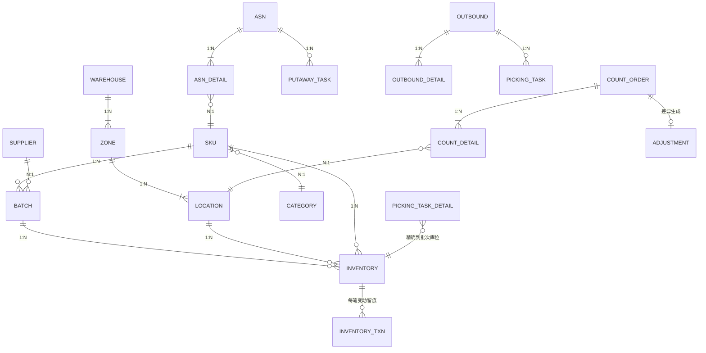
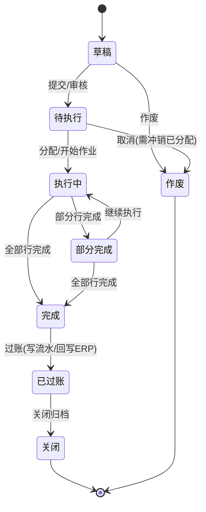
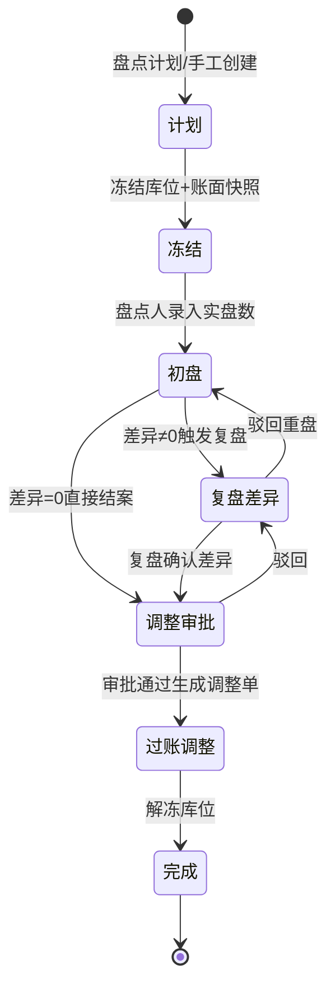
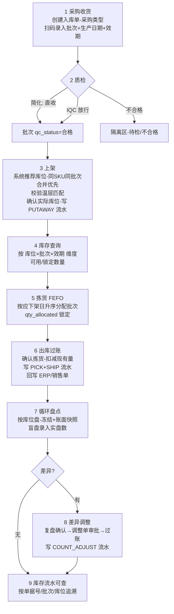
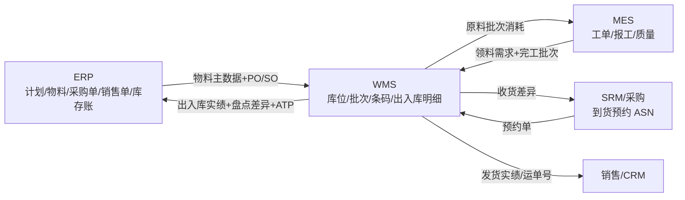

# WMS 核心领域模型调研报告 —— 为 NocoBase 食品行业综合业务系统 WMS 模块做准备

> 研究日期:2026-09-14 | 来源:10 个来源(深读) | 深度:Thorough(标准深度)

---

## 1. 执行摘要

WMS 的领域核心是「库存(Inventory)× 库位(Location)× 批次(Batch)」三维交汇模型:库存表以 (SKU, 库位, 批次, 状态) 为唯一约束,所有变动通过统一入口写入库存事务流水表留痕,这是追溯能力与账实一致性的地基([CSDN/yifan99](https://blog.csdn.net/yifan99/article/details/159805112)、[CSDN/kfepiza](https://blog.csdn.net/kfepiza/article/details/149623539))。食品行业在此基础上叠加四条硬约束:批次+效期管理、FEFO(先到期先出)拣料、温层分区(常温/冷藏/冷冻)、批次双向追溯;其中效期要区分「过期日 / 最佳赏味期 / 应下架日 / 预警日」四个日期概念,FEFO 按应下架日(removal date)而非过期日排序([Odoo 19 官方文档](https://www.odoo.com/documentation/19.0/applications/inventory_and_mrp/inventory/shipping_receiving/removal_strategies/fefo.html)、[C-WMS](https://www.c-wms.com/new/end_3430.html))。

对 NocoBase 落地的关键判断:标准区块(11 种数据区块:Table/Form/Details/List/GridCard/Chart/Calendar/Map/Kanban/Gantt/Comment)可覆盖约 80% 的 WMS 管理界面——单据 CRUD、库存查询、流水查询、效期预警看板均可纯 UI 配置;**库位平面图可视化是唯一 MVP 必需的自定义区块**,条码扫描可先依赖内置 ScanInput 组件与移动端布局降级实现([NocoBase 区块概述](https://docs.nocobase.com/cn/interface-builder/blocks)、[区块扩展文档](https://docs.nocobase.com/cn/plugin-development/client/flow-engine/block))。

MVP 应取「轻量 WMS」一端:按单拣货(不做波次/任务池/AGV)、单级任务表(上架/拣货共用)、简化质检(直收或一键放行),先跑通「采购收货→上架→FEFO 拣货→出库过账→循环盘点→差异调整→流水可查」闭环;波次等重型能力有明确的数据门槛(需 4-8 周 SKU 热度与体积分布数据),不宜在 MVP 引入([Cleverence](https://www.cleverence.com/articles/3pl-business-zh/implement-batch-and-wave-picking-in-warehouse-6381/))。

---

## 2. 关键发现

1. **库存表唯一约束是整个领域模型的精髓**:`(库位, SKU, 批次, 库存状态)` 唯一,配合「现有/已分配/锁定/可用」四数量与乐观锁版本号,防止超卖并支撑 FEFO 分配([CSDN/kfepiza](https://blog.csdn.net/kfepiza/article/details/149623539)、[CSDN/yifan99](https://blog.csdn.net/yifan99/article/details/159805112))。
2. **两种库存-批次建模路径存在分歧**:yifan99 用独立批次表(`batch_id` 外键),kfepiza 在库存表内嵌批次属性字段(`batch_number/production_date/expiry_date`);NocoBase 关系型 collection 下推荐外键方案(批次主数据一处维护),见 §4.1 冲突说明。
3. **所有单据状态机收敛为同一条主链**:`草稿/创建 → 待执行/已分配 → 执行中(部分完成) → 完成/过账 → 关闭/取消`,盘点与调整在此基础上增加「冻结/复盘/审批」环节;库存调整必须走「申请→审批→过账」,直接改账面数是最难查账的写法([CSDN/kfepiza](https://blog.csdn.net/kfepiza/article/details/149623539)、[JeeWMS 拆解](https://juejin.cn/post/7683820796637462554))。
4. **盘点用「库位级冻结 + 账面快照」机制**:盘点单创建时冻结相关库位并快照账面数,复盘对比快照而非实时库存,避免库存流动导致误判差异([JeeWMS 拆解](https://juejin.cn/post/7683820796637462554))。
5. **食品行业效期四日期模型**(Odoo):过期日=入库日+保质期天数(自动计算);应下架日=过期日−N 天;FEFO 按应下架日升序、数量降序、ABC 库位优先排序([Odoo 19 官方文档](https://www.odoo.com/documentation/19.0/applications/inventory_and_mrp/inventory/shipping_receiving/removal_strategies/fefo.html))。
6. **温层是库位属性而非仅仓库属性**:库位表带 `temperature_zone`(常温/冷藏/冷冻),上架时校验 SKU 温层要求与库位温层匹配,可提示或拦截([CSDN/yifan99](https://blog.csdn.net/yifan99/article/details/159805112)、[C-WMS](https://www.c-wms.com/new/end_3430.html))。
7. **NocoBase v2 自带扫码基础设施**:核心包含 `ScanInput/QRCodeScanner/useScanner` 组件,`plugin-block-workbench` 提供扫码工作台区块;v2 区块扩展基类链 `BlockModel → DataBlockModel → CollectionBlockModel → TableBlockModel`,自定义库位图区块可继承 `CollectionBlockModel` 绑定库位数据表([NocoBase 区块扩展](https://docs.nocobase.com/cn/plugin-development/client/flow-engine/block)、[DeepWiki](https://deepwiki.com/nocobase/nocobase/5.4-ui-block-and-visualization-plugins))。
8. **WMS/ERP/MES 边界共识**:ERP 管计划与经营账(物料/供应商/客户/单据),MES 管生产执行(工单/报工/质量),WMS 管仓储现场(库位/批次/条码/出入库明细);接口只传必要数据,保留日志、重试与人工补偿([新天浩图](https://www.xtht.net/articles/wms-mes-erp-integration/))。

---

## 3. 详细分析

### 3.1 核心实体清单(字段/关系/状态机)

以下实体清单综合自 [CSDN/yifan99](https://blog.csdn.net/yifan99/article/details/159805112) 与 [CSDN/kfepiza](https://blog.csdn.net/kfepiza/article/details/149623539) 两篇数据库设计,并按 NocoBase collection 建模习惯整理。标注 ★ 的字段为食品行业/MVP 必需。

#### 3.1.1 仓库结构(多级:仓库→库区→库位)

| 实体 | 关键字段 | 关系 | 状态机 |
|---|---|---|---|
| **仓库 Warehouse** | code、name、type(★常温/冷藏/冷冻/危品)、address、manager、status | 1:N 库区 | 启用/禁用 |
| **库区 Zone** | code、name、type(收货/存储/拣货/发货/退货/残品/★隔离区)、capacity、status | N:1 仓库;1:N 库位 | 启用/禁用 |
| **库位 Location** | code(编码规则如 `仓-区-巷-架-层-位`,例 `A-01-02-03`)、type(地面/货架/流利架)、★温层 temperature_zone(常温/冷藏/冷冻)、体积/承重限制、★混放规则(mix_sku_allowed/mix_batch_allowed)、ABC 分类、坐标(x/y/z 可选)、last_inventory_time | N:1 库区;1:N 库存 | **禁用→空闲→占用→锁定→冻结**(见 §3.2.3) |

库位编码建议采用层级拼接规则:`{仓库码}-{库区码}-{巷道}-{货架}-{层}-{位}`,配合唯一约束 `(warehouse_id, location_code)`([CSDN/yifan99](https://blog.csdn.net/yifan99/article/details/159805112))。MVP 可简化为 仓-区-位 三段。

#### 3.1.2 物料与批次

| 实体 | 关键字段 | 关系 | 状态机 |
|---|---|---|---|
| **物料/SKU** | sku_code、barcode(主条码)、unit、★is_batch_managed(是否批次管理)、★shelf_life_days(保质期天数)、★shelf_life_warning_days(预警天数)、★temperature_requirement(温层要求)、★fefo_required/fifo_required(出库策略)、默认存储库区、ABC 分类、单件重量/体积 | 1:N 批次;N:1 分类 | 启用/禁用 |
| **批次 Batch** | ★batch_no(唯一约束 `(sku_id, batch_no)`)、★production_date、★expiry_date(可由生产日期+保质期自动算出)、★received_date、★supplier_batch_no、supplier_id、来源单号(PO/MO)、★qc_status(待检/合格/不合格/特采)、★quarantine_flag(隔离)、原产国/报关单号(进口食品追溯) | N:1 SKU;N:1 供应商;1:N 库存 | qc_status:待检→合格/不合格/特采;隔离↔放行 |
| **序列号 SN**(可选,食品行业常不需要) | sn(唯一)、当前库位、状态 | N:1 SKU | 在库/出库 |

> **冲突说明**:kfepiza 将批次属性(批次号/生产日期/失效日期)直接内嵌在库存表中;yifan99 建独立批次表用 `batch_id` 关联。独立批次表方案让批次主数据(质检状态、供应商信息)一处维护、入库时一次录入多处引用,且 NocoBase 用 m2o 关系字段建模更自然,**MVP 推荐独立批次表**;内嵌方案省一次 JOIN,适合超高频查询场景。

#### 3.1.3 库存与流水

| 实体 | 关键字段 | 关系 | 状态机 |
|---|---|---|---|
| **库存余额 Inventory** | 唯一约束 `(sku_id, location_id, batch_id, inventory_status)`;数量四件套:qty_on_hand(现有)/qty_allocated(已分配)/qty_locked(锁定)/qty_available(可用=现有−分配−锁定);★inventory_status(良品/待检/冻结/残次);version(乐观锁) | N:1 SKU/库位/批次 | inventory_status 流转(良品↔待检↔冻结等),由数据驱动的状态转换规则表控制,可配置「需填原因/需审批」([CSDN/yifan99](https://blog.csdn.net/yifan99/article/details/159805112)) |
| **库存事务流水 InventoryTransaction** | trans_type(RECEIPT/PUTAWAY/PICK/SHIP/MOVE/ADJUST/COUNT_ADJUST/FREEZE…)、direction(+1/−1)、from/to 三维坐标(SKU+库位+批次+状态+数量)、源单据类型+单号+行号、操作人/时间、quantity_before/after(审计冗余)、transaction_group(同组多笔,如移库一出一入) | N:1 源单据 | 只追加,不修改(append-only) |

数量关系:`可用 = 现有 − 已分配 − 锁定`;所有库存变动必须经统一服务入口同时更新库存表与写流水,「所有库存变动走统一入口……否则流水断了,追溯就成了空话」([JeeWMS 拆解](https://juejin.cn/post/7683820796637462554))。

#### 3.1.4 单据实体(头-行结构)

| 实体 | 关键字段 | 关系 | 状态机(详见 §3.2) |
|---|---|---|---|
| **入库单 ASN/收货单**(采购/生产完工/销售退货) | order_type 区分三类、supplier_id/来源单号(PO/MO/退货单)、expected_arrival_time、expected/received/putaway 三段数量、承运商 | N:1 供应商;1:N 明细 | 创建→部分收货→收货完成→上架中→上架完成→关闭/取消 |
| **入库明细** | sku_id、expected/received/putaway_quantity、★预期批次号/生产日期/失效日期 | N:1 入库单;N:1 SKU | 随头单 |
| **上架任务 PutawayTask** | 源库位(收货暂存区)、suggested_location_id(系统推荐)、actual_location_id(实际)、assigned_to、优先级 | N:1 入库单 | 待分配→已分配→执行中→部分完成→已完成/取消 |
| **出库单**(销售/生产领料/其他) | order_type、customer_id/工单号、expected_ship_date、ordered/picked/shipped 数量、承运商/运单号 | 1:N 明细 | 新建→已分配→部分拣货→拣货完成→发货完成→关闭/取消 |
| **出库明细** | ordered/allocated/picked_quantity、★batch_rule(FIFO/FEFO/指定批次) | N:1 出库单 | 随头单 |
| **拣货任务 PickingTask+明细** | picker_id、pick_type(按单拣 MVP/批量拣后期)、明细精确到 inventory_id(具体库位+批次)与 from_location | N:1 出库单 | 待分配→已分配→执行中→部分完成→已完成/取消 |
| **移库单 MoveTask** | from/to_location、跨仓时 source/target_warehouse、reason | 1:N 明细 | 创建→执行中→部分完成→已完成/取消 |
| **盘点单 CountOrder** | count_type(全盘/循环盘/抽盘)、★is_blind(盲盘)、★冻结快照 | 1:N 明细 | 见 §3.2.2 |
| **盘点明细** | system_quantity(★快照账面数)、counted_quantity、difference、复盘字段(recounted_quantity/by/time)、关联调整单 | N:1 盘点单 | 待盘→已盘→差异→复盘 |
| **库存调整单 Adjustment** | reason(盘点差异/报损/报溢)、明细含 quantity_before/after/difference、审批与过账四组人/时间戳 | 1:N 明细 | 草稿→已审核(审批)→已过账 |
| **条码/标签** | SKU 主条码(sku.barcode)+批次标签(批次号+生产日期+效期,标签上打印)+库位条码;收货时 PDA 扫码录入批次效期,缺失则拦截([C-WMS](https://www.c-wms.com/new/end_3430.html)) | — | — |

(ER 关系综合自 [CSDN/kfepiza](https://blog.csdn.net/kfepiza/article/details/149623539) 的 ER 图与 [CSDN/yifan99](https://blog.csdn.net/yifan99/article/details/159805112) 的三维模型)

### 3.2 状态机设计

#### 3.2.1 单据主状态机(入库/出库/移库/任务共用主链)

| 单据 | 状态链 | 关键分支 |
|---|---|---|
| 入库单(ASN) | 创建 → 部分收货 → 收货完成 → 上架中 → 上架完成 → 关闭 / 取消 | 部分收货:明细 received_quantity < expected;上架完成:全部 putaway |
| 出库单 | 新建 → 已分配 → 部分拣货 → 拣货完成 → (打包) → 发货完成 → 关闭 / 取消 | 分配=按 FEFO 锁定批次与库位(qty_allocated↑);拣货确认后扣减现有量 |
| 上架/拣货/移库任务 | 待分配 → 已分配 → 执行中 → 部分完成 → 已完成 / 取消 | 任务是单据与库存之间的执行层 |
| 库存调整单 | 草稿 → 已审核(审批通过) → 已过账 | 过账才真正改库存并写流水;审批人/过账人/时间戳全部留痕 |

来源:[CSDN/kfepiza](https://blog.csdn.net/kfepiza/article/details/149623539)

#### 3.2.2 盘点单状态机(用户指定链:计划→冻结→初盘→复盘差异→调整审批→完成)

配套机制(来自 [JeeWMS 拆解](https://juejin.cn/post/7683820796637462554)):
- **循环盘点按 ABC 分类设频率**:A 类月盘、B 类季盘、C 类半年盘;**盲盘**(不显示账面数)结果更可信,可与明盘按库区混用。
- **快照原则**:盘点单创建时记录当时账面数为 `system_quantity` 快照,复盘对比快照而非实时库存,避免「一边盘一边动」造成的假差异。
- 差异处理闭环:盘亏盘盈生成调整单→审核→过账;驳回与复盘路径保留。

#### 3.2.3 库位状态机

`初始化 → 禁用 ⇄ 空闲 → 占用 ⇄ 锁定(分配中) / 冻结(盘点/隔离)`;五状态精细管理支持作业中的库位锁定与盘点冻结([CSDN/yifan99](https://blog.csdn.net/yifan99/article/details/159805112))。NocoBase 实现建议:库位表 `status` 单选字段 + 状态流转在服务端校验(可用数据驱动规则表,含「是否需审批」配置)。

### 3.3 食品行业特有需求

| 需求 | 领域模型落点 | 来源 |
|---|---|---|
| **批次+效期管理** | 批次表四日期:生产日期、过期日(=生产日期/入库日+保质期)、最佳赏味期(best-before)、应下架日(removal date=过期日−N 天)、预警日(alert date);SKU 上配置保质期天数与各偏移天数 | [Odoo 19](https://www.odoo.com/documentation/19.0/applications/inventory_and_mrp/inventory/shipping_receiving/removal_strategies/fefo.html) |
| **FEFO 拣料** | 拣货分配 SQL 语义:`ORDER BY 应下架日 ASC, 可用数量 DESC(整批优先), ABC 分类 ASC, 库位编码 ASC`;仅分配 `效期>当天` 且状态=良品的库存;不足一整批时顺延下一批次(Odoo 示例:5 件取自 LOT1+1 件取自 LOT2) | [CSDN/yifan99](https://blog.csdn.net/yifan99/article/details/159805112)、[Odoo 19](https://www.odoo.com/documentation/19.0/applications/inventory_and_mrp/inventory/shipping_receiving/removal_strategies/fefo.html) |
| **PDA 批次校验** | 拣货扫箱码时系统比对实际批次是否为当前最早到期批次,不是则 PDA 提示并可阻止确认;入库扫批次缺失效期信息则拦截不允许入库 | [C-WMS](https://www.c-wms.com/new/end_3430.html) |
| **温层/温区** | 三档:常温、冷藏(0-4℃)、冷冻(-18℃,深冷 -25℃);库位 `temperature_zone` 属性 + SKU `temperature_requirement` 匹配校验(提示或强制);出库也可按订单温层分配库位 | [CSDN/yifan99](https://blog.csdn.net/yifan99/article/details/159805112)、[C-WMS](https://www.c-wms.com/new/end_3430.html) |
| **多级效期预警** | 剩余保质期 30%→预警提醒;20%→禁止常规出库(转临期促销流程);临期批次建议移库至「优先处理区」并标记「促销优先」状态 | [C-WMS](https://www.c-wms.com/new/end_3430.html) |
| **批次追溯(与 MES 打通)** | 库存事务流水按批次聚合即得双向追溯:正向(原料批次→成品批次→出库订单/客户)与反向(问题批次→涉及订单与客户,压窄召回范围);温控异常批次自动转「待检」+移隔离区;追溯精度取决于流水表完整性 | [JeeWMS 拆解](https://juejin.cn/post/7683820796637462554)、[C-WMS](https://www.c-wms.com/new/end_3430.html) |
| **入库质检** | 批次 qc_status(待检/合格/不合格/特采);MVP 可配置「直收」(跳过质检直接合格)或简化 IQC;生产完工入库携带 MES 生产工单与批次号 | [CSDN/yifan99](https://blog.csdn.net/yifan99/article/details/159805112) |

### 3.4 MVP 最小闭环 Workflow(可演示)

设计原则参考:「先跑通标准流程再改策略」「所有库存变动走统一入口」「盘点差异务必走审核」([JeeWMS 拆解](https://juejin.cn/post/7683820796637462554));波次等高级能力先以手工规则替代([Cleverence](https://www.cleverence.com/articles/3pl-business-zh/implement-batch-and-wave-picking-in-warehouse-6381/))。

分步骤说明(每步含领域模型动作):

| 步骤 | 操作 | 涉及实体/状态变化 | NocoBase 实现要点 |
|---|---|---|---|
| 1 采购收货 | 创建入库单(采购类型),明细扫码录入批次/生产日期/效期 | ASN:创建→部分收货;批次表插入;缺失效期拦截 | 表单区块(头-行子表格)+ ScanInput |
| 2 质检放行 | 简化为「直收」或一键放行 | 批次 qc_status:待检→合格 | 行内操作/工作流按钮 |
| 3 上架 | 系统推荐库位(同 SKU 同批次合并→同温层空闲位),确认实际库位 | 上架任务:已完成;库存+;PUTAWAY 流水;库位:空闲→占用 | 表单+库位推荐(自定义 server 端逻辑) |
| 4 库存查询 | 按库位×批次×效期查可用量 | 库存表只读 | Table 区块+筛选(日期/温层/状态) |
| 5 拣货(FEFO) | 按应下架日升序自动分配批次与库位 | 出库单:已分配;qty_allocated↑ | 自定义分配动作(服务端 SQL) |
| 6 出库过账 | 确认拣货数量,扣库存 | 出库单:发货完成;qty_on_hand↓;PICK/SHIP 流水 | 操作按钮+事务 |
| 7 循环盘点 | 选库区生成盘点单,冻结库位+快照账面 | 盘点单:计划→冻结→初盘 | 表格+移动端布局 |
| 8 差异调整 | 复盘→调整单→审批→过账 | 调整单:草稿→审核→过账;COUNT_ADJUST 流水;解冻 | 审批流(NocoBase workflow 手动节点) |
| 9 流水可查 | 按单据号/批次/库位/时间查事务流水 | inventory_transaction 只读 | Table 区块+关联跳转(单据↔流水) |

### 3.5 WMS UI 视图需求 × NocoBase 区块能力边界

NocoBase v2 标准数据区块清单(官方文档侧边栏):**表格 Table、表单 Form、详情 Details、列表 List、网格卡片 GridCard、图表 Chart、日历 Calendar、地图 Map、看板 Kanban、甘特图 Gantt、评论 Comment**;筛选区块(表单/树);其他区块(操作面板/Iframe/Markdown/JS Block)([NocoBase 界面搭建](https://docs.nocobase.com/cn/interface-builder)、[区块概述](https://docs.nocobase.com/cn/interface-builder/blocks))。另有移动端独立布局、区块/字段联动规则、数据范围等配置能力。

| WMS 视图需求 | 标准区块能否覆盖 | 方案 | 优先级 |
|---|---|---|---|
| 单据管理(入库/出库/移库/盘点/调整 CRUD+审批) | ✅ 能 | Table+Form(Drawer)+Details+子表格;审批用 workflow | P0(MVP) |
| 库存查询(库位×批次×效期) | ✅ 能 | Table+筛选区块(温层/状态/效期区间),日期字段到期预警染色(字段组件配置) | P0(MVP) |
| 库存事务流水 | ✅ 能 | Table(append-only 只读)+按单据号/批次筛选 | P0(MVP) |
| 库龄/效期预警看板 | ✅ 基本能 | Chart 区块(饼/柱/双轴,基于效期分布聚合)+统计卡;C-WMS 的「30%/20% 多级预警」用图表+工作流定时任务提醒 | P0(MVP) |
| 条码扫描操作界面 | ⚠️ 部分 | 核心自带 `ScanInput/QRCodeScanner` 组件与 `plugin-block-workbench` 扫码工作台;MVP 用移动端布局+扫码输入框降级(录入式);工业 PDA 级引导式流程(离线优先/次秒反馈)后期自定义 | P1(移动端 MVP 可演示;PDA 体验后期) |
| **库位图(平面可视化:占用/空闲/禁用)** | ❌ 不能 | **自定义区块**:继承 `CollectionBlockModel` 绑定库位/库存数据,`renderComponent` 渲染仓库平面 SVG/网格,颜色映射库位状态;`registerFlow` 提供配置面板 | **P0.5(MVP 必需,演示核心)** |
| 看板式作业(拣货任务按状态分列) | ✅ 能 | Kanban 区块按任务状态分组 | P1 |
| 库存热力/路径优化视图 | ❌ 不能 | 自定义区块(后期;依赖坐标数据) | P2 |

自定义区块开发路径(v2):继承基类链 `BlockModel → DataBlockModel → CollectionBlockModel → TableBlockModel` 之一,`define()` 设显示名,`registerFlow()` 加可视化配置,`Plugin.load()` 中 `flowEngine.registerModelLoaders()` 注册后即出现在「添加区块」菜单([NocoBase 区块扩展](https://docs.nocobase.com/cn/plugin-development/client/flow-engine/block))。官方有 `@nocobase-example/plugin-simple-block` 与 `plugin-collection-block` 完整示例。

### 3.6 与 ERP/MES/SRM/销售的集成点

系统边界共识([新天浩图](https://www.xtht.net/articles/wms-mes-erp-integration/)):ERP 管计划与经营数据(物料/供应商/客户/计划/单据/库存账),MES 管生产执行(工单/工序/报工/质量/追溯),WMS 管仓储现场(入库/出库/库位/批次/盘点/条码)。接口原则:只传必要数据;保留日志、重试与人工补偿。

| 集成方向 | 下行(→WMS) | 上行(WMS→) | MVP 建议 |
|---|---|---|---|
| **ERP(单据来源/库存账)** | 物料主数据、采购订单(生成 ASN 预期)、销售订单(生成出库需求)、BOM/生产计划 | 出入库实绩回写(过账单据+数量+批次)、盘点差异调整结果 | MVP 先同库(NocoBase 自建采购/销售单据),预留回写事件 |
| **MES(生产)** | 领料需求(生产工单→领料出库单)、完工报告(生产批次→成品入库单+批次号绑定) | 领料出库实绩(原料批次消耗→正向追溯链)、成品入库批次 | 与本平台 MES 模块同库打通,批次号作为关联键 |
| **SRM/采购(ASN 到货预约)** | 到货预约(供应商/订单/预计到达时间/预期批次效期)→ 预生成 ASN | 实际收货差异(少收/拒收)回传 | 预约可简化为 ASN 的 expected_arrival_time 字段 |
| **销售/CRM(出库发货)** | 销售订单/发货通知(收货地址/时效) | 发货实绩(运单号/发货时间)、库存可承诺量(ATP 查询) | 出库过账后自动更新销售单发货状态 |

### 3.7 行业参考:轻量 vs 重型 WMS 的分界与 MVP 取向

| 维度 | 轻量 WMS(参考:Odoo Inventory、JeeWMS) | 重型 WMS(波次/任务池/AGV) |
|---|---|---|
| 拣货模型 | 按单拣货(single order picking),逐单打单 | 波次编排:多订单按时间窗/渠道/承运商合波,波内混用批量拣/分区拣/分播墙([Cleverence](https://www.cleverence.com/articles/3pl-business-zh/implement-batch-and-wave-picking-in-warehouse-6381/)) |
| 任务管理 | 单级任务表(上架/拣货/移库各自简单状态机) | 任务池+优先级调度+设备约束(拣选车位/播种墙格位/打包台吞吐) |
| 自动化 | 人工+手持扫描 | AGV/输送线/立体库/电子标签联动 |
| 数据门槛 | 基础主数据(SKU/库位/批次) | 需 4-8 周 SKU 热度、体积分布、订单重叠度、拥塞曲线数据才能定合批与封波阈值 |
| 适用单量 | 中低单量、B2B 为主 | 电商大促、日万单级、3PL 多货主 |
| 上架策略 | 同 SKU 同批次合并+温层/分区校验 | 动线优化(黄金拣选位/双位结构/前置补货) |
| 批次效期 | 完整支持(轻量≠简化效期,食品业 FEFO 属轻量必选) | 同左+波次内 FEFO 批次锁定 |

参考系统的模块与字段设计要点:
- **Odoo Inventory**(轻量标杆):批次(lot)/序列号开关在产品级配置;removal strategy(FIFO/LIFO/FEFO)设在库位或产品分类上,产品分类的 Force Removal Strategy 优先;效期四日期自动计算;收货/库存调整时分配批次([Odoo 19 官方文档](https://www.odoo.com/documentation/19.0/applications/inventory_and_mrp/inventory/shipping_receiving/removal_strategies/fefo.html))。启示:**把「是否批次管理/出库策略/保质期」做成 SKU 级配置**而非全局开关。
- **JeeWMS**(国内开源,Spring Cloud+Vue,GPL-3.0):库内五主线=上架策略/库内移动单据化/循环盘点/批次效期/追溯查询;PDA(UNI-APP)与 Web 共用后端服务([JeeWMS 拆解](https://juejin.cn/post/7683820796637462554))。启示:**移动端与 Web 端共用同一套服务/数据模型**,正好对应 NocoBase 移动端布局复用同一 collection。
- **C-WMS 冷链 SaaS**(行业参考):批次效期多级预警(30%/20%)、临期移库建议+「促销优先」状态、PDA 批次校验拦截、温区分策([C-WMS](https://www.c-wms.com/new/end_3430.html))。

**MVP 结论:取轻量端**。理由:(1) 波次/任务池有明确数据门槛,新系统无历史数据可依据([Cleverence](https://www.cleverence.com/articles/3pl-business-zh/implement-batch-and-wave-picking-in-warehouse-6381/));(2) 食品行业 B2B 业务单量通常中低,按单拣货+FEFO 已满足;(3) NocoBase 标准区块对按单作业的管理界面覆盖度高,重型能力的自定义成本不成比例。领域模型上**预留**波次表(wave/wave_detail)与任务池的扩展位置(拣货任务表已含 pick_type/zone_id 字段),但 MVP 不实现波次编排。

---

## 4. 反面观点与风险(Contrarian Views)

1. **WMS 不是食品安全的第一道防线**:C-WMS 明确提醒「WMS 系统属于管理辅助工具,不能替代人工质量检查及冷链硬件保障。冷冻食品的效期安全,仍需依托合规的制冷设备、温度监控体系以及规范的人员操作共同实现」([C-WMS](https://www.c-wms.com/new/end_3430.html))。对本项目的含义:温层字段≠温控,温湿度监控数据对接与告警是独立的物联能力,MVP 不要承诺「冷链合规」。
2. **低代码平台做 WMS 的性能与并发疑虑**:库存扣减的高并发一致性(乐观锁/悲观锁)、FEFO 分配的事务隔离,是低代码默认 CRUD 难以直接表达的;文献中的乐观锁版本号设计([CSDN/yifan99](https://blog.csdn.net/yifan99/article/details/159805112))在 NocoBase 需要用服务端自定义逻辑/workflow 实现而非纯 UI 配置。演示规模(单用户/少量数据)与生产规模(多人并发拣货)之间有真实鸿沟。
3. **过度设计的风险**:重型 WMS 功能(波次、AGV、路径优化)在数据不足时引入会「越拣越绕」——Cleverence 的陷阱清单指出「规则先行、数据滞后」是常见失败模式([Cleverence](https://www.cleverence.com/articles/3pl-business-zh/implement-batch-and-wave-picking-in-warehouse-6381/));反之若客户实际是电商高单量场景,轻量 MVP 会很快触顶——**选型前需用真实单量/单行数数据验证**(本文未获得该输入,见开放问题)。
4. **厂商内容偏差**:本报告引用的 C-WMS/Cleverence/标领等来源带有产品营销性质(如 Cleverence 文中植入 3PL 计费产品),其功能描述(如「效期损耗可降低 40%」类宣传数字)未经独立验证,仅采信其机制描述,不采信其效果数字。
5. **盘点冻结影响作业**:库位级冻结+快照虽然保证数据准确,但冻结期间该库位不能出入库,对连续作业的仓库有业务干扰;需与用户确认可接受的盘点窗口([JeeWMS 拆解](https://juejin.cn/post/7683820796637462554))。

## 5. 开放问题

1. **目标客户的真实单量与拣货模式**(B2B 整箱 vs B2C 拆零、日均单量、订单行数)未获得——直接决定轻量/重型的分界是否成立,建议在需求访谈中量化。
2. NocoBase v2 `plugin-block-workbench` 扫码工作台的成熟度(离线能力、工业 PDA 兼容性、扫描防抖)未实测——MVP 演示可用移动端布局,但商用扫码体验需 PoC 验证。
3. 库位图自定义区块的渲染方案(SVG 平面图 vs CSS Grid)与数据量上限(千级库位的渲染性能)需在本地 platform/nocobase 快照中做技术验证。
4. 与 MES 生产批次的关联键设计(WMS 批次号 = MES 工单批次号,还是映射表)未定;影响正向追溯链的实现复杂度。
5. 多货主(owner)需求:若客户是单一食品企业可砍掉 owner 维度简化模型;若做 3PL 则必须保留——需业务确认。
6. 计量单位换算(箱↔千克,食品行业常见双单位)在所读来源中均未展开,MVP 若需双单位库存需补充调研。

## 6. 来源

| # | 来源 | 类型 | 日期 | 访问日 |
|---|---|---|---|---|
| 1 | [WMS核心数据模型设计:库存、库位与批次的三维管理 - CSDN/yifan99](https://blog.csdn.net/yifan99/article/details/159805112) | 社区技术文章(含完整 DDL) | 2026 | 2026-09-14 |
| 2 | [WMS仓库管理系统的数据库表设计 笔记 - CSDN/kfepiza](https://blog.csdn.net/kfepiza/article/details/149623539) | 社区技术文章(全实体表设计+ER 图) | 2025-07 | 2026-09-14 |
| 3 | [JeeWMS 开源仓库管理系统库内管理流程拆解 - 掘金](https://juejin.cn/post/7683820796637462554) | 开源系统流程分析(二级) | 2026-09-11 | 2026-09-14 |
| 4 | [冷库WMS如何通过批次精细化管理助力冷冻食品效期管控 - C-WMS](https://www.c-wms.com/new/end_3430.html) | SaaS 厂商行业文章(营销性,取机制) | 2026-05-08 | 2026-09-14 |
| 5 | [FEFO removal — Odoo 19.0 官方文档](https://www.odoo.com/documentation/19.0/applications/inventory_and_mrp/inventory/shipping_receiving/removal_strategies/fefo.html) | **一手官方文档** | 2026 | 2026-09-14 |
| 6 | [区块扩展 - NocoBase 官方文档(v2)](https://docs.nocobase.com/cn/plugin-development/client/flow-engine/block) | **一手官方文档** | 2026 | 2026-09-14 |
| 7 | [区块概述 / 界面搭建 - NocoBase 官方文档](https://docs.nocobase.com/cn/interface-builder/blocks) | **一手官方文档** | 2026 | 2026-09-14 |
| 8 | [UI Block and Visualization Plugins - DeepWiki/nocobase](https://deepwiki.com/nocobase/nocobase/5.4-ui-block-and-visualization-plugins) | 源码级自动文档(含 ScanInput/workbench 插件文件路径) | 2026-07 | 2026-09-14 |
| 9 | [WMS、MES 与 ERP 集成方案 - 苏州新天浩图](https://www.xtht.net/articles/wms-mes-erp-integration/) | 集成商技术文章 | 2026-04 | 2026-09-14 |
| 10 | [仓库如何实施批量拣选与波次拣选 - Cleverence](https://www.cleverence.com/articles/3pl-business-zh/implement-batch-and-wave-picking-in-warehouse-6381/) | 厂商方法论文章(含软广,取方法) | 2026-06 | 2026-09-14 |

## 7. 方法论

- **搜索引擎**:DuckDuckGo(经 chrome-devtools 直开,过滤广告与赞助结果),共 6 组查询:①「WMS 领域模型 仓库 库区 库位 批次 数据库设计」②「食品行业 WMS FEFO 批次效期管理 温层 冷链」③「NocoBase 区块 block 类型 Table Form Kanban Calendar 自定义区块」④「Odoo Inventory lot serial number removal strategy FEFO documentation」⑤「WMS ASN 到货预约 ERP MES 集成 接口」⑥「WMS 轻量 重型 区别 波次拣选 任务池 选型」。
- **深读方式**:对 10 个候选 URL 逐一经 chrome-devtools 导航并 `evaluate_script` 提取正文(过滤 cookie 横幅/导航/广告);CSDN 文章提取了完整 DDL 与表格;NocoBase 文档额外抓取侧边栏导航获得权威区块类型清单。
- **来源结构**:2 篇一手官方文档(Odoo、NocoBase×2)+ 1 篇源码级文档(DeepWiki)+ 4 篇社区技术文章 + 3 篇厂商行业文章(已标注营销偏差)。
- **限制**:hupun.com(波次 vs ERP 拣货)两次超时未能深读,已用 Cleverence 文章替代;英文重型 WMS 文献(如曼哈特/Blue Yonder)未覆盖,重型侧论据主要来自中文方法论文章;效果类数字(损耗降低 40% 等)一律未采信。
