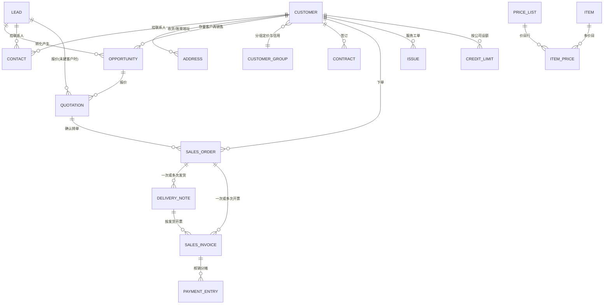
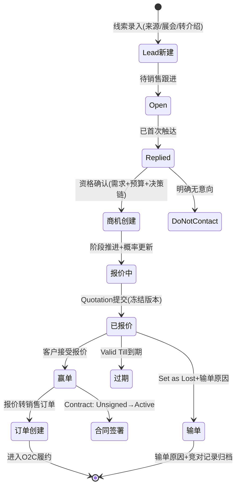
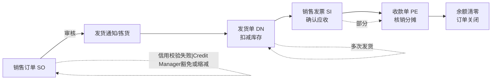
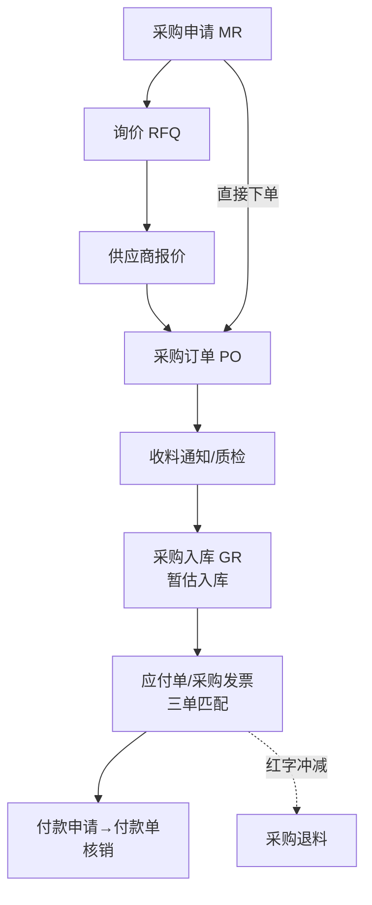
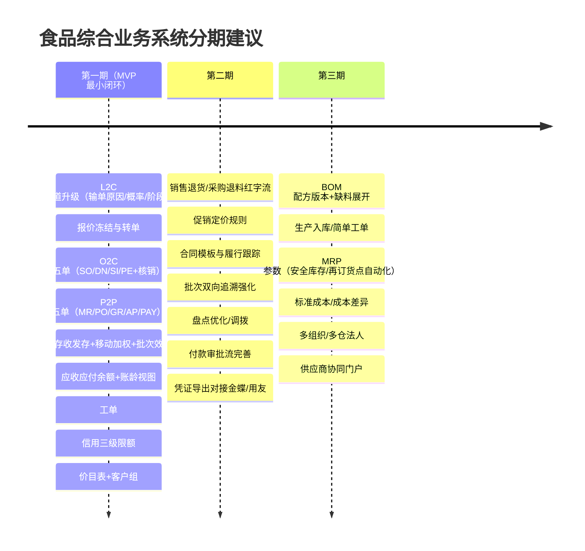

# 企业级 CRM + ERP 核心领域模型调研报告
## ——面向 NocoBase 低代码平台的食品行业综合业务系统首期设计输入

> 研究日期：2026-09-15 | 来源：40+ 来源（深读 23） | 深度：Exhaustive
> 范围：中小食品制造企业口径（非巨型集团）；对标 ERPNext 15/16、Odoo 18、金蝶云星空

---

## 1. 执行摘要

现有 `crm_*` 域（activities/contacts/customers/deals/follow-ups/leads/products/quotes/reports/targets）只覆盖了"线索—商机—报价"的前半段漏斗，缺少把商机变成钱的三样东西：**承诺单据（合同/销售订单）、履约单据（发货/发票/收款核销）、以及采购与库存核算的闭环**。对标三个成熟系统后可以确认，企业级 CRM 与 ERP 的分界线正是"报价单按下确认键之后"——ERPNext 的官方 O2C 链是 Quotation → Sales Order → Delivery Note → Sales Invoice → Payment Entry（[ERPNext Sales Order 文档](https://docs.frappe.io/erpnext/sales-order)），金蝶云星空的对应链是销售订单 → 发货通知单 → 销售出库单 → 应收单 → 收款单（[金蝶销售单据同步插件文档](https://hc.jiandaoyun.com/open/22371)、[Vizwise 金蝶采购数据表速查](https://vizwise.cn/posts/kingdee-purchase-table-guide)）——两条链的单据语义几乎一一对应。

本报告给出的核心结论：**首期最小可用闭环 = L2C 商机管理 + O2C 订单到收款 + P2P 采购到付款（简化三单匹配）+ 库存收发存（移动加权计价）+ 业务口径应收应付余额（不建复式总账）+ 服务工单**。财务总账、BOM/MRP 自动运算、成本会计明确排除在首期之外（判断依据见 §4.4/§4.5）。信用控制与价格体系是 CRM-ERP 的两个关键集成缝，均有成熟开源实现模式可抄（[ERPNext Credit Limit](https://docs.frappe.io/erpnext/credit-limit)）。

低代码实现形态方面，NocoBase 官方区块库（Table/Form/Details/List/Grid Card/Chart/Calendar/Map/Kanban/Gantt/Comment + 筛选区块 + 联动规则，[NocoBase 区块概述](https://docs.nocobase.com/cn/interface-builder/blocks)）可以覆盖约 80% 的场景；销售漏斗、应收账龄、单据下推转换三个场景需要工作流 + 图表数据源自定义的组合方案，不需要写自定义前端组件（详见 §6）。

---

## 2. 关键发现

1. **CRM 实体清单收敛且高度一致**：Lead（线索）→ Opportunity（商机）→ Quotation（报价）→ Customer（客户）的管道模型在 ERPNext、Odoo、金蝶三个体系里语义一致，差异只在单/双实体（Odoo 用同一 `crm.lead` 模型双态表示，[Braincuber: Lead vs Opportunity](https://www.braincuber.com/tutorial/odoo18-lead-opportunity-difference-guide)；ERPNext 分两个 DocType，[Sales Pipeline](https://docs.frappe.io/erpnext/sales-pipeline)）。
2. **单据状态机的"金蝶模式"值得直接采用**：单据头公共状态（暂存/创建/审核中/已审核/重新审核）+ 行关闭状态 + 作废状态三轴分离（[Vizwise 金蝶数据表速查 §3.3](https://vizwise.cn/posts/kingdee-purchase-table-guide)），比单一 status 字段更适合低代码平台的多角色协作。
3. **O2C 的状态不是一条线而是两个正交维度**：ERPNext Sales Order 用 `Status`（To Deliver and Bill 等 8 态）+ `Delivery Status` + `Billing Status` 三字段并行（[Sales Order 文档](https://docs.frappe.io/erpnext/sales-order)），发货和开票可以部分完成、任意顺序，这是"部分发货/部分开票"的真实业务要求。
4. **收款核销（Payment Application）是 O2C 最容易被低估的实体**：Payment Entry 需支持一张收款单分摊到多张发票、部分收款、预收款未分摊余额、后续 Payment Reconciliation（[Payment Entry 文档](https://docs.frappe.io/erpnext/payment-entry)）。
5. **库存计价建议移动加权**：中小企业实践一般限于 FIFO 与移动加权（[Frappe 官方博客](https://frappe.io/blog/erpnext-features/inventory-valuation-method-fifo-vs-moving-average)）；移动加权平滑食品原料价格波动、允许负库存暂估，且实现复杂度远低于 FIFO 批次成本队列——低代码平台首选。标准成本法适合工艺稳定的深加工企业，首期不取。
6. **财务边界：业务单据 + 应收应付余额，不建复式总账**。ERPNext/金蝶的凭证生成都依赖专门的会计引擎模块（金蝶"智能会计平台"，[金蝶实施手册目录](https://www.kancloud.cn/cy126249/k3cloud_ipm_v8)），低代码平台自建总账科目试算平衡的风险大于收益（论证见 §4.5）。
7. **BOM 首期只做"配方主数据"，MRP 运算不进最小闭环**：MRP 需要 MPS+BOM+提前期+安全库存全链数据质量（[知乎：细说 MRP](https://zhuanlan.zhihu.com/p/680078034)），且金蝶将工程数据/计划管理列为独立于供应链的模块、ERPNext 将 Manufacturing 列为独立可选模块（[ERPNext Manufacturing](https://docs.frappe.io/erpnext/manufacturing)）——两者在成熟产品里都是供应链跑顺之后的第二阶段（判断详见 §4.6）。
8. **信用控制有标准三级模式**：客户级 → 客户组级 → 公司级兜底限额，SO 提交时校验占用、SI 提交时校验应收余额，超限可由 Credit Manager 角色豁免（[ERPNext Credit Limit](https://docs.frappe.io/erpnext/credit-limit)；校验代码逻辑见 [Nexeves 技术流分析](https://nexeves.com/blog/ERPNext/sales-and-purchase-cycle-in-erpnext-technical-flow-from-order-to-accounting)）。金蝶供应链云同样把信用管理作为供应链云组成部分（[金蝶供应链云](https://kingdee.org/galaxy_scm.html)）。
9. **价格体系三件套**：价目表（Price List）+ 物料价格（Item Price，含 UOM/包装单位/起订量/客户专属/批次专属）+ 定价规则（Pricing Rule，促销折扣），ERPNext 三者齐全（[Item Price 文档](https://docs.frappe.io/erpnext/item-price)、[Quotation 文档](https://docs.frappe.io/erpnext/quotation)）；金蝶有对应采购价目表（t_PUR_PriceList，[Vizwise §3.1](https://vizwise.cn/posts/kingdee-purchase-table-guide)）。
10. **NocoBase 区块覆盖度超预期**：官方原生有 Gantt（订单履约跟踪）、Kanban（销售管道）、Calendar（跟进/收款计划）、Chart 区块 + 数据范围/区块联动/字段联动规则（[NocoBase 区块概述](https://docs.nocobase.com/cn/interface-builder/blocks)），信用校验可用字段联动 + 工作流在保存前拦截。

---

## 3. 详细分析 A：企业级 CRM 核心实体清单

### 3.1 实体总表（字段 / 关系 / 状态机）

以下字段清单综合 ERPNext 官方文档逐实体整理（[Lead](https://docs.frappe.io/erpnext/lead)、[Opportunity](https://docs.frappe.io/erpnext/opportunity)、[Quotation](https://docs.frappe.io/erpnext/quotation)、[Contract](https://docs.frappe.io/erpnext/contract)、[Issue](https://docs.frappe.io/erpnext/issue)、[Sales Order](https://docs.frappe.io/erpnext/sales-order)），并补充金额/币种/税率字段。

| 实体 | 关键字段 | 主要关系 | 状态机 |
|---|---|---|---|
| **Lead 线索** | 线索类型(个人/组织)、公司名、联系人姓名、性别、邮箱、电话、来源(Source)、市场细分、行业、负责人(owner)、下次联系日期 | 1→n Contact、1→n Address、1→n Opportunity、1→n 活动 | Lead→Open→Replied→Opportunity→Quotation→Lost Quotation/Interested→Converted/Do Not Contact（9 态，[Lead 文档](https://docs.frappe.io/erpnext/lead)） |
| **Contact 联系人** | 姓名、邮箱、电话、是否主联系人、所属客户/线索 | n↔n Customer、n↔n Lead | 无生命周期（挂起/激活） |
| **Opportunity 商机** | 关联方类型(Lead/Customer)、商机类型(销售/支持/维护)、**商机金额、币种、成交概率**、销售阶段(Sales Stage)、预计成交日、需求明细(With Items：物料+数量)、来源、下次联系日期/负责人 | n→1 Lead/Customer、1→n Quotation、1→n 活动、1→n 竞争对手 | 阶段机（Entry/Qualification/Proposal/Quotation/Won/Lost）+ 超时自动关闭（auto-close 天数，[Opportunity 文档](https://docs.frappe.io/erpnext/opportunity)） |
| **Customer 客户** | 客户名称、客户组、territory、币种、默认价目表、付款条件、**信用额度(按公司分行的 Credit Limit 表)**、应收科目、发货地址/账单地址、联系人 | 1→n Contact/Address/Opportunity/SO/SI、n→1 Customer Group | 无生命周期（启用/停用/冻结） |
| **Quotation 报价单** | 报价对象(Lead/Customer)、有效期至、订单类型、**币种(汇率)**、销售价目表、明细行(物料/数量/UOM/单价/**毛利率/折扣**/仓库/可替代品)、税模板(Sales Taxes and Charges)、运费规则、Incoterm、付款条件模板、条款 | n→1 Lead/Customer+Opportunity、1→n Sales Order | Draft→Open→Ordered/Lost/Expired→Cancelled（6 态，[Quotation 文档](https://docs.frappe.io/erpnext/quotation)） |
| **Contract 合同** | 客户、合同条款(模板化)、合同起止日期、是否签署、签署人、签署日期、履约条款子表(要求/备注)、关联合同模板 | n→1 Customer；References 可链接 Quotation/Sales Order/Purchase Order/Sales Invoice/Project | Unsigned→Active→Inactive（3 态，[Contract 文档](https://docs.frappe.io/erpnext/contract)） |
| **Sales Order 销售订单** | 客户、公司、订单类型、交易日、**承诺交货日(行级)**、明细行(物料/数量/UOM/单价/金额/源仓库)、税、付款条件、总额；派生：已交货%、已开票% | n→1 Customer+Quotation、1→n Delivery Note、1→n Sales Invoice | 主状态 8 态 + **Delivery Status 与 Billing Status 正交双维度**（[Sales Order 文档](https://docs.frappe.io/erpnext/sales-order)） |
| **Issue 服务工单** | 主题、提出人邮箱、关联客户、优先级(Low/Medium/High)、工单类型、SLA、描述 | n→1 Customer、1→n 沟通记录 | Open→Replied→Hold→Resolved→Closed（客户回复自动重开为 Open，[Issue 文档](https://docs.frappe.io/erpnext/issue)） |
| **销售活动/跟进** | 类型(电话/邮件/会议)、日期、参与人、关联对象(多态)、结果、下次跟进日期 | n→1 任意 CRM 实体 | 计划→已完成/取消 |

**金额/币种/税率通用字段**（所有单据共用）：币别、汇率、不含税单价(Rate)、**税率/税额(Tax Amount)**、价税合计(Grand Total)、本位币金额。金蝶明细行标准字段即含"含税单价 FTAXPRICE / 价税合计 FALLAMOUNT"（[Vizwise §2.2](https://vizwise.cn/posts/kingdee-purchase-table-guide)），印证含税/不含税双口径是标配。

### 3.2 实体关系（ER 描述）

关键 ER 约束（来自证据综合）：
- **报价可面向 Lead 或 Customer 双态**（Quotation To 字段，[Quotation 文档](https://docs.frappe.io/erpnext/quotation)），线索不必先转客户即可报价——食品贸易场景（先谈价后建档）必需。
- **SO 是履约的枢纽**：部分发货由"1 个 SO → n 个 DN"实现，数量可在 DN 行修改（[Delivery Note 文档](https://docs.frappe.io/erpnext/delivery-note)）。
- **核销是 n:m 关系**：一张 Payment Entry 可分摊到多张 SI（References 子表 + allocated_amount + unallocated_amount，[Payment Entry 文档](https://docs.frappe.io/erpnext/payment-entry)）。

### 3.3 L2C 全生命周期状态机（lead → qualified → opportunity → quote → contract → order）

**转换条件（来自 ERPNext/Odoo 官方文档综合）**：
- Lead→Opportunity：销售手动"Create>Opportunity"（[Lead 文档](https://docs.frappe.io/erpnext/lead)），字段值自动复制；资格判定（需求/预算/时间窗）由销售阶段字段承载。
- Opportunity→Quotation："Make>Quotation"，需求明细行带入（[Opportunity 文档](https://docs.frappe.io/erpnext/opportunity)）。
- Quotation→Sales Order：**提交后的报价单**才能 Create>Sales Order（Draft 不能转，[Quotation 文档](https://docs.frappe.io/erpnext/quotation)）——"提交冻结报出版本"是单据状态机的关键设计。
- 报价超期：Valid Till 过后状态变 Expired（系统判定）。
- 合同：赢单时可从报价/订单关联生成 Contract，签署后 Active（[Contract 文档](https://docs.frappe.io/erpnext/contract)）。

### 3.4 输单原因分类（Lost Reason）

Odoo 的实现是**可配置主数据 + 自由备注**双字段：Lost Reason 下拉（CRM ‣ Configuration ‣ Lost Reasons 维护）+ Closing Note 补充说明，非必填但官方建议必录，并支持按 Lost Reason 筛选分析、Restore 恢复（[Odoo 18 Lost Opportunities](https://www.odoo.com/documentation/18.0/applications/sales/crm/pipeline/lost_opportunities.html)）。ERPNext 在 Opportunity 上额外记录**竞争对手 + 详细原因**（[Opportunity 文档](https://docs.frappe.io/erpnext/opportunity)）。

食品行业 B2B 建议初始化的输单原因分类（综合 Odoo 默认集与行业常识）：

| 分类 | 示例 |
|---|---|
| 价格类 | 价格高于竞对 / 超出预算 / 促销未达预期 |
| 产品类 | 规格/包装不适配 / 无对应资质(SC/有机/清真) / 保质期不满足渠道要求 |
| 竞争类 | 竞对中标（记录竞对名称）/ 现有供应商关系 |
| 客户类 | 预算取消 / 内部决策延迟 / 联系人离职 |
| 供应链类 | 起订量不足 / 产能/交期无法满足 / 冷链覆盖不到 |
| 其他 | 无需求 / 骚扰线索 / 重复线索 |

> 设计要点：输单原因是**字典表**（可增改）+ 竞对是**独立实体**（可统计）+ Closing Note 是**自由文本**，三者分开（Odoo/ERPNext 双源验证）。

---

## 4. 详细分析 B：企业级 ERP 核心（中小食品制造口径）

### 4.1 订单到现金 O2C 全链

| 单据 | 职责 | 状态机 | 证据 |
|---|---|---|---|
| Sales Order 销售订单 | 承诺记录（客户/物料/数量/价格/交期/税/条款） | Draft / To Deliver and Bill / To Deliver / To Bill / Completed / On Hold / Closed / Cancelled + Delivery%/Billing% | [Sales Order](https://docs.frappe.io/erpnext/sales-order) |
| Delivery Note 发货单 | 出库执行，可部分发货（SO 10 件分两周两张 DN） | Draft / To Bill / Completed / Return Issued / Cancelled / Closed（短交关闭） | [Delivery Note](https://docs.frappe.io/erpnext/delivery-note) |
| Sales Invoice 销售发票 | 应收确认 | Draft / Unpaid / Overdue / Partly Paid / Paid / Credit Note Issued / Return / Cancelled | [Sales Invoice](https://docs.frappe.io/erpnext/sales-invoice) |
| Payment Entry 收款单 | 资金到账+核销 | Receive / Pay / Internal Transfer + 分摊行级状态 | [Payment Entry](https://docs.frappe.io/erpnext/payment-entry) |

SAP 的经典 O2C 七步（Pre-sales → SO(VA01) → Delivery(VL01N) → Goods Issue → Billing(VF01) → AR → Incoming Payment(F-28)）与上述单据链同构（[voisap SAP O2C 指南](https://www.voisap.com/sap-order-to-cash-process)）；通用 O2C 框架还强调信用检查是第 2 步（订单管理之后、履约之前），cash application（到账匹配）与催收(collections)是末端（[Bluecopa O2C 9 步](https://www.bluecopa.com/blog/order-to-cash-process)、[Upflow O2C](https://upflow.io/blog/ar-collections/order-to-cash-process)）。

**低代码实现取舍**：食品中小企业常见"货到签收、月结开票"——首期可把发货通知/拣货合并进发货单，但 **DN→SI 的"按发货开票"关系必须保留**，否则月结对账无单据依据。

### 4.2 采购到付款 P2P

ERPNext 官方采购周期七阶段：**Material Request → RFQ → Supplier Quotation → Purchase Order → Purchase Receipt → Purchase Invoice → Payment Entry**（[Procurement Cycle Overview](https://docs.frappe.io/erpnext/procurement-cycle-overview)）。金蝶云星空对应链：**采购申请单 → 采购订单 → 收料通知单 → 采购入库单 → 应付单 → 付款申请单 → 付款单**（FormId：PUR_Requisition → PUR_PurchaseOrder → PUR_ReceiveBill → STK_InStock → AP_PAYABLE → CN_PAYAPPLY → AP_PAYBILL，[Vizwise §1.1](https://vizwise.cn/posts/kingdee-purchase-table-guide)）。

三个关键机制（金蝶实证，[Vizwise §1.3 案例](https://vizwise.cn/posts/kingdee-purchase-table-guide)）：
1. **暂估应付**：入库时未收到发票，按订单单价暂估成本与应付；收票后三单匹配（订单单价 × 入库数量 vs 发票金额）通过，冲回暂估转正式应付。
2. **付款申请与付款执行分离**：CN_PAYAPPLY（内部审批）→ AP_PAYBILL（出纳执行），食品行业供应商付款审批流必备。
3. **Material Request 的多类型**：Purchase / Material Transfer / Material Issue / Manufacture / Subcontracting / Customer Provided 六类，状态 Pending / Partially Ordered / Ordered / Issued / Transferred / Received（[Material Request 文档](https://docs.frappe.io/erpnext/material-request)）——首期只需 Purchase 类型 + 阈值触发的自动申请。

**首期简化建议**：RFQ/供应商比价（Supplier Quotation）推迟到二期；MR→PO→GR→应付→付款五单闭环先行。金蝶支持 PO 直接入库跳过收料通知（[Vizwise §3.2 单据转换规则](https://vizwise.cn/posts/kingdee-purchase-table-guide)），低代码平台同样应允许跳步。

### 4.3 库存核算与成本计价

| 方法 | 原理 | 优点 | 缺点/约束 | 适用 |
|---|---|---|---|---|
| **移动加权平均 MA** | 入库时重算均价 =（现存值+入库值）/（现存量+入库量） | 平滑价格波动；允许负库存（负时值记 0，回正重算）；实现最简单 | 倒冲历史单据需全链重算；单价滞后 | **食品原料价格频繁波动 → 首期推荐** |
| **FIFO** | 按入库批次队列逐批扣减成本 | 估值贴近市价（涨价期毛利高）；批次成本可追溯 | 需维护成本队列；负库存不允许；实现复杂 | 批次成本要求高的企业 |
| **标准成本** | 预设标准价，差异进差异科目 | 核算稳定、绩效可比 | 需定期标准修订+差异分析 | 工艺稳定的深加工（二期可选） |

（对比依据：[Frappe 官方博客 FIFO vs MA](https://frappe.io/blog/erpnext-features/inventory-valuation-method-fifo-vs-moving-average)、[ERPNext 计价计算文档](https://docs.frappe.io/erpnext/calculation-of-valuation-rate-in-fifo-and-moving-average)、[DeepWiki: ERPNext 支持 MA/FIFO/LIFO/Standard 四种](https://deepwiki.com/frappe/erpnext/5.3-stock-valuation-methods)、[Fulfil.io 对比](https://www.fulfil.io/blog/inventory-valuation-methods-fifo-moving-weighted-average/)）

> 注意：FIFO 计价（成本核算口径）与 FEFO 出库（批次效期口径）是两个独立概念——食品行业**出库必须 FEFO（先到期先出）、成本可用移动加权**，两者不冲突。金蝶库存管理含批号保质期管理、盘点、即时库存（[金蝶库存学习路径](https://www.kingdee.com/xxlj22/43394)）。
>
> 会计与税务口径的冲突点：中国会计准则与税务实践中移动加权与 FIFO 均可接受，但**一旦选定年度内不得变更**——这是配置项而非每单可改字段。

### 4.4 财务最小集的务实边界（低代码平台判断）

**推荐边界：业务单据 + 往来余额，不做复式总账。**

| 层 | 内容 | 首期 | 理由 |
|---|---|---|---|
| 业务单据层 | SO/DN/SI/PE/PO/GR/AP/PAY 全链单据 | ✅ | 单据即记账依据 |
| 往来辅助账 | 应收明细（按客户/发票/账龄）、应付明细（按供应商/入库/账龄）、余额表 | ✅ | 由 SI/PE、AP/PAY 自然汇总，无需总账 |
| 总账（复式凭证+科目+试算） | 凭证字、借贷分录、科目余额表 | ❌ 导出接口 | ERPNext 每张单据自动生成 GL 分录（[Payment Entry 的 GL 影响](https://docs.frappe.io/erpnext/payment-entry)）依赖成熟会计引擎；金蝶用独立"智能会计平台"模块（[金蝶实施手册目录](https://www.kancloud.cn/cy126249/k3cloud_ipm_v8)）——低代码平台自建试算平衡/期末结转的工程与合规风险高 |
| 出纳/资金 | 银行账户、付款审批 | ⚠️ 简化 | 付款单+付款申请两级即可，不做银企直联 |
| 固定资产/成本会计 | 折旧、工单成本归集 | ❌ | 二期以后 |

**冲突呈现**：一种观点认为"没有总账就不是 ERP"（成熟开源产品确实全部内置会计）；本报告判断依据是目标形态——NocoBase admin 形态的食品综合业务系统，财务记账可由金蝶/用友/代账承担，本系统通过**标准科目维度的导出（Excel/CSV）**对接，即金蝶生态中"业务系统→ERP 下推凭证"的既有模式（[简道云-金蝶销售单据同步](https://hc.jiandaoyun.com/open/22371) 证明此集成路径成立）。若客户完全没有记账系统，再评估二期引入总账。

### 4.5 BOM 与 MRP 是否纳入最小闭环

**判断：首期纳入"BOM/配方主数据（带版本）"，不纳入 MRP 运算；用"再订货点 + 缺料清单报表"替代。**

理由（多源交叉）：
1. MRP 的输入完整性要求高：需要 MPS（主生产计划）+ BOM + 库存记录 + 提前期四要素（[知乎：细说 MRP](https://zhuanlan.zhihu.com/p/680078034)、[建碁/其他中文 MRP 解析](https://www.ecount.com/tw/ecount/trial/mrp-material-requirements-planning)）——首期这些主数据质量未经验证，MRP 输出不可信。
2. 连 MRP 的基础参数也有维护陷阱：安全库存是常量，需求变化不调整就失效，需要计划员定期审查（[知乎：安全库存设定](https://zhuanlan.zhihu.com/p/18722745702)）——自动计划依赖管理成熟度。
3. 成熟产品均将制造/计划做成独立模块：ERPNext Manufacturing 含 Workstation/Job Card/BOM/Work Order/Production Planning 等组件（[Manufacturing 文档](https://docs.frappe.io/erpnext/manufacturing)）；金蝶把"工程数据管理、计划管理、生产管理、车间管理、委外管理、产品成本核算"列在供应链模块之后（[金蝶全模块实施手册](https://www.kancloud.cn/cy126249/k3cloud_ipm_v8)）；Odoo 的 MRP 也是 Inventory&MRP 独立应用（[Odoo 18 Manufacturing](https://www.odoo.com/documentation/18.0/applications/inventory_and_mrp/manufacturing.html)）。
4. 低代码平台实现 MRP 的迭代展开运算（BOM 多级展开 × 净需求 × 提前期反推）需要自定义服务端作业，超出 UI 配置能力。
5. 食品中小企业首期痛点排序：收发存准确 > 批次效期 > 往来清晰 >（然后才是）自动计划。

**首期替代方案**：物料主数据加 `安全库存/再订货点/订货批量/提前期` 字段 + "低于再订货点自动生成采购申请"工作流 + "销售订单缺料检查报表"（按 BOM×订单量算缺口，只读不自动下单）。

### 4.6 P2P/O2C 与现有 crm_* 域的差距映射

| 现有域 | 缺口 | 首期新增/升级 |
|---|---|---|
| crm_deals | 无金额币种税额规范、无输单原因结构 | 升级为 Opportunity 规范 + lost_reason 字典 + competitor 实体 |
| crm_quotes | 无提交/冻结、无转单 | 升级状态机（Draft/Open/Ordered/Lost/Expired/Cancelled）+ 转销售订单动作 |
| crm_customers | 无客户组、无信用、无价目表关联 | 增 customer_group/credit_limits/default_price_list/payment_terms |
| 无 | 合同、销售订单、发货、发票、收款、采购全链、库存核算、工单 | 全部新增（§3.1/§4.1/§4.2） |

---

## 5. CRM 与 ERP 边界与集成点

| 集成点 | 机制 | 证据 |
|---|---|---|
| **报价转订单** | 提交后的报价单通过"Create>Sales Order"生成订单，明细/条款复制；替代品（Is Alternative）行在转单时弹出选择 | [Quotation 文档](https://docs.frappe.io/erpnext/quotation) |
| **客户主数据唯一性** | Lead 阶段不建 Customer；报价可挂 Lead；**赢单/首次交易时才创建 Customer**，Contact/Address 独立多对多挂接（换销售不丢联系人） | [Lead 文档](https://docs.frappe.io/erpnext/lead)、[Opportunity 文档](https://docs.frappe.io/erpnext/opportunity)、ERPNext 官方设专页辨析 [Lead vs Contact vs Customer](https://docs.frappe.io/erpnext/difference_between_lead_contact_and_customer) |
| **信用控制** | 三级限额（客户>客户组>公司）；SO 提交校验"未清应收+在途订单 ≤ 限额"，SI 提交校验应收余额；可勾选 Bypass SO 校验；Credit Manager 角色豁免超限提交；Overdue Billing Threshold 逾期阈值二次拦截 | [Credit Limit 文档](https://docs.frappe.io/erpnext/credit-limit)、[Nexeves 校验逻辑](https://nexeves.com/blog/ERPNext/sales-and-purchase-cycle-in-erpnext-technical-flow-from-order-to-accounting)；金蝶供应链云内置信用管理（[kingdee.org](https://kingdee.org/galaxy_scm.html)） |
| **价格体系** | Price List（销售/采购/按币别/按地区）→ Item Price（物料×价目表×UOM×包装单位×起订量×客户专属×批次专属）→ Pricing Rule（折扣/促销规则，报价单可勾选 Ignore Pricing Rule 跳过） | [Item Price 文档](https://docs.frappe.io/erpnext/item-price)、[Quotation 字段表](https://docs.frappe.io/erpnext/quotation)；金蝶采购价目表 t_PUR_PriceList + 价格发布组织（[Vizwise §3.1](https://vizwise.cn/posts/kingdee-purchase-table-guide)） |

**边界原则**（综合成一句）：CRM 管到"客户说要买"（订单确认），ERP 管"买了之后的一切"（履约与钱），两边共享同一份客户主数据与价格体系；订单是两个世界的交接单据。

---

## 6. 每域 MVP 最小可用闭环 workflow（可演示）

### 6.1 销售全流程 demo（L2C，约 15 分钟剧本）

| 步骤 | 角色 | 操作 | 状态变化 |
|---|---|---|---|
| 1 | 市场专员 | 录入线索（来源=展会，公司=XX 连锁超市，附联系人×2） | Lead: Lead→Open |
| 2 | 销售代表 | 电话跟进，记录活动，标记意向品类/预估月量 | Open→Replied |
| 3 | 销售代表 | 资格确认，转化为商机（金额 ¥120,000，概率 40%，阶段=资格确认） | Lead.status=Opportunity；Opp 创建 |
| 4 | 销售代表 | 商机下新建报价：3 个 SKU×月度量，套用"KA 渠道价目表"，13% 增值税，有效期 15 天，提交 | Quotation: Draft→Open；Opp 阶段=报价 |
| 5 | 销售经理 | 审阅报价打印版，发送客户 | — |
| 6a | 销售代表 | 客户接受 → 报价单"转销售订单"；新建客户档案（客户组=KA，信用额度 ¥500,000，付款条件=月结 30） | Quotation→Ordered；SO: Draft |
| 6b | （备选演示）| 客户选择竞对 → 报价 Set as Lost，原因=价格高于竞对（价格类），竞对=YY 食品，备注 | Quotation→Lost；Opp 同步关闭 |
| 7 | 销售经理 | SO 提交（触发信用校验：占用 ¥120k < 限额 ¥500k ✅） | SO: To Deliver and Bill |
| 8 | 财务 | 月末按发货开票 | → O2C 继续 |

### 6.2 O2C 订单到收款（运营+财务）

| 步骤 | 角色 | 单据 | 状态 |
|---|---|---|---|
| 1 | 销售支持 | SO 审核通过 | To Deliver and Bill |
| 2 | 仓管 | 按承诺交期生成发货单×2（分批发货，行数量改小），发货执行（批次按 FEFO 挑选） | DN: Draft→Completed；SO.delivery%=60%→100% |
| 3 | 财务 | 按两张 DN 开一张销售发票（月结），应收入账 | SI: Unpaid；SO.billing%=100% → Completed |
| 4 | 出纳 | 收到部分货款 ¥80,000，收款单分摊到该 SI ¥80k + 未分摊 ¥0 | SI: Partly Paid |
| 5 | 财务 | 催收（账龄视图显示逾期 5 天） | SI: Overdue（到期日过后自动） |
| 6 | 出纳 | 尾款到账，收款单分摊 ¥40k | SI: Paid；闭环完成 |

### 6.3 P2P 采购到付款（采购+仓管+财务）

| 步骤 | 角色 | 单据 | 状态 |
|---|---|---|---|
| 1 | 生产/库存 | 原料 A 低于再订货点，自动生成采购申请（或手工） | MR: Pending |
| 2 | 采购员 | MR 转 PO（供应商=ZZ 农贸，含税单价 ¥12/kg，数量 5t） | MR: Ordered；PO 提交 |
| 3 | 仓管 | 到货 5t 验收入库（批次号+生产日期+保质期录入），**暂估入库** | GR 完成；库存+5t（移动加权重算均价）；PO 状态推进 |
| 4 | 财务 | 收到增值税专用发票，三单匹配（PO 单价×GR 数量 vs 发票金额）通过，生成应付 | AP 确认（冲暂估） |
| 5 | 财务 | 月底生成付款申请（付款条件=到票 30 天） | PAYAPPLY 审批 |
| 6 | 出纳 | 付款申请批准，付款单执行 | PAYBILL；应付余额清零 |

### 6.4 库存收发存（仓管）

| 步骤 | 操作 | 结果 |
|---|---|---|
| 1 | 期初导入（物料×仓库×批次×数量×成本） | 期初余额 |
| 2 | 采购入库/销售出库/调拨/盘点单 | 每笔移动加权重算单价；流水留痕 |
| 3 | 月末盘点：盘盈盘亏单 → 审批 → 调整库存与成本差异 | 账实一致 |
| 4 | 临期预警（保质期剩余 < 阈值）→ 促销/报废流程 | 损耗可控 |

### 6.5 服务工单（客服）

客诉来电 → 建 Issue（客户关联、优先级=High、类型=质量）→ 客服回复（Open→Replied）→ 需质检介入（Hold）→ 给出方案（Resolved）→ 客户确认（Closed）；SLA 超时升级（[Issue 文档](https://docs.frappe.io/erpnext/issue)）。

---

## 7. 低代码实现形态：NocoBase 区块适配评估

NocoBase 官方区块分类：**数据区块**（Table/Form/Details/List/Grid Card/Chart/Calendar/Map/Kanban/Gantt/Comment）+ **筛选区块**（Form 筛选/Tree 筛选）+ **其他区块**（Action Panel/iframe/Markdown/JS Block），区块配置含数据范围(data scope)、区块联动规则、字段联动规则、排序（[NocoBase 区块概述](https://docs.nocobase.com/cn/interface-builder/blocks)）。

| 场景 | 区块组合 | 够用度 | 方案 |
|---|---|---|---|
| 线索/客户/供应商/物料主数据管理 | Table + Form(弹窗) + Details | ✅ 标准够用 | 直接配置 |
| 销售管道（lead→deal 推进） | **Kanban**（按 Sales Stage 分列拖拽）+ 卡片内金额/概率 | ✅ 标准够用 | Kanban 分组字段=阶段；[看板区块](https://docs.nocobase.com/cn/interface-builder/blocks/data-blocks/kanban) |
| 跟进/拜访/收款计划 | **Calendar**（按下次联系日期/到期日着色） | ✅ 标准够用 | [日历区块](https://docs.nocobase.com/cn/interface-builder/blocks/data-blocks/calendar) |
| 单据列表（SO/PO/发票/付款） | Table + 状态徽章列 + 已交货%/已开票% 数字列 + 筛选区块 | ✅ 标准够用 | 状态用选项字段+标签色 |
| 单据详情（SO 头+行+下游单据） | Details + 子表格(明细行) + 关联区块(DN/SI 列表) | ✅ 标准够用 | NocoBase 关系字段子表格 |
| 订单履行跟踪 | Table(状态+百分比列) 或 **Gantt**（交期条） | ✅ 基本够用 | Gantt 官方原生；复杂甘特配 PM 场景 |
| 销售漏斗分析 | Chart（条形图：各阶段商机数/金额） | ⚠️ 近似 | 无原生漏斗图，用 Chart 区块 + 聚合查询（[数据可视化](https://docs.nocobase.com/cn/data-visualization)） |
| **应收账龄分析** | Chart（堆叠柱：0-30/31-60/61-90/90+ 桶）+ Table 明细 | ⚠️ 需定制数据源 | 账龄桶需 SQL 视图/物化字段（工作流每日刷新 age_days），Chart 自定义查询引用；指标口径 DSO/CEI/AR aging（[Upflow](https://upflow.io/blog/ar-collections/order-to-cash-process)） |
| 信用校验拦截 | Form 保存动作 + 工作流校验 / 字段联动规则提示 | ⚠️ 需工作流 | 用工作流在 SO 提交时算"应收+在途"并比对限额，失败拒绝提交（[区块联动/字段联动规则](https://docs.nocobase.com/cn/interface-builder/blocks/block-settings/field-linkage-rule) + NocoBase workflow） |
| 报价→订单单据转换 | " duplication 复制"动作或工作流复制头+行 | ⚠️ 需工作流 | 标准动作无跨表下推；用 workflow 复制并回写源单状态 |
| 收款核销分摊 | 子表格(发票引用行 + 分摊金额) + 联动计算未分摊余额 | ⚠️ 需配置技巧 | 子表格+联动规则可实现；复杂匹配（按账龄自动匹配）二期 |
| 输单弹窗（原因+竞对+备注） | Form(弹窗) + 动作按钮 | ✅ 标准够用 | 触发工作流更新 Opp/Quotation 状态 |
| 采购申请自动生成 | 定时工作流扫描再订货点 | ✅ workflow 够用 | 无需自定义区块 |
| 库存报表（收发存/库龄/临期） | Chart + Table + 筛选 | ✅ 基本够用 | 聚合查询配置 |

**结论**：主数据、管道、单据 CRUD、日历跟进、甘特履约全部落在标准区块；三个真实缺口——**漏斗图、账龄桶计算、跨单据下推转换**——都可用「Chart 自定义数据源 + workflow + 联动规则」组合补齐，无需自定义 React 组件；仅当需要"订单全链路一屏穿透"（SO→DN→SI→PE 树状追溯）时可评估自研区块或 iframe 嵌报表。

---

## 8. 行业参考：主流系统模块划分与字段设计要点

| 维度 | ERPNext | Odoo 18 | 金蝶云星空（中小口径） |
|---|---|---|---|
| CRM | Lead/Opportunity/Quotation/Contract/Issue（CRM workspace，[Sales Pipeline](https://docs.frappe.io/erpnext/sales-pipeline)） | CRM 应用：同体 lead 双态（lead/opportunity）+ Lost Reasons 主数据（[Odoo Lost](https://www.odoo.com/documentation/18.0/applications/sales/crm/pipeline/lost_opportunities.html)） | 供应链云内的客户/价格/信用；无独立 CRM 模块（客户管理在销售管理内） |
| 销售 | Selling：Quotation/SO/DN/SI/PE（[Sales Order](https://docs.frappe.io/erpnext/sales-order)） | Sales 应用：Quotation/SO/Invoice | 销售管理：销售订单/发货通知单/销售出库单/销售退货单 + 应收单/收款单（[简道云插件清单](https://hc.jiandaoyun.com/open/22371)） |
| 采购 | Buying：MR/RFQ/SQ/PO/PR/PI（[Procurement Cycle](https://docs.frappe.io/erpnext/procurement-cycle-overview)） | Purchase 应用：RFQ/PO/接收/供应商账单（[Odoo RFQ](https://www.odoo.com/documentation/18.0/applications/inventory_and_mrp/purchase/manage_deals/rfq.html)） | 采购管理 7 单 + 三单匹配 + 暂估（[Vizwise](https://vizwise.cn/posts/kingdee-purchase-table-guide)） |
| 库存 | Stock：多计价方法/批次/盘点（[DeepWiki Valuation](https://deepwiki.com/frappe/erpnext/5.3-stock-valuation-methods)） | Inventory 应用 | 库存管理 + 存货核算分离（出入库业务 vs 成本计算），批号保质期/即时库存（[金蝶库存路径](https://www.kingdee.com/xxlj22/43394)） |
| 财务 | Accounts 全内嵌（单据自动过账 GL） | Accounting 全内嵌 | 财务云：总账/应收款管理/应付款管理/发票管理/出纳管理/智能会计平台（[实施手册](https://www.kancloud.cn/cy126249/k3cloud_ipm_v8)） |
| 制造 | Manufacturing 独立模块（BOM/WO/JobCard/MRP）（[Manufacturing](https://docs.frappe.io/erpnext/manufacturing)） | MRP 独立应用（[Odoo Mfg](https://www.odoo.com/documentation/18.0/applications/inventory_and_mrp/manufacturing.html)） | 工程数据/计划/生产/车间/委外/产品成本核算独立模块 |

**可直接借鉴的字段设计要点**：
1. 金蝶**单据头/单据体公共字段模板**：FID/FBILLNO/FBILLTYPEID/FDATE/FDocumentStatus(Z暂存/A创建/B审核中/C已审核/D重新审核)/FCLOSESTATUS/FCANCELSTATUS/FCREATORID/FAPPROVERID/FORGID + 体 FENTRYID/FSEQ/FMATERIALID/FQTY/FAMOUNT/FSRCBILLTYPE/FSRCBILLNO/FSRCENTRYID（[Vizwise §3.3-3.4](https://vizwise.cn/posts/kingdee-purchase-table-guide)）→ NocoBase 每张单据 collection 的标准列集。
2. ERPNext **单据三段式**（Draft 可改 → Submit 冻结产生账务效果 → Cancel 逆向）与 SO 的 **Delivery%/Billing% 双进度**（[Sales Order](https://docs.frappe.io/erpnext/sales-order)）。
3. ERPNext **报价可挂 Lead 或 Customer**（[Quotation](https://docs.frappe.io/erpnext/quotation)）——食品贸易先谈后建档的现实路径。
4. ERPNext **信用限额子表按公司分行**（多法人场景，[Credit Limit](https://docs.frappe.io/erpnext/credit-limit)）。
5. Odoo **输单原因字典 + Closing Note + Restore**（[Lost Opportunities](https://www.odoo.com/documentation/18.0/applications/sales/crm/pipeline/lost_opportunities.html)）。
6. 金蝶 **源单类型/源单编号/源单行内码** 三字段追溯（_LK 关联表，[Vizwise §3.4](https://vizwise.cn/posts/kingdee-purchase-table-guide)）→ 低代码平台的单据血缘通用外键模式。

---

## 9. 反对观点与风险（Contrarian Views）

1. **"不做总账"边界存在争议**：传统 ERP 观点认为业务财务一体化（单据自动生成凭证）才是 ERP 的核心价值，ERPNext/Odoo 均内置完整会计。若目标客户的代账/金蝶侧不接受 Excel 导入而要求 API 推凭证，二期成本会显著上升。缓解：首期就把单据行设计为"科目友好"（税码、成本中心、往来科目维度字段预留）。
2. **移动加权的倒冲风险**：任何补录历史单据都要求从该时点起重算后续所有库存成本（[Frappe 博客明确警示](https://frappe.io/blog/erpnext-features/inventory-valuation-method-fifo-vs-moving-average)）；低代码平台的工作流重算逻辑要一次性做对，否则库存金额错得悄无声息。缓解：封账机制（月度结账后禁止补录该期间单据）。
3. **"低代码做 ERP"本身的天花板**：三单匹配、核销分摊、成本重算这类强事务/强计算逻辑，用工作流引擎表达复杂且难测试；开源 ERP 有十几年沉淀的边界条件处理。真实风险不是"做不出来"而是"做出来但边界条件错"。缓解：MVP 闭环演示必须覆盖部分发货、部分收款、退货、暂估冲回四类异常路径，不能只演示 happy path。
4. **MRP 缓建的假设可能失效**：若客户以按单生产（MTO）为主、订单量大，第二期就必须有 BOM 需求展开，首期的"缺料报表"只能应急。此外食品安全召回场景要求批次双向追溯（原料批次↔成品批次），这会影响库存表设计（批次关联表首期就要建，即使不算成本）。
5. **食品行业特有合规成本**：食品生产许可（SC）、供应商资质效期、GB 2760 添加剂限量等若纳入首期会显著扩大范围——本报告刻意排除（另见并行 PLM/食安调研），但客户预期管理要提前做。
6. **单一来源依赖提示**：本报告 ERPNext 侧证据密集（官方文档+DeepWiki），Odoo/金蝶侧以官方文档+第三方技术分析为主，用友 U8 公开资料未及深读——国内对标以金蝶云星空为代表，用友结论（应收应付/发票模块划分类似）为间接推断，置信中等。

---

## 10. 开放问题

1. **多法人/多公司**：首期是否单公司口径？ERPNext 信用限额按公司分行、金蝶 FORGID 组织字段都为多组织预留——若不预留，后期改造 painful。
2. **批次追溯深度**：食品召回要求的双向追溯（发货批次→生产批次→原料批次）是否首期建关联表（不算成本、只记血缘）？建议建，成本极低、事后补录不可能。
3. **销售退货与采购退料的红字语义**：ERPNext 用 Credit Note/Return 状态 + is_return 单据（[Sales Invoice 状态表](https://docs.frappe.io/erpnext/sales-invoice)），金蝶用红字下推（[Vizwise §2.6](https://vizwise.cn/posts/kingdee-purchase-table-guide)）——低代码平台选"负数行"还是"退货单据类型"需在表设计前定案（建议后者）。
4. **促销/定价规则的复杂度上限**：Pricing Rule 的"买十送一、渠道返利、阶梯价"首期做到什么程度？建议只做"价目表 + 手工折扣率"，促销规则二期。
5. **发票（税控）集成**：金蝶有发票管理模块对接税控；本系统是否只做"发票登记+价税字段"而由外部开票？需与目标客户财务流程确认。
6. **NocoBase workflow 的强校验能力边界**：SO 提交时跨表聚合校验（应收+在途）在 workflow 里的性能与事务性（并发双开 SO 同时占额度的竞态）待 PoC 验证——这是信用控制落地的最大技术不确定点。

---

## 11. 首期路线图建议（多期输入）

---

## 12. 来源

| # | 来源 | 类型 | 日期 |
|---|---|---|---|
| 1 | [ERPNext: Sales Pipeline](https://docs.frappe.io/erpnext/sales-pipeline) | 官方文档（一手） | 2026-07-23 更新 |
| 2 | [ERPNext: Lead](https://docs.frappe.io/erpnext/lead) | 官方文档（一手） | 2026-07-23 |
| 3 | [ERPNext: Opportunity](https://docs.frappe.io/erpnext/opportunity) | 官方文档（一手） | 2026-07-23 |
| 4 | [ERPNext: Quotation](https://docs.frappe.io/erpnext/quotation) | 官方文档（一手） | 2026-07-24 |
| 5 | [ERPNext: Sales Order](https://docs.frappe.io/erpnext/sales-order) | 官方文档（一手） | 2026-08-22 |
| 6 | [ERPNext: Delivery Note](https://docs.frappe.io/erpnext/delivery-note) | 官方文档（一手） | 2026 |
| 7 | [ERPNext: Sales Invoice](https://docs.frappe.io/erpnext/sales-invoice) | 官方文档（一手） | 2026 |
| 8 | [ERPNext: Payment Entry](https://docs.frappe.io/erpnext/payment-entry) | 官方文档（一手） | 2026-08-02 |
| 9 | [ERPNext: Contract](https://docs.frappe.io/erpnext/contract) | 官方文档（一手） | 2026-07-23 |
| 10 | [ERPNext: Issue（工单）](https://docs.frappe.io/erpnext/issue) | 官方文档（一手） | 2026 |
| 11 | [ERPNext: Credit Limit](https://docs.frappe.io/erpnext/credit-limit) | 官方文档（一手） | 2026-07-23 |
| 12 | [ERPNext: Item Price](https://docs.frappe.io/erpnext/item-price) | 官方文档（一手） | 2026 |
| 13 | [ERPNext: Material Request](https://docs.frappe.io/erpnext/material-request) | 官方文档（一手） | 2026 |
| 14 | [ERPNext: Procurement Cycle Overview](https://docs.frappe.io/erpnext/procurement-cycle-overview) | 官方文档（一手） | 2026-03-02 |
| 15 | [ERPNext: Manufacturing](https://docs.frappe.io/erpnext/manufacturing) | 官方文档（一手） | 2026-02-26 |
| 16 | [ERPNext: FIFO vs Moving Average 计算差异](https://docs.frappe.io/erpnext/calculation-of-valuation-rate-in-fifo-and-moving-average) | 官方文档（一手） | 2026 |
| 17 | [ERPNext: Customer Group](https://docs.frappe.io/erpnext/customer-group) | 官方文档（一手） | 2026 |
| 18 | [Odoo 18: Lost Opportunities](https://www.odoo.com/documentation/18.0/applications/sales/crm/pipeline/lost_opportunities.html) | 官方文档（一手） | 2026 |
| 19 | [Odoo 18: RFQ/Purchase](https://www.odoo.com/documentation/18.0/applications/inventory_and_mrp/purchase/manage_deals/rfq.html) | 官方文档（一手） | 2026 |
| 20 | [Odoo 18: Manufacturing](https://www.odoo.com/documentation/18.0/applications/inventory_and_mrp/manufacturing.html) | 官方文档（一手） | 2026 |
| 21 | [Frappe 博客: Inventory Valuation FIFO vs MA](https://frappe.io/blog/erpnext-features/inventory-valuation-method-fifo-vs-moving-average) | 一手厂商 | 历史文章 |
| 22 | [DeepWiki: ERPNext Stock Valuation Methods](https://deepwiki.com/frappe/erpnext/5.3-stock-valuation-methods) | 代码级分析（二手高质量） | 2026-07-01 |
| 23 | [DeepWiki: ERPNext Sales Cycle](https://deepwiki.com/frappe/erpnext/4.2-sales-cycle) | 代码级分析（二手高质量） | 2026-07-31 |
| 24 | [Vizwise: 金蝶云星空采购业务主题与数据表速查](https://vizwise.cn/posts/kingdee-purchase-table-guide) | 技术分析（交叉验证官方 WebAPI） | 2026-04-15 更新 |
| 25 | [金蝶云星空 V7.5 全模块项目实施手册（看云）](https://www.kancloud.cn/cy126249/k3cloud_ipm_v8) | 实施资料（二手） | — |
| 26 | [金蝶供应链云产品页](https://kingdee.org/galaxy_scm.html) | 渠道产品页 | — |
| 27 | [金蝶官网: 库存学习路径](https://www.kingdee.com/xxlj22/43394) | 官方（一手） | — |
| 28 | [简道云: 金蝶云星空销售单据同步插件](https://hc.jiandaoyun.com/open/22371) | 集成文档 | 2026-08-26 |
| 29 | [NocoBase: 区块概述](https://docs.nocobase.com/cn/interface-builder/blocks) | 官方文档（一手） | 2026 |
| 30 | [NocoBase: 数据可视化概述](https://docs.nocobase.com/cn/data-visualization) | 官方文档（一手） | 2026 |
| 31 | [NocoBase: 区块设置-字段联动规则](https://docs.nocobase.com/cn/interface-builder/blocks/block-settings/field-linkage-rule) | 官方文档（一手） | 2026 |
| 32 | [voisap: SAP Order to Cash Guide](https://www.voisap.com/sap-order-to-cash-process) | 行业分析 | 2026 |
| 33 | [Bluecopa: O2C 9 步](https://www.bluecopa.com/blog/order-to-cash-process) | 行业分析 | 2026-08-10 |
| 34 | [Upflow: Order to Cash Process](https://upflow.io/blog/ar-collections/order-to-cash-process) | 行业分析 | 2026-07-28 |
| 35 | [Nexeves: ERPNext Sales & Purchase Cycle 技术流](https://nexeves.com/blog/ERPNext/sales-and-purchase-cycle-in-erpnext-technical-flow-from-order-to-accounting) | 技术分析 | — |
| 36 | [知乎: 细说物料需求计划 MRP](https://zhuanlan.zhihu.com/p/680078034) | 社区分析 | 2024 |
| 37 | [知乎: 安全库存设定两种方法](https://zhuanlan.zhihu.com/p/18722745702) | 社区分析 | 2025 |
| 38 | [Braincuber: Odoo 18 Lead vs Opportunity](https://www.braincuber.com/tutorial/odoo18-lead-opportunity-difference-guide) | 技术分析 | 2026-03-14 |
| 39 | [Fulfil.io: FIFO vs Moving Weighted Average](https://www.fulfil.io/blog/inventory-valuation-methods-fifo-moving-weighted-average/) | 厂商分析 | — |
| 40 | [ERPNext 官方: Lead vs Contact vs Customer](https://docs.frappe.io/erpnext/difference_between_lead_contact_and_customer) | 官方文档（一手） | 2026 |

---

## 13. 方法论

- **检索引擎**：DuckDuckGo（chrome-devtools 直连，广告过滤后的自然结果）。规则要求不使用 web_search MCP（新内容覆盖差、语言源偏差），本次全程遵守；后期因浏览器 MCP 被并行任务争用阻塞，部分深读改用 `curl` 抓取（docs.frappe.io 的 `.md` 端点、NocoBase 静态文档 HTML 解析），证据完整性不受影响。
- **搜索查询**（主要）：ERPNext selling cycle lead opportunity quotation；Odoo CRM lead stages lost reasons；order to cash O2C steps；ERPNext purchase cycle material request；ERPNext stock valuation FIFO moving average standard；金蝶云星空 销售/采购/库存/应收 模块；ERPNext price list credit limit customer master；site:docs.nocobase.com blocks；中小企业 MRP 物料需求计划；用友 U8 模块（未获有效结果，见局限）。
- **来源结构**：ERPNext 官方文档 17 篇（一手、全部全文提取）+ Odoo 18 官方 3 篇 + NocoBase 官方 3 篇 + 金蝶技术资料 5 篇 + 通用 O2C/计价/MRP 分析 8 篇。深读 23 个来源、引用 40 项。
- **反确认偏差措施**：先精确匹配术语（lead/opportunity/quotation/O2C/P2P 原词）再扩展概念；中英文双语检索；金蝶单据链与 ERPNext 单据链独立取证后交叉对比。
- **局限**：用友 U8+/YonSuite 公开字段级文档未获取（搜索 URL 编码异常），国内对标以金蝶云星空为代表，用友部分为间接推断；部分 Odoo CRM 阶段默认值（New/Qualified/Proposition）来自第三方配置指南而非官方页面直读；价格来源日期以文档页脚"updated"字段为准，个别未标注。
