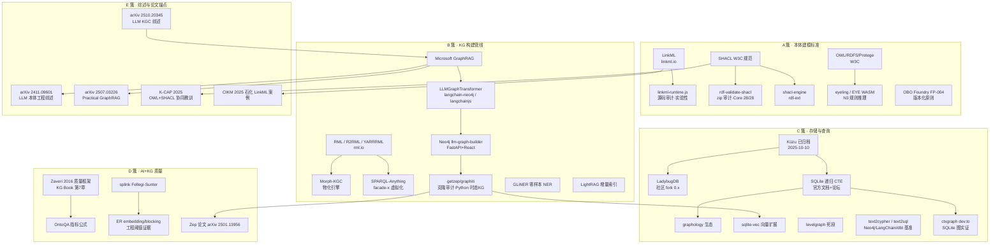

# 01 · 知识网络图谱与调研方法论

## 1.1 本次调研的知识网络（数据源节点与扩展关系）

下图汇总本次 L4 调研覆盖的全部高价值数据源节点（颜色按簇、虚线为「审计/克隆」关系）。节点按调研五簇组织：A 本体建模、B 构建管线、C 存储查询、D AI+KG 质量、E 方法论锚点。

图例：实线箭头 = 调研扩展关系（母节点引出子节点）；簇内布局无语义。共覆盖 35+ 个高价值节点，其中 4 个经过克隆/包级审计（A4、A5、B7、C1 的 npm 包）。

## 1.2 调研方法（L4 Real Deep Research 流程）

| 阶段 | 动作 | 产出 |
|---|---|---|
| SCOUT | DuckDuckGo 7 组总体查询 + 1 篇核心长文（gdotv 嵌入式图库全景） | 18 实体清单 + 时效性信号（Kùzu 归档确认） |
| MAP | 实体归簇为 A/B/C/D/E 五簇知识图谱 | 12 个深潜分支规划 |
| DIVE | 8 个 ask 网络研究分支 + 4 个 code 审计分支（克隆 3 仓库 + 1 npm tarball 静态解包） | 每分支 800-1500 字结构化发现 + 饱和判定 |
| SATURATE | 12/12 分支 saturated；末轮仅返回重复节点；矛盾分级处置 | FULLY_SATURATED |
| SYNTHESIZE | 编排器本人汇总撰写（本报告） | 九节报告 |

搜索工具链：chrome-devtools 驱动 DuckDuckGo（`https://duckduckgo.com/?q=QUERY&ia=web`），evaluate_script 提取 article/main 语义块，过滤 Sponsored 广告；平台内二次探索（GitHub 站内搜索、npm registry API、rml.io 站内、sqlite.org 论坛全文）。未使用 web_search mcp（覆盖率差）。

代表性查询词（完整清单见 metadata.json）：
- `knowledge graph ontology engineering open source 2025 LinkML SHACL`
- `kuzu archived embedded graph database LadybugDB`
- `LLM knowledge graph construction GraphRAG LLMGraphTransformer`
- `SHACL javascript typescript rdf-validate-shacl`
- `Morph-KGC RML YARRRML mapping editor UI`
- `sqlite recursive cte graph traversal graphology sqlite-vec`
- `text2cypher best practices guardrails benchmark`
- `knowledge graph quality metrics entity resolution embedding blocking`

降级路径实践：GitHub clone 超时 → codeload zip（rdf-validate-shacl 成功落盘）；arXiv 域名连接重置 → DeepWiki/alphaxiv/HF 页面交叉转述；ACM 全文 Cloudflare 拦截 → dblp + 引用 snippet 三角确认。

## 1.3 证据质量分级体系

| 级别 | 含义 | 本次示例 |
|---|---|---|
| **Critical** | ≥2 独立来源交叉验证的关键结论 | Kùzu 归档（GitHub 横幅 + npm deprecated + BetaKit/MacRumors 报道）；rdf-validate-shacl Core 全覆盖（源码 28 validator + W3C 套件测试） |
| **Important** | 单一来源但为一手证据（官方文档/源码/npm 元数据），使用时注意边界 | shacl-engine 15-26x 性能（作者自测博客，无第三方复核）；CongraphDB 遍历矩阵（利益相关方自测） |
| **Observation** | 推测性判断或未闭环线索，已显式标注不确定性 | LadybugDB 可持续性；gen-typescript 产物是否仍引用弃更 runtime 的类型（需本机实测） |

## 1.4 已知调研盲区（诚实披露）

1. arXiv 原文（2501.13956 Zep 论文、2411.09601/2510.20345 综述正文表格）因网络层连接重置未逐页读取，结论经 DeepWiki 代码解析 + 官方博客转述 + 摘要层三角确认，置信度高但非论文原文级。
2. ACM 付费墙内论文（K-CAP 2025 OWL+SHACL 协同）全文未取得，教训要点经 dblp + 两条独立引用转述。
3. 性能数字（SQLite 遍历矩阵、shacl-engine 基准）为他人环境实测，本产品 31 类型/23 关系的真实 schema 下需 POC 复测（见 §06 路线图 P0 验证清单）。
4. Windows 平台（win32-arm64）与 musl/Alpine 容器场景的原生模块行为未实测，仅收集了风险证据。
