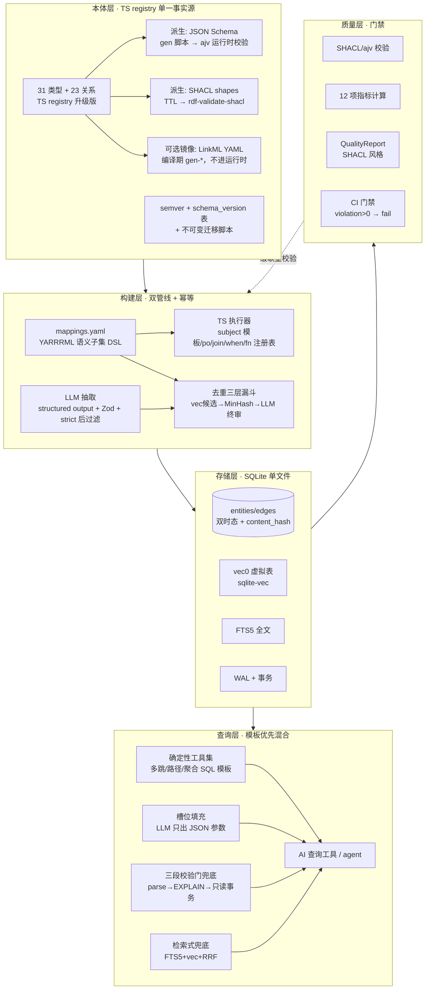

# 06 · 务实选型：最小而正确路径（adopt / avoid 与路线图）

> 对应调研问题 5（最重要输出）。所有判定均可回溯到 §02-§05 的证据链。

## 6.1 目标架构（升级后的 KG 工程全景）

## 6.2 adopt / avoid 完整清单（含证据引用）

### ADOPT（8 项）

| # | 决策 | 证据链 |
|---|---|---|
| 1 | **自研 TS registry 保持 schema 单一事实源**，升级：约束元数据 → 派生 JSON Schema（ajv）+ semver/迁移机制 | §2.2.4 linkml-runtime 死寂审计；§2.7 决策矩阵 |
| 2 | **rdf-validate-shacl** 做标准约束校验与质量报告（Core 28/28、W3C 套件、Bencher CI、1851 行 TS 源码、8.1MB 基准负载） | §2.4.2 zip 源码审计 |
| 3 | **自研映射 DSL（YARRRML 语义子集）+ git 事实源 + 向导式 UI**（抄 Matey/Neo4j Data Importer 交互模式；UI 编辑 YAML 不替代它） | §3.1.4 工具矩阵铁律 |
| 4 | **schema 约束 LLM 抽取**：structured output + Zod + strict 后过滤；prompt 抄 GraphRAG/llm-graph-builder/graphiti 三家开源模板；抽取层 DeepSeek 便宜模型（120 万 tokens=$8.2） | §3.2.1-3.2.4 |
| 5 | **SQLite 全家桶**：WAL + 递归 CTE（多跳/连通分量/防环）+ FTS5 + sqlite-vec（vec0 KNN）+ 双时态边表 + content_hash 幂等 | §4.3 全节三源交叉 |
| 6 | **graphology** 应用层图算法（connectedComponents 孤岛检测 / louvain 社区 / metrics 中心性） | §4.3.5 |
| 7 | **NL 查询模板优先混合架构**：确定性工具集 + 槽位填充 + 三段校验门 + 检索式兜底 | §4.4.4（dbt 100% vs 64.5%；Neo4j 四象限） |
| 8 | **去重三层漏斗 + bi-temporal 边失效**（graphiti 代码级移植；失效不删除） | §5.1.1 克隆审计 |

### AVOID（10 项）

| # | 决策 | 证据链 |
|---|---|---|
| 1 | ❌ kuzu@0.11.3 新引入 | deprecated+归档+500MB+安全真空（§4.1 tarball 审计） |
| 2 | ❌ LadybugDB 现在生产采用（列观察名单：>500k 节点或需 Cypher 时重评；跟踪 cognee 磨合 issue 与 1.0 发布） | 0.x + next 标签 + 迁移实录 bug（§4.2） |
| 3 | ❌ OWL DL 推理栈（HermiT/ELK/Pellet 全 Java；TS 无实现；RDFS 级闭包用 N3 物化或自写 20 行） | §2.3.1 |
| 4 | ❌ linkml-runtime npm 运行时依赖（4 年弃更、周下载 5、无校验能力） | §2.2.4 源码审计 |
| 5 | ❌ Morph-KGC 子进程集成（产物 RDF 三元组，两跳转换负担；增量不支持）——除非未来终点变 triple store | §3.1.2 |
| 6 | ❌ 映射规则 DB 化 / 独立于声明式文件的 UI 事实源（无业界先例，放弃 git diff 能力） | §3.1.4 |
| 7 | ❌ 裸 text2cypher/text2SQL 直连执行（~30% 执行准确率、幻觉 join、$40k 扫表先例） | §4.4.1-4.4.2 |
| 8 | ❌ levelgraph（2 年零发布、26 dependents、LevelDB 栈死寂） | §4.3.5 |
| 9 | ❌ SQL 内硬写 PageRank/社区检测（应用层 graphology 做） | §4.3.3 |
| 10 | ❌ 拍脑袋 embedding 去重阈值（0.85/0.92 无文献背书；必须 PR 曲线自标定） | §5.1.2 反面证据 |

### 观察名单（不 adopt 不 avoid，设定重评触发器）

| 项 | 触发重评条件 |
|---|---|
| LadybugDB | 节点 >500k / 深度遍历延迟不可接受 / 需要 Cypher 模式匹配 / LadybugDB 发 1.0 且 cognee 级用户磨合收敛 |
| shacl-engine（替换 rdf-validate-shacl） | 需要SHACL-SPARQL 跨节点规则 / 吞吐成为瓶颈（15-26x 声称获独立复核时） |
| GLiNER 兜底层 | LLM 抽取成本或延迟超预算时启用（Apache-2.0，CPU/ONNX 零成本） |
| LinkML 镜像 | 需要与外部本体生态互操作 / 需要 40+ generators 时启用（编译期） |

## 6.3 分阶段路线图

### P0（本周可做的验证性小步，全部低风险）

1. 给 entities/edges 补 content_hash 列 + 幂等 upsert 重跑契约（中断重跑结果一致）
2. 写一条多跳查询递归 CTE（带 cycle guard + depth 上限 + valid_until 过滤）进现有查询工具
3. graphology connectedComponents 跑一遍现有 1100 节点 → 产出孤岛清单（第一次质量快照）
4. sqlite-vec load 进测试库 → 1000 实体名 embedding → top-k 相似查询冒烟
5. 本机 POC 复测关键性能数字：真实 schema 下 3-hop 遍历延迟（对照 §4.3.3 的 10-30ms 预期）；gen-json-schema → ajv compile 冒烟（若走 LinkML 镜像）
6. rdf-validate-shacl 装进 devDependency → 手工 quads 转换 100 个节点 → 出第一份 ValidationReport

### P1（2-4 周：schema 升级 + 质量体系骨架）

1. TS registry 加约束元数据（required/range/pattern/枚举/关系端点约束）+ 派生 JSON Schema 生成器 + ajv 运行时校验入口
2. semver + schema_version 表 + 第一批迁移脚本；31 类型/23 关系打上版本基线
3. SHACL shapes 起草（先覆盖关键实体类型：名称必填唯一/认证有效期/类型互斥）+ 校验进构建尾部
4. 12 项质量指标中先落地 6 项（填充率/类型使用率/孤岛/冲突×2/陈旧度）+ QualityReport schema + CI 门禁
5. 去重层①+②（sqlite-vec 候选 + MinHash/精确归一化，零 LLM 成本）上线，LLM 终审层③先只对人工审队列预筛

### P2（4-8 周：映射 DSL + LLM 抽取升级 + NL 查询）

1. 13 条硬编码映射规则 → mappings.yaml（YARRRML 语义子集）+ TS 执行器 + fn 注册表；映射变更走 PR + 输出 diff 快照对比
2. 向导式映射 UI（选源→选类型→列映射→主键→预览 N 条物化结果——抄 Neo4j Data Importer 流程）
3. LLM 抽取切 structured output + Zod 契约 + strict 后过滤；prompt 迁移到 GraphRAG/graphiti 模板（NEGATIVE 清单 + few-shot + fact 保真规则 + 时间抽取规则）
4. 确定性查询工具集（多跳邻居/最短路径 BFS/按类型聚合/社区列举）+ LLM 槽位填充路由 + 三段校验门 + FTS5+vec+RRF 检索兜底
5. bi-temporal 边模型落地（valid/invalid + created/expired 四列 + 失效 UPDATE 语义）

## 6.4 风险登记与退出条款

| 风险 | 概率 | 缓解 | 退出条款 |
|---|---|---|---|
| SQLite 深遍历性能不达预期 | 低（100K 内三源证据） | P0 实测；depth 封顶 + 索引审计 | >500k 节点或 3-hop >500ms → 启动 LadybugDB POC（含 cognee 式磨合测试清单） |
| rdf-validate-shacl 维护停更 | 中（zazuko 商业背书 + Bencher CI 降低） | 锁版本；DatasetCore 接口与 shacl-engine 同构可平替 | 连续 6 月无发布 → 评估 shacl-engine 迁移 |
| LLM 抽取成本/质量波动 | 中 | 便宜模型 + 白名单约束 + GLiNER 兜底 + token 记账限额（抄 TRACK_USER_USAGE） | 连续两周 violation 率上升 → 回退模板抽取 |
| 自研 DSL 范围蔓延 | 中 | 只实现 YARRRML 六概念子集；新需求先问「YARRRML 怎么表达」 | 单映射规则复杂度超阈值 → 降级为 TS 代码规则并标注 TODO |
| 本体 major 变更破坏存量 | 低 | 双写过渡 + 迁移脚本回填 + 废弃不删除 | — |
