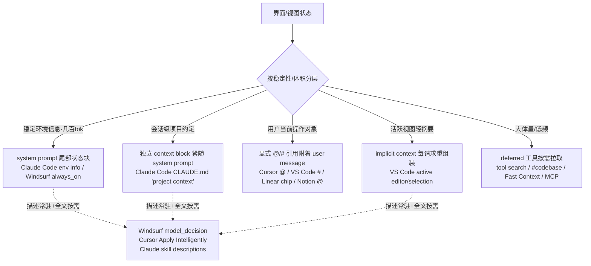

# AI 对话产品的上下文注入模式：界面/视图状态如何进入对话上下文

> 研究日期：2026-09-16 | 来源：14 个一手来源（官方文档/官方博客，其中 2 个经 Web Archive 存档读取）| 深度：Thorough
> 调研约束说明：chrome-devtools MCP 全程未连接（浏览器实例未启动，重试 3 次），DuckDuckGo html/lite 端点均返回 202 反爬挑战。降级方案：curl（走本地代理 127.0.0.1:1087）直接抓取官方文档全文 + Web Archive 存档。未使用 web_search MCP 工具。所有引用 URL 均实际抓取并通读正文。

---

## 1. Cursor

来源：
- https://cursor.com/docs/agent/prompting （Prompting agents）
- https://cursor.com/docs/rules （Rules）
- https://cursor.com/docs/agent/overview （Agent Overview）

核心机制：
- **@ 显式引用**：`@file`、`@Terminals`、`@Chats`、`@Commit`（未提交 diff）、`@Branch`、`@Browser`，附加到 chat 输入的 prompt 上。官方建议："Use @ mentions when you know which files are relevant. If you're not sure which files matter, skip it — Agent finds relevant files through its own search."（确定才 @，不确定交给 agent 工具自主检索）。
- **Rules 注入位置**："When applied, rule contents are included at the start of the model context"——模型上下文开头（system prompt 侧）。三档触发：`alwaysApply: true` 每会话注入；`globs` 匹配文件进入上下文时自动附加；仅 `description` 时由 Agent 读描述自行决定拉取（描述常驻 + 全文按需）。
- **skill 生命周期**：`/` 调用默认"attaches the skill to one message, and it fades as the conversation moves on"（单条消息附着后淡出）；Custom Mode 则"stays in context on every turn, even as the agent works for hours"（每轮常驻直到退出）。
- **token 预算**：context ring 可视化分类账——System prompt / Tools / Rules / Skills / MCP / Subagents / Summarized conversation / Conversation；窗口接近满时自动把旧对话压缩成摘要。
- **刷新时机**：用户中途插话"attaches to tool results and sends immediately"（user message 紧随 tool result 发送）；agent 工具调用次数无上限，检索结果自然进入后续请求。

可迁移结论：视图状态应像 Cursor rules 一样分档（常驻档 / 触发档 / 描述+按需档），显式 @ 只留给用户确定相关的对象。

## 2. GitHub Copilot Chat（VS Code）

来源：
- https://code.visualstudio.com/docs/agents/concepts/context （Understand context in AI agents）
- https://code.visualstudio.com/docs/chat/copilot-chat-context （Add context to chat）
- https://code.visualstudio.com/docs/agents/reference/workspace-context （Workspace context）
- https://code.visualstudio.com/api/extension-guides/language-model （vscode.lm）

核心机制：
- **每次模型请求重组装**（最关键的先例）："Each time the agent sends a request to the language model, VS Code assembles a prompt from multiple sources: System instructions / Customizations / User message / Conversation history / **Implicit context** / Explicit references / Tool outputs"。
- **隐式上下文定义**："The file you're editing, your current selection, visible errors, and git state"；分级：Ask 模式下 active file **全文**进 prompt；Agent 模式下 active file 只作为**建议附件**（suggested attachment）不自动进。
- **显式引用**：`#` = context item（文件/文件夹/符号/工具/终端输出/变更/`#codebase` 全库/`#fetch` 网页），`@` = chat participant（`@vscode`、`@terminal`）。attachments "preserved in a draft and included when you send the request"（草稿保留、发送时快照）。
- **当前 UI 状态进对话的对应物**：内置浏览器工具栏 "Add Element to Chat / Add Screenshot to Chat / Add Console Logs to Chat"——把当前页面状态（元素+CSS、截图、控制台）显式附加到 prompt。
- **token 策略**：workspace 语义索引检索（"doesn't add your entire workspace to every model request"）；小项目可全量直读、大项目自动选检索策略；自动 compaction + `/compact` 手动；官方提醒大源消耗 token 与 AI credits。

可迁移结论：「切 tab 上下文跟随」的最直接先例是 VS Code 的 implicit context——每请求重算、随 active editor 换内容、内容分级（摘要自动进 / 全文建议加）。

## 3. ChatGPT Canvas

来源：
- https://openai.com/index/introducing-canvas/ （2024-10-03 官方发布博客，经 Web Archive 存档全文读取；help.openai.com Canvas FAQ 返回 403 无法直读）

核心机制：
- Canvas 是与对话**同一模型上下文**的协作面："With canvas, ChatGPT can better understand the context of what you're trying to accomplish"——画布内容本身就在模型上下文内，模型"in mind the entire project"给 inline 建议。
- **选中 = 焦点上下文**："You can highlight specific sections to indicate exactly what you want ChatGPT to focus on"——高亮段落作为定向注入，inline 编辑作用于选中区。
- **刷新**：用户直接编辑 canvas 或回退版本，编辑面即上下文（所见即上下文）；打开/不打开 canvas 由模型决策触发（针对写作 83%、编码 94% 正确触发率的训练指标）。
- **token**：未公开预算细节；shortcuts（调整长度/加注释/修 bug）在画布上做 targeted edits 而非整篇重写，控制改动面。

可迁移结论：图谱/画布类 tab 的"选中节点"应对应 Canvas 的 highlight——选中即聚焦注入，编辑面本身常驻上下文。

## 4. Notion AI

来源：
- https://www.notion.com/help/guides/notion-ai-for-docs （Use Notion AI to write better notes and docs）
- https://www.notion.com/help/guides/get-answers-about-content-faster-with-q-and-a （Q&A guide）

核心机制：
- **上下文分层**："using the context from your page, your workspace, connected apps, and the web"——当前页 > workspace 检索 > 连接器 > web 四层。
- **三入口三档注入**：侧栏/右下角 agent（workspace 级，能"summarize the current page"说明感知当前页面）；选中文本 "Edit with AI"（selection 级）；新行按空格 inline 生成（页面级，可 `@-mention` pages/people/dates 显式补上下文）。
- **Q&A 是权限内检索式**："Q&A can surface relevant content from pages you have access to"，"search thousands of docs in seconds"——不预注入全库，问时检索。

可迁移结论：多 tab 产品可抄 Notion 的四层上下文声明（当前 tab > 工作区 > 连接器 > web）与三档入口（全局侧栏 / 选区 / 页面 inline）。

## 5. Linear

来源：
- https://linear.app/agents （Linear for Agents 官方页）

核心机制：
- 对话 composer 底部常驻（"Reply… + Skills"），把当前工作对象以 chip 形式显式加入：示例演示 "Mobile Triage **added to context**"（视图/项目）、"API launch **added to context**"（项目）、"ENG-2844 **added to context**"（单 issue）。
- 即：主界面（视图/issue）→ 对话上下文的通道是**显式添加 chip**，而非隐式跟随。

可迁移结论：底部常驻 composer + "added to context" 显式 chip 是最贴近我们产品形态的交互先例，可与隐式跟随叠加。

## 6. Figma AI（浅证据）

来源：
- https://www.figma.com/ai/ （官方 AI 页；help.figma.com 具体文章 404）

核心机制：
- Figma agent 可"generate new design directions...search your files"；官方 MCP server "Deliver design context directly into agentic workflows...using your design system as the source of truth"——设计上下文通过 **MCP 工具按需暴露**给 agent，而非预注入对话。

可迁移结论：结构化资产（如图谱/数据资产）用 MCP/工具按需拉取暴露，优于整块预注入。

## 7. Claude Code

来源：
- https://code.claude.com/docs/en/context-window （.md 直读）
- https://code.claude.com/docs/en/memory （.md 直读）
- https://code.claude.com/docs/en/agent-sdk/modifying-system-prompts （.md 直读）

核心机制：
- **启动上下文构成**（官方交互模拟逐块给出）：System prompt（~4200 tok）→ Auto memory（前 **200 行或 25KB** 取先）→ **Environment info（~280 tok）**："Working directory, platform, shell, OS version, and whether this is a git repo. Git branch, status, and recent commits load as a separate block **at the very end of the system prompt**." → MCP tools（默认**只列名字、schema 按需 tool search**；`ENABLE_TOOL_SEARCH=auto` 时 schemas ≤10% 窗口才预载）→ Skill descriptions（一行描述常驻，**调用才载全文**；`/compact` 后列表不重注入、只保留用过的）→ CLAUDE.md（user+project）。
- **CLAUDE.md 注入位置**：SDK 文档明确 "injects its content into the conversation as project context...leaves the system prompt untouched"——**独立 project context 块**，不在 system prompt 内；"loaded at the start of every conversation"；**子目录 CLAUDE.md 按需**（读到该目录文件才加载）；`.claude/rules/` path-scoped 规则在 Claude 读匹配文件时**事件触发加载**。
- **hooks 注入**：PostToolUse hook 经 `hookSpecificOutput.additionalContext` 进上下文；**超 10000 字符落盘**，给模型预览+文件路径。
- **压缩语义**：`/compact` 后 file reads / edits 被恢复（restoredAfterCompact），skill 列表不恢复（noSurviveCompact）——压缩后什么保留是显式设计的。

可迁移结论：环境/视图状态做成"小而稳的状态块"（~几百 token、固定格式）置于 system prompt 尾部，每会话刷新；大体量数据走 deferred 工具按需拉取 + 超限落盘。

## 8. Windsurf（Devin Desktop）

来源：
- https://docs.windsurf.com/windsurf/cascade/memories （.md 路径返回 SPA 渲染页，正文已提取）
- https://docs.windsurf.com/context-awareness/windsurf-overview
- https://docs.windsurf.com/context-awareness/fast-context

核心机制：
- **Rules 四档激活模式（对注入成本最诚实的公开表述）**：`always_on`："Full rule content is included in the **system prompt on every message**"（成本：每条消息）；`model_decision`："Only the description is shown in the system prompt. Cascade reads the full rule file when it decides the description is relevant"（描述常驻+全文按需）；`glob`：读/改匹配文件时注入；`manual`："Rule is not in the system prompt. You activate it by typing `@rule-name`"（纯显式）。
- **字符预算硬上限**：global rules 单文件 **6000 字符**、workspace rules 每文件 **12000 字符**；Memories 自动生成、本地存储、"Cascade retrieves them when it believes they're relevant"（自动按需检索）。
- **编辑器状态隐式注入**："The current file and other open files in your IDE"（**含 open tabs**）+ 全库索引 M-Query RAG 检索 + pinned context items。
- **检索防污染**：Fast Context（SWE-grep 检索子代理）"will trigger automatically"，"prevents context pollution...conserves its context budget"——把检索放到独立子代理上下文，不占主对话窗口。

可迁移结论：给每类注入物标"激活模式+成本"（常驻/每消息、描述+按需、事件触发、手动 @），并设字符硬上限——这是最可抄的预算治理框架。

---

## 业界共识总结（回答四问）

### (1) 注入位置主流：分层混用，没有单一答案

**共识**：稳定且小的状态（环境、当前 tab 元信息）→ system prompt/启动块；用户动态操作对象 → user message 侧（显式引用或隐式附带）；大体积 → 工具拉取。最精细的中间态是"**描述常驻 + 全文按需**"（Windsurf `model_decision`、Cursor `Apply Intelligently`、Claude Code skill descriptions 三家同构）。

### (2) 刷新时机主流

| 时机 | 谁在用 |
|---|---|
| 每次模型请求重组装（最新鲜） | VS Code（"Each time the agent sends a request...assembles"） |
| 每条消息注入 | Windsurf `always_on`（"on every message"） |
| 会话开头一次性 + 事件触发增量 | Claude Code（CLAUDE.md 会话头 + path rules 读文件时 + hook additionalContext 工具事件后） |
| 显式引用发送时快照 | VS Code attachments（草稿保留、发送时包含）、Cursor @（附着该条消息后淡出） |
| 模式常驻直到退出 | Cursor Custom Mode（"stays in context on every turn"） |

**共识**：视图切换类状态用"每请求重算"（VS Code 是唯一直接对应的先例）；持久约定用"会话头 + 事件触发"；显式引用是单消息快照、不驻留。

### (3) token 预算策略主流

- **硬上限按层级**：Windsurf 6000/12000 字符；Claude auto memory 200 行或 25KB；CLAUDE.md 官方建议 <200 行（"Longer files consume more context and reduce adherence"）。
- **描述常驻 + 全文按需**：三家同构（见上），是预算与相关性的平衡点。
- **超限落盘给预览**：Claude hooks >10000 字符保存文件、给模型预览+路径。
- **分类账可视化**：Cursor context ring（8 类）、Claude `/context` 命令。
- **满时压缩**：Cursor / VS Code / Claude Code 均自动 compaction + 手动命令；压缩后保留什么被显式设计（Claude：file reads 恢复、skill 列表不恢复）。
- **小全量大检索**：VS Code 小项目全读、大项目语义索引；Fast Context 用独立子代理检索"防上下文污染"。

### (4) 隐式 vs 显式取舍共识

- **隐式打底、显式可指、重要必显式**。VS Code："Implicit context reduces how much information you need to specify. **If a particular source is important to the task, add it explicitly** instead of relying on the agent to infer"；Cursor："Use @ when you know which files are relevant. If you're not sure, skip it"。
- **隐式的代价被明说**：自动注入消耗窗口与 credits（VS Code），所以 Windsurf 给每档激活模式标注"Context cost"。
- **显式引用是单条消息级**（附着后淡出），需要跨轮持续才升级为 mode/常驻规则——两家（Cursor skill→Mode、Windsurf manual→always_on）语义一致。

### 对本产品（多 tab + 常驻 composer）的直接裁决

当前 tab 视图状态建议三层结构（全部有业界先例背书）：
1. **隐式轻量状态块**（对标 VS Code implicit context + Claude Code env info）：tab 元信息 + 过滤条件 + 选中节点 id 列表 + 布局模式，压缩到几百 token 的固定格式，**每次模型请求重算注入**（切 tab 即换），位置在 system prompt 尾部或紧随其后的独立 context block。
2. **显式 @ 引用**（对标 Cursor @ / Linear added-to-context chip）：用户把节点/过滤集/表钉进对话，单条消息附着快照，chip 可见可删。
3. **get_view_state 工具**（对标 Claude Code deferred tools / Windsurf Fast Context / Figma MCP）：全量视图状态（大 JSON）不注入，暴露为工具按需拉取；检索型任务可用独立子代理防污染。

---

## 来源清单

| # | 来源 | 类型 | 访问方式 |
|---|---|---|---|
| 1 | https://cursor.com/docs/agent/prompting | 官方文档（一手） | curl 直读 |
| 2 | https://cursor.com/docs/rules | 官方文档（一手） | curl 直读 |
| 3 | https://cursor.com/docs/agent/overview | 官方文档（一手） | curl 直读 |
| 4 | https://code.visualstudio.com/docs/agents/concepts/context | 官方文档（一手） | curl 直读 |
| 5 | https://code.visualstudio.com/docs/chat/copilot-chat-context | 官方文档（一手） | curl 直读 |
| 6 | https://code.visualstudio.com/docs/agents/reference/workspace-context | 官方文档（一手） | curl 直读 |
| 7 | https://openai.com/index/introducing-canvas/ | 官方博客（一手） | Web Archive 存档全文 |
| 8 | https://www.notion.com/help/guides/notion-ai-for-docs | 官方帮助（一手） | curl 直读 |
| 9 | https://www.notion.com/help/guides/get-answers-about-content-faster-with-q-and-a | 官方帮助（一手） | curl 直读 |
| 10 | https://linear.app/agents | 官方产品页（一手） | curl 直读 |
| 11 | https://www.figma.com/ai/ | 官方产品页（一手，浅） | curl 直读 |
| 12 | https://code.claude.com/docs/en/context-window | 官方文档（一手） | .md 直读 |
| 13 | https://code.claude.com/docs/en/memory | 官方文档（一手） | .md 直读 |
| 14 | https://code.claude.com/docs/en/agent-sdk/modifying-system-prompts | 官方文档（一手） | .md 直读 |
| 15 | https://docs.windsurf.com/windsurf/cascade/memories | 官方文档（一手） | SPA 正文提取 |
| 16 | https://docs.windsurf.com/context-awareness/windsurf-overview | 官方文档（一手） | SPA 正文提取 |
| 17 | https://docs.windsurf.com/context-awareness/fast-context | 官方文档（一手） | SPA 正文提取 |

## 方法论与局限

- chrome-devtools MCP 全程不可用（Not connected，3 次重试）；DuckDuckGo html/lite 均 202 挑战。降级为 curl + 本地代理直接抓官方文档，用站内导航链接与 llms.txt 索引发现正确路径（Cursor/VS Code/Windsurf 2026 年均已重组文档结构）。
- 优先一手来源，全部 17 个 URL 实际抓取并通读；Bing RSS 仅用于路径发现，未采用其结果作为证据。
- 局限：help.openai.com Canvas FAQ 403 未读到，Canvas 机制基于官方发布博客（已标注）；Figma AI 仅营销页浅证据；Linear 为产品页交互演示，缺工程博客级细节；Cursor 旧文档中"当前文件自动注入"行为在 2026 新文档已被"agent 自主检索 + 显式 @"表述取代，本报告以现行文档为准。
