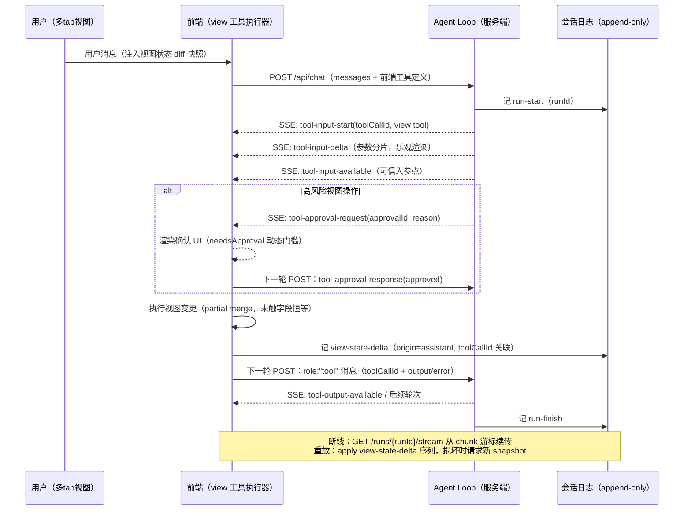

# AI 工具调用驱动前端视图变更：事件回路与可重放性设计调研

> 研究日期：2026-09-16 | 来源：12 个一手来源（全部实际深读）+ 2 个标注受限来源 | 深度：Thorough
> 主题：AI view 工具调用 → SSE/WS 推前端执行 → 结果回传 agent loop 闭环；会话日志可重放；用户/AI 视图冲突处理

---

## 1. 执行摘要

调研了 Vercel AI SDK、CopilotKit、LangGraph、AG-UI 协议、assistant-ui 五个主流「AI ↔ 前端」框架，以及 OpenAI/Anthropic 的底层流式工具调用协议。**业界已收敛出一个清晰的回路形态：上行用普通 HTTP POST（携带全量消息/工具结果），下行用 SSE 事件流；前端工具执行结果不通过反向流通道回传，而是作为 `role:"tool"` 消息（带 `toolCallId` 关联）放入下一次请求，或者由服务端用检查点 + `resume` 指针恢复暂停的循环**。WebSocket 仅在双向低延迟场景（语音、协作光标）作为备选传输。

可重放性的主流做法不是重放"操作"而是重放"协议事件"：AI SDK 的 `UIMessageChunk` 流、AG-UI 的 `STATE_SNAPSHOT` + `STATE_DELTA`（JSON Patch RFC 6902）本身就是可持久化、可重放的事件序列；assistant-ui 更进一步把视图状态版本链（`origin: user-edit | assistant`）直接挂在 append-only 的 thread 日志上。冲突处理上，业界**没有**采用传统乐观锁/最后写赢，而是：高风险操作走审批门（`needsApproval` 动态门槛）、视图状态走 append-only 版本链 + `restore()` 回滚、模型通过"状态快照注入"感知用户手动改动、流式创建期间的用户编辑被明确丢弃。

---

## 2. 逐产品/模式调研结果

### 2.1 Vercel AI SDK — Data Stream Protocol 与 HITL 审批

**名称**：Vercel AI SDK v5（UIMessage 流协议）｜**来源**：
- Stream Protocol（读自 GitHub 源 `content/docs/04-ai-sdk-ui/50-stream-protocol.mdx`）：https://ai-sdk.dev/docs/ai-sdk-ui/stream-protocol
- Human-in-the-Loop Cookbook（`content/cookbook/01-next/75-human-in-the-loop.mdx`）：https://ai-sdk.dev/docs/cookbook/next/human-in-the-loop
- Chatbot Tool Usage（`content/docs/04-ai-sdk-ui/03-chatbot-tool-usage.mdx`）：https://ai-sdk.dev/docs/ai-sdk-ui/chatbot-tool-usage
- Transport（`content/docs/04-ai-sdk-ui/21-transport.mdx`）：https://ai-sdk.dev/docs/ai-sdk-ui/transport
- Streaming Data（`content/docs/04-ai-sdk-ui/20-streaming-data.mdx`）：https://ai-sdk.dev/docs/ai-sdk-ui/streaming-data
- Reading UI Message Streams（`content/docs/04-ai-sdk-ui/24-reading-ui-message-streams.mdx`）：https://ai-sdk.dev/docs/ai-sdk-ui/reading-ui-message-streams

**核心机制摘要**：
1. SSE 事件流定义了完整的工具调用生命周期：`tool-input-start`（toolCallId+toolName）→ `tool-input-delta`（`inputTextDelta` 参数分片，可流式渲染"AI 正在写参数"）→ `tool-input-available`（完整入参）→ `tool-output-available`（执行结果）；HITL 场景插入 `tool-approval-request`（approvalId/approvalDescriptor/reason）与 `tool-approval-response`（approved/reason），拒绝走 `tool-output-denied`。
2. 服务端工具声明 `needsApproval: true` 或 `needsApproval: async ({amount}) => amount > 1000`（按入参动态决定审批门槛）；批准前 `execute` 不运行，工具 part 进入 `approval-requested` 状态并带 `approval.id`。
3. 前端用 `addToolApprovalResponse({id, approved})` 记录决定，配置 `sendAutomaticallyWhen: lastAssistantMessageIsCompleteWithApprovalResponses` 后自动把**全量 messages 重新 POST 到 `/api/chat`** 触发下一轮——审批结果不是反向推流，而是作为消息回放。
4. client-side tool：工具不提供 `execute` 则调用被转发到前端；`onToolCall` 回调自动执行（如取地理位置），用户交互型工具直接由 UI 渲染并用 `addToolOutput({tool, toolCallId, output})` 回填，状态机为 `input-streaming → input-available → (approval-requested → approval-responded) → output-available | output-error | output-denied`。
5. 传输层：默认 `DefaultChatTransport` = HTTP POST + SSE；`WorkflowChatTransport` 支持**断线续传**（检测缺失 `finish` 事件后 GET `{api}/{runId}/stream` 从游标处重连，`initialStartIndex` 控制起点，服务端可持久化 `UIMessageChunk` 对象）；`DirectChatTransport` 用于进程内直连 Agent。WebSocket 仅作为自定义 transport 的明确备选项。
6. 数据部分（data parts）按 `id` 自动调和（reconciliation）——同 id 反复写即原地更新，官方点名这是"collaborative artifacts"的实现方式；transient data parts 只进 `onData` 回调、**不进消息历史**（日志粒度的显式设计）。

**可迁移裁决**：这是"turn-based 回路 + SSE 事件协议 + 审批门"的最完整参考实现——view 工具结果用全量消息重发回传、`needsApproval` 做动态确认门、`runId`+chunk 游标做断线重放，三者可直接抄。

---

### 2.2 CopilotKit — 前端工具注册与两种 HITL 范式

**名称**：CopilotKit v2｜**来源**（均实际抓取深读）：
- Frontend Tools：https://docs.copilotkit.ai/frontend-tools
- Human-in-the-loop：https://docs.copilotkit.ai/human-in-the-loop
- Generative UI（Display-only）：https://docs.copilotkit.ai/generative-ui

**核心机制摘要**：
1. `useFrontendTool({name, description, parameters(zod), handler})`：工具在前端注册，agent 调用时 handler **完全在浏览器执行**（可读写 React state、localStorage、触发动画），返回值作为 tool result 回传 agent——官方定位即"让 agent 控制 UI，用于 generative UI 或 HITL"。
2. 文档给出两种 HITL 模式的正面对比表：`useHumanInTheLoop`（**LLM 发起**：模型调用注册的客户端工具，`render({args, status, respond})` 渲染自定义组件，用户答案经 `respond()` 成为工具结果）vs `useInterrupt`（**图强制**：LangGraph 节点内 `interrupt(...)` 暂停，服务端契约）。选择依据：暂停是"模型自己决定要问"还是"代码路径确定性要求人工输入"。
3. `useComponent({name, parameters, render: WeatherCard, agentId})`：组件即工具——agent 调用工具名即渲染对应组件，参数作为 props；多 agent 场景用 `agentId` 限定作用域。
4. Headless 模式：不经 chat 容器，用 `useAgent` + `agent.subscribe` + `copilotkit.runAgent` 自行组装 interrupt 解析 UI（适合把 AI 视图操作嵌进任意面板而不只是聊天窗）。

**可迁移裁决**：「render prop 即工具 UI」与「LLM 发起 vs 图强制两种暂停范式」的划分值得照搬——view 工具的执行器与渲染器在前端合一，暂停语义按发起方二选一。

---

### 2.3 LangGraph — interrupt / Command(resume) 与持久检查点

**名称**：LangGraph interrupts｜**来源**（读自官方 markdown）：
- Interrupts：https://docs.langchain.com/oss/python/langgraph/interrupts（注：`langchain-ai.github.io/langgraphjs/concepts/human_in_the_loop/` 已 301 重定向至此）

**核心机制摘要**：
1. `interrupt()` 可在任意节点内调用，接受任意 JSON 可序列化值作为暴露给调用方的 payload；触发时 LangGraph 用 **checkpointer 写入精确图状态**并无限期等待（生产建议 DB 支撑的 durable checkpointer）。
2. 恢复 = 以 `Command(resume=...)` 作为下一次 `stream_events()` 的输入；resume 值成为节点内 `interrupt()` 调用的返回值。`thread_id` 是持久指针：复用即恢复同一检查点，新开即全新空状态线程。
3. `stream.interrupted` 为 True 表示暂停等待人工输入，`stream.interrupts` 携带 payload；多 interrupt 场景官方模式就是"resume → 再 stream → 直到 `stream.interrupted` 为 False"的循环。
4. 文档强调 `Command(resume=...)` 是唯一作为输入合法的 Command 形态（`update/goto/graph` 只用于节点返回值）——服务端持有暂停的执行状态，前端只提供答案。

**可迁移裁决**：这是「服务端保留执行现场、回传只需最小答案」的范式——若 agent loop 常驻进程内，前端工具结果用 `resume` 指针恢复比对全量消息重发更省；两种回传模式的取舍点即在此。

---

### 2.4 OpenAI — chat.completion.chunk 的 tool_calls 分片协议

**名称**：OpenAI Chat Completions streaming｜**来源**（读自官方 OpenAPI 规范）：
- https://github.com/openai/openai-openapi/blob/master/openapi.yaml

**核心机制摘要**：
1. 流式响应对象为 `chat.completion.chunk`，每个 chunk 的 `choices[].delta.tool_calls[]` 携带分片：首个 chunk 含 `index`+`id`+`type:"function"`+`function.name`（`arguments` 为空串），后续 chunk 仅含 `index` + `function.arguments` 字符串分片，按 `index` 聚合、拼接 arguments 后整体 `JSON.parse`。
2. 结束以 `finish_reason:"tool_calls"` 标记（非流式示例中完整 tool call 的 `arguments` 是带换行的 JSON 字符串，证明协议假设就是"分片拼 JSON"）。
3. Assistants 流式（`thread.run.step.delta`）同样模式：首事件带 `tool_calls[0].id/name`，后续只有 `{"index":0,"function":{"arguments":"{\"location\"}}` 式分片。
4. 传输为 SSE（`data:` 行序列，与规范示例一致）。

**可迁移裁决**：工具入参流式分片是厂商级既成事实（id/name 只发一次 + index 聚合 + arguments 逐段拼接），自建事件协议应兼容此形态，前端渲染"参数流入"时以 `tool-input-available`（或等价的 End 事件）为唯一可信入参点。

---

### 2.5 Anthropic — content_block / input_json_delta 事件序列

**名称**：Anthropic Messages API streaming｜**来源**（读自官方 markdown）：
- https://docs.claude.com/en/docs/build-with-claude/streaming

**核心机制摘要**：
1. 官方明确定义块结构：每个 content block 有 `content_block_start` → 若干 `content_block_delta` → `content_block_stop`，`index` 对应最终 `content` 数组下标。
2. `tool_use` 块：start 时 `{type:"tool_use", id, name, input:{}}`；delta 为 `input_json_delta.partial_json`（原文："the deltas are *partial JSON strings*, whereas the final `tool_use.input` is always an *object*"）；官方建议在 `content_block_stop` 后一次性解析，或用 SDK 的增量解析辅助。
3. 工具调用结束由 `message_delta` 的 `stop_reason:"tool_use"` 标记；thinking 块另有 `signature_delta` 完整性校验事件。
4. 传输明确为 server-sent events（SSE）。

**可迁移裁决**：与 OpenAI 语义等价但结构更规整（块级 start/stop 边界 + index 寻址）；"delta 是 JSON 字符串、终值是对象"这一不变量应写进自家协议文档与前端解析器契约。

---

### 2.6 AG-UI 协议 — 独立的事件协议标准（CopilotKit 等共用）

**名称**：AG-UI Protocol｜**来源**（读自官方仓库文档源）：
- Events：https://github.com/ag-ui-protocol/ag-ui/blob/main/docs/concepts/events.mdx
- Architecture：https://github.com/ag-ui-protocol/ag-ui/blob/main/docs/concepts/architecture.mdx
- Messages：https://github.com/ag-ui-protocol/ag-ui/blob/main/docs/concepts/messages.mdx

**核心机制摘要**：
1. 16+ 个标准事件分六类：Lifecycle（`RUN_STARTED/FINISHED/ERROR`、`STEP_STARTED/FINISHED`）、TextMessage（Start/Content/End/Chunk）、ToolCall（`ToolCallStart` → `ToolCallArgs`(delta 分片) → `ToolCallEnd` → `ToolCallResult` 整体送达；`ToolCallChunk` 便利事件自动展开为三元组）、State（`STATE_SNAPSHOT`/`STATE_DELTA`/`MESSAGES_SNAPSHOT`）。
2. **状态同步采用 snapshot–delta 模式**：`STATE_SNAPSHOT` 全量重建（前端应整体替换而非合并），`STATE_DELTA` 是 **JSON Patch（RFC 6902）操作数组**，按序应用；前端检测到不一致**可请求新鲜 snapshot 自愈**。官方附 sequenceDiagram 说明"初始快照 → 增量循环 → 偶发全量刷新"。
3. 前端工具：定义随 `runAgent({tools:[...], context:[...]})` 传入；执行结果以 `role:"tool"` 消息回传（`toolCallId` 关联原调用，`error` 字段标失败），放入下一次 `RunAgentInput` 的 messages。
4. 传输：`HttpAgent` = POST `RunAgentInput` → BaseEvent 流，支持 **HTTP SSE（默认，文本、易调试）与 HTTP binary（高性能）**；架构文档同时列明 webhooks、WebSockets 为可选传输，"choose the transport that best fits your architecture"。
5. `MessagesSnapshot` 的角色语义是 all-or-nothing：快照带了某角色的消息就是该角色完整集合（替换），不带的角色保持不动——重连/新人入会对齐历史的机制。

**可迁移裁决**：这是最接近"可直接采用"的协议层蓝图——把 view 工具调用映射到 ToolCall 事件族、把视图状态映射到 STATE_SNAPSHOT/STATE_DELTA（JSON Patch），重放 = 按序 apply patch，损坏 = 请求新快照。

---

### 2.7 assistant-ui — Interactables：视图状态的版本链、快照注入与流式合并

**名称**：assistant-ui Interactables / Tool UI｜**来源**（读自官方 llms.md 版文档）：
- Tool UI：https://www.assistant-ui.com/docs/tools/tool-ui
- Interactable Tool UIs：https://www.assistant-ui.com/docs/tools/interactables

**核心机制摘要**：
1. 工具 UI 统一签名 `render: ({args, result, status}) => ReactNode`，覆盖 loading → result → interactive 全生命周期；同一 toolkit entry 可同时承载浏览器执行的前端工具、经 `addResult` 完成的人工工具、纯服务端工具的渲染。
2. **状态快照注入（State snapshots）**：出站用户消息自动携带 interactable 当前状态快照，"stamped when the state has changed since the model last saw it"；部分字段变化时生成 shallow diff 的 partial snapshot（`[State of "note" (id:"n1") changed — updated fields: {...}]`）——**这就是"用户手动改视图后 AI 如何知道"的业界答案：diff 快照注入上下文，而非反向事件**。
3. **版本链与重放**："A thread is an append-only log, so an instance accumulates **versions**: each user edit, each `update_{name}` call, and the creating call"——thread 即 event sourcing 日志，thread-scoped 交互物"persists with the thread's history (nothing extra to persist)"；`version.origin` 标记 `"user-edit" | assistant`，`version.restore()` 回滚，官方给出冻结历史/实时编辑/只读+回滚三态选择表。
4. **流式写入与冲突**：`update_{name}` 工具调用按 token 做 partial merge——被编辑字段逐字填充，未触及字段**保持对象恒等**（memo 行不重渲染）；文档明示"edits made during a create stream are dropped"（流式创建期间的用户编辑被丢弃）；多实例共享一个 `update_{name}` 工具、以 `id` 参数寻址，未知 id 返回"error listing the valid ids"让模型自我纠正；工具 schema 恒定以保持 provider prompt cache 稳定。
5. 持久化：persistence adapter（load/save），500ms debounce 自动保存，`isPending/error/flush()` 同步状态钩子；schema 演进建议给 key 加版本号（`"taskBoard_v2"`）或按 schema hash 命名空间。

**可迁移裁决**：把「thread = append-only 视图版本日志 + origin 标记 + restore + partial 快照注入 + 流式期间丢弃用户编辑」整套抄下来，就同时解决了可重放与用户/AI 冲突两大问题。

---

### 2.8 Martin Fowler — Event Sourcing 理论基线

**名称**：Event Sourcing（Fowler, 2005）｜**来源**：https://martinfowler.com/eaaDev/EventSourcing.html

**核心机制摘要**：
1. "every change to the state of an application is captured in an event object, and that these event objects are themselves stored in the sequence they were applied"——事件按应用顺序持久化，可"reconstruct past states"（重建任意历史状态）。
2. Event Replay：发现过去事件有误时，可逆序回退并重放修正后的事件序列；同一技术可处理乱序到达事件（异步消息系统的常见问题）。
3. 事件日志可作为官方记录（system of record），当前状态库只是它的物化视图；天然提供审计与 temporal query。

**可迁移裁决**：AI 触发的视图变更日志照此基线设计：记"事件序列"而非"最终状态"，会话重放 = 重放事件序列，视图状态库只是投影。

---

### 2.9 ChatGPT Canvas（受限来源，如实标注）

**名称**：OpenAI ChatGPT Canvas｜**来源**：一手来源（openai.com/index/introducing-canvas、help.openai.com）在本环境均被 Cloudflare 挑战页拦截，未能实际读取；TechCrunch/The Verge 候选 URL 均已失效（404）。**本节不引用未读内容**，仅指出：canvas 的"AI 主动打开侧边编辑面板、AI 与用户并行编辑同一文档、编辑建议以 diff 呈现"的产品形态，与上述 assistant-ui Interactables（thread-scoped artifacts + `update_{name}` 工具 + 版本恢复）和 Vercel AI SDK generative UI（`tool-${toolName}` parts 状态机）在机制上同构，可由这两者的一手文档推导同类实现。

**可迁移裁决**：canvas 无需逆向——其交互范式已被 assistant-ui artifacts 与 AI SDK data part reconciliation 以公开文档形式覆盖。

---

## 3. 重点问题裁决

### 3.1 SSE vs WebSocket：业界选什么

| 维度 | SSE（业界默认） | WebSocket（场景化备选） |
| --- | --- | --- |
| 谁在用 | OpenAI/Anthropic API 原生流；AI SDK `DefaultChatTransport`；AG-UI `HttpAgent` 默认 | AG-UI 列为可选传输；AI SDK 文档点名"alternative communication protocols like WebSockets" |
| 请求模型 | 上行 HTTP POST + 下行事件流，天然 turn-based | 全双工常连接 |
| 断线恢复 | 简单：`runId`+游标 GET 重连续传（AI SDK `WorkflowChatTransport`：GET `{api}/{runId}/stream`，`initialStartIndex` 游标） | 需自建会话语义与重连状态机 |
| 基础设施 | 代理/CDN/HTTP2 友好，无状态水平扩展容易 | 需要粘性会话或独立网关 |
| 适用 | 聊天轮次、工具流、视图指令下发 | 语音全双工（Deepgram 类）、多人协作光标 |

**结论**：对话式 agent 回路的事实标准是 **HTTP POST（上行：消息+工具结果）+ SSE（下行：事件流）**。AG-UI 在同一抽象下还提供 HTTP binary 替代 SSE 换性能。只有前端也要主动高频推送（非 turn-based）时才引入 WebSocket。

### 3.2 工具执行结果如何回传 agent loop

实测到的三种模式（可组合）：

1. **全量消息重发（turn-based）——AI SDK / AG-UI**：前端执行完工具/审批后，把 `role:"tool"` 结果（`toolCallId` 关联 + `error` 可选）附加进 messages，重新 POST 触发下一轮；AI SDK 用 `sendAutomaticallyWhen: lastAssistantMessageIsCompleteWithToolCalls`（或 `...WithApprovalResponses`）自动触发。**不是**在原 SSE 连接上开反向通道。
2. **检查点 + resume 指针——LangGraph**：服务端 loop 挂起在 `interrupt()`，状态由 checkpointer 持久化；前端只送 `Command(resume=值)` 到同 `thread_id`，loop 从断点继续。
3. **状态快照注入（模型感知而非控制流）——assistant-ui**：用户手动改视图不产生"回传消息"，而是在**下一条出站用户消息**里注入视图状态 diff 快照，模型读到最新状态后自行决策。

**结论**：多 tab 前端工作台建议 **模式 1 为主（幂等、可审计、连接无关）+ 模式 3 为辅（用户手动视图变更不占用工具通道）**；仅当 agent loop 常驻且暂停恢复频繁时才值得上模式 2。

### 3.3 视图变更如何记入会话日志、保证重放

三条已验证的工程路线，共同点是**记事件序列而非最终态**：

1. **记协议事件流本身**（AI SDK）：`UIMessageChunk` 流可整体持久化（`WorkflowChatTransport` 的服务端形态"durable server stream already stores UIMessageChunk objects"），重放 = 重新消费事件流，续传 = chunk 游标；transient data parts 明确不进历史（日志噪音控制）。
2. **snapshot + delta**（AG-UI）：日志 = 初始 `STATE_SNAPSHOT` + 有序 `STATE_DELTA`（JSON Patch RFC 6902）序列；重放 = 顺序 apply patch；校验失败时请求新 snapshot 重建基线（自愈）。`MessagesSnapshot` 的 all-or-nothing 语义让重连对齐无歧义。
3. **append-only 版本链**（assistant-ui / Fowler）：thread 日志本身就是视图状态的事件源——每次用户编辑、每次 `update_*` 工具调用、创建调用都是一个版本，`origin` 标记来源，`restore()` 即重放到指定版本；额外持久化零成本（rides thread history）。

**结论**：推荐 2+3 组合：会话日志按 append-only 记 `view-state-delta` 事件（带 origin 与 toolCallId），周期性插入 `view-state-snapshot` 作为基线，重放器 = "apply patches until snapshot, then continue"。

---

## 4. 推荐回路形态（事件序列）

事件回路的要点：**下行一条 SSE 流承载全部协议事件（含审批请求）；上行全部走"新 POST 携带消息+工具结果"的轮次模型；视图变更由前端在执行时同步落日志（带 origin 与 toolCallId），与服务端消息日志在会话时间线上对齐。**

---

## 5. 冲突处理主流策略

调研到的业界实践排序（按采用广度）：

1. **审批门（确认弹窗）用于高风险操作**：AI SDK `needsApproval` 支持 `async (input) => boolean` 按入参动态决定（文档示例：金额 >1000 才审批）；拒绝结果回传模型（`output-denied`），并用 instructions 告知模型"不要重试被拒操作"。这是"AI 操作确认弹窗"的标准实现。
2. **append-only 版本链 + restore**：assistant-ui 把用户编辑与 AI 编辑放进同一条版本链，`origin` 标记来源，任意版本可 `restore()` 回滚；UI 可选冻结历史/实时编辑/只读+回滚三态。
3. **状态快照注入防止盲写**：用户手动改视图后，下一条出站消息自动带上 shallow diff 快照，模型下次写之前先读到用户改动（assistant-ui State snapshots）。
4. **流式窗口内的显式丢弃**：AI 流式创建/更新期间的用户编辑被明确 drop（assistant-ui：'edits made during a create stream are dropped'）——不搞合并，语义简单可预期。
5. **乐观锁/版本号与最后写赢（LWW）**：在所调研的 AI 框架中**均未见**作为主策略——因为回路的轮次制使模型写入天然串行，真正的并发窗口只在流式渲染期间，而该窗口业界选择直接让位给用户（drop AI 侧落盘）。CRDT（Yjs 等）在协作编辑器领域成熟，但本次未找到官方一手文档把 CRDT 用于"AI 工具调用写视图"的合并策略（仅见社区 demo 仓库），标注为**未证实的可选路线**。

**结论**：主流 = 分级策略（低风险乐观执行进版本链；高风险走 `needsApproval` 式确认；流式窗口用户优先）+ 快照注入对齐模型认知；不建议为视图冲突引入乐观锁或 CRDT，除非引入真人多用户实时协作。

---

## 6. 反对观点与风险（Contrarian Views）

- **全量消息重发的成本**：AI SDK/AG-UI 的 turn-based 回传每轮重发全部 messages，长会话 + 多 tab 视图状态下 payload 膨胀明显；AI SDK 文档自己给出 `messages.slice(-10)` 的截断示例，等于承认该模式需要应用层自裁。若会话很长，LangGraph 式检查点恢复（只送 resume 值）在带宽与服务端状态管理上更优——这是两种模式的真实 trade-off，不是谁绝对正确。
- **SSE 单向性是约束不是美德**：AG-UI 架构文档把 WebSocket 列为一等可选传输并非偶然——当"前端事件需要实时喂给运行中的 loop"（如用户在 AI 流式输出中途打断、多用户并发驱动同一 agent）时，turn-based 模型会引入整轮重入延迟。语音类产品（Deepgram 等，本次未深读一手文档）普遍直接选 WebSocket。
- **流式期间丢弃用户编辑是产品取舍**：assistant-ui 的 drop 策略实现简单，但对"用户正在改、AI 也在改"的高频协同场景体验差；CRDT 路线（AI 作为特殊写入者参与合并）理论更优，但缺乏主流 AI 框架的一手支撑，工程风险自担。
- **协议事件日志 ≠ 业务审计日志**：重放协议事件（UIMessageChunk / StateDelta）能还原视图，但 token 级 delta 数据量大、且含模型中间态；对审计需求，Fowler 的建议（事件日志为 system of record、状态库为投影）意味着需要独立的压缩/快照策略，日志体积是被低估的运维成本。
- **供应商锁定风险**：直接采用 AI SDK 的 UIMessageChunk 或 AG-UI 事件集可以快速起步，但两者仍在快速演进（AI SDK 文档现网已投影 v7 内容、`addToolResult` 已更名为 `addToolOutput`、interactables API 全带 `unstable_` 前缀）——照抄 API 形态需准备适配层。

---

## 7. 开放问题

1. 多 tab 并发视图变更（不同 tab 同一会话）下的日志定序：本次来源均假设单客户端；引入多客户端后需要服务端权威时间线（AG-UI 的"请求新 snapshot"是可用但不优雅的兜底）。
2. view 工具的 schema 版本演进与旧会话重放兼容：assistant-ui 建议 key 版本化（`taskBoard_v2`），但跨大版本重放策略（迁移 vs 冻结旧版本视图）无一手来源覆盖。
3. CRDT + AI 写入的合并语义（AI 大段重写 vs 用户局部微调的意图冲突）仍属开放研究/工程空白，仅有社区 demo（如 electric-sql/collaborative-ai-editor），未验证。
4. HTTP binary transport（AG-UI）与 SSE 的性能差异数值未在文档中给出，选型时需自测。

---

## 8. 来源清单

| # | 来源 | 类型 | 读取方式 | 日期 |
| --- | --- | --- | --- | --- |
| 1 | [AI SDK Stream Protocol](https://ai-sdk.dev/docs/ai-sdk-ui/stream-protocol)（GitHub 源 `vercel/ai` `content/docs/04-ai-sdk-ui/50-stream-protocol.mdx`） | 一手·官方文档 | GitHub raw 全文 | 2026-09-16 |
| 2 | [AI SDK Human-in-the-Loop Cookbook](https://ai-sdk.dev/docs/cookbook/next/human-in-the-loop)（`content/cookbook/01-next/75-human-in-the-loop.mdx`） | 一手·官方 cookbook | GitHub raw 全文（354 行全读） | 2026-09-16 |
| 3 | [AI SDK Chatbot Tool Usage](https://ai-sdk.dev/docs/ai-sdk-ui/chatbot-tool-usage)（`03-chatbot-tool-usage.mdx`） | 一手·官方文档 | GitHub raw 全文 | 2026-09-16 |
| 4 | [AI SDK Transport](https://ai-sdk.dev/docs/ai-sdk-ui/transport)（`21-transport.mdx`） | 一手·官方文档 | GitHub raw 全文（217 行全读） | 2026-09-16 |
| 5 | [AI SDK Streaming Data](https://ai-sdk.dev/docs/ai-sdk-ui/streaming-data)（`20-streaming-data.mdx`） | 一手·官方文档 | GitHub raw 全文 | 2026-09-16 |
| 6 | [AI SDK Reading UIMessage Streams](https://ai-sdk.dev/docs/ai-sdk-ui/reading-ui-message-streams)（`24-reading-ui-message-streams.mdx`） | 一手·官方文档 | GitHub raw 全文 | 2026-09-16 |
| 7 | [CopilotKit Frontend Tools](https://docs.copilotkit.ai/frontend-tools) | 一手·官方文档 | 站点 HTML 全文提取 | 2026-09-16 |
| 8 | [CopilotKit Human-in-the-loop](https://docs.copilotkit.ai/human-in-the-loop) | 一手·官方文档 | 站点 HTML 全文提取 | 2026-09-16 |
| 9 | [CopilotKit Generative UI](https://docs.copilotkit.ai/generative-ui) | 一手·官方文档 | 站点 HTML 全文提取 | 2026-09-16 |
| 10 | [LangGraph Interrupts](https://docs.langchain.com/oss/python/langgraph/interrupts) | 一手·官方文档 | 官方 `.md` 端点全文（44KB） | 2026-09-16 |
| 11 | [Anthropic Streaming Messages](https://docs.claude.com/en/docs/build-with-claude/streaming) | 一手·官方 API 文档 | 官方 `.md` 端点全文（50KB） | 2026-09-16 |
| 12 | [OpenAI OpenAPI 规范](https://github.com/openai/openai-openapi/blob/master/openapi.yaml) | 一手·官方机器可读规范 | GitHub raw（3.5MB，定向抽取 chunk/tool_calls 定义与示例） | 2026-09-16 |
| 13 | [assistant-ui Tool UI](https://www.assistant-ui.com/docs/tools/tool-ui) | 一手·官方文档 | 官方 `.md` 端点全文（35KB） | 2026-09-16 |
| 14 | [assistant-ui Interactables](https://www.assistant-ui.com/docs/tools/interactables) | 一手·官方文档 | 官方 `.md` 端点全文（39KB，关键章节逐段精读） | 2026-09-16 |
| 15 | [AG-UI Events](https://github.com/ag-ui-protocol/ag-ui/blob/main/docs/concepts/events.mdx) | 一手·协议规范 | GitHub raw 全文（40KB，状态/工具事件章节精读） | 2026-09-16 |
| 16 | [AG-UI Architecture](https://github.com/ag-ui-protocol/ag-ui/blob/main/docs/concepts/architecture.mdx) | 一手·协议文档 | GitHub raw 全文（227 行全读） | 2026-09-16 |
| 17 | [AG-UI Messages](https://github.com/ag-ui-protocol/ag-ui/blob/main/docs/concepts/messages.mdx) | 一手·协议规范 | GitHub raw（tool role 定义段精读） | 2026-09-16 |
| 18 | [Martin Fowler: Event Sourcing](https://martinfowler.com/eaaDev/EventSourcing.html) | 一手·经典技术文献 | 站点 HTML 全文提取，定向引文核对 | 2026-09-16 |
| — | ChatGPT Canvas（openai.com / help.openai.com） | 一手不可达 | Cloudflare 挑战拦截，**未读不引** | — |

---

## 9. 方法论与偏差声明

- **检索引擎偏差**：按任务要求优先使用 chrome-devtools + DuckDuckGo，但本执行环境中 chrome-devtools MCP 服务未连接（重试失败），DuckDuckGo html/lite 端点经代理访问均返回反爬挑战页（14KB anomaly 页面，47 处 challenge 标记），Bing 返回无外链的空壳结果页。降级路径：任务描述中已给出精确的官方文档域名与关键词，因此改为**直接定位一手官方来源**（官方 `.md` 端点 / GitHub raw 文档源码 / 官方 OpenAPI 规范）并全文深读，符合"优先一手来源"的更高优先级要求。全程未使用 web_search MCP 工具。
- **读取方式**：Mintlify 系站点（docs.claude.com、docs.langchain.com、assistant-ui.com）用 `.md` 后缀取原始 markdown；Vercel AI SDK 与 AG-UI 用 GitHub raw 读文档源文件（与站点内容同源，路径经站点导航 JSON 的 `realPath` 字段核实）；docs.copilotkit.ai 为 SSR HTML，剥离 script/style 后全文提取。
- **共 18 个来源列于第 8 节，17 个实际全文/定向精读过**；canvas 一节因一手来源被反爬拦截，按"不引用未读内容"原则仅作同构性说明。
- **语言**：报告按用户语言使用中文；所有产品 API 名保留英文原名以便对照文档。
