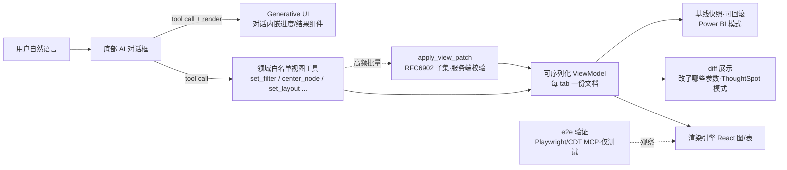

# AI 操控前端可视化/视图的工具化模式调研

> 研究日期：2026-09-16 | 来源：21 个一手来源（全部实际读取）| 深度：Thorough
> 场景：AI 工作台（知识库/图谱/数据资产/连接器/业务系统多 tab + 底部 AI 对话框），让 AI 通过受控工具调整当前 tab 视图（图谱过滤/布局/居中节点等），原则「能让 AI 动态做的就不写死前端逻辑」。

---

## 1. 执行摘要

对所有被调研产品，没有一家采用「AI 通过 DOM/屏幕操控既有前端视图」来实现产品内的 AI 调图能力。BI 三家（Grafana、ThoughtSpot、Power BI、Tableau）全部走「语义层/视图状态作为数据 + 领域白名单工具」路线：AI 产出或修改查询/视图模型（dashboard JSON、search tokens、PBIR JSON、metric 定义），由产品自身的渲染引擎呈现。通用操控层（computer use / browser use / Chrome DevTools MCP / Playwright MCP）确实存在且成熟，但官方一律将其定位为「无 API 可用时的外部自动化」，并且 Anthropic 明确按「桌面 vs 网页 vs 可寻址 API」分层推荐，Playwright MCP 把坐标/视觉模式降级为 opt-in 能力。

工具 schema 设计上业界呈三种形态并存：(a) 领域枚举工具族（Grafana OSS MCP ~50 个、Playwright 73 个、Chrome DevTools ~40 个）；(b) 单一工具 + action 枚举参数（grafana-ui-mcp-server v2 的 `grafana_ui` + 11 个 action；Anthropic toolset 也属此类）；(c) 参数化 DSL/文档模型（ThoughtSpot search tokens、Power BI PBIR JSON 编辑、Grafana `update_dashboard`+`get_dashboard_property`(JSONPath)、JSON Patch RFC 6902）。没有先例支持「一个 apply_view_patch 工具 + 任意 JSON patch」直接打在渲染组件状态上；patch/DSL 全部打在持久化文档/查询模型上，且变更入口通常收敛为少数工具（如 `update_dashboard`）。

对本工作台的直接结论：采用「每 tab 一组语义化白名单视图工具（枚举操作 + 类型化参数）+ 视图状态收敛为可序列化 ViewModel + 高频批量修改可加一个面向 ViewModel 的 patch 工具」的混合模式，与全部一手证据一致。

## 2. 关键发现

1. **BI 产品内 AI 调图全部走语义/模型层，不走前端 DOM**。Grafana Assistant 从模板定制 dashboard（匹配数据源、生成面板）([Grafana whats-new](https://grafana.com/whats-new/2026-02-27-customize-dashboard-templates-with-grafana-assistant/))；ThoughtSpot SpotterViz 通过 prompt 自主创建/修改 Liveboard 及其布局与样式（配色、标签显隐、条件格式）([SpotterViz 文档](https://docs.thoughtspot.com/cloud/26.8.0.cl/spotter-viz.md))；Power BI Report Authoring skill 直接编辑磁盘上的 PBIR JSON（pages、visuals、filters、slicers、formatting、themes）([MS Learn](https://learn.microsoft.com/en-us/power-bi/developer/agentic/power-bi-report-authoring-skill-overview))。
2. **Grafana OSS MCP server 是「领域白名单工具 + 单一变更入口」的范本**：约 50 个分类工具，仪表盘变更收敛为 `update_dashboard` 一个工具（需要 `dashboards:create`+`dashboards:write` RBAC），读取侧提供 `get_dashboard_property`（JSONPath 表达式）与 `get_dashboard_summary`（压缩摘要），工具按类别可用 `--enabled-tools` 白名单开关，每个工具映射 RBAC scope ([工具表](https://grafana.com/docs/grafana-cloud/ai-tools/mcp-servers/oss-mcp/reference/mcp-tools-table/))。
3. **浏览器操控三家（Playwright/ChromeDevTools/Anthropic browser use）都把「结构化 snapshot + 引用（ref/uid）」作为主通道，把「截图 + 坐标」降级为 opt-in**：Playwright MCP 明言「bypassing the need for screenshots or visually-tuned models……Deterministic tool application」，视觉坐标交互需 `--caps=vision` 显式开启；Anthropic browser use 用 accessibility tree + `[ref_N]` 引用，27+4 个成员工具；Chrome DevTools MCP 以 uid 点击为主、`click_at` 坐标为辅 ([Playwright README](https://github.com/microsoft/playwright-mcp), [browser use](https://platform.claude.com/docs/en/agents-and-tools/tool-use/browser-use-tool), [CDT 工具表](https://github.com/ChromeDevTools/chrome-devtools-mcp/blob/main/docs/tool-reference.md))。
4. **Anthropic 官方分层背书**：网页内任务用 browser use tool（读并作用于页面结构本身），整机桌面任务才用 computer use tool（纯截图+坐标）；且 computer use 文档列出硬局限——延迟过高、坐标输出可能幻觉、工具选择可能出错，建议只用于「速度不关键的可信环境」([computer use](https://platform.claude.com/docs/en/agents-and-tools/tool-use/computer-use-tool))。
5. **Generative UI 是业界通用叫法，机制是「tool call 结果绑定 React 组件」而非 AI 生成 DOM**：Vercel AI SDK 的定义即「connecting the results of a tool call to a React component」([AI SDK 文档](https://ai-sdk.dev/docs/ai-sdk-ui/generative-user-interfaces))；CopilotKit v2 `useFrontendTool` 用 Zod 定义参数（含 `z.enum` 枚举）、`render({args,status,result})` 渲染进度与结果、`available` 开关控制条件可用、还可经 WebMCP 暴露给浏览器 agent ([CopilotKit v2](https://docs.copilotkit.ai/reference/v2/hooks/useFrontendTool))。
6. **工具规模化有官方缓解方案**：Anthropic 对 20+ 工具场景推荐 tool search（按需加载 schema）、programmatic tool calling（把调用链折叠为一段代码）、prompt caching（[manage-tool-context](https://platform.claude.com/docs/en/agents-and-tools/tool-use/manage-tool-context)）；Playwright 官方另指出 coding agent 场景 CLI+SKILLS 比 MCP 更省 token。
7. **「单工具 + action 枚举」有真实迁移先例**：grafana-ui-mcp-server v2.0 把 v1 的多个独立工具合并为一个 `grafana_ui` 工具 + `action` 参数（11 个 action，按 action 校验参数），理由是「reduced cognitive load with single entry point」([README](https://github.com/grafana/grafana-ui-mcp-server))。

## 3. 详细分析（按产品/模式）

### 3.1 Grafana（LLM 插件 + OSS MCP + Assistant）

名称：Grafana LLM App / Grafana OSS MCP server / Grafana Assistant / grafana-ui-mcp-server
来源：https://github.com/grafana/grafana-llm-app · https://grafana.com/docs/grafana-cloud/ai-tools/mcp-servers/oss-mcp/reference/mcp-tools-table/ · https://grafana.com/whats-new/2026-02-27-customize-dashboard-templates-with-grafana-assistant/ · https://github.com/grafana/grafana-ui-mcp-server

核心机制：
- `grafana-llm-app` 是给「其他插件」提供 LLM 网关的基础设施（OpenAI 兼容代理、向量服务、`@grafana/llm` 前端库），本身不改任何视图。
- OSS MCP server：约 50 个领域工具，分 Admin/Search/Dashboard/Prometheus/Loki/Incident/Alerting 等类别；仪表盘**写路径只有 `update_dashboard` 一个**（update or create），读路径有 `get_dashboard_by_uid`、`get_dashboard_summary`、`get_dashboard_property`（JSONPath 提取局部）、`get_dashboard_panel_queries`、`run_panel_query`；工具类别默认关闭、`--enabled-tools` 按需开启，每工具绑定 RBAC 权限与 scope。
- Grafana Assistant（2026-02）集成进 dashboard 模板流程：识别模板期望（面板类型/描述/数据）→ 匹配用户真实数据源 → 生成定制 dashboard；Grafana Assistant 另有 skills/automations/MCP server 的 HTTP API 面。
- grafana-ui-mcp-server（grafana org 下、npm @shelldandy）：v2 合并为单一 `grafana_ui` 工具，11 个 action（get_component/get_demo/get_stories/get_tests/search/get_theme_tokens/get_dependencies 等），按 action 做参数校验。

可迁移结论：**推荐**。这是与「AI 通过工具调当前 tab 视图」最同构的成体系方案：领域工具族 + 单一变更入口 + 读取侧提供轻量摘要/局部提取（对应图谱 tab 需要 `get_view_state`/`get_node_summary` 类工具）+ 按类别白名单启用。

### 3.2 ThoughtSpot（Sage/Spotter/SpotterViz）

名称：Spotter（Spotter 3 / Spotter Agent / Classic）、SpotterViz、Sage（移动端称呼）
来源：https://docs.thoughtspot.com/cloud/26.9.0.cl/spotter · https://docs.thoughtspot.com/cloud/26.8.0.cl/spotter-viz.md · https://docs.thoughtspot.com/cloud/26.8.0.cl/spotter-getting-started.md

核心机制：
- Spotter 建立在关系搜索模型上：答案 = 一组 **search tokens**（measure/attribute/filter token）。追问时高亮「本次修改了哪些 token」，答案标题+token 可见可解释。
- Edit Answer 窗口：增删 query token、改 measure/attribute、按不同属性 drill down；quick edits 直接点击 token 修改（如 count→unique count、换分组列）；图表/表格一键切换。即「视图编辑 = 编辑参数化查询 DSL」。
- SpotterViz：在 Liveboard 编辑模式内以对话 prompt 自主建板——分析可用数据源、按业务问题分组生成 answer（KPI/位置/房型等分组）、决定版面结构、后续 prompt 继续增删 answer 与改样式（配色主题、标签显隐、单图属性、条件格式）；走 Spotter API、需 TML 编辑权限；LLM 网关可配（官方称 Claude Opus 4.8 最佳）。
- Spotter 3：跨数据模型检索 + 外部工具连接器（Slack/Confluence/Jira，可 pull 数据、push 动作），Search/Research 双模式。

可迁移结论：**推荐**（机制层）。「图谱过滤/布局」应建模为类似 search tokens 的可解释视图参数，AI 的每次修改以 diff（改了哪些 token/参数）呈现给用户；权限上对照 TML edit permission 设置「视图编辑权」开关。

### 3.3 Power BI（Copilot + MCP + Authoring skill）

名称：Copilot for Power BI（report pane / standalone / apps）、remote Power BI MCP server、Power BI Report Authoring skill
来源：https://learn.microsoft.com/en-us/power-bi/create-reports/copilot-introduction · https://learn.microsoft.com/en-us/power-bi/developer/mcp/remote-mcp-server-get-started · https://learn.microsoft.com/en-us/power-bi/developer/agentic/power-bi-report-authoring-skill-overview

核心机制：
- 终端用户侧：报表右侧 Copilot pane 可「create and edit a report」「写 prompt 创建 report pages」「create a summary visual on the report itself」；standalone Copilot 跨报表找数问答；全部受 Fabric 容量+租户开关+区域约束。
- remote MCP server（`https://api.fabric.microsoft.com/v1/mcp/powerbi`）：仅 3 个工具——`Execute Query`（DAX，RLS 按当前用户生效）、`Get Semantic Model Schema`（含 AI 优化元数据）、`Get Report Metadata`（pages/visuals/filters 只读结构）。
- Report Authoring skill（`powerbi-report-authoring`）：直接编辑 PBIP 工程里的 **PBIR JSON 文件**（报表定义即磁盘数据）；配套 `validate-report` 结构校验 + Power BI Desktop CLI（open/reload/screenshot）做视觉验证闭环；官方建议先 commit 基线以便回滚，PBIR 文件是唯一事实源（Desktop 未保存的改动会被忽略）。
- 分层表格：语义模型层=Modeling MCP；查询层=remote MCP；报表层=Authoring skill；桌面验证=Desktop CLI；规划/设计=Planner+Design skill 产出确定性 design brief 再交给 Authoring。

可迁移结论：**强烈推荐**其分层与验证闭环。对多 tab 工作台：每个能力域一组工具 + 「视图定义为可序列化文档」 + 校验工具 + （可选）截图/快照验证；AI 修改前保存可回滚基线。

### 3.4 Tableau（Pulse + Tableau Agent）

名称：Tableau Pulse、Tableau Agent in Pulse（原 Enhanced Q&A/Discover）、Einstein Generative AI for Tableau
来源：https://help.tableau.com/current/online/en-us/pulse_explore_metrics.htm · https://help.tableau.com/current/online/en-us/pulse_ask_discover_qa.htm

核心机制：
- Pulse 的 Insights Exploration 页：指标现值/环比、过滤条件展示；用户可改**时间范围**、**过滤值**、**Breakdown 维度**（如 Region→Regional Manager→Segment）、图表细节（目标/阈值线）；建议问题点击后以「易读图表+底层洞察」作答——即视图探索 = 受限参数集（时间/过滤/维度）的切换。
- Tableau Agent in Pulse：对话式 AI，跨「指标组」做统计分析（共同驱动因素、同向/反向趋势、离群点、联合超预期），产出 insight brief，每个论断带 citation 链接与可视化；建议初始/追问问题；Tableau+ 许可+站点开关控制。
- Ask Q&A（非 AI）与 Agent（AI）双轨：预检测 insight 的确定性问答与生成式问答分开。

可迁移结论：**混合**。Pulse 的「有限参数探索面」（时间/过滤/分解维度）值得直接套用到图谱 tab（layout/filter/焦点节点就是同类的三五个枚举参数）；但 Tableau 没有开放「AI 修改既有 dashboard 布局」的工具面，其 AI 输出的是 insight+图表而非操控既有视图。

### 3.5 Chrome DevTools MCP 与 Playwright MCP（通用浏览器/DOM 操控）

名称：chrome-devtools-mcp（Chrome DevTools for agents）、@playwright/mcp
来源：https://github.com/ChromeDevTools/chrome-devtools-mcp（README + docs/tool-reference.md + docs/design-principles.md）· https://github.com/microsoft/playwright-mcp

核心机制：
- Chrome DevTools MCP：约 40 个枚举工具（click/fill/fill_form/hover/press_key/type_text/upload_file/click_at + navigate/pages + evaluate_script + take_snapshot(带 uid)/take_screenshot/screencast + performance trace + network + heap snapshot）；基于 Puppeteer，「自动等待动作结果」保证可靠；`--slim` 精简模式；设计原则明言「Small, Deterministic Blocks: 给 agent 可组合的小工具（Click、Screenshot），不要魔法大按钮」「Token-Optimized：返回语义摘要而非 5 万行 JSON」。
- Playwright MCP：73 个 `browser_*` 工具；核心是 accessibility tree snapshot：`take_snapshot`→元素带 ref→`browser_click(target=ref)` 精确作用；视觉/坐标交互（`browser_mouse_click_xy` 等）需 `--caps=vision` 开启；30 个工具带 `Read-only: true` 标记（权限分层）；cookie/storage 为 opt-in capability（`--caps`）；每个调用还带人类可读 `element` 描述便于授权审批；另有 CLI+SKILLS 形态（省 token）。
- 两者都把「元素引用」而非「坐标」作为主寻址方式，Anthropic browser use 同样（见 3.6）——「snapshot+ref」已成事实标准。

可迁移结论：**模式推荐、用途不推荐**。作为「自己产品的视图操控通道」不推荐（慢、脆、无权限语义、无法审计业务含义）；但其工程范式（snapshot+ref、read-only 标记、opt-in capability、小而确定的工具）应全面借鉴到自研视图工具 schema。

### 3.6 Anthropic computer use（含 browser use 对照）

名称：computer use tool（computer_toolset_20260801）、browser use tool（browser_toolset_20260801）
来源：https://platform.claude.com/docs/en/agents-and-tools/tool-use/computer-use-tool · https://platform.claude.com/docs/en/agents-and-tools/tool-use/browser-use-tool · https://platform.claude.com/docs/en/agents-and-tools/tool-use/manage-tool-context

核心机制：
- computer use：17 个成员工具（screenshot、left/right/middle/double/triple_click、left_click_drag、mouse_move、type、zoom 等），截图+坐标循环，支持 batch action（顺序执行）；安全上内置 prompt-injection 分类器扫描工具返回内容。
- 官方局限（原文要点）：延迟对交互场景太慢；「Claude might make mistakes or hallucinate when outputting specific coordinates」；工具选择也可能出错；建议限「速度不关键的可信环境（后台信息收集、自动化测试）」。
- browser use：27+4 个成员工具，读页面结构（accessibility tree、`read_page` 返回带 `[ref_N]` 的元素清单）+ 坐标双通道；官方选型指引：网页内任务→browser use；整机桌面→computer use；只是读指定页面/搜网→web fetch/search（更轻）。
- manage-tool-context：工具定义与 tool_result 占上下文；20+ 工具用 tool search 按需加载；调用链长用 programmatic tool calling；稳定工具集用 prompt caching。

可迁移结论：**不推荐**作为产品内视图通道（Anthropic 自己都把 browser use 排在 computer use 之前、把 web fetch/search 排得更前——越靠近 API 越好）；其「按任务域分层选工具」与「20+ 工具需 tool search」两条直接支撑本工作台按 tab 分组工具 + 总量控制。

### 3.7 Generative UI / agent-driven UI（叫法与先例）

名称：Generative (User) Interfaces（Vercel）、Generative UI/Tool Rendering（CopilotKit）、Agent User Interaction Protocol（AG-UI）、WebMCP
来源：https://ai-sdk.dev/docs/ai-sdk-ui/generative-user-interfaces · https://docs.copilotkit.ai/reference/v1/hooks/useCopilotAction · https://docs.copilotkit.ai/reference/v2/hooks/useFrontendTool · https://docs.ag-ui.com/concepts/events · https://datatracker.ietf.org/doc/html/rfc6902

核心机制：
- Vercel AI SDK：generative UI = 「把 tool call 的结果连接到 React 组件」；`tool()`+zod `inputSchema`，`useChat` 渲染 `tool-` parts 时映射组件。
- CopilotKit：v1 `useCopilotAction`（parameters 数组+handler+render()）→ v2 `useFrontendTool`（Zod schema、`render({args,status,result})`、`available: enabled|disabled`、`webmcp` 经 `document.modelContext` 暴露给浏览器 agent，含 `readOnlyHint` 注解）。
- AG-UI 协议：agent↔frontend 的流式事件标准（Lifecycle/TextMessage/ToolCall/**StateManagement**/Activity/Subagent 事件），把「agent 同步 UI 状态」协议化。
- RFC 6902 JSON Patch：`add/remove/replace/move/copy/test` 操作序列 + JSON Pointer 路径，是「参数化 patch DSL」的规范形态。

可迁移结论：**推荐**（对话侧）。底部 AI 对话框中 AI 发起的视图变化可用「tool call + render 组件 + 状态同步事件」呈现（含进度与结果）；但注意 generative UI 的主流语义是「AI 生成对话内嵌组件」，主 tab 视图调整仍应走领域工具，两者互补。

### 3.8 白名单视图工具 vs 通用操控：取舍论证（重点问题）

证据矩阵：

| 维度 | 领域白名单工具 | 通用 DOM/浏览器操控 | 通用屏幕（computer use） |
|---|---|---|---|
| 可靠性 | 确定（参数校验/类型化） | 中（snapshot+ref 已较确定，DOM 变更即脆） | 低（官方承认坐标幻觉）([来源](https://platform.claude.com/docs/en/agents-and-tools/tool-use/computer-use-tool)) |
| 速度/成本 | 高（一次调用语义完整） | 中（多轮 snapshot） | 低（截图循环+延迟） |
| 权限/审计 | 强（RBAC per tool、Grafana scope 模式） | 弱（页面级全有或全无） | 弱 |
| 可解释性 | 强（ThoughtSpot token diff、Power BI PBIR diff） | 弱（点击序列无业务含义） | 弱 |
| 通用性 | 弱（需逐域建设） | 强 | 最强 |
| 业界用途 | 产品内 AI 能力（全部 BI 厂商） | 外部测试/跨站自动化 | 无 API 的遗留系统 |

论证：所有「产品自己给 AI 开放视图操控」的一手案例（Grafana/ThoughtSpot/Power BI/Tableau）无一例外选择语义层白名单工具；通用操控层被其维护者（Anthropic、Microsoft、Google）一致定位为「没有专用接口时的外层自动化」，并且都在向「结构化引用优先、视觉坐标兜底」演化。Anthropic 的选型次序（专用 API > web fetch/search > browser use > computer use）就是这条权衡的官方表述。因此工作台的「AI 调当前 tab 视图」应走白名单工具；通用浏览器操控最多作为 e2e 验证手段（正如 Power BI 用 Desktop CLI 截图做验证而非操控产品）。

schema 设计主流（操作枚举 vs 参数化 DSL）：
- **主流是「中等粒度枚举工具族 + 类型化参数」**：Grafana ~50 个、Playwright 73 个、Chrome DevTools ~40 个、Anthropic browser use 27+4——单工具一个动作、参数含枚举（CopilotKit 示例 `z.enum(["low","medium","high"])`）。
- **合并方向是「单工具 + action 枚举」而非「patch 大工具」**：grafana-ui-mcp-server v1→v2 把多工具并成一个 `grafana_ui(action, ...)`；Anthropic toolset 也是「一个 type 展开为成员工具」。适用于工具总数失控（Anthropic：20+ 建议 tool search）或客户端配置面受限时。
- **参数化 DSL/patch 仅用于「文档型状态」**：ThoughtSpot tokens（查询 DSL）、Power BI PBIR JSON、Grafana dashboard JSON + JSONPath 读、RFC 6902 patch——都打在可持久化、可 diff、可校验的模型上，且都配了校验（validate-report）或解释（token diff）机制。
- **对本工作台的落地建议**：图谱 tab 按白名单枚举设计 `set_filter` / `add_filter` / `clear_filters` / `center_node` / `focus_subgraph` / `set_layout` / `toggle_labels` / `get_view_state`（读工具同样重要，Grafana 的 summary/property 模式）+ 类型化参数（layout 为枚举、node_id 为 branded id）；当出现「一次表达多个视图变更」的高频需求，再增加 `apply_view_patch`（RFC 6902 子集，仅作用于该 tab 的 ViewModel 文档，服务端校验后渲染）——即「枚举为主、文档 patch 为辅」的混合，与 Power BI（skill 编辑 PBIR）+Grafana（update_dashboard 收敛写入口）的实践吻合。

图示：主通道（实线）为白名单工具→ViewModel→渲染；patch 与 e2e 通用操控（虚线）均为辅助定位。

## 4. 反方观点与风险

- **白名单路线的成本被普遍低估**：Grafana/Power BI 的工具面都是多年迭代且配了完整 RBAC、租户开关、区域限制；自研需要同步建设权限、校验、文档与 token 预算，不是「写几个工具」的量级（各来源均为大厂官方文档，工程投入可见一斑）。
- **枚举工具族的扩展性风险有官方证据**：Anthropic 明示 20+ 工具开始需要 tool search/prompt caching 等缓解手段；Playwright 另给出 CLI+SKILLS 替代 MCP 的 token 论据。多 tab × 每 tab N 工具会迅速超过该阈值，需要在设计期就规划「按当前 tab 动态挂载工具」（对应 Grafana 的类别开关与 CopilotKit 的 `available` 开关）。
- **SpotterViz 式「AI 自主排布」的质量依赖强模型与数据就绪**：ThoughtSpot 官方自述「functions best with Claude Opus 4.8，其他模型影响准确度」「Assistant 只能查询部分数据源，其他数据源可能产出差结果」——弱模型/脏元数据下「不写死前端」的收益可能为负。
- **computer use 并非纸老虎**：对「必须操作不受控第三方界面」的场景（如运维老旧业务系统），白名单路线完全不可行，通用操控是唯一选项；本调研结论只针对「自家产品视图」。
- **通用操控的安全面是真实风险**：Anthropic 专门为 computer use 内置 prompt-injection 分类器并要求用户知情同意；任何把「截图+点击」引入产品内核的方案都要继承这组义务。
- **文档型 patch 的失败模式**：PBIR/Pulse 之外，未见厂商把 patch 直接打在前端运行时组件状态上；若 ViewModel 与渲染实现耦合不严（组件私有 state 漏同步），patch 路线会产生「模型-视图漂移」，Power BI 用「PBIR 是唯一事实源，未保存改动被忽略」的硬规则规避，值得照抄。

## 5. 开放问题

- 每 tab 工具的「读面」如何瘦身：Grafana 用 summary/JSONPath 两档，本工作台图谱 tab 的等价物（子图摘要？节点卡片？）需实测 token 占用。
- `apply_view_patch` 与枚举工具并存时的一致性：同一状态变更两条入口（枚举与 patch）是否会导致模型选择困惑（Anthropic「tool selection accuracy」风险的本地化版本），需要用评测集验证。
- 视图变更是否进入会话日志/可回放：本仓 dsh 的「model-visible ⟺ logged」原则下，视图工具调用与 ViewModel 快照如何入 session event，是落地前的设计题。
- AG-UI/WebMCP 是否值得作为对外协议面：若未来允许第三方 agent 操控工作台视图，CopilotKit 的 WebMCP（document.modelContext + readOnlyHint）是现成先例，但安全模型需另行评估。
- Tableau 侧仅覆盖 Pulse/Agent；Tableau+ Agent 在 Pulse 之外的「编辑既有 viz」能力未在公开文档中提供工具面，无法验证其是否存在（不视为证据缺口，但标注不确定）。

## 6. 来源

| # | 来源 | 类型 | 日期 | 访问 |
|---|---|---|---|---|
| 1 | [grafana/grafana-llm-app README](https://github.com/grafana/grafana-llm-app) | 一手（代码库） | 持续更新 | 2026-09-16 |
| 2 | [Grafana OSS MCP 工具表](https://grafana.com/docs/grafana-cloud/ai-tools/mcp-servers/oss-mcp/reference/mcp-tools-table/) | 一手（官方文档） | 当前版 | 2026-09-16 |
| 3 | [Customize dashboard templates with Grafana Assistant](https://grafana.com/whats-new/2026-02-27-customize-dashboard-templates-with-grafana-assistant/) | 一手（官方公告） | 2026-02-27 | 2026-09-16 |
| 4 | [grafana/grafana-ui-mcp-server README](https://github.com/grafana/grafana-ui-mcp-server) | 一手（代码库） | 持续更新 | 2026-09-16 |
| 5 | [Spotter 总览](https://docs.thoughtspot.com/cloud/26.9.0.cl/spotter) | 一手（官方文档） | 26.9 版 | 2026-09-16 |
| 6 | [SpotterViz](https://docs.thoughtspot.com/cloud/26.8.0.cl/spotter-viz.md) | 一手（官方文档 md） | 26.8 版 | 2026-09-16 |
| 7 | [Spotter Getting Started（含 Edit Answer/quick edits）](https://docs.thoughtspot.com/cloud/26.8.0.cl/spotter-getting-started.md) | 一手（官方文档 md） | 26.8 版 | 2026-09-16 |
| 8 | [Copilot for Power BI overview](https://learn.microsoft.com/en-us/power-bi/create-reports/copilot-introduction) | 一手（官方文档） | 当前版 | 2026-09-16 |
| 9 | [Power BI Report Authoring skill](https://learn.microsoft.com/en-us/power-bi/developer/agentic/power-bi-report-authoring-skill-overview) | 一手（官方文档，preview） | 当前版 | 2026-09-16 |
| 10 | [remote Power BI MCP server](https://learn.microsoft.com/en-us/power-bi/developer/mcp/remote-mcp-server-get-started) | 一手（官方文档，preview） | 当前版 | 2026-09-16 |
| 11 | [Explore Metrics with Tableau Pulse](https://help.tableau.com/current/online/en-us/pulse_explore_metrics.htm) | 一手（官方文档） | 当前版 | 2026-09-16 |
| 12 | [Ask Questions and Discover Insights in Tableau Pulse](https://help.tableau.com/current/online/en-us/pulse_ask_discover_qa.htm) | 一手（官方文档） | 当前版 | 2026-09-16 |
| 13 | [chrome-devtools-mcp README/tool-reference/design-principles](https://github.com/ChromeDevTools/chrome-devtools-mcp) | 一手（代码库） | 持续更新 | 2026-09-16 |
| 14 | [microsoft/playwright-mcp README（含 73 工具）](https://github.com/microsoft/playwright-mcp) | 一手（代码库） | 持续更新 | 2026-09-16 |
| 15 | [Anthropic computer use tool](https://platform.claude.com/docs/en/agents-and-tools/tool-use/computer-use-tool) | 一手（官方文档） | 当前版 | 2026-09-16 |
| 16 | [Anthropic browser use tool](https://platform.claude.com/docs/en/agents-and-tools/tool-use/browser-use-tool) | 一手（官方文档） | 当前版 | 2026-09-16 |
| 17 | [Anthropic manage tool context](https://platform.claude.com/docs/en/agents-and-tools/tool-use/manage-tool-context) | 一手（官方文档） | 当前版 | 2026-09-16 |
| 18 | [Vercel AI SDK Generative User Interfaces](https://ai-sdk.dev/docs/ai-sdk-ui/generative-user-interfaces) | 一手（官方文档 v7） | 当前版 | 2026-09-16 |
| 19 | [CopilotKit useFrontendTool (v2)](https://docs.copilotkit.ai/reference/v2/hooks/useFrontendTool) | 一手（官方文档） | 当前版 | 2026-09-16 |
| 20 | [AG-UI Protocol Events](https://docs.ag-ui.com/concepts/events) | 一手（官方文档） | 当前版 | 2026-09-16 |
| 21 | [RFC 6902 JSON Patch](https://datatracker.ietf.org/doc/html/rfc6902) | 一手（IETF 标准） | 2013-04 | 2026-09-16 |

辅助（未计入正文引用但用于定位）：learn.microsoft.com 搜索 API、docs.thoughtspot.com/llms.txt、grafana.com/en/sitemap.xml。

## 7. 方法学

- **计划通道**：按任务要求使用 chrome-devtools MCP 打开 DuckDuckGo 搜索并深读。实际执行中 chrome-devtools MCP 全程「Not connected」（new_page/list_pages 均失败，重试无效），遂降级。
- **实际通道**：curl（经本机 HTTP 代理 127.0.0.1:1087）+ 自写解析脚本。DuckDuckGo html/lite 端点多次返回反爬 anomaly 挑战页（偶发可用，成功用于 Tableau Pulse 与 CopilotKit 的发现）；Bing 无 JS 返回降级 SERP 不可用；因此发现层以「任务给定的 canonical URL + 官方 sitemap/llms.txt（grafana.com/en/sitemap.xml、docs.thoughtspot.com/llms.txt 与 llms-full.txt、learn.microsoft.com 搜索 API、页内链接抽取）」为主，深读层为 curl 全文抓取 + 标签清洗。所有 21 个来源均完整读取过正文（非摘要引用）。
- **偏差声明**：发现层未能做全量开放式检索，可能遗漏非官方的对比分析/批评文章（反方观点一节因此更多引自官方文档中的自述局限）；BI 产品均为英文官方文档，无语言障碍；Power BI agentic/MCP 与 ThoughtSpot SpotterViz 均为 preview 特性，schema 与行为可能变化（文档已自声明）。
