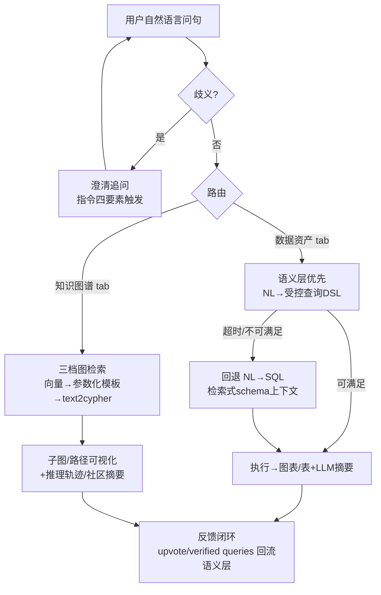

# 对话式 BI / NL 问数成熟模式调研（ConvBI / NL-to-Query）

> 研究日期：2026-09-16 | 实读来源：16 个（全部为官方文档/一手工程博客，全文抓取深读）| 深度：Thorough
> 背景：AI 工作台（数据资产 tab + 知识图谱 tab）要支持「对 tab 数据自然语言问数」：NL→查询、结果渲染为视图（图表/图谱子图）或文本表。

---

## 一、语义层/指标层派（curated semantic model 作为模型上下文）

### 1. Databricks Genie（AI/BI Genie，现 Genie Agents）

来源：https://docs.databricks.com/en/genie/best-practices.html（Curate an effective Genie Agent，更新于 2026-09-11）

核心机制：
- 「策展人（curator）」模式：领域专家为新分析师准备上下文——高质量表/列描述（Unity Catalog 元数据）、业务语义 SQL 表达式、示例 SQL 查询、文本指令，四层递进。
- 官方优先级明确：**SQL 表达式（定义指标/过滤器）> 示例 SQL（教复杂问句的解法）> 纯文本指令（最后手段）**。理由："Structured definitions through SQL are more reliable and maintainable than plain text guidance"。
- 上下文供给是小而精而非全量：建议起步 ≤5 张表、硬上限 50 张表/视图/metric views；超限先预 join 成宽表或 metric view（预定义 metrics/dimensions/aggregations）；可对 agent 隐藏易混淆列；支持列级同义词与 agent 内覆盖描述；prompt matching 自动做值匹配与拼写纠错。
- 澄清追问靠显式指令，官方给出四要素模板：触发条件 + 缺失细节 + 必须动作 + 示例问句（"When users ask about X but don't include Y, you must ask: Please specify…"），并建议放在指令末尾以提高优先级。
- 闭环：benchmark 问题集测试评分、Monitoring 监控用户问句、upvote/downvote 反馈回流迭代；agent 配置可用 Declarative Automation Bundles 版本化（Git 化）。

可迁移结论：NL 问数准确度的第一杠杆是「策展过的语义上下文（SQL 优先）+ 小表集合 + 显式澄清指令」，不是模型选择。

### 2. Snowflake Cortex Analyst（→ Cortex Agents / Semantic Views）

来源：
- https://docs.snowflake.com/en/user-guide/snowflake-cortex/cortex-analyst（主文档）
- https://docs.snowflake.com/en/user-guide/views-semantic/overview（Semantic Views 概览）
- https://docs.snowflake.com/en/user-guide/snowflake-cortex/cortex-analyst/cortex-analyst-routing-mode.md（Routing Mode）
- https://docs.snowflake.com/en/user-guide/snowflake-cortex/cortex-analyst/analyst-optimization.md（Verified Queries 优化）

核心机制：
- 一手原话解释为什么语义层："Generic AI solutions often struggle with text-to-SQL conversions when given only a database schema, as schemas lack critical knowledge like business process definitions and metrics handling"——裸 schema 缺业务过程定义与指标口径。
- 语义模型是轻量 YAML（逻辑表/维度/事实/指标/join 关系/验证示例），已升级为库内 Semantic Views 对象（`CREATE SEMANTIC VIEW`，含 RBAC、derived metrics、public/private 访问修饰符、custom instructions）。经典示例：库里列叫 `amt_ttl_pre_dsc`，业务叫 gross revenue；net revenue 一律 `SUM(gross_revenue*(1-discount))` 权威口径。
- **Routing Mode（关键工程证据）**：生成策略优先产语义 SQL（`SELECT * FROM SEMANTIC_VIEW(… DIMENSIONS … METRICS …)`），超时/不可满足再回退标准 SQL 打物理表；官方承认语义 SQL 目前只覆盖约 10% 查询（随指标建模覆盖度变化），"Shorter SQL is easier for an LLM to produce correctly"。即：受控 DSL 优先 + 裸 SQL 兜底。
- Verified Queries 闭环：从已验证问句/SQL 中学习业务定义（如从 "How many active users" 学到 active 的口径→建议给 customer 表加 is_active 过滤器），泛化到未见过的问题；建议问题→人工验证→概念泛化 的迭代飞轮（>20 条会拖慢优化）。
- 多轮对话：LLM 无状态，靠 messages 传全量历史，follow-up 会被改写为完整问题（"What about North America?"→"…growth for 2021 in North America?"）；已知限制：不能引用上一条 SQL 的结果行、长对话/频繁切换意图会失效，官方建议重开会话。
- 评估：verified queries 当回归测试集跑分（Cortex Analyst evaluations）。

可迁移结论：语义层 YAML/Semantic View 是「给模型的 schema 上下文」的业界标准形态——小、结构化、带口径与示例；生成端用「受控语义 SQL 优先、裸 SQL 兜底」的双层路由。

### 3. Microsoft Power BI Copilot

来源：https://learn.microsoft.com/en-us/power-bi/create-reports/copilot-semantic-models（Use Copilot with semantic models）

核心机制：
- 前置条件直白："you must first prepare your data, your semantic model, and your users. If you don't… Copilot mainly produces low-quality and inaccurate outputs that might be incorrect or even misleading."
- 上下文注入（grounding）清单：当前报表页元数据（有则优先按报表答）+ 会话历史 + 语义模型 schema（表/列/度量/关系/计算组）+ **完整 linguistic schema（同义词、关系动词，复用老 Q&A 机制）** + 模型属性（描述/数据类型/格式串/数据类别）；并执行 **schema reduction**——"restrict the context to what is most important"。隐藏页/隐藏字段/private 表被排除。
- 模型质量要求：星型 schema、人类可读命名、字段描述、隐藏无关列、linguistic modeling（同义词），复杂模型（货币换算/断链表）易出错，官方甚至建议"测不准就别让用户用 Copilot 消费该模型"。
- 输出三段式：**Visual**（Copilot 选视觉类型渲染原生 PBI 视觉，可 Add to page 落到报表画布查看其字段与过滤器）+ **Summary**（把查询结果数据点送 Azure OpenAI 生成自然语言解释）+ **Errors or clarification request**（失败时返回含「用户原问句建议变体」的澄清请求）。
- 明示非确定性风险：同一 prompt/model/data 不保证同答案；报表元数据可能带敏感值进上下文（Caution）。

可迁移结论：结果渲染的成熟形态是「语义查询→原生可视化组件（可检查所用字段/过滤器）+ 结果数据回炉 LLM 生成摘要」；澄清请求与建议变体是错误路径的标配出口。

### 4. Cube（语义层供 AI 消费 / Context Layer）

来源：https://cube.dev/blog/the-context-layer-needs-a-semantic-layer（CEO Artyom Keydunov，2026-07-10）

核心机制：
- 诊断 2024–2025「chat with your data」集体失败的根因：不是模型——"Models write syntactically perfect SQL. The agent failed because it didn't know whether revenue meant gross or net, which of the three customer tables was the source of truth"——是上下文问题。
- 三类上下文论：**可执行上下文**（语义层：measures/dimensions/joins/access policies，编译期把行级/角色权限织进 SQL，治理发生在 SQL 生成之前）vs **描述性上下文**（catalog/glossary/ontology/lineage/wiki，查询时经 MCP 拉取）vs 记忆（harness 侧）。
- Semantic SQL 受控 DSL：agent 写 `MEASURE(completed_percentage)` 而不是手搓 `SUM(CASE WHEN…)/NULLIF(COUNT(*),0)`，由重写引擎展开成正确聚合级别+目标方言+权限编译——"模型本来就熟 SQL，所以扩展 SQL 的 DSL 学习成本最低"。
- 架构：语义层是 agent 工具箱里"the one tool that executes"，其余（实体文档、本体、记忆）都是 MCP 可调用工具；配套 Cube Evals 做上线前答案准确性回归；Brex 案例背书。
- 对全量 schema 的态度：物理血缘全图是"实现细节"，喂给消费 agent 只会加噪声与风险——信息隐藏，只暴露语义接口。

可迁移结论：把「指标口径+权限」做成可执行层（受控 DSL/REST/MCP），描述性知识查询时检索注入——这是「语义层摘要 vs 全量 schema」之争最清晰的工程表述。

### 5. dbt Semantic Layer（MetricFlow）

来源：https://docs.getdbt.com/docs/use-dbt-semantic-layer/dbt-sl

核心机制：
- 指标定义从 BI 层上移到建模层（dbt 项目内 YAML，MetricFlow 语法），集中定义、一处修改全局生效；Semantic Layer API/exports 供下游任意工具取数，保证跨工具同口径；带访问权限与查询缓存。

可迁移结论：指标定义与消费分离、以 API 统一供数，是「AI 消费口径」复用既有资产的标准通道（与 Cube 同构，工程可任选其一）。

### 6. ThoughtSpot Spotter（NL→搜索/可视化）+ Spotter Analysts + AI Context

来源：
- https://docs.thoughtspot.com/cloud/26.9.0.cl/spotter-analysts.html（Spotter Analysts，Early Access）
- https://docs.thoughtspot.com/cloud/26.9.0.cl/spotter-ai-context.html（AI Context）

核心机制：
- Spotter 是搜索式 BI 的 AI 化：回答直接渲染为 ThoughtSpot 原生图表/表（可视化优先），而非先吐 SQL。
- **Spotter Analysts**：预配置的领域分析师——绑定数据模型（最多 5 个）、自定义指令（≤5000 字符）、MCP 连接器白名单、共享范围；RLS 自动继承。
- 官方给出关键分层规则「Where things belong: Model vs Analyst」：指标定义/行过滤/列语义/join key→放数据模型层（Data Model Instructions/Memory，人人继承）；用例框架/输出形态/语气/何时追问→放 Analyst 指令。反模式警告：把 CPL 公式写进某 Analyst 指令会导致跨工作空间复制、模型变更后静默腐烂。
- 澄清追问以指令承载（官方示例）："If the user asks 'how is X doing' without naming a dimension, ask whether they mean Health Score, support load, or renewal risk before answering."
- **AI Context**：列级持久业务知识（模型元数据一部分，建议 150–250 字符、上限 400），区别于一次性 coaching（reference questions）；典型用法：列消歧（Order Date vs Ship Date 优先级）、业务规则（Revenue 排空值）、非标值解释（缩写 MP=Metoprolol、日期 Jan14=2014-01）；列需开索引让 AI 看到实际值；26.9.0.cl 起 <1000 列模型自动生成，可人工改写。

可迁移结论：「列级结构化上下文（含消歧优先级）+ 使用层指令（含何时追问）」双层配置是搜索式 NLQ 的可复制配方；结果渲染直接绑定原生可视化组件。

---

## 二、Text2SQL 直连派与教训

### 7. Vanna.ai（RAG 式 text2sql → agent）

来源：https://vanna.ai/docs（Vanna 2.0 文档）

核心机制：
- 0.x 经典模式：RAG(DDL + 文档 + 历史 SQL 样例) 注入 prompt 生成 SQL——本质是「检索式补上下文」补丁，而非语义层。
- 2.0 演进为 user-aware agent：工具（跑 SQL/生成图表/自定义）+ Tool Memory（成功交互入库，相似问题检索复用 SQL 模式）+ 用户级权限贯穿。
- 教训（与 Cube/Genie/Snowflake 证据交叉印证）：裸 text2sql 缺口径与权限，社区方案只能靠「样例记忆」渐进逼近语义层的部分收益，图表生成靠 prompt 约定而非受控渲染。
- 受控层替代路线的一手证据：Snowflake Routing Mode（语义 SQL 优先、裸 SQL 兜底、官方 10% 覆盖率数据）与 Cube Semantic SQL（`MEASURE()` DSL）就是 LookML/Malloy 式受控层在 AI 时代的直接继承。

可迁移结论：纯 RAG-text2sql 可作冷启动与长尾兜底，但口径/权限/可解释必须由受控层（语义模型或指标 DSL）托底——业界已用产品架构投票。

---

## 三、KG 的 NL 查询派

### 8. Neo4j Text2Cypher + Aura Agent（原 Knowledge Graph Agent 方向）

来源：
- https://neo4j.com/blog/developer/introducing-neo4j-text2cypher-dataset/（Text2Cypher 2024 数据集）
- https://neo4j.com/product/aura-agent/（Neo4j Aura Agent 产品页）

核心机制：
- Text2Cypher(2024) 数据集：44,387 条 question/schema/cypher 三元组（25 个公开数据集清洗合并）——**schema（图 schema）是生成输入的标准组成部分**，与 text2sql 同构；后续有微调专用模型与基准博文。
- Aura Agent：从本体（KG schema）+ 用例描述**自动生成整只 agent**（含定制的图检索工具、prompts、描述）；检索工具三级组合：**向量搜索 + 参数化查询模板 + 动态 text-to-graph-query 生成**（受控程度递增的梯度，正是「模板+槽位 vs 自由生成」的产品级折中）；CoT 与多跳推理在 reasoning tab 透明暴露；一键部署 REST/MCP；微调版 Gemini Flash 专供 text2cypher 工具；子图级访问控制。
- 客户证言（Prospa）："Sales teams…can all query the graph directly through natural language."

可迁移结论：KG tab 的 NL 问数主流是「本体驱动生成工具集 + 向量/参数化模板/动态生成三级检索」，text2cypher 只作为其中一档，且 schema 恒为提示输入。

### 9. Microsoft GraphRAG

来源：https://microsoft.github.io/graphrag/

核心机制：
- 索引期：TextUnits 切分→实体/关系/声明抽取→Leiden 层次聚类→自底向上生成社区摘要。
- 查询期四模式：Global Search（社区摘要答全局/归纳性问题）、Local Search（实体邻域 fan-out）、DRIFT Search（邻域+社区混合）、Basic Search（兜底向量 top-k）。
- 定位：Baseline RAG「连不上点、总结不了全局」的两类失败的结构化解法——不生成查询语言，而是图结构检索+摘要供给上下文窗口；官方强调 prompt tuning 对领域数据必要。

可迁移结论：KG 问答 ≠ 只 text2cypher；「图检索+社区摘要」是摘要型/全局型问题的主流互补路径，适合知识图谱 tab 的非查表类问句。

### 10. Neo4j / NICD 独立研究：GraphRAG 使 agent 真实度 +80%

来源：https://neo4j.com/blog/agentic-ai/study-graphrag-ai-agents-80-percent-more-truthful/（2026-07-22，NICD 独立执行、Neo4j 赞助——利益相关需标注）

核心机制/数据：
- 510 个 MoNaCo 复杂问题：vector+graph（GraphRAG）truthfulness 63 vs vector-only 35；precision .38 vs .18；recall .35 vs .15；复杂题应答率 65.3% vs 28.9%（拒绝率减半以上）；token 更省（图工具可定点取章节/信息框，不必读全文）。
- 关键工程事实：**没有重型手工本体**——用企业既有文档的标题/章节/链接搭轻量图即可大幅提升，证明 KG 增强的进入成本低。

可迁移结论：对「图谱 tab 问答」，vector+graph 混合检索在精度/召回/应答率/token 成本四个维度碾压纯向量，且不必先建完美本体。

### 11. LlamaIndex KnowledgeGraphQueryEngine

来源：https://docs.llamaindex.ai/en/stable/examples/query_engine/knowledge_graph_query_engine/

核心机制：
- `KnowledgeGraphQueryEngine(storage_context=GraphStore)`：NL→（内置 text2cypher 提示，含图 schema）→生成 Cypher→图存储执行→结果 synthesize 为自然语言回答；支持任意 GraphStore 后端（示例 NebulaGraph）；常与 KnowledgeGraphIndex（LLM 抽取三元组建图）配套，实现「从文档建图 + NL 查图」全链路。

可迁移结论：KGQE 是 KG-NLQ 的最小组装单元（schema 进提示、Cypher 出提示、结果再综合），适合做我们的图谱 tab 原型基线，但需按 Aura Agent 思路补参数化模板档与权限。

---

## 四、三大重点问题的裁决（综合全部来源）

### Q1 schema 上下文如何给模型？

| 模式 | 代表 | 证据 |
|---|---|---|
| **语义层摘要（curated）注入** | Snowflake 语义 YAML/Semantic Views、Genie metric views+列描述、dbt/Cube 指标层 | 官方一致表述：裸 schema 缺业务口径；小而结构化优于大而全 |
| **裁剪/隐藏（schema reduction）** | PBI schema reduction、Genie 隐藏列+≤5 表起步+50 表上限、ThoughtSpot Analysts 最多 5 模型 | 全量进上下文是反模式：噪声+敏感泄漏+成本 |
| **检索式选表/选模型** | Genie 多数据源自动选择、Snowflake 多语义模型路由、Cube 描述性上下文经 MCP 查询时检索、Vanna RAG(DDL+SQL 样例) | 规模化时的补充：先检索再注入，查询时组装 |

主流裁决：**默认「语义层摘要」；规模大或跨域时叠加「检索式选上下文」；任何情况下隐藏无关字段、限制表数量。全量 schema 直投没有一家头部产品采用。**

### Q2 澄清追问的主流做法？

- **指令工程触发**（绝对主流）：Genie 四要素模板（触发条件/缺失细节/必须动作/示例问句，放指令末尾）；ThoughtSpot Analyst 指令 "Handling ambiguity" 段（官方模板直接写"ask whether they mean A, B, or C before answering"）。
- **失败时兜底澄清**：PBI 在无法作答时返回 clarification request + 用户原问句的建议变体。
- **多轮改写替代澄清**：Snowflake 把 follow-up 改写为完整独立问题（历史全量传入，无状态）；同时官方承认长对话会退化，建议重开。
- 裁决：**用可配置指令定义"何时必问+问什么"，配"建议变体"式兜底；多轮上下文用于改写而非引用前次结果（各家都还不支持引用前次结果行）。**

### Q3 结果渲染的主流做法？

- **绑定原生可视化组件**（BI 系标准）：PBI Copilot 渲染原生 Visual（模型选图型，Add to page 可落到报表查字段/过滤器）；ThoughtSpot Spotter 答案即图表/表（搜索式渲染）；Genie 出 SQL 结果表 + NL summary（摘要可被指令定制：引用表列名/日期范围/要点化）。
- **摘要回炉**：PBI 把查询结果数据点送 Azure OpenAI 生成 Summary——「视图 + 解释」双通道。
- **KG 侧**：Aura Agent 用 reasoning tab 暴露 CoT/多跳路径（子图/路径可解释）；GraphRAG 用社区摘要支撑归纳式回答。
- 裁决：**「结构化视图（表/图）先行 + LLM 摘要随后」双件套是标配；图表类型由系统按数据形态选择而非用户指定；KG 结果以子图+推理轨迹呈现。**

---

## 五、总结裁决

1. **语义层先行 vs 裸 Text2SQL：业界证据一边倒。** Snowflake 官方文档直接把"只给 schema 的通用方案"列为反面教材；Cube 把 2024-25 chat-with-data 的失败归因于上下文而非模型；PBI 把"不准备语义模型→低质量误导性输出"写进文档前置警告；Genie 把策展语义上下文作为产品核心工作流。裸 text2sql（Vanna 类）退居冷启动与长尾兜底。混合路由（受控语义 SQL 优先、裸 SQL 兜底，Snowflake 实测语义 SQL 覆盖约 10% 并建议持续扩模）是当前工程最优解。
2. **KG NLQ 主流是三档梯度 + 混合检索：** 向量检索（子图/实体）→ 参数化查询模板（槽位填充）→ 动态 text2cypher（schema 进提示），外加 GraphRAG 式社区摘要答归纳题；NICD 独立研究证明 vector+graph 混合在真实度（63 vs 35）、应答率（65.3% vs 28.9%）、token 成本上全面占优，且轻量图（文档标题/章节/链接）即可起步，无需重型本体。
3. **对我们工作台的直接映射：** 数据资产 tab = 先建轻量语义层（指标/维度/口径 YAML + 列级 AI Context 式描述 + verified 示例问句集），NL→受控查询 DSL 优先、SQL 兜底；知识图谱 tab = 本体驱动生成检索工具（向量+模板+text2cypher 三档），结果渲染子图+推理轨迹；澄清追问 = 可配置指令（四要素模板）；结果 = 视图+摘要双件套。

（图释：主链路为「澄清守门 → tab 路由 → 受控优先生成 → 视图+摘要渲染 → 反馈回流语义层/记忆」。）

---

## 六、来源清单（全部实际抓取全文阅读）

| # | 来源 | 类型 | 日期 |
|---|---|---|---|
| 1 | https://docs.databricks.com/en/genie/best-practices.html | 一手官方文档 | 2026-09-11 更新 |
| 2 | https://docs.snowflake.com/en/user-guide/snowflake-cortex/cortex-analyst | 一手官方文档 | 2026 访问 |
| 3 | https://docs.snowflake.com/en/user-guide/views-semantic/overview | 一手官方文档 | 2026 访问 |
| 4 | https://docs.snowflake.com/en/user-guide/snowflake-cortex/cortex-analyst/cortex-analyst-routing-mode | 一手官方文档 | 2026 访问 |
| 5 | https://docs.snowflake.com/en/user-guide/snowflake-cortex/cortex-analyst/analyst-optimization | 一手官方文档 | 2026 访问 |
| 6 | https://learn.microsoft.com/en-us/power-bi/create-reports/copilot-semantic-models | 一手官方文档 | 2026 访问 |
| 7 | https://cube.dev/blog/the-context-layer-needs-a-semantic-layer | 一手工程博客（Cube CEO） | 2026-07-10 |
| 8 | https://docs.getdbt.com/docs/use-dbt-semantic-layer/dbt-sl | 一手官方文档 | 2026 访问 |
| 9 | https://docs.thoughtspot.com/cloud/26.9.0.cl/spotter-analysts.html | 一手官方文档 | 26.9.0.cl 版本 |
| 10 | https://docs.thoughtspot.com/cloud/26.9.0.cl/spotter-ai-context.html | 一手官方文档 | 26.9.0.cl 版本 |
| 11 | https://vanna.ai/docs | 一手官方文档 | 2026 访问 |
| 12 | https://neo4j.com/blog/developer/introducing-neo4j-text2cypher-dataset/ | 一手工程博客 | 2024-11-07 |
| 13 | https://neo4j.com/blog/agentic-ai/study-graphrag-ai-agents-80-percent-more-truthful/ | 一手博客转述独立研究（NICD，Neo4j 赞助，利益相关） | 2026-07-22 |
| 14 | https://microsoft.github.io/graphrag/ | 一手官方文档 | 2026 访问 |
| 15 | https://docs.llamaindex.ai/en/stable/examples/query_engine/knowledge_graph_query_engine/ | 一手官方教程 | 2026 访问 |
| 16 | https://neo4j.com/product/aura-agent/ | 一手产品页 | 2026 访问 |

## 七、方法论与限制

- 计划通道 chrome-devtools（DuckDuckGo 搜索+页面快照）在本次环境不可用（MCP Not connected，重试 3 次）；DuckDuckGo html/lite 端点经代理访问触发反爬（anomaly/challenge 页）。按任务约束未使用 web_search MCP 工具，改用等效替代：curl 直连/代理抓取一手来源全文 + 各站 sitemap.xml/llms.txt 做 URL 发现（ThoughtSpot 26.9.0.cl 版本页、Snowflake cortex-llms.txt 索引均由此定位），python3 自写提取器去壳取正文，逐篇通读。
- 搜索层降级意味着「反面/社区批评视角」覆盖弱于计划（HN/Reddit 讨论 未纳入）；已用厂商官方承认的限制（Snowflake 10% 语义覆盖、PBI 非确定性、多轮对话退化）作为风险证据补偿。
- NICD 研究为 Neo4j 赞助，数字按一手转述标注利益相关。
