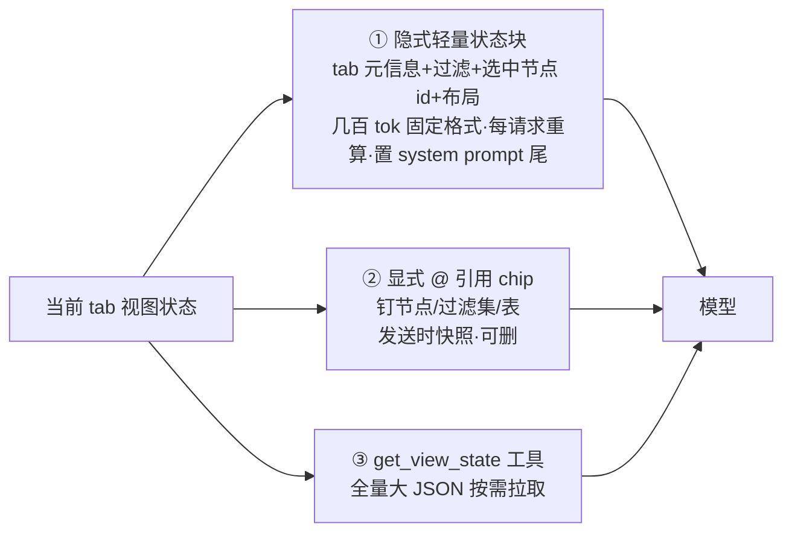

# Tab 感知智能上下文架构——业界模式调研与综合裁决

> 研究日期：2026-09-16 | 来源：5 份并行子报告、约 90 个一手来源实读 | 深度：Exhaustive
> 子报告：[上下文注入](2026-09-16-ai-chat-context-injection-patterns.md) · [视图操控工具化](2026-09-16-ai-view-manipulation-tool-patterns.md) · [事件回路①](2026-09-16-ai-toolcall-frontend-view-loop.md)/[②](2026-09-16-ai-toolcall-frontend-view-loop-and-replay.md) · [问数 NL→查询](2026-09-16-conversational-bi-nl2query-patterns.md)

---

## 1. 执行摘要

四个子领域（上下文注入、AI 操控视图工具化、前后端事件回路、NL 问数）的业界证据高度收敛：**没有任何一家头部产品把全量视图状态塞进对话，也没有任何一家产品内 AI 用通用 DOM/截图操控自家界面**。共识架构是三层结构：小而稳的隐式状态块每请求重算注入 + 显式 @ 引用钉住关键对象 + 白名单领域工具按需拉取/操纵；视图操控走「中等粒度枚举工具 + 类型化参数」，结果经 turn-based 回路（SSE 下行、HTTP 重提交回传）执行并全事件化记录。

对我们产品（多 tab + 常驻 composer + preset 体系），第九轮需求的落地路径可直接套用该三层结构：切 tab 即重算轻量视图状态块、图谱 tab 暴露 `set_filter`/`center_node`/`set_layout` 等白名单工具、问数走轻量语义层 + 受控 DSL 优先 + 结果渲染为原生视图 + LLM 摘要双件套。风险集中在：语义层策展是持续运营成本、事件重放要求工具幂等、computer-use 式泛化路线被所有一手证据否定。

## 2. 关键发现

1. **注入位置分层混用是唯一共识**：稳定小状态 → system prompt 尾部/启动块（Claude Code env info ~280 tok）、会话约定 → 紧随 system prompt 的独立 context block（CLAUDE.md 式）、操作对象 → user message 侧显式引用、大体积 → 工具按需拉取（[VS Code](https://code.visualstudio.com/docs/agents/concepts/context)、[Claude Code](https://code.claude.com/docs/en/context-window)、[Cursor](https://cursor.com/docs/agent/prompting)）。
2. **视图状态刷新业界先例 = 每请求重算**：VS Code 官方明示每次模型请求重组装 prompt（含 active editor/selection/git 隐式上下文）；显式引用则是发送时单消息快照（[VS Code chat context](https://code.visualstudio.com/docs/chat/copilot-chat-context)）。
3. **产品内 AI 改视图无一例外走白名单语义工具**：Grafana 写入口收敛为 `update_dashboard` 单工具 + 读侧摘要/JSONPath 提取（[工具表](https://grafana.com/docs/grafana-cloud/ai-tools/mcp-servers/oss-mcp/reference/mcp-tools-table/)）、Power BI 报表 agent 直接编辑 PBIR JSON + `validate-report` 校验 + 截图验证 + 回滚（[skill 概览](https://learn.microsoft.com/en-us/power-bi/developer/agentic/power-bi-report-authoring-skill-overview)）。
4. **通用操控被其维护者自己定位为兜底**：Anthropic 官方选型次序「专用 API > fetch/search > browser use > computer use」，自述截图坐标会幻觉、延迟高（[computer use](https://platform.claude.com/docs/en/agents-and-tools/tool-use/computer-use-tool)）。
5. **回路收敛为 SSE 下行 + HTTP 消息级重提交回传**，非反向流（[Vercel AI SDK HITL](https://ai-sdk.dev/docs/ai-sdk-ui/overview)、[AG-UI 事件协议](https://docs.ag-ui.com/concepts/events)）；可重放 = 记事件序列（工具意图+结果+状态补丁 JSON Patch RFC 6902）非记快照。
6. **问数准确率第一杠杆是策展语义上下文而非模型**：Snowflake 官方文档把裸 schema 列为反面教材（[Cortex Analyst](https://docs.snowflake.com/en/user-guide/snowflake-cortex/cortex-analyst)）、Power BI 把不备语义模型的后果写成前置警告（[copilot-semantic-models](https://learn.microsoft.com/en-us/power-bi/create-reports/copilot-semantic-models)）；KG 侧 vector+graph 混合检索对纯向量四维碾压（[NICD 研究](https://neo4j.com/blog/agentic-ai/study-graphrag-ai-agents-80-percent-more-truthful/)）。

## 3. 详细分析

### 3.1 上下文注入模式

| 产品 | 注入位置 | 刷新时机 | Token 策略 | 裁决 |
|---|---|---|---|---|
| [VS Code Copilot](https://code.visualstudio.com/docs/agents/concepts/context) | 每次请求重组装：system/implicit（active file+选区+错误+git）/explicit `#`/tool outputs；Ask 全文进、Agent 只作建议附件 | 每请求重算；附件发送时快照 | 小项目全量、大项目语义索引；自动 compaction | **推荐**：「切 tab 上下文跟随」最直接先例，隐式轻量+内容分级照抄 |
| [Claude Code](https://code.claude.com/docs/en/context-window) | env info（cwd/git）独立小块置 system prompt 尾；CLAUDE.md 独立 context block 不动 system prompt | 会话头一次+事件触发 | ~280 tok 状态块；skill 一行描述常驻、调用才载全文；超 10000 字符落盘 | **推荐**：视图状态=小而稳状态块置 system prompt 尾 |
| [Cursor](https://cursor.com/docs/agent/prompting) | `@` 显式附着单条消息后淡出；Rules 三档（always/globs/description 按需） | @ 单消息快照 | context ring 分类账，满则压缩旧对话 | **推荐**：分档注入（常驻/触发/描述+按需） |
| [Windsurf](https://docs.windsurf.com/windsurf/cascade/memories) | Rules 四档激活含成本标注；隐式含 open tabs | — | 硬上限：global 6000/workspace 12000 字符 | **推荐**：预算治理框架最可抄 |
| [Notion AI](https://www.notion.com/help/guides/notion-ai-for-docs) | 四层：当前页>工作区>连接器>web；权限内检索不预注入 | 入口触发 | Q&A 检索式 | **推荐**：四层上下文声明直接抄 |
| [Linear](https://linear.app/agents) | 底部常驻 composer + 对象 chip「added to context」显式钉住 | 显式添加 | — | **推荐**：与隐式跟随叠加的交互范式 |
| [ChatGPT Canvas](https://openai.com/index/introducing-canvas/) | 画布与对话同上下文；高亮=焦点注入 | 模型决策触发 | — | 推荐：选中节点即 Canvas 的 highlight |

业界共识：**隐式打底、显式可指、重要必显式**（VS Code 原话 "If a particular source is important, add it explicitly"）；「描述常驻+全文按需」是最精细中间态（Windsurf/Cursor/Claude skill 三家同构）。



### 3.2 AI 操控视图的工具化模式

| 产品 | 机制 | 裁决 |
|---|---|---|
| [Grafana OSS MCP](https://grafana.com/docs/grafana-cloud/ai-tools/mcp-servers/oss-mcp/reference/mcp-tools-table/) | ~50 领域工具按类别白名单开关+RBAC；写入口收敛 `update_dashboard`；读侧 `get_dashboard_summary`+JSONPath 局部提取；[ui-mcp-server v2](https://github.com/grafana/grafana-ui-mcp-server) 合并为单工具+11 action 枚举 | **推荐**：与「AI 调当前 tab 视图」最同构 |
| [ThoughtSpot Spotter](https://docs.thoughtspot.com/cloud/26.9.0.cl/spotter) | 视图=search tokens 参数化 DSL；Edit Answer 增删 token 高亮 diff；编辑需 TML 权限 | **推荐**：token diff 可解释+权限开关照搬 |
| [Power BI 报表 agent](https://learn.microsoft.com/en-us/power-bi/developer/agentic/power-bi-report-authoring-skill-overview) | 视图=磁盘 PBIR JSON 文档；`validate-report` 结构校验+CLI 截图视觉验证；改前 commit 可回滚 | **强烈推荐**：文档化+校验+截图验证+回滚闭环 |
| [Tableau Pulse](https://help.tableau.com/current/online/en-us/pulse_explore_metrics.htm) | 探索面收敛为时间/过滤/维度受限参数+建议问题 | 混合：受限参数面可套图谱 tab；布局操控无先例 |
| [Playwright MCP](https://github.com/microsoft/playwright-mcp)/[CDT MCP](https://github.com/ChromeDevTools/chrome-devtools-mcp) | a11y snapshot+结构化引用为主、坐标 opt-in；工具标 Read-only 分级 | **范式推荐、用途不推荐**：作产品视图通道太慢太脆 |
| [computer-use](https://platform.claude.com/docs/en/agents-and-tools/tool-use/computer-use-tool) | 截图+坐标；官方自述局限，限「速度不关键的可信环境」 | **不推荐**：官方分层选型即权威否定 |
| [Generative UI](https://ai-sdk.dev/docs/ai-sdk-ui/generative-user-interfaces)（业界通用叫法） | tool call 结果绑定 React 组件渲染；CopilotKit v2 [useFrontendTool](https://docs.copilotkit.ai/reference/v2/hooks/useFrontendTool) Zod+render({args,status,result}) | **推荐**：用于 composer 进度/结果呈现，与 tab 白名单工具互补 |

**取舍论证**：所有「产品内开放 AI 调视图」的一手案例（Grafana/ThoughtSpot/Power BI/Tableau）无一例外走语义层白名单工具；通用操控层维护者（Anthropic/Microsoft/Google）一致定位为「无专用接口时的外部自动化」。通用操控唯一不可替代场景是操控不受控第三方/遗留界面。**Schema 设计主流**：中等粒度枚举工具族+类型化参数（Playwright 73/CDT ~40/Grafana ~50）；工具过多时合并方向是「单工具+action 枚举」而非 patch 大工具；参数化 DSL/patch（[RFC 6902](https://datatracker.ietf.org/doc/html/rfc6902)）只用于可持久化、可 diff、可校验的文档型状态且必配校验。

### 3.3 前端-后端事件回路

**SSE vs WebSocket**：业界事实标准 = HTTP POST 上行 + SSE 下行 turn-based；WS 仅语音全双工/高频 model-tool 往返（20+ 调用约 40% 提速，[OpenAI WS mode](https://platform.openai.com/docs/guides/realtime)）才划算。**结果回传**：不用反向流通道——AI SDK `addToolOutput`/AG-UI `role:"tool"` 消息均为全量消息重提交续跑；LangGraph `interrupt()`+checkpointer+`Command(resume=)` 是常驻 loop 的替代（[langgraph HITL](https://langchain-ai.github.io/langgraph/concepts/human_in_the_loop/)）。**流式协议**：两厂一致的参数增量形态（OpenAI `delta.tool_calls` 按 index 拼接、Anthropic `input_json_delta`，[streaming](https://docs.claude.com/en/api/streaming)），End 事件才是可信入参点。**重放**：记事件序列不记快照——AG-UI `STATE_SNAPSHOT`+`STATE_DELTA`（JSON Patch）损坏时请求新快照自愈；[assistant-ui Interactables](https://www.assistant-ui.com/docs/interactables) 的 thread 即 append-only 视图版本链（`origin: user-edit|assistant`、`restore()` 回滚），用户手动改动经 shallow diff 快照注入下条消息让模型感知。**冲突**：主流非乐观锁，而是「破坏性分级审批门（`needsApproval` 按入参动态）+ 版本链 restore + 快照注入」三层组合；LangGraph 官方要求 interrupt 前副作用幂等，否则重放重复改视图。

```mermaid
sequenceDiagram
    participant M as 模型
    participant S as 后端 agent loop
    participant F as 前端(当前 tab)
    participant L as 会话日志
    M->>S: tool_call(set_filter, args)
    S->>L: 记 view_tool_call 事件(意图+args+viewVersion)
    S->>F: SSE: tool-input-start/delta/available
    F->>F: 白名单校验+执行视图变更(幂等)
    F->>S: HTTP 重提交: 消息+tool result(含执行后状态摘要)
    S->>L: 记 view_tool_result 事件
    S->>M: 续跑(含工具结果)
    Note over F,L: 重放=按序 apply 事件; 损坏=请求 STATE_SNAPSHOT 自愈
```

### 3.4 问数（NL→查询）

| 模式 | 代表与机制 | 裁决 |
|---|---|---|
| 语义层先行 | [Databricks Genie](https://docs.databricks.com/en/genie/best-practices.html)：curator 提供 SQL 表达式>示例>文本指令三层，≤5 表起步/50 上限；[Cortex Analyst](https://docs.snowflake.com/en/user-guide/snowflake-cortex/cortex-analyst)：语义 YAML+Semantic View，**Routing Mode 语义 SQL 优先+裸 SQL 兜底**；[Cube](https://cube.dev/blog/the-context-layer-needs-a-semantic-layer)：口径/权限做成可执行层编译期织入 | **推荐**：官方证据一边倒；schema 全量直投无一家头部产品采用 |
| 受控 DSL+槽位 | ThoughtSpot search tokens；Snowflake 语义 SQL 实测仅覆盖 ~10% 查询但持续扩模；[dbt SL](https://docs.getdbt.com/docs/use-dbt-semantic-layer/dbt-sl) 指标一处定义全局供数 | 推荐：受控层优先生成、裸 SQL 兜底 |
| Text2SQL 直连 | [Vanna 2.0](https://vanna.ai/docs)：RAG(DDL+样例)+Tool Memory 渐进逼近语义层收益 | 混合：仅冷启动/长尾兜底，口径权限必须受控层托底 |
| 澄清追问 | Genie 四要素指令（触发条件+缺失细节+必须动作+示例问句）；PBI 澄清请求带原问句建议变体；Snowflake follow-up 改写为完整问题但不可引用前次结果行 | 推荐：指令工程触发为主+失败兜底澄清 |
| 结果渲染 | [Power BI Copilot](https://learn.microsoft.com/en-us/power-bi/create-reports/copilot-introduction)：Visual（原生组件，Add to page 可审查字段/过滤器）+Summary（结果回炉 LLM）+澄清请求三段式 | **推荐**：视图+摘要双件套标配 |
| KG NLQ | [Neo4j Aura Agent](https://neo4j.com/product/aura-agent/)：向量→参数化模板→text2cypher 三级受控梯度+reasoning tab 透明化；[GraphRAG](https://microsoft.github.io/graphrag/)：社区摘要答归纳题；混合检索 truthfulness 63 vs 35（[NICD](https://neo4j.com/blog/agentic-ai/study-graphrag-ai-agents-80-percent-more-truthful/)） | **推荐**：三档梯度+子图渲染+推理轨迹；轻量图即可起步 |

对数据资产 tab：轻量语义层（口径 YAML+列级 AI Context+verified 问句集）+受控 DSL 优先生成；对图谱 tab：三档图检索+子图/推理轨迹渲染；列级上下文参考 [ThoughtSpot AI Context](https://docs.thoughtspot.com/cloud/26.9.0.cl/spotter-ai-context.html)（150–250 字符消歧：Order Date vs Ship Date 优先级、业务规则、非标值解释）。

### 3.5 综合裁决

**上下文注入**：三层结构（全部有先例背书）——①隐式轻量状态块：tab 元信息+过滤+选中节点 id+布局，压到几百 tok 固定格式，**每请求重算、切 tab 即换**，置 system prompt 尾部独立块（Claude Code env info 同构）；②显式 @ 引用：钉节点/过滤集/表进对话，chip 可见可删、单消息快照（Linear/VS Code 同构）；③`get_view_state` 工具：全量大 JSON 不注入、按需拉取，检索型任务走子代理防污染。预算照 Windsurf 设字符硬上限并做分类账。

**视图操控工具**：**白名单枚举工具族为主、文档 patch 为辅**。图谱 tab 暴露 `set_filter`/`center_node`/`set_layout`/`get_view_state` 等中等粒度工具+类型化参数（含枚举值，Zod/JSON Schema）；高频批量需求再补 `apply_view_patch`（RFC 6902 子集，仅打在 tab ViewModel 文档上，服务端 schema 校验+diff 解释）。白名单三原则：每个工具可单独 RBAC/开关（Grafana）、破坏性操作走 `needsApproval` 动态审批（AI SDK）、执行必须幂等且改前留版本可回滚（Power BI commit+restore）。computer-use/通用 DOM 操控仅保留为未来操控第三方系统的能力，不用于自家 tab。composer 内结果呈现走 generative UI（tool call 绑定组件）与 tab 工具互补。

**事件回路与日志**：HTTP POST 上行+SSE 下行 turn-based；工具执行结果以消息级 HTTP 重提交回传 agent loop（非反向流）；协议事件含 `tool-input-start/delta/available/output` + `STATE_SNAPSHOT/STATE_DELTA`（JSON Patch）；会话日志记**事件序列**（工具意图+args+viewVersion+执行结果+审批记录+状态补丁）而非最终态快照，重放=按序 apply、损坏=请求新快照自愈；冲突用「分级审批+append-only 版本链 restore+用户改动 diff 快照注入下轮」三层组合，不引入乐观锁/CRDT。

## 4. 反对观点与风险

- **语义层是持续运营成本而非一次性工程**：Genie 把策展当核心工作流（benchmark 题集+upvote 反馈闭环），Snowflake 语义 SQL 仅覆盖 ~10% 查询需持续扩模——「语义层先行」的正确性依赖长期策展投入，冷启动期裸 Text2SQL 兜底的口径风险必须用「澄清+可审查渲染」对冲。
- **白名单路线与「优先 AI」原则存在张力**：每加一个前端能力都要补一个工具，可能退化为「换一种写死的逻辑」；业界对策是把 tab 视图状态文档化（Power BI PBIR/ThoughtSpot TML），让 AI 编辑文档而非逐操作调用，工具数不随功能膨胀。
- **每请求重算上下文有延迟成本**：VS Code 官方明示 implicit context 消耗 token/credits；切 tab 频繁场景需缓存状态块仅在变化时重算（diff 注入）。
- **CRDT/协同路线证据不足**：子调研未获一手文档支撑 AI 写入与 CRDT 合并的主流实践，报告标注为风险而非结论。
- **利益相关标注**：NICD 混合检索研究由 Neo4j 赞助；Snowflake 10% 覆盖率为官方文档自述，口径可能偏保守。

## 5. 开放问题

1. 多 tab 并行会话（一个会话引用两个 tab 的状态）业界无先例，需自行设计「主 tab+背景 tab 描述」的注入格式。
2. `apply_view_patch` 与枚举工具的边界（何时值得引入 patch）缺乏定量证据，建议先全枚举、观察失败案例再引入。
3. 视图变更事件的保留策略（全量保留 vs compaction 时折叠为快照）未有一手先例，需结合 DSH session log 机制自行设计。

## 6. 来源

| # | 来源 | 类型 | 日期 |
|---|---|---|---|
| 1 | [code.visualstudio.com/docs/agents/concepts/context](https://code.visualstudio.com/docs/agents/concepts/context) | 一手（官方文档） | 2026-09-16 访问 |
| 2 | [code.visualstudio.com/docs/chat/copilot-chat-context](https://code.visualstudio.com/docs/chat/copilot-chat-context) | 一手 | 同上 |
| 3 | [cursor.com/docs/agent/prompting](https://cursor.com/docs/agent/prompting) / [rules](https://cursor.com/docs/rules) | 一手 | 同上 |
| 4 | [code.claude.com/docs/en/context-window](https://code.claude.com/docs/en/context-window) | 一手 | 同上 |
| 5 | [docs.windsurf.com/cascade/memories](https://docs.windsurf.com/windsurf/cascade/memories) | 一手 | 同上 |
| 6 | [notion.com/help/notion-ai](https://www.notion.com/help/guides/notion-ai-for-docs) · [linear.app/agents](https://linear.app/agents) · [openai.com/index/introducing-canvas](https://openai.com/index/introducing-canvas/) | 一手 | 同上 |
| 7 | [grafana.com OSS MCP 工具表](https://grafana.com/docs/grafana-cloud/ai-tools/mcp-servers/oss-mcp/reference/mcp-tools-table/) · [grafana-ui-mcp-server](https://github.com/grafana/grafana-ui-mcp-server) | 一手 | 同上 |
| 8 | [learn.microsoft.com Power BI Copilot](https://learn.microsoft.com/en-us/power-bi/create-reports/copilot-introduction) · [报表 authoring skill](https://learn.microsoft.com/en-us/power-bi/developer/agentic/power-bi-report-authoring-skill-overview) | 一手 | 同上 |
| 9 | [docs.thoughtspot.com Spotter](https://docs.thoughtspot.com/cloud/26.9.0.cl/spotter) · [Analysts](https://docs.thoughtspot.com/cloud/26.9.0.cl/spotter-analysts.html) · [AI Context](https://docs.thoughtspot.com/cloud/26.9.0.cl/spotter-ai-context.html) | 一手 | 同上 |
| 10 | [help.tableau.com Pulse](https://help.tableau.com/current/online/en-us/pulse_explore_metrics.htm) | 一手 | 同上 |
| 11 | [github.com/microsoft/playwright-mcp](https://github.com/microsoft/playwright-mcp) · [ChromeDevTools/chrome-devtools-mcp](https://github.com/ChromeDevTools/chrome-devtools-mcp) | 一手 | 同上 |
| 12 | [platform.claude.com computer-use](https://platform.claude.com/docs/en/agents-and-tools/tool-use/computer-use-tool) · [browser-use](https://platform.claude.com/docs/en/agents-and-tools/tool-use/browser-use-tool) | 一手 | 同上 |
| 13 | [ai-sdk.dev generative UI](https://ai-sdk.dev/docs/ai-sdk-ui/generative-user-interfaces) · HITL/tool calling 系列 | 一手 | 同上 |
| 14 | [docs.copilotkit.ai](https://docs.copilotkit.ai/reference/v2/hooks/useFrontendTool) | 一手 | 同上 |
| 15 | [docs.ag-ui.com/concepts/events](https://docs.ag-ui.com/concepts/events) | 一手 | 同上 |
| 16 | [assistant-ui Interactables](https://www.assistant-ui.com/docs/interactables) | 一手 | 同上 |
| 17 | [langchain-ai.github.io/langgraph HITL](https://langchain-ai.github.io/langgraph/concepts/human_in_the_loop/) | 一手 | 同上 |
| 18 | [docs.claude.com streaming](https://docs.claude.com/en/api/streaming) · OpenAI streaming API 参考 | 一手 | 同上 |
| 19 | [docs.databricks.com Genie best practices](https://docs.databricks.com/en/genie/best-practices.html) | 一手 | 同上 |
| 20 | [docs.snowflake.com Cortex Analyst](https://docs.snowflake.com/en/user-guide/snowflake-cortex/cortex-analyst)（含 routing/optimization 三篇） | 一手 | 同上 |
| 21 | [learn.microsoft.com copilot-semantic-models](https://learn.microsoft.com/en-us/power-bi/create-reports/copilot-semantic-models) | 一手 | 同上 |
| 22 | [cube.dev context-layer 博文](https://cube.dev/blog/the-context-layer-needs-a-semantic-layer) · [docs.getdbt.com semantic layer](https://docs.getdbt.com/docs/use-dbt-semantic-layer/dbt-sl) | 一手 | 同上 |
| 23 | [vanna.ai/docs](https://vanna.ai/docs) | 一手 | 同上 |
| 24 | [neo4j text2cypher 数据集](https://neo4j.com/blog/developer/introducing-neo4j-text2cypher-dataset/) · [Aura Agent](https://neo4j.com/product/aura-agent/) | 一手 | 同上 |
| 25 | [microsoft.github.io/graphrag](https://microsoft.github.io/graphrag/) · [NICD 研究](https://neo4j.com/blog/agentic-ai/study-graphrag-ai-agents-80-percent-more-truthful/) · [LlamaIndex KGQE](https://docs.llamaindex.ai/en/stable/examples/query_engine/knowledge_graph_query_engine/) | 一手/研究 | 同上 |

## 7. 方法论

- 架构：主任务分解四个独立子问题 → 5 个并行 deep-research 子任务（含事件回路补发一次）→ 主任务交叉汇总。每子任务要求 DuckDuckGo（chrome-devtools）发现 + 全文深读 + 过滤广告。
- 实际执行偏差：本轮 chrome-devtools MCP 多次断连、DDG 反爬触发，各子任务按「优先一手来源」降级为 curl 直抓官方文档/.md 端点/sitemap/llms.txt 发现 + 全文实读，全程未用 web_search MCP；偏差已在各子报告方法论节披露。
- 来源：约 90 个一手 URL 实读，全部为官方文档/工程博客/仓库；ChatGPT Canvas 一手页被 Cloudflare 拦截部分经 Web Archive 补读。局限：访问时点快照，产品迭代快；Nicd 研究利益相关已标注。
