# 移动端原型拆解与现状 UX 诊断

## 第一部分：参考原型实地拆解

> 实测日期：2026-09-17 | 访问方式：chrome-devtools 真实浏览器（iPhone 14 Pro 视口 390×844@3x，移动 UA + 触屏模拟）+ Playwright 驱动系统 Chrome 落盘截图 | 目标站点：`ecsw7ghbbjljmplh3de2jz5yni.demo.lzqz.cn`（蓝鲸凌云 demo 域，"食品经营全能助理"渠道/消费端高保真原型 v1.0 MVP·漯河示范）
>
> **标注约定**：未特别标注的内容均为「实测」（真实浏览器访问 + DOM/可访问性树/计算样式提取）；「推断」内容会显式标注推断依据。本次登录一次性成功（原型为 mock 鉴权），因此 ftd.lzqz.cn / demo.lzqz.cn 同域公开信息仅作背景补充，不承担结构推断职责。

### 1. 原型定位与技术形态（实测）

- **产品叙事**：渠道/消费端 App，与"生产端"组成 C2M（Customer-to-Manufacturer）双端协同闭环——侧栏自述"已连通生产端 · 产销一体"、"一键走查从需求洞察到工厂排产的产销协同"。走查壳（左侧深色原型导航栏）列出 10 个页面直达入口，本身就是原型的信息架构地图（见 [`prototype-shell.png`](2026-09-17-mobile-prototype/prototype-shell.png)）。
- **技术栈**（DOM 与 CSS 实测）：React SPA（`#root` 挂载）+ Tailwind + shadcn/ui 风格设计令牌（`bg-primary` / `text-muted-foreground` / `rounded-xl` 等 class 体系），字体 Noto Sans SC 系统栈；**path 路由**（非 hash），所有页面可 URL 直达（这是本次能全量实测的前提）。
- **原型态佐证**：`localStorage`/`sessionStorage` 均为空（无持久化）；登录不校验验证码（实测任意 6 位码 `123456` 直接进入）；数据全部为 mock。
- **页面总览**：登录页（启动与认证）+ App 内 4 个底部 Tab（消息/工作台/数据/我的），消息 Tab 下挂 5 个二级页，最深三级（会话列表 → Agent 会话 → 任务卡详情）。

### 2. 信息架构（实测）

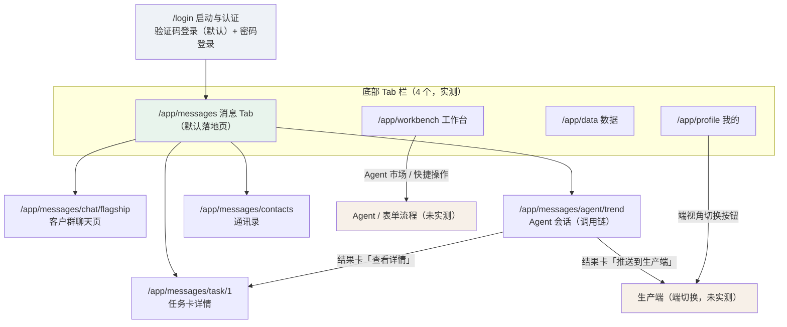

*说明：白底为一级层级，浅绿为默认落地 Tab；橙色为本次未实测、按入口存在性推断的目标页。*

**页面清单（全部路由实测可达）：**

| # | 路由 | 页面 | 层级 | 底部 Tab | 截图 |
|---|------|------|------|----------|------|
| 1 | `/login` | 启动与认证（验证码登录） | 0 | 无 | [`login.png`](2026-09-17-mobile-prototype/login.png) |
| 2 | `/app/messages` | 会话列表（消息 Tab） | 1 | 消息（默认选中） | [`messages-tab.png`](2026-09-17-mobile-prototype/messages-tab.png) |
| 3 | `/app/messages/chat/flagship` | 客户群聊天页 | 2 | 保留 | [`group-chat.png`](2026-09-17-mobile-prototype/group-chat.png) |
| 4 | `/app/messages/agent/trend` | Agent 会话（调用链） | 2 | 保留 | [`agent-chat.png`](2026-09-17-mobile-prototype/agent-chat.png) |
| 5 | `/app/messages/task/1` | 任务卡详情 | 3 | 保留 | [`task-card.png`](2026-09-17-mobile-prototype/task-card.png) |
| 6 | `/app/messages/contacts` | 通讯录 | 2 | 保留 | [`contacts.png`](2026-09-17-mobile-prototype/contacts.png) |
| 7 | `/app/workbench` | 工作台 | 1 | 工作台 | [`workbench.png`](2026-09-17-mobile-prototype/workbench.png) |
| 8 | `/app/data` | 数据中心 | 1 | 数据 | [`data.png`](2026-09-17-mobile-prototype/data.png) |
| 9 | `/app/profile` | 我的 | 1 | 我的 | [`profile.png`](2026-09-17-mobile-prototype/profile.png) |

**导航结构结论（实测）**：底部 4-Tab 经典 B 端导航；无抽屉、无顶部全局导航；二级页靠列表项点击进入、页头返回键退出；任务卡详情由 Agent 会话结果卡的「查看详情」跳入，形成"对话 → 工单"三级链路。

### 3. 关键页面流（实测路径）

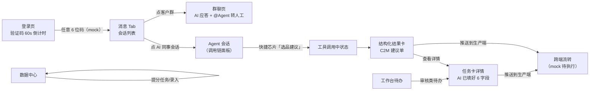

**冷启动关键路径（实测）**：登录页手机号预填 `13800138000` → 点「获取验证码」（按钮变 60s 倒计时）→ 输入任意 6 位码 → 「登录」→ 直接落在 `/app/messages`（消息即首页，对话是一级入口）。

### 4. 逐页拆解

#### 4.1 登录页 `/login`

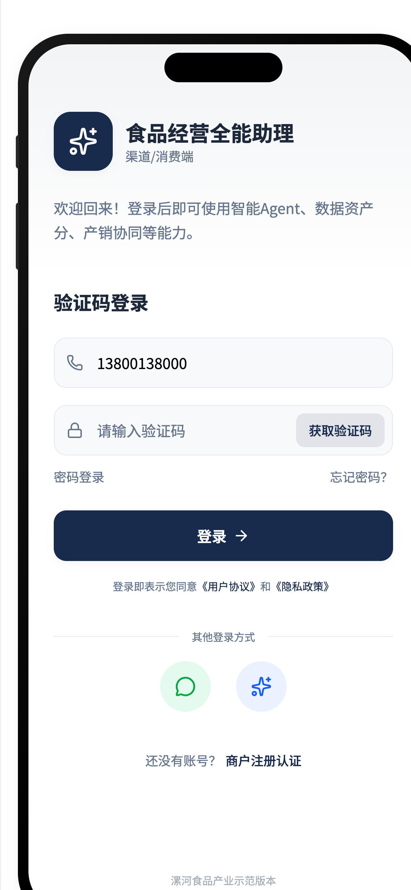

- **结构（上→下）**：品牌区（星形 logo + 「食品经营全能助理」+ 「渠道/消费端」副标题）→ 欢迎语（"登录后即可使用智能 Agent、数据资产分、产销协同等能力"——用能力词教育用户）→ 「验证码登录」卡片：手机号输入（预填）、验证码输入 + 内嵌「获取验证码」按钮、「密码登录 / 忘记密码」辅助行、大号主色「登录 →」按钮 → 协议行（「登录即表示您同意《用户协议》和《隐私政策》」，链接为主色）→ 「其他登录方式」分隔线 + 两个圆形图标（微信绿、手机蓝灰）→ 「还没有账号？商户注册认证」→ 页脚「漯河食品产业示范版本」。
- **交互（实测）**：默认验证码登录，可切密码登录；「获取验证码」点击后变 `60s` 倒计时；登录成功无 toast 直接跳转。
- **可取处**：单一主行动 + 分散的次级行动（密码登录/忘记密码/注册认证分别弱化为文字链），首屏无冗余。

#### 4.2 消息 Tab（会话列表）`/app/messages`

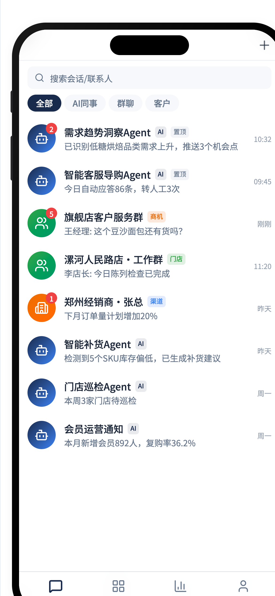

- 页头「消息」+ 搜索图标；**筛选芯片一行**：全部（选中态实心主色）/ AI 同事 / 群聊 / 客户。
- **会话条目 = 头像 + 名称 + 类型徽章 + 摘要 + 时间**。徽章体系（实测 class 与色值）：`AI`（主色 10% 底）、`置顶`（灰）、`商机`（warning 橙）、`门店`（success 绿）、`渠道`（info 蓝）——AI 会话与人类会话混排，靠徽章区分。
- 列表底部常驻**企业身份卡**：「漯河某烘焙食品有限公司 · ✓ 生产端已开通（中央工厂）· ✓ 渠道端已开通（12 门店+电商）」——把"双端开通"状态做成常驻信任条。
- 实测 8 个会话：4 个 Agent（需求趋势洞察/智能客服导购/智能补货/门店巡检）+ 2 群 + 1 客户 + 1 系统通知。

#### 4.3 客户群聊天页 `/app/messages/chat/flagship`

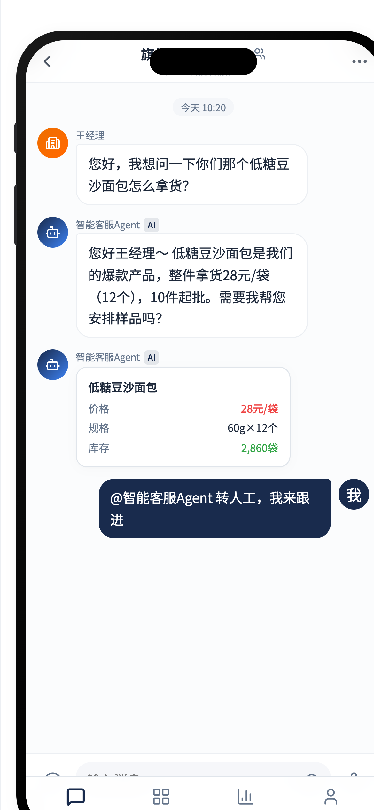

- 页头：返回 + 群名 + 副标题「3 人 · 智能客服在线」（**成员数 + Agent 在线状态**合并展示）+ 更多按钮。
- 消息流（实测完整剧本）：时间 pill「今天 10:20」→ 客户（王经理）问价 → **智能客服 Agent [AI 徽标] 文字答复**（口语化、带行动提议"需要我帮您安排样品吗？"）→ **同 Agent 追加结构化产品卡**：「低糖豆沙面包 | 价格 28 元/袋（红）| 规格 60g×12 个 | 库存 2,860 袋（绿）」→ 人工侧（我）右对齐气泡「@智能客服 Agent 转人工，我来跟进」——**人类在群里 @Agent 接管对话**。
- 输入区：textarea（placeholder「输入消息...」，`max-h-24` 自适应高度）+ 附件快捷条「图片 / 文件 / **@Agent**」（@Agent 高亮为主色）+ 发送按钮。

#### 4.4 Agent 会话（调用链）`/app/messages/agent/trend` —— 本次拆解核心页

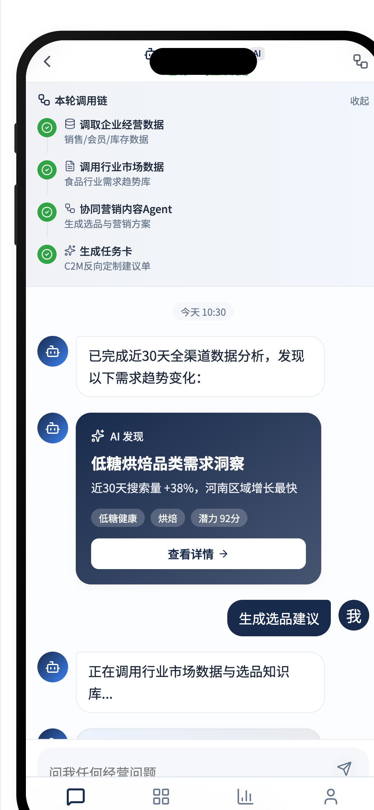

- **Agent 身份头**：返回 + 头像 + 「需求趋势洞察 [AI]」+ 状态「在线 · 可立即调用」+「查看调用链」按钮——把 Agent 当"同事"呈现（姓名/在岗状态/可呼唤）。
- **可折叠「本轮调用链」面板**（默认展开，可「收起」），4 步垂直时间线，每步 = 图标 + 动作名 + 数据源副标题：
  1. 调取企业经营数据（销售/会员/库存数据）
  2. 调用行业市场数据（食品行业需求趋势库）
  3. **协同营销内容 Agent**（生成选品与营销方案）——Agent-to-Agent 协同作为链上一步
  4. 生成任务卡（C2M 反向定制建议单）
- **消息流（实测完整剧本）**：
  - Agent 主动汇报：「已完成近 30 天全渠道数据分析，发现以下需求趋势变化：」
  - **「AI 发现」洞察卡**：标题「低糖烘焙品类需求洞察」+ 关键数据「近 30 天搜索量 +38%，河南区域增长最快」+ 标签芯片（低糖健康/烘焙/潜力 92 分）+「查看详情」——洞察以打分形式给出可执行优先级。
  - 用户（我）：「生成选品建议」（也是快捷芯片之一）
  - **工具调用中状态行**：「正在调用行业市场数据与选品知识库...」——以轻量文字行呈现 tool-call 进行时。
  - **结构化结果卡「C2M 反向定制建议单」**：建议 SKU 全麦高纤软欧包 | 建议价 12.9 元/个 | 目标区域 河南·湖北 | 月销预估 8,600 个 + **双动作：「推送到生产端」（实心主色）+「查看详情」（描边）**——对话产物直接挂跨端/下钻动作。
- **输入区**：placeholder「问我任何经营问题...」+ 圆形发送按钮（**空输入禁用态**）+ **快捷指令芯片 4 枚：生成周报 / 选品建议 / 复购分析 / 库存预警**。
- 消息气泡规则（实测）：Agent 左对齐 + 头像 + 名称 + AI 徽标；用户右对齐实心主色胶囊气泡；卡片类消息无气泡直接整宽卡。

#### 4.5 任务卡详情 `/app/messages/task/1` —— "AI 填表"的最终形态

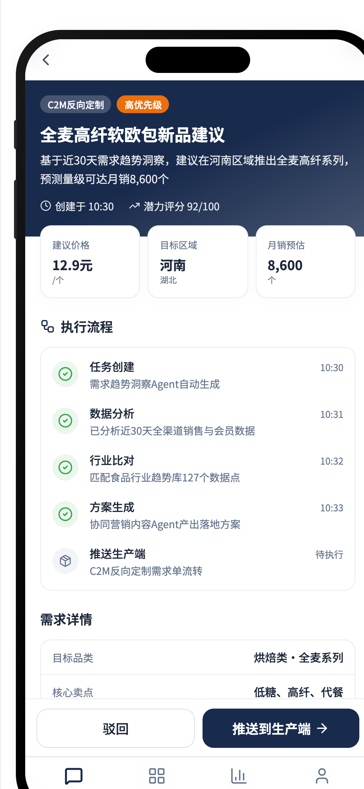

- 页头：返回 + 「任务卡详情」+ 类型标签「C2M 反向定制」+ 优先级徽章「高优先级」。
- **Hero 区**：标题「全麦高纤软欧包新品建议」+ 一句话依据（"基于近 30 天需求趋势洞察…"）+ 创建时间 + 「潜力评分 92/100」。
- **三联数据卡**：建议价格 12.9 元/个 · 目标区域 河南/湖北 · 月销预估 8,600 个。
- **执行流程时间线（5 步，每步 = 步骤名 + 时刻 + 归因说明）**：任务创建 10:30（需求趋势洞察 Agent 自动生成）→ 数据分析 10:31（已分析近 30 天全渠道销售与会员数据）→ 行业比对 10:32（匹配食品行业趋势库 127 个数据点）→ 方案生成 10:33（协同营销内容 Agent 产出落地方案）→ 推送生产端 [待执行]（C2M 反向定制需求单流转）——**每一步都写清"谁/什么数据"**。
- **需求详情（AI 预填字段表）**：目标品类（烘焙类·全麦系列）/ 核心卖点（低糖、高纤、代餐）/ 价格带（10-15 元区间）/ 目标人群（25-35 岁女性·健康意识强）/ 目标渠道（门店+电商+私域）/ 需求来源（搜索增长 38% + 会员问卷 + 竞品分析）——6 个字段全部由 AI 填好，人类只审批。
- **支撑数据区**：30 天销售 128.6 万笔 / 会员行为 12,860 人 / 行业趋势 127 个数据点 / 竞品 38 个 SKU——结论附证据。
- **粘性底部双动作**：「驳回」（描边）+「推送到生产端」（实心主色）。

#### 4.6 通讯录 `/app/messages/contacts`

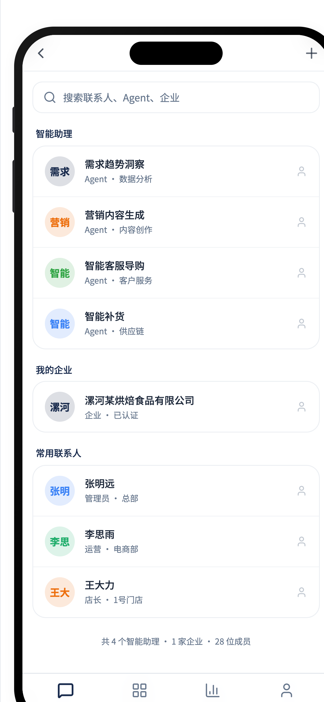

- 搜索框 placeholder「搜索联系人、Agent、企业」（人/Agent/企业统一检索）。
- 三分组：**智能助理**（4 个 Agent，条目 = 头像 + 名称 + 职能副标题「Agent · 数据分析 / 内容创作 / 客户服务 / 供应链」）→ **我的企业**（已认证徽章）→ **常用联系人**（人名 + 角色·部门）。
- 底部计数行：「共 4 个智能助理 · 1 家企业 · 28 位成员」——**Agent 是通讯录一等公民，且排在企业和人之前**。

#### 4.7 工作台 `/app/workbench`

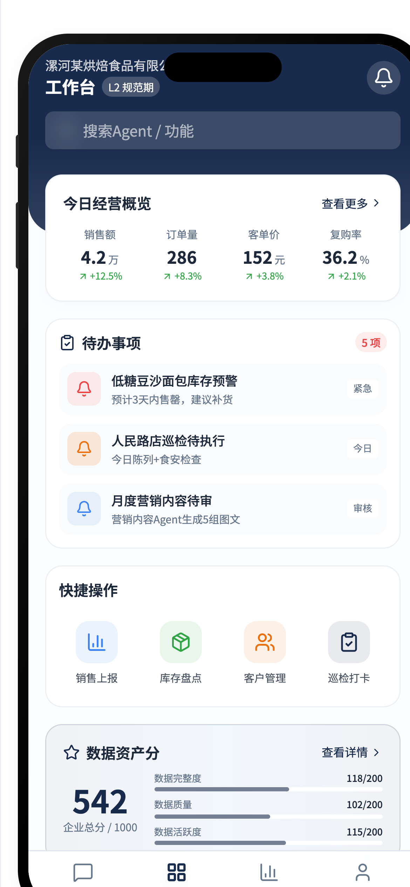

- 页头：企业名 + 「工作台」+ 等级徽章「L2 规范期」+ 通知铃铛；搜索框「搜索 Agent / 功能」（Agent 与功能同层搜索）。
- **今日经营概览**：4 KPI 卡（销售额 4.2 万 +12.5% / 订单量 286 +8.3% / 客单价 152 元 +3.8% / 复购率 36.2% +2.1%），全部带绿色同环比。
- **待办事项（5 项，Agent 生成为主）**：库存预警（徽章「紧急」/ 来源"预计 3 天内售罄，建议补货"）、门店巡检（「今日」）、营销内容待审（「审核」，说明"营销内容 Agent 生成 5 组图文"）——**待办 = Agent 产出物的审批队列**。
- **快捷操作 4 宫格**：销售上报 / 库存盘点 / 客户管理 / 巡检打卡——人工录入/表单入口。
- **数据资产分卡**：542 企业总分 + 完整度/质量/活跃度三分项。
- **我的智能助理**：5 个 Agent 卡（名称 + 一句话能力描述）+「Agent 市场」入口。

#### 4.8 数据中心 `/app/data` —— AI 填表/数据录入枢纽

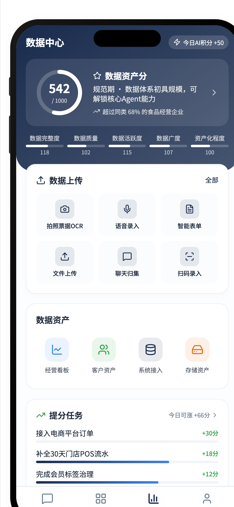

- 页头「数据中心」+「今日 AI 积分 +50」徽章。
- **数据资产分 Hero 卡**（深色卡）：542/1000 大号分数 + 等级「规范期 · 数据体系初具规模，可解锁核心 Agent 能力」+ 同业对比「超过同类 68% 的食品经营企业」——**分数/等级/同业排名三件套**；五维度条：完整度 118 / 质量 102 / 活跃度 115 / 广度 107 / 资产化 100（各满 200）。
- **数据上传 6 卡 + 全部入口（实测 7 项）**：拍照票据 OCR / 语音录入 / 智能表单 / 文件上传 / 聊天归集 / 扫码录入——**把"喂 AI 数据"做成多模态录入中心**（OCR、语音、对话沉淀全收）。
- **数据资产 4 入口**：经营看板 / 客户资产 / 系统接入 / 存储资产。
- **提分任务**（"今日可涨 +66 分"）：接入电商平台订单 +30 分 / 补全 30 天门店 POS 流水 +18 分 / 完成会员标签治理 +12 分——**录入行为直接换算成资产分**。

#### 4.9 我的 `/app/profile`

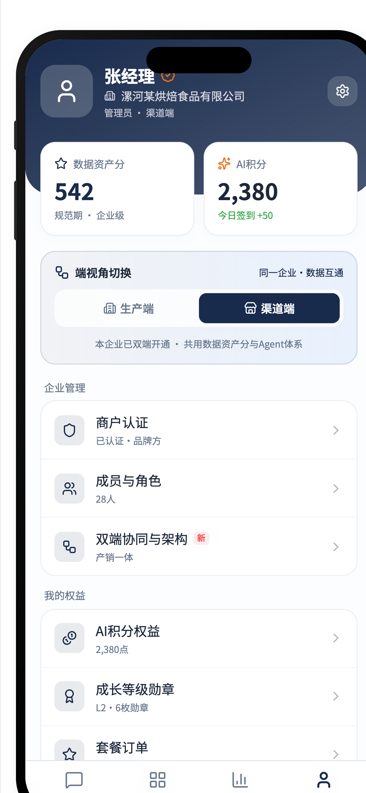

- 用户卡：头像 + 姓名 + 企业 + 「管理员 · 渠道端」+ 设置。
- 双资产：数据资产分 542（规范期 · 企业级）+ AI 积分 2,380（「今日签到 +50」——签到游戏化）。
- **端视角切换**：「生产端 / 渠道端」双选段 + 说明「同一企业·数据互通」「本企业已双端开通 · 共用数据资产分与 Agent 体系」。
- 企业管理：商户认证（已认证·品牌方）/ 成员与角色（28 人）/ 双端协同与架构 [新] / 产销一体。
- 我的权益：AI 积分权益 / 成长等级勋章（L2·6 枚勋章）/ 套餐订单（专业版）——**订阅套餐入口在此**。
- 系统：消息与通知 / 帮助与客服 / 设置；页脚版本行「v1.0 · 渠道消费端」。

### 5. 交互模式清单（逐条可直接转化为开发需求）

以下 20 条均为实测，编号便于主规划任务引用：

**对话式 UI（AI 员工对话）**

1. **消息 Tab 为默认落地页**：登录成功直接进会话列表，对话是移动端一级入口。
2. 会话列表筛选芯片固定 4 类：全部 / AI 同事 / 群聊 / 客户；AI 会话与人类会话混排，用 9px 微徽章区分（AI=主色、置顶=灰、商机=橙、门店=绿、渠道=蓝）。
3. Agent 消息三件套强制呈现：头像 + Agent 名称 + `AI` 徽标（群聊与单聊一致），与人类消息明确区隔。
4. **文字答复与结构化卡片分离**：Agent 先发口语化文字气泡，再追加整宽数据卡（产品卡：价格红/库存绿的语义色字段）。
5. **工具调用中状态行**：「正在调用行业市场数据与选品知识库...」以轻量文字行占位，位于用户指令与结果卡之间。
6. **可折叠调用链面板**：页头「查看调用链」+ 卡内「本轮调用链/收起」；每步 = 图标 + 动作名 + 数据源副标题 + 完成态；支持"协同 XX Agent"的 A2A 步骤类型。
7. 快捷指令芯片置于输入框上方，固定 4 枚业务动词（生成周报/选品建议/复购分析/库存预警），点击即发送。
8. 发送按钮空输入禁用；textarea `max-h-24` 内自适应增高。
9. 群聊输入快捷条：图片 / 文件 / **@Agent**（@Agent 为主色高亮）；@Agent 消息即转人工指令（实测剧本："@智能客服 Agent 转人工，我来跟进"）。
10. 群页头副标题合并展示「成员数 · Agent 在线状态」（"3 人 · 智能客服在线"）。
11. Agent 会话页头 = 员工名片：名称 + AI + 在线状态（"在线 · 可立即调用"）+ 查看调用链。
12. 结果卡内嵌**跨端动作按钮**（「推送到生产端」实心 +「查看详情」描边），对话产物直接驱动下游流程。

**AI 填表助手**

13. **AI 产出走"任务卡"而非直接执行**：需求详情 6 字段（品类/卖点/价格带/人群/渠道/来源）全部 AI 预填，人类只做「驳回 / 推送」双动作审批（粘性底栏）。
14. 任务卡带**执行流程时间线**：每步 = 步骤名 + 时刻 + 归因说明（哪个 Agent、什么数据），末步显示 [待执行]。
15. 任务卡带**支撑数据区**（销售笔数/会员数/行业数据点/竞品 SKU 数）——结论可追溯。
16. Hero 区用「潜力评分 92/100」量化优先级 + 三联 stat 卡（价格/区域/预估量）。
17. **数据录入中心 7 入口**：全部 / 拍照票据 OCR / 语音录入 / 智能表单 / 文件上传 / 聊天归集 / 扫码录入——多模态喂料。
18. **提分任务游戏化**：任务 = 标题 + 明确 + 分值（+30/+18/+12）+「今日可涨 +66 分」总量提示，录入换资产分。

**组织与导航**

19. **Agent 是通讯录一等公民**：智能助理组排在企业和人之前，条目带职能副标题（"Agent · 数据分析"）；工作台另有 Agent 市场 + 5 Agent 能力卡。
20. **端视角切换**：我的页「生产端/渠道端」切换段，双端共用数据资产分与 Agent 体系；工作台待办 = Agent 产出审批队列（紧急/今日/审核徽章）。

### 6. 视觉风格（计算样式实测，优先级高于截图目测）

| 令牌 | 值 | 用途 |
|------|-----|------|
| `--primary` | `#192b4d`（藏青） | 主按钮、激活态、链接、AI 徽标、用户气泡 |
| `--success` | `#31a545` | 库存充足、完成态、涨幅、门店徽章 |
| `--warning` | `#ed6e0c` | 商机/紧急徽章 |
| `--destructive` | `#ef4343` | 价格强调、驳回 |
| `--info` | `#3c83f6` | 渠道徽章 |
| `--background` / `--card` / `--muted` | `#fff` / `#fbfcfd` / `#f2f4f8` | 三层浅底 |
| `--muted-foreground` / `--border` | `#65758b` / `#e0e5eb` | 次级文字/描边 |
| `--radius` | `.5rem`（基础 8px；按钮 `rounded-xl` 12px；芯片 `rounded-full`） | 圆角体系 |

- **字体**：Noto Sans SC 系统栈，基准 16px；实测字阶 `10px`（微徽章/协议）→ `12px`（xs 辅行）→ `14px`（sm 正文）→ `16px` → `18px`（lg 页题）→ `20px`（xl 大标题）——**B 端小字阶，信息密度高**。
- **间距密度**：紧凑（列表行 `py-1.5~2`、卡片内边距小、10px 字号大量使用），典型效率型 B 端移动风格。
- **暗色模式**：`color-scheme: normal`，无 `.dark` 类，无主题切换入口——**纯浅色模式**（数据中心 hero 卡是局部深色卡形成对比，不是全局暗色）。
- **视觉语言**：白底 + 浅灰卡 + 单一藏青主色 + 绿色成功语义色；克制的企业专业风，无插画、无渐变 hero（登录页顶部为白底品牌区）。

### 7. 可移植设计要素总结（面向 DSH 移动端：AI 员工对话 + AI 填表助手）

| # | 要素 | 原型做法（实测） | DSH 移动端建议 | 优先级 |
|---|------|------------------|----------------|--------|
| 1 | 对话为一级入口 | 消息 Tab 默认落地；AI 同事混排会话列表 | DSH 移动端首页即会话列表，AI 员工会话置顶 + `AI` 徽章 | P0 |
| 2 | 调用链面板 | 可折叠「本轮调用链」，步骤名+数据源副标题+A2A 步骤 | 直接映射 DSH 的 tool-call/子代理轨迹（折叠态默认收起，与 tool row 打通） | P0 |
| 3 | 工具调用中状态 | 「正在调用…」轻量文字行 | 流式回合中的进行时占位（对应 DSH tool running 状态） | P0 |
| 4 | 结构化结果卡 + 动作 | 文字气泡后跟整宽卡（kv 字段+语义色）+ 卡内按钮 | KB 检索/表单产出渲染为卡片，动作按钮触发工具/跳转 | P0 |
| 5 | 快捷指令芯片 | 输入框上方 4 枚业务动词芯片 | 按 KB/Agent 预设常用指令，随会话上下文切换 | P1 |
| 6 | AI 填表=预填+审批 | 任务卡 6 字段 AI 预填，人只「驳回/推送」 | AI 填表助手核心范式：草稿即卡片、双动作审批、字段级可改 | P0 |
| 7 | 执行时间线+归因 | 每步带时刻与"哪个 Agent/什么数据" | 任务卡详情页的流程区，复用 session 事件流数据 | P1 |
| 8 | 支撑数据区 | 结论卡附数据量证据 | KB 引用来源列表的移动端形态（溯源） | P1 |
| 9 | 通讯录一等 Agent | 智能助理组置顶 + 职能副标题 + 计数 | DSH AI 员工目录（名称+职责+在线状态），支撑 @ 与分发 | P1 |
| 10 | 群聊 @Agent 转人工 | @ 消息即接管指令；页头"智能客服在线" | 多人协作场景的人类接管协议（若做群聊则 P1，单聊可降级） | P2 |
| 11 | 多模态录入中心 | OCR/语音/智能表单/文件/聊天归集/扫码 6 通道 | AI 填表的入口聚合页；M3 至少做拍照 OCR + 语音 + 智能表单 | P1 |
| 12 | 游戏化资产分/积分 | 542/1000 分 + 5 维度 + 同业 68% + 提分任务 | 订阅产品的留存钩子；M3 可先做数据完整度单一进度条 | P2 |
| 13 | 端/角色切换 | 我的页生产端/渠道端切换段 | 多企业/多角色切换的移动端范式参考 | P2 |
| 14 | 待办=审批队列 | 工作台待办带 紧急/今日/审核 徽章 | Agent 产出待办的集中收件箱（与任务卡打通） | P1 |
| 15 | 底部 4-Tab + 三级深度 | 消息/工作台/数据/我的；最深 3 级 | 保留行业惯例：底部 Tab + 列表→详情，不超 3 级 | P0 |

**行业惯例（建议保留不做创新）**：底部 Tab 导航、验证码登录 + 60s 倒计时、返回键退出二级页、粘性底部主操作、筛选芯片、下拉刷新列表（原型未实现但为惯例）。

### 8. 实测 vs 推断边界声明

- **实测**：上述 9 个路由全部页面内容、登录流程（含 60s 倒计时与 mock 验证）、设计令牌计算值、路由结构、调用链/任务卡/录入中心交互剧本。
- **推断（未实测，仅依据入口存在性）**：
  - 「生产端」切换后的界面结构（入口在"我的"页实测存在，目标界面未访问；按"共用数据资产分与 Agent 体系"文案推断为同一 App 壳的差异化视图集）。
  - 「Agent 市场」详情页、「快捷操作」4 个表单页、数据上传各通道的实际表单（入口实测存在，目标页未访问）。
  - 真实产品的鉴权强度（原型任意验证码可进，生产必有校验）。
- **同域背景补充**：目标站托管于 `demo.lzqz.cn`（蓝鲸凌云 demo 域），页面自述"已连通生产端·产销一体"为原型内营销文案，不代表真实系统连通（推断）。

### 9. 证据与产物清单

- 截图产物（相对本文件路径）：`2026-09-17-mobile-prototype/` 下 10 张 PNG——`prototype-shell.png`（走查壳+页面导航全景）、`login.png`、`messages-tab.png`、`group-chat.png`、`agent-chat.png`、`task-card.png`、`contacts.png`、`workbench.png`、`data.png`、`profile.png`（均为 390×844 视口 @3x 截取）。
- 过程证据：chrome-devtools 可访问性树快照 9 次、DOM/计算样式提取若干（含 `--primary #192b4d` 等令牌实测）、登录流程脚本化实测记录（`获取验证码→60s→123456→登录→/app/messages`）。
- 局限：截图为静态 mock 态，无真实流式输出/加载动画可观察；「一键走查闭环」自动演示未完整录制（按钮实测存在，行为未记录）。

## 第二部分：DSH 现状 UX 诊断（project-research 只读盘点，2026-09-17）

> 诊断方式：只读代码盘点 + 实测运行中的 web 进程（localhost:3080）。服务于 [plans/2026-09-17-kg-mobile-ux/](../plans/2026-09-17-kg-mobile-ux/PLAN.md) M1/M3 规划。

### 1. 技术栈与架构事实（修正两处预设）

- DSH Web 是 **React 18 + Vite + CSS Modules 的插件式 slot 架构**（[packages/client/web/src/seed.ts](../packages/client/web/src/seed.ts) 平台模块表：react/react-dom/cordis/ui-slots/ui-primitives；[apps/web/vite.config.ts](../apps/web/vite.config.ts)）；客户端 bundle 由 webserver 下发 boot manifest（`window.__DSH_BOOT__`）动态装载。
- `ui-enterprise` 包**不存在**：业务页是 [ui-business](../packages/client/ui-business/src)，市场页是 [ui-assets](../packages/client/ui-assets/src)。
- **无路由**：页面是会话内视图环（`conversation.view` slot：chat/kb/scenarios/market/connectors/kg/business/trajectory）。三列框架 [AppFrame.tsx](../packages/client/ui-layout/src/client/AppFrame.tsx)；视口 <1024px 仅收 sidebar rail——**没有移动端页面**。
- 端口：dsh web 监听 3080（[cordis.patch.yml](../examples/kb-agent/cordis.patch.yml) webserver）；13000 是 NocoBase（nocobaseProxyOrigin，`/nocobase` 同源反代已剥 framing guards——iframe 先例）。

### 2. 问数交互链路（现状）

```
InputBar → agent-loop（MiniMax-M3 + kb-agent persona 五面路由）
  ① nb_collections/nb_list/nb_get/nb_create/nb_update（NocoBase）
  ② kb_search（[n] 引用） ③ lakehouse_tables/lakehouse_query（DuckDB SQL）
  ④ connector_discover/_fetch/_transfer ⑤ kg_schema/kg_subgraph(/kg_query)
→ ToolCallTree 按 keyed toolview 分发（kb_*/order_*/connector_* 有专属行，nb_*/lakehouse_* 走通用卡）
→ AssistantMarkdown（GFM 表格 + KaTeX）
```

- **数据源感知**：kb 引用藏在工具行内、KG 边有 asserted_by 五源字段、lakehouse 靠 persona 文本约定——**没有聚合的"答案来源卡"**。
- **图表能力：零**（全仓无 echarts/recharts/d3/@antv）。
- 视图感知回环（J3）：[view-context](../packages/client/ui-view-context/src/client/viewContextService.ts) 防抖注入页面快照 + switch_view/view_apply/view_state_get 三工具。

### 3. KG 可视化能力矩阵（摘）

已具备：sigma.js v3 + FA2 布局、缩放/拖拽/单击邻域高亮/双击展开/类型过滤/种子搜索/相机保持/WebGL 降级/质量面板（[KgView.tsx](../packages/client/ui-kg/src/client/KgView.tsx)、[KgGraphCanvas.tsx](../packages/client/ui-kg/src/client/KgGraphCanvas.tsx)，数据经 [kgBridge](../packages/client/ui-kg/src/client/kgBridge.ts) 走 apiproxy kg.schema/search/subgraph/expand/stats，hops≤2）。
缺失：**本体工作台（read-only by design，本体是 TS 内置 [ontology.ts](../packages/kb/kb-graph/src/ontology.ts)）**、kg-template 确认流 UI、路径高亮、布局切换、时间快照、导出；短语查询离线仅三内置模板（在线走 [kg-nl.ts](../packages/kb/kb-graph/src/kg-nl.ts) 9 模板编译器）。

### 4. NocoBase 侧 AI 能力（M3 复用盘点）

- 快照 v2.2.6 local-modifications 为空——n18ai 体系（AI 员工配置/flowPage 挂载/llmServices）均为运行时数据。内置 8 名 AI 员工（[plugin-ai/src/ai/ai-employees/](../platform/nocobase/packages/plugins/@nocobase/plugin-ai/src/ai/ai-employees)：Atlas/Viz/Dex/Ellis/Lexi/Vera/Nathan/Dara）+ users 表 9 位；对话入口 ×3（主面板/区块 Actions AI 填表/特定入口）；llmServices 经 openai provider baseURL 透传。
- RAG 知识库是商业插件（装不上）→ 替代路径：DSH KB 经 plugin-mcp-server 暴露。
- **plugin-mobile/plugin-mobile-client 已废弃**（2.x 归 plugin-ui-layout，仍开发中）——移动端不押注 NocoBase 侧。
- 云端已有"食品经营全能助理"移动高保真原型（纯前端，未接 DSH 数据链）。

### 5. 数据互通现状（M3 依赖）

- DSH 侧 SQLite ×3 + 文件面均在 [examples/kb-agent/workspace/](../examples/kb-agent/workspace)（kb.sqlite/kg-graph.sqlite/lakehouse-catalog.sqlite + data 15 目录语料 + deliverables）；NocoBase PostgreSQL 95 collection。
- 互通全经 REST：tool-nocobase（读写五工具）+ apiproxy nocobase 只读三方法 + /nocobase 整站反代。
- **断点**：①KG/lakehouse 时点快照无增量调度（[incremental.ts](../packages/kb/kg-build/src/incremental.ts) 有骨架入口仍手动）；②单租户 demo-food-co 无鉴权网关；③DSH agent 与 NocoBase AI 员工双栈独立；④云端移动原型与数据链完全未接。

### 6. UX 痛点清单（四类角色 × 18 条，编号被 M1 计划引用）

**业务员**：①答案来源不可一眼见 ②零图表 ③工具过程可发现性弱 ④业务页问数=跳页丢上下文。
**采购**：⑤95 对象平铺下拉无分组无搜索 ⑥改一字段也走三步确认（"No forms"）⑦SRM 深层对象无专属视图 ⑧订单无列表/状态看板。
**品控**：⑨追溯链逐跳手动展开（hops≤2）⑩图滞后快照无时效标注 ⑪短语查询仅三模板 ⑫标准检索与业务记录割裂。
**老板**：⓭无经营概览首页 ⓮SQL 无核对无导出 ⓯场景卡无高频入口 ⓬（=16）移动端不可用。
**跨角色**：⑰单租户无鉴权+双 AI 栈入口不统一 ⑱KG 只读+构建无 UI（本体演进靠改代码）。

（完整证据路径与改进方向见各条原始记录；本部分为合并摘要，规划引用以 [plans/2026-09-17-kg-mobile-ux/](../plans/2026-09-17-kg-mobile-ux/PLAN.md) 为准。）
