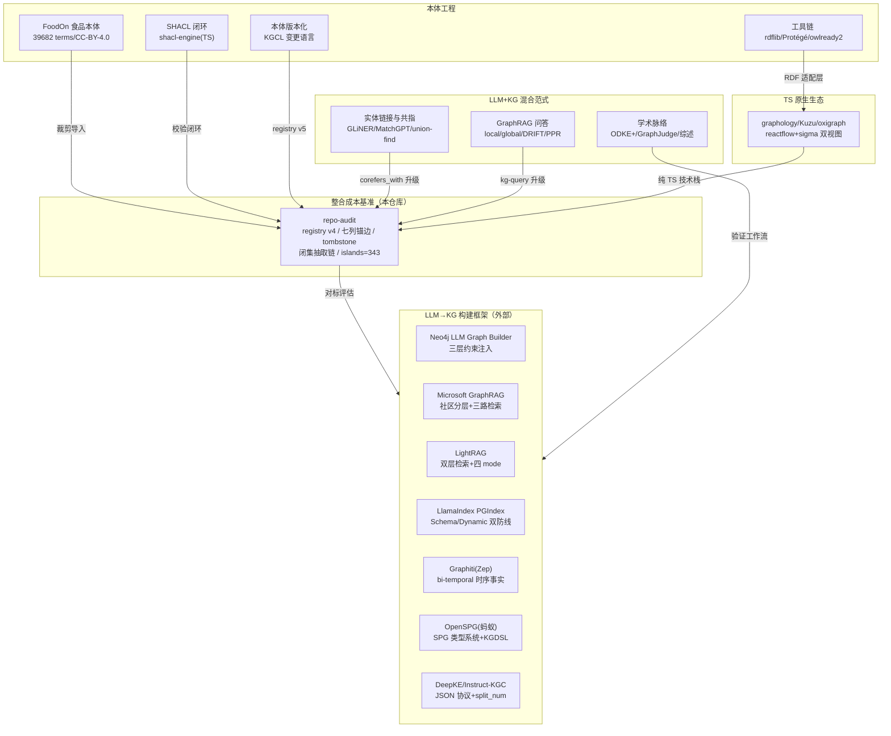

# 本体工程 + 知识图谱构建 + LLM/AI 混合范式 深度调研报告

> **服务对象**：deepseek-harness 仓库（全 TypeScript + SQLite 自研 agent harness）食品行业 KB+Agent 订阅产品的 KG 链路重建
> **调研日期**：2026-09-17 ｜ **深度等级**：L4（Exhaustive，16 数据源分支全部饱和）
> **调研方式**：编排器纯委派——1 次侦察 + 1 次仓库只读审计 + 14 个外部数据源分支深挖（其中 4 个仓库完整 clone 审计）
> **报告语言**：中文

---

## 一、调研总览与知识网络

本次调研围绕用户指定的四能力目标（数据先行 / AI 分析 / 手动修改 / AI 语义化修改）与必查清单（GitHub 开源框架、本体工具链、方法论、LLM+KG 混合范式），共产出 17 个子任务的全量发现。知识网络如下：

## 二、核心结论（TL;DR）

### 结论 1：所有候选框架「整包引入」均不可行，「架构借鉴」均可行且必要

7 个重点框架全部完成许可证与语言栈审计。无一例外：**整包引入与 deepseek-harness 的全 TypeScript + ESM + 无 Python 运行时依赖约定冲突**——

| 框架 | 许可证 | 语言栈判定 | 整包引入 | 架构借鉴价值 |
|---|---|---|---|---|
| Neo4j LLM Graph Builder | Apache-2.0（可商用） | Python 3.12 + 68 项重依赖 + Neo4j/APOC 强绑定 | ❌ | ★★★★★ prompt 三段式+三层约束过滤 |
| Microsoft GraphRAG | MIT | Python + Rust/C++ 原生扩展（graspologic-native） | ❌ | ★★★★★ 分层社区摘要+local/global 检索路由 |
| LightRAG | MIT | 纯 Python（较轻） | ❌ | ★★★★★ 双层检索+增量 upsert 合并 |
| LlamaIndex PropertyGraph | MIT | Python（core 29 项直接依赖） | ❌ | ★★★★ 结构化输出+validation schema 两层防线 |
| Graphiti (Zep) | Apache-2.0 | Python + pydantic 硬依赖 | ❌ | ★★★★★ episode 化改图+bi-temporal 失效（四能力之四的答案） |
| OpenSPG (蚂蚁) | Apache-2.0 | Java 480 万行 + 必须起服务（JVM 4G） | ❌ | ★★★★ SPG 类型系统+7 大谓词+规则层降维实现 |
| DeepKE (Instruct-KGC) | MIT | PyTorch 训练栈（微调需多卡 20GB+） | ❌ | ★★★★ JSON 抽取协议+split_num+schema dict（协议层 100% 可移植） |

**关键判定依据**（各分支一手证据）：DeepKE 官方 OneKE 框架一等公民支持 `category: DeepSeek / base_url: https://api.deepseek.com`——Instruct-KGC 的 prompt 协议与后端模型解耦，可 100% 套用在我们的 DeepSeek API 上，无需微调。GraphRAG 的抽取引擎本体是「DataFrame 变换 + prompt 工程」，原生扩展只在 Leiden 社区检测一处——TS 侧 graphology-communities-louvain（周下载 13.7 万，MIT）可直接替代。

### 结论 2：推荐选型——方案 A「纯 TS 自研增强」为唯一主路线

三个候选方案排序（详见第 9 章）：

1. **【推荐】方案 A：纯 TS 自研增强管线**——以现有 kg-build/kb-graph/kb-graph-sqlite 为骨架，按本报告第 4-8 章的具体设计逐层注入外部框架的最佳实践（Graphiti 时序模型 + Instruct-KGC JSON 协议 + ODKE+ 验证环 + LightRAG 双层检索 + shacl-engine 校验 + graphology 算法 + FoodOn 子树导入）。零 Python 运行时，完全贴合仓库 ESM/TS 约定。
2. 方案 B：TS 库组合直引（shacl-engine + n3 + graphology）——工程量最小，但引入 RDF/JS 数据模型栈作为运行时依赖，作为方案 A 的备选实现路径。
3. 方案 C：Graphiti Python sidecar——最快获得时序能力，但违背仓库无 Python 约定，仅当方案 A 的 episode 模型实现受阻时作应急对照。

### 结论 3：FoodOn 是零障碍的领域本体锚点，但必须裁剪+单继承化

FoodOn（版本 2025-12-30，CC-BY-4.0，39,682 terms）作为食品上层本体**无许可障碍**。但它是 OWL 多继承 + 依赖 13 个外部本体（ChEBI/NCBITaxon/PO/UBERON...），**不能整包导入 registry v4**。本报告第 4 章给出：5 棵子树裁剪策略（food product 主树 + organism material 骨架 + 工艺/包材/法规分类）、7 个 object property → Relation 映射表、单继承化规则（主父沿产品面 + 横切边表多继承）、registry v5 增量字段设计（foodon_uri/foodon_id/langual_code/ontology_xref 表）。张红喜供应商方案场景（供应商→大豆→豆腐→包材→合规）全链路在本体上均有落点，已实测验证。

### 结论 4：四能力目标的技术答案全部找到且有实证支撑

| 四能力 | 技术答案 | 实证来源 |
|---|---|---|
| ① 数据先行（本体驱动建模） | registry v5（+FoodOn 子树+约束字段）+ KGCL 变更语言 + ontology_change 事件表 | FoodOn 分支 + 版本化分支 |
| ② AI 分析（ontology-grounded 抽取） | Instruct-KGC JSON 协议（schema dict + split_num）+ SHACL shapes 校验闭环 + ODKE+ Grounder 断言验证 | DeepKE/SHACL/学术三分支 |
| ③ 手动修改（可视化编辑） | reactflow 本体树 + sigma 实例图双视图 + WebProtégé 三件套（Change Summary/Watches/Revisions）SQLite 语义复刻 | TS 生态 + 工具链分支 |
| ④ AI 语义化修改（NL 改图+diff/审计/回滚） | Graphiti episode 化摄取 + 四时间戳 bi-temporal 失效（失效不删除）+ 回滚=反向 episode + kg_episode/kg_mention 表 | Graphiti 分支（clone 审计） |

### 结论 5：现有系统的真实短板被量化（重建的最硬论据）

仓库审计（实测 2026-09-17）：图规模 **1159 节点/855 边（853 live）/163 共指边**（用户口径 1093/665/134 为较早快照，图在持续重建增长）。质量指标：**islands=343（孤岛数是最大痛点）**、conflicts=5、coverage=49.7%。审计同时确认现有系统已具备常被低估的资产：七列锚幂等写入、双时态 tombstone、闭集防幻觉抽取链（未知类型降级 UNCLASSIFIED 桶+违规谓词 drop 带原因）、一次反馈重试、Jaro-Winkler+LLM 灰区裁决对齐、快照指纹增量调度。**重建应「增强」而非「替换」这些资产。**

### 结论 6：TS 生态足够拼出完整链路（Kuzu 除外——已归档警告）

全 TS 最短技术栈（第 8 章）：**SQLite 邻接表（存储）→ graphology louvain/pagerank（算法）→ shacl-engine（校验，40ms 级）→ @rdfjs/types + n3（RDF 序列化互操作，P0 仅 3-5 人日）→ 自研模板查询+PPR（检索）→ reactflow 层级树 + sigma 实例图（可视化）**。全链 MIT 系许可、ESM 可用、零 Python。⚠️ Kuzu（嵌入式图数据库）**项目已归档**（团队转型，v0.11.3 终版）——LlamaIndex 的 Kuzu 集成也已移出主线，任何基于 Kuzu 的选型需承担长期维护断档风险，本报告不推荐。

## 三、报告结构导航

| 章节 | 内容 | 对应硬性要求 |
|---|---|---|
| 第 1 章 | 方法论与调研范围 | — |
| 第 2 章 | 现有系统审计（整合成本基准） | 背景锚点 |
| 第 3 章 | 框架深度评估（7 框架逐一深评+总表） | 要求 1 |
| 第 4 章 | FoodOn 与 registry v4 映射 | 要求 2 |
| 第 5 章 | SHACL 约束校验闭环 | 要求 3 |
| 第 6 章 | LLM 抽取范式与实体链接共指 | 必查清单 |
| 第 7 章 | GraphRAG 问答与 kg-query 整合 | 要求 4 |
| 第 8 章 | 本体版本化 + 工具链 + TS 生态 | 必查清单 |
| 第 9 章 | 选型结论（2-3 候选排序） | 要求 5 |
| 第 10 章 | 四能力目标架构落地建议（Mermaid） | 要求 6 |
| 第 11 章 | 矛盾、限制与来源清单 | 质量护栏 |
