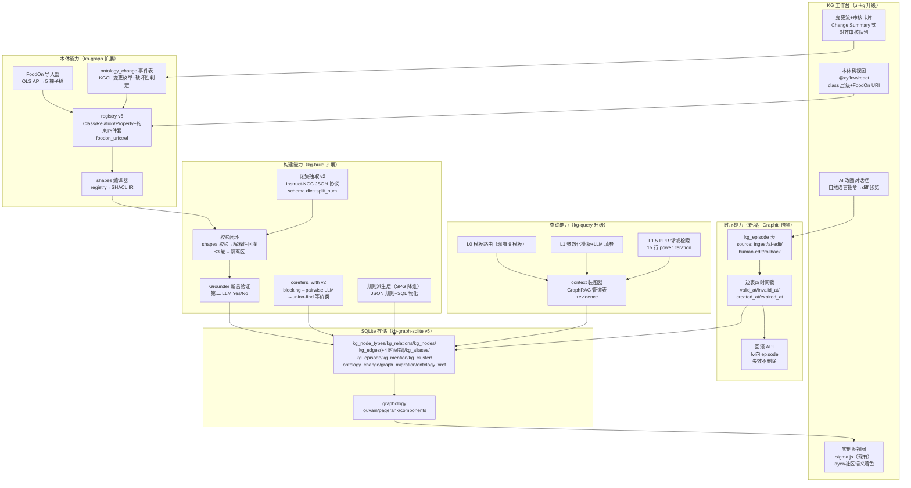
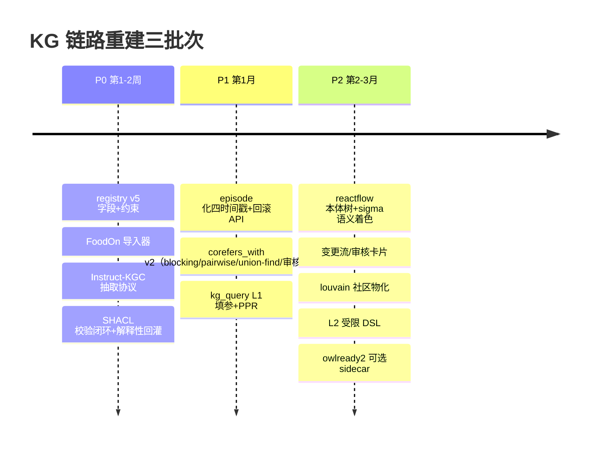

# 第 10 章 面向四能力目标架构的落地建议（硬性要求 6）

## 10.1 目标架构总图



## 10.2 四能力 ↔ 架构要素对照

### 能力①：数据先行——五源接入的本体驱动建模

- registry v5 作为唯一图模式真相源：Class/Relation/Property 扩展约束四件套（required/isArray/enumValues/regex，SPG 映射）+ foodon_uri/foodon_id/langual_code 字段（FoodOn 映射）。
- FoodOn 5 棵子树导入（food product 主树/organism material 骨架/工艺/包材/法规分类）+ ontology_xref 表预留 SSSOM 通道。
- 五源腿保持现有管线（R01-R13 确定性映射优先），新增规则派生层（SPG 谓词三场景降维：实体→概念归纳/派生边/派生属性，JSON 规则+SQL 物化，输出强制过 schema 校验）。
- 本体演化走 KGCL 事件流：LLM 提案（source='llm_proposal'）→人工裁决→apply→eager 定向迁移（破坏性变更只迁移受影响子图）。

### 能力②：AI 分析——LLM 按本体引导抽取

- 抽取链：Instruct-KGC JSON 协议（schema dict：关系 label→定义+domain/range Class 描述+代表实体；split_num=1~4 分批；温度 0）→ 闭集裁决（保留现有 UNCLASSIFIED 降级桶+drop 带原因）→ **SHACL shapes 校验闭环**（violation→解释性回灌→≤3 轮→隔离区，绝不部分落库）→ **Grounder 断言验证**（第二 LLM 判"是否被源 chunk 显式支持"，削 35% 幻觉）→ Corroborator 频次/置信合并 → 落库。
- 质量红线：周抽检 + ≥90% 精度红线（ODKE+ 生产治理模式）。

### 能力③：手动修改——可视化编辑器直接改图+改本体

- 双层视图：@xyflow/react 本体树（class 层级、约束展示、FoodOn URI 链接）+ sigma 实例图（现有栈升级：presentation.ts nodeColorOf() 按 layer/extends 语义着色 + louvain 社区色）。
- 写通道：新增本体/图写 RPC + apiproxy 域（现有 7 RPC 全只读，必须扩）；每次编辑 = ontology_change 事件（before/after JSON + source/reason）。
- WebProtégé 三件套语义复刻：Change Summary（全局变更流）、Watches（订阅实体变更）、Revisions（revision 号 + 任意时点快照导出）——SQLite 事件表天然支持（event sourcing）。

### 能力④：AI 语义化修改——自然语言改图 + diff/审计/回滚

- **核心机制 = Graphiti episode 模型**（SQLite 表结构）：

```sql
CREATE TABLE kg_episode (
  uuid TEXT PRIMARY KEY, group_id TEXT NOT NULL,
  source TEXT NOT NULL,            -- 'message'|'json'|'text'|'fact_triple'
  name TEXT NOT NULL, content TEXT NOT NULL,   -- 自然语言指令原文
  source_description TEXT NOT NULL,            -- 'ai-edit'|'human-edit'|'ingest'|'rollback'
  valid_at TEXT NOT NULL, created_at TEXT NOT NULL,
  episode_metadata TEXT);          -- JSON: actor/session/uuid_map
CREATE TABLE kg_mention (
  episode_uuid TEXT NOT NULL REFERENCES kg_episode(uuid),
  edge_uuid TEXT NOT NULL REFERENCES kg_edge(uuid),
  created_at TEXT NOT NULL, PRIMARY KEY (episode_uuid, edge_uuid));
-- kg_edges 加四时间戳列 + 部分索引：
-- CREATE INDEX idx_edge_live ON kg_edges(src,dst) WHERE expired_at IS NULL;
```

- AI 改图流程：NL 指令 → LLM 生成 ChangeOp 集合（KGCL 枚举+SHACL 预检）→ diff 预览（UI 确认）→ apply = 一条 episode（source='ai-edit'，content=指令原文，metadata=diff JSON）+ 边失效判定（resolve_edge_contradictions 40 行直译：区间重叠→旧边 invalid_at=新边.valid_at）。
- 审计：任意边/节点当前状态 = 初始快照 + episode 重放；"这条事实来自哪次修改" = kg_mention 反查。
- 回滚：定位目标 episode → 对其新增边置 expired_at、对其失效的旧边恢复有效期 → 追加反向 episode（source='rollback'）——**全程 UPDATE/INSERT 永不删数据**，与 dsh-session append-only 日志同构。

## 10.3 落地路线图（与 9.4 一致的三个 PR 批次）



验收锚点（每批必测）：islands 343↓ / coverage 49.7%↑ / 对齐审核队列消化率 / PPR hits@5 / SHACL 违例拦截率 / AI 改图回滚成功率 100% / 既有 9 模板查询回归通过。

## 10.4 风险与缓解

| 风险 | 缓解 |
|---|---|
| Instruct-KGC 协议在中文语料效果未验证 | P0 先用 demo 场景 A/B（vs 现有闭集 prompt），hits@5 与人工抽检双指标门禁 |
| SHACL 回灌引发附带损伤（实证 99/180） | "仅重出被点名条目"硬约束 + 全量对比 diff 检测 + 隔离区兜底 |
| AI 改图指令歧义（"改成 X"多解） | 强制 diff 预览 + 人工确认位（Watches 推送受影响订阅者） |
| FoodOn 上游变动 | 锁版本快照（2025-12-30）+ ontology_xref 记录导入版本；OBO FP-004 保证旧 versionIRI 永久可解析 |
| graphology louvain 与 GraphRAG Leiden 社区划分差异 | 本地图无 golden baseline 依赖，仅作可视化着色与 islands 诊断，不承诺跨库一致 |
| episode 表与 kg_build_runs 双账本 | 语义分工：episode=事实级时序，build_run=管线运行级审计；kg_source_runs 不变 |
