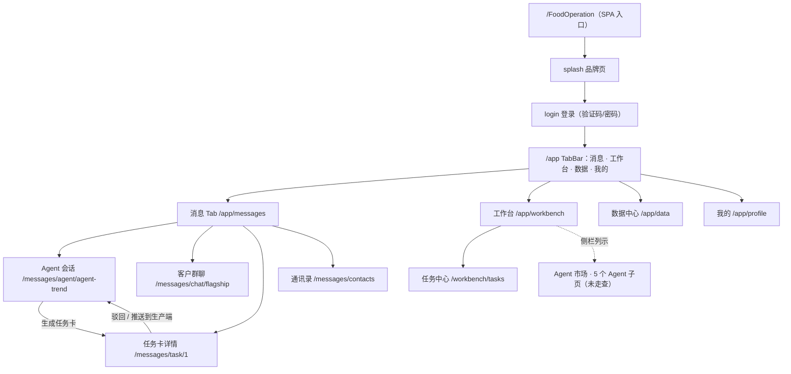
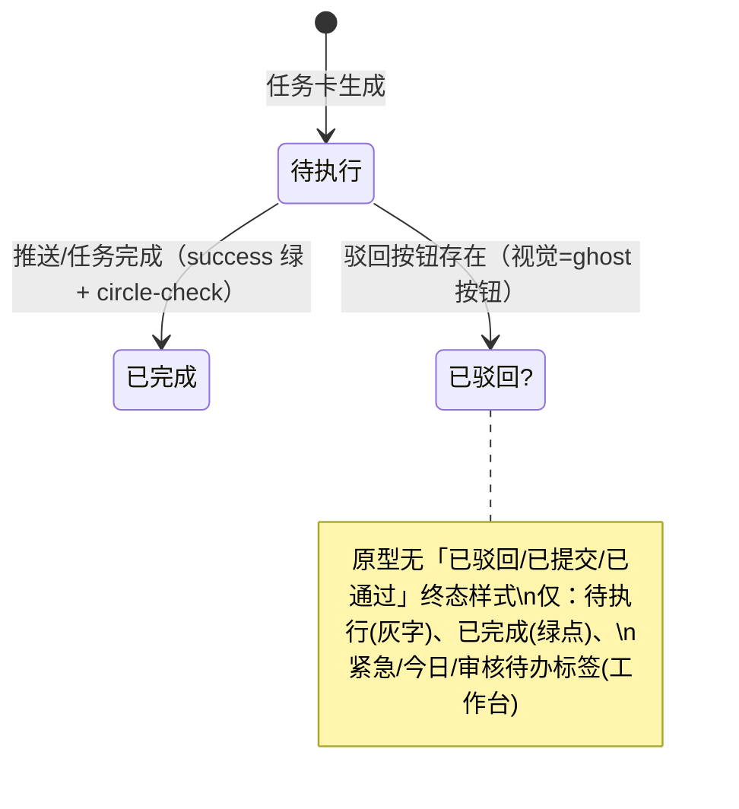

# FoodOperation 移动端原型实地拆解报告

> 研究日期：2026-09-20 | 方法：chrome-devtools 实地走查（截图 14 张 + DOM/getComputedStyle 采样 + 网络面板观察） | 对象：`http://123.54.216.245:30001/FoodOperation/`（v1.0 · MVP 高保真原型 · 漯河示范）

---

## 1. 执行摘要

原型站点**可达且可完整走查**。「食品经营全能助理 · 渠道消费端」是一个纯前端静态高保真原型（React SPA，Tailwind + shadcn/ui + lucide-react 图标），验证码为演示机制——手机号已预填 `13800138000`，**任意验证码（实测 `123456`）即可登录**。全部 12 个路由（消息/聊天/任务卡/通讯录/工作台/任务中心/数据/我的等）均已完成截图与 DOM 样式采样。

对 v2 最有价值的三个结论：

1. **信息架构成熟可抄**：微信式「消息 Tab + 会话列表 + 聊天流」骨架、AI 同事/群聊/客户三类会话、AI 左/用户右气泡、渐变头像 + 类型标签 + 未读角标，全部有实测定价值。
2. **「AI 发现卡（渐变）+ 任务卡（白卡 label:value + 双按钮）」双卡范式**与「任务卡详情页（执行流程时间轴 + 需求详情 + 支撑数据 + 底部 sticky 驳回/推送）」直接对应 v2 的「草稿卡 → 提交确认卡 → 落库」诉求。
3. **原型零后端**：全流程（含登录、消息、任务卡）**无任何 XHR/fetch/WebSocket/SSE 请求**，数据全部硬编码；且 nginx 未配 SPA fallback（子路由直达 404）、登录态仅存内存。v2 的接口层（apiproxy vs NocoBase 直连）与部署方式**不能**从该原型获得证据，需另行决策。

---

## 2. 站点可达性 + 登录形态（实证）

| 项 | 结论 |
|---|---|
| 服务端 | nginx/1.31.6 反代静态资源，根路径 `/` 返回 nginx 404 |
| 正确入口 | `/FoodOperation/`（带尾斜杠）→ 200 HTML SPA（`lang="zh-CN"`） |
| 用户给的 URL | `/FoodOperation/app/messages` **直达即 nginx 404**（见 [00-404-messages-url-direct.png](00-404-messages-url-direct.png)）——nginx 无 `try_files` SPA fallback；必须从入口进入后由客户端路由跳转 |
| 启动流 | splash（品牌页「正在初始化数据空间...」）→ `/login` |
| 登录形态 | ① 验证码登录（手机号预填 `13800138000`，「获取验证码」进入 60s 倒计时，**任意码可进**，实测 `123456` 登录成功跳 `/app/messages`）② 密码登录 Tab ③ 忘记密码 ④ 其他登录方式（微信/Apple 图标位）⑤ 商户注册认证入口 |
| 登录态 | **内存存储**——刷新即回 splash/login（实测两次重登） |
| 展示形态 | 桌面页面（500px 视口）内嵌 **固定 370×824 手机壳**（`rounded-[40px]` + 顶部黑色灵动岛刘海），**非响应式**；左侧为原型自带「一键走查闭环 + 页面导航」演示侧栏（非产品功能） |

---

## 3. 截图清单（14 张，全部在本目录）

| 文件 | 路由 | 内容 |
|---|---|---|
| [00-404-messages-url-direct.png](00-404-messages-url-direct.png) | `/FoodOperation/app/messages` | 直达该 URL 的 nginx 404 证据 |
| [01-splash.png](01-splash.png) | `/splash` | 品牌启动页「食品经营全能助理 · 渠道/消费端」 |
| [02-login.png](02-login.png) | `/login` | 验证码登录页（预填手机号）+ 演示侧栏 |
| [03-messages-list.png](03-messages-list.png) | `/app/messages` | 消息 Tab 会话列表（8 会话 + 筛选 chips） |
| [04-agent-chat-flow.png](04-agent-chat-flow.png) | `/app/messages/agent/agent-trend` | Agent 会话：调用链面板 + AI 发现卡 + 任务卡 + 快捷指令（全页） |
| [05-task-card-detail.png](05-task-card-detail.png) | `/app/messages/task/1` | 任务卡详情：时间轴 + 需求详情 + 支撑数据 + 驳回/推送 |
| [06-group-chat.png](06-group-chat.png) | `/app/messages/chat/flagship` | 客户群聊：真人消息 + Agent 商品卡 + @Agent 转人工 |
| [07-contacts.png](07-contacts.png) | `/app/messages/contacts` | 通讯录：智能助理/我的企业/常用联系人 |
| [08-workbench.png](08-workbench.png) | `/app/workbench` | 工作台：经营概览 + 待办 + 快捷操作 + 数据资产分 + 5 Agent 卡 |
| [09-data-center.png](09-data-center.png) | `/app/data` | 数据中心：资产分 542/1000 + 五维 + 采集方式 + 加分任务 |
| [10-profile.png](10-profile.png) | `/app/profile` | 我的：身份/积分/端视角切换/企业管理/权益/系统 |
| [11-walkthrough-agent-trend.png](11-walkthrough-agent-trend.png) | `/app/messages/agent/trend` | 「一键走查闭环」触发的五步闭环叙事版聊天页 |
| [12-task-center.png](12-task-center.png) | `/app/workbench/tasks` | 任务中心：统计 + 状态筛选 + 数据任务列表 |
| [13-viewport-check.png](13-viewport-check.png) | 同上 | 视口验证：固定手机壳不随视口缩放 |

---

## 4. 信息架构图

文本大纲：

- **消息 Tab**：顶部搜索「搜索会话/联系人」+ 筛选 chips（全部/AI同事/群聊/客户）+ 右上角 `+` 新建 → 会话列表 →（Agent 会话 | 客户群聊）→ 任务卡详情；二级入口：通讯录
- **工作台**：企业卡（名称+L2 等级）→ 今日经营概览（4 指标）→ 5 项待办 → 快捷操作 4 宫格 → 数据资产分卡 → 5 个 Agent 能力卡；子页：任务中心
- **数据**：资产分总览 → 五维分数 → 6 种数据采集方式 chips → 4 类数据资产 → 加分任务
- **我的**：身份卡 → 数据资产分/AI 积分（签到）→ 端视角切换（生产端/消费端双端）→ 企业管理 → 我的权益 → 系统

**「一键走查闭环」五步叙事**（原型自述的 C2M 闭环，侧栏演示）：1 需求趋势洞察 → 2 生成反向定制需求单 → 3 可信数据空间流转 → 4 工厂以销定产 → 5 试销与复购回流。实测「推送到生产端」按钮无实际流转（纯展示态）。

---

## 5. 消息页信息架构拆解（实证值）

- **TabBar**：4 Tab——消息（message-square）/ 工作台（layout-grid）/ 数据（chart-column）/ 我的（user）；激活色 `rgb(25,43,77)`，未激活 `rgb(101,117,139)`，条高 56px
- **顶部导航**：高 44px、sticky、背景白 `oklab(0.9999…/0.9)`、底边框 1px hairline（`oklab(0.9198…/0.6)`）；标题「消息」14px/600 居中；右上角 **plus 按钮**（32px，新建会话）
- **搜索框**：高 32px、圆角 8px、背景 `muted/60%`、字号 12px
- **筛选 chips**：胶囊（全圆角）、12px、padding 4/12；激活 = 主色底白字，未激活 = `muted/60%` 底灰字
- **会话项**：`flex items-center gap-3 px-3 py-2.5`，高 60px，按压态 `active:bg-muted/50`
- **头像**：40×40 正圆 + 白色 14px/600 双字缩写；**按身份渐变**：AI 同事 = `primary→info`（藏蓝→蓝）、门店/工作群 = `success` 绿渐变、渠道客户 = `warning` 橙渐变
- **名称行**：名称 14px/500 `#1d283a` + 类型标签（9px）：`AI`（主色 10% 底/主色字）、`置顶`（muted 底灰字）、`商机`（橙 15% 底/橙字）、`门店`、`渠道`
- **摘要**：12px `#65758b`（群聊带发送者前缀「王经理: ...」）；**时间**：10px 灰（刚刚/10:32/昨天/周一）
- **未读角标**：红 `#ef4343`、16px 正圆、白字 10px、min-width 16px
- **会话构成**（8 条）：5 个 AI 同事（需求趋势洞察/智能客服导购/智能补货/门店巡检/会员运营通知）+ 1 商机群 + 1 门店群 + 1 渠道联系人

---

## 6. 聊天流布局拆解（实证值）

- **分侧**：AI 左、用户右（微信范式）；AI 头像 32px 圆（`primary→info` 渐变），用户头像 32px 圆（`primary` 纯色，「我」字）
- **气泡**：
  - AI：白底 + 1px `border/60` 边框、圆角 `4px 16px 16px 16px`（**左上小角**）、`text-sm`(14px)/`leading-relaxed`(24px)
  - 用户：主色底白字、圆角 `16px 4px 16px 16px`（**右上小角**）
- **日期分隔线**：「今天 10:30」10px 灰、居中（无横线）
- **AI 回复形态**（按层级）：纯文本 → **AI 发现卡**（`primary→primary/80` 渐变、圆角 16、padding 16、白字、`shadow-lg`、宽 256px：标题 + 数据摘要 + 标签胶囊「低糖健康/烘焙」+ 「潜力 92分」+ 查看详情按钮）→ **任务卡** → thinking 行（「正在调用行业市场数据与选品知识库...」）
- **任务卡（聊天内）**：白底、1px `#e0e5eb` 边、圆角 16、`shadow-sm`、宽 256px；卡片头「C2M反向定制建议单」10px 灰；字段行 label 11px 灰 / value 12px/500 深色（建议 SKU/建议价/目标区域/月销预估 4 行）；**双按钮并排**：主按钮 = 主色底白字（h≈31px、圆角 6、11px「推送到生产端」）+ 次按钮 = ghost 灰边（「查看详情」）
- **群聊特有**：发送者名（灰色小字在气泡上方）、@提及高亮（「@智能客服Agent 转人工，我来跟进」）、**商品卡**（价格/规格/库存 label:value）、「图片 / 文件 / @Agent」三个扩展按钮
- **输入区**：单行输入框 `bg-muted/70` 圆角 16 高 44（placeholder「问我任何经营问题...」/群聊「输入消息...」多行）+ 发送按钮（空输入禁用态）；**无语音/表情按钮**；输入框下方**快捷指令 chips**：生成周报/选品建议/复购分析/库存预警（胶囊 10px、主色 5% 底 + 20% 边）
- **消息类型清单**：AI 文本 / 用户文本 / AI 发现卡 / 任务卡 / 商品卡 / thinking 态 / 日期分隔 / @提及。**无图片消息、无系统提示条、无消息撤回/失败重发态**
- **调用链面板**（Agent 会话头部，可收起）：「本轮调用链」+ 4 步（调取企业经营数据→调用行业市场数据→协同营销内容Agent→生成任务卡），每步「标题 + 一行说明」，完成步带 20px `success` 绿圆（circle-check 图标）

---

## 7. 填表/审核卡形态拆解（核心）

### 7.1 聊天内任务卡（草稿卡位）

字段排列为**纵向 label:value 行**（label 左灰、value 右深色，两栏对齐），**无分组**、无展开/收起；动作区为**主+次双按钮**；**没有可编辑控件**（无输入/单选/开关/步进器——纯只读展示卡，即 v2 所需「人可改」能力在原型中缺失）。

### 7.2 任务卡详情页（审核卡位）

- **头部标签**：类型标签「C2M反向定制」（白 20% 底胶囊）+「高优先级」（`warning` 橙底白字 10px/600 胶囊）
- **主体**：标题（h2）+ 描述 + 创建时间 + 潜力评分 92/100；**三列指标**（建议价格 12.9 元/目标区域 河南湖北/月销预估 8,600 个，label 10px 灰 + 数值大号深色）
- **执行流程时间轴**（5 步）：每步「步骤名 12px/500 + 时间 + 一行说明」；已完成步 = 绿色完成点，最后一步「推送生产端 · **待执行**」= 10px 灰字
- **需求详情**：6 行 label:value（目标品类/核心卖点/价格带/目标人群/目标渠道/需求来源；label 11px 灰、value 12px/500）
- **支撑数据**：4 项数据源统计（30 天销售 128.6 万笔/会员 12,860 人/行业 127 数据点/竞品 38 SKU）
- **底部操作栏**：sticky、白 95% 底 + hairline 顶边、padding 10/12；**双按钮各 flex-1、高 42、圆角 12、14px**：「驳回」= ghost（透明底 + `#e0e5eb` 边）、「推送到生产端」= 主色实底白字

### 7.3 状态流转视觉（原型实际覆盖度）

**结论（实证）**：原型只呈现「待执行 / 已完成」两态 + 待办紧急度标签（紧急/今日/审核），**缺少 v2 需要的「已提交/已通过/已驳回」完整状态机视觉**——需 v2 自行补全（可用 info/success/warning/destructive 令牌映射）。

---

## 8. 设计令牌表（shadcn/ui CSS 变量，实测自 `:root`）

### 色彩

| 令牌 | 值 | 用途 |
|---|---|---|
| `--primary` | `#192b4d`（rgb 25,43,77 藏蓝） | 主色：Tab 激活/用户气泡/主按钮/AI 标签/chip 激活 |
| `--primary-foreground` | `#fff` | 主色上文字 |
| `--info` | `#3c83f6` | AI 头像渐变终点/侧栏强调 |
| `--success` | `#31a545` | 完成态/门店群头像渐变 |
| `--warning` | `#ed6e0c` | 高优先级/商机标签/渠道头像渐变 |
| `--destructive` | `#ef4343` | 未读角标（红） |
| `--background` | `#fff` | 页面底 |
| `--card` | `#fbfcfd` | 卡片底 |
| `--secondary` / `--muted` | `#f2f4f8` | 次级底/搜索框/chips |
| `--muted-foreground` | `#65758b` | 次要文字（摘要/时间/label） |
| `--foreground` | `#1d283a` | 主文字 |
| `--border` / `--input` | `#e0e5eb` | hairline 边框/输入边 |
| `--ring` | `#192b4d` | 焦点环 |
| `--chart-1..5` | `#192b4d/#3c83f6/#1dbac9/#f69e23/#1fad6b` | 图表序列 |
| `--sidebar` 系 | `#121e36` 等 | 演示侧栏深色系（非产品） |

### 字体 / 圆角 / 阴影

| 类别 | 实测值 |
|---|---|
| 字体族 | body 实测 `"Noto Sans SC", -apple-system, system-ui, "Segoe UI", Roboto, sans-serif`；令牌 `--font-sans` 为系统栈（含 PingFang SC/Microsoft Yahei 回退） |
| 字号层级 | 页面标题 14/600 · 会话名 14/500 · 正文（气泡）14/1.5 · 摘要/次要 12 · 辅助 11 · 标签/时间/角标 9–10px |
| 圆角层级 | 基础 `--radius: .5rem`(8px) · 气泡 16（小角 4） · 卡片 16 · 输入框 16 · chips/标签/头像 全圆 · 详情页按钮 12 · 卡内小按钮 6 · 手机壳 40 |
| 阴影 | `--shadow-2xs/xs: 0px 2px 12px 0px #00000003`（极轻）；卡片 `shadow-sm`；AI 发现卡 `shadow-lg`；**整体阴影极克制** |
| 图标 | lucide-react：sparkles（AI）/workflow（调用链）/clipboard-check（任务）/bot/message-square/send/plus/chevron-left 等 |
| 品牌化 | 渐变头像体系 + 渐变 AI 发现卡为主要品牌元素；无插画/logo 图形（标题纯文字）；手机壳带灵动岛刘海 |

---

## 9. `/app/` 其他路由一览（均已截图）

| 路由 | 用途与布局一句话 |
|---|---|
| `/app/messages/contacts` 通讯录 | 搜索框 + 三分区列表（智能助理 4：缩写头像+名称+职责；我的企业 1：已认证；常用联系人 3：姓名+角色）+ 底部统计「共 4 个智能助理 · 1 家企业 · 28 位成员」 |
| `/app/workbench` 工作台 | 企业卡（L2 规范期）→ 今日经营概览 4 指标 → 5 项待办（带紧急/今日/审核标签）→ 快捷操作 4 宫格（销售上报/库存盘点/客户管理/巡检打卡）→ 数据资产分卡 → 5 个 Agent 能力卡 |
| `/app/workbench/tasks` 任务中心 | 3 统计（6 总/3 进行中/1 已完成）+ 状态筛选 chips（全部/进行中/待开始/已完成）+ 数据任务列表（维度 · 加分值 · CTA/已完成）——**是数据加分任务而非审批中心** |
| `/app/data` 数据中心 | 542/1000 大数字 + 等级文案 + 五维分数（完整度/质量/活跃度/广度/资产化）+ 6 种采集方式 chips（拍照票据 OCR/语音录入/智能表单/文件上传/聊天归集/扫码录入）+ 4 类资产 + 加分任务 |
| `/app/profile` 我的 | 身份卡（管理员·渠道端）→ 数据资产分/AI 积分卡（2,380 + 签到 +50）→ **端视角切换**（生产端/消费端双端共用数据资产与 Agent）→ 企业管理 → 我的权益（积分/勋章 L2/套餐专业版）→ 系统 → 版本信息 |

侧栏另列有 Agent 市场、需求趋势洞察、营销内容生成、智能客服导购、智能补货、门店巡检等工作台子页，未逐一走查（工作台首页的 5 个 Agent 能力卡已覆盖其信息形态）。

---

## 10. 网络接口观察（bonus，实证）

**全流程零网络请求**。从 splash → 登录 → 会话列表 → Agent 聊天 → 任务卡详情的完整走查中，网络面板（含跨导航保留）**无任何 XHR/fetch/WebSocket/EventSource 请求**——会话、消息、任务卡数据全部硬编码于前端 bundle；nginx 仅服务静态资源。

对 v2 的含义：该原型**不提供任何接口形态证据**（无列表接口/消息接口/SSE/轮询可参考）；「apiproxy 还是 NocoBase 直连」需由仓库侧调研（Task B 的 apiproxy RPC / DB 实查）独立回答。

部署层实证：nginx 无 SPA fallback（子路由直达 404）——v2 若用 history 路由必须配 `try_files`，或像本仓库现有 `127.0.0.1:3080/mobile#/messages` 一样用 hash 路由规避。

---

## 11. 对 v2 的可移植结论

### 11.1 直接抄（实证充分）

1. **整体骨架**：4 TabBar（消息/工作台/数据/我的）+ 消息为 AI 员工主入口；会话列表项六要素（渐变头像/名称/类型标签/摘要/时间/未读角标）与 60px 行高、active 态
2. **聊天气泡范式**：AI 左（白底 hairline）/用户右（主色底）、16px 圆角 + 4px 小角、日期分隔、thinking 行、快捷指令 chips、禁用态发送按钮
3. **双卡范式**：AI 发现卡（渐变强调卡）+ 任务卡（白卡 label:value + 主/次双按钮）——直接映射 v2 的「草稿卡」与「提交确认卡」
4. **任务卡详情页**：标签头 + 指标三列 + **执行流程时间轴**（AI 生成过程的可信化呈现）+ 需求详情 + 底部 sticky 驳回/确认双按钮
5. **设计令牌全套**（§8 表可直接落为 v2 的 shadcn 主题，主色 `#192b4d` 体系成熟且区别于默认蓝）
6. **头像渐变语义体系**（AI=蓝/门店=绿/渠道=橙）与 lucide 图标语义（sparkles=AI、workflow=调用链）
7. **通讯录三分区**（智能助理/企业/联系人）与「N 个智能助理」统计口径

### 11.2 要改进（原型缺失或演示化）

1. **零后端 → v2 必须补全接口层**：会话列表/消息流/任务卡 CRUD/SSE 或轮询；这是 v2 与原型的本质差异
2. **草稿卡不可编辑**：原型任务卡为纯只读——v2 的「人可改/选择判断」需新增可编辑控件（文本输入/单选/开关/步进器），原型未提供控件形态证据
3. **状态机视觉不完整**：仅「待执行/已完成」，缺「已提交/已通过/已驳回」终态样式（建议映射 info/success/warning/destructive）
4. **固定 370px 手机壳**：v2 真机需响应式全屏（原型不响应视口）
5. **登录为演示机制**：任意验证码、内存态——v2 需接真实认证（NocoBase users/JWT）与持久会话
6. **输入区过简**：无语音/表情（微信用户预期在）；无消息失败重发
7. **审批无集中入口**：任务中心是数据任务列表，审核动作散落在聊天卡与工作台待办——v2 若需审批列表页需自建

### 11.3 不适用（与 v2 目标无关）

1. C2M 五步闭环叙事（需求洞察→反向定制→数据空间→以销定产→复购回流）——属渠道端产品故事线，v2 是 AI 员工入口，取其「任务卡」环节即可
2. 数据资产分/AI 积分/勋章/签到 gamification（可后置）
3. Agent 市场页（v2 的 AI 同事由订阅配置决定，非市场分发）
4. 端视角切换（除非 v2 同做生产端）
5. 演示侧栏/一键走查（原型走查工具）

### 11.4 【推断】条目（非实证，供参考）

- 【推断】微信群聊/企业微信范式下的「语音按钮 + 表情面板」应为 v2 输入区标配（原型缺，微信公开范式推断）
- 【推断】「紧急」待办标签色为 `warning` 橙（快照见文本，色值未采样；同页「高优先级」实证为橙）
- 【推断】370px 设计宽度 ≈ 主流安卓/iPhone 逻辑宽度，v2 可按 375–390px 基准设计后再响应式
- 【推断】原型生产端（工厂）视角应有对等界面（「已连通生产端」文案推断），但本轮未触及该端路由

---

## 12. 反面观点与风险

- **「高保真」≠「可生产」**：原型全部交互为静态演示（「推送到生产端」无流转、登录无校验），直接照搬布局会低估 v2 的状态管理/接口/错误态工作量
- **该原型或非唯一参考**：用户提及 lzqz 类原型，本轮未访问；若 lzqz 有可编辑草稿卡/审批流形态，证据力可能高于本原型（后续可补查）
- **深藏蓝主色的适配风险**：`#192b4d` 与微信绿生态差异大，「AI 员工」定位下品牌一致性好；但若 v2 需贴 NocoBase/dsh 现有品牌（docs/web-styling），需裁决主色归属
- **手机壳演示形态的误导**：370px 固定壳 + 演示侧栏是「给评审看的」，v2 若误抄壳形态会伤害真机体验
- **单日单端观察**：仅渠道端、仅静态数据；生产端、真实弱网/长列表滚动性能、深色模式（令牌含 `.dark` 定义但未实测渲染）均未覆盖

## 13. 开放问题

1. 生产端（工厂）原型是否存在可走查路由？（文案称「已连通生产端」）
2. lzqz 类原型是否有「可编辑草稿卡 + 审批列表」的更完整形态？建议补一次走查
3. v2 走 apiproxy 还是 NocoBase 直连——由 Task B 的 RPC/DB 证据回答，本任务无网络证据可贡献
4. 深色模式令牌已定义（`.dark` 前缀变量存在）但未验证视觉；v2 是否需要？
5. 「任务卡」在原型中仅一种（C2M 建议单）；v2 的多表单（采购单/入库单等 hub_po_*）卡片模板化方案需自行设计

## 14. 来源

| # | 来源 | 类型 | 日期 | 访问方式 |
|---|---|---|---|---|
| 1 | `http://123.54.216.245:30001/FoodOperation/`（食品经营全能助理 v1.0 原型，14 张截图见本目录） | 一手（原型本体） | 2026-09-20 | chrome-devtools 实地走查 + DOM/getComputedStyle 采样 + 网络面板 |
| 2 | 本报告 §5–§10 全部数值 | 一手实测（computed style / CSS `:root` 变量 / a11y 快照） | 2026-09-20 | evaluate_script |
| 3 | 【推断】微信/企业微信消息页公开范式 | 二手（常识性范式） | — | 未实地访问，仅用于 11.4 推断条目 |

## 15. 方法论

- 浏览器：chrome-devtools MCP；新开独立标签页走查，全程不触碰本仓库 dev server（127.0.0.1:3080）已有页面；结束后已关闭原型标签页
- 证据采集：每路由 1 张截图（关键页全页滚动截图）+ a11y 快照（结构）+ `evaluate_script`（`getComputedStyle`/类名/`getBoundingClientRect` 采样设计值）+ CSS 规则遍历提取 `:root` 令牌
- 登录：演示验证码机制（任意码可进）实测两次；登录态内存存储实测（刷新丢失）
- 反确认偏差措施：用户原始 URL 直达 404 已留证（00 号截图）；「推送到生产端」无流转如实记录；原型缺失能力（可编辑草稿卡、状态机终态、语音输入）均标注为「缺失」而非臆测
- 局限：Agent 市场等工作台子页未逐一走查；生产端路由未发现；深色模式未实测；lzqz 未访问
