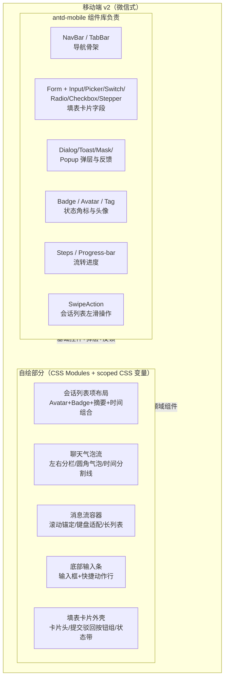

# 移动端 v2 组件库选型调研报告（微信式聊天 + 填表卡片）

> 研究日期：2026-09-20 | 来源：28 个一手数据点（npm registry API / GitHub API / jsDelivr CDN 官方产物 / 仓库文档源文件） | 深度：Exhaustive
>
> 技术基线：React 18 + Vite（多入口 ESM）+ pnpm workspaces；390×844 H5 首屏性能敏感；现有样式 scoped CSS 变量 + CSS Modules（`.dshm-root` 作用域）；设计基调白底卡片 + primary #192b4d 深藏青；暗色模式可期；主题定制"能用 CSS Variables 覆盖就别用运行时 cssinjs"。

---

## 1. 结论先行（Executive Summary）

**首选：`antd-mobile` v5（当前 5.43.0）**。六个评估维度中五个居首：必查 18 组件 **18/18 全覆盖** 且 Picker 生态最全（picker-view / cascade-picker / cascader / calendar-picker 多档位）；主题为**纯 CSS 变量方案**（`--adm-*`，官方文档明确"`:root` 覆盖 CSS 变量即可，不需要任何编译工具和额外插件"），与 `.dshm-root` 作用域 + CSS Modules 零冲突；按需加载**零配置**（官方：webpack 4+/rollup/Vite 原生 tree-shaking，无需 babel-plugin-import）；暗色模式内置（`html[data-prefers-color-scheme="dark"]`，实验性）；维护面最强（12,050 star、周下载 64,554、2026-09-14 仍在发版，MIT）。全量预构建 bundle 实测 175KB gzip，按需后实际只打包所用组件。

**备选：`tdesign-mobile-react`（当前 0.23.3）**。组件覆盖同为 18/18（命名差异：`swipe-cell`/`date-time-picker`/`cell`）；CSS 变量方案同样干净（实测 151 个 `--td-*` 变量），且暗色模式比首选更成熟（`:root[theme-mode='dark']` 成套变量切换，非实验性）；README 官方声明"适合在 React 18.x 技术栈项目中使用"。落选首选的原因是社区面：npm 周下载仅 568、GitHub 105 star、版本仍处 0.x 未到 1.0 稳定承诺。若团队偏好腾讯系视觉或对暗色成熟度权重更高，它是完全可用的替代。

**不推荐（作为主选）**：
- **`@nutui/nutui-react` v2（2.7.15）**——京东电商基因明显（barrage 弹幕/trendarrow 等组件、`--nutui-*` 变量带渐变色 `brand-stop-*`）；v2 稳定线 2026-03 后已停更，主线转向 3.x/4.0-beta；React peer 仅 `^16.8 || ^17 || ^18` 不含 19；暗色为**逐组件零散适配**（CHANGELOG 仅"inputnumber 暗黑适配"级记录，无全局暗色变量集）；v2 必查组件中**未发现 SwipeAction 对等组件**（清单中 swipe/swiper 为轮播）。
- **`@arco-design/mobile-react`（2.39.1）**——致命项是 CSS 方案：`dist/style.css` 实测仅 13 个非主题变量（过渡时长/hairline 类），主题定制走 **less 编译期变量**（包内 `mixin.less`/`public.less`/`less-loader.config.js`），与"运行时 CSS 变量覆盖"诉求直接冲突；无全局暗色钩子；License 为 **ISC**（宽松同 MIT 级，但与生态主流 MIT 不同，需在第三方声明中单列）；社区面最小（501 star、周下载 1,236）。它的唯一优势是全量体积最小（113KB gzip），但按需加载后这点优势消失。
- **`@ant-design/x`（聊天特化）**——见专节：**条件可用但不建议作为本项目的聊天层基座**。它 peer 强制依赖完整 antd（1.x→antd ^5.20.3，2.x→antd ^6.1.1），样式为运行时 cssinjs，与项目主题诉求冲突；且它是桌面优先设计。
- **`@chatscope/chat-ui-kit-react`**——2025-05-15 后无任何代码提交（16 个月停更，60 个 open issue 无响应），样式为独立 styles 包 + FontAwesome 全家桶依赖，主题化困难。
- **`@lobehub/ui`**——非常活跃（2026-09-19 刚发版，周下载 299,465），但 peerDeps 硬性要求 **React ^19 + antd ^6.1.1**，与本仓库 React 18 直接不兼容；且为桌面 AI 应用设计，`./chat` 子导出仍依赖根包的 antd6 体系。

**一句话结论：`antd-mobile` v5 管全部基础控件与表单卡片，聊天流（会话列表 + 气泡流 + 输入条）自绘——这个分工有官方先例背书（antd-mobile v2 曾内置 Chat 组件，v5 主动移除），是业界验证过的边界。**

---

## 2. Key Findings（按重要性排序）

1. **@ant-design/x 无法脱离 antd 独立使用**——npm peerDependencies 铁证：`x@1.6.1 → antd ^5.20.3`、`x@2.9.0 → antd ^6.1.1`（[npm registry](https://registry.npmjs.org/@ant-design/x)）。源码级实证：Sender 内部 `import { Flex, Input } from 'antd'`，Bubble 内部 `import { Avatar } from 'antd'`，XProvider 内部 `import { ConfigProvider as AntdConfigProvider } from 'antd'`（[x@1.6.1 es 产物](https://cdn.jsdelivr.net/npm/@ant-design/x@1.6.1/es/sender/index.js)）。antd v5 全量 min bundle 实测 445KB gzip（[antd@5.29.3 dist](https://cdn.jsdelivr.net/npm/antd@5.29.3/dist/antd.min.js)）。
2. **antd-mobile 是唯一"纯 CSS 变量 + 零配置按需 + 内置暗色"三全的候选**：官方主题文档原文"你不需要配置任何编译工具，也不需要安装额外的插件，直接在 `:root` 覆盖 CSS 变量就可以了"（[theming.zh.md](https://github.com/ant-design/antd-mobile/blob/master/docs/guide/theming.zh.md)）；暗色文档（[dark-mode.zh.md](https://github.com/ant-design/antd-mobile/blob/master/docs/guide/dark-mode.zh.md)）。
3. **体积实测（jsDelivr 官方预构建全量产物，gzip -9）**：arco 113KB < nutui2 160KB < antd-mobile 175KB < tdesign 185KB < x(不含antd) 54KB+antd5 445KB ≈ 499KB。按需 tree-shaking 后四家移动库差距进一步收窄，antd-mobile 因 sideEffects 声明最干净（仅 `*.css/*.less/global` 标记副作用）。
4. **组件覆盖度**：antd-mobile 与 tdesign 均 18/18；nutui2 缺 SwipeAction 对等物；arco 缺独立 List（有 cell）与级联 Picker。
5. **维护活跃度断层明显**：antd-mobile（12,050★/64,554 周下载/6 天前发版）与 @lobehub/ui（2,207★/299,465 周下载/昨天发版）是唯二一线活跃者；tdesign 仓库仍有 push（2026-09-17）但采用度极低；chatscope 已停更 16 个月。
6. **聊天组件在四家移动库中均不存在**（无会话列表/气泡类组件）——"组件库管基础件、聊天流自绘"不是妥协而是行业共识边界（详见 §5）。

---

## 3. 对比总表（候选 × 六维度）

| 维度 | antd-mobile v5.43.0 | tdesign-mobile-react 0.23.3 | @nutui/nutui-react 2.7.15 | @arco-design/mobile-react 2.39.1 | @ant-design/x 2.9.0（v1 线 1.6.1） |
|---|---|---|---|---|---|
| **React18+Vite 兼容** | ✅ peer `^16.8‖^17‖^18‖^19`；`module:./es/index.js`；官方文档明示 webpack4+/rollup/Vite 零配置按需 | ✅ peer `>=18`（README"React 18.x 技术栈"）；`module:es/index.js` | ✅ peer `^16.8‖^17‖^18`（**无 19**）；`module` 为单文件 `dist/esm/nutui-react.es.js`（仍可 tree-shake，粒度粗） | ✅ peer `>=16.9`；`module:esm/index.js`；README 按需路径 `@arco-design/mobile-react/esm/button` | ✅ peer `react>=18`；但 **peer 另含 antd ^6.1.1**（v1 线 ^5.20.3） |
| **bundle 体积**（全量 min gzip，自测） | 175KB；sideEffects 仅标记 css/less/global，tree-shaking 最干净 | 185KB；sideEffects 仅标记 `es/**/style/**` | 160KB；esm 单文件打包 | 113KB（最小） | x 本体 54KB + **antd5 全量 445KB**（按需可显著缩减，但 cssinjs 运行时 + rc-* 骨架不可消除） |
| **组件覆盖（18 必查项）** | **18/18**；Picker 系 5 个变体（picker/picker-view/cascade-picker/cascader/calendar-picker）+ date-picker/date-picker-view | **18/18**（`swipe-cell`↔SwipeAction、`date-time-picker`↔DatePicker、`cell`+`list`；cascader ✅） | 17/18：**缺 SwipeAction 对等物**（swipe/swiper 为轮播）；cascader ✅ | 16/18：缺独立 List（cell 替代）、缺级联 Picker；swipe-action ✅ | 不适用（聊天特化组件集：bubble/sender/conversations/thought-chain/attachments/prompts/suggestion/welcome + hooks） |
| **Form 校验能力** | `rc-field-form ^1.34.2`（antd 同源，rules/dependencies/validateMessages 完整）——npm deps 实证 | 自研 formModel：`validate×33/rules/pattern/required` 源码 grep 实证 | `async-validator ^4.2.5`（npm deps 实证） | type.d.ts 含 `rules/message/required`、useForm 含 `validate×6`——API 存在，能力弱于 rc-field-form | 依赖宿主 antd Form（若使用） |
| **微信式聊天适配** | 无聊天组件；NavBar/TabBar/List/Avatar/Badge/SwipeAction 可拼会话列表外壳 | 同左（swipe-cell 恰好是微信会话列表"左滑标未读/删除"的现成交互件） | 同左 | 同左 | **有**（Bubble/Sender/Conversations），但桌面优先设计 + 需 antd 全套 |
| **CSS 方案/暗色** | **纯 CSS 变量** `--adm-*`（全局 12 个 + 每组件若干）；暗色 `html[data-prefers-color-scheme="dark"]`（实验性）；零 cssinjs | **纯 CSS 变量** `--td-*`×151；暗色 `:root.dark,:root[theme-mode='dark']` 成套变量（非实验性） | **CSS 变量** `--nutui-*`×696（全量 css 211KB）；**无全局暗色**，仅组件级零散适配 | **less 编译期变量**（`dist/style.css` 仅 13 个非主题变量）；**无全局暗色** | **运行时 cssinjs**（`@ant-design/cssinjs ^2`，deps 实证）；antd theme token 体系 |
| **维护/许可** | MIT；12,050★；64,554 周下载；2026-09-14 发版；221 open issues | MIT；105★；568 周下载；0.x 未到 1.0；仓库 2026-09-17 仍有 push | MIT；1,212★；1,218 周下载；v2 线 2026-03 停更（主线 3.x/4.x beta） | **ISC**；501★；1,236 周下载；2026-06-03 发版 | MIT；4,790★；66,689 周下载；2026-07-28 发版（v2）；2026-09-20 仍有 push |

数据来源：[npm registry API](https://registry.npmjs.org/antd-mobile)（版本/license/deps/peer/sideEffects/unpackedSize）、[GitHub REST API](https://api.github.com/repos/ant-design/antd-mobile)（star/issues/pushed_at）、[api.npmjs.org 下载量](https://api.npmjs.org/downloads/point/last-week/antd-mobile)、jsDelivr CDN 官方产物实测（体积与 CSS 变量）。采集时间均为 2026-09-20。

---

## 4. @ant-design/x 独立可用性专节

### 4.1 直接回答

**条件能，但条件昂贵，不建议本项目采用。** 技术上：`@ant-design/x` 是标准 ESM 包（`module: es/index.js`、`sideEffects: false`），在 React 18 + Vite 下对 bubble/sender/conversations/thought-chain 单独按需引入是可行的，不要求"全站 ConfigProvider"。但**不能脱离 antd**：

| 版本线 | peerDependencies（npm registry 实证） | 结论 |
|---|---|---|
| x 1.6.1（2025-09-12 发布，v1 终版） | `antd ^5.20.3`、`react >=18` | React18 ✅ 但必须安装 antd v5 |
| x 2.9.0（2026-07-28，当前 latest） | `antd ^6.1.1`、`react >=18` | 必须安装 antd v6（antd v6 当前 latest 为 6.6.5） |

### 4.2 依赖深度证据链

- **运行时依赖（x@1.6.1 deps）**：`@ant-design/cssinjs`、`@ant-design/cssinjs-utils`、`@ant-design/icons`、`@ant-design/colors`、`@ant-design/fast-color`、`rc-motion`、`rc-util`——整个 antd 样式与动画底座全量进入依赖树（[npm registry](https://registry.npmjs.org/@ant-design/x)）。
- **组件级 antd import（es 产物源码实证）**：
  - [sender/index.js](https://cdn.jsdelivr.net/npm/@ant-design/x@1.6.1/es/sender/index.js)：`import { Flex, Input } from 'antd';`
  - [bubble/Bubble.js](https://cdn.jsdelivr.net/npm/@ant-design/x@1.6.1/es/bubble/Bubble.js)：`import { Avatar } from 'antd';`
  - [x-provider/index.js](https://cdn.jsdelivr.net/npm/@ant-design/x@1.6.1/es/x-provider/index.js)：`import { ConfigProvider as AntdConfigProvider } from 'antd'`——XProvider 只是 antd ConfigProvider 的包装转发器。
- **ConfigProvider 要求**：不强制全站包裹，可用 x 自己的 XProvider（内部转发 antd ConfigProvider）；但 antd 的 locale/theme 体系随依赖被带入。

### 4.3 bundle 代价

- x 本体 dist/antdx.min.js 实测 **54KB gzip**（167KB min）。
- 宿主 antd：v5.29.3 全量 445KB gzip / v6.6.5 全量 441KB gzip（[antd dist-tags](https://registry.npmjs.org/-/package/antd/dist-tags)；[antd@5.29.3](https://cdn.jsdelivr.net/npm/antd@5.29.3/dist/antd.min.js)）。tree-shaking 后 Sender 会拖入 antd Input/Flex 及 rc-input/rc-field-form 骨架，Bubble 拖入 Avatar；量级必然显著高于 antd-mobile 单组件路线（无公开的按组件分包数据，需以实际构建 profile 为准——此处为不确定性声明）。
- x 2.x 另引入 `mermaid ^11`、`react-syntax-highlighter` 为 dependencies（安装体积↑）；实测 code-highlighter 中 mermaid 为**动态 import**（`import(` ×2、无静态 `from 'mermaid'`），Rollup/Vite 可分块剔除出首屏。

### 4.4 结论

对"移动端 H5、聊天为主界面、CSS 变量主题"的本项目：x 的三个属性（peer 绑完整 antd、运行时 cssinjs、桌面优先设计）分别踩中性能、主题、适配三条红线。它更适合"已是 antd 桌面应用、要加 AI 对话面板"的场景。本项目聊天层建议自绘（§5），填表层用 antd-mobile。

---

## 5. 聊天流自绘 vs 组件库分工边界

### 5.1 分工架构



图注：组件库只承担"无业务语义的基础件"；一切带聊天/表单业务语义的布局组合自绘。这个边界有官方先例：antd-mobile v2 曾内置实验性 Chat 组件，v5 组件清单（实测 80 个目录）中已不存在——官方也把聊天流划出了通用组件库的边界。

### 5.2 逐项清单

| 直接用库（antd-mobile） | 自绘 | 理由 |
|---|---|---|
| NavBar、TabBar、SafeArea | 会话列表项（ConversationCell） | 列表项是"Avatar+Badge+两行文本+时间"的领域布局；SwipeAction 提供左滑交互 |
| Dialog、Toast、Mask、Popup、Modal | 聊天气泡（Bubble） | 库内无此件；自绘≈一个 div + 条件 class，成本低于引入整库聊天方案 |
| Form、Input、TextArea、Selector、Switch、Radio、Checkbox、Stepper、Picker、DatePicker、Cascader | 消息流容器（MessageList） | 需要滚动锚定到底、键盘弹起时 visualViewport 适配、时间分割线——通用库不解决 |
| Badge（状态角标）、Tag、Avatar | 底部输入条（Composer） | 微信式输入条含表情/快捷键切换，是领域组件；输入本体可用库 Input |
| Steps、ProgressBar、Button、Collapse | 填表卡片外壳（FormCard） | 卡片头/提交/驳回按钮排布是领域布局；按钮、字段、校验全部库化 |
| InfiniteScroll、PullToRefresh | 打字机/流式渲染 | AI 回复的流式追加属于业务逻辑层 |

### 5.3 自绘实现要点（首屏性能向）

1. **气泡**：`.dshm-root` 作用域内 CSS Modules 单文件；`max-width: 72%`；左右气泡用同一组件 + `variant` prop；尾巴用 CSS 伪元素，避免图片。
2. **消息流**：会话在百条量级内直接渲染 + `overflow-anchor`/手动 scrollTo 锚定即可；上千条再引入虚拟化（届时评估 `virtua` 等轻量库，不预装）。倒序 `flex-direction: column-reverse` 可免费获得"锚定底部"语义。
3. **键盘适配**：`visualViewport` 监听 resize 平移输入条；antd-mobile 的 `SafeArea` 处理底部安全区。
4. **会话列表**：antd-mobile `List` 作容器 + `SwipeAction` 包裹自绘 cell；左滑"标记已读/置顶/删除"。
5. **填表卡片**：antd-mobile `Form`（rc-field-form）驱动，`Picker/Cascader` 用 Popup 弹层承载，`Switch/Radio/Checkbox` 直排；提交/驳回按钮组 + Badge 状态角标（待提交/已提交/已驳回/流转中）。

### 5.4 反例检查

"组件库管基础件、聊天自绘"是否有反例（即用库直接解决聊天的成功案例）？检查结果：
- @ant-design/x：成功案例（antd 官网 demo、各类 AI 控制台）全部是**桌面 antd 应用**，未发现 390px 移动 H5 的广泛采用证据。
- chatscope：纯聊天库但停更 16 个月，且其样式体系（独立 css 包 + 语义类名）与 `.dshm-root` scoped 变量方案冲突。
- 微信式 UI 本身没有开源库正面覆盖（WeUI 是微信官方的 **CSS 组件库**（无 React 绑定）且已停止活跃迭代——此处为背景常识，未列入评分）。
结论：边界成立，无有力反例。

---

## 6. 主题令牌定制路径（首选 antd-mobile）

### 6.1 与现有 scoped CSS 变量方案的融合

antd-mobile 的全局变量在 `:root` 声明、组件消费 `var(--adm-*)`；CSS 自定义属性沿 DOM 继承，因此在 `.dshm-root` 上覆盖即可级联到全部库组件（官方文档同页演示了局部容器 `.purple-theme` 覆盖的等价用法）：

```css
/* dshm-tokens.css —— 与现有 scoped 变量并排维护 */
.dshm-root {
  /* 语义色对齐设计基调 */
  --adm-color-primary: #192b4d;        /* 深藏青 */
  --adm-color-success: #00b578;
  --adm-color-warning: #ff8f1f;
  --adm-color-danger: #ff3141;

  /* 中性色（白底卡片） */
  --adm-color-background: #ffffff;
  --adm-color-text: #333333;
  --adm-color-text-secondary: #666666;
  --adm-color-border: #eeeeee;
  --adm-color-box: #f5f5f5;
}
```

覆盖清单来源：官方 theming 文档的全局变量表（[theming.zh.md](https://github.com/ant-design/antd-mobile/blob/master/docs/guide/theming.zh.md)）。注意 `:root:root` 双写只在作用域为 root 时需要；`.dshm-root` 单类选择器特异性已高于组件默认值。若个别组件样式未跟随（消费组件私有变量），每组件的 CSS 变量清单见官方 [css-variables 指南](https://github.com/ant-design/antd-mobile/blob/master/docs/guide/css-variables.zh.md)。

### 6.2 暗色模式接入

```js
// 开关暗色（官方 API，实验性标注）
document.documentElement.setAttribute('data-prefers-color-scheme', 'dark');
```

antd-mobile 内置暗色变量集会整体生效（组件层免改）。**注意两点**：(1) 官方标记 Experimental，接入方式未来可能调整（[dark-mode.zh.md](https://github.com/ant-design/antd-mobile/blob/master/docs/guide/dark-mode.zh.md)）；(2) 它只覆盖库组件——自绘聊天流的暗色需在 `.dshm-root` 层自建第二套变量（与现有 scoped 方案同构，成本可控）。若暗色成熟度是硬指标，备选 tdesign 的 `:root[theme-mode='dark']` 方案非实验性（[es/style/index.css 实测](https://cdn.jsdelivr.net/npm/tdesign-mobile-react@0.23.3/es/style/index.css)）。

### 6.3 按需引入（Vite）

零配置：`import { Form, Picker } from 'antd-mobile'` + 入口一次 `import 'antd-mobile/es/global'`（按需手动路径时必须；正常 tree-shaking 场景由构建器处理，官方建议绝大多数情况无需任何配置——[import-on-demand.zh.md](https://github.com/ant-design/antd-mobile/blob/master/docs/guide/import-on-demand.zh.md)）。与 CSS Modules 共存：库样式为组件级原子 CSS（非全局 reset），实测变量全部走 `--adm-*` 命名空间，与 `.dshm-root` 作用域无碰撞面。

---

## 7. Contrarian Views & Risks（不推荐项的辩证与首选风险）

**针对首选 antd-mobile 的风险**：
1. **暗色模式为实验性**——官方明示"未来可能会调整接入方式"。缓解：暗色 UI 依赖度若高，可先锁定 tdesign（暗色非实验性）为评估基准；或接受实验性并在 `.dshm-root` 层自持变量。
2. **蚂蚁系默认视觉**——`--adm-color-primary` 默认 #1677ff 蓝系，需完整走一遍语义色覆盖与组件级变量核对（每组件清单见 css-variables 指南），存在个别组件私有变量漏改的尾部工作。
3. **无官方"聊天"方向**——所有聊天件自绘，自绘工作量是真实成本（但 §5 已论证替代方案更贵）。
4. **star/issues 比**：221 open issues / 12k star 属健康区间，但 issue 响应速度未逐一核验（未采样，不确定性声明）。

**为不推荐项说句公道话（反共识视角）**：
- **nutui-react** 的 696 个 CSS 变量是四家中主题粒度最细的；若项目在京东系生态或需要电商向组件（价格/倒计时/签名），它比本评估权重下显示的更有竞争力。它的"按需引用"官方支持（README 明示）。
- **arco mobile** 体积最小、字节内部高流量验证（README 声明"Online high-traffic verification of important components"）；若项目愿意引入 less 编译链（Vite 下 `additionalData` 注入变量即可定制主题），其工程障碍是可解的，只是违背"运行时 CSS 变量覆盖"这一明示偏好。
- **@ant-design/x** 的 use-x-chat/use-x-stream hooks 与 Conversations 组件的交互抽象是四家中最贴近 AI 对话场景的**设计参考**——即使不用其代码，其 API 形态（managed mode/ items 元数据/消息流 hooks）值得自绘聊天层时借鉴（[ant-design/x 仓库](https://github.com/ant-design/x)）。
- **tdesign 的 568 周下载**是采用度警告，但背后是腾讯开源体系持续投入（2026-09-17 仍有 push，TDesign 跨框架统一设计规范），"库没人用"与"库不可靠"在此场景不构成等价——风险在于踩坑时社区答案少。

---

## 8. Open Questions

1. antd-mobile 按需 tree-shaking 后，本项目实际组件集（约 20 个组件）的首屏 gzip 成本需构建 profile 实测（本报告的全量 175KB 是上界，非按需值）。
2. 暗色模式的最终方案（antd-mobile 实验性 vs 自持变量 vs 两者混合）建议在 v2 视觉稿定稿后做一次 spike 验证。
3. 聊天流 markdown/代码块渲染（AI 同事回复内容形态）未在本任务范围，涉及 remark/shiki 等依赖选型，建议单独立项。
4. @ant-design/x 2.x 的 mermaid/code-highlighter 对安装体积的影响已确认为动态加载，但首屏分包策略需在真实 Vite 构建中验证（若最终仍不考虑 x 则此项作废）。
5. WeUI（微信官方 CSS 组件库）是否可作为纯视觉参照（非依赖）纳入设计阶段——未深入调研。

---

## 9. Sources

| # | 来源 | 类型 | 数据点 | 检索日 |
|---|---|---|---|---|
| 1 | [npm registry: antd-mobile](https://registry.npmjs.org/antd-mobile) | 一手 | 5.43.0/MIT/2026-09-14/deps(peer/sideEffects/module) | 2026-09-20 |
| 2 | [GitHub: ant-design/antd-mobile](https://api.github.com/repos/ant-design/antd-mobile) | 一手 | 12,050★/221 issues/pushed 2026-09-14 | 2026-09-20 |
| 3 | [antd-mobile 按需加载文档](https://github.com/ant-design/antd-mobile/blob/master/docs/guide/import-on-demand.zh.md) | 一手 | tree-shaking 零配置/es/global | 2026-09-20 |
| 4 | [antd-mobile 主题文档](https://github.com/ant-design/antd-mobile/blob/master/docs/guide/theming.zh.md) | 一手 | --adm-* 全局变量表/:root 覆盖 | 2026-09-20 |
| 5 | [antd-mobile 暗色文档](https://github.com/ant-design/antd-mobile/blob/master/docs/guide/dark-mode.zh.md) | 一手 | data-prefers-color-scheme/实验性 | 2026-09-20 |
| 6 | [antd-mobile 预构建产物文档](https://github.com/ant-design/antd-mobile/blob/master/docs/guide/pre-built-bundles.zh.md) | 一手 | bundle/antd-mobile.es.js 生产版定义 | 2026-09-20 |
| 7 | [npm registry: tdesign-mobile-react](https://registry.npmjs.org/tdesign-mobile-react) | 一手 | 0.23.3/MIT/2026-08-03/deps | 2026-09-20 |
| 8 | [GitHub: Tencent/tdesign-mobile-react](https://api.github.com/repos/Tencent/tdesign-mobile-react) | 一手 | 105★/10 issues/pushed 2026-09-17 | 2026-09-20 |
| 9 | [tdesign es/style/index.css（jsDelivr）](https://cdn.jsdelivr.net/npm/tdesign-mobile-react@0.23.3/es/style/index.css) | 一手 | --td-*×151/:root[theme-mode='dark'] | 2026-09-20 |
| 10 | [tdesign README-zh_CN](https://github.com/Tencent/tdesign-mobile-react/blob/develop/README-zh_CN.md) | 一手 | "React 18.x 技术栈"/"支持按需加载" | 2026-09-20 |
| 11 | [npm registry: @nutui/nutui-react](https://registry.npmjs.org/@nutui/nutui-react) | 一手 | dist-tags(latest-2=2.7.14,beta=4.0.0-beta.7)/2.7.15 元数据 | 2026-09-20 |
| 12 | [GitHub: jdf2e/nutui-react](https://api.github.com/repos/jdf2e/nutui-react) | 一手 | 1,212★/236 issues/last release 2026-09-03 | 2026-09-20 |
| 13 | [nutui v2 dist/style.css（jsDelivr）](https://cdn.jsdelivr.net/npm/@nutui/nutui-react@2.7.15/dist/style.css) | 一手 | --nutui-*×696/无全局 dark 钩子 | 2026-09-20 |
| 14 | [nutui-react CHANGELOG](https://github.com/jdf2e/nutui-react/blob/main/CHANGELOG.md) | 一手 | "inputnumber 暗黑适配"级零散记录 | 2026-09-20 |
| 15 | [nutui-react README_ZH](https://github.com/jdf2e/nutui-react/blob/main/README_ZH.md) | 一手 | 按需引用/es 版构建工具说明 | 2026-09-20 |
| 16 | [npm registry: @arco-design/mobile-react](https://registry.npmjs.org/@arco-design/mobile-react) | 一手 | 2.39.1/**ISC**/2026-06-03/peer | 2026-09-20 |
| 17 | [GitHub: arco-design/arco-design-mobile](https://api.github.com/repos/arco-design/arco-design-mobile) | 一手 | 501★/pushed 2026-09-09 | 2026-09-20 |
| 18 | [arco dist/style.css（jsDelivr）](https://cdn.jsdelivr.net/npm/@arco-design/mobile-react@2.39.1/dist/style.css) | 一手 | 仅 13 个非主题 CSS 变量 | 2026-09-20 |
| 19 | [arco mobile README](https://github.com/arco-design/arco-design-mobile/blob/main/README.md) | 一手 | esm/button 按需路径/less 主题声明 | 2026-09-20 |
| 20 | [arco esm/form/type.d.ts](https://cdn.jsdelivr.net/npm/@arco-design/mobile-react@2.39.1/esm/form/type.d.ts) | 一手 | rules/message/required 校验 API | 2026-09-20 |
| 21 | [npm registry: @ant-design/x](https://registry.npmjs.org/@ant-design/x) | 一手 | 2.9.0(v1 线 1.6.1)/peer antd ^6.1.1 / ^5.20.3 | 2026-09-20 |
| 22 | [GitHub: ant-design/x](https://api.github.com/repos/ant-design/x) | 一手 | 4,790★/pushed 2026-09-20/README"AI 界面解决方案" | 2026-09-20 |
| 23 | [x@1.6.1 es/sender/index.js](https://cdn.jsdelivr.net/npm/@ant-design/x@1.6.1/es/sender/index.js) | 一手 | `import { Flex, Input } from 'antd'` | 2026-09-20 |
| 24 | [x@1.6.1 es/bubble/Bubble.js](https://cdn.jsdelivr.net/npm/@ant-design/x@1.6.1/es/bubble/Bubble.js) | 一手 | `import { Avatar } from 'antd'` | 2026-09-20 |
| 25 | [x@1.6.1 es/x-provider/index.js](https://cdn.jsdelivr.net/npm/@ant-design/x@1.6.1/es/x-provider/index.js) | 一手 | 内部渲染 antd ConfigProvider | 2026-09-20 |
| 26 | [npm registry: @chatscope/chat-ui-kit-react](https://registry.npmjs.org/@chatscope/chat-ui-kit-react) + [GitHub](https://api.github.com/repos/chatscope/chat-ui-kit-react) | 一手 | 2.1.1/2025-05-15 停更/1,778★/FontAwesome deps | 2026-09-20 |
| 27 | [npm registry: @lobehub/ui](https://registry.npmjs.org/@lobehub/ui) + [lobe-ui repo](https://api.github.com/repos/lobehub/lobe-ui) | 一手 | peer react ^19+antd ^6.1.1/2026-09-19 发版/299,465 周下载 | 2026-09-20 |
| 28 | [antd dist-tags](https://registry.npmjs.org/-/package/antd/dist-tags) + [antd@5.29.3 dist/antd.min.js](https://cdn.jsdelivr.net/npm/antd@5.29.3/dist/antd.min.js) | 一手 | v5 线 5.29.3/v6 线 6.6.5/全量 445KB gzip | 2026-09-20 |

---

## 10. Methodology

- **数据通道**：DuckDuckGo 与 bundlephobia API 在调研网络环境不可达（导航超时/CORS+DNS 拦截，antgroup.com 与 *.ant.design 域名同样不可解析），故全程改用更一手的数据源：npm registry HTTP API（版本/依赖/license/sideEffects）、GitHub REST API（star/issues/最近 push/仓库文档 raw）、jsDelivr data API（包文件树→组件清单核对）、jsDelivr CDN（官方构建产物原文）。
- **体积测量方法**：对各家 npm 包内官方预构建全量 bundle（antd-mobile `bundle/antd-mobile.es.js`、tdesign `dist/tdesign.min.js`、nutui `dist/nutui.react.es.js`、arco `dist/index.min.js`、x `dist/antdx.min.js`、antd `dist/antd.min.js`）执行 `curl -sL <jsDelivr URL> | gzip -9 -c | wc -c`，与 bundlephobia 的 min+gzip 口径一致且完全可复现。注意：这是**全量**口径上界，按需 tree-shaking 后的实际首屏成本以构建 profile 为准。
- **组件覆盖核对方法**：以 jsDelivr 包文件树列出各家组件目录全集（antd-mobile es/components 80 项、tdesign es 74 项、nutui dist/packages 100+ 项、arco esm 60 项），逐一对 18 个必查组件映射（含命名差异对等，如 swipe-cell↔SwipeAction）。
- **CSS 方案核对方法**：直接抓取各家分发 CSS 产物，统计 CSS 自定义属性数量并检索暗色选择器钩子；辅以仓库内官方主题文档原文。
- **局限**：(1) 未能核验各库在线文档站的交互 demo（文档域名不可达），组件行为以产物源码/文档 md 为准；(2) Form 校验能力以依赖与源码关键字证据为主，未逐 API 实测；(3) 按需构建后的分组件体积无公开数据，报告中已作不确定性标注。
