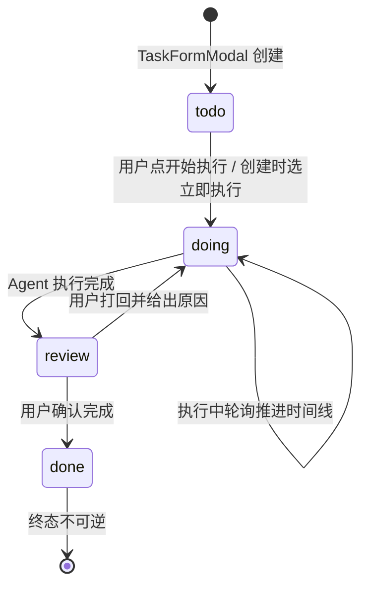
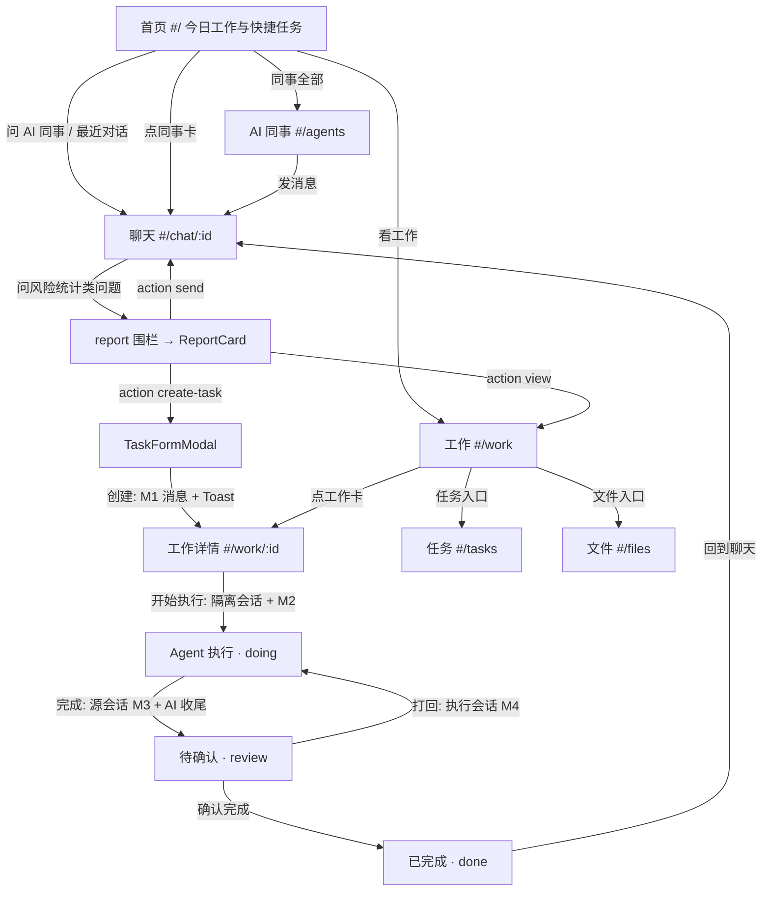

# 移动端 v5「AI Workmate」· 信息架构与交互协议

> 日期：2026-09-22 | 作者：设计流程 Agent（只做设计，不写代码） | 上游：[01-product-problem.md](01-product-problem.md) 命题与 S1-S7；[PLAN.md §2](../../../plans/2026-09-22-mobile-v5-aiworkmate/PLAN.md) 目标 IA 与 D1-D6 决策 | 下游：[04-implementation-spec.md](04-implementation-spec.md) 按本文落地工程；03-visual-design.md（另阶段产出）消费本文的组件清单与信息结构 | 视口基准：390×844 | 对标深度：[v3 IA 文档](../../../plans/2026-09-21-mobile-v3-redesign/02-information-architecture.md)

设计总纲一句话：**十个 hash path、四个 Tab、一张工作四态状态机、一个 report 围栏协议、一个 Action 执行器——把 PLAN §2 的路由总表落成可执行的交互协议。**

## 1. 路由总表与 chrome 协议

### 1.1 路由表（10 hash path）

| hash path | Route name | 层级 | 页面 | TabBar | 数据来源 |
|---|---|---|---|---|---|
| `#/` | `home` | 一级 Tab | HomeView（新建） | Tab1 🏠 AI同事 | workStore + roster + sessions 投影 |
| `#/chats` | `chats` | 一级 Tab | MessagesView（平移） | Tab2 💬 对话 | durable log 投影 |
| `#/chat/:id` | `chat` | 全屏层 | ChatView（增强） | 隐藏 | durable log + 轮询 |
| `#/work` | `work` | 一级 Tab | WorkView（新建） | Tab3 📋 工作 | workStore |
| `#/work/:id` | `work`（带 param） | 全屏层 | WorkDetailView（新建） | 隐藏 | workStore + 执行会话投影 |
| `#/tasks` | `tasks` | 二级页 | TasksView（新建） | 隐藏 | workStore 派生 |
| `#/files` | `files` | 二级页 | FilesView（新建） | 隐藏 | workStore 派生 |
| `#/agents` | `agents` | 二级页 | AgentsView（新建） | 隐藏 | roster（agentPreset.list）+ colleagues 视觉表 |
| `#/me` | `me` | 一级 Tab | ProfileView（扩展） | Tab4 👤 我的 | identity + workStore + durable log |
| `#/login` | `login` | 身份 gate | LoginView（现有） | 隐藏 | demo 通道 |

实现基线：[router.ts](../../../packages/client/ui-mobile/src/client/router.ts) 的 `parseRoute`/`useRoute`/`navigate` 三函数不动，`MobileRoute.name` 扩为九值联合 `'home' | 'chats' | 'chat' | 'work' | 'me' | 'tasks' | 'files' | 'agents' | 'login'`；`work` 与 `chat` 同构支持 param 子路由（`#/work/:id` 的 param 即工作项 id）。

### 1.2 chrome 白名单与 TabBar

```
TAB_ROUTES = ['home', 'chats', 'work', 'me']   // 渲染 TabBar 的白名单
```

- 白名单内四个一级页渲染 TabBar（lucide 图标 + 中文标题），当前 Tab 高亮由 route.name 直映；
- 白名单外（chat / work 带 param / tasks / files / agents / login）为全屏层或二级页，隐藏 TabBar，顶部 NavBar 返回（见 §7 返回语义）；
- [MobileShell.tsx](../../../packages/client/ui-mobile/src/client/shell/MobileShell.tsx) 的 chrome 判定从 `name !== 'chat'` 改为白名单 `TAB_ROUTES.includes(name)`；视图分发扩九路由；TabBar `onChange` 按 key navigate 到对应 `#/` 前缀。

### 1.3 默认路由与 LEGACY_HEADS 第三代折叠

默认路由（空 hash）从 `chats` 改为 `home`：`parseRoute` 的兜底分支返回 `{ name: 'home' }`。

第三代折叠落点表（对 [router.ts:26](../../../packages/client/ui-mobile/src/client/router.ts) 的 `LEGACY_HEADS` 复核）：

| 旧 head | 来源 | v3 落点 | v5 落点 | 理由 |
|---|---|---|---|---|
| `messages` | v1 消息 Tab | `chats` | `chats` | 消息=对话列表，语义未变 |
| `workbench` | v1 工作台 Tab | `chats` | **`work`** | v5 长出了真正的工作页，语义精确归位 |
| `data` | v1 数据 Tab | `chats` | `chats` | 数据问答仍由聊天（经营参谋/企业数据助手）承接 |
| `kg` | v1 图谱 Tab | `chats` | `chats` | KG 证据继续在聊天流内收起呈现 |
| `contacts` | v2 通讯录 | `chats` | **`agents`** | v5 的 AI 同事目录即通讯录语义 |
| `profile` | v1/v2 我的 | `me` | `me` | 不变 |

与 PLAN §2.1 的差异显式记录：PLAN 给出两个候选（维持折 `chats` / 改折 `home`），本设计取第三案「按语义精确落点」——`workbench→work`、`contacts→agents` 让两代旧深链落到语义同名的新页而非泛化兜底；六个落点全部是 v5 有效路由，零死链，折叠机制（表驱动 + parseRoute 单处判定）不变。v3 head（`chats/chat/me/login`）全部原样保留，不折叠。

## 2. 页面信息结构（逐页线框与块表）

### 2.1 HomeView（`#/`，Tab1）

```
┌────────────────────────────┐
│ 9:41        食链通   🔔(无) │  状态栏区（不做通知页，铃铛隐藏）
│                            │
│ 早上好，业务员              │  问候行（identity.name + 时段问候）
│ 今天有 3 件事等你           │  副行（待处理+待确认 计数）
│ ┌────────────────────────┐ │
│ │ 📋 今日工作             │ │  统计卡（点击 → #/work）
│ │ [待处理3][进行中1][待确认1]│ │  三格指标（workStore todayStats）
│ └────────────────────────┘ │
│ 快捷任务                    │
│ [登记单据][问经营][看工作][找同事]│ chips 单行横滑（§10.4 动作集）
│ AI 同事            全部 >  │  区头（全部 → #/agents）
│ ┌────┐ ┌────┐ ┌────┐      │  头像卡横滑（roster 4 preset，
│ │表单│ │参谋│ │数据│ …    │  stamp 头像 + duty 一行；点卡发起会话）
│ └────┘ └────┘ └────┘      │
│ 最近对话           全部 >  │  区头（全部 → #/chats）
│ ┌──────────────────────┐  │
│ │ 表单 昨天采购…  昨天  │  │  最近 3 条（sessions 投影复用
│ └──────────────────────┘  │  projection.ts，过滤工作会话）
│ …                         │
├────────────────────────────┤
│ 🏠AI同事 💬对话 📋工作 👤我│  TabBar
└────────────────────────────┘
```

| 块 | 数据来源 | 交互 |
|---|---|---|
| 问候行 | `identity.name`（[auth.ts](../../../packages/client/ui-mobile/src/client/auth.ts)）+ 时段 | 无 |
| 今日工作统计卡 | workStore `todayStats`：todo/doing/review 三格计数 | 点击整卡 → `#/work` |
| 快捷任务 chips | 静态动作集（§10.4） | 三类真实动作 |
| AI 同事横滑 | `listAiEmployees()` + [colleagues.ts](../../../packages/client/ui-mobile/src/client/colleagues.ts) 视觉表 | 点卡 `createSession(preset)` → `#/chat/:id`；「全部」→ `#/agents` |
| 最近对话 3 条 | `listSessions()` + [projection.ts](../../../packages/client/ui-mobile/src/client/messages/projection.ts) 缓存投影，过滤工作会话（§9） | 点行 → `#/chat/:id`；「全部」→ `#/chats` |

### 2.2 MessagesView（`#/chats`，Tab2，平移改造）

信息结构与 v4 全量一致（SearchBar / CapsuleTabs 全部-AI同事-待审核 / 64px 会话行 / SwipeAction 置顶-已读 / PullToRefresh / InfiniteScroll / NewChatSheet），v5 仅两处变化：路由落点从默认页改为 Tab2；行过滤增加工作会话排除（§9）。v4 资产（票据材质、投影缓存、未读水位）零改动继承。

### 2.3 ChatView（`#/chat/:id`，全屏层，增强）

v3/v4 既有结构全保留（NavBar 身份头 / 流区八种 item 渲染 / KG 证据入口 / chips 矩阵 / composer）。v5 增量：

| 增量 | 说明 |
|---|---|
| `report` item 渲染 | ChatItem 新成员，由 ReportCard（新建 `messages/ReportCard.tsx`）渲染（§4.4），与 ask/draft/receipt 同流混排，共享 turn 头像列 |
| Action dispatch | ReportCard 按钮点击走统一执行器（§5）；`create-task` 在本页打开 TaskFormModal（§6） |
| 演示态 typing 模拟 | run mode 为 demo 且 prompt 后无新事件时，渲染「正在思考…」指示（渲染层适配，不进 log，见 [04 §4](04-implementation-spec.md)） |

### 2.4 WorkView（`#/work`，Tab3）

```
┌────────────────────────────┐
│ 工作              [任务][文件]│ 区头（右上两个入口 → #/tasks #/files）
│ (待处理1)(进行中1)(待确认1)(已完成2)│ CapsuleTabs 四态（count 徽标）
│ ┌────────────────────────┐ │
│ │ ● 接口联调延期处理  [示例]│ │ 工作卡：点标（状态色）+ 标题
│ │    负责人 张三 · 截止 周五 │ │ 副行：owner · due · 来源（源会话入口）
│ │    来自 与经营参谋的对话 > │ │ 点卡 → #/work/:id
│ └────────────────────────┘ │
│ （空态：没有进行中的工作，  │ Empty（ErrorBlock empty 态 +
│   去聊天里让 AI 帮你处理）   │ 「去找 AI 同事」按钮 → #/agents）
├────────────────────────────┤
│ 🏠AI同事 💬对话 📋工作 👤我│
└────────────────────────────┘
```

| 块 | 数据来源 | 交互 |
|---|---|---|
| CapsuleTabs 四态 | workStore `byStatus` 计数 | 切换过滤 |
| 工作卡列表 | workStore `byStatus(status)` 按 updatedAt 倒序 | 点卡 → `#/work/:id`；副行「来自 …对话」回链 `#/chat/:sourceSessionId` |
| 空态 | — | 引导按钮 → `#/agents` |
| 任务/文件入口 | — | navigate `#/tasks` / `#/files` |

### 2.5 WorkDetailView（`#/work/:id`，全屏层）

```
┌────────────────────────────┐
│ ‹  接口联调延期处理         │ NavBar（back 见 §7）
│ 状态 [进行中]  截止 周五    │ 状态条（四态徽标 + due + owner）
│ ┌────────────────────────┐ │
│ │ 工作上下文              │ │ 上下文卡：AI 建议只读区（suggestion）
│ │ 建议今天与技术负责人确认  │ │ + 源锚点「查看来源对话 >」
│ │   新的联调时间           │ │   → #/chat/:sourceSessionId
│ └────────────────────────┘ │
│ Agent 执行过程              │ 时间线（两态数据源，04 §4）
│  ✓ 读取项目风险记录          │  step：label + state(running/done/error)
│  ✓ 汇总延期影响             │  真实态=执行会话 fold 投影
│  ● 起草确认话术…            │  演示态=模拟步骤推进
│ ┌────────────────────────┐ │
│ │ 结果                    │ │ 结果卡（review/done 态显示）：
│ │ 已与负责人约定明天 10 点  │ │ result.summary + 完成时间
│ └────────────────────────┘ │
│ ┌────────────────────────┐ │ 操作区（按状态切换）：
│ │ [打回继续执行][确认完成] │ │ review：打回 + 确认完成
└────────────────────────────┘   doing：仅查看（时间线在跑）
                                 todo：[开始执行]
                                 done：[回到聊天]（有源会话时）
```

操作区与状态机（§3）一一对应；「回到聊天」navigate 回 `#/chat/:sourceSessionId`，此时完成事件消息已在源会话 durable log 内，AI 收尾回复随轮询到达。

### 2.6 TasksView（`#/tasks`，二级页）

NavBar「‹ 我的任务」+ 两组分区：**我的任务**（`myTasks`：owner === 当前 identity.name）与**团队任务**（`teamTasks`：其余 owner，区头标注「演示团队」）。任务行 = 状态点标 + 标题 + owner · due；点行 → `#/work/:id`。演示 seed 项带「示例」Tag（§10.3）。

### 2.7 FilesView（`#/files`，二级页）

NavBar「‹ 文件」+ 三分区：**AI 生成**（workStore 项的 `artifact`（report 产物）按生成时间倒序；卡片 = report title + subtitle + 生成时间 + 「查看报告」进入渲染态预览（复用 ReportCard 只读渲染）+「去源对话」回链）；**最近文件**（artifact 且 createdAt 近 7 天的子集，与 AI 生成去重展示）；**收藏**（本地态 `dsh-mobile-work` 内 `pinned: true` 的 artifact，演示 seed 预置 1 条带「示例」Tag）。v5 文件均为「AI 生成的报告产物」，不虚构文件系统。
> B3 裁决（2026-09-23）：原「子集去重」使最近文件恒空——改为互补视图：最近文件 = 近 7 天全部（含 AI 生成项，行带 AI 来源徽标），AI 生成 = 其 AI 来源过滤子集，收藏不变。

### 2.8 AgentsView（`#/agents`，二级页）

NavBar「‹ AI 同事」+ 角色卡列表（roster 全量 4 preset）。角色卡：

```
┌────────────────────────────┐
│ [表单stamp] 智能填表助手    │ roster name（preset.yml 的 name，不改）
│ 单据登记与任务执行          │ duty 一句话（colleagues.ts 视觉表）
│ [一句话登记] [风险报告]     │ 能力 chips（welcome.capabilities 前2条投影）
│                  [发消息]  │ createSession(preset) → #/chat/:id
└────────────────────────────┘
```

**角色映射裁决（问题 1）**：采用方案 (b) 按现有能力命名角色集合。agents 页收 roster 真实下发的全部 preset（智能填表助手 / 经营参谋 / 企业数据助手 / AI 食安合规官），视觉元数据表扩至四条目；用户 IA 提到的「数据分析师」由经营参谋 + 企业数据助手两个真实 preset 覆盖，「项目经理 / 技术专家 / 文档助手」没有对应 preset——不硬凑、不虚构，缺位角色不出现。方案 (a)（改 preset 显示名伪装四角色）被否决：名称与能力不符即虚构。具体改法（colleagues.ts 四条目的 duty/acronym/welcome 文案与 subtitleOf 的 preset id 直出修复）见 [04 §6](04-implementation-spec.md)。

### 2.9 ProfileView（`#/me`，Tab4，扩展）

保留：身份卡、本月台账指标、最近回执行、深色开关、数据/关于、退出登录。新增三组（均为本地态或派生，不虚构后端）：

| 区块 | 内容 | 数据来源 |
|---|---|---|
| 工作空间 | 今日待处理/进行中/待确认计数 + 累计完成数，点击 → `#/work` | workStore 派生 |
| AI 偏好 | 演示模式开关（run mode 显式切换，[04 §4](04-implementation-spec.md)） | localStorage `dsh-mobile-runmode` |
| 设置 | 通知开关（本地态占位，默认关）+「清除演示数据」 | workStore demo 清理 |

### 2.10 LoginView（`#/login`，gate）

现状维持（手机号 + 任意 6 位码 demo 通道，[auth.ts:61](../../../packages/client/ui-mobile/src/client/auth.ts)）；清理 LoginView 的 JWT 假注释为如实描述（PLAN D6）。登录成功后落 `#/`（原落 `#/chats`，随默认路由同步）。

## 3. 工作四态状态机

### 3.1 状态机图



### 3.2 转移规格表（触发者与 durable log 事件映射）

| 转移 | 触发者 | 前端动作 | durable log 动作（「模型可见⟺日志可重建」红线） |
|---|---|---|---|
| 创建 → todo | 用户 | workStore.create；Toast；navigate `#/work/:id` | 源会话存在时发 user 动作消息「已创建处理任务：{title}，负责人 {owner}，截止 {due}。请知悉。」（模板 M1） |
| todo → doing | 用户 / 系统（创建时选「立即执行」） | 真实态：`createSession`（隔离标记，§9）+ promptSession(执行会话, 指令)；workStore 记 execSessionId、status=doing | 执行会话内一条真实 user 消息「执行工作任务：{title}。背景：{suggestion}。完成后给出结果摘要。」（模板 M2）——指令即消息，天然进 log |
| doing → review | AI（执行会话产出结果）+ 前端检测 | 轮询执行会话：running→idle 且有 assistant 尾消息 → result.summary 抽取（assistant 尾文本截断一句）、status=review | **源会话**发 user 动作消息「工作已完成：{title}。结果摘要：{summary}。请确认。」（模板 M3）；AI 在源会话真实收尾回复（真实链路） |
| review → doing（打回） | 用户 | WorkDetailView 打回（可选一句话原因）；真实态向执行会话发指令；status=doing | 执行会话 user 消息「该工作需要返工：{reason}。」（模板 M4） |
| review → done | 用户 | status=done；result.finishedAt 记时 | **不发消息**——完成事件已在 M3 告知 AI，确认是用户管理动作（显式裁决，避免实现期反复） |

非法转移（todo→done、done→任意）由 workStore 状态机守卫拒绝（[04 §2](04-implementation-spec.md)）。演示态（无 key）下 doing→review 由模拟时间线推进触发，M1/M3 消息仍发往源会话（seed 会话回放亦成立）。

## 4. report 围栏协议

### 4.1 信封版本裁决：沿用 `v:3`

理由：

1. `DSH_PROTOCOL_VERSION = 3` 是**协议代际**标记而非载荷目录版本——v3 引入的是「dsh 围栏 + v 信封 + type 判别 + 校验失败降级」机制本身；report 载荷未改信封结构（仍是 `v` + `type` + 字段体），属同代扩展。
2. [protocol.ts:348](../../../packages/client/ui-mobile/src/client/protocol.ts) 的 `obj['v'] !== DSH_PROTOCOL_VERSION` 是严格等值检查；升 `v:5` 意味着六种既有载荷要么跟升（无谓大改）要么双轨判别（复杂化），收益为零。
3. 向后兼容已由降级路径保证：旧客户端遇到 `v:3 + type:'report'`（未知 type）与遇到 `v:5`（版本不匹配）走**同一条**降级路径（parseDshPayload 返回 undefined → degraded 折叠为「结构化消息（格式异常，已折叠）」），不崩聊天流。
4. e2e 负断言（无 ```dsh）对两种版本方案同样成立，断言面不变。

### 4.2 payload schema（TypeScript 完整形态）

```typescript
/** report 卡的指标格。value 一律预格式化字符串（沿用 v3 字符串化惯例）。 */
interface ReportMetric {
  readonly label: string                 // "待处理"
  readonly value: string                 // "5" / "¥16,000" / "72%"
  readonly kind: 'count' | 'money' | 'percent' | 'text'   // 排版变体
  readonly tone?: 'positive' | 'warning' | 'danger'       // 语义色，缺省中性
}

/** report 卡的条目行（风险 / 待办 / 建议）。 */
interface ReportRow {
  readonly label: string                 // "接口联调延期"
  readonly hint?: string                 // "预计影响测试开始时间 1～2 天"
  readonly level: 'high' | 'medium' | 'low'   // 左点标色：danger/warning/neutral
}

/** report 卡的可选表格（对比 / 明细）。 */
interface ReportTable {
  readonly columns: ReadonlyArray<{ label: string; kind?: 'text' | 'money' | 'percent' | 'count' }>
  readonly rows: ReadonlyArray<ReadonlyArray<string>>   // 与 columns 等宽的字符串行
}

/** report 卡动作（判别联合；dispatch 按 kind switch，见 §5）。 */
type ReportAction =
  | { readonly kind: 'view'; readonly label: string; readonly route: string }
      // view：产品内路由跳转。route 必须以 #/ 开头且落在 §1.1 十路由内
  | { readonly kind: 'create-task'; readonly label: string; readonly title: string; readonly suggestion?: string }
      // create-task：打开 TaskFormModal。title 必须取自本报告某条 row/metric，不得虚构新事实
  | { readonly kind: 'send'; readonly label: string; readonly text: string }
      // send：向本会话发送一句完整用户指令（后续追问 / 催办话术草稿等）
  | { readonly kind: 'link'; readonly label: string; readonly url: string }
      // link：外链（PC 预览 / 文档地址）；协议完备性保留，persona 教学限制使用

/** report 围栏 payload（v3 信封第七种载荷）。 */
interface ReportPayload {
  readonly v: 3
  readonly type: 'report'
  readonly id: string                    // "r_1" 会话内递增，重放与测试锚定用
  readonly title: string                 // "项目风险" / "本月经营概览"
  readonly subtitle?: string             // "截至今天 · 数据来自湖仓指标"
  readonly metrics: ReadonlyArray<ReportMetric>       // 1–6，三列网格
  readonly rows?: ReadonlyArray<ReportRow>            // 0–8，条目列表
  readonly table?: ReportTable                        // 可选，columns ≤5、rows ≤10
  readonly actions?: ReadonlyArray<ReportAction>      // 0–4，按钮排
}
```

### 4.3 校验规则与降级

校验遵循 [protocol.ts](../../../packages/client/ui-mobile/src/client/protocol.ts) 既有风格逐字段判别（`requiredText` / `optionalText` / `oneOf`），新增 `parseReport`：

| 规则 | 失败后果 |
|---|---|
| `v === 3`、`type === 'report'`、`id`/`title` 非空 | 整卡降级（degraded 折叠，可见原文） |
| metrics 必填且 1–6 项，每项 label/value 非空、kind 合法、tone 可选合法 | 同上（不截断、不静默丢段） |
| rows 0–8；table columns ≤5 且每行与列等宽、行 ≤10；actions 0–4 | 同上 |
| actions 按 kind 判别必填字段（view.route / create-task.title / send.text / link.url） | 同上 |

上限值是 persona 契约的一部分（[04 §5](04-implementation-spec.md) 教学文本显式写明「输出前自查条数」）：超限整卡降级可见原文，优于前端宽容截断后静默丢失模型产出。

### 4.4 与 v3 围栏的分发关系与渲染映射

分发（[fold.ts](../../../packages/client/ui-mobile/src/client/fold.ts)）：

- `DshPayload` union 增 `ReportPayload`；`parseDshPayload` 的 type switch 增 `case 'report'`；
- `ChatItem` union 增 `ChatReport`（`kind: 'report'`，携带 payload）；
- `foldAssistantText` 的 switch 增 report 分支（assistant 专属，同 form_draft/submit_receipt）；user 消息中出现的 report 围栏维持既有丢弃行为（用户侧不产出报告）；
- `deriveAnswered`：report 卡属 assistant 推进项，retire 未答 ask（与 receipt 同规则）；
- `cardState.ts` 不涉及（report 无相位机）；
- [projection.ts](../../../packages/client/ui-mobile/src/client/messages/projection.ts) 增 report 分支：列表副行投影「报告：{title}」。

渲染映射（视觉细节归 03-visual-design，此处定语义）：

| payload 字段 | 渲染 |
|---|---|
| title / subtitle | 卡头主标题 / 副题 |
| metrics | 三列指标网格（≤6 即两行）；kind 控排版变体（money/count/percent 大数、text 常规），tone 控语义色 |
| rows | 条目列表：level → 点标色，label 主文案，hint 副行 |
| table | 横向可滚表格，columns.kind 控列对齐 |
| actions | 底部按钮排：`create-task`/`send` 主按钮（实心），`view`/`link` 次按钮（描边）——由 kind 语义决定层级，不新增协议字段 |

## 5. Action 执行器 dispatch 协议

### 5.1 接口

```typescript
/** report 卡动作的执行上下文。 */
interface ReportActionContext {
  readonly sessionId: string          // report 卡所在源会话
}

/** dispatch 结果：ok 或带用户可读原因的失败。 */
type DispatchResult =
  | { readonly ok: true }
  | { readonly ok: false; readonly reason: string }

/**
 * 统一执行一枚 report 动作。三类分支：
 * view        → navigate(route)
 * create-task → 打开 TaskFormModal（预填 title/suggestion；Modal 状态由 ChatView 持有）
 * send        → promptSession(sessionId, text)（与 composer send 同路径）
 * link        → window.open(url, '_blank', 'noopener')
 */
function dispatchReportAction(action: ReportAction, ctx: ReportActionContext): Promise<DispatchResult>
```

### 5.2 错误路径

| 分支 | 失败情形 | 处理 |
|---|---|---|
| view | route 不以 `#/` 开头或不匹配 §1.1 十路由 | Toast「无法打开该页面」，不跳转 |
| create-task | title 预填为空（模型违约） | Modal 仍打开，预填空，用户手填；不 fatal |
| send | promptSession 网关失败 | Toast 错误文案（复用 composer 的 ErrorToast 通道），可重试 |
| link | url 非法 | Toast「链接无效」 |

### 5.3 与 v3 围栏动作判别的同构性

v3 的 confirm/reject 是「卡上按钮 → 组装动作消息 → send」，判别靠围栏 payload 而非文本正则（模型措辞漂移不断链）。report 的 `send` 与之完全同构（按钮 → 文本消息 → durable log）；`create-task` 是其推广——按钮 → 本地表单弹层 → 提交后组装动作消息（M1）进 log；`view`/`link` 是路由层动作（[ProfileView](../../../packages/client/ui-mobile/src/client/profile/ProfileView.tsx) 的 SHORTCUTS 先例）。四类动作的点击都**不直接**以协议文本进 log——进 log 的只有人类可读的动作消息（M1/M3），协议语义由 workStore 与 report 围栏自身承载。

## 6. TaskFormModal 表单规格与副作用链

### 6.1 表单结构（antd-mobile Modal + 表单件）

| 字段 | 件 | 数据源 / 规则 |
|---|---|---|
| 标题 | Input（必填） | 预填 `action.title`；空则用户手填；提交前非空校验 |
| 负责人 | Picker（单列） | 演示 seed 团队成员（陈晨 / 高翔 / 林小满）+「我自己」（identity.name）；默认「我自己」 |
| 截止 | DatePicker（精确到日） | 默认明天；可清空（= 未定） |
| AI 建议 | 只读区（折叠面板，默认展开首条） | 预填 `action.suggestion`（report row 的 hint）；无则隐藏 |

### 6.2 提交副作用链（全序）

1. 校验标题非空（失败：行内错误，不关闭）；
2. `workStore.create({ title, owner, due, suggestion, status: 'todo', sourceSessionId, sourceAnchor, demo: false })` → 得 id（同步，localStorage 落盘）；
3. 源会话存在时 `await promptSession(sourceSessionId, M1)`（模板见 §3.2）——失败不回滚：Toast「任务已创建，但通知源会话失败」，链继续（本地真源已成立，AI 知悉可后补）；
4. Toast「任务已创建」；
5. `navigate('#/work/' + id)`。

副作用链在 ChatView（report 卡入口）与 WorkView 空态「手动新建」入口共用同一实现；手动新建时 sourceSessionId 为空，跳过第 3 步。

## 7. 页面转场规格

### 7.1 分类与实现策略（不引入路由库）

| 类别 | 路由 | 动效 | 时长 |
|---|---|---|---|
| Tab 页间切换 | home ↔ chats ↔ work ↔ me | fade（opacity 0→1） | 120ms ease-out |
| 全屏层 / 二级页进入 | chat、work(param)、tasks、files、agents | slide-in-right（translateX 100%→0） | 200ms ease-out |
| 同层 param 变化 | chat/:id → chat/:id2、work/:id 变化 | slide-in-right | 200ms |
| login gate | login | fade | 120ms |

实现：MobileShell 渲染 `<main key={routeKey} data-transition={kind}>`，`routeKey = name + ':' + (param ?? '')`——hash 变化触发 remount，CSS animation 自动播放一次（与现状「条件渲染即卸载」的语义一致，无滚动位置保留预期）。keyframes 定义在新全局样式表 `shell/transitions.css`（非 CSS module：keyframes 名需跨文件稳定）；`@media (prefers-reduced-motion: reduce)` 下 `animation-duration: 0.01ms` 一律降级为瞬时呈现。

已知取舍（显式记录）：自研 hash router 无方向语义，返回（back）也是 slide-in-right 而非 slide-out-back；引入方向栈属于过度工程，不做。

### 7.2 返回语义

全屏层/二级页 NavBar 返回统一 `history.back()`（自然支持任意来源：work/:id 可来自 work Tab 或 tasks 页）；`history.length <= 1` 时兜底 navigate 回所属域 Tab（chat→`#/chats`、work(param)/tasks/files→`#/work`、agents→`#/`）。现状 ChatView 硬编码 `navigate('#/chats')` 一并替换。

## 8. 导航流图（核心闭环全链路）



## 9. 工作会话隔离（R6）

**裁决：workStore 登记隔离，会话列表投影过滤（纯本地，零 wire 改动）。**

- 创建执行会话后，其 id 双写：工作项 `execSessionId` + store 顶层 `execSessionIds` 集合；
- MessagesView 行过滤与 HomeView 最近对话过滤统一排除 `execSessionIds` 命中的会话（过滤函数由 workStore 提供，单一实现两处复用）；
- 不采用的候选与理由：session 元数据标记——wire 的 `session.create` 无元数据参数，扩协议违反「零服务器改动」；query 参数标记——hash query 不随会话持久，列表侧无法回读；rename 前缀标记——污染用户可见标题；
- 已知限制（记入 README）：跨设备登录时隔离失效（执行会话出现在新设备列表）——与 workStore 本地态边界一致；WorkDetailView 直达不受影响（按 execSessionId 轮询）；
- 兜底交互：执行会话若产生未答 ask（模型违约），轮询仍推进时间线展示，用户可经 WorkDetailView「查看执行会话」链接直达 `#/chat/:execSessionId`（该直链路由不受列表过滤影响）。

## 10. 演示数据与两态边界（交互层约束）

### 10.1 演示 seed（可辨识裁决）

- 首启（`dsh-mobile-work` 键不存在）写入：团队任务 2 条（doing/review 各一）+ AI 生成文件 1 条 + 收藏 1 条，全部 `demo: true`；`seeded: true` 防重放；
- 可辨识三件套：列表行「示例」Tag（antd-mobile Tag outline）、WorkDetailView demo 项顶部「演示数据」横幅、TasksView 团队分区区头标注「演示团队」；
- 可清除：ProfileView 设置区「清除演示数据」一键删除全部 `demo` 项；
- 统计口径：首页/我的今日统计含 demo 项（演示态整体即演示体验，清零则首页空转）；真实用户创建项 `demo: false`，永不混淆。

### 10.2 两态边界（交互层）

- run mode（live/demo）判定与切换见 [04 §4](04-implementation-spec.md)；交互层约束：同一组件、同一信息结构，仅数据源不同——WorkDetailView 时间线、ChatView typing 模拟是仅有的两处 demo 分支渲染；
- demo 分支绝不写 durable log（typing 模拟、模拟时间线均为纯渲染态）；
- 真实态零替代：有 key 部署下 report 围栏由真 AI 产出、执行时间线来自真实隔离会话（B2 真实 API 验收）。

### 10.3 团队成员（演示 seed 常量）

陈晨（采购）、高翔（品控）、林小满（仓储）——TaskFormModal 负责人 Picker 与 seed owner 共用此常量表；命名与 hub_* 业务域对应但**不**声称来自后端（Picker 区头「演示团队」）。

### 10.4 快捷任务 chips 动作集（裁决）

首页快捷任务为静态动作集，三类动作（与 §5 dispatch 同构）：

| chip | 动作类型 | 执行 |
|---|---|---|
| 登记一条单据 | preset 直达 | `createSession('mobile-form-assistant')` → `#/chat/:id` |
| 问经营 | preset 直达 | `createSession('business-advisor')` → `#/chat/:id` |
| 查看工作 | 路由直达 | `navigate('#/work')` |
| 找 AI 同事 | 新会话弹层 | 打开 NewChatSheet（复用现有组件） |

preset 直达沿 [ProfileView SHORTCUTS](../../../packages/client/ui-mobile/src/client/profile/ProfileView.tsx) 先例；全部真实动作、零 mock。

## 11. 四项裁决汇总

| # | 问题 | 裁决 | 落点 |
|---|---|---|---|
| 1 | agents 页角色映射 | (b) 按现有 4 preset 真实能力命名角色集合；缺位角色（项目经理/技术专家/文档助手）不虚构 | [04 §6](04-implementation-spec.md) colleagues.ts 扩表 |
| 2 | 工作会话隔离 | workStore `execSessionIds` 登记 + 两处列表投影过滤（纯本地，零 wire 改动）；跨设备失效记已知限制 | §9 |
| 3 | 演示数据边界 | 首启 seed 全带 `demo` 标记 +「示例」Tag/横幅可辨识 +「清除演示数据」可清；统计含 demo | §10.1 |
| 4 | 快捷任务 chips | 三类动作集：preset 直达 ×2 + 路由直达 ×1 + 新会话弹层 ×1，全部真实动作 | §10.4 |
