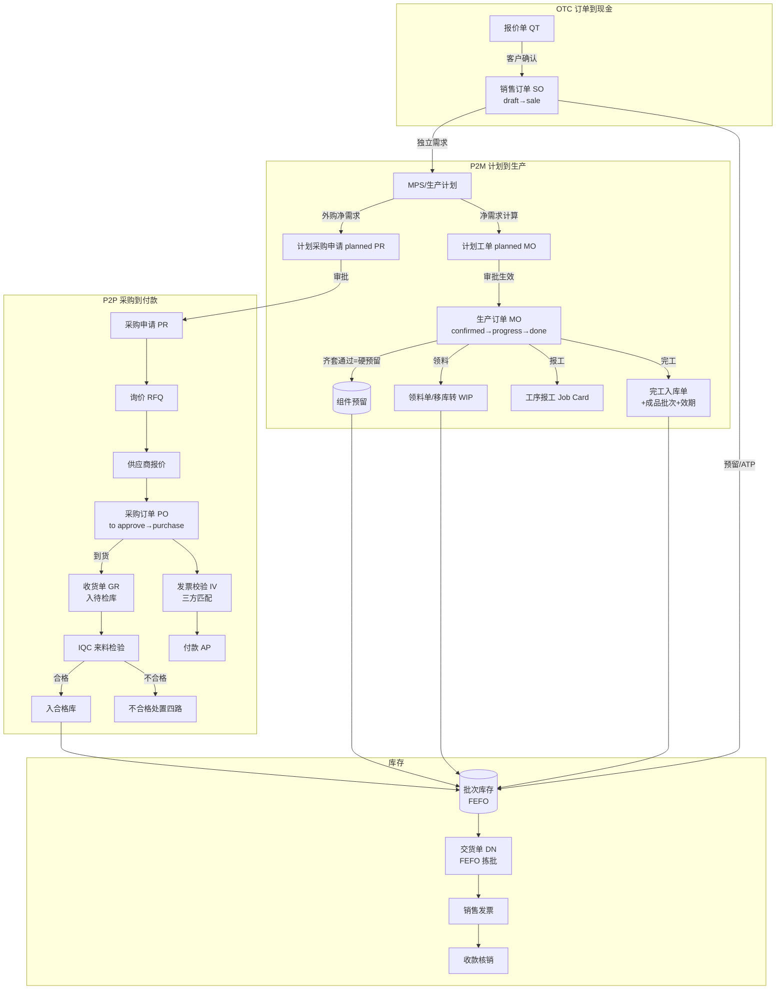
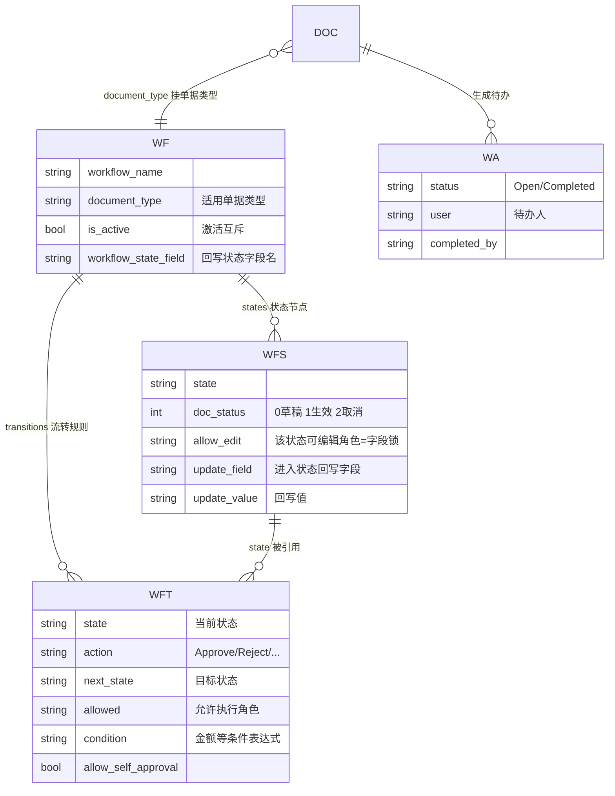
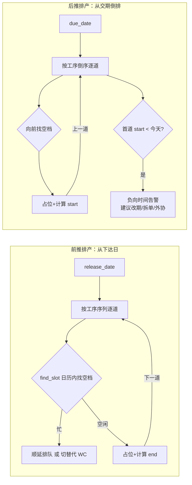
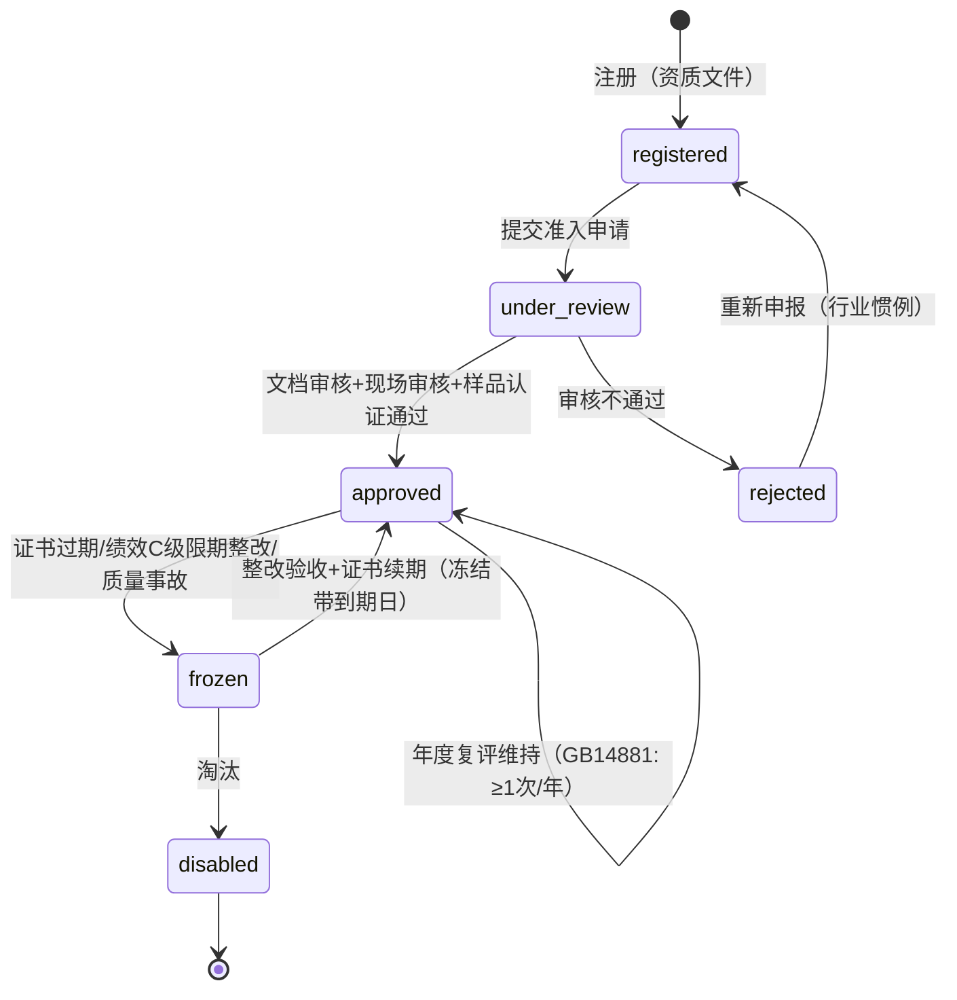

# 制造业 ERP/MES 完整业务闭环调研报告 —— 食品行业 KB+agent 订阅产品设计依据

> 研究日期：2026-09-25 | 来源：66+ 来源（四组并行深读，其中 40+ 一级来源含 Odoo 17 / ERPNext doctype 源码级核实）| 深度：Exhaustive
> 服务对象：食品行业 KB+agent 订阅产品（mobile AI 同事对话式录入 + NocoBase 开源版业务平台，禁 PRO 插件、无商业工作流引擎），目标客户为中小食品制造企业
> 既有资产衔接：[research/2026-09-14-mes-core-domain-model-nocobase.md](research/2026-09-14-mes-core-domain-model-nocobase.md)（生产订单/报工/追溯/CCP/OEE）、[research/2026-09-14-srm-food-nocobase.md](research/2026-09-14-srm-food-nocobase.md)（供应商七态/评级/证照）、[research/2026-09-14-wms-domain-model-nocobase.md](research/2026-09-14-wms-domain-model-nocobase.md)（FEFO/四日期/盘点快照）、[research/2026-09-15-crm-erp-domain-model.md](research/2026-09-15-crm-erp-domain-model.md)（O2C/P2P/计价/信用）、[research/2026-09-14-food-plm-domain-model.md](research/2026-09-14-food-plm-domain-model.md)（配方/BOM 三视图/ECR-ECN）

---

## 1. 执行摘要

本报告为「真实制造业完整业务闭环」补全 8 项设计依据：ERP 四大业务域（OTC/P2P/P2M/R2R）、无引擎审批流、有限产能排产（FCS）、MRP 与齐套、质量管理（IQC/IPQC/OQC + AQL + 8D/CAPA）、供应商全生命周期、库存实务深化、四类经营看板 KPI。证据以一级来源为主：Odoo 17 与 ERPNext 的官方文档及 doctype/模型源码逐字段核实（如 ERPNext Workflow 五表结构、Odoo `purchase_order.py` 的 `po_double_validation` 双级审批逻辑、Odoo 17 MO 的 `reservation_state` 齐套子状态），辅以 Microsoft Power Automate 官方审批语义、EU EC 852/2004 HACCP 七原则原文、FDA 21 CFR 117.315 记录保留条款、SQC Online 的 ANSI/ASQ Z1.4（≡ GB/T 2828.1）判定数组实跑取证。

三个最重要的结论：

**第一，轻量闭环的每一步都有「开源 ERP 本尊就是这么做的」的一级证据背书。** ERPNext（数万企业用户的开源 ERP）的官方产能规划就是「工作中心×班次日历 + 工序不跨天 + 忙则排队/切同类机」的日级贪心模型；其 MRP 核心公式官方原文即「Required = BOM 需求 − Projected Qty（现有+在制+在途）」；其审批流是纯数据表驱动的五表状态机（无代码、无引擎）；Odoo 官方明确支持 `manual valuation`（手工计价 = 台账与总账分离）——这直接支撑我们「NocoBase 数据表 + 状态机脚本 + mobile 对话卡」两层架构的合法性：**不是玩具简化，而是与成熟开源 ERP 同构的生产级裁剪**。

**第二，「未生效不得驱动下游」的卡口有一套可复制的四件套模式**（状态锚点 doc_status 0/1/2 + 生效锁定 allow_edit + 下游反查 button_cancel 遍历 + 源单状态前置校验），ERPNext 与 Odoo 双源验证，可统一落地为 NocoBase 下游创建钩子 `source_doc.doc_status == 1` 校验。

**第三，食品行业特有约束（批次双向追溯、四日期效期、FEFO、HACCP CCP 记录、进货查验记录保存期）全部可以落在「单据字段 + 状态机 + 定时任务」层面**，不需要特殊技术组件；欧盟 FDA 的记录保留要求（≥2 年）与中国《食品安全法》的「保质期满后 6 个月」要求只影响数据保留策略，不影响建模。

四组并行子任务的完整底稿已归档：[research/2026-09-25-b-group-approval-workflow-supplier-lifecycle.md](research/2026-09-25-b-group-approval-workflow-supplier-lifecycle.md)、[research/2026-09-25-d-group-quality-inventory-kpi-research.md](research/2026-09-25-d-group-quality-inventory-kpi-research.md)。本报告为四组结果 + 既有 5 份领域报告的交叉综合。

---

## 2. 关键发现

1. **单据状态机的「双轴分离」是业界共识**：Odoo SO 主状态（draft/sent/sale/cancel）+ `invoice_status`（no/invoiced/to invoice）三态；ERPNext SO 主状态 8 态 + Delivery/Billing Status 正交维度——「流程状态」与「开票/发货进度」必须分字段，部分发货/部分开票才可表达（[Odoo 17](https://www.odoo.com/documentation/17.0/applications/sales/sales.html)、[ERPNext Sales Order](https://docs.frappe.io/erpnext/sales-order)）。
2. **三方匹配（3-way match）的 Odoo 实现是「口径+三值+不阻断」**：qty_received 口径可配（received/ordered/billed），Should Be Paid = min(PO 单价×已收量, 账单额) 三值判断（已收单价/已开单价/PO 单价不一致 → Exception 标记但允许人工确认放行）——轻量版只需「数量匹配 + 金额容差 + 人工确认」三要素。
3. **ERPNext Workflow 是无引擎审批流的最佳范式**：Workflow（主表）/ Document State（状态节点，含 `doc_status` 0/1/2 生效锚点 + `allow_edit` 角色锁）/ Transition（state→action→next_state + `allowed` 角色 + `condition` Python 表达式如 `doc.grand_total <= 100000` + `allow_self_approval`）/ Workflow Action（待办）/ Version（历史快照）五表，源码级核实（[Workflow JSON](https://raw.githubusercontent.com/frappe/frappe/develop/frappe/workflow/doctype/workflow/workflow.json)）。
4. **金额阈值审批路由有现成源码**：Odoo `po_double_validation`（'one_step'/'two_step'）+ `po_double_validation_amount`（Minimum Amount），`button_confirm()` 内 `if order._approval_allowed(): button_approve() else: write({'state': 'to approve'})`（[purchase_order.py](https://raw.githubusercontent.com/odoo/odoo/17.0/addons/purchase/models/purchase_order.py)，一级源码）。
5. **FCS 轻量模型的上限由 ERPNext 本尊界定**：工序不跨天、日级时间桶、忙则排队或切替代工作中心（Odoo `alternative_workcenters` 官方字段）；前推 = 从 release date 顺序排，后推 = 从交期倒排并检测负向时间告警；`load[bucket][wc] > capacity[bucket][wc]` 即超载。
6. **MRP 轻量版可走「日结快照 + 计划单确认卡」模式**：ERPNext Production Plan 手工触发 + Odoo scheduler 定时跑批的混合，两家一级来源均背书；Odoo 的 JIT 窗口逻辑（`Forecasted Date = 今天 + Σ提前期`，窗口内需求才下单）是防早下单积压的关键设计。
7. **齐套检查与预留是同一动作的两面**：Odoo 17 MO 有 `reservation_state`（confirmed/assigned/confirmed_partial）子状态；ERPNext v16 WO 提交即自动生成硬预留（「预留库存仅可用于对应工单」官方原文）；算法 = 逐组件 `可用量(ATP) ≥ 需求×(1+损耗率)`，输出缺料清单（missing parts list）。
8. **AQL 抽样是查表问题不是算法问题**：GB/T 2828.1 ≡ ISO 2859-1 ≡ ANSI/ASQ Z1.4 同源自 MIL-STD-105E；批量 15 段 → 一般水平 II → 字码 → 样本量 n → Ac/Re 判定数组；食品常用「严重 0 + 主要 1.0 + 次要 2.5/4.0」（行业惯例）；切换规则（正常→加严：5 批中 2 批拒）驱动供应商级检验严格度联动。
9. **供应商准入 PO 卡口 = 四联查**：`∈ AVL(approved) AND 未冻结 AND 强制证书全部 valid`，ERPNext 在 RFQ 与 PO 两入口硬拦（Prevent RFQs/POs 字段官方存在）；绩效→分级→交易权限闭环由 Scorecard Standings 档位表直接配置「限制 RFQ/限制 PO」实现。
10. **库存预留的标准公式**：`可用量 = 现有 + 在途 − 预留`（Odoo 官方 Forecasted 公式）；盘点走「freeze→count→差異→审批→调整过账」，调整 = 移向 Inventory Loss 虚拟差异库位（Odoo 官方例证），不改历史移动。
11. **KPI 看板四类公式全部有权威定义**：OEE = 可用率×性能×质量（Nakajima TPM，世界级 85%）；FPY vs RTY 的区别 = 单工序 vs 多工序连乘；OTIF = 准时足量交付订单/总订单；库存周转率 = COGS/平均库存；账实相符率 = 1 − Σ|盘差|/Σ账面。
12. **诚实边界**：SAP MM 供应商评价默认权重（质量 40%/交付 30%/价格 20%/服务 10%）、各 KPI 目标基准值（OTD>95%、FPY≥98% 等）在四组调研中均未能取得 SAP/Oracle 官方原文（Bing 限流），已标注「行业惯例（未溯源）」，落地前建议购买方按自身客户群校准。

---

## 3. 详细分析（按 8 项调研问题组织）

### §1 ERP 四大业务域：单据链、状态机与跨域联动

#### 1.1 四域总览与核心单据

| 业务域 | 英文 | 核心单据链 | 状态机锚点 |
|---|---|---|---|
| 订单到现金 | OTC (Order to Cash) | 报价单 QT → 销售订单 SO → 交货单 DN → 销售发票 SI → 收款 PE | SO: draft→sale→done |
| 采购到付款 | P2P (Procure to Pay) | PR → RFQ → 供应商报价 → PO → 收货 GR → 来料检验 IQC → 发票校验 IV → 付款 AP | PO: draft→purchase→done |
| 计划到生产 | P2M (Plan to Produce) | 销售/预测 → Production Plan/MRP → 生产订单 MO → 领料 → 报工 → 完工入库 → 成本结算 | MO: draft→confirmed→progress→done |
| 记录到报告 | R2R (Record to Report) | 业务单据 → 会计凭证 → 总账 → 期末结账 → 报表 | （凭证层） |

**单据状态机（源码级，一级来源）**：

- **Odoo 17 销售订单**：`draft → sent → sale（确认）→ done（完成）`，侧翼 `cancel`；确认后进入 `locked`（锁定，PO 不可改）或 `unlock` 策略；开票进度独立字段 `invoice_status`（no/invoiced/to invoice）三态（[Odoo 17 Sales](https://www.odoo.com/documentation/17.0/applications/sales/sales.html)）。
- **Odoo 17 采购订单**：`draft → sent → to approve（金额超限）→ purchase（已批准）→ done（收货+开票完成）`，侧翼 `cancel`；`invoice_status` 同三态（[Odoo 17 Purchase](https://www.odoo.com/documentation/17.0/applications/inventory_and_mrp/purchase.html)）。
- **Odoo 17 生产订单 MO**：`draft → confirmed → progress（在制）→ to_close → done`，侧翼 `cancel`；**`reservation_state` 齐套子状态**（confirmed/assigned/confirmed_partial）独立于主状态（[Odoo 17 Manufacturing](https://www.odoo.com/documentation/17.0/applications/inventory_and_mrp/manufacturing.html)）。
- **ERPNext 工单 WO**：`Draft → Submitted(Open) → In Process → Completed → Stopped/Closed`；Required Items 三量跟踪 `Required → Transferred → Consumed`（[ERPNext Work Order](https://docs.frappe.io/erpnext/work-order)）。

（既有报告 [research/2026-09-15-crm-erp-domain-model.md](research/2026-09-15-crm-erp-domain-model.md) 已给出 ERPNext SO 的 8 主态 + Delivery/Billing 双正交维度，此处不重复。）

#### 1.2 跨域联动总图（单据驱动关系）



联动要点（卡口规则加粗）：
- SO 确认 → 生成独立需求 → MRP 展开（P2M 驱动）；**SO 必须为 `sale`（生效）状态才可驱动 MRP/预留**。
- MRP 净需求 → 计划工单/计划 PR → **人工在 mobile 对话卡确认后转正式单据（带审批）**。
- MO 完工 → 完工入库单 → 批次库存（生产日期+效期落批次）；**MO 未生效不可领料**。
- PO 到货 → 收货单入**待检库** → IQC 合格才入合格库；**IQC 未出结果前冻结流转**（ERPNext 强制卡点官方语义）。
- IV 三方匹配：PO 数量 × GR 已收量 × IV 账单额，不匹配 → Exception 人工确认。
- DN 拣货按 FEFO（按应下架日排序，见既有 WMS 报告四日期模型）。

#### 1.3 R2R 边界：台账与总账分离的官方依据

Odoo 官方在库存计价文档中明确支持 `manual valuation`（手工计价）：库存收发只记数量台账，不自动生成会计凭证（[Odoo 17 Inventory Valuation](https://www.odoo.com/documentation/17.0/applications/inventory_and_mrp/inventory/management/stock_valuation.html)）。这为我们的轻量决策提供一级证据：**业务闭环只做「数量台账 + 移动加权金额台账 + 应收应付余额」，不过账到复式总账**（与既有 CRM+ERP 报告结论一致）。制造成本轻量版 = MO 成本收集器（材料实领成本 + 人工/制费按工时×费率分摊），结算出「工单实际成本 vs BOM 标准成本」双列对比即可（ERPNext WO 的 Material Cost vs Actual Cost 双列即此模型）。

#### 1.4 食品行业特有约束（落在单据层）

- **批次双向追溯**：正反向追溯 = 同一套消耗记录两个查询方向；EU EC 852/2002 Article 5 要求 HACCP 七原则（危害分析→CCP 确定→关键限值→监控程序→纠偏措施→验证程序→记录保持程序）（[EUR-Lex EC 852/2002](https://eur-lex.europa.eu/legal-content/EN/TXT/?uri=celex%3A32002R0852)，一级原文）；FDA 21 CFR 117.315 要求记录保留 ≥ 2 年（[eCFR 117.315](https://www.ecfr.gov/current/title-21/chapter-I/subchapter-B/part-117/subpart-C/section-117.315)，一级）。
- **四日期效期模型**（Odoo 官方）：过期日 = 入库/生产日 + 保质期；最佳赏味期（Best before）；应下架日（removal date）= 过期日 − N 天；预警日（alert date）——FEFO 按**应下架日**而非过期日排序（[Odoo 19 FEFO](https://www.odoo.com/documentation/19.0/applications/inventory_and_mrp/inventory/shipping_receiving/removal_strategies/fefo.html)，一级；既有 WMS 报告同结论）。
- **入库剩余效期校验**：收货时校验供应商批次剩余效期 ≥ 阈值（如剩余 ≥ 2/3 保质期）——**行业惯例（未溯源）**，落地为收货行校验规则。
- **冷链温控**：温层是库位属性（常温/冷藏/冷冻），上架校验 SKU 温层与库位匹配（既有 WMS 报告已定论）；运输温控记录以「发货单附温度记录行」承载。
- **CCP 记录 = 检验单特例**：检验项 = CCP 参数、判定基准 = 关键限值 CL、读数 = 监控值（既有 MES 报告已定论，Odoo QCP Measure 型验证该建模）。
- **中国合规**：GB 14881-2025（2026-09-02 实施，见既有 SRM 报告）；《食品安全法》进货查验/出厂检验记录保存 ≥ 保质期满后 6 个月（无保质期 ≥ 2 年）。

#### 1.5 轻量版 vs 企业完整版取舍

| 维度 | 轻量可落地版（推荐） | 企业完整版（SAP 级） | 取舍依据 |
|---|---|---|---|
| 单据状态 | 每单据 3-6 个主状态 + 1-2 个正交进度字段 | 十余状态 + 子状态树 | Odoo/ERPNext 即 3-6 主态，够用 |
| 跨域驱动 | 下游创建钩子校验源单 doc_status=1 | 全链事件总线 + 幂等队列 | 单库低代码无需总线 |
| 成本核算 | 工单成本收集器双列对比 + 移动加权台账 | 多级 BOM 卷算 + 标准成本差异分析 + 总账集成 | manual valuation 官方背书分离 |
| 追溯 | 批次消耗关系表（单跳查询为主） | 图谱化血缘 + 秒级全链穿透 | 召回演练 2 小时口径（行业惯例）满足即可 |

---

### §2 审批流标准模式（无商业工作流引擎）

> 完整底稿（含全部字段表）：[research/2026-09-25-b-group-approval-workflow-supplier-lifecycle.md](research/2026-09-25-b-group-approval-workflow-supplier-lifecycle.md)

#### 2.1 数据层模型：三张配置表 + 两张运行时表（ERPNext 五表范式，源码级）



五表职责（字段全部核实自 frappe 源码 doctype JSON，一级）：
1. **Workflow 主表**：`workflow_name`/`document_type`/`is_active`（激活互斥：同 DocType 仅一条生效）/`workflow_state_field`（回写单据的状态字段名）。
2. **状态节点表**：`state` + **`doc_status`(0=Saved/1=Submitted/2=Cancelled)**——「生效」的官方锚点 + `allow_edit`(Role) 字段锁 + `update_field/update_value` 进入状态回写 + `is_optional_state`（Rejected 等不产生待办）。
3. **流转表**：`state→action→next_state` + `allowed`(Role 按角色解析审批人) + **`condition`（代码表达式，官方示例 `doc.grand_total <= 100000`）** + `allow_self_approval`（自审自批控制）。
4. **待办表 Workflow Action**：`status`(Open/Completed)/`user`/`reference_doctype+name`/`completed_by_role`。
5. **审批历史**：ERPNext/Odoo 均无独立审批记录表——用单据 Version 快照 + chatter 流水（Odoo 官方语："the chatter logs the history of the clicked buttons"）。**轻量版建议仍建独立 `approval_record` 表**（审计导出与 mobile 卡片渲染需要），这是对范式的合理增强而非偏离。

**NocoBase 落地表**：`approval_flow_config`(doc_type, condition_expr, is_active) + `approval_node`(state, doc_status, allow_edit_role, update_field/value) + `approval_transition`(state, action, next_state, allowed_role, condition, allow_self_approval) + `approval_record`(单据ID, node_seq, approver, action: approve|reject|delegate|comment, comment, acted_at, attempt_no) + `approval_todo`(doc_ref, user, state, status, due_date)。

#### 2.2 多级审批语义（Microsoft 官方四式）

[Power Automate approvals](https://learn.microsoft.com/en-us/power-automate/get-started-approvals)（一级）定义五类语义：**Everyone must approve**（会签，任一 reject 即终止）/ **First to respond**（或签）/ **Custom all/one** / **Sequential**（顺序，逐人）。金额阈值路由：Odoo 公司级 `po_double_validation` + `po_double_validation_amount`，`button_confirm()` 中超限即转 `to approve` 状态走二级（源码级）。「>10 万加一级总经理」= 经理节点配 `grand_total<=100000` 条件 + 总经理节点无条件，两条 transition 自然分流。

#### 2.3 委托/代理、驳回重提、催办

- **委托**：ERPNext/Odoo 开源版均无内建（已核实）；标准模式 `delegation(delegator, delegate, valid_from, valid_to, doc_type_scope)`，待办生成时命中有效期即替换 approver，记录双留痕（**行业惯例（未溯源）**）。
- **驳回重提两模式**：**整链重走**（金额/条款类修改 → 全员重新背书）vs **续走**（材料补充类 → 从驳回节点继续）；Odoo PLM 驳回 → 强制建 follow-up activity（驳回意见必填）→ 修改后回退一个 stage 重新进验证（一级）；续走需 `attempt_no` 区分轮次（惯例）。**建议默认整链重走**（审计干净），仅注释类补充走续走。
- **催办**：ERPNext Assignment Rule 支持 Python 条件 + Due Date Based On（基于单据日期自动设到期日）+ Priority 排序（一级）；Odoo 待办按 Late/Today/Future 计数提醒。加签（钉钉/飞书式）开源无内建——轻量实现：往 `approval_record` 插节点行，不动 flow_config。

#### 2.4 「未生效不得驱动下游」卡口四件套（双源验证）

1. **状态锚点**：`doc_status` 0/1/2；ERPNext 官方「A document cannot be canceled unless it is submitted」——未生效连取消都不行。
2. **生效锁定**：`allow_edit`(Role) 收窄编辑权 + `update_field/update_value` 回写；Odoo `po_lock='lock'` 锁定已确认 PO。
3. **生效前置**：Odoo PLM「Apply Changes 按钮在 Approve 前不可用」（一级）。
4. **下游反查**：Odoo `button_cancel` 遍历 `invoice_ids`，存在非 cancel/draft 账单即 `raise UserError`——**取消上游必查下游**（源码级）；ERPNext Buying Settings 全局强制「PO Required / PR Required」才能开票。

**统一落地规则**：下游创建钩子校验 `source_doc.doc_status == 1`；生效瞬间 = 锁字段 + 回写状态 + 生成下游/预留（事务内）。

#### 2.5 轻量版 vs 企业完整版

| 能力 | 轻量可落地版（推荐） | 企业完整版 |
|---|---|---|
| 审批链配置 | 三配置表 + 角色解析审批人 | 图形化设计器 + 组织架构 + 会签百分比 |
| 审批模式 | 顺序/会签/或签 + 金额条件路由 | 并行分支网关 + 聚合语义 + SLA 多级升级 |
| 委托 | 用户级换人 + 有效期 | 岗位级 + 工作量均衡 + 代理审批链 |
| 驳回 | 整链重走为主 + 驳回意见必填 | 任意节点回退 + 条件续走 + 撤回 |
| 卡口 | doc_status 锚点四件套 | 同左（该模式本就是企业级做法的提炼） |

---

### §3 有限产能排产 FCS（轻量版）

#### 3.1 地基：工作中心 / 工序路线 / 产能日历

- **工作中心**（两源对照）：ERPNext Workstation = `production_capacity`（并行 job 数）+ `working_hours`（多段班次）+ `holiday_list` + `operating_costs` 组件表（[Workstation](https://docs.frappe.io/erpnext/workstation)，一级）；Odoo Work Center = `working_hours`（绑资源日历）+ **`time_efficiency`（预计工时 = 基准工时 ÷ 效率%）** + `capacity` + `time_before_prod`（setup）/`time_after_prod`（清理）+ `cost_per_hour` + **`alternative_workcenters`（替代工作中心）**（[Work Centers](https://www.odoo.com/documentation/17.0/applications/inventory_and_mrp/manufacturing/advanced_configuration/using_work_centers.html)，一级）。
- **工序路线**：ERPNext Routing = 可复用模板挂 BOM（`operation`/`workstation`/`time` 分钟/`batch_size`/`sequence_id` 强制按序报工）；Odoo 17 无独立 Routing——工序内联在 BOM 的 Operations tab（支持 Copy Existing Operations 复用）。**轻量版取 Odoo 方案**（BOM 内联工序），与既有 MES 报告结论一致。
- **BOM 配方**：ERPNext 原生支持百分比配方（组件 qty = percentage/100 × 产出 qty，含 UOM 换算）——食品按比例缩放的关键能力；`scrap percentage` 行级损耗率；副产品 = Scrap 子表带 rate（v16 改名 Secondary Items）（[BOM](https://docs.frappe.io/erpnext/bill-of-materials)，一级）。

#### 3.2 时间桶模型与前推/后推算法

**占用模型**：工作中心 × 日历（工作日/班次/节假日）→ 时间桶（日或班次）；占用表 = 工单工序对工作中心时段的占用记录。



**工序时长公式**：`dur = setup + ceil(qty / batch_size) × run / time_efficiency`（综合 Odoo 效率公式 + ERPNext batch_size 摊销）。

**能力冲突检测**（每时间桶）：
```
load[bucket][wc]   = Σ 已排工序时长（含计划单）
capacity[bucket][wc] = 日历工时 × capacity并行数 − time_off
if load > capacity → 超载告警 → 平移策略：推后排队 / 切替代工作中心 / 拆分工单
```

**ERPNext 官方三规则**（[Production Plan Schedule](https://docs.frappe.io/erpnext/production-plan-schedule)，一级，算法级证据）：①父件不得早于子件完工；②生产不得早于原材料到货（采购提前期推后依赖链）；③机器不超过 Job Capacity——忙则排队或转移同类机器。**硬约束：每道工序必须同日开始同日结束（不跨天）**，排不进就要求拆分工单——这就是「日桶贪心」的生产级先例。**what-if 三段交互**：Preview（纯预览不落库，可反复改）→ Apply（写回每行 Planned Start/End + 日历条目）→ 冻结（Apply 后禁用，重排须先取消 WO）——极佳的 mobile 对话卡范本。

#### 3.3 轻量版 vs 企业完整版

| 维度 | 轻量可落地版（推荐） | 企业完整版（APS） |
|---|---|---|
| 时间粒度 | 日级时间桶（WC×日历→每日剩余工时） | 分钟级甘特 + 事件驱动重排 |
| 算法 | 贪心前推（ERPNext 本尊同款）+ 后推仅算「最晚开工日 = 交期 − 关键路径长」 | 瓶颈调度/遗传算法/多目标优化 |
| 冲突处理 | 排队顺延 + 替代 WC 下拉 | 自动替代路由 + 拆单 + 外协建议 |
| 交互 | what-if 预览表 → 确认写入（对话卡） | 拖拽甘特 + 实时重排 |
| 计算时机 | 事件触发（工单确认时增量排）+ 每日定时全量校验 | 实时 |

---

### §4 MRP 与齐套检查

#### 4.1 输入与核心公式

**输入清单**：独立需求（SO + 预测 + Material Request）、库存现有量、在途（未完 PO + 未完工单在制）、BOM（含损耗率/副产）、提前期（ERPNext 独立 Item Lead Time 文档：制造/采购分列；Odoo 提前期族：customer/sales security/purchase/manufacturing/security lead time + days to prepare MO 可自动汇总）、安全库存、批量策略。

**ERPNext 净需求公式**（[Production Plan](https://docs.frappe.io/erpnext/production-plan)，官方原文）：
```
Reqd Qty    = Required Qty (as per BOM) − Projected Qty
Projected Qty = 现有库存 + 未完工单在制 + 未完成 PO 在途
官方示例：需求100，库存50+在途PO20 → Required = 100 − 70 = 30
```

**完整流程分步（伪代码）**：
```
1. 收集独立需求：SO/预测按 物料×需求日期 聚合
2. 低层码排序（轻量替代：递归展开 + 按物料聚合去重——食品 BOM 仅 2-3 层）
3. 逐层展开：子需求 = 父净需求 × 用量 × (1+损耗率) − 副产出
4. 毛需求按时段合并独立需求
5. 净需求 = 毛需求 + 安全库存 − 现有 − 在途 + 已预留占用
6. 批量规则：LFL（逐单）/ FOQ（min-multiple 取整）/ POQ（期间合并）
7. 生成 planned MO / planned PR；开始日 = 需求日 − 提前期（后推偏置）
```

**Odoo 订货点法对照**（[Reordering rules](https://www.odoo.com/documentation/17.0/applications/inventory_and_mrp/inventory/warehouses_storage/replenishment/reordering_rules.html)，一级）：`Min/Max/Multiple Quantity`（**整数倍向上取整：Max=20、forecast=7 → 需 13 → 实订 15**）；Trigger = Auto（scheduler 定时跑批 或 SO 确认即时触发）/ Manual（报表人工确认）；**JIT 窗口：Forecasted Date = 今天 + Σ提前期，仅窗口内需求进入 To Order**；`0/0/1` 规则 = lot-for-lot 按单补货。SAP MRP types（PD 标准/M2 订货点/ND 手动）语义与之对应（**行业惯例（未溯源）**）。

**计算时机建议**：**每日定时快照**（日结 cron 对每物料算净需求 → 产出计划单建议 → mobile 对话卡确认转正式 MO/PR 带审批）+ SO 确认即时增量触发（可选）。ERPNext 报表提供周/日 bucket 视图但计算本质是事件驱动累加——bucket 只是展示维度，**日结快照完全可行**（两家一级来源均背书）。

#### 4.2 齐套检查（Material Availability Check）

**ATP 公式**（[Wikipedia ATP](https://en.wikipedia.org/wiki/Available-to-promise)）：`可用量 = 现有库存 + 计划接收 − 计划需求`；执行模式分实时逐单与批量周期两种（官方原文）——**齐套卡口用实时、MRP 用批量**，各取一种。CTP（capable-to-promise）= ATP 不足时假想插入产能+BOM 模拟，轻量版舍弃。

**Odoo 组件可用机制**（一级）：BOM 上 `Manufacturing Readiness` 二选一——「首工序组件可用」（部分齐套，绿色部分可用）或「全部组件可用」（全齐才绿）；MO 上 Component Status 智能按钮红/绿判定。

**齐套算法（伪代码）**：
```
for c in bom_items:
    demand    = qty_bom(c) × (1 + scrap_pct(c)) × wo_qty   # 损耗放大
    available = on_hand(source_wh, c) − hard_reserved(c)
    if available >= demand: 状态 = OK
    else: 缺料清单 += (c, demand − available, 建议到货日 = max(在途 ETA))
部分齐套 = 仅首工序组件 OK
```

**与预留的关系**：ERPNext v16 WO 勾选 Reserve Stock → **提交时自动对可用库存生成硬预留**（「预留库存仅可用于对应工单」官方原文）；领料后预留从源仓跟到 WIP 仓；完工自动对关联 SO 预留成品（[Stock Reservation for WO](https://docs.frappe.io/erpnext/stock-reservation-for-work-order)，一级）。**齐套通过 = 写预留表**，校验与锁料是同一动作的两面。

#### 4.3 轻量版 vs 企业完整版

| 维度 | 轻量可落地版（推荐） | 企业完整版 |
|---|---|---|
| BOM 展开 | 递归 2-3 层 + 聚合去重 | 低层码 + 多版本 BOM + 替代料自动替换 |
| 时段 | 日结快照（事件+定时混合） | 周期 bucket + 逐时段滚动 |
| 输出 | 计划单建议卡（人工确认转正式） | 自动转单 + 按令单消化 firm/planned order |
| 齐套 | 逐组件 ATP 校验 + 缺料清单 + 全齐/首工序两档 | CTP + 多仓聚合 + 批次级预留（FEFO 联动） |

---

### §5 质量管理（IQC / IPQC / OQC + AQL + 四路处置 + 8D/CAPA）

> 完整底稿：[research/2026-09-25-d-group-quality-inventory-kpi-research.md](research/2026-09-25-d-group-quality-inventory-kpi-research.md)；不合格处置单与质检单状态机在既有 MES 报告 §3.2 已建模，此处补 AQL/评级增量。

#### 5.1 检验单模型（两家对照，取长补短）

- **ERPNext**：Inspection Type 三分 = Incoming（IQC）/ In Process（IPQC，挂 Job Card）/ Outgoing（OQC）；**Readings 子表** = Parameter + Min/Max 数值公差 或 Acceptance Criteria（非数值）+ 多次读数 + 行级自动判定 + 公式判定（`mean < 15`）；**强制卡点**：Item 勾选检验条件后收/发货提交被阻止直至 QI 完成（[Quality Inspection](https://docs.frappe.io/erpnext/quality-inspection)、[Stock Inspection](https://docs.frappe.io/erpnext/stock-inspection)，一级）。
- **Odoo**：三对象 = Quality Check（一次检验：Control per = Operation/Product/Quantity+Lot；Type = Instructions/Pass-Fail/Measure/Take a Picture）← Quality Control Point（规则引擎：Products+Operations+Frequency = All/Randomly 按百分比/Periodically）→ Quality Alert（Root Cause + **Corrective/Preventive Actions 两个 Tab** + Kanban 流转）（[Quality Checks](https://www.odoo.com/documentation/17.0/applications/inventory_and_mrp/quality/quality_management/quality_checks.html)，一级）。
- **食品行业取长**：模板化读数（ERPNext 式）+ 控制点自动触发（Odoo 式）。

#### 5.2 AQL 抽样（GB/T 2828.1 ≡ ANSI/ASQ Z1.4 ≡ MIL-STD-105E）

- **判定逻辑**：抽 n 件，不合格数 d ≤ Ac 接收、d ≥ Re 拒收；批量 15 段（2-8 … 3201-10000 …）；检验水平 S-1~S-4 + I/II/III，**默认一般水平 II**（[SQC Online](https://www.sqconline.com/military-standard-105e-tables-sampling-attributes)，二级实跑）。
- **实测判定数组**（水平 II 单次正常）：

| 批量 | 字码 | n | AQL 1.0 | AQL 2.5 | AQL 4.0 |
|---|---|---|---|---|---|
| 151-280 | G | 32 | Ac1/Re2 | Ac2/Re3 | Ac3/Re4 |
| 281-500 | H | 50 | Ac1/Re2 | Ac3/Re4 | Ac5/Re6 |
| 501-1200 | J | 80 | Ac2/Re3 | Ac5/Re6 | Ac7/Re8 |

- **切换规则**（[Switching Rules](https://www.sqconline.com/switching-rules-mil-std-105e-z14)）：正常→加严 = 连续 5 批中 2 批拒；加严→正常 = 连续 5 批未被拒；加严下连续 5 批仍加严 → **停检**；正常→放宽 = 连续 10 批未被拒。注意「正常/加严/放宽」与「水平 I/II/III」是**两个正交维度**。
- **缺陷分级**：Critical（安全/违规）/ Major（失效影响销售）/ Minor（工艺瑕疵）；食品常用 **严重 0（0 收 1 拒）+ 主要 1.0 + 次要 2.5/4.0**（**行业惯例（未溯源）**）。
- **轻量落地**：`qmAqlPlan` 查找表（lotBand/level/code/n/aql/severity → Ac/Re）+ 供应商级切换计数器；只做单次抽样（企业版才需要双次/多次抽样+箭头规则）。

#### 5.3 不合格处置四路 + 8D/CAPA + 供应商评级

- **四路处置**：`IQC 不合格 → NC 处置单(pending)` → 四选一：**退货**（出库退供应商）/ **让步接收 concession**（审批人+理由+偏差记录，移库 冻结→合格）/ **返工 rework**（生成 Rework 工单，完工回检）/ **报废**（Scrap 过账至 Inventory Loss 虚拟库位 + 成本归集）→ `closed`（检验单+处置单+库存移动三方勾稽）。让步必填审批留痕；「让步 ≠ 偏差许可」（既有 MES 报告已定论）。
- **8D**（[Wikipedia Eight disciplines](https://en.wikipedia.org/wiki/Eight_disciplines_problem_solving)，Ford 1987）：D0 应急准备 → D1 组建团队 → D2 问题描述（5W2H 量化）→ D3 临时遏制 → D4 根因与逃逸点验证（Is/Is Not、5Why）→ D5 选择并验证永久纠正措施 → D6 实施+经验证据验证 → D7 预防再发（体系修订）→ D8 表彰。
- **CAPA 双轨**：纠正（corrective，已发生）vs 预防（preventive，未发生）；**闭环关键 = 有效性验证后才可关闭**（`effectivenessCheck 验证人+日期+证据`）；ERPNext Quality Action（Corrective/Preventive 类型 + Open/Closed）与 Odoo Alert 双 Tab 双源印证。
- **供应商绩效评级**：标准四维质量/交付/价格/服务（质量+交付是普适必有维度，[Wikipedia Supplier evaluation](https://en.wikipedia.org/wiki/Supplier_evaluation)）；SAP MM 默认权重 **质量 40%/交付 30%/价格 20%/服务 10%**（**行业惯例（未溯源）**——本次四组均未取得 SAP help 原文）；计算式：批合格率 = 合格批/总检验批、OTD-S = 准时到货批/总批；季度加权分 → A(≥90)/B(75-89)/C(60-74)/D(<60) → 与配额/限单/淘汰联动（分级阈值与既有 SRM 报告 A/B/C/D 多源一致，可互证）。ERPNext Scorecard **权重合计必须 = 100** + 公式变量（`total items received/accepted/rejected`）+ 官方强调除零防护；**Standings 档位表直接配置「限制 RFQ/限制 PO」**——绩效→分级→交易权限闭环（[Supplier Scorecard](https://docs.frappe.io/erpnext/supplier-scorecard)，一级）。

---

### §6 供应商全生命周期

#### 6.1 阶段模型与状态机



**ERPNext 字段级证据**（[Supplier](https://docs.frappe.io/erpnext/supplier)，一级）：`Block Supplier`（Hold Type: invoices/payments/**All** + **till specific date 冻结到期日**，状态 'On Hold'）；`Is Frozen`（冻结全部会计分录+指定角色可豁免）；`Disabled`（停用=淘汰）；**`Prevent RFQs, POs / Warn RFQs, POs`**（绩效档位硬拦/软警）。

**证书效期管理**：SC 生产许可/ISO 22000（覆盖食品链全环节，整合 HACCP+PRP；包材供应商适用 ISO/TS 22002 Part 1/Part 4，[Wikipedia ISO 22000](https://en.wikipedia.org/wiki/ISO_22000)）/HACCP 证书/检验报告；30/60/90 天预警 + 到期自动冻结拦单 = 把 ERPNext Hold 日期源换成 `expiry_date`（预警天数**行业惯例（未溯源）**；GB 14881-2025 复评要求见既有 SRM 报告）。

#### 6.2 PO 下单准入校验（四联查）与轻量取舍

**四联查规则**：`供应商 ∈ AVL(approved) AND 未冻结 AND 强制证书全部 valid AND 未被绩效档位拦单`。ERPNext 硬拦点在 **RFQ 与 PO 两入口**；Odoo 开源版无内建 AVL 强制（`product.supplierinfo` 仅价格）——我们的 AVL 校验需自建（本就是 NocoBase 状态机脚本的用武之地）。紧急特批路径：冻结豁免标记 + 更高审批级 + 事后 CAPA（**行业惯例**）。

**轻量版落地表**：`supplier(lifecycle_status, grade, is_critical_material)` + `supplier_certificate(cert_type, cert_no, expiry_date, status)` + `supplier_review(review_type: document|onsite|sample, checklist JSON, conclusion)` + `supScorecard`（季度物化，cron 汇总四维加权）。取舍：保留六态状态机+证书效期+PO 四联查+评分卡（权重和 100/分档/拦单）；简化 checklist 为 JSON 字段、绩效变量只取 4 个（准时交付率/合格率/拒收数/价格指数）；舍弃供应商门户自助申报、现场审核排程。

---

### §7 库存实务深化

#### 7.1 移库/转储

ERPNext Stock Entry Purpose 全枚举（一级）：Material Issue / Material Receipt / **Material Transfer** / Material Transfer for Manufacture / Manufacture / Repack / Send to Subcontractor。**在途两步**：Material Transfer 勾选 **Add to Transit** → 库存入在途态；收方建第二张 Material Transfer 引用 Outward GIT 单回链入库（[Goods in Transit](https://docs.frappe.io/erpnext/how-to-manage-material-transfers-and-goods-in-transit)，一级）。**轻量版**：`stockTransfer(one_step|two_step)`，两步由过账引擎生成两张移动（源→在途库、在途库→目的库）；在途差异走盘点调整（企业版才有在途对账+短溢差异单）。

#### 7.2 库存状态与预留

- **状态模型**：批次×库位 `status` 字段——**待检 quarantine**（收货后 IQC 前）→ **合格 unrestricted**（IQC 通过/让步）→ **冻结 blocked**（IQC 拒/质量警报，待处置）→ **报废**（Scrap 过账）；FEFO 拣货只扫 unrestricted；状态只许事件处理器改（IQC/处置单回写）（库位承载 = Odoo 一级证据，流转条件 = 行业惯例）。
- **预留**：`stockReservation(refType: SO|WO, status: reserved|consumed|released)`；**ATP = 现有 + 在途 − 预留**（Odoo 官方 Forecasted 公式，一级）；消耗时机 = 出库/领料过账（事务内）；取消单据即解除。Odoo Reservation Method 三式 = At Confirmation / Before Scheduled Date / Manually；ERPNext Auto Reserve on Purchase（收货提交即自动为 SO 预留）+ v16 WO 硬预留。**轻量版只做 hard 整行预留**，soft 用「可用量」展示层表达。

#### 7.3 盘点：循环 vs 冻结

- **循环盘点**（[Wikipedia Cycle count](https://en.wikipedia.org/wiki/Cycle_count)，二级）：选样法 = ABC/Pareto（按价值或动碰）/ usage-only / SPC（历史高不准品类）/ location audit；ABC 频率 **A 每月 / B 每季 / C 每半年**（通行排程，惯例）。
- **冻结盘点**：`freeze → 初盘 → 复盘 → 差异审批 → 调整过账`；盘点单创建时**冻结相关库位并快照账面数**，复盘对比快照而非实时库存（既有 WMS 报告 JeeWMS 拆解同结论）。
- **盘盈亏过账**（Odoo 一级例证）：调整 = 库存移向 **Inventory Loss 虚拟差异库位**（65 对 60 差 5 → 移 5 至差异库位），生成调整移动 + 差异科目，**不改历史移动**。轻量版：`stockCount(cycle|full; draft→counting→recount→approving→posted)` + 明细行 diff，审批过 → 过账引擎生成对手 = 差异虚拟库位的 adjustment。

#### 7.4 安全库存 / 再订货点

- **ROP = 提前期平均日耗 × 提前期天数 + 安全库存**（[Wikipedia Reorder point](https://en.wikipedia.org/wiki/Reorder_point)，二级）。
- **安全库存经典公式**：`SS = z_α × √(E(L)σ_D² + (E(D))²σ_L²)`（提前期与需求双随机）；提前期稳定简版 `SS = z × σ_D × √LT`（z=1.65 @ 95% 服务水平）（[Wikipedia Safety stock](https://en.wikipedia.org/wiki/Safety_stock)，二级）。
- **机制**：Odoo reordering rule min/max——低于 min 自动（automatic）或在报表中建议（manual）补至 max（一级）；ERPNext Item 的 Re-order Level/Qty + **每日 0 点批量生成 Material Request** 并通知采购/库存经理（一级）。**轻量版**：`itemReorder(min/max/leadTime/avgDailyUse/safetyStock)`，夜间 cron：可用 ≤ min → 生成补货建议（max − 可用）推送 mobile 一键转采购；人工 min/max + 30 天滚动均值即可（σ 滚动重估留给企业版）。

---

### §8 真实数据看板：四类 KPI 标准

> 全部公式与出处详见 [research/2026-09-25-d-group-quality-inventory-kpi-research.md](research/2026-09-25-d-group-quality-inventory-kpi-research.md) §D3。

#### 8.1 四类看板 KPI 总表

| 看板 | KPI | 公式 | 常见基准（惯例，未溯源处已标注） |
|---|---|---|---|
| 经营 | 毛利率 | (收入 − COGS) / 收入 | — |
| 经营 | 回款率 | 实收 / 到期应收 | ≥95% |
| 供应链 | **OTIF 准时足量交付率** | 准时足量交付订单数 / 总订单数 | ≥95% |
| 供应链 | 供应商准时到货率 OTD-S | 准时到货批次 / 总批次 | ≥95% |
| 供应链 | 采购提前期 | 到货日 − PO 日（P50/P90 双口径） | — |
| 供应链 | **库存周转率** | COGS / 平均库存（[Inventory turnover](https://en.wikipedia.org/wiki/Inventory_turnover)） | — |
| 供应链 | DIO 周转天数 | 365 / 周转率 | 食品 30-45 天 |
| 供应链 | 缺货率 | 缺货行次 / 需求行次 | <1-2% |
| 生产 | **产能利用率** | 实际产量工时 / 可用工时 | — |
| 生产 | **OEE** | 可用率 × 性能 × 质量（[Wikipedia OEE](https://en.wikipedia.org/wiki/Overall_equipment_effectiveness)；可用率=运行/计划、性能=实际/理论速度、质量=良品/总产） | 世界级 85%（Nakajima TPM） |
| 生产 | **FPY 一次合格率** | 无返工一次合格数 / 投产数（[First pass yield](https://en.wikipedia.org/wiki/First_pass_yield)：(90−5)/100=85%） | ≥95-98% |
| 生产 | RTY 直通率 | ∏FPYᵢ（多工序连乘；例 0.85×0.889×0.8125×0.8267=50.75%） | — |
| 生产 | 计划达成率 | 按时完工工单 / 计划工单 | — |
| 生产 | 食品特有：批次合格率 / 微生物检验通过率 | 合格批次/总批次；微生物通过批/总检批 | 微生物 ≥99% |
| 库存 | 呆滞库存占比 | 无移动 >90 天库存金额 / 总库存 | <10% |
| 库存 | **临期库存预警** | 剩余效期 <30 天（或 <1/3 保质期）批次清单 | 小时级扫描推送 |
| 库存 | **账实相符率** | 1 − Σ\|盘差\| / Σ账面 | ≥99.5% |
| 库存 | 库存资金占用 | Σ 批次数量 × 批次成本 | — |

#### 8.2 落地模式与取舍

**轻量版**：`kpiSnapshot` 物化表（看板类型 + KPI 编码 + 维度 + 值 + 计算日），**每晚 cron 全量重算**，mobile 驾驶舱只读 + 穿透明细链接；临期预警单独小时级 job 扫批次表推消息。数据源全部来自既有单据表（SO/DN/MO/报工/检验/盘点/批次），无需新建采集链路。**取舍**：企业版事件驱动实时看板 + 下钻单据 + 多维 OLAP；轻量版 T+1 快照满足中小食品厂经营复盘节奏（与既有移动端 v6 的「报告卡片」形态直接衔接）。

---

## 4. 反方观点与风险（Contrarian Views）

**必须诚实呈现的八条：**

1. **「轻量 = ERPNext 同构」不等于「轻量 = 够用」**：ERPNext 的产能规划「工序不跨天」是著名的使用痛点（跨天工序必须拆单）；Odoo 17 也仅在付费 P 授权下提供完整 MRP 甘特。我们的日桶贪心模型继承了同样的边界——烘焙类「长时发酵/杀菌跨班次」工序需要拆单约定，这是对客户必须前置沟通的产品边界，不是实现细节。
2. **Odoo/ERPNext 开源版自身都有缺口**，我们是在「有缺口的开源参照」上再做裁剪：Odoo 开源版无 AVL 强制（`product.supplierinfo` 仅价格）、无委托审批、无供应商评分卡；ERPNext 无 FCS 级甘特（v16 才有较完整 Job Card 时间日志）。B/C 组均已逐项核实——这些缺口必须由 NocoBase 状态机脚本自建，工作量应计入排期而非假设「开源有」。
3. **SAP 级证据链存在系统性缺口**：四组调研（含本组）在 Bing 限流下均未能取得 SAP help 的供应商评价默认权重（40/30/20/10）与 Source List 原文，全部标注「行业惯例（未溯源）」。若对外交付材料引用这些数字，必须注明来源等级，否则存在「以讹传讹的行业标准」风险。
4. **KPI 基准值的「惯例」可能是幸存者偏差**：OTD>95%、FPY≥98%、账实≥99.5% 等目标值广泛流传但未见权威原始出处；不同细分（冷冻 vs 常温、代工 vs 自有品牌）差异巨大。建议产品初期只做「趋势 + 同比环比」，不做「行业对标红绿灯」，避免给客户错误信号。
5. **对话式录入与审计合规的张力**：审批动作经 mobile 对话卡完成时，必须保证与 PC 端同等的留痕强度（approver/action/time/comment/due_date 五要素落库）。若 AI 代填意见，需明确「AI 起草 + 人工确认」边界，否则 HACCP/GFSI 审核场景（记录须「指定人员审查」，FAO 原则 4）可能不认。
6. **MRP 日结快照的滞后风险**：日结模式下，白天紧急插单的齐套判断依赖实时 ATP 卡口（§4.2），两者口径不一致会产生「MRP 说不缺、领料时缺」的矛盾——必须在齐套卡口与日结快照间建立同一预留表作为单一事实源，这是设计约束而非可选项。
7. **冻结盘点的业务中断成本被低估**：中小食品厂旺季（节前）不可能接受冻结盘点；循环盘点（ABC 动碰）才是主路径，全盘仅年检时配合第三方做。产品默认值应设为循环盘点，冻结盘点作为可选能力。
8. **「不过总账」的边界要在合同层面写清**：manual valuation（Odoo 官方支持）意味着我们的产品不产生会计凭证，客户财务仍需在金蝶/用友/代账侧记账。若销售话术暗示「替代财务系统」，将在收入确认与成本归集口径上产生纠纷——建议明确「业务台账 + 应收应付余额，非会计核算系统」。

---

## 5. 开放问题

1. **供应商绩效权重到底用什么**：SAP 40/30/20/10 未经溯源；建议在首个客户落地时用「质量 40/交付 30/价格 20/服务 10」起步，按季度评审调整，并把权重配置做成 `supScorecard.config`（NocoBase 配置表）而非硬编码。
2. **跨天工序的排产约定**：ERPNext 不跨天约束 vs 食品杀菌/发酵长工序的现实矛盾，需要在首个真实产线验证「拆单 + 工序内 buffer 天数」方案。
3. **AQL 切换规则自动化程度**：供应商级「连续 N 批」计数器逻辑简单，但「停检后恢复」流程（重新送样认证）与供应商生命周期状态机的联动细节未在开源参照中找到，需自行设计。
4. **批次级 vs 库位级预留**：ERPNext v16 预留已到批次级，我们轻量版「整行硬预留 + FEFO 拣批时才定批次」存在两个环节间的批次错配窗口（预留时未定批，拣料时批次被临期预警锁死）——需要预留表允许「批次可空 + 拣批时回填」的两段式。
5. **KPI 物化表的历史回填**：T+1 快照上线第一天无历史数据，看板空转；需要初始化脚本从单据表回算 90 天历史 KPI。
6. **多语言/多币种边界**：本次调研未覆盖进出口食品（报关/检疫单证、多币种三方匹配），若有出口型客户需补调研。

---

## 6. 来源清单（合并四组，按一级/二级分组）

**一级来源（官方文档 + 源码，40+）**：

| # | 来源 | URL |
|---|---|---|
| 1 | Odoo 17 Sales 文档 | odoo.com/documentation/17.0/applications/sales/sales.html |
| 2 | Odoo 17 Purchase 文档 | odoo.com/documentation/17.0/applications/inventory_and_mrp/purchase.html |
| 3 | Odoo 17 Manufacturing 文档 | odoo.com/documentation/17.0/applications/inventory_and_mrp/manufacturing.html |
| 4 | Odoo 17 Work Centers | odoo.com/documentation/17.0/applications/inventory_and_mrp/manufacturing/advanced_configuration/using_work_centers.html |
| 5 | Odoo 17 Bill of materials | odoo.com/documentation/17.0/applications/inventory_and_mrp/manufacturing/basic_setup/bill_configuration.html |
| 6 | Odoo 17 Work center time off | odoo.com/documentation/17.0/applications/inventory_and_mrp/manufacturing/workflows/work_center_time_off.html |
| 7 | Odoo 17 Lead times | odoo.com/documentation/17.0/applications/inventory_and_mrp/inventory/management/planning.html |
| 8 | Odoo 17 Reordering rules | odoo.com/documentation/17.0/applications/inventory_and_mrp/inventory/warehouses_storage/replenishment/reordering_rules.html |
| 9 | Odoo 17 Replenishment | odoo.com/documentation/17.0/applications/inventory_and_mrp/inventory/warehouses_storage/replenishment.html |
| 10 | Odoo 17 Reservation At confirmation | odoo.com/documentation/17.0/applications/inventory_and_mrp/inventory/shipping_receiving/reservation_methods/at_confirmation.html |
| 11 | Odoo 17 Inventory valuation（manual valuation 依据） | odoo.com/documentation/17.0/applications/inventory_and_mrp/inventory/management/stock_valuation.html |
| 12 | Odoo 17 Location types（Inventory Loss/Scrap 库位） | odoo.com/documentation/17.0/applications/inventory_and_mrp/inventory/warehouses_storage/inventory_management.html |
| 13 | Odoo 17 Quality Checks | odoo.com/documentation/17.0/applications/inventory_and_mrp/quality/quality_management/quality_checks.html |
| 14 | Odoo 17 PLM Approvals | odoo.com/documentation/17.0/applications/inventory_and_mrp/plm/management/approvals.html |
| 15 | Odoo 17 Kits | odoo.com/documentation/17.0/applications/inventory_and_mrp/manufacturing/advanced_configuration/kit_shipping.html |
| 16 | Odoo purchase_order.py（po_double_validation 源码） | raw.githubusercontent.com/odoo/odoo/17.0/addons/purchase/models/purchase_order.py |
| 17 | Odoo res_config_settings.py | raw.githubusercontent.com/odoo/odoo/17.0/addons/purchase/models/res_config_settings.py |
| 18 | ERPNext Sales Order | docs.frappe.io/erpnext/sales-order |
| 19 | ERPNext Work Order | docs.frappe.io/erpnext/work-order |
| 20 | ERPNext Bill of Materials | docs.frappe.io/erpnext/bill-of-materials |
| 21 | ERPNext Routing | docs.frappe.io/erpnext/routing |
| 22 | ERPNext Workstation | docs.frappe.io/erpnext/workstation |
| 23 | ERPNext Capacity Planning | docs.frappe.io/erpnext/capacity-planning |
| 24 | ERPNext Production Plan（净需求公式原文） | docs.frappe.io/erpnext/production-plan |
| 25 | ERPNext Production Plan Schedule（排产三规则） | docs.frappe.io/erpnext/production-plan-schedule |
| 26 | ERPNext MRP | docs.frappe.io/erpnext/material-requirements-planning-mrp |
| 27 | ERPNext Stock Reservation for Work Order | docs.frappe.io/erpnext/stock-reservation-for-work-order |
| 28 | ERPNext Stock Entry / Purpose / Goods in Transit | docs.frappe.io/erpnext/stock-entry 与 stock-entry-purpose 与 how-to-manage-material-transfers-and-goods-in-transit |
| 29 | ERPNext Quality Inspection / Stock Inspection | docs.frappe.io/erpnext/quality-inspection 与 stock-inspection |
| 30 | ERPNext Quality Action / Non Conformance | docs.frappe.io/erpnext/quality_action 与 non-conformance |
| 31 | ERPNext Workflows / Workflow Actions | docs.frappe.io/erpnext/workflows 与 workflow-actions |
| 32 | Frappe Workflow doctype JSON（源码级五表） | raw.githubusercontent.com/frappe/frappe/develop/frappe/workflow/doctype/ 下 workflow / workflow_document_state / workflow_transition / workflow_action 四个 .json |
| 33 | ERPNext Supplier（Block/Frozen/Prevent POs） | docs.frappe.io/erpnext/supplier |
| 34 | ERPNext Supplier Scorecard | docs.frappe.io/erpnext/supplier-scorecard |
| 35 | ERPNext Assignment Rule（催办/到期日） | docs.frappe.io/erpnext/assignment-rule |
| 36 | ERPNext Item（Re-order 每日批量生成） | docs.frappe.io/erpnext/item |
| 37 | Microsoft Power Automate approvals（审批语义四式） | learn.microsoft.com/en-us/power-automate/get-started-approvals |
| 38 | Odoo 19 FEFO（removal date 四日期） | odoo.com/documentation/19.0/applications/inventory_and_mrp/inventory/shipping_receiving/removal_strategies/fefo.html |
| 39 | EUR-Lex EC 852/2002（HACCP 七原则原文） | eur-lex.europa.eu/legal-content/EN/TXT/?uri=celex%3A32002R0852 |
| 40 | eCFR 21 CFR 117.315（记录保留 ≥2 年） | ecfr.gov/current/title-21/chapter-I/subchapter-B/part-117/subpart-C/section-117.315 |

**二级来源**：

| # | 来源 | URL |
|---|---|---|
| 41 | Wikipedia: Material requirements planning（含 Orlicky 1975） | en.wikipedia.org/wiki/Material_requirements_planning |
| 42 | Wikipedia: Available-to-promise | en.wikipedia.org/wiki/Available-to-promise |
| 43 | Wikipedia: Reorder point / Safety stock | en.wikipedia.org/wiki/Reorder_point 与 Safety_stock |
| 44 | Wikipedia: Overall equipment effectiveness（Nakajima） | en.wikipedia.org/wiki/Overall_equipment_effectiveness |
| 45 | Wikipedia: First pass yield（FPY/RTY 实例） | en.wikipedia.org/wiki/First_pass_yield |
| 46 | Wikipedia: Inventory turnover | en.wikipedia.org/wiki/Inventory_turnover |
| 47 | Wikipedia: Cycle count | en.wikipedia.org/wiki/Cycle_count |
| 48 | Wikipedia: Acceptance sampling / AQL | en.wikipedia.org/wiki/Acceptance_sampling 与 Acceptable_quality_limit |
| 49 | Wikipedia: Eight disciplines problem solving（8D） | en.wikipedia.org/wiki/Eight_disciplines_problem_solving |
| 50 | Wikipedia: Supplier evaluation / ISO 22000 | en.wikipedia.org/wiki/Supplier_evaluation 与 ISO_22000 |
| 51 | SQC Online MIL-STD-105E 判定数组实跑 + 切换规则 | sqconline.com/military-standard-105e-tables-sampling-attributes 与 switching-rules-mil-std-105e-z14 |

**「行业惯例（未溯源）」汇总**（四组调研均未取得权威原文，落地前建议客户校准）：SAP MM 供应商评价默认权重 40/30/20/10 与子标准；SAP Source List(EORD) 细节；SAP substitution 委托规则；证书效期预警天数（30/60/90）；食品 AQL 常用值（严重 0/主要 1.0/次要 2.5-4.0）；KPI 目标基准（OTD>95%、FPY≥98%、账实≥99.5%、呆滞<10%、DIO 30-45 天）；入库剩余效期阈值；EBOM/MBOM 双版本管理；SAP MRP types（PD/M2/ND）；CTP 形式化定义；低层码形式化定义；循环盘点 ABC 频率（A 月/B 季/C 半年）；「入库日期+供应商+序号」自编批号惯例；召回演练 2 小时口径。

**既有仓库报告（交叉引用，本次结论的互证基础）**：[research/2026-09-14-mes-core-domain-model-nocobase.md](research/2026-09-14-mes-core-domain-model-nocobase.md)（46+ 来源）、[research/2026-09-14-srm-food-nocobase.md](research/2026-09-14-srm-food-nocobase.md)（48 来源）、[research/2026-09-14-wms-domain-model-nocobase.md](research/2026-09-14-wms-domain-model-nocobase.md)、[research/2026-09-15-crm-erp-domain-model.md](research/2026-09-15-crm-erp-domain-model.md)（40+ 来源）、[research/2026-09-14-food-plm-domain-model.md](research/2026-09-14-food-plm-domain-model.md)。

---

## 7. 方法论

- **架构**：主任务（范围校准 + 网络侦察 + 既有资产盘点 + 交叉综合）+ 4 组并行深读子任务（A：四大业务域 + 食品约束；B：审批流 + 供应商生命周期；C：BOM/FCS/MRP/齐套；D：质量/库存/KPI）。四组各自独立发现 → 深读 → 返回结构化摘要与来源，主任务交叉去重后综合；B/D 两组另落盘完整底稿（[B 组](research/2026-09-25-b-group-approval-workflow-supplier-lifecycle.md)、[D 组](research/2026-09-25-d-group-quality-inventory-kpi-research.md)）。
- **搜索引擎与降级**：规则首选 DuckDuckGo，但本网络环境下 duckduckgo.com 与 html.duckduckgo.com 均 ERR_SSL_PROTOCOL_ERROR（主任务两次实测），降级 Bing（英文关键词 + site: 操作符避免地区化偏差）。四组并行时 Bing 出现间歇性限流，子任务按预案改走「官方文档索引遍历 + raw.githubusercontent.com 源码直读 + SQC Online 计算器实跑」取证——这反而提高了证据等级（多个结论取得源码级字段而非文档转述）。
- **证据分级**：一级 = 官方文档/源码/法规原文（40+）；二级 = Wikipedia/SQC Online（11）；无法溯源的共识性数字统一标注「行业惯例（未溯源）」并汇总（§6 末），不做无来源断言。
- **限制**：help.sap.com 与 docs.oracle.com 在限流窗口内未取得目标页面原文（SAP 权重、Source List），为本次最大证据缺口；金蝶/用友中文一手文档未纳入（与既有 09-15 报告的中文源互补）；AQL 仅覆盖单次抽样（双次/多次抽样未取证）。
- **检索规模**：约 25 次 Bing 发现查询 + 60+ 页面深读（四组合计），最终引用 51 项外部来源 + 5 份仓库既有报告。
