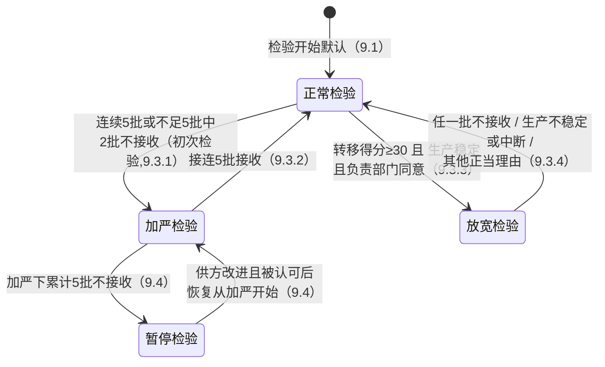
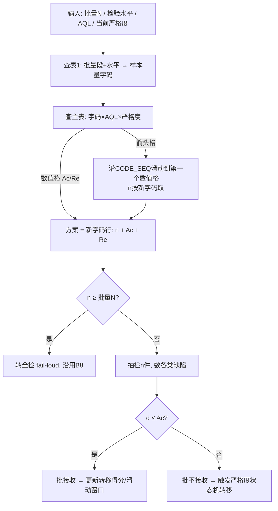

# GB/T 2828.1（ISO 2859-1:1999, IDT）抽样检验域研究报告 —— W2 批次规划输入

> 研究日期：2026-09-27 | 来源：8 个来源（含标准原文扫描件逐页视觉核读 + 程序化全量查询） | 深度：Thorough
> 委派背景：B8 批次已实现 AQL 抽样检验（仅批量段 ≤1200 三段实测、严格度仅 normal↔tightened），W2 批次需补全 15 批量段 + 箭头规则 + 放宽/停检转换。

---

## 1. 执行摘要

本次调研以 **GB/T 2828.1—2012 标准原文扫描件**（等同采用 ISO 2859-1:1999，来源为食品伙伴网标准预览的内嵌 PDF，本地留存于 `/tmp/gbt2828/gbt2828.pdf`）为第一优先级证据源，对封面、第 9～13 章、表 1、表 2-A/2-C 等关键页进行了高分辨率视觉核读，并用 SQC Online 的 ISO 2859-1 程序化查询接口对 **15 批量段 × AQL{0.65,1.0,1.5,2.5,4.0} × {正常,加严} + AQL{1.0,2.5}×放宽** 共 105 个组合做了全量点验，两源交叉一致后才录入本报告。

三个对 W2 实现有直接影响的裁定结论：
1. **停检口径裁定**：现行 GB/T 2828.1—2012 第 9.4 条为「**加严检验的一系列连续批中，不接收批的累计数达到 5 批**」→ 暂停检验（累计口径，非连续口径、非 10 批）。「连续 10 批」说法源自旧版体系（GB 2828-87 / ISO 2859-1:1989 / MIL-STD-105E 时代的放宽界限数与停检规则），不适用于 2012 版。
2. **正常→放宽机制更换**：现行版用「**转移得分 ≥30**」机制（第 9.3.3.2 条），**不存在界限数表（DL 表）**；「连续 10 批合格 + 界限数表」是旧版规则。若 B8/W2 代码中留有界限数表设计，应整体废弃，改实现转移得分累加器。
3. **批量段首两段为 2~8 / 9~15**（GB/T 2828.1—2012 原文表 1，两次独立高分辨率读数一致；SQC Online ISO 2859-1 计算器批量下拉同为 2 to 8 / 9 to 15）。用户任务书中的「2~9 / 10~15」与原文不符，疑似来自 ANSI/ASQ Z1.4 体系或网络讹传（详见 §4.1 差异裁定）。

另有两个实现级事实：GB/T 2828.1—2012 的**放宽检验主表（表 2-C）不存在「间隙对」（全部 Re=Ac+1）**，因此 GB 体系内没有 ANSI Z1.4 的「Ac<d<Re 附条件合格」概念；样本量 ≥ 批量时应转为全检。

---

## 2. 关键发现

1. **表 1 样本量字码（一般检验水平 II）15 段完整拿到**：字码序列 A,B,C,D,E,F,G,H,J,K,L,M,N,P,Q（跳 I），对应样本量 2,3,5,8,13,20,32,50,80,125,200,315,500,800,1250（第 16 字码 R=2000 只出现在水平 III 的 500001+ 段）。来源：标准原文表 1（正文页 14）双读 + [SQC Online](https://www.sqconline.com/iso-2859-1-tables-sampling-attributes) 选项核验。
2. **箭头规则原文口径**（第 10.3 条注）：字码与 AQL 交叉处若为箭头，沿箭头方向取**第一个出现的 Ac/Re**，然后**由该 Ac/Re 所在行向左读新字码、按新字码取样本量 n**——即方案整体随箭头平移到新字码行，n 用新字码的 n，Ac/Re 用新字码行的值。来源：标准原文正文页 10。
3. **停检 = 加严下累计 5 批不接收**（9.4），恢复检验从加严开始；图 1 转移简图与正文双读一致。来源：标准原文章 9（正文页 8-9）+ [SQC Online Switching Rules (ISO 2859-1)](https://www.sqconline.com/switching-rules-iso-2859-1)（"5 batches not accepted while on tightened inspection"）。
4. **正常→放宽 = 转移得分≥30 且生产稳定 且负责部门同意**（9.3.3）。转移得分规则（一次抽样）：Ac≥2 时按「AQL 加严一级仍接收」+3 否则清零；Ac=0/1 时批接收 +2 否则清零。来源：标准原文 9.3.3.2（正文页 9）。
5. **正常→加严 = 「连续 5 批或不足 5 批中有 2 批不接收」（初次检验，不含再提交批）**（9.3.1）；**加严→正常 = 接连 5 批接收**（9.3.2）；**放宽→正常 = 任一批不接收 / 生产不稳定或中断 / 其他正当理由**（9.3.4，任一即转）。
6. **放宽表无间隙对、无附条件合格**：表 2-C（正文页 17）三源核读（原文 110dpi 全页 + 220dpi 裁剪 + SQC Online 程序数据）一致，全部 Ac/Re 紧邻（Re=Ac+1）；放宽样本量序列独立于正常表：A~R = 2,2,2,3,5,8,13,20,32,50,80,125,200,315,500,800。
7. **中文网络数据污染严重**：百度文库、道客巴巴、doc360 等平台大量标注「GB/T 2828.1-2012」的表格实为 GB 2828-87 旧表（批量段 2~8/9~15 一致但主表 Ac/Re 与箭头布局不同）；苏州泛越查询工具（finesz.com）自称 2012 版但其 AQL 1.0×小批量结果未做箭头偏移（留言区已有用户指出错误）。**W2 录入数据不得以中文转载文档为据**，应以本报告所附双源交叉数据为准。
8. MIL-STD-105E / ANSI Z1.4 / ISO 2859-1 三体系基本表同源（NIST 手册确认 [NIST e-Handbook §6.2.3.1](https://www.itl.nist.gov/div898/handbook/pmc/section2/pmc231.htm)），但 ISO 2859-1:1999 相对 105E 有系统性修订（转移得分取代界限数、停检 5 批口径等），GB/T 2828.1—2012 跟随 1999 版。

---

## 3. 详细分析

### 3.1 表 1 样本量字码（GB/T 2828.1—2012 表 1，一般检验水平 II 重点）

标准原文（正文页 14）双读一致，SQC Online 批量下拉（15 档）核验通过：

| # | 批量范围 | 水平Ⅰ | **水平Ⅱ** | 水平Ⅲ | **水平Ⅱ 的 n** |
|---|---------|------|-----------|-------|---------------|
| 1 | 2～8 | A | **A** | B | 2 |
| 2 | 9～15 | A | **B** | C | 3 |
| 3 | 16～25 | B | **C** | D | 5 |
| 4 | 26～50 | C | **D** | E | 8 |
| 5 | 51～90 | C | **E** | F | 13 |
| 6 | 91～150 | D | **F** | G | 20 |
| 7 | 151～280 | E | **G** | H | 32 |
| 8 | 281～500 | F | **H** | J | 50 |
| 9 | 501～1200 | G | **J** | K | 80 |
| 10 | 1201～3200 | H | **K** | L | 125 |
| 11 | 3201～10000 | J | **L** | M | 200 |
| 12 | 10001～35000 | K | **M** | N | 315 |
| 13 | 35001～150000 | L | **N** | P | 500 |
| 14 | 150001～500000 | M | **P** | Q | 800 |
| 15 | 500001 及以上 | N | **Q** | R | 1250 |

（水平Ⅰ/Ⅲ列同时录自原文；字码全集 A~R 跳 I，第 16 档 R 的 n=2000 在水平Ⅱ下不可达，仅水平Ⅲ 500001+ 段出现。）

> ⚠️ **批量段口径警告**：任务书所写「2~9 / 10~15」与原文「2~8 / 9~15」不符。GB/T 2828.1—2012 原文（110dpi 与 220dpi 两次独立读数）与 SQC Online ISO 2859-1 计算器均为 2~8 / 9~15 起。「2~9/10~15」疑来自 ANSI/ASQ Z1.4 体系（待标准原文复核，见 §5）。**建议 W2 以 2~8 / 9~15 录入**；若后续以纸质正版标准复核发现差异，仅影响首两段边界值 4 个数字。

### 3.2 箭头规则精确语义 + 数字例

**原文口径**（第 10.3 条检索方法注，正文页 10）：

> 「若在相交处是箭头，则沿着箭头方向读出箭头所指的第一个接收数 Ac 和拒收数 Re，然后由此接收数和拒收数所在行向左，在样本量栏内读出相应的样本量 n」；「应使用表中箭头所指的接收数和拒收数所在行的字码，此时应按新的样本量字码所对应的样本量而不是按原来的样本量字码所对应的样本量」。

语义拆解（W2 可直接实现）：
- **向下箭头（↓）**：沿「样本量字码序列」向 n 增大方向滑动，跳过所有箭头格，停在第一个含 Ac/Re 数值的字码行；方案 = {新字码的 n, 该格 Ac/Re}。
- **向上箭头（↑）**：同理向 n 减小方向滑动。
- 箭头方向在印刷表内是**逐格标注**的（同一列中 ↑ 块与 ↓ 块可以相邻，各指向距离最近的数值格），所以箭头块内任意行解析结果一致。
- 若解析后的 n ≥ 批量 N：转为全检（表 2-A 脚注；SQC Online 亦提示）。

**数字例（正常检验、水平Ⅱ、一次抽样，SQC Online 程序化点验）**：

| 例 | 批量 | 字码(基础 n) | AQL | 原始格 | 箭头解析后最终方案 |
|---|------|-------------|-----|--------|-------------------|
| 1 | 200 | G (32) | 1.0 | G 行 AQL1.0 = ↓ | **n=50, Ac=1, Re=2**（滑到 H 行） |
| 2 | 150 | F (20) | 1.0 | F 行 = ↑ | **n=13, Ac=0, Re=1**（滑到 E 行） |
| 3 | 2000 | K (125) | 2.5 | K 行 = 本体数值 | **n=125, Ac=7, Re=8**（无箭头） |
| 4 | 90 | E (13) | 0.65 | E 行 = ↑ | **n=20, Ac=0, Re=1**（滑到 F 行） |
| 5 | 600000 | P (800) | 2.5 | P 行 = ↑ | **n=500, Ac=21, Re=22**（滑到 N 行） |

例 1 与例 2 恰好演示了同一列（AQL 1.0）中 01 数值格（E 行）上方为 ↑ 指入、下方邻格（G 行）为 ↓ 指出的真实布局——F 行 ↑ 回到 E 行的 01，G 行 ↓ 跳到 H 行的 12。

### 3.3 常用 AQL 主表数据（正常检验、水平Ⅱ、一次抽样，最终方案表）

数据来源：[SQC Online ISO 2859-1 计算器](https://www.sqconline.com/iso-2859-1-tables-sampling-attributes) 15 段全量程序化查询（2026-09-27），并与标准原文表 2-A 视觉读数锚点（K 行 AQL2.5=7/8、N 行 AQL2.5=21/22、Q 行 AQL1.0=21/22 等）交叉一致。**下表均为箭头解析后的可用方案**（n, Ac, Re）：

| 批量段 | AQL 0.65 | AQL 1.0 | AQL 1.5 | AQL 2.5 | AQL 4.0 |
|--------|----------|---------|---------|---------|---------|
| 2~8 | 20, 0, 1 | 13, 0, 1 | 8, 0, 1 | 5, 0, 1 | 3, 0, 1 |
| 9~15 | 20, 0, 1 | 13, 0, 1 | 8, 0, 1 | 5, 0, 1 | 3, 0, 1 |
| 16~25 | 20, 0, 1 | 13, 0, 1 | 8, 0, 1 | 5, 0, 1 | 3, 0, 1 |
| 26~50 | 20, 0, 1 | 13, 0, 1 | 8, 0, 1 | 5, 0, 1 | 13, 1, 2 |
| 51~90 | 20, 0, 1 | 13, 0, 1 | 13, 1, 2 | 20, 1, 2 | 13, 1, 2 |
| 91~150 | 20, 0, 1 | 13, 0, 1 | 20, 2, 3 | 20, 1, 2 | 20, 2, 3 |
| 151~280 | 20, 0, 1 | 50, 1, 2 | 32, 3, 4 | 32, 2, 3 | 32, 3, 4 |
| 281~500 | 50, 1, 2 | 50, 1, 2 | 50, 5, 6 | 50, 3, 4 | 50, 5, 6 |
| 501~1200 | 80, 1, 2 | 80, 2, 3 | 80, 7, 8 | 80, 5, 6 | 80, 7, 8 |
| 1201~3200 | 125, 2, 3 | 125, 3, 4 | 125, 10, 11 | 125, 7, 8 | 125, 10, 11 |
| 3201~10000 | 200, 3, 4 | 200, 5, 6 | 200, 14, 15 | 200, 10, 11 | 200, 14, 15 |
| 10001~35000 | 315, 5, 6 | 315, 7, 8 | 315, 21, 22 | 315, 14, 15 | 315, 21, 22 |
| 35001~150000 | 500, 7, 8 | 500, 10, 11 | 500, 21, 22 | 500, 21, 22 | 315, 21, 22 |
| 150001~500000 | 800, 10, 11 | 800, 14, 15 | 800, 21, 22 | 500, 21, 22 | 315, 21, 22 |
| 500001+ | 1250, 14, 15 | 1250, 21, 22 | 800, 21, 22 | 500, 21, 22 | 315, 21, 22 |

规律备注（便于 W2 自检）：正常表 Ac 序列沿对角线为 01,12,23,34,56,78,1011,1415,2122；数值格大致满足 n×AQL% ≈ Ac 对应期望（如 21/22 档对应 n×AQL≈12~31）；↑ 块集中在大字码×小 AQL 的右上区（主表封顶 21/22），↓ 块集中在小字码×小 AQL 的左下区。

**加严检验（表 2-B 口径，AQL 1.0 与 2.5 两列，最终方案）**：

| 批量段 | AQL 1.0 加严 | AQL 2.5 加严 |
|--------|--------------|--------------|
| 2~8 … 91~150 | 20, 0, 1 | 8, 0, 1 |
| 151~280 … 501~1200 | 80, 1, 2 | 32, 1, 2（26~50 起即 8,0,1；51~90 起为 32,1,2） |
| 1201~3200 | 125, 2, 3 | 125, 5, 6 |
| 3201~10000 | 200, 3, 4 | 200, 8, 9 |
| 10001~35000 | 315, 5, 6 | 315, 12, 13 |
| 35001~150000 | 500, 8, 9 | 500, 18, 19 |
| 150001~500000 | 800, 12, 13 | 500, 18, 19 |
| 500001+ | 1250, 18, 19 | 500, 18, 19 |

（加严 AQL2.5 完整序列：2~50 → 8,0,1；51~280 → 32,1,2；281~500 → 50,2,3；501~1200 → 80,3,4；1201~3200 → 125,5,6；3201~10000 → 200,8,9；10001~35000 → 315,12,13；35001+ → 500,18,19。加严 Ac 序列：01,12,23,34,56,78,89,1213,1819,2122，普遍比正常表同格低一档。）

**放宽检验（表 2-C 口径，AQL 1.0 与 2.5 两列，最终方案）**：

| 批量段 | AQL 1.0 放宽 | AQL 2.5 放宽 |
|--------|--------------|--------------|
| 2~8 … 91~150 | 5, 0, 1 | 2, 0, 1（2~50）；13, 1, 2（51~150） |
| 151~280 … 501~1200 | 32, 1, 2 | 20, 2, 3（281~500）；32, 3, 4（501~1200） |
| 1201~3200 | 50, 2, 3 | 50, 5, 6 |
| 3201~10000 | 80, 3, 4 | 80, 6, 7 |
| 10001~35000 | 125, 5, 6 | 125, 8, 9 |
| 35001~150000 | 200, 6, 7 | 200, 10, 11 |
| 150001~500000 | 315, 8, 9 | 200, 10, 11 |
| 500001+ | 500, 10, 11 | 200, 10, 11 |

（放宽 AQL1.0 完整序列：2~150 → 5,0,1；151~1200 → 32,1,2；1201~3200 → 50,2,3；3201~10000 → 80,3,4；10001~35000 → 125,5,6；35001~150000 → 200,6,7；150001~500000 → 315,8,9；500001+ → 500,10,11。放宽 AQL2.5：2~50 → 2,0,1；51~150 → 13,1,2；281~500 → 20,2,3；501~1200 → 32,3,4；1201~3200 → 50,5,6；3201~10000 → 80,6,7；10001~35000 → 125,8,9；35001+ → 200,10,11。放宽 n 序列：2,2,2,3,5,8,13,20,32,50,80,125,200,315,500,800。）

**「⚠ / ① 附条件合格」裁定**：GB/T 2828.1—2012 表 2-C 所有 Ac/Re 为紧邻对（三源核读一致），不存在 Ac<d<Re 的中间判定态；放宽检验下的批判定与正常检验完全同构（≤Ac 接收 / ≥Re 不接收，第 11.1.1 条）。「Ac 与 Re 之间间隙 + 附条件接收（收下但转回正常）」是 **ANSI/ASQ Z1.4（MIL-STD-105E 系）放宽表①符号**的特征，GB/ISO 2859-1:1999 体系不采用。W2 不需要实现附条件合格分支。

### 3.4 严格度转换规则（第 9 章原文口径）

标准原文（正文页 8~9）+ 图 1 转移简图，双读一致；SQC Online 转移规则图佐证：

| 转换 | 条款 | 精确条件 |
|------|------|---------|
| 正常→加严 | 9.3.1 | **初次检验**中，连续 5 批或少于 5 批中有 2 批不接收（再提交批不计入序列） |
| 加严→正常 | 9.3.2 | 初次检验的**接连 5 批接收** |
| 加严→**暂停** | 9.4 | 初次加严检验的一系列连续批中，**不接收批累计数达到 5 批** → 暂停检验；供方采取改进措施且负责部门认可后恢复，恢复**从加严检验开始** |
| 正常→放宽 | 9.3.3 | 同时满足：①转移得分 ≥30；②生产稳定；③负责部门同意 |
| 放宽→正常 | 9.3.4 | 出现任一情况即转回：①1 批不接收；②生产不稳定/中断后恢复；③其他正当理由 |
| （跳批） | 9.5 | 满足 GB/T 2828.3—2008 时可用跳批代替逐批检验（W2 可不实现） |

**转移得分规则**（9.3.3.2，正常检验开始即起算、逐批更新，初值 0）：

| 方案类型 | 加分规则 |
|---------|---------|
| 一次抽样 Ac≥2 | 批接收且「**AQL 加严一级**后该批仍判接收」→ +3；否则清零 |
| 一次抽样 Ac=0 或 1 | 批接收 → +2；否则清零 |
| 二次抽样 | 第一样本后即接收 → +3；否则清零 |
| 多次抽样 | 第一或第二样本后即接收 → +3；否则清零 |

**停检「累计 5 批 vs 连续 10 批」的裁定**：现行版原文为「累计 5 批不接收」（9.4，且图 1 节点标注「累计 5 批不接收」）。「连续 10 批」流传说法的来源是旧版体系——GB 2828-87 / ISO 2859-1:1989 时代的停检与放宽界限数规则（旧版有「连续 10 批停留加严即停检」类表述及界限数表），1999 版 ISO 2859-1 已将其废止改为「累计 5 批 + 转移得分」。**W2 应按 9.4 实现累计计数器**（进入加严状态时清零、加严下每批不接收 +1、达到 5 停检；转回正常时清零）。

**「放宽的界限数表怎么用」的裁定**：现行 GB/T 2828.1—2012 **没有界限数表**，该问题不成立（旧版问题）。对应机制已由转移得分替代：得分天然内嵌了「连续接收质量优于 AQL」的证据要求（如 Ac=0/1 时需连续约 15 批零缺陷接收才能攒满 30 分）。

### 3.5 可转写形态：最简正确的数据结构设计

三块数据 + 一个解析器 + 一个状态机（结构示意，非代码）：

```text
// ① 批量段 → 字码（表 1，15 条，W2 唯一需要的批量映射）
LOT_BANDS: [
  { lotMin: 2,     lotMax: 8,      codeII: 'A', n: 2 },
  { lotMin: 9,     lotMax: 15,     codeII: 'B', n: 3 },
  { lotMin: 16,    lotMax: 25,     codeII: 'C', n: 5 },
  { lotMin: 26,    lotMax: 50,     codeII: 'D', n: 8 },
  { lotMin: 51,    lotMax: 90,     codeII: 'E', n: 13 },
  { lotMin: 91,    lotMax: 150,    codeII: 'F', n: 20 },
  { lotMin: 151,   lotMax: 280,    codeII: 'G', n: 32 },
  { lotMin: 281,   lotMax: 500,    codeII: 'H', n: 50 },
  { lotMin: 501,   lotMax: 1200,   codeII: 'J', n: 80 },
  { lotMin: 1201,  lotMax: 3200,   codeII: 'K', n: 125 },
  { lotMin: 3201,  lotMax: 10000,  codeII: 'L', n: 200 },
  { lotMin: 10001, lotMax: 35000,  codeII: 'M', n: 315 },
  { lotMin: 35001, lotMax: 150000, codeII: 'N', n: 500 },
  { lotMin: 150001,lotMax: 500000, codeII: 'P', n: 800 },
  { lotMin: 500001,lotMax: null,   codeII: 'Q', n: 1250 },
]
CODE_SEQ = ['A','B','C','D','E','F','G','H','J','K','L','M','N','P','Q','R']  // 跳 I
N_BY_CODE      = { A:2, B:3, C:5, D:8, E:13, F:20, G:32, H:50, J:80, K:125, L:200, M:315, N:500, P:800, Q:1250, R:2000 }
N_REDUCED_BY_CODE = { A:2, B:2, C:2, D:3, E:5, F:8, G:13, H:20, J:32, K:50, L:80, M:125, N:200, P:315, Q:500, R:800 }

// ② 主表（存「原始格子」而非解析结果，与标准表 2-A/2-B/2-C 同构）
//    每格二选一：{ ac, re } 数值格 | { arrow: +1 | -1 } 箭头格（沿 CODE_SEQ 偏移）
PLAN_GRIDS: {
  normal:     { 0.65: { A:{arrow:+1}, ..., F:{ac:0,re:1}, G:{arrow:-1}, H:{ac:1,re:2}, ... }, 1.0: {...}, ... },
  tightened:  { 1.0: {...}, 2.5: {...}, ... },
  reduced:    { 1.0: {...}, 2.5: {...}, ... },
}
resolvePlan(severity, aql, code):
  cell = PLAN_GRIDS[severity][aql][code]
  while cell is arrow: code = CODE_SEQ[code_index + cell.arrow]; cell = grid[aql][code]
  n = (severity == reduced) ? N_REDUCED_BY_CODE[code] : N_BY_CODE[code]
  return { code, n, ac: cell.ac, re: cell.re }   // n ≥ 批量 N 时由调用方转全检（fail-loud 沿用 B8）

// ③ 严格度状态机（{from, trigger, to} 三元组；counter 为实现细节挂在状态上）
SWITCH_RULES: [
  { from: 'normal',    trigger: 'within_last_5_first_inspections.rejects >= 2', to: 'tightened' },   // 9.3.1
  { from: 'tightened', trigger: 'consecutive_first_inspections.accepts >= 5',   to: 'normal' },      // 9.3.2
  { from: 'tightened', trigger: 'cumulative_first_rejects_on_tightened >= 5',   to: 'stopped' },     // 9.4
  { from: 'stopped',   trigger: 'supplier_action_approved',                     to: 'tightened' },   // 9.4 恢复
  { from: 'normal',    trigger: 'switchScore>=30 AND stable AND approved',      to: 'reduced' },     // 9.3.3
  { from: 'reduced',   trigger: 'any_reject OR unstable OR authority_requires', to: 'normal' },      // 9.3.4
]
// 挂账计数器：window5（正常/加严下最近≤5批初次判定）、tightenedStreak5（加严连续接收）、
// tightenedRejectTotal（加严累计不接收，进加严清零）、switchScore（9.3.3.2，一次抽样 Ac≥2:+3/清零、Ac≤1:+2/清零）
```

设计要点：
- **存原始格子而不是解析后的 15 段结果表**：一份网格数据同时覆盖任何检验水平（字码由水平+批量查表 1 得到）与任何批量（包括未来水平Ⅰ/Ⅲ 扩展），数据量 = 3 张表 × AQL 列 × 16 字码格；解析器只有一个 `resolvePlan`。用户提议的「每段 {lotMin,lotMax,codeLetter,baseN} + 偏移量」与此等价，但**偏移量应挂在 (severity, aql, code) 网格上而非批量段上**，避免为每个检验水平复制一份段表。
- 严重/轻双缺陷分级：按第 4/5 章与 10.3，每类缺陷独立规定 AQL、独立查表得独立方案；10.3 允许「经负责部门指定，所有类别统一使用各类别中最大样本量对应的字码」——即实务上取 max(n)，一个样本同时数两类缺陷、分别按各自 Ac/Re 判定。
- fail-loud 沿用 B8：n≥N 转全检、段外拒绝——15 段补全后段外分支自然只剩 N<2。

### 3.6 B8 现状对齐：食品 IQC/OQC 实务 AQL 组合

GB/T 2828.1 第 4～5 章要求对不合格分类（食品业通行按食品安全/严重/轻三档或严重/轻两档），并对每类分别规定 AQL、分别检索方案；第 10.3 条允许不同类别取最大样本量统一抽样。食品制造业 IQC/OQC 的通行配置是**双缺陷分级**：严重缺陷（直接危及食用安全或违反法规标注，如密封失效、异物、致病菌指示）AQL 1.0（更严的厂用 0.65 或直接 0 收 1 拒/全检），轻缺陷（外观、净含量微差、印刷瑕疵）AQL 2.5（宽松厂到 4.0）；两类别在同一批上各自计数、各自判定，批接收要求两类都通过（任一类不接收即整批不接收）。这与任务书所述「严重 1.0 / 轻 2.5」一致，是 W2 双分级字段设计的直接依据。（组合数值属行业通行做法，最终以客户质量协议/企业内控标准为准；标准原文依据为第 4、5 章「不合格的表示/AQL 的规定」与 10.3 样本量统一条款。）

---

## 4. 反面观点、风险与数据质量声明（必读）

### 4.1 已裁定的口径冲突（两流传说法）

| 争议点 | 流传说法 A | 流传说法 B | 裁定（依据） |
|--------|-----------|-----------|-------------|
| 停检触发 | 连续 10 批不合格停检 | 累计 5 批不合格停检 | **累计 5 批**（原文 9.4 双读 + 图 1 + SQC Online；「10 批」为旧版 GB2828-87/ISO 2859-1:1989 系遗产） |
| 正常→放宽 | 连续 10 批合格 + 界限数表 | 转移得分 ≥30 | **转移得分 ≥30**（原文 9.3.3；界限数表 1999 版已废止） |
| 放宽判定 | Ac<d<Re 附条件合格 | 只有 ≤Ac/≥Re 二分 | **二分**（GB 表 2-C 无间隙对；附条件合格属 ANSI Z1.4①符号体系） |
| 批量首段 | 2~9 / 10~15 | 2~8 / 9~15 | **2~8 / 9~15**（原文表 1 双读 + SQC 下拉；「2~9/10~15」疑出 ANSI Z1.4 或讹传，**待标准原文复核**） |

### 4.2 本报告数据的风险与局限

1. **标准原文为扫描件视觉核读**：GB/T 2828.1—2012 原文 PDF 无文字层，第 9～13 章、表 1 判读两次一致后采信；但**表 2-A/2-C 的密表格区域视觉判读存在行列漂移**（三次裁剪读数互有出入），故主表数值以 SQC Online 程序化数据为准、原文仅作锚点交叉。若 W2 录入前能取得文字层正版 PDF 或纸质标准，应抽验 §3.3 表格的 5~10 个格子。
2. **SQC Online 为单一程序源**：其数据自洽性（对角线规律、箭头语义、15 段全覆盖）和与扫描件锚点的一致性已验证，但未经第二个程序化独立源复核（第二个候选源 finesz 已被证伪不可用）。
3. **中文网络「2012 版」表格大面积为旧版冒充**：百度文库/doc360/道客巴巴的「GB/T 2828.1-2012 抽样表」多为 GB 2828-87 数据（本调研已实证其旧分段与错误箭头布局），W2 严禁直接转录。
4. ANSI/ASQ Z1.4 与 GB/T 2828.1 的表 1 批量段差异（2-9/10-15 vs 2-8/9-15）未能在本轮取得 Z1.4 原文定案；若客户合同指定 Z1.4 体系，需另行复核（该差异只影响首两段边界与 B8 已实现的 ≤1200 三段中的 2~8/9~15 两段边界值）。
5. 二次/多次抽样、分数接收数方案（第 13 章）、跳批（9.5）不在 W2 范围，本报告未展开。

---

## 5. 开放问题

1. **ANSI/ASQ Z1.4 现行版表 1 批量段**是否为 2-9 / 10-15？（决定「用户先验」来源的最终解释；不影响 GB 体系 W2 实现）
2. 表 2-A/2-C **原始箭头格的逐格布局**（哪个字码格是↑、哪个是↓、哪个是本体）：本报告交付的是解析后最终方案（对 W2 功能已足够）；若 W2 想存「原始网格」结构（§3.5 方案），需对 §3.3 结果表做一次反推（同列相邻段方案相同即箭头块），建议录完后再用正版标准 PDF 抽验。
3. 加严/放宽下 AQL 0.65/1.5/4.0 三列未做程序化全量（本轮只查了 1.0/2.5），W2 若需要可按同一脚本补齐。
4. 附录 A 示例表（AQL 1.0、水平Ⅱ、25 批含严格度切换与转移得分演算）本轮两次视觉读数行漂移，未能可靠转录；如需标准自带的端到端测试向量，建议取得文字层 PDF 后补读（它是 W2 验收快照的理想 fixture）。

---

## 6. 来源

| # | 来源 | 类型 | 版本/日期 | 取用内容 |
|---|------|------|-----------|---------|
| 1 | [GB/T 2828.1—2012 标准原文扫描 PDF](https://file4.foodmate.net/biaozhun/GBT2828.1-2012.pdf)（经 [食品伙伴网预览页](https://down.foodmate.net/standard/yulan.php?itemid=35496) 发现；封面自证「GB/T 2828.1—2012/ISO 2859-1:1999 IDT，代替 GB/T 2828.1—2003」） | **一手·标准原文** | 2012 版 | 表 1、第 9~13 章条文、图 1、表 2-A/2-C 结构、判定规则 |
| 2 | [SQC Online — ISO 2859-1 Tables](https://www.sqconline.com/iso-2859-1-tables-sampling-attributes)（程序化 POST 全量查询 105 组合） | 二手·权威工具 | 访问于 2026-09-27 | §3.3 全部主表数据（解析后方案）、批量段下拉 |
| 3 | [SQC Online — ISO 2859-1 Switching Rules](https://www.sqconline.com/switching-rules-iso-2859-1) | 二手·权威工具 | 访问于 2026-09-27 | 转移规则图（含 "5 batches not accepted while on tightened"） |
| 4 | [NIST/SEMATECH e-Handbook §6.2.3.1 MIL-STD-105D](https://www.itl.nist.gov/div898/handbook/pmc/section2/pmc231.htm) | 二手·权威机构 | 常年维护 | 105D/105E/ANSI Z1.4/ISO 2859 同源关系、体系结构描述 |
| 5 | [国家标准全文公开系统 GB/T 2828.1-2012 著录页](https://openstd.samr.gov.cn/bzgk/gb/std/newGbInfo?hcno=C6B5F819E91CEE020AAD7BA9E872626B) | 一手·官方著录 | — | 标准状态/编号核验（全文在线阅读未开放） |
| 6 | [苏州泛越 GB/T2828.1 查询工具](https://www.finesz.com/GB2828.1.php) | 三手·反面教材 | 访问于 2026-09-27 | 证伪样本：旧分段+箭头未解析（留言区用户已指出） |
| 7 | [百度文库/doc360/道客巴巴「2012 抽样表」](https://doc360.baidu.com/view/4d9dba952aea81c758f5f61fb7360b4c2e3f2ea08.html) 等 | 三手·反面教材 | — | 证伪样本：GB2828-87 旧表冒充 2012 |
| 8 | [QilyLean GB/T 2828 参考表](https://qilylean.com/gbt2828.html) | 三手 | 基于 2003 版 | 佐证：民间资料多停留旧版且自称非官方 |

---

## 7. 方法论

- **证据策略**：优先级 = 标准原文扫描件（一手） > 专业程序化工具（SQC Online，可全量复算） > 权威机构手册（NIST） > 民间转载（仅作反面教材）。
- **原文获取路径**：Bing 检索 → 食品伙伴网标准预览页 → 内嵌 pdf.js viewer 暴露 PDF 直链 → 本地下载（`/tmp/gbt2828/gbt2828.pdf`，4.8MB 扫描件，无文字层）→ `pdftoppm` 按页渲染 PNG（110/130/200/220dpi）→ 视觉模型逐页核读（关键争议点做二次高分辨率独立读数）。
- **主表数据获取路径**：SQC Online 表单逆向（DOM 读取 select 索引值）→ curl POST 批量查询 → 正则解析「Sample n items ... accept/reject」句式 → 汇成 15 段 × 5 AQL × 3 严格度矩阵（其中 0.65/1.5/4.0 仅正常检验全量）。
- **交叉验证**：批量段（原文双读 + SQC 下拉）、转移规则（原文正文 + 原文图 1 + SQC 规则页）、主表锚点（原文表 2-A 可靠读数格 vs SQC 值）、放宽无间隙对（原文 110dpi 全页 + 220dpi 裁剪 + SQC 数据三源）。
- **局限性**：DuckDuckGo 主站导航超时（环境网络问题），实际检索经 Bing（重定向）完成；扫描件密表格视觉判读存在行列漂移，故主表以程序源为准；ANSI Z1.4 原文未能取得；附录 A 示例表未能可靠转录（见 §5）。


（图释：GB/T 2828.1—2012 图 1 转移规则简图复刻；转移得分规则见 §3.4 表。）


（图释：W2 方案检索与判定管线；双缺陷分级时 H~K 对每类缺陷独立执行，批接收 = 各类均通过。）
