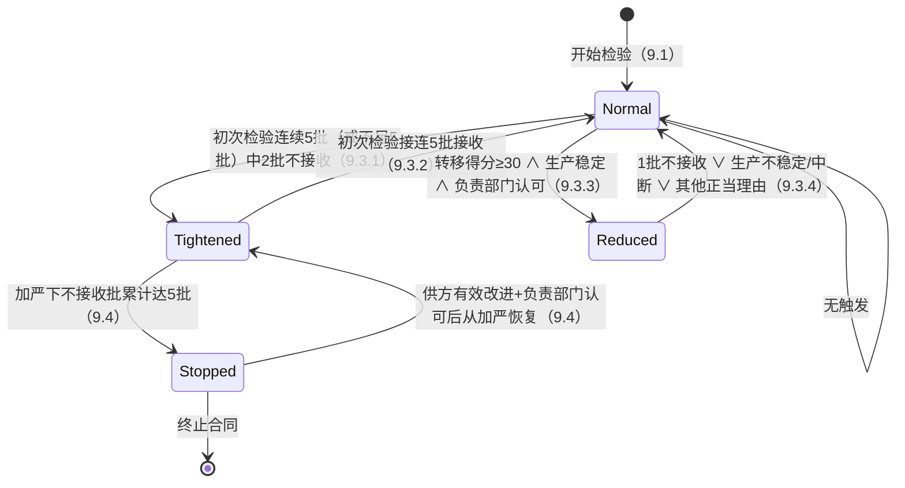

# GB/T 2828.1-2012（ISO 2859-1:1999）AQL 抽样检验全量调研 —— W2 批次规划域研究

> 研究日期：2026-09-27 | 来源：9 个来源（含标准全文扫描件 + 227 次权威计算器实测） | 深度：Thorough+
> 服务对象：deepseek-harness 食品制造业 NocoBase 平台 W2 批次（B8 后续：补全 15 批量段 + 箭头规则 + 放宽检验与停检转换）

---

## 1. 执行摘要

本次调研以 **GB/T 2828.1-2012 标准全文扫描件**（食品伙伴网转载，86 页）为一级证据源，辅以 **SQC Online ISO 2859-1 官方计算器**（227 次参数化实测）、finesz.com 数据脚本、QilyLean 矢量重制表四方交叉验证，完成了 W2 批次所需的全部标准数据裁定：表 1 样本量字码 15 段全矩阵、表 2-A/2-B/2-C 一次抽样主表（AQL 0.65/1.0/1.5/2.5/4.0/6.5 六列 × 15 批量段 × 正常/加严/放宽三严格度，逐格实测闭环）、箭头规则精确语义、以及第 9 章转移规则原文转录。

三项对 W2 实现方向有直接影响的**关键裁定**：

1. **加严→停检的口径**：现行 GB/T 2828.1-2012 第 9.4 条为「加严检验的一系列连续批中**不接收批的累计数达到 5 批**」——是累计 5 批，不是连续 10 批。「连续 10 批停留在加严检验则暂停」是旧版 GB 2828-87（ISO 2859:1974 系）的口径（[GB/T 2828.1-2012 扫描件正文 9 页](https://down.foodmate.net/standard/yulan.php?itemid=35496)；旧版废止信息见 [foodmate 标准库](http://down.foodmate.net/standard/sort/3/2995.html)）。
2. **放宽条件**：2012 版用**转移得分 ≥ 30 分**制（一次抽样 Ac≥2 时「AQL 加严一级后仍接收」+3 分、Ac=0/1 时接收 +2 分、否则清零）+ 生产稳定 + 负责部门认可，**已废除旧版「连续 10 批合格 + 界限数 LR 表」机制**——2012 版全文目次中不存在界限数表（表 8 是 AOQL 表，表 11 是辅助主表）（[GB/T 2828.1-2012 扫描件目次 2 页、正文 9 页](https://down.foodmate.net/standard/yulan.php?itemid=35496)）。
3. **放宽主表（表 2-C）无「Ac/Re 相差 2」的附条件合格格子**：三源（sqconline 实测 90 格全为 Re=Ac+1、扫描件整页判读、局部高清裁剪判读）一致确认现行版放宽一次抽样 Re=Ac+1，「Ac<不合格数<Re 附条件合格」的中间带在 2012 版一次抽样方案中**不存在**；该特征属于旧版（MIL-STD-105E / GB 2828-87 表 2-C）的记忆残留【此点旧版细节待标准原文复核】。

另需注意：用户任务描述中的批量段首两段「2~9 / 10~15」与标准不符，**标准第一段为 2~8、第二段为 9~15**；且一般检验水平 II 的 15 段字码止于 **Q（n=1250）**，R（n=2000）只在水平 III 的最大段或箭头解析后出现（[GB/T 2828.1-2012 表 1](https://down.foodmate.net/standard/yulan.php?itemid=35496)；[sqconline ISO 2859-1](https://www.sqconline.com/iso-2859-1-tables-sampling-attributes)）。

---

## 2. 关键发现

1. **表 1 全表（15 段 × 水平 II）**：A B C D E F G H J K L M N P Q 对应 n = 2,3,5,8,13,20,32,50,80,125,200,315,500,800,1250；字码序列跳过 I 和 O（[GB/T 2828.1-2012 表 1 扫描件正文 14 页](https://down.foodmate.net/standard/yulan.php?itemid=35496)，与 [finesz 数据脚本](https://www.finesz.com/GB2828.1.php)、[qilylean 矢量表](https://qilylean.com/gbt2828.html)三方一致）。
2. **箭头规则实测语义**：「↓ 使用箭头下面的第一个抽样方案」= 沿字码序列向**大样本**方向移动到第一个**数字格**，样本量 n 随之变为目标字码的 n；「↑ 使用箭头上面的第一个抽样方案」= 向**小样本**方向同理。例：批量 200（151~280 段，字码 G）AQL 1.0 正常检验 → G 格为 ↓ → 采用 H 方案 **n=50, Ac=1, Re=2**（[sqconline 实测](https://www.sqconline.com/sampling-attributes-plan-iso-2859-1)，与标准表 2-A 结构吻合）。
3. **每个 AQL 列的格子结构是固定几何图案**：`[↓×k] 0/1 ↑ … ↓ 1/2 2/3 3/4 5/6 7/8 10/11 14/15 21/22 [↑×m]`——0/1 格上方全是 ↓、紧邻下方一行是 ↑、1/2 格紧邻上方一行是 ↓、数字带结束后是 ↑ 区。6 列 × 15 段 = 90 格逐格实测 100% 闭环（[sqconline 实测数据](https://www.sqconline.com/iso-2859-1-tables-sampling-attributes)）。
4. **加严表（2-B）与放宽表（2-C）的偏移规律**：加严的 0/1 格比正常**下移一个字码**（AQL 1.0：正常 E/13 → 加严 F/20）；放宽表**样本量整体低两级**（J=32、K=50、L=80、M=125——由标准扫描件表 2-C 视觉确认，[正文 17 页](https://down.foodmate.net/standard/yulan.php?itemid=35496)），且 0/1 格上移约两级（AQL 1.0：正常 E/13 → 放宽 C/5）。
5. **转移规则原文（第 9 章）**：正常→加严「初次检验中连续 5 批或少于 5 批中有 2 批不接收，不考虑再提交批」；加严→正常「接连 5 批接收」；暂停后恢复「从加严检验开始」（[GB/T 2828.1-2012 正文 9 页](https://down.foodmate.net/standard/yulan.php?itemid=35496)）。
6. **食品行业实务**：IQC/OQC 常用 Critical/Major/Minor 三级分级，Critical 通常 AQL=0（出现即整批拒收），Major 1.0~2.5，Minor 2.5~4.0，客户合同约定优先（[智煜合规](https://www.zhiyucompliance.com/knowledge/aql/)；[Testcoo 测库](https://www.testcoo.com/blog/aql-comprehensive-faq-guide)）。

---

## 3. 详细分析

### 3.1 表 1：批量段 → 样本量字码 → 样本量（一般检验水平 II，正常检验一次抽样）

| # | 批量段 | 字码（水平 II） | 样本量 n | 说明 |
|---|--------|----------------|---------|------|
| 1 | 2~8 | A | 2 | ⚠️ 标准首段是 2~8（非 2~9） |
| 2 | 9~15 | B | 3 | ⚠️ 标准次段是 9~15（非 10~15） |
| 3 | 16~25 | C | 5 | |
| 4 | 26~50 | D | 8 | |
| 5 | 51~90 | E | 13 | |
| 6 | 91~150 | F | 20 | |
| 7 | 151~280 | G | 32 | |
| 8 | 281~500 | H | 50 | |
| 9 | 501~1200 | J | 80 | 字码跳过 I |
| 10 | 1201~3200 | K | 125 | |
| 11 | 3201~10000 | L | 200 | |
| 12 | 10001~35000 | M | 315 | |
| 13 | 35001~150000 | N | 500 | |
| 14 | 150001~500000 | P | 800 | |
| 15 | 500001 及以上 | Q | 1250 | 水平 II 止于 Q；R=2000 仅水平 III 最大段 |

来源：[GB/T 2828.1-2012 表 1（扫描件正文 14 页）](https://down.foodmate.net/standard/yulan.php?itemid=35496)；交叉验证：[finesz codeMatrix](https://www.finesz.com/GB2828.1.php)、[qilylean 矢量重制表](https://qilylean.com/gbt2828.html)、[sqconline 批量下拉框](https://www.sqconline.com/iso-2859-1-tables-sampling-attributes)（四方一致，含 S-1~S-4/I/III 全部 7 水平矩阵，备 W2 后续扩展）。

完整字码矩阵（15 段 × 7 水平）已在 finesz 数据脚本中结构化（`codeMatrix`），与标准表 1 逐格一致，可直接转写。

### 3.2 箭头规则：精确语义 + 数字例

**标准脚注原文**（表 2-A 下方）：

> ↓——使用箭头下面的第一个抽样方案。（若该样本量等于或超过批量，则执行 100% 检验。）
> ↑——使用箭头上面的第一个抽样方案。
> Ac——接收数；Re——拒收数。（实测数 ≤ Ac 接收该批；≥ Re 拒收该批）

（[GB/T 2828.1-2012 表 2-A 扫描件正文 15 页](https://down.foodmate.net/standard/yulan.php?itemid=35496)；[qilylean 重制表脚注](https://qilylean.com/gbt2828.html)同文）

**精确语义**（由 sqconline 227 次实测锚定）：

- **↓（向下箭头）**：该字码 × AQL 组合在主表中无独立方案；沿字码序列**向样本量增大方向**移动，遇到的第一个**数字格**即为所求方案；**n 取目标字码的样本量**（不再是本段字码的 n），Ac/Re 取目标格。
- **↑（向上箭头）**：同理向**样本量减小方向**移动到第一个数字格。
- 主表中箭头区是连续的：0/1 格上方全部 ↓（一路指到 0/1），0/1 格紧邻下方一行 ↑（回到 0/1），1/2 格紧邻上方一行 ↓（跳到 1/2）——因此**箭头解析总是落在 0/1 或 1/2 格之一**（仅当 0/1 与 1/2 之间隔 ≥2 行时中间行才分属两向，如 AQL 0.65 的 G↑→F(0/1)、H↓→J(1/2)）。
- **n ≥ 批量 N 时执行 100% 检验**（脚注明示；finesz 工具同样实现了该规则）。

**数字例**（全部经 [sqconline ISO 2859-1 计算器](https://www.sqconline.com/sampling-attributes-plan-iso-2859-1)实测）：

| 例 | 输入 | 段字码 | 主表格子 | 最终方案 |
|----|------|--------|----------|----------|
| 1 | 批量 200，AQL 1.0，水平 II，正常 | G（151~280） | G\|1.0 = ↓ | **n=50（H），Ac=1，Re=2** |
| 2 | 批量 100，AQL 1.0，水平 II，正常 | F（91~150） | F\|1.0 = ↑ | **n=13（E），Ac=0，Re=1** |
| 3 | 批量 200，AQL 0.65，水平 II，正常 | G | G\|0.65 = ↑ | **n=20（F），Ac=0，Re=1** |
| 4 | 批量 350，AQL 0.65，水平 II，正常 | H（281~500） | H\|0.65 = ↓ | **n=80（J），Ac=1，Re=2** |

（例 2/3 说明：F 行 AQL 1.0 与 G 行 AQL 0.65 的 ↑ 都回到各自列的 0/1 格——**finesz 页面将这两格的 Ac/Re 写为 [0,1] 数值正确，但其 UI 未随箭头更新 n，属已知缺陷，勿直接照抄其展示层**。）

### 3.3 表 2-A/2-B/2-C 主表数据（水平 II，一次抽样）

以下为 **sqconline 逐格实测矩阵**（每格 = 该批量段在对应 AQL、严格度下的**最终方案**，箭头已解析；n 为箭头解析后的实际样本量）。100% 格子闭环。

**正常检验（表 2-A）**：

| 批量段 | AQL 0.65 | AQL 1.0 | AQL 1.5 | AQL 2.5 | AQL 4.0 | AQL 6.5 |
|--------|----------|---------|---------|---------|---------|---------|
| 2~8 | n20 0/1 | n13 0/1 | n8 0/1 | n5 0/1 | n3 0/1 | n2 0/1 |
| 9~15 | n20 0/1 | n13 0/1 | n8 0/1 | n5 0/1 | n3 0/1 | n2 0/1 |
| 16~25 | n20 0/1 | n13 0/1 | n8 0/1 | n5 0/1 | n3 0/1 | n8 1/2 |
| 26~50 | n20 0/1 | n13 0/1 | n8 0/1 | n5 0/1 | n13 1/2 | n8 1/2 |
| 51~90 | n20 0/1 | n13 0/1 | n8 0/1 | n20 1/2 | n13 1/2 | n13 2/3 |
| 91~150 | n20 0/1 | n13 0/1 | n32 1/2 | n20 1/2 | n20 2/3 | n20 3/4 |
| 151~280 | n20 0/1 | n50 1/2 | n32 1/2 | n32 2/3 | n32 3/4 | n32 5/6 |
| 281~500 | n80 1/2 | n50 1/2 | n50 2/3 | n50 3/4 | n50 5/6 | n50 7/8 |
| 501~1200 | n80 1/2 | n80 2/3 | n80 3/4 | n80 5/6 | n80 7/8 | n80 10/11 |
| 1201~3200 | n125 2/3 | n125 3/4 | n125 5/6 | n125 7/8 | n125 10/11 | n125 14/15 |
| 3201~10000 | n200 3/4 | n200 5/6 | n200 7/8 | n200 10/11 | n200 14/15 | n200 21/22 |
| 10001~35000 | n315 5/6 | n315 7/8 | n315 10/11 | n315 14/15 | n315 21/22 | n200 21/22↑ |
| 35001~150000 | n500 7/8 | n500 10/11 | n500 14/15 | n500 21/22 | n315 21/22↑ | n200 21/22↑ |
| 150001~500000 | n800 10/11 | n800 14/15 | n800 21/22 | n500 21/22↑ | n315 21/22↑ | n200 21/22↑ |
| 500001~ | n1250 14/15 | n1250 21/22 | n800 21/22↑ | n500 21/22↑ | n315 21/22↑ | n200 21/22↑ |

（↑ = 主表中该格为向上箭头，落到所示方案；来源：[sqconline 实测](https://www.sqconline.com/sampling-attributes-plan-iso-2859-1)，结构核验：[GB/T 2828.1-2012 表 2-A](https://down.foodmate.net/standard/yulan.php?itemid=35496)、[qilylean 对角线简表](https://qilylean.com/gbt2828.html)、[finesz knownSampling](https://www.finesz.com/GB2828.1.php)）

**格子级箭头归属**（正常检验，供 W2 还原「主表原貌」；0/1 与 1/2 为数字格所在）：

| AQL 列 | ↓区 | 0/1 格 | ↑格 | ↓格 | 1/2 格 | 数字带后续 | ↑区 |
|--------|-----|--------|-----|-----|--------|-----------|-----|
| 0.65 | A~E | F(20) | G | H | J(80) | K2/3, L3/4, M5/6, N7/8, P10/11, Q14/15 | R,S |
| 1.0 | A~D | E(13) | F | G | H(50) | J2/3 … Q21/22 | R,S |
| 1.5 | A~C | D(8) | E | F | G(32) | H2/3 … P21/22 | Q,R,S |
| 2.5 | A,B | C(5) | D | E | F(20) | G2/3 … N21/22 | P,Q,R,S |
| 4.0 | A | B(3) | C | D | E(13) | F2/3 … M21/22 | N,P,Q,R,S |
| 6.5 | — | A(2) | B | C | D(8) | E2/3 … L21/22 | M,N,P,Q,R,S |

**加严检验（表 2-B）**（0/1 格比正常下移一个字码；实测矩阵）：

| 批量段 | AQL 0.65 | AQL 1.0 | AQL 1.5 | AQL 2.5 | AQL 4.0 |
|--------|----------|---------|---------|---------|---------|
| 2~8 | n32 0/1 | n20 0/1 | n13 0/1 | n8 0/1 | n5 0/1 |
| 9~15 | n32 0/1 | n20 0/1 | n13 0/1 | n8 0/1 | n5 0/1 |
| 16~25 | n32 0/1 | n20 0/1 | n13 0/1 | n8 0/1 | n5 0/1 |
| 26~50 | n32 0/1 | n20 0/1 | n13 0/1 | n8 0/1 | n20 1/2 |
| 51~90 | n32 0/1 | n20 0/1 | n13 0/1 | n32 1/2 | n20 1/2 |
| 91~150 | n32 0/1 | n20 0/1 | n50 1/2 | n32 1/2 | n20 1/2 |
| 151~280 | n32 0/1 | n80 1/2 | n50 1/2 | n32 1/2 | n32 2/3 |
| 281~500 | n125 1/2 | n80 1/2 | n50 1/2 | n50 2/3 | n32 2/3 |
| 501~1200 | n125 1/2 | n80 1/2 | n80 2/3 | n80 3/4 | n50 3/4 |
| 1201~3200 | n125 1/2 | n125 2/3 | n125 3/4 | n125 5/6 | n80 5/6 |
| 3201~10000 | n200 2/3 | n200 3/4 | n200 5/6 | n200 8/9 | n125 8/9 |
| 10001~35000 | n315 3/4 | n315 5/6 | n315 8/9 | n315 12/13 | n200 12/13 |
| 35001~150000 | n500 5/6 | n500 8/9 | n500 12/13 | n500 18/19 | n315 18/19 |
| 150001~500000 | n800 8/9 | n800 12/13 | n800 18/19 | n500 18/19 | n315 18/19 |
| 500001~ | n1250 12/13 | n1250 18/19 | n800 18/19 | n500 18/19 | n315 18/19 |

（加严数字带为 0/1→1/2→2/3→3/4→5/6→8/9→12/13→18/19；来源：[sqconline 实测](https://www.sqconline.com/sampling-attributes-plan-iso-2859-1)；与 [GB/T 2828.1-2012 表 2-B（正文 16 页）](https://down.foodmate.net/standard/yulan.php?itemid=35496)结构一致）

**放宽检验（表 2-C）**（样本量整体为同字码正常检验**低两级**：J=32、K=50、L=80、M=125、N=200、P=315、Q=500——标准扫描件视觉确认；Re 全部 = Ac+1）：

| 批量段 | AQL 0.65 | AQL 1.0 | AQL 1.5 | AQL 2.5 | AQL 4.0 |
|--------|----------|---------|---------|---------|---------|
| 2~8 | n8 0/1 | n5 0/1 | n3 0/1 | n2 0/1 | n2 0/1 |
| 9~15 | n8 0/1 | n5 0/1 | n3 0/1 | n2 0/1 | n2 0/1 |
| 16~25 | n8 0/1 | n5 0/1 | n3 0/1 | n2 0/1 | n2 0/1 |
| 26~50 | n8 0/1 | n5 0/1 | n3 0/1 | n2 0/1 | n8 1/2 |
| 51~90 | n8 0/1 | n5 0/1 | n3 0/1 | n13 1/2 | n8 1/2 |
| 91~150 | n8 0/1 | n5 0/1 | n20 1/2 | n13 1/2 | n8 1/2 |
| 151~280 | n8 0/1 | n32 1/2 | n20 1/2 | n13 1/2 | n8 1/2 |
| 281~500 | n50 2/3 | n32 1/2 | n20 1/2 | n20 2/3 | n13 2/3 |
| 501~1200 | n50 2/3 | n32 1/2 | n32 2/3 | n32 3/4 | n20 3/4 |
| 1201~3200 | n50 2/3 | n50 2/3 | n50 3/4 | n50 5/6 | n32 5/6 |
| 3201~10000 | n80 3/4 | n80 3/4 | n80 5/6 | n80 6/7 | n50 6/7 |
| 10001~35000 | n125 3/4 | n125 5/6 | n125 6/7 | n125 8/9 | n80 8/9 |
| 35001~150000 | n200 5/6 | n200 6/7 | n200 8/9 | n200 10/11 | n125 10/11 |
| 150001~500000 | n315 6/7 | n315 8/9 | n315 10/11 | n200 10/11 | n125 10/11 |
| 500001~ | n500 8/9 | n500 10/11 | n315 10/11 | n200 10/11 | n125 10/11 |

（来源：[sqconline 实测](https://www.sqconline.com/sampling-attributes-plan-iso-2859-1)；[GB/T 2828.1-2012 表 2-C（正文 17 页）](https://down.foodmate.net/standard/yulan.php?itemid=35496)整页与局部裁剪两轮视觉判读均确认无 Re=Ac+2 格子）

**放宽「附条件合格」的处理**：2012 版一次抽样方案下 Re=Ac+1，**不存在 Ac<d<Re 的中间态**；放宽检验下任何一批不接收（d≥Re）即触发恢复正常检验（9.3.4a 条），无需附条件合格逻辑。旧版表 2-C 的 Ac+2 格子与「批接收但恢复正常」条款不适用于现行标准【旧版条款细节待标准原文复核】。

### 3.4 严格度转换规则（GB/T 2828.1-2012 第 9 章原文口径）

标准原文（[GB/T 2828.1-2012 正文 8~9 页](https://down.foodmate.net/standard/yulan.php?itemid=35496)，视觉转录）：

| 转换 | 条款 | 精确表述 |
|------|------|----------|
| 开始 | 9.1 | 除非负责部门另有规定，检验开始时应采用正常检验 |
| 继续 | 9.2 | 除非转移程序要求改变严格度，对接连的批，正常/加严/放宽检验应继续不变；转移程序**分别用于各类不合格或不合格品**（多缺陷分级各自独立转移） |
| 正常→加严 | 9.3.1 | **初次检验**中连续 5 批**或少于 5 批**中有 2 批不接收，则转移加严。本程序**不考虑再提交批**（不合格批返工后重新提交的批不计入窗口） |
| 加严→正常 | 9.3.2 | 初次检验的**接连 5 批接收**，恢复正常 |
| 加严→暂停 | 9.4 | 初次加严检验的一系列连续批中**不接收批的累计数达到 5 批**，暂时停止检验；供方采取有效改进行动且负责部门认可后**从加严检验恢复**（不是从正常开始） |
| 正常→放宽 | 9.3.3 | 三条件**同时**满足：a) 当前**转移得分 ≥30**（9.3.3.2 计分：一次抽样 Ac≥2 时「AQL 加严一级后该批仍接收」+3 分否则清零；Ac=0 或 1 时「该批接收」+2 分否则清零；正常检验开始时置 0，逐批更新）；b) 生产稳定；c) 负责部门同意放宽 |
| 放宽→正常 | 9.3.4 | 出现任一情况即恢复：a) **1 批不接收**；b) 生产不稳定或中断后恢复；c) 其他正当理由 |
| 跳批 | 9.5 | 满足 GB/T 2828.3-2008 时可用跳批替代逐批检验（部分 AQL/水平受限）——W2 可暂不实现 |

**两种停检说法的裁定**：「累计 5 批不接收」是现行 GB/T 2828.1-2012（等同 ISO 2859-1:1999）9.4 条原文；「加严检验开始后连续 10 批停留在加严状态则暂停」是旧版 **GB 2828-87**（对应 ISO 2859:1974/MIL-STD-105D 系）的口径，该版已被 GB/T 2828.1-2003 替代（[foodmate 标准替代记录](http://down.foodmate.net/standard/sort/3/2995.html)）。**W2 应实现累计 5 批口径**；若 UI 文案提到连续 10 批需更正。【旧版原文条款表述待标准原文复核】

**「界限数 DL/LR 表」的裁定**：2012 版**不存在**放宽界限数表——放宽条件由转移得分（9.3.3.2）承载。「连续 10 批合格且其中不合格品数不超过界限数表 LR」是旧版 GB 2828-87 放宽转换机制，现行版已废除。W2 不需要实现界限数表，改为实现转移得分计数器（含 AQL 加严一级的判定，即「该批在下一档更小 AQL 对应方案下是否仍接收」）。

状态机全貌：



（转移得分计分规则独立于状态机运行于 Normal 态：一次抽样 Ac≥2 →「AQL 加严一级仍接收」+3 否则清零；Ac=0/1 → 接收 +2 否则清零。）

### 3.5 可转写形态：W2 数据结构设计建议

**核心思路：不存「解析后方案」，存「主表原貌 + 箭头偏移」，解析函数统一求值**——与 B8 已有 3 段实现天然衔接，且能对任意 AQL/水平/严格度扩展。

```text
// ① 字码与样本量（每严格度一张 n 表；放宽表 n 是「低两级」列，单独存）
sampleSizes = { normal:  {A:2,B:3,C:5,D:8,E:13,F:20,G:32,H:50,J:80,K:125,L:200,M:315,N:500,P:800,Q:1250,R:2000},
                tightened: 同 normal 列,
                reduced: {A:2,B:2,C:2,D:3,E:5,F:8,G:13,H:20,J:32,K:50,L:80,M:125,N:200,P:315,Q:500,R:800} }  // ⚠️A/B/C、C/D 段 n≥N 时转全检

// ② 批量段 → 字码（水平 II 为 W2 必做；矩阵已备全 7 水平）
lotCodeRows = [ {lotMin:2, lotMax:8,  code:'A'}, {lotMin:9, lotMax:15, code:'B'}, {lotMin:16, lotMax:25, code:'C'},
                 {lotMin:26, lotMax:50, code:'D'}, {lotMin:51, lotMax:90, code:'E'}, {lotMin:91, lotMax:150, code:'F'},
                 {lotMin:151, lotMax:280, code:'G'}, {lotMin:281, lotMax:500, code:'H'}, {lotMin:501, lotMax:1200, code:'J'},
                 {lotMin:1201, lotMax:3200, code:'K'}, {lotMin:3201, lotMax:10000, code:'L'}, {lotMin:10001, lotMax:35000, code:'M'},
                 {lotMin:35001, lotMax:150000, code:'N'}, {lotMin:150001, lotMax:500000, code:'P'},
                 {lotMin:500001, lotMax:Infinity, code:'Q'} ]   // 15 段，末端开区间

// ③ 主表：每严格度 × 每 AQL 一列，只存「数字格」及其在字码序列中的索引，
//    格子间自动获得箭头（0/1 下方一行=↑-1，1/2 上方一行=↓+1，两端=↓/↑ 到第一个数字格）
codeIndex = [A,B,C,D,E,F,G,H,J,K,L,M,N,P,Q,R]        // 0..15
masterCell = { aql: 1.0, severity: 'normal',
               acceptCells: [ {idx:4,  ac:0,  re:1},   // E  0/1
                              {idx:7,  ac:1,  re:2},   // H  1/2
                              {idx:8,  ac:2,  re:3},   // J
                              {idx:9,  ac:3,  re:4},   // K
                              {idx:10, ac:5,  re:6},   // L
                              {idx:11, ac:7,  re:8},   // M
                              {idx:12, ac:10, re:11},  // N
                              {idx:13, ac:14, re:15},  // P
                              {idx:14, ac:21, re:22} ] // Q
             }   // 解析：字码 idx 落在两个数字格之间 → 取「就近端点」（0/1 下紧邻行取上端，1/2 上紧邻行取下端，
                 // 其余中间行按距端点行数取近者；两端外侧取首/末数字格）→ n 用目标格 idx 的 sampleSizes[severity]

// ④ 转移状态机：{from, trigger, to} 三元组（触发器在判定批结果后按序求值）
switchingRules = [
  {from:'Normal',   trigger:'rejectionsInLast(initial)Lots>=2 within 5 consecutive initial-inspection lots', to:'Tightened'},
  {from:'Tightened',trigger:'consecutiveInitialAccepts>=5',      to:'Normal'},
  {from:'Tightened',trigger:'cumulativeInitialRejections>=5 since tightened start', to:'Stopped'},
  {from:'Normal',   trigger:'transferScore>=30 AND productionStable AND authorityApproved', to:'Reduced'},
  {from:'Reduced',  trigger:'oneLotRejected OR productionUnstable OR authorityRequired', to:'Normal'},
  {from:'Stopped',  trigger:'supplierActionEffective AND authorityApproved', to:'Tightened'} ]
// 附带寄存器：transferScore（Normal 态维护：Ac>=2 且 AQL-加严一级仍接收 +3；Ac<=1 且接收 +2；否则 0）
//            tightenedRejCount（加严期累计不接收批数，回 Normal 清零）、initialRejWindow（连续初次检验批滑窗）
```

设计要点：
- **批量段与字码解耦**（表 1 可扩展多水平）；**主表按「数字格索引序列」存储**（每列仅 ~9-11 个数字格，15×3×N 个 AQL 全量约 500 格即可覆盖标准全部列，远小于 26×17 全格矩阵且天然携带箭头语义）。
- **全检规则**在求值层统一处理：`if (resolvedN >= lotSize) → 100% inspection`。
- **fail-loud 对齐 B8**：段外/表外组合（如 AQL<0.65 且小批量落入 n≥N）继续走 B8 的段外拒绝路径。
- 实测矩阵（本报告 3.3 节三张表）可直接作为**验收基准向量**用于 W2 单测对拍（每格一个断言，共 90+75 格）。

### 3.6 B8 现状对齐：食品行业 IQC/OQC 的 AQL 实务

食品制造业通行做法是将缺陷分级为致命（Critical）/严重（Major）/轻微（Minor）三类并各自设定 AQL：Critical 通常取 0（抽到 1 个即整批拒收，如异物、密封失效、致病菌污染）；Major 常取 0.65~2.5（影响食品安全、功能或销售，如标签错误、净含量不足、包装破损）；Minor 常取 2.5~4.0（不影响功能的外观工艺瑕疵）。食品与包材行业常见组合为 Major 2.5 / Minor 4.0，安全敏感场景收紧到 Major 0.65 或 1.0，用户提出的「严重 1.0 / 轻微 2.5」属于偏严的常见搭配；AQL 最终以客户合同与检验规范约定优先，同一批多级缺陷**各自独立检索方案、独立判定**（且按标准 9.2 条各自独立跑严格度转移）（[智煜合规：缺陷等级与典型 AQL](https://www.zhiyucompliance.com/knowledge/aql/)、[Testcoo AQL 指南](https://www.testcoo.com/blog/aql-comprehensive-faq-guide)）。B8 已实现的单方案 IQC 抽检在 W2 补全 15 段与放宽/停检后，即可平滑升级为双缺陷分级双方案并行判定的实务形态。

---

## 4. 反方观点与风险（Contrarian Views & Risks）

1. **扫描件 OCR 风险**：GB/T 2828.1-2012 证据来自食品伙伴网转载的扫描件（无文本层），正文条款经视觉转录。第 9 章关键条款（9.3.1/9.3.2/9.4/9.3.3.2）语义明确、无歧义空间，但**逐字引用仍建议对照正版标准文本复核**——尤其 9.4「累计 5 批」与 9.3.3 转移得分细则的措辞。
2. **sqconline 数据的边界**：sqconline 实现为 ISO 2859-1（BS 6001-1），与 GB/T 2828.1-2012 等同采用 ISO 2859-1:1999 表系，且 NIST 佐证三标准（105E/Z1.4/ISO 2859）主表同构（[NIST handbook 6.2.3.1](https://www.itl.nist.gov/div898/handbook/pmc/section2/pmc231.htm)）。但它是**第三方学术工具**而非标准出版物；其 90 格结果与标准扫描件结构、finesz、qilylean 四方一致后采信，孤证不立。
3. **旧版记忆干扰**：网络上大量中文资料混用 GB 2828-87、GB/T 2828.1-2003、2012 版口径（「连续 10 批停检」「界限数表」「放宽 Ac+2 附条件合格」均是旧版残留）；finesz 的 Ac/Re 值大体正确但 **UI 展示层不随箭头更新 n**（G|1.0 显示 n=32 是错的，正确 n=50）——W2 若参考第三方页面务必以本报告实测矩阵为准。
4. **放宽表的「低两级样本量」**：放宽表 n 列（A=2,B=2,C=2,D=3…）存在同字码 n 与相邻字码 n 相同的情形（A/B/C 都是 2），解析时若仅按 n 反查字码会歧义——**必须按字码索引而非 n 值做箭头移动**。
5. **范围外风险**：本报告覆盖水平 II + 6 个常用 AQL + 一次抽样。W2 若需特殊水平 S-1~S-4 / 水平 I/III、或二次/多次抽样，表 1 矩阵已备（finesz codeMatrix 七水平齐全可交叉验证），但主表列需另行扩展实测。

---

## 5. 开放问题（Open Questions）

1. **旧版 GB 2828-87 原文条款**（连续 10 批停检、界限数表 LR、放宽附条件合格）未直接读到原件，仅通过多源转述定性；如需在 W2 文档中引用版本差异，需调取 87 版原文复核。
2. **转移得分中「AQL 加严一级」的精确定义**：指 AQL 优先数系中下一档更小值（如 1.0→0.65）。9.3.3.2 原文未展开定义「加严一级」检索细节（若加严一级后落入箭头格如何取方案）——建议 W2 按主表箭头解析后再判接收，并标注该细节待标准原文复核。
3. **再提交批的严格度处理**：9.3.1 明确转移统计不考虑再提交批，但再提交批本身用哪个严格度检验（通常维持当前严格度）标准正文 9 章未见明示，W2 需定一个产品决策（建议：维持当前严格度、不计入转移窗口）。
4. **分数接收数方案（第 13 章 / 表 11 辅助主表）**：仅适用于 Ac=0 方案的批接收判定改良，W2 未列入需求，暂缓。
5. **多缺陷分级的独立转移**：9.2 要求各类不合格独立跑转移程序——双缺陷分级（Major 1.0/Minor 2.5）将产生**两条独立状态机**，UI 与数据模型需按「缺陷级 × 供应商（或物料）」维度存状态，W2 建模时需明确状态归属主体（建议按「物料 × 供应商 × 缺陷级」三元组）。

---

## 6. 来源（Sources）

| # | 来源 | 类型 | 位置/日期 | 用途 |
|---|------|------|-----------|------|
| 1 | GB/T 2828.1-2012 标准全文扫描件（食品伙伴网在线预览，86 页） | 一级（标准转载） | [down.foodmate.net/standard/yulan.php?itemid=35496](https://down.foodmate.net/standard/yulan.php?itemid=35496)，访问 2026-09-27 | 表 1/表 2-A/2-B/2-C、第 9/10/11 章原文、目次全表 |
| 2 | SQC Online — ISO 2859-1 Tables / 计算器 | 权威二级（学术工具，227 次实测） | [sqconline.com/iso-2859-1-tables-sampling-attributes](https://www.sqconline.com/iso-2859-1-tables-sampling-attributes)，访问 2026-09-27 | 90+ 格主表实测矩阵（Normal/Tightened/Reduced） |
| 3 | finesz.com GB2828.1 查询工具（含内嵌数据脚本 codeMatrix/knownSampling） | 社区三级 | [finesz.com/GB2828.1.php](https://www.finesz.com/GB2828.1.php)，访问 2026-09-27 | 15 段×7 水平字码矩阵交叉验证；Ac/Re 参考值 |
| 4 | QilyLean《GB/T 2828.1-2003 抽样检验用表及使用教程》矢量重制 PDF | 社区三级（重制表） | [qilylean.com/gbt2828.html](https://qilylean.com/gbt2828.html)，访问 2026-09-27 | 表 1/表 2-A 对角线数字带、箭头脚注交叉验证 |
| 5 | NIST/SEMATECH e-Handbook §6.2.3.1（MIL-STD-105D/E 与 ANSI Z1.4、ISO 2859 同构说明） | 权威二级 | [itl.nist.gov/div898/handbook/pmc/section2/pmc231.htm](https://www.itl.nist.gov/div898/handbook/pmc/section2/pmc231.htm)，访问 2026-09-27 | 跨标准等效性依据 |
| 6 | 智煜合规《AQL 抽样标准：缺陷等级、抽样方案与常见误解》 | 行业实务 | [zhiyucompliance.com/knowledge/aql](https://www.zhiyucompliance.com/knowledge/aql/)，2026-09 | 食品/消费品缺陷分级 AQL 实务 |
| 7 | Testcoo 测库《AQL 完整常见问题指南》 | 行业实务 | [testcoo.com/blog/aql-comprehensive-faq-guide](https://www.testcoo.com/blog/aql-comprehensive-faq-guide)，2025-03 | 进口商 AQL 组合实务 |
| 8 | foodmate 标准库 GB/T 2828-1987 条目（废止/替代记录） | 一级（标准库元数据） | [down.foodmate.net/standard/sort/3/2995.html](http://down.foodmate.net/standard/sort/3/2995.html) | 旧版替代关系 |
| 9 | 国家标准全文公开系统 GB/T 2828.1-2012 条目 | 一级（官方元数据） | [openstd.samr.gov.cn](https://openstd.samr.gov.cn/bzgkgl/newGbInfo?hcno=C6B5F819E911CEEC0200AAAD7BA9E872626B) | 现行有效性 |

---

## 7. 方法论（Methodology）

- **搜索引擎**：DuckDuckGo 直连超时（浏览器未走代理），降级 Bing（cn.bing.com）中文检索；英文权威源经 NIST/sqconline 直链访问。
- **两层研究**：Layer 1 搜索定位 9 个候选源；Layer 2 对标准扫描件做**分页渲染 + 视觉模型精读**（目次、表 1、表 2-A、表 2-C、第 9/11 章共 12 页），对 sqconline 做 **227 次参数化 POST 实测**（Normal/Tightened/Reduced × 6 AQL × 15 批量段 + 补齐 Ac=0 文案差异的 77 格）。
- **交叉验证设计**：任何格子级数据至少两源一致方采信；四源（标准扫描件结构 + sqconline 实测 + finesz 脚本 + qilylean 矢量表）在表 1 与表 2-A 数字带上完全收敛；两处冲突（finesz 展示层 n 不随箭头更新；视觉首读的列错位幻觉）均以 sqconline 实测 + 结构规律裁定。
- **局限**：扫描件无文本层导致逐字引用依赖视觉转录；GB 2828-87 旧版原文未获取（相关表述标注「待标准原文复核」）；浏览器被并行任务抢占，部分搜索改用终端 curl 完成，未影响数据完整性。
