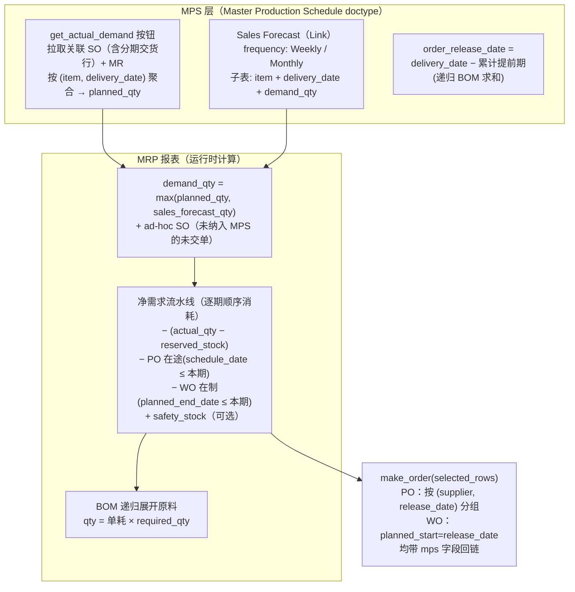
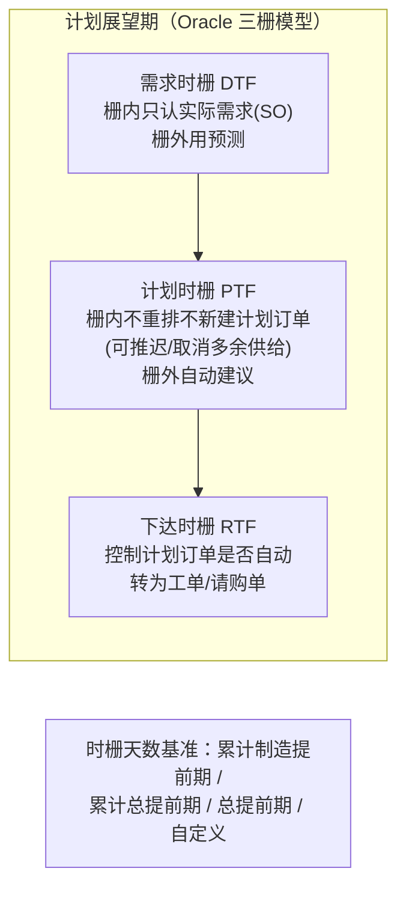
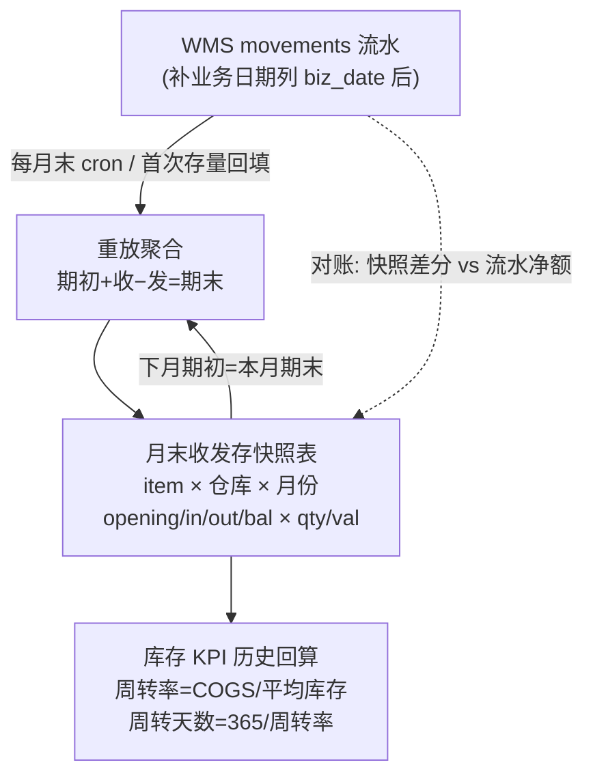

# W2 域研究：MPS 主生产计划选型 + 月度收发存台账与库存 KPI 历史回算

> 研究日期：2026-09-27 | 来源：14 个来源（含 5 个一手源码/官方文档） | 深度：Thorough
> 委托背景：deepseek-harness 食品制造业平台，已有 MRP 日结引擎（净需求公式 + JIT 窗 60 天，直接纳 SO 需求）与 WMS movements 流水（无日期列）。W2 需裁定 MPS 最简正确形态与月度收发存/KPI 回算口径。

---

## 1. Executive Summary

本次调研的核心结论是：**两大主流开源 ERP（ERPNext v16、Odoo 19）的 MPS 都没有实现教科书式的时栅（time fence）体系**，且 ERPNext v16 直到 2025 年才引入独立的 Master Production Schedule doctype——这直接支持「已有 MRP 日结引擎的系统，MPS 层先做『预测+SO 合并的按时段毛需求→净需求→交给现有 MRP』、不做时栅」的最简路线。对 dsh 平台而言，MPS 的最小正确输出物是**计划订单建议表（planned order 行，item × period）**，而不是直接改 MRP 输入；两者通过「MPS 行作为 MRP 的独立需求源之一」衔接，与 ERPNext v16 MRP 报表消费 MPS 数据的架构一致（[ERPNext MRP 源码](https://raw.githubusercontent.com/frappe/erpnext/develop/erpnext/manufacturing/report/material_requirements_planning_report/material_requirements_planning_report.py)）。

收发存台账方面，ERPNext v16 的 Stock Balance 报表本身就是「期初+收−发=存」结构（opening_qty/in_qty/out_qty/bal_qty × 量/值），其历史口径采用**「期末快照作期初 + 快照日后流水增量重放」的混合模式**（Stock Closing Entry，2023 年引入）；Odoo 则是**纯流水 + 当前量（stock.quant），无物化快照，历史按需重算**（[ERPNext stock_balance.py](https://raw.githubusercontent.com/frappe/erpnext/develop/erpnext/stock/report/stock_balance/stock_balance.py)、[Odoo 19 Stock report 文档](https://www.odoo.com/documentation/19.0/applications/inventory_and_mrp/inventory/warehouses_storage/reporting/stock.html)）。对 dsh 的 W2 建议是：**movements 补业务日期列后按「月末快照表」持久化收发存**，快照由流水重放生成、可随时重算校验，这同时满足台账报表性能与 KPI 历史回算两个需求。

## 2. Key Findings

1. **ERPNext v16（develop 分支）存在完整 MPS+MRP 双层结构**：独立 doctype `Master Production Schedule`（主表 from_date/to_date/parent_warehouse/sales_forecast 链接；子表 `Master Production Schedule Item` 按 item+delivery_date+planned_qty 存行），MRP 报表（`material_requirements_planning_report`，2025 年新增）在运行时消费 MPS 行、Sales Forecast 与 ad-hoc SO（[MPS doctype JSON](https://raw.githubusercontent.com/frappe/erpnext/develop/erpnext/manufacturing/doctype/master_production_schedule/master_production_schedule.json)、[MRP 报表源码](https://raw.githubusercontent.com/frappe/erpnext/develop/erpnext/manufacturing/report/material_requirements_planning_report/material_requirements_planning_report.py)）。
2. **ERPNext 的 SO+预测合并口径是 `max(planned_qty, sales_forecast_qty)` 而非求和**——同 item 同日取大者；不在 MPS 关联内的未交 SO 作为 ad-hoc 需求直接加到 planned_qty，且 MPS 已关联的 SO 会被排除出 ad-hoc 查询以防双计（源码 `get_detailed_view_data` 与 `get_orders_to_skip`，同上源码）。
3. **Odoo 19 官方文档明确警告 MPS 与 reordering rules 不可并用**，原文："Because the MPS relies on manual replenishment, reordering rules should not be applied to products added to the MPS. Doing so creates inaccurate forecasts and unnecessary replenishment orders."（[Odoo 19 MPS 文档](https://www.odoo.com/documentation/19.0/applications/inventory_and_mrp/manufacturing/workflows/use_mps.html)）——这条对 dsh 的含义是：**MPS 覆盖的成品不应再走 MRP 的 SO 直纳通道，二者必须互斥或显式分层**。
4. **ERPNext 与 Odoo 的 MPS 均无时栅逻辑**：ERPNext MRP 报表源码中不存在任何 fence/冻结概念；Odoo MPS 网格所有 period 的 Replenishment 行均可手改并 Order 下发，无栅内锁定行为（同上两来源）。时栅只在 Oracle/SAP 级商业套件中是标准件（[Oracle Time Fence Control](https://docs.oracle.com/cd/A60725_05/html/comnls/us/mrp/tfctrl.htm)）。
5. **净需求的标准公式**（教科书+ERPNext 实现一致）：`净需求 = 毛需求 −(可用库存 − 已预留)− 在途/在制供给 + 安全库存`；ERPNext 的逐期实现是顺序消耗（先库存、再 PO 在途、再 WO 在制，跨期共享余量），安全库存通过 `add_safety_stock` 过滤器可选地加回（[MRP 报表源码](https://raw.githubusercontent.com/frappe/erpnext/develop/erpnext/manufacturing/report/material_requirements_planning_report/material_requirements_planning_report.py)；v14 口径 `Required Qty = BOM Required Qty − Projected Qty`，[Production Plan 文档](https://docs.frappe.io/erpnext/production-plan)）。
6. **预测冲销（forecast consumption）的官方定义**：Oracle Fusion SCM 25d——"deducts sales orders (actual demand) from the gross forecast … to come up with a net forecast"（毛预测 − SO = 净预测），并提供 backward/forward consumption buckets 窗口与「是否在需求时栅内先冲销再删预测」两种模式（[Oracle 25d Forecast Consumption](https://docs.oracle.com/en/cloud/saas/supply-chain-and-manufacturing/25d/faspf/forecast-consumption.html)）。ERPNext v16 采用的是**毛预测 + max 合并**（不做冲销）；Odoo 采用**毛预测 + Actual Demand 对照行提示人工调整**（均无自动冲销）。
7. **收发存台账的 ERPNext 实现就是标准结构**：Stock Balance 报表按 item×warehouse 输出 `opening_qty / in_qty / in_val / out_qty / out_val / bal_qty / bal_val`，任意日期区间可查（[stock_balance.py](https://raw.githubusercontent.com/frappe/erpnext/develop/erpnext/stock/report/stock_balance/stock_balance.py)）；Odoo 的 Moves history report 提供按 Incoming/Outgoing/Internal/Manufacturing 分类的流水视图（[Odoo 19 Moves history](https://www.odoo.com/documentation/19.0/applications/inventory_and_mrp/inventory/warehouses_storage/reporting/moves_history.html)）。
8. **快照 vs 重放的行业分野**：ERPNext = 流水（SLE）为唯一真相 + Bin 当前量缓存 + **可选的月末 Stock Closing Balance 快照**（2023 年引入，long job 后台生成，含 FIFO 队列与货值；Stock Balance 报表优先用最近快照作期初、只重放快照之后的流水）；Odoo = 纯 quant 当前量 + move 流水，官方报表体系中无物化历史快照（[Stock Closing Entry 源码](https://raw.githubusercontent.com/frappe/erpnext/develop/erpnext/stock/doctype/stock_closing_entry/stock_closing_entry.py)、[Odoo stock_quant.py](https://raw.githubusercontent.com/odoo/odoo/19.0/addons/stock/models/stock_quant.py)）。
9. **库存周转率标准公式**：`周转率 = COGS ÷ 平均库存`，`周转天数 = 365 ÷ 周转率`，平均库存通常取 `(期初+期末)/2`（多源交叉：[Wall Street Prep](https://www.wallstreetprep.com/knowledge/inventory-turnover/)、[Investopedia](https://www.investopedia.com/terms/i/inventoryturnover.asp)、[Smartsheet](https://www.smartsheet.com/content/how-to-calculate-inventory-turnover)）。
10. **补业务时间列的迁移标准实践是 Expand-Contract + 双写 + 后台批量回填**：新列必须 nullable 或带 DEFAULT；过渡期双写；后台 job 分批回填（throttling 限流）至 100% 完成后再切读；确认稳定后 Contract 清理（[anhtu.dev 零停机迁移指南](https://anhtu.dev/zero-downtime-database-migration-expand-contract-ef-core-batch-backfill-production-1151)）。

## 3. Detailed Analysis

### 3.1 ERPNext 的 MPS/MRP 实际结构（v16 develop，源码级）

ERPNext 的生产计划体系有两代并存：

**第一代（v13–v15 一直存在）：Production Plan**。它不是按时段的 MPS，而是「按单集合」的计划工具：从 Sales Order / Material Request 拉行，`Required Qty = BOM Required Qty − Projected Qty`（Projected = 实际库存 + 在途 − 预留，例：100 − (50+20) = 30），提交后可一键生成 Work Order（成品）与 Material Request（原料），支持 Consolidate Items（同 BOM 合并）与 Skip Available Raw Materials（[Production Plan 官方文档](https://docs.frappe.io/erpnext/production-plan)）。

**第二代（v16 develop，2025 年新增）：独立 MPS + MRP 报表**。结构如下：

*图 1：ERPNext v16 MPS→MRP→下发数据流（依据 develop 分支源码绘制）。MPS doctype 是需求行容器；MRP 报表运行时合并预测与实际需求并逐期算净需求；下发物是 PO/WO 且携带 mps 回链字段。*

关键行为细节（全部来自源码）：

| 维度 | ERPNext v16 行为 |
|---|---|
| MPS 行粒度 | item × delivery_date（非矩阵存储；bucket 视图 Daily/Weekly/Monthly 是报表动态分桶，`get_dates()`） |
| 预测频率内插 | Monthly → 按当月天数均分；Weekly → 除以 7（`convert_to_daily_bucket_data`，均分假设明示在注释中） |
| 预测生命周期 | Sales Forecast status: `Planned / MPS Generated / Cancelled`——被 MPS 引用后状态迁移 |
| 防双计 | MRP 报表的 ad-hoc SO 查询排除 `Production Plan Sales Order` 子表中已关联的单（`get_orders_to_skip`） |
| 提前期 | `release_date = delivery_date − lead_time`；制造件按工时×数量折天，采购件按采购提前期+缓冲；多级 BOM 递归累计 |
| 下发门槛 | `min_order_qty` 向上取整；缺默认供应商/默认 BOM 直接 throw（fail loud） |
| 时栅 | **无** |

### 3.2 Odoo 19 的 MPS（企业版，官方文档）

Odoo 的 MPS 是 Manufacturing 应用 Planning 菜单下的**交互网格**：列为时段（Default Time Range：Yearly/Monthly/Weekly/Daily 四选一 × Number of Periods），行为产品组（[Odoo 19 MPS 文档](https://www.odoo.com/documentation/19.0/applications/inventory_and_mrp/manufacturing/workflows/use_mps.html)）：

| 行 | 语义 |
|---|---|
| 产品头行 | 各期期初库存（Starting Stock，由上期 Forecasted Stock 递推） |
| − Forecasted Demand | 人工录入的预测；可一键「Suggest Forecasted Demand」（基于去年同期/近 30 天/3 月/12 月 × 缩放系数） |
| − Indirect Demand Forecast | 组件被上层 MO 消耗的间接需求（选 BOM 时组件自动入 MPS） |
| + Replenishment | 建议补货量，公式 `= Safety Stock Target − Starting Stock + Forecasted Demand`（≤0 取 0；受 Minimum to Replenish 下限）；可手改，改后高亮并可 reset |
| = Forecasted Stock | 期末预测库存，逐期递推 |

递推关系：`期初(t+1) = 期初(t) − Forecasted Demand(t) + Replenishment(t)`。可选行包括 Actual Demand / Actual Demand Y-1 / Y-2 / Actual Replenishment / **ATP**（= Starting Stock − Actual Demand + Replenishment）。**注意 Actual Demand 是「对照显示」而非合并**——配合 "Forecast Too Low" 过滤器（实际>预测时提示）驱动人工上调预测；Odoo 不做自动预测冲销。

下发（Replenishing products with MPS）三种入口：全局 Order 按钮（当期所有产品）、单产品 Order、批量勾选 Actions→Order。Buy 路由生成 RfQ、Manufacture 路由生成 MO；补货单元格绿/灰/黄/红四色标识（绿=待下单、灰=已下单且量符、黄=低于建议、红=超建议）。Replenishment Trigger 每产品三选：Manual / Automatic（自动排单）/ Never。

**官方警告（与 reordering rules 的关系，原文口径）**：
> "Because the MPS relies on manual replenishment, reordering rules should not be applied to products added to the MPS. Doing so creates inaccurate forecasts and unnecessary replenishment orders."

即 Odoo 把 MPS 定位为**手动、长周期、预测驱动**的补充层，与 min/max 再订货点（reordering rules）互斥使用，避免双重补货。

### 3.3 时栅（time fence）与预测冲销的行业口径

**时栅**（Oracle 官方定义，[Time Fence Planning](https://docs.oracle.com/cd/A60725_05/html/comnls/us/mrp/tfover.htm) 与 [Time Fence Control](https://docs.oracle.com/cd/A60725_05/html/comnls/us/mrp/tfctrl.htm)）：

*图 2：Oracle MPS/MRP 三时栅模型。口语化的 frozen/slushy/liquid 三区（冻结/半冻结/自由）是同一概念的教科书表述（[UserSolutions 2026](https://usersolutions.com/blog/mrp-time-fences-planning-zones) 为社区二级来源）。*

**预测冲销两种口径**（对照）：

| 口径 | 公式 | 谁在用 | 特点 |
|---|---|---|---|
| **净预测（net forecast / forecast consumption）** | `毛预测 − SO = 净预测`，净预测再入 MPS/MRP | Oracle Fusion SCM 25d（官方默认路径，含 backward/forward buckets 窗口）；SAP IBP/TS 亦有同类配置（[SAP Community 2023](https://community.sap.com/t5/supply-chain-management-blog-posts-by-members/forecast-consumption-for-ts-supply-planning/ba-p/13566439)） | 避免 SO+预测双计；窗口与 DTF 交互复杂（Oracle 提供「先冲销再删 DTF 内预测」vs「DTF 内预测直接丢弃不参与冲销」两种模式） |
| **毛预测 + 切换/合并** | DTF 内用 SO、DTF 外用预测（切换式）；或 max(SO 计划, 预测)（合并式） | Oracle 经典 MRP（DTF 切换）；ERPNext v16（max 合并）；Odoo（毛预测 + 对照提示） | 实现简单；max 合并在 SO 超预测时自动抬升，在 SO 低于预测时保留预测——天然免双计，但两个来源都对计划可见 |

**对 dsh 的裁定**：现有 MRP 已「直接纳 SO 需求」。若 MPS 再叠加毛预测，SO 会被计两次；若做完整冲销（净预测）则需要实现冲销窗口与回溯逻辑。**最简正确选型是 ERPNext 的 max 合并式**：MPS 行 = `max(SO 已排计划量, 预测量)`（同 item 同期），因「取大」天然防双计且不需要冲销窗口状态。这与 dsh 现有 MRP 的日结特性契合：MPS 只需要在日结前把「该 item 该期的毛需求」算好，MRP 引擎不感知预测。

### 3.4 对比裁定：dsh 的 MPS 最简正确形态

三个裁定向的结论：

**（1）时段粒度：选「月度时段 + 首月内按现有 MRP 日粒度衔接」。**
依据：Odoo Default Time Range 四档（Yearly/Monthly/Weekly/Daily）由用户按产品设定，季节性长周期产品官方建议 Monthly/Yearly（圣诞树案例即月度）；ERPNext 的 Sales Forecast 频率仅 Weekly/Monthly 两档（预测场景最低周粒度），Daily 只出现在报表 bucket 视图且限 15 列。食品制造业需求节奏（保质期驱动、月度排产为主）与 dsh 现有 JIT 窗 60 天对齐，**月度 bucket × 3–6 个展望期**是行业最小共识；周粒度可作为后续可选参数，首版不做。舍弃：日粒度 MPS（等于重做 MRP）、年粒度（粗到无法驱动 60 天 JIT 窗）。

**（2）时栅：首版不做，用「计划订单建议表 + 人工确认下发」天然获得时栅的大部分收益。**
依据：ERPNext 与 Odoo 两大开源实现都没有时栅，说明时栅不是 MPS 最小正确集的成员；Oracle 三栅的本质是「限制自动计划引擎在近期的破坏性重排」（"planning restrictions minimize costly disruption to shop floor and supplier schedules"）。dsh 的 MRP 是日结建议（产出的本来就是建议量而非自动工单），**「建议→人工确认→下发」流程本身就是软时栅**；等到出现自动下发需求时再引入 PTF（计划时栅）即可，DTF（需求时栅）在采用 max 合并口径后价值有限（max 合并已解决 SO/预测切换问题）。舍弃：DTF/PTF/RTF 三栅配置界面、栅内锁定规则引擎。

**（3）MPS 与 MRP 数据源切换的最小侵入方式：MPS 输出「计划订单表」，作为 MRP 的一个新需求源，不改 MRP 现有输入。**
依据：ERPNext v16 的架构正是如此——MPS doctype 产出计划行，MRP 报表把 MPS 行作为独立需求源消费（`get_mps_data` 按 `filters.mps` 过滤），ad-hoc SO 与 MPS 计划并行进入合并逻辑；下发物（PO/WO）带 `mps` 回链字段，使得「MPS 计划的执行情况」可追溯（四色状态）。对 dsh 的映射：新增 `mps_plan`（头：期间、仓库范围）+ `mps_plan_item`（item × period × 建议量），日结时 MRP 的需求聚合函数增加一个来源分支「MPS 当前生效计划的期建议量」，与 SO 需求做 max 合并（仅对 MPS 覆盖的 item）。**舍弃：直接改写 MRP 输入表 / 在 MRP 内嵌预测逻辑**（侵入大、难回滚、双计风险）。

汇总选型表：

| 决策点 | 选型 | 为什么 | 舍弃什么 |
|---|---|---|---|
| MPS 载体 | 计划订单建议表（item×period 行） | ERPNext v16 同构；可追溯、可重算、对 MRP 零侵入 | 直接改 MRP 输入；交互式网格（Odoo 式）作为 UI 可后补 |
| 时段粒度 | 月度 × 3–6 期 | Odoo/ERPNext 预测频率最低周、常见月；食品行业月度排产惯例 | 日粒度 MPS、年粒度 |
| SO+预测合并 | max(SO 排程, 预测)，同期取大 | ERPNext 同款；免冲销窗口、免双计、免 DTF | 净预测冲销（Oracle 式 backward/forward 窗口） |
| 时栅 | 不做；建议→人工确认流程即软时栅 | 两大开源 ERP 均无；Oracle 时栅为自动引擎服务 | DTF/PTF/RTF 配置 |
| 与 MRP 衔接 | MPS 行 = MRP 新需求源分支；下发物带 mps 回链 | ERPNext make_order 模式；Odoo 警告启示：同一 item 的 MPS 与自动补货必须互斥 | SO 直纳与 MPS 并行双计（Odoo 官方警告的错误） |

### 3.5 月度收发存台账标准口径

**恒等式**：`期初 + 本期收入 − 本期发出 = 期末`（量与值两套同构）。ERPNext Stock Balance 报表的输出列即此结构：`opening_qty/opening_val → in_qty/in_val（收）→ out_qty/out_val（发）→ bal_qty/bal_val（存）`，且「下一期期初 = 上期期末」由查询天然保证（[stock_balance.py](https://raw.githubusercontent.com/frappe/erpnext/develop/erpnext/stock/report/stock_balance/stock_balance.py)）。

**收/发分类的实务惯例**（以两大 ERP 的流水分类为参照）：

| 类别 | 方向 | Odoo Moves history 过滤器 | ERPNext SLE voucher_type 维度 |
|---|---|---|---|
| 采购入库 | 收 | Incoming（供应商库位→内库） | Purchase Receipt |
| 生产入库（成品） | 收 | Manufacturing（虚拟生产库位→内库） | Manufacture/Stock Entry |
| 销售出库 | 发 | Outgoing（内库→客户库位） | Delivery Note |
| 生产领料 | 发 | Manufacturing（内库→生产库位） | Manufacture/Stock Entry（负行） |
| 调拨 | 收/发成对 | Internal（内库→内库；跨仓时两侧各计） | Stock Entry（Material Transfer） |
| 盘盈亏 | 收或发 | Inventory adjustment 流水 | Stock Reconciliation |

（来源：[Odoo 19 Moves history 文档](https://www.odoo.com/documentation/19.0/applications/inventory_and_mrp/inventory/warehouses_storage/reporting/moves_history.html)的 Incoming/Outgoing/Internal/Manufacturing 四分类 + ERPNext Stock Ledger Entry 的 voucher_type 体系。中文「收发存汇总表/材料收发存台帐」为 MBA 智库文库收录的标准实务表单名目，见[文库检索](https://wiki.mbalib.com/wiki/Special:Search?search=收发存&fulltext=1)，原文档需会员权限，未直接引用其正文。）

### 3.6 快照 vs 重放：两种实现与行业取舍

| 维度 | 时点重放（每次查询重算） | 周期快照（每日/月末物化） | ERPNext 实际 | Odoo 实际 |
|---|---|---|---|---|
| 一致性 | 永远与流水一致；补录/红冲自动生效 | 快照点之后需重放；补录历史需重算快照 | SLE 流水为唯一真相，快照只是缓存且可重建 | move 流水为准，quant 为当前量缓存 |
| 数据量成本 | 零存储、高查询成本（O(流水总量)） | 每期一行/item×仓，存储小、查询 O(1) | Stock Closing Balance 每 item×仓×维度一行（含 FIFO 队列 JSON） | 无物化快照表 |
| 查询性能 | 大流水下慢（窗口函数/重放） | 快 | Stock Balance 用最近快照作期初，只重放其后流水 | Stock report 即时（当前量）；历史靠 move 查询 |
| 实现复杂度 | 低（一条 SQL/聚合） | 中（快照 job + 重算工具 + 与期间锁联动） | 后台 long job 生成；去重校验；取消级联清理；与 Period Closing Voucher 联动 | — |

ERPNext 的混合模式细节（[stock_closing_entry.py](https://raw.githubusercontent.com/frappe/erpnext/develop/erpnext/stock/doctype/stock_closing_entry/stock_closing_entry.py)）：
- Stock Closing Entry 提交后 enqueue long job（timeout 1500s），遍历区间 SLE 生成 Stock Closing Balance（actual_qty、stock_value_difference、**fifo_queue**）；
- 同日期范围唯一（validate_duplicate）；取消则级联删除 balance 行；属于已关账期间（Period Closing Voucher）的不能单独取消——**快照与关账强绑定**；
- 生成逻辑本身就是「从上次快照增量重放」（`get_last_stock_closing_entry`），快照=重放的持久化。

**对 dsh 的裁定：月度收发存采用「月末快照表」**，理由：
1. KPI（周转率/周转天数）需要**任意历史月份**的期初/期末/平均值，纯重放在 movements 增长后每次 KPI 面板查询都全量重放，成本不可控——ERPNext 正是为了加速历史报表才在 2023 年引入快照；
2. 月度粒度快照量小（item×仓库×月一行），与流水可独立校验（快照差分 = 当月流水净额，天然对账）；
3. movements 现无日期列——补列后第一次全量重放生成历史快照，此后每月 cron 增量生成，架构与 ERPNext 完全同构。
舍弃：每日快照（月度 KPI 用不到、存储×30）；纯实时重放（性能不可控）。

*图 3：dsh 收发存快照与 KPI 回算架构（ERPNext Stock Closing 模式映射）。*

### 3.7 库存 KPI 公式与月度粒度

标准公式（三源一致）：`存货周转率 = 营业成本（COGS）÷ 平均存货`；`周转天数 = 期间天数 ÷ 周转率`；平均存货常用 `(期初 + 期末) / 2`（[Wall Street Prep](https://www.wallstreetprep.com/knowledge/inventory-turnover/)、[Investopedia](https://www.investopedia.com/terms/i/inventoryturnover.asp)、[Smartsheet](https://www.smartsheet.com/content/how-to-calculate-inventory-turnover)）。月度实务：月周转率 = 当月出库成本（或 COGS 口径）÷ ((月初+月末)/2)；**注意分子口径**——财务分析用 COGS（利润表口径），运营分析常用「发出成本」或「销售出库成本」，dsh 的 WMS 台账天然给的是后者；年化时 ×12 或用 365/月周转率得天数。分母必须与分子同口径（成本 vs 成本，数量 vs 数量），否则周转率虚高。

### 3.8 movements 补业务日期列的回填策略

迁移框架（Expand-Contract，[anhtu.dev](https://anhtu.dev/zero-downtime-database-migration-expand-contract-ef-core-batch-backfill-production-1151)）：
1. **Expand**：`ALTER TABLE movements ADD COLUMN biz_date DATE NULL`（nullable，不锁旧代码）+ 联机索引；
2. **Migrate**：新写入路径开始填 biz_date（应用层默认 = 单据业务日期）；存量行由后台 job **分批回填 + 限流**（batched backfill with throttling），进度可监控，100% 完成后读路径切换、必要时补 NOT NULL；
3. **Contract**：稳定 1–2 个迭代后收紧约束。

**存量回填的三种取值策略对比与裁定**：

| 策略 | 做法 | 风险 | 适用 |
|---|---|---|---|
| 按 id 序近似 | biz_date = 按 id 单调映射到日期区间（如首尾锚点线性内插） | 日期是编造的近似值，审计/对账失真 | 无任何可靠时间线索时兜底 |
| **按关联单据日期反推**（推荐） | movement 关联的采购单/销售单/工单已有业务日期 → `UPDATE … FROM 关联单` | 关联缺失时需 fallback；跨月单据需明确取单据日还是过账日 | **dsh 现状最稳**：movement 源头单据在库 |
| 按编码内嵌日期解析 | 单号含日期段（如 SO20260912…）解析 | 编码规则变更/历史脏号会解析失败，需 fail loud 校验 | 编码规则严格统一时高效 |

裁定：**以关联单据日期反推为主**（业务真值），编码解析为校验加速器（两者不一致时以单据日期为准并报告），id 序近似仅用于「无关联且无编码」的残行并在快照表打 `estimated` 标记。注意点：回填批次要按月分片（便于失败重试与对账）；回填完成后用「Σ流水净额 = 现存量」整体对账一次再生成首月快照（ClickHouse 文档亦以「单调递增列作为重放基准」为回填前提，[ClickHouse Backfilling](https://clickhouse.com/docs/guides/clickhouse/data-modelling/backfilling)）。

## 4. Contrarian Views and Risks（反面观点与风险）

- **「MPS 必须有时栅才算完整」**是常见教科书立场（Oracle 三栅模型为标准件）。本报告裁定 dsh 首版不做时栅的依据是两大开源 ERP 的工程实践 + dsh 的建议-确认式流程本身构成软时栅；但若未来 MRP 日结建议被自动转化为工单/采购单（无人确认），则缺乏 PTF 会导致车间/供应商计划被频繁重排——届时必须补时栅，这是本选型的**明确边界条件**而非永久豁免。
- **max 合并口径的隐患**：ERPNext 式 max(SO, 预测) 在「SO 部分兑现」场景会保留全量预测（预测 1000、SO 已下 300，max 仍可能取 1000——取决于 planned_qty 是否已含 SO）。dsh 落地时必须明确 MPS 行的 planned_qty 语义（是「SO 已排量」还是「人工计划量」），否则 max 合并仍可能双计或漏计。ERPNext 源码中 planned_qty 来自 SO/MR 聚合（get_actual_demand），预测只与之取大——**dsh 应等价定义为 max(SO 未交量, 预测量)** 并写入文档。
- **Odoo 的反面教训**：官方明确「MPS 与 reordering rules 并用 = 不准确预测 + 多余补货单」。dsh 若 MPS 覆盖某成品而 MRP 又直接纳 SO，等同 Odoo 警告的双通道场景——max 合并是消解手段，但要求**覆盖清单互斥规则被代码强制**（MPS 覆盖的 item 从 SO 直纳名单剔除），仅靠口头约定会腐烂。
- **快照的一致性风险**：月末快照固化后，若发生历史 movement 补录/红冲，快照与流水漂移。ERPNext 的对策是快照可取消重建 + 关账期间锁定；dsh 必须同步设计「关账月只读 + 快照重算工具」，否则 KPI 历史会静默失真。这是快照路线相对纯重放的真实代价（纯重放永远自洽）。
- **周转率分子口径分歧**：财务口径（COGS）与运营口径（出库成本）在制品/在途/损耗处理上不同，月度 KPI 面板若不注明口径会引发跨部门争议；调研中三来源均未统一此点（Investopedia 偏财务、运营文献偏出库量），dsh 需在 KPI 定义页显式声明口径。
- **来源局限**：中文「收发存」标准表式的权威原文（会计手册/国标准则条文）因网络受阻未取得直接链接，本报告以两大 ERP 的实现结构作旁证并标注；ERPNext v16 为 develop 分支（未发布稳定版），字段与行为在正式发布前仍可能调整。

## 5. Open Questions（待解问题）

1. dsh 的 MPS planned_qty 语义最终定义（SO 未交量 vs 人工计划量 vs 二者叠加）需在 W2 设计文档中一次性钉死（见第 4 节 max 合并隐患）。
2. MPS 建议量的「确认→下发」物是什么（生产工单？采购申请？还是仅报表行）——ERPNext 的 make_order（PO 按 supplier+release_date 分组、WO 带 mps 回链）是现成模板，但 dsh 的工单/采购单模型尚未定形。
3. 月度快照的「关账」机制是否要引入（对应 ERPNext Period Closing Voucher 联动）——涉及业务流程（谁有权关账、能否重开），超出纯技术裁定。
4. 周转率 KPI 的分子最终口径（COGS vs 出库成本）需要与财务侧确认；若平台暂无成本模块，首版可先出「数量口径周转率」并标注。
5. ERPNext v16 正式发布后（MPS/MRP 报表尚在 develop），值得复查其 MPS 是否补充时栅或冲销逻辑——建议 W2 实施期间盯一次 release note。

## 6. Sources（来源清单）

| # | 来源 | 类型 | 版本/日期 | 定位 |
|---|---|---|---|---|
| 1 | ERPNext MRP 报表源码 material_requirements_planning_report.py | 一手（源码） | develop 分支（v16，2025+，访问 2026-09-27） | [GitHub raw](https://raw.githubusercontent.com/frappe/erpnext/develop/erpnext/manufacturing/report/material_requirements_planning_report/material_requirements_planning_report.py) |
| 2 | ERPNext MPS doctype 定义 master_production_schedule.json/.py | 一手（源码） | develop 分支（访问 2026-09-27） | [JSON](https://raw.githubusercontent.com/frappe/erpnext/develop/erpnext/manufacturing/doctype/master_production_schedule/master_production_schedule.json) / [PY](https://raw.githubusercontent.com/frappe/erpnext/develop/erpnext/manufacturing/doctype/master_production_schedule/master_production_schedule.py) |
| 3 | ERPNext Sales Forecast doctype（Manufacturing 模块） | 一手（源码） | develop（访问 2026-09-27） | [GitHub raw](https://raw.githubusercontent.com/frappe/erpnext/develop/erpnext/manufacturing/doctype/sales_forecast/sales_forecast.json) |
| 4 | ERPNext Production Plan 官方文档 | 一手（文档） | v14 起现行（访问 2026-09-27） | [docs.frappe.io](https://docs.frappe.io/erpnext/production-plan) |
| 5 | Odoo 19 Master Production Schedule 官方文档 | 一手（文档） | 19.0（访问 2026-09-27） | [odoo.com](https://www.odoo.com/documentation/19.0/applications/inventory_and_mrp/manufacturing/workflows/use_mps.html) |
| 6 | Odoo 19 Reordering rules 官方文档 | 一手（文档） | 19.0（访问 2026-09-27） | [odoo.com](https://www.odoo.com/documentation/19.0/applications/inventory_and_mrp/inventory/warehouses_storage/replenishment/reordering_rules.html) |
| 7 | ERPNext Stock Balance 报表源码 | 一手（源码） | develop（访问 2026-09-27） | [GitHub raw](https://raw.githubusercontent.com/frappe/erpnext/develop/erpnext/stock/report/stock_balance/stock_balance.py) |
| 8 | ERPNext Stock Closing Entry 源码 | 一手（源码） | develop（2023 引入，访问 2026-09-27） | [GitHub raw](https://raw.githubusercontent.com/frappe/erpnext/develop/erpnext/stock/doctype/stock_closing_entry/stock_closing_entry.py) |
| 9 | Odoo 19 stock_quant.py 源码 | 一手（源码） | 19.0（访问 2026-09-27） | [GitHub raw](https://raw.githubusercontent.com/odoo/odoo/19.0/addons/stock/models/stock_quant.py) |
| 10 | Odoo 19 Stock report / Moves history 官方文档 | 一手（文档） | 19.0（访问 2026-09-27） | [Stock](https://www.odoo.com/documentation/19.0/applications/inventory_and_mrp/inventory/warehouses_storage/reporting/stock.html) / [Moves history](https://www.odoo.com/documentation/19.0/applications/inventory_and_mrp/inventory/warehouses_storage/reporting/moves_history.html) |
| 11 | Oracle Time Fence Planning / Time Fence Control（经典 MRP 手册） | 一手（官方文档） | R11i 存档（访问 2026-09-27） | [总览](https://docs.oracle.com/cd/A60725_05/html/comnls/us/mrp/tfover.htm) / [细则](https://docs.oracle.com/cd/A60725_05/html/comnls/us/mrp/tfctrl.htm) |
| 12 | Oracle Fusion SCM 25d Forecast Consumption | 一手（官方文档） | 25d（访问 2026-09-27） | [docs.oracle.com](https://docs.oracle.com/en/cloud/saas/supply-chain-and-manufacturing/25d/faspf/forecast-consumption.html) |
| 13 | Wall Street Prep / Investopedia / Smartsheet 存货周转率词条 | 二级（交叉） | 2024–2026 | [WSP](https://www.wallstreetprep.com/knowledge/inventory-turnover/) / [Investopedia](https://www.investopedia.com/terms/i/inventoryturnover.asp) / [Smartsheet](https://www.smartsheet.com/content/how-to-calculate-inventory-turnover) |
| 14 | 零停机迁移 Expand-Contract + 批量回填（anhtu.dev）；ClickHouse Backfilling 指南 | 二级（工程实践） | 2026-04 / 2026-08 | [anhtu.dev](https://anhtu.dev/zero-downtime-database-migration-expand-contract-ef-core-batch-backfill-production-1151) / [ClickHouse](https://clickhouse.com/docs/guides/clickhouse/data-modelling/backfilling) |

辅助参考（社区二级，仅用于概念旁证）：[UserSolutions 时栅三区](https://usersolutions.com/blog/mrp-time-fences-planning-zones)、[frepple forecast consumption 博客](https://frepple.com/blog/forecast-consumption/)、[SAP Community TS 供给预测冲销](https://community.sap.com/t5/supply-chain-management-blog-posts-by-members/forecast-consumption-for-ts-supply-planning/ba-p/13566439)、[MBA 智库收发存文库检索](https://wiki.mbalib.com/wiki/Special:Search?search=收发存&fulltext=1)。

## 7. Methodology（方法论）

- **引擎**：DuckDuckGo（含 lite 版）与 Google 在当前网络均连接超时（ERR_CONNECTION_TIMED_OUT），全程改用 Bing（国际版 mkt=en-US 为主、cn.bing 中文为辅）做发现层；对已知权威站点（docs.frappe.io、odoo.com/documentation、docs.oracle.com、raw.githubusercontent.com）直接导航绕过搜索引擎。cn.bing 在本会话中多次被无关结果污染，凡污染查询均改走「直连已知 URL + GitHub API 目录遍历」路线。
- **深读方式**：所有源码证据经 raw.githubusercontent.com 全文提取（ERPNext 4 个文件、Odoo 1 个文件），官方文档经 evaluate_script 提取正文并过滤 cookie/导航噪声；关键口径均保留原文引句。
- **源数**：检验 20+ URL，正式引用 14 个来源（10 个一手：5 源码 + 5 官方文档）。
- **局限**：中文会计口径原文（收发存表式准则条文）与 Wikipedia（连接超时）未取得；Investopedia 被 Cloudflare 拦截（以搜索快照摘要交叉引用周转率公式）；ERPNext v16 尚在 develop 分支。以上均已在第 4 节与来源表标注。
- **反确认偏倚措施**：调研前先验证「ERPNext 是否真有 MPS 实体」（用户假设的 MPS report 实为 production_planning_report，而真正的 MPS 是 v16 新 doctype——已澄清并区分两代结构）；对「MPS 必须有时栅」的预设，专门检索了两家开源实现与 Oracle 官方定义做三方对照后再裁定。
