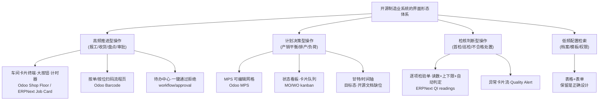
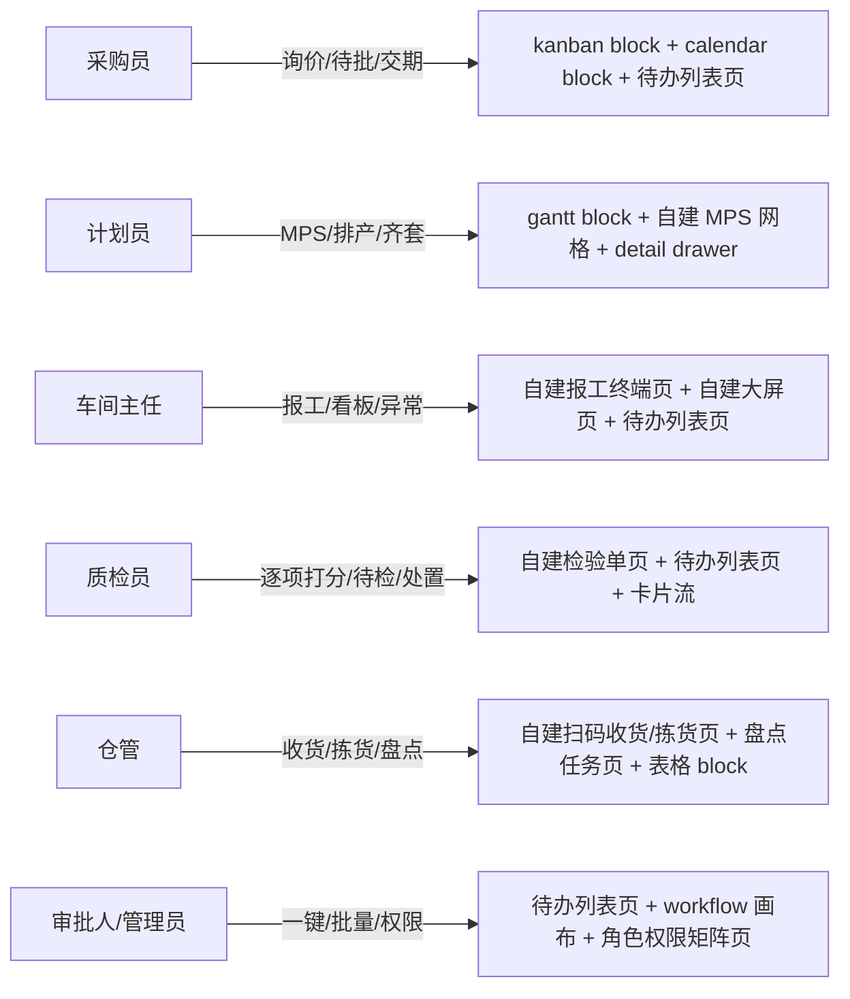

# W3 可用性调研 03 · 业界参考：制造业 ERP/MES 开源系统的真实操作者界面形态

> 研究日期：2026-09-27 | 来源：26 个（一手官方文档 11 / 源码级 9 / 厂商官方页 3 / 转述级 3） | 深度：Thorough
> 结论一句话：Odoo 与 ERPNext 早已不是「表格+表单」的单层系统——它们把**操作者的高频动线**剥离出来，交给车间卡片终端、逐项检验单、待办审批中心、MPS 网格、扫码流程页这五类专门形态；表格+表单只保留给低频配置与档案检索。W3 重构应按「分层形态体系」落地，而不是全盘去表格化。

---

## 1. 执行摘要

本次调研以 Odoo 18 官方用户文档（中文）、ERPNext v15 官方文档 + GitHub 源码（doctype 定义与前端 JS 即 UI 事实）、中文轻量 MES「黑湖小工单」官网、黑湖智造 App Store 页、钉钉官网/帮助转述，以及 NocoBase 官方 block 文档为证据源，逐项回答了六大调研问题。

最重要的发现有三条。**第一**，两大开源 ERP 在 2022–2023 年殊途同归地新增了「车间现场」专用界面：Odoo 的 [Shop Floor（车间MES）](https://www.odoo.com/documentation/18.0/zh_CN/applications/inventory_and_mrp/manufacturing/shop_floor/shop_floor_overview.html) 用「MO 信息卡 + 工单卡 + 操作员面板 + 计时器」替掉了旧平板视图，ERPNext 则在源码中新增了 [plant_floor doctype](https://github.com/frappe/erpnext/blob/version-15/erpnext/manufacturing/doctype/plant_floor/plant_floor.js)（工作位实时状态看板 + 库存摘要）。**第二**，质检形态不是普通表单：ERPNext [Quality Inspection](https://github.com/frappe/erpnext/blob/version-15/erpnext/stock/doctype/quality_inspection_reading/quality_inspection_reading.json) 的 readings 子表按「检验参数 → 规格值 → 最多 10 次读数 → 最小/最大值 → 逐行 Accepted/Rejected」组织，支持公式判定——这是「按检验项逐项打分」的源码级实锤。**第三**，审批流可视化配置在开源侧已存在：Frappe [Workflow Builder](https://github.com/frappe/frappe/blob/develop/frappe/workflow/doctype/workflow/workflow.js) 官方自述「可以拖拽状态并用连线创建流转（BETA）」。

同时必须诚实报告反例：**甘特排产在开源 ERP 文档中是缺席的**——Odoo 18 全部应用文档索引中检索 `gantt/甘特` 零命中（排产走 MPS 网格 + 按计划日期排序的车间卡片队列；ERPNext 用产能规划报表而非甘特），「工作中心×时间」甘特是商业 MES/企业版能力。这直接影响 W3 的甘特策略（见 §4）。

核心交付为 §3.7 的「五角色日常形态清单」总表（五角色 × 每角色 5 场景 × 业界标准形态 × NocoBase 落地面），§2 为十条关键发现索引。

## 2. 关键发现（Top 10）

1. **Odoo 车间MES 是全卡片式终端**：三个主视图（全部 MO 仪表板 / 每工作中心专属页 / 「我的」页），卡片头显示状态（Confirmed→In Progress→To Close），卡身列出已完成工单（绿勾）与当前工单，卡脚是 `登记生产`、`# 单位` 一键报数、`关闭生产`/`质检` 按钮、`⋮` 菜单（废料/加工单/加组件/打开后台 MO）（[Shop Floor 概览](https://www.odoo.com/documentation/18.0/zh_CN/applications/inventory_and_mrp/manufacturing/shop_floor/shop_floor_overview.html)）。
2. **报工计时是「点卡片头开始/再点暂停」**：工单卡头即计时开关，操作员面板同时显示多员工多工单双计时器；员工用 PIN 数字键盘登录终端（[车间每日监控](https://www.odoo.com/documentation/18.0/zh_CN/applications/inventory_and_mrp/manufacturing/shop_floor/shop_floor_tracking.html)）。
3. **MO 表单是 notebook 页签 + 智能按钮**：选 BoM 后「组件和工单选项卡自动填充」；确认后页面顶部出现「转移」智能按钮；工单页签内每行有 `开始`（起计时）/`已完成` 按钮，全部完成后点 `全部生产`（[两步制造官方文档](https://www.odoo.com/documentation/18.0/zh_CN/applications/inventory_and_mrp/manufacturing/basic_setup/two_step_manufacturing.html)）。
4. **计划员的排产形态是 MPS 网格而非甘特**：行=「需求预测/间接需求预测/+建议补货（带补货与重置按钮）/=预测库存」，列=月/周/日，构成官方给出的补货方程，可逐格编辑（[主生产计划](https://www.odoo.com/documentation/18.0/zh_CN/applications/inventory_and_mrp/manufacturing/workflows/use_mps.html)）；工作中心页提供 OEE/负荷/绩效指标（[工作中心](https://www.odoo.com/documentation/18.0/zh_CN/applications/inventory_and_mrp/manufacturing/advanced_configuration/using_work_centers.html)）。
5. **ERPNext Job Card（工卡）自带仪表盘组件与起停方法**：表单内有 `job_card_dashboard` HTML 字段（信息+计时器+动作按钮），源码白名单方法 `start_timer / pause_job / resume_job / complete_job_card`，完成弹窗分解「完成数/待求数/制程损失」并自动钳制上限（[job_card.js](https://github.com/frappe/erpnext/blob/version-15/erpnext/manufacturing/doctype/job_card/job_card.js)、[job_card.py](https://github.com/frappe/erpnext/blob/version-15/erpnext/manufacturing/doctype/job_card/job_card.py)）。
6. **ERPNext Work Order 表单挂「操作员仪表盘」入口**：`Create Job Card`、`Operator Dashboard`、`Return Components`、`Change Finished Item` 等自定义按钮直接长在工单表单上（[work_order.js](https://github.com/frappe/erpnext/blob/version-15/erpnext/manufacturing/doctype/work_order/work_order.js)）；Job Card 字段含 `barcode`、`expected_start/end_date`、`sub_operations`、员工多选、`quality_inspection_template`（[job_card.json](https://github.com/frappe/erpnext/blob/version-15/erpnext/manufacturing/doctype/job_card/job_card.json)）。
7. **质检=按检验项逐项打分子表**：`specification`（参数）+ `value`（验收标准）+ `reading_1..reading_10`（十次读数）+ `min_value/max_value` + 每行 `status(Accepted/Rejected)` + `acceptance_formula` 公式判定；主档 status 只有 Accepted/Rejected/Cancelled，inspection_type 分 Incoming/Outgoing/In Process（[QI Reading 源码](https://github.com/frappe/erpnext/blob/version-15/erpnext/stock/doctype/quality_inspection_reading/quality_inspection_reading.json)、[QI 主档](https://github.com/frappe/erpnext/blob/version-15/erpnext/stock/doctype/quality_inspection/quality_inspection.json)，文档入口 [Quality Inspection](https://docs.frappe.io/erpnext/user/manual/en/quality-inspection)）。
8. **审批流可视化配置已开源**：Frappe Workflow Builder 自述「可视化创建工作流，可拖拽状态并连线创建流转，侧栏更新属性（BETA）」（[workflow.js](https://github.com/frappe/frappe/blob/develop/frappe/workflow/doctype/workflow/workflow.js)）；文档侧有 [Workflow](https://docs.frappe.io/erpnext/user/manual/en/workflow) 与 [Workflow Actions](https://docs.frappe.io/erpnext/user/manual/en/workflow-actions)。NocoBase 侧 [Workflow: Approval 插件](https://docs.nocobase.com/plugins/@nocobase/plugin-workflow-approval/) 提供「专属审批节点与区块，用于管理单据并跟踪处理过程」。
9. **权限是「用户×应用」下拉矩阵 + 部门树**：Odoo 用户档案「访问权限」页签按应用下拉选「空白/无、用户:自己的文档、用户:所有文档、管理员」；分组表单含用户/继承/规则多页签；部门表单设「上级部门」后自动渲染 DEPARTMENT ORGANIZATION 组织架构图（[访问权限](https://www.odoo.com/documentation/18.0/zh_CN/applications/general/users/access_rights.html)、[部门](https://www.odoo.com/documentation/18.0/zh_CN/applications/hr/employees/departments.html)）。
10. **仓管高频=按单扫码 + 盘点任务分派**：Odoo 条码应用「操作→收货单卡 #待处理→扫码/+10 按钮/铅笔编辑数量→验证」；盘点由经理在「实物库存」按货位/产品建任务并指派用户，用户打开扫码应用即见「库存盘点」按钮上的待处理数（[条码收货](https://www.odoo.com/documentation/18.0/zh_CN/applications/inventory_and_mrp/barcode/operations/receipts_deliveries.html)、[条码盘点](https://www.odoo.com/documentation/18.0/zh_CN/applications/inventory_and_mrp/barcode/operations/adjustments.html)）。中文侧黑湖小工单官网同类表述：「生产工单一键下派、生产进度随时掌握、计件计时工资统计、现场车间智能看板」（[小工单官网](http://www.xiaogongdan.com.cn/)）。

## 3. 详细分析

### 3.1 Odoo Manufacturing：MO 的操作形态全景

**默认视图与推进动线。** 制造订单（MO）列表不是主操作面。官方文档的日常路径是：`制造 ‣ 操作 ‣ 制造订单` 打开某张 MO 的**表单**，在「工单」页签逐个点 `开始`（启动计时）和 `已完成`，全部工单完成后点顶部 `全部生产` 把 MO 置为完成并登记库存；或从工单行弹窗的 `打开车间` 按钮直接跳进车间MES 模块（[两步制造](https://www.odoo.com/documentation/18.0/zh_CN/applications/inventory_and_mrp/manufacturing/basic_setup/two_step_manufacturing.html)）。也就是说：**操作者最高频动作（推进状态/记录报工）发生在表单页签按钮和车间卡片终端，而不是列表**。

**表单 notebook 页签。** 同一文档明确：「选择 BoM 后，组件和工单选项卡会自动填充 BoM 上指定的组件和操作……请点击添加明细将其添加到组件和工单选项卡」；二/三步制造时表单顶部出现「转移」智能按钮打开组件拣选调拨。组件（物料）、工单（工序）、杂项（备注/责任人等）分区即用户假设中的 notebook 结构，且有官方截图佐证。

**车间MES（Shop Floor）——Odoo 版报工终端。** 模块定位原文：「车间MES 提供了一个可视界面来处理生产订单 (MOs) 和工单。它还允许制造员工跟踪在生产和工单上花费的时间」，且「替换了制造应用的平板视图功能，仅在 Odoo 16.4 及更高版本中可用」（[车间生产看板](https://www.odoo.com/documentation/18.0/zh_CN/applications/inventory_and_mrp/manufacturing/shop_floor/shop_floor_overview.html)）。形态要素（全部来自官方文档逐条核实）：

- **MO 信息卡**：头（MO 号/产品/数量/状态）+ 身（已完成工单绿勾列表、当前工单按钮、`登记生产` 行）+ 脚（`关闭生产` 或 `质检` 按钮、`撤销`、`⋮` 菜单：Scrap / Add Work Order / Add Component / Open Backend MO）。
- **`# 单位` 一键报数**：「点击 # 单位按钮，自动将 MO 创建数量登记为已生产数量」——为不识字/戴手套场景设计的大按钮交互。
- **工作中心专属页**：每页只显示分派给该工作中心、且前置工单已完成的工单卡；工单卡身是**步骤清单**（点行弹说明、或点复选框直接完成），最后一步即 `登记生产`；完成按 `标记为已完成`（有后续工单）或 `关闭生产`（最后一单），卡片淡出动画 + `撤销`。
- **操作员面板**：左侧常驻，多员工登入（PIN 数字键盘），激活员工高亮蓝；员工名下挂其正在做的多张工单与各自计时器。
- **优先级即排序**：仪表板与工作中心页按 MO 的 Scheduled Date 排序，官方给了三张 MO 的排序示例——**排产结果在车间侧的表达是「卡片队列顺序」，不是甘特条**。
- **质量内嵌**：MO 级质检在卡脚 `质检` 弹窗完成；工单级异常用 `⋮ → Create a Quality Alert` 直接拉起质检告警表单。

**每日监控（计时/工时）。** 「点击工单卡头开始计时，再点一次暂停」；`标记为已完成` 后计时停止；实际工时回流到 MO 工单页签的 Real Duration 列（[车间每日监控](https://www.odoo.com/documentation/18.0/zh_CN/applications/inventory_and_mrp/manufacturing/shop_floor/shop_floor_tracking.html)）。

**计划员形态。** MPS 是「人工计划工具」，页面为可编辑网格：时间列（月/周/日 × N 列）× 产品行（期初预测库存/需求预测/间接需求预测/+建议补货[带补货、重置按钮]/=预测库存），满足官方给出的等式 `需求预测 + 建议补货 = 预测库存`（[MPS](https://www.odoo.com/documentation/18.0/zh_CN/applications/inventory_and_mrp/manufacturing/workflows/use_mps.html)）。工作中心档案定义工时与产能，是「OEE 目标/负荷/绩效」的数据源（[工作中心](https://www.odoo.com/documentation/18.0/zh_CN/applications/inventory_and_mrp/manufacturing/advanced_configuration/using_work_centers.html)）。

### 3.2 ERPNext Manufacturing：工卡 + 车间现场 + 逐项检验

> 说明：docs.frappe.io 为纯 SPA，正文无法静态抓取（见 §7），故本节证据取自 GitHub `version-15` 分支源码（doctype JSON = 表单字段与页签，JS = 按钮与交互），文档 URL 作为规范引用入口。

**Job Card（工卡）。** 表单字段（[job_card.json](https://github.com/frappe/erpnext/blob/version-15/erpnext/manufacturing/doctype/job_card/job_card.json)）分页签组织：主信息（工单/工作位/工序/计划量/WIP 仓）→ `time_logs` 子表（实际工时）→ 原材料页签 → 子工序页签 → 纠正工序页签 → 连接页签；另有 `barcode`、`expected_start_date/expected_end_date`、员工多选、`quality_inspection`/`quality_inspection_template`、`is_paused`。交互（[job_card.js](https://github.com/frappe/erpnext/blob/version-15/erpnext/manufacturing/doctype/job_card/job_card.js)）：内嵌 `job_card_dashboard` 仪表盘组件（信息+计时器+动作按钮）；`setup_job_action_buttons` 渲染起/停；`complete_job_card` 弹窗强制「完成数+待求数+制程损失=本循环计划数」，并自动钳制不超过最大可完成量；物料不足时挂 `Material Request`/`Material Transfer` 按钮。后端（[job_card.py](https://github.com/frappe/erpnext/blob/version-15/erpnext/manufacturing/doctype/job_card/job_card.py)）白名单方法 `start_timer/pause_job/resume_job/complete_job_card/make_time_log`。文档入口：[Job Card](https://docs.frappe.io/erpnext/user/manual/en/job-card)。

**Work Order（工单）。** 表单按钮族（[work_order.js](https://github.com/frappe/erpnext/blob/version-15/erpnext/manufacturing/doctype/work_order/work_order.js)）：`Create Job Card`（Create 组）、`Operator Dashboard`（直达车间现场）、`Return Components`、`Change Finished Item`（弹窗换产成品）、`Alternate Item`（替代料）。提交前有 intro 提示「Submit this Work Order for further processing」——状态机推进靠表单按钮而非列表。文档入口：[Work Order](https://docs.frappe.io/erpnext/user/manual/en/work-order)。

**Plant Floor（车间现场，v15 新增）。** [plant_floor.js](https://github.com/frappe/erpnext/blob/version-15/erpnext/manufacturing/doctype/plant_floor/plant_floor.js)：`Create Workstation` 按钮建工作位（初始状态 Off）；`prepare_workstation_dashboard` 渲染工作位仪表盘；`update_realtime_status` 订阅 `frappe.realtime` 的 `update_workstation_status` 事件实时刷新工作位状态；`prepare_stock_dashboard` + `get_stock_summary`（[plant_floor.py](https://github.com/frappe/erpnext/blob/version-15/erpnext/manufacturing/doctype/plant_floor/plant_floor.py) 白名单）渲染带货位/物料/物料组筛选的库存摘要面板，并可从工作位直接 `make_stock_entry` 生成库存调拨。这本质是**电子看板/产线状态屏（Andon 形态）**+ 按工作位取放料的车间视图。

**Quality Inspection（质检单）。** 主档（[quality_inspection.json](https://github.com/frappe/erpnext/blob/version-15/erpnext/stock/doctype/quality_inspection/quality_inspection.json)）：`inspection_type`（Incoming/Outgoing/In Process）挂 `reference_type`（Purchase Receipt/Purchase Invoice/Subcontracting Receipt/…Dynamic Link）→ 检品（Item/Serial/Batch/Sample Size）→ 检验人与复核人 → 模板 → **readings 子表** → 总判定 `status(Accepted/Rejected/Cancelled)`。readings 子表（[源码](https://github.com/frappe/erpnext/blob/version-15/erpnext/stock/doctype/quality_inspection_reading/quality_inspection_reading.json)）逐行：`specification`（检验参数）+ `value`（验收标准）+ `reading_1..10` + 数值检验区（`numeric/min_value/max_value/reading_value`）+ `formula_based_criteria/acceptance_formula` + **行级 `status(Accepted/Rejected)`**。即「按检验项逐项打分、逐项判定、汇总总判」的完整形态，且判定可公式化自动完成。文档入口：[Quality Inspection](https://docs.frappe.io/erpnext/user/manual/en/quality-inspection)、[Quality Management](https://docs.frappe.io/erpnext/user/manual/en/quality-management)。

**计划/排产与工位。** 文档树提供 [Production and Material Planning](https://docs.frappe.io/erpnext/user/manual/en/production-and-material-planning)（含 capacity planning 子题）与 [Workstation](https://docs.frappe.io/erpnext/user/manual/en/workstation)；源码侧 `production_plan` doctype 存在 `get_item_details`/计划单生成物料需求等能力。ERPNext 的排产表达是**产能规划报表 + 工卡计划时间（expected_start/end + scheduled_time_logs）**，未见原生甘特。

### 3.3 中文 MES 形态（黑湖系 + 参照）

**黑湖小工单（黑湖智造旗下超轻 MES，官网一手）。** 首页原文：「黑湖小工单是一款超轻量生产管理小程序：生产工单一键下派、生产进度随时掌握、计件计时工资统计、现场车间智能看板，上手仅需 10 分钟」；产品分区为「生产管理（生产进度管控/报工数据收集/计时计件工资/生产报表看板）」「点检、保养、维修管理（维养日志/点检/生产记录报表）」「库存管理（库存台账/库存收发）」（[小工单官网](http://www.xiaogongdan.com.cn/)）。关键形态信号：**报工是「数据收集」动作而非表单录入；看板是「现场车间智能看板」（大屏形态）；工单是「一键下派」（推送而非等人来查）**。

**黑湖智造 App Store 页（厂商一手描述）。** 应用名「黑湖智造 - 让数据驱动制造」，开发者为上海黑湖科技（[App Store](https://apps.apple.com/cn/app/%E9%BB%91%E6%B9%96%E6%99%BA%E9%80%A0-%E8%AE%A9%E6%95%B0%E6%8D%AE%E9%A9%B1%E5%8A%A8%E5%88%B6%E9%80%A0/id1371317342)）；面向车间工人移动报工。官网 blacklake.com 在本网络不可达（§7），其完整排产/质检模块文案未能一手核实，涉及处均降级为推断或略去。

**钉钉（审批参照，转述级）。** 钉钉官网定位「企业级智能移动办公平台」（[dingtalk.com](https://www.dingtalk.com/)）；「待办中心 + 同意/拒绝一键 + 批量审批」的界面事实在本轮无法一手取证（帮助中心不可达），仅有第三方教程描述审批流程设置与处理动线（转述级，[百度经验：钉钉流程审批设置](https://jingyan.baidu.com/article/c33e3f48429e7cab14cbb5d1.html)）。**该条在形态清单中按「业界常识 + 转述级」标注，不作为强证据。**

### 3.4 审批工作台形态

- **Odoo**：审批不是一个统一 App 形态，而是「上下文审批」——单据 chatter 讨论流 + 按权限组路由（如采购单按金额/权限组进入待批），用户档案「访问权限」矩阵决定谁能批（[访问权限](https://www.odoo.com/documentation/18.0/zh_CN/applications/general/users/access_rights.html)）；Studio 提供 approval rules 定制（文档树存在 [studio/approval_rules](https://www.odooai.cn/documentation/18.0/zh_CN/applications/studio/approval_rules.html)，企业版）。
- **ERPNext/Frappe**：Workflow = 状态（states，绑定 doc_status）+ 流转（transitions，含角色与允许的更新）+ Workflow Action（从列表/邮件链接一键执行流转）；配置器 Workflow Builder 官方自述「可视化创建工作流、拖拽状态、连线建流转（BETA）」（[workflow.js](https://github.com/frappe/frappe/blob/develop/frappe/workflow/doctype/workflow/workflow.js)；文档 [Workflow](https://docs.frappe.io/erpnext/user/manual/en/workflow)、[Workflow Actions](https://docs.frappe.io/erpnext/user/manual/en/workflow-actions)）。
- **NocoBase（我方平台）**：[Workflow: Approval 插件](https://docs.nocobase.com/plugins/@nocobase/plugin-workflow-approval/) 提供「通过动作按钮或 API 发起审批请求的触发器，专属审批节点与区块，用于管理单据并跟踪处理过程」，并有 [审批触发器](https://docs.nocobase.com/workflow/triggers/approval) 与 [审批节点](https://docs.nocobase.com/workflow/nodes/approval) 文档——W3 的待办中心可优先基于该插件扩展而非全自建。

### 3.5 组织与权限管理形态

- **Odoo 用户×应用矩阵**：用户档案「访问权限」页签，每个应用一个下拉（空白/无、用户:自己的文档、用户:所有文档、管理员），「管理」字段可授予「设置/访问权限」；分组（Groups）表单含「用户/继承/规则」页签，继承页签实现组间自动成员传递；部门表单通过「上级部门」字段构成树，保存后右上角渲染 **DEPARTMENT ORGANIZATION 组织架构图**（[access_rights](https://www.odoo.com/documentation/18.0/zh_CN/applications/general/users/access_rights.html)、[departments](https://www.odoo.com/documentation/18.0/zh_CN/applications/hr/employees/departments.html)）。审批人按部门/岗位路由即「经理字段 + 权限组」组合。
- **ERPNext**：权限体系分 Role/Role Profile/User Permission 三层，Permission Manager 提供按 doctype × role 的读写/提交/取消/共享矩阵编辑（文档入口 [Users and Permissions](https://docs.frappe.io/erpnext/user/manual/en/users-and-permissions)、[Permissions](https://docs.frappe.io/erpnext/user/manual/en/permissions)）；「按层级授用户权限」有专门文档（[user-permission-based-on-hierarchy](https://docs.frappe.io/erpnext/user/manual/en/user-permission-based-on-hierarchy)，即审批人沿部门树向上取主管的实现思路）。

### 3.6 仓库高频操作形态

- **Odoo 条码应用（按单驱动）**：入口屏「操作」→ 各操作类型卡片（收货单卡显示 `# 待处理`）→ 进入单据后逐行「扫码即加一 / `+10` 步进按钮 / 铅笔编辑数量（可 `/10 单位` 自动带入订单量）」→ 底部 `验证` 一次完结（[条码收发货](https://www.odoo.com/documentation/18.0/zh_CN/applications/inventory_and_mrp/barcode/operations/receipts_deliveries.html)）。
- **盘点（按货位驱动 + 任务分派）**：经理在 `库存 ‣ 操作 ‣ 实物库存` 按货位/产品创建盘点任务并**指派用户**；被指派者打开条码应用即在「库存盘点」按钮上看到待处理数；现场「扫货位条码 → 扫产品 → 改数量」（[条码盘点](https://www.odoo.com/documentation/18.0/zh_CN/applications/inventory_and_mrp/barcode/operations/adjustments.html)）。
- **ERPNext**：库存动线为 Stock Entry（多 purpose）+ Pick List + Stock Reconciliation（文档入口 [Pick List](https://docs.frappe.io/erpnext/user/manual/en/pick-list)、[Stock Reconciliation](https://docs.frappe.io/erpnext/user/manual/en/stock-reconciliation)、[条码追踪](https://docs.frappe.io/erpnext/user/manual/en/track-items-using-barcode)）；本轮未做源码级展开（见 §5）。
- **中文轻 MES 对照**：小工单把仓管收敛为「库存台账 + 库存收发」两屏（[官网](http://www.xiaogongdan.com.cn/)）。

### 3.7 ★ 核心交付：真实操作者日常形态清单（五角色 × 场景 × 业界形态 × NocoBase 落地面）

| 角色 | 高频日常场景 | 业界标准形态（证据源） | NocoBase 落地面 |
|---|---|---|---|
| **采购员** | ① 询价/比价推进 | RFQ 卡片按阶段推进；Odoo 看板为通用视图形态（Kanban 是 Odoo 官方列出的标准视图类型，NocoBase 同） | kanban block（分组=询价状态单选字段，拖拽换阶段[官方](https://docs.nocobase.com/interface-builder/blocks/data-blocks/kanban)） |
| | ② 待我审批的采购单 | 待办中心 + 一键通过/拒绝（Odoo 权限组路由 + chatter；钉钉待办·转述级） | 待办列表页（workflow-approval 插件[专属审批区块](https://docs.nocobase.com/plugins/@nocobase/plugin-workflow-approval/)）+ detail drawer 快捷动作 |
| | ③ 到货跟踪/催单 | 单据卡片 + 交期日历（Odoo 智能按钮 + Scheduled Date 日历弹窗） | calendar block（[官方](https://docs.nocobase.com/interface-builder/blocks/data-blocks/calendar)）+ detail drawer |
| | ④ 收货核对 | 按单扫码收货：收货单卡 `#待处理` → 扫码/+步进/铅笔改量 → 验证（[Odoo 条码](https://www.odoo.com/documentation/18.0/zh_CN/applications/inventory_and_mrp/barcode/operations/receipts_deliveries.html)） | 自建扫码收货页（按单驱动，子表+扫码输入+大按钮验证） |
| | ⑤ 价格/供应商档案维护 | 低频检索：表格+表单保留（Odoo/ERPNext 后台同） | 表格 block（现状保留即可） |
| **计划员** | ① 月/周产销平衡 | MPS 可编辑网格：需求/建议补货/预测库存方程 + 补货/重置按钮（[Odoo MPS](https://www.odoo.com/documentation/18.0/zh_CN/applications/inventory_and_mrp/manufacturing/workflows/use_mps.html)） | 自建 MPS 网格页（表格 block 组合或 JS block；逐格编辑+按钮） |
| | ② 工单排产/调序 | 目标态=甘特（工作中心×时间，商业 MES 常态）；开源侧以「MO 计划日期排序的卡片队列 + 工卡 expected_start/end」表达（Shop Floor 排序规则、job_card.json） | gantt block 官方即有（标题/起止/进度拖拽/颜色[官方](https://docs.nocobase.com/interface-builder/blocks/data-blocks/gantt)）；SVG 自建仅作兜底 |
| | ③ MO 状态推进 | 状态化看板/状态栏：草稿→确认→进行中→完成（Odoo MO 状态机；卡片头状态） | kanban block（分组=MO 状态）+ 行内「确认/生产」动作 |
| | ④ 物料齐套检查 | 「Ready to Start = 组件齐套」过滤（Shop Floor All 页默认过滤）；MO 组件页签（两步制造文档） | detail drawer 组件页签 + 齐套预警待办列表页 |
| | ⑤ 产能负荷查看 | 工作中心 OEE/负荷/绩效指标页（[工作中心](https://www.odoo.com/documentation/18.0/zh_CN/applications/inventory_and_mrp/manufacturing/advanced_configuration/using_work_centers.html)） | 图表 block + 工作中心 detail drawer |
| **车间主任** | ① 工单推进/报工 | 车间卡片终端：MO 卡（登记生产/#单位/关闭生产/⋮菜单）+ 工单卡（步骤勾选/标记完成）+ 计时器（[Shop Floor](https://www.odoo.com/documentation/18.0/zh_CN/applications/inventory_and_mrp/manufacturing/shop_floor/shop_floor_overview.html)） | **自建报工终端页**（全屏卡片+大按钮+计时+PIN 登录；项目内 ui-mobile 聊天流之外的「终端态」页面） |
| | ② 产线状态总览 | 电子看板/产线状态屏：Plant Floor 工作位实时状态（realtime 事件驱动）+ 小工单「现场车间智能看板」（[plant_floor.js](https://github.com/frappe/erpnext/blob/version-15/erpnext/manufacturing/doctype/plant_floor/plant_floor.js)、[小工单](http://www.xiaogongdan.com.cn/)） | 自建大屏页（websocket/轮询刷新工作位状态色块） |
| | ③ 异常处置（缺料/质量/废料） | 卡片 `⋮` 菜单：Scrap / Create Quality Alert / Add Component（Shop Floor 概览） | 待办列表页（异常卡）+ detail drawer 处置动作 |
| | ④ 人员与工时 | 操作员面板：PIN 登录、多员工多工单双计时、工时回填 Real Duration（[每日监控](https://www.odoo.com/documentation/18.0/zh_CN/applications/inventory_and_mrp/manufacturing/shop_floor/shop_floor_tracking.html)） | 报工终端页内嵌操作员栏；工时报表图表 block |
| | ⑤ 日报/产量汇总 | 生产报表看板（小工单「生产报表看板」；Odoo 生产分析报表） | 图表 block 组合仪表盘 |
| **质检员** | ① 首检/巡检执行 | **按检验项逐项打分单**：参数+规格+读数×10+上下限+行级判定+公式判定（[QI Reading 源码](https://github.com/frappe/erpnext/blob/version-15/erpnext/stock/doctype/quality_inspection_reading/quality_inspection_reading.json)）；Odoo 质检在卡片/工单弹窗内完成（Shop Floor） | **自建检验单页**：子表逐项行（读数输入+自动判定色）+ 总判按钮；非普通表单 |
| | ② 待检任务队列 | Job Card 挂 `quality_inspection_template` 自动生成待检；Odoo 质检点随工序步骤触发 | 待办列表页（按模板生成的待检任务） |
| | ③ 不合格处置 | status=Rejected → 退货/让步/返工流（QI 主档状态机；Odoo Quality Alert 表单） | 卡片流（处置决策）+ 审批待办 |
| | ④ 质量趋势 | 报表（Odoo 生产分析/ERPNext quality-inspection-summary） | 图表 block |
| | ⑤ 检验模板维护 | 低频：模板主档表格（QI Template） | 表格 block（保留） |
| **仓管** | ① 收货 | 按单扫码：收货单卡 `#待处理` → 扫码/数量 → 验证（[Odoo 条码收货](https://www.odoo.com/documentation/18.0/zh_CN/applications/inventory_and_mrp/barcode/operations/receipts_deliveries.html)） | **自建扫码收货页**（按单驱动） |
| | ② 拣货/发货 | 同上按单扫码拣选（Odoo 条码 transfer 流程；ERPNext Pick List 文档入口） | 自建扫码拣货页 |
| | ③ 盘点 | **按货位驱动 + 任务分派**：经理按货位/产品建任务指派 → 扫货位 → 扫产品 → 改量（[Odoo 条码盘点](https://www.odoo.com/documentation/18.0/zh_CN/applications/inventory_and_mrp/barcode/operations/adjustments.html)） | 盘点任务页（按货位分组卡片 + 扫码输入；任务=被指派记录） |
| | ④ 库存台账查询 | 低频检索表格（小工单「库存台账」） | 表格 block（保留）+ 库位 SVG 图（项目已有） |
| | ⑤ 移库/调拨 | 工作位旁直接 make_stock_entry（Plant Floor）或按单转移（Odoo barcode transfers） | detail drawer 快捷移库 / 扫码移库页 |
| **（横切）审批人** | 待办处理 | 待办中心列表 + 一键通过/拒绝（+批量，钉钉为转述级）；Frappe Workflow Builder 拖拽节点图配置（[workflow.js](https://github.com/frappe/frappe/blob/develop/frappe/workflow/doctype/workflow/workflow.js)） | 待办列表页（多选批量动作）+ NocoBase workflow 画布配置 |
| **（横切）管理员** | 组织/权限维护 | 用户×应用下拉矩阵 + 分组继承页签 + 部门树组织图（[Odoo](https://www.odoo.com/documentation/18.0/zh_CN/applications/general/users/access_rights.html)） | 部门树页 + 角色权限矩阵页（表格+树 block） |

### 3.8 形态分层模型（Mermaid）

开源制造业系统给出的不是「用看板替换表格」，而是按操作频率与认知负荷分层的形态体系：

五角色 → NocoBase 落地面的映射关系（用户给定的六件套 + 官方 block）：

## 4. 逆耳观点与风险（必读）

1. **「表格+表单」并没有被消灭，而是被正确分工。** 同一批官方文档同时证明：Odoo 的用户/分组/部门仍是表单+列表，ERPNext 的 doctype 本质仍是表单引擎；被替换的只是**操作者的高频动线**。W3 若把低频配置（价格档案、检验模板、权限）也强行卡片化，可用性会不升反降。正确目标是 §3.8 的分层，而非「去表格化」。
2. **甘特在开源 ERP 中是缺席形态，自建 SVG 甘特是本清单中风险最高的落地项。** 实测：Odoo 18 全应用文档索引检索 `gantt/甘特` 零命中，排产由「MPS 网格 + 计划日期排序的卡片队列 + 工卡 expected_start/end」承担；ERPNext 走产能规划报表。商业 MES 的排产甘特（黑湖等）本网络不可达未能一手核实。建议：优先用 NocoBase 官方 gantt block（支持进度拖拽），仅在其交互不满足时才启动 SVG 自建，且第一期范围限定「工作中心×工单」单一视图。
3. **车间终端的隐含成本被低估的风险。** Odoo Shop Floor 的卡片淡出动画、双计时器、PIN 面板、Ready-to-Start 齐套过滤，是多年打磨的交互闭环；每一条都有后端状态机支撑（计时=计时器事件、报数=库存移动、质检=质检点）。自建报工终端页若只做「大按钮」不做状态机闭环（如 Odoo 的「完成数+待求数+损失=计划数」强校验），会退化成一个更花的表单。
4. **ERPNext 新形态的成熟度存疑。** Plant Floor 源码版权头为 2023、Workflow Builder 官方自标 **BETA**；把 BETA 形态当「业界稳定标准」引用需谨慎，本报告仅将其作为形态方向证据。
5. **中文 MES 证据是厂商自述。** 小工单官网与黑湖 App Store 文案均为营销口径（「上手 10 分钟」），无第三方可用性评测；黑湖智造完整版官网不可达，其排产/质检模块形态未一手核实，报告中相关条目已保守处理。
6. **钉钉「批量审批」未一手证实。** 官网仅可确认产品定位；待办中心/批量操作的具体界面事实只有转述级来源。若 W3 需要以此立项，应补一次真实客户端截图取证。
7. **按单驱动 vs 按货位驱动是两套仓管心智。** Odoo 收货/拣货按单驱动，盘点按货位驱动；两者界面形态不同（单据卡 vs 货位分组任务）。W3 若只做一种「扫码页」，会有一半场景不适配。

## 5. 开放问题

1. **Odoo Enterprise 的 MRP 工单甘特**：文档缺席但产品内可能存在（企业版 `mrp_workorder`）。需在 Odoo 演示库（runbot/官方 demo）实测截图后才能写进形态清单的强证据列。
2. **ERPNext Pick List / Stock Reconciliation 的操作形态**：本轮仅有文档入口与 doctype 存在性，未做源码级字段/按钮展开；仓管场景的 ERPNext 侧证据弱于 Odoo 侧。
3. **钉钉/飞书审批中心的界面事实**：待办列表、批量操作、流程设计器节点图均需客户端实测或帮助中心一手页面（本网络不可达）。
4. **NocoBase workflow-approval 的「审批人按部门/岗位路由」能力边界**：插件文档确认专属审批区块与跟踪，但按组织树动态取审批人的表达（对照 ERPNext 的 user-permission-based-on-hierarchy）需在平台内实测——项目内该插件已启用，可安排一次冒烟验证。
5. **车间终端的离线/弱网与并发**：Odoo Shop Floor 依赖实时计时与多终端状态同步；本项目自建终端页需要提前确定弱网降级策略（本轮业界证据未覆盖）。

## 6. 来源

| # | 来源 | 类型 | 关键证据 | 日期 |
|---|---|---|---|---|
| 1 | [Odoo 18 zh_CN · 车间生产看板](https://www.odoo.com/documentation/18.0/zh_CN/applications/inventory_and_mrp/manufacturing/shop_floor/shop_floor_overview.html) | 一手文档 | MO 卡/工单卡/操作员面板/#单位一键报数/⋮菜单 | 2026-09-27 取证 |
| 2 | [Odoo 18 zh_CN · 车间每日监控](https://www.odoo.com/documentation/18.0/zh_CN/applications/inventory_and_mrp/manufacturing/shop_floor/shop_floor_tracking.html) | 一手文档 | PIN 登录/双计时器/Mark as Done/Real Duration | 同上 |
| 3 | [Odoo 18 zh_CN · 两步制造](https://www.odoo.com/documentation/18.0/zh_CN/applications/inventory_and_mrp/manufacturing/basic_setup/two_step_manufacturing.html) | 一手文档 | 组件/工单页签自动填充、智能按钮、开始/已完成/全部生产、打开车间 | 同上 |
| 4 | [Odoo 18 zh_CN · 主生产计划 MPS](https://www.odoo.com/documentation/18.0/zh_CN/applications/inventory_and_mrp/manufacturing/workflows/use_mps.html) | 一手文档 | 网格行结构/补货与重置按钮/补货方程 | 同上 |
| 5 | [Odoo 18 zh_CN · 工作中心](https://www.odoo.com/documentation/18.0/zh_CN/applications/inventory_and_mrp/manufacturing/advanced_configuration/using_work_centers.html) | 一手文档 | OEE/负荷/绩效定义 | 同上 |
| 6 | [Odoo 18 zh_CN · 条码收发货](https://www.odoo.com/documentation/18.0/zh_CN/applications/inventory_and_mrp/barcode/operations/receipts_deliveries.html) | 一手文档 | 收货单卡 #待处理/扫码/+步进/验证 | 同上 |
| 7 | [Odoo 18 zh_CN · 条码盘点](https://www.odoo.com/documentation/18.0/zh_CN/applications/inventory_and_mrp/barcode/operations/adjustments.html) | 一手文档 | 盘点任务分派/按货位扫码 | 同上 |
| 8 | [Odoo 18 zh_CN · 访问权限](https://www.odoo.com/documentation/18.0/zh_CN/applications/general/users/access_rights.html) | 一手文档 | 用户×应用下拉矩阵/分组继承页签 | 同上 |
| 9 | [Odoo 18 zh_CN · 部门](https://www.odoo.com/documentation/18.0/zh_CN/applications/hr/employees/departments.html) | 一手文档 | 上级部门树/组织架构图 | 同上 |
| 10 | [Odoo 18 zh_CN · 制造索引页](https://www.odoo.com/documentation/18.0/zh_CN/applications/inventory_and_mrp/manufacturing.html) | 一手文档 | 「工作中心控制面板+平板放车间」定位句 | 同上 |
| 11 | [Odoo 文档中文镜像 odooai.cn](https://www.odooai.cn/documentation/18.0/zh_CN/index.html) | 镜像（取证途径） | 官方站正文为 JS 注入，正文经镜像静态页核实（内容同源） | 同上 |
| 12 | [ERPNext v15 · job_card.js](https://github.com/frappe/erpnext/blob/version-15/erpnext/manufacturing/doctype/job_card/job_card.js) | 源码级 | 仪表盘组件/起停按钮/完成数强校验弹窗 | 同上 |
| 13 | [ERPNext v15 · job_card.py](https://github.com/frappe/erpnext/blob/version-15/erpnext/manufacturing/doctype/job_card/job_card.py) | 源码级 | start_timer/pause_job/resume_job/complete_job_card | 同上 |
| 14 | [ERPNext v15 · job_card.json](https://github.com/frappe/erpnext/blob/version-15/erpnext/manufacturing/doctype/job_card/job_card.json) | 源码级 | time_logs 子表/页签结构/条码/质检模板字段 | 同上 |
| 15 | [ERPNext v15 · work_order.js](https://github.com/frappe/erpnext/blob/version-15/erpnext/manufacturing/doctype/work_order/work_order.js) | 源码级 | Create Job Card/Operator Dashboard/Return Components 按钮 | 同上 |
| 16 | [ERPNext v15 · plant_floor.js/.py](https://github.com/frappe/erpnext/blob/version-15/erpnext/manufacturing/doctype/plant_floor/plant_floor.js) | 源码级 | 工作位实时状态看板/库存摘要/直接库存调拨 | 同上 |
| 17 | [ERPNext v15 · quality_inspection.json](https://github.com/frappe/erpnext/blob/version-15/erpnext/stock/doctype/quality_inspection/quality_inspection.json) | 源码级 | inspection_type/引用单据/总判 status | 同上 |
| 18 | [ERPNext v15 · quality_inspection_reading.json](https://github.com/frappe/erpnext/blob/version-15/erpnext/stock/doctype/quality_inspection_reading/quality_inspection_reading.json) | 源码级 | 读数×10/上下限/行级判定/公式判定 | 同上 |
| 19 | [Frappe · workflow.js（Workflow Builder）](https://github.com/frappe/frappe/blob/develop/frappe/workflow/doctype/workflow/workflow.js) | 源码级 | 「拖拽状态连线建流转」自述（BETA） | 同上 |
| 20 | [ERPNext 文档：Job Card / Work Order / Quality Inspection / Workflow / Workflow Actions / Production Planning / Pick List / Stock Reconciliation / Users and Permissions / Workstation](https://docs.frappe.io/erpnext/user/manual/en/job-card) | 文档入口（SPA） | 规范引用；正文无法静态抓取（§7） | 同上 |
| 21 | [黑湖小工单官网](http://www.xiaogongdan.com.cn/) | 厂商一手 | 工单一键下派/报工数据收集/现场车间智能看板/库存台账 | 同上 |
| 22 | [黑湖智造 · App Store 页](https://apps.apple.com/cn/app/%E9%BB%91%E6%B9%96%E6%99%BA%E9%80%A0-%E8%AE%A9%E6%95%B0%E6%8D%AE%E9%A9%B1%E5%8A%A8%E5%88%B6%E9%80%A0/id1371317342) | 厂商一手 | 应用定位与开发者（上海黑湖科技） | 同上 |
| 23 | [钉钉官网](https://www.dingtalk.com/) | 厂商一手（定位） | 平台定位；界面细节未取证 | 同上 |
| 24 | [百度经验 · 钉钉流程审批设置](https://jingyan.baidu.com/article/c33e3f48429e7cab14cbb5d1.html) | **转述级** | 审批设置/处理动线（仅作弱参照） | 同上 |
| 25 | [NocoBase · Workflow Approval 插件](https://docs.nocobase.com/plugins/@nocobase/plugin-workflow-approval/) | 一手文档 | 专属审批节点与区块/跟踪处理过程 | 同上 |
| 26 | [NocoBase · kanban / gantt / calendar block 文档](https://docs.nocobase.com/interface-builder/blocks/data-blocks/kanban) | 一手文档 | 看板分组与拖拽/甘特进度拖拽/日历快捷新建 | 同上 |

## 7. 方法论

- **通道降级链**：本轮 chrome-devtools MCP 未连接（无法浏览器取证），mmx web_search 工具报错，DuckDuckGo/Mojeek 超时，Bing 长查询被截断为品牌词。降级为：① 官方 sitemap 枚举（odoo.com/documentation/18.0/applications.html、docs.frappe.io hub sitemap、docs.nocobase.com sitemap）直接锁定一手 URL；② odooai.cn 镜像站核实 Odoo 正文（官方站正文为 JS 注入、curl 仅得外壳）；③ GitHub contents API（api.github.com）拉取 ERPNext/Frappe 源码取证；④ 360 搜索（so.com）补中文发现（小工单官网、App Store 页）。
- **取证与引用规范**：Odoo 条目引用官方 odoo.com URL（正文经镜像静态页核实，内容同源）；ERPNext 条目引用 docs.frappe.io 文档 URL 为规范入口、证据取自 version-15 分支源码（doctype JSON=表单结构、JS=按钮交互，即 UI 的 ground truth）；无法一手核实处（钉钉批量审批、黑湖完整版模块）明确标注转述级或略去。
- **检索与阅读量**：站点枚举 4 个 sitemap/索引；抓取页面 30+（Odoo 镜像 11、ERPNext 文档壳 14、NocoBase 5、中文 3）；深读并引用 26 个来源；源码文件 9 个。
- **局限**：docs.frappe.io 为 Alpine SPA，正文接口未对游客开放（REST 403），ERPNext 侧以源码替代文档正文；blacklake.com 与钉钉帮助中心在本网络不可达；Wayback 不可达。甘特相关结论依赖「文档索引零命中」这一可复核事实，未覆盖企业版产品内实际界面。
