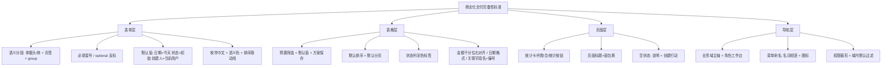

# 食品制造企业 ERP/MES 表单与表格 UX 完备性标准（商业化交付级）——行业最佳实践调研

> 研究日期：2026-09-28 | 来源：21 个来源（官方设计规范 11 + 官方产品手册 4 + 社区/生态 6） | 深度：Thorough（Exhaustive 口径的四层分解）
> 范围约束：**不含**「表格 vs 看板等专门形态的分工」（W3 已有结论：Odoo/ERPNext 高频动线专门形态、低频配置保留表格）。只覆盖表单/表格/页面/导航四层细化标准。

---

## 1. 执行摘要

针对 NocoBase 食品制造平台 80 个数据页面被批评的四大问题（裸字段堆砌、表格无筛选无格式化、关联字段显示 ID、页面无统计汇总），本次调研深读了 SAP Fiori 设计规范（Form/Filter Bar 两个核心页全量）、Ant Design v6 + ProComponents（Table/Form/Tag/Empty/Statistic/色彩规范/ProTable/ProLayout）、Odoo 官方开发文档（View architectures/Actions）、Frappe/ERPNext 官方文档（Link formatter/Form&View Settings/列表排序）、金蝶云产品手册（通用过滤/公共界面说明）及金蝶社区/YonSuite 生态实践，共 16 个深读页面 + 5 个检索佐证来源。

**核心结论**：被批评的四个问题恰好对应行业产品均已形成稳定惯例的四个层面，且中西方 ERP 在这些细节上高度趋同——(1) 表单按业务语义分组（单据头/体、页签、Odoo `<group>`、SAP Form Group），必填用星号、可选字段在必填占多数时反标 `(optional)`；(2) 列表必须预置筛选方案与默认值（SAP「为尽可能多的筛选器提供有意义的默认值」、金蝶「可选组织默认当前组织/单据状态默认全部」、YonSuite 生产订单默认「近 7 天+已审核+已开工」）；(3) 状态列用语义色标签（Odoo decoration 七色系与 antd 功能色板一一对应，金蝶提供「列表条件格式化」支持作废=红色）；(4) 列表页统计能力以「列聚合 + 统计卡 + 表单统计按钮」三种形态普遍存在（Odoo `sum/avg` 列聚合、antd Statistic 卡片、Odoo `oe_stat_button`）。

报告末尾提炼了 **30 条可直接落地为验收 checklist 的规则**，每条标注来源强度（多家产品一致 / 单家观点 / 综合推论）。

## 2. 关键发现

1. **必填标记有两条互补策略，且 SAP 与 Ant Design 独立收敛到同一设计**：必填字段标星号（SAP：星号仅在编辑视图显示；antd：`requiredMark`），当选填占少数且需要突出时，反转策略改为给选填字段标注 `(optional)`（SAP 官方推荐 `adding 'optional' at the end of the label`，antd `requiredMark="optional"` 模式）。([SAP Form](https://www.sap.com/design-system/fiori-design-web/v1-151/ui-elements/form-web-component)、[antd Form](https://raw.githubusercontent.com/ant-design/ant-design/master/components/form/index.zh-CN.md))
2. **列表筛选的「预置默认值」是 SAP 明文的第一条 Top Tip**：日期范围默认值应反映用户常用时间窗，避免大结果集直接加载；必选筛选器（mandatory filter）必须有默认值以避免首屏报错。([SAP Filter Bar](https://www.sap.com/design-system/fiori-design-web/v1-151/ui-elements/filter-bar))
3. **中文 ERP 的状态模型比西文产品细**：金蝶单据数据状态六态（暂存/创建/审核中/已审核/重新审核）+ 关闭状态 + 作废状态三轴分离，且过滤界面三轴默认全部为「全部」；YonSuite 生产订单列表默认过滤「近 7 天、未领料/部分领料、已审核+已开工」。([金蝶公共界面说明](https://help.open.kingdee.com/dokuwiki/doku.php?id=%E5%85%AC%E5%85%B1%E7%95%8C%E9%9D%A2%E8%AF%B4%E6%98%8E)、[YonSuite 案例](http://www.ahyonyou.com/news/1123.html))
4. **状态色板在中西方产品间存在稳定映射**：Odoo `decoration-*` 七色（success/warning/danger/info/muted/primary/bf/it）≈ antd 功能色（成功绿/警告橙/错误红/处理蓝）+ 中性灰；金蝶 BOS「列表条件格式化」同样支持按状态自定义颜色（官方示例即「作废是红色」）。([Odoo Views](https://www.odoo.com/documentation/master/developer/reference/user_interface/view_architectures.html)、[antd 色彩规范](https://raw.githubusercontent.com/ant-design/ant-design/master/docs/spec/colors.zh-CN.md)、[金蝶社区](https://vip.kingdee.com/article/327759605021559808))
5. **关联字段「显示 ID」被所有产品视为缺陷**：Frappe 官方给出两种正解——实体同时有编号和名称时显示 `编号: 名称`（link formatter），或用 Title Field 让描述性名称替代主键显示；Odoo many2one 默认渲染 display_name 并可配 tag 颜色字段。([Frappe Formatter](https://docs.frappe.io/framework/user/en/guides/desk/formatter_for_link_fields)、[Frappe Form & View Settings](https://docs.frappe.io/framework/user/en/basics/doctypes/form_&_view_settings)、[Odoo Views](https://www.odoo.com/documentation/master/developer/reference/user_interface/view_architectures.html))
6. **表格底部聚合（合计行）是开源 ERP 内建能力**：Odoo 列字段声明 `sum="Total"` / `avg="Average"` 即在列尾显示聚合值（仅对当前可见记录计算）；antd Table 提供 `summary` 总结栏。([Odoo Views](https://www.odoo.com/documentation/master/developer/reference/user_interface/view_architectures.html)、[antd Table](https://raw.githubusercontent.com/ant-design/ant-design/master/components/table/index.zh-CN.md))
7. **金额/日期格式化有明确工程参数**：antd Statistic 默认千分位 `,`、可设 `precision` 与前后缀（货币符号）；SAP 规定金额在编辑视图右对齐、显示视图左对齐、计量单位紧随其后不换行；Odoo 上下文变量 `today` 即 `YYYY-MM-DD`。([antd Statistic](https://raw.githubusercontent.com/ant-design/ant-design/master/components/statistic/index.zh-CN.md)、[SAP Form](https://www.sap.com/design-system/fiori-design-web/v1-151/ui-elements/form-web-component)、[Odoo Views](https://www.odoo.com/documentation/master/developer/reference/user_interface/view_architectures.html))
8. **查询表单（筛选区）不该有必填项**：ProTable 规范原文「table 的表单不需要任何的必选参数，所有点击搜索和重置都会触发 request」——录入表单与查询表单的必填策略相反。([ProTable](https://procomponents.ant.design/components/table))
9. **placeholder 的负面清单**：Odoo 官方明文 placeholder「不应是数据示例，因为用户会把占位文本误认为已填数据」；SAP 只在 label 不足以说明预期输入时才提供简短 placeholder。([Odoo Views](https://www.odoo.com/documentation/master/developer/reference/user_interface/view_architectures.html)、[SAP Form](https://www.sap.com/design-system/fiori-design-web/v1-151/ui-elements/form-web-component))
10. **菜单信息架构以业务域为主轴是跨产品共识**，角色差异通过「角色工作台 + 权限裁剪菜单 + 域内过滤默认值」吸收，而不是为每个角色复制一套菜单。金蝶甚至支持「同一单据按状态发布不同菜单并按状态隔离数据」。([金蝶社区](https://vip.kingdee.com/article/327759605021559808)、[Odoo Actions](https://www.odoo.com/documentation/master/developer/reference/backend/actions.html)、[ProLayout](https://procomponents.ant.design/components/layout))

## 3. 详细分析

### 3.0 四层标准总览

### 3.1 表单标准（数据录入）

#### F1. 字段分组

- **SAP Fiori Form**：表单由 Form Container → Group → Form Item（label+字段对）三级构成；「Group related information by using form and group titles」；一页多组时用组标题，多表单并列比单表单多组「视觉区隔更清晰」；响应式列数 S/M=1 列、L=2 列、XL=3 列；label 默认占 4/12 栅格。([SAP Form](https://www.sap.com/design-system/fiori-design-web/v1-151/ui-elements/form-web-component))
- **SAP Fiori elements 字段分组注解**：开发者可将应同屏展示的字段（如地址的街道/门牌/邮编）编入 FieldGroup，运行时渲染为同组。([SAP Help / SAPUI5 docs – Grouping of Fields](https://github.com/SAP-docs/sapui5/blob/main/docs/06_SAP_Fiori_Elements/grouping-of-fields-cb1748e.md)，检索佐证)
- **Odoo**：`<group>` 元素（可带 string 标题、可整组 `invisible` 条件隐藏）+ `<notebook>/<page>` 页签承载行项目等大块内容；单据头/单据体（x2many 内嵌 list/form 子视图）是原生结构。([Odoo Views](https://www.odoo.com/documentation/master/developer/reference/user_interface/view_architectures.html))
- **中文 ERP（金蝶/用友）**：单据 = 单据头（主信息区）+ 单据体（行项目表格）+ 页签（如「物料/财务/其他」），过滤/报表界面也分「快捷方案/条件/高级」页签。([金蝶通用过滤](https://help.open.kingdee.com/dokuwiki_std/doku.php?id=%E9%80%9A%E7%94%A8%E8%BF%87%E6%BB%A4)、[金蝶公共界面说明](https://help.open.kingdee.com/dokuwiki/doku.php?id=%E5%85%AC%E5%85%B1%E7%95%8C%E9%9D%A2%E8%AF%B4%E6%98%8E))
- **采购订单类表单的通用分组动线**（综合 Odoo purchase 模块与金蝶采购单手册的结构）：基本信息（单号/日期/组织）→ 交易对手（供应商/客户）→ 行项目（产品/数量/单价/税额）→ 交付（日期/仓库/地址）→ 财务与备注（币种/付款条件/备注）。此为多产品同构的「综合推论」级标准。

#### F2. 必填标记策略

- **星号 = 必填**：SAP「The label of a required field is marked with an asterisk (*). The asterisk is visible in edit view only.」；antd `Form` 的 `requiredMark` 默认 true（必填标星）。([SAP Form](https://www.sap.com/design-system/fiori-design-web/v1-151/ui-elements/form-web-component)、[antd Form](https://raw.githubusercontent.com/ant-design/ant-design/master/components/form/index.zh-CN.md))
- **optional 反标**：当选填占少数、需要显式提示时，SAP 推荐「adding 'optional' at the end of the label」；antd 提供 `requiredMark="optional"` 一键切换为「标注可选」。两家独立实现同一策略，可视为强共识。
- **动态必填**：Odoo 的 `required`/`readonly`/`invisible` 都接受 Python 表达式（如 `required="fname_c != 3"`），支持「选择了批次号则生产日期必填」类业务规则。([Odoo Views](https://www.odoo.com/documentation/master/developer/reference/user_interface/view_architectures.html))
- **决策规则（综合）**：业务闭环必需字段（单据日期、交易对手、行项目、数量）与统计口径字段必填；纯描述字段（备注、附件）选填；系统字段（创建人/创建时间/状态）不进录入区。

#### F3. 默认值策略

- **Odoo**：以 action context 的 `default_FIELD_NAME` 注入默认值（进入某菜单时自动带出），`today`/`now` 内置上下文变量提供当天日期。([Odoo Views](https://www.odoo.com/documentation/master/developer/reference/user_interface/view_architectures.html))
- **金蝶**：过滤与单据的「可选组织默认为当前组织」「单据状态/关闭状态/作废状态默认全部」。([金蝶通用过滤](https://help.open.kingdee.com/dokuwiki_std/doku.php?id=%E9%80%9A%E7%94%A8%E8%BF%87%E6%BB%A4))
- **antd**：`Form` 的 `initialValues`（初始化与重置时生效）。([antd Form](https://raw.githubusercontent.com/ant-design/ant-design/master/components/form/index.zh-CN.md))
- **落地规则（多家同构）**：单据日期=当天；状态=初始态（草稿/暂存/创建）；创建人=当前用户；组织=当前组织上下文；数值类（数量、单价）不带默认值或带安全默认（1）。

#### F4. 枚举中文化与颜色语义

- **antd 色彩规范**：「功能色代表了明确的信息以及状态，比如成功、出错、失败、提醒、链接等。功能色的选取需要遵守用户对色彩的基本认知……一套产品体系下，功能色尽量保持一致」；Tag 组件内建预设状态标签（success/processing/error/warning/default）与多彩标签；企业级产品用色「克制」，色彩仅用于信息传递、操作引导和交互反馈。([antd 色彩](https://raw.githubusercontent.com/ant-design/ant-design/master/docs/spec/colors.zh-CN.md)、[antd Tag](https://raw.githubusercontent.com/ant-design/ant-design/master/components/tag/index.zh-CN.md))
- **Odoo**：枚举字段可配 widget（如 `many2many_tags` + `color_field`），列表 `decoration-info/warning/danger/success/muted/bf/it` 按条件整行/整列着色。([Odoo Views](https://www.odoo.com/documentation/master/developer/reference/user_interface/view_architectures.html))
- **金蝶**：BOS 平台「列表条件格式化」按单据状态设置行颜色，官方示例「作废是红色」。([金蝶社区](https://vip.kingdee.com/article/327759605021559808))

| 业务状态 | 语义色 | Odoo decoration | antd 功能色 | 金蝶惯例 |
| --- | --- | --- | --- | --- |
| 草稿/暂存 | 灰 | muted | default | 默认色 |
| 待审/审核中 | 橙/蓝 | warning / info | warning / processing | 橙 |
| 已审核/通过 | 绿 | success | success | 绿 |
| 驳回/作废 | 红 | danger | error | 红（官方示例作废=红） |
| 进行中 | 蓝 | info | processing | 蓝 |

（前三列来自各产品官方文档；「金蝶惯例」列为社区文章示例 + 中文 ERP 通识，强度标注为单家+通识。）

#### F5. 字段排序与帮助文案

- **排序跟随业务动线**：SAP Top Tips 第一条「Order the form logically from a user's perspective. For example, ask for a user's name before asking them for their address.」（从用户视角逻辑排序：先名字后地址）。([SAP Form](https://www.sap.com/design-system/fiori-design-web/v1-151/ui-elements/form-web-component))
- **placeholder 写法**：SAP「若 label 不足以说明预期输入，提供简短的 placeholder（词或短语）」；Odoo「placeholder 是空字段帮助信息……不应是数据示例，防止用户误认为已填数据」；antd Form 提供 `tooltip`（问号提示）承载更长说明。([SAP Form](https://www.sap.com/design-system/fiori-design-web/v1-151/ui-elements/form-web-component)、[Odoo Views](https://www.odoo.com/documentation/master/developer/reference/user_interface/view_architectures.html)、[antd Form](https://raw.githubusercontent.com/ant-design/ant-design/master/components/form/index.zh-CN.md))
- **错误反馈**：SAP「输入元素处于错误或警告状态时，必须提供有意义的报错信息」；antd `scrollToFirstError` 提交失败自动滚动到第一个错误字段。([SAP Form](https://www.sap.com/design-system/fiori-design-web/v1-151/ui-elements/form-web-component)、[antd Form](https://raw.githubusercontent.com/ant-design/ant-design/master/components/form/index.zh-CN.md))

### 3.2 表格标准（数据列表）

#### T1. 筛选器配置

- **必配筛选的列类型（多家同构）**：状态（单据状态枚举）、日期范围（创建/单据日期）、交易对手（供应商/客户）、组织/部门、单号（搜索）。SAP：筛选栏由「Views + 基础搜索字段 + 筛选输入控件 + Go/Adapt Filters」构成，且「Always provide a set of predefined default filters」（必配 Basic 组：用例必需、高频使用、能显著缩减列表量的筛选）。([SAP Filter Bar](https://www.sap.com/design-system/fiori-design-web/v1-151/ui-elements/filter-bar))
- **预置默认值**：SAP「Provide meaningful default values for as many filters as possible to prevent unnecessary data from loading……A default value for date ranges should reflect the time frame the user would normally apply」；必选筛选（mandatory，星号标记）须预填避免首屏报错。([SAP Filter Bar](https://www.sap.com/design-system/fiori-design-web/v1-151/ui-elements/filter-bar))
- **金蝶过滤界面**：过滤方案（缺省方案+另存/复制/共享+「下次以此方案自动进入」）+ 条件（字段/比较/值/逻辑 and-or）+ 排序（多字段+升降序+优先级上下移）+ 显示隐藏列（显隐/宽度/顺序）。([金蝶通用过滤](https://help.open.kingdee.com/dokuwiki_std/doku.php?id=%E9%80%9A%E7%94%A8%E8%BF%87%E6%BB%A4))
- **YonSuite**：列表查询方案 + `beforeSearch` 脚本注入隐式过滤（同实体两页面按 `dmType` 隔离）；生产订单默认「近 7 天、未领料/部分领料、已审核+已开工」。([YonSuite 列表过滤](https://www.cnblogs.com/xqz0618/p/yonsuite_listfilter.html)、[YonSuite 生产订单案例](http://www.ahyonyou.com/news/1123.html))
- **ProTable**：按列自动生成查询表单，「查询表单不需要任何必选参数」；筛选/排序变化自动触发服务端请求并透传 sort/filter；筛选菜单可搜索（`filterSearch`）。([ProTable](https://procomponents.ant.design/components/table)、[antd Table](https://raw.githubusercontent.com/ant-design/ant-design/master/components/table/index.zh-CN.md))
- **折叠与摘要**：SAP 折叠态显示「N filters active」+ 前 5 个已应用筛选的逗号摘要，无筛选时显示「No filters active」。([SAP Filter Bar](https://www.sap.com/design-system/fiori-design-web/v1-151/ui-elements/filter-bar))

#### T2. 默认排序与分页

- **金蝶**：过滤界面「排序」页签，多字段+每字段升/降序+优先级可调（上下移）。([金蝶通用过滤](https://help.open.kingdee.com/dokuwiki_std/doku.php?id=%E9%80%9A%E7%94%A8%E8%BF%87%E6%BB%A4))
- **ERPNext**：每个 DocType 在 Customize Form 中配置 `Sort Field` + `Sort Order`（Asc/Desc），官方示例即「Item List 按编码降序」。([ERPNext Sorting Order](https://docs.frappe.io/erpnext/customizing-sorting-order-in-the-list-view))
- **Odoo**：window action `limit` 字段——「number of records to display in lists by default. Defaults to 80 in the web client」。([Odoo Actions](https://www.odoo.com/documentation/master/developer/reference/backend/actions.html))
- **antd**：列 `defaultSortOrder`（ascend/descend）、`sortDirections` 默认 `['ascend','descend']`。([antd Table](https://raw.githubusercontent.com/ant-design/ant-design/master/components/table/index.zh-CN.md))
- **落地规则（综合推论，标注为弱共识）**：单据列表默认按单据日期或创建时间**倒序**（最新在前）——ERPNext 官方示例与中文 ERP 实践支持，但无「必须倒序」的明文规范；主数据（物料/供应商）默认按编码**正序**。

#### T3. 状态列与彩色标签

见 3.1 F4 色板表。补充工程事实：Odoo `decoration-info="state == 'draft'"` 声明式条件着色、金蝶「列表条件格式化」、antd Tag `variant`（filled/solid/outlined）三态。([Odoo Views](https://www.odoo.com/documentation/master/developer/reference/user_interface/view_architectures.html)、[金蝶社区](https://vip.kingdee.com/article/327759605021559808)、[antd Tag](https://raw.githubusercontent.com/ant-design/ant-design/master/components/tag/index.zh-CN.md))

#### T4. 金额/日期/关联字段格式化

| 项目 | 行业惯例 | 来源 |
| --- | --- | --- |
| 金额千分位 | 默认 `,` 分组（antd Statistic `groupSeparator`） | [antd Statistic](https://raw.githubusercontent.com/ant-design/ant-design/master/components/statistic/index.zh-CN.md) |
| 精度 | `precision` 显式声明（金额通常 2 位） | 同上 |
| 货币符号 | 前缀 `prefix`（¥/$）或列头标注币种 | 同上 |
| 金额对齐 | 编辑视图右对齐、显示视图左对齐；单位紧随不换行 | [SAP Form](https://www.sap.com/design-system/fiori-design-web/v1-151/ui-elements/form-web-component) |
| 日期 | `YYYY-MM-DD`（Odoo `today` 上下文即此格式）；时间 `HH:mm`；dayjs 本地化 | [Odoo Views](https://www.odoo.com/documentation/master/developer/reference/user_interface/view_architectures.html)、[antd Statistic](https://raw.githubusercontent.com/ant-design/ant-design/master/components/statistic/index.zh-CN.md) |
| 关联字段 | `编号: 名称`（Frappe formatter）或 Title 替代主键；tag 形态带颜色（Odoo `many2many_tags` + color_field） | [Frappe Formatter](https://docs.frappe.io/framework/user/en/guides/desk/formatter_for_link_fields)、[Frappe Form & View Settings](https://docs.frappe.io/framework/user/en/basics/doctypes/form_&_view_settings) |
| 值类型格式化 | ProTable `valueType` 内置 money/date/dateTime 等免渲染格式化 | [ProTable](https://procomponents.ant.design/components/table) |
| 长文本 | 单元格省略 + tooltip（antd `ellipsis`，注意不与排序筛选同列共存） | [antd Table](https://raw.githubusercontent.com/ant-design/ant-design/master/components/table/index.zh-CN.md) |

#### T5. 列个性化与列聚合

- **列显隐/宽度/顺序**：金蝶「显示隐藏列」页签（显隐+宽度+顺序上下移）、SAP Adapt Filters 对话框（可见性+顺序）、Odoo `optional="show|hide"` 列（用户可切换）、antd Table `hidden`/`column` 统一配置。四家一致 → 强共识。([金蝶通用过滤](https://help.open.kingdee.com/dokuwiki_std/doku.php?id=%E9%80%9A%E7%94%A8%E8%BF%87%E6%BB%A4)、[SAP Filter Bar](https://www.sap.com/design-system/fiori-design-web/v1-151/ui-elements/filter-bar)、[Odoo Views](https://www.odoo.com/documentation/master/developer/reference/user_interface/view_architectures.html)、[antd Table](https://raw.githubusercontent.com/ant-design/ant-design/master/components/table/index.zh-CN.md))
- **列聚合**：Odoo `sum="Total"`/`avg="Average"` 在列尾显示聚合（仅统计当前可见记录；分组时数值列自动按组聚合）；antd Table `summary` 总结栏。([Odoo Views](https://www.odoo.com/documentation/master/developer/reference/user_interface/view_architectures.html)、[antd Table](https://raw.githubusercontent.com/ant-design/ant-design/master/components/table/index.zh-CN.md))
- **批量操作**：ProTable rowSelection + alert 承载批量信息（tableAlertRender）。([ProTable](https://procomponents.ant.design/components/table))

### 3.3 页面标准（列表页/详情页）

#### P1. 顶部统计卡

- **antd Statistic**：「当需要突出某个或某组数字时」「在卡片中使用」——数值+标题+单位（前后缀）构成统计卡。([antd Statistic](https://raw.githubusercontent.com/ant-design/ant-design/master/components/statistic/index.zh-CN.md))
- **Odoe 表单统计按钮**：`oe_stat_button`（图标+数值+文案，可点击跳转）常驻单据头部，如「发货/未发货数量」。([Odoo Views](https://www.odoo.com/documentation/master/developer/reference/user_interface/view_architectures.html))
- **金蝶报表**：过滤界面提供「分组汇总」设置（分组字段+汇总级次），报表层做小计/合计。([金蝶通用过滤](https://help.open.kingdee.com/dokuwiki_std/doku.php?id=%E9%80%9A%E7%94%A8%E8%BF%87%E6%BB%A4))
- **ERPNext**：各业务域有 Dashboard 页（Sales/Manufacturing/Purchase Dashboard 等）。([ERPNext Dashboards](https://docs.frappe.io/erpnext/erpnext/erpnext-dashboards))
- **落地惯例（综合推论）**：单据列表页 3–5 张卡：单据数（按状态拆：待办/进行/完成）+ 金额合计（本页筛选范围内）+ 异常数（驳回/逾期）；主数据列表不加金额卡。

#### P2. 页面说明/引导块

- ProLayout + PageContainer「自动生成面包屑、页面标题」，面包屑即路径引导。([ProLayout](https://procomponents.ant.design/components/layout))
- SAP Filter Bar 折叠态摘要承担「当前页面正在看什么数据」的说明职能。([SAP Filter Bar](https://www.sap.com/design-system/fiori-design-web/v1-151/ui-elements/filter-bar))
- 常驻大段说明块在五家产品中均**非默认配置**（金蝶以字段 tooltip、Odoo 以字段 `help`/按钮 `help` 属性承载）——引导块应克制，优先用空状态与 placeholder 承载引导。（多家反证 → 「无大段说明块」本身是惯例）

#### P3. 空状态

- **antd Empty**：「当目前没有数据时，用于显式的用户提示」「初始化场景时的引导创建流程」——组件签名即 `<Empty><Button>创建</Button></Empty>`（空状态内放创建行动按钮）。([antd Empty](https://raw.githubusercontent.com/ant-design/ant-design/master/components/empty/index.zh-CN.md))
- **SAP Form 空值指示**：显示视图无值字段显示空状态指示符（`-` 类符号），帮助扫读；编辑视图为空则显示 placeholder。([SAP Form](https://www.sap.com/design-system/fiori-design-web/v1-151/ui-elements/form-web-component))
- **antd Table locale**：`filterEmptyText`/空数据文案可全局配置（zh_CN 默认「暂无数据」）。([antd Table](https://raw.githubusercontent.com/ant-design/ant-design/master/components/table/index.zh-CN.md))
- **落地规则**：区分「无数据」（提示语 + 创建按钮）与「筛选无结果」（提示语 + 清除筛选按钮）两种空态。

### 3.4 导航标准（菜单 IA）

#### N1. 信息架构：业务域主轴 + 角色工作台

- **Odoo**：顶级 = 应用（Apps，即业务域：采购/销售/制造/库存/财务），应用内二级菜单按「单据 → 配置 → 报表」组织；window action 可带 `domain` 隐式过滤实现「同一模型不同菜单看不同数据」。([Odoo Actions](https://www.odoo.com/documentation/master/developer/reference/backend/actions.html))
- **金蝶**：主控台按业务域分组（「主控台菜单明细维护」管理节点）；支持「同一单据根据单据状态发布不同菜单并按状态隔离」。([金蝶社区](https://vip.kingdee.com/article/327759605021559808))
- **YonSuite**：官方导航即按「营销、供应链、制造、采购、财务、税务、金融、人力、协同、平台、项目」领域分组。([YonSuite 官网](https://www.yonsuite.com/))
- **ProLayout**：mix 模式把一级菜单切到顶栏、二级留侧栏；菜单数据可服务端下发（`menuDataRender`）；按 pathname 自动选中 + 面包屑。([ProLayout](https://procomponents.ant.design/components/layout))
- **八类角色的落地结论（综合推论）**：菜单按业务域（采购/计划/车间/质检/仓管/销售/财务/系统管理）分组为主轴；角色差异用三层吸收——(1) 首页/工作台按角色装配（待办、快捷入口）；(2) 权限裁剪菜单可见性；(3) 域内默认过滤方案按角色预置（如仓管默认「待收货」、质检默认「待检」）。不要为每角色复制菜单树。

#### N2. 菜单命名

- **名词短语为主**：五家产品的菜单项均为「单据/对象名词」（采购订单、供应商、生产订单）而非动宾（创建订单）；「操作型」入口只出现在按钮层（新增/审核/提交）。金蝶列表工具栏动词按钮（提交/审核/禁用/反禁用/分配/打印/引入/引出）与 Odoo 按钮（`string="Create document"`）均为动宾，但菜单层保持名词。（多家一致）
- **中英文**：antd 生态用 `locale` 字段做菜单国际化；中文交付以中文为主、代码层保留英文 key。([ProLayout](https://procomponents.ant.design/components/layout))

#### N3. 图标

- **ProLayout**：菜单 `icon` 直接用 antd 图标体系；「重定向防止切换白屏」。([ProLayout](https://procomponents.ant.design/components/layout))
- **Odoo**：图标体系 FontAwesome（`icon="fa-trash"` 等）+ 应用图标。([Odoo Views](https://www.odoo.com/documentation/master/developer/reference/user_interface/view_architectures.html))
- **落地惯例**：一级菜单（业务域）配图标、风格统一同一图标库；二级及以下不配图标（文本为主），与金蝶主控台/ProLayout 默认形态一致。

## 4. 反面观点与风险（Contrarian Views）

- **「完备性」不等于「堆满功能」**：antd 色彩规范明确警告「色彩在使用时更多的是基于信息传递、操作引导和交互反馈等目的……理性的选择颜色是关键」——若 80 页全部加满筛选/统计卡/彩色标签，反而破坏效率；统计卡应只在有决策价值的列表出现（多产品 Dashboard 是独立页而非每页强配）。([antd 色彩](https://raw.githubusercontent.com/ant-design/ant-design/master/docs/spec/colors.zh-CN.md))
- **列个性化与性能的张力**：金蝶「显示隐藏列」+ SAP Adapt Filters 都把列管理交给用户，前提是元数据驱动渲染；NocoBase 若为每页硬编码列配置，维护成本会随 80 页×个性化需求爆炸。
- **默认过滤是双刃剑**：SAP 建议「为尽可能多的筛选器提供默认值」，但金蝶公共字段说明显示状态默认「全部」——若默认值选错（如默认只看「已审核」），用户会误以为数据丢失；YonSuite 案例正是「默认过滤后部分数据不显示」引出的排查需求。默认值必须显眼可发现（SAP 折叠摘要条即为此设计）。([SAP Filter Bar](https://www.sap.com/design-system/fiori-design-web/v1-151/ui-elements/filter-bar)、[金蝶公共界面说明](https://help.open.kingdee.com/dokuwiki/doku.php?id=%E5%85%AC%E5%85%B1%E7%95%8C%E9%9D%A2%E8%AF%B4%E6%98%8E)、[合树云排查文](https://www.heshuyun.com/1425.html))
- **状态色无强制国际标准**：本文色板表是跨产品收敛结果而非规范条文；食品行业若有「不合格品红色警示」等法规性颜色要求（如 GMP 目视管理），应以行业安全色（红=禁止/不合格）优先覆盖通用色板。
- **单家来源的规则要谨慎推广**：Odoo `limit=80`、Frappe `编号: 名称` formatter 属单家实现； adoption 前应以本平台用户验证。

## 5. 开放问题

1. **八类角色的「工作台」装配颗粒度**：本次调研确认「角色工作台+业务域菜单」为共识方向，但每角色工作台放几张待办卡、是否聚合跨域单据，未见公开规范，需在本平台做角色访谈后定义。
2. **SAP Analytical List Page（KPI 头部）与 Fiori Launchpad 角色分组**：SAP 新设计系统站点为重 JS 渲染，无法程序化枚举 floorplans 页面（本次仅取得 Form/Filter Bar 两页全文）；后续可人工浏览补证。
3. **80 页的完备性分级**：是否所有 80 页都应达到同一完备性（筛选+统计+格式化全配），还是按页面类型（单据/主数据/配置/报表）分级，需要与「页面预算」类内部治理规则联合决策（本报告未覆盖）。
4. **金额币种混排**：食品企业出口场景下多币种列表的列头币种标注 vs 单独币种列，未找到明确规范，需结合业务确认。

## 6. 来源

| # | 来源 | 类型 | 日期 | 访问 |
| --- | --- | --- | --- | --- |
| 1 | [SAP Fiori Design Guidelines – Form (v1.151)](https://www.sap.com/design-system/fiori-design-web/v1-151/ui-elements/form-web-component) | 官方设计规范（一手） | 持续更新（页面标注 2024-07 修订） | 2026-09-28 全文 |
| 2 | [SAP Fiori Design Guidelines – Filter Bar (v1.151)](https://www.sap.com/design-system/fiori-design-web/v1-151/ui-elements/filter-bar) | 官方设计规范（一手） | 持续更新 | 2026-09-28 全文 |
| 3 | [SAP Fiori elements – Grouping of Fields（SAPUI5 文档镜像）](https://github.com/SAP-docs/sapui5/blob/main/docs/06_SAP_Fiori_Elements/grouping-of-fields-cb1748e.md) | 官方开发者文档（一手） | 持续更新 | 检索摘要佐证 |
| 4 | [Ant Design – Table 组件文档（中文）](https://raw.githubusercontent.com/ant-design/ant-design/master/components/table/index.zh-CN.md)（线上版 [ant.design/components/table-cn](https://ant.design/components/table-cn)） | 官方组件文档（一手） | v6 | 2026-09-28 全文（raw） |
| 5 | [Ant Design – Form 组件文档](https://raw.githubusercontent.com/ant-design/ant-design/master/components/form/index.zh-CN.md) | 官方组件文档（一手） | v6 | 2026-09-28 关键段 |
| 6 | [Ant Design – Tag 组件文档](https://raw.githubusercontent.com/ant-design/ant-design/master/components/tag/index.zh-CN.md) | 官方组件文档（一手） | v6 | 2026-09-28 全文 |
| 7 | [Ant Design – Empty 组件文档](https://raw.githubusercontent.com/ant-design/ant-design/master/components/empty/index.zh-CN.md) | 官方组件文档（一手） | v6 | 2026-09-28 全文 |
| 8 | [Ant Design – Statistic 组件文档](https://raw.githubusercontent.com/ant-design/ant-design/master/components/statistic/index.zh-CN.md) | 官方组件文档（一手） | v6 | 2026-09-28 全文 |
| 9 | [Ant Design – 色彩设计规范](https://raw.githubusercontent.com/ant-design/ant-design/master/docs/spec/colors.zh-CN.md) | 官方设计规范（一手） | v6 | 2026-09-28 全文 |
| 10 | [ProComponents – ProTable 高级表格](https://procomponents.ant.design/components/table) | 官方组件文档（一手） | 持续更新 | 2026-09-28 全文 |
| 11 | [ProComponents – ProLayout 高级布局](https://procomponents.ant.design/components/layout) | 官方组件文档（一手） | 持续更新 | 2026-09-28 全文 |
| 12 | [Odoo master 文档 – View architectures](https://www.odoo.com/documentation/master/developer/reference/user_interface/view_architectures.html) | 官方开发者文档（一手） | master | 2026-09-28 Form/List 全段 |
| 13 | [Odoo master 文档 – Actions](https://www.odoo.com/documentation/master/developer/reference/backend/actions.html) | 官方开发者文档（一手） | master | 2026-09-28 首段 |
| 14 | [Frappe Framework – Formatter For Link Fields](https://docs.frappe.io/framework/user/en/guides/desk/formatter_for_link_fields) | 官方开发者文档（一手） | 约 7 个月前更新 | 2026-09-28 全文 |
| 15 | [Frappe Framework – Form & View Settings](https://docs.frappe.io/framework/user/en/basics/doctypes/form_&_view_settings) | 官方开发者文档（一手） | 约 7 个月前更新 | 2026-09-28 全文 |
| 16 | [ERPNext – Sorting Order in List View](https://docs.frappe.io/erpnext/customizing-sorting-order-in-the-list-view) | 官方产品文档（一手） | 约 7 个月前更新 | 2026-09-28 全文 |
| 17 | [ERPNext – Dashboards（导航佐证）](https://docs.frappe.io/erpnext/erpnext/erpnext-dashboards) | 官方产品文档（一手） | — | 目录级引用 |
| 18 | [金蝶云产品手册 – 通用过滤](https://help.open.kingdee.com/dokuwiki_std/doku.php?id=%E9%80%9A%E7%94%A8%E8%BF%87%E6%BB%A4) | 官方产品手册（一手） | 2022-10 | 2026-09-28 全文 |
| 19 | [金蝶云产品手册 – 公共界面说明（星空系食神配送产品）](https://help.open.kingdee.com/dokuwiki/doku.php?id=%E5%85%AC%E5%85%B1%E7%95%8C%E9%9D%A2%E8%AF%B4%E6%98%8E) | 官方产品手册（一手，星空同系 UI） | 2026-04 | 2026-09-28 全文 |
| 20 | [金蝶社区 – 单据不同状态设置不同颜色](https://vip.kingdee.com/article/327759605021559808) | 官方社区·专家文（二手） | 2022-06 | 2026-09-28 全文 |
| 21 | [博客园 – yonsuite 开发文档：列表数据过滤](https://www.cnblogs.com/xqz0618/p/yonsuite_listfilter.html) | 社区开发实践（二手） | 2020-11 | 2026-09-28 全文 |
| 22 | [芜湖云友（用友生态）– YonSuite 生产订单列表默认过滤](http://www.ahyonyou.com/news/1123.html) | 用友生态服务商（二手） | 2023-07 | 检索摘要佐证（原站重定向） |
| 23 | [YonSuite 官网 – 领域导航结构](https://www.yonsuite.com/) | 官方门户（一手） | 持续更新 | 2026-09-28 摘要 |
| 24 | [合树云 – 金蝶列表过滤数据设置排查](https://www.heshuyun.com/1425.html) | 金蝶生态服务商（二手） | 2024-09 | 检索摘要佐证 |

访问受限说明：DuckDuckGo 在本浏览器环境不可达（ERR_CONNECTION_TIMED_OUT），改用 Bing 并触发间歇性人机挑战；ant.design 主站与 help.sap.com 站内搜索未能在超时内完成渲染，antd 文档改经 GitHub raw 全文获取（同一内容源）；SAP 旧站 experience.sap.com 超时，改用新站 sap.com/design-system；wenku.my7c.com（用友知识库）被 Cloudflare 拦截。

## 7. 方法论

- **检索**：按规则优先 DuckDuckGo 直搜，因网络不可达降级为 Bing（`cn.bing.com`），全部结果经广告/推广位过滤后仅取自然结果；核心官方文档采用「已知 URL 直达 + 站内导航枚举」降低搜索依赖。
- **深读**：对每个命中 URL 使用浏览器执行全文提取（标题/正文/列表），过滤 cookie/订阅/导航噪声；本文所有「引号内文字」均为页面原文。
- **交叉验证**：每条标准至少寻找两个独立产品家族佐证（西：SAP/antd/Odoo/Frappe；中：金蝶/用友生态）；无法双源的在 checklist 中显式标注「单家观点」或「综合推论」。
- **检视数量**：深读 16 页全文 + 5 个检索摘要来源；引用 24 条。
- **局限**：SAP 新站 floorplans（List Report/Object Page/ALP/Launchpad）为重 JS 站点无法程序化抓取；金蝶/用友官方帮助中心部分需登录，本文采用其开放镜像（open.kingdee.com）与生态文章替代；个别中文来源为二手（已在来源表标注）。

---

## 附录：可直接落为 checklist 的 30 条内规则清单

强度标注说明——**A=多家产品一致**（≥2 个独立产品家族的官方一手证据）；**B=单家观点**（仅一家官方或权威来源）；**C=综合推论**（由多源结构综合归纳，非单一直接条文）。

### 表单层（10 条）

| # | 规则 | 强度 | 依据 |
| --- | --- | --- | --- |
| F-1 | 表单按业务语义分组并带组标题（基本信息/交易对手/行项目/交付/财务备注），单据头与行项目（表格）分离 | A | SAP Form Group、Odoo `<group>`/notebook、金蝶头/体结构 |
| F-2 | 行项目用内嵌可编辑表格呈现，不用重复的独立字段堆砌 | A | SAP「repeating data use a table」、Odoo x2many 子视图、金蝶单据体 |
| F-3 | 必填字段以星号标记，星号仅在编辑态显示 | A | SAP Form、antd Form requiredMark |
| F-4 | 当必填占多数、选填占少数时，改为给选填字段标注「(可选)/(optional)」 | A | SAP Form Guidelines、antd requiredMark="optional" |
| F-5 | 必填规则支持条件联动（选了批次号→生产日期必填） | B | Odoo required 动态表达式 |
| F-6 | 默认值四件套：单据日期=当天、状态=初始态、创建人=当前用户、组织=当前组织 | A | Odoo default_ context/today、金蝶可选组织默认当前组织、antd initialValues |
| F-7 | 枚举选项一律中文化，并绑定语义色（草稿灰/待审橙/通过绿/驳回红/进行蓝），全平台一套色板不逐页自定义 | A | antd 功能色规范+Tag 预设状态、Odoo decoration 色系、金蝶条件格式化 |
| F-8 | 字段排序跟随业务动线：先标识（单号/日期/组织）再交易对手再明细再财务再备注 | A | SAP「从用户视角逻辑排序」、金蝶/金蝶系单据字段序 |
| F-9 | placeholder 只写格式/预期提示（如「请输入 11 位手机号」），禁止用数据示例充当 placeholder | A | Odoo placeholder 约束、SAP placeholder 时机 |
| F-10 | 校验失败给出有意义的信息并滚动/聚焦到第一个错误字段 | A | SAP 报错要求、antd scrollToFirstError |

### 表格层（10 条）

| # | 规则 | 强度 | 依据 |
| --- | --- | --- | --- |
| T-1 | 每个单据列表至少预置：状态、日期范围、交易对手（供应商/客户）、组织四类筛选；主数据列表至少：状态/禁用、编码/名称搜索 | A | SAP Basic 组必配、金蝶条件过滤默认字段、ProTable 查询表单 |
| T-2 | 筛选默认值：日期范围默认近 N 天/当月（反映常用时间窗）、状态默认「全部」或角色相关态，避免首屏裸查全量 | A | SAP Preset Filter Values、金蝶状态默认全部、YonSuite 近 7 天案例 |
| T-3 | 查询表单不设必填项，搜索/重置均直接触发查询 | B | ProTable 规范原文 |
| T-4 | 保存筛选方案并支持「下次以此方案进入」；方案可另存/复制 | A | 金蝶过滤方案、SAP Views、ERPNext list settings |
| T-5 | 单据列表默认按单据日期或创建时间倒序；主数据按编码正序；提供用户可调排序 | C | ERPNext Sort Field(Desc) 官方示例、金蝶排序页签、antd defaultSortOrder |
| T-6 | 状态列渲染彩色标签而非裸文本；颜色映射全平台统一（同 F-7 色板） | A | Odoo decoration、金蝶条件格式化、antd Tag |
| T-7 | 金额列：千分位 + 2 位小数 + 右对齐（编辑态）；货币符号或币种在列头/前缀声明 | A | antd Statistic（groupSeparator/precision/prefix）、SAP 金额对齐 |
| T-8 | 日期列 `YYYY-MM-DD`，带时间的用 `YYYY-MM-DD HH:mm`，全平台统一不混用本地化变体 | A | Odoo today 格式、antd/dayjs 格式化、ProTable valueType |
| T-9 | 关联字段显示「名称（+编号）」或「编号: 名称」组合，禁止只显示内部 ID；多值用彩色 tag | A | Frappe link formatter/Title Field、Odoo many2one display_name+tags |
| T-10 | 数量/金额列在表尾显示合计（当前页/当前筛选范围），分组视图按组聚合 | A | Odoo sum/avg、antd summary |

### 页面层（5 条）

| # | 规则 | 强度 | 依据 |
| --- | --- | --- | --- |
| P-1 | 单据列表页顶部配 3–5 张统计卡：状态分桶计数（待办/进行/完成）+ 金额合计 + 异常数；主数据页可只配计数卡 | C | antd Statistic 卡片模式、Odoo stat_button、ERPNext Dashboard 综合 |
| P-2 | 统计卡数值与列表筛选联动（点卡片即过滤），卡上标注口径（本页筛选范围内） | C | SAP ALP 思想（未直读，弱证据）+ antd Statistic+ProTable 组合推论 |
| P-3 | 页面统一有标题+面包屑（PageContainer 自动生成），标题与菜单名一致 | A | ProLayout/PageContainer、Odoo breadcrumbs、金蝶主控台节点路径 |
| P-4 | 空状态区分两型：无数据（说明+「新增」按钮）与筛选无结果（说明+「清除筛选」按钮），不裸留空白 | A | antd Empty 何时使用、SAP 空值指示 |
| P-5 | 不放常驻大段操作说明块；引导靠 placeholder、字段 tooltip、空状态按钮承载 | A | 五家产品默认形态反证（均无常驻说明块） |

### 导航层（5 条）

| # | 规则 | 强度 | 依据 |
| --- | --- | --- | --- |
| N-1 | 菜单按业务域分组（采购/计划/车间/质检/仓管/销售/财务/系统管理），域内二级按「单据→报表→配置」排序 | A | Odoo Apps 结构、YonSuite 领域导航、金蝶主控台 |
| N-2 | 八类角色不各建菜单树：用「角色工作台（首页装配）+ 权限裁剪 + 域内默认过滤」三层吸收角色差异 | C | Odoo domain+组权限、金蝶状态菜单隔离、ProLayout 服务端菜单综合 |
| N-3 | 菜单命名用名词短语（采购订单/供应商/质检报告），动宾只用于按钮（新增/提交/审核） | A | 五家菜单均为名词、工具栏按钮均为动宾 |
| N-4 | 一级菜单配统一图标库图标，二级以下纯文本；中文交付以中文命名、保留英文 key 供国际化 | A | ProLayout icon/locale、金蝶主控台、Odoo 应用图标 |
| N-5 | 当前菜单按 URL 自动高亮，页面标题与面包屑随路由自动更新 | A | ProLayout pathname 自动选中、Odoo 面包屑 |

**强度分布**：A（多家一致）24 条 / B（单家观点）2 条 / C（综合推论）4 条。C 类规则建议在平台内先行试点验证后再固化为全平台标准。
