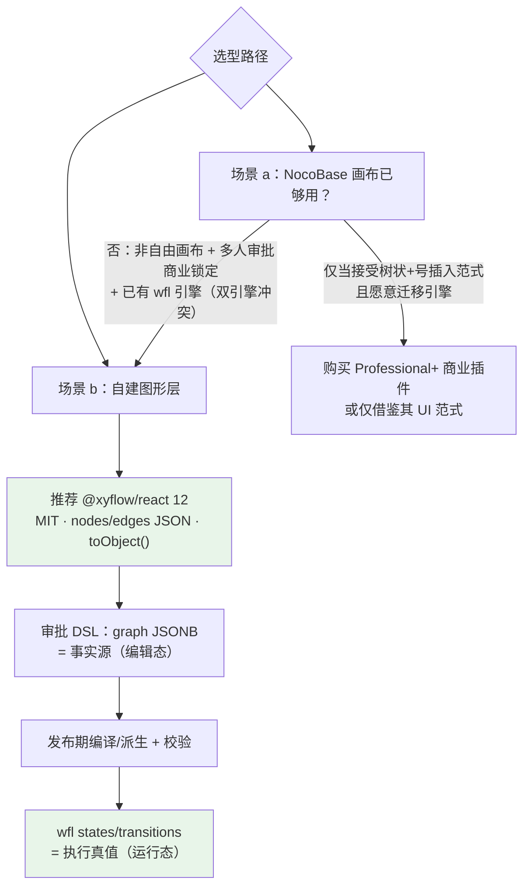
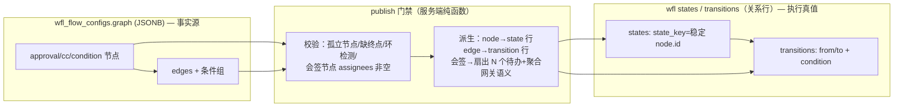

# 审批流可视化拖拽编排——开源组件选型报告

> 研究日期：2026-09-29 | 来源：约 100 个来源（4 个并行联网子任务 + 本地源码核查，核心引用见 §7） | 深度：Exhaustive
> 场景：制造业全链平台（NocoBase v2.2.6 自托管快照、React18 + antd5、PG、已有自研 wfl 状态机审批引擎），目标交互形态对标钉钉/飞书审批设计器（左侧节点面板、画布拖入节点、连线、右侧属性面板配置审批人/条件分支/抄送/会签）。

---

## 1. Executive Summary

**最重要的结论：不存在「拿来即用」的开源钉钉式审批设计器。** 五个主候选分成两类：NocoBase plugin-workflow 是「引擎+结构化树状画布」但画布非自由拖拽、且会签/或签/审批人路由全部锁定在商业闭源插件（[审批节点文档](https://docs.nocobase.com/cn/plugins/@nocobase/plugin-workflow-approval/)）；React Flow / LogicFlow / X6 / bpmn.js 是「图形库/模型器」，审批语义（审批人/会签/条件/抄送）都要自建——而本项目已有 wfl 五表引擎，恰好只需要图形库这一层。

**自建路线推荐 @xyflow/react（React Flow 12）**：38,532 stars、MIT、月度发版（v12.12.0，2026-09-24）、周下载 1,156 万、React≥17 原生、`toObject()` 输出 nodes/edges JSON 与 PG JSONB 存储天然契合（[GitHub API](https://api.github.com/repos/xyflow/xyflow)、[官方 API 文档](https://reactflow.dev/api-reference/types/react-flow-instance)）；代价是撤销/重做与属性面板均不内置需自建（[示例索引](https://reactflow.dev/examples)）。备选 LogicFlow（中文文档+插件全家桶内置，但社区规模仅为 React Flow 的 1/900、维护间歇）；AntV X6 生态存量最大（周下载 13.9 万）但维护强度弱且 3.x 重构存在代差；bpmn.js 功能最全但水印条款 + BPMN 学习曲线 + XML 存储与 wfl 关系表模型错配。

**一个必须正视的需求歧义**：钉钉/飞书的审批设计器实际是**垂直树状「+号插入」结构化编辑器，不是自由拖拽画布**（[钉钉官方帮助](https://help.dingtalk.io/zh/approval/admin-process-design)），NocoBase workflow 仿的正是这个范式（本地源码 [`CanvasContent.tsx`](platform/nocobase/packages/plugins/@nocobase/plugin-workflow/src/client/CanvasContent.tsx:44) 证实为自研 React 组件树、无任何图形库依赖）。若严格对标钉钉体验，React Flow 的自由画布反而是「超配」——但自由画布换来的任意拓扑表达（回退边、跨分支汇合）对制造业审批（如退回到指定节点）有实际价值，且用 `isValidConnection` + 发布期校验可约束风险（[API 文档](https://reactflow.dev/api-reference/react-flow)）。

## 2. Key Findings

1. **NocoBase workflow 画布 = 自研 React 组件树，零第三方图形库**：本地 v2.2.6 快照与 GitHub main（v2.2.19）双向核对一致——[`package.json`](platform/nocobase/packages/plugins/@nocobase/plugin-workflow/package.json:1) 无图形库依赖，peerDeps 全为 `@nocobase/*`；拖拽语义是「节点重排序」非自由拖放（[子任务A报告 §1](research/2026-09-29-subtask-a-nocobase-plugin-workflow.md)）。
2. **会签/或签/投票/退回/转签/加签全部是商业功能**：`@nocobase/plugin-workflow-approval` 属 Professional Edition+，`nocobase/pro` 仓库私有 404 无法审计（[插件页](https://docs.nocobase.com/cn/plugins/@nocobase/plugin-workflow-approval/)、[审批节点文档](https://docs.nocobase.com/cn/workflow/nodes/approval)）；开源「人工处理」节点文档明示暂不支持多人处理（[manual 文档](https://docs.nocobase.com/cn/workflow/nodes/manual)），本地源码 `mode: 0/1` 仅区分单人任务/多人各自任务（[`ManualInstruction.ts`](platform/nocobase/packages/plugins/@nocobase/plugin-workflow-manual/src/server/ManualInstruction.ts:43)）。
3. **NocoBase 流程数据是行级邻接表而非整图 JSON**：`flow_nodes` 表每节点一行，`upstream`/`downstream`/`branches(foreignKey: upstreamId)`/`branchIndex` 指针 + `config` JSON（[源码](platform/nocobase/packages/plugins/@nocobase/plugin-workflow/src/common/collections/flow_nodes.ts:37)，注释明言无独立 flow-links 表、循环流需 redirect 节点）——这与本项目 wfl 的 states/transitions 行存储同构。
4. **React Flow 12（@xyflow/react）核心事实**：MIT 永久开源承诺（[pro 页](https://reactflow.dev/pro)）；MiniMap/Controls/Background 内置（[内置组件文档](https://reactflow.dev/learn/concepts/built-in-components)）；**撤销/重做与属性面板属 Pro 付费示例**，开源版需自建；`isValidConnection`/只读 props/`toObject()` 序列化齐备；183.5KB min / 58.6KB gzip（[bundlephobia](https://bundlephobia.com/api/size?package=@xyflow/react@12.12.0)）。
5. **LogicFlow 与 X6 各有硬伤**：LogicFlow 近 6 个月 89 commits 但 8 月为 0、周下载 1.27 万、官方自认 BPMN 插件「仅覆盖少量常用元素…主要用于基础能力演示」（[BPMN 文档](https://github.com/didi/LogicFlow/blob/master/sites/docs/docs/tutorial/extension/bpmn-element.zh.md)）；X6 2.x→3.0 之间有 22 个月不发版空窗，社区质询官方零回复（[Discussion #4387](https://github.com/antvis/X6/discussions/4387)），3.x 已恢复低强度维护（近 6 月 8 commits）。
6. **bpmn.js 商用免费但水印不可移除**："The watermark must stay fully visible and not visually overlapped by other elements"（[bpmn.io license 原文](https://bpmn.io/license/)）；数据格式为 BPMN 2.0 XML（语义+DI 图形同文档），与 wfl 关系表模型错配，需要自研双向同步层。
7. **钉钉基线**：8 类节点（发起人/审批人/抄送人/办理人/条件分支/并行分支/连接器/自动化）、10 种审批人类型、4 种多人方式（依次/会签/或签/投票）（[钉钉帮助](https://help.dingtalk.io/zh/approval/admin-process-design)）。**飞书基线**：12 种审批人类型、3 种多人方式（会签/或签/依次）、独立办理人节点 + 并行分支（[飞书帮助](https://www.feishu.cn/hc/zh-CN/articles/360036163653)）。
8. **补充候选全部出局**：vue-flow（Vue3 专属）、flume（年 2-3 commits、周下载 282）、Drawflow（2024-10 后停滞、纯 JS 无 React 绑定）——均不进决策矩阵（证据见 §3.6）。

## 3. Detailed Analysis

### 3.1 决策矩阵（候选 × 8 维度）

| 维度 | NocoBase plugin-workflow | **React Flow (@xyflow/react)** | LogicFlow | AntV X6 | bpmn.js |
|---|---|---|---|---|---|
| **1. 功能覆盖** | ✗ 自研树状画布：无自由拖拽/连线/小地图；有结构化分支、缩放（CSS zoom）、版本快照、执行回放（[源码](platform/nocobase/packages/plugins/@nocobase/plugin-workflow/src/client/CanvasContent.tsx:95)） | ✓ 拖拽+连线+MiniMap/Controls/Background 内置；✗ 撤销重做（Pro）；✓ isValidConnection 校验；✓ 只读 props；△ 导出图片靠第三方 html-to-image；✗ 属性面板（Pro 模板）（[示例索引](https://reactflow.dev/examples)） | ✓ 全家桶：DndPanel/Control/MiniMap/Menu/Snapshot/选区 + snapline、history **core 默认内置**（[插件清单](https://site.logic-flow.cn/tutorial/extension/intro)、[history API](https://github.com/didi/LogicFlow/blob/master/sites/docs/docs/api/logicflow-instance/history.zh.md)） | ✓ Stencil 侧栏+Dnd+connecting 约束+MiniMap+Snapline+History+只读+Export(toSVG/PNG) 全插件化（[interacting 文档](https://github.com/antvis/X6/blob/master/site/docs/tutorial/basic/interacting.zh.md)、[export 文档](https://github.com/antvis/X6/blob/master/site/docs/tutorial/plugins/export.zh.md)） | ✓ 最全：CommandStack 撤销重做（[EditorActions 源码](https://github.com/bpmn-io/diagram-js/blob/develop/lib/features/editor-actions/EditorActions.js)）、对齐/分布/替换/网格吸附 25 features、Viewer 只读、bpmnlint 校验、saveSVG（✗ PNG 核心不内置）（[features 目录](https://api.github.com/repos/bpmn-io/bpmn-js/contents/lib/features)） |
| **2. 审批语义建模** | △ 引擎原生（触发器/条件/并行/延时/循环/抄送/人工），但多人审批=商业插件；与自研 wfl 引擎**双引擎冲突**（[文档](https://docs.nocobase.com/cn/workflow)） | ✗ 纯图形库，node.data 任意负载——审批人/会签/条件全部自建（与 wfl 对接反而干净）（[Node 类型](https://reactflow.dev/api-reference/types/node)） | ✗ 纯图形库（BPMN 基础元素仅演示级，官方免责声明）（[bpmn-element 文档](https://github.com/didi/LogicFlow/blob/master/sites/docs/docs/tutorial/extension/bpmn-element.zh.md)） | ✗ 纯图编辑引擎；官方 BPMN 示例可参考（[BPMN 示例](https://x6.antv.antgroup.com/examples/showcase/practices/#bpmn)） | ▷ BPMN 标准自带 userTask/multiInstance（会签）/exclusiveGateway 语义框架，但钉钉式审批人路由（主管/角色/表单联系人）仍需 moddle 扩展自建（[custom-elements](https://github.com/bpmn-io/bpmn-js-examples/blob/main/custom-elements/README.md)） |
| **3. 数据结构** | ✓ 行级邻接表（flow_nodes: upstream/downstream/branches/branchIndex + config JSON），无整图 JSON（[源码](platform/nocobase/packages/plugins/@nocobase/plugin-workflow/src/common/collections/flow_nodes.ts:37)） | ✓ nodes/edges JSON（`toObject()`：nodes+edges+viewport），node.data 承载业务负载 → **PG JSONB 单列即存**（[API](https://reactflow.dev/api-reference/types/react-flow-instance)） | ✓ {nodes,edges} JSON + adapterIn/Out 钩子，可转 BPMN XML（[render-and-data API](https://github.com/didi/LogicFlow/blob/master/sites/docs/docs/api/logicflow-instance/render-and-data.zh.md)） | ✓ toJSON/fromJSON：{cells:[]}（数组序）或 {nodes,edges}（[serialization 文档](https://github.com/antvis/X6/blob/master/site/docs/tutorial/basic/serialization.zh.md)） | ✗ BPMN 2.0 XML（语义+DI 同文档）；PG 需存 text 列或自研 XML↔图双向同步（[bpmn-moddle](https://github.com/bpmn-io/bpmn-moddle/blob/main/README.md)） |
| **4. 集成成本（NocoBase/React18/antd5）** | ✓ 零成本（原生），但复用它=放弃 wfl 引擎或双引擎并存 | ✓ React≥17 peerDeps（18/19 兼容）；antd5 无冲突；画布外 DnD 官方示例可抄（[drag-and-drop 示例](https://reactflow.dev/examples/interaction/drag-and-drop)） | ✓ @logicflow/react-node-registry peerDeps react≥18（[npm](https://registry.npmjs.org/@logicflow/react-node-registry)）；antd 入节点无官方示例（未确认） | ✓ @antv/x6-react-shape 官方演示 antd 组件入节点，但 2.0.8 起**仅支持 React18+** 且须与 X6 3.x 配对（[react 文档](https://github.com/antvis/X6/blob/master/site/docs/tutorial/intermediate/react.zh.md)） | △ 无官方 React 支持，命令式实例 + StrictMode 双挂载坑（[官方论坛](https://forum.bpmn.io/t/integration-of-bpmn-in-reactjs/10361)）；React 属性面板有官方示例（[react-properties-panel](https://github.com/bpmn-io/bpmn-js-example-react-properties-panel)） |
| **5. 维护活跃度/社区** | ✓ 24,387 stars，pushed 当天（2026-09-29），v2.2.19 当天发版（[GitHub API](https://api.github.com/repos/nocobase/nocobase)） | ✓ **38,532 stars**，v12.12.0（2026-09-24），周下载 **1,156 万**，xyflow GmbH 全职维护（[GitHub API](https://api.github.com/repos/xyflow/xyflow)、[npm](https://www.npmjs.com/package/@xyflow/react)） | △ 11,731 stars；近 6 月 89 commits 但 8 月 0 commit 间歇维护；周下载 1.27 万（[GitHub API](https://api.github.com/repos/didi/LogicFlow)） | △ 6,713 stars；3.x 低强度恢复（近 6 月 8 commits）；周下载 13.9 万存量最大；2.x→3.0 有 22 个月空窗史（[GitHub API](https://api.github.com/repos/antvis/X6)、[#4387](https://github.com/antvis/X6/discussions/4387)） | ✓ 9,674 stars；近 5 个 release 全在一个月内（v18.30.1，2026-09-24）；Camunda 12 年维护（[GitHub API](https://api.github.com/repos/bpmn-io/bpmn-js)） |
| **6. License 商用** | △ 主仓库=自定义 NocoBase License（Apache-2.0+附加：可商用、禁 SaaS/PaaS 转售）；plugin-workflow 本体 Apache-2.0；源码头残留 AGPL 双许可表述（[agreement](https://www.nocobase.com/en/agreement)） | ✓ **MIT**（含永久开源承诺）（[pro 页](https://reactflow.dev/pro)） | ✓ Apache-2.0（[GitHub API](https://api.github.com/repos/didi/LogicFlow)） | ✓ MIT（[GitHub API](https://api.github.com/repos/antvis/X6)） | △ bpmn.io license：免费商用含付费产品，**渲染图水印必须保留可见**（[license 原文](https://bpmn.io/license/)）；周边模块均 MIT |
| **7. 学习曲线/文档（中文）** | ✓ 中文第一梯队：28+ 节点专页+扩展开发 API（[中文手册](https://docs.nocobase.com/cn/workflow)） | △ 英文文档极佳（API/概念/68 示例），无官方中文（社区翻译存在） | ✓ 中文为主文档站（[site.logic-flow.cn](https://site.logic-flow.cn/tutorial/extension/intro)）；个别页缺中文（snapline） | ✓ 3.x 文档全量双语（[antgroup 文档站](https://x6.antv.antgroup.com/)）；changelog 在语雀、GitHub Releases 滞后 | △ 陡：BPMN 2.0 规范+三层架构；中文社区资料充足（二手）（[中文教材仓库](https://github.com/LinDaiDai/bpmn-chinese-document)） |
| **8. 包体积（gzip）** | —（随 NocoBase client 整体加载） | 58.6KB gzip（183.5KB min），3 个依赖（[bundlephobia](https://bundlephobia.com/api/size?package=@xyflow/react@12.12.0)） | ~（core+extension 双包，未测得权威数字，未确认） | 未测得权威数字（未确认） | 53.4KB gzip（188.6KB min），8 个自系依赖（[bundlephobia](https://bundlephobia.com/api/size?package=bpmn-js)） |

图例：✓ 满足 / △ 部分满足或有条件 / ✗ 不满足 / — 不适用。

### 3.2 各候选优缺点清单

#### NocoBase plugin-workflow（v2.2.19 / 本地快照 2.2.6）

优点：
1. 与平台零集成成本：变量系统、待办中心、权限、版本管理、执行留痕（executions/jobs）开箱即用（[中文手册](https://docs.nocobase.com/cn/workflow)）
2. 开源节点插件 21 个全在主仓库（含抄送 cc、并行 parallel、延时 delay、循环 loop、人工 manual），可作自建节点的参考实现（[插件目录](https://api.github.com/repos/nocobase/nocobase/contents/packages/plugins/%40nocobase)）
3. flow_nodes 邻接表与本项目 wfl states/transitions 同构，数据模型可直接借鉴（[源码](platform/nocobase/packages/plugins/@nocobase/plugin-workflow/src/common/collections/flow_nodes.ts:37)）
4. 活跃度顶级：24,387 stars、当天仍在发版（[GitHub API](https://api.github.com/repos/nocobase/nocobase)）

缺点：
1. **画布非自由拖拽**：自研 React 组件树、纵向卡片流 +「+号插入」，拖拽仅限重排序（[子任务A §1](research/2026-09-29-subtask-a-nocobase-plugin-workflow.md)、[`NodeDragContext.tsx`](platform/nocobase/packages/plugins/@nocobase/plugin-workflow/src/client/NodeDragContext.tsx:1)）
2. **会签/或签/投票/退回/转签/加签全在商业闭源插件**（Professional+），开源 manual 节点仅单人（[审批文档](https://docs.nocobase.com/cn/workflow/nodes/approval)、[manual 文档](https://docs.nocobase.com/cn/workflow/nodes/manual)）
3. 采用其引擎 = 放弃自研 wfl 或双引擎并存（治理/数据一致性成本）
4. License 表述混乱：根协议（自定义）vs 文件头 AGPL 残留 vs 插件 Apache-2.0 并存；社区版禁 SaaS/PaaS 转售（[agreement](https://www.nocobase.com/en/agreement)）
5. v1/v2 双画布并存迁移期（源码自述 legacy-canvas retirement）

#### React Flow / @xyflow/react（推荐）

优点：
1. React 生态事实标准：38,532 stars、周下载 1,156 万、xyflow GmbH 全职维护、月度发版（[GitHub API](https://api.github.com/repos/xyflow/xyflow)、[npm](https://www.npmjs.com/package/@xyflow/react)）
2. MIT + 官方永久开源承诺，Pro 只是付费示例（[pro 页](https://reactflow.dev/pro)）
3. 数据模型即 nodes/edges JSON（`toObject()`），`node.data` 任意负载 → `wfl_flow_configs.graph JSONB` 单列即存（[API](https://reactflow.dev/api-reference/types/react-flow-instance)、[Node 类型](https://reactflow.dev/api-reference/types/node)）
4. 自定义节点=普通 React 组件，antd5 表单可直接进节点卡片（[custom-node 示例](https://reactflow.dev/examples/nodes/custom-node)）
5. 校验/只读完备：`isValidConnection` 拒边、`nodesDraggable/nodesConnectable=false` 只读（[API](https://reactflow.dev/api-reference/react-flow)）
6. 依赖仅 3 个（zustand/classcat/@xyflow/system），React≥17（[npm registry](https://registry.npmjs.org/@xyflow/react/latest)）

缺点：
1. **撤销/重做不内置**（官方示例索引标注 Pro）——需自建历史栈（applyChanges 快照）（[示例索引](https://reactflow.dev/examples)）
2. **属性面板不内置**——右侧 antd5 Drawer 表单需自建（正好与 wfl 配置联动，可控）
3. 画布外拖入面板（钉钉式左栏）需按官方 DnD 示例自实现（[drag-and-drop](https://reactflow.dev/examples/interaction/drag-and-drop)）
4. 导出图片依赖第三方 html-to-image 且官方锁 1.11.11 旧版（[download-image 示例](https://reactflow.dev/examples/misc/download-image)）
5. 58.6KB gzip 对插件 bundle 有增量（[bundlephobia](https://bundlephobia.com/api/size?package=@xyflow/react@12.12.0)）

#### LogicFlow（didi）

优点：
1. 插件全家桶内置：DndPanel（左栏拖入）/Control/MiniMap/Menu/Selection + snapline、**history 撤销重做 core 默认开启**（`lf.undo()/redo()`）（[插件清单](https://site.logic-flow.cn/tutorial/extension/intro)、[history API](https://github.com/didi/LogicFlow/blob/master/sites/docs/docs/api/logicflow-instance/history.zh.md)）
2. 中文文档为主、Apache-2.0、框架无关 + 官方 React/Vue 节点 registry（react-node-registry peer react≥18）（[npm](https://registry.npmjs.org/@logicflow/react-node-registry)）
3. BPMN XML 双向（adapter），可对接 Flowable/Camunda（[bpmn-element 文档](https://github.com/didi/LogicFlow/blob/master/sites/docs/docs/tutorial/extension/bpmn-element.zh.md)）

缺点：
1. 官方免责：内置 BPMN 插件「仅覆盖少量常用元素……主要用于基础能力演示与快速上手」，复杂场景需自行重写（[bpmn-element 文档](https://github.com/didi/LogicFlow/blob/master/sites/docs/docs/tutorial/extension/bpmn-element.zh.md)）
2. 维护间歇：近 6 月 89 commits 但 8 月 0、9 月仅自动 chore；GitHub Releases 滞后于 npm（[commits API](https://api.github.com/repos/didi/LogicFlow/commits?per_page=100&since=2026-03-29T00:00:00Z)）
3. 社区规模有限：周下载 1.27 万（React Flow 的 ~1/900）（[npm downloads](https://api.npmjs.org/downloads/point/last-week/@logicflow/core)）
4. 1.x（stable tag）/2.x（latest）并存，文档 URL 有 404（mini-map slug）、snapline 无中文版

#### AntV X6（antvis）

优点：
1. 生态存量最大：周下载 13.9 万；Stencil 侧栏（分组/折叠/搜索，钉钉式左栏原生形态）3.x 内置主包（[npm](https://www.npmjs.com/package/@antv/x6)、[stencil 文档](https://github.com/antvis/X6/blob/master/site/docs/tutorial/plugins/stencil.zh.md)）
2. 官方 React 封装演示 antd 组件入节点（Portal 支持 Context）（[react 文档](https://github.com/antvis/X6/blob/master/site/docs/tutorial/intermediate/react.zh.md)）
3. 与 antd 同为蚂蚁系，视觉/交互语言接近；官方 BPMN/DAG 示例库（[BPMN 示例](https://x6.antv.antgroup.com/examples/showcase/practices/#bpmn)）
4. MIT、3.x 文档全量双语

缺点：
1. **维护风险**：2.x 末版（2024-01）→3.0（2025-11）22 个月不发版；社区质询「PR 等了七个月」（[#4387](https://github.com/antvis/X6/discussions/4387)）官方零回复；近 6 月仅 8 commits（[commits API](https://api.github.com/repos/antvis/X6/commits?per_page=100&since=2026-03-29T00:00:00Z)）
2. 3.x 破坏性重构（monorepo→单包、插件并包），2.x 存量资料有代差；官网转向「OSCP 社区共建」
3. react-shape latest（3.0.1，2025-11-27）落后 x6 latest（3.1.8，2026-08-11），版本配对需自证（[npm react-shape](https://www.npmjs.com/package/@antv/x6-react-shape)）
4. changelog 在语雀、GitHub Releases 滞后（子任务C报告）

#### bpmn.js（bpmn.io / Camunda）

优点：
1. BPMN 2.0 全量元模型 + 编辑器能力最全（25 features：对齐/分布/替换/吸附/搜索）（[features 目录](https://api.github.com/repos/bpmn-io/bpmn-js/contents/lib/features)）
2. 撤销重做（CommandStack+EditorActions 源码级确认）、官方属性面板（MIT）、可配置校验 bpmnlint（[EditorActions.js](https://github.com/bpmn-io/diagram-js/blob/develop/lib/features/editor-actions/EditorActions.js)、[properties-panel](https://github.com/bpmn-io/bpmn-js-properties-panel)、[bpmnlint](https://github.com/bpmn-io/bpmnlint)）
3. 12 年维护、发布频率极高（近 5 release 全在一个月内）（[Releases](https://api.github.com/repos/bpmn-io/bpmn-js/releases?per_page=5)）

缺点：
1. **水印条款**：渲染图必须保留可见 "Powered by bpmn.io"，不得遮挡——产品观感与白标需求冲突（[license 原文](https://bpmn.io/license/)）
2. React 无官方一等支持：命令式实例 + useRef/useEffect/destroy，StrictMode 双挂载需防重（[官方论坛](https://forum.bpmn.io/t/integration-of-bpmn-in-reactjs/10361)）
3. BPMN XML 与 wfl 关系表模型错配：存 XML text 列则图查询难；解析入库则需自研双向同步（DI 布局保真工程量集中）（子任务D报告 §6）
4. 学习曲线陡（OMG 规范 + moddle + diagram-js 三层）；默认属性面板面向 Camunda 技术属性，钉钉式业务面板改造量中上（[omg spec](https://www.omg.org/spec/BPMN/2.0.2/)）
5. PNG 导出核心不内置（仅 saveSVG/saveXML）（[BaseViewer.js](https://github.com/bpmn-io/bpmn-js/blob/develop/lib/BaseViewer.js)）

### 3.3 补充候选排除说明（不进决策矩阵）

| 候选 | 判定 | 依据 |
|---|---|---|
| vue-flow | 排除 | "Flowchart component for **Vue 3**"，非 React 生态（[GitHub API](https://api.github.com/repos/bcakmakoglu/vue-flow)） |
| flume (chrisjpatty/flume) | 不进矩阵 | MIT 且未死（2025-11 v1.2.0）但年均 2-3 commits、周下载 282、peer 锁 react ^18.2 无 19 路线（[commits](https://api.github.com/repos/chrisjpatty/flume/commits?per_page=8)、[npm downloads](https://api.npmjs.org/downloads/point/last-week/flume)） |
| Drawflow (jerosoler/Drawflow) | 不进矩阵 | 最后 push 2024-10-19 近两年停滞、273 open issues、纯 JS 无 React 绑定（[GitHub API](https://api.github.com/repos/jerosoler/Drawflow)） |

### 3.4 两场景结论



#### 场景 a：NocoBase plugin-workflow 画布是否够用 —— **结论：不够用**

三条硬伤（证据见 §3.2）：① 画布非自由拖拽（自研纵向树 + 重排序）；② 会签/或签/逐级路由全在商业闭源插件，且本项目审批引擎已是自研 wfl，引入 NocoBase workflow 引擎意味着双引擎并存、审批数据分裂；③ 其数据模型（flow_nodes 邻接表）与 wfl 的 states/transitions 是两套真值源，同步成本高于自建画布。

**若仍想利用 NocoBase 生态**，适配方案要点（不迁移引擎）：
1. 只借鉴其交互范式与源码实现：[`CanvasContent.tsx`](platform/nocobase/packages/plugins/@nocobase/plugin-workflow/src/client/CanvasContent.tsx:44) 的「触发器→分支列→终点」结构、`NodeConfigDrawer`（抽屉式节点配置）形态可直接搬到自建画布的右侧属性面板。
2. 若可接受「+号插入」钉钉范式而非自由画布，可fork 其画布组件（Apache-2.0 插件本体 + 注意根协议附加条款），节点类型注册机制对接 wfl——但该路线要放弃自由连线/任意拓扑（回退边、跨分支汇合），而「退回到指定节点」恰是钉钉/飞书都支持的能力（[飞书帮助](https://www.feishu.cn/hc/zh-CN/articles/360036163653)）。
3. 升级商业版（Professional+）获得完整审批节点（会签/或签/投票/退回/转签/加签，[审批文档](https://docs.nocobase.com/cn/workflow/nodes/approval)）——代价：闭源不可审计、许可费、引擎迁离 wfl。**不推荐**，与「已有自研引擎」的前提冲突。

#### 场景 b：自建 —— **推荐 @xyflow/react（React Flow 12）+ graph JSONB 事实源 + 派生 states/transitions**

选 React Flow 的决定性理由：与 wfl 的分层正交（它只管画布，审批语义归 wfl——恰好是本项目已有资产）；nodes/edges JSON 与 PG JSONB 零转换；React18/antd5 原生；维护与社区风险最低（[GitHub API](https://api.github.com/repos/xyflow/xyflow)）。LogicFlow 作为次选（若中文文档优先级最高且接受间歇维护）。

**审批 DSL 数据结构建议**（`wfl_flow_configs.graph` JSONB 列，编辑态唯一事实源）：

```jsonc
{
  "version": 1,                          // DSL 版本号，迁移用
  "nodes": [{
    "id": "n_approve_1",                 // 稳定字符串 id（发布后映射 state key）
    "type": "approval",                  // start | approval | cc | condition | parallel | subprocess | end
    "position": { "x": 320, "y": 140 },  // React Flow 渲染坐标
    "data": {                            // 业务负载（对齐钉钉/飞书基线）
      "title": "采购经理审批",
      "approval": {
        "mode": "countersign",           // countersign(会签) | or(或签) | sequential(依次) | vote(投票)
        "assigneeType": "role",          // user | role | deptLeader | supervisorChain | formField | selfSelect
        "assignees": ["role:pur_manager"],
        "emptyPolicy": "autoPass",       // autoPass | autoReject | transferAdmin | assignUser
        "allowReturn": ["n_approve_0"],  // 可退回到的节点（回退边语义）
        "timeout": { "hours": 48, "action": "remind" }
      }
    }
  }],
  "edges": [{ "id": "e1", "source": "n_start", "target": "n_approve_1",
              "sourceHandle": "out", "data": { "conditionGroup": { "all": [ ... ] } } }],
  "viewport": { "x": 0, "y": 0, "zoom": 1 }
}
```

**与 wfl states/transitions 的映射/派生**（单向编译，方向不可逆）：



要点：
1. **graph 是「源代码」，states/transitions 是「编译产物」**：编辑器只读写 graph；运行期 wfl 引擎照旧读 states/transitions，现有引擎零改动。重新发布 = 重派生（diff 后写入），版本化可在 `wfl_flow_configs` 上加 `version` 行（NocoBase 的 workflow 版本快照同思路，[子任务A §3](research/2026-09-29-subtask-a-nocobase-plugin-workflow.md)）。
2. **node.id ↔ state_key 用稳定字符串**：React Flow 的节点 id 由编辑器生成后不再变，派生时作为 state 业务键，避免雪花 id 漂移。
3. **审批语义派生规则**：会签节点 → 运行态展开为「并行扇出 k 个待办 + 全通过聚合」；或签 → 「任一通过即收敛」；依次 → 顺序扇出。这与 NocoBase 商业审批的协商模式（或签/会签/投票 × 并行/顺序）语义对齐（[审批文档](https://docs.nocobase.com/cn/workflow/nodes/approval)），也与钉钉/飞书基线一致（§3.5）。
4. **校验前置到发布门禁**：`isValidConnection` 只做即时约束（禁止自环/重复边），结构校验（孤立节点、缺终点、condition 分支必须有 else 兜底）在 publish 编译期 fail-loud——避免自由画布产生引擎无法执行的图。
5. **撤销/重做**：自建轻量历史栈（`onNodesChange/onConnect` 后 `toObject()` 快照入栈，上限 50 步）；属性面板用 antd5 Drawer + Form，选中节点即绑 `node.data`（React Flow 不提供的两项恰好是与 wfl 耦合的业务面，自建反而干净）。
6. **导出图片**：沿官方示例用 html-to-image（锁 1.11.11，[download-image 示例](https://reactflow.dev/examples/misc/download-image)），或服务端 headless 渲染留作后续。

### 3.5 钉钉/飞书节点模型需求基线

| 能力 | 钉钉 OA | 飞书 | 宜搭（钉钉旗下低代码） | 对本平台 DSL 的采纳建议 |
|---|---|---|---|---|
| 节点类型 | 发起人/审批人/抄送人/办理人/条件分支/并行分支(付费)/连接器(付费)/自动化(付费)（[帮助](https://help.dingtalk.io/zh/approval/admin-process-design)） | 审批/抄送人/办理人/条件分支/并行分支/自动化（[帮助](https://www.feishu.cn/hc/zh-CN/articles/360036163653)） | 另含消息/卡片/数据/脚本节点（[宜搭帮助](https://docs.aliwork.com/docs/yida_support/_2/trbqg6/rq8i94)） | start/approval/cc/handler/condition/parallel/end 七类为一期目标；subprocess 二期 |
| 审批人类型 | 10 类：指定成员/发起人自己/自选/角色/直属主管/部门主管/连续多级主管/部门控件主管/部门控件角色/表单内联系人（[帮助](https://help.dingtalk.io/zh/approval/admin-process-design)） | 12 类：上级(层级)/部门负责人(层级)/角色/用户组/指定成员/提交人自选/提交人本人/节点审批人/连续多级上级/连续多级部门负责人/表单联系人(本人/上级/部门负责人)/表单部门（[帮助](https://www.feishu.cn/hc/zh-CN/articles/360036163653)） | 13 类（含部门接口人/第三方服务/连接器/权限矩阵/条件模式）（[宜搭帮助](https://docs.aliwork.com/docs/yida_support/_2/trbqg6/rq8i94)） | assigneeType 先做 user/role/deptLeader/supervisorChain/formField 五类（覆盖现有 wfl approver_map 部门路由形态），selfSelect/节点审批人后续 |
| 多人方式 | 依次/会签/或签/投票(付费)（[帮助](https://help.dingtalk.io/zh/approval/admin-process-design)） | 会签/或签/依次（[帮助](https://www.feishu.cn/hc/zh-CN/articles/360036163653)） | 或签/会签/依次 | mode: sequential/countersign/or（vote 不做） |
| 审批人为空流转 | 自动通过/自动拒绝/自动转交管理员/指定人员（[帮助](https://help.dingtalk.io/zh/approval/admin-process-design)） | 自动通过/指定人员/转交审批管理员（[帮助](https://www.feishu.cn/hc/zh-CN/articles/360036163653)） | — | emptyPolicy 四态枚举 |
| 节点操作权限 | 同意/拒绝/转交/回退/加签（[帮助](https://help.dingtalk.io/zh/approval/admin-process-design)） | 转交/加减签/回退(到指定节点)/手写签名/审批意见必填（[帮助](https://www.feishu.cn/hc/zh-CN/articles/360036163653)） | — | allowReturn[]（回退目标白名单）进 DSL；转/加签作为运行态操作不进图 |
| 条件分支语义 | 优先级匹配、有且最多一个分支通过；条件内「且」、组间「或」（[帮助](https://help.dingtalk.io/zh/approval/admin-process-design)） | 条件组配置（[帮助](https://www.feishu.cn/hc/zh-CN/articles/360036163653)） | — | conditionGroup: {all:[], any:[]} 二层结构 + else 兜底强制 |

## 4. Contrarian Views and Risks（反方观点与风险）

1. **「钉钉式」可能不等于「自由画布」——需求本身值得再校准**。钉钉/飞书的设计器是垂直树状结构化编辑器（+号插入、自动连线、分支列），不是自由拖拽画布（[钉钉帮助](https://help.dingtalk.io/zh/approval/admin-process-design) 的官方交互描述 + NocoBase 源码均印证）。自由画布的代价：用户可画出无效拓扑（环/孤立/缺终点），全部校验责任转移到我们；树状编辑器天然无非法图。若目标用户是车间/采购管理员而非流程工程师，树状范式上手成本更低——值得在动手前用 1-2 个真实流程（如三单审批、AQL 让步放行）做交互原型 A/B。本报告按用户原始要求（自由画布）给结论，但此风险必须记录。
2. **React Flow 的商业双轨**：核心 MIT 承诺明确（[pro 页](https://reactflow.dev/pro)），但撤销/重做、属性面板、服务端导图等「高级示例」持续进付费墙——意味着最想要的参考实现拿不到，自建没有官方范本可抄，工作量估计只能靠社区二手（2023-2024 的开源 undo/redo 实现与 v12 API 有代差风险）。
3. **X6 的「复活」未经长期验证**：3.x 恢复发版但近 6 月 8 commits，官方对社区质询零回复（[#4387](https://github.com/antvis/X6/discussions/4387)）；若押注 X6 主要图省 stencil/antd 集成，一旦再次停摆，fork 维护成本高于 React Flow 自建左栏。
4. **bpmn.js 的水印是产品决策不是技术决策**：免费商用条款宽泛（允许出售副本，[license](https://bpmn.io/license/)），但「水印不得被遮挡」对白标/客户交付场景是硬伤；且 BPMN 语义过度（池道/事件子流程对制造业审批冗余），XML 真值源与 wfl 关系表双轨同步是长期税。
5. **会签/或签的「派生」复杂度可能被低估**：会签扇出-聚合在 states/transitions 上不是 1:1 映射（需要 k 份待办行 + 聚合判定），退回（allowReturn）会打破 DAG 假设——wfl 引擎侧若当前只支持线性状态推进，派生编译器之外引擎本身也要扩（这是选型之外的隐藏工作量）。
6. **LogicFlow 文档 URL 腐化与 1.x/2.x 并存**：snapline 无中文、mini-map 文档 404、stable tag 停在 1.x 而 npm latest 是 2.2.5（[子任务C报告](research/2026-09-29-logicflow-vs-antv-x6-subtask-c.md)）——踩坑时官方支持有限。

## 5. Open Questions（待解问题）

1. NocoBase v2.4（alpha 中）的 workflow 演进方向：client-v2 画布是否会引入自由画布/第三方图形库？（[releases](https://api.github.com/repos/nocobase/nocobase/releases?per_page=3) 目前无信号）
2. LogicFlow 8 月 0 commit 是暑期效应还是维护降级？建议观察 10-11 月发版节奏再定备选顺位。
3. `@antv/x6-react-shape` latest（3.0.1）与 `@antv/x6` 3.1.8 的兼容矩阵无官方说明（[npm](https://www.npmjs.com/package/@antv/x6-react-shape)）——若走 X6 路线需先做配对验证。
4. 本项目是否需要 BPMN 互操作（与外部 MES/ERP 交换流程定义）？若需要，LogicFlow/bpmn 的 adapter 价值上升，需重新权衡。
5. 多人同时编辑同一流程图的需求是否存在（协作编辑）？React Flow 无内置协作，需 OT/CRDT 层——当前按单人编辑假设设计。
6. wfl 引擎当前对「退回到指定节点」「会签聚合」的运行态支持边界（本轮只核了图形层选型，引擎侧需另开任务盘点）。

## 6. 决策建议摘要

| 优先级 | 结论 |
|---|---|
| **首选** | **@xyflow/react 12 自建**：左侧 Stencil 式面板（官方 DnD 示例改造）+ 画布 + antd5 Drawer 属性面板；graph JSONB 事实源 + 发布期派生 states/transitions；撤销重做自建快照栈 |
| 次选 | LogicFlow（中文文档/内置全家桶优先时） |
| 不推荐 | X6（维护风险）、bpmn.js（水印+XML 错配）、NocoBase 商业审批插件（闭源+双引擎） |
| 无论选谁 | 先用真实流程做 1-2 个交互原型验证「自由画布 vs 树状+号插入」的用户偏好（§4.1） |

## 7. Sources（核心来源，访问日期均为 2026-09-29）

| # | 来源 | 类型 | 日期 |
|---|---|---|---|
| 1 | [api.github.com/repos/nocobase/nocobase](https://api.github.com/repos/nocobase/nocobase) | 一手（GitHub API） | 2026-09-29 |
| 2 | [docs.nocobase.com/cn/plugins/@nocobase/plugin-workflow-approval/](https://docs.nocobase.com/cn/plugins/@nocobase/plugin-workflow-approval/) | 一手（官方文档，商业边界） | 2026-09-29 |
| 3 | [docs.nocobase.com/cn/workflow/nodes/approval](https://docs.nocobase.com/cn/workflow/nodes/approval) | 一手（会签/或签/退回/转签/加签） | 2026-09-29 |
| 4 | [docs.nocobase.com/cn/workflow/nodes/manual](https://docs.nocobase.com/cn/workflow/nodes/manual) | 一手（开源人工节点单人限制） | 2026-09-29 |
| 5 | [www.nocobase.com/en/agreement](https://www.nocobase.com/en/agreement) | 一手（License 协议全文） | 2026-09-29 |
| 6 | [本地 v2.2.6 源码快照](platform/nocobase/packages/plugins/@nocobase/plugin-workflow/src/common/collections/flow_nodes.ts) | 一手（flow_nodes 邻接表） | 2026-09-29 |
| 7 | [api.github.com/repos/xyflow/xyflow](https://api.github.com/repos/xyflow/xyflow) | 一手（38,532 stars） | 2026-09-29 |
| 8 | [reactflow.dev/examples](https://reactflow.dev/examples) | 一手（功能矩阵：Pro 标注） | 2026-09-29 |
| 9 | [reactflow.dev/api-reference/types/react-flow-instance](https://reactflow.dev/api-reference/types/react-flow-instance) | 一手（toObject 序列化） | 2026-09-29 |
| 10 | [reactflow.dev/pro](https://reactflow.dev/pro) | 一手（MIT 永久承诺） | 2026-09-29 |
| 11 | [bundlephobia @xyflow/react](https://bundlephobia.com/api/size?package=@xyflow/react@12.12.0) | 一手（58.6KB gzip） | 2026-09-29 |
| 12 | [api.github.com/repos/didi/LogicFlow](https://api.github.com/repos/didi/LogicFlow) | 一手（11,731 stars） | 2026-09-29 |
| 13 | [LogicFlow BPMN 文档（官方免责）](https://github.com/didi/LogicFlow/blob/master/sites/docs/docs/tutorial/extension/bpmn-element.zh.md) | 一手 | 2026-09-29 |
| 14 | [api.github.com/repos/antvis/X6](https://api.github.com/repos/antvis/X6) | 一手（6,713 stars） | 2026-09-29 |
| 15 | [X6 Discussion #4387（维护质询）](https://github.com/antvis/X6/discussions/4387) | 一手（社区+官方沉默证据） | 2026-09-29 |
| 16 | [X6 react 文档](https://github.com/antvis/X6/blob/master/site/docs/tutorial/intermediate/react.zh.md) | 一手（React18+ 限制） | 2026-09-29 |
| 17 | [api.github.com/repos/bpmn-io/bpmn-js](https://api.github.com/repos/bpmn-io/bpmn-js) | 一手（9,674 stars） | 2026-09-29 |
| 18 | [bpmn.io/license/](https://bpmn.io/license/) | 一手（水印条款原文） | 2026-09-29 |
| 19 | [diagram-js EditorActions.js](https://github.com/bpmn-io/diagram-js/blob/develop/lib/features/editor-actions/EditorActions.js) | 一手（撤销重做源码） | 2026-09-29 |
| 20 | [钉钉官方帮助《流程设计》](https://help.dingtalk.io/zh/approval/admin-process-design) | 一手（节点/审批人基线） | 2026-09-29 |
| 21 | [飞书帮助《管理员设计审批流程》](https://www.feishu.cn/hc/zh-CN/articles/360036163653) | 一手（节点/审批方式基线，更新 2026/01） | 2026-09-29 |
| 22 | [宜搭帮助《流程节点介绍》](https://docs.aliwork.com/docs/yida_support/_2/trbqg6/rq8i94) | 一手（低代码扩展节点） | 2026-09-29 |
| 23 | [子任务A完整报告](research/2026-09-29-subtask-a-nocobase-plugin-workflow.md)（14 来源） | 子任务存档 | 2026-09-29 |
| 24 | [子任务B完整报告](research/2026-09-29-subB-reactflow-xyflow.md)（18 来源） | 子任务存档 | 2026-09-29 |
| 25 | [子任务C完整报告](research/2026-09-29-logicflow-vs-antv-x6-subtask-c.md)（40 来源） | 子任务存档 | 2026-09-29 |
| 26 | [子任务D完整报告](research/2026-09-29-bpmn-js-and-dingtalk-feishu-approval-baseline.md)（30 来源） | 子任务存档 | 2026-09-29 |

其余来源（npm registry / downloads API、vue-flow、flume、Drawflow、reactflow.dev 各 API 页、logic-flow.cn、X6 文档站、bpmn-js-examples、forum.bpmn.io 等）完整清单见四份子任务存档报告（#23-#26）。

## 8. Methodology（方法论）

- **架构**：主任务（本地源码核查 + 汇总）+ 4 个并行联网子任务（A：NocoBase；B：React Flow+补充候选；C：LogicFlow+X6；D：bpmn.js+钉钉/飞书基线），各自独立浏览器 page、共享 chrome-devtools 实例。
- **搜索引擎**：DuckDuckGo（HTML 版，organic 结果，过滤全部广告/赞助内容）——按本模式规范未使用 web_search MCP。事实核验全部落到一手来源：GitHub API（stars/releases/commits/license）、registry.npmjs.org 与 api.npmjs.org（版本/依赖/周下载）、bundlephobia（体积）、官方文档站与 raw 源码、官方帮助中心（钉钉/飞书/宜搭）。
- **本地交叉验证**：NocoBase 结论经本地 v2.2.6 vendored 快照（`platform/nocobase/`）与 GitHub main（v2.2.19）双向核对——画布无图形库、flow_nodes 邻接表、manual 节点 mode 语义三处源码级确认。
- **局限**：① npmjs.com 网页被 Cloudflare 拦截，改用 registry API 等价数据；② NocoBase 商业插件闭源（pro 仓库 404），审批引擎内部无法审计；③ LogicFlow/X6 权威包体积未测得（标注未确认）；④ 钉钉/飞书帮助中心为 2026-09-29 时点快照，节点清单可能随版本变动；⑤ 浏览器并发共享实例，个别调用超时重试后成功，未影响数据完整性。
