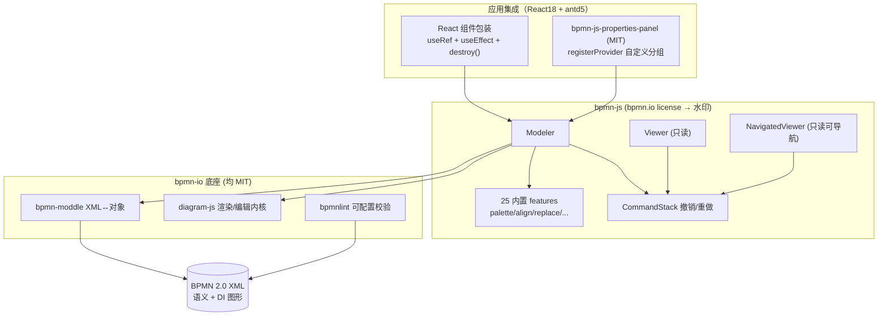
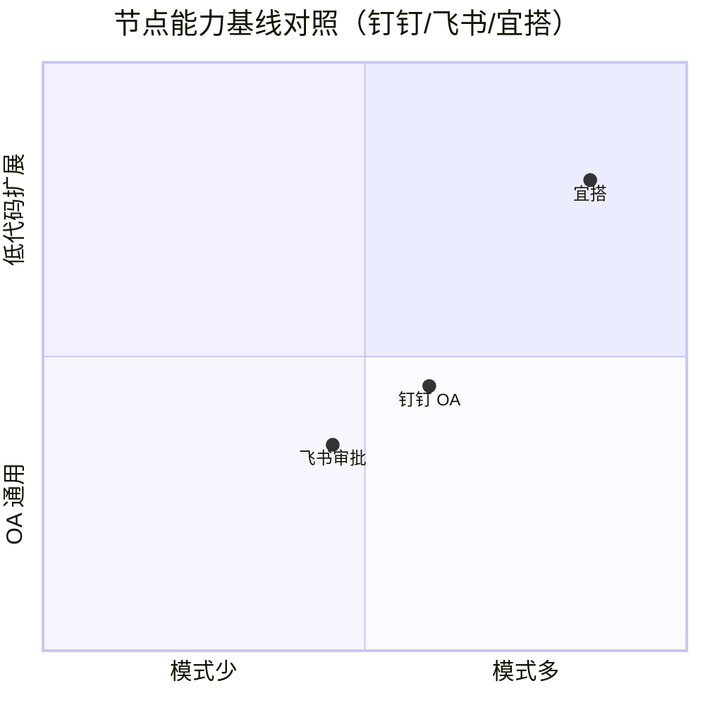

# 子任务D：bpmn.js 深度调研 + 钉钉/飞书审批设计器节点模型基线

> 研究日期：2026-09-29 | 来源：29 个来源（22 一手 / 7 二手） | 深度：Thorough（子任务D，浏览器并发约束下逐源深读）
> 用途：制造业全链平台（NocoBase 自托管、React18 + antd5、PG、自研 wfl 五表状态机审批引擎）「审批流可视化拖拽编排」组件选型的事实输入。本报告只交事实，不含总体决策建议。

---

## bpmn.js 调研结果

### 1. 仓库元数据与活跃度（数字+URL）

| 指标 | bpmn-js | bpmn-moddle | bpmn-js-properties-panel | bpmnlint |
|---|---|---|---|---|
| Stars | **9,674** | 512 | 337 | 171 |
| Forks | 1,488 | 180 | — | — |
| Open issues | 126 | 2 | — | — |
| 最近 push | **2026-09-25** | 2026-09-21 | 2026-09-23 | 2026-09-09 |
| 创建时间 | 2014-03-10 | — | — | — |
| License | bpmn.io license（非 OSI） | **MIT** | **MIT** | **MIT** |

- bpmn-js 数据源：[GitHub API bpmn-js](https://api.github.com/repos/bpmn-io/bpmn-js)（访问 2026-09-29）；描述 "A BPMN 2.0 rendering toolkit and web modeler"，由 Camunda Services GmbH 维护（2014 至今 12 年）。
- bpmn-moddle 数据源：[GitHub API bpmn-moddle](https://api.github.com/repos/bpmn-io/bpmn-moddle)，描述 "Read and write BPMN 2.0 XML from JavaScript"。
- properties-panel / bpmnlint 数据源：[bpmn-js-properties-panel](https://api.github.com/repos/bpmn-io/bpmn-js-properties-panel)、[bpmnlint](https://api.github.com/repos/bpmn-io/bpmnlint)。
- **最近 5 个 release 全部落在一个月内**（发布频率极高）：v18.30.1（2026-09-24）、v18.30.0（2026-09-23，FEAT：从 `@bpmn-io/theme` token 引入颜色与圆角）、v18.29.1（2026-09-21）、v18.29.0（2026-09-21）、v18.28.0（2026-09-04）。来源：[Releases API](https://api.github.com/repos/bpmn-io/bpmn-js/releases?per_page=5)。
- 版本线已达 v18.x，主版本迭代持续；生态仓库（examples、awesome-bpmn-io）由同一组织维护。来源：[bpmn-js README](https://github.com/bpmn-io/bpmn-js/blob/develop/README.md)。

### 2. License 原文关键摘录（商业条款结论 + URL）

来源（一手）：[https://bpmn.io/license/](https://bpmn.io/license/)，版权主体 "Copyright (c) 2014-present Camunda Services GmbH"。bpmn-js 仓库 LICENSE 为 `spdx_id: NOASSERTION`（GitHub API），即自定义 "bpmn.io License"，**不是 OSI 认证开源许可证**。要点摘录（原文）：

1. 免费商用 + 允许再分发与出售：
   > "Permission is hereby granted, free of charge, to any person obtaining a copy of this software ... to deal in the Software without restriction, including without limitation the rights to use, copy, modify, merge, publish, distribute, sublicense, and/or sell copies of the Software" —— 条款体为 MIT 式授权，**明确允许免费商用、嵌入付费产品、转售副本**。
2. **水印强制保留（核心限制）**：
   > "The source code responsible for displaying the bpmn.io project watermark that links back to https://bpmn.io as part of rendered diagrams MUST NOT be removed or changed. When this software is being used in a website or application, the watermark must stay fully visible and not visually overlapped by other elements."
   —— 渲染出的图表必须保留指向 bpmn.io 的 "Powered by bpmn.io" 水印，不得移除、不得被其他元素遮挡。
3. 免责条款与 MIT 相同（"AS IS"，无担保，不承担责任）。

许可证边界（同页原文）："This license ("bpmn.io License") governs use of our toolkits **bpmn-js, dmn-js, form-js, and cmmn-js**" —— 仅四个核心 toolkit 受此约束；周边（bpmn-moddle、bpmn-js-properties-panel、bpmnlint、diagram-js 均为 MIT）不受水印条款约束。结论（事实层面）：自托管商业产品可免费使用，代价是**渲染图上永久可见水印**，且水印移除属许可证违约。

### 3. 功能矩阵（每项 ✓/✗ + URL）

| 能力 | 支持 | 证据 |
|---|---|---|
| BPMN 2.0 标准元素（事件/网关/任务/子流程/池道） | ✓（元模型全量） | bpmn-moddle 内置 OMG 全量元数据 `bpmn.json`（语义）+ `bpmndi.json` + `dc.json` + `di.json`（图形互换 DI）：[resources/bpmn/json](https://api.github.com/repos/bpmn-io/bpmn-moddle/contents/resources/bpmn/json)；README 声明 "uses the BPMN 2.0 meta-model to validate the input and produce correct BPMN 2.0 XML"：[bpmn-moddle README](https://github.com/bpmn-io/bpmn-moddle/blob/main/README.md) |
| 三种构建产物（编辑/只读/只读可导航） | ✓ | 源码 `lib/` 下并列 `Modeler.js`、`Viewer.js`、`NavigatedViewer.js`（+BaseModeler/BaseViewer）：[lib 目录](https://api.github.com/repos/bpmn-io/bpmn-js/contents/lib) |
| 官方属性面板模块 | ✓ | [bpmn-js-properties-panel](https://github.com/bpmn-io/bpmn-js-properties-panel)（MIT）：编辑 element id、multi-instance、Camunda 7/8 执行属性；"Redo and undo (plugs into the bpmn-js editing cycle)"：[README](https://github.com/bpmn-io/bpmn-js-properties-panel/blob/main/README.md) |
| 扩展属性（自定义 namespace） | ✓ | 通过 moddle 扩展描述符（如 `moddleExtensions: { zeebe: zeebeModdle }`）读写自定义属性，README 给出完整示例：[properties-panel README](https://github.com/bpmn-io/bpmn-js-properties-panel/blob/main/README.md)；通用机制见 [custom-elements 文档](https://github.com/bpmn-io/bpmn-js-examples/tree/main/custom-elements)（"use the BPMN 2.0 extension mechanism to add extension attributes and elements in a BPMN 2.0 compatible way"） |
| 自定义节点（自定义元素） | ✓ | 官方文档给出四层技术：moddle 描述符定义数据 → 自定义 Renderer 改渲染 → 自定义 palette/context-pad 控件 → 自定义规则：[custom-elements README](https://github.com/bpmn-io/bpmn-js-examples/blob/main/custom-elements/README.md) |
| 自定义属性面板成本 | 中等 | 官方推荐扩展现有 properties-panel（`registerProvider(priority, provider)` + `getGroups(element)` 覆写分组），另有 React 版自定义面板示例 [bpmn-js-example-react-properties-panel](https://github.com/bpmn-io/bpmn-js-example-react-properties-panel)（custom-elements README "There Is More" 一节链接） |
| 撤销/重做（CommandStack） | ✓ | diagram-js `EditorActions` 默认注册 `undo -> commandStack.undo()` / `redo -> commandStack.redo()`（源码级确认）：[EditorActions.js](https://github.com/bpmn-io/diagram-js/blob/develop/lib/features/editor-actions/EditorActions.js)；键盘模块 Keyboard 为内置 feature：[Keyboard.js](https://github.com/bpmn-io/diagram-js/blob/develop/lib/features/keyboard/Keyboard.js)。Ctrl+Z/Ctrl+Shift+Z 默认触发 undo/redo 为产品公认行为（demo.bpmn.io 可验证），源码中键位→动作的默认映射行**未逐行定位，标注未确认** |
| 对齐/分布 | ✓ | 内置 features 含 `align-elements`、`distribute-elements`：[lib/features 目录](https://api.github.com/repos/bpmn-io/bpmn-js/contents/lib/features) |
| 复制粘贴/自动放置/网格吸附/替换菜单 | ✓ | 同上目录：`copy-paste`、`auto-place`、`grid-snapping`、`replace` + `popup-menu`、`search`、`space-tool` 等 25 个内置 feature |
| 小地图 | ✓（周边示例） | 官方示例库提供 minimap 示例：[bpmn-js-examples/minimap](https://github.com/bpmn-io/bpmn-js-examples/tree/main/minimap)（基于 diagram-js-minimap） |
| 校验 | ✓（独立工具） | [bpmnlint](https://github.com/bpmn-io/bpmnlint)（MIT，171 stars，2026-09 仍活跃）："Validate BPMN diagrams based on configurable lint rules"，规则可配置 |
| 导出 SVG | ✓ | `BaseViewer.prototype.saveSVG`（源码确认，含 `saveSVG.start/done` 事件与导出 padding 选项）：[BaseViewer.js](https://github.com/bpmn-io/bpmn-js/blob/develop/lib/BaseViewer.js) |
| 导出 PNG | ✗（核心不内置） | 核心 API 只有 `saveSVG`/`saveXML`（同上源码）；PNG 需自行将 SVG 转位图（社区做法，官方 bpmn-to-image 工具或 canvas 转换——本次未逐项核验，标注未确认） |
| i18n / 主题 | ✓ | 官方示例含 `i18n`、`theming`、`colors`：[bpmn-js-examples 目录](https://api.github.com/repos/bpmn-io/bpmn-js-examples/contents)；v18.30.0 已接入 `@bpmn-io/theme` token：[Releases](https://api.github.com/repos/bpmn-io/bpmn-js/releases?per_page=5) |
| 只读 viewer | ✓ | `Viewer.js` / `NavigatedViewer.js`（见上） |

架构关系（README 原文）："bpmn-js builds on top of **bpmn-moddle** (Read / write support for BPMN 2.0 XML in the browsers) and **diagram-js** (Diagram rendering and editing toolkit)"：[bpmn-js README](https://github.com/bpmn-io/bpmn-js/blob/develop/README.md)。

（上图：bpmn-js 分层与许可证边界——水印义务只作用于核心 toolkit，MIT 边界可自由定制。）

### 4. npm 数据与体积

- 版本：`18.30.1`（与 GitHub 最新 release 一致），license 字段 `SEE LICENSE IN LICENSE`。来源：[registry.npmjs.org/bpmn-js/latest](https://registry.npmjs.org/bpmn-js/latest)（npmjs.com 网页被 Cloudflare 拦截，改用 registry API，一手）。
- **周下载量：293,390**（2026-09-21 ~ 2026-09-27 窗口）。来源：[api.npmjs.org/downloads/point/last-week/bpmn-js](https://api.npmjs.org/downloads/point/last-week/bpmn-js)。
- 体积（bundlephobia，v18.30.1）：**minified 188.6 KB / gzip 53.4 KB**，8 个直接依赖；依赖体积大头为 diagram-js（≈96.8 KB）与 bpmn-moddle（≈70.1 KB），其余为 min-dash/tiny-svg/min-dom 等自研微库。来源：[bundlephobia.com/api/size?package=bpmn-js](https://bundlephobia.com/api/size?package=bpmn-js)。
- 直接依赖清单（registry API）：`ids, min-dom, min-dash, tiny-svg, diagram-js, bpmn-moddle, inherits-browser, diagram-js-direct-editing` —— 全部为 bpmn-io 系或零依赖工具库，无大型第三方传递依赖。

### 5. 学习曲线与 React 集成成本

- **官方示例以 vanilla JS / Angular 为主**：bpmn-js-examples 提供 starter、bundling、pre-packaged 等集成样例（[examples 目录](https://api.github.com/repos/bpmn-io/bpmn-js-examples/contents)），无官方一等 React 组件；官方 React 相关资产是属性面板 React 示例 [bpmn-js-example-react-properties-panel](https://github.com/bpmn-io/bpmn-js-example-react-properties-panel)（custom-elements README 链接）。
- **React 集成模式（官方论坛一手）**：useRef 挂容器 + useEffect 内 `new Modeler({ container: ref.current })` + `importXML` + cleanup 时 `modeler.destroy()`。来源：[forum.bpmn.io「Integration of BPMN in reactjs」](https://forum.bpmn.io/t/integration-of-bpmn-in-reactjs/10361)（2023-12，官方论坛）。集成成本在于：命令式实例与 React 声明式渲染的心智差（状态从 `modeler.get('canvas')`/eventBus 读，而非 props）、StrictMode 双挂载需防重复实例、样式与 antd5 体系并存需处理。
- 社区封装存在但非官方：[AlexanderSkrock/bpmn-react](https://github.com/AlexanderSkrock/bpmn-react)（二手，"Seamlessly integrate bpmn-js into React"）。
- **BPMN 2.0 规范门槛**：BPMN 是 OMG 标准（[omg.org/spec/BPMN/2.0.2](https://www.omg.org/spec/BPMN/2.0.2/)，bpmn-js README 链接）；开发者需理解事件/网关/任务/子流程/池道语义与 XML 结构，学习曲线高于通用画图库；属性面板默认面向"技术属性"（element id、multi-instance、Camunda 执行属性——[properties-panel README](https://github.com/bpmn-io/bpmn-js-properties-panel/blob/main/README.md)），做业务化"钉钉式"节点面板需自行以 registerProvider 重写分组。
- **中文资料充足（二手）**：掘金系列（如 [juejin.cn/post/7329824954110066723](https://juejin.cn/post/7329824954110066723)）、知乎（[zhuanlan.zhihu.com/p/365967273](https://zhuanlan.zhihu.com/p/365967273)）、CSDN 多篇，以及成体系中文教材仓库 [LinDaiDai/bpmn-chinese-document](https://github.com/LinDaiDai/bpmn-chinese-document)（"全网最详 bpmn.js 教材"）。搜索验证：DuckDuckGo `bpmn.js 中文 教程 入门` 首页 10 条结果全为中文教程/专栏（2026-09-29）。

### 6. 数据结构（BPMN XML）与 PG 存储影响

- 存储格式为 **BPMN 2.0 XML 单文档**：`<bpmn2:definitions>` 根元素下同时含语义模型（`<process>` 里的任务/网关/连线）与图形互换信息（BPMNDiagram/DI，即每个形状的 x/y/width/height 与 waypoint）。元模型由 bpmn-moddle 的 `bpmn.json + bpmndi.json + dc.json + di.json` 四个描述符全量定义（[resources/bpmn/json](https://api.github.com/repos/bpmn-io/bpmn-moddle/contents/resources/bpmn/json)）。
- 读写 API：`fromXML(xml) -> { rootElement }`（树状 moddle 对象，可 `set/push/get` 后 `toXML()` 序列化回 XML），带元模型校验。来源：[bpmn-moddle README](https://github.com/bpmn-io/bpmn-moddle/blob/main/README.md)。注意（官方论坛一手）："Your XML doesn't contain any DI information. Without that it [won't render]"——DI 缺失的 XML 无法渲染：[forum.bpmn.io](https://forum.bpmn.io/t/integration-of-bpmn-in-reactjs/10361)。
- **对 PG 存储的影响（事实推演，供选型输入）**：
  - 路线 A：XML 存 text/jsonb 列 —— 与 bpmn-js 天然往返（saveXML/importXML 原生往返），版本对比只能做 XML 字符串 diff；图结构查询（如"某节点上游"）需先 `fromXML` 解析。
  - 路线 B：解析为图入库（节点/边两表 + DI 坐标列）——查询友好、可与现有 wfl 五表状态机对接，但需自研 XML→图→XML 双向同步层（bpmn-moddle 提供对象模型作中间态，工程量集中在 DI 布局字段的往返保真）。
  - 两路线均需处理：`extensionElements` 里的自定义审批人配置（钉钉式 approver 模式通常作为扩展属性存入，见 §3 自定义元素机制）。

### 7. 优缺点清单（各附 URL）

优点：
1. 行业标准格式 BPMN 2.0，与外部工具（Camunda 等）互操作，元模型全量校验（[bpmn-moddle README](https://github.com/bpmn-io/bpmn-moddle/blob/main/README.md)）。
2. 极高活跃度与 12 年维护史：9,674 stars、最近 5 个 release 全在一个月内（[GitHub API](https://api.github.com/repos/bpmn-io/bpmn-js)、[Releases](https://api.github.com/repos/bpmn-io/bpmn-js/releases?per_page=5)）。
3. 商用免费、允许嵌入付费产品（[bpmn.io/license](https://bpmn.io/license/)）。
4. 完整编辑器内置能力：撤销重做 CommandStack、对齐分布、palette/replace/popup-menu、i18n/theming（[lib/features](https://api.github.com/repos/bpmn-io/bpmn-js/contents/lib/features)、[EditorActions.js](https://github.com/bpmn-io/diagram-js/blob/develop/lib/features/editor-actions/EditorActions.js)）。
5. 官方可配置校验 bpmnlint（MIT）（[bpmnlint](https://github.com/bpmn-io/bpmnlint)）。
6. 中文社区资料丰富（[LinDaiDai/bpmn-chinese-document](https://github.com/LinDaiDai/bpmn-chinese-document) 等，二手）。

缺点/风险：
1. **许可证非 OSI，水印必须保留且可见**，不能被遮挡（[bpmn.io/license](https://bpmn.io/license/) 原文）。
2. React 无官方一等支持，集成靠社区模式，命令式实例与 React 心智差（[forum.bpmn.io](https://forum.bpmn.io/t/integration-of-bpmn-in-reactjs/10361)）。
3. 学习曲线陡：BPMN 2.0 语义 + moddle 元模型 + diagram-js 三层概念（[omg spec](https://www.omg.org/spec/BPMN/2.0.2/)、[README 架构](https://github.com/bpmn-io/bpmn-js/blob/develop/README.md)）。
4. 默认属性面板面向技术属性/Camunda 生态，业务化改造量中等偏上（[properties-panel README](https://github.com/bpmn-io/bpmn-js-properties-panel/blob/main/README.md)）。
5. 体积 188.6 KB min / 53.4 KB gzip，且"钉钉式"体验（节点抽屉面板、会签或签配置 UI）全部自研（[bundlephobia](https://bundlephobia.com/api/size?package=bpmn-js)）。
6. PNG 导出核心不内置（仅 saveSVG/saveXML，[BaseViewer.js](https://github.com/bpmn-io/bpmn-js/blob/develop/lib/BaseViewer.js)）。

## 钉钉审批设计器节点基线

### 节点类型清单（每项一句职责 + URL）

来源（一手）：[钉钉官方帮助《流程设计》](https://help.dingtalk.io/zh/approval/admin-process-design)（DingTalk Help Center，访问 2026-09-29）：

| 节点 | 职责（官方表述归纳） |
|---|---|
| 发起人 | 流程起始点（默认节点，不可改名），配置谁能提交、发起人可填字段及字段权限（可编辑/只读/隐藏） |
| 审批人 | 可对审批单做"同意、拒绝、转交、回退、加签"操作，含审批类型与多人审批方式配置 |
| 抄送人 | 无审核权，接收审批单可查看、评论；字段仅只读/隐藏 |
| 办理人 | 具体执行人（无批准权），可"提交、转交、回退、加签、评论" |
| 条件分支 | 按优先级依次匹配，**有且最多一个分支通过**；分支内条件"且"、条件组间"或"；可复制分支 |
| 并行分支 | （付费）多审批分支**同时**流转 |
| 连接器 | （付费）调用"我的集成"中配置的连接器 |
| 自动化 | （付费）配置自动化任务 |

同页相关子文档（帮助中心目录）：角色人员审批 / 直属主管审批 / 部门主管审批 / 表单内联系人审批 / 分条件审批 / 分管领导审批设置。
补充（钉钉旗下宜搭，一手）：宜搭流程节点目录另含 发起节点、人工节点（审批人/执行人）、抄送人、分支节点、**消息节点、卡片节点、数据节点、脚本节点**：[宜搭帮助《流程节点介绍》](https://docs.aliwork.com/docs/yida_support/_2/trbqg6/rq8i94) 及其左侧导航。钉钉 OA 审批设计器中未检索到独立"子流程"节点（宜搭通过集成&自动化实现子流程能力）——**未确认**。

### 审批人设置模式清单（+URL）

钉钉 OA（[官方帮助](https://help.dingtalk.io/zh/approval/admin-process-design)）：
- 审批类型：人工审批 / 自动通过 / 自动拒绝。
- 节点审批人 10 类：**指定成员、发起人自己、发起人自选、角色、直属主管、部门主管、连续多级主管、部门控件对应主管、部门控件对应角色、表单内联系人**。
- 多人审批方式 4 种：**依次审批（逐级且全部同意）、会签（AND，全部同意）、或签（OR，任一同意）、投票**（付费，达票数通过）。
- 审批人为空时 4 种流转：自动通过 / 自动拒绝 / 自动转交管理员（模板管理员→审批管理员）/ 指定人员审批（最多一人）。
- 办理人节点多人方式：依次办理 / 所有人同时办理 / 一名办理人处理。

宜搭补充（[宜搭帮助·审批人节点](https://docs.aliwork.com/docs/yida_support/_2/trbqg6/rq8i94)，一手）：审批人类型扩展为 13 类（指定成员、指定角色、部门主管、多级主管、直属主管、部门接口人、发起人本人、发起人自选〔全公司/指定成员/指定角色范围〕、表单内成员字段、第三方服务、从连接器获取、从权限矩阵获取、条件模式〔灰度，专属 OA 增强包〕）；单节点上限 100 个成员/角色/主管；部门主管最多 20 级；多人方式为或签/会签/依次审批。

## 飞书审批节点基线

### 节点类型清单（+URL）

来源（一手）：[飞书帮助中心《管理员设计审批流程》](https://www.feishu.cn/hc/zh-CN/articles/360036163653)（最后更新 2026/01/31，访问 2026-09-29）。同目录并列独立文档：设置条件分支 / **并行分支** / 流程自动化 / 角色作为审批人 / 表单内联系人部门作为审批人 / 审批人异常流转规则 / 抄送人 / **办理人节点** / 转交加减签回退 / 手写签名 / 审批意见必填。

| 节点 | 职责 |
|---|---|
| 审批节点 | 系统默认至少一个；设审批类型、审批人、表单权限、操作权限 |
| 抄送人 | 告知/备案，节点完成后收到通知；可勾"仅同意时抄送"（详见同目录《管理员设置抄送人》） |
| 办理人节点 | 独立节点类型（详见同目录《管理员设置办理人节点》） |
| 条件分支 | 默认两条分支，可加多条；右侧面板"添加条件组"配置进入条件（详见《管理员设置条件分支》） |
| 并行分支 | 多分支并行流转（独立文档《管理员设置审批流程并行分支》） |
| 自动化 | 自动化任务（独立文档《管理员设置审批流程自动化》） |

（注意区分：[飞书项目 Meego 的节点流程配置](https://www.feishu.cn/content/3bv61iew) 是研发项目管理产品，非 OA 审批流，其"自动完成/单人确认（并签）/多人确认（会签）"完成方式可作为交叉参考，一手。）

### 审批方式清单（会签/或签等 +URL）

来源（一手）：[飞书《管理员设计审批流程》](https://www.feishu.cn/hc/zh-CN/articles/360036163653)：

- 审批类型：人工审批 / 自动通过 / 自动拒绝。
- **多人审批方式 3 种：会签（所有审批人同意才通过）、或签（任一同意即通过）、依次审批（按顺序依次）**。（与钉钉差异：未列"投票"）
- 审批人 12 类：**上级（指定层级）、部门负责人（指定层级）、角色、用户组、指定成员、提交人自选（限选择方式与范围）、提交人本人、节点审批人（关联前节点实际审批人，不能用于首个节点）、连续多级上级、连续多级部门负责人、表单内联系人（联系人本人/其上级/其部门负责人）、表单内部门（表单部门字段负责人）**。
- 审批人为空时：自动通过 / 指定人员审批 / 转交给审批管理员。
- 审批人=发起人时：由发起人自己审批 / 自动跳过 / 转交直属上级 / 转交部门负责人（详见同目录《审批人异常流转规则》）。
- 节点操作权限：允许转交 / 允许加/减签 / 允许回退（到指定节点）/ 手写签名 / 审批意见必填。
- 节点表单权限：可读 / 可编辑（字段级）。

三家基线对照（供节点建模需求对照，非决策建议）：

## 来源列表（编号 + URL + 访问日期 2026-09-29，一手/二手）

| # | 来源 | 类型 | 日期 |
|---|---|---|---|
| 1 | https://api.github.com/repos/bpmn-io/bpmn-js | 一手（GitHub API） | 2026-09-29 |
| 2 | https://api.github.com/repos/bpmn-io/bpmn-js/releases?per_page=5 | 一手 | 2026-09-29 |
| 3 | https://api.github.com/repos/bpmn-io/bpmn-moddle | 一手 | 2026-09-29 |
| 4 | https://api.github.com/repos/bpmn-io/bpmn-moddle/contents/resources/bpmn/json | 一手 | 2026-09-29 |
| 5 | https://raw.githubusercontent.com/bpmn-io/bpmn-moddle/main/README.md | 一手 | 2026-09-29 |
| 6 | https://bpmn.io/license/ | 一手（官方许可证全文） | 2026-09-29 |
| 7 | https://bpmn.io/toolkit/bpmn-js/ | 一手（官方产品页） | 2026-09-29 |
| 8 | https://raw.githubusercontent.com/bpmn-io/bpmn-js/develop/README.md | 一手 | 2026-09-29 |
| 9 | https://api.github.com/repos/bpmn-io/bpmn-js/contents/lib | 一手 | 2026-09-29 |
| 10 | https://api.github.com/repos/bpmn-io/bpmn-js/contents/lib/features | 一手 | 2026-09-29 |
| 11 | https://raw.githubusercontent.com/bpmn-io/bpmn-js/develop/lib/BaseViewer.js | 一手 | 2026-09-29 |
| 12 | https://api.github.com/repos/bpmn-io/bpmn-js-properties-panel | 一手 | 2026-09-29 |
| 13 | https://raw.githubusercontent.com/bpmn-io/bpmn-js-properties-panel/main/README.md | 一手 | 2026-09-29 |
| 14 | https://api.github.com/repos/bpmn-io/bpmnlint | 一手 | 2026-09-29 |
| 15 | https://api.github.com/repos/bpmn-io/bpmn-js-examples/contents | 一手 | 2026-09-29 |
| 16 | https://raw.githubusercontent.com/bpmn-io/bpmn-js-examples/main/custom-elements/README.md | 一手 | 2026-09-29 |
| 17 | https://raw.githubusercontent.com/bpmn-io/diagram-js/develop/lib/features/editor-actions/EditorActions.js | 一手 | 2026-09-29 |
| 18 | https://raw.githubusercontent.com/bpmn-io/diagram-js/develop/lib/features/keyboard/Keyboard.js | 一手 | 2026-09-29 |
| 19 | https://registry.npmjs.org/bpmn-js/latest | 一手（npm registry） | 2026-09-29 |
| 20 | https://api.npmjs.org/downloads/point/last-week/bpmn-js | 一手（npm 统计） | 2026-09-29 |
| 21 | https://bundlephobia.com/api/size?package=bpmn-js | 一手 | 2026-09-29 |
| 22 | https://forum.bpmn.io/t/integration-of-bpmn-in-reactjs/10361 | 一手（bpmn.io 官方论坛） | 2026-09-29 |
| 23 | https://github.com/AlexanderSkrock/bpmn-react | 二手（社区封装） | 2026-09-29 |
| 24 | https://github.com/LinDaiDai/bpmn-chinese-document | 二手（社区中文教材） | 2026-09-29 |
| 25 | https://juejin.cn/post/7329824954110066723 | 二手（掘金教程） | 2026-09-29 |
| 26 | https://zhuanlan.zhihu.com/p/365967273 | 二手（知乎专栏） | 2026-09-29 |
| 27 | https://help.dingtalk.io/zh/approval/admin-process-design | 一手（钉钉官方帮助） | 2026-09-29 |
| 28 | https://docs.aliwork.com/docs/yida_support/_2/trbqg6/rq8i94 | 一手（宜搭官方帮助） | 2026-09-29 |
| 29 | https://www.feishu.cn/hc/zh-CN/articles/360036163653 | 一手（飞书官方帮助） | 2026-09-29 |
| 30 | https://www.feishu.cn/content/3bv61iew | 一手（飞书项目 Meego，非 OA 审批） | 2026-09-29 |

## 方法论与局限

- 搜索引擎：DuckDuckGo（duckduckgo.com HTML 版），提取 organic 结果并过滤广告/赞助；中文查询为主（钉钉/飞书/中文教程），英文查询覆盖 React 集成。
- 深读方式：chrome-devtools navigate + evaluate_script 全文提取（GitHub raw / registry / API JSON / 帮助中心正文）；npmjs.com 网页被 Cloudflare 拦截，改用 registry.npmjs.org 与 api.npmjs.org 等价数据。
- 多个子任务共享浏览器实例，个别导航/脚本调用超时后重试成功；未影响数据完整性。
- 未确认项已在文中就地标注（Ctrl+Z 键位默认映射源码行、PNG 导出官方工具、钉钉 OA 子流程节点）。
- 钉钉/飞书帮助中心内容可能随版本更新，本报告为 2026-09-29 时点快照。
