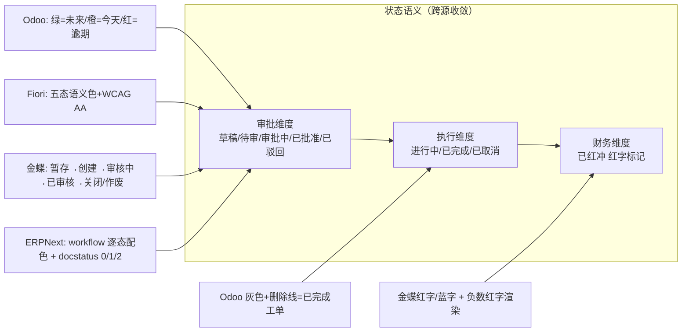
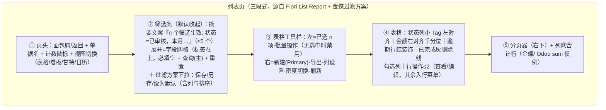
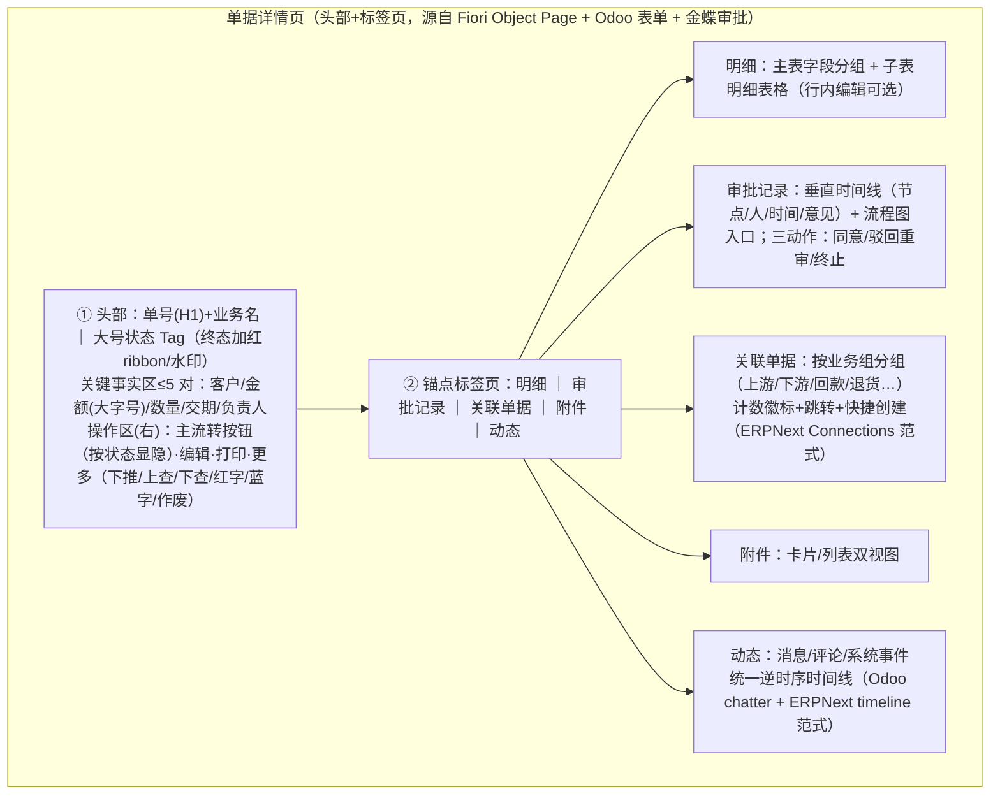

# 制造业 ERP/MES 平台 UIUX 最佳实践调研 —— NocoBase 全链平台视觉与交互重构（W5）

> 研究日期：2026-09-29 | 来源：43 个外部来源（其中官方一手 34）+ 本地 NocoBase 2.2.6 源码审计 | 深度：Exhaustive
> 调研对象：Odoo 18 / ERPNext(Frappe) / SAP Fiori / 金蝶云星空 / 钉钉宜搭 + 飞书多维表格 / NocoBase 主题能力
> 用途：回应用户批评「uiux太难看」，产出《W5 视觉规范草案》与 NocoBase 主题能力差距清单

---

## 1. Executive Summary

本次调研对 6 家制造业相关平台的 UIUX 模式做了带证据链接的取证（官方文档优先、源码级佐证），结论是：**「难看」的根因几乎可以确定不是缺主题色，而是缺少一套「单据状态语义 + 三页模式（列表/详情/表单）+ 密度纪律」的设计系统**。所有被调研对象在三个点上高度收敛：（1）状态字段用统一的语义色 Tag 呈现（SAP Fiori 给出了完整色值与 WCAG AA 保障，[Morning Horizon 配色](https://www.sap.com/design-system/fiori-design-web/v1-151/foundations/visual/colors/morning-horizon)）；（2）列表页是「筛选条（默认收起+摘要文案）+ 工具栏（主操作+批量操作禁用态）+ 表格（金额右对齐/状态左对齐小 Tag）」的三段式（[Fiori List Report](https://www.sap.com/design-system/fiori-design-web/v1-151/page-types/floorplans/list-report-floorplan-sap-fiori-element)、[金蝶通用过滤](https://help.open.kingdee.com/dokuwiki_std/doku.php?id=通用过滤)）；（3）详情页头部放单号+大号状态 Tag+关键事实，标签页放明细/审批记录/关联单据/动态时间线（[Fiori Object Page](https://www.sap.com/design-system/fiori-design-web/v1-151/page-types/floorplans/object-page)、[ERPNext Connections](https://docs.frappe.io/framework/user/en/basics/doctypes/actions-and-links)、[Odoo chatter](https://www.odoo.com/documentation/18.0/developer/reference/user_interface/view_architectures.html)）。

对中国制造业用户还必须叠加金蝶式惯例：**单据三态筛选字段（单据状态/关闭状态/作废状态默认「全部」）、过滤方案保存「下次以该方案进入」、红字/蓝字单据级显式标记、负数红字渲染、审批三态结果（同意/驳回重审/终止）、上查/下查/下推单据链操作、车间 HMI 九宫格按用户绑定**（[金蝶 BOS 通用操作](https://help.open.kingdee.com/dokuwiki_std/doku.php?id=bos通用操作列表)、[主控台](https://help.open.kingdee.com/dokuwiki_std/doku.php?id=主控台)）。

NocoBase 2.2.6 的主题编辑器可直接配置 antd5 三层 token（Seed/Map/Alias）+ 四内置主题（默认/暗色/紧凑/紧凑暗色）+ 顶部/侧栏菜单独立配色（[官方文档](https://docs.nocobase.com/system-management/theme-editor)、本地源码 [category.ts](../../platform/nocobase/packages/plugins/@nocobase/plugin-theme-editor/src/client-v2/antd-token-previewer/meta/category.ts:14)），且快照内已有 kanban/gantt/calendar/mobile 等 110 个插件块能力；**但「过滤方案保存、状态语义色板、金额列右对齐、红冲标记、全局命令栏、面包屑」六项需要 schema 配置或自定义插件/CSS 补齐**（详见第 6 节差距清单）。

---

## 2. Key Findings

1. **状态色存在国际标准答案**：Fiori 五态语义色给出完整色值——Negative `#AA0808` / Critical `#E76500` / Positive `#256F3A` / Neutral `#788FA6` / Informational `#0070F2` + 五档浅背景色，全部满足 WCAG 2.2 AA（[Morning Horizon](https://www.sap.com/design-system/fiori-design-web/v1-151/foundations/visual/colors/morning-horizon)）。Odoo 另有全系统一致的时间语义色：「绿=未来、橙=今天、红=逾期」（[Activities 文档](https://www.odoo.com/documentation/18.0/applications/essentials/activities.html)）。
2. **状态列排版有明确规范**：表格内状态用**小号 Tag、左对齐**；对象头部用**大号 Tag**；金额/数字**右对齐**（ID 除外）以保证可比性；布尔用只读复选框+文字（[Responsive Table 规范](https://www.sap.com/design-system/fiori-design-web/v1-151/ui-elements/responsive-table)、[Tag 规范](https://www.sap.com/design-system/fiori-design-web/v1-151/ui-elements/tag-web-component)）。
3. **「过滤方案」是中外一致的刚需**：金蝶保存过滤方案并「下次以该方案进入」（[通用过滤](https://help.open.kingdee.com/dokuwiki_std/doku.php?id=通用过滤)）；Frappe v16 的 List Filter 一次保存「过滤条件+可见列+排序」整体布局且区分全局/个人方案（[list_filter.js 源码](https://raw.githubusercontent.com/frappe/frappe/develop/frappe/public/js/frappe/list/list_filter/list_filter.js)）；Fiori 用整页一份 Variant Management 覆盖筛选+标签+表格设置（[List Report](https://www.sap.com/design-system/fiori-design-web/v1-151/page-types/floorplans/list-report-floorplan-sap-fiori-element)）；Odoo 用 Favorites 存搜索并可设为视图默认（[Search 文档](https://www.odoo.com/documentation/18.0/applications/essentials/search.html)）。
4. **筛选条默认收起是国际惯例**：Fiori Filter Bar 收起态只留一行摘要「n filters active: …」最多列 5 个；展开态标签在上方、必填加星号；平板默认收起、手机不显示（[Filter Bar 规范](https://www.sap.com/design-system/fiori-design-web/v1-151/ui-elements/filter-bar)）。
5. **批量操作禁用而非隐藏**：选择依赖型操作（删除等）在无选中时禁用，选择无关型（新增）始终可用（[List Report](https://www.sap.com/design-system/fiori-design-web/v1-151/page-types/floorplans/list-report-floorplan-sap-fiori-element)）。
6. **红冲是中国 ERP 的单据级显式标记**：金蝶工具栏预置成对【红字】/【蓝字】操作；报表单元格有「是否负数红字」开关（负数红色渲染是标准属性）；凭证冲销自动生成红字冲销凭证、摘要默认「冲销XX字XX号凭证」（[BOS 通用操作](https://help.open.kingdee.com/dokuwiki_std/doku.php?id=bos通用操作列表)、[凭证查询](https://help.open.kingdee.com/dokuwiki_std/doku.php?id=凭证查询)）。
7. **异常终态用「视觉封印」**：Odoo 表单右上角红色 ribbon 斜幅标记 Lost/Cancelled（[Lost opportunities 文档](https://www.odoo.com/documentation/18.0/applications/sales/crm/pipeline/lost_opportunities.html)）；Odoo 车间卡片中已完成工单**灰色+删除线**（[Shop Floor](https://www.odoo.com/documentation/18.0/applications/inventory_and_mrp/manufacturing/shop_floor/shop_floor_overview.html)）。
8. **上下游单据跳转的两种范式**：ERPNext 表单 dashboard 的 Connections 区按业务组（Payment/Reference/Returns…）分组列关联单据+计数+快捷创建，由 `<doctype>_dashboard.py` 声明式配置（[Actions and Links](https://docs.frappe.io/framework/user/en/basics/doctypes/actions-and-links)）；金蝶用工具栏「上查/下查/下推/选单/联查」操作族（[BOS 通用操作](https://help.open.kingdee.com/dokuwiki_std/doku.php?id=bos通用操作列表)）。
9. **审批可视化的三件套**：金蝶=查看流程图/审批路线/全流程跟踪 + 审批结果固定三态（同意/驳回重审/终止）+ 审批节点不改单据状态、仅终审翻转「审核中→已审核」（[审批流设计](https://help.open.kingdee.com/dokuwiki_std/doku.php?id=审批流设计)）；ERPNext Workflow State 主数据逐态配色（"Eg: Green for success"）（[Workflows](https://docs.frappe.io/erpnext/workflows)）。
10. **车间终端 = 按用户绑定的大按钮九宫格/卡片流**：金蝶 HMI 登录自动进对应用户的九宫格，功能在 PC 端【HMI 界面配置】绑定排序（[主控台](https://help.open.kingdee.com/dokuwiki_std/doku.php?id=主控台)）；Odoo Shop Floor 用信息卡片流+左侧操作员签到面板+PWA 安装到工位（[Shop Floor](https://www.odoo.com/documentation/18.0/applications/inventory_and_mrp/manufacturing/shop_floor/shop_floor_overview.html)）。
11. **NocoBase 已有的隐性武器**：字段级「扫码输入（可禁用手动输入）」（[Scan Code Input](https://docs.nocobase.com/interface-builder/fields/field-settings/scan-input)）、数字格式化（千分位/前后缀/精度/科学计数法）（[Number Formatting](https://docs.nocobase.com/interface-builder/fields/field-settings/number-format)）、动作「双重确认」（Double Check）、独立移动端布局（底部 Tab+独立路由权限）（[Mobile Layout](https://docs.nocobase.com/interface-builder/ui-layout/mobile)）——车间终端四要素（大按钮/扫码/防误触/独立移动页）官方均有对应能力。
12. **宜搭官方无公开的空态/密度设计规范**（其帮助中心为使用配方型文档，[docs.aliwork.com](https://docs.aliwork.com/docs/yida_subject/rsptol8kegbdddgw) 站内搜索「空状态」无规范级命中）——空态文案规范应以 Fiori 双文案模式（未设筛选 vs 筛选无结果）+ antd Empty 为准。

---

## 3. Detailed Analysis：各对象核心模式提炼

### 3.1 Odoo 18（8 条）

| # | 模式 | 关键细节 | 来源 |
|---|---|---|---|
| O1 | 表单三段式骨架 | `header(状态条+流转按钮) → sheet(主体) → oe_chatter(右栏)`；流转按钮按状态显隐（`invisible="state != 'done'"`）——按钮即流转 | [View architectures](https://www.odoo.com/documentation/18.0/developer/reference/user_interface/view_architectures.html) |
| O2 | statusbar 状态条 | `widget="statusbar"`，`statusbar_visible` 控制显示节点，`clickable` 可点击跳转状态 | 同上 |
| O3 | 异常态红 ribbon | 「After clicking Mark as Lost, a red Lost banner is added to the upper-right corner」；恢复用左上 Restore | [Lost opportunities](https://www.odoo.com/documentation/18.0/applications/sales/crm/pipeline/lost_opportunities.html) |
| O4 | chatter 三件套 | message_follower_ids（关注）+ activity_ids（活动计划）+ message_ids（消息）；活动弹窗含类型/到期日/负责人/备注 | [View architectures](https://www.odoo.com/documentation/18.0/developer/reference/user_interface/view_architectures.html)、[Activities](https://www.odoo.com/documentation/18.0/applications/essentials/activities.html) |
| O5 | 列表视图 | 默认 **80 行/页**（子列表 40）；勾选行→顶部 Actions 批量菜单；`export_xlsx` 导出；`decoration-{bf,it,info,warning,danger,muted,primary,success}` 行装饰；列底 `sum`/`avg` 聚合 | 同上 |
| O6 | 搜索面板 | Filters/Group By/Favorites 三列下拉；预配置过滤器**同组 OR、跨组 AND**；规则三段式+嵌套组；Favorites 存搜索并可设为默认 | [Search](https://www.odoo.com/documentation/18.0/applications/essentials/search.html) |
| O7 | 看板 | 列=Stages（可拖排序）；**列顶状态色进度条，点击色段过滤该列**；Won/Closed 列默认折叠；最多显示 10 列 | [Stages](https://www.odoo.com/documentation/18.0/applications/essentials/stages.html) |
| O8 | 车间卡片终端 | All MO=卡片流（卡片头=MO号+产品+数量+状态）；已完成工单灰色+删除线；Register Production 一键记产；左侧操作员签到面板；可作 PWA 装到工位；搜索过滤跨视图保持 | [Shop Floor](https://www.odoo.com/documentation/18.0/applications/inventory_and_mrp/manufacturing/shop_floor/shop_floor_overview.html) |

状态色约定（官方明文）：活动色「绿=未来、橙=今天、红=逾期，全系统一致，与活动类型或视图无关」（[Activities](https://www.odoo.com/documentation/18.0/applications/essentials/activities.html)）。

### 3.2 ERPNext / Frappe（8 条）

| # | 模式 | 关键细节 | 来源 |
|---|---|---|---|
| E1 | Desk 骨架 | 常驻模块侧栏→Workspace；**Awesomebar 全局命令栏**（导航+建单+搜索+算术四合一）；暗色主题一等公民（Ctrl+Shift+G） | [Desk 文档](https://docs.frappe.io/framework/user/en/desk) |
| E2 | 列表视图 | Filters/Sorting/Paging/标签过滤 + **列表页内置视图切换器**（Report/Calendar/Gantt/Kanban） | 同上 |
| E3 | List Filter 布局方案 | v16 起一次保存 filters+columns+sort 整体；全局方案（System Manager）与个人方案分离 | [list_filter.js](https://raw.githubusercontent.com/frappe/frappe/develop/frappe/public/js/frappe/list/list_filter/list_filter.js)、[list_view.js](https://raw.githubusercontent.com/frappe/frappe/develop/frappe/public/js/frappe/list/list_view.js) |
| E4 | 表单侧栏+时间线 | 侧栏=指派/共享/附件/标签；底部 timeline=邮件/评论/编辑/事件统一逆时序流；子表行内**库存红绿点**（绿=有库存，红=缺货） | [Desk](https://docs.frappe.io/framework/user/en/desk)、[Sales Order](https://docs.frappe.io/erpnext/sales-order) |
| E5 | Connections 关联区 | 按业务组（Payment/Reference/Returns…）分组列上下游单据+计数+快捷创建；`<doctype>_dashboard.py` 声明式配置；订单链 Quotation→SO→Delivery→Invoice→Payment | [Actions and Links](https://docs.frappe.io/framework/user/en/basics/doctypes/actions-and-links)、[Sales Order](https://docs.frappe.io/erpnext/sales-order) |
| E6 | Workflow 状态徽章 | Workflow State 主数据逐态配色（"Eg: Green for success"）；docstatus 数值语义 Saved=0/Submitted=1/Cancelled=2；workflow 接管 Submit 按钮并可「不覆盖列表状态」 | [Workflows](https://docs.frappe.io/erpnext/workflows) |
| E7 | 视图家族 | Calendar 需 start/end 日期字段 + **`style_map` 状态→Bootstrap 语义色**（`{Public:'success', Private:'info'}`）；Gantt 与 Calendar 同源配置；Kanban 列=任意 Select 字段选项 | [Desk](https://docs.frappe.io/framework/user/en/desk) |
| E8 | 制造三视图 | Work Order（三层 IA `Home > Manufacturing > Production > Work Order`；四仓库语义；Operations 行状态 Pending/WIP/Completed）；Plant Floor（车间布局可视化+Job Card 处理）；Production Plan Visualizer（**只读排产总览**，一屏回答生产进度/原料可用/工单排期） | [Work Order](https://docs.frappe.io/erpnext/work-order)、[Plant Floor](https://docs.frappe.io/erpnext/plant-floor)、[Plan Visualizer](https://docs.frappe.io/erpnext/production-plan-visualizer) |

### 3.3 SAP Fiori 设计规范（9 条）

| # | 模式 | 关键细节 | 来源 |
|---|---|---|---|
| F1 | List Report 三段式 | 动态页头（标题/变体+全局操作+筛选条）+ 内容区（可选 icon tab bar，每标签独立表格工具栏）+ 页脚（消息按钮）；≤3 视图用分段按钮、>3 用下拉 | [List Report](https://www.sap.com/design-system/fiori-design-web/v1-151/page-types/floorplans/list-report-floorplan-sap-fiori-element) |
| F2 | 操作三级放置 | 全局操作（页头）/表格操作（工具栏）/行内操作；批量=禁用而非隐藏；相似操作用菜单归组（Release/Release with Conditions） | 同上 |
| F3 | 列表默认行为 | 响应式表格**强制 scroll-to-load**；icon tab 用纯文本标签+每标签计数；工具栏/列头 sticky；页头随滚动收起可 pin | 同上 |
| F4 | Filter Bar | 收起态一行摘要（最多 5 个筛选+省略号）；live update（推荐）与 manual（Go 按钮）两模式；Adapt Filters 对话框管全部筛选器可见性/顺序；平板默认收起、手机走对话框 | [Filter Bar](https://www.sap.com/design-system/fiori-design-web/v1-151/ui-elements/filter-bar) |
| F5 | 语义色完整色值 | Negative `#AA0808`/Critical `#E76500`/Positive `#256F3A`/Neutral `#788FA6`/Informational `#0070F2` + 五档浅背景（如 Positive bg `#F5FAE5`）；WCAG 2.2 AA | [Morning Horizon](https://www.sap.com/design-system/fiori-design-web/v1-151/foundations/visual/colors/morning-horizon) |
| F6 | 状态控件 | Tag 小号=表格/列表默认，大号=对象头部；支持语义着色+图标；忌单字母/滥用 | [Tag](https://www.sap.com/design-system/fiori-design-web/v1-151/ui-elements/tag-web-component) |
| F7 | 表格排版 | 左=文本/ID/状态；**右=日期时间与数字金额（ID 除外）**；居中=图标/头像；布尔=只读复选框+文字；行内按钮≤2 个 | [Responsive Table](https://www.sap.com/design-system/fiori-design-web/v1-151/ui-elements/responsive-table) |
| F8 | 空态双文案 | 未设筛选→"To start, set the relevant filters."；筛选无结果→"No data found. Try adjusting the filter settings."；零项目时移除标题计数 | 同上 |
| F9 | Object Page | 动态页头：标题（必须）+副标题+header facets 七种（Form ≤5 对、Key value 大字号数值、Micro chart…）+页头工具栏全局操作；内容区默认**锚点栏**滚动定位，复杂时用标签导航 | [Object Page](https://www.sap.com/design-system/fiori-design-web/v1-151/page-types/floorplans/object-page) |

### 3.4 金蝶云星空（8 条，用友证据缺失已标注）

| # | 模式 | 关键细节 | 来源 |
|---|---|---|---|
| K1 | 主控台导航 | 全局功能菜单按**领域/子系统**两级查找单据与基础资料；首页常用功能卡片**最多 7 个**超出走【更多】；星标收藏 | [主控台系统菜单](https://help.open.kingdee.com/dokuwiki_std/doku.php?id=主控台系统菜单)、[常用功能](https://help.open.kingdee.com/dokuwiki_std/doku.php?id=主控台常用功能) |
| K2 | 四页签过滤对话框 | 过滤条件（字段/比较/值/逻辑四列）+ 排序 + 显示隐藏列（列宽/位置）+（报表）快捷设置/分组汇总；**单据状态/关闭状态/作废状态三筛选字段默认「全部」**；列表支持冻结列 | [通用过滤](https://help.open.kingdee.com/dokuwiki_std/doku.php?id=通用过滤)、[BOS 通用操作](https://help.open.kingdee.com/dokuwiki_std/doku.php?id=bos通用操作列表) |
| K3 | 过滤方案 | 工具栏【保存】保存过滤方案；支持「**下次以该方案进入**」 | 同上 |
| K4 | 单据状态机 | 暂存→创建→审核中→已审核→关闭/作废；逆向反审核/撤销；操作可用性严格绑定状态（删除仅暂存/创建，修改不含已审核） | [BOS 通用操作](https://help.open.kingdee.com/dokuwiki_std/doku.php?id=bos通用操作列表) |
| K5 | 审批三态+流程可视化 | 审批同意/驳回重审/终止流程；**审批节点不改单据状态，仅终审翻转「审核中→已审核」**；驳回无需专门连线；顺签/会签；查看流程图/审批路线/全流程跟踪 | [审批流设计](https://help.open.kingdee.com/dokuwiki_std/doku.php?id=审批流设计) |
| K6 | 红字/蓝字 | 工具栏成对【红字】/【蓝字】操作（单据级显式标记）；报表「是否负数红字」单元格属性；凭证冲销生成红字冲销凭证（摘要「冲销XX字XX号凭证」） | [BOS](https://help.open.kingdee.com/dokuwiki_std/doku.php?id=bos通用操作列表)、[凭证查询](https://help.open.kingdee.com/dokuwiki_std/doku.php?id=凭证查询) |
| K7 | 单据链操作族 | 上查/下查（按过滤方案查上下游）、下推/选单/联查单据（单据转换链） | [BOS](https://help.open.kingdee.com/dokuwiki_std/doku.php?id=bos通用操作列表) |
| K8 | HMI 九宫格 + KPI 卡直跳 | 车间用户登录自动进入对应 HMI 九宫格（PC 端【HMI 界面配置】绑定+上移下移排序）；计划员主页数字卡片**点击直跳带预设过滤方案的列表** | [主控台](https://help.open.kingdee.com/dokuwiki_std/doku.php?id=主控台)、[计划员主页](https://help.open.kingdee.com/dokuwiki_std/doku.php?id=计划员主页) |

**用友**：官方帮助域名（help.yonyousoa.com）在本网络 DNS 解析失败、百度触发验证码，未获得可引用的官方证据（详见 pt2 文件「用友」节）。业内普遍认为其在「三态过滤+红蓝字+上查下查」上与金蝶高度趋同，但本次无 URL 证据不作断言。

### 3.5 钉钉宜搭 / 飞书多维表格（低代码参照，5 条）

| # | 模式 | 关键细节 | 来源 |
|---|---|---|---|
| Y1 | 五中心门户 IA | 专属门户/待办中心/流程中心/应用中心/权限中心；「按状态按项目分门别类，待办清单一目了然」；**快捷审批+批量审批**；常用流程一步直达、应用按需分组、重要项目置顶 | [宜搭官网](https://www.aliwork.com/) |
| Y2 | 表单=主表+子表单 | 子表单（明细表）+关联表单/级联组件+数据联动是标准配方族；组件实时唯一性校验；自定义校验 | [宜搭表单专题](https://docs.aliwork.com/docs/yida_subject/rsptol8kegbdddgw) |
| Y3 | 表单级扫码识别 | 「表单中扫码识别」为官方配方（车间/资产场景录入） | 同上 |
| Y4 | 六视图同源 | 数据表/看板（**紧凑模式**+拖拽分组）/甘特（进度条拖拽，周月季年）/日历（拖拽改日期）/画册（附件可视化）/表单视图；「数据不变，呈现方式随便换」；视图级筛选/分组/排序互相独立；**列级权限**；个人视图 | [飞书入门教程](https://www.feishu.cn/content/article/7574713887522639055)、[多维表格官网](https://bitable.feishu.cn/) |
| Y5 | 空态规范缺口 | 宜搭官方帮助中心无公开的空态/密度设计规范文档（站内搜索「空状态」仅命中业务报错文案）；空态设计须以 Fiori 双文案+antd Empty 兜底 | [docs.aliwork.com](https://docs.aliwork.com/)（检索过程见 pt 系列方法论） |

### 3.6 NocoBase 2.2.6 主题与块能力（本地源码审计 + 官方文档）

**主题编辑器 token 面**（[官方文档](https://docs.nocobase.com/system-management/theme-editor)；源码 [category.ts](../../platform/nocobase/packages/plugins/@nocobase/plugin-theme-editor/src/client-v2/antd-token-previewer/meta/category.ts:14)）：

- **颜色 9 组**：品牌色（colorPrimary→自动生成色板）、成功/警戒/错误/信息色、中性色（colorTextBase/colorBgBase）、顶部菜单色（colorBgHeader 等 6 token）、侧边菜单色（colorBgSider 等 6 token）、UI 配置色（colorSettings）——菜单色支持 alpha。
- **尺寸**：fontSize（SM/LG/XL/Heading1-5）、lineHeight 系列、sizeStep/sizeUnit → marginXXS~XXL 与 padding 系列（含 paddingPageHorizontal/Vertical、paddingPopup*）。
- **风格**：borderRadius（XS/SM/LG/Block）、boxShadow/Secondary。
- **其他**：wireframe、siderWidth、globalStyle（自定义全局 CSS）。
- **四内置主题**：Default / Dark / Compact / Compact+Dark（[builtinThemes.ts](../../platform/nocobase/packages/plugins/@nocobase/plugin-theme-editor/src/server/builtinThemes.ts:27)）；主题卡片支持「用户可选」开关与「默认主题」开关（[theme-config.ts](../../platform/nocobase/packages/plugins/@nocobase/plugin-theme-editor/src/server/collections/theme-config.ts:1)：optional/default/isBuiltIn 字段）。
- 官方文档措辞："It currently supports editing global SeedToken, MapToken, and AliasToken, as well as enabling a switch to Dark Mode and Compact Mode. In the future, it may support component-level theme customization."（组件级 token 官方口径为「未来」；快照源码内 antd-token-previewer 含 [ComponentTokenDrawer.tsx](../../platform/nocobase/packages/plugins/@nocobase/plugin-theme-editor/src/client-v2/antd-token-previewer/component-panel/ComponentTokenDrawer.tsx:21) 组件级 token 编辑基础设施，但主题编辑器分类导航未暴露「组件」类目——以运行时验证为准）。

**块/动作/字段能力**（[UI Builder](https://docs.nocobase.com/interface-builder)、[Table Block](https://docs.nocobase.com/interface-builder/blocks/data-blocks/table)）：

- 数据块：Table/Form/Details/List/Grid Card/Chart/**Calendar/Map/Kanban/Gantt**/Comment；筛选块（Form/Tree）；其他（Action Panel/iframe/Markdown/JS Block）。
- 表格全局动作：Filter/Add New/Delete/Refresh/Import/Export/Template Print/**Bulk Update**/Export Attachments/Trigger Workflow/JS Action/AI Employee；行动作：View/Edit/Delete/Popup/Link/Update Record 等。
- 字段设置：**Number Format（千分位/前后缀/精度/科学计数法）**、**Scan Code Input（可「禁用手动输入」）**、Pattern（只读等）、Required、Validation Rules。
- 动作设置：**Double Check（双重确认）**、Assign Values、Bind Workflow、Linkage Rules。
- 移动端：`/mobile` 独立布局，底部 Tab 导航、独立移动路由与权限、页面 Tab、触屏选择器、深层子页隐藏 Tab 栏（[Mobile Layout](https://docs.nocobase.com/interface-builder/ui-layout/mobile)）。

> 图解：六家平台在「审批态用语义色徽章、执行态独立于审批态、财务红冲是单据级标记」上收敛——这正是 W5 状态色板按**三个维度分组**的依据（ERPNext SO 的复合状态即先例：Delivery/Billing/付款状态与单据状态分离，[Sales Order](https://docs.frappe.io/erpnext/sales-order)）。

---

## 4. 《W5 视觉规范草案》（可执行）

### 4.1 antd5 Token 映射表

**A. 基础 token（NocoBase 主题编辑器直接可配）**

| Token | 建议值 | 依据 | 配置途径 |
|---|---|---|---|
| colorPrimary | `#1677FF`（antd5 默认，可品牌化） | Fiori Informational `#0070F2` 同族蓝 | 主题编辑器·品牌色 |
| colorSuccess | `#52C41A` | Fiori Positive `#256F3A` 语义（antd 默认值更亮，适合 Tag 文字底） | 主题编辑器·成功色 |
| colorWarning | `#FAAD14` | Fiori Critical `#E76500`；Odoo「橙=今天」 | 主题编辑器·警戒色 |
| colorError | `#FF4D4F` | Fiori Negative `#AA0808` 语义 | 主题编辑器·错误色 |
| colorInfo | `#1677FF` | Fiori Informational | 主题编辑器·信息色 |
| borderRadius | `6`（antd5 默认）；车间终端页 `8~12` | 中性共识 | 主题编辑器·圆角 |
| fontSize | `14`（正文）/ `20`（页头标题 fontSizeHeading3 档） | antd5 默认 | 主题编辑器·字号 |
| sizeStep/sizeUnit | `4`/`4`（默认间距制） | antd5 默认 | 主题编辑器·间距 |
| colorBgHeader / colorBgSider | 深色侧栏 `#001529` 或与品牌同源 | ERPNext 常驻侧栏/Odoo Apps 切换器惯例 | 主题编辑器·顶部/侧边菜单色 |
| 算法 | 内置 Compact 主题供用户切换；默认标准密度 | [四内置主题](https://docs.nocobase.com/system-management/theme-editor) | 主题卡片 |

**B. 单据状态语义色板（自定义色板，antd Tag/Badge 用法）**

> 原则（多源收敛）：**禁止只用颜色区分**（Fiori Tag 必须带文字；WCAG 2.2 AA）；表格内小号 Tag、详情头部大号 Tag（[Fiori Tag](https://www.sap.com/design-system/fiori-design-web/v1-151/ui-elements/tag-web-component)）；状态列左对齐（[Fiori 表格](https://www.sap.com/design-system/fiori-design-web/v1-151/ui-elements/responsive-table)）。

| 业务状态（审批维度） | 控件 | 文字色 | 背景/边框 | antd 来源 | 依据 |
|---|---|---|---|---|---|
| 草稿 | Tag(default, 小) | `colorTextSecondary` | 默认灰底 | Tag | 金蝶「暂存/创建」；Odoo muted |
| 待审 | Tag | `#D46B08`（warning 深档） | `#FFF7E6` | colorWarning | Fiori Critical `#E76500`/Odoo 橙=今天 |
| 审批中 | Badge(processing)+Tag | `colorPrimary` | `#E6F4FF` | Badge status=processing | Fiori Informational；金蝶「审核中」 |
| 已批准 | Tag | `#389E0D` | `#F6FFED` | colorSuccess | 金蝶「已审核」=绿（ERPNext "Green for success"） |
| 已驳回 | Tag | `#CF1322` | `#FFF1F0` | colorError | Fiori Negative；金蝶驳回重审 |
| **执行维度** | | | | | |
| 进行中 | Badge(processing) | `#1677FF` | — | processing | Odoo Confirmed→In Progress |
| 已完成 | Tag | `#08979C`（cyan-7） | `#E6FFFB` | cyan 自定义 | 与审批绿区分（复合状态先例 ERPNext SO）；Odoo 车间已完成=灰+删除线（用于行内工单） |
| 已取消 | Tag(default) | `colorTextTertiary` | 灰底+可选删除线 | Tag | 金蝶「作废/关闭」；Odoo muted+ribbon |
| **财务维度** | | | | | |
| 已红冲 | 文档级标记 | `#A8071A`（volcano-8 深红） | `#FFF1F0` + 金额删除线 + 「红」角标 | 自定义 | 金蝶红字单据级标记+负数红字渲染；Odoo ribbon 封印 |
| 逾期/异常（时间语义） | 行装饰+Tag | `#CF1322` | 整行/单元格 `decoration-danger` 类似效果 | colorError | Odoo「红=逾期」全系统一致 |
| 今日到期 | 行装饰 | `#D46B08` | 单元格警示 | colorWarning | Odoo「橙=今天」 |

**C. 密度与排版**

| 项 | 标准 | 紧凑 | 车间终端 |
|---|---|---|---|
| 表格 | size=middle | size=small（或全局 Compact 主题） | 卡片/大按钮，不用密集表格 |
| 工具栏按钮高度 | controlHeight 32 | 28（compact） | ≥48（触屏） |
| 列表每页 | 20（NocoBase 默认；Odoo 80 偏极端） | 50 | 不分页（卡片流） |
| 金额/数量列 | **右对齐 + 千分位 + 精度固定**（Number Format 字段配置） | 同 | — |
| 状态列 | 左对齐小 Tag | 同 | 大号 Tag |
| 日期列 | 右对齐（Fiori：保证 locale 可比性） | 同 | — |

### 4.2 列表页模式蓝图

- 筛选区**默认收起+摘要文案**（[Fiori Filter Bar](https://www.sap.com/design-system/fiori-design-web/v1-151/ui-elements/filter-bar)）；常用筛选≤4 个直接外露、其余进「更多筛选」对话框（Adapt Filters 分工）。
- 过滤方案必须包含**列配置与排序**（Frappe List Filter 整体保存语义），并支持「下次以此方案进入」（[金蝶](https://help.open.kingdee.com/dokuwiki_std/doku.php?id=通用过滤)）。
- 单据三态筛选字段（单据状态/关闭状态/作废状态）默认「全部」（金蝶 K2）。
- 空态双文案：未设筛选→「请先设置筛选条件开始查询」；筛选无结果→「未找到数据，请调整筛选条件」（[Fiori](https://www.sap.com/design-system/fiori-design-web/v1-151/ui-elements/responsive-table)）。
- 加载态：表格 Skeleton/Spin；错误态：Result 组件 + 重试按钮 + 联系管理员文案。

### 4.3 详情页模式蓝图

- 头部流转按钮按状态显隐（Odoo「按钮即流转」）；终审翻转状态、节点不改状态（金蝶 K5 审批语义）。
- 已取消/已红冲：头部右上角红色 ribbon 斜幅 + 全页 8% 透明水印（Odoo ribbon + 金蝶红字复合）。
- 金额负数/红冲单据金额：红色渲染（金蝶「负数红字」惯例）。

### 4.4 表单页模式蓝图

- 布局：单列为主（移动端）／两列（桌面，antd Grid `labelCol/wrapperCol`）；字段分组用 Collapse/Divider 分节（Odoo group/separator 范式）。
- 主表+子表单：子表用可编辑 Table（宜搭/金蝶单据体范式）；子表行支持展开编辑器（ERPNext row editor）。
- 必填即时校验+唯一性实时反馈（宜搭 Y2）；提交前 Double Check 二次确认（高危/批量动作）。
- 车间场景字段启用**扫码输入并可禁用手动输入**（[NocoBase Scan Input](https://docs.nocobase.com/interface-builder/fields/field-settings/scan-input)）。
- 数字字段配 Number Format（千分位/单位前后缀/精度）（[NocoBase Number Format](https://docs.nocobase.com/interface-builder/fields/field-settings/number-format)）。
- 草稿暂存（金蝶「暂存不校验」语义对应 NocoBase Form Drafts 插件）。

### 4.5 导航 IA / 看板甘特日历 / 车间终端

- **导航 IA 三层**：模块（八大业务域）→ 子域 → 单据列表/报表；侧栏常驻+全局命令栏（Awesomebar 范式：搜索+建单+跳转）；首页常用功能上限 7 个+星标收藏+最近访问（金蝶 K1/宜搭 Y1）；面包屑全链路（Odoo action 栈）。
- **看板=工单状态**：列=状态；列顶状态色分布条、点击色段过滤该列（Odoo O7）；支持紧凑模式（飞书 Y4）。
- **甘特=排产**：进度条可拖拽调整、时间维度周/月切换（飞书 Y4）；只读总览页单独做（ERPNext Plan Visualizer「不改数据」原则）。
- **日历=交付计划**：按交期字段聚合、拖拽改日期（飞书/ERPNext Calendar）。
- **车间终端**（已有三页触屏）：登录直进本工位九宫格（PC 端配置绑定，金蝶 HMI 范式）；卡片流显示当前工单（Odoo Shop Floor）；大按钮≥48px、扫码输入、Double Check 防误触、已完成灰+删除线、PWA 可安装到工位平板。

---

## 5. NocoBase 主题能力 vs 需求差距清单

| # | W5 规范项 | NocoBase 2.2.6 现状 | 结论 | 途径 |
|---|---|---|---|---|
| 1 | 品牌色/成功/警戒/错误/信息色 | 主题编辑器直接可配（Seed→Map→Alias 全链） | ✅ 直接配 | 主题编辑器 |
| 2 | 圆角/字号/行高/间距 | 直接可配 | ✅ 直接配 | 主题编辑器 |
| 3 | 暗色模式 | 内置 Dark/Compact Dark 主题+用户可选开关 | ✅ 直接配 | 主题卡片 |
| 4 | 紧凑密度 | 内置 Compact 主题（全局） | ✅ 直接配（全局档）；⚠️ 每表格独立「密度切换」按钮无内置 | 主题+自定义按钮 |
| 5 | 顶部/侧栏菜单独立配色 | colorBgHeader/colorBgSider 等 12 token | ✅ 直接配 | 主题编辑器 |
| 6 | 状态语义色板（9+ 态） | antd 只有 5 语义色；select 选项可配色（Tag 化） | ⚠️ 部分 | 字段选项色配置（schema）+统一状态→色映射约定；超出的（cyan 完成/volcano 红冲）经 globalStyle CSS 变量或 CustomToken |
| 7 | 表格金额右对齐 | Table 列配置无「对齐」独立开关（以运行时验证为准） | ⚠️ 需验证/自定义 | 列自定义渲染或 CSS（右对齐 + `font-variant-numeric: tabular-nums`） |
| 8 | 千分位/精度/前后缀 | Number Formatting 字段设置 | ✅ 直接配（逐字段） | 字段设置 |
| 9 | 筛选条收起/展开+摘要 | 筛选块（Filter Form）默认平铺 | ⚠️ 自定义 | 折叠交互需 schema/组件改造（Fiori 摘要文案模式） |
| 10 | 过滤方案保存（含列+排序+默认方案） | 无内置（只有浏览器态记忆） | ❌ 需自研 | 插件级「Saved Layout」存储（对标 Frappe List Filter/金蝶过滤方案） |
| 11 | 批量操作禁用态 | Bulk Update/Bulk Edit 插件存在；禁用态交互依 block 实现 | ⚠️ 验证 | schema 动作配置+联动规则 |
| 12 | 导出/导入/打印 | Export/Import/Template Print 插件齐备 | ✅ 直接配 | 插件启用+动作配置 |
| 13 | 看板/甘特/日历 | plugin-kanban / plugin-gantt / plugin-calendar 全在快照 | ✅ 直接配 | 块配置（看板列顶色分布条需自定义增强） |
| 14 | 详情头部大号状态 Tag/关键事实区 | Details 块+字段布局可组；「头部模式」无专门 floorplan | ⚠️ schema 组装 | 用 Details+Grid+Tag 组合；红 ribbon/水印需 CSS |
| 15 | 关联单据分组跳转（Connections） | 关联字段可展示；无声明式「按业务组+计数+快捷创建」面板 | ❌ 需自研 | 自定义块或 Workbench 组合（对标 ERPNext dashboard.py） |
| 16 | 审批时间线/流程图 | plugin-workflow（引擎）+ 审批流存在；呈现层需组装 | ⚠️ schema/自定义 | Timeline 组件块+workflow 数据源 |
| 17 | 动态/chatter 时间线 | plugin-comments / block-comment 存在 | ✅ 有基础 | 评论块+审计日志组合 |
| 18 | 红冲标记（单据级+金额红字+删除线） | 无内置概念 | ❌ 需自研 | 单据布尔字段+CSS（角标/删除线）+金额渲染规则 |
| 19 | 空态双文案 | antd Empty 默认单一空态 | ⚠️ 自定义 | 块级 Empty 自定义（locale/组件覆写） |
| 20 | 全局命令栏（搜索+建单+跳转） | 无内置全局命令面板 | ❌ 需自研 | 自定义插件（对标 Awesomebar） |
| 21 | 面包屑/最近访问 | 页面 Tab 有；全链路面包屑弱 | ⚠️ 自定义 | plugin-ui-layout 增强 |
| 22 | 车间终端（九宫格+扫码+防误触+移动页） | mobile 独立布局+scan-input+Double Check+Grid Card 块 | ✅ 基础齐备 | 移动端路由+Grid Card 大按钮+扫码字段配置；HMI 按用户绑定=角色×移动路由权限 |
| 23 | fontFamily | 主题编辑器无入口（源码仅引用） | ❌ CSS | globalStyle（编辑器「其他」组支持自定义全局 CSS） |
| 24 | 组件级 token（如 Table 头背景） | 官方文档称「未来支持」；源码含 ComponentTokenDrawer 但编辑器导航未暴露组件类目 | ⚠️ 待运行时验证 | 若 UI 无入口：经 globalStyle CSS 或自定义插件写 theme.components |

> 落地优先级建议：第 6/7/9/11/19 项（视觉统一速赢）→ 第 10/15/18/20 项（结构补齐，需插件）→ 第 24 项按需验证。全局自定义 CSS 统一走主题编辑器「其他→globalStyle」，避免散落样式文件（[category.ts 其他组](../../platform/nocobase/packages/plugins/@nocobase/plugin-theme-editor/src/client-v2/antd-token-previewer/meta/category.ts:300)）。

---

## 6. Contrarian Views and Risks（必列）

1. **「换主题≠变好看」**：用户批评「难看」更可能源于密度失控、对齐不一、状态呈现无语义、页面无模式——这些是 IA 与纪律问题。只调 token 而不执行三页模式蓝图，风险是「新版同样难看，只是换个颜色」（本报告全部对象的三页模式才是核心资产）。
2. **Fiori 路线与中国用户预期的冲突**：Fiori 的 scroll-to-load、收敛工具栏、Adapt Filters 对话框为「消费级轻盈」设计；中国制造业 ERP 用户（金蝶基线）预期**密集工具栏+过滤对话框+右键/双击**的高频操作可发现性（[pt2 金蝶第 8 条](pt2-fiori-kingdee-yonyou.md)）。全盘 Fiori 化可能增加老用户点击数——建议取 Fiori 的信息架构+保留金蝶式高频操作直达（pt2 已给出同款结论）。
3. **分页 vs 滚动加载**：Odoo 80 行/页与金蝶分页是制造业基线；Fiori 强制 scroll-to-load 会破坏「翻到第 N 页」「导出本页」的心智模型与对账习惯（财务用户逐页核对）。建议默认分页+可选滚动。
4. **暗色模式在车间的实际价值存疑**：车间强光/粉尘/手套环境下暗色模式可读性未经验证；ERPNext 把暗色做成一等公民但制造业证据缺失。建议暗色作为「用户可选」而非默认（恰好 NocoBase 主题卡片有 optional 开关）。
5. **色盲可达性**：红绿缺陷男性约 4-8%；「绿=批准/红=驳回」若只靠颜色将不可辨。Fiori 强制 Tag 带文字、WCAG AA 对比度是底线（[Morning Horizon](https://www.sap.com/design-system/fiori-design-web/v1-151/foundations/visual/colors/morning-horizon)）；Odoo 的活动色同时用于图标+文字。
6. **甘特图在触屏终端的可用性**：三家制造平台的车间终端（金蝶 HMI/Odoo Shop Floor/ERPNext Plant Floor）都不用甘特做主界面——触屏拖拽进度条精度差；甘特应留在计划员桌面端（本报告 4.5 已按此分工）。
7. **证据局限**：用友官方文档本次不可达（DNS/验证码），中国惯例仅以金蝶单源立论；宜搭无公开设计规范；SAP 旧站 URL 整体迁移至 sap.com/design-system（规范正文未变但链接需更新维护）。

---

## 7. Open Questions

1. NocoBase 2.2.6 主题编辑器运行时是否暴露组件级 token 编辑入口（源码有 [ComponentTokenDrawer](../../platform/nocobase/packages/plugins/@nocobase/plugin-theme-editor/src/client-v2/antd-token-previewer/component-panel/ComponentTokenDrawer.tsx:102)，官方文档称「未来」）——需在本地实例 UI 上验证。
2. NocoBase Table 列是否具备「对齐方式」配置项（影响金额右对齐是否零代码）——运行时验证。
3. 「过滤方案保存」（含列+排序+默认）建议作为独立插件自研：存储模型可对标 Frappe List Filter DocType（filters+columns+sort+route 签名，全局/个人分层）——是否纳入 W5 批次需排期决策。
4. 用友 U8C/YonSuite 的「三态过滤+红蓝字+上查下查」惯例与金蝶的一致性验证（补一次网络可用时的取证）。
5. 状态色板中「已完成=cyan」与「已批准=green」的双绿系区分是否会被用户混淆——建议做 5 人快速可用性测试（标签文字兜底可极大缓解）。
6. 全局命令栏（Awesomebar 范式）是否值得自研投入 vs 用 NocoBase 现有菜单搜索替代——待产品决策。

---

## 8. Sources

| # | 来源 | 类型 | 日期 | 访问 |
|---|---|---|---|---|
| 1 | [Odoo View architectures 18.0](https://www.odoo.com/documentation/18.0/developer/reference/user_interface/view_architectures.html) | 官方开发者文档 | 2026-09-29 | ✅ |
| 2 | [Odoo Lost opportunities 18.0](https://www.odoo.com/documentation/18.0/applications/sales/crm/pipeline/lost_opportunities.html) | 官方用户文档 | 2026-09-29 | ✅ |
| 3 | [Odoo Search 18.0](https://www.odoo.com/documentation/18.0/applications/essentials/search.html) | 官方用户文档 | 2026-09-29 | ✅ |
| 4 | [Odoo Activities 18.0](https://www.odoo.com/documentation/18.0/applications/essentials/activities.html) | 官方用户文档 | 2026-09-29 | ✅ |
| 5 | [Odoo Stages 18.0](https://www.odoo.com/documentation/18.0/applications/essentials/stages.html) | 官方用户文档 | 2026-09-29 | ✅ |
| 6 | [Odoo Shop Floor 18.0](https://www.odoo.com/documentation/18.0/applications/inventory_and_mrp/manufacturing/shop_floor/shop_floor_overview.html) | 官方用户文档 | 2026-09-29 | ✅ |
| 7 | [Odoo Actions 18.0](https://www.odoo.com/documentation/18.0/developer/reference/backend/actions.html) | 官方开发者文档 | 2026-09-29 | ✅ |
| 8 | [Frappe Desk](https://docs.frappe.io/framework/user/en/desk) | 官方框架文档 | 2026-09-29 | ✅ |
| 9 | [Frappe Actions and Links](https://docs.frappe.io/framework/user/en/basics/doctypes/actions-and-links) | 官方框架文档 | 2026-09-29 | ✅ |
| 10 | [ERPNext Sales Order](https://docs.frappe.io/erpnext/sales-order) | 官方文档 | 2026-09-29 | ✅ |
| 11 | [ERPNext Work Order](https://docs.frappe.io/erpnext/work-order) | 官方文档 | 2026-09-29 | ✅ |
| 12 | [ERPNext Plant Floor](https://docs.frappe.io/erpnext/plant-floor) | 官方文档 | 2026-09-29 | ✅ |
| 13 | [ERPNext Production Plan Visualizer](https://docs.frappe.io/erpnext/production-plan-visualizer) | 官方文档 | 2026-09-29 | ✅ |
| 14 | [ERPNext Workflows](https://docs.frappe.io/erpnext/workflows) | 官方文档 | 2026-09-29 | ✅ |
| 15 | [Frappe list_view.js / list_filter.js / list_filter_api.js（GitHub raw）](https://raw.githubusercontent.com/frappe/frappe/develop/frappe/public/js/frappe/list/list_view.js) | 官方源码 | 2026-09-29 | ✅ |
| 16 | [SAP Fiori List Report](https://www.sap.com/design-system/fiori-design-web/v1-151/page-types/floorplans/list-report-floorplan-sap-fiori-element) | 官方设计规范 | 2026-09-29 | ✅ |
| 17 | [SAP Fiori Object Page](https://www.sap.com/design-system/fiori-design-web/v1-151/page-types/floorplans/object-page) | 官方设计规范 | 2026-09-29 | ✅ |
| 18 | [SAP Fiori Filter Bar](https://www.sap.com/design-system/fiori-design-web/v1-151/ui-elements/filter-bar) | 官方设计规范 | 2026-09-29 | ✅ |
| 19 | [SAP Morning Horizon Colors](https://www.sap.com/design-system/fiori-design-web/v1-151/foundations/visual/colors/morning-horizon) | 官方设计规范 | 2026-09-29 | ✅ |
| 20 | [SAP Responsive Table](https://www.sap.com/design-system/fiori-design-web/v1-151/ui-elements/responsive-table) | 官方设计规范 | 2026-09-29 | ✅ |
| 21 | [SAP Tag](https://www.sap.com/design-system/fiori-design-web/v1-151/ui-elements/tag-web-component) | 官方设计规范 | 2026-09-29 | ✅ |
| 22 | [金蝶云·主控台系统菜单](https://help.open.kingdee.com/dokuwiki_std/doku.php?id=主控台系统菜单) | 官方产品手册 | 2026-09-29 | ✅ |
| 23 | [金蝶云·主控台常用功能](https://help.open.kingdee.com/dokuwiki_std/doku.php?id=主控台常用功能) | 官方产品手册 | 2026-09-29 | ✅ |
| 24 | [金蝶云·通用过滤](https://help.open.kingdee.com/dokuwiki_std/doku.php?id=通用过滤) | 官方产品手册 | 2026-09-29 | ✅ |
| 25 | [金蝶云·BOS 通用操作列表](https://help.open.kingdee.com/dokuwiki_std/doku.php?id=bos通用操作列表) | 官方产品手册 | 2026-09-29 | ✅ |
| 26 | [金蝶云·审批流设计](https://help.open.kingdee.com/dokuwiki_std/doku.php?id=审批流设计) | 官方产品手册 | 2026-09-29 | ✅ |
| 27 | [金蝶云·报表基本操作](https://help.open.kingdee.com/dokuwiki_std/doku.php?id=报表基本操作) | 官方产品手册 | 2026-09-29 | ✅ |
| 28 | [金蝶云·凭证查询](https://help.open.kingdee.com/dokuwiki_std/doku.php?id=凭证查询) | 官方产品手册 | 2026-09-29 | ✅ |
| 29 | [金蝶云·主控台（HMI）](https://help.open.kingdee.com/dokuwiki_std/doku.php?id=主控台) | 官方产品手册 | 2026-09-29 | ✅ |
| 30 | [金蝶云·计划员主页](https://help.open.kingdee.com/dokuwiki_std/doku.php?id=计划员主页) | 官方产品手册 | 2026-09-29 | ✅ |
| 31 | [钉钉宜搭官网](https://www.aliwork.com/) | 官方产品页 | 2026-09-29 | ✅ |
| 32 | [宜搭帮助中心·表单专题](https://docs.aliwork.com/docs/yida_subject/rsptol8kegbdddgw) | 官方帮助文档 | 2026-09-29 | ✅ |
| 33 | [飞书多维表格入门教程（官网）](https://www.feishu.cn/content/article/7574713887522639055) | 官方教程 | 2026-09-29 | ✅ |
| 34 | [飞书多维表格官网](https://bitable.feishu.cn/) | 官方产品页 | 2026-09-29 | ✅ |
| 35 | [NocoBase Theme Editor 文档](https://docs.nocobase.com/system-management/theme-editor) | 官方文档 | 2026-09-29 | ✅ |
| 36 | [NocoBase UI Builder](https://docs.nocobase.com/interface-builder) | 官方文档 | 2026-09-29 | ✅ |
| 37 | [NocoBase Table Block](https://docs.nocobase.com/interface-builder/blocks/data-blocks/table) | 官方文档 | 2026-09-29 | ✅ |
| 38 | [NocoBase Mobile Layout](https://docs.nocobase.com/interface-builder/ui-layout/mobile) | 官方文档 | 2026-09-29 | ✅ |
| 39 | [NocoBase Number Formatting](https://docs.nocobase.com/interface-builder/fields/field-settings/number-format) | 官方文档 | 2026-09-29 | ✅ |
| 40 | [NocoBase Scan Code Input](https://docs.nocobase.com/interface-builder/fields/field-settings/scan-input) | 官方文档 | 2026-09-29 | ✅ |
| 41 | [本地源码：plugin-theme-editor（category.ts / builtinThemes.ts / theme-config.ts / ComponentTokenDrawer.tsx）](../../platform/nocobase/packages/plugins/@nocobase/plugin-theme-editor/src/client-v2/antd-token-previewer/meta/category.ts) | 本地快照 2.2.6 源码 | 2026-09-06 快照 | ✅ |
| 42 | [本地源码：快照插件清单（kanban/gantt/calendar/mobile/workflow 等 110 个）](../../platform/nocobase/MANIFEST.md) | 本地快照清单 | 2026-09-06 快照 | ✅ |
| 43 | pt1/pt2 取证底稿：[pt1-odoo-erpnext.md](pt1-odoo-erpnext.md)、[pt2-fiori-kingdee-yonyou.md](pt2-fiori-kingdee-yonyou.md)（含全部 64 个访问 URL 明细） | 本调研中间产物 | 2026-09-29 | ✅ |

---

## 9. Methodology

- **编排**：主任务分解为 6 个子问题（5 个调研对象 + NocoBase 能力审计），2 个 deep-research 子任务并行取证（Odoo+ERPNext；Fiori+金蝶/用友），主任务执行 NocoBase 官方文档与低代码平台取证及本地源码审计（`platform/nocobase`，2.2.6 快照），最后综合。浏览器实例以独立 pageId 隔离避免并行冲突。
- **搜索引擎策略**：按规则优先 DuckDuckGo（三个入口），但本网络环境 DDG 全部触发人机验证码（鸭子 CAPTCHA）；两个子任务按降级策略分别改用「官方文档站内导航+Sphinx 站内搜索+GitHub raw 源码」与「Bing/百度发现层+官方站点直连」。主任务的 Bing 中文查询出现结果污染（无关图片站），改为官方站点直连导航。**所有被引用结论均来自官方一手来源**；广告与赞助内容一律排除。
- **取证规模**：外部实际深读并提取正文的页面约 64 个（pt1 记录 41 项、pt2 记录 23 项，含 404 与搜索页的排除性记录）；本地源码审计覆盖 theme-editor 全部 token 元数据与主题存储/内置主题/组件 token 基础设施。
- **局限**：用友官方帮助域名 DNS 失败（无证据，已标注）；宜搭无公开设计规范级文档（空态/密度建议改以 Fiori+antd 兜底）；SAP 旧站 URL 已整体迁移（正文未变）；NocoBase 组件级 token 的 UI 入口与表格列对齐配置两项待运行时验证（见 Open Questions）。
- **反确认偏差措施**：对用户点名的每个对象先搜其官方域名确切术语（如「金蝶云星空 过滤方案」「fiori filter bar」），未以近义概念顶替；中文对象同时以中英文检索；「未找到官方证据」的项明确标注而非以评测文章充当官方结论（例外：pt2 的金蝶「主控台」页含 HMI 描述，属官方手册）。
