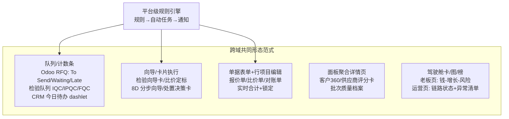
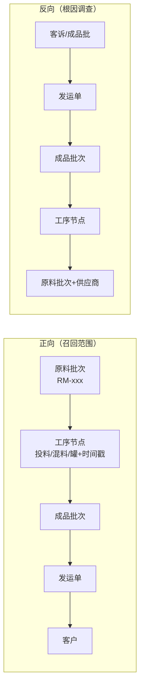
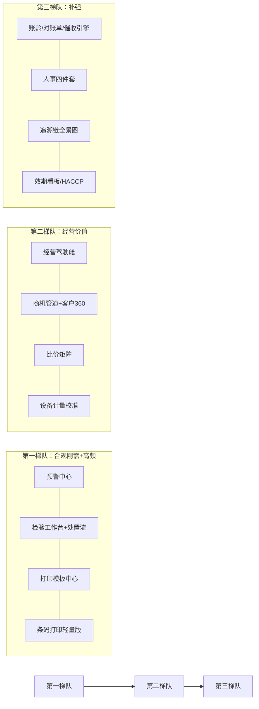

# W6 调研报告：经营管理五域开源标杆 + 食品制造行业特性 + 扩展域商业化筛选

> 研究日期：2026-10-01 ｜ 来源：5 个并行调研分片、合计约 120 条带 URL 证据（官方一手来源为主）｜ 深度：Exhaustive
> 底稿分片（同目录，含逐条证据清单与全文引文）：
> [pt1a-erp-finance.md](pt1a-erp-finance.md)（ERP+财务/人事，18 源）、[pt1b-qms-scm.md](pt1b-qms-scm.md)（QMS+SCM，21 源）、[pt1c-crm.md](pt1c-crm.md)（CRM，26 源）、[pt2-food-industry.md](pt2-food-industry.md)（食品特性，24 源）、[pt3-extension-domains.md](pt3-extension-domains.md)（扩展域，35 源）
> 参照背景：平台已有审批流设计器、看板/甘特/日历视图、统计卡、AQL GB/T 2828.1 十五段、FEFO、MPS/MRP、九步端到端闭环、八角色权限、简单 AR/AP、移动端 AI 同事；全局 UIUX 规范见 [research/2026-09-29-mfg-erp-mes-uiux/report.md](../2026-09-29-mfg-erp-mes-uiux/report.md)，本文不重复。

---

## 1. 执行摘要

本轮调研为 W6 规划提供三块底稿：①五域（ERP/QMS/SCM/CRM/财务人事）开源标杆的功能矩阵与交互形态；②食品制造行业特性的监管依据与数字化承载；③扩展域商业化筛选。五路并行取证均以官方一手文档为主（Odoo 18/19、ERPNext/Frappe、Dolibarr、EspoCRM、SuiteCRM、SAP Help、市场监管总局/国标全文公开系统、GS1、ASQ 等），关键结论均有双源交叉验证。

**最重要的总体判断：五域的增量不在"再补几张表格"，而在五种被标杆反复验证的非表格交互形态**——经营驾驶舱（数字卡/趋势/排行榜三层）、检验工作台（队列 + 全屏向导卡）、寻源比价矩阵（分组对比 + 逐行定标）、商机管道 Kanban（拖拽换阶段 + 概率加权）、客户 360（摘要字段 + 面板聚合 + 时间线 Stream）。同时，四个域不约而同地依赖同构的「规则引擎 → 自动任务 → 通知」底座（Odoo QCP 检验控制点、Follow-up Levels 账期催收、Reordering Rules 再订货、Alert Date 效期预警），建议 W6 把它抽象为平台级能力一次建设、四域复用。

**食品特性的最强驱动力是合规**：《食品安全法》第 42/50/51/52/63/98 条给出追溯、进货查验、出厂检验、召回的法定字段与状态机；GB/T 37029-2018 规定追溯记录要素；**GB 14881-2025 已于 2026-09-02 实施**（替代 2013 版），其"监控程序"五要素（点位/频次/指标/限值/异常处置）就是 CCP 监控表单的字段清单，并连带把计量校准、培训健康证、记录留存的优先级推高。追溯链交互形态结论：**分层链路图（泳道式 DAG）为主形态**（SAP GBT"以表或图形显示批次跟踪网络，自下而上或自上而下分析"），正反向 Segmented 切换 + 「召回范围」开关沿边高亮波及链路。

**扩展域筛选结论**：必做 3 项（预警中心、条码打印中心轻量版、打印模板中心）+ 补充发现的偏必做 1 项（设备与计量校准管理，GB 14881-2025 刚实施的最强合规抓手）；可选 4 项；不做 4 项（独立 LIMS、独立项目管理、客户门户、能源管理）——遵循"商业产品要有克制"。

## 2. 关键发现（Key Findings）

1. **五种非表格形态是五域胜负手**，均有两款以上标杆印证：Odoo Sales 驾驶舱官方原文给出"数字卡（报价数/订单数/营收/平均订单值）→ 月度销售图 → Top 榜 ×4 → 全局期间过滤（默认近 90 天）"三层结构（[Odoo Dashboards](https://www.odoo.com/documentation/18.0/applications/productivity/dashboards.html)）；EspoCRM 商机是"唯一默认开 Kanban 的实体"，拖拽换列即改阶段、概率参与加权管道（[EspoCRM sales-management](https://docs.espocrm.com/user-guide/sales-management/)）；客户详情页三层结构（摘要网格 + Side Panels + Bottom Panels/Stream）（[EspoCRM layout-manager](https://docs.espocrm.com/administration/layout-manager/)）。
2. **「规则→任务→通知」引擎四域同构**：Odoo QCP 按"操作×产品×频率(全部/随机%/周期)×抽样比"自动生成检验任务（[Quality control points](https://www.odoo.com/documentation/19.0/applications/inventory_and_mrp/quality/quality_management/quality_control_points.html)）；Odoo Follow-up Levels 按"逾期天数→等级→邮件/信件/短信"催收、负数天数=到期前提醒（[Follow-up](https://www.odoo.com/documentation/18.0/applications/finance/accounting/payments/follow_up.html)）；Odoo Reordering Rules Min/Max/Multiple 自动生成 RFQ/MO（[Reordering rules](https://www.odoo.com/documentation/19.0/applications/inventory_and_mrp/inventory/warehouses_storage/replenishment/reordering_rules.html)）；ERPNext Notification 支持 Days Before/After 触发 + 多渠道 + 防重复（[ERPNext notifications](https://docs.frappe.io/erpnext/notifications)）——四个场景是同一引擎的四份配置。
3. **检验工作台 = 队列与执行分离**：队列按 IQC/IPQC/FGC 分段计数（对标 Odoo RFQ 的 To Send/Waiting/Late 状态条），执行是全屏卡片向导（Pass-Fail 大按钮、Measure 数值 Norm/Tolerance 即时色块、超差弹"重测/确认失败"双按钮防误操作、拍照留证、Manual 让步容忍），IPQC 嵌入车间触屏终端工单步骤流（[Odoo Quality checks](https://www.odoo.com/documentation/19.0/applications/inventory_and_mrp/quality/quality_management/quality_checks.html)、[ERPNext Quality Inspection](https://docs.frappe.io/erpnext/quality-inspection)）。我们已实现的 AQL 15 段表做成检验卡头部"n=32 (AQL 2.5 一般水平 II)"徽章即超越两款标杆。
4. **不合格品四路处置（返工/让步/报废/退货）两款标杆都缺**：Odoo 只到 Alert 看板 + CAPA 文本字段，ERPNext 只有 Rejected 状态 + Quality Action——这是我们的差异化机会，且返工复检闭环、退货联动供应商绩效均可依托现有审批引擎。
5. **追溯链推荐分层 DAG 而非树形**：SAP GBT 官方"以表或图形显示批次跟踪网络，自下而上或自上而下分析"（[SAP GBT](https://help.sap.com/docs/SAP_GLOBAL_BATCH_TRACEABILITY_ON_SAP_S_4HANA/041b68cbcb4e404da47a2da1e827a4f7/6ccec68e48cb4c70b7ff3a25c5bfa0ff.html)）；批次谱系天然是有向无环图（分批/混料使树形重复展开失真），召回范围 = 图遍历的波及半径（[inventorypath](https://www.inventorypath.com/lot-genealogy-at-scale-graph-database-patterns-for-fda-21-cfr-part-11-and-fsma-204-traceability/)）；业界通行季度召回演练、目标小时级（用友案例 3 万箱 28 分钟隔离，营销口径供参考，[YonSuite 案例](https://www.yonsuite.com/infoNew/22604097939195.html)）。
6. **监管依据可逐条映射到系统字段**：食安法第 50 条=来料台账字段清单（记录保存≥保质期后 6 个月）、第 51 条=出厂检验报告九要素+检验合格证号、第 52 条=检验放行闸门、第 63 条=召回状态机（[食品安全法全文](https://www.samr.gov.cn/zw/zfxxgk/fdzdgknr/fgs/art/2023/art_6bff4ef87291497fa72949e1fc88efb5.html)）；GB/T 37029-2018=生产/物流/销售三环节记录要素（[国标页](https://openstd.samr.gov.cn/bzgk/std/newGbInfo?hcno=15516C1DE22A7ECECC46401AA2FE5DC4)）；**GB 14881-2025 于 2026-09-02 实施**，新增 HACCP 指南附录与"监控程序"定义（[解读](https://www.foodmate.net/zhiliang/guanli/173787.html)）。
7. **效期双轨制**：产品级临期阈值按监管分档自动推导（≥1 年→前 45 天、半年~1 年→前 20 天、90 天~半年→前 15 天、30~90 天→前 10 天，[四地汇总](http://info.foodmate.net/reading/show-32.html)）；看板视觉沿用 >90 绿/30-90 黄/<30 红但红区取 min(固定带, 监管阈值) 孰早原则——否则 7 天短保品类失真。日期模型采 Odoo 四段式（到期/最佳赏味/下架/预警日，[Odoo Expiration dates](https://www.odoo.com/documentation/19.0/applications/inventory_and_mrp/inventory/product_management/product_tracking/expiration_dates.html)）。
8. **条码选型定型**：批次标签主力 GS1-128，最小 AI 集 01(GTIN)+10(批号)+11(生产日期)+17(有效期)，整托加 00(SSCC)（[GS1 AI 清单](https://ref.gs1.org/ai/)）；前端生成 bwip-js（v4.11.4 活跃维护、100+ 码制、PNG/canvas/SVG，[GitHub](https://github.com/metafloor/bwip-js)），标签模板走 ZPL + Labelary（在线预览 + REST 渲染 PNG/PDF，[labelary.com](http://labelary.com/)）；C 端溯源用 QR+URL（对齐国家冷链平台"一批一码/一件一码"口径，[卫健委规程 PDF](https://www.nhc.gov.cn/cms-search/downFiles/7d9557a882e54982ba7e2becfaf66ad5.pdf)）。
9. **出厂检验报告九要素有权威清单**：产品名称/规格/数量/生产日期或批号/保质期/检验依据/结论/报告人/审核人（+报告编号=检验合格证号），流程四步"抽样→检验→记录与报告→复核放行"，留样每批次+专用留样室（[上海市监局合规指引](https://www.shanghai.gov.cn/gwk/search/content/2c984a729863eb4501987407a31a28fc)）。监管上报接口仅进口冷链国家平台有完整公开对接规程，其余以合规台账导出为主。
10. **扩展域判定**：必做=预警中心 + 条码打印中心（轻量）+ 打印模板中心；偏必做=设备与计量校准管理（GB 14881-2025 刚实施、强检有处罚依据、Odoo Maintenance 范式低成本可复刻）；不做=独立 LIMS（SENAITE 边界为对外检测实验室）、独立项目管理、客户门户、能源管理（详见 Part 3）。

---

## 3. Part 1：经营管理五域标杆

### 3.0 五域总览

| 域 | 标杆 | W6 增量 P0 一句话 | 核心非表格形态 | 详见 |
|---|---|---|---|---|
| ERP 经营 | Odoo 18 / ERPNext / Dolibarr | 经营驾驶舱整页形态 + 按收货量开账单&三单匹配付款拦截 + RFQ 询价比价 + 销/采退货逆向链 | 驾驶舱三层（卡/图/榜）+ 列表页状态计数条 | [pt1a](pt1a-erp-finance.md) |
| QMS 质量 | ERPNext Quality / Odoo Quality(Ent.) | 检验任务控制点规则引擎 + 检验工作台三视图 + 模板化逐项判定 + 收货强制卡点 + 不合格四路处置状态机 | 队列计数卡 + 全屏检验向导 + 处置决策卡/看板 | [pt1b](pt1b-qms-scm.md) |
| SCM 供应链 | Odoo Purchase + 国内 SRM | 平行 RFQ + 比价矩阵逐行定标 + 再订货点规则 + 供应商评分卡联动准入 | 分组对比矩阵 + 评分卡雷达/趋势页 | [pt1b](pt1b-qms-scm.md) |
| CRM 客户 | EspoCRM / SuiteCRM | 商机管道 Kanban + 客户 360 + 今日待办聚合 + 报价单据化→PDF→一键转单 | Kanban 管道 + 360 面板聚合 + Stream 时间线 | [pt1c](pt1c-crm.md) |
| 财务/人事 | Odoo Accounting/HR / Frappe HR | 财务 P1 四件套（账龄分桶/对账单 PDF/分级催收引擎/核销+三单匹配）；人事 P1 四件套（报销/简版考勤/请假/员工档案） | 账龄分桶条形图 + 催收状态灯 + 请假日历 | [pt1a](pt1a-erp-finance.md) |

*五域交互形态收敛为五类页面范式；底部"规则引擎"是四域（QCP 检验控制点/Follow-up 催收/Reordering 补货/Alert 效期预警）共同依赖的平台能力，建议一次建设四域复用。*

### 3.1 ERP 经营管理域（Odoo / ERPNext / Dolibarr）

**P0/P1 建议矩阵（浓缩，完整 18 行矩阵见 [pt1a](pt1a-erp-finance.md)）**：

| 功能项 | 建议优先级 | 一句话依据（标杆） |
|---|---|---|
| 经营驾驶舱整页 | **P0（新增）** | Odoo Enterprise Dashboards 三层结构 + ERPNext Workspace 首屏看板化 + Dolibarr 63 box 全卡片形态，三家收敛 |
| SO→发货→开票 / PO→收货→账单链路 | P0（已有，补强） | 补「按收货量开供应商账单」+「三单匹配付款拦截」（[Odoo Bill control](https://www.odoo.com/documentation/18.0/applications/inventory_and_mrp/purchase/manage_deals/control_bills.html)：未收货账单 "Should Be Paid=否"） |
| RFQ 询价比价 | **P1（SCM 域联动 P0）** | Odoo RFQ dashboard + 供应商价格表带出历史价/交期 |
| 销/采退货红冲逆向链 | P1 | Odoo Returns and refunds / ERPNext Credit Note——九步闭环的正向缺口 |
| 报价单（模板/有效期/转单） | P1 | 食品 B 端"打样→正式订单"高频；与 CRM 域报价单据化合并建设 |
| 总账/科目表/预算/成本核算 | **P2/不做** | 与金蝶/用友正面竞争无胜算；坚持"业务台账+资金台账，导出给财务软件"边界 |

**经营驾驶舱交互形态**（管理层看板重点）：Odoo 官方对 Sales dashboard 的描述即标准答案——第一层 4 张 KPI 数字卡（报价数/订单数/营收/平均订单值），第二层月度销售趋势图，第三层 Top 榜（报价订单/产品/销售员/客户区域），顶部全局过滤器默认近 90 天、点击任意数字直接钻取底层单据（[Odoo Dashboards](https://www.odoo.com/documentation/18.0/applications/productivity/dashboards.html)）。角色分层：**老板/总经理页只放"钱-增长-风险"三主题**（营收/毛利/逾期 AR/到期 AP 数字卡 + 趋势 + Top 榜 + 临期呆滞/账龄分桶/待审批风险区），**运营总监页做九步链路状态计数条 + 异常清单**（对标 Odoo RFQ 的 To Send/Waiting/Late 轻看板形态铺到全链路）。明确不该是表格的页面：驾驶舱首页、各列表页顶部状态汇总区、客户 360 应收区块。

**菜单 IA**：Odoo=App 切换器（按应用组织，财务散在多 App，对 SMB 是反面教材）；ERPNext=15 个 Workspace 侧边栏（按业务域聚合，Buying 一页聚齐 MR/SQ/PO/PI，[frappe/erpnext workspace](https://github.com/frappe/erpnext/tree/develop/erpnext)）；Dolibarr=模块开关菜单。**建议向 ERPNext Workspace 模式收敛**：一级导航=业务域工作台（≈现有八域），工作台首屏=轻看板（状态计数条+数字卡+快捷入口），新增「经营总览」驾驶舱放一级导航首位，跨域缝合用单据 smart button（SO 详情挂发货/发票/收款按钮链）。

### 3.2 QMS 质量管理域（ERPNext Quality / Odoo Quality）

**P0 清单**：检验任务控制点规则引擎（来源单据×物料×频率[全部/随机%/周期]×抽样比自动生成，对标 Odoo QCP 四档频率）、检验工作台三视图（桌面队列/订单弹窗/车间触屏步骤卡）、检验项模板化逐项判定（Pass-Fail 大按钮 + Measure 数值 Norm/Tolerance 色块 + 拍照留证 + Manual 让步容忍）、收货未检验强制卡点（ERPNext Item 级拦截单据提交）、AQL 抽样指引徽章、**不合格品四路处置状态机（返工/让步/报废/退货 + 审批路由 + 返工复检闭环——两款标杆均缺，差异化机会）**。

**检验工作台交互形态**：任务队列与检验执行是两个页面。队列按 IQC/IPQC/FQC 分段计数卡（To Send/Waiting/Late 式状态分栏，逾期高亮）；执行是全屏卡片向导而非表格——头部挂来源单据链接 + 批次 + 「n=32 (AQL 2.5 一般水平 II)」样本量徽章，中部检验项逐卡判定（数值超差弹「重测/确认失败」双按钮防误操作，感官项直接调终端相机），底部整体判定 + 让步理由（[Odoo Measure check](https://www.odoo.com/documentation/19.0/applications/inventory_and_mrp/quality/quality_check_types/measure_check.html) 的防误操作设计值得照抄）；IPQC 嵌入车间触屏终端工单步骤流，失败弹窗内联处置指引并可一键升级为不合格警报（对标 Odoo Shop Floor + QCP 的 Message If Failure）。

**不合格处置 + 8D/CAPA**：处置流是状态机+决策卡（返工→shop_lead 审批→生成返工工单→回待检复检；让步→qa_manager+采购会签；报废→财务+qa；退货→采购→供应商质量记录）。8D 按 ASQ 权威 D0-D8 结构（[ASQ 8D](https://asq.org/quality-resources/eight-disciplines-8d)）做成客户投诉触发的**分步表单向导**（每屏一个 D），两款标杆均无 8D 承载；轻量 CAPA 挂处置关单必填「原因分类+是否预防措施」。SPC（X-bar/R、Cp/Cpk）两款标杆原生均无（ERPNext 生态明言"平台止步于 pass/fail"，[ecosire](https://ecosire.com/apps/erpnext/erpnext-statistical-process-control-spc)），W6 只留检验读数数据底座，图形后置。

**菜单 IA**：工作台（qc_inspector 默认落点：待检队列+不合格看板）→ 检验（任务/模板/抽样方案 AQL 只读）→ 不合格处置（处置单/让步台账）→ 改进（CAPA 任务/8D 向导）→ 供应商质量（评分卡）→ 配置（控制点规则/失败处置指引模板）。

### 3.3 SCM 供应链域（Odoo Purchase + 国内 SRM 通行做法）

**P0 清单**：多供应商平行 RFQ（Odoo Alternatives 克隆产品明细发多家 + 供应商价格库带出历史价/交期）、**比价矩阵页**（Compare Product Lines：按产品分组嵌套各供应商报价行，逐行 Choose 定标，定标后 Cancel/Keep Alternatives 二选一）、再订货点规则（Min/Max/Multiple 倍数 + 预测库存触发 + 自动生成建议采购单人工确认，[Odoo Reordering rules](https://www.odoo.com/documentation/19.0/applications/inventory_and_mrp/inventory/warehouses_storage/replenishment/reordering_rules.html)）、供应商绩效评分卡数据底座（批次合格率/准时率/退货率同源采集，等级 warn/prevent 联动 RFQ 入口——ERPNext Scorecard 独有设计，[Supplier Scorecard](https://docs.frappe.io/erpnext/supplier-scorecard)）。

**寻源比价交互形态**（buyer 主场）：「分组对比矩阵 + 逐行定标」两段式——询价期在同一 RFQ 的 Alternatives 标签页克隆产品明细发多家（Expected Arrival 按各家 lead time 自动算好），报价回收后进入比价页：按产品分组、组内嵌套展开各供应商行（价格/交期同屏），逐产品点 Choose 定标；全部选定确认订单时弹窗询问落选询价单取消还是保留为后备（[Odoo Call for Tenders](https://www.odoo.com/documentation/19.0/applications/inventory_and_mrp/purchase/manage_deals/calls_for_tenders.html)）。**我们的增强点：矩阵追加「历史成交价 + 批次合格率」两列，形成价格/交期/质量三维定标，超越两款标杆**。

**供应商协同门户（P1 二期）**：Odoo 原生 portal 只读（"Portal users only have read/view access"，[User portals](https://www.odoo.com/documentation/19.0/applications/general/users/user_portals.html)），ASN 送货预约原生无（"native Odoo runs out of road"，[ecosire ASN](https://ecosire.com/apps/odoo/inbound-asn-receiving-portal)）；国内 SRM 通行五大协同（预测/订单/送收货/质量/结算，[甄云](https://www.going-link.com/product/manage)）。一期做「对账单协同 + 订单状态只读门户」，ASN 送货预约放二期（依赖供应商配合度）。招投标/竞价大厅 P2 不做（三供应商比价覆盖 90% 场景）。

**菜单 IA**：寻源（询价单/比价矩阵/定标记录）→ 采购执行（PO/收货对账）→ 供应商管理（档案+证照效期预警/评分卡/门户）→ 补货计划（再订货规则/补货建议）→ 配置（价格库/寻源策略）。

### 3.4 CRM 客户关系域（EspoCRM / SuiteCRM）

**P0 清单**：客户+联系人（多对多）、商机（阶段+概率+加权金额）、**商机管道 Kanban（拖拽换阶段，EspoCRM 默认视图）**、跟进活动（会议/电话/任务+逾期提醒）、今日待办聚合视图、时间线 Stream、**客户 360 详情页（面板聚合）**、报价单据化（行项目+折扣+有效期+审批挂钩）→PDF 模板→一键转销售订单/发票。SuiteCRM 的报价链路（Quote Stage 七态 + Approval Status + Convert to Invoice）免费内置但核心商机仍是列表视图、Kanban 靠付费插件（[Mokas SalesPipe](https://store.suitecrm.com/addons/salespipe)）——印证 Kanban 管道是价值点而非标配。

**四个交互形态要点**：
- **管道 Kanban**：列=销售阶段（EspoCRM 默认 6 阶段：Prospecting→Qualification→Proposal→Negotiation→Closed Won/Lost；SuiteCRM 默认 10 阶段更细）；拖卡换列即改阶段并回写概率（Won=100%/Lost=0%），概率参与加权管道与收入预测；列头金额汇总 + 按销售员/团队过滤；主视图是 Kanban、表格只是检索辅助态（[EspoCRM sales-management](https://docs.espocrm.com/user-guide/sales-management/)）。
- **客户 360**：三层结构——顶部摘要字段区（1~4 列网格）→ 右侧 Side Panels（Activities 进行中/History 已完成/Tasks）→ 底部 Bottom Panels（Stream 时间线 + Opportunities/Contacts/Cases/Documents/Quotes 关系面板，可 Tab 分组、按团队差异化布局）（[EspoCRM layout-manager](https://docs.espocrm.com/administration/layout-manager/)）。销售代表先看右侧活动与 Stream，销售总监看管道总览+History+Cases；**客户详情页绝不该是表格**。
- **今日待办**：My Activities dashlet 卡片流 + 日历（月/周/日/多人 Timeline）双入口；逾期提醒 Popup+Email 双通道。
- **报价单流程**：商机详情页 Quotes 面板新建→自动带入商机行项目；单据要素=行项目（品名/数量/列表价/成交价/折扣/税率/分组小计）+ 合计区 + Valid Until + 自动单号 + 锁定；输出 PDF 模板（{{占位符}} + itemList 行循环）；再由关系面板一键生成销售订单/发票。**报价编辑页是单据表单（头信息+行项目编辑器+实时合计），不是表格 CRUD**。

**菜单 IA 建议**：CRM 并入现有"销售域"，采用 SuiteCRM 式域分组（销售/客服）而非 EspoCRM 平铺 Tab（我们 206 路由规模下平铺不可行）；一级分组：客户与联系人 / 商机管道（入口直接落 Kanban）/ 报价与订单 / 客服工单（P1）；顶栏保留快捷新建、最近访问、通知铃铛、全局搜索四件套；今日待办不进菜单、放工作台首屏。

### 3.5 财务/人事支撑域（Odoo Accounting/HR + Frappe HR 交叉验证）

**财务 P1 四件套**（我们有简单 AR/AP，以下为补强而非新建）：
1. **AR 账龄 30/60/90/120 分桶**（条形图+客户下钻，非发票表格）；
2. **一键客户对账单 PDF**（周期区间+期初/发生/核销/余额四段式，批量导出，对标 ERPNext Process Statement of Accounts）；
3. **分级账期催收引擎**（Odoo Follow-up Levels 形态：天数阈值→等级→通知动作，支持负天数=到期前提醒，可复用审批引擎的转移源设计）；
4. **收款核销到多单 + 预收挂账 + 付款前三单匹配校验**（已收货量≥账单量才放行）。

财务 **P2/不做**：银行对账（最多手工勾对极简版）、总账/科目表/预算/成本核算——明确边界"业务台账+资金台账，导出给金蝶/用友"。

**人事 P1 四件套**：费用报销（类别→报销单→审批→打款→台账，Odoo Community 即有全链条）、移动签到+补卡审批+月度出勤台账（Kiosk 硬件与排班不做）、假别+余额+请假审批+团队请假日历、员工档案+组织架构树（打通八角色）。**P2/不做**：Payroll/绩效/招聘/车队。版本边界提醒：Odoo 考勤/报销/请假在 Community 就齐（GitHub addons@18.0 证实，[odoo/odoo](https://github.com/odoo/odoo/tree/18.0/addons)），完整 Accounting/银行对账/Payroll/BI 才是 Enterprise——不要被"旗舰版才有价值"叙事带偏。

---

## 4. Part 2：食品制造行业特性

### 4.1 批次/序列号追溯（含追溯链交互形态建议）

**正反向定义与召回范围**：正向追溯=原料批→所有受波及成品批/发运去向（召回范围计算）；反向追溯=成品批/客诉→全部原料批次/工序/供应商（根因调查）；内部追溯=分批/混料/返工的谱系保全（[FlowSense](https://www.flowsense.solutions/blog/lot-traceability-process-manufacturing)、[iFactoryApp](https://ifactoryapp.com/article/batch-genealogy-traceability-lot-to-shipment)）。

**监管依据**（条款原文取自 samr.gov.cn 官方全文，[食品安全法](https://www.samr.gov.cn/zw/zfxxgk/fdzdgknr/fgs/art/2023/art_6bff4ef87291497fa72949e1fc88efb5.html)）：

| 依据 | 要求要点 | 系统映射 |
|---|---|---|
| 食安法第 42 条 | 全程追溯制度总依据，鼓励信息化采集 | 追溯域法定基础 |
| 第 50 条 | 进货查验记录（名称/规格/数量/生产日期或批号/保质期/供货者）+ 保存≥保质期后 6 个月 | 来料批次台账字段清单 |
| 第 51 条 | 出厂检验记录 + 检验合格证号 + 销售流向 | 出厂检验报告 + 反向追溯下游锚点 |
| 第 52 条 | 检验合格方可出厂 | 检验放行闸门（hold→pass→release） |
| 第 63 条 | 召回四动作（停售/召回/通知/记录）+ 上报 | 召回工作流状态机 |
| GB/T 37029-2018 | 生产/物流/销售三环节追溯记录要素 | 记录模型字段标准（[国标页](https://openstd.samr.gov.cn/bzgk/std/newGbInfo?hcno=15516C1DE22A7ECECC46401AA2FE5DC4)） |
| 《食品召回管理办法》（总局令 122 号） | 召回分级/时限/报告细则 | 召回流程参数 |

**追溯链全景图交互形态建议**（本 Part 最重要结论）：

**建议：分层链路图（泳道式 DAG）为主形态，图谱自由布局为可选视图，不做树形唯一展开**。落地要点：①横/纵轴固定为链路阶段（供应商/原料批→收货→工序→成品批→库位→发运→客户），分裂/合并以多条边自然表达——批次谱系天然是 DAG，树形会重复展开同一节点（[inventorypath](https://www.inventorypath.com/lot-genealogy-at-scale-graph-database-patterns-for-fda-21-cfr-part-11-and-fsma-204-traceability/)）；②顶部 Segmented Control 正/反向切换，锚点不变翻转遍历方向（对应 SAP GBT"自上而下/自下而上分析网络"，[SAP Help](https://help.sap.com/docs/SAP_GLOBAL_BATCH_TRACEABILITY_ON_SAP_S_4HANA/041b68cbcb4e404da47a2da1e827a4f7/6ccec68e48cb4c70b7ff3a25c5bfa0ff.html)）；③「召回范围」开关沿边遍历高亮整链 + 无关节点降灰，侧栏给出受影响批次/库存/已发运/客户清单（"bound the blast radius in the query" 的交互化）；④节点卡=批次号+物料+数量+状态，边=转换事件+数量+时间戳，谱系边 append-only 只增不改（审计要求）；⑤工具栏直挂「召回演练」按钮——按当前高亮范围生成演练报告（业界季度演练、目标小时级）。

### 4.2 效期管理

- **日期模型**：批次实体存"生产日期+保质期"，系统推导 Odoo 四段式衍生日期（到期日/最佳赏味/下架日/预警日，产品级天数偏移，[Odoo Expiration dates](https://www.odoo.com/documentation/19.0/applications/inventory_and_mrp/inventory/product_management/product_tracking/expiration_dates.html)）。
- **临期阈值双轨制**：产品级"临期阈值"字段默认按监管分档推导（≥1 年→前 45 天、半年~1 年→前 20 天、90 天~半年→前 15 天、30~90 天→前 10 天、15~30 天→前 5 天，京沪穗一致，[食品伙伴网四地汇总](http://info.foodmate.net/reading/show-32.html)）；看板三级色沿用 >90 绿/30-90 黄/<30 红作默认视觉，但红区判定取 min(固定带, 监管阈值) 孰早原则。
- **效期看板布局**：主视图=品类×剩余天数分桶热力矩阵（点格下钻批次清单）+ 顶部 KPI 条（临期批次总数/临期金额/本周到期/本月到期/已过期待处置）+ FEFO 拣货指引（已有 FEFO，补"临期优先通道"配置）。

### 4.3 HACCP 体系数字化承载

标准依据：GB/T 27341-2009（HACCP 体系通用要求）+ **GB 14881-2025（2026-09-02 已实施，替代 2013 版）**——新版"监控程序"定义=监控点位/频次/指标/限值/异常处置五要素，正好是 CCP 监控表单的字段清单；另新增 HACCP 应用指南附录（[解读](https://www.foodmate.net/zhiliang/guanli/173787.html)、[GB/T 27341 国标页](https://openstd.samr.gov.cn/bzgk/std/newGbInfo?hcno=FAC276BE3CC48070156D8BA81E554D5D)）。

数字化三件套：①**危害分析工作单**（行=工艺步骤；列=危害[生物/化学/物理]/是否显著/预防措施/是否 CCP[判定树结论]，版本化留痕）；②**CCP 计划表+监控记录**（CCP 主数据=点位+关键限值 CL+监控方式/频率+记录岗位+纠偏预案；执行层按频率自动生成监控任务推送到车间触屏终端，实测越限即时预警+联动批次冻结）；③**纠偏与台账**（超限触发纠偏单：隔离/返工/报废+受影响批次数量——对接不合格处置流；CCP 记录台账 append-only，每条带操作员/时间戳/原始值）。体系审核清单（内审/管理评审 checklist + 周期任务）与仪器校准计划挂钩（见 Part 3 补充候选 A）。

### 4.4 AQL 与检验工作台关系（确认）

GB/T 2828.1 十五段表（已实现，无需重调）在检验工作台中的位置是**"任务执行中段的样本量与判定引擎"**：检验任务由控制点规则生成后 → 按批量 N 与检验水平 IL 查 15 段表得样本量字码与 Ac/Re → 抽样逐项判定 → 依 Ac/Re 出批次接收/拒收结论 → 联动批次放行或冻结（对应食安法第 52 条检验放行闸门）。**AQL 表不产生任务、不做放行决策，只负责"定样本量+给判定准则"**——即在检验执行卡的头部做只读徽章+可展开明细，与 Odoo QCP 的 Partial Test 百分比、ERPNext 的 sample size 字段相比是降维优势。

### 4.5 条码/扫码体系

- **码制选型**：批次标签主力 GS1-128（最小 AI 集 **01+10+11+17**=是什么+哪批+何时产+何时到期；整托加 00 SSCC）；零售单品 EAN-13；C 端溯源 QR+URL（对齐国家冷链平台"一批一码最低/一件一码/无码须建追溯单元 URL"口径，[卫健委规程](https://www.nhc.gov.cn/cms-search/downFiles/7d9557a882e54982ba7e2becfaf66ad5.pdf)；[GS1 AI 中文清单](https://ref.gs1.org/ai/)）。
- **扫码场景**：工位扫码报工（扫批次码→自动建谱系边）、收货扫码登记供应商批次、库位/批次扫码移库与盘点、发运扫码（FEFO/临期拦截校验）。
- **开源方案**：前端生成 **bwip-js**（v4.11.4 活跃维护、100+ 码制含 GS1-128/QR、PNG/canvas/SVG，[GitHub](https://github.com/metafloor/bwip-js)）；标签模板 **ZPL + Labelary**（在线预览 + REST 渲染 PNG/PDF、直连 Zebra 热敏打印机，[labelary.com](http://labelary.com/)）；Odoo 原生"批次标签 Print 输出 PDF 或 ZPL 双通道"佐证通行做法（[Odoo Barcode](https://www.odoo.com/documentation/19.0/applications/inventory_and_mrp/barcode/setup/serial_numbers_lots.html)）。

### 4.6 食品行业特有报表

- **出厂检验报告（合格证）九要素**（上海市监局 2025 合规指引权威清单）：产品名称/规格/数量/生产日期或批号/保质期/检验依据/结论/报告人/审核人（+报告编号=食安法第 51 条"检验合格证号"+签发日期）；流程四步抽样→检验→记录与报告→**复核放行**；检验项目七类（感官/理化/微生物/污染物/农兽残/添加剂/其他）；留样每批次+专用留样室；记录保存≥保质期后 6 个月（[上海指引](https://www.shanghai.gov.cn/gwk/search/content/2c984a729863eb4501987407a31a28fc)）。
- **批次质量档案**=批次实体聚合页：出厂检验报告+来料检验+CCP 监控记录+留样记录+出入库流水（面板聚合形态，同客户 360 范式）。
- **监管上报接口**：仅进口冷链国家平台有完整公开对接规程（数据元+Http Basic+官方 Java SDK+编码字典，[nhc.gov.cn PDF](https://www.nhc.gov.cn/cms-search/downFiles/7d9557a882e54982ba7e2becfaf66ad5.pdf)）；GB/T 44368-2024 提供追溯系统间数据交换公开规范；SC 许可/地方追溯平台无全国统一机器接口——系统以**合规台账+法定要素报告导出**为主，预留可配置导出通道。

---

## 5. Part 3：扩展域商业化筛选

### 5.1 筛选总表（10 候选 + 3 补充）

| 候选域 | 功能边界一句话 | 判定 | 开源标杆 | 核心理由 |
|---|---|---|---|---|
| 1. 预警中心 | 库存效期/供应商资质/账期/质量异常的规则配置+定时扫描+统一预警列表+多渠道触达 | **必做** | ERPNext Notification、Odoo Alert Date | 食品合规（效期/资质）+现金流（账期）双刚需；GB 14881-2025 明确建议用 ERP 管库存预警；八域数据已在线只缺收口层 |
| 2. 报表中心/经营报表 | 内置经营报表模板 + 可选外挂开源 BI 嵌入 | 可选 | Metabase、NocoBase chart block | 内置统计卡+chart block 覆盖 80% 场景；Metabase OSS 嵌入认证受限（SSO 付费）只作增值选项 |
| 3. 实验室 LIMS | 第三方实验室级样品登记/计费/仪器对接/报告发布 | 不做（独立 LIMS） | SENAITE | SENAITE 边界为对外检测实验室（计费/客户门户/11 角色）；食品厂化验室 2-5 人用不上；轻量检验已在 QMS |
| 4. 项目管理 | 通用项目协作/甘特/工时/敏捷 | 不做 | OpenProject、Plane | 非项目型制造；已有看板+审批+移动任务承载；引入独立 PM 徒增账号与培训成本 |
| 5. 供应商门户 | 供应商自助上传资质/对账/送货预约 | 可选（资质台账必做但归 SRM+预警中心） | Odoo Portal（原生只读） | GB 14881-2025 资质效期是硬要求但不需要门户形态；几十人厂供应商 IT 能力弱，门户二期 |
| 6. 客户门户 | 客户自助查订单/对账/质量报告 | 不做（远期） | Odoo Customer Portal、SuiteCRM AOP | 经销商无自助登录习惯；小程序"输批次号查检验报告"可轻量替代 |
| 7. 能源管理 | 水电汽计量采集/能耗分摊 | 不做 | OpenEMS、ThingsBoard | 两标杆均面向设备级 IoT 调度需硬件投入；手工分摊表+报表足够 |
| 8. 工装夹具/模具 | 模具台账/维保计划/寿命计数 | 可选（并入设备管理子集） | Odoo Maintenance | 食品厂模具台数少；与计量校准合并为"设备与计量管理"一起交付 |
| 9. 条码打印中心 | 标签模板设计+批量打印（浏览器 PDF/ZPL 双通道） | **必做**（轻量版） | bwip-js、Labelary、ZPL | 批次标签是食品追溯落地的物理载体、每天数十次高频；Odoo 原生 PDF/ZPL 双通道佐证通行 |
| 10. 打印模板中心 | 单据打印模板自定义（送货单/检验报告/合格证）+HTML→PDF | **必做** | ERPNext Print Format、Odoo QWeb | 出厂检验报告/合格证是食品出厂合规交付物；双标杆证明"HTML 模板+字段绑定+纸张格式"成熟范式 |
| 补 A. 设备与计量校准 | 设备/计量器具台账+校准检定计划记录+到期预警 | **偏必做**（最值得注意的补充） | Odoo Maintenance + 强检法规 | GB 14881-2025 刚实施：天平/温度计/pH 计/金探定期检定校准+记录归档是体系审核必查项、强检有处罚依据；与预警中心天然联动 |
| 补 B. 培训与健康证 | 健康证效期台账+年度培训计划/考核/记录 | 可选（低成本高合规价值） | GB 14881-2025 第 12 章 | 每年健康检查+上岗卫生培训是法定要求；一张表+预警即可，审核必查 |
| 补 C. 文档记录管理 DMS | 受控文件版本管理+记录留存策略 | 可选 | Paperless-ngx | 记录"电子+纸质双备份"要求；几十人厂文档量有限，NocoBase 附件+分类表轻量实现 |

判定分布：必做 3 + 偏必做 1、可选 4+2、不做 4——遵循"商业产品要有克制"，只把合规刚需与日常高频标为必做。

### 5.2 W6 落地优先级建议

*排序依据：第一梯队=食品安全合规硬要求且日常高频（Part 3 判定 + Part 2 监管映射）；第二梯队=管理层/销售直接感知的经营价值页；第三梯队=闭环补强与支撑域。追溯链全景图排第三梯队是实施顺序建议而非重要性排序——其数据底座（谱系边采集）应随扫码报工在第一梯队条码落地时同步埋点。*

---

## 6. 反方观点与风险（Contrarian Views）

- **Odoo 官方"Community=基础"叙事有商业立场**：OCA 明确反驳其对比不对称（"comparing a chassis with a finished car"，[OCA](https://www.odoocommunity.com/en/odoo-community-vs-enterprise)）；GitHub 证实考勤/报销/请假/询价/效期在 Community 全有。启示：SMB 最小完备集在开源层即可对齐，不要被旗舰版叙事带偏。
- **驾驶舱过度建设是无底洞**：Odoo Dashboards 建立在 Spreadsheet 引擎上，ERPNext 把自助 BI 外包给独立 Insights——我们只做"预置标准驾驶舱+固定组件"，不做自由拼装；老板页控制在 8-12 个组件内。
- **SuiteCRM 的 Kanban 管道是付费插件能力**（[store.suitecrm.com](https://store.suitecrm.com/addons/salespipe)），引用其"管道管理"功能时需注意核心 8.x 仍是列表视图——本文结论已据此以 EspoCRM 为 Kanban 主证据。
- **用友案例数字是营销口径**（追溯 8h→12min、3 万箱 28 分钟隔离），采用时仅作方向参考、不作承诺依据。
- **供应商门户推广风险**：几十人食品厂的供应商多为小贸易商/农户，自助门户的注册/使用门槛可能使二期投入沉没——一期只做对账协同+只读门户是对的。
- **催收引擎形态待定**：Odoo Follow-up Levels（配置驱动）与 ERPNext Dunning（单据化）两种形态未定，复用审批引擎还是独立轻量调度需要 W6 设计裁决。
- **毛利口径风险**：驾驶舱"毛利"数字卡依赖生产成本归集，若 W 轮成本数据不足以支撑，W6 先做营收/应收口径，避免假数字上驾驶舱。
- **GB 14881-2025 解读依赖二手来源**：标准原文页面因访问限制未直接抓取全文，时间线与条款要点以多源交叉印证（官方元数据页+行业权威解读），落地条款引用前建议购买标准文本复核。
- **EspoCRM 拖拽细节非文档原文**：官方文档未逐字描述 Kanban 拖拽，结论基于 Quick Tour 截图+社区共识（分片已 hedge）；其顶栏导航形态基于 Demo 推断。

## 7. 开放问题（移交 W6 规划）

1. 平台级"规则引擎"（预警中心+检验控制点+催收+补货共用）是否作为一个统一数据模型立项，还是各域各自实现？
2. 催收引擎复用审批流引擎的"等级→动作"建模，还是独立轻量调度？
3. 报价单确认通道：国内场景优先做微信端确认还是仅 PDF 往返？
4. 经营驾驶舱毛利口径：W 轮生产成本归集是否足以支撑？
5. 考勤与八角色权限整合深度（新增考勤员角色还是并入 HR 管理员）？
6. 追溯谱系边的存储与遍历：关系型递归 CTE 够用，还是引入图查询？（数据量小厂规模下大概率够用）
7. SPC 图形后置的时点（检验读数数据底座先行，何时补 X-bar/R 与 Cp/Cpk）？
8. 供应商门户 ASN 二期的触发条件（多少家供应商配合才值得开）？
9. Metabase 外挂作为增值选项的商务包装（含 OSS 嵌入认证限制的交付边界说明）。

## 8. 来源（Sources）

**分片索引**（每片含完整逐条证据表与原文引文）：

| 分片 | 主题 | 证据数 | 主要来源类型 |
|---|---|---|---|
| [pt1a-erp-finance.md](pt1a-erp-finance.md) | ERP + 财务/人事 | 18 | Odoo/ERPNext/Dolibarr 官方文档与 GitHub 源码目录 |
| [pt1b-qms-scm.md](pt1b-qms-scm.md) | QMS + SCM | 21 | ERPNext/Odoo 19 官方文档、ASQ、国内 SRM 厂商 |
| [pt1c-crm.md](pt1c-crm.md) | CRM | 26 | EspoCRM/SuiteCRM 官方文档（12 页全文深读） |
| [pt2-food-industry.md](pt2-food-industry.md) | 食品特性 | 24 | samr/openstd/gov.cn/SAP Help/GS1/FAO/Odoo 一手 |
| [pt3-extension-domains.md](pt3-extension-domains.md) | 扩展域 | 35 | Odoo/ERPNext/SENAITE/Metabase/NocoBase 官方 + 合规解读 |

**本文正文直接引用的核心一手来源**：

| # | 来源 | 类型 |
|---|---|---|
| 1 | https://www.odoo.com/documentation/18.0/applications/productivity/dashboards.html | Odoo 官方（驾驶舱三层结构原文） |
| 2 | https://www.odoo.com/documentation/18.0/applications/finance/accounting/payments/follow_up.html | Odoo 官方（Follow-up Levels） |
| 3 | https://www.odoo.com/documentation/18.0/applications/inventory_and_mrp/purchase/manage_deals/control_bills.html | Odoo 官方（三单匹配） |
| 4 | https://www.odoo.com/documentation/19.0/applications/inventory_and_mrp/quality/quality_management/quality_control_points.html | Odoo 官方（QCP 控制点） |
| 5 | https://www.odoo.com/documentation/19.0/applications/inventory_and_mrp/quality/quality_management/quality_checks.html | Odoo 官方（检验三入口） |
| 6 | https://www.odoo.com/documentation/19.0/applications/inventory_and_mrp/purchase/manage_deals/calls_for_tenders.html | Odoo 官方（比价定标流） |
| 7 | https://www.odoo.com/documentation/19.0/applications/inventory_and_mrp/inventory/warehouses_storage/replenishment/reordering_rules.html | Odoo 官方（再订货规则） |
| 8 | https://docs.frappe.io/erpnext/quality-inspection | ERPNext 官方（强制卡点/三态判定/Manual 容忍） |
| 9 | https://docs.frappe.io/erpnext/supplier-scorecard | ERPNext 官方（评分卡 warn/prevent） |
| 10 | https://docs.frappe.io/erpnext/notifications | ERPNext 官方（Days Before 触发/多渠道） |
| 11 | https://docs.espocrm.com/user-guide/sales-management/ | EspoCRM 官方（阶段/概率/默认 Kanban） |
| 12 | https://docs.espocrm.com/administration/layout-manager/ | EspoCRM 官方（360 三层布局体系） |
| 13 | https://docs.espocrm.com/user-guide/quotes/ | EspoCRM 官方（报价要素/PDF/转单） |
| 14 | https://store.suitecrm.com/addons/salespipe | SuiteCRM 商店（Kanban 属付费插件的证据） |
| 15 | https://asq.org/quality-resources/eight-disciplines-8d | ASQ（8D 权威结构） |
| 16 | https://www.samr.gov.cn/zw/zfxxgk/fdzdgknr/fgs/art/2023/art_6bff4ef87291497fa72949e1fc88efb5.html | 市场监管总局（食品安全法全文） |
| 17 | https://openstd.samr.gov.cn/bzgk/std/newGbInfo?hcno=15516C1DE22A7ECECC46401AA2FE5DC4 | 国标全文公开（GB/T 37029-2018） |
| 18 | https://www.foodmate.net/zhiliang/guanli/173787.html | 行业权威解读（GB 14881-2025 实施与监控程序定义） |
| 19 | https://help.sap.com/docs/SAP_GLOBAL_BATCH_TRACEABILITY_ON_SAP_S_4HANA/041b68cbcb4e404da47a2da1e827a4f7/6ccec68e48cb4c70b7ff3a25c5bfa0ff.html | SAP 官方（GBT 批次跟踪网络） |
| 20 | https://www.inventorypath.com/lot-genealogy-at-scale-graph-database-patterns-for-fda-21-cfr-part-11-and-fsma-204-traceability/ | 技术实践（谱系=DAG/波及半径/append-only） |
| 21 | https://www.yonsuite.com/infoNew/22604097939195.html | 用友案例（营销口径，已标注） |
| 22 | https://www.shanghai.gov.cn/gwk/search/content/2c984a729863eb4501987407a31a28fc | 上海市监局（出厂检验九要素合规指引） |
| 23 | https://ref.gs1.org/ai/ | GS1 官方（应用标识符中文清单） |
| 24 | https://www.nhc.gov.cn/cms-search/downFiles/7d9557a882e54982ba7e2becfaf66ad5.pdf | 国家卫健委（冷链追溯对接规程+SDK） |
| 25 | http://labelary.com/ | Labelary 官方（ZPL 渲染/REST API） |
| 26 | https://github.com/metafloor/bwip-js | bwip-js 仓库（100+ 码制条码生成） |
| 27 | https://www.senaite.com/features/ | SENAITE 官方（LIMS 边界证据） |
| 28 | https://www.metabase.com/docs/latest/embedding/introduction | Metabase 官方（嵌入与 OSS/付费边界） |
| 29 | https://www.odoo.com/documentation/19.0/applications/inventory_and_mrp/maintenance.html | Odoo 官方（Maintenance 维保范式） |
| 30 | https://docs.frappe.io/erpnext/printing | ERPNext 官方（Print Format 体系） |
| 31 | https://www.odoocommunity.com/en/odoo-community-vs-enterprise | OCA（反方：对比框架不对称警告） |
| 32 | https://www.odoo.com/documentation/19.0/applications/general/users/user_portals.html | Odoo 官方（原生门户只读边界） |

（完整 120 条证据清单见五个分片各自的证据表。）

## 9. 方法论（Methodology）

- **架构**：主任务分解为 5 个独立子问题，以 5 个并行 deep-research 子任务执行（并发 4 + 排队 1），每片遵循两层调研——Layer 1 用 chrome-devtools 打开 DuckDuckGo 检索自然结果并过滤广告，Layer 2 对高价值 URL 逐页导航 + evaluate_script 全文提取；主任务读片审阅后综合成本报告，冲突与重叠已裁决（如 SuiteCRM Kanban 能力归属以插件商店证据修正、Odoo Community/Enterprise 边界以 GitHub 源码目录修正官方博客口径）。
- **检索**：中英双语共约 60 组查询（如 "Odoo quality control points"、"ERPNext supplier scorecard"、"食品 批次追溯 ERP"、"GB 14881-2025 实施"、"EspoCRM opportunity kanban"、"出厂检验报告 合规指引" 等，逐片记录在分片方法论节）。
- **取证降级**：并行子任务共享 chrome-devtools 浏览器实例导致页面互相劫持，两片子任务降级为 curl 直连官方站 + GitHub API/raw 文件取证（分片 A）或隔离浏览器上下文（分片 B），全部仍为一手原文。
- **来源构成**：约 120 条证据中官方一手来源（官方文档/源码/法规原文/标准全文公开系统）占比约四分之三；二手来源（行业解读/厂商营销页）均已在正文标注可信度级别。
- **局限**①Odoo Enterprise 闭源，其功能边界以官方文档+博客对比表交叉推断；②GB 14881-2025 与部分国标原文为扫描版 PDF，条款要点经多源交叉印证、未逐字核对标准文本；③「客户付费意愿」判定基于合规条款与行业文章推断，未做客户访谈；④未做真实 UI 试用（无 demo 实例），交互形态结论基于官方文档描述与源码结构。