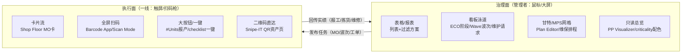

# 开源制造业生产链五大域标杆系统：功能矩阵 + 交互形态设计（W6 调研底稿）

> 研究日期：2026-10-01 | 来源：119 个原始抓取存档（官方一手 ≥75 页）+ GitHub API 活跃度数据 | 深度：Exhaustive
> 调研对象：MES=Odoo Manufacturing/ERPNext；WMS=OpenBoxes/Odoo Inventory/ERPNext Stock；APS=frePPLe/Odoo MRP；PLM=Odoo PLM/DocDokuPLM；EAM=Snipe-IT/GLPI(+openMAINT/Odoo Maintenance)
> 用途：deepseek-harness 食品制造行业商业化交付产品（NocoBase 低代码平台二开）W6 轮规划底稿。本轮**不重复** W5 已覆盖的全局 UIUX（列表三段式/详情页/表单规范/状态色板，见 [2026-09-29-mfg-erp-mes-uiux/report.md](../2026-09-29-mfg-erp-mes-uiux/report.md)），专注五域**领域功能矩阵**与**领域专属交互形态**。
> 平台已有能力（落地时直接复用）：审批流 React Flow 可视化设计器、看板/甘特/日历通用视图、统计卡、触屏车间终端（iframe 独立页）、字段级扫码输入（可禁手输）、NocoBase 110 插件块。

---

## 1. Executive Summary

本次调研对制造业生产链五大域（MES/WMS/APS/PLM/EAM）的开源标杆做了带证据链接的深读（官方文档优先，原始 HTML 全部存档于 [raw/](raw/)），得出三个层级结论：

**标杆层面**：专用开源系统只有 WMS（OpenBoxes，908★ 活跃）与 APS（frePPLe，754★ 活跃）存在存活标杆；MES 与 PLM 的事实标杆是 Odoo（54.8k★）/ERPNext（39.7k★）的内嵌模块（专用开源 MES 最大仅 514★，DocDokuPLM 已于 2021-05 停更）；EAM 开源头部 Snipe-IT（15.0k★）/GLPI（6.4k★）均为 IT 资产出身，制造业维保维度需 openMAINT/Odoo Maintenance 补齐。用户候选勘误：QCAD 是 CAD 软件非 MES，"Miratron" 检索不到。

**交互形态层面（用户核心诉求）**：五域标杆高度一致地执行「**执行面与治理面分离**」——一线执行者（工人/仓管员/维修工）拿到的是卡片流、全屏扫码、大按钮、一键 checklist，而不是表格；管理者（计划员/主管/工程师）拿到的是甘特、看板、日历、只读总览。MES=车间触屏卡片流+操作员签到面板（[Odoo Shop Floor](https://www.odoo.com/documentation/18.0/applications/inventory_and_mrp/manufacturing/shop_floor/shop_floor_overview.html)）；WMS=全屏扫码执行 App 从表格体系整体独立（[Odoo Barcode](https://www.odoo.com/documentation/18.0/applications/inventory_and_mrp/barcode.html)）；APS=交互甘特+8 种分析配色+what-if 沙箱（[frePPLe Plan Editor](https://frepple.com/docs/current/user-interface/plan-analysis/plan-editor.html)）；PLM=ECO 看板泳道+BOM 颜色 diff 工作台（[Odoo ECO](https://www.odoo.com/documentation/18.0/applications/inventory_and_mrp/plm/manage_changes/engineering_change_orders.html)）；EAM=维保日历+资产卡时间线+二维码直达（[GLPI Planning](https://help.glpi-project.org/documentation/modules/assistance/planning.md)、[Snipe-IT Barcodes](https://snipe-it.readme.io/docs/barcodes)）。

**商业化层面**：五域标杆在食品行业特化上**集体留白**——APS 无批次效期约束、PLM 无营养成分/规格书实体、Odoo PLM 全文档 0 次出现 "affected"（无显式变更影响面视图）、WMS 的 FEFO 三家都有但与排产联动缺失。这些空白即 W6 的差异化机会，且 Odoo 官方的「Formulation change ECO 类型」案例（宠物食品）证明食品配方变更走独立 ECO 类型的模式成立。

---

## 2. 标杆确认（Layer 1：真实主流度验证）

**核心结论：制造业生产链的"专用开源系统"只有 WMS 与 APS 存在存活标杆；MES 与 PLM 的事实标杆是 Odoo/ERPNext 内嵌模块；EAM 开源头部是 ITAM 出身，制造业维保需补齐参照。**

### 2.1 仓库活跃度数据（GitHub API，2026-10-01）

| 仓库 | Stars | Forks | 最后 Push | 域内定位 |
|---|---|---|---|---|
| odoo/odoo | 54,765 | 33,903 | 2026-10-01 | MES/WMS/PLM 事实标杆，极活跃 |
| frappe/erpnext | 39,697 | 12,993 | 2026-10-01 | MES/WMS 第二标杆，极活跃 |
| grokability/snipe-it | 14,991 | 4,005 | 2026-09-30 | EAM/ITAM 开源头部（原 snipe/ 已迁移） |
| glpi-project/glpi | 6,414 | 1,824 | 2026-10-01 | EAM/ITSM 第二标杆 |
| openboxes/openboxes | 908 | 507 | 2026-09-30 | 专用开源 WMS 中最知名（医疗供应链），持续活跃 |
| frePPLe/frepple | 754 | 336 | 2026-09-30 | 开源 APS 唯一存活旗舰 |
| docdoku/docdoku-plm | 289 | 113 | **2021-05-10（停更）** | PLM 功能蓝图参照（公司存续，源码停更） |
| ricefishtech/industry4.0-mes | 514 | — | 2026-02-12 | 国内开源 MES 最大星，功能清单参照 |

### 2.2 两个关键勘误（对用户候选的修正）

1. **专用开源 MES 无真正主流项目**：GitHub 搜索 `mes manufacturing execution system` 按星排序前五为 ricefishtech/industry4.0-mes（514★）、metaxk-company/free-mes（430★）、SMEWebify/WebErpMesv2（219★）、osess/mes（170★，2023 停更）、cloud-mes（77★，2016 停更）——与 Odoo 54.8k★ 差两个数量级。MES 功能标杆=**Odoo Manufacturing + ERPNext Manufacturing**。**QCAD 是 2D CAD 软件非 MES；"Miratron" 检索不到任何开源 MES（应为误记）**。
2. **OpenPLM 与 openMAINT 无 GitHub 官方仓**：OpenPLM（CEA）GitHub 仅 49★ 非官方镜像，小众不作主标杆；openMAINT 官方在 openmaint.org，GitHub 仅第三方 docker 镜像——仅作 EAM 维保补齐参照。

### 2.3 各域最终标杆选定

| 域 | 主标杆 | 副标杆/参照 | 选定依据 |
|---|---|---|---|
| MES 制造执行 | Odoo 18 Manufacturing | ERPNext Manufacturing + 国内 ricefishtech（功能清单参照） | 专用开源 MES 无主流项目；两 ERP 内嵌模块覆盖最全 |
| WMS 仓储 | OpenBoxes（专用 WMS） | Odoo 18 Inventory(+Barcode) + ERPNext Stock | 三源互补（专用 WMS / ERP 库存 / 文档质量） |
| APS 高级排产 | frePPLe | Odoo MRP Planning（甘特） | 开源 APS 唯一存活旗舰 |
| PLM 产品生命周期 | Odoo 18 PLM（ECO+BOM 版本） | DocDokuPLM（功能蓝图，停更已标注） | 现代交互以 Odoo PLM 为准 |
| EAM 设备资产 | Snipe-IT（ITAM 头部） | GLPI（ITSM/CMDB）+ openMAINT/Odoo Maintenance | ITAM 出身需制造业维保补齐 |

（原始数据存档：[raw/layer1-benchmark-confirmation.md](raw/layer1-benchmark-confirmation.md)）

---

## 3. MES 制造执行（Odoo Manufacturing + ERPNext + 国内参照）

### 3.1 功能模块 MUST-HAVE 矩阵

| 模块 | 优先级 | 一句话职责 | 证据（标杆） |
|---|---|---|---|
| 工单管理（MO/工单/工序） | **P0** | 生产计划下达到车间执行的核心单据链 | Odoo MO+Work Orders；ERPNext Work Order（Operations 表带 Workstation/状态/成本）（[Work Order](https://docs.frappe.io/erpnext/work-order)） |
| 报工与产量采集 | **P0** | 工位登记完工数量、批次号、耗时 | Odoo Shop Floor「# Units」一键报产；ERPNext Job Card Completed Qty+Time Logs（[Shop Floor](https://www.odoo.com/documentation/18.0/applications/inventory_and_mrp/manufacturing/shop_floor/shop_floor_overview.html)、[Job Card](https://docs.frappe.io/erpnext/job-card)） |
| BOM/配方管理 | **P0** | 产品-原料-工序定义，食品即配方版本 | Odoo BoM（变体/多级/Kit）；ERPNext BOM+Routing（多级、BOM Comparison Tool） |
| 车间终端/工位机 | **P0** | 平板触屏、独立入口、免培训操作 | Odoo Shop Floor（PWA 可装进工位 Chrome）；ERPNext Plant Floor |
| 批次与追溯 | **P0** | 批号生成、到期、正反向追溯 | Odoo lots/serials（MO 确认后自动生成批次、序列号自动拆单 -001/-002）（[Lots/Serials](https://www.odoo.com/documentation/18.0/applications/inventory_and_mrp/manufacturing/workflows/manufacture_lots_serials.html)）；ERPNext Batch（过期态/拆分/按仓过滤） |
| 质检 IQC/IPQC/FQC | **P0** | 三时点+计量型检查 | Odoo QCP 周期生成 Checks（Pass-Fail/Measure 规范+公差/拍照）；ERPNext Quality Inspection against Job Card（IPQC）（[Quality](https://www.odoo.com/documentation/18.0/applications/inventory_and_mrp/quality.html)） |
| 返工报废 | **P0** | 报废登记、补料、过程损耗 | Odoo Scrap（虚拟库位+Replenish 补拣+smart button）；ERPNext Scrap Items+Process Loss Qty+**Pending Qty 防误计损耗** |
| 车间进度看板 | **P0** | 实时可视生产进度 | Odoo Shop Floor All MO 卡片流；ERPNext Manufacturing Dashboard |
| 领退料/物料配送 | **P0** | 原料从仓库到 WIP 的转移与退回 | ERPNext Material Request from Job Card+Return Components；Odoo 两/三步制造拣货 |
| 产能与工时 | P1 | 工作中心效率、停机原因 | Odoo OEE（time efficiency/capacity/target 三参数）；ERPNext Capacity Planning+Downtime Analysis |
| 排产甘特 | P1 | 按机器/工序可视化排程 | ERPNext Capacity Planning；Odoo Planning 甘特（详见 APS 章） |
| Andon 异常上报 | P1 | 工位一键上报质量/设备异常 | Odoo Shop Floor gear 菜单 Create Quality Alert/Request Maintenance（无完整塔灯，标杆即此形态） |
| 生产日报 | P1 | 产量/损耗/效率日结 | Odoo Production Analysis/Delayed 报表；ERPNext Work Order Summary/Production Analytics |
| 设备维护联动 | P2 | 保养计划、故障请求 | Odoo Maintenance 独立 app（Shop Floor 可发起请求）；ERPNext 仅 Downtime Entry（详见 EAM 章） |
| 委外加工 | P2 | 委外工序/代工管理 | Odoo/ERPNext 均有 Subcontracting（食品代工场景可延后） |

### 3.2 核心交互形态（可直接转设计规范）

**M1 车间触屏终端（Odoo Shop Floor）**——最核心范式，适配角色：车间工人触屏（大按钮+零键盘依赖）
- 布局：**左侧常驻操作员签到面板 + 右侧 MO 卡片流**；顶部三视图切换（All MO / 各工作中心页 / My WO）
- 核心组件：MO 卡片三段结构——header（单号+产品+数量+状态 Confirmed/In Progress/To Close）→ body（已完成工序灰色+删除线、当前工序按钮、Register Production 登记批次、**「# Units」一键报产量大按钮**）→ footer（Close Production/Quality Checks、卡片渐隐+Undo 撤销、gear 弹窗：Scrap/Add Component/Move to work center/Create a Quality Alert/Request Maintenance）
- 信息层级：卡片按 scheduled date 排序+星标置顶；工人第一眼=当前工单的「下一步动作按钮」
- 原文依据："Shop Floor is broken down three main views: The All MO page…displays information cards for MOs. On the left side of the module is the operator panel, which shows all of the employees currently signed in…Completed work orders appear in grey and are struck out."
- 证据：[Shop Floor overview](https://www.odoo.com/documentation/18.0/applications/inventory_and_mrp/manufacturing/shop_floor/shop_floor_overview.html)

**M2 工位计时（Odoo Shop Floor Tracking）**——适配：工位操作员
- 布局：左面板+右卡片流；组件：**PIN 数字键盘签到**（"Enter the code using the number pad"）、play/pause 大图标、**双计时器**（工单总时长+个人时长）、操作员头像挂工单卡
- 证据：[Shop Floor time tracking](https://www.odoo.com/documentation/18.0/applications/inventory_and_mrp/manufacturing/shop_floor/shop_floor_tracking.html)

**M3 车间平面图（ERPNext Plant Floor）**——适配：车间主任巡场
- 布局：全幅车间示意图；每台 workstation 配 **Illustration 双态图**（active/inactive 机位亮灭），点击机位看关联 Job Cards 与库存概要
- 原文："Set the Illustration for the active and inactive status in the workstation. After that you can see the status of machines"
- 证据：[Plant Floor](https://docs.frappe.io/erpnext/plant-floor)

**M4 排产只读总览（ERPNext Production Plan Visualizer）**——适配：计划员/厂长鼠标
- 布局：单屏四分区（计划进度/原料可用性/单据存在性/机台排程）；**只读防误改**："Nothing on this screen changes your data. It is a read-only view"；回答"什么卡住了我"（"What is stopping me from starting production? Which raw material is short?"）
- 证据：[Production Plan Visualizer](https://docs.frappe.io/erpnext/production-plan-visualizer)

**M5 工序报工卡（ERPNext Job Card）**——适配：工位操作员
- 布局：上下分区（操作按钮区+Time Logs 表）；Start Job/Complete Job 大按钮、多员工并行、**Pending Qty 部分完工字段**（"The system will not treat the remaining quantity as Process Loss if a Pending Qty is specified"——防误计损耗）
- 证据：[Job Card](https://docs.frappe.io/erpnext/job-card)

**M6 Andon 式异常（Odoo）**——标杆把 Andon 落为「卡片内一键上报表单」而非塔灯大屏
- 工单卡片 gear → Create a Quality Alert（弹表单通报质量组）/ Request Maintenance（对该工作中心发起维护请求）
- 证据：[Shop Floor overview](https://www.odoo.com/documentation/18.0/applications/inventory_and_mrp/manufacturing/shop_floor/shop_floor_overview.html)

**M7 质检弹窗（Odoo Measure Check）**——IQC/IPQC/FQC 同一交互，入口挂各单据
- 单据顶部**紫色 Quality Checks 按钮** → pop-up 逐项处理；Measure 型录入实测值后按 Norm+Tolerance(from/to) 自动判 Pass/Fail（"automatically marks the check as Passed if the recorded value is within the specified tolerance"）
- 证据：[Measure check](https://www.odoo.com/documentation/18.0/applications/inventory_and_mrp/quality/quality_check_types/measure_check.html)

**M8 批次零填表生成（Odoo）**
- MO 确认后顶部浮现 Lot/Serial Number 字段，plus 号自动取下一号；多单元序列号自动拆分 MO

### 3.3 菜单信息架构

```
Odoo Manufacturing app
├─ Operations: Manufacturing Orders / Work Orders / Unbuild Orders
├─ Reporting:  Production Analysis / Delays / Allocation / OEE / Scrap
├─ Configuration: Settings / Work Centers / BoMs
（Shop Floor 为独立触屏应用入口）

ERPNext Manufacturing workspace
├─ Introduction: Manufacturing Dashboard
├─ Setup: BOM / Workstation Type / Operation / Workstation / Routing
├─ Features: Production & Material Planning / Stock Reservation / MRP
│   / Capacity Planning / Downtime Entry / Batch Split / Production Plan Visualizer
├─ Tools: BOM Update / BOM Comparison / Multi-level BOM Creator
├─ DocType: Production Plan / Work Order / Job Card / Plant Floor
└─ Reports: Work Order Summary / Production Analytics / Downtime Analysis 等 17 项
```

### 3.4 证据来源

15 个官方一手页面，全部存档于 [raw/mes/](raw/mes/)：Odoo manufacturing 根/shop_floor_overview/shop_floor_tracking/quality/measure_check/planning/OEE/scrap/lots_serials；ERPNext work-order/job-card/plant-floor/pp-visualizer/batch；国内参照 industry4.0-mes README（基于欧洲 QCADOO 项目 fork，佐证「独立开源 MES 无主流」结论）。

---

## 4. WMS 仓储（OpenBoxes + Odoo Inventory/Barcode + ERPNext Stock）

### 4.1 功能模块 MUST-HAVE 矩阵

| 模块 | 优先级 | 一句话职责 | 证据（标杆） |
|---|---|---|---|
| 入库收货 | **P0** | 对 PO 收货、部分收货、数量核验 | 三家全有（OB Partial Receiving；Odoo Receipts 一/二/三步；ERPNext Purchase Receipt） |
| 上架 putaway | **P0** | 规则驱动库位推荐/直达 | Odoo Putaway Rules（产品/类别/包装三维+优先级五级）；ERPNext Putaway Rule（容量+优先级双因子）；OB suggested rules |
| 库位与库区 | **P0** | 层级库位树+类型+容量 | Odoo Locations（WH/Stock/Zone A/Refrigerator1+Storage Category）；ERPNext Warehouse>Room>Row>Shelf>Bin 五级树+Tree View；OB Zones & Bin Locations |
| 批次/效期 FEFO | **P0（食品命门）** | 批次必录+最近效期先出 | Odoo FEFO removal+Removal Date；ERPNext Pick List 内建 FEFO（batch nearer to expiry）；OB Expiry Management+Stock Expiration Reports |
| 波次/拣货单 | **P0** | 多单聚合成拣货任务 | Odoo Batch/Cluster/**Wave** Transfers（三种）；ERPNext Pick List（三用途）；OB Picking+Allocation |
| 出库发运 | **P0** | 拣-配-装-运+承运商 | Odoo Delivery（承运商/标签/三步出库）；ERPNext Delivery Note+Delivery Trip；OB Shipping |
| 移库/调拨 | **P0** | 库内/跨仓转移 | Odoo Internal Transfers+Routes；ERPNext Stock Entry；OB Stock Transfers |
| 盘点 | **P0** | 循环盘点+全盘+差异调账 | Odoo Cycle Counts（库位频率天数+Annual Day）；ERPNext Stock Reconciliation（双 Purpose+CSV+扫码）；OB Stock Counts |
| 预警 | **P0** | 效期/呆滞/安全库存 | OB Stock Alerts（low/stockout/overstock/expiring 四态）+Reorder Points；Odoo Reordering Rules；ERPNext Projected Quantity |
| 条码/RFID | **P0** | 扫码驱动全流程 | Odoo Barcode app（GS1+RFID+EPC）；ERPNext Scan Mode（Pick List/盘点内建）；OB Mobile |
| 质检联动收货 | P1 | 收货挂质检点/到货检验后再入库 | Odoo Quality checks/steps；ERPNext Quality Inspection；OB Returns 带 inspection |
| 拣货路径 | P1 | 按源库位分组走位拣选 | Odoo Wave「grouped by source location→cart→分拣打包站」+Removal Strategies（FIFO/LIFO/FEFO/Closest/Least Packages） |
| 库存可视化 | P1 | 库位明细/在库/预占总览 | Odoo Locations dashboard+Stock report；ERPNext Stock Ledger/Level；OB Dashboard+Stock Status 五态 |
| 退货 | P1 | 客退/供应商退货入库 | OB Inbound Returns（reason tracking）；Odoo RMA 生态；ERPNext Sales Return |
| 序列号 | P2 | 单件唯一码全程追踪 | Odoo Serial Numbers；ERPNext Serial No+Bundle v15；OB lot/serial 双支持 |

### 4.2 核心交互形态（可直接转设计规范）

**W1 移动扫码执行界面（Odoo Barcode app）**——适配：仓管员持枪/平板，零打字
- 布局：全屏扫码主屏 → 底部 Operations 入口 → Operations 卡片概览（Receipts/Delivery Orders）→ 条码转移全屏
- 核心组件：单据号头（WH/IN/000XX）、产品行 +N 快捷钮、铅笔图标进**行编辑全屏**（数字键盘 +1/−1、包装按钮 6-pack、Location 下拉、Confirm）、底部 Add Product/Validate/Put in Pack
- 信息层级：扫码即计数；「就地实时处理而非回电脑确认」
- 原文："Warehouse employees can scan the barcode… to receive one unit… or click the (pencil) icon to manually enter the received quantities"；"process operations on the warehouse floor when they happen, instead of having to wait to validate transfers from a computer"
- 证据：[Barcode receipts/deliveries](https://www.odoo.com/documentation/18.0/applications/inventory_and_mrp/barcode/operations/receipts_deliveries.html)

**W2 上架指引（Odoo Putaway）**——适配：主管配规则（鼠标）、仓管员扫码跟随
- 规则配置：产品/类别/包装 ×「When product arrives in」→「Store to」+ Sublocation 策略（No/Last Used/Closest Location），优先级五级；收货单执行时自动生成 internal transfer 指路
- 原文："Upon shipment arrival, operations are generated based on putaway rules to efficiently move products to specified locations"
- 证据：[Putaway](https://www.odoo.com/documentation/18.0/applications/inventory_and_mrp/inventory/shipping_receiving/daily_operations/putaway.html)

**W3 上架容量分配（ERPNext）**
- Item-Warehouse 唯一规则，Capacity+Priority 双因子，勾选后自动**拆行**："one row of 5 Cartons is split… 4… accommodated in Finished Goods… Once this Warehouse is at capacity, it assigns the rest to Stores"；配套 Warehouse Capacity Summary 报表
- 证据：[Putaway Rule](https://docs.frappe.io/erpnext/putaway-rule)

**W4 拣货单（ERPNext Pick List）**——表单但非纯表格
- Purpose 三选（Delivery/Transfer for Manufacture/Transfer）、Item Locations 表（Warehouse+Serial+Batch 列）、Get Item Locations 自动定位、FIFO/FEFO 自动选仓、**Scan Mode+Prompt Qty 勾选变扫码执行界面**（"users can scan barcodes on items to confirm that they are picking the correct products"）、Update Current Stock 刷新漂移库存
- 证据：[Pick List](https://docs.frappe.io/erpnext/pick-list)

**W5 波次任务卡（Odoo Wave）**——适配：主管鼠标建波、仓管员持枪执行
- 主界面是 Kanban 卡片：卡上竖三点菜单 → Prepare Wave 弹窗（"stock moves lines are grouped by source location. Select the checkboxes"）→ 波次单（Responsible/Dock 月台/Vehicle 车辆）→ 一次走位多单集拣至 cart 再分拣；Automatic Batches 按 operation type 自动成波
- 证据：[Wave picking](https://www.odoo.com/documentation/18.0/applications/inventory_and_mrp/inventory/shipping_receiving/picking_methods/wave.html)

**W6 电子库存卡（OpenBoxes Stock Card）**——仓管员第一眼=库存健康度而非行列表
- Header 大字 OB Code+名称；**左栏 Status Box**（On Hand/Quantity Available/Demand 月需求/On Hand Months/Stockout Days/Last Count/Avg Price/Total Value）；右上**五态色块**（In stock/Overstock/Reorder/Low Stock/Out of Stock："these statuses are based on desired inventory levels set by your administrator"）
- 证据：[Electronic Stock Card](https://help.openboxes.com/article/39-electronic-stock-card)

**W7 库位档案（Odoo Location form）**
- 分区：Additional Information（Type/Storage Category/Barcode/Replenish?）、**Cyclic Counting 区**（Frequency 天数+Last Inventory+Next Expected 自动排程下一盘）、Logistics 区（本库位级移除策略含 FEFO）、smart buttons（Current Stock/Products/Putaway Rules）
- 证据：[Use locations](https://www.odoo.com/documentation/18.0/applications/inventory_and_mrp/inventory/inventory_management/use_locations.html)

**W8 循环盘点（Odoo）**
- Inventory Adjustments 列表 Group By Location 分组逐位清点；"In the Barcode app, inventory adjustments are grouped by location by default"；Annual Inventory Day/Month 定全盘日
- 证据：[Cycle counts](https://www.odoo.com/documentation/18.0/applications/inventory_and_mrp/inventory/inventory_management/cycle_counts.html)

### 4.3 菜单信息架构

```
Odoo Inventory app
├─ Operations: Receipts / Delivery Orders / Internal Transfers
│   / Physical Inventory / Wave Transfers / Batch Transfers
├─ Products: Products / Lots-Serial Numbers
├─ Reporting: Forecasted / Stock / Locations dashboard / Moves history / Aging
├─ Configuration: Warehouses / Locations / Operation Types
│   / Putaway Rules / Storage Categories
（独立 Barcode app：Operations 概览卡片 + GS1/RFID）

ERPNext Stock（Home>Stock）
├─ Masters: Item / Item Group / UoM / Serial and Batch / Price Lists
├─ Transactions: Purchase Receipt / Delivery Note / Stock Entry
│   / Stock Reconciliation / Stock Reservation
├─ Serialized & Batches: Inventory(Batch) / Serial Number / Serial-Batch Bundle
├─ Tools: Pick List / Putaway Rule / Packing Slip / Landed Cost Voucher
│   / Quality Inspection / Projected Quantity
├─ Settings: Warehouse / Stock Settings
└─ Reports: Stock Ledger / Stock Level / Serial-Batch Traceability 等
```

### 4.4 证据来源

12 组官方一手（存档 [raw/wms/](raw/wms/)，40 文件）：Odoo 18 库存手册 9 页（inventory 根/putaway/cycle_counts/use_locations/wave/fefo/lots/barcode×2）；ERPNext Stock 6 页（stock 根/pick-list/putaway-rule/stock-reconciliation/warehouse/batch）；OpenBoxes 7 文件（官网 features、help.openboxes.com Stock Card、README；Atlassian wiki 为 SPA 抓取失败已记录，由官网+手册替代覆盖）。

---

## 5. APS 高级排产（frePPLe + Odoo MRP Planning）

### 5.1 功能模块 MUST-HAVE 矩阵

| 模块 | 优先级 | 一句话职责 | 证据 |
|---|---|---|---|
| 主生产计划 MPS | **P0** | 时间桶网格上按预测+库存目标建议补货量 | Odoo MPS 网格（建议不下单，Order 按钮确认）（[use MPS](https://www.odoo.com/documentation/18.0/applications/inventory_and_mrp/manufacturing/workflows/use_mps.html)） |
| MRP/物料可用性检查 | **P0** | 物料约束下齐套才占产能 | frePPLe："Capacity is not allocated until all materials are available" |
| 产能负荷平衡 | **P0** | 资源逐桶 available/unavailable/setup/load/utilization% | [frePPLe Resource report](https://frepple.com/docs/current/user-interface/plan-analysis/resource-report.html) |
| 约束建模（设备/人员/换型） | **P0** | 工作中心含替代中心、Setup/Cleanup Time、Time Efficiency、Capacity、Allowed Employees、Working Hours、成本/小时 | [Odoo Work centers](https://www.odoo.com/documentation/18.0/applications/inventory_and_mrp/manufacturing/basic_manufacturing/using_work_centers.html) |
| 甘特排产板（拖拽重排） | **P0** | 交互甘特拖拽 MO、拖行换替代资源、正排/倒排按钮 | [frePPLe Plan editor](https://frepple.com/docs/current/user-interface/plan-analysis/plan-editor.html) |
| 瓶颈识别 | **P0** | 按需求归因迟到原因（4 类约束+weight 严重度） | [frePPLe Constraint report](https://frepple.com/docs/current/user-interface/plan-analysis/constraint-report.html) |
| 计划发布与车间联动 | **P0** | 计划生成走异步任务队列；发布到车间触屏终端 | frePPLe Execute screen；Odoo Shop Floor |
| 倒排/正排 | **P0** | backward=尽量靠近交期 JIT；forward=ASAP；求解器先倒搜失败再前搜 | [frePPLe features](https://frepple.com/docs/current/features.html) |
| 报警（延误/缺料） | **P0** | Problem report/Inventory status（黄=破安全库存→红=缺货）；MPS 四色指示器 | frePPLe；Odoo MPS |
| 需求预测 | P1 | 5 种统计法（SES/DES/Holt-Winters/Croston/MA）自动选优+异常值过滤；Odoo 为手输预测 | frePPLe features |
| what-if 模拟/情景对比 | P1 | 场景=全量沙箱拷贝，slot 状态机 Copy→In use→Promote/Release | [frePPLe What-if](https://frepple.com/docs/current/user-interface/what-if-scenarios.html) |
| 插单重排 | P1 | SO 优先级重排+rush order 影响测量（"measure the impact of rush orders"） | frePPLe |
| 交期承诺 CTP | P1 | "Compute a feasible delivery date...considers all capacity and material constraints as well as reservations for other open sales orders" | frePPLe features |
| 食品批次效期约束 | （两标杆均无） | 短保质期/FEFO 对齐排产——**我方差异化机会** | 缺失本身即发现 |

### 5.2 核心交互形态（可直接转设计规范）

**A1 frePPLe Plan Editor（交互甘特排产板）**——适配：计划员精细拖拽；管理层用 criticality/delay 配色只读总览
- 布局：上=甘特图区（左实体行+右时间轴）；底部=搜索列表（添加资源/SO/库存到图）+选中 MO 属性编辑区（数量/日期/状态+替代资源下拉）；右上时钟=视野区间、放大镜=缩放；左上=配色下拉
- 核心交互："move a manufacturing order to a new date...drag and drop them in the graph"；换替代资源=拖到带图标的可替代行；三图标重排 SO：方块=unplan、回箭头=backward、前箭头=forward
- **8 种配色即信息层级**：feasibility（默认：超载/缺料/提前期不可行高亮）、criticality（关键路径红，slack 黄→绿）、delay、priority、inventory status（安全库存下黄→红）、item/operation category×4；配色由超管保存、全员共享
- 证据：[Plan editor](https://frepple.com/docs/current/user-interface/plan-analysis/plan-editor.html)

**A2 frePPLe What-if 场景机制**——沙箱兜底
- 右上角场景下拉切换器（仅显示有权限场景）；生命周期 "Free→Copy→In Use→(Promote 回写生产场景 | Release 释放)"；on-premise 3 槽/Cloud 6 槽，每场景独立权限与主题
- 证据：[What-if scenarios](https://frepple.com/docs/current/user-interface/what-if-scenarios.html)

**A3 frePPLe Constraint Report（瓶颈归因）**
- 每行=需求×约束类型（Operation before current=提前期不足 / Capacity overload=产能 / Operation before fence=围栏 / Await supply=待供应）+weight 严重度+起止日期；可反查「某瓶颈资源/物料拖累了哪些需求」
- 证据：[Constraint report](https://frepple.com/docs/current/user-interface/plan-analysis/constraint-report.html)

**A4 frePPLe Resource Report（负荷图）**
- 单资源打开显示 load graph；行=资源，列=时间桶，格=utilization%；均值利用率标于图前；**Setup（换型）独立列示——换型损耗可见**
- 证据：[Resource report](https://frepple.com/docs/current/user-interface/plan-analysis/resource-report.html)

**A5 Odoo MPS 网格**——适配：长周期供给计划员，刻意类 Excel 电子表
- 布局：时间桶列（年/月/周/日，周期数可配）× 产品行组；每产品固定行结构：`[产品]期初库存 / − Forecasted Demand(手输) / − Indirect Demand(上层 MO) / + Replenishment(自动建议可改+Order 按钮) / = Forecasted Stock`，公式实时联动
- 状态色：绿=可补货、灰=已下单且量匹配、黄=下单不足、红=下单超量；可加行 Actual Demand、ATP
- 证据：[use MPS](https://www.odoo.com/documentation/18.0/applications/inventory_and_mrp/manufacturing/workflows/use_mps.html)

**A6 Odoo Planning 双甘特（by Workcenter / by Production）**
- 双视图分工："Planning by Production is best used...grouped by manufacturing order（估交期）；Planning by Workcenter...grouped by the work center...identify overloaded machines or bottlenecks"
- **依赖可视化**：灰色箭头从阻塞工单指向被阻塞工单；违规即 "the third work order and the arrow pointing to it turn red"；悬停连线浮现三图标（提前/延后/解除依赖）；MO 内 Plan 按钮按依赖+Expected Duration 自动排 start；红色叹号→Scheduling Information 弹窗→Replan
- 角色：计划员=by Workcenter 找瓶颈+拖拽修复；跟单=by Production 看交期
- 证据：[Work order dependencies](https://www.odoo.com/documentation/18.0/applications/inventory_and_mrp/manufacturing/workflows/work_order_dependencies.html)

### 5.3 菜单信息架构

```
frePPLe 顶部导航
├─ 首页 Cockpit（异常驾驶舱）
├─ Plan analysis
│   ├─ Inventory planning / Forecast editor
│   ├─ Plan editor（甘特）
│   ├─ Constraint report / Problem report / Inventory status
│   ├─ Resource report / Operation detail / Demand Gantt / Supply Path
│   └─ Order quoting screen（CTP）
├─ What-if scenarios（右上场景切换）
├─ Execute（生成计划/导入导出/场景管理/异步任务）
└─ Data maintenance / Report manager

Odoo 18 Manufacturing（排产相关）
├─ Operations: Manufacturing Orders / Work Orders / Shop Floor
├─ Planning: Master Production Schedule / Planning by Production / Planning by Workcenter
├─ Reporting: OEE / Allocation / Delayed / Production Analysis
└─ Configuration: Settings（WO Dependencies、MPS 开关）/ Work Centers
```

### 5.4 证据来源

13 组官方一手（存档 [raw/aps/](raw/aps/)，19 文件）：frePPLe 9 页（docs root/home/README/features/ui-index/day-in-life/plan-editor/whatif/constraint-report/resource-report/execute/production-planning 落地页）；Odoo 18 5 页（use_mps/wo-dependencies/work-centers/shop-floor/manufacturing 根；注：`manufacturing/planning.html` 在 18.0 已 404，排产内容分散至 Planning 菜单三页——路径变化本身已记录）。

**食品行业标注**：两标杆均无批次效期原生约束——frePPLe 的「物料对齐产能」原则（Capacity is not allocated until all materials are available）可类比为「效期对齐产能」，是 W6 的差异化设计依据。

---

## 6. PLM 产品生命周期（Odoo PLM + DocDokuPLM 功能蓝图）

### 6.1 功能模块 MUST-HAVE 矩阵

| 模块 | 优先级 | 一句话职责 | 证据 |
|---|---|---|---|
| 物料/部件主数据（Part/BOM） | **P0** | 部件编号+版本+迭代+生命周期状态的唯一数据源 | DocDokuPLM BOM 表列 Part Number/Version/Iteration/Lifecycle State（tpl-bom_item 源码）；Odoo BOM Components Tab |
| BOM 多版本与比较 diff | **P0** | ECO 内改草稿版，审批后替换生产版；颜色标记增/删/改 | Odoo："Blue text indicates new components…red indicates components removed"（[ECO](https://www.odoo.com/documentation/18.0/applications/inventory_and_mrp/plm/manage_changes/engineering_change_orders.html)） |
| BOM 结构树浏览 | **P0** | 层级装配树展开/过滤 | DocDokuPLM product-structure 模块（cubes/cube 图标区分装配体/零件） |
| 工程变更单 ECO/ECN | **P0** | 变更提案→修订→验证→生效全流程跟踪，可回退版本 | Odoo："track, implement, and revert change versions made to products, and bills of materials"；DocDokuPLM 三级 requests→orders→issues |
| 审批工作流（阶段级审批人） | **P0** | 验证阶段挂必选审批人，Approve→Apply Changes 强制顺序 | Odoo Approvals：Role+User+三种 Approval Type（必选/可选/仅评论）（[Approvals](https://www.odoo.com/documentation/18.0/applications/inventory_and_mrp/plm/management/approvals.html)） |
| 基线/发布（released/effective dates） | **P0** | 基线冻结产品结构快照；Effective 生效日期追溯召回 | DocDokuPLM baselines 视图族；Odoo "trace which BoM version was active on specific dates for recalls"（[Version control](https://www.odoo.com/documentation/18.0/applications/inventory_and_mrp/plm/manage_changes/version_control.html)） |
| 食品配方变更（Formulation ECO 类型） | **P0（自建）** | 配方变更独立 ECO 类型+营养成分/规格书 | Odoo 官方案例即宠物食品："The Formulation change ECO type…pawlish-change@…odoo.com"；营养成分实体两标杆均无，需自建（[ECO Type](https://www.odoo.com/documentation/18.0/applications/inventory_and_mrp/plm/manage_changes/eco_type.html)） |
| 变更影响分析 | P1（商业化机会） | 并发 ECO 冲突检测+生效联动 pending/future MO | Odoo rebase：Previous Eco Bom Changes Tab+Apply Rebase；"changing all pending and future MO to the latest BoM version"。**全文档 0 次出现 "affected"——无显式影响面视图** |
| 文档/CAD 管理（版本+预览+签出签入） | P1 | 设计文件随 ECO 版本化，签出锁定编辑，浏览器预览 | DocDokuPLM："display your documents (Word, PDF, CAD…)"+checkout/checkin/cascade 级联签出；Odoo ECO 内 Documents 智能按钮（归档不删可回溯） |
| 变更通知 | P1 | 邮件别名自动生成 ECO；未读修改提醒；审批人自动通知 | Odoo："emails submitted to this email address automatically generate ECOs"；DocDokuPLM 行内未读变更感叹号 |
| 产品配置（effectivity/替代件） | P2 | 按有效性/替代/备选管理变体结构 | DocDokuPLM 官网："Manage effectivities, alternatives and substitutes" |
| 3D 可视化（WebGL DMU） | P2 | 浏览器 WebGL 数字样机、测量、协同标注 | DocDokuPLM visualization 模块（SceneManager/MeasureTool/collaborativeController） |

### 6.2 核心交互形态（可直接转设计规范）

**P1 ECO 看板阶段流转（Odoo）**——适配：管理层/工程师共用
- 布局：PLM Overview 首页 = **ECO 类型项目卡矩阵**（每类型一张卡）→ 点入 Kanban 分阶段泳道（默认 New→In Progress→Validated→Effective，Effective 列折叠）
- 核心组件：看板卡+阶段列头内嵌审批配置（悬停 Actions→Edit 弹窗）；卡上三计数按钮「# Engineering Changes / My Validations / To Apply」
- 信息层级：工程师第一眼=自己待验证/待应用的计数；管理层=各类型进行中数量；另可切 Gantt 看时间线
- 原文："stages of the ECO Type are displayed in the top-right corner of the ECO"；"My Validations displays a count of ECOs the approver must accept or reject"
- 证据：[Approvals](https://www.odoo.com/documentation/18.0/applications/inventory_and_mrp/plm/management/approvals.html)

**P2 ECO 表单=变更工作台（Odoo）**——适配：研发工程师
- 布局：面包屑+表单头（Apply on 单选：Bill of Materials/Product Only；Effective：立即生效/指定日期）+右上阶段条+智能按钮排（Documents/Revision）
- 核心：**Revision 智能按钮**进草稿版 BOM（打大红 Archived 标记隔离生产版）；**BoM Changes/Operation Changes Tab 颜色 diff**——"Blue=new, Black=shared, red=removed"，Operation 行含 Add/Remove/Update 类型、工序步骤 QCP、工时变化列
- 信息层级：**差异优先于表单字段**；一键 Apply Changes 即归档旧生产 BOM
- 证据：[Engineering Change Orders](https://www.odoo.com/documentation/18.0/applications/inventory_and_mrp/plm/manage_changes/engineering_change_orders.html)

**P3 版本历史时间线（Odoo）**
- BOM 页 ECO 智能按钮→列表视图→Filter「Done ECOs」：每版一行（版本号/Responsible/Effective Date）；悬停 chatter 时间戳查实际生效时刻；"Easily revert to previous BoM versions…for recalls or customer complaints"
- 证据：[Version control](https://www.odoo.com/documentation/18.0/applications/inventory_and_mrp/plm/manage_changes/version_control.html)

**P4 BOM 结构树表格（DocDokuPLM）**——适配：研发工程师
- 表格树形态：可展开层级行，**每行图标系统表达状态而非纯文本**——本人签出=✏️、他人签出=🔒、已发布=✓、过时=☹、草稿=👁、装配体=cubes/零件=cube、未读变更=❗；列：Version/Iteration/Author/CheckoutBy/ACL/附件夹/分享；表头工具条=签出三键组（Checkout/Undo/Checkin）+级联签出下拉
- 信息层级：**行首图标即生命周期状态**，工程师扫一眼识别可改对象
- 证据：docdoku-plm-front 源码 tpl-bom_item 模板（一手源码，存档 [raw/plm/docdoku-tpl-bom_item.html](raw/plm/docdoku-tpl-bom_item.html)）

**P5 变更单三级漏斗（DocDokuPLM）**
- Change Requests（提案）→ Change Orders（ECN 执行）→ Change Issues（事项跟踪），各自 list/content/creation/edition 四视图+独立左侧导航；Change Order 内挂 workflow 可视化编辑器+里程碑+任务清单（前端源码 app/change-management 模块一手证据）

**P6 文档卡片+预览（DocDokuPLM/Odoo 互补）**
- DocDokuPLM：浏览器直接预览 Word/PDF/CAD（"Use your browser to…display your documents"）；签出锁与预览结合；Odoo ECO Attachments 悬停三点菜单（Edit/Remove/Download）+归档文件留在旧 ECO 可回溯。对比：Odoo Documents app 仅文件夹树+chatter，无版本树/签出——**签出/签入是 PLM 与普通文档管理的分水岭**

### 6.3 菜单信息架构

```
Odoo PLM app
├─ Overview（ECO 类型项目卡 + 计数按钮；入口 Kanban/Gantt）
├─ Master Data
│   └─ Bill of Materials（Miscellaneous Tab 含 Version 字段）
├─ Changes（按 ECO 类型分组浏览/检索）
└─ Configuration
    ├─ ECO Types（Name + Email Alias 自动建单）
    └─ Settings

DocDokuPLM 工作区
├─ Parts（部件 + CAD 文件视图 + part-revision）
├─ Documents（版本/模板/链接）
├─ Product Management（产品结构 + Baselines + Configuration + Checked-outs）
├─ Change Management
│   ├─ Change Requests / Change Orders / Change Issues
│   ├─ Milestones / Tasks
│   └─ Workflows（流程模型编辑器）
├─ Visualization（WebGL 3D 浏览/测量/协同）
├─ Organization（用户/组/ACL）
└─ Workspace Management
```

### 6.4 证据来源

11 组官方一手（存档 [raw/plm/](raw/plm/)，20 文件）：Odoo 18 PLM 7 页（plm 根/eco/version_control/eco_type/approvals/bom-configuration/documents；注：bill_of_materials.html 在 18.0 已 404，实际路径 basic_setup/bill_configuration.html）；DocDokuPLM 官网 4 页+GitHub README+**前端源码树/模板（docdoku-plm-front，经 GitHub contents API 取 tpl-bom_*.html 一手源码）**；User Guide 为 SPA 渲染不可直抓（失败已存证）。

**三个商业化判断**：①Odoo 无「affected products」影响分析视图——食品场景（改配方影响在制/库存/标签合规）应做成显式影响面板；②营养成分/规格书实体需自建并挂 ECO 类型（Odoo 官方 Formulation 案例证明模式成立）；③BOM 行内图标状态系统（签出锁/发布勾/过时脸）值得直接移植。

---

## 7. EAM 设备资产（Snipe-IT + GLPI + openMAINT/Odoo Maintenance 补齐）

> 定位结论：Snipe-IT/GLPI 是 **ITAM 出身**（台账/借还/折旧/条码强，维保弱）；openMAINT 是**真 CMMS**（预防性/纠正性维护闭环+备件+成本）；Odoo Maintenance 提供**制造业最佳交互形态**（看板+日历+MTBF/MTTR+OEE）。食品制造交付以 CMMS 为主线、ITAM 补借还与标签能力。

### 7.1 功能模块 MUST-HAVE 矩阵

| 模块 | 优先级 | 一句话职责 | 证据 |
|---|---|---|---|
| 设备台账（资产卡/二维码/位置树） | **P0** | 唯一资产号+分类+位置+责任人，QR 扫码直达详情 | Snipe-IT："QR…will open the asset details page"（[Barcodes](https://snipe-it.readme.io/docs/barcodes)）；Odoo equipment（Vendor/Model/Serial/Cost/保修） |
| 二维码标签/打印 | **P0** | QR+1D 条码（C128/C39/EAN13…）标签引擎 | Snipe-IT barcodes.md 1D 格式表+新标签引擎 |
| 故障报修工单 | **P0** | 多渠道报修→派单→执行→报告→审批结算 | openMAINT 纠正性维护全流程（含供应商比价）；GLPI ITIL 七态（[Ticket lifecycle](https://help.glpi-project.org/documentation/modules/assistance/tickets/ticketlifecycle.md)） |
| 预防性维保计划 | **P0** | 按频率后台自动生成维保日历+工单 | openMAINT："automatically generates…calendar of the scheduled maintenance activities and the corresponding work orders"（[Facility maintenance](https://www.openmaint.org/en/product/modules/facility-maintenance)） |
| 维保日历 | **P0** | 周/月视图排程，个人/班组过滤 | GLPI planning 四视图；Odoo calendar 六视图（[Planning](https://help.glpi-project.org/documentation/modules/assistance/planning.md)） |
| 点检/巡检（路线/checklist） | **P0（食品合规重点）** | 维保计划挂 checklists，移动端一键执行留痕 | openMAINT："multiple checklists…execution as easy as just one click" |
| 工单看板（阶段拖拽） | **P0** | 按阶段列拖拽，优先级星标置顶 | Odoo requests："dragging and dropping…New Request…Repaired/Scrap"（[Maintenance requests](https://www.odoo.com/documentation/18.0/applications/inventory_and_mrp/maintenance/maintenance_requests.html)） |
| OEE/停机统计 | P1 | 工作中心稼动率%（效率×产能×目标） | Odoo OEE："percentage of the total time a work center is active" |
| MTBF/MTTR 可靠性指标 | P1 | 故障间隔/修复时长自动计算+下次故障预测 | Odoo equipment："calculated automatically based on previous failures" |
| 备件库存联动 | P1 | 领料自动扣库存、成本归集到工单 | openMAINT："spare parts picked from the warehouse…automatically update stock" |
| 维修知识库/作业指导 | P1 | PDF/Slide/Text 指导书挂工单 | Odoo requests："Instructions tab…PDF, Google Slide, Text" |
| 维保成本/折旧 | P1 | 工时+物料计价入预算；折旧模型 | openMAINT Economic Management；Snipe-IT depreciation（Linear 等） |
| SLA 监控 | P1 | 超时自动邮件告警 | openMAINT："SLA criteria…e-mail notifications are sent for any delays" |
| 到期提醒（保修/审计/库存） | P1 | 邮件预警 | Snipe-IT features："Expiring warranties、Upcoming Audits、Low Inventory Report"（[Features](https://snipeitapp.com/features)） |
| 借还管理 checkin/checkout | P2 | 状态四态（Deployable/Undeployable/Archived/Pending） | Snipe-IT（ITAM 特性，工具/模具外借可复用，产线设备不适用） |

### 7.2 核心交互形态（可直接转设计规范）

**E1 资产详情页=资产卡（Snipe-IT）**——适配：维修工手机扫码直达
- 上下结构=资产卡头（图/编号/状态徽标/责任人）+ Tab 式完整历史时间线 "Assets retain full history including checkouts, checkins and maintenance"；第一眼=当前状态与位置
- 证据：[snipeitapp.com/features](https://snipeitapp.com/features)

**E2 维保日历（GLPI Planning）**——适配：主管周总览+每人首页个人日历卡
- 左=日期/时段选择器+对象过滤器，中=日历主体；**四视图按权限门控**（"Personal view…Group view…Users view…Groups"）；支持 **iCal/Webcal 订阅导出**
- 证据：[Planning](https://help.glpi-project.org/documentation/modules/assistance/planning.md)

**E3 工单生命周期优先级矩阵（GLPI）**
- 状态条+优先级矩阵驱动："Requester defines urgency / Technician appreciates impact / Priority results from these two values…computed automatically using a matrix"；七态：New→Processing(assigned/planned)→Pending→Solved→Closed；**申请者验收才 Close**
- 证据：[Ticket lifecycle](https://help.glpi-project.org/documentation/modules/assistance/tickets/ticketlifecycle.md)

**E4 维护请求看板（Odoo）**——适配：维修班组
- 列=阶段（列头⚙️支持 Fold/Edit/**Automations**/Delete，阶段带 Request Confirmed/Request Done 语义）；卡=优先级⭐0-3："Requests assigned a higher priority appear above those with a lower priority, on the Kanban board"；勾选 Block Workcenter **自动阻塞产能**（与 MES 排产联动）
- 证据：[Maintenance requests](https://www.odoo.com/documentation/18.0/applications/inventory_and_mrp/maintenance/maintenance_requests.html)

**E5 维保日历六视图（Odoo）**
- "six different views: Calendar (default), Kanban, List, Pivot, Graph, and Activity"+右侧栏迷你月历+技师清单；日/周/月/年切换——主管日历总览与维修工看板同源
- 证据：[Maintenance calendar](https://www.odoo.com/documentation/18.0/applications/inventory_and_mrp/maintenance/maintenance_calendar.html)

**E6 设备卡智能按钮（Odoo）**——台账不是死表格而是可靠性面板
- 设备台账页顶 "click the Maintenance smart button" 直达未完工单；Maintenance 页签自动算 **MTBF/MTTR/Estimated Next Failure**
- 证据：[Add new equipment](https://www.odoo.com/documentation/18.0/applications/inventory_and_mrp/maintenance/add_new_equipment.html)

**E7 预防性维保引擎（openMAINT）**
- 后台按配置间隔自动生成日历+工单并直达班组；"optimized user interface that makes the checklist execution…as easy as just one click"；纠正工单支持平板/手机填报干预报告
- 证据：[Facility maintenance](https://www.openmaint.org/en/product/modules/facility-maintenance)

**E8 首页仪表盘（Snipe-IT）**
- "recent activity snapshot" 签到/签出/变更/删除流——EAM 版应做：我的待办工单+今日点检+超时预警

### 7.3 菜单信息架构

```
GLPI（六分组）
├─ Overview: Kanban/Status/Actions/Templates
├─ Assets: Computers/Monitors/Software/Network/Peripherals/Printers/Phones/Racks/PDUs/Cables/SIM…
├─ Assistance: Tickets/Problems/Changes/Plannings/Service Catalog/Statistics/Recurrent tickets
├─ Management: Licenses/Budgets/Suppliers/Contracts/Contacts/Documents
├─ Tools ─ Administration: profiles/rules/users

Snipe-IT
├─ Dashboard
├─ Assets（Custom Fields/Depreciation/Cloning/Audits）
├─ Licenses / Accessories / Components / Consumables
├─ People（Locations/Groups）
├─ Reports（Activity）
└─ Admin（Settings/Barcodes/Labels/Importing）

Odoo Maintenance app
├─ Equipments: Machines & Tools / Work Centers
├─ Maintenance: Maintenance Requests / Maintenance Calendar
├─ Reporting ─ Configuration: Equipment Categories/Maintenance Teams/Stages/Settings
（OEE 在 Manufacturing>Reporting>OEE）

openMAINT
Space & Asset Inventory｜Facility Management（预防/纠正）｜Logistic Management
｜Economic Management｜Energy & Environment｜GIS & BIM（+Mobile APP/Self-Service Portal）
```

### 7.4 证据来源

8 组官方一手（存档 [raw/eam/](raw/eam/)，25 有效文件）：GLPI 官方 GitBook help.glpi-project.org（planning/ticket-lifecycle/assets/overview/llms.txt）+官网；Snipe-IT readme.io（barcodes/depreciation/managing-assets/overview）+ snipeitapp.com（features/home）；openMAINT 官网（home/facility-maintenance）；Odoo 18 Maintenance 4 页+OEE。失败存证 2：docs.glpi-project.org 连接失败、glpi-user-doc RTD 404——均由官方 help 站替代覆盖，无信息损失。

## 8. 五域共性发现（跨域综合）

### 8.1 共性一：执行面与治理面分离（角色分屏是五域共同的第一设计原则）



> 五域无一例外把「一线执行界面」从「管理表格」中独立成单独入口：MES 的 Shop Floor（独立触屏 App/PWA 可装进工位 Chrome）、WMS 的 Barcode App（整 App 独立于 Inventory）、EAM 的 checklist 一键执行（openMAINT 移动端）、APS 的车间终端三视图、PLM 的邮件别名自动建单。**同一份数据，两种皮**——执行面零表格零键盘（扫码/大按钮/卡片渐隐确认），治理面信息密集可拖拽。对我方平台：触屏车间终端（iframe 独立页）已有，需扩展出「仓管员扫码执行页」「维修工点检执行页」同构入口。

### 8.2 共性二：扫码是一等公民（跨四域的执行面输入原语）

WMS 全流程扫码（Odoo Barcode/ERPNext Scan Mode/OB Mobile）只是基础；MES 用扫码做批次零填表生成与 PIN 签到；EAM 用 QR 直达资产详情页（Snipe-IT）；APS 车间终端扫码开工。**扫码不是 WMS 专属能力，而是全平台的执行面输入原语**——与 NocoBase 已有的字段级 Scan Code Input（可禁手输）直接对位，规则：执行面字段一律「扫码优先+禁手输」，治理面字段自由输入。

### 8.3 共性三：颜色承载专业数据维度（不是装饰）

frePPLe 甘特 8 种配色（feasibility/criticality/delay/priority/inventory status/item/operation×2）、Odoo MPS 四色（绿可补/灰已订/黄不足/红超量）、Odoo BOM diff 三色（蓝新增/黑保留/红删除）、OB Stock Card 五态色块、GLPI 优先级矩阵色、Odoo 活动时间色（绿=未来/橙=今天/红=逾期）。**跨域收敛原则：颜色=可切换的分析维度；配色方案由管理员保存、全员共享**（frePPLe 明文）；色盲兜底=W5 已确立的「Tag 必带文字」（Fiori 规范）。

### 8.4 共性四：只读总览页与「防误改」设计

ERPNext PP Visualizer（"Nothing on this screen changes your data"）、frePPLe criticality/delay 配色总览、Odoo Planning by Production（跟单只读看交期）。**管理层看板刻意不可编辑**——与治理面可拖拽甘特（计划员专属）形成「读/写分离」。对我方：厂长驾驶舱/经营总览类页面应默认只读，编辑入口按角色显式授予。

### 8.5 共性五：看板=流程流转、甘特=资源排程、日历=周期承诺（三视图分工跨域复用）

- **看板承载「阶段流转」**：ECO 泳道（PLM）、维护请求（EAM）、Wave 波次卡（WMS）、工单状态（MES）——列头可配置阶段+卡上优先级星标是标配。
- **甘特承载「资源×时间」**：Plan Editor（APS）、Work order dependencies（MES）、ECO 审批甘特（PLM）、维保排程（EAM）——依赖箭头+违规红显是标配。
- **日历承载「周期性承诺」**：维保日历（EAM/GLPI 四视图+Odoo 六视图）、全盘日（WMS Annual Day）、批次效期（MES/OB 过期报告）。
- 与 W5 结论一致且五域全部验证：**甘特不进车间触屏**（三家车间终端都用卡片流，触屏拖拽进度条精度差）。

### 8.6 共性六：智能按钮（smart button）聚合领域联动

Odoo 全域实践：MO 的 Scrap/Revision 智能按钮、ECO 的 Revision/Documents、设备卡的 Maintenance 直达未完工单、库位档案的 Current Stock/Putaway Rules。**详情页用智能按钮+计数徽标承载跨域跳转**（在制 MO 数/待验证 ECO 数/未完工单数），而非平铺关联表格——与我方已有的行详情工厂 95 块直接互补。

### 8.7 共性七：版本/时间线是对象的一部分

PLM 版本历史时间线（每版一行+Effective Date+chatter 时间戳）、Snipe-IT 资产完整历史（checkouts/checkins/maintenance 逆时序）、ERPNext timeline、Odoo chatter。**「历史即对象的一部分」**：食品追溯（批次正向/反向）可复用同一时间线组件。

### 8.8 共性八：审批内嵌于领域对象（不是独立审批模块）

ECO 阶段级审批人（Odoo PLM：验证阶段挂必选审批人+三审批型）、盘点调账审批、openMAINT 工单审批结算、GLPI 申请者验收才 Close。**审批是领域流程的一个阶段属性**，而非独立「审批中心」——与我方 React Flow 审批引擎的关系：引擎管流程编排，领域页管阶段呈现（审批计数按钮/阶段条/验证通过才出现 Apply 按钮的强制顺序）。

### 8.9 五域交互形态总览矩阵

| 域 | 执行面形态（触屏/扫码） | 治理面形态（鼠标） | 共性组件 |
|---|---|---|---|
| MES | 车间卡片流+签到面板+一键报产（M1/M2） | 工序看板、Plant Floor 平面图、PP Visualizer 只读总览（M3/M4） | 质检弹窗、批次零填表、灰色删除线=已完成 |
| WMS | 全屏扫码 App、行编辑数字键盘（W1） | Wave 看板建波、库位档案、Stock Card 库存卡（W5/W6/W7） | FEFO、盘点排程、五态色块 |
| APS | 车间终端三视图（同 MES） | Plan Editor 甘特+8 配色、Constraint 归因、MPS 网格、what-if 沙箱（A1-A5） | 瓶颈红色高亮、依赖箭头、正/倒排按钮 |
| PLM | （工程师桌面为主） | ECO 看板泳道、BOM diff 工作台、版本时间线、BOM 图标树（P1-P4） | 颜色 diff、签出锁、邮件别名建单 |
| EAM | QR 扫码直达资产卡、checklist 一键执行（E1/E7） | 维保日历（四/六视图）、请求看板、优先级矩阵（E2-E4） | MTBF/MTTR 面板、Block Workcenter 联动 |

---

## 9. Contrarian Views and Risks（必列）

1. **「开源标杆功能矩阵 ≠ 商业化交付清单」**：Odoo/ERPNext 是 54k★/39k★ 的 ERP 巨型单体，其模块完整度建立在十年积累上；逐项对标会造成 W6 范围爆炸。应取「P0 交集+食品特化」而非「标杆并集」——本报告的 P0 标注已按食品制造商业化交付口径收敛，但落地排期仍需砍到每域 4-6 个 P0。
2. **DocDokuPLM 停更风险**：GitHub 源码 2021-05 停更（289★/161 open issues 无响应），公司转向商业版。本报告仅取其**功能蓝图与源码级 UI 模板证据**（BOM 图标树/签出三键/变更三级漏斗），不建议任何技术依赖。
3. **EAM 双标杆的 ITAM 出身偏差**：Snipe-IT/GLPI 的核心场景是 IT 资产（电脑/许可证/合同），其「维保」仅是记录级（maintenance 日志），不是制造业 CMMS 的预防性维保引擎。若直接照搬其 IA（Licenses/Consumables 分组）会误导食品厂设备科——必须以 openMAINT/Odoo Maintenance 的 PM 引擎为主线重组。
4. **frePPLe 的复杂度悬崖**：约束求解+场景沙箱+CTP 是供应链级能力，学习成本高（文档定位为供应链计划师）；食品厂计划员实际能力画像更接近 Odoo MPS 网格（类 Excel）。W6 应取 frePPLe 的**归因/配色/只读总览理念**，甘特交互取 Odoo 双维甘特，而非引入完整求解器。
5. **「触屏终端」的现场前提未验证**：Odoo Shop Floor 的 PWA/大按钮设计默认工位有稳定 Wi-Fi+平板；国内食品车间现实常见的是粉尘/水洗/手套/共用工位。扫码枪（WMS 形态）的适应性可能优于触屏——落地前建议到试点厂做设备勘测。
6. **交互形态证据多为文档文字+截图描述，非可操作 demo**：本轮以官方文档为主证据（存档 HTML），未逐一登录 demo 站点实操（OpenBoxes/DocDokuPLM demo 需注册）。交互规格转设计稿前建议对 Shop Floor/Barcode/Plan Editor 三个关键形态做视频或 demo 实录补证。
7. **Bing 搜索结果污染事件**：本轮 Bing 对 "openMAINT" 查询返回 Walmart 无关结果（缓存污染），该引擎仅用于旁路发现，**未被引用为任何结论的证据**；全部引用均来自官方一手来源或 GitHub API。

---

## 10. Open Questions

1. **食品效期约束排产的落地算法**：frePPLe「物料对齐产能」原则如何扩展为「效期对齐产能」（短保质期批次必须在效期窗口内占用产能）？是否需要在 MPS 网格上叠加效期维度？——建议 W6 设计阶段做专项 spike。
2. **PLM 影响分析面板的数据模型**：改配方影响的「在制 MO/在库批次/已印标签/客户规格书」四类对象如何建模关联（Odoo 仅做 MO 联动且无显式视图）？与我方 KG（本体图谱）能力是否可结合？
3. **波次拣货在中小食品厂的适用性**：Odoo Wave/Batch/Cluster 三种拣货模式面向大流量电商仓；食品厂原料库+成品库的日单量是否需要波次，还是 Pick List 级别足够？——待试点厂数据。
4. **NocoBase 执行面扩展的工程路径**：仓管员扫码执行页/维修工点检页是复用触屏车间终端 iframe 模式，还是走 NocoBase mobile 布局（独立路由权限）？两者在我方快照中的能力边界需一次运行时验证。
5. **盘点差异调账的审批挂接**：三标杆的 Stock Reconciliation/Adjustment 均有审批语义但呈现不一；与已有 React Flow 审批引擎的挂接方式（单据级 vs 行级）待定。
6. **GLPI iCal/Webcal 订阅是否值得复刻**：维保日历导出订阅到个人日历（Outlook/手机）是 GLPI 特色，国内厂接受度未知——列为 P2 观察。

---

## 11. Sources

> 全部官方一手来源（标注★者为本轮主证据页面）；原始 HTML/文本存档于 [raw/](raw/) 对应子目录，可离线复核。

### MES（15 项，存档 raw/mes/）

| # | 来源 | 类型 |
|---|---|---|
| 1 | [Odoo Manufacturing 根](https://www.odoo.com/documentation/18.0/applications/inventory_and_mrp/manufacturing.html) ★ | 官方文档 |
| 2 | [Odoo Shop Floor overview](https://www.odoo.com/documentation/18.0/applications/inventory_and_mrp/manufacturing/shop_floor/shop_floor_overview.html) ★ | 官方文档 |
| 3 | [Odoo Shop Floor time tracking](https://www.odoo.com/documentation/18.0/applications/inventory_and_mrp/manufacturing/shop_floor/shop_floor_tracking.html) | 官方文档 |
| 4 | [Odoo Quality](https://www.odoo.com/documentation/18.0/applications/inventory_and_mrp/quality.html) + [Measure check](https://www.odoo.com/documentation/18.0/applications/inventory_and_mrp/quality/quality_check_types/measure_check.html) | 官方文档 |
| 5 | [Odoo OEE](https://www.odoo.com/documentation/18.0/applications/inventory_and_mrp/manufacturing/reporting/oee.html) | 官方文档 |
| 6 | [Odoo Scrap](https://www.odoo.com/documentation/18.0/applications/inventory_and_mrp/manufacturing/workflows/scrap_manufacturing.html) | 官方文档 |
| 7 | [Odoo Lots/Serials](https://www.odoo.com/documentation/18.0/applications/inventory_and_mrp/manufacturing/workflows/manufacture_lots_serials.html) | 官方文档 |
| 8 | [ERPNext Work Order](https://docs.frappe.io/erpnext/work-order) ★ | 官方文档 |
| 9 | [ERPNext Job Card](https://docs.frappe.io/erpnext/job-card) ★ | 官方文档 |
| 10 | [ERPNext Plant Floor](https://docs.frappe.io/erpnext/plant-floor) ★ | 官方文档 |
| 11 | [ERPNext Production Plan Visualizer](https://docs.frappe.io/erpnext/production-plan-visualizer) ★ | 官方文档 |
| 12 | [ERPNext Batch](https://docs.frappe.io/erpnext/batch) | 官方文档 |
| 13 | [ricefishtech/industry4.0-mes README](https://github.com/ricefishtech/industry4.0-mes) | 仓库一手 |

### WMS（12 组，存档 raw/wms/）

| # | 来源 | 类型 |
|---|---|---|
| 14 | [Odoo Inventory 根](https://www.odoo.com/documentation/18.0/applications/inventory_and_mrp/inventory.html) ★ | 官方文档 |
| 15 | [Odoo Putaway](https://www.odoo.com/documentation/18.0/applications/inventory_and_mrp/inventory/shipping_receiving/daily_operations/putaway.html) ★ | 官方文档 |
| 16 | [Odoo Cycle counts](https://www.odoo.com/documentation/18.0/applications/inventory_and_mrp/inventory/inventory_management/cycle_counts.html) + [Use locations](https://www.odoo.com/documentation/18.0/applications/inventory_and_mrp/inventory/inventory_management/use_locations.html) | 官方文档 |
| 17 | [Odoo Wave picking](https://www.odoo.com/documentation/18.0/applications/inventory_and_mrp/inventory/shipping_receiving/picking_methods/wave.html) ★ | 官方文档 |
| 18 | [Odoo FEFO](https://www.odoo.com/documentation/18.0/applications/inventory_and_mrp/inventory/inventory_management/removal_strategies/fefo.html) | 官方文档 |
| 19 | [Odoo Barcode](https://www.odoo.com/documentation/18.0/applications/inventory_and_mrp/barcode.html) + [Receipts/Deliveries 执行页](https://www.odoo.com/documentation/18.0/applications/inventory_and_mrp/barcode/operations/receipts_deliveries.html) ★ | 官方文档 |
| 20 | [ERPNext Stock 根](https://docs.frappe.io/erpnext/stock) ★ | 官方文档 |
| 21 | [ERPNext Pick List](https://docs.frappe.io/erpnext/pick-list) ★ | 官方文档 |
| 22 | [ERPNext Putaway Rule](https://docs.frappe.io/erpnext/putaway-rule) + [Stock Reconciliation](https://docs.frappe.io/erpnext/stock-reconciliation) + [Warehouse](https://docs.frappe.io/erpnext/warehouse) | 官方文档 |
| 23 | [OpenBoxes 官网/Features](https://www.openboxes.com/) + [README](https://github.com/openboxes/openboxes) | 官方一手 |
| 24 | [OpenBoxes Electronic Stock Card](https://help.openboxes.com/article/39-electronic-stock-card) ★ | 官方手册 |
| 25 | Odoo 18 Lots / Batch（raw/wms/odoo18-lots.html、erpnext-batch.html） | 官方文档 |

### APS（13 组，存档 raw/aps/）

| # | 来源 | 类型 |
|---|---|---|
| 26 | [frePPLe Plan editor](https://frepple.com/docs/current/user-interface/plan-analysis/plan-editor.html) ★ | 官方文档 |
| 27 | [frePPLe What-if scenarios](https://frepple.com/docs/current/user-interface/what-if-scenarios.html) ★ | 官方文档 |
| 28 | [frePPLe Constraint report](https://frepple.com/docs/current/user-interface/plan-analysis/constraint-report.html) ★ | 官方文档 |
| 29 | [frePPLe Resource report](https://frepple.com/docs/current/user-interface/plan-analysis/resource-report.html) ★ | 官方文档 |
| 30 | [frePPLe Execute](https://frepple.com/docs/current/user-interface/execute.html) | 官方文档 |
| 31 | [frePPLe Features](https://frepple.com/docs/current/features.html) ★ | 官方文档 |
| 32 | [frePPLe A day in the life](https://frepple.com/docs/current/a-day-in-the-life/index.html) + [Production planning 落地页](https://frepple.com/production-planning/) | 官方一手 |
| 33 | [frePPLe README](https://github.com/frePPLe/frepple) | 仓库一手 |
| 34 | [Odoo use MPS](https://www.odoo.com/documentation/18.0/applications/inventory_and_mrp/manufacturing/workflows/use_mps.html) ★ | 官方文档 |
| 35 | [Odoo Work order dependencies](https://www.odoo.com/documentation/18.0/applications/inventory_and_mrp/manufacturing/workflows/work_order_dependencies.html) ★ | 官方文档 |
| 36 | [Odoo Work centers](https://www.odoo.com/documentation/18.0/applications/inventory_and_mrp/manufacturing/basic_manufacturing/using_work_centers.html) | 官方文档 |
| 37 | [Odoo Shop Floor](https://www.odoo.com/documentation/18.0/applications/inventory_and_mrp/manufacturing/shop_floor/shop_floor_overview.html)（APS 与 MES 共用证据） | 官方文档 |
| 38 | frePPLe docs root / UI index（raw/aps/01、07） | 官方文档 |

### PLM（11 组，存档 raw/plm/）

| # | 来源 | 类型 |
|---|---|---|
| 39 | [Odoo ECO](https://www.odoo.com/documentation/18.0/applications/inventory_and_mrp/plm/manage_changes/engineering_change_orders.html) ★ | 官方文档 |
| 40 | [Odoo Version control](https://www.odoo.com/documentation/18.0/applications/inventory_and_mrp/plm/manage_changes/version_control.html) ★ | 官方文档 |
| 41 | [Odoo ECO Type](https://www.odoo.com/documentation/18.0/applications/inventory_and_mrp/plm/manage_changes/eco_type.html) ★ | 官方文档 |
| 42 | [Odoo PLM Approvals](https://www.odoo.com/documentation/18.0/applications/inventory_and_mrp/plm/management/approvals.html) ★ | 官方文档 |
| 43 | [Odoo PLM 根](https://www.odoo.com/documentation/18.0/applications/inventory_and_mrp/plm.html) + [BOM configuration](https://www.odoo.com/documentation/18.0/applications/inventory_and_mrp/manufacturing/basic_setup/bill_configuration.html) | 官方文档 |
| 44 | [Odoo Documents](https://www.odoo.com/documentation/18.0/applications/productivity/documents.html)（对比弱项证据） | 官方文档 |
| 45 | [DocDokuPLM 官网](https://www.docdokuplm.com/) ★ | 官方一手 |
| 46 | [DocDokuPLM README](https://github.com/docdoku/docdoku-plm) | 仓库一手 |
| 47 | docdoku-plm-front 源码树+tpl-bom_*.html 模板（GitHub contents API，存档 raw/plm/docdoku-tpl-*.html）★ | 官方源码 |
| 48 | DocDokuPLM Wiki（11 页开发向） | 官方一手 |
| 49 | DocDokuPLM User Guide（SPA 抓取失败存证） | 官方（受限） |

### EAM（8 组，存档 raw/eam/）

| # | 来源 | 类型 |
|---|---|---|
| 50 | [GLPI Planning](https://help.glpi-project.org/documentation/modules/assistance/planning.md) ★ | 官方文档（GitBook） |
| 51 | [GLPI Ticket lifecycle](https://help.glpi-project.org/documentation/modules/assistance/tickets/ticketlifecycle.md) ★ | 官方文档 |
| 52 | [GLPI Assets/Overview/llms.txt](https://help.glpi-project.org/) | 官方文档 |
| 53 | [Snipe-IT Barcodes](https://snipe-it.readme.io/docs/barcodes) ★ | 官方文档 |
| 54 | [Snipe-IT Managing assets / Overview / Depreciation](https://snipe-it.readme.io/docs/overview) | 官方文档 |
| 55 | [Snipe-IT Features](https://snipeitapp.com/features) ★ | 官方一手 |
| 56 | [openMAINT Facility maintenance](https://www.openmaint.org/en/product/modules/facility-maintenance) ★ | 官方一手 |
| 57 | [Odoo Maintenance](https://www.odoo.com/documentation/18.0/applications/inventory_and_mrp/maintenance.html)（requests/calendar/equipment 三子页+OEE）★ | 官方文档 |

### 基础数据（Layer 1）

| # | 来源 | 类型 |
|---|---|---|
| 58 | [GitHub REST API](https://api.github.com/)（odoo/erpnext/snipe-it/glpi/openboxes/frepple/docdoku-plm 等 12 仓库元数据，2026-10-01） | API 一手 |
| 59 | GitHub Search API（`mes manufacturing execution system` / `openplm` / `openmaint` 三查询） | API 一手 |
| 60 | [raw/layer1-benchmark-confirmation.md](raw/layer1-benchmark-confirmation.md)（Layer 1 存档） | 本调研中间产物 |

### 参照（不重复调研）

| # | 来源 | 关系 |
|---|---|---|
| 61 | [W5 全局 UIUX 调研报告](../2026-09-29-mfg-erp-mes-uiux/report.md)（43 来源） | 前轮成果：状态色板/三页模式/过滤方案/NocoBase 差距清单 |

---

## 12. Methodology

- **编排**：主任务执行 Layer 1（GitHub API 标杆确认 + 专用 MES/PLM/EAM 候选搜索勘误）→ 五个并行 code 子任务分域深读（每域独立 curl 抓取官方文档、存档 raw/<domain>/、提炼四项产出）→ 主任务综合本报告。子任务各自验证直连可达后工作，全程未依赖共享浏览器。
- **网络策略**：用户提供的代理（socks5://127.0.0.1:1087 / http://127.0.0.1:1087 / socks5://127.0.0.1:1080）实测端口未监听（curl 全部 000），改用直连（全部 200）；DuckDuckGo lite/HTML 均触发人机验证码（鸭子 CAPTCHA，与 W5 轮一致），降级为「Bing 旁路发现（出现缓存污染，仅旁证不作引用）+ 官方文档站直连导航 + GitHub API」；**所有被引用结论均来自官方一手来源**，广告与赞助内容一律排除。
- **取证规模**：五域原始存档 119 个文件（mes 15 / wms 40 / aps 19 / plm 20 / eam 25）+ Layer 1 数据 1 份；正文引用官方一手页面 ≥57 组（标★为主证据 19 组）。
- **失败与降级记录**（全部存证）：OpenBoxes Atlassian wiki SPA 不可直抓（官网+Help Scout 手册替代）；DocDokuPLM User Guide SPA 回落注册页（前端源码树替代，一手性更强）；Odoo `manufacturing/planning.html` 与 `bill_of_materials.html` 在 18.0 路径变更 404（实际路径已记录）；docs.glpi-project.org 连接失败（help.glpi-project.org GitBook 替代）；GLPI readthedocs 404。
- **反确认偏差措施**：用户点名的每个候选（含不确定项 QCAD/Miratron/OpenPLM/openMAINT）先经 GitHub Search API 按确切词验证，未以近义概念顶替——QCAD 确认为 CAD 软件、Miratron 确认不存在、OpenPLM/openMAINT 确认无官方仓并降级为参照；「专用开源 MES 无主流」结论以数据（514★ vs 54.8k★）而非印象立论。
- **局限**：交互形态证据以官方文档文字描述+结构推断为主，未逐登录 demo 实操（OpenBoxes/DocDokuPLM demo 需注册）；Odoo PLM/frePPLe 部分功能为企业版/商业版，功能清单公开但开源版可用性未逐项验证；国内商业 MES 功能清单参照仅 ricefishtech 一源（详见 Open Questions 与 Contrarian 第 6 条）。
