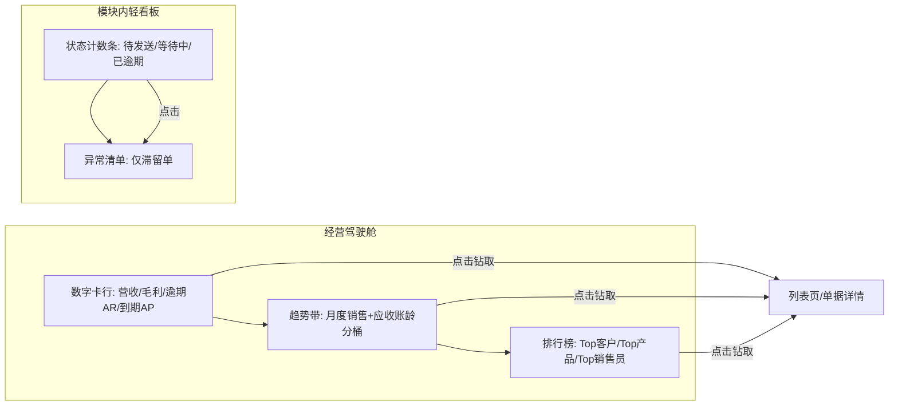
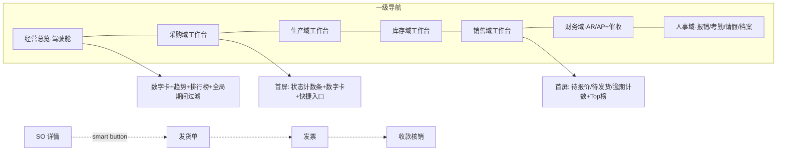

# W6 调研分片 A：ERP 经营管理域 + 财务/人事支撑域标杆调研（Odoo / ERPNext / Dolibarr）

> 调研日期：2026-10-01 | 深度：Thorough | 来源：18 个一手来源（Odoo 官方文档 9 页、Odoo GitHub 仓库、Odoo 官方博客、ERPNext/Frappe 官方文档与 GitHub、Dolibarr 官网与 GitHub、OCA 官方站）
> 用途：deepseek-harness 食品制造商业化产品（NocoBase 二开）W6 轮规划底稿。全局 UIUX 规范见 [research/2026-09-29-mfg-erp-mes-uiux/report.md](../2026-09-29-mfg-erp-mes-uiux/report.md)，本文只管业务域功能与交互形态。
> 取证方式说明：并行子任务共享浏览器实例导致页面互相劫持，本次 Layer 1/2 改用 curl 直连（DDG html 端点 + 官方站直抓 + GitHub API/原始文件），全部为一手来源原文提取。

---

## ERP 经营管理域

### 三款标杆的经营域范围（一句话画像）

- **Odoo**：App 化经营套件。O2C = Sales（报价模板→SO→交付→开票→收款）+ Invoicing/Accounting；P2P = Purchase（RFQ→PO→收货→账单→付款，含三单匹配）；财务双版本——Community 只有 Invoicing（开票+收付款登记+报销），Enterprise 才是完整 Accounting（银行对账、预算、资产、报表）。（[Odoo 18 Sales 文档](https://www.odoo.com/documentation/18.0/applications/sales/sales.html)、[Accounting and Invoicing 文档](https://www.odoo.com/documentation/18.0/applications/finance/accounting.html)、[Odoo 官方博客 2026-08-27](https://www.odoo.com/blog/business-hacks-1/odoo-community-vs-odoo-enterprise-which-one-should-you-choose-for-your-business-2406)）
- **ERPNext**：模块化 ERP，文档明示两条主链：O2C 标准流 **Quotation → Sales Order → Delivery Note → Sales Invoice → Payment Entry**；P2P 为 **Material Request → Supplier Quotation → Purchase Order → Purchase Receipt → Purchase Invoice → Payment**（采购申请→询价→PO→收货→供应商账单→付款，与我们的九步闭环同构）。（[ERPNext Sales Order 文档](https://docs.frappe.io/erpnext/sales-order)、[Purchase Order 文档](https://docs.frappe.io/erpnext/purchase-order)）
- **Dolibarr**：轻量 SMB 套件。经营域 = CRM&Sales（商机→报价→销售订单→合同）+ Product&Stock（采购/库存/发货/制造）+ Finance&Billing（开票收款、银行对账、复式记账），全模块开关制。（[dolibarr.org 首页 Features](https://www.dolibarr.org/)）

### 功能 MUST-HAVE 矩阵（P0/P1/P2）

优先级判定基准：我们已有九步端到端闭环 + 简单 AR/AP + 审批流设计器 + 移动端。P0 = 经营域必需且我们缺口明显；P1 = 显著增值、W6/W7 可排；P2 = 复杂财务/低频、建议不做或极简做。

| 功能项 | Odoo | ERPNext | Dolibarr | 建议优先级 | 备注 |
|---|---|---|---|---|---|
| 报价单 Quotation（模板/有效期/在线确认） | ✅ Sales：报价模板、Optional products、报价 Deadline、在线签名/在线付款确认 | ✅ Quotation 文档 | ✅ Proposals/商业提案 | **P1** | 我们闭环从 SO 起步已有；报价单+模板+转单是食品 B 端常用（打样→正式订单），P1 排 W6 |
| 销售订单 SO→发货→开票链路 | ✅ 单据流自动（可按 ordered/received 数量开票、Down payment、Pro-forma） | ✅ SO 触发 Delivery Note + Sales Invoice + 采购/制造 | ✅ Sale Orders→Shipment→Invoice | **P0（已有，补强）** | 我们九步闭环已覆盖；补「按已收/已发数量开票」与「预收款」两个形态即为完整 |
| 价格表/客户分级价/多币种 | ✅ Pricelists + 外币 + 折扣 | ✅ Price List + Item Price | ✅ 基础价格 | **P1** | 食品经销多级批发价高频；先做客户等级价，多币种 P2 |
| 采购申请 PR（内部需求→审批） | ✅ purchase_requisition（Calls for Tenders）+ Reordering rules | ✅ Material Request（类型含 Purchase/Transfer/Manufacture） | ⚠️ 无独立 PR（采购直接建单） | **P0（已有，补强）** | 我们已有采购申请节点；ERPNext 的 Material Request「一单多用途」与 Odoo 的招标式询价可参考 |
| RFQ 询价比价（多供应商→比价→定标） | ✅ RFQ dashboard（To Send/Waiting/Late 状态块）+ 供应商价格表自动带出 | ✅ Supplier Quotation → PO（Get Items From 反向取数） | ❌ 弱（无标准比价单） | **P1** | 食品原料采购核心场景；形态=多供应商报价汇总到一张比价视图+定标按钮 |
| 采购订单 PO→收货→账单 | ✅ Bill Control（按订购量/收货量开账单）+ **3-way matching**（收货前不应付款字段拦截） | ✅ PO→Purchase Receipt→Purchase Invoice 三单 | ✅ Purchase→Shipment→Bill | **P0（已有，补强）** | 我们已有链路；补「按收货量开账单」+「三单匹配付款拦截」两个规则即达标杆 |
| 供应商门户/协同 | Enterprise（供应商门户） | ⚠️ 有限 | ❌ | **P2** | 不做 |
| 简单 AR/AP（应收应付台账+核销） | ✅ Community Invoicing 即含 | ✅ Accounts Receivable 报表 | ✅ Billing & Payments | **P0（已有）** | 已有，仅对齐字段口径 |
| 应收账龄 + 客户对账单 | ✅ Aged Receivable 报表（Enterprise 报表族） | ✅ Accounts Receivables（outstanding/ageing）+ **Process Statement of Accounts（批量生成并邮件对账单）** | ✅ box_factures_imp 逾期发票小部件 | **P1** | 账龄分桶（30/60/90）+ 一键生成客户对账单 PDF 是食品经销商刚需 |
| 账期提醒/催收 Follow-up | ✅ Follow-up Levels（按逾期天数分级：邮件/信件/短信；负天数=到期前提醒；自动触发+附带发票+自动建活动） | ✅ Dunning（催款+利息+费用+信函模板） | ❌ 无内建 | **P1** | 交互形态详见下文；两家均按「天数→等级→动作」建模，可复用我们审批引擎的转移源设计 |
| 银行对账 Bank Reconciliation | ✅ Enterprise：三区视图（左交易流/右下候选项/右上结果分录），reconciliation models 自动建议，Validate / To Check 两键 | ✅ Bank Reconciliation 工具（按对账单导入匹配） | ✅ Bank reconciliation 模块 | **P2** | 国内食品制造场景银企直连弱、对账多在财务软件完成；若做仅做「手工勾对」极简版 |
| 总账/复式记账/科目表 | ✅ 双版本（Community Invoicing 底层仍是复式分录） | ✅ 完整 GL（Chart of Accounts + Payment Ledger + Stock Ledger） | ✅ Double entry accounting | **P2/不做** | 与定位一致：简单 AR/AP 之上直接做总账会撞金蝶/用友；保留台账+汇总即可 |
| 预算/成本核算 | ✅ Enterprise Budgets + Analytic accounting | ✅ Budget Variance Report + Cost Center | ❌ | **P2/不做** | 同上；最多做「成本中心=部门/产线」的统计维度透传 |
| 库存计价/落岸成本 | ✅ stock_account + landed_costs | ✅ Stock Ledger + Valuation | ✅ Stocks | **P2** | W 轮已有库存体系，不重复 |
| 批次/效期 | ✅ mrp_product_expiry（Community 即有 Lots+Expiration） | ✅ Batch/Serial 完整 | ⚠️ 弱 | **P0（已有）** | 已有 FEFO+AQL，仅对齐：Odoo 把「效期」作为批次追踪属性的做法与我们一致 |
| 退货/退款 | ✅ Returns and refunds（销售侧）+ 供应商退货 | ✅ Credit Note/退货单 | ✅ 部分支持 | **P1** | 九步闭环的逆向链（销售退货、采购退货、红冲）是 W6 值得补的正向缺口 |
| 忠诚度/佣金/电商连接器 | ✅ Loyalty/Commissions/Amazon/Shopee | ⚠️ 部分 | ❌ | **P2** | 不做 |
| 经营驾驶舱/管理层看板 | ✅ Enterprise Dashboards（Spreadsheet 驱动）+ 各模块内建看板 | ✅ 模块 Workspace 看板 + Number Card + Dashboard Chart + 可选 Frappe Insights BI | ✅ Home 板块（63 种 box 小部件可配置） | **P0（重点深挖，见下节）** | 我们已有统计卡但缺「经营驾驶舱」整页形态 |

**版本边界标注（Odoo Community vs Enterprise，官方口径）**：Odoo 官方博客对比表明确——Community「财务仅覆盖 Invoicing 与 Expenses 基础流程」，Enterprise 才有「Full Accounting、银行同步、OCR、Payroll、电子签、Documents、Spreadsheet(BI)、Studio、Barcode、Shop Floor、Quality、PLM、原生移动 App」（[Odoo 官方博客](https://www.odoo.com/blog/business-hacks-1/odoo-community-vs-odoo-enterprise-which-one-should-you-choose-for-your-business-2406)）。但 GitHub `odoo/odoo@18.0` addons 目录（627 个模块）显示 **hr_attendance、hr_expense、hr_holidays（请假）、hr_timesheet、hr_recruitment、purchase_requisition、mrp_product_expiry、spreadsheet_dashboard_* 基础件均在 Community**（[GitHub odoo/odoo addons@18.0](https://github.com/odoo/odoo/tree/18.0/addons)）——即考勤/报销/请假三家口径里 Odoo 社区版就齐。ERPNext 无版本墙（GPL 全功能），差异在「是否另装 Frappe HR 与 Frappe Insights 应用」；Dolibarr 单版本全开放。

### 核心交互形态——经营驾驶舱（重点深挖）

#### 三家的驾驶舱形态对比

| 维度 | Odoo Dashboards (Enterprise) | ERPNext | Dolibarr Home |
|---|---|---|---|
| 载体 | 独立 Dashboards App，基于 Spreadsheet 引擎（表格+图表混排） | 模块 Workspace 内嵌 Dashboard 区 + 独立 Dashboard 文档（Number Card/Dashboard Chart 聚合）+ 可选 Frappe Insights BI | 主页「Home 板块」，63 种 box 小部件网格，用户自选开关 |
| 布局 | 左侧仪表盘列表栏（可折叠，按模块分组）+ 右侧主画布 | Workspace 首屏 = 快捷入口 + 数字卡 + 图表，往下是业务链接分组 | 多列小部件网格（信息块卡片，含图形盒 graph boxes） |
| 核心组件 | 表格（Top 榜）、折线/柱状图、KPI 单元格、全局过滤器 | Number Card（数字卡）、Dashboard Chart（趋势/占比）、快捷方式、报表链接 | 列表型 box（逾期发票、待收货采购单）+ 图形 box（月度发票图、销售漏斗） |
| 过滤/钻取 | 顶部全局过滤器（期间默认「近90天」、产品、销售团队）；点表格值/图表点直接打开底层单据或列表 | 图表点击进入过滤后的列表视图；报表全族可按维度钻取 | box 点击进入对应模块列表 |
| 个性化 | 每人可建 My Dashboard 聚合常用视图（基于 Odoo views 而非表格） | 用户可自建 Dashboard；Workspace 由管理员配置 | 用户在 Home 设置中勾选启用哪些 box |
| 标准内容（官方示例） | **Sales dashboard：报价数/订单数、营收、平均订单值、月度销售图表、Top 报价与订单、Top 产品、Top 销售员、Top 国家** | Selling：Sales Analytics、销售目标达成、付款条款状态；Buying：Procurement Tracker、Supplier Scorecard；Stock：库存水平/库存账本；Accounting：应收应付/预算差异 | 月度/年度发票图、商机漏斗、库存预警、逾期客户发票、应收超额客户、待收货采购单 |

来源：[Odoo Dashboards 文档](https://www.odoo.com/documentation/18.0/applications/productivity/dashboards.html)、[ERPNext Dashboards 文档](https://docs.frappe.io/erpnext/erpnext-dashboards)、[Dolibarr GitHub core/boxes（63 个 box 清单）](https://github.com/Dolibarr/dolibarr/tree/develop/htdocs/core/boxes)

#### Odoo Sales 标准驾驶舱的信息层级（官方原文拆解）

Odoo 官方对标准 Sales dashboard 的描述给出了完整的「管理层看板放什么」答案（引文）：

> "the Sales dashboard gives an overview of the number of quotations and orders, the revenue, and the average order value, as well as a chart showing monthly sales. It also includes tables listing top quotations and sales orders, top-performing products and salespeople, and top countries served. A series of pre-configured global filters at the top of the dashboard allows the entire dashboard to be filtered by, e.g., product or sales team. A default value of Last 90 days in the period filter means data from the previous 90 days is automatically retrieved every time the dashboard is opened or refreshed."（[Odoo Dashboards 文档](https://www.odoo.com/documentation/18.0/applications/productivity/dashboards.html)）

拆成信息层级即：

1. **第一层（数字卡行）**：报价数、订单数、营收、平均订单值——4 张 KPI 卡；
2. **第二层（趋势带）**：月度销售折线/柱状图（默认近 12 个月）；
3. **第三层（排行榜带）**：Top 报价/订单、Top 产品、Top 销售员、Top 客户区域——表格组件；
4. **全局控制（顶部）**：期间过滤器（默认近 90 天）+ 业务维度过滤器（产品/销售团队），改动即全页刷新。

Odoo 各业务模块的列表页顶部还内建「状态汇总条」交互：Purchase 的 RFQ dashboard 顶部直接给 **To Send / Waiting / Late** 三个状态计数按钮，点击即过滤列表，右上角同时给近期采购金额/交期/RFQ 数概览（[Odoo RFQ 文档](https://www.odoo.com/documentation/18.0/applications/inventory_and_mrp/purchase/manage_deals/rfq.html)）。这是一种比整页驾驶舱更轻的「模块内看板」形态，适合嵌入到采购/销售列表页。

#### ERPNext 的驾驶舱哲学：Workspace 即看板

ERPNext 官方口径："ERPNext includes dashboards, analytics pages, reports, and workspaces… In practice, most ERPNext teams use a combination of module workspaces, dashboards, and reports"（[ERPNext Dashboards 文档](https://docs.frappe.io/erpnext/erpnext-dashboards)）。即驾驶舱不是单页，而是**每个模块 Workspace 首屏自带看板区**（数字卡+图表+快捷方式），深度分析交给报表族（Procurement Tracker、Supplier Scorecard、Sales Analytics、Budget Variance），跨库自助 BI 交给独立产品 Frappe Insights（Query Builder + eCharts 可视化 + 自定义 Dashboard，面向非技术用户，[Frappe Insights README](https://github.com/frappe/insights)）。

#### 对我们的设计结论（角色场景 × 页面形态）

**老板/总经理视角**——看的不是单据，是「钱、增长、风险」三件事：
- 钱营收/毛利/应收逾期总额/应付到期总额（4 张数字卡，环比箭头）；
- 增长：月度销售趋势图 + Top 客户/Top 产品排行榜（复用 Odoo 信息层级 1-3）；
- 风险：库存预警（临期/呆滞，复用我们 FEFO 数据）、逾期应收账龄分桶、待审批数；
- 该页**绝不该是表格**：驾驶舱只放卡片/图/榜单，明细一律点击钻取到列表页。

**运营总监视角**——看「链路健康度」：九步闭环各环节在制/滞留单量（类似 Odoo RFQ 的 To Send/Waiting/Late 状态条，但铺到全链路）、采购在途、生产达成率（复用 W 轮 MPS 数据）、发货准时率。形态 = 全链路漏斗/状态计数条 + 异常清单（只列滞留项）。

**明确不该是表格的页面**：① 经营驾驶舱首页（老板）；② 各模块列表页顶部的状态汇总区（应做成可点计数条而非藏在筛选器里）；③ 客户 360 的应收区块（应做账龄分桶条形图+催收状态灯，而非发票表格）。Odoo 的证据是 Dashboards App 全员形态 + RFQ dashboard 状态条；ERPNext 的证据是 Workspace 首屏看板化；Dolibarr 的证据是 63 个 box 全部为「小部件卡片」形态（[core/boxes 清单](https://github.com/Dolibarr/dolibarr/tree/develop/htdocs/core/boxes)）。

（图示：驾驶舱只做卡/图/榜三层，明细全部下钻；模块列表页用状态计数条承载轻看板。）

### 财务支撑（P1/P2）与人事支撑（P1/P2）

#### 财务支撑

| 功能 | Odoo 证据要点 | ERPNext 交叉验证 | 我们的建议 |
|---|---|---|---|
| **AR 账龄分桶**（P1） | Aged Receivable 报表族（Enterprise Reporting 下）；Overdue 过滤器内建在发票列表 | Accounts Receivables 报表：outstanding/ageing/credits 一页 | **P1 做**：在简单 AR 上加 30/60/90/120 分桶条形图 + 客户维度下钻 |
| **客户对账单**（P1） | 客户表单 Accounting 页签内看 follow-up 状态与逾期发票清单 | Process Statement of Accounts：批量生成+下载+邮件客户对账单与账龄摘要 | **P1 做**：一键生成客户对账单 PDF（周期区间+期初/发生/核销/余额四段式），支持批量导出 |
| **账期提醒 Follow-up**（P1） | Follow-up Levels：按逾期天数分级，动作=邮件/信件/短信；负天数=到期前提醒；Automatic 选项；附发票；触发时自动建活动并指派 Responsible；客户级「下次提醒日」字段 | Dunning：催款级别+利息+费用+信函模板+关联收款 | **P1 做**：复用我们审批引擎做「催收等级引擎」——天数阈值→等级→通知动作（站内+企微/邮件），负天数预提醒，客户档案挂催收状态灯 |
| **付款核销/预收预付**（P1） | Down payments（销售预收）、按 ordered/received 开票 | Payment Entry 分配到多张发票（allocate）、advance | **P1 做**：收款核销到多张 SO/发票 + 预收款挂账 |
| **三单匹配付款拦截**（P1） | Bill Control=Received quantities + 3-way matching：未收货账单「Should Be Paid=否」拦截付款 | PO-收货-发票三单按数量勾稽（Purchase Invoice 引用收货） | **P1 做**：付款审批前自动校验「已收货量 ≥ 账单量」，不满足则拦截并提示 |
| 银行对账（P2） | Enterprise 三区对账视图 + reconciliation models 自动建议 + To Check 暂存 | Bank Reconciliation 按对账单行匹配 | **P2 极简**：仅手工勾对（收款流水↔应收单），不做银行直连 |
| 总账/科目表/预算/资产（P2） | Enterprise 才有完整版；Community Invoicing 底层仍是复式分录但不暴露 | 完整 GL 三账本（GL/Payment/Stock Ledger） | **P2 不做**：明确边界——我们是业务台账+资金台账，不是财务软件；导出给金蝶/用友即可 |

来源：[Odoo Follow-up 文档](https://www.odoo.com/documentation/18.0/applications/finance/accounting/payments/follow_up.html)、[Odoo Bank reconciliation 文档](https://www.odoo.com/documentation/18.0/applications/finance/accounting/bank/reconciliation.html)、[Odoo Bill control policies 文档](https://www.odoo.com/documentation/18.0/applications/inventory_and_mrp/purchase/manage_deals/control_bills.html)、[ERPNext llms.txt Accounts Receivables/Dunning 条目](https://docs.frappe.io/erpnext/llms.txt)

#### 人事支撑

| 功能 | Odoo 证据要点（均为 Community 版即有） | ERPNext/Frappe HR 交叉验证 | 我们的建议 |
|---|---|---|---|
| **费用报销 Expense**（P1） | 全流程文档化：Expense categories→Log（手工/小票 OCR/邮件上传）→Expense report 提交→审批（单人/批量/拒绝）→Post 入账→Reimburse（单人/批量/并入工资）→Re-invoice 转嫁客户→按员工/类别分析 | Frappe HR「Travel and Expense Claim」域（expese claim + 审批流 + 报销支付） | **P1 做**：报销单（费用类别+票据附件）→审批（复用审批引擎）→打款登记→台账；OCR 与工资集成不做 |
| **考勤 Attendance**（P1） | Kiosk 模式（工牌/RFID/PIN 集体打卡终端）、加班审批、管理层看板（Management dashboard）、出勤报表（月度加班/缺勤用例） | Frappe HR：Auto Attendance、考勤机生物识别集成、Shift Management（班次/排班/调班申请） | **P1 做（简版）**：移动端签到签退 + 异常审批（补卡）+ 月度出勤台账；Kiosk 硬件与排班 P2 |
| **请假 Leave**（P1） | Time Off：预置 4 类假（年假/病假/无薪/调休）、审批分级（无需审批/专人审批）、配额分配（个人/团队/全公司）、应计计划 accrual、法定假日、全员可见的 My Time Off+Overview 日历 | Frappe HR Leave Management：假期申请/审批/余额/假期类型/分配 | **P1 做**：假别配置+余额+请假审批（复用审批引擎）+团队请假日历（复用我们日历视图） |
| 员工档案（P1） | Employees：基本信息/履历技能/工作信息（部门/经理/审批人）/私人信息/薪资 五页签；部门看板+列表+**层级树**视图；入/离职 onboarding/offboarding 计划 | Frappe HR Employee Lifecycle | **P1 做**：员工档案（部门归属+角色权限打通我们八角色）+组织架构树 |
| 绩效/招聘/薪资 Payroll | Odoo：Appraisals（360 反馈/目标）、Recruitment、Payroll（均为独立 App，Payroll 属 Enterprise + 本地化包） | Frappe HR Performance/Recruitment/Salary Payouts | **P2 不做**：食品制造客户薪资多在专业薪酬软件/外包 |
| 车队/午餐/前台 | Odoo Fleet/Lunch/Frontdesk（Community/Enterprise 混合） | ❌ | **不做** |

来源：[Odoo HR 文档树](https://www.odoo.com/documentation/18.0/applications/hr.html)、[Odoo Expenses 文档](https://www.odoo.com/documentation/18.0/applications/finance/expenses.html)、[Odoo Time Off 文档](https://www.odoo.com/documentation/18.0/applications/hr/time_off.html)、[Odoo addons@18.0（hr_* 在 Community 的证明）](https://github.com/odoo/odoo/tree/18.0/addons)、[Frappe HR llms.txt](https://docs.frappe.io/hr/llms.txt)

> 交叉验证结论：财务侧「账龄→对账单→分级催收」三件套在 Odoo 与 ERPNext 两家形态高度收敛（分桶报表 + 批量对账单 + 按天数等级的催收动作），可放心按此形态做 P1；人事侧「报销-考勤-请假-档案」四件套在 Odoo Community 与 Frappe HR 均为标配且流程同构（申请→审批→台账），印证这是 SMB 人事的最小完备集。

### 菜单 IA——三款产品的组织方式与我们的建议

#### 三款产品的 IA 现状

- **Odoo：App 切换器（菱形九宫格）+ 模块内菜单**。顶栏全局（含 App 切换器入口），进入某 App 后左栏换成该 App 的二级菜单（如 Accounting ‣ Customers ‣ Invoices、Purchase ‣ Orders ‣ RFQ）。App 之间靠切换器跳转，跨 App 单据靠 smart button（表单内的按钮链）缝合。文档证据：各模块操作路径均为「App 名 ‣ 菜单 ‣ 子菜单」三段式（[Follow-up 文档](https://www.odoo.com/documentation/18.0/applications/finance/accounting/payments/follow_up.html) 等）。特点：**按应用组织**，应用=可安装单元=菜单单元，同一业务域可能分散多 App（财务分散在 Invoicing/Expenses/Payment Providers）。
- **ERPNext：Workspace 侧边栏（模块工作台）**。GitHub develop 分支默认 15 个 Workspace：**Home、Accounting、Invoicing、Payments、Financial Reports、Assets、Buying、CRM、Selling、Stock、Manufacturing、Projects、Quality、Support、ERPNext Settings**（[frappe/erpnext workspace 目录](https://github.com/frappe/erpnext/tree/develop/erpnext)）。每个 Workspace 首屏=快捷方式+数字卡+图表+按分组的业务链接（Masters/Transactions/Reports/Settings），侧边栏按「业务域」而非「应用」聚合，HR 整域拆到独立 Frappe HR 应用但同样以 Workspace 形态呈现。特点：**按业务流程组织**，Selling workspace 一页聚齐报价/SO/客户/价格表/销售报表。
- **Dolibarr：顶部主菜单（按模块逐项）+ 可配置首页**。菜单项=启用的模块（CRM&Sales/Products/Stock/Finance...），Home 页由用户勾选 box 小部件自定义。特点：**按模块开关组织**，菜单随启用模块动态增减（[dolibarr.org](https://www.dolibarr.org/)）。

#### 对我们的 IA 建议

我们（NocoBase 二开，W4 已做菜单 IA 重整 + 206 路由盘点）建议向 **ERPNext Workspace 模式收敛**而非 Odoo App 模式：

1. **一级导航=业务域工作台**（≈现有八域）：采购域一个入口页聚合「采购申请/询价比价/PO/在途收货/供应商账单/付款」（对应 ERPNext Buying 一页聚合 MR/SQ/PO/PI），而不是像 Odoo 拆成 Purchase+Invoicing+Payment 三个 App；
2. **工作台首屏=轻看板**：顶部状态计数条（复用 Odoo RFQ 形态）+ 数字卡 + 快捷方式，明细链接分组下沉（对应 ERPNext Workspace 的 links 分组）；
3. **新增「经营总览」独立驾驶舱**：放在一级导航首位（老板/总经理默认落地页），三层信息结构（数字卡/趋势/排行榜）+ 全局期间过滤；
4. **财务/人事挂为支撑域**：AR/AP 台账+催收放财务域；报销/考勤/请假/员工档案放人事域；两者菜单深度不超过两层，避免喧宾夺主；
5. **跨域缝合用「单据 smart button」**：SO 详情页挂「发货单/发票/收款」按钮链，PO 详情页挂「收货/账单/付款」，学 Odoo 表单内跨 App 缝合方式，弥补域式导航的割裂感。

（图示：一级导航按业务域工作台组织；工作台首屏看板化；跨域流程靠单据内 smart button 缝合。）

### 证据清单（URL + 关键引文）

| # | 来源 | 类型 | 关键引文/事实 |
|---|---|---|---|
| 1 | [Odoo 18 Sales 文档](https://www.odoo.com/documentation/18.0/applications/sales/sales.html) | 官方文档 | "Odoo Sales is the application to run your sales process (from quotation to sales order) and deliver and invoice what has been sold"；功能树：报价模板/在线签名/在线付款/Down payments/Pro-forma/时材开票/里程碑开票/价格表/外币/折扣/退款/忠诚度/佣金 |
| 2 | [Odoo 18 Accounting and Invoicing](https://www.odoo.com/documentation/18.0/applications/finance/accounting.html) | 官方文档 | "Odoo Invoicing is a standalone app… the Accounting app is a comprehensive accounting solution that… includes additional features such as standard financial reports, bank reconciliation, budgets, asset management"；复式记账/权责发生制/多公司/多币种 |
| 3 | [Odoo Follow-up on invoices](https://www.odoo.com/documentation/18.0/applications/finance/accounting/payments/follow_up.html) | 官方文档 | "Follow-up messages can be sent to customers when payments are overdue… according to the number of overdue days. Follow-ups can be sent through different methods, including email, post, or SMS"；"Set a negative number of days to send a reminder before the invoice due date"；客户表单内 Follow-up Status/Next reminder/Responsible |
| 4 | [Odoo Bank reconciliation](https://www.odoo.com/documentation/18.0/applications/finance/accounting/bank/reconciliation.html) | 官方文档 | "The bank reconciliation view is structured into three distinct sections: transactions, counterpart entries, and resulting entry"；Validate / To Check 两键；reconciliation models 自动建议 |
| 5 | [Odoo Dashboards](https://www.odoo.com/documentation/18.0/applications/productivity/dashboards.html) | 官方文档 | Sales dashboard 全文（数字卡+月度图+四类 Top 榜+全局过滤器默认近90天）；"Odoo spreadsheets serve as the foundation for dashboards"；My Dashboard 个人聚合页 |
| 6 | [Odoo RFQ](https://www.odoo.com/documentation/18.0/applications/inventory_and_mrp/purchase/manage_deals/rfq.html) | 官方文档 | RFQ dashboard："buttons for: To Send… Waiting… Late…"；右上角近期采购金额/交期/RFQ 数概览；供应商价格表自动带出 |
| 7 | [Odoo Bill control policies](https://www.odoo.com/documentation/18.0/applications/inventory_and_mrp/purchase/manage_deals/control_bills.html) | 官方文档 | Bill Control = Ordered quantities / Received quantities；"The 3-way matching feature ensures vendor bills are only paid once some (or all) of the products included in the PO have been received" |
| 8 | [Odoo HR 文档树](https://www.odoo.com/documentation/18.0/applications/hr.html) + [Expenses](https://www.odoo.com/documentation/18.0/applications/finance/expenses.html) + [Time Off](https://www.odoo.com/documentation/18.0/applications/hr/time_off.html) | 官方文档 | Expenses 链条：categories→log→report→approve→post→reimburse→re-invoice→analysis；Time Off：预置 4 假型、审批分级（No Validation/By Time Off Officer）、allocation/accrual/public holidays；Attendance：Kiosk/RFID/加班审批/管理层看板；Employees 五页签+部门看板/列表/层级树 |
| 9 | [Odoo 官方博客：Community vs Enterprise（2026-08-27）](https://www.odoo.com/blog/business-hacks-1/odoo-community-vs-odoo-enterprise-which-one-should-you-choose-for-your-business-2406) | 一手官方 | 对比表：Community "Financial management: Covers basic workflows only through Invoicing and Expenses"；Enterprise "Full Accounting, bank synchronization, and OCR" + Payroll/Sign/Documents/Spreadsheet(BI)/Studio/Barcode/Shop Floor/Quality/PLM/移动 App |
| 10 | [GitHub odoo/odoo addons@18.0](https://github.com/odoo/odoo/tree/18.0/addons) | 源码目录 | 627 个 Community addons 含：hr_attendance、hr_expense、hr_holidays、hr_timesheet、hr_recruitment、purchase_requisition、mrp_product_expiry、stock_account、stock_landed_costs、spreadsheet_dashboard_* |
| 11 | [OCA：an honest comparison](https://www.odoocommunity.com/en/odoo-community-vs-enterprise) | 社区权威（反方） | "Comparing Odoo Core (without OCA…) against complete Enterprise is like comparing a chassis with a finished car"——对比框架不对称警告；Community=Core+OCA+定制的生态模型 |
| 12 | [ERPNext Sales Order](https://docs.frappe.io/erpnext/sales-order) | 官方文档 | "The standard order-to-cash flow is Quotation → Sales Order → Delivery Note → Sales Invoice → Payment Entry" |
| 13 | [ERPNext Purchase Order](https://docs.frappe.io/erpnext/purchase-order) | 官方文档 | PO 从 Material Request 或 Supplier Quotation 创建；Get Items From 反向取数；目标仓库；Taxes and Charges |
| 14 | [ERPNext Dashboards](https://docs.frappe.io/erpnext/erpnext-dashboards) | 官方文档 | "ERPNext includes dashboards, analytics pages, reports, and workspaces… most ERPNext teams use a combination of module workspaces, dashboards, and reports"；四域看板：Selling（Sales Analytics/销售目标/付款条款状态）、Buying（Procurement Tracker/Supplier Scorecard）、Stock、Accounting（Budget Variance） |
| 15 | [ERPNext llms.txt 全站地图](https://docs.frappe.io/erpnext/llms.txt) | 官方文档索引 | Accounts Receivables（ageing）／Process Statement of Accounts（批量对账单+邮件）／Dunning（催款+利息+费用）条目 |
| 16 | [GitHub frappe/erpnext workspace 目录](https://github.com/frappe/erpnext/tree/develop/erpnext) | 源码目录 | 默认 15 Workspace：Home/Accounting/Invoicing/Payments/Financial Reports/Assets/Buying/CRM/Selling/Stock/Manufacturing/Projects/Quality/Support/Settings |
| 17 | [Frappe HR llms.txt](https://docs.frappe.io/hr/llms.txt) | 官方文档索引 | HR 域拆分：Organization/Leave Management/Performance/Travel and Expense Claim/Training/Employee Lifecycle/Salary Payouts；Attendance 含 Auto Attendance 与生物识别集成、Shift Management |
| 18 | [Frappe Insights README](https://github.com/frappe/insights) + [dolibarr.org](https://www.dolibarr.org/) + [Dolibarr core/boxes](https://github.com/Dolibarr/dolibarr/tree/develop/htdocs/core/boxes) | 官方产品/源码 | Insights=Query Builder+eCharts+自定义 Dashboard 的独立 BI；Dolibarr 模块清单（官网 Features）与 63 个 Home box 小部件（含 graph_invoices_permonth、funnel_of_prospection、produits_alerte_stock、factures_imp 逾期发票、customers_outstanding_bill_reached、supplier_orders_awaiting_reception） |

---

### 反方观点与风险（Contrarian）

- **Odoo 的「App 化 IA」对我们是反面教材**：同一财务流程散在 Invoicing/Expenses/Payment Providers 多 App（见证据 2 侧栏结构），SMB 用户跨 App 找单据成本高；ERPNext Workspace 按域聚合（证据 16）更适合我们九步闭环的一站式心智。风险：学 Odoo 做应用级切换会打断链路体验。
- **Odoo 官方对比文有商业立场**：其「Community=基础」表述被 OCA 明确反驳为不对称比较（证据 11）——事实上考勤/报销/请假/询价等我们关注的经营与 HR 功能在 Community 全有（证据 10）。给我们的启示：不要被「旗舰版才有价值」的叙事带偏，SMB 交付的最小完备集在社区/开源层就能对齐。
- **驾驶舱过度建设风险**：Odoo Dashboards 建立在 Spreadsheet 引擎上（证据 5），投入大；ERPNext 把自助 BI 外包给独立 Insights（证据 18）。我们应只做「预置标准驾驶舱+固定组件」，不做自由拼装/表格引擎——那是无底洞。Dolibarr 的 63 box 也提示：小部件过多反而稀释焦点，老板页控制在 8-12 个组件内。
- **总账/成本核算红海**：两家完整财务均与本地化税制深度绑定（Odoo Fiscal localizations 60+ 国家页、ERPNext India 区域包），国内场景与金蝶/用友正面竞争无胜算，坚持 P2/不做。

### 开放问题（移交 W6 规划）

1. 催收引擎是否复用现有审批流引擎的「等级→动作」建模，还是独立轻量调度（Odoo 用 Follow-up Levels 配置+自动活动，ERPNext 用 Dunning 单据化——两种形态待定）？
2. 报价单（P1）是否需要在线签名/在线支付确认（Odoo 把二者作为报价变 высоких转化功能），国内场景优先做微信端确认还是仅 PDF？
3. 经营驾驶舱数据口径：毛利需要成本数据（W 轮生产成本归集是否足以支撑毛利率数字卡），若不足 W6 先做营收/应收口径？
4. 考勤与现有八角色权限的整合深度（是否新增「考勤员」角色，还是并入 HR 管理员）。

### 方法论

- 检索引擎：DuckDuckGo（html/lite 端点，curl 直连，多查询词：Odoo sales to cash / ERPNext selling manual / Odoo community vs enterprise / Dolibarr home board 等）；因并行子任务共享 chrome-devtools 浏览器实例互相劫持页面，Layer 2 全部改为官方站直抓（curl + Python 标签剥离脚本）与 GitHub API/raw 文件取证。
- 证据层级：18 个来源中 16 个为官方一手（odoo.com/documentation、docs.frappe.io、docs.erpnext.com、dolibarr.org、frappe.io、odoo/dolibarr/erpnext/insights GitHub 仓库），2 个为权威社区对照（OCA 官方站、Odoo 官方博客之 OCA 反方）。
- 局限：Odoo Enterprise 仓库闭源，Enterprise 专属功能边界以官方博客对比表+文档口径交叉推断，未逐模块验证；ERPNext docs.erpnext.com 旧版手册（v13/v15 部分 URL）与新版 docs.frappe.io 并存，本文以新版为主；未做真实 UI 试用（无 demo 实例），交互形态结论基于官方文档描述与源码结构。
