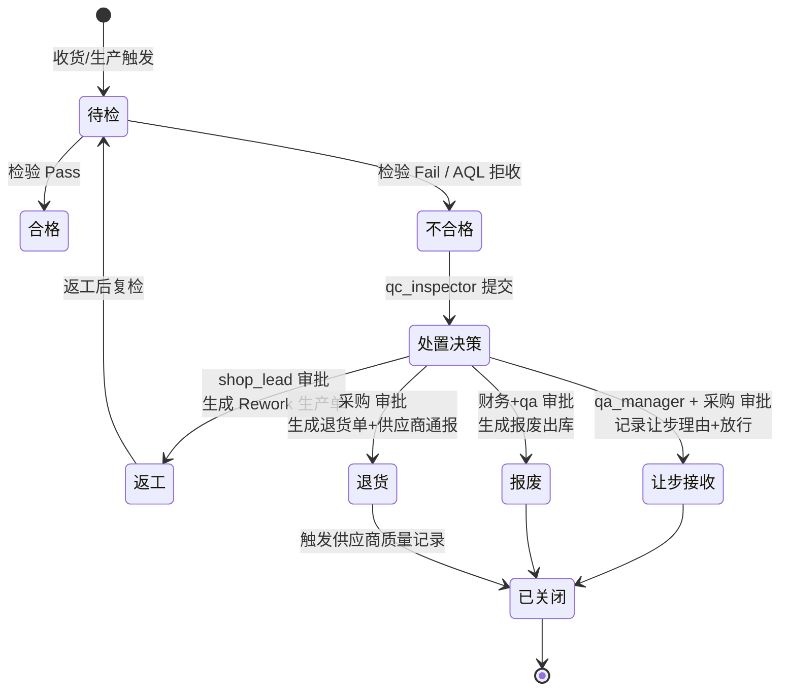
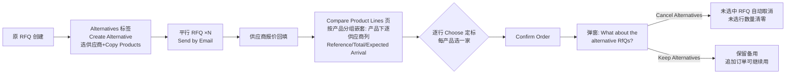

# W6 调研分片 B：QMS 质量管理域 + SCM 供应链域标杆调研

> 研究日期：2026-10-01 | 来源：14 个一手/二手来源（ERPNext 官方文档 6 页、Odoo 19.0 官方文档 6 页、ASQ 1 页、第三方生态 3 页、国内 SRM 厂商 2 页） | 深度：Thorough
> 用途：deepseek-harness 食品制造行业商业化产品（NocoBase 二开）W6 轮规划底稿。平台已有能力（AQL 15 段、审批流、qc_inspector 角色、来料/成品检验基本表单、车间触屏终端等）不重复调研，本文只给增量结论。

---

## QMS 质量管理域

### 两款标杆产品的功能全貌

**ERPNext Quality（开源，docs.frappe.io）**由六个 doctype 组成：

| 组件 | 官方定位 | 要点 |
|---|---|---|
| Quality Inspection | 检验执行单 | Incoming(Purchase)/Outgoing(Sales)/In Process(Manufacturing) 三型；可关联 Purchase Receipt/Delivery Note/Stock Entry/Job Card 六类单据；Item 主数据开启 Inspection Criteria 后**收发货单未检验不得提交**（强制卡点）；sample size 字段记录抽样量；Inspected by / Verified by 双角色（[Quality Inspection 文档](https://docs.frappe.io/erpnext/quality-inspection)） |
| Quality Inspection Template | 检验模板 | 预设参数与验收标准，挂在 Item 主数据自动带出 |
| Quality Procedure | SOP 程序树 | 步骤化流程 + 子程序嵌套（Is Group），作为 Goal 的执行参照（[Quality Procedure 文档](https://docs.frappe.io/erpnext/quality_procedure)） |
| Quality Goal / Quality Review | 目标与周期评审 | Goal 设目标值+监控频率（日/周/月/季），按频率**自动生成** Review；Review 记录各 Objective 实绩（[Quality Goal](https://docs.frappe.io/erpnext/quality_goal)、[Quality Review](https://docs.frappe.io/erpnext/quality_review)） |
| Quality Action | 轻量 CAPA | Corrective/Preventive 二选一，挂 Review 或 Customer Feedback，Resolution 字段 + Open/Closed 状态；官方明言满足 GMP/ISO 9001/14001 合规（[Quality Action 文档](https://docs.frappe.io/erpnext/quality_action)） |

注意：ERPNext 新版官方文档**没有独立的 Non Conformance / Failure Analysis 页面**（`docs.frappe.io/erpnext/quality/non-conformance`、`/failure_analysis` 均为 404，2026-10-01 实测）。介绍页所称 "Non-Conformance Management" 实际由 Quality Inspection 的 Rejected 状态 + Quality Action 组合承载。检验项判定支持三种：Numeric（min/max 范围，超限自动 Rejected）、Non-numeric（Acceptance Criteria Value 字面匹配）、Formula-Based（`reading_1`、`mean` 等公式）；另有 **Manual Inspection 开关**允许人工容忍判定——官方举例「Reading 1 超出 0.153 范围但偏差不大，人工接受」（[Quality Inspection 文档](https://docs.frappe.io/erpnext/quality-inspection)）。这正是 AQL 让步接收的通用形态。

**Odoo Quality（Enterprise 应用，19.0 文档）**由四组概念组成：

| 组件 | 官方定位 | 要点 |
|---|---|---|
| Control Points (QCP) | 控制点=自动生成规则 | Products/Product Categories × Operations（收货/制造/具体工单作业/发货）触发；Control per = Operation/Product/Quantity（**Quantity 支持 Partial Test 百分比抽样**）；Control Frequency = All/Randomly(%)/Periodically(天/周/月)/On-Demand 四档（[Quality control points](https://www.odoo.com/documentation/19.0/applications/inventory_and_mrp/quality/quality_management/quality_control_points.html)） |
| Quality Checks | 检验任务 | **9 种检验类型**：Instructions（指导）/ Take a Picture（拍照留证）/ Register Consumed Materials / Register Production / Print label / Pass-Fail / Measure（Norm+Tolerance from/to 自动判定）/ Spreadsheet / Worksheet（PDF 模板）（同上） |
| Quality Alerts | 不合格警报 | 四入口创建（Quality 应用/MO/库存单/Shop Floor 车间终端）；表单含 Root Cause 下拉、Priority ⭐1-3、四标签页：Description / **Corrective Actions / Preventive Actions**（CAPA 字段内置）/ Miscellaneous（含 Vendor 字段！）；**默认看板视图**按阶段分组、拖拽流转、高优先级置顶（[Quality alerts](https://www.odoo.com/documentation/19.0/applications/inventory_and_mrp/quality/quality_management/quality_alerts.html)） |
| Failure locations | 失败位置 | 按库存位置归类失败环节（[Quality 主页](https://www.odoo.com/documentation/19.0/applications/inventory_and_mrp/quality.html)） |

QCP 还有 **Message If Failure 标签页**：预配置失败时给作业员的处置指引（官方示例即「提示员工创建 Quality Alert」）——失败处置是被设计进控制点的，不是事后补救（[QCP 文档](https://www.odoo.com/documentation/19.0/applications/inventory_and_mrp/quality/quality_management/quality_control_points.html)）。

### 功能 MUST-HAVE 矩阵（P0/P1/P2）

优先级按「食品制造商业化交付 + 平台现状」评定：P0 = W6 必须补齐的增量闭环；P1 = 差异化卖点；P2 = 暂缓。

| 功能项 | ERPNext | Odoo Quality (Ent.) | 我们的建议优先级 | 备注 |
|---|---|---|---|---|
| 检验任务自动生成（控制点规则） | 无自动规则，Item 开关触发强制人工创建 | ✅ QCP：操作×产品×频率×抽样比 | **P0** | 我们已有 AQL 表但缺「何时生成任务」的规则引擎；建议 QCP 模型 = 来源单据类型 × 物料/类别 × 频率(全部/随机%/周期) |
| 检验工作台（任务队列 IQC/IPQC/FQC + 执行界面） | 列表页 + 单表单（Readings 子表逐行判定） | Checks 列表 + 订单紫色按钮弹窗 + Shop Floor 步骤卡 | **P0** | 详见下文交互形态；我们已有 qc_inspector 角色与基本表单，缺队列与逐项判定 UX |
| 检验项三态判定（Pass/Fail/数值范围/公式） | ✅ Numeric/Non-numeric/Formula + Manual 容忍 | ✅ Pass-Fail/Measure(Norm+Tolerance)/Worksheet | **P0**（部分已有） | 我们来料/成品检验表单需升级为模板驱动 + 行级自动判定 |
| 拍照留证（附件） | ✅ 附件通用能力 | ✅ Take a Picture 专属类型 + Device 字段 | **P0** | 食品行业异物/感官检验刚需；触屏终端相机直拍 |
| 强制卡点（未检验不得入库/发货） | ✅ Item 开 Inspection Criteria 后拦截单据提交 | 部分（失败弹窗引导处理，但单据可继续） | **P0** | 我们有审批引擎，用状态机拦截收货提交即可 |
| 不合格品处置四路（返工/让步/报废/退货） | ❌ 无结构化处置流 | 部分（Alert 看板 + CAPA 字段，无四路决策） | **P0** | 两款标杆都缺——这是我们的差异化机会，详见交互形态 |
| 抽样方案指引（抽多少） | sample size 一个字段 | Partial Test 百分比 | **P0**（已有底座） | 我们 AQL GB/T 2828.1 15 段已实现，只差「从批次量+检验水平→样本量」的引导 UI |
| 不合格警报/看板（全员上报通道） | ❌（只有 Review→Action） | ✅ Quality Alerts 看板 + 优先级 + 阶段拖拽 | **P1** | 车间触屏终端可复用 Odoo Shop Floor 的「⋮→Create a Quality Alert」形态 |
| CAPA（纠正预防措施 + 有效性验证） | ✅ 轻量：Corrective/Preventive + Open/Closed | ✅ 轻量：Alert 内两个标签页 | **P1** | 两家都无「措施有效性验证」环节；我们用审批流可做出闭环 |
| 8D 报告全结构 | ❌ | ❌ | **P1**（食品客户投诉场景） | ASQ 标准 D0-D8（见下文），建议做成「客户投诉」触发的分步表单向导而非平铺表格 |
| 供应商批次合格率/评分卡 | ✅ Supplier Scorecard（周期评估+加权+**降级可拦截 RFQ/PO**，v13 起提供、新版文档仍留页） | ❌ 无原生（第三方补齐） | **P1** | 评分卡动作联动采购准入是国内 SRM 通行做法 |
| SPC 控制图 / Cp/Cpk | ❌ 原生止步 pass/fail | ❌ | **P2** | ERPNext 生态需定制开发：ecosire 明言「平台止步于对公差的 pass/fail」，X-bar/R、Cp/Cpk、Nelson 规则全部定制（[ecosire SPC](https://ecosire.com/apps/erpnext/erpnext-statistical-process-control-spc)）；食品行业 SPC 多用于 CCP 关键限值监控，W6 建议只留数据底座（检验读数入库），图形后置 |
| 质量目标/周期评审（Goal/Review 自动生成） | ✅ 原生 | ❌ | **P2** | 管理层功能，商业化初期非刚需 |

### 核心交互形态

#### 1. 检验工作台（qc_inspector 主场）——不该是普通表格

两款标杆的共识：**检验任务是「队列」，检验执行是「向导/卡片」，两者是不同页面**。

任务队列（Odoo 形态最值得抄）：
- Odoo 19 的 Purchase/Inventory 有「# To Process」计数卡 + 按状态分栏（RFQ dashboard 的 To Send / Waiting / Late 三态按钮可直接类比成 待检 / 检验中 / 已完成）（[RFQ 文档](https://www.odoo.com/documentation/19.0/applications/inventory_and_mrp/purchase/manage_deals/rfq.html)）
- 检验任务有三个天然的执行现场，Odoo 全部支持：①Quality Checks 列表页（质检员桌面）②订单详情页紫色「Quality Checks」按钮弹窗（收发货/生产现场，弹窗内逐项 Validate/Pass/Fail）③**Shop Floor 车间终端步骤卡**（工单步骤流中嵌入质检步骤，点勾即 Pass，点击卡片展开详情）（[Quality checks](https://www.odoo.com/documentation/19.0/applications/inventory_and_mrp/quality/quality_management/quality_checks.html)）
- 我们已有车间触屏终端——IPQC 应做成工单步骤内嵌卡片（Odoo Shop Floor 同款），IQC/FQC 做桌面工作台队列

单次检验执行界面（两家合并后的最佳形态）：
```
┌─ 检验执行卡（全屏抽屉或独立页，非表格）────────────────┐
│ 头部：来源单据链接(Purchase Receipt#) | 批次/LOT | 供应商   │
│       样本量徽章「n=32 (AQL 2.5 一般水平 II)」← 我们独有优势  │
│ 中部：检验项列表 = 可判定卡片流（逐项滚动，不是行内编辑）    │
│   ├ Pass-Fail 项：两个大按钮（触屏友好）                    │
│   ├ Measure 项：数值输入 + Norm/Tolerance 即时色块反馈       │
│   │   超差 → 失败弹窗「实测 8.2，应为 7.0–8.0」              │
│   │   + [Correct Measure 重测] [Confirm Measure 确认失败]    │
│   │   （Odoo 防误操作双按钮，值得照抄）                      │
│   └ 感官项：拍照按钮（调用终端相机）+ 备注                  │
│ 底部：整体判定 Pass/Fail + Manual 容忍开关（超差但让步时      │
│       填理由，ERPNext Manual Inspection 同款）+ 提交        │
└──────────────────────────────────────────────────┘
```
- Odoo 的失败弹窗文案模板：`You measured # units and it should be between # units and # units.`，且 Measure 按钮在公差内自动 Pass（[Measure check](https://www.odoo.com/documentation/19.0/applications/inventory_and_mrp/quality/quality_check_types/measure_check.html)）
- ERPNext 的行级自动判定：不在范围 → 该行自动置 Rejected；整单状态由各 Reading 行汇成（[Quality Inspection](https://docs.frappe.io/erpnext/quality-inspection)）
- 样品抽样指引：两家都只做到「sample size 数字段 / 百分比」；我们的 AQL 15 段表可以把「批量大小区间 × 检验水平 → 样本量字码 → AQL 值 → Ac/Re」做成检验卡头部的只读徽章 + 展开明细，直接超越两款标杆

#### 2. 不合格品处置流（状态机 + 决策点）——不该是表格，是决策卡 + 看板

两款标杆的缺口即我们的机会。Odoo 只到「Alert 看板 + CAPA 文本」，没有把处置路由到库存动作。建议状态机：



决策点设计依据：
- **让步（concession）**对应 ERPNext Manual Inspection（人工容忍）+ Odoo 无对应——审批角色走我们已有审批引擎（qa_manager 终审、采购会签）
- **返工**在 Odoo 需手工建 MO；我们可一键生成返工工单回到待检复检（闭环强于标杆）
- **退货/报废**要联动供应商绩效：Quality Alert 的 Miscellaneous 标签有 Vendor 字段（Odoo），退货应自动计入该供应商不合格批次数——这是 ERPNext Supplier Scorecard「交付质量」权重的数据源思路（[Supplier Scorecard](https://docs.frappe.io/erpnext/supplier-scorecard)）
- 日常不合格看板抄 Odoo Quality Alerts：阶段列 + 优先级星标 + 拖拽流转（[Quality alerts](https://www.odoo.com/documentation/19.0/applications/inventory_and_mrp/quality/quality_management/quality_alerts.html)）

#### 3. 8D / CAPA 表单结构——不该是表格，是分步向导

ASQ 权威定义的 D0-D8（[ASQ Eight Disciplines 8D](https://asq.org/quality-resources/eight-disciplines-8d)）：

| 阶段 | 内容（ASQ 原文要点） |
|---|---|
| D0 | Plan——解题准备与前提 |
| D1 | 组建团队——选具备产品/过程知识的成员 |
| D2 | 问题描述——用 5W2H 量化描述 who/what/where/when/why/how/how many |
| D3 | 临时围堵措施（interim containment）——隔离问题 |
| D4 | 根因确定与验证——所有原因须验证而非拍脑袋（"not determined by fuzzy brainstorming"） |
| D5 | 选择并验证永久纠正——预生产定量确认有效 |
| D6 | 实施并验证纠正措施 |
| D7 | 预防再发——修改管理体系/作业规程 |
| D8 | 表彰团队 |

落地判断：
- ERPNext Quality Action 只有「Corrective/Preventive 二分 + Resolution 文本 + Open/Closed」，**承载不了 8D**；Odoo Alert 的两个 Actions 标签页同样是纯文本（两家官方文档均无 8D 结构）。开源 ERP 生态里 8D 无现成承载
- 建议形态：**客户投诉/重大质量事件触发的 8D 向导**（每屏一个 D，D4 挂鱼骨图/5Why 附件、D6 挂复检数据、D7 挂 SOP 变更链接），CAPA 有效性验证（D6 验证 + 复检合格率）用我们的审批流做门禁——这两点是两款标杆都没有的闭环
- 轻量 CAPA（日常不合格的纠正预防）挂在处置流「已关闭」前：处置关单时必填「原因分类 + 是否需要预防措施」，预防措施进 Quality Action 式任务列表——对应 Odoo Alert 的 Corrective/Preventive 标签

### 菜单 IA（QMS 域建议）

```
质量管理
├─ 工作台（qc_inspector 默认落点）
│   ├─ 待检任务（IQC/IPQC/FQC 三段计数卡 + 逾期高亮）
│   └─ 不合格看板（阶段拖拽 + 优先级）
├─ 检验
│   ├─ 检验任务（列表，管理员视角全量）
│   ├─ 检验模板（参数+验收标准+检验阶段）
│   └─ 抽样方案（AQL 表只读 + 检验水平配置）
├─ 不合格处置
│   ├─ 处置单（四路决策 + 审批状态）
│   └─ 让步记录（台账）
├─ 改进
│   ├─ CAPA 任务（Open/Closed + 有效性验证栏）
│   └─ 8D 报告（向导式，客户投诉触发）
├─ 供应商质量
│   └─ 评分卡（批次合格率/退货率/响应，联动采购准入提示）
└─ 配置
    ├─ 控制点规则（来源×物料×频率×抽样比）
    └─ 失败处置指引模板（Odoo Message If Failure 同款）
```
（结构参照：ERPNext 「Quality > Goal and Procedure / Review and Action」分组 + Odoo 「Quality Control > Control Points / Checks / Alerts」扁平三件套，合并后按角色动线组织）

---

## SCM 供应链域

### 功能矩阵（P0/P1/P2）

| 功能项 | ERPNext | Odoo | 国内 SRM 通行做法 | 建议优先级 | 备注 |
|---|---|---|---|---|---|
| RFQ 询价→报价→定标 | Material Request→RFQ（Supplier Quotation） | ✅ RFQ 全流程 + **Alternative RFQs 比价** | 询报价（低金额价格主导）（[甄云](https://www.going-link.com/product/manage)） | **P0** | Odoo 的比价矩阵值得整页对标 |
| 多供应商报价对比矩阵 | ❌ 无原生对比页 | ✅ Compare Product Lines：按产品分组嵌套列各家 PO/价格，逐行 Choose 定标 | 智能比价（NLP 同款识别）（[甄云](https://www.going-link.com/product/manage)） | **P0** | 详见交互形态 |
| 供应商价格库（多供应商+交期） | Item 主数据多供应商价格 | ✅ Vendor Pricelist：数量/单价/交期/供应商料号/折扣列（[RFQ 文档](https://www.odoo.com/documentation/19.0/applications/inventory_and_mrp/purchase/manage_deals/rfq.html)） | 寻源定价库 | **P0** | 询价自动带出历史价 |
| 再订货点/安全库存自动补货 | ✅ Item 设 Reorder Level/Qty（可分仓），触发自动生成 Material Request（Purchase 或 Transfer 用途）+ 邮件通知采购经理（[Auto Creation of Material Request](https://docs.frappe.io/erpnext/auto-creation-of-material-request)） | ✅ Reordering Rules：Min/Max + Trigger(Auto/Manual) + Multiple 倍数补货 + JIT 预测库存（含未来需求）触发；Buy 路由→RFQ、Manufacture 路由→MO（[Reordering rules](https://www.odoo.com/documentation/19.0/applications/inventory_and_mrp/inventory/warehouses_storage/replenishment/reordering_rules.html)） | 预测计划协同、按需配送 | **P0**（已有 MPS/MRP 底座） | 我们 MPS 已有，增量是 Min/Max 规则表 + 触发自动生成建议采购单 |
| 供应商门户（订单确认/对账协同） | 无（portal 面向客户） | 原生 portal **只读**："Portal users only have read/view access, and will not be able to edit any documents"（[User portals](https://www.odoo.com/documentation/19.0/applications/general/users/user_portals.html)）；供应商可编辑协同（报价回复/单据上传）全部依赖第三方模块 | 订单协同/送收货协同/质量协同/财务结算协同四大在线协同（[甄云](https://www.going-link.com/product/manage)、[安能智控](https://www.annsmart.cn/srm.html)） | **P1** | 国内食品供应商数字化程度参差，先做「对账单协同 + 订单状态只读门户」，ASN 后置 |
| ASN 送货通知/送货排程 | ❌ | ❌ 原生盲收："Most warehouses running Odoo receive blind…This is where native Odoo runs out of road"；第三方 ASN 门户=供应商 portal 自助提交 ASN + 托盘级条码接收 + 差异结构化捕获（[ecosire ASN Portal](https://ecosire.com/apps/odoo/inbound-asn-receiving-portal)） | 送货计划拉动按需配送（[甄云](https://www.going-link.com/product/manage)） | **P1** | 食品收货排程价值高，但依赖供应商配合度，放 P1 二期 |
| 供应商绩效评分卡 | ✅ Supplier Scorecard：周期(周/月/年)+加权函数(默认前12期线性)+Scoring Standings 分级+**Scorecard Actions 可 warn/prevent 新 RFQ/PO**（[文档](https://docs.frappe.io/erpnext/supplier-scorecard)） | ❌ 原生无（第三方补） | 绩效模型→分级→配额调整/寻源限制（[甄云](https://www.going-link.com/product/manage)） | **P1** | 与 QMS 批次合格率数据同源，一张卡两域共享 |
| 招投标（公开/邀请） | ❌ | ❌（Alternative RFQ 只是简易询价） | 招投标（公开/邀请/代理，高金额复杂参数）+ 围标风险识别（[甄云](https://www.going-link.com/product/manage)、[安能智控](https://www.annsmart.cn/srm.html)） | **P2** | 商业化初期用三供应商比价覆盖 90% 场景，招投标后置 |
| 竞价/竞标大厅 | ❌ | ❌ | 竞价（还价历史可查）+ 竞标大厅实时排名（[甄云](https://www.going-link.com/product/manage)） | **P2** | 标准化大宗原料才有价值 |
| 需求预测 | ❌（无原生统计预测） | ❌（replenishment 是库存驱动） | 预测计划协同（共享需求/产能信息）（[甄云](https://www.going-link.com/product/manage)） | **P2** | 依赖销售历史数据积累；W6 先做预测数据底座 |
| 供应商准入/生命周期 | Supplier 主数据+停用 | 供应商联系人+价格 | 准入认证（合作邀请/档案/物料认证）→分级→整改/淘汰/配额调整（[甄云](https://www.going-link.com/product/manage)） | **P1**（准入表单已有基础） | 分级联动评分卡 |

### 核心交互形态

#### 1. 寻源比价矩阵页（buyer 主场）——不该是普通表格，是「分组对比 + 逐行定标」

Odoo 官方 Call for Tenders 流程（[文档](https://www.odoo.com/documentation/19.0/applications/inventory_and_mrp/purchase/manage_deals/calls_for_tenders.html)）：



关键细节（全部来自官方文档）：
- Alternatives 标签页内表格列：Reference / Vendor / Total / Status / **Expected Arrival（按各供应商 lead time 自动计算）**——交期与价格同屏对比
- **Compare Product Lines 页默认按 Product 分组**：每个产品一张嵌套下拉，组内列出各供应商报价行，行尾「Choose」按钮定标；Clear 按钮可把某产品从某 RFQ 剔除（对应行数量归零）
- 定标确认时弹窗二选一：Cancel Alternatives（自动取消落选 RFQ）/ Keep Alternatives（保留为后备，后续可追加采购）——「保留备选」是采购实务刚需
- 我们的增强点：对比矩阵加「历史成交价」列（来自我们已有的采购台账）+ AQL 批次合格率列（来自 QMS 域）——价格、交期、质量三维权度的定标，超越两款标杆

#### 2. 供应商协同门户（P1 形态预留）

- Odoo 原生边界：portal 只读（订单/发票查看、地址维护、付款），**任何编辑类协同（报价、ASN、对账确认）都要第三方开发**（[User portals](https://www.odoo.com/documentation/19.0/applications/general/users/user_portals.html) + [ecosire](https://ecosire.com/apps/odoo/inbound-asn-receiving-portal)）
- 第三方 ASN 门户的标准形态：供应商用免费 portal 账号自助提交 ASN（含托盘/箱级明细）→ 仓库按 ASN 而非 PO 收货 → 条码扫描比对 → 短装/超装差异结构化记录并自动通知采购（"supplier performance disputes are backed by evidence"）（[ecosire](https://ecosire.com/apps/odoo/inbound-asn-receiving-portal)）
- 国内 SRM（甄云）的协同谱系：预测计划协同、订单协同、送收货协同、质量协同、财务结算协同五大类，其中「送货计划拉动供应商按需配送」即 ASN 排程的业务化表述（[甄云](https://www.going-link.com/product/manage)）
- W6 落地建议：一期做「对账单协同」（供应商查看对账单+确认/异议，配合我们已有采购付款流）+ 订单状态只读门户；ASN 送货预约放二期（需供应商运营配合）

#### 3. 供应商绩效评分卡

- ERPNext Supplier Scorecard 结构值得整体移植：每供应商一张卡、评估周期（周/月/年）、加权函数（默认近 12 期线性加权，支持 `{total_score}` `{period_number}` 自定义公式）、**Scoring Standings 分级表（自定义颜色+触发动作）**、**Scorecard Actions = warn / prevent 新 RFQ 和 PO**——供应商掉级直接在采购入口拦截（[Supplier Scorecard](https://docs.frappe.io/erpnext/supplier-scorecard)）
- 国内通行做法一致且更进一步：绩效模型 → 分级 → **配额调整 / 寻源限制 / 整改 / 淘汰**全生命周期闭环（[甄云](https://www.going-link.com/product/manage)）
- 食品行业评分维度建议：来料批次合格率（QMS 同源）、到货准时率（收货单时间戳）、拒收/退货率、对账差异率、资质证照有效期（食品供应商执照/许可证到期预警——国内 SRM 标配风险监控，见[安能智控](https://www.annsmart.cn/srm.html)「供应商风险扫描、监控、预警」）
- 交互形态：卡片页（评分趋势折线 + 雷达图 + 等级徽章 + 当前动作状态），不是表格；等级联动在 RFQ 创建时做 warn/prevent 拦截提示

### 菜单 IA（SCM 域建议）

```
采购供应
├─ 寻源
│   ├─ 询价单（RFQ 列表 + Alternatives 分组）
│   ├─ 比价矩阵（Compare Product Lines 形态）
│   └─ 定标记录（中标供应商/价格留痕）
├─ 采购执行
│   ├─ 采购订单（已有）
│   └─ 收货对账（已有，增加按 ASN 收货的二期入口）
├─ 供应商管理
│   ├─ 供应商档案（准入表单 + 证照有效期预警）
│   ├─ 绩效评分卡（等级/趋势/动作）
│   └─ 供应商门户（对账协同一期 / ASN 二期）
├─ 补货计划
│   ├─ 再订货规则（Min/Max/Multiple/触发方式）
│   └─ 补货建议（自动生成的建议采购单，人工确认）
└─ 配置
    ├─ 供应商价格库（多供应商+数量段价+交期）
    └─ 寻源策略（金额阈值路由：询价/比价/招标）
```
（结构参照：Odoo 「Purchase > Orders > RFQ / Purchase Agreements / Vendors」+ 甄云「智慧寻源/敏捷协同」域划分）

---

## 证据清单（URL + 关键引文）

| # | 来源 | 类型 | 关键引文/结论 |
|---|---|---|---|
| 1 | [ERPNext Quality Management 介绍](https://docs.frappe.io/erpnext/quality-management) | 一手官方 | 六大特性：Quality Checks / Inspection Templates / Non-Conformance Management / Batch Tracking / Supplier Quality Management / Reporting |
| 2 | [ERPNext Quality Inspection](https://docs.frappe.io/erpnext/quality-inspection) | 一手官方 | "submission of a stock delivery/receipt document will be allowed only after a Quality Inspection is done"；检验类型 Incoming/Outgoing/In Process；Numeric min-max 自动 Rejected；Formula `(reading_1 + reading_2) < 10`、`mean < 15`；Manual Inspection 容忍判定 |
| 3 | [ERPNext Quality Procedure](https://docs.frappe.io/erpnext/quality_procedure) | 一手官方 | SOP 步骤 + Child Procedure 嵌套（Is Group） |
| 4 | [ERPNext Quality Goal](https://docs.frappe.io/erpnext/quality_goal) / [Quality Review](https://docs.frappe.io/erpnext/quality_review) | 一手官方 | Goal 设 Monitoring Frequency 自动周期生成 Review；Review 可触发 Action |
| 5 | [ERPNext Quality Action](https://docs.frappe.io/erpnext/quality_action) | 一手官方 | "allow implementation of corrective and preventive actions…meet compliance with GMP, ISO 9001 and 14001"；Corrective/Preventive + Resolution + Open/Closed |
| 6 | [ERPNext Supplier Scorecard](https://docs.frappe.io/erpnext/supplier-scorecard) | 一手官方（v13 起提供，新版文档保留页面） | 评估周期 周/月/年；加权默认"linearly weighted over the previous 12 scoring periods"；"Scorecard Actions to warn or prevent new Request for Quotations and Purchase Orders" |
| 7 | [ERPNext Auto Creation of Material Request](https://docs.frappe.io/erpnext/auto-creation-of-material-request) | 一手官方 | Item 设 Reorder Level/Qty（可分仓）；触发自动建 Material Request；Purchase Manager 收邮件通知；按 projected qty 比较 |
| 8 | [Odoo 19 Quality 总览](https://www.odoo.com/documentation/19.0/applications/inventory_and_mrp/quality.html) | 一手官方 | 四大块：control points / alerts / checks / failure locations + 四种 check 类型 |
| 9 | [Odoo Quality Control Points](https://www.odoo.com/documentation/19.0/applications/inventory_and_mrp/quality/quality_management/quality_control_points.html) | 一手官方 | Control per Operation/Product/Quantity(Partial Test %)；Frequency All/Randomly(%)/Periodically/On-Demand；9 种 check 类型；Message If Failure 标签页；Team/Responsible 字段 |
| 10 | [Odoo Quality Checks](https://www.odoo.com/documentation/19.0/applications/inventory_and_mrp/quality/quality_management/quality_checks.html) | 一手官方 | 三执行入口：Checks 页 / 订单紫色按钮弹窗（Validate/Pass/Fail）/ Shop Floor 工单步骤（勾选即 Pass）；Pass-Fail/Measure/Worksheet 类型字段 |
| 11 | [Odoo Quality Alerts](https://www.odoo.com/documentation/19.0/applications/inventory_and_mrp/quality/quality_management/quality_alerts.html) | 一手官方 | 四入口创建；Root Cause/Priority⭐；Description/Corrective Actions/Preventive Actions/Miscellaneous(Vendor) 四标签；默认看板拖拽流转 |
| 12 | [Odoo Measure Check](https://www.odoo.com/documentation/19.0/applications/inventory_and_mrp/quality/quality_check_types/measure_check.html) | 一手官方 | Norm + Tolerance(from/to)；Measure 按钮公差内自动 Pass；失败弹窗 `You measured # units and it should be between # units and # units.` + Correct/Confirm Measure 双按钮；失败后一键创建 Quality Alert |
| 13 | [Odoo RFQ](https://www.odoo.com/documentation/19.0/applications/inventory_and_mrp/purchase/manage_deals/rfq.html) | 一手官方 | Vendor Pricelist（Quantity/Unit Price/Delivery Lead Time/Vendor Product Code/Discount 列）；RFQ dashboard To Send/Waiting/Late；Group RFQ 合并策略 On Order/Daily/Weekly/Always；Blanket Order 长协 |
| 14 | [Odoo Call for Tenders](https://www.odoo.com/documentation/19.0/applications/inventory_and_mrp/purchase/manage_deals/calls_for_tenders.html) | 一手官方 | Alternatives 标签 Create Alternative（Copy Products）；Compare Product Lines 按产品分组嵌套对比 + 逐行 Choose；Confirm 后 Cancel/Keep Alternatives 弹窗 |
| 15 | [Odoo Reordering Rules](https://www.odoo.com/documentation/19.0/applications/inventory_and_mrp/inventory/warehouses_storage/replenishment/reordering_rules.html) | 一手官方 | Min/Max/Location/Route；Trigger Auto/Manual；Multiple 倍数（6 罐/箱例：32 向上取 36）；0/0/1 规则；Buy→RFQ / Manufacture→MO；JIT 按 forecasted stock（含未来需求）触发 |
| 16 | [Odoo User Portals](https://www.odoo.com/documentation/19.0/applications/general/users/user_portals.html) | 一手官方 | "Portal users only have read/view access, and will not be able to edit any documents in the database."——供应商编辑类协同无原生 |
| 17 | [ASQ Eight Disciplines 8D](https://asq.org/quality-resources/eight-disciplines-8d) | 权威标准组织 | D0 Plan→D1 团队→D2 5W2H 描述→D3 临时围堵→D4 根因验证（"not determined by fuzzy brainstorming"）→D5 永久纠正验证→D6 实施验证→D7 预防再发→D8 表彰 |
| 18 | [ecosire ERPNext SPC](https://ecosire.com/apps/erpnext/erpnext-statistical-process-control-spc) | 二手（定制商） | "the platform stops at pass/fail against a tolerance"——ERPNext 无原生 SPC；X-bar/R、X-MR、p/np/c/u、Cp/Cpk、Western Electric/Nelson 规则均需定制开发 |
| 19 | [ecosire Odoo ASN Portal](https://ecosire.com/apps/odoo/inbound-asn-receiving-portal) | 二手（定制商） | "Most warehouses running Odoo receive blind…native Odoo runs out of road"；第三方 ASN：供应商 portal 自助提交、按 ASN 条码接收、托盘级、差异结构化捕获、dock-planning Gantt（Enterprise） |
| 20 | [甄云科技 SRM 产品页](https://www.going-link.com/product/manage) | 国内头部厂商 | 供应商全生命周期（准入认证→分级→整改/淘汰/配额调整/寻源限制）；四策略寻源（招投标/询报价/竞价/竞标大厅）；五大协同（预测计划/订单/送收货/质量/财务结算）；「送货计划拉动供应商按需配送」 |
| 21 | [安能智控 SRM](https://www.annsmart.cn/srm.html) | 国内厂商 | 准入/评估/分级/绩效监控；自动化寻源比价竞价；订单-发货-收货-对账全流程在线协同；制造业方案含 JIT 采购/批次追溯/多级供应商；量化指标（报价率 92%、发货准时率 98%） |

### 交叉验证与冲突说明

- **Odoo Quality 是 Enterprise 专属**：用户任务书已提示。本文档站页面在 19.0 企业版文档树（inventory_and_mrp/quality）下，功能以官方文档为准，未依赖社区版臆断。
- **ERPNext Supplier Scorecard 版本争议**：docs.frappe.io 新文档站仍保留该页（2026-10-01 访问成功），第三方 fork 仓库（SoftiaFR/erpnext main 分支）含 supplier_scorecard doctype，但 v15 主线是否预装未逐一验证——报告中以"文档存在+历史版本提供"口径表述，落地前建议以我们自建评分卡为准（数据源本来就来自我们 QMS 域，更可控）。
- **SPC/ASN/供应商门户**三家结论一致（原生无、第三方定制），交叉源为官方文档 + 定制商产品页，可信度高。

---

## 给主编排的摘要

**QMS 域 P0 功能一句话清单**：检验任务控制点规则引擎（来源×物料×频率×抽样比自动生成）、检验工作台三视图（桌面队列/订单弹窗/车间触屏步骤卡）、检验项模板化逐项判定（Pass-Fail 大按钮 + Measure 数值色块 + 拍照留证 + Manual 让步容忍）、收货未检验强制卡点、AQL 抽样指引徽章（样本量字码/Ac/Re 展示）、不合格品四路处置状态机（返工/让步/报废/退货 + 审批路由 + 返工复检闭环）。

**检验工作台交互形态要点**：任务队列与检验执行分离——队列按 IQC/IPQC/FQC 分段计数卡（To Send/Waiting/Late 式状态分栏），执行是全屏卡片向导而非表格：头部挂来源单据+批次+AQL 样本量徽章，中部检验项逐卡判定（数值项 Norm/Tolerance 即时色块反馈，超差弹窗给「重测/确认失败」双按钮防误操作，感官项直接调相机），底部整体判定+让步理由；IPQC 嵌入车间触屏终端工单步骤流（勾选即 Pass，点卡展开），失败弹窗内联失败处置指引并可一键升级为不合格警报。

**SCM 域 P0 功能一句话清单**：多供应商 RFQ 询价（Alternatives 平行询价 + 供应商价格库自动带出历史价/交期）、比价矩阵页（按产品分组嵌套列各家价格/交期/预计到货，逐行 Choose 定标，定标后 Cancel/Keep Alternatives 二选一）、再订货点规则（Min/Max/Multiple 倍数 + 预测库存触发 + 自动生成建议采购单走人工确认）、供应商绩效评分卡数据底座（批次合格率/准时率/退货率同源采集，等级 warn/prevent 联动 RFQ 入口）。

**寻源比价交互形态要点**：核心是「分组对比矩阵 + 逐行定标」两段式——询价期在同一 RFQ 的 Alternatives 标签页克隆产品明细发给多家供应商（每家一张平行 RFQ，Expected Arrival 按各家 lead time 自动算好），报价回收后进入 Compare Product Lines 页：默认按产品分组、组内嵌套展开各供应商报价行（价格/交期同屏），采购员逐产品点 Choose 选定供应商；全部选定后确认订单时系统弹窗询问落选询价单是取消还是保留为后备（Keep Alternatives 支持后续追加采购）；我们在矩阵中追加「历史成交价 + 批次合格率」两列，形成价格/交期/质量三维权定标。
