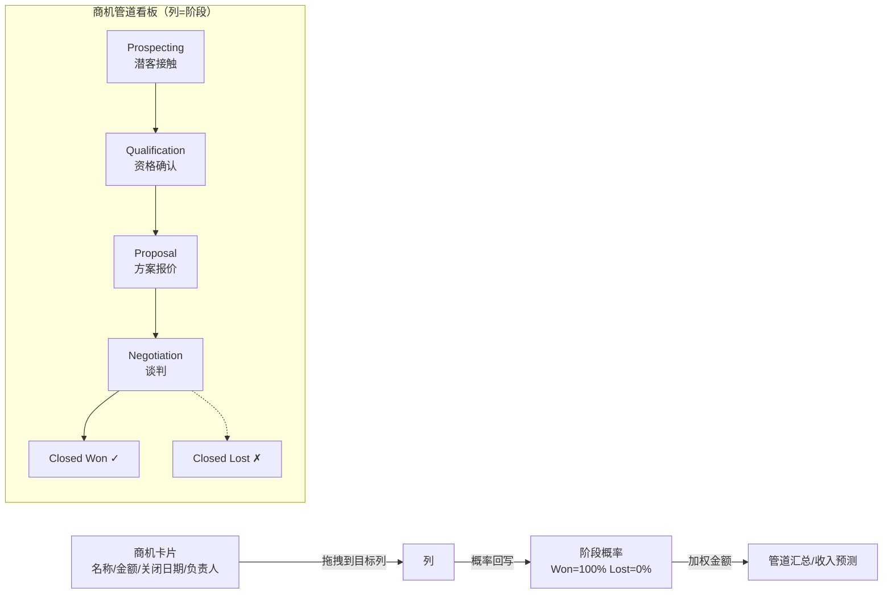
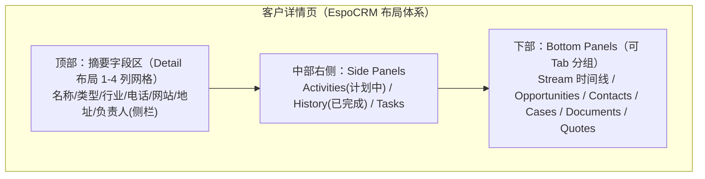
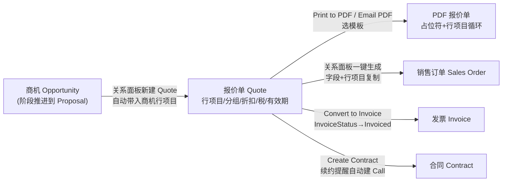
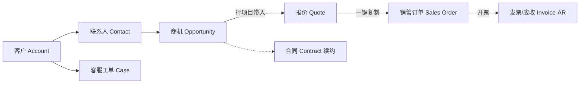

# W6 调研分片 pt1c：CRM 客户关系管理域标杆调研（EspoCRM / SuiteCRM）

> 研究日期：2026-10-01 | 来源：26 个来源（12 个官方文档页深读） | 深度：Thorough
> 服务对象：食品制造行业商业化交付产品（NocoBase 二开）W6 轮 CRM 域规划
> 平台已有（不重复调研）：审批流设计器、看板/甘特/日历通用视图、统计卡、九步端到端闭环（含报价→销售订单）、八角色权限（含 sales_rep）、简单 AR/AP、移动端 AI 同事

---

## CRM 客户关系域

### 一句话结论

CRM 域的胜负手不是"再多一张表格"，而是四个**非表格形态**：商机管道 Kanban（列=销售阶段、卡=商机、拖拽推进）、客户 360 详情页（摘要字段 + 多面板聚合 + 时间线 Stream）、今日待办活动流（calls/meetings/tasks 聚合 + 逾期提醒）、报价单→PDF 单据流（行项目 + 折扣 + 有效期 + 模板打印）。EspoCRM 在这四项上全部原生内置且可配置到字段级；SuiteCRM（SugarCRM 分支）强在报价/发票/合同全链路与 AOP 客户门户，但其 8.x 核心的商机管理仍是列表视图，Kanban 拖拽管道依赖第三方付费插件。

### 1. 两款标杆的功能全貌速览

**EspoCRM**（开源 + Sales/Advanced 付费扩展包）：
- 核心实体：Accounts（客户/公司）、Contacts（联系人）、Leads（线索）、Opportunities（商机）、Cases（客服工单）、Activities（会议/电话/任务/邮件）、Stream（时间线流）（[docs.espocrm.com](https://docs.espocrm.com/)，[features](https://www.espocrm.com/features/)）
- Account 官方声明的中心地位："Accounts play a central role in EspoCRM"，关系对象为 Contacts / Opportunities / Cases / Documents（[sales-management](https://docs.espocrm.com/user-guide/sales-management/)）
- Quotes（报价）在 **Sales Pack 付费扩展** 中，与 Opportunity 关联；同包还有 Sales Orders / Invoices / Credit Notes / Delivery Orders / Return Orders / Products / Prices / Payments / Taxes / Inventory Management（[docs 首页模块清单](https://docs.espocrm.com/)、[quotes](https://docs.espocrm.com/user-guide/quotes/)）——即 EspoCRM 的 CRM→ERP 联动靠 Sales Pack 整包实现
- Reports / Workflows / BPM 在 **Advanced Pack 付费扩展**（[advanced-pack](https://www.espocrm.com/extensions/advanced-pack/)）
- PDF 模板：任意实体可配模板打印（占位符 + 行项目循环 + Code View）（[printing-to-pdf](https://docs.espocrm.com/user-guide/printing-to-pdf/)、[quotes#Printing to PDF](https://docs.espocrm.com/user-guide/quotes/)）

**SuiteCRM**（SugarCRM CE 分支，全功能免费开源）：
- 官方模块清单：Accounts / Contacts / Leads / Opportunities / Quotes / Invoices / Contracts / Products / PDF Templates / Cases / Bugs / Knowledge Base / Calendar / Calls / Meetings / Tasks / Emails / Campaigns / Target Lists / Reports / Workflow / Projects / Documents / Notes（[suitecrm.com 功能清单](https://suitecrm.com/suitecrms-list-of-features/)）
- 8.x 文档导言明确全链路："capture and qualify leads, convert them into contacts and Opportunities… Build Quotes from a catalogue of the products and services you sell, convert them to Invoices, and track Contracts through their renewal cycle"（[8.x introduction](https://docs.suitecrm.com/8.x/user/getting-started/introduction/)）
- AOP（Advanced OpenPortal）：Cases 增强——客户门户（Joomla 组件）+ 邮件转工单（[cases-with-portal](https://8-x.docs.suitecrm.com/user/advanced-modules/cases-with-portal/)）
- 报表："build reports across any module with filters, groupings, and charts, save them for reuse, and schedule them by email. Add them to dashboards"（[8.x introduction](https://docs.suitecrm.com/8.x/user/getting-started/introduction/)）
- 关键短板：8.x 核心 Opportunities 是纯列表管理（排序/Mass Update/合并/变更日志），**无内置 Kanban 拖拽**（[8-x core-modules/opportunities](https://8-x.docs.suitecrm.com/user/core-modules/opportunities/)）；Kanban 管道是第三方付费插件，如 Mokas SalesPipe（"Opportunities in a Kanban view. DRAG & DROP - Easily changeable stages of sales"，[store.suitecrm.com/addons/salespipe](https://store.suitecrm.com/addons/salespipe)）与 Kanban View 通用插件（[store.suitecrm.com/addons/kanban-view](https://store.suitecrm.com/addons/kanban-view)）。传统管道可视化是首页图表 dashlet"Pipeline By Sales Stage"（漏斗/条形，源自 SugarCRM 遗产，见 [GitHub PR #2197](https://github.com/salesagility/SuiteCRM/pull/2197)）

### 2. 功能 MUST-HAVE 矩阵（P0/P1/P2）

优先级判定基准：我们平台已有通用看板/日历/审批/报价→销售订单环节与八角色权限，P0 = 客单价B2B食品制造直销闭环缺一不可；P1 = 完整性加分；P2 = 远期。

| 功能项 | EspoCRM | SuiteCRM | 我们的建议优先级 | 备注 |
|---|---|---|---|---|
| 客户 Accounts（公司主体）+ 联系人 Contacts | ✅ 核心，Account 为中心记录 | ✅ 核心 | **P0** | 我方已有客户主数据，需补联系人独立实体与客户-联系人多对多 |
| 线索 Leads + 转换（Lead→Account/Contact/Opportunity） | ✅ 一键 Convert，Converted To 面板 | ✅ Targets→Leads→Contacts 分层 | **P1** | 食品 B2B 多为老客户复购，新客开发流程可后置；EspoCRM 转换证据 [sales-management](https://docs.espocrm.com/user-guide/sales-management/) |
| 商机 Opportunities + 销售阶段 + 概率 | ✅ 6 默认阶段+概率（Won=100%/Lost=0%） | ✅ 10 阶段（SugarCRM 经典）+概率随阶段自动 | **P0** | 两者概率都参与加权管道/预测（[Espo](https://docs.espocrm.com/user-guide/sales-management/)、[Suite 8.x](https://docs.suitecrm.com/8.x/user/sales-relationships/opportunities/)） |
| 商机管道 Kanban（拖拽换阶段） | ✅ Opportunities **默认 Kanban**，可切 List | ❌ 核心无，第三方付费插件 | **P0** | 我们已有看板能力，直接复用到商机域（[Espo](https://docs.espocrm.com/user-guide/sales-management/)、[插件证据](https://store.suitecrm.com/addons/salespipe)） |
| 多管道 Pipelines（按团队不同阶段流） | ✅ v10 原生（Leads/Opportunities 均可） | ❌ 无（阶段全局下拉编辑） | **P2** | 单一标准销售流对食品制造足够；证据 [pipelines](https://docs.espocrm.com/general/pipelines/) |
| 跟进活动（会议/电话/任务）+ 提醒 | ✅ Meetings/Calls/Tasks + Popup/Email 双提醒 | ✅ 同（SugarCRM 同源） | **P0** | 挂到客户/商机/工单任意父记录；[Espo activities](https://docs.espocrm.com/user-guide/activities-and-calendar/) |
| 今日待办聚合视图（My Activities） | ✅ My Activities dashlet + 日历月/周/日/时间线 | ✅ 日历 + Daily Activities 区 | **P0** | 销售代表工作台首屏；[Espo](https://docs.espocrm.com/user-guide/activities-and-calendar/)、[Suite 文档树](https://docs.suitecrm.com/8.x/user/) |
| 时间线 Stream（记录变更+帖子+附件） | ✅ Note 实体流，默认 7 实体启用，@提及/置顶/反应 | ⚠️ 用 Activities/History 两个子面板 + 变更日志（View Change Log） | **P0** | 我方 W5 已有 PO 时间线先例，客户 360 必配；[stream](https://docs.espocrm.com/user-guide/stream/) |
| 客户 360 详情（摘要+多面板+时间线） | ✅ Detail 布局+Bottom/Side Panels 可配 Tab 分组 | ✅ Detail View + Relationships 子面板 | **P0** | 见下文交互形态②；[layout-manager](https://docs.espocrm.com/administration/layout-manager/) |
| 报价单 Quotes（行项目/折扣/税/有效期） | ✅ Sales Pack 付费（Discount % 字段可加） | ✅ 核心免费（Pct/Amt 双折扣+行分组） | **P0** | 我方已有报价环节，重点补行项目分组合计与有效期管控；[Espo](https://docs.espocrm.com/user-guide/quotes/)、[Suite](https://docs.suitecrm.com/user/sales-relationships/quotes-invoices-contracts/) |
| 报价→PDF（模板引擎） | ✅ 模板占位符+itemList 循环+Code View | ✅ PDF Templates 模块（6 模块+行项目表格） | **P0** | 食品行业必须发正式报价单；[Espo](https://docs.espocrm.com/user-guide/quotes/)、[Suite](https://docs.suitecrm.com/user/sales-relationships/pdf-templates/) |
| 报价→销售订单→发票链路 | ✅ Quote→Sales Order/Invoice 关系面板一键生成（Sales Pack） | ✅ Quote→Convert to Invoice（状态自动置 Invoiced） | **P0（部分已有）** | 我方已有报价→销售订单，补"报价→订单一键复制行项目+发票状态回写"；两方证据同上 |
| 报价审批（Approval Status） | ⚠️ 无显式字段（靠 Workflow） | ✅ Approval Status/Approval Issues 字段 | **P0（已有审批流，补挂钩）** | 我方审批引擎直接挂报价单提交节点；[Suite](https://docs.suitecrm.com/user/sales-relationships/quotes-invoices-contracts/) |
| 客服工单 Cases（客诉） | ✅ Email-to-Case + 内部帖 + 协作人 | ✅ Cases + AOP 门户 + 线程化更新日志 | **P1** | 食品客诉常联动质量闭环，可结合已有 CAPA；[Espo](https://docs.espocrm.com/user-guide/case-management/)、[AOP](https://8-x.docs.suitecrm.com/user/advanced-modules/cases-with-portal/) |
| 报表（销售统计/预测） | ⚠️ Advanced Pack 付费（Grid 报表+加权预测） | ✅ 核心免费（过滤/分组/图表/定时邮件） | **P1** | 我方已有 KPI 体系，补"按阶段管道金额"与"加权收入预测"两张图即可；[Espo sales-management](https://docs.espocrm.com/user-guide/sales-management/)、[Suite intro](https://docs.suitecrm.com/8.x/user/getting-started/introduction/) |
| 合同 Contracts + 续约提醒 | ❌ 核心无（Sales Pack 亦无 Contracts） | ✅ 免费核心（Renewal Reminder 自动创建 Planned Call） | **P2** | 年度框架协议场景，后置；[Suite](https://docs.suitecrm.com/user/sales-relationships/quotes-invoices-contracts/) |
| 客户门户（Customer Portal） | ✅ 内置 Portal + Portal Role（付费能力配套） | ✅ AOP（Joomla 外置门户组件） | **P2** | 食品 B2B 客户自助查订单/对账是远期价值点；[Espo cases](https://docs.espocrm.com/user-guide/case-management/)、[AOP](https://8-x.docs.suitecrm.com/user/advanced-modules/cases-with-portal/) |
| 邮件双向集成（收发挂记录） | ✅ IMAP/SMTP + Group Mailbox 转工单 | ✅ 同源能力 | **P2** | 私有化部署客户邮件打通成本高，AI 同事通道可替代部分；[Espo](https://docs.espocrm.com/user-guide/emails/)、[Suite](https://docs.suitecrm.com/admin/administration-panel/emails/email/) |
| 营销活动 Campaigns + 目标清单 | ✅ Campaigns/Target Lists | ✅ Campaigns/Target Lists/Surveys | **P2** | 超出食品制造 CRM 闭环最小集；[Espo docs](https://docs.espocrm.com/)、[Suite 功能清单](https://suitecrm.com/suitecrms-list-of-features/) |

### 3. 核心交互形态（深挖）

#### ① 商机管道 Kanban

*EspoCRM 默认 6 阶段流；SuiteCRM 默认 10 阶段（更细）。两者概率都驱动加权汇总。*

- **布局与列定义**：EspoCRM 的 Kanban 列直接对应阶段字段取值；v10 Pipelines 后"Columns of the Kanban correspond to the stages of the selected pipeline"，管道用下拉切换、每条记录归属唯一管道，Status 字段变只读（改阶段才改状态）（[pipelines](https://docs.espocrm.com/general/pipelines/)）。Kanban 还有独立布局类型可配（Layout Manager > Kanban）（[layout-manager](https://docs.espocrm.com/administration/layout-manager/)）。
- **默认开启**："For Opportunities, the Kanban view is enabled by default. Users can switch between the List and Kanban views."（[sales-management](https://docs.espocrm.com/user-guide/sales-management/)）——商机是唯一默认 Kanban 的实体，Leads 需手动开启（同页）。
- **拖拽交互**：拖卡换列即改阶段是产品公认交互（官方 Quick Tour 截图演示，[features/opportunities](https://www.espocrm.com/features/opportunities/)；第三方开发者站 devcrm.it 的 Kanban 教程亦以拖拽为核心，[devcrm.it/kanban](https://devcrm.it/kanban/)）——注：官方文档未逐字描述拖拽细节，此处为截屏演示+社区共识，置信度高但非文档原文。
- **阶段与概率**：EspoCRM 默认 Prospecting / Qualification / Proposal / Negotiation / Closed Won / Closed Lost，"Closed Won status has a 100% probability, the Closed Lost – zero"，概率可在 Entity Manager 改并用于 revenue forecasting（[sales-management](https://docs.espocrm.com/user-guide/sales-management/)）。SuiteCRM 默认 10 阶段：Prospecting, Qualification, Needs Analysis, Value Proposition, Id. Decision Makers, Perception Analysis, Proposal/Price Quote, Negotiation/Review, Closed Won, Closed Lost；"Probability: automatically set based on the Sales Stage, but can be overridden… used in weighted pipeline calculations"（[8.x opportunities](https://docs.suitecrm.com/8.x/user/sales-relationships/opportunities/)）。
- **管道金额汇总**：EspoCRM 仪表盘默认含 Sales Pipeline 图 + Opportunities by Stage 图，加权预测用 Grid Report 按 MONTH: Close Date 分组 + SUM: Amount Weighted（[sales-management](https://docs.espocrm.com/user-guide/sales-management/)）；SuiteCRM 走"Pipeline By Sales Stage"图表 dashlet（漏斗图，SugarCRM 遗产，[GitHub PR #2197](https://github.com/salesagility/SuiteCRM/pull/2197)）或 Reports 模块自建（[intro](https://docs.suitecrm.com/8.x/user/getting-started/introduction/)）。
- **按销售员/团队过滤**：EspoCRM 管道可"set as available for all users or only for specific teams"（[pipelines](https://docs.espocrm.com/general/pipelines/)），列表标准过滤器（搜索过滤器布局可配）叠加角色可见性；SuiteCRM 靠列表过滤 + 安全组（Security Groups，[8.x 文档附录](https://docs.suitecrm.com/8.x/user/)）。
- **不该是表格**：商机列表页的主视图应是 Kanban（EspoCRM 官方选择），表格只作为检索/批量维护的辅助切换态。

#### ② 客户 360 视图（Account Detail）

*EspoCRM Detail 页三层结构：摘要网格 + 侧面板 + 底部关系面板（面板可分组进 Tab）。*

- **信息层级**（[layout-manager](https://docs.espocrm.com/administration/layout-manager/) 官方布局体系）：
  1. **Detail 布局**（顶部主信息区）：面板 → 行 → 单元格，每行 1~4 个字段单元格；面板可设 Tab-break 分组（v7.2 起）、颜色、动态显隐条件——这是"摘要字段 + 多 Tab"的机制来源；
  2. **Side Panels**（右侧窄栏）：默认 Activities / History / Tasks 三面板（[how-to-customize-subpanel-display](https://www.espocrm.com/crm/how-to-customize-subpanel-display/)），另有 Side Panel Fields（默认 Assigned User + Teams）；
  3. **Bottom Panels**（底部宽区）：关系面板 + Stream 面板，可排序、可 Sticked 粘连、可 Tab 分组（[layout-manager](https://docs.espocrm.com/administration/layout-manager/)）。Account 的官方关系集合 = Contacts / Opportunities / Cases / Documents（[sales-management](https://docs.espocrm.com/user-guide/sales-management/)），Quotes 面板可由管理员加到 Account 底部（[quotes](https://docs.espocrm.com/user-guide/quotes/)）。
- **Stream 时间线**：详情页底部的动态流，每条为 Note 实体；支持帖子（可附文件/贴图）、@提及、置顶、反应（Like 类）、引用回复、All/Posts/Updates 三态过滤（[stream](https://docs.espocrm.com/user-guide/stream/)）。默认启用 Stream 的实体：Accounts, Contacts, Leads, Opportunities, Cases, Meetings, Tasks（同页）——即客户 360 的"往来记录"面板。
- **SuiteCRM 对照**：Detail View 下方是 Relationships 子面板集合——Opportunities 记录页可见 Account / Contacts / Activities / History / Documents / Quotes / Contracts（[8.x opportunities](https://docs.suitecrm.com/8.x/user/sales-relationships/opportunities/)）；Activities（进行中）与 History（已归档）分离是 SugarCRM 血统的标志性设计（同页）。
- **角色场景**：
  - **销售代表（sales_rep）**：进入客户 360 先看右侧 Activities（我今天的跟进）→ 底部 Opportunities（我的单子到哪阶段）→ Stream（客户最近发生了什么）；按角色裁剪面板（EspoCRM Layout Sets 支持按团队给不同布局，[layout-manager](https://docs.espocrm.com/administration/layout-manager/)）。
  - **销售总监**：不进详情页，在管道 Kanban 总览（团队过滤）+ 仪表盘管道金额/加权预测图；进入详情页关注 History 面板（下属是否真在跟）与 Cases（客户健康度）。
- **不该是表格**：客户列表页可以是表格，但**客户详情页绝不该是表格**——它是面板聚合体（摘要 + Stream + 多关系面板）。商机/工单的"活动子记录"在详情页内用面板卡片呈现，不是独立表格页。

#### ③ 跟进活动时间线 / 今日待办

- **三类活动**：Meetings / Calls / Tasks 为默认活动实体，管理员可把自定义 Event 实体注册进日历（[activities-and-calendar](https://docs.espocrm.com/user-guide/activities-and-calendar/)）。
- **聚合入口**："The My Activities dashlet displays current and upcoming activity records associated with the current user"（同页）——今日待办 = 仪表盘 dashlet + 独立日历页双入口；Accounts / Contacts / Leads / Opportunities / Cases 详情页均带 Activities 面板（同页）。
- **逾期提醒**：双通道 Popup + Email；会议/电话提醒只列未来时刻的选项；任务提醒在 Date Due 填写后才出现，无时刻则按当日末点计算（同页）——即"到期前 N 分钟弹窗/邮件 + 过期基准点"的标准做法。SuiteCRM 侧：日历 + Calls & Meetings + Tasks 三模块同源（[8.x 文档树 Daily Activities](https://docs.suitecrm.com/8.x/user/)），并支持桌面通知（"Receive desktop notifications, such as upcoming meetings"，[功能清单](https://suitecrm.com/suitecrms-list-of-features/)）。
- **日历视图**：月/周/日/**Timeline（多人时间线）** 四视图，可看同事日历（角色控制）、可建团队共享视图（[activities-and-calendar](https://docs.espocrm.com/user-guide/activities-and-calendar/)）——Timeline 视图是销售团队排期的关键形态。
- **会议忙闲**：创建会议时的 Scheduler 面板显示参会人忙/闲时段（Free/Busy）（同页）。
- **不该是表格**：今日待办应是 dashlet 卡片流 + 日历双形态；活动列表表格仅做回顾检索。

#### ④ 报价单流程（商机 → 报价 → PDF → 订单）

*EspoCRM（Sales Pack）：Quote↔Opportunity 双向关联、Quote 派生订单/发票；SuiteCRM：Quote 一键转发票/合同/商机，全免费。*

- **从商机生成报价**（EspoCRM 两种方式）："Create a new quote from Quotes relationship panel on the detail view of the opportunity… When creating a new quote linked to an opportunity it transfers opportunity items to the quote"（[quotes](https://docs.espocrm.com/user-guide/quotes/)）。
- **报价要素**（两款对照）：
  | 要素 | EspoCRM | SuiteCRM |
  |---|---|---|
  | 行项目字段 | name/quantity/listPrice/unitPrice/discount/amount/taxRate/order/description（[quotes#Quote Items](https://docs.espocrm.com/user-guide/quotes/)） | Product/Service 双行型；Quantity、Discount、Tax；Total=(Sale Price×Qty)+Tax（[quotes-invoices-contracts](https://docs.suitecrm.com/user/sales-relationships/quotes-invoices-contracts/)） |
  | 折扣 | 金额折扣默认，Discount (%) 字段由管理员加到布局（[quotes](https://docs.espocrm.com/user-guide/quotes/)） | Pct 百分比 / Amt 固定额二选一（[同上](https://docs.suitecrm.com/user/sales-relationships/quotes-invoices-contracts/)） |
  | 行分组 | 手动排序（可拖） | Add Group 命名分组，每组小计（AOS Settings 开启）（[同上](https://docs.suitecrm.com/user/sales-relationships/quotes-invoices-contracts/)） |
  | 有效期 | Expiration Date 字段（无自动状态翻转，需 Workflow）（[quotes](https://docs.espocrm.com/user-guide/quotes/)） | Valid Until 字段 + Quote Stage 七态（Draft→Negotiation→Delivered→On Hold→Confirmed→Closed Accepted/Lost/Dead）（[同上](https://docs.suitecrm.com/user/sales-relationships/quotes-invoices-contracts/)） |
  | 审批 | 无显式字段 | Approval Status（Approved/Not Approved）+ Approval Issues（[同上](https://docs.suitecrm.com/user/sales-relationships/quotes-invoices-contracts/)） |
  | 付款条款 | — | Payment Terms：Net 15 / Net 30（[同上](https://docs.suitecrm.com/user/sales-relationships/quotes-invoices-contracts/)） |
  | 单号 | Number 自动递增，前缀/位数可配，Name 默认同步 Number（[quotes](https://docs.espocrm.com/user-guide/quotes/)） | Quote Number 只读自动（[同上](https://docs.suitecrm.com/user/sales-relationships/quotes-invoices-contracts/)） |
  | 锁定 | Quote 完成后可 Lock（字段只读化，可禁解锁）（[quotes](https://docs.espocrm.com/user-guide/quotes/)） | Invoice Status 回写 Invoiced（[同上](https://docs.suitecrm.com/user/sales-relationships/quotes-invoices-contracts/)） |
- **PDF 模板**：EspoCRM 用 {{占位符}} + `{{#each itemList}}` 行循环 + 数值格式化（numberFormat）+ Code View 精修（[quotes#Printing to PDF](https://docs.espocrm.com/user-guide/quotes/)）；SuiteCRM PDF Templates 模块支持 dynamic field variables、line item tables、headers、footers、margins，默认覆盖 Quotes/Invoices/Contracts/Accounts/Contacts/Leads（[pdf-templates](https://docs.suitecrm.com/user/sales-relationships/pdf-templates/)）。
- **发送**：两者都有 Print as PDF / Email PDF；SuiteCRM 还有 Email Quotation（正文内嵌报价、无附件）（[quotes-invoices-contracts](https://docs.suitecrm.com/user/sales-relationships/quotes-invoices-contracts/)）。
- **不该是表格**：报价单编辑页是**单据表单**（头信息 + 可增删的行项目编辑器 + 实时合计区），不是表格 CRUD；行项目在编辑态内联表格（可增删行/选品/算折扣），打印态是 PDF 模板。

### 4. 菜单 IA（两款产品的导航组织 + 我们的建议）

- **EspoCRM：顶栏 Tab 导航**。主界面为顶部水平 Tab 栏（Accounts/Contacts/Leads/Opportunities/Cases/Calendar/Activities…，超宽折叠进 More 下拉；按角色显示不同 Tab 集合），顶栏右侧全局搜索 + 通知 + 用户菜单；文档站导航与模块清单可佐证模块集合（[docs.espocrm.com 模块树](https://docs.espocrm.com/)）——注：顶栏 Tab 的逐像素描述基于产品公开 Demo 与文档导航树推断，官方用户指南无单页"导航"章节。
- **SuiteCRM 8：顶部导航条 + 模块菜单**。官方定义："the modules will be displayed in the navigation bar individually or grouped into module menu filters, such as Sales, Marketing, or Support"；顶栏元素 = Home 按钮 / Modules（可分组）/ Quick Actions（+ 快捷新建）/ Recently Viewed（时钟图标面包屑）/ Global Search / Notification Bell / User Menu（[8.x navigation](https://docs.suitecrm.com/8.x/user/core-concepts/navigation/)）。每个模块自带下拉菜单（Create/View/Import）（[core-modules/opportunities](https://8-x.docs.suitecrm.com/user/core-modules/opportunities/)）。7.x 是经典顶部模块 Tab + 模块内 Tab 子菜单（SugarCRM 血统）。8.x 文档站的信息架构本身就是产品域分组：Getting Started / Core Concepts / Daily Activities / **Sales & Relationships** / **Marketing & Outreach** / **Customer Service** / **Insights（Reports）** / Integrations（[docs 树](https://docs.suitecrm.com/8.x/user/)）。
- **给我们的 IA 建议**（结合已有八域菜单体系）：
  1. CRM 不必单独一个顶层大域，建议并入现有"销售域"，采用 **SuiteCRM 式域分组导航**（销售 / 客服）而非 EspoCRM 式平铺 Tab——我们 206 路由规模下平铺不可行；
  2. 一级分组：**客户与联系人 / 商机管道 / 报价与订单（已有）/ 客服工单（P1）**；商机管道入口直接落 Kanban 视图（EspoCRM 默认视图策略）；
  3. 顶栏全局保留：快捷新建（+）、最近访问（时钟）、通知铃铛、全局搜索——SuiteCRM 8 的四件套是 B2B CRUD 高频动作的最小集（[navigation](https://docs.suitecrm.com/8.x/user/core-concepts/navigation/)）；
  4. 今日待办不进菜单：放在销售代表工作台首屏 dashlet + 日历页双入口（[activities-and-calendar](https://docs.espocrm.com/user-guide/activities-and-calendar/)）。

### 5. CRM 与 ERP 联动的通行做法（问题 4）

- **EspoCRM 路线**：CRM 核心免费；销售全链路（Quote→Sales Order→Invoice→Credit Note→Delivery Order→Return Order + Payments + Taxes + Inventory Management）打包进 **Sales Pack 商业扩展**，Quote→Sales Order/Invoice 由关系面板一键生成并复制字段+行项目（[quotes](https://docs.espocrm.com/user-guide/quotes/)、[docs 扩展清单](https://docs.espocrm.com/)）。深ERP（库存/付款）在同一生态内闭环，但**要花钱且不开源**。
- **SuiteCRM 路线**：全链路免费内置（Quote→Invoice 自动置 Invoiced、Quote→Contract、Contract 续约日自动创建 Planned Call 提醒 Contract Manager）（[quotes-invoices-contracts](https://docs.suitecrm.com/user/sales-relationships/quotes-invoices-contracts/)）；但**没有真正的销售订单/库存执行层**——到 Invoice 为止，ERP 侧靠 REST API 对接（官方功能清单将 REST API 定位为"Integrate SuiteCRM with other applications, like ERPs"，[features list](https://suitecrm.com/suitecrms-list-of-features/)）。
- **结论（对我们）**：我们比两款标杆起点都好——已有报价→销售订单环节+简单 AR/AP+审批流。缺的只是 CRM 侧"前端三件套"（管道 Kanban / 客户 360 / 今日待办）与报价单据化（行项目分组合计 + PDF 模板 + 有效期/审批挂钩）。无需引入 ERP 对接层，闭环在平台内即可达成。

### 6. 证据清单（URL + 关键引文）

| # | 来源 | 类型 | 关键引文/要点 |
|---|---|---|---|
| 1 | https://docs.espocrm.com/user-guide/sales-management/ | EspoCRM 官方文档 | "The following opportunity stages are available by default: Prospecting, Qualification, Proposal, Negotiation, Closed Won, Closed Lost"；"For Opportunities, the Kanban view is enabled by default"；"Closed Won status has a 100% probability, the Closed Lost – zero"；Account 关系=Contacts/Opportunities/Cases/Documents；仪表盘默认 Sales Pipeline 图；Lead 转换与 Converted To 面板 |
| 2 | https://docs.espocrm.com/general/pipelines/ | EspoCRM 官方文档（v10） | "Columns of the Kanban correspond to the stages of the selected pipeline. The pipeline can be switched with a dropdown"；管道可按团队可见性配置；Status 字段只读化 |
| 3 | https://docs.espocrm.com/user-guide/stream/ | EspoCRM 官方文档 | "By default, the following entity types have the Stream enabled: Accounts, Contacts, Leads, Opportunities, Cases, Meetings, and Tasks"；Stream 面板在详情页底部、可入 Tab；Note 实体、置顶、@提及、All/Posts/Updates 过滤 |
| 4 | https://docs.espocrm.com/user-guide/activities-and-calendar/ | EspoCRM 官方文档 | "There are three types of activities… Meetings, Calls, Tasks"；"The My Activities dashlet displays current and upcoming activity records associated with the current user"；提醒 Popup/Email；日历月/周/日/Timeline 视图；Scheduler 忙闲面板 |
| 5 | https://docs.espocrm.com/user-guide/quotes/ | EspoCRM 官方文档（Sales Pack） | "When creating a new quote linked to an opportunity it transfers opportunity items to the quote"；Quote Items 字段清单；Discount (%)；PDF 模板 itemList 循环；Quote→Sales Order/Invoice 生成；Expiration Date；Locking |
| 6 | https://docs.espocrm.com/user-guide/printing-to-pdf/ | EspoCRM 官方文档 | Print to PDF 按模板生成文档 |
| 7 | https://docs.espocrm.com/administration/layout-manager/ | EspoCRM 官方文档 | Detail 布局面板-行-单元格（1-4 格）；面板 Tab-break 分组；Bottom Panels（关系面板+Stream，可 Tab 分组）；Side Panels；Kanban 布局；Layout Sets 按团队/门户差异化布局 |
| 8 | https://www.espocrm.com/crm/how-to-customize-subpanel-display/ | EspoCRM 官方博客 | "Side panels… include Activities, History and Tasks by default" |
| 9 | https://docs.espocrm.com/user-guide/case-management/ | EspoCRM 官方文档 | Email-to-Case、内部帖（锁图标）、Customer Portal、知识库关联、Collaborators |
| 10 | https://docs.espocrm.com/ | EspoCRM 官方文档站 | 模块全景树：User Guide（Stream/销售/Case/活动/日历/知识库/文档）+ Extensions（Sales Pack 全模块清单：Quotes/Sales Orders/Invoices/Credit Notes/Delivery/Return Orders/Inventory/Payments/Taxes；Advanced Pack：Reports/Workflows/BPM） |
| 11 | https://www.espocrm.com/features/opportunities/ | EspoCRM 官方功能页 | "Each opportunity goes through several stages of the sales cycle… before it is Closed Won or Closed Lost"；概率做销售预测；多管道可选 |
| 12 | https://www.espocrm.com/extensions/advanced-pack/ | EspoCRM 官方扩展页 | Advanced Pack = Reports + BPM + Workflows |
| 13 | https://suitecrm.com/suitecrms-list-of-features/ | SuiteCRM 官方功能清单 | 模块全清单（Accounts/Cases/Contracts/Quotes/Invoices/Reports/Workflow…）；"Rest API feature: Integrate SuiteCRM with other applications, like ERPs"；桌面通知 |
| 14 | https://docs.suitecrm.com/8.x/user/getting-started/introduction/ | SuiteCRM 8.x 官方文档 | "capture and qualify leads, convert them into contacts and Opportunities… Build Quotes from a catalogue… convert them to Invoices, and track Contracts through their renewal cycle"；Cases 邮件自动创建；Reports：filters/groupings/charts/定时邮件；workflows 自动分派/升级/提醒 |
| 15 | https://docs.suitecrm.com/8.x/user/sales-relationships/opportunities/ | SuiteCRM 8.x 官方文档 | 10 个 Sales Stage；"Probability: automatically set based on the Sales Stage… used in weighted pipeline calculations"；Relationships 子面板：Account/Contacts/Activities/History/Documents/Quotes/Contracts |
| 16 | https://8-x.docs.suitecrm.com/user/core-modules/opportunities/ | SuiteCRM 8.x 官方文档 | 8.x 核心商机=列表视图管理（排序/Mass Update/合并/View Change Log）——无内置 Kanban |
| 17 | https://docs.suitecrm.com/user/sales-relationships/quotes-invoices-contracts/ | SuiteCRM 官方文档 | Quote Stage 七态；Valid Until；Approval Status；行分组+组小计；Pct/Amt 折扣；Subtotal/Discount/Tax/Shipping/Grand Total；Convert to Invoice 自动置 Invoiced；Contract Renewal Reminder 自动创建 Planned Call；Email PDF/Email Quotation |
| 18 | https://docs.suitecrm.com/user/sales-relationships/pdf-templates/ | SuiteCRM 官方文档 | PDF Templates：dynamic field variables、line item tables、headers/footers、margins；默认 6 模块可用 |
| 19 | https://8-x.docs.suitecrm.com/user/advanced-modules/cases-with-portal/ | SuiteCRM 官方文档 | AOP：邮件创建/更新工单；Joomla 门户 List Cases/New Case；线程化更新日志；Internal Update；State(Open/Closed)+Status 双层状态 |
| 20 | https://docs.suitecrm.com/8.x/user/core-concepts/navigation/ | SuiteCRM 8.x 官方文档 | 顶栏元素：Home/Modules（可按 Sales、Marketing、Support 分组）/Quick Actions(+)/Recently Viewed/Global Search/Notification/User Menu |
| 21 | https://docs.suitecrm.com/8.x/user/ | SuiteCRM 8.x 官方文档树 | 文档 IA 即域分组：Daily Activities / Sales & Relationships / Marketing & Outreach / Customer Service / Insights |
| 22 | https://store.suitecrm.com/addons/salespipe | SuiteCRM 官方商店（第三方） | "Opportunities in a Kanban view. DRAG & DROP - Easily changeable stages of sales"——证明 Kanban 管道在 SuiteCRM 生态是付费插件而非核心 |
| 23 | https://store.suitecrm.com/addons/kanban-view | SuiteCRM 官方商店（第三方） | 任意模块加 Kanban 拖拽视图的通用插件 |
| 24 | https://github.com/salesagility/SuiteCRM/pull/2197 | SuiteCRM GitHub PR | "Pipeline By Sales Stage" 图表 dashlet（漏斗/条形）存在性证据（SugarCRM 遗产） |
| 25 | https://devcrm.it/optimizing-sales-pipelines-crm-v10-0-0/ | 第三方（EspoCRM 生态开发者站） | v10 Pipelines 发布解读：Kanban 可视化+管道切换+Lead Capture 定向管道 |
| 26 | https://www.espocrm.com/features/ | EspoCRM 官方功能页 | "Sales Essentials: Leads · Opportunities · Accounts · Contacts · Calendar"——销售四件套+日历的功能定位 |

### 7. 方法论与局限

- 搜索引擎：DuckDuckGo（chrome-devtools 直开，自然结果，无广告点击）；查询词覆盖：产品功能全貌、opportunity kanban pipeline drag、account detail view panels、SuiteCRM AOP、SuiteCRM pipeline view、EspoCRM quotes PDF、SuiteCRM quotes convert、site:docs 站内定位。
- 深读策略：官方文档优先（docs.espocrm.com 6 页全文 + docs.suitecrm.com/8-x 6 页全文），每页 evaluate_script 提取标题/段落/列表结构化全文；第三方插件商店页仅作能力归属证据。
- 局制：①EspoCRM 官方文档无"Kanban 拖拽"逐字描述，拖拽结论为 Quick Tour 截图+社区共识（已在正文 hedge）；②EspoCRM 顶栏 Tab 导航形态基于 Demo+文档树推断；③SuiteCRM 7.x Pipeline 漏斗 dashlet 仅有 GitHub PR 间接证据，未深读 7.x 文档（8.x 为现行主线）；④两款产品报价单 PDF 的中文/食品行业适配（如人民币大写、发票抬头三段式）均不在其默认模板内，需我方模板定制。
