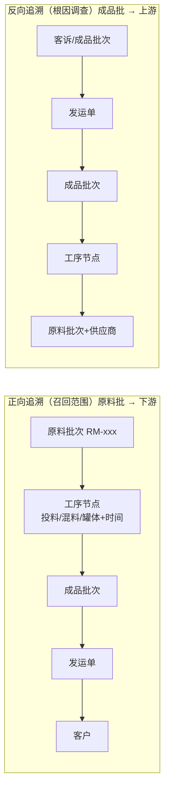
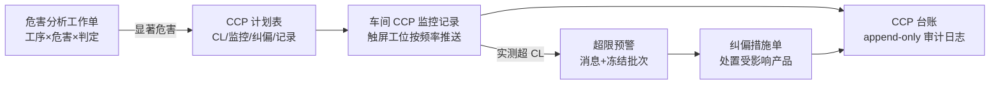

# W6 调研底稿 Part 2：食品制造行业特性（批次追溯/效期/HACCP/AQL/条码/报表）

> 研究日期：2026-10-01 | 深度：Thorough | 用途：W6 轮食品行业 ERP/MES 产品规划（NocoBase 二开）
> 调研方法：DuckDuckGo（chrome-devtools）中英双语检索 + 逐页全文取证（samr.gov.cn / openstd / gov.cn / shanghai.gov.cn / nhc.gov.cn / SAP Help / Odoo docs / GS1 ref 等一手来源优先）

---

## 批次追溯（监管依据 + 追溯链全景图交互形态建议）

### 1.1 正反向追溯定义（业界共识）

| 方向 | 定义 | 触发场景 | 业界术语 |
|---|---|---|---|
| 正向追溯（forward trace） | 从任一原料批次出发，找到所有使用了该原料的中间品/成品批次及其发运去向 | 原料出问题时的召回范围计算 | trace-forward / where-used downstream |
| 反向追溯（backward trace） | 从任一成品批次（或客诉对象）出发，回溯它用到的全部原料批次、工序、供应商 | 客户投诉、质量问题的根因调查 | trace-back / genealogy |
| 内部追溯（internal traceability） | 厂内中间品、混料（blend）、分批（split）、返工（rework）的谱系保全 | 拆并批后的链路完整性 | batch genealogy |

来源：FlowSense《Lot Traceability: Forward & Backward Tracking Complete Guide》（2026-01-23）明确给出三向定义："Forward: track from any raw material lot to all products containing that material. Essential for recall when a raw material problem is discovered. Backward: track from any finished product back to all raw materials used. Essential for investigating customer complaints"；iFactoryApp《Batch Genealogy and Traceability》进一步把内部谱系定义为"including every split, merge, rework, and quality event in between"（https://www.flowsense.solutions/blog/lot-traceability-process-manufacturing 、https://ifactoryapp.com/article/batch-genealogy-traceability-lot-to-shipment ）。

**召回范围 = 正向追溯的终点集合**：iFactoryApp 给出业界标准链形态——原料批（RM-4471-A）→ 工序/罐（MIX-03 · 14:22）→ 成品批（B-24-1149）→ 发运（S-1234 → 3 customers），"One suspect raw lot → all affected shipments in one query"；监管与客户期望追溯在"hours, not days"内完成（同上 URL）。

### 1.2 国内监管依据（条款原文均取自 samr.gov.cn 官方全文）

**《食品安全法》（2021 修正）关键条款**（原文见 https://www.samr.gov.cn/zw/zfxxgk/fdzdgknr/fgs/art/2023/art_6bff4ef87291497fa72949e1fc88efb5.html ）：

| 条款 | 要求要点 | 对系统的直接映射 |
|---|---|---|
| **第 42 条** | "国家建立食品安全全程追溯制度……食品生产经营者应当依照本法的规定，建立食品安全追溯体系，保证食品可追溯。国家鼓励……采用信息化手段采集、留存生产经营信息" | 追溯体系的法定总依据；信息化采集是鼓励项 |
| 第 46 条 | 生产企四类过程控制：原料采购/验收/投料控制、生产关键环节控制、原料/半成品/成品出厂检验控制、运输交付控制 | HACCP 式过程控制的法定化 |
| **第 50 条** | 进货查验记录制度：名称、规格、数量、生产日期或生产批号、保质期、进货日期、供货者名称/地址/联系方式；凭证保存 ≥ 保质期满后 6 个月（无保质期 ≥ 2 年） | 来料批次台账字段清单 + 记录保存期限 |
| **第 51 条** | 出厂检验记录制度：名称、规格、数量、生产日期或生产批号、保质期、**检验合格证号**、销售日期、购货者名称/地址/联系方式 | 出厂检验报告 + 销售流向（反向追溯下游锚点） |
| 第 52 条 | "食品生产者应当……进行检验，检验合格后方可出厂或者销售" | 检验放行闸门（hold→pass→release） |
| **第 63 条** | 食品召回制度：发现不符合标准或可能危害健康 → 立即停止生产、召回已上市食品、通知相关经营者和消费者、记录召回和通知情况；召回食品无害化处理/销毁，防止回流；向县级监管部门报告 | 召回工作流（发起→范围计算→客户通知→处理→上报）的状态机依据 |
| 第 98 条 | 进口商记录制度：名称、规格、数量、生产日期、生产或进口批号、保质期、境外出口商和购货者信息、交货日期 | 进口原料批次台账 |

**部门规章**：《食品召回管理办法》（国家市场监督管理总局令第 122 号，2026 年国务院公报载录，https://www.gov.cn/gongbao/2026/issue_12686/202604/content_7066099.html ）——召回分级、时限、报告的实施细则依据。

**追溯类国家标准（均经 openstd/std.samr 官方页面核实）**：

| 标准号 | 名称 | 状态/日期 | 与本产品关系 |
|---|---|---|---|
| **GB/T 37029-2018** | 《食品追溯 信息记录要求》（Food traceability—Requirements for information recording） | 现行，2018-12-28 发布 / 2019-07-01 实施（https://openstd.samr.gov.cn/bzgk/std/newGbInfo?hcno=15516C1DE22A7ECECC46401AA2FE5DC4 ） | 规定生产/物流/销售三环节的追溯记录要素：进货查验（量、保质期、生产日期或批号）、运输工具标识、仓储（仓库类型、入库存货时间）、销售环节进货查验与退货记录；电子记录签名符合 GB/T 25064（antpedia 解读：https://www.antpedia.com/standard/2008220014-10.html ） |
| GB/T 43260-2023 | 《进口冷链食品追溯 追溯信息管理要求》 | 现行 | 冷链细分（antpedia 相似标准清单，同上） |
| **GB/T 44368-2024** | 《进口冷链食品追溯 追溯系统数据交换应用规范》 | 现行（https://openstd.samr.gov.cn/bzgk/std/newGbInfo?hcno=39B629ECC7405D6E318E14324EC04A17 ） | 追溯系统间数据交换的公开国标 |
| GB/T 38156-2019 | 《重要产品追溯 交易记录总体要求》 | 现行 | 交易环节记录 |

**注意**：用户提示中的"GB 31658"为兽药残留检测标准、"GB/T 37029"核实无误（正确名称是《食品追溯 **信息记录要求**》，非"信息记录规范"）。另有原食药总局《婴幼儿配方乳粉生产企业食品安全追溯信息记录规范》等行业细分记录规范先例（antpedia 页面载录）。

### 1.3 追溯链全景图交互形态——业界做法证据

| 厂商/来源 | 交互形态 | 关键证据 |
|---|---|---|
| **SAP GBT（Global Batch Traceability，S/4HANA 版）官方文档** | **"以表或图形的形式显示全球批次跟踪网络"**；**"您可以自下而上或自上而下分析网络"**；网络给出"受影响批次或处理单元的核心概览"；支持一次运行分析多个批次；召回场景强调"及时遵守法律报表时间表，将成本和风险敞口降至最低" | SAP Help Portal 中文官方文档（https://help.sap.com/docs/SAP_GLOBAL_BATCH_TRACEABILITY_ON_SAP_S_4HANA/041b68cbcb4e404da47a2da1e827a4f7/6ccec68e48cb4c70b7ff3a25c5bfa0ff.html ） |
| FlowSense（过程制造 ERP） | "Visual **genealogy trees** showing material flow"——可视化谱系树；配正反向查询入口（where did this material go / where did this product come from） | https://www.flowsense.solutions/blog/lot-traceability-process-manufacturing |
| iFactory AI（食品批次谱系） | **垂直四环链路图（TRACE CHAIN）**：原料批 → 工序/罐（含时间戳 14:22）→ 成品批 → 发运（→ N 客户）；双向查询；审计级归属（每条谱系边携带源系统、操作员 ID、时间戳） | https://ifactoryapp.com/article/batch-genealogy-traceability-lot-to-shipment |
| AvanSaber/inventorypath（图数据库实践） | 批次谱系天然是 **DAG（有向无环图）**：节点=批次，边="consumed into"，边带数量+时间戳；正/反向追溯=图遍历；**"Bound the blast radius in the query"——查询即召回波及范围**；谱系边 append-only、防篡改（对标 21 CFR Part 11 / FSMA 204） | https://www.inventorypath.com/lot-genealogy-at-scale-graph-database-patterns-for-fda-21-cfr-part-11-and-fsma-204-traceability/ |
| 用友（YonSuite 食品行业公开案例） | 批次"完整生产履历"一键调取（原料来源牧场+日期→杀菌线工艺参数→包装材料供应商）；质量事故追溯时间 8 小时 → **12 分钟**；召回演练数字化：每季度模拟，3 万箱 8 仓库从指令到隔离 **28 分钟** | https://www.yonsuite.com/infoNew/22604097939195.html |
| Odoo 19（开源参照） | Lot/Serial 追踪 + Traceability smart button → Traceability Report（引用单据/产品/批号）；支持 GS1 条码打印批次标签 | https://www.odoo.com/documentation/19.0/applications/inventory_and_mrp/inventory/product_management/product_tracking/lots.html |

**召回演练（mock recall）业界通行做法**（FlowSense + 用友双源印证）：定期（用友案例为每季度）执行模拟召回；演练内容 = 从一个可疑批次出发完成正/反向追溯 → 计算受影响批次与发运清单 → 生成客户通知清单 → 度量全程耗时（业界目标小时级，先进者分钟级）；记录演练结果作为合规证据（https://www.flowsense.solutions/blog/lot-traceability-process-manufacturing 、https://www.yonsuite.com/infoNew/22604097939195.html ）。

### 1.4 追溯链全景图交互形态建议（本产品落地结论）

**建议：分层链路图（layered DAG）为主形态，图谱自由布局为可选视图，不做树形唯一展开。** 理由与设计要点：

1. **布局**：采用"泳道式分层 DAG"——横轴（或纵轴）固定为链路阶段：供应商/原料批 → 收货 → 工序（投料、混合、包装，节点带时间戳与设备/罐号）→ 成品批 → 入库/库位 → 发运 → 客户。同一层内多个批次横向排开，分裂/合并以多条边自然表达。这与 iFactoryApp 的垂直四环链、SAP GBT 的"跟踪网络"一致，而**不要**用纯树形（tree）——分批/混料会让树形重复展开同一节点，DAG 才是准确模型（AvanSaber：批次谱系天然是 DAG，https://www.inventorypath.com/lot-genealogy-at-scale-graph-database-patterns-for-fda-21-cfr-part-11-and-fsma-204-traceability/ ）。
2. **正反向切换**：顶部一个 Segmented Control（正向追溯 ⇄ 反向追溯），输入锚点不变，仅翻转遍历方向——对应 SAP GBT"自上而下/自下而上分析网络"与 FlowSense 双向查询（两个 URL 同上）。切换后节点按方向重新分层、锚点节点高亮居中。
3. **召回范围高亮（波及半径）**：正向模式下提供"召回范围"开关——从锚点批次沿边遍历，命中路径整链高亮（红/橙按批次状态），未受影响节点降灰；侧栏同时给出**受影响清单**（成品批次数、库存数、已发运数、客户清单）= "bound the blast radius in the query" 的交互化（同上 inventorypath URL）。
4. **节点与边的信息密度**：节点卡=批次号+物料名+数量+状态（合格/待检/冻结/召回）；边=转换事件（投料/产出/移库/发运）+数量+时间戳；点开节点显示该批次全履历（检验单、CCP 记录、出入库流水）。审计要求：谱系边记录操作人与时间，只增不改（append-only 审计日志）——对应 21 CFR Part 11 精神与 GB/T 37029 电子记录要求。
5. **配套动作**：链路图工具栏直接挂「发起召回演练」——按当前高亮范围生成演练报告（受影响批次/客户通知清单/耗时）；召回状态在节点上以徽标呈现（对应《食品安全法》第 63 条工作流）。

## 效期管理（三级预警阈值建议 + 效期看板布局）

### 2.1 日期模型：保质期天数 vs 到期日

业界标准做法（Odoo 19 官方文档一手证据，https://www.odoo.com/documentation/19.0/applications/inventory_and_mrp/inventory/product_management/product_tracking/expiration_dates.html ）：产品级配置**四个天数偏移**，入库/生产时自动计算日期：

| 日期 | Odoo 定义 | 建议 |
|---|---|---|
| Expiration Date（到期日） | 收货/生产后 N 天，货物危险不可用 | 批次必填，红区 |
| Best Before（最佳赏味期） | 到期日前 N 天，开始劣化但无危险 | 建议采纳（对应 GS1 AI(15)） |
| Removal Date（下架日） | 到期日前 N 天，应从库存移除 | 建议采纳（对应 GS1 AI(16) SELL BY） |
| Alert Date（预警日） | 到期日前 N 天，触发预警 | 三级色的"黄"起点 |

国内法定口径：生产日期与保质期是《食品安全法》第 50/51 条记录的必备字段；《预包装食品标签通则》体系下保质期=预包装食品在标签指明贮存条件下保持品质的期限。**结论：批次实体存"生产日期 + 保质期（天数或至某日期）"，系统统一推导出到期日/下架日/预警日三个衍生日期。**

### 2.2 临期界定：监管分档 vs ERP 三级色

**监管口径（流通/销售环节）——按保质期长度分档**（食品伙伴网四地汇总，http://info.foodmate.net/reading/show-32.html ）：

| 保质期区间 | 北京/上海/广州临期界定 |
|---|---|
| ≥ 1 年 | 期满前 **45 天** |
| 半年 ~ 1 年 | 期满前 **20 天** |
| 90 天 ~ 半年 | 期满前 **15 天** |
| 30 ~ 90 天 | 期满前 **10 天** |
| 15/16 ~ 30 天 | 期满前 **5 天** |
| < 15 天 | 期满前 1~4 天（北京）/前 2 天（上海） |

（天津简化为 ≥30 天→前 7 天、<30 天→前 2 天；广州另要求"当天到期食品消费提示"。）

**建议双轨制**：
- **产品级"临期阈值"字段**：默认按监管分档表自动推导（可编辑），到达即触发临期预警/专区标识——满足流通合规语义；
- **看板交互三级色**：>90 天绿 / 30–90 天黄 / <30 天红 作为**默认视觉分级**（与既有 UI 规范一致），但**红色判定以产品级临期阈值/到期日为准**（否则 7 天保质期的酸奶在入库第 2 天就应黄牌，固定 30 天阈值对短保品类失真）。即：颜色= min(固定天数带, 监管分档阈值) 的孰早原则。

### 2.3 效期看板布局建议

- **主视图：效期矩阵热力图**——行=品类（或库区/库位），列=剩余天数分桶（>90 / 90–30 / 30–临期阈值 / <临期阈值 / 已过期），单元格=批次数量与件数，色块绿→黄→橙→红；点单元格下钻批次清单（批号、库位、数量、生产日期、到期日、货主）。这与"按库位/品类/批次的效期矩阵"诉求一致。
- **顶部 KPI 条**：临期批次总数、临期库存金额、本周到期、本月到期、已过期待处置。
- **FEFO 拣货指引**：出库单进入拣货环节时，按"最早到期日优先"自动排序并给推荐批次（本产品已有 FEFO，补一个"临期优先通道"：临期批次可配置优先出库/专区提示）。
- 触达：临期预警按日批扫描，消息推送仓储/销售角色（参照 Odoo Alert Date 语义）。

## HACCP 数字化承载（危害分析表/CCP 监控/预警/台账）

### 3.1 标准依据

- **GB/T 27341-2009《危害分析与关键控制点（HACCP）体系 食品生产企业通用要求》**（现行；openstd 官方页：https://openstd.samr.gov.cn/bzgk/std/newGbInfo?hcno=FAC276BE3CC48070156D8BA81E554D5D ；公开全文 PDF（扫描版）：http://www.foodtest.cn/public/uploads/file/20200302/GBT27341-2009%20%E5%8D%B1%E5%AE%B3%E5%88%86%E6%9E%90%E4%B8%8E%E5%85%B3%E9%94%AE%E6%8E%A7%E5%88%B6%E7%82%B9(HACCP)%E4%BD%93%E7%B3%BB%20%E9%A3%9F%E5%93%81%E7%94%9F%E4%BA%A7%E4%BC%81%E4%B8%9A%E9%80%9A%E7%94%A8%E8%A6%81%E6%B1%82_202003022049561238.pdf ）
- **GB 14881-2025《食品安全国家标准 食品生产通用卫生规范》**：**2025-09-02 发布，2026-09-02 起实施，替代 GB 14881-2013**（当前已生效约一个月，W6 方案应直接对齐新版）。新版变化含：寄生虫控制、致敏物质管理、**新增 HACCP 原理及其应用指南（资料性附录）**、微生物监控完善；并给出**"监控程序"定义——按预设方式和参数进行观察或测定以评估控制环节是否受控，要求明确监控点位、频次、指标、限值和异常处置流程**（食品伙伴网核心知识点解读：https://www.foodmate.net/zhiliang/guanli/173787.html ；新旧比对：https://qms.foodmate.net/news/show.php?itemid=173335 ）
- 国际权威背书：FAO《Introduction to HACCP》中文版——"HACCP 的 7 项原则 + 12 个步骤……处理从初级生产到终端消费全食品链上的生物性、化学性和物理性危害……重点是对重大危害采取控制措施，而不是依靠对终产品的检验和测试"（https://www.fao.org/good-hygiene-practices-haccp-toolbox/haccp/introduction-to-haccp/zh ）
- 落地细节（纠偏/验证）：《HACCP 体系建立全攻略》：监视结果超出关键限值 → 迅速纠偏：对不合格品**准确识别潜在不安全产品数量**，按情况报废/返工/降级/重新包装；对生产过程**及时调整参数**确保重新受控；措施须**预先在《HACCP 计划表》中规定**。验证=定期检查危害分析全面性、CCP 设置合理性、CL 科学性、监控有效性 + 监控仪器校准 + 记录真实性审核（https://www.foodmate.net/zhiliang/haccp/173295.html ）

### 3.2 数字化承载设计（三件套）

1. **危害分析工作单（Hazard Analysis Worksheet）**：行=工艺步骤；列=本步潜在危害（生物/化学/物理三分类，FAO）、危害是否显著（判定依据）、预防措施、是否 CCP（判定树 Q1–Q4 结论）。形态=可配置表格实体，版本化管理（危害分析变更留痕）。
2. **CCP 计划表 + 监控记录**：CCP 主数据=工序点位 + 关键限值 CL（上下限/目标值）+ 监控方式（观察/测量）+ 监控频率（如每 2h/每批）+ 记录人岗位 + 纠偏措施预案。执行层：按频率自动生成 CCP 监控任务（车间触屏终端弹出，录入实测值）；**实测值越出 CL 即时预警**（对应 GB 14881-2025"监控程序"定义的完整要素：点位、频次、指标、限值、异常处置）。
3. **纠偏与台账**：超限触发纠偏单（隔离/返工/报废决策 + 受影响批次数量）——直接联动批次冻结；CCP 记录台账只增不改（append-only），每条记录携带操作员、时间戳、原始值——对应"记录台账不可篡改/审计日志"诉求与 21 CFR Part 11 同源要求（AvanSaber：https://www.inventorypath.com/lot-genealogy-at-scale-graph-database-patterns-for-fda-21-cfr-part-11-and-fsma-204-traceability/ ）。
4. **体系审核清单**：内审/管理评审作为检查表（checklist）实体 + 周期任务；验证程序含仪器校准计划（上海指引同样要求实验室仪器"按规定定期进行计量、检定及校准"，https://www.shanghai.gov.cn/gwk/search/content/2c984a729863eb4501987407a31a28fc ）。

## AQL 与检验工作台关系（一段话确认）

GB/T 2828.1（已实现的 15 段抽样表）在检验工作台中的位置是**"任务执行中段的样本量与判定引擎"**：检验任务生成后（来料 IQC / 成品 FQC / 过程巡检，由质检控制点按单据自动或手动创建——Odoo 的 QCP 模式：质量控制点按规则自动在收货/工单上生成 quality check，类型含 Pass-Fail、Measure 实测录入、Worksheet 模板填写，https://www.odoo.com/documentation/19.0/applications/inventory_and_mrp/quality/quality_management/quality_checks.html ），流程为：**检验任务 → 按批量 N 与 AQL（检验水平 IL + 接收质量限）查 15 段表得样本量字码与 Ac/Re → 抽样并逐项判定（合格/不合格/实测值）→ 依据 Ac/Re 得出批次接收/拒收结论 → 联动批次放行或冻结**（对应《食品安全法》第 52 条"检验合格后方可出厂"与上海指引"复核与放行"环节，https://www.shanghai.gov.cn/gwk/search/content/2c984a729863eb4501987407a31a28fc ）。即 AQL 表不产生任务、不做放行决策，只负责"定样本量 + 给判定准则"。

## 条码/扫码体系（规格选型 + 开源方案清单）

### 5.1 规格选型（以 GS1 官方应用标识符清单为准，https://ref.gs1.org/ai/ ）

| 码制 | 用途 | 本产品建议 |
|---|---|---|
| **GS1-128**（Code 128 子集 + AI） | **物流/批次标签主力**：一个符号内编入 GTIN+批号+日期 | 收货/库位/成品箱标签默认码制 |
| EAN-13 / UPC-A | 零售单品（GTIN） | 产品主数据字段 + 标签支持 |
| QR / DataMatrix | 高密度、可含 URL（C 端溯源码） | 消费者扫码溯源页（一批一码/一件一码） |

食品批次标签核心 AI（GS1 官方中文清单原文，同 ref.gs1.org/ai/）：
- **AI(01) GTIN**、**AI(10) 批号 BATCH/LOT**、**AI(11) 生产日期 YYMMDD**、AI(13) 包装日期、AI(15) 保质期 BEST BEFORE、AI(16) 停止销售期 SELL BY、**AI(17) 有效期 USE BY/EXPIRY**、AI(21) 系列号、AI(310n) 净重 kg、AI(00) SSCC（物流单元）。
- **最小集建议：01+10+11+17**（是什么+哪批+何时产+何时到期）——即食品批次条码四要素；整托加 AI(00) SSCC。
- Odoo 19 原生支持批次/序列号 GS1 条码打印（"Print GS1 barcodes for lots and serial numbers"，https://www.odoo.com/documentation/19.0/applications/inventory_and_mrp/inventory/product_management/product_tracking/lots.html ）。

### 5.2 扫码场景

工位扫码报工（工序完工扫批次码→自动建立谱系边）、收货扫码（供应商批次登记）、库位/批次扫码移库与盘点（扫码+数量确认）、发运扫码（出库校验 FEFO/临期拦截）。追溯码颗粒度参照国家冷链平台规程："颗粒度最低到一批一码，有条件的可以到一件一码（一物一码），没有贴码的需要建立每个追溯单元的 URL"（国家卫健委《重点冷链食品追溯管理数据对接规程》PDF，https://www.nhc.gov.cn/cms-search/downFiles/7d9557a882e54982ba7e2becfaf66ad5.pdf ）。

### 5.3 开源方案清单

| 方案 | 定位 | 关键事实 | 来源 |
|---|---|---|---|
| **bwip-js** | JS 条码生成库（BWIPP 的纯 JS 移植） | 当前版本 **4.11.4（2026-08-19）**，覆盖 **100+ 条码类型**（含 GS1-128/EAN-13/QR/DataMatrix）；输出 PNG（Node）、canvas（浏览器）、SVG（全平台）；支持 Browser/Node/React/Electron/CLI | https://github.com/metafloor/bwip-js |
| JsBarcode | 轻量一维码库（EAN/UPC/Code128/CODE39） | 浏览器+Node，SVG/canvas 输出；适合简单一维码场景（作为 bwip-js 的轻量备选） | （npm lindell/JsBarcode，选型对照用） |
| **Labelary** | ZPL 在线渲染/预览 + **REST API（ZPL→PNG/PDF、条码生成 API）** | 官网明示"label viewer + Label API：Access to the Labelary ZPL engine via a simple RESTful API"；含 ZPL 入门与在线生成器 | http://labelary.com/ |
| Zebra ZPL | 热敏打印事实标准指令语言 | 标签模板用 ZPL 编写后可经 Labelary 预览、直发 Zebra 打印机 | 同上 |
| Odoo Barcode（Enterprise） | 参照交互（PDA/键盘导航扫码流） | 商业模块，交互范式可参考，不可直接复用 | （odoo.com 产品页） |
| ERPNext 条码 | 参照数据模型（Item.barcode 多码制） | 开源可读源码 | docs.frappe.io |

**结论**：前端生成用 **bwip-js**（活跃维护、码制最全、GS1-128/QR 一个库全覆盖，SVG 输出适配 NocoBase 前端打印）；标签模板走 **ZPL + Labelary**（在线设计预览 + REST 渲染 PNG/PDF，直连 Zebra 类热敏打印机；Browser print 中间件可选）；C 端溯源码用 **QR 含追溯 URL**（对齐冷链国家平台"每个追溯单元的 URL"口径）。

## 食品特有报表（出厂检验报告要素 + 监管上报公开标准情况）

### 6.1 出厂检验报告（合格证）要素——权威清单

上海市市场监管局《上海市食品生产企业出厂检验管理合规指引》（沪市监食监〔2025〕195 号，2025-08-04 公开，https://www.shanghai.gov.cn/gwk/search/content/2c984a729863eb4501987407a31a28fc ）原文规定：

- **"检验报告应载明：产品名称、规格、数量、生产日期或批号、保质期、检验依据、结论、报告人及审核人等信息"**（九要素）；
- 原始记录需含：样品名称、批次、检验日期、检验方法、操作人员、数据结果；
- 检验流程四步：抽样（记录批次、抽样地点、抽样人）→ 检验 → 记录与报告 → **复核与放行**（复核人审核确认合格后方可放行）；
- 检验项目七类：感官（色泽/气味/形态）、理化（水分/灰分/酸价/过氧化值/蛋白质）、微生物（菌落总数/大肠菌群/致病菌）、污染物（铅镉汞砷）、农兽残、食品添加剂、制度规定的其他项目；净含量与感官等易受过程影响的指标检验频次应高于其他项目；
- 记录保存 ≥ 保质期满后 6 个月（无保质期 ≥ 2 年，与《食品安全法》第 50 条一致）；
- **留样管理**：每批次成品留样、专用留样室与检验区物理隔离；保存期 <2 年保质期的≥保质期、>2 年的不宜少于 2 年；期满处置并记录；
- 每年至少 1 次能力验证（实验室间比对）；委托检验须 CMA/CNAS 资质范围覆盖。

**出厂检验报告模板字段建议**（映射到本产品打印模板）：产品名称/规格/数量 + 生产日期或批号（关联批次实体）+ 保质期 + 检验依据（执行标准号）+ 检验项目明细表（项目/标准值/实测值/单项判定）+ 结论（合格/不合格）+ 报告人 + 审核人 + 签发日期 + 检验报告编号（= 第 51 条"检验合格证号"）。**批次质量档案**=批次实体聚合页：出厂检验报告 + 来料检验 + CCP 监控记录 + 留样记录 + 出入库流水的组合视图。

### 6.2 监管上报接口的公开情况

| 平台/事项 | 公开情况 | 证据 |
|---|---|---|
| **国家进口冷链食品追溯平台（重点冷链）** | **对接规程全文公开**（数据元+接口+SDK）：入境检验检疫证明信息（单号/口岸/日期/原产国/报检重量/发货人/收货人/规格/生产批次号）、省际流转信息（流入流出地、实际重量、时间）、追溯码颗粒度（一批一码最低/一件一码/无码须 URL）；接口 Http Basic 认证（Base64 clientId:secret），官方 Java SDK 开源在 Gitee（gitee.com/pid21/data-report-sdk-java）；数据字典（省市/HS/口岸/国别编码）平台内下载 | 国家卫健委官网 PDF：https://www.nhc.gov.cn/cms-search/downFiles/7d9557a882e54982ba7e2becfaf66ad5.pdf |
| 追溯系统间数据交换 | 国标 GB/T 44368-2024《进口冷链食品追溯 追溯系统数据交换应用规范》公开（openstd 可查） | https://openstd.samr.gov.cn/bzgk/std/newGbInfo?hcno=39B629ECC7405D6E318E14324EC04A17 |
| 食品生产许可电子化（SC） | 各省市场监管系统网办，**无全国统一公开机器接口标准**（以省端政务服务网为准）——本产品不做直连，出报告/台账供人工上报即可 | （检索未见国家级公开 API 标准） |
| 北京/上海食品安全信息追溯平台 | 地方平台（上海食品安全信息追溯平台对重点品种有企业端申报义务），具体接口以地方市场监管发布为准；GB/T 37029/GB/T 38156 提供记录要素层公开标准 | http://law.foodmate.net/special/202109/16.html （食品伙伴网食品追溯法规汇编，更新至 2026-04） |

**结论**：唯一有完整公开机器可读对接规范的是冷链国家平台（规程+SDK+编码字典齐全）；对一般食品制造客户，系统的监管合规输出以**合规台账与法定要素报告**（进货查验记录、出厂检验记录/报告、CCP 台账、召回记录）为主，预留可配置的数据导出/上报通道。

## 证据清单（URL + 关键引文）

| # | 来源 | 类型 | 关键引文/事实 |
|---|---|---|---|
| 1 | https://www.samr.gov.cn/zw/zfxxgk/fdzdgknr/fgs/art/2023/art_6bff4ef87291497fa72949e1fc88efb5.html | 一手·市场监管总局《食品安全法》全文 | 第 42 条"国家建立食品安全全程追溯制度"；第 63 条召回四动作；第 50/51 条记录要素与保存期；第 52 条"检验合格后方可出厂"；第 98 条进口记录 |
| 2 | https://www.gov.cn/gongbao/2026/issue_12686/202604/content_7066099.html | 一手·国务院公报 | 《食品召回管理办法》（总局令第 122 号） |
| 3 | https://openstd.samr.gov.cn/bzgk/std/newGbInfo?hcno=15516C1DE22A7ECECC46401AA2FE5DC4 | 一手·国标全文公开系统 | GB/T 37029-2018《食品追溯 信息记录要求》2019-07-01 实施、现行 |
| 4 | https://www.antpedia.com/standard/2008220014-10.html | 二手·标准解读 | GB/T 37029 三环节记录要素（生产/物流/销售）、电子签名 GB/T 25064 |
| 5 | https://openstd.samr.gov.cn/bzgk/std/newGbInfo?hcno=FAC276BE3CC48070156D8BA81E554D5D | 一手·国标 | GB/T 27341-2009 HACCP 体系 通用要求，现行 |
| 6 | https://www.fao.org/good-hygiene-practices-haccp-toolbox/haccp/introduction-to-haccp/zh | 一手·FAO 中文 | "7 项原则 + 12 个步骤"；生物/化学/物理危害；重在重大危害控制而非终产品检验 |
| 7 | https://www.foodmate.net/zhiliang/guanli/173787.html | 二手·解读 | GB 14881-2025 于 2025-09-02 发布、2026-09-02 实施替代 2013 版；"监控程序"=点位/频次/指标/限值/异常处置；新增 HACCP 指南附录 |
| 8 | https://www.foodmate.net/zhiliang/haccp/173295.html | 二手·实操 | 超出 CL 纠偏：识别不安全品数量→报废/返工/降级/重新包装；纠偏预案预先写入《HACCP 计划表》；验证含仪器校准 |
| 9 | https://help.sap.com/docs/SAP_GLOBAL_BATCH_TRACEABILITY_ON_SAP_S_4HANA/041b68cbcb4e404da47a2da1e827a4f7/6ccec68e48cb4c70b7ff3a25c5bfa0ff.html | 一手·SAP 官方 | "以表或图形的形式显示全球批次跟踪网络"；"自下而上或自上而下分析网络"；召回时"遵守法律报表时间表" |
| 10 | https://www.flowsense.solutions/blog/lot-traceability-process-manufacturing | 厂商方法论 | 正/反/内部三向定义；"Visual genealogy trees"；mock recall 定期演练 |
| 11 | https://ifactoryapp.com/article/batch-genealogy-traceability-lot-to-shipment | 厂商方法论 | 四环垂直链（原料批→工序罐+时间→成品批→发运→客户）；审计级归属（源系统/操作员/时间戳）；"Hours not days" |
| 12 | https://www.inventorypath.com/lot-genealogy-at-scale-graph-database-patterns-for-fda-21-cfr-part-11-and-fsma-204-traceability/ | 技术实践 | 批次谱系=DAG（节点批次/边消耗+数量+时间戳）；"Bound the blast radius in the query"；append-only 防篡改 |
| 13 | https://www.yonsuite.com/infoNew/22604097939195.html | 厂商案例（营销口径，数字供参考） | 追溯 8h→12min；季度召回演练 3 万箱 28 分钟隔离；生产履历一键调取 |
| 14 | https://www.odoo.com/documentation/19.0/applications/inventory_and_mrp/inventory/product_management/product_tracking/lots.html | 一手·Odoo 文档 | Lot/Serial 追踪；Traceability Report；GS1 条码打印 |
| 15 | https://www.odoo.com/documentation/19.0/applications/inventory_and_mrp/inventory/product_management/product_tracking/expiration_dates.html | 一手·Odoo 文档 | 四段效期：Expiration/Best Before/Removal/Alert（天数偏移自动算） |
| 16 | https://www.odoo.com/documentation/19.0/applications/inventory_and_mrp/quality/quality_management/quality_checks.html | 一手·Odoo 文档 | QCP 自动生成质检任务；Pass-Fail/Measure/Worksheet 三型 |
| 17 | http://info.foodmate.net/reading/show-32.html | 二手·地方规整汇编 | 北京/上海/广州/天津临期界定分档（45/20/15/10/5/2 天）；专区标识（黄底蓝字明示牌） |
| 18 | https://www.shanghai.gov.cn/gwk/search/content/2c984a729863eb4501987407a31a28fc | 一手·上海市市场监管局 | 《出厂检验管理合规指引》九要素、四步流程、留样、保存期、能力验证 |
| 19 | https://ref.gs1.org/ai/ | 一手·GS1 官方（中文） | AI 清单：00 SSCC/01 GTIN/10 批号/11 生产日期/15 保质期/16 SELL BY/17 USE BY/21 序列号/310n 净重 |
| 20 | https://github.com/metafloor/bwip-js | 一手·开源仓库 | v4.11.4（2026-08-19）；100+ 码制；PNG/canvas/SVG；Browser/Node/CLI |
| 21 | http://labelary.com/ | 一手·服务官网 | ZPL viewer + REST API（ZPL→PNG/PDF、条码 API）；ZPL 入门 |
| 22 | https://www.nhc.gov.cn/cms-search/downFiles/7d9557a882e54982ba7e2becfaf66ad5.pdf | 一手·国家卫健委 PDF | 《重点冷链食品追溯管理数据对接规程》：数据元、Http Basic、Java SDK（gitee.com/pid21/data-report-sdk-java）、一批一码/一件一码 |
| 23 | https://openstd.samr.gov.cn/bzgk/std/newGbInfo?hcno=39B629ECC7405D6E318E14324EC04A17 | 一手·国标 | GB/T 44368-2024 进口冷链追溯系统数据交换应用规范 |
| 24 | http://law.foodmate.net/special/202109/16.html | 二手·法规汇编 | 食品、食用农产品追溯相关法规清单（持续更新至 2026-04） |

**方法学说明**：DuckDuckGo（lite 界面，chrome-devtools 逐页导航 + evaluate_script 全文提取）中英双语检索约 14 组关键词；优先一手来源（samr/openstd/gov.cn/shanghai.gov.cn/nhc.gov.cn/SAP Help/Odoo docs/GS1/FAO/GitHub）共 24 条证据；扫描版 PDF（GB/T 27341）无法文本提取时以官方元数据页 + 权威解读交叉印证；用友 YonSuite 案例数字为厂商营销口径，采用时已标注"供参考"。
