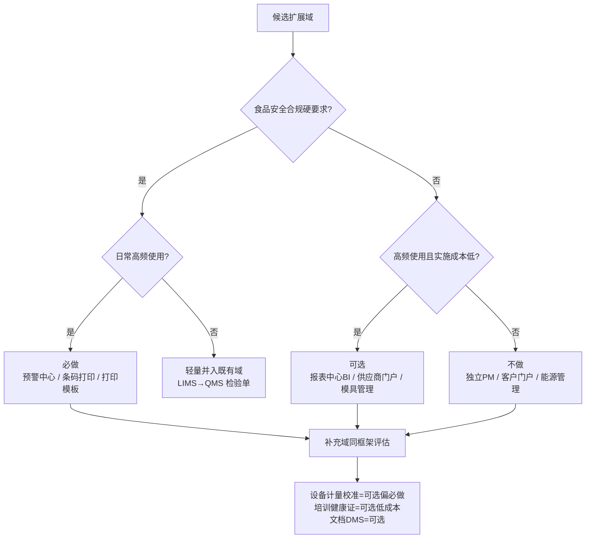

# W6 扩展域商业化筛选调研（子任务 E / pt3）

> 调研日期：2026-10-01 | 来源：17 个来源（Odoo/ERPNext/SENAITE/Metabase/NocoBase/Paperless-ngx 官方文档 + GB 14881-2025 合规解读 + 生态对比） | 深度：Thorough

平台背景：基于 NocoBase 二开的食品制造一体化系统（ERP+MES+QMS+WMS+审批+移动端 AI），已有审批流设计器、看板/甘特/日历、统计卡、AQL、FEFO、MPS/MRP。目标客户为几十人规模中小食品厂，商业化整套交付。本报告对 10 个候选扩展域逐一给出功能边界、必要性判定与开源标杆证据，并补充 3 个我们未列但值得考虑的候选。

**合规时间点提醒**：GB 14881-2025《食品生产通用卫生规范》已于 2026-09-02 正式实施，全面替代 2013 版（[食品伙伴网标准下载页](https://down.foodmate.net/standard/sort/3/166972.html)、[知乎解读](https://zhuanlan.zhihu.com/p/1969824407741536241)）。新版对供应商管理、人员培训、记录留存的数字化要求趋严，是本轮扩展域筛选最强的付费驱动力。

---

## 扩展域筛选总表

| 候选域 | 功能边界一句话 | 必要性 | 开源标杆 | 理由（结合食品制造商业化） |
|---|---|---|---|---|
| 1. 预警中心 | 库存效期/供应商资质/账期/质量异常的统一规则配置 + 定时扫描 + 预警列表（已读/处理状态）+ 多渠道触达 | **必做** | ERPNext Notification、Odoo Alert Date | 食品合规（效期/资质到期）+ 现金流（账期）双刚需；两家头部开源 ERP 均有对应机制；NocoBase 实现成本低，是八域数据的"收口层" |
| 2. 报表中心 | 经营报表模板（内置）+ 可选外挂开源 BI（iframe/组件嵌入 + 数据源直连） | **可选** | Metabase、NocoBase plugin-data-visualization | 内置统计卡+chart block 已覆盖 80% 交付场景；Metabase OSS 版嵌入认证受限（SSO 付费），作为高阶选项交付 |
| 3. 实验室 LIMS | 样品登记/检测流程/仪器对接/检验报告的第三方实验室级全流程 | **不做**（独立 LIMS） | SENAITE | SENAITE 面向商业检测实验室（计费/客户门户/11 角色），几十人食品厂化验室 2-5 人、检验项目固定；轻量检验单已并入我方 QMS（IQC+AQL） |
| 4. 项目管理 | 任务/甘特/工时/敏捷迭代的通用项目协作 | **不做** | OpenProject、Plane | 非项目型制造，日常是"生产任务+改善事项"；已有看板/甘特视图+审批流+移动端任务可承载；引独立 PM 应用徒增账号与培训成本 |
| 5. 供应商门户 | 供应商自助登录：资质证照上传/对账/送货预约 | **可选**（资质台账本身必做） | Odoo Portal（原生）+ 生态第三方 Vendor Portal 模块 | 资质效期管理是 GB 14881-2025 硬要求（属 SRM+预警中心范畴，必做）；但"对外门户"对几十人厂的供应商群体（农户/贸易商）推广成本高，建议二期 |
| 6. 客户门户 | 客户自助查订单/对账单/质量报告 | **不做**（远期） | Odoo Customer Portal、SuiteCRM AOP | 中小食品厂客户为经销商/商超，对账靠微信+电话；Odoo 原生门户只读、SuiteCRM AOP 聚焦客服工单，均非本场景刚需；可用移动端/小程序查询替代 |
| 7. 能源管理 | 水电汽计量采集/能耗成本分摊 | **不做** | OpenEMS、ThingsBoard | OpenEMS 面向储能/可再生/EV 充电调度，ThingsBoard 是通用 IoT 平台，均需硬件采集投入；几十人厂水电费一张发票，手工台账+报表足够 |
| 8. 工装夹具/模具 | 模具台账/维保计划/寿命计数 | **可选**（并入设备管理子集） | Odoo Maintenance、ERPNext Asset | 食品厂模具台数少（包装/注塑几副~十几副）；Odoo Maintenance 模式（台账+请求+日历）可低成本复刻，优先级排在设备计量校准之后 |
| 9. 条码打印中心 | 标签模板设计 + 批量打印（浏览器打印/ZPL 直驱热敏打印机） | **必做**（轻量版） | bwip-js、Labelary、zpl-js | 食品追溯刚需：原料标签/批次标签/成品追溯码高频打印；纯 JS 生态成熟（bwip-js 100+ 码制）；Odoo 原生支持 PDF/ZPL 双通道佐证通行做法 |
| 10. 打印模板中心 | 单据打印模板自定义（送货单/检验报告/合格证）+ HTML→PDF | **必做** | ERPNext Print Format、Odoo QWeb Reports | 出厂检验报告/合格证是食品出厂合规交付物（批次检验合格才能放行），高频打印；ERPNext Print Format Builder（所见即所得）与 Odoo QWeb+wkhtmltopdf 是通行范式 |

判定分布：必做 3 项、可选 4 项、不做 4 项（含独立 LIMS 与独立 PM 应用）——遵循"商业产品要有克制"原则，只把合规刚需与日常高频项标为必做。

判定逻辑：

---

## 逐项详评

### 1. 预警中心 —— 必做

**边界**：预警规则配置（域对象 + 阈值 + 提前天数）→ 定时扫描 → 统一预警列表（含已读/处理状态）→ 多渠道触达（站内/邮件/移动端）。覆盖：库存效期、供应商资质到期、账期逾期、质量异常（不合格品超期未处置）。

**标杆证据**：
- ERPNext Notification 官方文档：支持 `Days Before/Days After` 日期触发（"Trigger this alert a few days before or after the Reference Date... useful in reminding you of upcoming due dates"）、条件表达式、Jinja 消息模板、`Set Property After Alert` 防重复发送，渠道覆盖 Email/System Notification/Slack/WhatsApp/SMS，并有文档级一次性提醒（Remind Me）（[docs.frappe.io/erpnext/notifications](https://docs.frappe.io/erpnext/notifications)）。
- Odoo 在库存域做效期预警而非独立中心：产品上配置四级日期 `Expiration Date / Best Before / Removal Date / Alert Date`，其中 Alert Date 定义为 "the number of days before the expiration date in which an alert should be raised on goods in a particular lot"（[Odoo 19 Expiration dates](https://www.odoo.com/documentation/19.0/applications/inventory_and_mrp/inventory/product_management/product_tracking/expiration_dates.html)）。而 activity 截止提醒在 Odoo 生态依赖大量第三方付费模块（如 [Zehntech Email Activity Deadline Reminder](https://www.zehntech.com/erp-crm/odoo-apps-and-themes/email-activity-deadline-reminder/)、[Cybrosys Reminders](https://www.cybrosys.com/odoo-apps/reminders)）——反证统一预警枢纽有市场空缺。
- 合规侧：GB 14881-2025 采购验证实操建议明确"用 ERP 系统管理供应商、验收记录、库存预警，实现先进先出"（[食品伙伴网：GB 14881-2025 食品采购验证管理规范](https://www.foodmate.net/zhiliang/guanli/174280.html)）。

**论证**：效期（FEFO 已有数据）、供应商资质效期、账期三类数据我们平台全部在线，缺的只是"规则+扫描+列表+触达"这一层；对客户是每天打开系统第一眼的价值；对合规是审核必查项。NocoBase 实现路径清晰（预警规则表 + 定时任务 + 通知中心页面 + 移动端 badge），成本低、见效快，判定必做。

### 2. 报表中心 / 经营报表 —— 可选

**边界**：内置经营报表模板（销售/生产/库存/质量/往来月报）+ 可选外挂开源 BI（iframe 或组件嵌入、数据源直连 PostgreSQL）。

**标杆证据**：
- Metabase 官方嵌入文档：Modular embedding（嵌入单个图表/仪表盘，web components 或 React SDK）与 Full app embedding（iframe 嵌入整个应用）两种形态；OSS 版可用 Guest 认证（JWT 签名 + locked parameters 过滤），而 SSO（JWT/SAML）和按人数据权限需要 Pro/Enterprise 付费版（[Metabase Embedding introduction](https://www.metabase.com/docs/latest/embedding/introduction)）。
- NocoBase 自带 `plugin-data-visualization`：chart block + chart filter block，十几种图表，可扩展类型（[docs.nocobase.com Data visualization](https://docs.nocobase.com/plugins/@nocobase/plugin-data-visualization/)）。

**论证**：几十人食品厂老板要的是"每月一张经营月报 + 几个趋势图"，不是自助 BI。我们 W 轮 KPI + 统计卡 + chart block 已能交付内置报表模板（这部分随主产品迭代，不算新域）。外挂 Metabase 的价值在个别客户要深度自定义分析时作为增值选项（注意 OSS 版嵌入认证限制带来的数据隔离方案成本）。判定：可选。

### 3. 实验室 LIMS —— 不做（独立 LIMS；轻量检验已并入 QMS）

**边界**：第三方实验室级：样品登记计费、检测工作表、分样/留样、仪器数据采集对接、检验报告发布、客户门户。

**标杆证据**：SENAITE 官方功能页列出：样品管理（自定义 ID/状态生命周期）、工作表（blanks/controls/duplicates 自动评估）、分样 Partitions/Aliquots、分析 Profile 模板、仪器管理（校准证书 + 维保历史 + 结果对校准数据验证）、审计快照、计算公式（可嵌 Python）、11 内置角色、客户门户、PDF 报告发布、REST API（[senaite.com/features](https://www.senaite.com/features/)）。

**论证**：这套边界是为商业检测实验室（对外收样计费）设计的。食品厂化验室场景是"IQC/IPQC/OQC 固定项目检验 + 批次出厂检验报告 + 留样管理"——我们的 QMS 已有检验单、AQL 抽样（GB/T 2828.1 与 GB 14881-2025 高风险原料"按 GB/T 2828.1 抽检"要求同源，见 [食品伙伴网](https://www.foodmate.net/zhiliang/guanli/174280.html)）。缺的只是"留样台账 + 仪器校准提醒"，前者并入 QMS 一张表，后者归入补充候选 A。独立 LIMS 判不做。

### 4. 项目管理 —— 不做

**边界**：通用项目协作：任务分解、甘特、工时、敏捷迭代、wiki。

**标杆证据**：OpenProject（GPL-3.0，14 年历史，企业版含甘特等增值模块）与 Plane（AGPL-3.0，4 年历史，60k+ star）均为自托管通用 PM 套件，定位 Agile Project Management / Collaborative Workspaces（[openalternative.co 对比页](https://openalternative.co/compare/openproject/vs/plane)、[openproject.org/docs](https://www.openproject.org/docs/)）。

**论证**：食品制造是流程型/离散型混合的重复性生产，不是项目型制造。厂里的"项目"无非是设备技改、体系认证准备、新品导入——低频且轻。我们已有看板视图、审批流、移动端任务四态，足以承载。引入独立 PM 应用会带来第二套账号体系、双份待办、培训负担，与"一体化整套交付"的商业叙事相悖。判不做。

### 5. 供应商门户（外部门户） —— 可选（资质台账本身必做，属 SRM+预警中心）

**边界**：供应商自助登录：上传/更新资质证照（营业执照、SC 证、检验报告）、查对账单、送货预约。

**标杆证据**：
- Odoo 原生 portal：默认提供，客户与供应商均可授予 portal 访问，能力为只读（Follow/view/pay orders、发票下载、地址维护），"Portal users only have read-only access, and will not be able to edit any documents"（[Odoo 19 User portals](https://www.odoo.com/documentation/19.0/applications/general/users/user_portals.html)）。
- 供应商深度自助（RFQ 应答/订单确认/资质上传）在 Odoo 生态靠第三方付费模块补齐（[apps.odoo.com: odoo_vendor_portal](https://apps.odoo.com/apps/modules/16.0/odoo_vendor_portal)、[Codetrade Vendor Management Portal](https://www.codetrade.io/odoo-apps/odoo-vendor-management-portal/)）——说明开源 ERP 原生均不把供应商门户当标配。
- 刚需侧：GB 14881-2025 要求供应商资质必查（营业执照/SC 证有效期与范围）、每年至少 1 次复评、高风险每半年复评、索证索票记录留存（[食品伙伴网：GB 14881-2025 采购验证](https://www.foodmate.net/zhiliang/guanli/174280.html)）。

**论证**：资质效期台账 + 到期预警是合规必做项，但它是 SRM 数据 + 预警中心能力，不需要"门户"形态。真正的外部门户（供应商自助上传证照）价值在省去采购员微信催收，但几十人厂的供应商多为小贸易商/农户，IT 使用能力弱，推广与实施成本高于收益。判定：门户形态可选（作为二期差异化卖点），资质台账必做（已在 SRM/预警中心覆盖）。

### 6. 客户门户 —— 不做（远期）

**边界**：客户自助登录：查订单状态、下载对账单、查批次质量报告。

**标杆证据**：Odoo 原生客户 portal 即上述只读能力（订单/发票/付款，[Odoo 19 User portals](https://www.odoo.com/documentation/19.0/applications/general/users/user_portals.html)）；SuiteCRM 的客户门户方案 AOP（Advanced OpenPortal）本质是"增强 case 工单模块 + Joomla 组件，让联系人更新工单"（[SuiteCRM 8.x docs: Cases with Portal](https://8-x.docs.suitecrm.com/user/advanced-modules/cases-with-portal/)）——开源界的客户门户集中在"客服工单"，而非"订单/质量报告查询"。

**论证**：中小食品厂下游是经销商/商超采购，沟通主渠道是微信电话；对账单季度一次，PDF 发过去即可。批次质量报告查询有真实价值（客户索检出厂报告），但可由我方移动端/小程序"输批次号查检验报告"轻量实现，不需要客户维护账号体系。判不做（远期若做大客户 B2B 可重启）。

### 7. 能源管理 —— 不做

**边界**：水电汽计量数据采集（IoT 表计）、能耗成本按车间/订单分摊、节能分析。

**标杆证据**：OpenEMS 定位"储能 + 可再生能源 + EV 充电桩 + 热泵 + 分时电价"的能源物联网调度平台（[OpenEMS Introduction](https://openems.github.io/openems.io/openems/latest/introduction.html)、[openems.io](https://openems.io)）；ThingsBoard 是通用 IoT 平台，smart energy 只是其用例之一（[thingsboard.io/use-cases/smart-energy](https://thingsboard.io/use-cases/smart-energy/)）。

**论证**：两个标杆都指向"设备级实时采集与控制"，需要表计改造与硬件投入，中小食品厂没有预算也没有能耗管理 KPI。真实需求是"每月水电费一张发票 → 按车间粗分摊 → 进成本报表"，一张手工录入表 + 报表即可满足。判不做。

### 8. 工装夹具/模具管理 —— 可选（并入"设备管理"子集）

**边界**：模具台账（位置/状态/寿命模次）、维保计划（预防性/纠正性）、寿命计数预警、维修记录。

**标杆证据**：Odoo Maintenance 官方：corrective + preventive 维护、维保团队、设备分类（"machines and tools used internally in warehouse work centers"，含电动工具/生产设备）、维保日历、维保请求（[Odoo 19 Maintenance](https://www.odoo.com/documentation/19.0/applications/inventory_and_mrp/maintenance.html)、[Maintenance setup](https://www.odoo.com/documentation/19.0/applications/inventory_and_mrp/maintenance/maintenance_setup.html)）。

**论证**：食品厂模具集中在包装环节（热缩/灌装模具）与个别注塑件，台数少、单价不高。用 NocoBase 建"设备台账 + 维保请求（挂审批流）+ 日历"成本很低，可与补充候选 A 合并为一个"设备与计量管理"域一起交付。单独作为独立域优先级不足，判可选。

### 9. 条码打印中心 —— 必做（轻量版）

**边界**：标签模板设计（可视化字段绑定）+ 批量打印：产品/批次标签、库位标签、成品追溯码（二维码）；输出通道：浏览器打印（PDF）与 ZPL 直驱热敏打印机。

**标杆证据**：
- bwip-js：纯 JavaScript 条码生成库，支持 100+ 码制标准，npm 生态 322 个依赖项目、活跃维护（4.11.4，2026-09 更新）（[github.com/metafloor/bwip-js](https://github.com/metafloor/bwip-js)、[npmjs.com/package/bwip-js](https://www.npmjs.com/package/bwip-js)）。
- Labelary：在线 ZPL 渲染器与 Web 服务，ZPL 转 PNG/PDF（[labelary.com](https://labelary.com)、[Labelary docs](https://labelary.com/docs.html)）；浏览器端 ZPL 渲染/打印机模拟另有 [zpl-js](https://github.com/tomoeste/zpl-js)。
- Odoo 原生佐证通行形态：批次/序列号标签在列表勾选后 Print，输出可选 PDF 或 ZPL（"click the Print button, and select either PDF or ZPL depending on printer setup"，[Odoo 19 Barcodes for lot and serial numbers](https://www.odoo.com/documentation/19.0/applications/inventory_and_mrp/barcode/setup/serial_numbers_lots.html)）；运输标签亦可对接承运商自动生成（[Odoo 19 Print shipping labels](https://www.odoo.com/documentation/19.0/applications/inventory_and_mrp/inventory/shipping_receiving/setup_configuration/labels.html)）。

**论证**：食品追溯的物理载体就是标签——原料入库贴批次标签、车间领料扫码、成品箱贴追溯码（含生产日期/批次/检验状态），这是每天数十次的高频动作，也是 FEFO/批次台账（我们已有）落地的最后一厘米。Odoo 的"PDF/ZPL 双通道"是业界通行做法，我们用 bwip-js + 浏览器打印起步、ZPL 通道进阶，实现成本可控。判必做。

### 10. 打印模板中心 —— 必做

**边界**：单据打印模板自定义中心：送货单、采购订单、检验报告、出厂合格证、对账单；模板引擎（HTML 模板 + 数据字段绑定）→ HTML→PDF；含抬头（Letterhead）、条款（Terms）、纸张格式。

**标杆证据**：
- ERPNext Printing 官方：Print Format Builder（自定义打印格式）、Print Style、Letterhead（信笺）、Address Template、Terms and Conditions、Raw Printing 等成套机制（[docs.frappe.io/erpnext/printing](https://docs.frappe.io/erpnext/printing)）。
- Odoo QWeb Reports 官方：报告用 HTML/QWeb 模板编写，PDF 渲染由 wkhtmltopdf 完成，报告动作绑定模板与 Paper Format（纸张格式）（[Odoo 19 QWeb Reports](https://www.odoo.com/documentation/19.0/developer/reference/backend/reports.html)）。

**论证**：食品出厂有硬合规交付物——批次出厂检验报告/合格证，检验合格才能放行出厂（GB 14881-2025 到货验证与放行逻辑同源，见 [食品伙伴网](https://www.foodmate.net/zhiliang/guanli/174280.html)）；送货单/对账单是业务高频打印。客户各自有不同的单据格式诉求（纸型、抬头、签核栏），没有模板中心就只能改代码，交付成本无限放大。ERPNext/Odoo 双标杆证明"HTML 模板 + 字段绑定 + PDF 渲染 + 纸张格式"是成熟范式，NocoBase 侧技术路径直接（模板表 + HTML 渲染 + 无头打印）。判必做。

---

## 补充候选（用户未列、调研中发现）

| 补充候选 | 功能边界一句话 | 必要性 | 开源标杆 | 理由 |
|---|---|---|---|---|
| A. 设备与计量校准管理 | 生产设备/计量器具台账 + 校准/检定计划与记录 + 到期预警 + 维保请求 | **可选偏必做**（最值得注意） | Odoo Maintenance（维保范式）+ 校准记录合规要求 | GB 14881-2025 已实施：计量器具（电子天平/温度计/pH 计/金探）须定期检定校准、部分强制检定、记录留存归档供体系审核，校准失准直接关联法律责任；Odoo Maintenance 模式（台账+请求+日历）低成本可复刻，且与预警中心天然联动 |
| B. 培训与健康证管理 | 员工健康证效期台账 + 年度培训计划/考核/记录 | **可选**（低成本高合规价值，建议随预警中心一期带上） | GB 14881-2025 第 12 章要求（合规驱动） | 食品加工人员每年健康检查取得健康证明方可上岗、上岗前卫生培训；应制定年度培训计划并考核、留存培训记录——几十人厂=几十张健康证的效期管理，一张表+预警即可，审核必查 |
| C. 文档与记录管理（DMS） | 受控文件（制度/程序文件/作业指导书）版本管理 + 记录留存策略（保质期+6 个月/2 年）+ 全文检索 | **可选** | Paperless-ngx | GB 14881-2025 要求记录电子+纸质双备份、分类归档供监管核查；Paperless-ngx 提供 OCR/索引/标签/全文检索范式；但几十人厂文档量有限，用 NocoBase 附件+分类表轻量实现即可，不必引入独立 DMS |

**补充候选 A 详证**：食品厂计量校准合规要点——"校准数据需留存归档，满足食品安全体系审核要求"（[搜狐：2026 食品厂计量校准清单](https://www.sohu.com/a/1082656319_120140497)）；"Every scale, thermometer, pH meter, and metal detector on your production floor must perform within defined tolerances — and when they don't, the consequences range from product recalls to facility shutdowns"（[Oxmaint: Calibration Management in Food Manufacturing](https://oxmaint.com/industries/food-manufacturing/calibration-management-food-manufacturing-scales-thermometers)）；未按强检要求检定将依法处罚（[强制检定工作计量器具检定管理办法（解读）](https://aiqicha.baidu.com/qifuknowledge/detail?id=10153839559)）。

**补充候选 B 详证**：GB 14881-2025 第 12.2/12.3 条"应制定和实施食品安全年度培训计划并进行考核，做好培训记录"（[食品伙伴网：GB14881 培训管理解读](https://www.foodmate.net/zhiliang/guanli/174313.html)）；第 6.3.1 条"食品加工人员每年应进行健康检查，取得健康证明；上岗前应接受卫生培训"（[中华食品质量网：健康管理要求](http://www.chnfn.com/shengchanbiaozhun/putongshipin/2024/0221/29490.html)）。

**补充候选 C 详证**：记录保存"不少于产品保质期满后 6 个月；无保质期的，不少于 2 年"，档案"电子+纸质双备份"（[食品伙伴网：GB 14881-2025 采购验证](https://www.foodmate.net/zhiliang/guanli/174280.html)）；Paperless-ngx 为社区维护的开源 DMS，OCR + 索引 + 标签 + 全文检索（[docs.paperless-ngx.com](https://docs.paperless-ngx.com)、[github.com/paperless-ngx](https://github.com/paperless-ngx/paperless-ngx)）。

EHS 安环域：中小食品厂的主要安环诉求（虫害控制记录、化学品管理、消防检查）频度低且多与 GMP 记录重叠，暂不建议作为独立扩展域，其中"虫害控制记录"可并入卫生管理检查表（QMS 范畴）。

---

## 证据清单

| # | 来源 | 类型 | 用途 |
|---|---|---|---|
| 1 | https://docs.frappe.io/erpnext/notifications | ERPNext 官方文档（一级） | 预警中心：Days Before/After 触发、多渠道、防重复 |
| 2 | https://www.odoo.com/documentation/19.0/applications/inventory_and_mrp/inventory/product_management/product_tracking/expiration_dates.html | Odoo 官方文档（一级） | 效期四级日期（含 Alert Date）+ FEFO |
| 3 | https://www.zehntech.com/erp-crm/odoo-apps-and-themes/email-activity-deadline-reminder/ | Odoo 生态第三方模块 | Odoo 原生 deadline 提醒不足、生态补齐的证据 |
| 4 | https://www.cybrosys.com/odoo-apps/reminders | Odoo 生态第三方模块 | 同上 |
| 5 | https://www.metabase.com/docs/latest/embedding/introduction | Metabase 官方文档（一级） | BI 嵌入形态与 OSS/付费边界 |
| 6 | https://docs.nocobase.com/plugins/@nocobase/plugin-data-visualization/ | NocoBase 官方文档（一级） | 底座自带 chart block/filter block |
| 7 | https://www.senaite.com/features/ | SENAITE 官方（一级） | LIMS 完整功能边界 |
| 8 | https://openalternative.co/compare/openproject/vs/plane | 对比分析（二级） | OpenProject/Plane 定位、许可、成熟度 |
| 9 | https://www.openproject.org/docs/ | OpenProject 官方（一级） | PM 套件文档结构（甘特/敏捷/企业版） |
| 10 | https://www.odoo.com/documentation/19.0/applications/general/users/user_portals.html | Odoo 官方文档（一级） | 原生门户只读能力（客户+供应商） |
| 11 | https://apps.odoo.com/apps/modules/16.0/odoo_vendor_portal | Odoo 应用市场 | 供应商深度自助靠第三方模块 |
| 12 | https://www.codetrade.io/odoo-apps/odoo-vendor-management-portal/ | Odoo 生态第三方 | 同上 |
| 13 | https://8-x.docs.suitecrm.com/user/advanced-modules/cases-with-portal/ | SuiteCRM 官方文档（一级） | AOP 客户门户=case 工单增强 |
| 14 | https://openems.github.io/openems.io/openems/latest/introduction.html | OpenEMS 官方（一级） | 能源管理定位=储能/可再生/EV |
| 15 | https://thingsboard.io/use-cases/smart-energy/ | ThingsBoard 官方（一级） | IoT 平台 smart energy 用例 |
| 16 | https://www.odoo.com/documentation/19.0/applications/inventory_and_mrp/maintenance.html | Odoo 官方文档（一级） | Maintenance 模块边界 |
| 17 | https://www.odoo.com/documentation/19.0/applications/inventory_and_mrp/maintenance/maintenance_setup.html | Odoo 官方文档（一级） | 设备台账/团队/预防性维护细节 |
| 18 | https://github.com/metafloor/bwip-js | bwip-js 官方仓库（一级） | 纯 JS 条码库、100+ 码制 |
| 19 | https://www.npmjs.com/package/bwip-js | npm（一级） | 活跃度（322 依赖项目、月度更新） |
| 20 | https://labelary.com | Labelary 官方（一级） | ZPL→PNG/PDF 渲染服务 |
| 21 | https://github.com/tomoeste/zpl-js | zpl-js 仓库 | 浏览器端 ZPL 渲染/打印机模拟 |
| 22 | https://www.odoo.com/documentation/19.0/applications/inventory_and_mrp/barcode/setup/serial_numbers_lots.html | Odoo 官方文档（一级） | 批次标签 PDF/ZPL 双通道打印 |
| 23 | https://www.odoo.com/documentation/19.0/applications/inventory_and_mrp/inventory/shipping_receiving/setup_configuration/labels.html | Odoo 官方文档（一级） | 运输标签承运商集成 |
| 24 | https://docs.frappe.io/erpnext/printing | ERPNext 官方文档（一级） | Print Format Builder/Letterhead 体系 |
| 25 | https://www.odoo.com/documentation/19.0/developer/reference/backend/reports.html | Odoo 官方文档（一级） | QWeb 报告 + wkhtmltopdf + Paper Format |
| 26 | https://www.foodmate.net/zhiliang/guanli/174280.html | 食品伙伴网（行业权威二级） | GB 14881-2025 采购验证/资质/记录留存/ERP 数字化建议 |
| 27 | https://down.foodmate.net/standard/sort/3/166972.html | 食品伙伴网标准库 | GB 14881-2025 标准文本范围（人员培训/记录文件管理条款存在性） |
| 28 | https://zhuanlan.zhihu.com/p/1969824407741536241 | 知乎解读（三级） | GB 14881-2025 发布/实施时间线（2026-09-02 实施） |
| 29 | https://www.sohu.com/a/1082656319_120140497 | 行业公众号（三级） | 食品厂计量校准清单与审核要求 |
| 30 | https://oxmaint.com/industries/food-manufacturing/calibration-management-food-manufacturing-scales-thermometers | 行业 CMMS 厂商（三级） | 计量校准失控后果（召回/停产） |
| 31 | https://aiqicha.baidu.com/qifuknowledge/detail?id=10153839559 | 法规解读（三级） | 强制检定工作计量器具检定管理办法 |
| 32 | https://www.foodmate.net/zhiliang/guanli/174313.html | 食品伙伴网 | GB14881 第 12 章培训计划/考核/记录 |
| 33 | http://www.chnfn.com/shengchanbiaozhun/putongshipin/2024/0221/29490.html | 中华食品质量网 | 健康证年度检查/上岗卫生培训条款 |
| 34 | https://docs.paperless-ngx.com | Paperless-ngx 官方（一级） | 开源 DMS（OCR/索引/检索） |
| 35 | https://github.com/paperless-ngx/paperless-ngx | Paperless-ngx 仓库 | 同上 |

方法论：chrome-devtools 打开 DuckDuckGo（含 lite 版）搜索自然结果、过滤广告，对官方文档逐个导航并用 evaluate_script 提取全文（ERPNext/Odoo/Metabase/SENAITE/NocoBase 等均取到一级来源原文）；中文合规证据以食品伙伴网等行业站为主、标准原文页面因访问限制未直接抓取（时间线以多源交叉印证）。共检视约 20 组查询、深读 14 个页面、收录 35 条 URL。

局限：①Odoo 18/19 文档偶发 404 与超时，个别页面以相邻版本或镜像佐证；②「客户付费意愿」为基于合规条款与行业文章的推断，未做客户访谈；③Superset/Grafana 嵌入细节未逐一展开（Metabase 证据已足够代表开源 BI 嵌入模式）。

---

## 给编排者的结论摘要

**必做清单**：
1. **预警中心**——效期/资质/账期/质量统一预警枢纽，ERPNext Days-Before 通知与 Odoo Alert Date 双标杆，合规+现金流双刚需，实现成本低。
2. **条码打印中心（轻量版）**——bwip-js + 模板 + 浏览器打印/ZPL 双通道，批次标签是食品追溯落地的物理载体，Odoo 原生 PDF/ZPL 佐证通行。
3. **打印模板中心**——送货单/检验报告/合格证自定义模板 + HTML→PDF，ERPNext Print Format 与 Odoo QWeb 双范式，出厂合规交付物的高频打印刚需。

**可选清单**：报表中心（外挂 Metabase 作增值选项，内置报表随 KPI 迭代）、供应商门户（资质台账必做但归 SRM+预警中心，对外门户二期）、工装模具管理（并入设备管理子集，与计量校准合并交付）。

**不做清单**：独立 LIMS（SENAITE 边界过重，轻量检验已在 QMS）、独立项目管理（非项目型制造，已有看板+审批+移动任务）、客户门户（经销商场景无自助登录习惯，小程序查报告可替代）、能源管理（OpenEMS/ThingsBoard 均需硬件投入，手工分摊表足够）。

**补充候选里最值得注意的一个**：**设备与计量校准管理**——GB 14881-2025 于 2026-09-02 刚实施，计量器具定期检定校准 + 记录留存归档是体系审核必查项、强检有法规处罚依据，且 Odoo Maintenance 的"台账+维保请求+日历"范式在 NocoBase 上低成本可复刻，与预警中心（校准到期预警）天然联动，建议作为第 4 个"偏必做"域纳入 W6 规划；培训与健康证管理、文档记录管理作为轻量可选随期带上。
