# W8 移动端重构前后对照 — 初期（v7 基线）vs 成品（v8）

> 日期 2026-10-04。对象 `packages/client/ui-mobile/`（入口 `apps/web/src/mobile.ts`，经 :3080 `/mobile` 服务）。W8 全部改动收录于 commit `b0802a53e1`。

## 时点说明（功劳归属）

移动端设计语言有三代时点，本对照只把 **v7 → v8** 记在 W8 名下：

| 代际 | 时点 | 视觉基调 | 截图素材 |
|---|---|---|---|
| v6 | 2026-09-24 设计稿驱动版 | 蓝 `#2E7CF6` | `research/2026-09-24-mobile-v6-audit/`、`research/2026-10-03-w7-audit/shots-mobile/`（W7 开工前的 v6 审计态） |
| v7「W7 铸造」 | 2026-10-03/04，W7-M0~M3 | 普鲁士蓝 `#1E4E8C` + 暖灰中性 + Fiori 语义五态 | `demos/acceptance-w7/`（w7-m0..m3 / vfy-w7 系列） |
| v8 = W8 成品 | 2026-10-04/05，commit `b0802a53e1` | 沿用 v7 基调，零换肤 | `demos/acceptance-w8/`（w8-b1..b3 / w8-r2 / vfy-w8 系列） |

- **v7 是 W8 的初期基线**。下文「初期」一律指 v7（W7 收官态），素材优先取最接近 W8 开工的批次（vfy-w7 终验五张、m3/r 系列，登录页无 m3 亮轨时以 m0 亮轨补位并逐处标注）。
- **W8 的改动是可达性、页面结构与数据纵深**：焦点环、链接对比度 4.5:1、触控 40/44、chips 7→4、alerts 聚合、ChatView 拆分、增量轮询、服务端投影、tabbar 键盘可达。普鲁士蓝/暖灰/语义五态等视觉基调是 W7 确立的——本文档展示的是**同一语言下的工程与体验深化**，不是换脸式重设计。v6→v7 的视觉跃迁不属 W8，仅在附录以三代登录页对照展示演进并标注归属。
- v6 素材不进入任何主对照组。

## 选页对照（8 组，同页同主题尽量同明暗轨）

### 1. 登录 — 密码 eye 切换（B1）

| 初期 v7（W7-M0 亮轨） | 成品 v8（B1 亮轨，375px） |
|---|---|
| 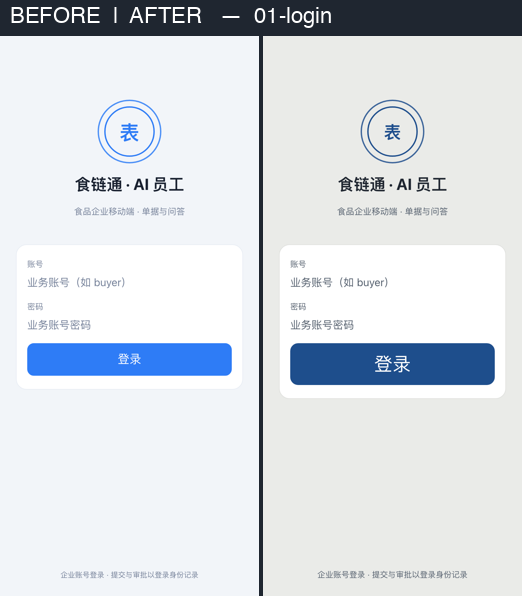 | 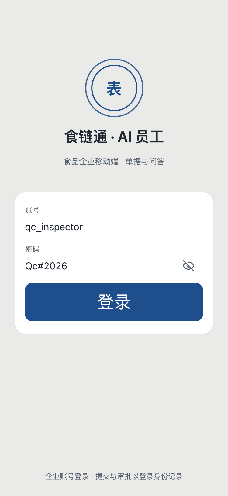 |

- 初期密码框无显示切换（`LoginView.tsx` 无 eye 钮）；成品输入右侧新增 eye 图标钮，命中 44px，`aria-label` 显示密码/隐藏密码。
- 布局、品牌蓝、卡片形态不变——同语言下的交互补强。
- 明轨说明：W8 成品仅拍了亮轨登录；v7 暗轨登录（`w7-m3-01-dark-login.png`）本轮无对应重拍角度。

### 2. home 亮轨 — 快捷 chips 7→4（B2）

| 初期 v7（W7 终验） | 成品 v8（B2，375px） |
|---|---|
| 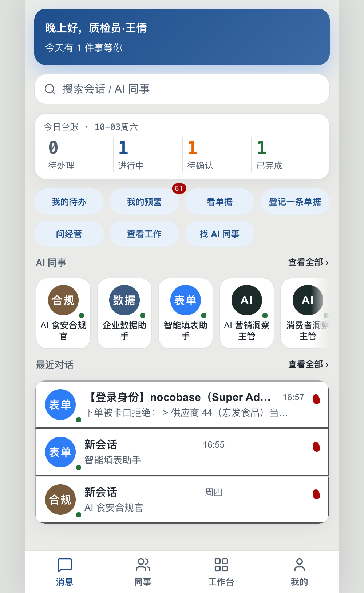 | 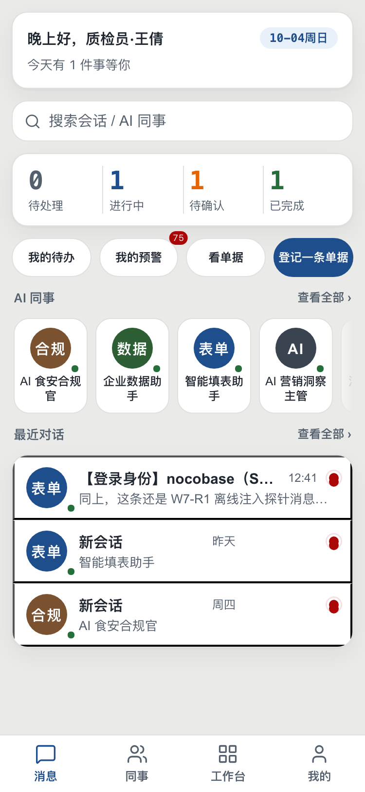 |

- 初期快捷 chips 两行共 7 枚（我的待办 / 我的预警(81) / 看单据 / 登记一条单据 / 问经营 / 查看工作 / 找 AI 同事）；成品收敛为单行 4 枚（我的待办 / 我的预警 / 看单据 / 登记一条单据，唯一 primary）。
- 裁掉的「查看工作 = work Tab」「找 AI 同事 = agents Tab 与同事 rail」「问经营 = rail 首卡」均与屏上既有入口重复。
- 终验 375px 重拍：`vfy-w8-01-home-375-light.png`（结构一致）。

### 3. chat 聊天流 — ChatView 拆分后零视觉回归（B2）

| 初期 v7（W7 终验） | 成品 v8（B2 拆分后，375px） |
|---|---|
| 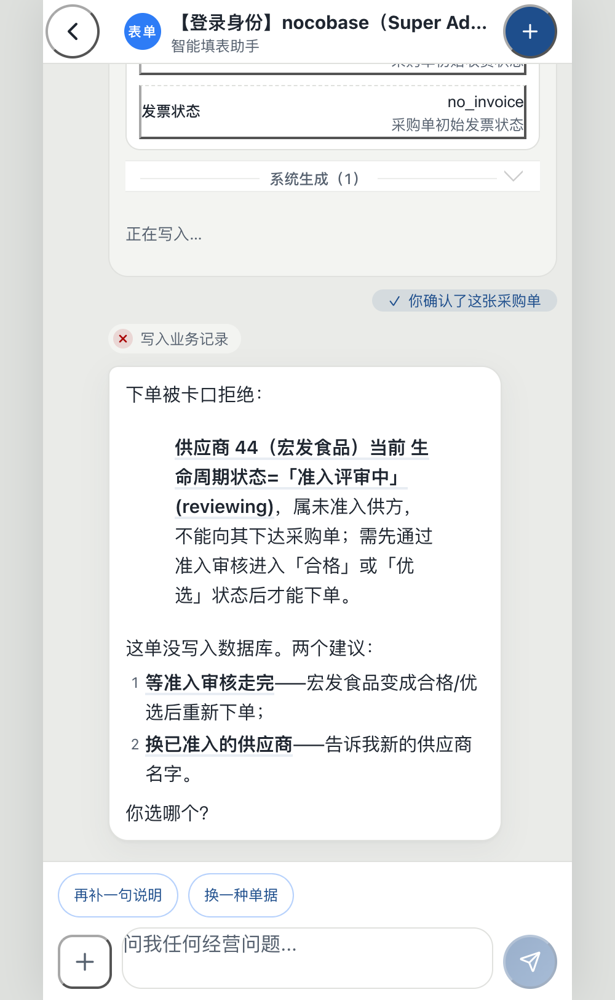 | 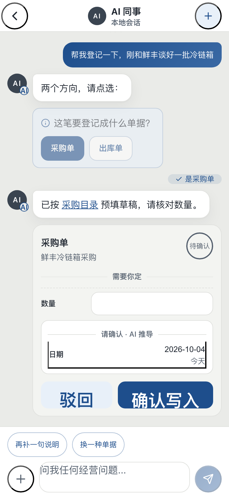 |

- 初期 `ChatView.tsx` 单体约 1000 行（折叠渲染、composer、快捷面板、审批回读、发送通道同住）；成品拆入 `messages/chat/` 9 个单元（FlowItem / QuickPanel / Composer / chips / useApprovalReadback / useDemoTyping / useDraftValues / confirm / meta），`ChatView.tsx` 降至 389 行、保留编排职责（B3 接增量轮询后为 412 行）。
- 气泡、卡片、composer、快捷面板的视觉与交互不变——拆分是结构工程，不是重画。

### 4. alerts — 平铺 → 相邻同规则聚合组卡（B2，最大结构变化）

| 初期 v7（M2 亮轨） | 成品 v8（B2 折叠态，375px） |
|---|---|
| 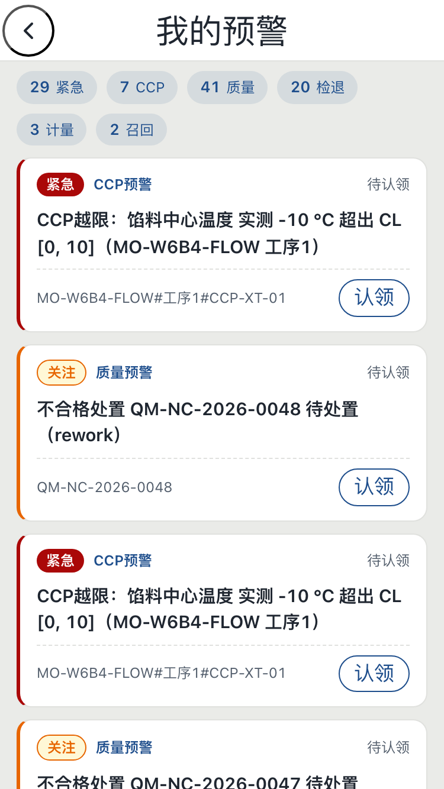 | 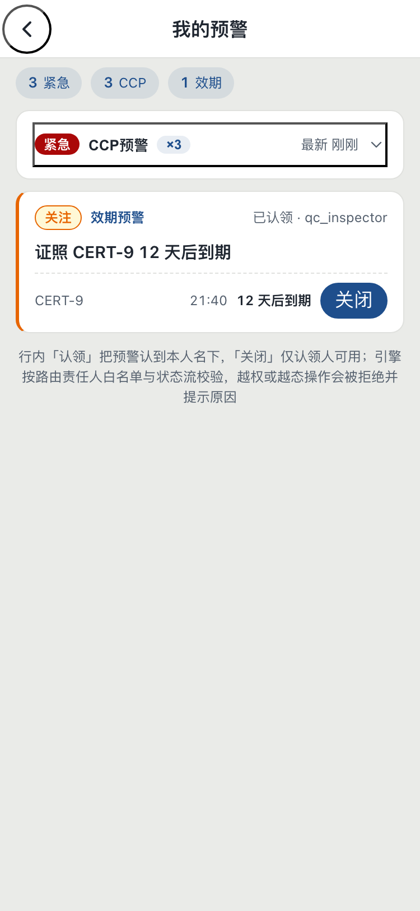 |

- 初期同规则同标题的 CCP 预警逐条平铺（同一条「CCP 越限：馅料中心温度」出现多张全高卡），且全列表无时间戳。
- 成品相邻仍开放未认领、同 `ruleType`+`title` 行折进一张组卡：组头 = 严重度封条 + 规则名 + ×计数徽标 + 最新时间；3 条 CCP 合并为一组，默认折叠。
- 展开态见 `w8-b2-05-alerts-group-expanded-light.png`（明细行保留 `data-testid="alert-row"`，W6 验收脚本锚点不动）。
- 预警时间戳列：B2 先做机会主义读取，B3 落地 `wfl_alerts.created_at` 真实列（`timestamptz NOT NULL DEFAULT now()`，存量回填），时间从此渲染真实数据。
- 暗轨同页对照：初期 `w7-m3-11-dark-alerts.png` vs 成品终验 `vfy-w8-09-alerts-390x844-dark.png`。

### 5. todos — 时间戳与空态（B2/B3 + R1）

| 初期 v7（M2 亮轨，有数据） | 成品 v8（终验暗轨空态，375px） |
|---|---|
| 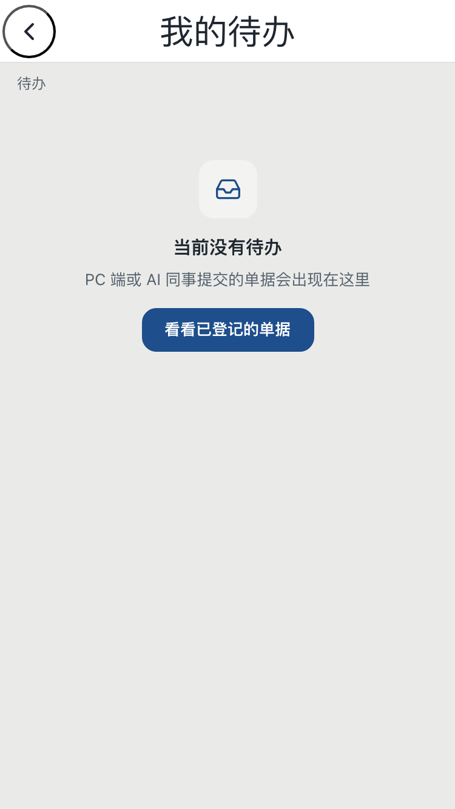 | 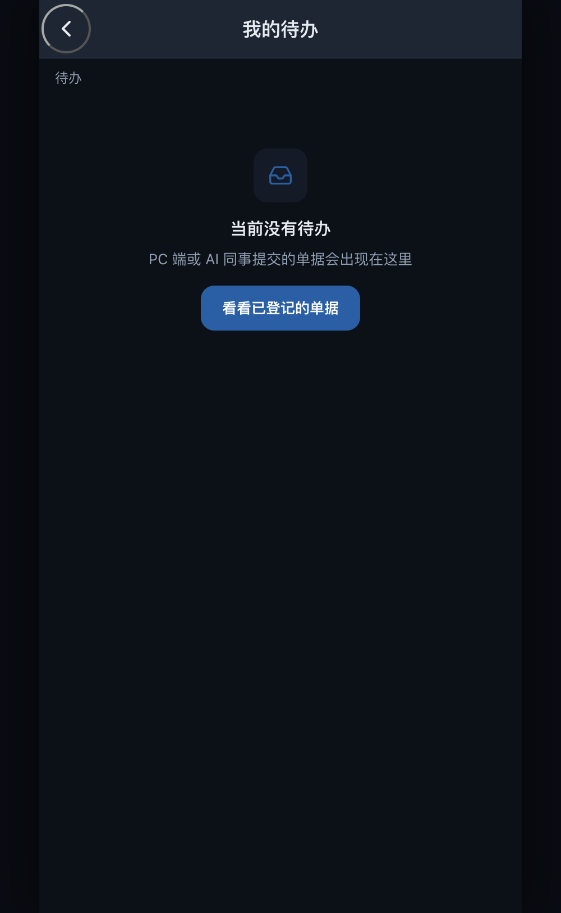 |

- 本组明暗轨不一致（终验仅拍暗轨空态角度）；同暗轨、有数据的初期参照为 `w7-m3-09-dark-todos.png`。
- 页面框架（PageNav / 筛选 / 行卡 / PullToRefresh）沿用 v7；W8 变化在数据面：行内链接走 `--dshm-link`（暗轨 4.5:1）、refresh 以 `useCallback` 钉住（R1 无限 refetch 修复）、页面空态由 EmptyState 组件承载。

### 6. home 暗轨 / me 暗轨 — 双轨语义保持（B1）

| 页面 | 初期 v7 | 成品 v8 |
|---|---|---|
| home 暗 | 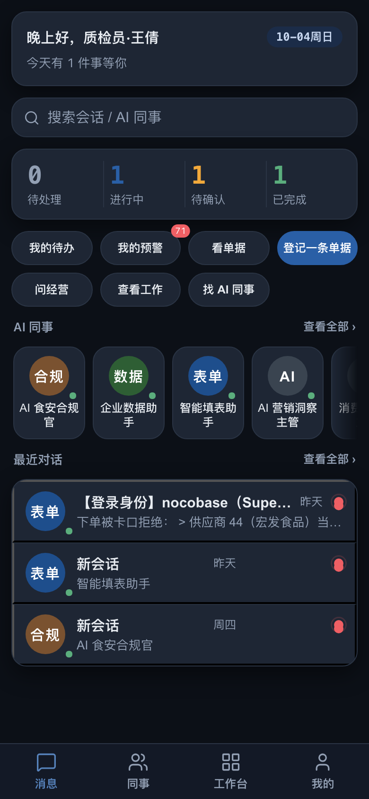 | 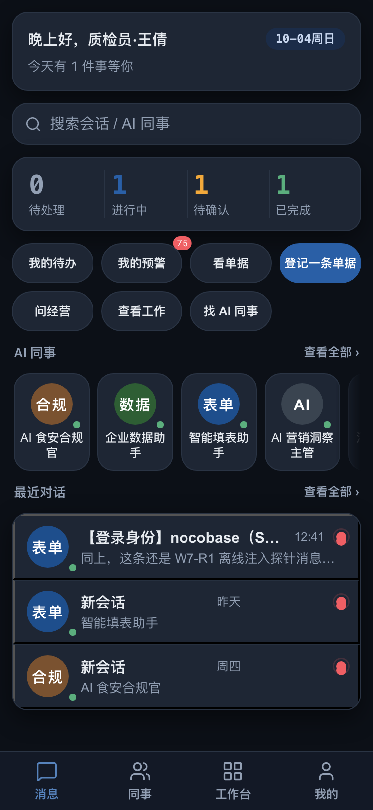 |
| me 暗 | 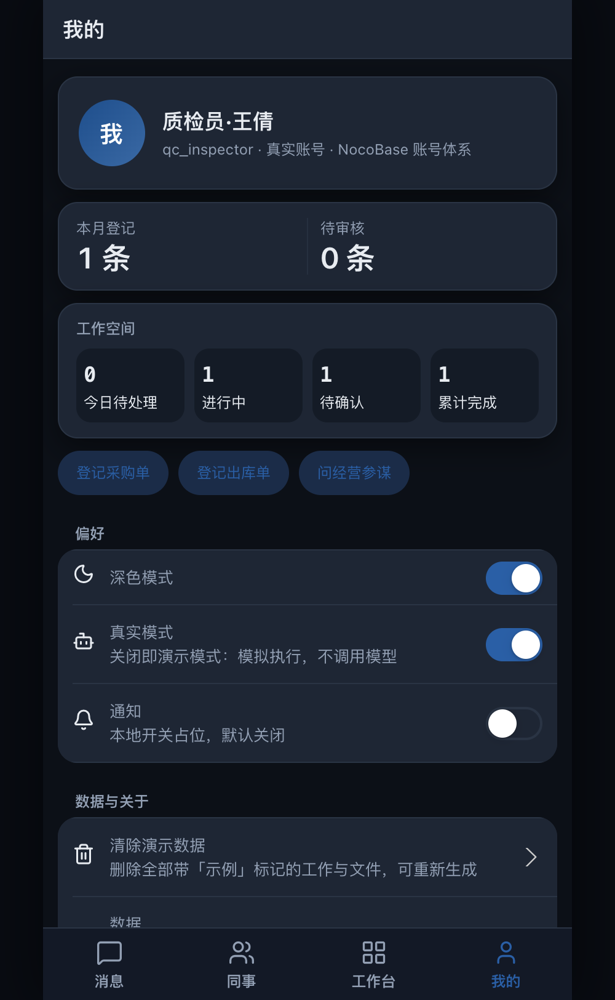 | 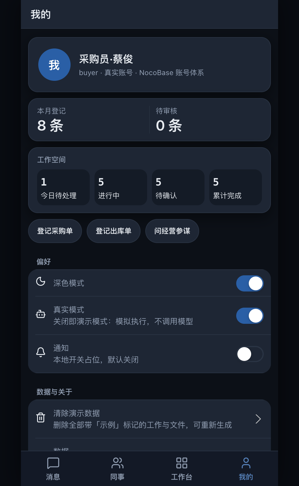 |

- 暗轨画布/卡面/去饱和语义五态完全延续 W7；W8 在暗轨的增量是肉眼可辨程度最低、但门槛可测的一类：正文文字链接由 `#2A5FA6`（对卡 2.38:1）换 `--dshm-link #7B9DD1`（≥4.5:1，33 处纯文字可点项），表单输入底由卡同色分化为 `--dshm-input-bg #141b26`。
- 暗轨七门槛（w7-b6 矩阵）在 W8 三批次后复跑零回退。

### 7. 375px 细节 — tabbar 键盘焦点环（R2，初期无此能力）

| 成品 R2 修复证据（375px） | 成品终验重拍（375px） |
|---|---|
| 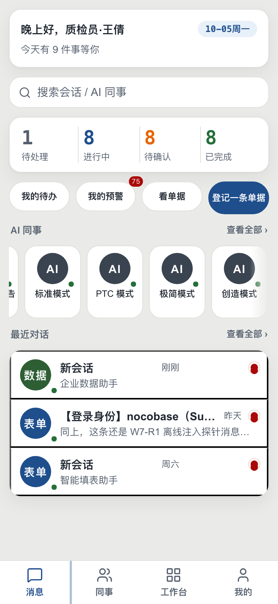 | 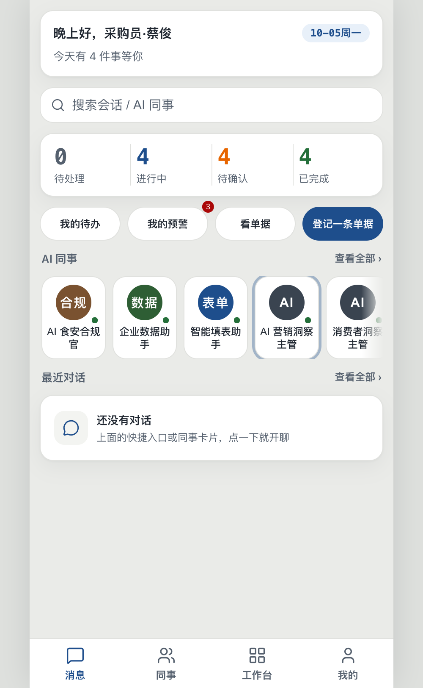 |

- 初期无对应截图能力：v7 构建的 tabbar 项不可聚焦，验证者实测连按 11 次 Tab 焦点始终到不了 tabbar（证据转述于 `.shoot-w8r2.mjs` 头注）；初期首页（组 2 左图）即该无焦点环状态。
- R2 为四个 tab 项补 `role=tab` / `tabindex` / `aria-selected` 与 Enter/Space 激活（WCAG 2.1.1）；上左图为真实 Tab 步进落上 tab 项后的焦点环（computed style 断言），上右图为终验重拍。
- 终验探针实测：从 body 起 49 次 Tab 到达 tabbar（tabbar 位于焦点序末位，可达性由 0 变为确定可达）。
- 同批触控修复：`w8-r2-02-touch-fixed-375.png`（primary chip 44px、三枚中性 chip 40px）。

### 8. 工作漫游 — workStore 从设备级到服务端投影（B3，W8 新能力，初期无对应概念）

| 初期 v7（M1 work 页） | 成品 v8（清 localStorage 后回灌存活，375px） |
|---|---|
| 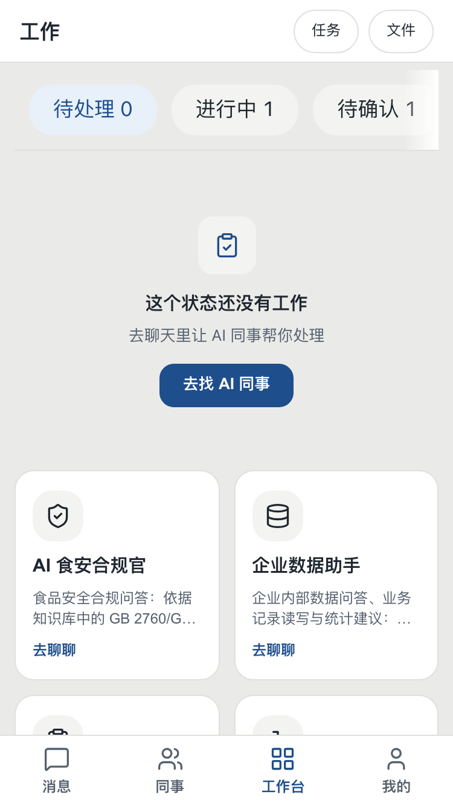 | 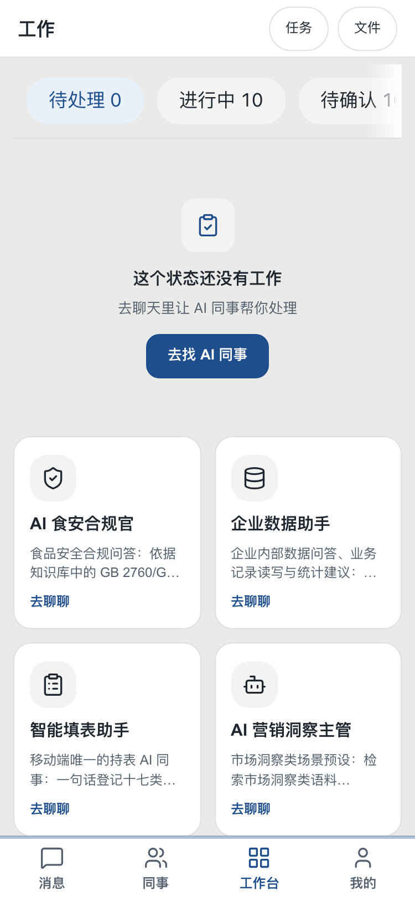 |

- 初期工作项只活在 `dsh-mobile-work` localStorage：换设备、清浏览器数据即丢失，无任何服务端可恢复来源。
- 成品工作项写穿 NocoBase `wfl_mobile_work` 投影表（每账号每 `client_id` 一行，`(user, client_id)` 唯一索引）：上右图为「写 → 清空 localStorage → 重登」后工作项自服务端回灌存活的活体证据（探针 `items=30`）。
- 跨账号隔离：`w8-b3-03-keeper-isolated-375.png`（keeper 账号看不到 buyer 任何行，探针 `leak=0`）。

## 数字对比

| 维度 | 初期（v7） | 成品（v8） | 证据 |
|---|---|---|---|
| 次级触控目标 | 36px（`--dshm-touch-sm`，15 处） | 40px（主路径 44px） | `w8-b1-light-probe.json`（touchSmPx 40 / searchBarPx 44）；`.shoot-w8r2.mjs` Leg B |
| ChatView 单体行数 | ~1000 行 | 389 行（拆出 `chat/` 9 单元；B3 接游标后 412 行、10 单元） | W8-B2 Agent Note `wc -l` 记录 |
| home 快捷 chips | 7 枚（两行） | 4 枚（单行，唯一 primary） | 组 2 两图；B2 Note |
| 轮询响应负载（running 会话） | 全量窗口 ~267KB/轮 | 游标增量 ≤31KB（约 12%） | `w8-b3-probe.log`（full≈267072B cursor≤30727B ratio=12%） |
| ui-mobile 用例数 | 671（W8 开工基线） | 681（串行 681/681） | commit `b0802a53e1` 测试口径行 |
| 暗轨纯文字链接对比度 | 2.38:1（`#2A5FA6` 对卡，33 处） | ≥4.5:1（`#7B9DD1`） | tokens.css `--dshm-link`；`w8-b1-light-probe.json` linkVsCard 门槛 |
| tabbar 键盘可达 | 0（11 次 Tab 内不可达） | 49 次 Tab 从 body 到达 | `.shoot-w8r2.mjs` 头注 + Leg A 断言；`vfy-w8-02` 终验 |
| alerts/todos 网关请求 | identity 闭包无限 refetch 风暴 | 稳态按周期轮询（10s/轮量级） | commit 信息 R1 行；`AlertsView.tsx:105` / `TodosView.tsx:37` refresh `useCallback` |
| 工作项存储 | localStorage（设备级，清缓存即丢） | `wfl_mobile_work` 服务端投影，随账号漫游 | `w8-b3-probe.log` 第 5–8 行；`examples/kb-agent/scripts/w8b3-mobile-work.mts` |

## 无法以截图呈现的变化

| 变化 | 一句话事实 | 证据 |
|---|---|---|
| 增量轮询协议 | `session.history` 增 `afterSeq` 游标（与 `beforeSeq` 互斥，schema 强制），客户端累积窗口按 seq 去重，单页 >40 事件或累计 30 轮强制重校准全量 | `packages/host/apiproxy/src/api/sessions.schema.ts`；`tests/session-history-after-seq.spec.ts`；`messages/chat/historyFeed.ts` |
| outbox 退避补投 | 工作写操作进 `dsh-mobile-work-outbox` 持久队列，按 id 合并、串行 drain、失败退避重试，重登即 `kickOutboxFlush()` | `packages/client/ui-mobile/src/client/workSync.ts`；`tests/work-sync.client.spec.ts` |
| token 过期保数据 | 网关 `nocobase-unauthorized` 路由 `handleSessionExpired()`：清 token、回登录门，工作项/草稿/outbox 全保留；登出清 outbox、过期刻意不清 | `w8-b3-probe.log` 第 9–11 行；`w8-b3-04-expiry-relogin-375.png` |
| 跨账号隔离 | 投影读走网关行级 scope（派生用户名压入行过滤，匿名拒绝），写走 `mobileWorkSave`/`mobileWorkDelete` 专用入口强制归属，keeper 对 buyer 泄漏 0 | `w8-b3-03-keeper-isolated-375.png`；`packages/host/apiproxy/tests/nocobase-mobile-work.spec.ts` |
| focus-visible 全局环 | `.dshm-root :focus-visible` 以 box-shadow 画双轨光环（贴合控件圆角，pointer 交互不触发），全库此前零 `:focus-visible` 规则 | `tokens.css` `--dshm-focus-ring`；`w8-b1-light-probe.json` focusRuleFound；`vfy-w8-02` |
| reduced-motion 降级 | W8 新增动效面（快捷面板 220ms 开向过渡、chips 按压等）全部继承 W7 既有的 `prefers-reduced-motion` 0.01ms 降级通道（该通道本身是 W7 成果） | `packages/client/ui-mobile/src/client/shell/transitions.css` |
| Tab 常驻保状态 | 四 Tab 页 `[hidden]` 常驻互切，滚动位置/筛选/输入半稿不再随 remount 损毁；隐藏页挂起轮询，复见原地复读不闪骨架 | `w8-b1-02-home-light.png` vs `w8-b1-04-home-restored-light.png`（Tab 往返后复位）；`hooks.client.spec.tsx` |
| 输入 16px 地板与去点击延迟 | 一切 `input`/`textarea` 持 `font-size: max(16px, 1em)` 防 iOS 聚焦自动缩放；`touch-action: manipulation` 去 300ms 双击缩放延迟 | `w8-b1-light-probe.json`（inputFloorPx 16）；`tokens.css` 全局规则 |

## 附录：登录页三代演进（归属标注）

| v6（2026-09-24，`#2E7CF6` 时代） | v7「W7 铸造」（2026-10-03） | v8 = W8 成品 |
|---|---|---|
| 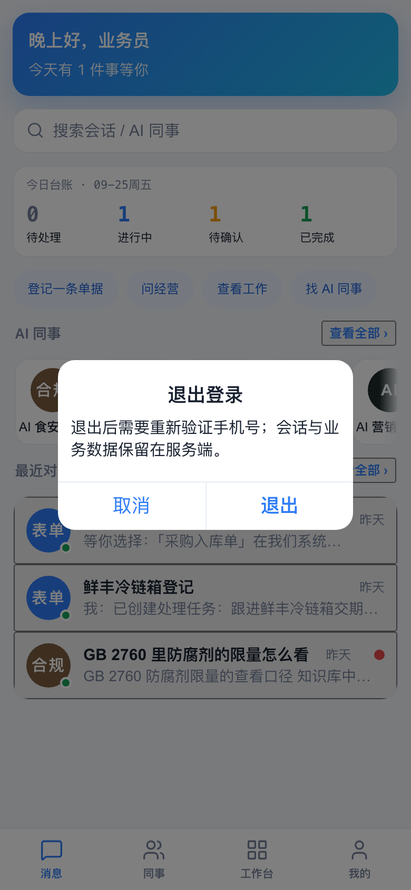 |  |  |

- v6 → v7 的品牌蓝、卡片形态与文案体系跃迁属 **W7**（普鲁士蓝换装）；v7 → v8 仅有 eye 切换与底层 token 补强，属 **W8**。
- v6 素材仅在此附录出现，不参与上文任何 W8 成果主张。
